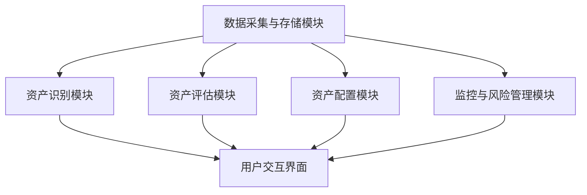
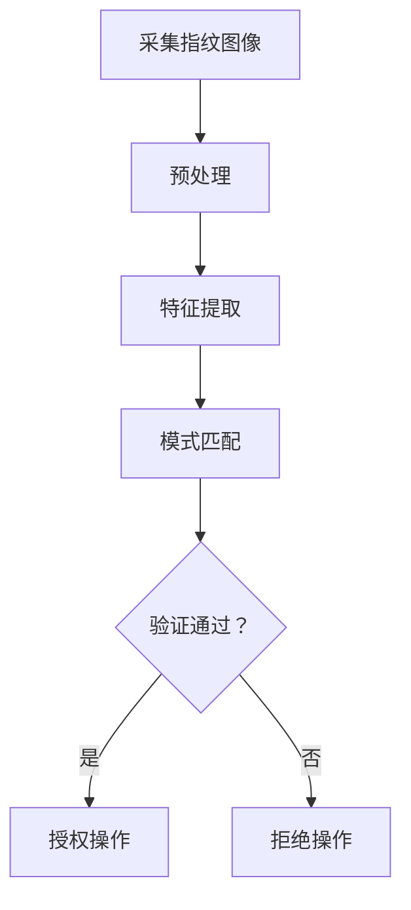
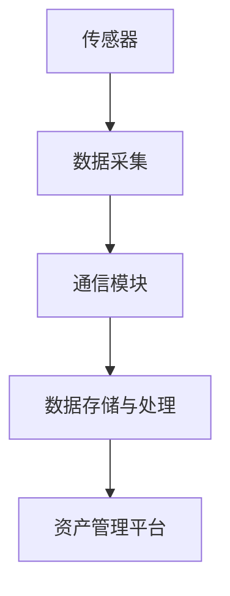
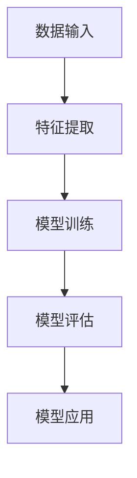
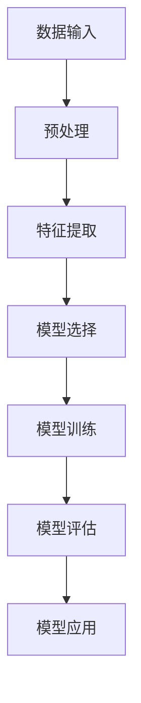
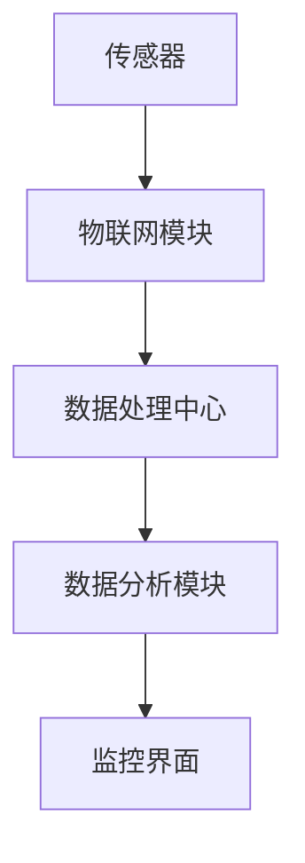
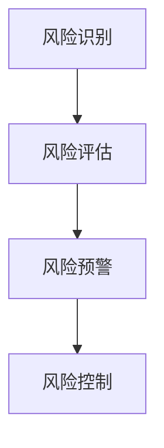
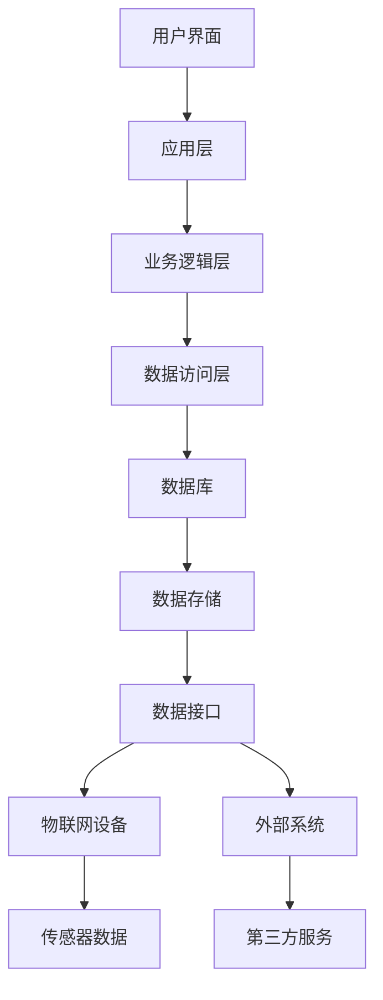

                 

### 智能资产管理平台：AI优化资源配置

> 关键词：智能资产管理、AI优化、资源配置、平台架构、技术应用

> 摘要：本文将深入探讨智能资产管理平台的概念及其在资源配置中的重要性。我们将逐步分析智能资产管理平台的发展背景、核心技术、应用场景和未来展望。通过实际案例和系统架构设计，本文旨在为读者提供一个全面且直观的智能资产管理解决方案。

### 目录大纲

----------------------------------------------------------------

# 第一部分: 资产管理概述

## 第1章: 智能资产管理平台概述

### 1.1 资产管理的基本概念

### 1.2 智能资产管理的背景与意义

### 1.3 智能资产管理的发展趋势

### 1.4 智能资产管理平台的架构设计

## 第2章: 智能资产识别技术

### 2.1 生物识别技术

### 2.2 物联网技术

### 2.3 数据挖掘与机器学习技术

### 2.4 智能识别算法

## 第3章: 智能资产评估方法

### 3.1 基于大数据的资产评估

### 3.2 基于人工智能的资产评估

### 3.3 智能资产评估案例分析

## 第4章: 智能资产配置策略

### 4.1 资产配置的基本原则

### 4.2 智能资产配置策略设计

### 4.3 智能资产配置案例研究

## 第5章: 智能资产监控与风险管理

### 5.1 智能资产监控技术

### 5.2 智能风险管理方法

### 5.3 智能资产监控与风险管理案例分析

## 第6章: 智能资产管理平台开发实战

### 6.1 平台架构设计

### 6.2 核心模块实现

### 6.3 系统部署与维护

### 6.4 项目总结与展望

## 第7章: 智能资产管理行业应用与发展

### 7.1 金融行业应用

### 7.2 电商行业应用

### 7.3 制造行业应用

### 7.4 智能资产管理行业发展趋势

## 第8章: 未来展望与挑战

### 8.1 智能资产管理平台的发展方向

### 8.2 智能资产管理面临的挑战

### 8.3 应对策略与建议

----------------------------------------------------------------

#### 第1章: 智能资产管理平台概述

#### 1.1 资产管理的基本概念

资产管理是指通过有效的规划、组织、监控和评估，确保组织内的各种资产得到充分利用和最大化价值的过程。资产可以包括有形资产（如设备、房产、库存）和无形资产（如知识产权、品牌、客户关系）。

资产管理的主要目标包括：

1. 提高资产利用率：确保资产在使用过程中不被闲置，实现最大化收益。
2. 优化资源配置：通过合理配置资产，实现资源的最优利用。
3. 降低运营成本：通过有效的资产管理，减少不必要的开支。
4. 风险管理：识别和缓解资产可能面临的风险，保障组织的稳定运营。

随着信息技术的发展，资产管理逐渐从传统的手工管理转向智能化管理，这为优化资源配置提供了新的可能性。

#### 1.2 智能资产管理的背景与意义

智能资产管理平台的出现，源于以下几个背景因素：

1. 数据爆炸：大数据的涌现为资产管理提供了丰富的数据支持，使得资产配置和优化更加精细和科学。
2. 人工智能技术：机器学习、深度学习等人工智能技术的发展，为资产识别、评估、配置和监控提供了强大的技术支持。
3. 企业数字化转型：越来越多的企业意识到数字化转型的重要性，资产管理作为其中的一部分，也迫切需要智能化转型。

智能资产管理的意义在于：

1. 提升决策效率：通过智能化的数据分析，管理者可以快速获取资产运行状态和潜在问题，做出更准确的决策。
2. 优化资源配置：利用人工智能技术，可以精准预测资产需求和供应，实现资源的最优配置。
3. 降低运营成本：智能资产管理可以减少人为错误，提高工作效率，从而降低运营成本。
4. 提高风险管理能力：智能资产管理平台能够实时监控资产运行状态，及时发现潜在风险，采取相应的风险控制措施。

#### 1.3 智能资产管理的发展趋势

随着技术的不断进步，智能资产管理呈现出以下几个发展趋势：

1. 人工智能技术的深度融合：未来智能资产管理平台将更加依赖人工智能技术，如机器学习、深度学习等，实现更加精准的资产识别、评估和配置。
2. 数据驱动决策：大数据和数据分析将成为智能资产管理的核心，通过数据驱动决策，实现资源的最优化配置。
3. 云计算和边缘计算的结合：智能资产管理平台将充分利用云计算和边缘计算的优势，实现数据的实时处理和响应。
4. 网络安全的重要性：随着智能资产管理平台的数据量不断增加，网络安全将成为一个重要的关注点，确保数据的安全和隐私。

#### 1.4 智能资产管理平台的架构设计

一个典型的智能资产管理平台通常包括以下几个关键模块：

1. **数据采集与存储模块**：负责收集来自各种渠道的资产数据，并将其存储到数据库中，为后续分析提供数据基础。
2. **资产识别模块**：利用生物识别、物联网等技术，实现对资产的自动识别和分类。
3. **资产评估模块**：基于大数据和人工智能技术，对资产进行综合评估，提供资产价值的准确估计。
4. **资产配置模块**：根据资产评估结果和业务需求，制定最优的资产配置策略，实现资源的最优利用。
5. **监控与风险管理模块**：实时监控资产运行状态，发现潜在风险，并采取相应的风险控制措施。
6. **用户交互界面**：提供友好的用户界面，方便用户查看资产状态、执行操作和获取分析报告。

下面是一个简单的智能资产管理平台的架构图：

通过这个架构，智能资产管理平台可以实现资产从识别、评估到配置、监控的闭环管理，为企业提供高效、智能的资产管理解决方案。

### 第2章: 智能资产识别技术

#### 2.1 生物识别技术

生物识别技术是一种通过分析生物特征来识别个体的技术，常见的生物特征包括指纹、虹膜、人脸、声音和指纹等。生物识别技术具有高精度、高安全性和非接触式操作等优点，被广泛应用于智能资产管理中。

**指纹识别**：指纹识别是通过分析指纹纹理特征来进行身份验证的一种技术。其核心算法包括特征提取和模式匹配。特征提取是将指纹图像转换为数字特征向量，模式匹配则是将提取的特征向量与数据库中的指纹模板进行比对。

**虹膜识别**：虹膜识别是通过分析眼睛虹膜的纹理特征来进行身份验证的技术。虹膜具有高度独特性和稳定性，因此虹膜识别在安全性要求较高的领域（如金融、安全）得到广泛应用。

**人脸识别**：人脸识别是通过分析人脸的几何特征和纹理特征来进行身份验证的技术。随着深度学习技术的发展，人脸识别的准确性和实时性得到了显著提升，被广泛应用于门禁系统、安防监控和智能资产管理等领域。

**声音识别**：声音识别是通过分析声音的频谱特征和时域特征来进行身份验证的技术。与生物识别其他技术相比，声音识别具有低成本、便携性和非侵入性等优点，但在环境噪声较大的场景中效果较差。

**指纹识别算法**流程图：

#### 2.2 物联网技术

物联网技术是一种通过传感器和通信技术将物理世界与数字世界连接起来的技术。在智能资产管理中，物联网技术主要用于实时监测和管理资产。

**传感器技术**：传感器是物联网技术的核心组件，用于感知和采集物理世界的各种信号。常见的传感器包括温度传感器、湿度传感器、位移传感器、压力传感器等。传感器技术可以实时监测资产的运行状态和环境条件，为资产管理提供数据支持。

**通信技术**：通信技术是物联网技术的另一个关键组成部分，用于实现传感器与中心处理单元之间的数据传输。常见的通信技术包括无线传感网络（WSN）、无线通信（如WiFi、蓝牙、LoRa等）和有线通信（如光纤、以太网等）。物联网通信技术需要具备低功耗、高带宽、低延迟等优点，以满足智能资产管理平台对实时性的要求。

**物联网技术在资产管理中的应用**：

1. **实时监控**：通过物联网技术，可以实现资产运行状态的实时监控，及时发现异常情况，确保资产安全运行。
2. **远程管理**：物联网技术使得资产管理者可以远程控制和管理资产，提高了管理的灵活性和效率。
3. **数据采集**：物联网技术可以自动采集资产的各种数据，如运行参数、使用情况等，为资产管理提供丰富的数据支持。

**物联网技术架构图**：

#### 2.3 数据挖掘与机器学习技术

数据挖掘和机器学习技术是智能资产管理平台的核心技术，用于从大量数据中提取有价值的信息，支持资产识别、评估和配置。

**数据挖掘**：数据挖掘是一种通过分析大量数据，发现隐藏在数据中的规律和模式的技术。在智能资产管理中，数据挖掘主要用于分析资产的历史数据，提取资产的价值信息。常见的数据挖掘技术包括聚类分析、关联规则挖掘、分类和预测等。

**机器学习**：机器学习是一种通过计算机模拟人类学习过程，使计算机具备自主学习和决策能力的技术。在智能资产管理中，机器学习主要用于实现资产的自动识别、评估和配置。常见的机器学习算法包括线性回归、决策树、支持向量机、神经网络等。

**数据挖掘与机器学习在资产管理中的应用**：

1. **资产识别**：利用机器学习算法，可以从大量的图像、声音和传感器数据中自动识别资产，提高了识别的准确性和效率。
2. **资产评估**：通过数据挖掘技术，可以从资产的历史数据中提取有价值的信息，对资产的价值进行准确评估。
3. **资产配置**：基于机器学习算法，可以实现自动化的资产配置，优化资源利用，降低运营成本。

**机器学习算法流程图**：

#### 2.4 智能识别算法

智能识别算法是智能资产管理平台的重要组成部分，用于实现资产的自动识别和分类。智能识别算法可以分为以下几类：

1. **模式识别算法**：模式识别算法是一种通过分析样本数据，将新样本分类到已知类别中的技术。常见的模式识别算法包括支持向量机（SVM）、神经网络（NN）和决策树等。

2. **聚类算法**：聚类算法是一种将数据分为若干个簇的算法，每个簇内的数据彼此相似，而簇与簇之间的数据差异较大。常见的聚类算法包括K-均值聚类、层次聚类和DBSCAN等。

3. **关联规则算法**：关联规则算法是一种用于发现数据之间关联性的算法。常见的关联规则算法包括Apriori算法和FP-Growth算法。

4. **分类算法**：分类算法是一种将数据分为多个类别中的某一个的技术。常见的分类算法包括逻辑回归、决策树和随机森林等。

**智能识别算法流程图**：

通过上述智能识别算法，智能资产管理平台可以实现对资产的自动识别和分类，提高资产管理效率和准确性。

### 第3章: 智能资产评估方法

#### 3.1 基于大数据的资产评估

随着大数据技术的不断发展，基于大数据的资产评估方法在智能资产管理中发挥着越来越重要的作用。大数据技术能够处理和分析海量数据，从而提供更准确、更全面的资产评估结果。

**大数据技术的基本原理**：

1. **数据采集**：通过传感器、物联网设备、社交媒体等多种渠道，收集海量的资产数据，包括运行状态、使用情况、环境条件等。

2. **数据存储**：采用分布式存储技术（如Hadoop、NoSQL数据库等），存储和管理海量数据，确保数据的可靠性和可扩展性。

3. **数据处理**：利用大数据处理技术（如MapReduce、Spark等），对海量数据进行清洗、转换和分析，提取有价值的信息。

4. **数据可视化**：通过数据可视化技术，将分析结果以图表、报表等形式展示，方便管理者进行决策。

**基于大数据的资产评估流程**：

1. **数据收集**：收集与资产相关的各种数据，包括历史数据、实时数据和外部数据。

2. **数据预处理**：对收集到的数据进行清洗、去噪、格式转换等预处理操作，确保数据的质量和一致性。

3. **数据建模**：利用大数据分析技术，建立资产评估模型，如回归模型、决策树模型、神经网络模型等。

4. **模型训练与优化**：使用历史数据对评估模型进行训练，并根据评估效果进行模型优化。

5. **资产评估**：利用训练好的模型，对资产进行评估，提供资产价值的预测。

6. **评估结果分析**：对评估结果进行分析和可视化，发现资产价值的分布规律和潜在问题。

**基于大数据的资产评估优势**：

1. **全面性**：大数据技术能够处理和分析各种类型的资产数据，提供更全面的资产评估结果。

2. **准确性**：通过大数据分析技术，可以挖掘出资产价值中的潜在信息，提高评估的准确性。

3. **实时性**：大数据技术可以实现实时数据采集和处理，提供即时的资产评估结果。

#### 3.2 基于人工智能的资产评估

人工智能技术在资产评估中的应用，为智能资产管理带来了新的可能性。基于人工智能的资产评估方法，可以通过模拟人类思维过程，实现对资产价值的高效评估。

**人工智能技术的基本原理**：

1. **机器学习**：机器学习是一种通过训练模型，使计算机具备自主学习和决策能力的技术。常见的机器学习算法包括线性回归、决策树、支持向量机、神经网络等。

2. **深度学习**：深度学习是一种基于多层神经网络的人工智能技术，可以自动提取数据中的特征，实现复杂的模式识别和预测。

3. **强化学习**：强化学习是一种通过试错和反馈，使计算机在特定环境中实现最优策略的技术。

**基于人工智能的资产评估流程**：

1. **数据收集**：收集与资产相关的各种数据，包括历史数据、实时数据和外部数据。

2. **数据预处理**：对收集到的数据进行清洗、去噪、格式转换等预处理操作，确保数据的质量和一致性。

3. **特征提取**：利用机器学习和深度学习技术，从原始数据中提取与资产价值相关的特征。

4. **模型训练**：使用提取的特征数据，训练资产评估模型，如神经网络模型、决策树模型等。

5. **模型优化**：根据评估效果，对模型进行优化，提高评估的准确性和实时性。

6. **资产评估**：利用训练好的模型，对资产进行评估，提供资产价值的预测。

7. **评估结果分析**：对评估结果进行分析和可视化，发现资产价值的分布规律和潜在问题。

**基于人工智能的资产评估优势**：

1. **高效性**：人工智能技术可以高效地处理和分析海量数据，实现快速、准确的资产评估。

2. **灵活性**：通过机器学习和深度学习技术，可以自动提取数据中的特征，适应不同类型的资产评估需求。

3. **智能化**：人工智能技术可以使资产评估过程更加智能化，降低人为干预，提高评估的客观性和准确性。

#### 3.3 智能资产评估案例分析

**案例一：智能家居资产评估**

智能家居是智能资产管理的重要应用领域。以下是一个智能家居资产评估的案例分析。

1. **数据收集**：收集智能家居设备的运行数据，包括温度、湿度、光照、能耗等。

2. **数据预处理**：对收集到的数据进行清洗和格式转换，确保数据的质量和一致性。

3. **特征提取**：利用机器学习和深度学习技术，提取与智能家居设备价值相关的特征，如设备使用频率、设备故障率、设备能耗等。

4. **模型训练**：使用提取的特征数据，训练资产评估模型，如神经网络模型、决策树模型等。

5. **模型优化**：根据评估效果，对模型进行优化，提高评估的准确性和实时性。

6. **资产评估**：利用训练好的模型，对智能家居设备进行评估，提供设备价值的预测。

7. **评估结果分析**：对评估结果进行分析和可视化，发现设备价值的分布规律和潜在问题。

通过这个案例，可以看出智能资产评估方法在智能家居领域的应用效果显著，有助于提高设备管理效率和降低运营成本。

**案例二：企业固定资产评估**

企业固定资产评估是智能资产管理的重要应用领域。以下是一个企业固定资产评估的案例分析。

1. **数据收集**：收集企业固定资产的运行数据，包括设备使用状况、设备维修记录、设备折旧等。

2. **数据预处理**：对收集到的数据进行清洗和格式转换，确保数据的质量和一致性。

3. **特征提取**：利用机器学习和深度学习技术，提取与固定资产价值相关的特征，如设备使用年限、设备维修频率、设备更新换代周期等。

4. **模型训练**：使用提取的特征数据，训练资产评估模型，如神经网络模型、决策树模型等。

5. **模型优化**：根据评估效果，对模型进行优化，提高评估的准确性和实时性。

6. **资产评估**：利用训练好的模型，对企业固定资产进行评估，提供设备价值的预测。

7. **评估结果分析**：对评估结果进行分析和可视化，发现设备价值的分布规律和潜在问题。

通过这个案例，可以看出智能资产评估方法在企业固定资产管理中的应用效果显著，有助于提高资产利用率和降低运营成本。

### 第4章: 智能资产配置策略

#### 4.1 资产配置的基本原则

资产配置策略是智能资产管理平台的核心功能之一，其目标是通过优化资产的分配，实现资源的最优利用和最大化收益。在制定资产配置策略时，需要遵循以下基本原则：

1. **目标明确**：首先需要明确资产配置的目标，如提高资产利用率、降低运营成本、提升服务水平等。目标明确有助于制定具体的配置策略。

2. **风险控制**：在资产配置过程中，需要充分考虑风险因素，制定相应的风险控制措施，确保资产安全。

3. **成本效益**：资产配置策略需要综合考虑成本和效益，实现成本效益最大化。在满足目标的前提下，应尽量降低成本。

4. **灵活性**：资产配置策略需要具备一定的灵活性，能够适应环境变化和业务需求的变化。

5. **可执行性**：资产配置策略需要具备可执行性，即在实际操作中能够顺利实施，产生预期的效果。

#### 4.2 智能资产配置策略设计

智能资产配置策略设计是一个复杂的过程，需要综合考虑多种因素。以下是智能资产配置策略设计的基本步骤：

1. **需求分析**：首先需要了解业务需求，包括资产的使用场景、使用频率、服务质量要求等。

2. **数据收集**：收集与资产相关的各种数据，如资产性能数据、使用数据、历史维护记录等。

3. **数据分析**：利用大数据和人工智能技术，对收集到的数据进行分析，提取与资产配置相关的信息。

4. **资产评估**：根据分析结果，对资产进行评估，确定资产的价值和使用效率。

5. **策略制定**：基于资产评估结果和业务需求，制定具体的资产配置策略。策略包括资产的分配、调度、维护等。

6. **策略优化**：根据实际运营情况，对资产配置策略进行持续优化，提高策略的有效性和适应性。

7. **策略实施**：将制定的资产配置策略付诸实施，确保资产得到有效利用。

#### 4.3 智能资产配置案例研究

**案例一：智能交通管理系统**

智能交通管理系统是智能资产配置的一个典型应用场景。以下是一个智能交通管理系统资产配置的案例分析。

1. **需求分析**：智能交通管理系统需要监控和管理各种交通设备，如摄像头、传感器、信号灯等。

2. **数据收集**：收集交通设备的运行数据，包括设备状态、运行效率、故障记录等。

3. **数据分析**：利用大数据和人工智能技术，对交通设备的数据进行分析，提取设备的使用情况和潜在问题。

4. **资产评估**：根据分析结果，对交通设备进行评估，确定设备的使用效率和性能。

5. **策略制定**：基于资产评估结果和交通管理需求，制定具体的资产配置策略，如设备的调度、维护等。

6. **策略优化**：根据实际运营情况，对资产配置策略进行持续优化，提高交通管理的效率和准确性。

7. **策略实施**：将制定的资产配置策略付诸实施，确保交通设备得到有效利用，提高交通管理效果。

通过这个案例，可以看出智能资产配置策略在智能交通管理系统中的应用效果显著，有助于提高交通管理效率和减少交通拥堵。

**案例二：智能仓储系统**

智能仓储系统是另一个典型的智能资产配置应用场景。以下是一个智能仓储系统资产配置的案例分析。

1. **需求分析**：智能仓储系统需要监控和管理各种仓储设备，如货架、叉车、搬运机器人等。

2. **数据收集**：收集仓储设备的运行数据，包括设备状态、使用频率、维护记录等。

3. **数据分析**：利用大数据和人工智能技术，对仓储设备的数据进行分析，提取设备的使用情况和潜在问题。

4. **资产评估**：根据分析结果，对仓储设备进行评估，确定设备的使用效率和性能。

5. **策略制定**：基于资产评估结果和仓储管理需求，制定具体的资产配置策略，如设备的调度、维护等。

6. **策略优化**：根据实际运营情况，对资产配置策略进行持续优化，提高仓储管理的效率和准确性。

7. **策略实施**：将制定的资产配置策略付诸实施，确保仓储设备得到有效利用，提高仓储管理效果。

通过这个案例，可以看出智能资产配置策略在智能仓储系统中的应用效果显著，有助于提高仓储效率和降低运营成本。

### 第5章: 智能资产监控与风险管理

#### 5.1 智能资产监控技术

智能资产监控技术是智能资产管理平台的重要组成部分，旨在实时监测资产的运行状态，发现潜在问题，保障资产的安全和高效运行。

**传感器技术**：传感器是资产监控的核心组件，可以监测资产的各种参数，如温度、湿度、压力、振动等。通过传感器技术，可以实现实时、精准的数据采集。

**物联网技术**：物联网技术可以将传感器与中心处理单元连接起来，实现资产的远程监控和管理。通过物联网技术，可以实现对资产的实时监控、数据分析和故障预警。

**云计算技术**：云计算技术可以为资产监控提供强大的计算和存储能力，实现对海量数据的实时处理和分析。通过云计算技术，可以实现资产的智能监控和远程管理。

**大数据分析技术**：大数据分析技术可以对资产监控数据进行深度分析，发现潜在的问题和趋势。通过大数据分析技术，可以实现资产的预测性维护和智能优化。

**智能监控技术架构图**：

通过上述智能监控技术，可以实现对资产的全方位、实时监控，确保资产的安全和高效运行。

#### 5.2 智能风险管理方法

智能资产管理平台需要具备强大的风险管理能力，以应对资产运行过程中可能出现的各种风险。智能风险管理方法主要包括以下几种：

**风险识别**：通过大数据分析和人工智能技术，对资产运行数据进行实时监控和分析，发现潜在的风险因素。

**风险评估**：基于风险识别的结果，对风险进行定量和定性评估，确定风险的大小和影响范围。

**风险预警**：当发现潜在风险时，及时发出预警，提醒管理者采取相应的风险控制措施。

**风险控制**：根据风险评估结果和预警信息，采取相应的风险控制措施，如调整资产配置、加强监控、增加安全防护等。

**智能风险管理流程图**：

通过智能风险管理方法，可以实现对资产风险的全面监控和有效控制，降低资产损失和运营风险。

#### 5.3 智能资产监控与风险管理案例分析

**案例一：智能电网系统**

智能电网系统是智能资产管理的一个重要应用领域。以下是一个智能电网系统智能监控与风险管理的案例分析。

1. **风险识别**：通过大数据分析和人工智能技术，实时监测电网设备的运行状态，识别潜在的故障风险。

2. **风险评估**：对识别出的风险因素进行定量和定性评估，确定风险的大小和影响范围。

3. **风险预警**：当发现潜在风险时，及时发出预警，提醒管理者采取相应的风险控制措施。

4. **风险控制**：根据风险评估结果和预警信息，采取相应的风险控制措施，如调整电网设备的运行策略、加强设备维护等。

5. **监控与优化**：利用物联网技术和云计算技术，实现对电网设备的实时监控和数据分析，优化电网运行效率，降低故障率。

通过这个案例，可以看出智能监控与风险管理方法在智能电网系统中的应用效果显著，有助于提高电网运行的安全性和可靠性。

**案例二：智能交通管理系统**

智能交通管理系统是另一个重要的智能资产管理应用领域。以下是一个智能交通管理系统智能监控与风险管理的案例分析。

1. **风险识别**：通过大数据分析和人工智能技术，实时监测交通设备的运行状态，识别潜在的故障风险。

2. **风险评估**：对识别出的风险因素进行定量和定性评估，确定风险的大小和影响范围。

3. **风险预警**：当发现潜在风险时，及时发出预警，提醒管理者采取相应的风险控制措施。

4. **风险控制**：根据风险评估结果和预警信息，采取相应的风险控制措施，如调整交通设备的运行策略、加强设备维护等。

5. **监控与优化**：利用物联网技术和云计算技术，实现对交通设备的实时监控和数据分析，优化交通管理效率，降低故障率。

通过这个案例，可以看出智能监控与风险管理方法在智能交通管理系统中的应用效果显著，有助于提高交通管理效率和减少交通拥堵。

### 第6章: 智能资产管理平台开发实战

#### 6.1 平台架构设计

智能资产管理平台的开发是一个复杂的过程，需要综合考虑需求分析、系统架构设计、模块划分、技术选型等多个方面。以下是一个智能资产管理平台的基本架构设计。

**系统架构设计图**：

**架构设计说明**：

1. **用户界面**：提供用户交互界面，方便用户进行资产管理操作，如资产查询、资产配置、监控与预警等。

2. **应用层**：负责处理用户请求，调用业务逻辑层和数据访问层的服务。

3. **业务逻辑层**：处理业务逻辑，包括资产识别、资产评估、资产配置、监控与风险管理等功能。

4. **数据访问层**：负责与数据库和数据存储进行交互，实现数据的读取、写入和更新。

5. **数据库**：存储与管理资产相关的数据，如资产基本信息、资产运行状态、监控数据等。

6. **数据存储**：用于存储大数据和长期数据，如历史数据、分析结果等。

7. **数据接口**：提供与物联网设备和外部系统交互的接口，实现数据的实时采集和共享。

8. **物联网设备**：负责实时采集资产运行数据，如传感器、RFID标签、摄像头等。

9. **外部系统**：包括第三方服务和其他系统集成，如财务系统、ERP系统等。

通过上述架构设计，可以实现对资产管理的全面覆盖和高效运作。

#### 6.2 核心模块实现

智能资产管理平台的核心模块主要包括资产识别、资产评估、资产配置、监控与风险管理等。以下分别介绍这些核心模块的实现方法。

**资产识别模块实现**

1. **需求分析**：分析资产识别的需求，确定识别的目标和需求。

2. **数据收集**：通过物联网设备收集资产运行数据，如传感器数据、摄像头图像等。

3. **数据预处理**：对收集到的数据进行清洗和预处理，去除噪声和异常值。

4. **特征提取**：利用机器学习算法提取资产的特征，如基于图像的边缘特征、基于声音的频谱特征等。

5. **模型训练**：使用训练集数据训练识别模型，如支持向量机（SVM）、神经网络（NN）等。

6. **模型评估**：使用测试集数据对模型进行评估，调整模型参数，提高识别准确率。

7. **模型应用**：将训练好的模型应用于实际场景，实现资产的自动识别。

**资产评估模块实现**

1. **需求分析**：分析资产评估的需求，确定评估的目标和指标。

2. **数据收集**：收集资产的历史数据，如运行记录、维护记录、市场行情等。

3. **数据预处理**：对收集到的数据进行清洗和预处理，确保数据的质量和一致性。

4. **特征提取**：利用大数据分析技术提取资产的特征，如基于历史数据的运行趋势、基于市场行情的价值波动等。

5. **模型训练**：使用训练集数据训练评估模型，如线性回归（LR）、决策树（DT）等。

6. **模型评估**：使用测试集数据对模型进行评估，调整模型参数，提高评估准确率。

7. **模型应用**：将训练好的模型应用于实际场景，实现资产的自动评估。

**资产配置模块实现**

1. **需求分析**：分析资产配置的需求，确定配置的目标和策略。

2. **数据收集**：收集资产评估结果和业务需求数据，如资产价值、使用频率、服务质量要求等。

3. **配置策略设计**：设计资产配置策略，如基于价值最大化的配置策略、基于服务质量的配置策略等。

4. **配置模型训练**：使用训练集数据训练配置模型，如线性规划（LP）、多目标优化（MBO）等。

5. **模型评估**：使用测试集数据对模型进行评估，调整模型参数，提高配置效率。

6. **模型应用**：将训练好的模型应用于实际场景，实现资产的自动配置。

**监控与风险管理模块实现**

1. **需求分析**：分析监控与风险管理的需求，确定监控目标和风险控制策略。

2. **数据收集**：收集资产运行数据，如传感器数据、监控视频等。

3. **监控算法设计**：设计监控算法，如基于规则监控、基于异常检测的监控等。

4. **风险管理模型训练**：使用训练集数据训练风险管理模型，如风险评估模型、决策树等。

5. **模型评估**：使用测试集数据对模型进行评估，调整模型参数，提高监控和风险管理能力。

6. **模型应用**：将训练好的模型应用于实际场景，实现资产的实时监控和风险预警。

通过上述核心模块的实现方法，可以构建一个功能完善、高效可靠的智能资产管理平台。

### 第7章: 智能资产管理行业应用与发展

#### 7.1 金融行业应用

智能资产管理在金融行业具有广泛的应用前景。通过智能化技术，金融机构可以实现对资产的高效管理、精准评估和优化配置，从而提高运营效率和风险控制能力。

**应用场景**：

1. **风险控制**：智能资产管理平台可以帮助金融机构实时监控资产风险，通过风险评估模型预测潜在风险，并采取相应的风险控制措施。

2. **投资决策**：基于大数据和人工智能技术，智能资产管理平台可以分析市场数据，为金融机构提供投资建议，优化投资组合。

3. **资产评估**：智能资产评估模型可以对金融资产进行精准评估，帮助金融机构准确把握资产价值。

4. **客户管理**：通过智能识别技术，金融机构可以实现对客户资产的管理和个性化服务，提高客户满意度和忠诚度。

**案例**：某大型银行采用智能资产管理平台，对贷款资产进行实时监控和风险评估，有效降低了坏账率，提高了资产利用率和风险控制能力。

#### 7.2 电商行业应用

智能资产管理在电商行业中的应用，主要体现在库存管理和供应链优化方面。通过智能化技术，电商平台可以实现库存的高效管理，降低库存成本，提高供应链效率。

**应用场景**：

1. **库存管理**：智能资产管理平台可以通过大数据分析，预测商品销售趋势，优化库存策略，减少库存积压和断货现象。

2. **供应链优化**：通过物联网技术和智能监控，电商平台可以实现供应链全流程的实时监控和管理，提高供应链效率。

3. **订单管理**：智能资产管理平台可以实时跟踪订单执行情况，优化订单处理流程，提高订单履约率。

**案例**：某知名电商企业通过引入智能资产管理平台，实现了库存自动化管理和供应链优化，大幅降低了库存成本和订单处理时间。

#### 7.3 制造行业应用

智能资产管理在制造行业中的应用，主要体现在生产设备和物料管理方面。通过智能化技术，制造企业可以实现生产设备的智能监控、优化配置和高效运营。

**应用场景**：

1. **设备监控**：通过物联网技术和传感器，实现对生产设备的实时监控，及时发现设备故障和隐患，确保生产设备的稳定运行。

2. **物料管理**：智能资产管理平台可以通过数据分析，优化物料采购、库存和配送，减少物料浪费和库存积压。

3. **生产优化**：基于大数据分析和人工智能技术，智能资产管理平台可以优化生产计划，提高生产效率。

**案例**：某制造企业通过引入智能资产管理平台，实现了生产设备的智能监控和生产计划的优化，提高了生产效率和产品质量。

#### 7.4 智能资产管理行业发展趋势

随着人工智能、大数据和物联网等技术的发展，智能资产管理行业呈现出以下发展趋势：

1. **技术深度融合**：智能资产管理平台将更加依赖人工智能、大数据和物联网等先进技术，实现资产管理的全面智能化。

2. **云化与边缘计算**：云计算和边缘计算的结合将为智能资产管理提供更强大的计算和存储能力，实现数据的实时处理和响应。

3. **智能化升级**：智能资产管理平台的功能将不断丰富和升级，如智能风险控制、智能库存管理、智能供应链优化等。

4. **行业应用拓展**：智能资产管理将在更多行业得到广泛应用，如医疗、能源、交通等，推动行业数字化转型。

5. **数据安全与隐私保护**：随着数据量的增加，数据安全与隐私保护将成为智能资产管理行业的重要挑战，需要采取有效的措施保障数据安全。

### 第8章: 未来展望与挑战

#### 8.1 智能资产管理平台的发展方向

随着技术的不断进步，智能资产管理平台将朝着更加智能化、高效化、安全化的方向发展。以下是未来智能资产管理平台的发展方向：

1. **智能化程度提升**：智能资产管理平台将更加依赖人工智能、大数据和物联网等先进技术，实现资产管理的全面智能化。

2. **自动化水平提高**：通过引入机器学习和自动化算法，智能资产管理平台将实现资产从识别、评估到配置、监控的自动化，降低人力成本。

3. **安全性增强**：随着数据量和业务复杂度的增加，智能资产管理平台将更加注重数据安全与隐私保护，采取有效的安全措施保障数据安全。

4. **个性化服务**：通过个性化算法和用户行为分析，智能资产管理平台将提供更加贴合用户需求的资产管理服务。

5. **跨行业应用**：智能资产管理平台将在更多行业得到广泛应用，如医疗、能源、交通等，推动行业数字化转型。

#### 8.2 智能资产管理面临的挑战

尽管智能资产管理平台具有巨大的发展潜力，但在实际应用中仍面临以下挑战：

1. **数据隐私与安全**：随着数据量的增加，数据隐私与安全成为智能资产管理的重要挑战。如何保障数据安全、防止数据泄露是亟需解决的问题。

2. **技术依赖性**：智能资产管理平台高度依赖人工智能、大数据和物联网等先进技术，一旦这些技术出现问题，可能对资产管理造成严重影响。

3. **算法透明性**：智能资产管理平台中的算法通常较为复杂，算法的透明性和可解释性成为用户关注的重要问题。

4. **法律法规**：智能资产管理平台在应用过程中可能涉及法律法规问题，如数据合规、算法公平性等，需要建立完善的法律法规体系。

5. **人才短缺**：智能资产管理平台的建设和运营需要大量的技术人才，但当前人才短缺问题较为严重，如何吸引和培养高素质人才是亟待解决的问题。

#### 8.3 应对策略与建议

为了应对智能资产管理平台面临的挑战，以下是一些建议：

1. **加强数据安全与隐私保护**：建立完善的数据安全与隐私保护机制，采用加密、访问控制等技术保障数据安全，加强数据隐私保护。

2. **提高算法透明性与可解释性**：加强算法的研发，提高算法的透明性和可解释性，使用户能够理解算法的工作原理和决策过程。

3. **推动法律法规建设**：加快制定与智能资产管理相关的法律法规，明确数据合规、算法公平性等方面的要求，规范行业发展。

4. **培养专业人才**：加强智能资产管理相关的人才培养，通过校企合作、培训课程等形式，提高从业人员的专业技能和素质。

5. **多元化技术融合**：鼓励多元化技术融合，通过集成多种先进技术，提高智能资产管理平台的技术水平和应用效果。

### 结束语

智能资产管理平台是现代信息技术和人工智能技术的典型应用，通过智能化技术优化资源配置，提高运营效率和风险控制能力。未来，随着技术的不断进步，智能资产管理平台将在更多行业得到广泛应用，推动行业数字化转型。然而，智能资产管理平台也面临一系列挑战，需要各方共同努力，解决数据隐私、算法透明性、法律法规等方面的问题，推动智能资产管理行业的健康发展。

**作者：AI天才研究院/AI Genius Institute & 禅与计算机程序设计艺术 /Zen And The Art of Computer Programming**

