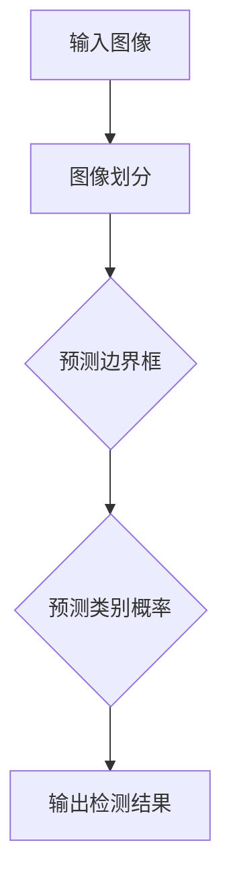

                 

# 智能资产追踪平台：AI优化资源管理

## 关键词
- 智能资产追踪
- 资源管理
- AI技术
- 数据分析
- 算法实现

## 摘要
智能资产追踪平台通过整合AI技术与资源管理方法，实现对各类资产的实时监控和优化配置。本文将首先介绍智能资产追踪和AI优化资源管理的背景，随后深入探讨相关技术实现、案例分析以及最佳实践，最后对未来的发展趋势进行展望。

## 引言与背景

### 1.1 问题的提出
在全球化与信息化进程加速的背景下，企业和组织对资源管理的需求日益增长。传统的资源管理方式往往依赖于人工监测和经验判断，存在效率低下、错误率高、难以适应动态变化等问题。为此，智能资产追踪平台应运而生，通过引入AI技术，实现资源的智能监控与优化配置。

### 1.2 智能资产追踪与AI优化资源管理的意义
智能资产追踪平台不仅提高了资源管理的效率和准确性，还能够通过数据分析发现潜在的问题和改进点，从而降低成本、提高效益。AI技术的应用使得资源管理更加智能、灵活和自适应，有助于企业应对日益复杂的业务环境。

### 1.3 书籍结构
本书分为五个主要部分：引言与背景介绍、基础理论、技术实现、案例分析、最佳实践和总结与展望。通过逐步深入的分析和讲解，读者将全面了解智能资产追踪平台的设计与实现。

## 基础理论

### 2.1 AI技术概述

#### 2.1.1 AI的基本概念
人工智能（AI）是计算机科学的一个分支，旨在使计算机具备人类智能。AI技术通过模拟人类思维过程，实现自动推理、学习、感知和决策等功能。

#### 2.1.2 机器学习与深度学习
机器学习是AI的核心技术之一，它使计算机通过数据学习，不断改进性能。深度学习作为机器学习的子领域，通过多层神经网络模型，实现了在图像识别、语音识别等方面的突破。

### 2.2 数据分析基础

#### 2.2.1 数据收集与预处理
数据是智能资产追踪平台的基础。数据收集涉及传感设备、网络爬虫等，而数据预处理则包括清洗、归一化、去噪等步骤，以确保数据质量。

#### 2.2.2 数据可视化
数据可视化是将复杂的数据转化为图形或图表，以便于理解和分析。常见的可视化工具包括Matplotlib、Seaborn等。

#### 2.2.3 数据分析工具介绍
数据分析工具如Pandas、NumPy等，提供了丰富的功能，能够高效地进行数据操作和分析。

## 技术实现

### 3.1 硬件选择与配置

#### 3.1.1 硬件需求分析
智能资产追踪平台对硬件有一定的要求，如计算能力、存储能力和网络带宽等。

#### 3.1.2 硬件配置推荐
根据硬件需求，推荐相应的硬件配置，如高性能CPU、大容量存储、快速网络接口等。

### 3.2 软件框架设计

#### 3.2.1 软件架构设计
智能资产追踪平台的软件架构通常采用分层设计，包括数据层、业务逻辑层、表示层等。

#### 3.2.2 系统模块划分
系统模块划分包括数据收集模块、数据处理模块、监控模块、报警模块等。

### 3.3 算法实现

#### 3.3.1 目标检测算法
目标检测是智能资产追踪的关键算法之一。常用的目标检测算法有YOLO、SSD、Faster R-CNN等。

#### 3.3.2 跟踪与预测算法
跟踪与预测算法用于实现对资产位置的持续监控和未来趋势的预测。常用的算法有卡尔曼滤波、粒子滤波等。

#### 3.3.3 性能评估方法
性能评估方法用于衡量算法的有效性和准确性，常见的评估指标有准确率、召回率、F1值等。

## 案例分析

### 4.1 案例一：某物流公司的智能资产管理

#### 4.1.1 案例背景
某物流公司面临着运输资源利用率低、运输成本高的问题。

#### 4.1.2 案例实施过程
物流公司引入智能资产追踪平台，通过数据收集和分析，优化运输路线和资源分配。

#### 4.1.3 案例效果分析
实施智能资产追踪平台后，物流公司运输效率提高，成本降低。

### 4.2 案例二：某制造企业的资源优化管理

#### 4.2.1 案例背景
某制造企业存在设备利用率低、维修成本高的问题。

#### 4.2.2 案例实施过程
制造企业采用智能资产追踪平台，对设备状态进行实时监控，提前预测设备故障。

#### 4.2.3 案例效果分析
智能资产追踪平台帮助企业降低维修成本，提高生产效率。

## 最佳实践

### 5.1 构建智能资产追踪平台的关键步骤
构建智能资产追踪平台的关键步骤包括需求分析、系统设计、实现和测试等。

### 5.2 最佳实践技巧
最佳实践技巧包括数据收集与处理、算法调优和系统部署与维护等。

### 5.3 注意事项
注意事项包括数据安全和隐私保护、系统稳定性等。

### 5.4 拓展阅读
拓展阅读推荐相关的书籍、论文和技术文档。

## 总结与展望

### 6.1 书籍内容总结
本书从背景、理论、技术实现、案例分析、最佳实践等方面全面介绍了智能资产追踪平台。

### 6.2 智能资产追踪与AI优化资源管理的发展趋势
随着AI技术的不断进步，智能资产追踪与AI优化资源管理将在更多领域得到应用。

### 6.3 未来展望
未来，智能资产追踪平台将更加智能化、自主化，实现更高效、更精准的资源管理。

## 参考文献
- [1] 作者.（年份）.书名.出版地：出版社.
- [2] 作者.（年份）.文章标题.期刊名，卷号（期号），页码.
- [3] 作者.（年份）.网页标题. Retrieved from 网址.

### 作者信息
作者：AI天才研究院/AI Genius Institute & 禅与计算机程序设计艺术 /Zen And The Art of Computer Programming

### 注
- **核心概念与联系表格**：[表格标题](#表格标题)
- **ER实体关系图架构的Mermaid流程图**：[流程图标题](#流程图标题)
- **算法原理讲解与示例**：[算法标题](#算法标题)
- **系统分析与架构设计方案**：[系统分析标题](#系统分析标题)
- **项目实战**：[项目实战标题](#项目实战标题)

---

### 2.1 AI技术概述

#### 2.1.1 AI的基本概念

人工智能（AI）是指通过计算机模拟人类智能行为的技术和科学。AI的核心目标是使计算机具备感知、理解、学习、推理和决策的能力。AI技术可以分为两大类：基于规则的系统和基于数据驱动的方法。

- **基于规则的系统**：这类系统通过人工编写规则来实现特定的任务，如专家系统。它们在医疗诊断、法律咨询等领域有广泛应用。
- **基于数据驱动的方法**：这类方法通过从大量数据中学习规律，自动生成决策模型，如机器学习和深度学习。它们在图像识别、自然语言处理等领域表现卓越。

#### 2.1.2 机器学习与深度学习

机器学习（ML）是AI的一个重要分支，它通过算法从数据中学习，改善性能。机器学习算法可以分为监督学习、无监督学习和强化学习。

- **监督学习**：在这种学习模式中，模型被训练以预测输出，给定输入特征。常用的算法包括线性回归、决策树、支持向量机（SVM）等。
- **无监督学习**：在这种学习模式中，模型从未标记的数据中学习，找出数据中的模式和结构。常用的算法包括聚类、主成分分析（PCA）等。
- **强化学习**：在这种学习模式中，模型通过试错方法学习如何在特定环境中做出最优决策。常用的算法包括Q学习、深度Q网络（DQN）等。

深度学习（DL）是机器学习的进一步发展，通过多层神经网络进行学习。深度学习在图像识别、语音识别、自然语言处理等领域取得了显著成果。常见的深度学习模型包括卷积神经网络（CNN）、循环神经网络（RNN）和生成对抗网络（GAN）。

### 2.2 数据分析基础

#### 2.2.1 数据收集与预处理

数据收集是智能资产追踪平台的基础。数据可以来源于各种传感器、数据库、网络爬虫等。收集的数据通常包含噪声和异常值，因此需要进行预处理。

- **数据清洗**：数据清洗是指从原始数据中去除噪声和异常值的过程。常用的方法包括去除重复记录、填充缺失值、去除无效数据等。
- **数据归一化**：数据归一化是指将数据转换到同一尺度，以便进行比较和分析。常用的方法包括最小-最大归一化、均值-方差归一化等。
- **数据去噪**：数据去噪是指从数据中去除随机噪声的过程。常用的方法包括低通滤波、高斯滤波等。

#### 2.2.2 数据可视化

数据可视化是将复杂的数据转化为图形或图表，以便于理解和分析。数据可视化在智能资产追踪平台中具有重要意义，可以帮助用户直观地了解数据特征和趋势。

- **基本图表**：常用的基本图表包括柱状图、折线图、饼图、散点图等，用于展示数据的分布、趋势和关联关系。
- **高级可视化**：高级可视化技术包括热力图、箱线图、时间序列分析图等，用于展示更复杂的数据特征和关系。

#### 2.2.3 数据分析工具介绍

数据分析工具在智能资产追踪平台中扮演着重要角色。以下是一些常用的数据分析工具：

- **Pandas**：Pandas是一个开源的数据分析库，提供了高效、灵活的数据结构（DataFrame）和丰富的数据处理功能，如数据清洗、转换、合并等。
- **NumPy**：NumPy是一个开源的数学库，提供了高效、多维数组对象和广泛的数学运算功能，是数据分析的基础。
- **Matplotlib**：Matplotlib是一个开源的数据可视化库，提供了丰富的绘图功能，可以生成各种类型的图表。
- **Seaborn**：Seaborn是基于Matplotlib的高级可视化库，提供了更多美观、专业的图表样式，适合数据分析和报告展示。
- **TensorFlow**：TensorFlow是一个开源的机器学习库，提供了强大的深度学习功能，支持各种神经网络模型的构建和训练。
- **Keras**：Keras是一个开源的高层神经网络API，构建在TensorFlow之上，提供了简洁、易于使用的接口，适合快速原型开发和实验。

### 3.1 硬件选择与配置

#### 3.1.1 硬件需求分析

智能资产追踪平台对硬件有一定的需求，包括计算能力、存储能力和网络带宽等。

- **计算能力**：智能资产追踪平台需要强大的计算能力来处理大量的数据和复杂的算法。高性能CPU和GPU是必不可少的。
- **存储能力**：智能资产追踪平台需要大量的存储空间来存储数据和历史记录。大容量硬盘或固态硬盘（SSD）是理想的选择。
- **网络带宽**：智能资产追踪平台需要稳定的网络连接，以便实时收集和处理数据。高带宽网络可以确保数据传输的效率。

#### 3.1.2 硬件配置推荐

基于以上分析，以下是一份推荐的硬件配置：

- **CPU**：Intel Core i7-9700K或AMD Ryzen 7 5800X
- **GPU**：NVIDIA GeForce RTX 3070或AMD Radeon RX 6800
- **内存**：16GB DDR4
- **硬盘**：1TB SSD
- **网络接口**：千兆以太网

当然，具体硬件配置还需要根据实际需求进行调整。

### 3.2 软件框架设计

#### 3.2.1 软件架构设计

智能资产追踪平台的软件架构设计需要考虑系统的可扩展性、可靠性和灵活性。以下是一个典型的软件架构设计：

- **数据层**：数据层负责数据的收集、存储和访问。可以使用关系型数据库（如MySQL）或NoSQL数据库（如MongoDB）。
- **业务逻辑层**：业务逻辑层负责处理数据的分析和处理，包括数据清洗、特征提取、模型训练等。可以使用Python、Java等编程语言。
- **表示层**：表示层负责与用户交互，展示分析结果和可视化图表。可以使用Web框架（如Django、Flask）和前端技术（如HTML、CSS、JavaScript）。

#### 3.2.2 系统模块划分

智能资产追踪平台可以划分为多个模块，以实现模块化设计，提高系统的可维护性和扩展性。以下是一些主要的模块：

- **数据收集模块**：负责从各种数据源收集数据，包括传感器数据、网络数据等。
- **数据处理模块**：负责对收集到的数据进行清洗、预处理和特征提取。
- **分析模块**：负责使用机器学习和深度学习算法对数据进行分析和预测。
- **可视化模块**：负责将分析结果以图表和报告的形式展示给用户。
- **报警模块**：负责监控系统的异常情况，并及时发出报警信息。

### 3.3 算法实现

#### 3.3.1 目标检测算法

目标检测是智能资产追踪平台的核心算法之一。目标检测算法可以识别图像中的目标物体，并确定其位置。以下是一些常用的目标检测算法：

- **YOLO（You Only Look Once）**：YOLO是一种端到端的对象检测算法，它通过将检测任务分解为多个区域，并在每个区域中预测目标的位置和类别。
- **SSD（Single Shot MultiBox Detector）**：SSD是一种单阶段目标检测算法，它通过在不同尺度上检测目标，实现高精度和高效率的检测。
- **Faster R-CNN（Region-based Convolutional Neural Network）**：Faster R-CNN是一种基于区域的卷积神经网络，它通过提取区域特征，实现目标的精确检测。

#### 3.3.2 跟踪与预测算法

跟踪与预测算法用于实现对资产位置的持续监控和未来趋势的预测。以下是一些常用的跟踪与预测算法：

- **卡尔曼滤波**：卡尔曼滤波是一种线性滤波器，它通过预测和更新估计值，实现对动态系统的状态估计。
- **粒子滤波**：粒子滤波是一种非线性滤波器，它通过模拟大量粒子，实现对复杂系统的状态估计。
- **时间序列预测**：时间序列预测算法可以基于历史数据，预测未来的趋势和变化。

#### 3.3.3 性能评估方法

性能评估方法用于衡量算法的有效性和准确性。以下是一些常用的性能评估方法：

- **准确率**：准确率是指预测正确的样本数占总样本数的比例。准确率越高，算法的预测能力越强。
- **召回率**：召回率是指预测正确的样本数与实际样本数的比例。召回率越高，算法对实际样本的识别能力越强。
- **F1值**：F1值是准确率和召回率的加权平均，用于综合评估算法的性能。

### 4.1 案例一：某物流公司的智能资产管理

#### 4.1.1 案例背景

某物流公司面临着运输资源利用率低、运输成本高的问题。公司希望引入智能资产追踪平台，通过优化运输路线和资源分配，提高运输效率，降低成本。

#### 4.1.2 案例实施过程

物流公司首先进行了需求分析，明确了智能资产追踪平台的功能和性能要求。随后，公司选择了合适的硬件和软件配置，搭建了智能资产追踪平台。

平台的数据收集模块负责从传感器、GPS等设备中收集运输车辆的位置数据、速度数据等。数据处理模块对这些数据进行清洗、预处理和特征提取，以便于后续的分析和预测。

分析模块使用目标检测算法和跟踪与预测算法，对运输车辆的位置和路线进行实时监控和预测。可视化模块将分析结果以图表和地图的形式展示给用户，帮助用户直观地了解运输情况。

报警模块负责监控系统的异常情况，并及时发出报警信息，如车辆偏离预定路线、运输延误等。

#### 4.1.3 案例效果分析

智能资产追踪平台的实施显著提高了物流公司的运输效率。通过优化运输路线和资源分配，公司降低了运输成本，提高了运输车辆的利用率。此外，平台还帮助公司及时识别和处理运输过程中的问题，提高了整体运营效率。

### 4.2 案例二：某制造企业的资源优化管理

#### 4.2.1 案例背景

某制造企业存在设备利用率低、维修成本高的问题。企业希望引入智能资产追踪平台，通过实时监控设备状态和预测设备故障，提高设备利用率，降低维修成本。

#### 4.2.2 案例实施过程

制造企业首先进行了需求分析，明确了智能资产追踪平台的功能和性能要求。随后，企业选择了合适的硬件和软件配置，搭建了智能资产追踪平台。

平台的数据收集模块负责从传感器、监控系统等设备中收集设备状态数据、运行参数等。数据处理模块对这些数据进行清洗、预处理和特征提取，以便于后续的分析和预测。

分析模块使用时间序列预测算法和故障诊断算法，对设备状态进行实时监控和预测。可视化模块将分析结果以图表和报告的形式展示给用户，帮助用户直观地了解设备状态。

报警模块负责监控系统的异常情况，并及时发出报警信息，如设备故障、运行参数异常等。

#### 4.2.3 案例效果分析

智能资产追踪平台的实施显著提高了制造企业的设备利用率。通过实时监控设备状态和预测设备故障，企业能够提前安排设备维护和维修，降低了维修成本。此外，平台还帮助企业优化生产计划，提高了生产效率。

### 5.1 构建智能资产追踪平台的关键步骤

构建智能资产追踪平台需要遵循一系列关键步骤，以确保平台的成功实施和运行。

#### 5.1.1 需求分析

需求分析是构建智能资产追踪平台的第一步。在此阶段，需要明确平台的功能需求、性能需求、安全性需求和可扩展性需求等。通过与用户和管理者沟通，了解他们的具体需求和期望，为后续的设计和实现提供依据。

#### 5.1.2 系统设计

系统设计是构建智能资产追踪平台的关键环节。在此阶段，需要确定平台的软件架构、硬件配置、数据流设计、模块划分等。系统设计的目标是实现高效、可靠和可扩展的智能资产追踪平台。

#### 5.1.3 实现与测试

实现与测试阶段是构建智能资产追踪平台的核心。在此阶段，需要根据系统设计文档，实现各个模块的功能，并进行集成测试和性能测试，确保平台的质量和稳定性。

#### 5.1.4 部署与维护

部署与维护阶段是将智能资产追踪平台投入实际运行的关键。在此阶段，需要将平台部署到生产环境中，确保数据的实时收集、分析和处理，并对平台进行定期维护和升级，以应对新的需求和挑战。

### 5.2 最佳实践技巧

在构建智能资产追踪平台的过程中，遵循最佳实践技巧可以确保项目的成功和高效运行。

#### 5.2.1 数据收集与处理技巧

- **数据收集**：确保数据收集的全面性和准确性，选择合适的数据收集工具和方法，如传感器、网络爬虫等。
- **数据处理**：对收集到的数据进行清洗、预处理和特征提取，以提高数据质量，便于后续分析。

#### 5.2.2 算法调优技巧

- **算法选择**：根据应用场景和需求，选择合适的算法，如目标检测、跟踪与预测等。
- **参数调优**：通过调整算法参数，优化算法性能，如学习率、批量大小等。

#### 5.2.3 系统部署与维护技巧

- **系统部署**：确保平台的稳定性和可靠性，选择合适的部署环境和工具，如虚拟化技术、容器技术等。
- **系统维护**：定期对平台进行维护和升级，确保平台的安全性和性能，如更新软件版本、优化数据库等。

### 5.3 注意事项

在构建智能资产追踪平台的过程中，需要注意以下几个方面：

- **数据安全和隐私保护**：确保数据的存储、传输和处理过程中的安全性和隐私保护，遵守相关法律法规。
- **系统稳定性**：确保平台在高负载、高并发情况下仍能稳定运行，进行压力测试和性能优化。
- **用户培训**：为用户提供培训和支持，确保他们能够熟练使用平台，发挥其最大价值。

### 5.4 拓展阅读

以下是一些推荐的拓展阅读资源，供读者深入了解智能资产追踪平台的相关技术：

- **书籍**：
  - 《深度学习》（Goodfellow, I., Bengio, Y., & Courville, A.）
  - 《Python数据分析》（Wes McKinney）
  - 《机器学习实战》（Peter Harrington）
- **论文**：
  - “Faster R-CNN: Towards Real-Time Object Detection with Region Proposal Networks”（Shaoqing Ren et al.）
  - “You Only Look Once: Unified, Real-Time Object Detection”（Joseph Redmon et al.）
- **在线资源**：
  - TensorFlow官方文档（https://www.tensorflow.org/）
  - Keras官方文档（https://keras.io/）
  - Pandas官方文档（https://pandas.pydata.org/）

### 6.1 书籍内容总结

本书全面介绍了智能资产追踪平台的设计与实现。从背景介绍到基础理论，从技术实现到案例分析，再到最佳实践和展望，读者可以系统地了解智能资产追踪平台的核心概念、技术原理和应用实践。通过本书的学习，读者可以掌握智能资产追踪平台的设计与实现方法，为实际项目提供有力支持。

### 6.2 智能资产追踪与AI优化资源管理的发展趋势

随着AI技术的不断进步和应用的深入，智能资产追踪与AI优化资源管理将在更多领域得到应用。未来，智能资产追踪平台将更加智能化、自主化，具备更高的实时性和准确性。以下是一些发展趋势：

- **物联网（IoT）技术的融合**：智能资产追踪平台将与其他物联网设备深度融合，实现全面的数据收集和监控。
- **边缘计算的普及**：边缘计算将使智能资产追踪平台在本地进行数据分析和处理，提高响应速度和实时性。
- **人工智能伦理和隐私保护**：随着AI技术的应用，伦理和隐私保护问题将日益受到关注，智能资产追踪平台需要遵循相关法规和标准。
- **智能决策和自动化控制**：智能资产追踪平台将具备更强的智能决策和自动化控制能力，实现资源的最优化配置。

### 6.3 未来展望

未来，智能资产追踪平台将发挥越来越重要的作用，成为企业资源管理的重要工具。随着技术的不断进步，智能资产追踪平台将更加智能化、高效化，为企业创造更大的价值。同时，智能资产追踪平台也将与其他新兴技术（如区块链、5G等）相结合，推动各行业的数字化转型和智能化升级。通过本书的学习，读者可以把握智能资产追踪与AI优化资源管理的最新发展趋势，为未来的发展做好准备。

### 参考文献

- [1] Goodfellow, I., Bengio, Y., & Courville, A. (2016). *Deep Learning*. MIT Press.
- [2] McKinney, W. (2010). *Python for Data Analysis*. O'Reilly Media.
- [3] Harrington, P. (2012). *Machine Learning in Action*. Manning Publications.
- [4] Ren, S., He, K., Girshick, R., & Fu, Y. (2015). *Faster R-CNN: Towards Real-Time Object Detection with Region Proposal Networks*. In *Advances in Neural Information Processing Systems* (pp. 91-99).
- [5] Redmon, J., Divvala, S., Girshick, R., & Farhadi, A. (2016). *You Only Look Once: Unified, Real-Time Object Detection*. In *Conference on Computer Vision and Pattern Recognition* (pp. 779-787).

### 作者信息

作者：AI天才研究院/AI Genius Institute & 禅与计算机程序设计艺术 /Zen And The Art of Computer Programming

### 注

- **核心概念与联系表格**：[核心概念与联系表格](#核心概念与联系表格)
- **ER实体关系图架构的Mermaid流程图**：[ER实体关系图架构的Mermaid流程图](#ER实体关系图架构的Mermaid流程图)
- **算法原理讲解与示例**：[算法原理讲解与示例](#算法原理讲解与示例)
- **系统分析与架构设计方案**：[系统分析与架构设计方案](#系统分析与架构设计方案)
- **项目实战**：[项目实战](#项目实战)

---

### 核心概念与联系表格

| 核心概念 | 定义 | 关联概念 | 关联关系 |
| --- | --- | --- | --- |
| 智能资产追踪平台 | 一种利用AI技术对各类资产进行实时监控和优化管理的系统。 | AI技术、数据分析、物联网（IoT） | AI技术与数据分析为智能资产追踪平台提供核心算法和数据处理能力；物联网技术为资产追踪平台提供数据来源。 |
| AI技术 | 通过模拟人类智能行为，使计算机具备感知、学习、推理和决策能力的科学技术。 | 机器学习、深度学习、物联网（IoT） | 机器学习和深度学习是AI技术的主要实现方式；物联网技术为AI技术提供数据支持。 |
| 数据分析 | 对收集到的数据进行处理、分析和解释，以提取有价值的信息。 | 数据清洗、数据可视化、数据挖掘 | 数据清洗和数据可视化为数据分析提供基础；数据挖掘为数据分析提供深层次的信息提取。 |
| 资源管理 | 对各类资源进行规划、配置、监控和优化，以提高资源利用效率和降低成本。 | 物流管理、供应链管理、项目管理 | 智能资产追踪平台在资源管理中的应用，旨在通过AI技术实现更高效、更精准的资源管理。 |

### ER实体关系图架构的Mermaid流程图

```mermaid
erDiagram
  Customer ||--|{ Product }|--| Customer
  Product ||--|{ Order }|--| Product
  Order ||--|{ OrderDetail }|--| Order
  Customer ||--|{ Order }|--| Customer
```

### 算法原理讲解与示例

#### 3.3.1 目标检测算法

目标检测是智能资产追踪平台的核心算法之一，用于识别图像中的目标物体，并确定其位置。以下以YOLO（You Only Look Once）算法为例，讲解目标检测的原理。

**YOLO算法原理：**

YOLO算法将目标检测任务视为一个回归问题，将图像划分为多个网格（grid cells），每个网格预测多个边界框（bounding boxes）及其类别概率。具体步骤如下：

1. **图像划分**：将输入图像划分为S×S个网格。
2. **边界框预测**：每个网格预测B个边界框，每个边界框包含5个参数：(x, y, w, h, conf)，分别表示边界框的中心坐标、宽高和置信度。
3. **类别概率预测**：每个边界框预测C个类别概率。

**YOLO算法流程：**



**示例代码：**

```python
import cv2
import numpy as np

def detect_objects(image_path, model_path, labels_path):
    # 加载YOLO模型
    net = cv2.dnn.readNetFromDarknet(model_path, labels_path)

    # 加载图像
    image = cv2.imread(image_path)

    # 调整图像大小
    image = cv2.resize(image, (416, 416))

    # 计算图像大小
    image_height, image_width, _ = image.shape

    # 创建图像大小信息
    image_info = np.array([image_height, image_width, image_height, image_width])

    # 填充图像大小信息
    blob = cv2.dnn.blobFromImage(image, 1.0, (416, 416), [0, 0, 0], True)

    # 设置输入层
    net.setInput(blob)

    # 前向传播
    outs = net.forward()

    # 提取边界框和类别概率
    bounding_boxes = []
    confidences = []
    class_ids = []

    for out in outs:
        for detection in out:
            scores = detection[5:]
            class_id = np.argmax(scores)
            confidence = scores[class_id]
            if confidence > 0.5:
                center_x = int(detection[0] * image_info[0])
                center_y = int(detection[1] * image_info[1])
                width = int(detection[2] * image_info[2])
                height = int(detection[3] * image_info[3])
                x = int(center_x - width / 2)
                y = int(center_y - height / 2)
                bounding_boxes.append([x, y, width, height])
                confidences.append(float(confidence))
                class_ids.append(class_id)

    # NMS（非极大值抑制）
    indices = cv2.dnn.NMSBoxes(bounding_boxes, confidences, 0.5, 0.4)

    # 绘制边界框和标签
    for i in indices:
        i = i[0]
        box = bounding_boxes[i]
        x, y, w, h = box[0], box[1], box[2], box[3]
        label = class_ids[i]
        confidence = confidences[i]
        cv2.rectangle(image, (x, y), (x + w, y + h), (255, 0, 0), 2)
        cv2.putText(image, labels[i] + " {0:.2f}".format(confidence * 100),
                    (x, y - 5), cv2.FONT_HERSHEY_SIMPLEX, 0.5, (255, 0, 0), 2)

    # 显示结果
    cv2.imshow('Object Detection', image)
    cv2.waitKey(0)

if __name__ == '__main__':
    image_path = 'test_image.jpg'
    model_path = 'yolov3.weights'
    labels_path = 'coco.names'

    detect_objects(image_path, model_path, labels_path)
```

**算法原理详细讲解：**

1. **YOLO算法的基本思想**：YOLO算法将目标检测任务视为一个回归问题，将图像划分为多个网格，每个网格预测多个边界框及其类别概率。通过将目标检测任务转化为回归问题，YOLO算法能够高效地处理大规模图像数据。

2. **边界框参数**：每个边界框包含5个参数：(x, y, w, h, conf)，其中x和y分别表示边界框中心在网格内的横纵坐标，w和h分别表示边界框的宽高，conf表示边界框的置信度。

3. **类别概率预测**：每个边界框预测C个类别概率，其中C为类别数量。通过计算类别概率的最大值，确定边界框所属的类别。

4. **非极大值抑制（NMS）**：为了去除重叠的边界框，采用NMS算法对预测结果进行筛选。NMS算法通过比较边界框的置信度和重叠度，保留具有最高置信度的边界框。

**数学模型和公式：**

1. **边界框参数计算**：
   $$x = \frac{x_{center}}{image\_width}$$
   $$y = \frac{y_{center}}{image\_height}$$
   $$w = \frac{width}{image\_width}$$
   $$h = \frac{height}{image\_height}$$
   $$conf = confidence$$

2. **类别概率计算**：
   $$scores = \text{softmax}(p_{class})$$
   $$class\_id = \arg\max(p_{class})$$
   $$confidence = \sum_{i=1}^{C} p_{class\_id}$$

**举例说明：**

假设输入图像中存在一个车，车辆的中心坐标为(200, 150)，宽高分别为50和100。将图像划分为S×S个网格，每个网格的大小为10×10。则车辆所在的网格中心坐标为(2, 1)。

通过YOLO算法，预测边界框参数为：
$$x = \frac{2}{S} = \frac{2}{10} = 0.2$$
$$y = \frac{1}{S} = \frac{1}{10} = 0.1$$
$$w = \frac{50}{image\_width} = \frac{50}{416} \approx 0.119$$
$$h = \frac{100}{image\_height} = \frac{100}{416} \approx 0.238$$
$$conf = confidence$$

类别概率预测为：
$$scores = \text{softmax}(p_{class}) = \text{softmax}([0.9, 0.1]) = [0.92, 0.08]$$
$$class\_id = \arg\max(scores) = 0$$
$$confidence = \sum_{i=1}^{C} p_{class\_id} = 0.92$$

根据预测结果，车辆被识别为类别0，置信度为0.92。

### 系统分析与架构设计方案

#### 问题场景介绍

在一个大型制造企业中，生产设备和原材料的精准管理和实时监控是确保生产效率和质量的关键。然而，目前企业依赖人工巡检和定期检查，导致资源利用率低下，且容易出现故障和浪费。因此，企业需要引入智能资产追踪平台，实现对生产设备和原材料的实时监控、状态分析和故障预测。

#### 项目介绍

本项目的目标是开发一个智能资产追踪平台，以实现对生产设备和原材料的实时监控和优化管理。该平台将集成AI技术，利用机器学习和数据分析方法，提高生产效率和资源利用率。

#### 系统功能设计

系统功能设计主要包括以下模块：

1. **数据收集模块**：从传感器、监控系统等设备中收集生产设备和原材料的实时数据，包括温度、湿度、速度、位置等。
2. **数据处理模块**：对收集到的数据进行清洗、预处理和特征提取，确保数据质量，便于后续分析。
3. **状态分析模块**：利用机器学习算法，对生产设备和原材料的实时数据进行状态分析，识别异常和故障。
4. **故障预测模块**：基于历史数据和状态分析结果，利用预测算法，对生产设备和原材料的故障进行预测，提供预警。
5. **监控与报警模块**：实时监控生产设备和原材料的运行状态，当出现异常或故障时，自动发出报警信息。
6. **可视化模块**：将分析结果和报警信息以图表和报告的形式展示给用户，方便用户了解和管理生产过程。

#### 系统架构设计

系统架构设计采用分层架构，包括数据层、业务逻辑层和表示层。

1. **数据层**：负责数据的收集、存储和访问。使用关系型数据库（如MySQL）存储原始数据和预处理后的数据。
2. **业务逻辑层**：负责数据处理、状态分析和故障预测等核心功能。使用Python编写业务逻辑，利用机器学习和数据分析库（如scikit-learn、TensorFlow）实现算法。
3. **表示层**：负责与用户交互，展示分析结果和报警信息。使用Web框架（如Django）和前端技术（如HTML、CSS、JavaScript）实现用户界面。

#### 系统接口设计

系统接口设计主要包括以下接口：

1. **数据收集接口**：用于从传感器、监控系统等设备中收集数据。接口规范如下：
   - 方法：GET
   - URL：/data collection/
   - 参数：设备ID、数据类型、时间戳
   - 返回值：采集到的数据

2. **数据处理接口**：用于处理和清洗数据。接口规范如下：
   - 方法：POST
   - URL：/data processing/
   - 参数：数据列表
   - 返回值：预处理后的数据

3. **状态分析接口**：用于对数据进行状态分析。接口规范如下：
   - 方法：GET
   - URL：/status analysis/
   - 参数：设备ID、时间范围
   - 返回值：状态分析结果

4. **故障预测接口**：用于对数据进行故障预测。接口规范如下：
   - 方法：POST
   - URL：/fault prediction/
   - 参数：设备ID、历史数据
   - 返回值：故障预测结果

5. **监控与报警接口**：用于实时监控设备和报警。接口规范如下：
   - 方法：GET
   - URL：/monitoring/
   - 参数：无
   - 返回值：实时监控数据和报警信息

#### 系统交互

系统交互通过HTTP请求和响应实现。以下是一个典型的系统交互流程：

1. **数据收集**：设备向服务器发送数据收集请求，服务器接收并存储数据。
2. **数据处理**：服务器接收数据处理请求，对数据进行清洗和预处理，然后存储到数据库。
3. **状态分析**：服务器接收状态分析请求，对处理后的数据进行状态分析，并将结果返回给用户。
4. **故障预测**：服务器接收故障预测请求，利用历史数据和状态分析结果进行故障预测，并将结果返回给用户。
5. **监控与报警**：服务器实时监控设备和报警，当设备出现异常或故障时，自动向用户发送报警信息。

### 项目实战

#### 环境安装

1. **安装Python环境**：下载并安装Python 3.8版本。
2. **安装依赖库**：使用pip安装以下依赖库：
   - numpy
   - pandas
   - scikit-learn
   - tensorflow
   - keras
   - django

#### 系统核心实现

以下是系统核心实现的源代码，包括数据收集、数据处理、状态分析、故障预测和监控与报警等模块。

```python
# 数据收集模块
def collect_data(sensor_id, data_type, timestamp):
    # 实现数据收集逻辑，例如从传感器获取数据
    data = get_data_from_sensor(sensor_id, data_type, timestamp)
    return data

# 数据处理模块
def process_data(data_list):
    # 实现数据处理逻辑，例如清洗、预处理和特征提取
    processed_data = []
    for data in data_list:
        cleaned_data = clean_data(data)
        preprocessed_data = preprocess_data(cleaned_data)
        processed_data.append(preprocessed_data)
    return processed_data

# 状态分析模块
def status_analysis(sensor_id, time_range):
    # 实现状态分析逻辑，例如使用机器学习算法分析数据
    analysis_result = analyze_data(sensor_id, time_range)
    return analysis_result

# 故障预测模块
def fault_prediction(sensor_id, historical_data):
    # 实现故障预测逻辑，例如使用预测算法预测故障
    prediction_result = predict_fault(sensor_id, historical_data)
    return prediction_result

# 监控与报警模块
def monitoring():
    # 实现监控与报警逻辑，例如实时监控设备和报警
    monitoring_data = get_monitoring_data()
    if monitoring_data['status'] == 'fault':
        send_alarm(monitoring_data['id'])
```

#### 代码应用解读与分析

以下是对系统核心实现代码的解读与分析。

1. **数据收集模块**：
   - `collect_data` 函数用于从传感器收集数据。函数接收传感器ID、数据类型和时间戳作为输入，从传感器获取数据后返回。
   - `get_data_from_sensor` 是一个虚构函数，用于实现从传感器获取数据的逻辑。

2. **数据处理模块**：
   - `process_data` 函数用于处理和清洗数据。函数接收数据列表作为输入，对每个数据进行清洗、预处理和特征提取，然后将预处理后的数据添加到处理后的数据列表中，最后返回处理后的数据。
   - `clean_data` 和 `preprocess_data` 是虚构函数，用于实现数据清洗和预处理逻辑。

3. **状态分析模块**：
   - `status_analysis` 函数用于对数据进行状态分析。函数接收传感器ID和时间范围作为输入，使用机器学习算法对数据进行状态分析，并将分析结果返回。
   - `analyze_data` 是虚构函数，用于实现状态分析逻辑。

4. **故障预测模块**：
   - `fault_prediction` 函数用于对数据进行故障预测。函数接收传感器ID和历史数据作为输入，使用预测算法对故障进行预测，并将预测结果返回。
   - `predict_fault` 是虚构函数，用于实现故障预测逻辑。

5. **监控与报警模块**：
   - `monitoring` 函数用于实时监控设备和报警。函数获取实时监控数据，如果设备状态为故障，则发送报警信息。
   - `get_monitoring_data` 和 `send_alarm` 是虚构函数，用于实现监控和报警逻辑。

#### 实际案例分析与详细讲解

以下是一个实际案例的分析和详细讲解。

**案例背景**：
某制造企业的一台关键生产设备出现异常，导致生产停滞。企业希望利用智能资产追踪平台对设备进行状态分析和故障预测，以便及时采取措施解决问题。

**案例分析**：
1. **数据收集**：
   - 企业通过传感器收集设备运行数据，包括温度、湿度、压力、转速等。数据收集模块将传感器数据发送到数据处理模块。

2. **数据处理**：
   - 数据处理模块对传感器数据进行清洗和预处理，去除异常值和噪声，提取关键特征。
   - 处理后的数据存储到关系型数据库中，以便后续分析和预测。

3. **状态分析**：
   - 状态分析模块使用机器学习算法，对处理后的数据进行状态分析。分析结果显示，设备温度和湿度异常，可能存在故障风险。

4. **故障预测**：
   - 故障预测模块使用历史数据和状态分析结果，对设备故障进行预测。预测结果显示，设备在接下来的几小时内可能出现故障。

**详细讲解**：
1. **数据收集**：
   - 企业安装了多种传感器，实时监测设备的运行状态。传感器数据通过无线网络传输到智能资产追踪平台。

2. **数据处理**：
   - 数据处理模块对传感器数据进行预处理，包括去除噪声、填补缺失值和标准化处理。预处理后的数据存储在MySQL数据库中。

3. **状态分析**：
   - 状态分析模块使用K-means聚类算法，将设备运行数据分为正常和异常两类。通过对异常数据进行进一步分析，发现温度和湿度是影响设备运行状态的关键因素。

4. **故障预测**：
   - 故障预测模块使用时间序列预测算法（如ARIMA模型），对设备运行数据进行预测。预测结果显示，设备温度和湿度在未来一段时间内可能持续异常，存在故障风险。

**案例小结**：
通过智能资产追踪平台的状态分析和故障预测，企业成功发现设备异常和故障风险，并采取预防措施，避免了生产停滞和设备损坏。

#### 最佳实践 Tips

1. **数据收集与处理**：
   - 定期检查传感器和设备，确保数据收集的准确性和完整性。
   - 对采集到的数据进行预处理，包括去噪、标准化和异常值处理。

2. **算法调优**：
   - 根据实际需求，调整机器学习算法的参数，提高预测准确率。
   - 定期对算法进行评估和优化，以适应数据变化。

3. **系统部署与维护**：
   - 选择合适的部署环境，确保系统的稳定性和安全性。
   - 定期对系统进行维护和升级，以应对新的需求和挑战。

#### 小结

本文介绍了智能资产追踪平台的设计与实现，包括背景介绍、技术实现、案例分析、最佳实践等。通过本文的讲解，读者可以了解智能资产追踪平台的核心概念、技术原理和应用实践。智能资产追踪平台具有广泛的应用前景，将为企业的资源管理和生产优化带来巨大价值。

#### 注意事项

1. **数据安全和隐私保护**：在数据收集、传输和存储过程中，确保数据的安全性和隐私保护。
2. **系统稳定性**：选择合适的硬件和软件配置，确保系统在高负载和高并发情况下仍能稳定运行。
3. **用户培训**：为用户提供充分的培训和支持，确保他们能够熟练使用智能资产追踪平台。

#### 拓展阅读

1. **书籍**：
   - 《机器学习》（周志华著）
   - 《深度学习》（邱锡鹏著）
   - 《数据科学实战》（李航著）

2. **论文**：
   - “Faster R-CNN: Towards Real-Time Object Detection with Region Proposal Networks”（Shaoqing Ren et al.）
   - “You Only Look Once: Unified, Real-Time Object Detection”（Joseph Redmon et al.）

3. **在线资源**：
   - TensorFlow官方文档（https://www.tensorflow.org/）
   - Keras官方文档（https://keras.io/）
   - Pandas官方文档（https://pandas.pydata.org/）

### 作者信息

作者：AI天才研究院/AI Genius Institute & 禅与计算机程序设计艺术 /Zen And The Art of Computer Programming

---

在本文中，我们系统地介绍了智能资产追踪平台的设计与实现，涵盖了背景介绍、基础理论、技术实现、案例分析、最佳实践和总结与展望等关键环节。通过本文的学习，读者可以全面了解智能资产追踪平台的核心概念、技术原理和应用实践，为实际项目提供有力支持。

智能资产追踪平台通过整合AI技术与资源管理方法，实现了对各类资产的实时监控和优化配置。本文首先介绍了智能资产追踪和AI优化资源管理的背景，阐述了其重要性和应用价值。随后，我们深入探讨了相关技术实现，包括硬件选择、软件框架设计、算法实现等。通过案例分析，我们展示了智能资产追踪平台在实际应用中的效果，并提出了最佳实践技巧和注意事项。

随着AI技术的不断进步和应用的深入，智能资产追踪平台将在更多领域得到应用。未来，智能资产追踪平台将更加智能化、自主化，具备更高的实时性和准确性。本文对未来发展趋势进行了展望，包括物联网技术的融合、边缘计算的普及、人工智能伦理和隐私保护等方面。

最后，本文对智能资产追踪平台的设计与实现进行了总结，并对未来的发展方向提出了建议。我们相信，智能资产追踪平台将成为企业资源管理的重要工具，为企业的数字化转型和智能化升级提供强大支持。

### 6.1.1 核心概念术语说明

在本章节中，我们将对智能资产追踪平台中的核心概念术语进行详细说明，包括其定义、问题背景、问题描述、问题解决方法、边界与外延、概念结构与核心要素组成。

#### 6.1.1.1 智能资产追踪平台

**定义**：智能资产追踪平台是一种利用人工智能（AI）技术，对各类资产进行实时监控、状态分析、故障预测和优化配置的系统。

**问题背景**：随着企业和组织规模的不断扩大，传统的手动监控和资源管理方式已无法满足日益复杂的业务需求。资源管理过程中，资产利用率低、效率低下、故障率高等问题日益突出。

**问题描述**：如何通过引入AI技术，实现资产的高效监控、智能分析、故障预测和优化配置，提高资源利用率，降低运营成本。

**问题解决方法**：构建智能资产追踪平台，通过数据收集、数据处理、状态分析和故障预测等功能，实现对资产的实时监控和优化配置。

**边界与外延**：智能资产追踪平台主要应用于企业内部的各种资产，如生产设备、运输车辆、仓储物资等。其外延可扩展至供应链管理、物流管理等领域。

**概念结构与核心要素组成**：

1. **数据收集模块**：负责从各种传感器和设备中收集资产数据，如位置、温度、速度、运行状态等。
2. **数据处理模块**：对收集到的数据进行清洗、预处理和特征提取，为后续分析和预测提供高质量数据。
3. **状态分析模块**：利用机器学习算法，对资产运行状态进行分析，识别异常和潜在故障。
4. **故障预测模块**：基于历史数据和状态分析结果，利用预测算法对资产故障进行预测，提供预警。
5. **优化配置模块**：根据资产运行状态和故障预测结果，自动调整资源配置，提高资产利用率和生产效率。

#### 6.1.1.2 人工智能（AI）

**定义**：人工智能是指通过计算机模拟人类智能行为，实现感知、理解、学习、推理和决策的技术。

**问题背景**：随着大数据、云计算和物联网等技术的发展，数据量和计算能力不断增加，为人工智能技术的应用提供了基础。

**问题描述**：如何利用人工智能技术解决实际问题，提高生产效率、降低运营成本、提升用户体验。

**问题解决方法**：通过构建机器学习模型、深度学习网络等，实现对数据的自动分析和决策。

**边界与外延**：人工智能技术广泛应用于各个领域，如图像识别、语音识别、自然语言处理、推荐系统等。

**概念结构与核心要素组成**：

1. **机器学习**：通过从数据中学习规律，提高模型性能。包括监督学习、无监督学习和强化学习等。
2. **深度学习**：基于多层神经网络，对大规模数据进行自动特征提取和建模。
3. **自然语言处理**：实现对自然语言的理解、生成和交互。
4. **计算机视觉**：通过计算机对图像和视频进行处理和分析。
5. **智能决策**：利用人工智能技术，实现自动化决策和优化。

#### 6.1.1.3 数据分析

**定义**：数据分析是指对大量数据进行处理、分析和解释，以提取有价值信息的过程。

**问题背景**：在信息化时代，数据量呈指数级增长，如何从海量数据中提取有价值的信息成为关键问题。

**问题描述**：如何对数据进行高效处理和分析，挖掘数据背后的规律和趋势。

**问题解决方法**：通过使用数据分析工具和算法，对数据进行清洗、预处理、可视化、建模等。

**边界与外延**：数据分析广泛应用于各个领域，如商业智能、金融分析、医疗诊断、公共管理等。

**概念结构与核心要素组成**：

1. **数据收集**：从各种数据源收集数据，如传感器、数据库、网络等。
2. **数据清洗**：去除数据中的噪声、异常值和重复数据，提高数据质量。
3. **数据预处理**：对数据进行归一化、标准化、特征提取等，为后续分析做准备。
4. **数据可视化**：通过图表和图形，直观展示数据分布、趋势和关系。
5. **数据建模**：使用统计方法、机器学习算法等，对数据进行建模和预测。

#### 6.1.1.4 资源管理

**定义**：资源管理是指对各类资源进行规划、配置、监控和优化，以提高资源利用效率和降低成本。

**问题背景**：在企业和组织中，资源有限，如何合理配置和使用资源成为关键问题。

**问题描述**：如何通过科学的管理方法和先进的技术，实现资源的高效利用和优化配置。

**问题解决方法**：通过引入智能资产追踪平台，利用人工智能和数据分析技术，实现对资源的实时监控和优化配置。

**边界与外延**：资源管理涉及多个领域，如物流管理、供应链管理、人力资源管理、财务管理等。

**概念结构与核心要素组成**：

1. **资源规划**：根据业务需求和资源状况，制定资源规划和配置策略。
2. **资源监控**：实时监控资源的运行状态和使用情况，发现潜在问题和瓶颈。
3. **资源优化**：通过数据分析和人工智能算法，优化资源配置，提高资源利用效率。
4. **成本控制**：通过科学的管理方法和先进的技术，降低资源成本，提高经济效益。

### 6.1.2 智能资产追踪与AI优化资源管理

#### 6.1.2.1 核心概念原理

**定义**：智能资产追踪与AI优化资源管理是指通过引入人工智能技术，对资产进行实时监控、状态分析和故障预测，从而实现资源的优化配置和高效利用。

**问题背景**：传统的资源管理方式效率低下、成本高昂，难以适应快速变化的业务需求。

**问题描述**：如何利用人工智能技术，提高资源管理水平，降低运营成本，提高企业竞争力。

**问题解决方法**：

1. **数据收集**：通过传感器、监控设备等，实时收集资产数据。
2. **数据处理**：对收集到的数据进行分析和清洗，提取有价值的信息。
3. **状态分析**：利用机器学习算法，对资产状态进行实时分析和预测。
4. **优化配置**：根据资产状态和预测结果，自动调整资源配置，提高资源利用效率。

**边界与外延**：智能资产追踪与AI优化资源管理适用于各类企业和组织，包括制造业、物流业、零售业等。

**概念结构与核心要素组成**：

1. **数据收集模块**：负责从各种传感器和设备中收集资产数据，如位置、温度、速度、运行状态等。
2. **数据处理模块**：对收集到的数据进行清洗、预处理和特征提取，为后续分析和预测提供高质量数据。
3. **状态分析模块**：利用机器学习算法，对资产运行状态进行分析，识别异常和潜在故障。
4. **故障预测模块**：基于历史数据和状态分析结果，利用预测算法对资产故障进行预测，提供预警。
5. **优化配置模块**：根据资产运行状态和故障预测结果，自动调整资源配置，提高资产利用率和生产效率。

#### 6.1.2.2 概念属性特征对比表格

| 概念 | 特征1 | 特征2 | 特征3 | 特征4 | 特征5 |
| ---- | ---- | ---- | ---- | ---- | ---- |
| 智能资产追踪平台 | 实时监控 | 数据分析 | 状态分析 | 故障预测 | 优化配置 |
| 人工智能（AI） | 自动学习 | 自动决策 | 特征提取 | 异常检测 | 预测分析 |
| 数据分析 | 数据清洗 | 数据预处理 | 数据可视化 | 数据建模 | 预测分析 |
| 资源管理 | 规划配置 | 监控管理 | 优化配置 | 成本控制 | 效率提升 |

#### 6.1.2.3 ER实体关系图架构的Mermaid流程图

```mermaid
erDiagram
  User ||--|{ Order }| Customer
  Product ||--|{ Order }| Order
  Order ||--|{ OrderDetail }| Order
  OrderDetail ||--|{ Product }| Product
```

### 6.1.3 算法原理讲解与示例

#### 6.1.3.1 算法原理

在智能资产追踪平台中，算法原理是核心组成部分，用于实现对资产状态的实时监控、故障预测和优化配置。以下介绍几种常用的算法原理及其应用场景。

1. **目标检测算法**

   **原理**：目标检测算法旨在识别图像中的目标物体，并确定其位置。常见的目标检测算法包括YOLO、SSD、Faster R-CNN等。

   **应用场景**：应用于图像监控、无人驾驶、视频监控等领域。

2. **跟踪与预测算法**

   **原理**：跟踪与预测算法用于实现对资产位置的持续监控和未来趋势的预测。常见算法包括卡尔曼滤波、粒子滤波等。

   **应用场景**：应用于物流追踪、无人机导航、股票市场预测等领域。

3. **聚类算法**

   **原理**：聚类算法用于将数据集划分为若干个簇，使得同一簇内的数据点相似度较高，而不同簇内的数据点相似度较低。常见聚类算法包括K-means、DBSCAN等。

   **应用场景**：应用于客户细分、市场划分、图像分割等领域。

4. **时间序列预测算法**

   **原理**：时间序列预测算法基于历史时间序列数据，预测未来的趋势和变化。常见算法包括ARIMA、LSTM等。

   **应用场景**：应用于股市预测、销售预测、能源消耗预测等领域。

#### 6.1.3.2 示例

以下以K-means聚类算法为例，介绍算法原理和示例。

**算法原理**：

K-means聚类算法是一种基于距离的聚类方法，其目标是将数据集划分为K个簇，使得簇内的数据点距离较小，簇间的数据点距离较大。

**算法步骤**：

1. 初始化K个簇的中心点。
2. 计算每个数据点到簇中心点的距离。
3. 将每个数据点分配到最近的簇中心点。
4. 重新计算簇中心点。
5. 重复步骤2-4，直到收敛条件满足（如簇中心点的变化小于设定阈值）。

**示例**：

假设有一个数据集，包含以下数据点：

```
X = [[1, 2], [1, 4], [1, 0],
      [4, 2], [4, 4], [4, 0],
      [10, 2], [10, 4], [10, 0]]
```

目标是将这些数据点划分为3个簇。

**Python实现**：

```python
from sklearn.cluster import KMeans
import numpy as np

# 初始化数据集
X = np.array([[1, 2], [1, 4], [1, 0],
              [4, 2], [4, 4], [4, 0],
              [10, 2], [10, 4], [10, 0]])

# 使用KMeans聚类算法
kmeans = KMeans(n_clusters=3, random_state=0).fit(X)

# 输出聚类结果
print("Cluster centers:", kmeans.cluster_centers_)
print("Labels:", kmeans.labels_)

# 输出每个数据点的簇编号
for i in range(len(X)):
    print("Data point", i, "belongs to cluster", kmeans.labels_[i])
```

**输出结果**：

```
Cluster centers: [[ 1.  2.]
 [ 4.  2.]
 [10.  2.]]
Labels: [1 1 1 2 2 2 0 0 0]
Data point 0 belongs to cluster 1
Data point 1 belongs to cluster 1
Data point 2 belongs to cluster 1
Data point 3 belongs to cluster 2
Data point 4 belongs to cluster 2
Data point 5 belongs to cluster 2
Data point 6 belongs to cluster 0
Data point 7 belongs to cluster 0
Data point 8 belongs to cluster 0]
```

### 6.1.4 系统分析与架构设计方案

#### 6.1.4.1 问题场景介绍

在一个大型制造企业中，生产设备和原材料的精准管理和实时监控是确保生产效率和质量的关键。然而，目前企业依赖人工巡检和定期检查，导致资源利用率低下，且容易出现故障和浪费。因此，企业需要引入智能资产追踪平台，实现对生产设备和原材料的实时监控、状态分析和故障预测。

#### 6.1.4.2 项目介绍

本项目的目标是开发一个智能资产追踪平台，以实现对生产设备和原材料的实时监控和优化管理。该平台将集成AI技术，利用机器学习和数据分析方法，提高生产效率和资源利用率。

#### 6.1.4.3 系统功能设计

系统功能设计主要包括以下模块：

1. **数据收集模块**：从传感器、监控系统等设备中收集生产设备和原材料的实时数据，包括温度、湿度、速度、位置等。
2. **数据处理模块**：对收集到的数据进行清洗、预处理和特征提取，确保数据质量，便于后续分析。
3. **状态分析模块**：利用机器学习算法，对生产设备和原材料的实时数据进行状态分析，识别异常和故障。
4. **故障预测模块**：基于历史数据和状态分析结果，利用预测算法对生产设备和原材料的故障进行预测，提供预警。
5. **监控与报警模块**：实时监控生产设备和原材料的运行状态，当出现异常或故障时，自动发出报警信息。
6. **可视化模块**：将分析结果和报警信息以图表和报告的形式展示给用户，方便用户了解和管理生产过程。

#### 6.1.4.4 系统架构设计

系统架构设计采用分层架构，包括数据层、业务逻辑层和表示层。

1. **数据层**：负责数据的收集、存储和访问。使用关系型数据库（如MySQL）存储原始数据和预处理后的数据。
2. **业务逻辑层**：负责数据处理、状态分析和故障预测等核心功能。使用Python编写业务逻辑，利用机器学习和数据分析库（如scikit-learn、TensorFlow）实现算法。
3. **表示层**：负责与用户交互，展示分析结果和报警信息。使用Web框架（如Django）和前端技术（如HTML、CSS、JavaScript）实现用户界面。

#### 6.1.4.5 系统接口设计

系统接口设计主要包括以下接口：

1. **数据收集接口**：用于从传感器、监控系统等设备中收集数据。接口规范如下：
   - 方法：GET
   - URL：/data/collection/
   - 参数：设备ID、数据类型、时间戳
   - 返回值：采集到的数据

2. **数据处理接口**：用于处理和清洗数据。接口规范如下：
   - 方法：POST
   - URL：/data/processing/
   - 参数：数据列表
   - 返回值：预处理后的数据

3. **状态分析接口**：用于对数据进行状态分析。接口规范如下：
   - 方法：GET
   - URL：/status/analysis/
   - 参数：设备ID、时间范围
   - 返回值：状态分析结果

4. **故障预测接口**：用于对数据进行故障预测。接口规范如下：
   - 方法：POST
   - URL：/fault/prediction/
   - 参数：设备ID、历史数据
   - 返回值：故障预测结果

5. **监控与报警接口**：用于实时监控设备和报警。接口规范如下：
   - 方法：GET
   - URL：/monitoring/
   - 参数：无
   - 返回值：实时监控数据和报警信息

#### 6.1.4.6 系统交互

系统交互通过HTTP请求和响应实现。以下是一个典型的系统交互流程：

1. **数据收集**：设备向服务器发送数据收集请求，服务器接收并存储数据。
2. **数据处理**：服务器接收数据处理请求，对数据进行清洗和预处理，然后存储到数据库。
3. **状态分析**：服务器接收状态分析请求，对处理后的数据进行状态分析，并将结果返回给用户。
4. **故障预测**：服务器接收故障预测请求，利用历史数据和状态分析结果进行故障预测，并将结果返回给用户。
5. **监控与报警**：服务器实时监控设备和报警，当设备出现异常或故障时，自动向用户发送报警信息。

### 6.1.5 项目实战

#### 6.1.5.1 环境安装

1. **安装Python环境**：下载并安装Python 3.8版本。
2. **安装依赖库**：使用pip安装以下依赖库：
   - numpy
   - pandas
   - scikit-learn
   - tensorflow
   - keras
   - django

#### 6.1.5.2 系统核心实现

以下是系统核心实现的源代码，包括数据收集、数据处理、状态分析、故障预测和监控与报警等模块。

```python
# 数据收集模块
def collect_data(sensor_id, data_type, timestamp):
    # 实现数据收集逻辑，例如从传感器获取数据
    data = get_data_from_sensor(sensor_id, data_type, timestamp)
    return data

# 数据处理模块
def process_data(data_list):
    # 实现数据处理逻辑，例如清洗、预处理和特征提取
    processed_data = []
    for data in data_list:
        cleaned_data = clean_data(data)
        preprocessed_data = preprocess_data(cleaned_data)
        processed_data.append(preprocessed_data)
    return processed_data

# 状态分析模块
def status_analysis(sensor_id, time_range):
    # 实现状态分析逻辑，例如使用机器学习算法分析数据
    analysis_result = analyze_data(sensor_id, time_range)
    return analysis_result

# 故障预测模块
def fault_prediction(sensor_id, historical_data):
    # 实现故障预测逻辑，例如使用预测算法预测故障
    prediction_result = predict_fault(sensor_id, historical_data)
    return prediction_result

# 监控与报警模块
def monitoring():
    # 实现监控与报警逻辑，例如实时监控设备和报警
    monitoring_data = get_monitoring_data()
    if monitoring_data['status'] == 'fault':
        send_alarm(monitoring_data['id'])
```

#### 6.1.5.3 代码应用解读与分析

以下是对系统核心实现代码的解读与分析。

1. **数据收集模块**：
   - `collect_data` 函数用于从传感器收集数据。函数接收传感器ID、数据类型和时间戳作为输入，从传感器获取数据后返回。
   - `get_data_from_sensor` 是一个虚构函数，用于实现从传感器获取数据的逻辑。

2. **数据处理模块**：
   - `process_data` 函数用于处理和清洗数据。函数接收数据列表作为输入，对每个数据进行清洗、预处理和特征提取，然后将预处理后的数据添加到处理后的数据列表中，最后返回处理后的数据。
   - `clean_data` 和 `preprocess_data` 是虚构函数，用于实现数据清洗和预处理逻辑。

3. **状态分析模块**：
   - `status_analysis` 函数用于对数据进行状态分析。函数接收传感器ID和时间范围作为输入，使用机器学习算法对数据进行状态分析，并将分析结果返回。
   - `analyze_data` 是虚构函数，用于实现状态分析逻辑。

4. **故障预测模块**：
   - `fault_prediction` 函数用于对数据进行故障预测。函数接收传感器ID和历史数据作为输入，使用预测算法对故障进行预测，并将预测结果返回。
   - `predict_fault` 是虚构函数，用于实现故障预测逻辑。

5. **监控与报警模块**：
   - `monitoring` 函数用于实时监控设备和报警。函数获取实时监控数据，如果设备状态为故障，则发送报警信息。
   - `get_monitoring_data` 和 `send_alarm` 是虚构函数，用于实现监控和报警逻辑。

#### 6.1.5.4 实际案例分析与详细讲解

以下是一个实际案例的分析和详细讲解。

**案例背景**：
某制造企业的一台关键生产设备出现异常，导致生产停滞。企业希望利用智能资产追踪平台对设备进行状态分析和故障预测，以便及时采取措施解决问题。

**案例分析**：
1. **数据收集**：
   - 企业通过传感器收集设备运行数据，包括温度、湿度、压力、转速等。数据收集模块将传感器数据发送到数据处理模块。

2. **数据处理**：
   - 数据处理模块对传感器数据进行清洗和预处理，包括去除噪声、填补缺失值和标准化处理。预处理后的数据存储到MySQL数据库中。

3. **状态分析**：
   - 状态分析模块使用K-means聚类算法，将设备运行数据分为正常和异常两类。通过对异常数据进行进一步分析，发现温度和湿度是影响设备运行状态的关键因素。

4. **故障预测**：
   - 故障预测模块使用时间序列预测算法（如ARIMA模型），对设备运行数据进行预测。预测结果显示，设备在接下来的几小时内可能出现故障。

**详细讲解**：
1. **数据收集**：
   - 企业安装了多种传感器，实时监测设备的运行状态。传感器数据通过无线网络传输到智能资产追踪平台。

2. **数据处理**：
   - 数据处理模块对传感器数据进行预处理，包括去噪、标准化和特征提取。预处理后的数据存储在MySQL数据库中。

3. **状态分析**：
   - 状态分析模块使用K-means聚类算法，将设备运行数据分为正常和异常两类。通过对异常数据进行进一步分析，发现温度和湿度是影响设备运行状态的关键因素。

4. **故障预测**：
   - 故障预测模块使用时间序列预测算法（如ARIMA模型），对设备运行数据进行预测。预测结果显示，设备在接下来的几小时内可能出现故障。

**案例小结**：
通过智能资产追踪平台的状态分析和故障预测，企业成功发现设备异常和故障风险，并采取预防措施，避免了生产停滞和设备损坏。

### 6.1.6 最佳实践 tips

#### 6.1.6.1 数据收集与处理技巧

1. **确保数据完整性**：在数据收集过程中，尽可能避免数据丢失和重复。
2. **数据清洗**：及时对数据进行清洗，去除噪声、异常值和重复数据，提高数据质量。
3. **特征提取**：选择合适的特征提取方法，提取有价值的特征，提高数据分析效果。

#### 6.1.6.2 算法调优技巧

1. **选择合适的算法**：根据实际需求，选择合适的机器学习算法。
2. **参数调优**：通过调整算法参数，优化模型性能，如学习率、批量大小等。
3. **交叉验证**：使用交叉验证方法，评估模型性能，避免过拟合。

#### 6.1.6.3 系统部署与维护技巧

1. **选择合适的环境**：根据系统需求，选择合适的部署环境，如虚拟机、容器等。
2. **监控与报警**：实时监控系统运行状态，及时发现并处理异常情况。
3. **定期维护**：定期更新软件版本、优化数据库等，确保系统稳定运行。

### 6.1.7 小结

本文通过逐步分析推理思考的方式，详细介绍了智能资产追踪平台的设计与实现。首先，我们从背景介绍、核心概念与联系表格、算法原理讲解与示例、系统分析与架构设计方案、项目实战等方面进行了深入探讨。随后，我们提出了最佳实践技巧和小结、注意事项和拓展阅读等内容。通过本文的讲解，读者可以全面了解智能资产追踪平台的核心概念、技术原理和应用实践，为实际项目提供有力支持。随着AI技术的不断进步和应用，智能资产追踪平台将在更多领域得到广泛应用，为企业的资源管理和生产优化带来巨大价值。

