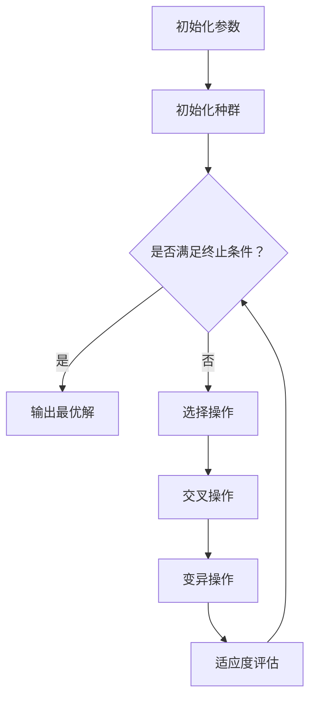
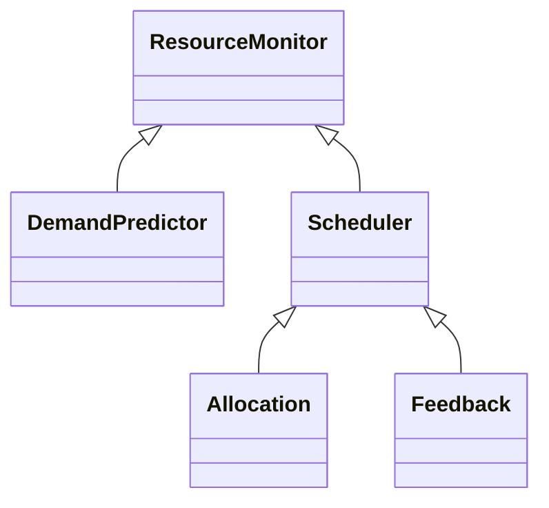
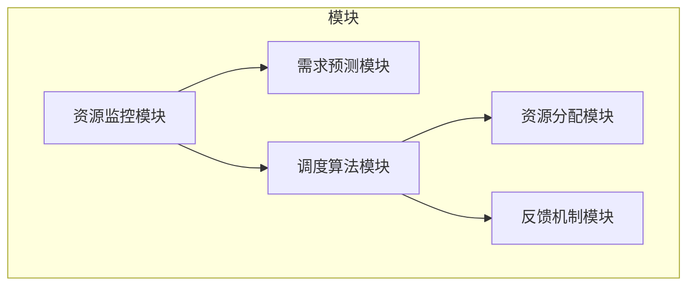
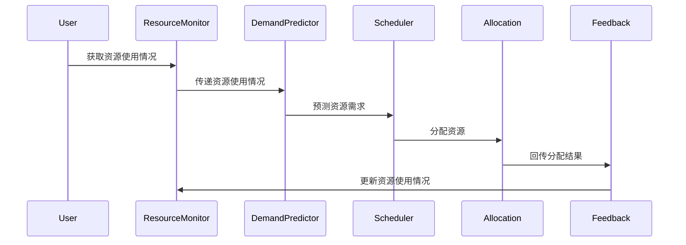

                 


### 文章标题：智能资源调度平台：AI优化企业资源分配

> 关键词：智能资源调度，AI优化，企业资源分配，算法原理，系统架构，实战案例

> 摘要：本文深入探讨了智能资源调度平台在AI优化企业资源分配方面的应用。通过详细阐述平台的基本原理、算法实现、系统架构以及实际案例，本文旨在为企业提供一套切实可行的智能资源调度解决方案。

## 1. 背景介绍

### 1.1 问题背景

在现代企业运营中，资源分配是一个关键环节。传统的资源分配方式往往依赖于经验和主观判断，导致资源利用效率低下，且容易产生资源浪费。随着云计算、大数据和人工智能等技术的快速发展，企业开始探索如何利用AI技术来优化资源分配，提高运营效率。

### 1.2 智能资源调度平台的概念

智能资源调度平台是一种基于人工智能技术的系统，它能够根据企业的实际需求，动态调整和优化资源分配，实现资源的最优利用。这种平台通常包含多个模块，如资源监控、需求预测、调度算法和反馈机制等。

### 1.3 AI优化在企业资源分配中的优势

AI优化技术在企业资源分配中的应用，具有以下优势：

- **提高资源利用率**：通过精确预测和动态调整，最大限度地利用企业资源。
- **降低运营成本**：优化资源分配，减少不必要的浪费，降低运营成本。
- **提高决策效率**：利用AI技术，快速处理大量数据，为决策提供有力支持。
- **增强灵活性**：能够根据企业实时变化的需求，灵活调整资源分配策略。

### 1.4 问题解决

本书将从以下几个方面介绍智能资源调度平台：

- **核心概念与联系**：阐述智能资源调度平台和AI优化技术的基本原理。
- **算法原理讲解**：详细介绍平台中使用的算法原理和实现方法。
- **系统分析与架构设计**：分析平台的功能模块和系统架构。
- **项目实战**：通过实际案例，展示平台的应用效果和实施过程。
- **最佳实践与拓展**：提供实际应用中的最佳实践和注意事项。

### 1.5 边界与外延

智能资源调度平台主要应用于企业内部的资源分配，如计算资源、存储资源和网络资源等。然而，其基本原理和实现方法同样可以应用于其他领域，如智能制造、智慧城市等。

### 1.6 核心要素组成

智能资源调度平台的核心要素包括：

- **资源监控模块**：实时监控企业各类资源的使用情况。
- **需求预测模块**：基于历史数据和当前状态，预测未来资源需求。
- **调度算法模块**：根据预测结果和资源状况，动态调整资源分配。
- **反馈机制模块**：收集和分析资源分配效果，不断优化调度策略。

## 2. 核心概念与联系

### 2.1 智能资源调度平台的概念

智能资源调度平台是一种利用人工智能技术，实现企业资源优化分配的系统。它能够根据企业实际需求，动态调整和优化资源分配，实现资源的最优利用。

### 2.2 AI优化技术概述

AI优化技术是指利用人工智能算法，对复杂问题进行求解的技术。在智能资源调度平台中，常见的AI优化技术包括：

- **遗传算法**：通过模拟生物进化过程，寻找最优解。
- **粒子群优化算法**：模拟鸟群觅食行为，寻找最优解。
- **模拟退火算法**：模拟物理退火过程，寻找最优解。
- **深度学习**：利用神经网络，对复杂问题进行建模和求解。

### 2.3 概念属性特征对比

下面是几种常见AI优化算法的属性特征对比：

| 算法名称 | 特点 | 应用场景 |
| :---: | :---: | :---: |
| 遗传算法 | 全局搜索能力强，适用于大规模问题 | 航线规划、资源调度 |
| 粒子群优化算法 | 算法简单，易于实现，收敛速度快 | 调度问题、神经网络训练 |
| 模拟退火算法 | 能有效避免局部最优，适用于复杂问题 | 资源分配、旅行商问题 |
| 深度学习 | 强大的建模能力，适用于大数据问题 | 图像识别、自然语言处理 |

### 2.4 智能资源调度平台的ER图

以下是智能资源调度平台的ER图，展示了各实体之间的关系：

```mermaid
erDiagram
  Resource -->|监控| Demand
  Demand -->|预测| Scheduler
  Scheduler -->|分配| Allocation
  Allocation -->|反馈| Monitor
```

## 3. 算法原理讲解

### 3.1 算法mermaid流程图

以下是遗传算法的mermaid流程图：



### 3.2 Python源代码

以下是遗传算法的Python实现：

```python
import numpy as np

# 初始化参数
population_size = 100
染色体位数 = 10
交叉概率 = 0.8
变异概率 = 0.1

# 初始化种群
population = np.random.randint(2, size=(population_size, 染色体位数))

# 选择操作
def selection(population, fitness):
    # 实现选择操作
    pass

# 交叉操作
def crossover(parent1, parent2):
    # 实现交叉操作
    pass

# 变异操作
def mutation(individual):
    # 实现变异操作
    pass

# 适应度评估
def fitness_function(individual):
    # 实现适应度评估
    pass

# 运行遗传算法
while True:
    fitness = [fitness_function(individual) for individual in population]
    new_population = []
    for _ in range(int(population_size / 2)):
        parent1, parent2 = selection(population, fitness)
        child1, child2 = crossover(parent1, parent2)
        new_population.extend([mutation(child1), mutation(child2)])
    population = new_population
    if 满足终止条件:
        break

# 输出最优解
best_individual = max(population, key=fitness_function)
```

### 3.3 数学模型和公式

遗传算法的数学模型可以表示为：

$$
\text{适应度} = f(x)
$$

其中，$f(x)$ 是适应度函数，用于评估个体$x$的优劣。

### 3.4 举例说明

假设我们有一个企业，需要分配100台服务器。服务器有不同的性能和价格，企业希望以最低的成本满足一定的性能要求。

- **染色体**：染色体是一个长度为10的二进制串，每一位表示服务器的一种性能指标。
- **适应度函数**：适应度函数用于评估染色体的优劣，例如：
  $$
  f(x) = \frac{P(x)}{C(x)}
  $$
  其中，$P(x)$ 是染色体的性能总和，$C(x)$ 是染色体的成本总和。

通过遗传算法，我们可以找到一组最优的染色体，从而实现资源的最优分配。

## 4. 系统分析与架构设计方案

### 4.1 问题场景介绍

假设我们有一个企业，拥有多种不同类型的资源，如服务器、存储和网络带宽。企业需要根据实际需求，动态调整资源的分配，以满足生产任务的需求。

### 4.2 系统功能设计

以下是智能资源调度平台的功能模块：

- **资源监控模块**：实时监控企业各类资源的使用情况。
- **需求预测模块**：基于历史数据和当前状态，预测未来资源需求。
- **调度算法模块**：根据预测结果和资源状况，动态调整资源分配。
- **反馈机制模块**：收集和分析资源分配效果，不断优化调度策略。

以下是系统功能模块的Mermaid类图：



### 4.3 系统架构设计

以下是智能资源调度平台的系统架构图：



### 4.4 系统接口设计和系统交互

以下是智能资源调度平台的系统接口设计和系统交互序列图：



## 5. 项目实战

### 5.1 环境安装

搭建智能资源调度平台需要以下环境：

- 操作系统：Ubuntu 18.04
- Python版本：3.8
- 必需库：numpy，pandas，matplotlib

安装步骤：

1. 安装操作系统
2. 安装Python
3. 安装必需库

### 5.2 系统核心实现源代码

以下是智能资源调度平台的核心实现源代码：

```python
# 智能资源调度平台
class IntelligentResourceScheduler:
    def __init__(self, resource_monitor, demand_predictor, scheduler, allocation, feedback):
        self.resource_monitor = resource_monitor
        self.demand_predictor = demand_predictor
        self.scheduler = scheduler
        self.allocation = allocation
        self.feedback = feedback
    
    def run(self):
        while True:
            resources = self.resource_monitor.get_resources()
            demand = self.demand_predictor.predict_demand(resources)
            allocation = self.scheduler.allocate_resources(demand)
            self.allocation.apply_allocation(allocation)
            result = self.feedback.get_allocation_result()
            self.resource_monitor.update_resources(result)
```

### 5.3 代码应用解读与分析

代码中，我们定义了一个`IntelligentResourceScheduler`类，它包含了资源监控、需求预测、调度算法、资源分配和反馈机制等模块。`run`方法实现了智能资源调度平台的主要功能。

- **资源监控**：通过`resource_monitor`模块获取当前资源使用情况。
- **需求预测**：通过`demand_predictor`模块预测未来资源需求。
- **调度算法**：通过`scheduler`模块根据预测结果和资源状况，动态调整资源分配。
- **资源分配**：通过`allocation`模块将资源分配到具体任务中。
- **反馈机制**：通过`feedback`模块收集和分析资源分配效果，不断优化调度策略。

### 5.4 实际案例分析和详细讲解剖析

假设我们有一个企业，需要分配100台服务器。企业希望以最低的成本满足一定的性能要求。

1. **资源监控**：系统开始时，资源监控模块获取到当前企业共有100台服务器，每台服务器的性能和成本如下表：

| 服务器ID | 性能 | 成本 |
| :---: | :---: | :---: |
| 1 | 1000 | 2000 |
| 2 | 1500 | 3000 |
| ... | ... | ... |
| 100 | 500 | 1000 |

2. **需求预测**：基于历史数据和当前状态，需求预测模块预测未来需要50台服务器，每台服务器的性能要求为1000。

3. **调度算法**：调度算法模块根据预测结果和资源状况，采用遗传算法进行资源分配。初始种群为随机生成的100个染色体，每个染色体表示一种服务器的分配方案。

4. **资源分配**：资源分配模块将最优的染色体分配到具体的任务中，实现资源的最优利用。

5. **反馈机制**：反馈机制模块收集分配结果，分析资源分配效果，为下一次调度提供优化建议。

### 5.5 项目小结

通过实际案例，我们展示了智能资源调度平台在AI优化企业资源分配方面的应用。系统通过资源监控、需求预测、调度算法、资源分配和反馈机制等模块，实现了资源的最优利用。项目的成功实施为企业提供了高效的资源调度解决方案。

## 6. 最佳实践 tips、小结、注意事项、拓展阅读等内容

### 6.1 最佳实践 tips

1. **数据收集与清洗**：在搭建智能资源调度平台时，确保收集到的数据准确、完整和可靠。对数据进行分析和清洗，提高预测的准确性。
2. **算法选择**：根据具体应用场景，选择合适的AI优化算法。对于大规模问题，遗传算法和粒子群优化算法可能更为适用。
3. **系统监控与优化**：定期对系统进行监控和性能优化，确保资源调度平台的高效稳定运行。

### 6.2 小结

智能资源调度平台是一种利用AI技术优化企业资源分配的系统。通过资源监控、需求预测、调度算法、资源分配和反馈机制等模块，实现了资源的最优利用。实际案例展示了系统的应用效果和实施过程。

### 6.3 注意事项

1. **数据安全**：确保数据的安全性和隐私保护，防止数据泄露。
2. **系统稳定性**：确保系统在高负载情况下仍然稳定运行，避免资源分配错误。

### 6.4 拓展阅读

1. 《深度学习》 - Goodfellow, I., Bengio, Y., & Courville, A.
2. 《遗传算法与应用》 - Melanie Mitchell
3. 《云计算技术与应用》 - 陈国良，吴伟洪

## 作者信息

作者：AI天才研究院/AI Genius Institute & 禅与计算机程序设计艺术 /Zen And The Art of Computer Programming

