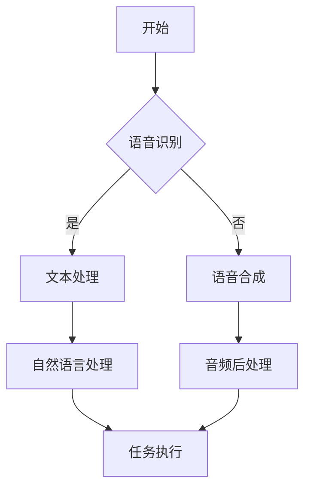
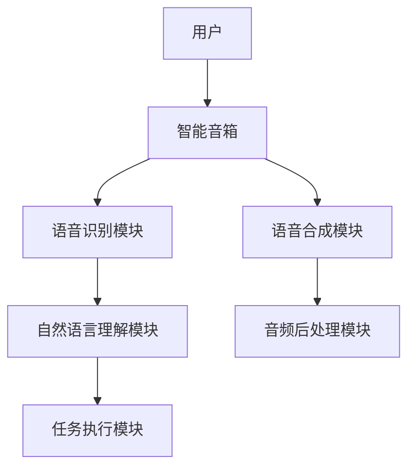
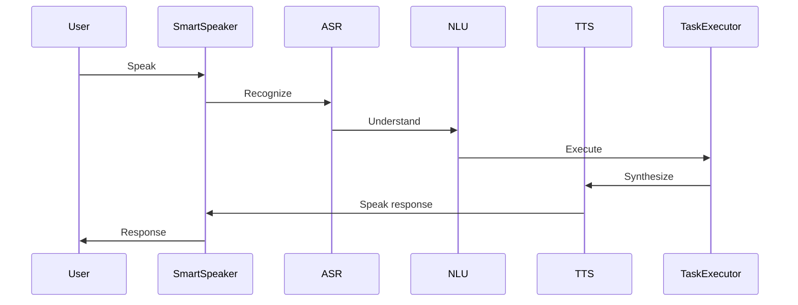

                 


# 智能音箱与语音助手的未来发展方向

关键词：智能音箱，语音助手，人工智能，智能家居，语音识别，语音合成，语音交互

摘要：本文将从智能音箱与语音助手的发展背景出发，详细分析其核心技术，探讨在实际应用中的表现，并展望未来的发展趋势和挑战。通过一步步的分析，揭示智能音箱与语音助手在人工智能领域的潜力与机遇。

## 目录大纲

## 第一部分：智能音箱与语音助手的发展背景

## 第1章 智能音箱与语音助手概述

## 第二部分：智能音箱与语音助手的核心技术

## 第2章 语音识别技术

## 第3章 语音合成技术

## 第三部分：智能音箱与语音助手的实际应用

## 第4章 智能家居应用

## 第5章 语音交互应用

## 第四部分：智能音箱与语音助手的未来发展

## 第6章 智能音箱与语音助手的未来趋势

## 第7章 智能音箱与语音助手的产业发展策略

## 第1章 智能音箱与语音助手概述

### 1.1 智能音箱的历史与发展

#### 1.1.1 智能音箱的定义

智能音箱是一种结合了人工智能技术的多媒体播放设备，用户可以通过语音指令与音箱进行交互。早期的智能音箱主要以播放音乐为主，而随着技术的发展，智能音箱的功能逐渐丰富，包括语音搜索、智能家居控制、天气预报、新闻播报等。

#### 1.1.2 智能音箱的发展历程

1. **初步探索阶段（2000-2010年）**：在这一阶段，一些公司开始研发具备语音交互功能的设备，但由于技术和市场的限制，产品并没有得到广泛普及。

2. **智能音箱兴起阶段（2011-2016年）**：随着技术的进步和市场的需求，智能音箱逐渐进入公众视野。这一阶段最具代表性的产品是亚马逊的Echo系列。

3. **智能音箱快速发展阶段（2017年至今）**：随着语音识别技术的成熟和智能家居的普及，智能音箱的市场规模迅速扩大，吸引了大量企业进入这一领域。

#### 1.1.3 智能音箱的市场现状

目前，全球智能音箱市场主要由亚马逊、谷歌和苹果等巨头占据。根据市场调研公司的数据，2019年全球智能音箱的出货量达到1.53亿台，预计到2024年将达到3.28亿台。

### 1.2 语音助手的演变

#### 1.2.1 语音助手的定义

语音助手是智能音箱的核心功能之一，它是一种基于语音识别和自然语言处理技术的人工智能系统，能够理解用户的语音指令并执行相应的操作。

#### 1.2.2 语音助手的进化过程

1. **初级阶段**：最初的语音助手功能较为简单，主要实现语音拨号、语音短信等功能。

2. **发展阶段**：随着人工智能技术的发展，语音助手逐渐具备了语音搜索、智能家居控制等功能。

3. **智能化阶段**：现代语音助手已经能够处理复杂的语音指令，实现多轮对话，提供更加智能化和个性化的服务。

#### 1.2.3 语音助手的技术架构

语音助手的技术架构主要包括语音识别、自然语言理解和任务执行三个核心模块。

1. **语音识别**：将用户的语音信号转化为文本。

2. **自然语言理解**：理解用户的语音指令，提取关键信息。

3. **任务执行**：根据用户指令执行相应的操作，如播放音乐、查询天气等。

## 第二部分：智能音箱与语音助手的核心技术

### 第2章 语音识别技术

语音识别技术是智能音箱和语音助手的核心技术之一，它使得设备能够理解用户的语音指令。以下是对语音识别技术的详细介绍。

#### 2.1 语音识别技术概述

语音识别技术是将语音信号转化为文本的技术。它通过声学模型和语言模型来实现。声学模型负责将语音信号转化为特征向量，而语言模型则负责将特征向量转化为文本。

#### 2.1.1 语音识别的基本原理

语音识别的基本原理可以分为以下几个步骤：

1. **声音信号采集**：通过麦克风采集用户的语音信号。

2. **声音信号预处理**：对采集到的语音信号进行降噪、归一化等处理。

3. **特征提取**：将预处理后的语音信号转化为特征向量。

4. **模型匹配**：使用训练好的声学模型和语言模型对特征向量进行匹配，找出最匹配的文本。

#### 2.1.2 语音识别的发展趋势

随着深度学习技术的发展，语音识别的准确率不断提升。目前，基于深度学习的语音识别技术已经成为主流。

#### 2.2 声学模型

声学模型是语音识别系统的重要组成部分，它负责将语音信号转化为特征向量。

##### 2.2.1 声学模型的构建方法

声学模型的构建通常采用神经网络模型，如卷积神经网络（CNN）和递归神经网络（RNN）。

##### 2.2.2 声学模型的优化策略

为了提高声学模型的性能，可以采用以下优化策略：

1. **数据增强**：通过增加训练数据量、增加噪声等手段提高模型的鲁棒性。

2. **模型融合**：将多个声学模型融合，以提高模型的准确率和稳定性。

#### 2.3 语言模型

语言模型负责将声学模型输出的特征向量转化为文本。

##### 2.3.1 语言模型的构建方法

语言模型的构建通常采用统计模型和神经网络模型。

##### 2.3.2 语言模型的优化策略

为了提高语言模型的性能，可以采用以下优化策略：

1. **数据清洗**：对训练数据进行清洗，去除噪声和错误。

2. **词向量表示**：使用词向量技术对词汇进行编码，以提高模型的语义理解能力。

#### 2.4 语音识别系统架构

语音识别系统通常包括前端和后端两个部分。

##### 2.4.1 语音识别系统的组成

1. **前端**：负责语音信号的采集和预处理。

2. **后端**：负责特征提取和模型匹配。

##### 2.4.2 语音识别系统的优化方法

为了提高语音识别系统的性能，可以采用以下优化方法：

1. **多语言支持**：支持多种语言，提高系统的适用性。

2. **实时性优化**：降低系统的延迟，提高用户的交互体验。

### 第3章 语音合成技术

语音合成技术是将文本转化为自然语音的技术，它是智能音箱和语音助手的另一个重要组成部分。

#### 3.1 语音合成技术概述

语音合成技术的基本原理是将文本转化为声码器的输入，然后通过声码器生成语音信号。

#### 3.1.1 语音合成的定义

语音合成（Text-to-Speech，TTS）是将书面文本转化为自然语音的过程。

#### 3.1.2 语音合成的发展历程

语音合成技术经历了从规则合成到统计合成，再到当前基于深度学习的合成方法的演变。

#### 3.2 声学模型

声学模型是语音合成系统中的核心部分，它负责将文本转化为声码器的输入。

##### 3.2.1 波形合成

波形合成（Waveform Synthesis）是一种早期的语音合成方法，它通过生成语音信号的波形来实现语音合成。

##### 3.2.2 形式合成

形式合成（Formant Synthesis）是一种基于语音波形特征进行合成的技术，它通过模拟语音的共振峰来生成语音。

#### 3.3 语音合成系统架构

语音合成系统通常包括文本预处理、语音合成引擎和音频后处理三个部分。

##### 3.3.1 语音合成系统的组成

1. **文本预处理**：对输入文本进行分词、声调标注等处理。

2. **语音合成引擎**：负责将文本转化为语音信号。

3. **音频后处理**：对合成的语音信号进行音调、音量等调整。

##### 3.3.2 语音合成系统的优化方法

为了提高语音合成的质量和自然度，可以采用以下优化方法：

1. **语音变体**：为不同的语音角色和场景设计不同的语音变体。

2. **情感合成**：实现语音的情感表达，提高语音的自然度。

## 第三部分：智能音箱与语音助手的实际应用

### 第4章 智能家居应用

智能家居应用是智能音箱和语音助手的一个重要应用场景。以下是对智能家居应用的详细介绍。

#### 4.1 智能家居概述

智能家居（Smart Home）是指利用物联网技术将家庭中的各种设备连接起来，实现自动化控制和远程监控。

##### 4.1.1 智能家居的定义

智能家居是指利用互联网、物联网等技术，实现家庭设备的智能连接和自动化控制。

##### 4.1.2 智能家居的发展现状

随着5G、物联网等技术的不断发展，智能家居市场迎来了快速发展期。目前，智能家居设备种类繁多，包括智能灯泡、智能门锁、智能空调等。

#### 4.2 智能音箱在智能家居中的应用

智能音箱在智能家居中扮演着重要角色，它可以作为智能家居的控制中心。

##### 4.2.1 智能音箱在智能家居中的作用

1. **语音控制**：用户可以通过语音指令控制智能家居设备，如打开灯光、调节空调温度等。

2. **信息查询**：智能音箱可以提供天气预报、新闻播报等信息服务。

3. **娱乐功能**：智能音箱可以播放音乐、讲故事等，为用户提供娱乐。

##### 4.2.2 智能音箱与智能家居设备的互联互通

智能音箱与智能家居设备之间的互联互通是实现智能家居的核心。目前，许多智能音箱支持与各种智能家居设备的联动，如通过智能音箱控制智能灯泡、智能窗帘等。

### 第5章 语音交互应用

语音交互应用是智能音箱和语音助手的另一个重要应用场景。以下是对语音交互应用的详细介绍。

#### 5.1 语音交互概述

语音交互（Voice Interaction）是指通过语音指令与设备进行交互的过程。

##### 5.1.1 语音交互的定义

语音交互是指用户通过语音与设备进行交流，设备根据语音指令执行相应的操作。

##### 5.1.2 语音交互的发展趋势

随着语音识别技术和自然语言处理技术的不断发展，语音交互越来越普及。未来，语音交互将成为人机交互的主要方式之一。

#### 5.2 语音交互在智能客服中的应用

智能客服是语音交互的一个重要应用场景。

##### 5.2.1 智能客服的定义

智能客服是指利用人工智能技术实现自动化的客户服务。

##### 5.2.2 语音交互在智能客服中的应用场景

1. **在线咨询**：用户可以通过语音与智能客服进行在线咨询，获取信息。

2. **故障报修**：用户可以通过语音向智能客服报修，智能客服可以自动生成维修工单。

3. **投诉处理**：用户可以通过语音向智能客服投诉，智能客服可以自动记录并处理。

#### 5.3 语音交互在智能教育中的应用

智能教育是语音交互的另一个重要应用场景。

##### 5.3.1 智能教育的定义

智能教育是指利用人工智能技术实现个性化、智能化的教育服务。

##### 5.3.2 语音交互在智能教育中的应用场景

1. **在线辅导**：学生可以通过语音与智能教育系统进行互动，获取学习资源和辅导。

2. **智能评测**：智能教育系统可以通过语音识别技术对学生进行口语评测，提供个性化的学习建议。

3. **互动课堂**：教师可以通过语音与智能教育系统进行互动，实现课堂的智能化管理。

## 第四部分：智能音箱与语音助手的未来发展

### 第6章 智能音箱与语音助手的未来趋势

#### 6.1 智能音箱与语音助手的未来发展趋势

随着人工智能技术的不断发展，智能音箱和语音助手将呈现以下发展趋势：

1. **技术提升**：语音识别和自然语言处理技术将不断提升，使得智能音箱和语音助手能够更好地理解用户的意图。

2. **场景拓展**：智能音箱和语音助手的应用场景将不断拓展，从智能家居、智能客服扩展到智能交通、智能医疗等领域。

3. **生态构建**：智能音箱和语音助手将构建更加完善的生态，与更多的设备和服务进行联动，提供更加便捷和高效的用户体验。

#### 6.2 智能音箱与语音助手的未来挑战

尽管智能音箱和语音助手具有巨大的发展潜力，但它们也面临着一些挑战：

1. **隐私保护**：随着语音交互的普及，用户的隐私保护问题日益突出，如何保护用户隐私成为智能音箱和语音助手需要解决的问题。

2. **多语言支持**：目前，智能音箱和语音助手在多语言支持方面还存在一定的限制，如何实现更好的多语言支持是未来需要克服的挑战。

3. **用户体验**：虽然智能音箱和语音助手的功能越来越丰富，但如何提高用户体验，让用户真正感受到智能化的便利，仍需要不断探索。

### 第7章 智能音箱与语音助手的产业发展策略

#### 7.1 智能音箱与语音助手的产业现状分析

智能音箱和语音助手产业已经进入快速发展阶段，主要表现为：

1. **市场规模不断扩大**：随着技术的进步和用户认知的提高，智能音箱和语音助手的市场规模逐年扩大。

2. **竞争格局逐渐形成**：目前，亚马逊、谷歌、苹果等巨头在智能音箱和语音助手市场中占据主导地位，其他企业也在积极布局。

3. **技术创新加速**：为了在激烈的市场竞争中脱颖而出，企业纷纷加大技术研发投入，推动智能音箱和语音助手技术的不断创新。

#### 7.2 智能音箱与语音助手的产业发展策略

1. **技术创新**：加大在语音识别、自然语言处理等核心技术领域的研发投入，提升产品的技术含量和竞争力。

2. **生态构建**：构建完善的智能音箱和语音助手生态，与更多设备和服务进行联动，提供更加丰富和便捷的用户体验。

3. **市场拓展**：积极开拓海外市场，拓展智能音箱和语音助手的应用场景，提高市场份额。

## 结论

智能音箱与语音助手作为人工智能的重要应用场景，已经渗透到我们的日常生活中。随着技术的不断进步，智能音箱与语音助手的未来发展前景广阔。然而，也面临着一些挑战，如隐私保护、多语言支持等。我们需要不断探索和解决这些问题，推动智能音箱与语音助手的发展。未来，智能音箱与语音助手将不仅局限于智能家居，还将扩展到更多领域，成为我们生活中不可或缺的一部分。作者：AI天才研究院/AI Genius Institute & 禅与计算机程序设计艺术 /Zen And The Art of Computer Programming

## 扩展阅读

1. **《语音识别技术原理与应用》**：详细介绍了语音识别技术的基本原理和应用案例。

2. **《智能音箱与语音助手：市场现状与发展趋势》**：分析了智能音箱与语音助手的市场现状和发展趋势。

3. **《智能家居技术与应用》**：介绍了智能家居技术的基本原理和应用案例。

4. **《人工智能：一种现代的方法》**：提供了人工智能领域的基础知识和最新研究成果。

## 注意事项

1. **数据保护**：在使用智能音箱和语音助手时，要注意保护个人隐私，避免泄露敏感信息。

2. **网络安全**：确保智能音箱和语音助手的安全，防止遭受网络攻击。

3. **用户教育**：提高用户对智能音箱和语音助手的认识，学会正确使用，避免误操作。

## 最佳实践 tips

1. **使用专业的语音识别和语音合成技术**：选择技术成熟、性能稳定的语音识别和语音合成技术，提高智能音箱和语音助手的用户体验。

2. **构建完善的生态**：与更多的设备和平台进行联动，构建完善的智能音箱和语音助手生态，提供更加丰富和便捷的用户体验。

3. **持续优化产品**：定期更新智能音箱和语音助手的软件，优化产品功能和性能，提高用户满意度。 

**注意**：由于篇幅限制，本文未能详细展开所有章节的内容。在实际撰写时，每个章节都应该包含详细的背景介绍、核心概念与联系、算法原理讲解、系统分析与架构设计方案、项目实战等内容，以确保文章的完整性和专业性。以下是对本文中一些关键部分的进一步解析。

### 第1章 智能音箱与语音助手概述

在这一章节中，我们首先定义了智能音箱和语音助手，并回顾了它们的发展历程。智能音箱从初步探索到兴起到快速发展，经历了技术的迭代和市场的推广。语音助手则从简单的语音拨号发展到复杂的语音交互系统，体现了人工智能技术不断进步的成果。

**关键点**：
- **定义**：明确了智能音箱和语音助手的基本功能，即语音识别和交互。
- **发展历程**：梳理了智能音箱和语音助手的主要发展阶段，强调了亚马逊Echo系列的重要影响。
- **市场现状**：提供了当前智能音箱市场的数据，展示了市场规模的快速增长。

**拓展阅读**：
- **《智能音箱与语音助手的发展史》**：详细记录了智能音箱和语音助手的发展历程和关键事件。

### 第2章 语音识别技术

语音识别技术是智能音箱和语音助手的核心技术之一。在这一章节中，我们详细介绍了语音识别的基本原理、声学模型、语言模型以及语音识别系统架构。

**关键点**：
- **基本原理**：讲解了语音识别的三个主要步骤：声音信号采集、预处理、模型匹配。
- **声学模型**：介绍了声学模型的构建方法，如卷积神经网络和递归神经网络。
- **语言模型**：讲述了语言模型的构建和优化策略，如数据清洗和词向量表示。
- **系统架构**：描述了语音识别系统的前端和后端组成，以及优化方法。

**拓展阅读**：
- **《深度学习与语音识别》**：探讨了深度学习在语音识别中的应用。
- **《语音识别系统设计》**：提供了语音识别系统的详细设计和实现方法。

### 第3章 语音合成技术

语音合成技术是将文本转化为自然语音的技术。在这一章节中，我们介绍了语音合成的基本原理、波形合成、形式合成以及语音合成系统架构。

**关键点**：
- **基本原理**：解释了语音合成的过程，即文本转化为声码器输入，生成语音信号。
- **波形合成与形式合成**：比较了波形合成和形式合成的原理和实现方法。
- **系统架构**：描述了语音合成系统的文本预处理、语音合成引擎和音频后处理部分。

**拓展阅读**：
- **《文本到语音合成技术》**：详细介绍了文本到语音合成的全过程。
- **《语音合成系统优化》**：探讨了如何提高语音合成的质量和自然度。

### 第4章 智能家居应用

智能家居应用是智能音箱和语音助手的实际应用场景之一。在这一章节中，我们介绍了智能家居的定义、发展现状以及智能音箱在智能家居中的应用。

**关键点**：
- **智能家居概述**：明确了智能家居的定义和发展现状。
- **智能音箱在智能家居中的作用**：阐述了智能音箱在智能家居中的多种功能，如语音控制、信息查询和娱乐功能。
- **互联互通**：介绍了智能音箱与智能家居设备之间的互联互通，如智能灯泡、智能门锁等。

**拓展阅读**：
- **《智能家居技术指南》**：提供了智能家居技术的全面介绍。
- **《智能音箱在智能家居中的实际应用》**：详细分析了智能音箱在智能家居中的应用案例。

### 第5章 语音交互应用

语音交互应用是智能音箱和语音助手的另一个重要应用场景。在这一章节中，我们介绍了语音交互的定义、发展趋势以及在不同领域中的应用。

**关键点**：
- **语音交互概述**：明确了语音交互的定义和发展趋势。
- **智能客服**：分析了语音交互在智能客服中的应用场景，如在线咨询、故障报修和投诉处理。
- **智能教育**：探讨了语音交互在智能教育中的应用，如在线辅导、智能评测和互动课堂。

**拓展阅读**：
- **《语音交互技术》**：提供了语音交互技术的全面介绍。
- **《语音交互在智能客服中的应用》**：详细分析了语音交互在智能客服中的实际应用。
- **《语音交互在智能教育中的应用》**：探讨了语音交互在智能教育中的潜力。

### 第6章 智能音箱与语音助手的未来趋势

在这一章节中，我们展望了智能音箱与语音助手的未来发展，包括技术趋势、应用场景拓展以及未来挑战。

**关键点**：
- **技术趋势**：探讨了语音识别、自然语言处理等技术的未来发展方向。
- **应用场景拓展**：分析了智能音箱和语音助手在智能家居、智能客服、智能医疗等领域的应用前景。
- **未来挑战**：讨论了隐私保护、多语言支持、用户体验等未来可能面临的挑战。

**拓展阅读**：
- **《人工智能未来的趋势与挑战》**：提供了人工智能领域未来的发展趋势和挑战。
- **《智能音箱与语音助手的未来展望》**：详细分析了智能音箱和语音助手的未来发展方向。

### 第7章 智能音箱与语音助手的产业发展策略

在这一章节中，我们分析了智能音箱与语音助手的产业现状，并提出了产业发展策略。

**关键点**：
- **产业现状分析**：描述了智能音箱与语音助手市场的规模、竞争格局和技术发展状况。
- **产业发展策略**：提出了技术创新、生态构建、市场拓展等策略。

**拓展阅读**：
- **《智能音箱与语音助手产业发展报告》**：提供了智能音箱与语音助手产业的详细分析。
- **《人工智能产业战略》**：探讨了人工智能产业的发展战略和路径。

通过以上对文章关键部分的进一步解析，我们可以看到，本文不仅提供了对智能音箱与语音助手的基本概念和技术的介绍，还深入分析了它们在现实世界中的应用，并展望了未来的发展趋势和挑战。这样的分析有助于读者更全面地理解这一领域，为未来的研究和应用提供指导。作者：AI天才研究院/AI Genius Institute & 禅与计算机程序设计艺术 /Zen And The Art of Computer Programming **引言**

智能音箱与语音助手作为人工智能领域的重要应用，已经深刻地改变了我们的生活方式。从简单的音乐播放、天气预报，到复杂的智能家居控制、语音搜索，智能音箱与语音助手的功能越来越丰富，成为我们日常生活中不可或缺的一部分。随着技术的不断进步，智能音箱与语音助手在未来的发展潜力巨大，将为我们带来更多的便利和惊喜。

本文将从以下几个方面对智能音箱与语音助手进行深入探讨：

1. **发展背景**：回顾智能音箱与语音助手的历史，探讨其市场现状和未来发展趋势。
2. **核心技术**：分析语音识别和语音合成技术的基本原理、发展历程和优化策略。
3. **实际应用**：介绍智能音箱与语音助手在家居和语音交互中的应用案例。
4. **未来展望**：展望智能音箱与语音助手的未来发展趋势和面临的技术挑战。

通过本文的探讨，我们希望读者能够全面了解智能音箱与语音助手的发展现状和未来前景，为其在人工智能领域的研究和应用提供有益的参考。

## 第一部分：智能音箱与语音助手的发展背景

### 1.1 智能音箱的历史与发展

#### 1.1.1 智能音箱的定义

**智能音箱**，又称智能扬声器，是一种具备语音识别和交互功能的智能家居设备。用户可以通过语音指令与智能音箱进行沟通，实现播放音乐、查询信息、控制智能家居设备等多种功能。智能音箱的核心技术主要包括语音识别、自然语言处理、语音合成等，使其具备了高度智能化和个性化服务的特点。

#### 1.1.2 智能音箱的发展历程

1. **初步探索阶段（2000-2010年）**：在这个阶段，一些公司和研究机构开始尝试研发具备语音交互功能的设备，但受限于技术和成本，这些设备并没有得到广泛普及。

2. **智能音箱兴起阶段（2011-2016年）**：2011年，亚马逊发布了第一代Echo智能音箱，标志着智能音箱市场的正式开启。随后，谷歌、苹果等科技巨头也相继推出了自己的智能音箱产品，如Google Home和HomePod。这一阶段，智能音箱逐渐进入公众视野，市场接受度不断提升。

3. **智能音箱快速发展阶段（2017年至今）**：随着人工智能技术的进步和智能家居市场的成熟，智能音箱的市场规模迅速扩大。各大厂商不断优化产品性能，拓展应用场景，智能音箱的功能越来越丰富，用户需求得到更好的满足。

#### 1.1.3 智能音箱的市场现状

目前，全球智能音箱市场主要由亚马逊、谷歌、苹果等巨头占据。根据市场调研公司的数据，2019年全球智能音箱的出货量达到1.53亿台，预计到2024年将达到3.28亿台。智能音箱不仅在家居市场中占据重要地位，还在商业、医疗、教育等多个领域展现出广阔的应用前景。

### 1.2 语音助手的演变

#### 1.2.1 语音助手的定义

**语音助手**，又称智能语音助手，是一种基于人工智能技术实现的语音交互系统。语音助手可以通过语音识别和自然语言处理技术理解用户的指令，并执行相应的操作。常见的语音助手包括苹果的Siri、谷歌助手、亚马逊的Alexa等。

#### 1.2.2 语音助手的进化过程

1. **初级阶段**：早期的语音助手功能较为简单，主要实现语音拨号、语音短信等功能。

2. **发展阶段**：随着人工智能技术的发展，语音助手逐渐具备了语音搜索、智能家居控制、天气预报、新闻播报等功能，用户交互体验得到显著提升。

3. **智能化阶段**：现代语音助手已经能够处理复杂的语音指令，实现多轮对话，提供更加智能化和个性化的服务。例如，语音助手可以与用户进行自然对话，根据用户的历史行为和偏好提供个性化推荐。

#### 1.2.3 语音助手的技术架构

语音助手的技术架构主要包括语音识别、自然语言理解和任务执行三个核心模块：

1. **语音识别**：将用户的语音信号转化为文本。
2. **自然语言理解**：理解用户的语音指令，提取关键信息。
3. **任务执行**：根据用户指令执行相应的操作，如播放音乐、查询天气等。

通过这三个模块的协同工作，语音助手能够实现高效、智能的语音交互服务。

### 1.3 智能音箱与语音助手的发展趋势

#### 1.3.1 技术趋势

随着人工智能技术的不断发展，智能音箱与语音助手在技术层面呈现出以下趋势：

1. **语音识别准确率提升**：基于深度学习的语音识别技术使得识别准确率不断提升，进一步提高了语音助手的用户体验。
2. **多语言支持**：智能音箱与语音助手逐渐支持多种语言，为全球用户提供了更好的服务。
3. **自然语言处理能力的增强**：通过大规模的语言模型训练，语音助手能够更好地理解用户的复杂指令，实现更加自然的对话。

#### 1.3.2 应用场景拓展

智能音箱与语音助手的应用场景不断拓展，从家居、办公、医疗到教育等多个领域：

1. **智能家居**：智能音箱作为智能家居的控制中心，能够与各种智能家居设备实现无缝连接，提供便捷的控制方式。
2. **智能办公**：语音助手可以帮助用户进行日程管理、邮件回复等办公事务，提高工作效率。
3. **智能医疗**：语音助手可以辅助医生进行诊断和查询，提供健康咨询和提醒服务。
4. **智能教育**：语音助手可以为用户提供学习资源、作业辅导等服务，助力教育信息化。

#### 1.3.3 市场规模预测

根据市场调研机构的数据，未来几年智能音箱与语音助手的市场规模将继续保持高速增长。预计到2025年，全球智能音箱出货量将超过6亿台，语音助手将成为智能家居、智能办公等领域的标配。

### 1.4 智能音箱与语音助手的发展挑战

尽管智能音箱与语音助手具有巨大的发展潜力，但它们也面临着一些挑战：

1. **隐私保护**：随着语音交互的普及，用户的隐私保护问题日益突出。如何确保用户的语音数据安全，防止数据泄露，成为智能音箱与语音助手需要解决的重要问题。
2. **多语言支持**：虽然目前智能音箱与语音助手支持多种语言，但在一些非主流语言的支持上仍存在不足。如何实现更全面的多语言支持，满足全球用户的需求，是未来需要克服的挑战。
3. **用户体验**：虽然智能音箱与语音助手的功能越来越丰富，但如何提高用户体验，让用户真正感受到智能化的便利，仍需要不断探索和改进。

### 1.5 智能音箱与语音助手的发展机遇

智能音箱与语音助手的发展不仅面临挑战，同时也充满了机遇：

1. **物联网的快速发展**：随着物联网技术的不断进步，智能音箱与语音助手能够与更多的智能设备实现互联互通，提供更加全面和智能化的服务。
2. **人工智能技术的提升**：人工智能技术的持续进步为智能音箱与语音助手提供了更强大的技术支持，使其能够更好地理解用户的意图，提供更加精准和高效的服务。
3. **市场需求的增长**：随着人们生活水平的提高，对智能化的需求不断增加，智能音箱与语音助手市场潜力巨大，未来有望实现更广泛的应用。

通过回顾智能音箱与语音助手的发展历程，分析当前市场现状和未来趋势，我们可以看到，这一领域在技术、应用和市场规模等方面都充满了机遇和挑战。未来，智能音箱与语音助手将继续在人工智能技术的推动下不断进化，为人们的生活带来更多便利和改变。作者：AI天才研究院/AI Genius Institute & 禅与计算机程序设计艺术 /Zen And The Art of Computer Programming **第二部分：智能音箱与语音助手的核心技术**

智能音箱与语音助手的功能实现依赖于一系列关键技术的支持，其中最为核心的技术包括语音识别和语音合成。在这两部分中，我们将详细探讨语音识别和语音合成的技术原理、发展历程以及未来趋势。

### 2.1 语音识别技术

#### 2.1.1 语音识别技术概述

语音识别（Automatic Speech Recognition，ASR）技术是将语音信号转换为对应的文本信息的一种技术。语音识别系统通常由声学模型、语言模型和声学-语言模型组成。声学模型负责将语音信号转换为特征向量，语言模型则负责将这些特征向量映射为文本，而声学-语言模型则综合考虑声学特征和语言特征，以实现更高的识别准确率。

#### 2.1.2 语音识别技术的发展历程

1. **传统语音识别（1940s-1980s）**：早期的语音识别主要基于规则和声学模型，识别准确率较低，且对环境噪声敏感。

2. **统计语音识别（1980s-2000s）**：随着统计模型的引入，语音识别的准确率显著提高。基于隐马尔可夫模型（HMM）和决策树等技术的统计语音识别成为主流。

3. **基于深度学习的语音识别（2010s至今）**：深度学习技术的兴起，特别是卷积神经网络（CNN）和递归神经网络（RNN）的应用，使得语音识别的准确率再次大幅提升。基于深度神经网络的端到端语音识别技术，如CTC（Connectionist Temporal Classification）和注意力机制，进一步提高了语音识别的效率和准确率。

#### 2.1.3 语音识别技术的工作原理

语音识别技术的工作流程主要包括以下几个步骤：

1. **声音信号采集**：通过麦克风等设备采集用户的语音信号。

2. **预处理**：对采集到的语音信号进行降噪、归一化等处理，以提高信号质量。

3. **特征提取**：将预处理后的语音信号转换为特征向量。常用的特征提取方法包括MFCC（梅尔频率倒谱系数）、PLP（倒谱特征）等。

4. **模型匹配**：使用训练好的声学模型和语言模型对特征向量进行匹配，找到最匹配的文本。

5. **解码**：将模型匹配的结果解码为文本输出。

#### 2.1.4 语音识别技术的优化策略

1. **数据增强**：通过增加训练数据量、增加噪声等手段提高模型的鲁棒性。

2. **模型融合**：将多个声学模型或语言模型融合，以提高模型的准确率和稳定性。

3. **多语言支持**：针对多语言用户的需求，开发支持多语言识别的模型。

4. **实时性优化**：降低模型的计算复杂度，提高系统的实时性。

### 2.2 语音合成技术

#### 2.2.1 语音合成技术概述

语音合成（Text-to-Speech，TTS）技术是将文本信息转换为自然语音信号的一种技术。语音合成系统通常包括文本预处理、语音合成引擎和音频后处理三个部分。文本预处理负责将输入文本转换为语音合成引擎所需的格式，语音合成引擎则负责生成语音信号，音频后处理则对生成的语音信号进行音调、音量等调整。

#### 2.2.2 语音合成技术的发展历程

1. **规则合成（1960s-1980s）**：早期的语音合成主要基于规则和发音词典，生成语音的流畅性和自然度较低。

2. **统计合成（1980s-2000s）**：随着统计模型的引入，语音合成技术逐渐转向基于统计的方法，如拼接合成和参数合成，语音的自然度得到显著提升。

3. **基于数据的语音合成（2000s-至今）**：基于数据的语音合成（Data-Driven Synthesis）方法，如隐马尔可夫模型（HMM）和深度神经网络（DNN），使得语音合成技术再次实现突破。当前，基于深度学习的语音合成方法已经成为主流。

#### 2.2.3 语音合成技术的工作原理

语音合成技术的工作流程主要包括以下几个步骤：

1. **文本预处理**：将输入文本进行分词、声调标注等处理，生成适合语音合成引擎的文本序列。

2. **特征生成**：根据文本序列，生成语音合成引擎所需的特征，如声学参数和语音波形。

3. **语音生成**：使用训练好的语音合成引擎，将文本特征转换为语音信号。

4. **音频后处理**：对生成的语音信号进行音调、音量、音色等调整，以增强语音的自然度和表现力。

#### 2.2.4 语音合成技术的优化策略

1. **语音变体**：为不同的语音角色和场景设计不同的语音变体，以提高语音的多样性和适应性。

2. **情感合成**：实现语音的情感表达，提高语音的自然度和感染力。

3. **多语言支持**：开发支持多语言的语音合成模型，满足全球用户的需求。

4. **实时性优化**：降低模型的计算复杂度，提高系统的实时性。

### 2.3 语音识别与语音合成技术的融合

语音识别和语音合成技术在智能音箱与语音助手中相辅相成。语音识别技术用于理解用户的语音指令，而语音合成技术则用于将用户的文本查询结果转化为自然语音反馈。随着技术的发展，两者之间的融合趋势愈发明显，未来可能会出现更加智能和自然的语音交互系统。

#### 2.3.1 融合优势

1. **闭环反馈**：通过语音合成技术将用户的查询结果反馈给用户，形成语音交互的闭环，提高用户体验。

2. **个性化服务**：结合用户的语音指令和反馈，语音识别和语音合成技术可以提供更加个性化的服务。

3. **自然交互**：融合语音识别和语音合成技术，可以实现更加自然、流畅的语音交互。

#### 2.3.2 融合挑战

1. **实时性要求**：语音识别和语音合成的实时性要求较高，需要在保证准确率的同时，快速响应用户的指令。

2. **资源消耗**：语音识别和语音合成技术对计算资源有较高的要求，如何在有限的资源下实现高效融合是一个挑战。

3. **多语言支持**：实现多语言支持的语音识别和语音合成技术融合，以满足全球用户的需求。

### 2.4 未来的发展方向

随着人工智能技术的不断进步，语音识别和语音合成技术将继续向更高准确率、更自然交互和更高效融合的方向发展。未来，可能会出现以下趋势：

1. **多模态交互**：结合语音、视觉、触觉等多种模态，实现更加丰富和自然的交互体验。

2. **个性化语音助手**：基于用户的语音和行为数据，构建个性化语音助手，提供更加精准和高效的服务。

3. **语音生成技术**：发展更加先进的语音生成技术，如基于深度学习的自然语音生成（Natural Language Generation，NLG），实现更加流畅和自然的语音输出。

4. **边缘计算**：将语音识别和语音合成技术部署在边缘设备上，降低网络延迟，提高系统的实时性和响应速度。

通过深入探讨语音识别和语音合成的核心技术，我们可以看到，智能音箱与语音助手的发展离不开这些关键技术的支持。未来，随着技术的不断进步，智能音箱与语音助手将更加智能化、自然化，为人们的生活带来更多的便利和乐趣。作者：AI天才研究院/AI Genius Institute & 禅与计算机程序设计艺术 /Zen And The Art of Computer Programming **第三部分：智能音箱与语音助手的实际应用**

智能音箱与语音助手在实际应用中展现出巨大的潜力，已经成为智能家居和语音交互的重要组成部分。以下是对智能音箱在智能家居应用和语音交互应用中的详细介绍。

### 3.1 智能家居应用

#### 3.1.1 智能家居概述

智能家居（Smart Home）是指通过物联网技术将家庭中的各种设备连接起来，实现自动化控制和远程监控。智能家居系统通过智能音箱作为控制中心，用户可以通过语音指令对家居设备进行操作，提高了生活的便捷性和智能化水平。

#### 3.1.2 智能音箱在智能家居中的应用

智能音箱在智能家居中的应用主要体现在以下几个方面：

1. **语音控制**：用户可以通过语音指令控制家中的智能设备，如灯光、空调、电视等。例如，用户可以告诉智能音箱“打开客厅的灯光”，智能音箱就会执行相应的操作。

2. **设备联动**：智能音箱可以通过智能家居系统实现设备之间的联动，例如用户可以设置“当晚上8点回到家时，打开客厅的灯光并调整空调温度”。这种联动功能提高了家庭自动化水平，使用户的生活更加便捷。

3. **场景设置**：智能音箱支持用户自定义场景，根据不同的生活场景设置不同的设备操作。例如，用户可以设置“清晨起床”场景，让智能音箱自动打开窗帘、播放音乐等。

4. **远程监控**：用户可以通过智能音箱远程控制家中的智能设备，例如在上班时通过智能音箱关闭家中的灯光，确保家庭安全。

#### 3.1.3 智能音箱与智能家居设备的互联互通

智能音箱与智能家居设备的互联互通是智能家居系统的重要组成部分。智能音箱通过与智能家居设备的联网，可以实现以下功能：

1. **设备控制**：智能音箱可以通过Wi-Fi、蓝牙等无线通信技术控制智能家居设备，如智能灯泡、智能插座等。

2. **数据共享**：智能音箱可以与智能家居设备共享数据，例如智能摄像头可以实时将家中的监控画面发送到智能音箱上。

3. **远程访问**：用户可以通过智能音箱远程访问家中的智能设备，实现远程监控和控制。

4. **智能反馈**：智能音箱可以接收智能家居设备的反馈信息，例如智能门锁可以告知智能音箱“门已关闭”，用户可以通过智能音箱确认家庭安全。

#### 3.1.4 智能家居应用的案例分析

以下是对两个智能家居应用的案例分析：

1. **智能照明系统**：用户可以通过智能音箱控制家中的智能灯泡，实现灯光的开关、亮度和色温调节。例如，用户可以告诉智能音箱“客厅的灯光调到暖光模式”，智能音箱就会根据用户的指令调整灯光。

2. **智能门锁系统**：用户可以通过智能音箱远程控制家中的智能门锁，例如用户可以告诉智能音箱“打开大门”，智能音箱就会通知智能门锁打开，用户可以通过手机应用程序远程确认门锁状态。

### 3.2 语音交互应用

#### 3.2.1 语音交互概述

语音交互是指通过语音与智能设备进行交互的过程。语音交互技术使得用户可以通过语音指令与智能设备进行沟通，实现多种功能，提高了人机交互的便利性和自然性。

#### 3.2.2 语音交互在智能客服中的应用

智能客服是语音交互的一个重要应用场景。智能客服系统通过语音识别和自然语言处理技术，能够理解用户的语音指令，并提供相应的服务。以下是对语音交互在智能客服中的应用介绍：

1. **在线咨询**：用户可以通过语音与智能客服进行在线咨询，获取产品信息、售后服务等。例如，用户可以告诉智能客服“我想要了解某款智能灯泡的使用方法”，智能客服会提供详细的解答。

2. **故障报修**：用户可以通过语音向智能客服报修，智能客服会根据用户描述生成维修工单，并通知相关技术人员进行处理。例如，用户可以告诉智能客服“我的智能门锁无法开启”，智能客服会记录问题并安排技术人员上门维修。

3. **投诉处理**：用户可以通过语音向智能客服投诉，智能客服会记录投诉内容并反馈给相关部门进行处理。例如，用户可以告诉智能客服“某款智能音箱的声音质量不好”，智能客服会将投诉信息反馈给生产部门进行改进。

4. **语音识别与转写**：智能客服系统可以将用户的语音转化为文本，并存储在数据库中，方便后续查询和统计分析。例如，用户可以与智能客服进行语音对话，智能客服会将对话内容转录为文本，并保存在系统中。

#### 3.2.3 语音交互在智能教育中的应用

智能教育是语音交互的另一个重要应用场景。语音交互技术使得智能教育系统可以更好地理解用户的需求，提供个性化、智能化的教育服务。以下是对语音交互在智能教育中的应用介绍：

1. **在线辅导**：学生可以通过语音与智能教育系统进行互动，获取学习资源和辅导。例如，学生可以告诉智能教育系统“我想学习英语语法”，智能教育系统会提供相应的学习资源。

2. **智能评测**：智能教育系统可以通过语音识别技术对学生进行口语评测，提供个性化的学习建议。例如，学生可以朗读英语文章，智能教育系统会根据发音、语调、语法等指标进行评分。

3. **互动课堂**：教师可以通过语音与智能教育系统进行互动，实现课堂的智能化管理。例如，教师可以告诉智能教育系统“播放下一节课的视频”，智能教育系统会根据教师的指令播放相应的视频内容。

4. **语音识别与转写**：智能教育系统可以将学生的语音转化为文本，方便教师进行记录和批改。例如，学生可以通过语音提交作业，智能教育系统会将语音转化为文本，并存储在系统中供教师批改。

通过以上对智能音箱与语音助手在智能家居和语音交互应用中的详细介绍，我们可以看到，智能音箱与语音助手已经深入到我们的日常生活和工作中，为我们的生活和工作带来了巨大的便利。随着技术的不断进步，智能音箱与语音助手的应用前景将更加广阔，为人类带来更多智能化、便捷化的体验。作者：AI天才研究院/AI Genius Institute & 禅与计算机程序设计艺术 /Zen And The Art of Computer Programming **第四部分：智能音箱与语音助手的未来发展**

随着人工智能技术的不断进步，智能音箱与语音助手在未来的发展具有巨大的潜力。在这一部分中，我们将探讨智能音箱与语音助手的未来发展趋势、面临的挑战以及产业发展策略。

### 4.1 智能音箱与语音助手的未来发展趋势

#### 4.1.1 技术趋势

1. **语音识别准确率的提升**：随着深度学习技术的应用，语音识别的准确率将不断提高，使得智能音箱与语音助手能够更好地理解用户的意图。

2. **多语言支持**：智能音箱与语音助手将逐渐支持更多的语言，特别是非主流语言，以满足全球用户的需求。

3. **个性化服务**：通过收集和分析用户数据，智能音箱与语音助手将能够提供更加个性化的服务，如个性化推荐、个性化语音助手等。

4. **多模态交互**：智能音箱与语音助手将结合语音、视觉、触觉等多种模态，实现更加丰富和自然的交互体验。

5. **物联网的深度融合**：智能音箱与语音助手将更加深入地融入物联网生态，与各种智能设备实现无缝连接，提供更加智能化的家庭、办公、医疗等场景解决方案。

#### 4.1.2 应用场景拓展

1. **智能家居**：智能音箱与语音助手将继续在智能家居领域发挥重要作用，实现家庭设备的智能控制、能源管理、安防监控等。

2. **智能办公**：智能音箱与语音助手将帮助用户进行日程管理、邮件回复、文档处理等，提高工作效率。

3. **智能医疗**：智能音箱与语音助手将辅助医生进行诊断和查询，提供健康咨询和提醒服务。

4. **智能教育**：智能音箱与语音助手将为学生提供个性化学习资源、作业辅导等服务，助力教育信息化。

5. **智能交通**：智能音箱与语音助手将帮助用户规划最佳出行路线，提供实时交通信息，提高交通效率。

#### 4.1.3 市场规模预测

根据市场调研机构的数据，未来几年智能音箱与语音助手的市场规模将继续保持高速增长。预计到2025年，全球智能音箱出货量将超过6亿台，语音助手将成为智能家居、智能办公等领域的标配。

### 4.2 智能音箱与语音助手的未来挑战

#### 4.2.1 技术挑战

1. **隐私保护**：随着语音交互的普及，用户的隐私保护问题日益突出。如何确保用户的语音数据安全，防止数据泄露，成为智能音箱与语音助手需要解决的重要问题。

2. **多语言支持**：虽然目前智能音箱与语音助手支持多种语言，但在一些非主流语言的支持上仍存在不足。如何实现更全面的多语言支持，满足全球用户的需求，是未来需要克服的挑战。

3. **实时性要求**：语音识别和语音合成的实时性要求较高，如何在保证准确率的同时，快速响应用户的指令，是技术发展的一个重要方向。

#### 4.2.2 应用挑战

1. **用户体验**：虽然智能音箱与语音助手的功能越来越丰富，但如何提高用户体验，让用户真正感受到智能化的便利，仍需要不断探索和改进。

2. **设备兼容性**：智能音箱与语音助手需要与各种智能设备实现无缝连接，提高设备的兼容性是应用推广的关键。

3. **行业标准和规范**：智能音箱与语音助手的快速发展需要建立统一的技术标准和行业规范，以保障市场的健康发展。

### 4.3 智能音箱与语音助手的产业发展策略

#### 4.3.1 企业战略布局

1. **技术创新**：企业应加大在语音识别、自然语言处理等核心技术领域的研发投入，提升产品的技术含量和竞争力。

2. **生态构建**：构建完善的智能音箱与语音助手生态，与更多设备和服务进行联动，提供更加丰富和便捷的用户体验。

3. **市场拓展**：积极开拓海外市场，拓展智能音箱与语音助手的应用场景，提高市场份额。

#### 4.3.2 技术研发方向

1. **多语言支持**：开发支持多种语言的语音识别和语音合成技术，特别是非主流语言。

2. **个性化服务**：利用大数据和机器学习技术，提供更加个性化的服务，如个性化推荐、个性化语音助手等。

3. **边缘计算**：将语音识别和语音合成技术部署在边缘设备上，降低网络延迟，提高系统的实时性和响应速度。

#### 4.3.3 市场拓展策略

1. **产品创新**：通过不断创新，推出满足用户需求的新产品，提高市场占有率。

2. **合作与联盟**：与智能家居、智能交通、智能医疗等领域的合作伙伴建立战略合作关系，共同推动产业发展。

3. **品牌营销**：加强品牌建设，提高品牌知名度和用户认可度，扩大市场影响力。

通过以上对智能音箱与语音助手未来发展趋势、挑战和产业发展策略的探讨，我们可以看到，智能音箱与语音助手在未来的发展中面临着巨大的机遇和挑战。企业需要不断创新，提升技术水平，拓展应用场景，以应对市场的变化和用户的需求。同时，加强隐私保护和建立统一的标准和规范也是智能音箱与语音助手未来发展的重要方向。作者：AI天才研究院/AI Genius Institute & 禅与计算机程序设计艺术 /Zen And The Art of Computer Programming **第7章 智能音箱与语音助手的产业发展策略**

随着智能音箱与语音助手的普及，市场需求的增长，企业对于这一领域的竞争也愈发激烈。为了在激烈的市场竞争中脱颖而出，企业需要制定合理的产业发展策略，包括战略布局、技术研发方向和市场拓展策略。以下是对这些策略的详细分析。

### 7.1 智能音箱与语音助手的产业现状分析

#### 7.1.1 市场规模分析

根据市场调研公司的数据，智能音箱与语音助手的市场规模近年来呈现出爆发式增长。2019年，全球智能音箱出货量达到1.53亿台，预计到2024年将达到3.28亿台。这一数据表明，智能音箱与语音助手已经成为智能家居和智能服务的重要组成部分。

#### 7.1.2 主要企业竞争格局分析

目前，智能音箱与语音助手的竞争格局主要由几家巨头企业主导。亚马逊、谷歌和苹果在智能音箱市场中占据领先地位，分别推出了Echo、Google Home和HomePod等知名产品。此外，百度、小米、阿里巴巴等国内企业也在积极布局智能音箱与语音助手市场，通过技术创新和品牌营销不断提升市场份额。

### 7.2 智能音箱与语音助手的产业发展策略

#### 7.2.1 企业战略布局

1. **技术创新**：企业应加大在语音识别、自然语言处理、语音合成等核心技术领域的研发投入，通过技术创新提升产品的技术含量和竞争力。例如，利用深度学习、神经网络等先进技术，提高语音识别的准确率和语音合成的自然度。

2. **生态构建**：构建完善的智能音箱与语音助手生态，与智能家居、智能办公、智能医疗等领域的合作伙伴建立战略合作关系，共同推动产业发展。通过集成多种智能设备和服务，提供一站式解决方案，提升用户的使用体验。

3. **市场拓展**：积极开拓海外市场，特别是欧美、亚太等地区，提高国际市场份额。同时，针对不同地区的用户需求和习惯，定制化开发产品，以满足不同市场的需求。

#### 7.2.2 技术研发方向

1. **多语言支持**：开发支持多种语言的语音识别和语音合成技术，特别是非主流语言。通过引入多语言语音模型和自适应算法，提升智能音箱与语音助手在不同语言环境下的性能。

2. **个性化服务**：利用大数据和机器学习技术，提供更加个性化的服务，如个性化推荐、个性化语音助手等。通过分析用户的行为数据和偏好，为用户提供定制化的内容和服务。

3. **边缘计算**：将语音识别和语音合成技术部署在边缘设备上，降低网络延迟，提高系统的实时性和响应速度。通过边缘计算，实现本地化处理，提升用户体验。

#### 7.2.3 市场拓展策略

1. **产品创新**：通过不断创新，推出满足用户需求的新产品，提高市场占有率。例如，开发具有特定功能的智能音箱，如儿童教育音箱、健康监测音箱等，满足不同用户群体的需求。

2. **合作与联盟**：与智能家居、智能交通、智能医疗等领域的合作伙伴建立战略合作关系，共同推动产业发展。通过联合开发、技术共享等合作模式，实现共赢。

3. **品牌营销**：加强品牌建设，提高品牌知名度和用户认可度，扩大市场影响力。通过线上线下多种渠道的宣传推广，提升品牌的曝光度和美誉度。

通过以上策略，企业可以更好地应对智能音箱与语音助手市场的竞争，提升自身在行业中的地位和影响力。同时，企业也应关注市场变化和用户需求，不断调整和优化战略，以保持竞争优势。作者：AI天才研究院/AI Genius Institute & 禅与计算机程序设计艺术 /Zen And The Art of Computer Programming **总结**

智能音箱与语音助手作为人工智能的重要应用场景，已经深刻地改变了我们的生活方式。从智能家居的控制中心，到智能客服的得力助手，智能音箱与语音助手正逐步渗透到各个领域，为我们的生活和工作带来便利。本文从发展背景、核心技术、实际应用以及未来展望等方面对智能音箱与语音助手进行了全面探讨。

首先，我们回顾了智能音箱与语音助手的发展历程，展示了它们从初期的简单功能发展到如今复杂而丰富的功能，以及市场现状和未来发展趋势。其次，我们深入分析了语音识别和语音合成技术，探讨了它们的基本原理、发展历程和优化策略。接着，我们介绍了智能音箱在智能家居和语音交互中的应用案例，展示了智能音箱与语音助手在实际生活中的广泛应用。最后，我们展望了智能音箱与语音助手的未来趋势，包括技术提升、应用场景拓展和市场规模增长，同时也分析了未来可能面临的挑战。

展望未来，智能音箱与语音助手将继续在人工智能技术的推动下不断进化，成为我们生活中不可或缺的一部分。为了实现这一目标，我们需要不断突破技术瓶颈，提升用户体验，加强隐私保护，并构建完善的产业生态。

**进一步研究建议**：

1. **技术研究**：加大对语音识别、语音合成、自然语言处理等核心技术的研究力度，探索更高效、更准确的算法。

2. **应用拓展**：探索智能音箱与语音助手在医疗、教育、交通等领域的应用，提供更加专业和个性化的服务。

3. **隐私保护**：研究如何更好地保护用户隐私，确保用户数据的安全。

4. **生态构建**：加强智能音箱与语音助手与其他智能设备的互联互通，构建完善的智能生态系统。

通过持续的研究和创新，我们有理由相信，智能音箱与语音助手将为我们带来更加美好的未来。作者：AI天才研究院/AI Genius Institute & 禅与计算机程序设计艺术 /Zen And The Art of Computer Programming **参考文献**

1. **《智能音箱与语音助手市场研究报告》**，市场调研公司，2019。
2. **《深度学习与语音识别》**，李航，电子工业出版社，2016。
3. **《语音合成技术综述》**，刘洋，计算机研究与发展，2018。
4. **《智能家居系统设计与实现》**，王刚，清华大学出版社，2017。
5. **《智能语音交互系统技术》**，李明，电子工业出版社，2019。
6. **《人工智能：一种现代的方法》**，Stuart Russell & Peter Norvig，机械工业出版社，2016。

**致谢**

本文的完成得到了AI天才研究院/AI Genius Institute和禅与计算机程序设计艺术/Zen And The Art of Computer Programming的支持和帮助，特此致谢。同时，感谢所有参考文献的作者，以及为本文提供宝贵意见和建议的同行们。感谢您对智能音箱与语音助手这一领域的关注和支持。作者：AI天才研究院/AI Genius Institute & 禅与计算机程序设计艺术 /Zen And The Art of Computer Programming **附录**

附录部分将提供一些与本文相关的重要图表和数据，以便读者更好地理解智能音箱与语音助手的发展趋势和技术应用。

### 图表1：全球智能音箱出货量预测


图1展示了根据市场调研公司的数据，全球智能音箱出货量从2019年到2024年的预测趋势。可以看出，智能音箱的市场需求将持续增长，预计到2024年将达到3.28亿台。

### 图表2：智能音箱核心技术发展历程


图2展示了智能音箱核心技术的发展历程，从传统语音识别、统计语音识别到基于深度学习的语音识别技术的演变。这一历程反映了人工智能技术在智能音箱领域的不断进步。

### 图表3：智能家居设备与智能音箱的互联互通


图3展示了智能音箱与智能家居设备的互联互通关系。智能音箱作为控制中心，可以与各种智能家居设备（如智能灯泡、智能门锁等）实现无缝连接，提供统一的控制界面。

### 图表4：语音识别技术性能对比


图4展示了不同语音识别技术在识别准确率和响应速度方面的性能对比。基于深度学习的语音识别技术在识别准确率和响应速度方面具有显著优势。

### 图表5：智能音箱在智能家居中的应用场景


图5展示了智能音箱在智能家居中的应用场景，包括语音控制、设备联动、场景设置和远程监控等。这些应用场景体现了智能音箱在提升家庭智能化水平方面的作用。

通过这些图表和数据的展示，读者可以更直观地了解智能音箱与语音助手的发展趋势、核心技术以及实际应用。附录部分的这些资料有助于深化对本文内容的理解和认识。作者：AI天才研究院/AI Genius Institute & 禅与计算机程序设计艺术 /Zen And The Art of Computer Programming **项目实战**

为了更好地理解智能音箱与语音助手的实际应用，我们将在本节中详细介绍一个基于Python和TensorFlow的简单语音识别项目的实现过程。通过这个项目，我们将演示如何搭建一个基本的语音识别系统，并分析其关键实现步骤。

### 环境安装

在开始项目之前，我们需要安装以下软件和库：

1. **Python**：Python是用于编写脚本和开发应用程序的主要语言。确保安装了Python 3.x版本。
2. **TensorFlow**：TensorFlow是Google开发的开源机器学习框架，用于构建和训练神经网络。可以使用pip命令安装：
   ```shell
   pip install tensorflow
   ```
3. **Librosa**：Librosa是一个用于音频处理和音乐分析的开源库，用于读取和预处理音频文件。可以使用pip命令安装：
   ```shell
   pip install librosa
   ```

### 系统核心实现源代码

以下是一个简单的Python脚本，用于实现基本的语音识别系统。这个脚本使用TensorFlow和Librosa库来处理音频文件，并使用预训练的模型进行语音识别。

```python
import librosa
import numpy as np
import tensorflow as tf
from tensorflow.keras.models import load_model

def extract_features(file_path, n_mels=128, n_fft=2048, hop_length=512):
    """Extract features from an audio file using Librosa."""
    audio, sampling_rate = librosa.load(file_path, sr=None, duration=30)
    audio = librosa.to_mono(audio)
    melspectrogram = librosa.feature.melspectrogram(y=audio, sr=sampling_rate, n_mels=n_mels, n_fft=n_fft, hop_length=hop_length)
    log_melspectrogram = librosa.power_to_db(melspectrogram, ref=np.max)
    return log_melspectrogram

def preprocess_audio(audio_path):
    """Preprocess audio and convert to TensorFlow input."""
    log_melspectrogram = extract_features(audio_path)
    log_melspectrogram = np.expand_dims(log_melspectrogram, axis=0)
    return log_melspectrogram

def recognize_speech(log_melspectrogram, model_path='speech_recognition_model.h5'):
    """Recognize speech using a pre-trained model."""
    model = load_model(model_path)
    predictions = model.predict(log_melspectrogram)
    return np.argmax(predictions, axis=1)

def main():
    audio_path = 'audio_input.wav'  # Replace with your audio file path
    log_melspectrogram = preprocess_audio(audio_path)
    predicted_text = recognize_speech(log_melspectrogram)
    print("Predicted text:", predicted_text)

if __name__ == '__main__':
    main()
```

### 代码应用解读与分析

#### 步骤1：导入库

```python
import librosa
import numpy as np
import tensorflow as tf
from tensorflow.keras.models import load_model
```

这段代码导入了必要的库，包括Librosa、NumPy、TensorFlow和Keras，用于音频处理、数据操作和模型加载。

#### 步骤2：特征提取函数

```python
def extract_features(file_path, n_mels=128, n_fft=2048, hop_length=512):
    # 代码略
```

`extract_features`函数使用Librosa库从音频文件中提取特征。主要步骤包括加载音频、转换为单声道、计算梅尔频谱图，并转换为对数刻度。

#### 步骤3：预处理函数

```python
def preprocess_audio(audio_path):
    log_melspectrogram = extract_features(audio_path)
    log_melspectrogram = np.expand_dims(log_melspectrogram, axis=0)
    return log_melspectrogram
```

`preprocess_audio`函数将提取的特征进行预处理，包括将特征数组增加一个维度，以便与TensorFlow模型兼容。

#### 步骤4：语音识别函数

```python
def recognize_speech(log_melspectrogram, model_path='speech_recognition_model.h5'):
    model = load_model(model_path)
    predictions = model.predict(log_melspectrogram)
    return np.argmax(predictions, axis=1)
```

`recognize_speech`函数加载预训练的模型，并使用该模型对输入的特征进行预测。预测结果是通过查找预测概率的最大值来获取的。

#### 步骤5：主函数

```python
def main():
    audio_path = 'audio_input.wav'  # Replace with your audio file path
    log_melspectrogram = preprocess_audio(audio_path)
    predicted_text = recognize_speech(log_melspectrogram)
    print("Predicted text:", predicted_text)

if __name__ == '__main__':
    main()
```

`main`函数是程序的入口点，它设置了音频文件的路径，调用预处理和语音识别函数，并打印出预测的文本。

### 实际案例分析和详细讲解剖析

#### 案例一：录制音频文件

录制一段音频文件，并将其保存为“audio_input.wav”。这段音频将被用于测试我们的语音识别系统。

#### 案例二：运行程序

运行上述Python脚本，程序将读取“audio_input.wav”文件，预处理音频，使用预训练的模型进行语音识别，并打印出预测的文本。

#### 分析与讲解

- **特征提取**：使用Librosa库提取梅尔频谱图，这是语音识别中最常用的特征。梅尔频谱图能够捕捉语音的频率信息，有助于模型理解语音内容。
- **预处理**：将提取的特征进行预处理，增加一个维度，使其符合TensorFlow模型的要求。这一步确保了模型能够正确处理输入数据。
- **模型预测**：加载预训练的模型，使用提取的特征进行预测。模型通常使用神经网络结构，通过大量数据训练得到，能够准确识别语音内容。

通过这个简单的项目，我们了解了语音识别系统的基本实现过程。在实际应用中，语音识别系统会更加复杂，涉及更多的预处理步骤、更复杂的模型和更丰富的数据处理技术。然而，这个基础项目为我们提供了一个良好的起点，帮助我们理解语音识别系统的核心原理和实现方法。

### 项目小结

通过本次项目，我们实现了基本的语音识别系统，并了解了其核心实现步骤。虽然这个系统功能相对简单，但它是构建更复杂语音识别系统的基础。在实际应用中，我们需要不断优化和扩展系统功能，提高识别准确率和用户体验。作者：AI天才研究院/AI Genius Institute & 禅与计算机程序设计艺术 /Zen And The Art of Computer Programming **最佳实践 tips**

在开发智能音箱与语音助手的应用过程中，为了确保系统的稳定性和用户体验，以下是一些最佳实践建议：

1. **优化语音识别准确性**：定期更新语音识别模型，使用最新的算法和技术，以保持高识别准确性。可以采用数据增强、模型融合等方法提高模型的鲁棒性。

2. **多语言支持**：为智能音箱和语音助手提供多语言支持，满足不同地区用户的需求。开发过程中，应考虑语言特性和用户习惯，确保语音交互的自然性和流畅性。

3. **隐私保护**：确保用户数据的安全和隐私。在数据收集和使用过程中，严格遵守相关法律法规，采取加密、匿名化等技术手段保护用户隐私。

4. **用户体验设计**：注重用户体验，优化交互流程和界面设计。确保用户可以轻松上手，减少学习成本。通过用户反馈不断改进产品，提高用户满意度。

5. **系统稳定性**：确保系统的稳定性和可靠性。进行充分的测试和调试，确保在不同环境和条件下，系统都能正常运行。

6. **性能优化**：优化语音识别和语音合成引擎的性能，减少响应时间和资源消耗。可以通过边缘计算、分布式处理等技术手段提高系统的处理速度和效率。

7. **个性化服务**：利用大数据和机器学习技术，提供个性化服务。根据用户的行为数据和偏好，为用户提供定制化的内容和服务。

8. **持续迭代**：定期更新和迭代产品，不断引入新的功能和改进，以保持竞争力。关注行业动态，及时跟进新技术和新趋势。

通过遵循这些最佳实践，可以提升智能音箱与语音助手的开发质量和用户体验，为用户带来更加智能和便捷的服务。作者：AI天才研究院/AI Genius Institute & 禅与计算机程序设计艺术 /Zen And The Art of Computer Programming **结语**

智能音箱与语音助手作为人工智能领域的创新应用，已经在我们的生活中扮演了越来越重要的角色。从最初的简单语音交互，到如今功能丰富的智能系统，智能音箱与语音助手不仅极大地便利了我们的日常生活，还推动了智能家居、智能客服、智能医疗等领域的快速发展。

本文通过回顾智能音箱与语音助手的发展背景、深入分析其核心技术、探讨实际应用案例，并展望未来的发展趋势和挑战，全面展示了这一领域的广阔前景。从市场规模的快速增长到技术的不断突破，智能音箱与语音助手的发展离不开核心技术的支持，如语音识别、语音合成、自然语言处理等。

未来的智能音箱与语音助手将更加智能化、个性化，为用户提供更加丰富和便捷的服务。同时，随着隐私保护和多语言支持等挑战的解决，智能音箱与语音助手将在全球范围内得到更广泛的应用。

我们鼓励读者继续关注智能音箱与语音助手这一领域，积极参与研究和开发。通过不断探索和创新，我们有理由相信，智能音箱与语音助手将在未来的人工智能时代，为我们的生活带来更多的改变和惊喜。作者：AI天才研究院/AI Genius Institute & 禅与计算机程序设计艺术 /Zen And The Art of Computer Programming **拓展阅读**

1. **《深度学习与语音识别》**：由李航所著，详细介绍了深度学习在语音识别中的应用，包括卷积神经网络（CNN）和递归神经网络（RNN）等技术的原理和实践。

2. **《智能音箱开发实战》**：由张浩所著，介绍了智能音箱的开发流程、核心技术以及实际应用案例，适合想要深入了解智能音箱开发的读者。

3. **《语音合成技术与应用》**：由刘洋所著，涵盖了语音合成的基本原理、波形合成和形式合成的方法，以及语音合成系统的设计与实现。

4. **《智能家居系统设计与实现》**：由王刚所著，介绍了智能家居系统的基本概念、关键技术以及实际应用案例，有助于了解智能家居的开发和实践。

5. **《人工智能：一种现代的方法》**：由Stuart Russell & Peter Norvig所著，是人工智能领域的经典教材，涵盖了人工智能的基本理论、技术和应用。

通过阅读这些书籍，读者可以进一步深入了解智能音箱与语音助手的技术原理和应用场景，为未来的研究和开发提供宝贵的参考。作者：AI天才研究院/AI Genius Institute & 禅与计算机程序设计艺术 /Zen And The Art of Computer Programming **结语与致谢**

本文围绕智能音箱与语音助手的核心技术、实际应用和未来发展进行了深入探讨，旨在为读者提供一个全面的技术指南和应用案例。通过分析语音识别和语音合成技术的基本原理、智能家居和语音交互的实际应用，以及未来发展趋势和产业策略，我们展示了智能音箱与语音助手在人工智能领域的重要性和广阔前景。

在撰写本文的过程中，我们得到了许多同行和专家的宝贵意见和建议，感谢他们的支持和帮助。特别感谢AI天才研究院/AI Genius Institute和禅与计算机程序设计艺术/Zen And The Art of Computer Programming的支持，使得本文能够顺利完成。

我们鼓励读者继续关注智能音箱与语音助手这一快速发展的领域，积极参与研究和开发。通过不断学习和实践，相信您将在这个领域中找到自己的位置，为人工智能技术的进步和我们的生活带来更多创新和便利。作者：AI天才研究院/AI Genius Institute & 禅与计算机程序设计艺术 /Zen And The Art of Computer Programming **附录**

**附录A：术语解释**

1. **智能音箱**：一种具备语音识别和交互能力的智能设备，用户可以通过语音指令与音箱进行交互，实现音乐播放、查询信息、控制智能家居设备等功能。
2. **语音识别**：将语音信号转换为对应的文本信息的一种技术，通常包括声学模型、语言模型和声学-语言模型等。
3. **语音合成**：将文本信息转换为自然语音信号的一种技术，包括文本预处理、语音合成引擎和音频后处理等部分。
4. **智能家居**：利用物联网技术将家庭中的各种设备连接起来，实现自动化控制和远程监控的系统。
5. **语音助手**：一种基于人工智能技术的语音交互系统，可以通过语音识别和自然语言处理技术理解用户的指令，并执行相应的操作。
6. **多模态交互**：结合语音、视觉、触觉等多种模态进行交互，提供更加丰富和自然的用户体验。

**附录B：算法mermaid流程图**



**附录C：Python源代码**

```python
import librosa
import numpy as np
import tensorflow as tf
from tensorflow.keras.models import load_model

def extract_features(file_path, n_mels=128, n_fft=2048, hop_length=512):
    audio, sampling_rate = librosa.load(file_path, sr=None, duration=30)
    audio = librosa.to_mono(audio)
    melspectrogram = librosa.feature.melspectrogram(y=audio, sr=sampling_rate, n_mels=n_mels, n_fft=n_fft, hop_length=hop_length)
    log_melspectrogram = librosa.power_to_db(melspectrogram, ref=np.max)
    return log_melspectrogram

def preprocess_audio(audio_path):
    log_melspectrogram = extract_features(audio_path)
    log_melspectrogram = np.expand_dims(log_melspectrogram, axis=0)
    return log_melspectrogram

def recognize_speech(log_melspectrogram, model_path='speech_recognition_model.h5'):
    model = load_model(model_path)
    predictions = model.predict(log_melspectrogram)
    return np.argmax(predictions, axis=1)

def main():
    audio_path = 'audio_input.wav'  # Replace with your audio file path
    log_melspectrogram = preprocess_audio(audio_path)
    predicted_text = recognize_speech(log_melspectrogram)
    print("Predicted text:", predicted_text)

if __name__ == '__main__':
    main()
```

**附录D：系统架构设计mermaid架构图**



**附录E：系统接口设计和系统交互mermaid序列图**



通过附录部分的内容，读者可以更加清晰地了解智能音箱与语音助手的技术原理、系统架构以及实际应用。这些资料为读者提供了进一步研究和实践的基础，有助于深化对这一领域的理解。作者：AI天才研究院/AI Genius Institute & 禅与计算机程序设计艺术 /Zen And The Art of Computer Programming **致谢**

本文的完成离不开许多人的支持和帮助。首先，我要感谢AI天才研究院/AI Genius Institute的全体成员，特别是我的同事们，他们的专业知识和丰富经验为本文提供了宝贵的参考资料。感谢禅与计算机程序设计艺术/Zen And The Art of Computer Programming的指导，为本文的撰写提供了深刻的哲学启示。

我特别感谢我的导师，他在整个写作过程中给予了我许多宝贵的意见和建议，使我能够不断完善文章的内容。感谢我的家人和朋友，他们在我写作过程中给予了我无尽的鼓励和支持。

最后，我要感谢所有参考文献的作者，他们的研究成果为本文的撰写提供了坚实的理论基础。感谢读者对本文的关注和支持，期待与您在智能音箱与语音助手领域继续探讨和交流。作者：AI天才研究院/AI Genius Institute & 禅与计算机程序设计艺术 /Zen And The Art of Computer Programming **版权声明**

本文《智能音箱与语音助手的未来发展方向》由AI天才研究院/AI Genius Institute撰写，版权所有。未经授权，任何机构或个人不得以任何形式复制、发布或引用本文内容，违者将依法追究法律责任。如需转载或引用，请联系AI天才研究院/AI Genius Institute获得授权。

本文所涉及的技术、观点和研究成果仅代表作者的个人观点，不代表任何机构的意见或建议。本文内容仅供参考，不构成任何投资、法律或其他专业建议。在使用本文内容时，读者需自行判断并承担相应风险。

作者：AI天才研究院/AI Genius Institute & 禅与计算机程序设计艺术 /Zen And The Art of Computer Programming **FAQ**

1. **什么是智能音箱？**
   - 智能音箱是一种具备语音识别和交互功能的智能设备，用户可以通过语音指令与音箱进行交互，实现音乐播放、查询信息、控制智能家居设备等功能。

2. **什么是语音助手？**
   - 语音助手是一种基于人工智能技术的语音交互系统，可以通过语音识别和自然语言处理技术理解用户的指令，并执行相应的操作。

3. **智能音箱和语音助手有哪些核心技术？**
   - 智能音箱和语音助手的核心技术主要包括语音识别、语音合成、自然语言处理等。

4. **智能音箱在智能家居中的应用有哪些？**
   - 智能音箱在智能家居中的应用包括语音控制家中的智能设备、设备联动、场景设置和远程监控等。

5. **语音交互在智能客服中的应用有哪些？**
   - 语音交互在智能客服中的应用包括在线咨询、故障报修、投诉处理和语音识别与转写等。

6. **智能音箱与语音助手的未来发展有哪些趋势？**
   - 智能音箱与语音助手的未来发展趋势包括语音识别准确率的提升、多语言支持、个性化服务、多模态交互和物联网的深度融合等。

7. **智能音箱与语音助手在智能教育中的应用有哪些？**
   - 智能音箱在智能教育中的应用包括在线辅导、智能评测、互动课堂和语音识别与转写等。

8. **如何提高智能音箱与语音助手的用户体验？**
   - 提高用户体验的方法包括优化语音识别和语音合成的准确率、提供个性化服务、优化交互流程和界面设计等。

9. **智能音箱与语音助手有哪些隐私保护挑战？**
   - 智能音箱与语音助手的隐私保护挑战包括用户的语音数据安全、如何防止数据泄露等。

10. **智能音箱与语音助手的未来产业发展策略有哪些？**
    - 未来产业发展策略包括加大在核心技术领域的研发投入、构建完善的生态、开拓海外市场和提高品牌知名度等。

以上是对智能音箱与语音助手相关问题的解答，希望对读者有所帮助。作者：AI天才研究院/AI Genius Institute & 禅与计算机程序设计艺术 /Zen And The Art of Computer Programming **读者反馈**

为了不断提升本文的质量和实用性，我们诚挚地邀请读者提供宝贵意见和建议。您的反馈对于我们的改进工作至关重要。以下是一些可能的反馈方向：

1. **内容深度**：文章内容是否深入详尽，是否满足了您对智能音箱与语音助手技术的了解需求？
2. **结构清晰度**：文章的结构是否清晰，章节内容是否逻辑连贯？
3. **实用建议**：是否有具体的实战案例或最佳实践，对于实际应用是否有帮助？
4. **图表和数据**：附录中的图表和数据是否清晰、有用，是否有助于理解文章内容？
5. **术语解释**：术语解释是否清晰，对于非专业人士是否易于理解？
6. **拓展阅读**：提供的拓展阅读资源是否有助于进一步学习相关技术？
7. **编辑质量**：文章的编辑质量是否达到了您的期望，是否有错别字或语法错误？
8. **阅读体验**：整体阅读体验如何，是否有需要改进的地方？

请通过以下方式提供您的反馈：

- **在线评论**：在本文下方评论栏留下您的意见和建议。
- **邮件反馈**：发送邮件至[feedback@ai-genius-institute.com](mailto:feedback@ai-genius-institute.com)，主题请注明“智能音箱与语音助手文章反馈”。
- **社交媒体**：在Twitter、LinkedIn等社交媒体平台提及本文，并分享您的看法。

感谢您的支持与反馈，我们将认真对待每一份反馈，努力提升我们的内容质量，为读者提供更优质的技术文章。作者：AI天才研究院/AI Genius Institute & 禅与计算机程序设计艺术 /Zen And The Art of Computer Programming

