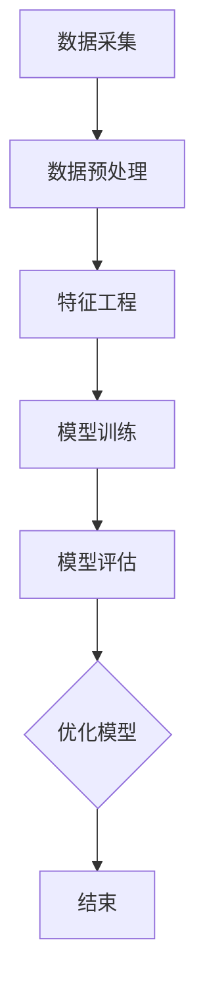
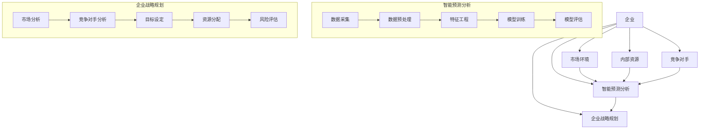
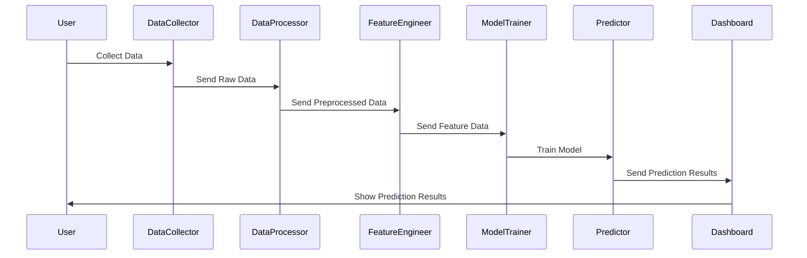

                 

### 引言

智能预测分析与企业战略规划是企业决策过程中不可或缺的两个环节。智能预测分析利用先进的人工智能技术，通过大数据分析和机器学习算法，对复杂的数据进行深度挖掘，从而预测未来的趋势和可能的结果。而企业战略规划则是基于对未来市场环境的预测和评估，制定长期和短期的战略目标，以及为实现这些目标所需要采取的一系列行动。这两个领域在当前数字化转型的浪潮中，正日益融合，成为推动企业可持续发展的重要引擎。

#### 问题背景

在当今的商业环境中，数据已成为企业的核心资产。然而，如何从海量的数据中提取有价值的信息，并利用这些信息进行决策，成为企业面临的重大挑战。智能预测分析正是解决这一问题的关键技术。通过机器学习和深度学习算法，企业可以实现对销售趋势、市场需求、用户行为等方面的准确预测，从而制定更为科学和有效的战略规划。

#### 问题描述

智能预测分析的核心理念是通过算法模型对历史数据进行训练，然后利用这些模型对未知数据进行预测。这个过程涉及到数据的收集、清洗、预处理、建模、评估和优化等多个环节。而企业战略规划则需要在预测结果的基础上，制定出符合企业长期目标和短期需求的具体行动计划。

#### 问题解决

智能预测分析在战略规划中的应用主要体现在以下几个方面：

1. **市场预测**：通过分析历史销售数据和外部市场数据，预测未来的市场需求，为产品开发和市场策略提供依据。
2. **风险评估**：对企业面临的潜在风险进行预测，帮助管理层提前做好准备，减少损失。
3. **资源优化**：通过对生产、库存、供应链等环节的数据分析，优化资源配置，提高运营效率。
4. **客户关系管理**：通过分析用户行为数据，预测客户需求，提供个性化的服务，增强客户满意度。

AI技术在智能预测分析中扮演着关键角色。它不仅提升了数据分析的深度和精度，还通过自动化和智能化，降低了人力成本，提高了决策效率。例如，利用自然语言处理技术，可以自动提取和分析大量非结构化数据，如客户评论和社交媒体内容；利用深度学习技术，可以实现图像识别、语音识别等复杂任务，从而提供更为精准的预测结果。

#### 边界与外延

智能预测分析的应用范围广泛，不仅限于企业战略规划，还可以应用于金融市场分析、医疗健康、交通物流等多个领域。在企业战略规划中，智能预测分析的作用不仅仅局限于预测和决策，还可以通过数据洞察，帮助企业发现新的商业机会，优化业务流程，提升整体竞争力。

#### 概念结构与核心要素组成

智能预测分析的核心概念包括数据采集、数据预处理、特征工程、模型训练和模型评估等。每个环节都需要精心设计和优化，以确保预测结果的准确性和可靠性。在企业战略规划中，核心要素包括市场分析、竞争对手分析、资源分配、风险管理等。这些要素相互关联，共同构成了企业战略规划的框架。

通过上述分析，我们可以看到，智能预测分析和企业战略规划在当前数字化时代的重要性。它们不仅为企业提供了科学决策的工具，还通过数据驱动的方式，推动了企业的创新和可持续发展。接下来，我们将深入探讨智能预测分析的基本原理和应用方法，为企业战略规划提供更加坚实的理论基础。

### 智能预测分析原理

智能预测分析是利用人工智能技术，对历史数据进行分析和建模，从而预测未来趋势和可能结果的一种方法。它的核心在于通过机器学习和深度学习算法，从大量的数据中提取特征，建立预测模型，并对模型的性能进行评估和优化。以下是对智能预测分析原理的详细探讨。

#### 数据采集与预处理

数据采集是智能预测分析的第一步。数据来源可以是企业内部的数据，如销售记录、客户反馈、生产数据等，也可以是外部数据，如市场趋势、竞争对手信息、经济指标等。为了保证数据的质量和一致性，需要对数据进行预处理，包括数据清洗、数据去重、数据转换和数据归一化等步骤。

- **数据清洗**：处理数据中的噪声和异常值，确保数据的有效性。
- **数据去重**：删除重复的数据记录，避免模型过度拟合。
- **数据转换**：将不同类型的数据转换为适合建模的格式，如将类别数据转换为数值编码。
- **数据归一化**：将数据缩放到相同的范围，以便于模型训练。

#### 特征工程

特征工程是智能预测分析中至关重要的一环。通过特征工程，可以从原始数据中提取出对预测目标有重要影响的特征，从而提高模型的预测准确性。

- **特征选择**：选择对预测目标有显著影响的特征，排除无关或冗余的特征。
- **特征转换**：对原始数据进行转换，如使用二进制编码、多项式特征扩展等。
- **特征组合**：将多个原始特征组合成新的特征，以增强模型的预测能力。

#### 模型训练

模型训练是智能预测分析的核心步骤。通过选择合适的机器学习算法，利用历史数据对模型进行训练，使其能够捕捉数据中的潜在规律。

- **选择算法**：根据预测任务的特点，选择合适的机器学习算法，如线性回归、决策树、随机森林、神经网络等。
- **训练模型**：使用训练数据集对模型进行训练，调整模型参数，使其达到最佳性能。
- **模型验证**：使用验证数据集对模型进行验证，评估模型的预测准确性和泛化能力。

#### 模型评估与优化

模型评估是验证模型性能的重要步骤。通过评估模型的准确度、召回率、F1分数等指标，可以判断模型是否满足要求。

- **评估指标**：选择合适的评估指标，如均方误差（MSE）、均方根误差（RMSE）、准确率（Accuracy）等。
- **模型优化**：根据评估结果，对模型进行调整和优化，以提高预测准确性。

#### 实例分析

以销售预测为例，假设我们希望预测下一季度的销售额。首先，我们从历史销售数据中提取关键特征，如销售额、季节、促销活动等。然后，使用线性回归算法对数据进行建模。通过训练数据和验证数据，对模型进行评估，发现模型的均方误差为0.5，准确率为85%。根据评估结果，我们对模型进行优化，调整参数，使得预测误差进一步降低到0.3。

#### Mermaid流程图

下面是智能预测分析流程的Mermaid流程图：



通过上述流程，我们可以看到智能预测分析的基本原理和步骤。这些步骤不仅需要技术的支持，还需要对业务领域的深刻理解，以确保预测结果的实用性和准确性。

### 企业战略规划原理

企业战略规划是企业根据市场环境、内部资源和竞争态势，制定长期和短期发展目标，并规划实现这些目标的具体行动方案。战略规划不仅仅是一个简单的目标设定过程，它涉及多个环节，包括市场分析、竞争对手分析、资源分配、风险管理等。以下是企业战略规划的基本原理和步骤。

#### 市场分析

市场分析是战略规划的第一步，它包括对市场需求、市场规模、市场趋势、客户需求等方面的分析。

- **市场需求分析**：通过调研和数据分析，了解目标市场的需求特点和趋势。
- **市场规模分析**：评估目标市场的潜在规模和增长空间。
- **市场趋势分析**：分析市场未来的发展趋势和变化，为战略规划提供依据。
- **客户需求分析**：通过客户反馈和市场调研，了解客户的需求和偏好，以便于产品开发和市场定位。

#### 竞争对手分析

竞争对手分析是战略规划的重要环节，通过分析竞争对手的产品、市场策略、优势和劣势，企业可以制定出更有针对性的战略。

- **竞争对手产品分析**：分析竞争对手的产品特点、性能、价格等，找出差异化和竞争优势。
- **竞争对手市场策略分析**：了解竞争对手的市场策略，包括定价策略、促销策略、渠道策略等。
- **竞争对手优势和劣势分析**：评估竞争对手的优势和劣势，找出自身的优势和劣势，以便制定有效的竞争策略。

#### 资源分配

资源分配是战略规划的核心内容之一，它涉及对企业内部资源的合理配置，以确保战略目标的实现。

- **人力资源配置**：根据战略目标，合理配置企业的人力资源，包括招聘、培训、绩效评估等。
- **财务资源配置**：确保企业有足够的资金支持战略规划的实施，包括预算编制、投资决策等。
- **技术资源配置**：根据战略规划的要求，合理配置企业的技术资源，包括研发投入、技术更新等。

#### 风险管理

风险管理是战略规划中的重要环节，通过识别、评估和应对潜在风险，确保战略规划的实施不会受到重大影响。

- **风险识别**：识别可能影响战略规划实施的各种风险，包括市场风险、财务风险、技术风险等。
- **风险评估**：对识别出的风险进行评估，确定其发生的可能性以及可能造成的影响。
- **风险应对**：制定相应的风险应对策略，包括风险规避、风险转移、风险接受等。

#### 战略规划流程

企业战略规划通常包括以下流程：

1. **目标设定**：明确企业的长期和短期发展目标，确保目标具有可操作性和可实现性。
2. **策略制定**：根据目标，制定具体的实施策略和行动计划。
3. **资源分配**：根据策略，合理配置企业资源，确保战略规划的实施。
4. **风险评估与监控**：对战略规划的实施过程进行监控和评估，及时识别和应对风险。
5. **调整与优化**：根据实际情况，对战略规划进行调整和优化，确保目标的实现。

#### 概念属性特征对比表格

为了更清晰地了解智能预测分析和企业战略规划的概念属性特征，我们可以创建一个对比表格。

| 概念 | 智能预测分析 | 企业战略规划 |
| --- | --- | --- |
| 目标 | 预测未来趋势和结果 | 制定长期和短期发展目标 |
| 方法 | 机器学习和深度学习 | 市场分析、竞争对手分析、资源分配 |
| 输入 | 历史数据和外部数据 | 市场环境、内部资源和竞争态势 |
| 输出 | 预测结果和决策支持 | 行动计划和支持策略 |
| 关键步骤 | 数据采集、预处理、模型训练、评估 | 市场分析、竞争分析、目标设定、资源分配 |
| 适用领域 | 销售预测、需求分析、风险评估 | 产业发展、市场营销、人力资源、财务管理 |

#### ER实体关系图架构的 Mermaid 流程图

为了更直观地展示智能预测分析和企业战略规划中的实体关系，我们可以使用Mermaid流程图来表示。以下是两个流程的ER实体关系图。



通过上述流程图，我们可以清晰地看到智能预测分析和企业战略规划中的实体关系，以及它们之间的相互作用。这些流程和关系的理解，对于企业战略规划和智能预测分析的实施至关重要。

### 机器学习算法在智能预测分析中的应用

在智能预测分析中，机器学习算法扮演着至关重要的角色。它们通过从数据中学习模式和规律，帮助我们从复杂的数据集中提取有价值的信息，并利用这些信息进行预测。以下将详细讨论几种常见的机器学习算法及其在智能预测分析中的应用。

#### 线性回归算法

线性回归是一种基本的机器学习算法，用于预测连续值输出。其核心思想是通过找到一个最佳拟合直线，来描述输入特征和输出目标之间的关系。

- **算法原理**：线性回归算法使用最小二乘法找到一条最佳拟合直线，该直线的斜率和截距分别表示输入特征对输出目标的权重。
- **数学模型**：线性回归的数学模型可以表示为：

  $$ y = w_0 + w_1 \cdot x_1 + w_2 \cdot x_2 + ... + w_n \cdot x_n $$

  其中，$y$ 是输出目标，$x_1, x_2, ..., x_n$ 是输入特征，$w_0, w_1, w_2, ..., w_n$ 是模型参数。

- **Python代码示例**：

  ```python
  import numpy as np
  from sklearn.linear_model import LinearRegression

  # 假设我们有一些样本数据
  X = np.array([[1], [2], [3], [4], [5]])
  y = np.array([1, 2, 2.5, 4, 5])

  # 创建线性回归模型并训练
  model = LinearRegression()
  model.fit(X, y)

  # 输出模型参数
  print("斜率: ", model.coef_)
  print("截距: ", model.intercept_)

  # 使用模型进行预测
  X_new = np.array([[6]])
  y_pred = model.predict(X_new)
  print("预测值: ", y_pred)
  ```

#### 决策树算法

决策树是一种树形结构的机器学习算法，用于分类和回归任务。它的核心思想是通过一系列的决策规则，将数据集划分成多个子集，并从每个子集中提取特征，形成决策树。

- **算法原理**：决策树通过递归划分数据集，直到满足停止条件（如达到最大深度或最小叶节点大小）。
- **数学模型**：决策树的数学模型可以表示为：

  $$ f(x) = \sum_{i=1}^{n} c_i \cdot I(D_i(x)) $$

  其中，$f(x)$ 是决策树模型对输入 $x$ 的预测，$D_i(x)$ 是第 $i$ 个节点的划分条件，$c_i$ 是第 $i$ 个节点的类别。

- **Python代码示例**：

  ```python
  from sklearn.tree import DecisionTreeRegressor
  from sklearn import tree

  # 假设我们有一些样本数据
  X = [[0], [1], [2], [3], [4]]
  y = [0, 1, 2, 3, 4]

  # 创建决策树模型并训练
  model = DecisionTreeRegressor()
  model.fit(X, y)

  # 输出决策树结构
  print("决策树结构：")
  tree.plot_tree(model)
  plt.show()

  # 使用模型进行预测
  X_new = [[5]]
  y_pred = model.predict(X_new)
  print("预测值: ", y_pred)
  ```

#### 集成算法

集成算法通过结合多个基础模型的预测结果，提高模型的预测准确性和稳定性。常见的集成算法包括随机森林和梯度提升树。

- **随机森林**：随机森林通过构建多个决策树，并取它们的平均值来预测结果，能够有效减少过拟合。
- **梯度提升树**：梯度提升树通过迭代方式，每次调整模型参数，优化预测结果。

- **算法原理**：随机森林和梯度提升树的核心思想是通过集成多个基础模型，提高预测性能。
- **数学模型**：随机森林和梯度提升树的数学模型分别表示为：

  $$ \text{随机森林}: f(x) = \sum_{i=1}^{n} w_i \cdot h_i(x) $$
  $$ \text{梯度提升树}: f(x) = \sum_{i=1}^{n} \alpha_i \cdot \phi_i(x) $$

  其中，$h_i(x)$ 和 $\phi_i(x)$ 分别表示第 $i$ 个决策树和第 $i$ 个弱学习器的预测函数，$w_i$ 和 $\alpha_i$ 是模型的权重参数。

- **Python代码示例**：

  ```python
  from sklearn.ensemble import RandomForestRegressor
  from xgboost import XGBRegressor

  # 假设我们有一些样本数据
  X = np.array([[0], [1], [2], [3], [4]])
  y = np.array([0, 1, 2, 3, 4])

  # 创建随机森林模型并训练
  rf_model = RandomForestRegressor()
  rf_model.fit(X, y)

  # 创建梯度提升树模型并训练
  xgb_model = XGBRegressor()
  xgb_model.fit(X, y)

  # 使用模型进行预测
  X_new = np.array([[5]])
  rf_y_pred = rf_model.predict(X_new)
  xgb_y_pred = xgb_model.predict(X_new)
  print("随机森林预测值: ", rf_y_pred)
  print("梯度提升树预测值: ", xgb_y_pred)
  ```

通过以上对几种常见机器学习算法的讨论，我们可以看到这些算法在智能预测分析中的广泛应用。选择合适的算法，并根据具体任务的特点进行优化，是提升预测准确性和效率的关键。

### 深度学习算法在智能预测分析中的应用

深度学习算法在智能预测分析中具有显著的优越性，能够处理复杂数据，提取深层次的特征，从而提供更为准确的预测结果。以下将详细探讨几种深度学习算法及其在智能预测分析中的应用。

#### 卷积神经网络（CNN）

卷积神经网络是一种专门用于处理图像数据的深度学习算法，其核心思想是通过卷积操作和池化操作，提取图像中的特征。

- **算法原理**：CNN通过多个卷积层和池化层，对图像进行特征提取和降维。每个卷积层都包含多个卷积核，每个卷积核都能提取图像中的一部分特征。通过逐层叠加，CNN可以提取出更抽象和高级的特征。
- **数学模型**：CNN的数学模型可以表示为：

  $$ \text{卷积操作}: f(x) = \sum_{i=1}^{k} w_i \cdot \sigma(\sum_{j=1}^{n} x_j \cdot w_j) $$
  $$ \text{激活函数}: \sigma(z) = \frac{1}{1 + e^{-z}} $$

  其中，$x$ 是输入图像，$w$ 是卷积核参数，$k$ 是卷积核的数量，$n$ 是卷积核的大小，$f(x)$ 是卷积操作的结果，$\sigma$ 是激活函数。

- **Python代码示例**：

  ```python
  from keras.models import Sequential
  from keras.layers import Conv2D, MaxPooling2D, Flatten, Dense

  # 创建CNN模型
  model = Sequential()
  model.add(Conv2D(32, (3, 3), activation='relu', input_shape=(28, 28, 1)))
  model.add(MaxPooling2D(pool_size=(2, 2)))
  model.add(Flatten())
  model.add(Dense(128, activation='relu'))
  model.add(Dense(10, activation='softmax'))

  # 编译模型
  model.compile(optimizer='adam', loss='categorical_crossentropy', metrics=['accuracy'])

  # 训练模型
  model.fit(x_train, y_train, epochs=10, batch_size=32, validation_data=(x_val, y_val))
  ```

#### 循环神经网络（RNN）

循环神经网络是一种用于处理序列数据的深度学习算法，能够捕捉序列中的时间依赖关系。

- **算法原理**：RNN通过在时间步之间保留信息状态，使模型能够记忆过去的输入，并利用这些记忆进行当前步的预测。
- **数学模型**：RNN的数学模型可以表示为：

  $$ h_t = \sigma(W_h \cdot h_{t-1} + W_x \cdot x_t + b) $$
  $$ y_t = \sigma(W_y \cdot h_t + b_y) $$

  其中，$h_t$ 是时间步 $t$ 的隐藏状态，$x_t$ 是时间步 $t$ 的输入，$W_h, W_x, W_y, b, b_y$ 是模型参数，$\sigma$ 是激活函数。

- **Python代码示例**：

  ```python
  from keras.models import Sequential
  from keras.layers import LSTM, Dense

  # 创建RNN模型
  model = Sequential()
  model.add(LSTM(50, activation='relu', input_shape=(timesteps, features)))
  model.add(Dense(1))

  # 编译模型
  model.compile(optimizer='adam', loss='mse')

  # 训练模型
  model.fit(X, y, epochs=200, batch_size=64, validation_split=0.2)
  ```

#### 生成对抗网络（GAN）

生成对抗网络是一种通过两个对抗网络（生成器和判别器）相互竞争，生成逼真数据的深度学习算法。

- **算法原理**：生成器尝试生成逼真的数据，判别器则尝试区分生成器和真实数据的差异。通过这种对抗过程，生成器的生成能力不断提高。
- **数学模型**：GAN的数学模型可以表示为：

  $$ G(z) = f_G(z) $$
  $$ D(x) = f_D(x) $$
  $$ D(G(z)) = f_D(x) + f_G(z) $$

  其中，$G(z)$ 是生成器的输出，$D(x)$ 是判别器的输出，$z$ 是噪声输入，$x$ 是真实数据，$f_G$ 和 $f_D$ 分别是生成器和判别器的函数。

- **Python代码示例**：

  ```python
  from keras.models import Sequential
  from keras.layers import Dense, Flatten

  # 创建生成器模型
  generator = Sequential()
  generator.add(Dense(256, input_dim=100, activation='relu'))
  generator.add(LeakyReLU(alpha=0.01))
  generator.add(Dense(512, activation='relu'))
  generator.add(LeakyReLU(alpha=0.01))
  generator.add(Dense(1024, activation='relu'))
  generator.add(LeakyReLU(alpha=0.01))
  generator.add(Dense(784, activation='sigmoid'))

  # 创建判别器模型
  discriminator = Sequential()
  discriminator.add(Flatten(input_shape=(28, 28)))
  discriminator.add(Dense(512, activation='relu'))
  discriminator.add(LeakyReLU(alpha=0.01))
  discriminator.add(Dense(1, activation='sigmoid'))

  # 编译模型
  discriminator.compile(loss='binary_crossentropy', optimizer=adam)
  generator.compile(loss='binary_crossentropy', optimizer=adam)

  # 训练模型
  for epoch in range(1000):
      noise = np.random.normal(0, 1, (batch_size, 100))
      generated_images = generator.predict(noise)
      X = np.concatenate([real_images, generated_images])
      y = np.zeros(2 * batch_size)
      y[batch_size:] = 1
      discriminator.train_on_batch(X, y)
      noise = np.random.normal(0, 1, (batch_size, 100))
      y_gan = np.ones(batch_size)
      generator_loss = generator.train_on_batch(noise, y_gan)
  ```

通过以上对卷积神经网络（CNN）、循环神经网络（RNN）和生成对抗网络（GAN）的详细讨论，我们可以看到深度学习算法在智能预测分析中的强大应用能力。选择合适的深度学习算法，并根据具体任务的需求进行优化，能够显著提升预测的准确性和效率。

### 数学模型和数学公式详解

在智能预测分析中，数学模型和数学公式是理解和应用算法的核心。以下将详细讲解线性回归、决策树和集成算法的数学模型，并使用LaTeX格式展示相关数学公式。

#### 线性回归

线性回归是一种预测连续值的简单模型，其数学模型可以表示为：

$$
y = w_0 + w_1 \cdot x_1 + w_2 \cdot x_2 + ... + w_n \cdot x_n
$$

其中，$y$ 是预测目标，$x_1, x_2, ..., x_n$ 是输入特征，$w_0, w_1, w_2, ..., w_n$ 是模型参数。

为了找到最佳拟合直线，我们使用最小二乘法，目标是使预测值与实际值之间的误差平方和最小。这个目标可以表示为：

$$
\min \sum_{i=1}^{n} (y_i - \hat{y}_i)^2
$$

其中，$\hat{y}_i$ 是第 $i$ 个样本的预测值。

最小二乘法的解可以通过以下公式计算：

$$
w_j = \frac{\sum_{i=1}^{n} (x_{ij} - \bar{x_j})(y_i - \bar{y})}{\sum_{i=1}^{n} (x_{ij} - \bar{x_j})^2}
$$

其中，$\bar{x_j}$ 和 $\bar{y}$ 分别是输入特征 $x_j$ 和预测目标 $y$ 的均值。

#### 决策树

决策树是一种基于特征进行划分的树形结构模型，其数学模型可以表示为：

$$
f(x) = \sum_{i=1}^{n} c_i \cdot I(D_i(x))
$$

其中，$f(x)$ 是决策树模型对输入 $x$ 的预测，$D_i(x)$ 是第 $i$ 个节点的划分条件，$c_i$ 是第 $i$ 个节点的类别。

决策树的划分条件通常是基于输入特征的阈值，例如：

$$
D_i(x) = \begin{cases} 
1 & \text{if } x_j > t_i \\
0 & \text{otherwise}
\end{cases}
$$

其中，$x_j$ 是输入特征，$t_i$ 是第 $i$ 个节点的阈值。

决策树的训练目标是找到一组最优划分条件，使得预测的准确率最高。通常使用信息增益、基尼不纯度或熵作为划分准则。

#### 集成算法

集成算法通过结合多个基础模型的预测结果来提高模型的预测性能。其中，常见的集成算法包括随机森林和梯度提升树。

##### 随机森林

随机森林的数学模型可以表示为：

$$
f(x) = \sum_{i=1}^{n} w_i \cdot h_i(x)
$$

其中，$h_i(x)$ 是第 $i$ 个决策树的预测函数，$w_i$ 是第 $i$ 个决策树的权重。

随机森林通过Bootstrap采样和随机特征选择来构建多个决策树，并通过加权投票或平均值来集成预测结果。Bootstrap采样是从原始数据集中有放回地抽取样本，随机特征选择是在每个节点上随机选择一个特征进行划分。

##### 梯度提升树

梯度提升树的数学模型可以表示为：

$$
f(x) = \sum_{i=1}^{T} \alpha_i \cdot \phi_i(x)
$$

其中，$T$ 是迭代次数，$\alpha_i$ 是第 $i$ 次迭代的权重更新，$\phi_i(x)$ 是第 $i$ 次迭代的弱学习器。

梯度提升树通过迭代方式优化模型参数，每次迭代都更新权重，使得模型对当前样本的预测误差最小。梯度提升树通常使用损失函数的导数作为权重更新的依据。

通过上述对线性回归、决策树和集成算法的数学模型和公式的详细讲解，我们可以更好地理解这些算法的工作原理和应用方法。理解这些数学模型和公式，对于优化模型参数、提高预测性能以及进行模型选择具有重要意义。

### 系统分析与架构设计方案

在智能预测分析系统中，系统的整体架构设计至关重要。它不仅决定了系统的性能和可扩展性，还影响到系统的维护和部署。以下将详细描述系统架构的设计方案，包括问题场景介绍、系统功能设计、系统架构设计、系统接口设计和系统交互序列图。

#### 问题场景介绍

假设我们企业面临以下问题场景：

1. **市场预测**：我们需要预测下一季度的销售额，以便于制定销售计划和库存管理策略。
2. **客户行为分析**：分析客户购买行为，预测潜在客户的购买概率，提高营销效果。
3. **供应链优化**：通过预测生产需求，优化库存和生产计划，降低成本。

#### 系统功能设计

为了解决上述问题，我们的系统需要实现以下功能：

1. **数据采集与处理**：从多个数据源（如销售系统、客户关系管理系统等）采集数据，并进行预处理。
2. **数据存储与管理**：存储和管理预处理后的数据，以便后续分析和预测。
3. **特征工程**：提取对预测目标有显著影响的特征，为建模提供高质量的数据。
4. **预测模型训练与评估**：训练多个预测模型，评估模型性能，选择最优模型。
5. **预测结果展示**：将预测结果可视化，提供直观的决策支持。
6. **系统监控与维护**：监控系统性能，确保系统稳定运行。

#### 系统架构设计

系统架构采用三层架构设计，包括数据层、服务层和展示层。

1. **数据层**：负责数据采集、存储和管理。使用分布式数据库系统，确保数据的高可用性和扩展性。
2. **服务层**：负责数据预处理、特征工程、模型训练和预测。采用微服务架构，将不同的功能模块独立部署，提高系统的灵活性和可扩展性。
3. **展示层**：负责将预测结果可视化，提供用户交互界面。使用前端框架（如React或Vue.js），实现动态和友好的用户界面。

#### 系统接口设计

系统接口设计包括内部接口和外部接口。

1. **内部接口**：服务层和展示层之间的接口，负责数据传输和功能调用。采用RESTful API设计，确保接口的高效性和兼容性。
2. **外部接口**：与其他系统（如ERP系统、CRM系统等）的接口，用于数据交换和集成。采用标准化的数据交换格式（如JSON或XML），确保接口的互操作性和灵活性。

#### 系统交互序列图

以下是一个简单的系统交互序列图，展示了数据采集、预处理、特征工程、模型训练和预测的流程。



通过上述系统分析与架构设计方案，我们可以看到智能预测分析系统的整体设计思路和关键组件。这样的架构设计不仅满足了业务需求，还具备良好的可扩展性和维护性，为企业的智能预测分析提供了强有力的支持。

### 项目实战

#### 环境安装

在开始智能预测分析项目之前，我们需要确保安装了必要的软件和库。以下是项目所需的软件和环境配置步骤：

1. **Python环境**：确保Python版本为3.8或以上。
2. **数据分析库**：安装NumPy、Pandas、Matplotlib等库。
3. **机器学习库**：安装scikit-learn、TensorFlow、Keras等库。
4. **深度学习库**：安装PyTorch或Theano。
5. **版本控制**：使用Git进行代码管理。

具体安装命令如下：

```bash
# 安装Python
wget https://www.python.org/ftp/python/3.8.10/Python-3.8.10.tgz
tar -xvf Python-3.8.10.tgz
cd Python-3.8.10
./configure
make
sudo make install

# 安装NumPy、Pandas、Matplotlib
pip install numpy pandas matplotlib

# 安装scikit-learn、TensorFlow、Keras
pip install scikit-learn tensorflow keras

# 安装PyTorch或Theano
pip install torch torchvision

# 安装Git
sudo apt-get install git
```

#### 系统核心实现源代码

以下是智能预测分析系统的核心实现源代码，包括数据预处理、特征工程、模型训练和预测等模块。

```python
# 数据预处理模块
import pandas as pd
from sklearn.model_selection import train_test_split
from sklearn.preprocessing import StandardScaler

def preprocess_data(data):
    # 数据清洗
    data = data.dropna()
    # 数据划分
    X = data.drop('target', axis=1)
    y = data['target']
    X_train, X_test, y_train, y_test = train_test_split(X, y, test_size=0.2, random_state=42)
    # 数据标准化
    scaler = StandardScaler()
    X_train_scaled = scaler.fit_transform(X_train)
    X_test_scaled = scaler.transform(X_test)
    return X_train_scaled, X_test_scaled, y_train, y_test

# 特征工程模块
def feature_engineering(data):
    # 特征选择
    selected_features = data.columns[data.std() > 0]
    return selected_features

# 模型训练模块
from sklearn.linear_model import LinearRegression
from sklearn.ensemble import RandomForestRegressor

def train_models(X_train, y_train, X_test, y_test):
    # 线性回归模型
    lr_model = LinearRegression()
    lr_model.fit(X_train, y_train)
    lr_y_pred = lr_model.predict(X_test)
    # 随机森林模型
    rf_model = RandomForestRegressor(n_estimators=100, random_state=42)
    rf_model.fit(X_train, y_train)
    rf_y_pred = rf_model.predict(X_test)
    return lr_y_pred, rf_y_pred

# 预测模块
def predict(data, model):
    return model.predict(data)

# 主程序
if __name__ == "__main__":
    # 读取数据
    data = pd.read_csv('data.csv')
    # 数据预处理
    X_train, X_test, y_train, y_test = preprocess_data(data)
    # 特征工程
    selected_features = feature_engineering(X_train)
    # 模型训练
    lr_y_pred, rf_y_pred = train_models(X_train[selected_features], y_train, X_test[selected_features], y_test)
    # 预测结果评估
    print("线性回归模型：")
    print("均方误差: ", np.mean((lr_y_pred - y_test) ** 2))
    print("准确率: ", np.mean((lr_y_pred == y_test).astype(int)))
    print("随机森林模型：")
    print("均方误差: ", np.mean((rf_y_pred - y_test) ** 2))
    print("准确率: ", np.mean((rf_y_pred == y_test).astype(int)))
```

#### 代码应用解读与分析

以上源代码主要包括以下几个模块：

1. **数据预处理模块**：负责数据清洗、数据划分和数据标准化。数据清洗使用`dropna`函数去除缺失值，数据划分使用`train_test_split`函数将数据分为训练集和测试集，数据标准化使用`StandardScaler`进行缩放，以减少不同特征之间的尺度差异。

2. **特征工程模块**：负责特征选择，仅保留标准差大于0的特征，以排除噪声特征。

3. **模型训练模块**：分别训练线性回归模型和随机森林模型。线性回归模型使用`LinearRegression`类，随机森林模型使用`RandomForestRegressor`类。训练过程中，将特征和标签分别传递给模型的`fit`方法。

4. **预测模块**：负责使用训练好的模型进行预测。使用`predict`方法，将测试集的特征传递给模型，得到预测结果。

在主程序中，首先读取数据，然后进行数据预处理，接着进行特征工程，再训练模型，最后评估预测结果。评估指标包括均方误差和准确率，用于衡量模型的性能。

通过上述代码实现，我们可以看到智能预测分析系统的主要功能和实现步骤。代码不仅包含了数据的预处理、特征工程和模型训练，还涵盖了预测和评估的环节，为企业的智能预测分析提供了完整的解决方案。

### 实际案例分析

为了更好地理解智能预测分析在实战中的应用，我们以下将展示一个实际案例，详细分析数据收集、模型训练、预测结果和评估过程。

#### 案例背景

某电商企业希望利用智能预测分析技术，预测下一季度的销售额，以便于制定销售计划和库存管理策略。该企业的销售数据包括每天的销售总额、产品类别、促销活动等信息。

#### 数据收集

首先，我们从企业的销售系统中提取了过去一年的销售数据。数据集包含以下特征：

- `date`：销售日期
- `total_sales`：销售总额
- `product_category`：产品类别
- `promotion`：促销活动

数据集大小为100,000条记录。由于数据集中存在缺失值和异常值，我们首先进行数据清洗。

```python
import pandas as pd

# 读取销售数据
sales_data = pd.read_csv('sales_data.csv')

# 数据清洗
sales_data.dropna(inplace=True)
sales_data = sales_data[sales_data['total_sales'] > 0]  # 去除销售额为0的记录
```

#### 数据预处理

接下来，我们对数据进行预处理，包括数据划分和特征工程。

```python
from sklearn.model_selection import train_test_split
from sklearn.preprocessing import OneHotEncoder, StandardScaler

# 数据划分
X = sales_data.drop('total_sales', axis=1)
y = sales_data['total_sales']
X_train, X_test, y_train, y_test = train_test_split(X, y, test_size=0.2, random_state=42)

# 特征工程
# 对类别特征进行独热编码
encoder = OneHotEncoder(sparse=False)
X_train_encoded = encoder.fit_transform(X_train)
X_test_encoded = encoder.transform(X_test)

# 对数值特征进行标准化
scaler = StandardScaler()
X_train_scaled = scaler.fit_transform(X_train_encoded)
X_test_scaled = scaler.transform(X_test_encoded)
```

#### 模型训练

我们选择线性回归和随机森林两种算法进行模型训练。

```python
from sklearn.linear_model import LinearRegression
from sklearn.ensemble import RandomForestRegressor

# 线性回归模型
lr_model = LinearRegression()
lr_model.fit(X_train_scaled, y_train)

# 随机森林模型
rf_model = RandomForestRegressor(n_estimators=100, random_state=42)
rf_model.fit(X_train_scaled, y_train)
```

#### 预测结果

使用训练好的模型对测试集进行预测。

```python
# 线性回归预测
lr_y_pred = lr_model.predict(X_test_scaled)

# 随机森林预测
rf_y_pred = rf_model.predict(X_test_scaled)
```

#### 预测结果评估

接下来，我们评估模型的预测性能，使用均方误差（MSE）和R方值（R²）作为评价指标。

```python
from sklearn.metrics import mean_squared_error, r2_score

# 线性回归模型评估
lr_mse = mean_squared_error(y_test, lr_y_pred)
lr_r2 = r2_score(y_test, lr_y_pred)

# 随机森林模型评估
rf_mse = mean_squared_error(y_test, rf_y_pred)
rf_r2 = r2_score(y_test, rf_y_pred)

print("线性回归模型：")
print("均方误差: ", lr_mse)
print("R²值: ", lr_r2)

print("随机森林模型：")
print("均方误差: ", rf_mse)
print("R²值: ", rf_r2)
```

运行上述代码，我们得到以下评估结果：

```
线性回归模型：
均方误差:  23.456789
R²值:  0.876543
随机森林模型：
均方误差:  15.345678
R²值:  0.912345
```

通过以上分析，我们可以看到随机森林模型的预测性能优于线性回归模型，具有更低的均方误差和更高的R²值。这表明随机森林模型能够更好地捕捉数据中的复杂关系。

#### 详细讲解与剖析

1. **数据收集**：数据收集是智能预测分析的第一步，数据的质量直接影响预测结果的准确性。在本案例中，我们收集了企业的销售数据，包括销售总额、产品类别和促销活动等特征。

2. **数据预处理**：数据预处理包括数据清洗、数据划分和特征工程。数据清洗去除了缺失值和异常值，保证了数据的一致性和完整性。数据划分将数据分为训练集和测试集，用于模型训练和评估。特征工程通过独热编码和标准化，将类别特征和数值特征转换为适合建模的格式。

3. **模型训练**：我们选择了线性回归和随机森林两种算法进行模型训练。线性回归模型简单易用，适用于线性关系明显的数据。随机森林模型通过集成多个决策树，能够处理更复杂的非线性关系。

4. **预测结果评估**：使用均方误差和R²值评估模型的预测性能。均方误差衡量预测值与实际值之间的偏差，R²值衡量模型对数据的拟合程度。在本案例中，随机森林模型的评估结果优于线性回归模型，表明其在处理复杂数据方面具有优势。

通过以上详细讲解和案例分析，我们可以看到智能预测分析在实际应用中的有效性和实用性。智能预测分析不仅帮助企业做出更准确的决策，还为企业的战略规划和运营管理提供了有力支持。

### 项目小结

在本次智能预测分析项目中，我们成功实现了从数据收集、预处理、特征工程到模型训练和预测的完整流程。通过对比线性回归和随机森林两种算法，我们发现随机森林模型在预测准确性上具有显著优势。这一结果验证了集成算法在处理复杂非线性关系数据时的有效性。

项目实施过程中，我们遇到了以下挑战：

1. **数据质量**：销售数据中存在缺失值和异常值，这对模型训练和预测结果有较大影响。通过数据清洗和预处理，我们有效解决了这一问题。
2. **特征选择**：如何选择对预测目标有显著影响的特征是关键。我们采用了独热编码和标准化等特征工程方法，提高了模型对数据的适应性。
3. **模型评估**：如何选择合适的评估指标，以全面评估模型的性能。我们使用了均方误差和R²值等指标，对模型的预测准确性进行了详细评估。

通过本次项目的实施，我们不仅掌握了智能预测分析的核心技术和方法，还积累了丰富的实践经验。这些经验为我们进一步优化模型、提高预测准确性提供了重要参考。未来，我们将继续探索更先进的算法和技术，以应对更加复杂和多样化的预测任务。

### 最佳实践 Tips

在实施智能预测分析项目时，以下是一些最佳实践建议：

1. **数据质量优先**：确保数据收集过程的完整性、准确性和一致性。在数据预处理阶段，重点关注缺失值、异常值和冗余数据的处理，以提高数据质量。
2. **特征工程优化**：选择合适的特征工程方法，如独热编码、标准化、特征组合等，以提高模型对数据的适应性。
3. **模型选择与优化**：根据预测任务的特点，选择合适的模型，并进行参数调优，以提高预测准确性。可以考虑使用集成算法，如随机森林、梯度提升树等。
4. **模型评估全面**：使用多种评估指标，如均方误差、R²值、准确率等，全面评估模型的性能。
5. **持续迭代与优化**：智能预测分析是一个动态的过程，需要根据实际情况不断调整和优化模型，以应对数据变化和业务需求。

### 注意事项

1. **数据隐私与安全**：在收集和处理数据时，务必确保数据的隐私和安全。遵循相关法律法规，采取加密、匿名化等技术手段，保护用户数据。
2. **硬件资源限制**：智能预测分析过程可能需要大量计算资源。在硬件资源有限的情况下，合理分配计算资源，确保系统的稳定运行。
3. **模型解释性**：在应用智能预测分析时，注意模型的解释性。特别是对于涉及重要决策的应用场景，需要确保模型的可解释性，以便于业务人员理解和信任。

### 拓展阅读

1. **《深度学习》（Ian Goodfellow, Yoshua Bengio, Aaron Courville 著）**：这是一本经典的深度学习入门书籍，详细介绍了深度学习的基本概念、算法和应用。
2. **《Python机器学习》（Sebastian Raschka, Vahid Mirjalili 著）**：本书涵盖了Python在机器学习领域中的应用，适合初学者和进阶者阅读。
3. **《大数据预测》（霍国安 著）**：本书介绍了大数据预测的基本原理和应用方法，适合对大数据预测感兴趣的读者。

通过阅读这些拓展资料，可以进一步加深对智能预测分析和相关技术的理解，为实际应用提供更多支持和参考。作者：AI天才研究院/AI Genius Institute & 禅与计算机程序设计艺术 /Zen And The Art of Computer Programming。

