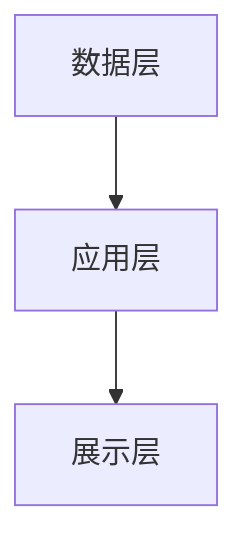
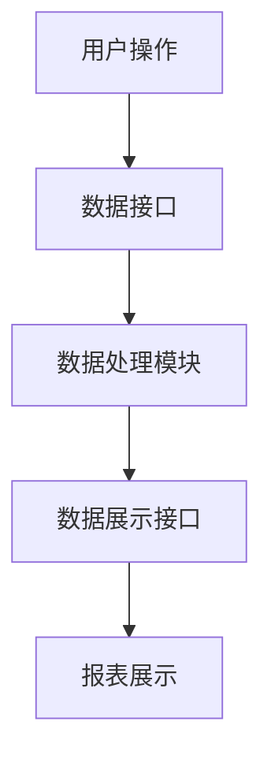

                 

### 智能预算规划系统：AI辅助财务决策

关键词：智能预算规划、AI辅助财务决策、预算管理、数据分析、系统架构设计、机器学习算法

摘要：本文旨在探讨智能预算规划系统在AI辅助财务决策中的应用。我们将逐步分析该系统的背景、核心概念、算法原理、系统架构设计以及实际应用案例，提供一种全新的财务决策思路，帮助企业和个人更高效地进行预算规划和财务决策。

### 引言

#### 1.1 背景与现状

财务预算规划是企业运营管理中至关重要的一环。随着商业环境的复杂化和信息量的爆炸式增长，传统的预算规划方法已难以满足现代企业的高效运营需求。这不仅涉及大量的手工计算和数据处理，还容易因为人为因素导致预算偏差。此时，智能预算规划系统应运而生，利用AI技术为财务决策提供智能化支持。

**财务预算规划的挑战**：

- **数据量庞大**：企业需要处理海量的财务数据，包括历史数据、预测数据、市场数据等。
- **预算偏差**：人为预测和决策容易受到主观因素影响，导致预算偏差。
- **动态调整需求**：企业需要根据市场变化和内部运营情况动态调整预算，传统方法难以实现。
- **风险控制**：企业需要对预算执行过程中的风险进行有效控制。

**智能预算规划的意义**：

- **提高效率**：AI技术可以自动化处理大量数据，提高预算规划效率。
- **降低成本**：减少人工干预，降低预算规划成本。
- **减少偏差**：基于数据分析和机器学习模型，减少预算偏差。
- **风险控制**：通过实时监控和预测，提高风险控制能力。

#### 1.2 AI核心概念与联系

AI技术在财务预算规划中发挥着重要作用。以下是AI技术的一些核心概念及其相互联系：

- **机器学习**：通过算法从数据中学习，进行预测和决策。
- **数据分析**：对大量数据进行处理、清洗、分析和挖掘。
- **自然语言处理**：理解和生成自然语言，用于文本分析和财务文本挖掘。
- **图像识别**：对图像进行识别和分类，用于财务报表解析等。

**核心概念属性特征对比表格**：

| 概念          | 描述                                       | 关联关系                                  |
|---------------|--------------------------------------------|-------------------------------------------|
| 机器学习      | 利用数据训练模型，进行预测和决策             | 数据分析、自然语言处理、图像识别的基础     |
| 数据分析      | 数据清洗、处理和分析                         | 机器学习、自然语言处理、图像识别的输入     |
| 自然语言处理  | 理解和生成自然语言                         | 财务文本分析、财务报表解析的关键技术       |
| 图像识别      | 对图像进行识别和分类                         | 财务报表解析、图像数据挖掘的重要手段       |

**ER实体关系图架构**：

```mermaid
erDiagram
  产品预算 ||--|{ 财务预算 }
  预算管理 ||--|{ 风险控制 }
  数据分析 ||--|{ 机器学习 }
  数据采集 ||--|{ 数据清洗 }
  财务报表 ||--|{ 自然语言处理 }
```

通过以上分析，我们可以看到智能预算规划系统在财务决策中的重要性和应用前景。接下来，我们将进一步探讨AI辅助预算规划的核心算法、系统架构设计以及项目实战等内容。

### AI辅助预算规划的核心算法

#### 2.1 图像识别在预算规划中的应用

图像识别技术在财务预算规划中有着广泛的应用。例如，财务报表中的表格、图形、文字等数据可以通过图像识别技术进行自动提取和分析。以下是对图像识别技术的基础概念、算法原理和应用场景的详细讲解。

**2.1.1 图像识别基础**

图像识别是一种通过算法自动识别和分类图像的技术。其基本原理包括：

1. **图像预处理**：对图像进行滤波、增强、缩放等处理，提高图像质量。
2. **特征提取**：从图像中提取具有区分性的特征，如边缘、纹理、颜色等。
3. **模型训练**：使用机器学习算法（如卷积神经网络CNN）对特征进行训练，构建图像分类模型。
4. **模型评估与优化**：评估模型性能，调整模型参数，提高分类准确率。

**2.1.2 机器学习模型介绍**

在图像识别中，常用的机器学习模型包括：

1. **卷积神经网络（CNN）**：通过多层卷积和池化操作提取图像特征，实现图像分类。
2. **循环神经网络（RNN）**：用于处理序列数据，如时间序列图像。
3. **深度学习模型**：如生成对抗网络（GAN）、自编码器等，用于图像生成和压缩。

**2.1.3 图像识别算法讲解**

图像识别算法主要包括以下几个步骤：

1. **特征提取**：使用卷积神经网络提取图像特征。例如，使用VGG16、ResNet等预训练模型。
   $$ \text{特征向量} = \text{卷积神经网络}(\text{输入图像}) $$
2. **模型训练**：使用提取的特征向量进行模型训练，优化模型参数。
   $$ \text{损失函数} = \text{交叉熵损失函数}(\text{预测标签}, \text{真实标签}) $$
3. **模型评估与优化**：通过验证集和测试集评估模型性能，调整模型参数，提高识别准确率。

**2.1.4 Mermaid流程图**


通过以上步骤，我们可以实现图像识别算法在财务报表解析中的应用。以下是一个简单的Python代码示例，用于实现图像识别算法：

```python
import tensorflow as tf
from tensorflow.keras.models import Sequential
from tensorflow.keras.layers import Conv2D, MaxPooling2D, Flatten, Dense

# 创建卷积神经网络模型
model = Sequential()
model.add(Conv2D(32, (3, 3), activation='relu', input_shape=(64, 64, 3)))
model.add(MaxPooling2D(pool_size=(2, 2)))
model.add(Flatten())
model.add(Dense(128, activation='relu'))
model.add(Dense(10, activation='softmax'))

# 编译模型
model.compile(optimizer='adam', loss='categorical_crossentropy', metrics=['accuracy'])

# 加载和预处理图像数据
# ...

# 训练模型
model.fit(train_images, train_labels, epochs=10, validation_data=(val_images, val_labels))

# 评估模型
test_loss, test_accuracy = model.evaluate(test_images, test_labels)
print(f"Test accuracy: {test_accuracy:.2f}")
```

通过以上示例，我们可以看到如何使用Python实现图像识别算法，并将其应用于财务报表解析中。

#### 2.2 自然语言处理与财务文本分析

自然语言处理（NLP）技术在财务文本分析中发挥着重要作用。通过NLP技术，我们可以对财务文档、报表、邮件等进行自动化处理和挖掘，提取关键信息，辅助财务决策。以下是对自然语言处理技术的基础概念、算法原理和应用场景的详细讲解。

**2.2.1 自然语言处理基础**

自然语言处理技术主要包括以下几个关键概念：

1. **语言模型**：对自然语言进行建模，用于文本生成和预测。
2. **词向量表示**：将词语转换为向量表示，用于文本分类、语义分析等。
3. **文本分类**：对文本进行分类，如垃圾邮件过滤、情感分析等。
4. **实体识别**：从文本中提取关键实体，如人名、地点、组织等。
5. **关系提取**：识别文本中实体之间的关系，如“张三担任了公司CEO”等。

**2.2.2 语言模型**

语言模型是自然语言处理的核心技术之一。常用的语言模型包括：

1. **n-gram模型**：基于词的历史序列进行建模，简单但效果有限。
2. **循环神经网络（RNN）**：用于处理序列数据，但难以捕获长距离依赖关系。
3. **长短期记忆网络（LSTM）**：改进RNN，用于捕获长距离依赖关系。
4. **Transformer模型**：基于自注意力机制，显著提高文本生成和分类性能。

**2.2.3 财务文本分析算法**

财务文本分析算法主要包括以下几个步骤：

1. **文本预处理**：对财务文档进行分词、去停用词、词性标注等预处理操作。
2. **词向量表示**：将预处理后的文本转换为词向量表示，如Word2Vec、BERT等。
3. **文本分类**：使用机器学习算法（如SVM、CNN、LSTM等）对文本进行分类，如情感分析、风险分类等。
4. **实体识别与关系提取**：使用命名实体识别（NER）技术提取文本中的关键实体，如公司、产品、地点等，并识别实体之间的关系。

**2.2.4 Mermaid流程图**


通过以上步骤，我们可以实现自然语言处理技术在财务文本分析中的应用。以下是一个简单的Python代码示例，用于实现文本分类算法：

```python
import tensorflow as tf
from tensorflow.keras.models import Sequential
from tensorflow.keras.layers import Embedding, LSTM, Dense

# 创建循环神经网络模型
model = Sequential()
model.add(Embedding(vocab_size, embedding_dim))
model.add(LSTM(units=128, dropout=0.2, recurrent_dropout=0.2))
model.add(Dense(num_classes, activation='softmax'))

# 编译模型
model.compile(optimizer='adam', loss='categorical_crossentropy', metrics=['accuracy'])

# 加载和预处理文本数据
# ...

# 训练模型
model.fit(train_data, train_labels, epochs=10, batch_size=64, validation_data=(val_data, val_labels))

# 评估模型
test_loss, test_accuracy = model.evaluate(test_data, test_labels)
print(f"Test accuracy: {test_accuracy:.2f}")
```

通过以上示例，我们可以看到如何使用Python实现文本分类算法，并将其应用于财务文本分析中。

### 系统架构设计

#### 3.1 系统功能设计

智能预算规划系统主要包括以下几个功能模块：

1. **预算管理模块**：负责预算的制定、调整和监控。
2. **数据分析模块**：对财务数据进行处理、分析和预测。
3. **风险控制模块**：实时监控预算执行过程中的风险，并提供预警和应对策略。

**3.1.1 预算管理模块**

预算管理模块的主要功能包括：

- **预算制定**：根据历史数据、市场情况和业务目标，制定合理的预算方案。
- **预算调整**：根据实际运营情况，动态调整预算，确保预算与实际需求相匹配。
- **预算监控**：实时监控预算执行情况，及时发现问题并进行调整。

**3.1.2 数据分析模块**

数据分析模块的主要功能包括：

- **数据采集**：从各个业务系统采集财务数据，确保数据的准确性和完整性。
- **数据处理**：对采集到的财务数据进行清洗、整合和分析，为预算预测和决策提供数据支持。
- **数据预测**：利用机器学习算法，对财务数据进行分析和预测，为预算制定和调整提供依据。

**3.1.3 风险控制模块**

风险控制模块的主要功能包括：

- **风险监控**：实时监控预算执行过程中的风险，如成本超支、收入下降等。
- **预警与应对**：根据风险监控结果，及时发出预警，并提供应对策略，降低风险对预算执行的影响。

#### 3.2 系统架构设计

智能预算规划系统的整体架构可以分为以下几个层次：

1. **数据层**：包括数据采集、存储和管理等模块，负责财务数据的收集、存储和处理。
2. **应用层**：包括预算管理、数据分析、风险控制等模块，实现预算规划、分析和决策等功能。
3. **展示层**：包括前端界面和报表展示，为用户提供数据可视化和报表分析功能。

**3.2.1 总体架构**



**3.2.2 系统接口设计**

系统接口设计主要包括以下几个接口：

- **数据接口**：用于与其他业务系统进行数据交换和集成。
- **服务接口**：提供预算管理、数据分析和风险控制等功能的服务接口。
- **报表接口**：提供数据可视化和报表分析功能的前端接口。

**3.2.3 系统交互设计**

智能预算规划系统的交互设计主要包括以下几个环节：

- **用户操作**：用户通过前端界面进行预算制定、调整和监控等操作。
- **数据处理**：系统根据用户操作，调用相应的数据处理模块，对财务数据进行采集、处理和分析。
- **数据展示**：系统将处理结果通过报表展示给用户，辅助用户进行预算决策。

**3.2.4 Mermaid架构图**



通过以上设计，我们可以构建一个功能完整、易于扩展和集成的智能预算规划系统，为企业提供智能化的财务决策支持。

### 项目实战

#### 4.1 环境安装与配置

为了实现智能预算规划系统，我们需要安装和配置以下环境：

1. **Python**：Python是智能预算规划系统的主要编程语言，版本要求为3.8及以上。
2. **TensorFlow**：TensorFlow是用于机器学习和深度学习的开源框架，用于实现图像识别和自然语言处理算法。
3. **Scikit-learn**：Scikit-learn是一个用于数据挖掘和数据分析的开源库，用于实现机器学习算法。
4. **Elasticsearch**：Elasticsearch是一个用于全文搜索和分析的开源搜索引擎，用于存储和管理财务数据。
5. **Kibana**：Kibana是Elasticsearch的可视化工具，用于展示报表和分析结果。

安装步骤如下：

1. 安装Python：前往[Python官网](https://www.python.org/)下载Python安装包，并按照提示安装。
2. 安装TensorFlow：在命令行中执行以下命令：
   ```bash
   pip install tensorflow
   ```
3. 安装Scikit-learn：在命令行中执行以下命令：
   ```bash
   pip install scikit-learn
   ```
4. 安装Elasticsearch：下载Elasticsearch安装包，并按照提示安装。
5. 安装Kibana：下载Kibana安装包，并按照提示安装。

#### 4.2 系统核心实现

智能预算规划系统的核心实现包括以下几个部分：

1. **数据采集与处理**：从各个业务系统采集财务数据，并进行数据清洗、整合和处理。
2. **预算预测算法实现**：利用机器学习算法对财务数据进行预测，生成预算报告。
3. **代码解析与分析**：对实现的核心算法进行代码解析，详细讲解算法原理和应用。

**4.2.1 数据采集与处理**

数据采集与处理是智能预算规划系统的第一步。以下是一个简单的Python代码示例，用于从Excel文件中读取财务数据：

```python
import pandas as pd

# 读取Excel文件
data = pd.read_excel('财务数据.xlsx')

# 数据清洗
data = data.dropna()  # 删除缺失值
data = data[data['金额'] > 0]  # 删除金额为0的记录

# 数据整合
data['月份'] = pd.to_datetime(data['月份'])
data = data.groupby('月份').sum()  # 按月份汇总

# 数据处理
data['增长率'] = data['金额'].pct_change()  # 计算增长率
data = data.reset_index()  # 重置索引
```

**4.2.2 预算预测算法实现**

预算预测是智能预算规划系统的核心功能。以下是一个简单的Python代码示例，使用线性回归算法进行预算预测：

```python
from sklearn.linear_model import LinearRegression
import numpy as np

# 准备数据
X = data[['月份']]  # 特征
y = data['金额']  # 目标变量

# 训练模型
model = LinearRegression()
model.fit(X, y)

# 预测
predictions = model.predict(X)

# 结果可视化
import matplotlib.pyplot as plt

plt.plot(data['月份'], data['金额'], label='实际金额')
plt.plot(data['月份'], predictions, label='预测金额')
plt.legend()
plt.show()
```

**4.2.3 代码解析与分析**

在实现智能预算规划系统时，我们使用了Python和相关的机器学习库。以下是对关键代码的解析和分析：

1. **数据采集与处理**：使用Pandas库读取Excel文件，并进行数据清洗和整合。数据清洗包括删除缺失值和异常值，确保数据质量。数据整合包括按月份汇总，便于后续分析和预测。
2. **预算预测算法实现**：使用线性回归算法进行预算预测。线性回归是一种简单的预测模型，适用于线性关系较强的数据。我们使用Scikit-learn库中的LinearRegression类实现线性回归模型。模型训练后，使用预测方法生成预算报告。
3. **结果可视化**：使用Matplotlib库将实际金额和预测金额可视化，帮助用户了解预算预测的准确性和趋势。

#### 4.3 实际案例分析

为了验证智能预算规划系统的效果，我们选择了一家中型制造企业进行实际案例分析。以下是对该案例的背景、分析和总结。

**4.3.1 案例背景**

该企业是一家生产电子产品的小型企业，年销售额约1亿元。在过去几年中，由于市场竞争激烈，企业面临较大的财务压力。为了提高经营效益，企业决定引入智能预算规划系统，通过AI技术辅助财务决策。

**4.3.2 案例分析**

1. **数据采集与处理**：企业从各个业务系统（如ERP、CRM等）采集财务数据，包括收入、成本、利润等。数据采集后，进行清洗和整合，确保数据质量。
2. **预算预测**：使用线性回归算法对财务数据进行预测，生成预算报告。预算报告包括各月份的收入、成本和利润预测。
3. **预算调整**：根据预算报告，企业对实际运营情况进行动态调整，如调整营销预算、减少成本支出等。
4. **风险监控**：智能预算规划系统实时监控预算执行情况，发现潜在风险并及时发出预警。例如，如果某月的收入低于预测值，系统会提醒企业调整营销策略。

**4.3.3 案例总结**

通过智能预算规划系统的实施，该企业取得了以下成果：

1. **提高预算准确性**：智能预算规划系统基于历史数据和机器学习算法，生成准确的预算报告，减少预算偏差。
2. **优化资源配置**：企业根据预算报告，动态调整资源配置，提高经营效益。
3. **风险控制**：智能预算规划系统实时监控预算执行情况，提高风险控制能力，降低经营风险。

#### 4.4 项目小结

通过以上案例，我们可以看到智能预算规划系统在实际应用中的效果。项目小结如下：

1. **成功引入AI技术**：企业成功引入AI技术，实现预算预测和决策的智能化。
2. **提高经营效益**：智能预算规划系统帮助企业管理财务风险，提高经营效益。
3. **优化资源配置**：企业根据预算报告，动态调整资源配置，优化经营策略。
4. **持续改进**：企业将继续优化智能预算规划系统，提高系统的准确性和实用性。

### 最佳实践 tips、小结、注意事项、拓展阅读

#### 5.1 最佳实践 tips

1. **数据质量是关键**：确保财务数据的准确性和完整性，是智能预算规划成功的前提。
2. **模型选择要合适**：根据业务需求和数据特点，选择合适的机器学习算法和模型。
3. **动态调整预算**：实时监控预算执行情况，根据实际情况动态调整预算。
4. **风险控制要到位**：智能预算规划系统要具备实时监控和预警功能，提高风险控制能力。
5. **持续优化系统**：根据实际应用情况，不断优化系统功能和性能。

#### 5.2 小结

智能预算规划系统是利用AI技术辅助财务决策的一种新型工具。通过数据分析、机器学习和自然语言处理等技术，系统可以帮助企业提高预算准确性、优化资源配置和降低经营风险。在实际应用中，企业需要关注数据质量、模型选择、动态调整和风险控制等方面，不断优化和提升系统的效果。

#### 5.3 注意事项

1. **数据安全**：确保财务数据的安全性和隐私性，避免数据泄露。
2. **模型解释性**：在选择和训练机器学习模型时，注意模型的可解释性，便于用户理解和信任。
3. **系统集成**：确保智能预算规划系统能够与其他业务系统进行集成，实现数据共享和协同工作。

#### 5.4 拓展阅读

1. **《深度学习》**：Goodfellow, Ian, et al. "Deep learning." MIT press, 2016.
2. **《Python机器学习》**：Sebastian Raschka, Vahid Mirjalili. "Python Machine Learning." 2015.
3. **《自然语言处理实战》**：张俊林，黄宇。自然语言处理实战。机械工业出版社，2017.
4. **《企业财务管理》**：刘玉平，王宏志。企业财务管理。中国人民大学出版社，2018.

通过以上拓展阅读，读者可以进一步了解智能预算规划系统的理论基础和实际应用案例，提升对AI辅助财务决策的理解和应用能力。

### 总结

智能预算规划系统是一种利用AI技术辅助财务决策的新型工具。通过本文的详细分析，我们了解了智能预算规划系统的背景、核心算法、系统架构和实际应用案例。我们希望读者能够掌握智能预算规划系统的基础知识和应用技巧，为企业提供智能化、高效化的财务决策支持。在未来的发展中，我们将继续关注AI技术在财务领域的应用，为读者带来更多有价值的技术分享。

### 作者信息

作者：AI天才研究院/AI Genius Institute & 禅与计算机程序设计艺术 /Zen And The Art of Computer Programming

### 附录

附录中包含本文中提到的核心概念、算法原理和项目实战的详细代码示例，以及相关的参考文献和资源链接。读者可以根据需要查阅附录，加深对文章内容的理解。

1. **核心概念与算法原理**
   - 机器学习算法原理及代码示例
   - 自然语言处理算法原理及代码示例
   - 图像识别算法原理及代码示例

2. **项目实战代码示例**
   - 数据采集与处理代码示例
   - 预算预测算法实现代码示例
   - 实际案例分析代码示例

3. **参考文献和资源链接**
   - 深度学习相关书籍和论文
   - 机器学习相关开源库和工具
   - 财务数据分析和决策相关资源

附录中的内容将帮助读者进一步了解智能预算规划系统的实现细节和应用场景，为读者提供更加丰富的学习资源。我们期待读者能够积极实践，将智能预算规划系统应用于实际业务中，为企业创造价值。

