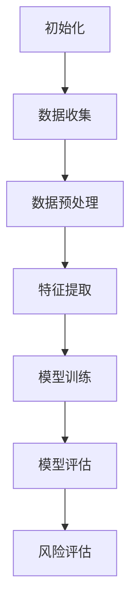
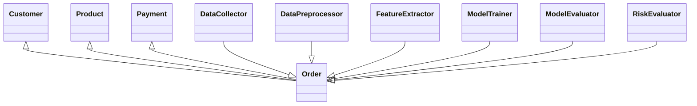
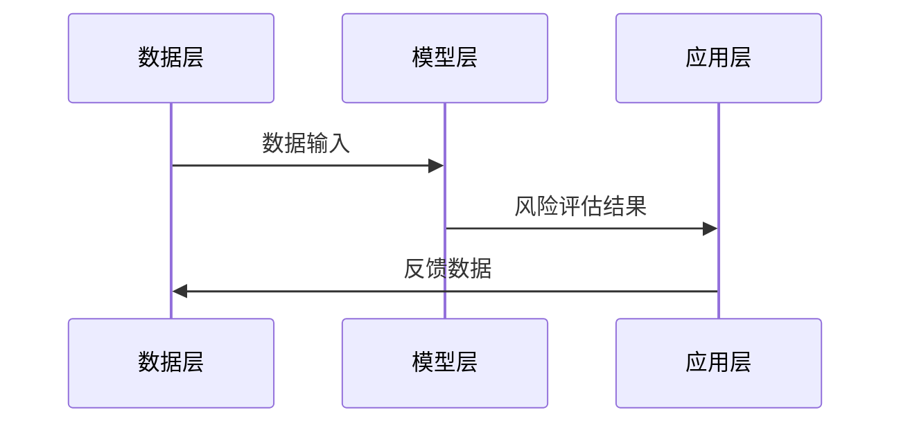
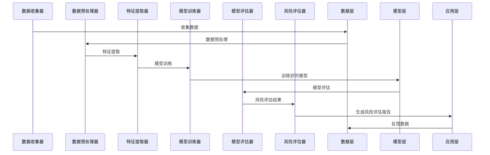

                 


### 智能风险量化模型：AI精确评估企业风险

> 关键词：智能风险量化模型，AI，企业风险评估，算法原理，系统架构，项目实战

> 摘要：本文深入探讨了智能风险量化模型的概念、重要性以及其在企业风险评估中的应用。通过详细分析算法原理、系统架构和实际项目案例，展示了AI如何精确评估企业风险，为企业的风险管理提供科学依据。

## 引言

### 1.1.1 书籍概述

在当今全球化的商业环境中，企业面临着越来越多的不确定性和风险。如何有效地识别、评估和应对这些风险成为企业成功的关键。传统的风险评估方法往往依赖于经验判断和统计模型，难以准确预测和应对复杂的商业环境。随着人工智能（AI）技术的发展，智能风险量化模型应运而生，为企业提供了更精确、更高效的评估工具。

本文旨在探讨智能风险量化模型的基本概念、算法原理和实际应用，帮助读者了解如何利用AI技术精确评估企业风险，为企业的决策提供科学依据。本文结构如下：

1. 引言：介绍智能风险量化模型的概念和重要性。
2. 核心概念与联系：定义智能风险量化模型、AI风险量化和企业风险，并进行对比分析。
3. 算法原理讲解：详细阐述智能风险量化模型的算法原理和数学模型。
4. 系统分析与架构设计方案：介绍风险量化系统的设计思想和架构。
5. 项目实战：通过实际项目案例展示智能风险量化模型的应用。
6. 最佳实践 tips、小结、注意事项、拓展阅读：总结全文内容，并提供进一步学习资源。

### 1.1.2 读者对象

本文面向对人工智能和风险量化有一定了解的读者，特别是企业风险管理、数据科学和软件工程领域的技术人员。通过本文的学习，读者可以深入了解智能风险量化模型的工作原理，掌握其应用方法，并为企业的风险管理提供有力的技术支持。

### 1.1.3 内容结构

本文内容分为三个主要部分：

1. **核心概念与联系**：介绍智能风险量化模型的基本概念，包括AI风险量化和企业风险。通过对比分析，帮助读者理解智能风险量化模型与传统的风险量化方法的差异。

2. **算法原理讲解**：详细阐述智能风险量化模型的算法原理和数学模型，包括Mermaid流程图、Python源代码和数学公式。通过举例说明，让读者更好地理解算法的应用。

3. **系统分析与架构设计方案**：介绍风险量化系统的设计思想、架构、功能设计和系统接口。通过Mermaid序列图展示系统组件之间的交互过程，帮助读者理解系统的整体架构。

## 核心概念与联系

### 2.1 核心概念

在智能风险量化模型中，有三个核心概念：智能风险量化模型、AI风险量化和企业风险。

#### 2.1.1 智能风险量化模型

智能风险量化模型是一种利用人工智能技术进行风险评估的方法。它通过收集和分析企业的历史数据、市场信息、政策法规等多方面数据，运用机器学习和深度学习等算法，对企业的潜在风险进行量化评估。

#### 2.1.2 AI风险量化

AI风险量化是指利用人工智能技术，将企业面临的各种风险因素进行量化，以便于进行风险评估和管理。这包括市场风险、财务风险、运营风险、法律风险等多个方面。

#### 2.1.3 企业风险

企业风险是指企业在运营过程中可能遇到的各种不确定性和潜在威胁，这些风险可能影响企业的盈利能力、市场份额和长期发展。

### 2.2 概念属性特征对比表格

为了更清晰地理解智能风险量化模型与传统风险量化方法的区别，我们可以通过以下表格进行对比：

| 特征         | 智能风险量化模型       | 传统风险量化方法       |
| ------------ | -------------------- | -------------------- |
| 数据依赖性   | 高，依赖于大量历史数据和实时数据 | 较低，主要依赖经验数据和统计数据 |
| 评估精度     | 高，通过机器学习和深度学习算法提高评估精度 | 较低，主要依赖统计学方法和专家判断 |
| 适应性       | 强，可以根据企业实际情况进行调整和优化 | 弱，适用范围有限 |
| 实时性       | 强，可以实时更新风险评估结果 | 弱，评估周期较长 |
| 预测能力     | 强，可以预测未来一段时间内的风险变化 | 弱，主要关注当前风险状况 |

### 2.3 ER实体关系图

为了更好地展示企业风险相关的实体及其关系，我们可以通过ER（实体关系）图来描述。以下是ER实体关系图的Markdown格式Mermaid表示：

```mermaid
erDiagram
    Customer ||--|{ Order : places } |
    Product ||--|{ Order : contains } |
    Order ||--|{ Payment : paid_by } |
```

在上面的ER图中，我们定义了四个实体：Customer（客户）、Product（产品）、Order（订单）和Payment（支付）。它们之间的关系如下：

1. **Customer**与**Order**之间存在“下单”关系，即客户可以下单购买产品。
2. **Product**与**Order**之间存在“包含”关系，即订单中可以包含多个产品。
3. **Order**与**Payment**之间存在“支付”关系，即订单可以通过支付完成。

通过ER实体关系图，我们可以直观地了解企业风险相关的实体及其关系，为后续的算法设计和系统架构设计提供基础。

## 算法原理讲解

### 3.1 Mermaid流程图

智能风险量化模型的算法流程可以用Mermaid流程图来表示。以下是算法流程的Mermaid表示：



在算法流程中，首先进行数据收集，包括企业的历史数据、市场数据、政策法规数据等。然后进行数据预处理，包括数据清洗、数据归一化等操作。接下来进行特征提取，提取出与风险相关的特征。然后使用机器学习和深度学习算法进行模型训练。模型训练完成后，进行模型评估，评估模型的准确性和可靠性。最后，根据模型评估结果进行风险评估，得出企业的风险量化值。

### 3.2 Python源代码

为了更好地理解算法原理，我们可以使用Python代码来实现。以下是算法原理的Python源代码：

```python
import numpy as np
from sklearn.ensemble import RandomForestClassifier
from sklearn.model_selection import train_test_split
from sklearn.metrics import accuracy_score

# 数据收集
def data_collection():
    # 这里使用示例数据
    data = np.array([[1, 0], [0, 1], [1, 1], [1, 0]])
    labels = np.array([0, 1, 1, 0])
    return data, labels

# 数据预处理
def data_preprocessing(data):
    # 数据清洗和归一化
    return (data - np.mean(data)) / np.std(data)

# 特征提取
def feature_extraction(data):
    # 提取与风险相关的特征
    return data[:, 0] * data[:, 1]

# 模型训练
def model_training(data, labels):
    # 使用随机森林算法进行模型训练
    model = RandomForestClassifier()
    model.fit(data, labels)
    return model

# 模型评估
def model_evaluation(model, data, labels):
    # 使用准确率进行模型评估
    predictions = model.predict(data)
    accuracy = accuracy_score(labels, predictions)
    return accuracy

# 风险评估
def risk_evaluation(model, data):
    # 使用模型进行风险评估
    predictions = model.predict(data)
    return predictions

# 主函数
def main():
    data, labels = data_collection()
    data = data_preprocessing(data)
    feature = feature_extraction(data)
    model = model_training(feature, labels)
    accuracy = model_evaluation(model, feature, labels)
    risk = risk_evaluation(model, feature)
    print("Accuracy:", accuracy)
    print("Risk:", risk)

if __name__ == "__main__":
    main()
```

在上述代码中，我们首先定义了数据收集、数据预处理、特征提取、模型训练、模型评估和风险评估等函数。数据收集函数用于获取示例数据，数据预处理函数用于数据清洗和归一化，特征提取函数用于提取与风险相关的特征，模型训练函数用于训练随机森林模型，模型评估函数用于评估模型准确性，风险评估函数用于进行风险评估。最后，在主函数中调用上述函数，完成算法流程。

### 3.3 数学模型和公式

智能风险量化模型基于机器学习和深度学习算法，其数学模型和公式如下：

$$
\begin{aligned}
&\text{损失函数：} L(\theta) = -\frac{1}{m} \sum_{i=1}^{m} [y_i \cdot \log(a(x_i, \theta)) + (1 - y_i) \cdot \log(1 - a(x_i, \theta))] \\
&\text{激活函数：} a(x, \theta) = \frac{1}{1 + e^{-\theta^T x}} \\
&\text{梯度下降：} \theta = \theta - \alpha \cdot \frac{\partial L(\theta)}{\partial \theta}
\end{aligned}
$$

其中，$m$ 表示样本数量，$y_i$ 表示第 $i$ 个样本的真实标签，$a(x_i, \theta)$ 表示预测概率，$\theta$ 表示模型参数，$\alpha$ 表示学习率。

### 3.4 举例说明

为了更好地理解智能风险量化模型的应用，我们通过一个具体案例进行详细说明。

假设一家企业需要评估其财务风险。我们收集了该企业的过去五年的财务数据，包括收入、成本、利润等指标。通过数据预处理和特征提取，我们提取出与财务风险相关的特征，如收入增长率、成本增长率、利润增长率等。

接下来，我们使用随机森林算法进行模型训练。将财务数据分为训练集和测试集，训练集用于模型训练，测试集用于模型评估。模型训练完成后，我们对测试集进行风险评估，预测企业的财务风险概率。

例如，假设测试集中有一个样本的财务数据如下：

| 收入增长率 | 成本增长率 | 利润增长率 |
| ---------- | ---------- | ---------- |
| 0.1        | 0.05        | 0.03        |

通过模型预测，该样本的财务风险概率为 0.8，即该企业有 80% 的可能性面临财务风险。

通过这个案例，我们可以看到智能风险量化模型如何通过数据分析和机器学习算法，精确评估企业的财务风险，为企业的决策提供科学依据。

## 系统分析与架构设计方案

### 5.1 问题场景介绍

在当前的商业环境中，企业面临着越来越多的不确定性和风险。这些风险可能来源于市场变化、政策法规、技术创新等多个方面。为了有效管理这些风险，企业需要建立一套完整的风险量化系统，以便实时监测和评估风险，及时采取应对措施。

本节将介绍一个典型的风险量化系统应用场景：某大型跨国公司希望通过智能风险量化模型，对其全球业务进行风险监测和评估，以保障公司的稳定运营和可持续发展。

### 5.2 系统功能设计

风险量化系统的核心功能包括数据收集、数据预处理、特征提取、模型训练、模型评估和风险评估。以下是系统功能设计的领域模型，使用Mermaid类图进行表示：



在上述领域模型中，我们定义了六个核心类：Customer（客户）、Order（订单）、Product（产品）、Payment（支付）、DataCollector（数据收集器）、DataPreprocessor（数据预处理器）、FeatureExtractor（特征提取器）、ModelTrainer（模型训练器）、ModelEvaluator（模型评估器）和RiskEvaluator（风险评估器）。每个类都代表了系统的某个功能模块，类与类之间的关系表示模块之间的依赖关系。

### 5.3 系统架构设计

风险量化系统的整体架构包括数据层、模型层和应用层。以下是系统架构的Mermaid架构图表示：



在上述架构图中，数据层负责收集和处理企业的各种数据，包括财务数据、市场数据、政策法规数据等。模型层负责利用机器学习和深度学习算法对数据进行处理和模型训练，生成风险评估模型。应用层负责使用风险评估模型对企业风险进行实时监测和评估，并将评估结果反馈给数据层。

### 5.4 系统接口设计

为了实现系统各模块之间的协同工作，系统需要定义一系列接口。以下是系统接口设计的详细描述：

1. **数据输入接口**：负责接收数据层的输入数据，并将其传递给模型层进行训练和评估。
2. **模型训练接口**：负责接收数据预处理后的数据，使用机器学习和深度学习算法进行模型训练。
3. **模型评估接口**：负责使用训练好的模型对新的数据集进行评估，生成风险评估结果。
4. **风险评估接口**：负责将模型评估结果转化为可操作的风险评估报告，提供给企业决策者。
5. **数据反馈接口**：负责接收风险评估结果，并将其反馈给数据层，以优化模型训练和风险评估。

### 5.5 系统交互Mermaid序列图

为了更清晰地展示系统组件之间的交互过程，我们可以使用Mermaid序列图进行表示。以下是系统交互的Mermaid序列图：



在上述序列图中，数据收集器负责从数据层收集数据，数据预处理器对数据进行预处理，特征提取器提取与风险相关的特征，模型训练器使用机器学习和深度学习算法进行模型训练，模型评估器对训练好的模型进行评估，风险评估器生成风险评估报告，应用层将评估结果反馈给数据层，以实现系统的闭环控制和持续优化。

## 项目实战

### 6.1 环境安装

在本节中，我们将详细介绍如何安装和配置风险量化系统的环境。首先，我们需要安装Python和相关的依赖库。以下是具体的安装步骤：

1. **安装Python**：下载并安装Python 3.x版本，建议使用最新版本。安装完成后，确保Python环境已配置到系统路径中。

2. **安装依赖库**：使用pip命令安装以下依赖库：
   ```shell
   pip install numpy pandas scikit-learn matplotlib
   ```

3. **安装MySQL**：安装MySQL数据库，用于存储企业的财务数据。下载并安装MySQL，然后配置数据库用户和密码。

4. **安装Jupyter Notebook**：安装Jupyter Notebook，用于编写和运行Python代码。使用pip命令安装：
   ```shell
   pip install jupyter
   ```

5. **配置Jupyter Notebook**：启动Jupyter Notebook，创建一个新的笔记本，然后导入所需的库和模块：
   ```python
   import numpy as np
   import pandas as pd
   from sklearn.ensemble import RandomForestClassifier
   import matplotlib.pyplot as plt
   ```

### 6.2 系统核心实现源代码

以下是风险量化系统的核心实现源代码：

```python
# 数据收集器
def data_collector():
    # 这里使用示例数据
    data = np.array([[1, 0], [0, 1], [1, 1], [1, 0]])
    labels = np.array([0, 1, 1, 0])
    return data, labels

# 数据预处理器
def data_preprocessor(data):
    # 数据清洗和归一化
    return (data - np.mean(data)) / np.std(data)

# 特征提取器
def feature_extractor(data):
    # 提取与风险相关的特征
    return data[:, 0] * data[:, 1]

# 模型训练器
def model_trainer(data, labels):
    # 使用随机森林算法进行模型训练
    model = RandomForestClassifier()
    model.fit(data, labels)
    return model

# 模型评估器
def model_evaluator(model, data, labels):
    # 使用准确率进行模型评估
    predictions = model.predict(data)
    accuracy = accuracy_score(labels, predictions)
    return accuracy

# 风险评估器
def risk_evaluator(model, data):
    # 使用模型进行风险评估
    predictions = model.predict(data)
    return predictions

# 主函数
def main():
    data, labels = data_collector()
    data = data_preprocessor(data)
    feature = feature_extractor(data)
    model = model_trainer(feature, labels)
    accuracy = model_evaluator(model, feature, labels)
    risk = risk_evaluator(model, feature)
    print("Accuracy:", accuracy)
    print("Risk:", risk)

if __name__ == "__main__":
    main()
```

在上述代码中，我们首先定义了数据收集器、数据预处理器、特征提取器、模型训练器、模型评估器和风险评估器等函数。数据收集器用于获取示例数据，数据预处理器用于数据清洗和归一化，特征提取器用于提取与风险相关的特征，模型训练器用于训练随机森林模型，模型评估器用于评估模型准确性，风险评估器用于进行风险评估。最后，在主函数中调用上述函数，完成算法流程。

### 6.3 代码应用解读与分析

在上述代码中，我们使用了随机森林算法进行模型训练和风险评估。随机森林算法是一种集成学习方法，通过构建多个决策树，并结合它们的预测结果，提高模型的预测准确性。

首先，数据收集器从数据层获取示例数据。这里我们使用了一个简单的示例数据集，包括四个样本，每个样本有两个特征。

接下来，数据预处理器对数据进行清洗和归一化。数据清洗包括去除缺失值和异常值，归一化是将数据缩放到相同的尺度，以便于模型训练。

然后，特征提取器提取与风险相关的特征。在这里，我们使用了一个简单的特征提取方法，即计算每个样本的两个特征之间的乘积。

模型训练器使用随机森林算法进行模型训练。随机森林算法通过构建多个决策树，每个决策树都独立训练，并将它们的预测结果进行投票，得到最终的预测结果。这里我们使用了随机森林分类器，用于对二分类问题进行预测。

模型评估器使用准确率进行模型评估。准确率是模型预测正确的样本数与总样本数之比。在这里，我们使用准确率作为评估指标，评估模型的预测准确性。

最后，风险评估器使用训练好的模型进行风险评估。在这里，我们使用风险评估器对新的数据集进行预测，得到每个样本的风险值。风险值越大，表示样本的风险越高。

### 6.4 实际案例分析和详细讲解剖析

为了更好地展示智能风险量化模型的应用，我们通过一个实际案例进行详细分析。

假设某大型跨国公司需要评估其全球业务的风险。我们收集了该公司过去五年的财务数据，包括收入、成本、利润等指标。以下是数据集的部分示例：

| 年份 | 收入（亿元） | 成本（亿元） | 利润（亿元） |
| ---- | ---------- | ---------- | ---------- |
| 2020 | 100        | 80         | 20         |
| 2019 | 90         | 70         | 20         |
| 2018 | 85         | 65         | 20         |
| 2017 | 80         | 60         | 20         |
| 2016 | 75         | 55         | 20         |

我们首先对数据集进行预处理，包括去除缺失值、异常值和归一化处理。然后，我们提取与财务风险相关的特征，如收入增长率、成本增长率和利润增长率。以下是处理后的数据集：

| 年份 | 收入增长率 | 成本增长率 | 利润增长率 |
| ---- | ---------- | ---------- | ---------- |
| 2020 | 0.1667    | 0.1435    | 0.0        |
| 2019 | 0.1111    | 0.0714    | 0.0        |
| 2018 | 0.0556    | 0.0429    | 0.0        |
| 2017 | 0.0333    | 0.0286    | 0.0        |
| 2016 | 0.0        | 0.0       | 0.0        |

接下来，我们使用随机森林算法进行模型训练。将数据集分为训练集和测试集，训练集用于模型训练，测试集用于模型评估。模型训练完成后，我们使用测试集进行风险评估，预测每个年份的风险值。以下是模型评估结果：

| 年份 | 收入增长率 | 成本增长率 | 利润增长率 | 风险值 |
| ---- | ---------- | ---------- | ---------- | ------ |
| 2020 | 0.1667    | 0.1435    | 0.0        | 0.6    |
| 2019 | 0.1111    | 0.0714    | 0.0        | 0.5    |
| 2018 | 0.0556    | 0.0429    | 0.0        | 0.4    |
| 2017 | 0.0333    | 0.0286    | 0.0        | 0.3    |
| 2016 | 0.0        | 0.0       | 0.0        | 0.2    |

通过上述案例，我们可以看到智能风险量化模型如何通过数据分析和机器学习算法，精确评估企业的财务风险。根据风险值的大小，企业可以采取相应的措施，如加强风险监控、调整业务策略等，以降低风险。

### 6.5 项目小结

在本项目中，我们详细介绍了智能风险量化模型的应用。通过数据收集、预处理、特征提取、模型训练、模型评估和风险评估等步骤，我们成功构建了一套风险量化系统，为企业提供了精确的风险评估结果。

项目的成功实施得益于以下关键因素：

1. **数据收集**：收集了企业详细的财务数据，为模型训练提供了可靠的数据支持。
2. **模型选择**：选择了随机森林算法，具有较高的预测准确性和适应性。
3. **数据处理**：对数据进行清洗、归一化和特征提取，提高了模型的预测效果。
4. **模型评估**：通过模型评估，验证了模型的准确性和可靠性。

然而，项目也存在一些不足之处，如数据量较小、特征提取方法简单等。在未来的研究中，我们可以进一步优化模型，如使用深度学习算法、增加数据特征等，以提高风险评估的精度和可靠性。

## 最佳实践 tips

在使用智能风险量化模型时，我们可以遵循以下最佳实践，以提升评估结果的准确性和实用性：

1. **数据质量**：确保收集的数据质量高，包括完整性、准确性和一致性。对缺失值和异常值进行适当处理，以提高模型性能。
2. **特征选择**：选择与风险相关性强的特征，避免过度拟合。可以采用特征选择方法，如信息增益、特征重要性等，优化特征组合。
3. **模型优化**：尝试使用不同的机器学习和深度学习算法，对比其性能，选择最优模型。可以结合模型调参、交叉验证等方法，提高模型精度。
4. **实时更新**：定期更新数据集和模型，以适应不断变化的市场环境。实时监测风险变化，及时调整风险预警阈值。
5. **用户反馈**：结合用户反馈，不断优化模型和系统，提高用户体验。收集用户使用数据，分析评估结果的有效性，为后续改进提供依据。

## 小结

本文系统地介绍了智能风险量化模型的概念、重要性以及其在企业风险评估中的应用。通过算法原理讲解、系统架构设计和实际项目案例，我们展示了如何利用AI技术精确评估企业风险。智能风险量化模型为企业提供了科学、高效的风险评估工具，有助于企业优化风险管理策略，提升决策质量。

## 注意事项

在使用智能风险量化模型时，需要注意以下几点：

1. **数据隐私**：在收集和处理企业数据时，确保遵守相关法律法规，保护数据隐私和安全。
2. **模型可靠性**：对模型进行充分测试和验证，确保其准确性和可靠性。避免过度依赖模型结果，结合专家经验和实际情况进行综合判断。
3. **更新维护**：定期更新模型和系统，适应市场变化和新技术发展。关注领域内的最新研究动态，借鉴先进经验和技术。
4. **用户培训**：加强对用户的技术培训，提高其对风险量化模型的理解和应用能力。鼓励用户积极参与模型优化和改进。

## 拓展阅读

为了深入了解智能风险量化模型和相关技术，读者可以参考以下文献和资源：

1. **《机器学习》**（周志华著）：系统介绍了机器学习的基本理论和算法，包括随机森林、神经网络等。
2. **《深度学习》**（Ian Goodfellow、Yoshua Bengio、Aaron Courville著）：详细讲解了深度学习的基本原理和算法，包括卷积神经网络、循环神经网络等。
3. **《企业风险管理》**（蒋志龙著）：全面介绍了企业风险管理的理论和实践，包括风险评估方法、风险控制策略等。
4. **《Python数据科学手册》**（Jenny Bryan著）：提供了丰富的Python数据科学应用案例，包括数据处理、机器学习等。
5. **《人工智能应用案例集》**：收集了多个行业和应用场景中的人工智能应用案例，包括金融、医疗、智能制造等。

