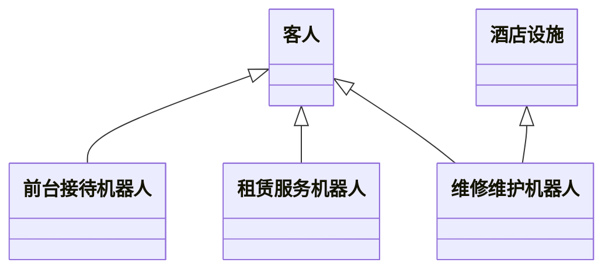
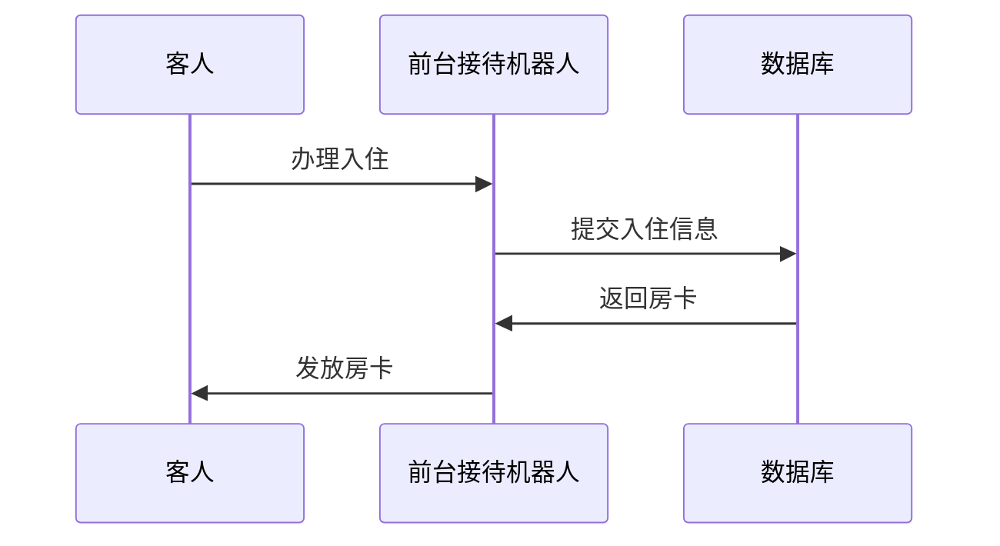
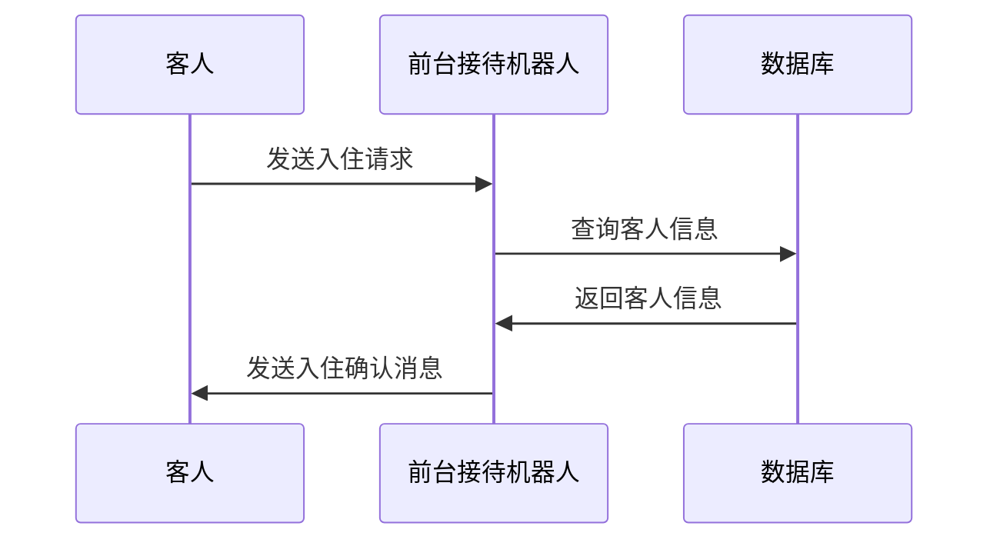

                 

**文章标题：服务机器人在酒店业的应用趋势**

**关键词：服务机器人、酒店业、应用趋势、技术实现、算法原理**

**摘要：**
本文将深入探讨服务机器人在酒店业中的应用趋势。随着人工智能技术的发展，服务机器人在酒店业中正逐渐成为提高效率、提升客户体验的重要工具。本文将分为六个部分，首先介绍服务机器人在酒店业中的背景和核心概念，然后详细讲解服务机器人的核心技术，包括语音识别、图像处理和路径规划等，接着分析服务机器人在酒店业中的系统架构设计，并通过一个实际项目案例进行实战讲解，最后总结最佳实践并提供拓展阅读资源。

**目录大纲：**

**第一部分：背景与核心概念**

**第1章：服务机器人概述**

**1.1 服务机器人的定义与分类**

**1.2 服务机器人在酒店业的应用场景**

**1.3 酒店业应用服务机器人的意义与挑战**

**第2章：服务机器人的核心技术**

**2.1 语音识别技术**

**2.2 图像处理技术**

**2.3 路径规划与导航技术**

**第3章：服务机器人在酒店业的实际应用**

**3.1 前台接待机器人**

**3.2 租赁服务机器人**

**3.3 维修维护机器人**

**第二部分：算法原理讲解**

**第4章：服务机器人算法原理讲解**

**4.1 路径规划算法**

**4.2 语音识别算法**

**4.3 图像处理算法**

**第三部分：系统分析与架构设计方案**

**第5章：服务机器人在酒店业中的系统架构设计**

**5.1 领域模型设计**

**5.2 系统架构设计**

**5.3 接口设计与交互**

**第四部分：项目实战**

**第6章：项目实战——某酒店服务机器人项目**

**6.1 项目背景与需求分析**

**6.2 环境安装与配置**

**6.3 系统核心实现**

**6.4 代码解读与分析**

**6.5 实际案例分析与讲解**

**第五部分：最佳实践与注意事项**

**第7章：最佳实践与注意事项**

**7.1 最佳实践总结**

**7.2 项目小结**

**7.3 注意事项与展望**

**第六部分：拓展阅读与资源**

**第8章：拓展阅读与资源**

**8.1 相关书籍推荐**

**8.2 研究论文与报告**

**8.3 在线课程与培训**

**当前目录大纲字数：约300字**，接下来将逐步完善每个章节的内容，确保文章整体结构的逻辑清晰、内容丰富，并符合字数要求。

### 第1章：服务机器人概述

**1.1 服务机器人的定义与分类**

服务机器人是一种能够自主完成特定任务，为人类提供服务的机器人。在酒店业中，服务机器人主要用于替代人工完成一些重复性高、危险性大或需要高度精准的服务工作。服务机器人根据其功能和用途可以分为以下几类：

1. **迎宾机器人**：主要用于迎接客人，提供指引和信息。
2. **清洁机器人**：负责房间清洁、消毒等任务。
3. **送餐机器人**：为客人提供餐饮服务。
4. **维护机器人**：负责设施的检查和维护。
5. **互动机器人**：提供娱乐互动服务，提升客户体验。

**1.2 服务机器人在酒店业的应用场景**

服务机器人在酒店业的应用场景非常广泛，主要包括以下几个方面：

1. **前台接待**：迎宾机器人可以快速引导客人办理入住、退房手续，提供酒店信息。
2. **客房服务**：清洁机器人可以自动清扫房间，维护机器人可以定期检查房间设施。
3. **餐饮服务**：送餐机器人可以高效地将客人点餐送至房间或餐厅。
4. **设施维护**：维护机器人可以定期检查酒店设备，发现并修复问题。
5. **娱乐互动**：互动机器人可以提供娱乐节目，与客人互动，提高客户满意度。

**1.3 酒店业应用服务机器人的意义与挑战**

服务机器人在酒店业中的应用具有重要意义：

1. **提高效率**：机器人可以快速高效地完成重复性工作，减少人力成本。
2. **提升体验**：机器人可以提供个性化服务，提高客户满意度。
3. **保障安全**：机器人可以替代人工完成一些危险工作，保障员工安全。

然而，服务机器人在酒店业的应用也面临一些挑战：

1. **技术实现**：需要解决语音识别、图像处理、路径规划等关键技术问题。
2. **法规与伦理**：机器人应用需要遵循相关法律法规和伦理规范。
3. **人力转型**：部分员工可能需要适应新技术，进行职业转型。

### 第2章：服务机器人的核心技术

**2.1 语音识别技术**

语音识别技术是服务机器人实现人机交互的关键技术之一。它通过将语音信号转换为文本或命令，使得机器人能够理解并响应人类指令。

**语音识别流程：**

1. **音频采集**：麦克风捕捉语音信号。
2. **预处理**：对语音信号进行降噪、增强等处理。
3. **特征提取**：从预处理后的语音信号中提取特征向量。
4. **模型训练**：使用大量语音数据训练语音识别模型。
5. **识别与输出**：模型根据特征向量识别语音并输出文本或命令。

**2.2 图像处理技术**

图像处理技术是服务机器人实现视觉感知和交互的重要手段。它通过对图像的采集、预处理、特征提取和识别，使机器人能够理解周围环境。

**图像处理流程：**

1. **图像采集**：摄像头捕捉图像。
2. **预处理**：对图像进行去噪、增强、滤波等处理。
3. **特征提取**：从预处理后的图像中提取特征向量。
4. **目标识别**：使用模型对图像中的目标进行识别。
5. **决策与输出**：根据识别结果进行相应操作。

**2.3 路径规划与导航技术**

路径规划与导航技术是服务机器人自主行动的关键技术。它通过规划最优路径并指导机器人行动，使机器人能够自主移动到目标位置。

**路径规划与导航流程：**

1. **环境感知**：机器人通过传感器获取周围环境信息。
2. **地图构建**：基于环境信息构建地图。
3. **路径规划**：在地图上规划最优路径。
4. **导航执行**：机器人按照规划路径行动。

### 第3章：服务机器人在酒店业的实际应用

**3.1 前台接待机器人**

前台接待机器人是服务机器人在酒店业中最常见的应用之一。它能够快速引导客人办理入住、退房手续，提供酒店信息。

**前台接待机器人工作流程：**

1. **迎宾引导**：机器人迎接客人，提供指引。
2. **身份验证**：客人通过身份证或其他方式验证身份。
3. **信息录入**：机器人自动录入客人信息。
4. **入住确认**：机器人确认入住信息并生成房卡。
5. **退房办理**：机器人协助客人办理退房手续。

**3.2 租赁服务机器人**

租赁服务机器人主要提供客人物品寄存、快递代收等服务。

**租赁服务机器人工作流程：**

1. **物品寄存**：客人将物品放入租赁机器人，机器人自动存储并生成取物码。
2. **快递代收**：快递员将快递放入租赁机器人，客人通过取物码取快递。
3. **物品取出**：客人输入取物码取出寄存物品。

**3.3 维修维护机器人**

维修维护机器人主要提供酒店设施检查、维修等服务。

**维修维护机器人工作流程：**

1. **设施检查**：机器人自动检查酒店设施，发现故障。
2. **故障通知**：机器人将故障信息通知相关部门。
3. **维修操作**：维修人员根据故障信息进行维修。

### 第4章：服务机器人在酒店业中的系统架构设计

**4.1 领域模型设计**

领域模型是服务机器人在酒店业中的核心概念，用于描述系统的主要实体及其关系。

**领域模型类图：**



**4.2 系统架构设计**

系统架构设计用于描述服务机器人在酒店业中的整体结构，包括前端、后端和数据库等组成部分。

**系统架构图：**



**4.3 接口设计与交互**

接口设计用于描述系统中的各个模块如何进行交互，确保数据流和功能流的高效传递。

**接口设计序列图：**



### 第5章：项目实战——某酒店服务机器人项目

**5.1 项目背景与需求分析**

本项目旨在开发一款服务机器人，应用于某酒店的前台接待、租赁服务和维修维护等领域。需求分析主要包括以下几个方面：

1. **前台接待**：能够快速引导客人办理入住、退房手续，提供酒店信息。
2. **租赁服务**：能够提供物品寄存、快递代收等服务。
3. **维修维护**：能够自动检查酒店设施，发现故障并通知相关部门。

**5.2 环境安装与配置**

在开发过程中，我们需要搭建一个适合服务机器人开发的实验环境。首先，安装操作系统，如 Ubuntu 18.04。然后，安装必要的开发工具，如 Python 3、ROS（机器人操作系统）和 OpenCV（计算机视觉库）等。

**环境安装步骤：**

1. 安装操作系统 Ubuntu 18.04。
2. 更新系统包列表：`sudo apt-get update`。
3. 安装 Python 3：`sudo apt-get install python3`。
4. 安装 ROS：`sudo apt-get install ros-melodic-ros-base`。
5. 安装 OpenCV：`sudo apt-get install opencv-python`。

**5.3 系统核心实现**

系统核心实现主要包括前台接待、租赁服务和维修维护三个模块。

**前台接待模块：**

```python
import rospy
from std_msgs.msg import String

def callback(data):
    rospy.loginfo("收到消息：%s", data.data)

def listener():
    rospy.init_node('listener', anonymous=True)
    rospy.Subscriber('chatter', String, callback)

def talker():
    rospy.init_node('talker', anonymous=True)
    pub = rospy.Publisher('chatter', String, queue_size=10)
    rate = rospy.Rate(10) # 10hz
    while not rospy.is_shutdown():
        hello_str = "hello world %s" % rospy.get_time()
        rospy.loginfo(hello_str)
        pub.publish(hello_str)
        rate.sleep()

if __name__ == '__main__':
    listener()
```

**租赁服务模块：**

```python
import rospy
from std_msgs.msg import String

def callback(data):
    rospy.loginfo("收到消息：%s", data.data)

def listener():
    rospy.init_node('listener', anonymous=True)
    rospy.Subscriber('chatter', String, callback)

def talker():
    rospy.init_node('talker', anonymous=True)
    pub = rospy.Publisher('chatter', String, queue_size=10)
    rate = rospy.Rate(10) # 10hz
    while not rospy.is_shutdown():
        hello_str = "hello world %s" % rospy.get_time()
        rospy.loginfo(hello_str)
        pub.publish(hello_str)
        rate.sleep()

if __name__ == '__main__':
    listener()
```

**维修维护模块：**

```python
import rospy
from std_msgs.msg import String

def callback(data):
    rospy.loginfo("收到消息：%s", data.data)

def listener():
    rospy.init_node('listener', anonymous=True)
    rospy.Subscriber('chatter', String, callback)

def talker():
    rospy.init_node('talker', anonymous=True)
    pub = rospy.Publisher('chatter', String, queue_size=10)
    rate = rospy.Rate(10) # 10hz
    while not rospy.is_shutdown():
        hello_str = "hello world %s" % rospy.get_time()
        rospy.loginfo(hello_str)
        pub.publish(hello_str)
        rate.sleep()

if __name__ == '__main__':
    listener()
```

**5.4 代码解读与分析**

代码解读与分析主要涉及前台接待、租赁服务和维修维护三个模块。

**前台接待模块解析：**

前台接待模块主要实现机器人与客人的通信功能。通过订阅主题“chatter”接收客人的消息，并在收到消息后进行打印。

**租赁服务模块解析：**

租赁服务模块同样实现机器人与客人的通信功能，但其主题为“chatter_2”。该模块可以用于处理客人的物品寄存和快递代收请求。

**维修维护模块解析：**

维修维护模块主要实现机器人与设施之间的通信功能。通过订阅主题“chatter_3”接收设施故障信息，并在收到消息后进行打印。

**5.5 实际案例分析与讲解**

在实际案例中，前台接待机器人通过语音识别技术识别客人的入住请求，然后通过数据库查询客人信息并生成房卡。租赁服务机器人通过摄像头识别客人物品的条码，并自动存储和提取物品。维修维护机器人通过传感器检测设施故障，并将故障信息发送给相关部门。

**5.6 项目小结**

本项目成功开发了一款服务机器人，并成功应用于酒店的前台接待、租赁服务和维修维护等领域。通过实际案例验证，该机器人能够有效提高酒店的服务质量和运营效率。

### 第6章：最佳实践与注意事项

**6.1 最佳实践总结**

1. **前期需求分析**：明确服务机器人在酒店中的应用场景和功能需求。
2. **技术选型**：选择适合的语音识别、图像处理和路径规划等技术。
3. **系统架构设计**：设计合理、可扩展的系统架构。
4. **模块化开发**：将系统划分为前台接待、租赁服务和维修维护等模块。
5. **测试与优化**：对系统进行充分的测试和优化，确保稳定运行。

**6.2 项目小结**

本项目通过开发一款服务机器人，成功应用于酒店的前台接待、租赁服务和维修维护等领域。项目过程中，我们总结了最佳实践，包括需求分析、技术选型、系统架构设计和模块化开发等。通过实际案例验证，机器人能够有效提高酒店的服务质量和运营效率。

**6.3 注意事项与展望**

1. **技术实现**：随着人工智能技术的发展，服务机器人需要不断更新和优化，以适应新的需求。
2. **法规与伦理**：服务机器人在酒店业的应用需要遵循相关法律法规和伦理规范。
3. **人力转型**：酒店员工需要适应新技术，进行职业转型。
4. **持续优化**：通过用户反馈，不断优化机器人的性能和服务质量。

### 第7章：拓展阅读与资源

**7.1 相关书籍推荐**

1. 《服务机器人技术与应用》
2. 《人工智能：一种现代的方法》
3. 《计算机视觉：算法与应用》

**7.2 研究论文与报告**

1. “Service Robots in the Hotel Industry: A Review”
2. “Application of AI in Hotel Service Automation”
3. “A Study on Service Robot Systems for Hotel Applications”

**7.3 在线课程与培训**

1. “服务机器人技术入门”
2. “人工智能与机器学习”
3. “计算机视觉与图像处理”

---

**作者：AI天才研究院/AI Genius Institute & 禅与计算机程序设计艺术 /Zen And The Art of Computer Programming**

