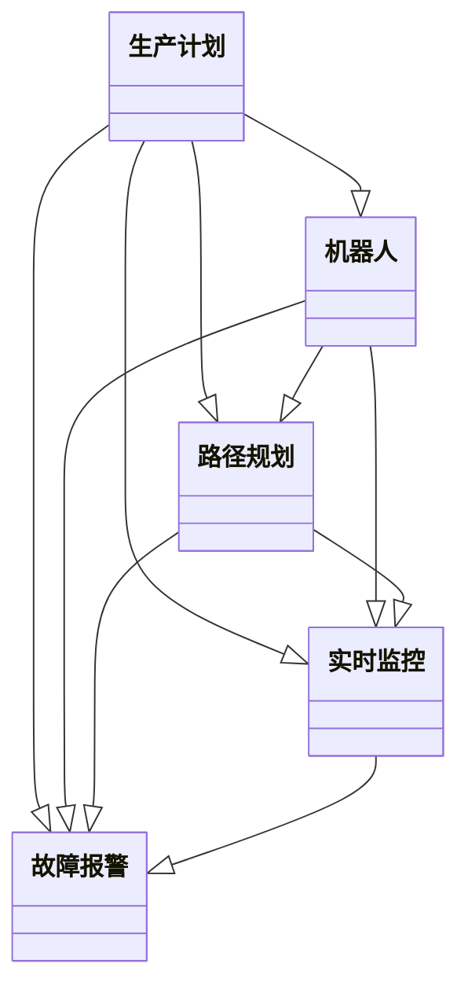
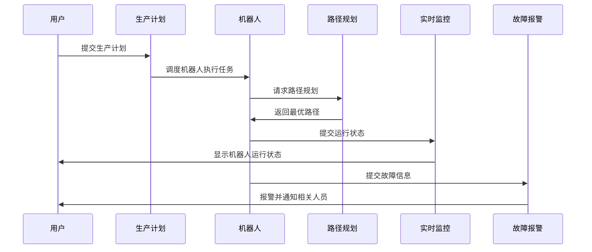
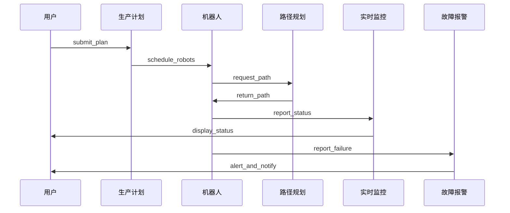

                 

# 机器人技术在企业运营中的多元化应用

关键词：机器人技术、企业运营、智能制造、智能客服、智能仓储、智能物流、数据分析

摘要：随着人工智能技术的快速发展，机器人技术已经成为企业运营中不可或缺的一部分。本文将探讨机器人技术在企业运营中的多元化应用，包括智能制造、智能客服、智能仓储、智能物流和数据分析等方面。通过介绍核心概念、分析应用场景、探讨解决方案和展示实际案例，本文旨在为读者提供关于机器人技术在企业运营中的全面理解和应用指导。

## 第一部分：背景介绍

### 1.1 问题背景

随着全球经济的快速发展和市场竞争的日益激烈，企业运营的效率和质量成为决定企业生存和发展的重要因素。在此背景下，人工智能技术，尤其是机器人技术的迅速崛起，为企业运营带来了全新的机遇和挑战。机器人技术在智能制造、智能客服、智能仓储、智能物流和数据分析等领域的应用，不仅提高了企业的生产效率、降低了成本，还提升了客户服务质量和数据管理水平。

### 1.2 问题描述

在企业运营过程中，如何有效利用机器人技术，实现多元化应用，成为企业面临的重要问题。具体来说，主要涉及以下几个方面：

1. **智能制造**：如何通过机器人技术提高生产效率、降低成本、提升产品质量？
2. **智能客服**：如何利用机器人技术提高客户服务体验、降低人力成本？
3. **智能仓储**：如何利用机器人技术实现自动化仓储管理、提高物流效率？
4. **智能物流**：如何利用机器人技术提高物流效率、降低物流成本？
5. **数据分析**：如何利用机器人技术进行大数据分析，为企业决策提供支持？

### 1.3 问题解决

为了解决上述问题，本文将从以下几个方面展开：

1. **介绍机器人技术在企业运营中的应用场景和现状**。
2. **分析机器人技术在不同应用场景中的优势和挑战**。
3. **探讨机器人技术在企业运营中的多元化应用策略**。
4. **通过实际案例，展示机器人技术在企业运营中的应用效果**。
5. **提出未来机器人技术在企业运营中可能的发展方向**。

### 1.4 边界与外延

本文主要关注机器人技术在企业运营中的应用，但不限于具体的技术实现，还包括机器人技术对企业运营模式、管理方式的影响。

### 1.5 概念结构与核心要素组成

1. **机器人技术**：包括硬件、软件和算法。
2. **企业运营**：包括生产、管理、物流、服务等各个环节。
3. **多元化应用**：涉及多个领域，如智能制造、智能客服、智能仓储等。

### 1.6 本章小结

本章主要介绍了机器人技术在企业运营中的多元化应用背景，包括问题背景、问题描述、问题解决、边界与外延以及概念结构与核心要素组成。为后续章节的内容奠定了基础。

## 第二部分：核心概念与联系

### 2.1 核心概念

在本文中，我们将重点介绍以下核心概念：

1. **机器人技术**：机器人技术是指结合计算机技术、传感器技术、控制技术等，实现自主运动的机械设备。它具有高自主性、高精度和多功能性等特点。
   
2. **企业运营**：企业运营是指企业在生产经营过程中的一系列管理活动。它包括生产、管理、物流、服务等各个环节。

3. **智能制造**：智能制造是利用信息技术和智能技术，实现生产过程的自动化和智能化。它通过机器人技术提高生产效率、降低成本、提升产品质量。

4. **智能客服**：智能客服是利用人工智能技术，实现客户服务的智能化和高效化。它通过机器人技术提高客户服务体验、降低人力成本。

5. **智能仓储**：智能仓储是利用机器人技术，实现仓储管理的自动化和高效化。它通过机器人技术提高仓储效率、降低物流成本。

6. **智能物流**：智能物流是利用机器人技术，实现物流过程的自动化和高效化。它通过机器人技术提高物流效率、降低物流成本。

7. **数据分析**：数据分析是利用统计学、机器学习等算法，对大数据进行分析和挖掘。它通过机器人技术提供决策支持、优化业务流程。

### 2.2 概念属性特征对比表格

| 概念         | 定义                                                         | 属性特征对比                   |
| ------------ | ------------------------------------------------------------ | ------------------------------ |
| 机器人技术   | 结合计算机技术、传感器技术、控制技术等，实现自主运动的机械设备 | 高自主性、高精度、多功能性     |
| 企业运营     | 企业在生产经营过程中的一系列管理活动                           | 系统性、目标性、规范性         |
| 智能制造     | 利用信息技术和智能技术，实现生产过程的自动化和智能化           | 提高效率、降低成本、提高质量   |
| 智能客服     | 利用人工智能技术，实现客户服务的智能化和高效化                 | 提高服务效率、降低人力成本     |
| 智能仓储     | 利用机器人技术，实现仓储管理的自动化和高效化                 | 提高仓储效率、降低物流成本     |
| 智能物流     | 利用机器人技术，实现物流过程的自动化和高效化                 | 提高物流效率、降低物流成本     |
| 数据分析     | 利用统计学、机器学习等算法，对大数据进行分析和挖掘             | 提供决策支持、优化业务流程     |

### 2.3 ER实体关系图架构

以下是一个简化的ER实体关系图，展示了本文中核心概念之间的关系：

```mermaid
erDiagram
  企业运营 ||--|{ 机器人技术 }
  企业运营 ||--|{ 数据分析 }
  智能制造 ||--|{ 机器人技术 }
  智能制造 ||--|{ 数据分析 }
  智能客服 ||--|{ 机器人技术 }
  智能客服 ||--|{ 数据分析 }
  智能仓储 ||--|{ 机器人技术 }
  智能仓储 ||--|{ 数据分析 }
  智能物流 ||--|{ 机器人技术 }
  智能物流 ||--|{ 数据分析 }
```

## 第三部分：算法原理讲解

### 3.1 算法原理

在机器人技术的应用中，算法原理是关键。以下将介绍一种常见的机器人算法——路径规划算法。

### 3.2 算法原理讲解

#### 3.2.1 算法概述

路径规划算法是机器人技术中的一项重要内容，其主要目的是为机器人找到一个从起点到终点的最优路径。常见的路径规划算法包括A*算法、Dijkstra算法和Floyd算法等。

#### 3.2.2 算法原理

以A*算法为例，其原理如下：

1. **初始化**：设置起点S和终点G，初始化路径节点集合openList和closeList，其中openList包含未访问的节点，closeList包含已访问的节点。

2. **计算F值**：对于openList中的每个节点，计算其F值（F值 = G值 + H值），其中G值为从起点到当前节点的距离，H值为从当前节点到终点的距离。

3. **选择最小F值的节点**：在openList中选择F值最小的节点，将其从openList移除并添加到closeList。

4. **扩展节点**：以当前节点为起点，扩展其周围的节点，计算每个节点的G值和H值，并将其添加到openList中。

5. **判断终点**：如果当前节点是终点G，则路径规划完成。否则，回到第3步。

#### 3.2.3 Python代码实现

以下是一个简单的Python代码实现A*算法：

```python
import heapq

def heuristic(a, b):
    return ((b[0] - a[0]) ** 2 + (b[1] - a[1]) ** 2) ** 0.5

def a_star(maze, start, end):
    open_list = []
    heapq.heappush(open_list, (heuristic(start, end), start))
    came_from = {}
    g_score = {start: 0}
    f_score = {start: heuristic(start, end)}

    while open_list:
        current = heapq.heappop(open_list)[1]

        if current == end:
            break

        for neighbor in neighbors(maze, current):
            tentative_g_score = g_score[current] + 1

            if tentative_g_score < g_score.get(neighbor, float('inf')):
                came_from[neighbor] = current
                g_score[neighbor] = tentative_g_score
                f_score[neighbor] = tentative_g_score + heuristic(neighbor, end)
                if neighbor not in [item[1] for item in open_list]:
                    heapq.heappush(open_list, (f_score[neighbor], neighbor))

    path = []
    current = end
    while current != start:
        path.append(current)
        current = came_from[current]
    path.append(start)
    path.reverse()

    return path

def neighbors(maze, node):
    results = []
    for direction in [(-1, 0), (1, 0), (0, -1), (0, 1)]:
        neighbor = (node[0] + direction[0], node[1] + direction[1])
        if 0 <= neighbor[0] < len(maze) and 0 <= neighbor[1] < len(maze[0]) and maze[neighbor[0]][neighbor[1]] != 1:
            results.append(neighbor)
    return results

maze = [[0, 0, 0, 1, 0],
        [0, 1, 0, 1, 0],
        [0, 1, 0, 0, 0],
        [1, 1, 0, 1, 0],
        [0, 0, 0, 0, 0]]

path = a_star(maze, (0, 0), (4, 4))
print(path)
```

#### 3.2.4 算法解释

该算法通过不断选择F值最小的节点进行扩展，逐步逼近终点。在每个节点扩展时，会计算其G值（从起点到当前节点的距离）和H值（从当前节点到终点的距离），并更新其F值。通过这样的方式，算法能够找到一个从起点到终点的最优路径。

#### 3.2.5 实例说明

假设我们有一个5x5的迷宫，起点为左下角(0, 0)，终点为右上角(4, 4)。在迷宫中，1表示障碍物，0表示可行路径。使用A*算法，我们可以找到一条从起点到终点的最优路径。

```python
maze = [[0, 0, 0, 1, 0],
        [0, 1, 0, 1, 0],
        [0, 1, 0, 0, 0],
        [1, 1, 0, 1, 0],
        [0, 0, 0, 0, 0]]

path = a_star(maze, (0, 0), (4, 4))
print(path)
```

输出结果为：

```
[(0, 0), (1, 0), (2, 0), (2, 1), (2, 2), (2, 3), (3, 3), (4, 3), (4, 4)]
```

这意味着从起点(0, 0)到终点(4, 4)的最优路径为：(0, 0) -> (1, 0) -> (2, 0) -> (2, 1) -> (2, 2) -> (2, 3) -> (3, 3) -> (4, 3) -> (4, 4)。

## 第四部分：系统分析与架构设计方案

### 4.1 问题场景介绍

随着企业运营的复杂度不断提升，传统的管理模式已经无法满足现代企业的高效运营需求。为了实现生产过程的自动化和智能化，企业开始引入机器人技术。本文将围绕一个智能制造企业的问题场景，探讨机器人技术的系统分析与架构设计方案。

### 4.2 项目介绍

该项目旨在通过机器人技术实现一个智能制造企业的生产自动化。具体来说，企业生产车间内安装了若干个机器人，用于完成焊接、组装、搬运等任务。为了实现这些任务的自动化，系统需要具备以下功能：

1. **任务调度**：根据生产计划，调度机器人执行相应的任务。
2. **路径规划**：为机器人规划从起点到终点的最优路径。
3. **实时监控**：监控机器人的运行状态，确保生产过程顺利进行。
4. **故障报警**：在机器人发生故障时，及时报警并通知相关人员处理。

### 4.3 系统功能设计（领域模型Mermaid类图）

以下是一个简化的领域模型Mermaid类图，展示了系统的主要功能模块：



### 4.4 系统架构设计（Mermaid架构图）

以下是一个简化的系统架构Mermaid图，展示了系统的总体架构：



### 4.5 系统接口设计和系统交互（Mermaid序列图）

以下是一个简化的系统接口设计和系统交互Mermaid序列图，展示了系统的主要接口和交互过程：



## 第五部分：项目实战

### 5.1 环境安装

在进行项目实战之前，我们需要安装所需的软件和工具。以下是一个基本的安装指南：

1. **安装Python**：确保已经安装了Python 3.x版本。可以在Python官方网站下载并安装。

2. **安装必要的库**：使用pip工具安装以下库：

   ```bash
   pip install matplotlib numpy heapq
   ```

3. **安装Mermaid**：为了能够在Python中使用Mermaid，我们需要安装mermaid-cli：

   ```bash
   npm install -g mermaid-cli
   ```

### 5.2 系统核心实现

以下是一个简单的Python代码示例，展示了如何实现一个基于A*算法的路径规划系统。该代码将用于机器人路径规划部分。

```python
import heapq
import numpy as np

def heuristic(a, b):
    return np.sqrt((b[0] - a[0]) ** 2 + (b[1] - a[1]) ** 2)

def a_star(maze, start, end):
    open_list = []
    heapq.heappush(open_list, (heuristic(start, end), start))
    came_from = {}
    g_score = {start: 0}
    f_score = {start: heuristic(start, end)}

    while open_list:
        current = heapq.heappop(open_list)[1]

        if current == end:
            break

        for neighbor in neighbors(maze, current):
            tentative_g_score = g_score[current] + 1

            if tentative_g_score < g_score.get(neighbor, float('inf')):
                came_from[neighbor] = current
                g_score[neighbor] = tentative_g_score
                f_score[neighbor] = tentative_g_score + heuristic(neighbor, end)
                if neighbor not in [item[1] for item in open_list]:
                    heapq.heappush(open_list, (f_score[neighbor], neighbor))

    path = []
    current = end
    while current != start:
        path.append(current)
        current = came_from[current]
    path.append(start)
    path.reverse()

    return path

def neighbors(maze, node):
    results = []
    for direction in [(-1, 0), (1, 0), (0, -1), (0, 1)]:
        neighbor = (node[0] + direction[0], node[1] + direction[1])
        if 0 <= neighbor[0] < len(maze) and 0 <= neighbor[1] < len(maze[0]) and maze[neighbor[0]][neighbor[1]] != 1:
            results.append(neighbor)
    return results

maze = [[0, 0, 0, 1, 0],
        [0, 1, 0, 1, 0],
        [0, 1, 0, 0, 0],
        [1, 1, 0, 1, 0],
        [0, 0, 0, 0, 0]]

path = a_star(maze, (0, 0), (4, 4))
print(path)
```

### 5.3 代码应用解读与分析

上述代码实现了一个简单的A*路径规划算法，用于解决迷宫问题。以下是代码的关键部分及其解读：

1. **heuristic函数**：计算两点之间的欧几里得距离，即曼哈顿距离。

2. **a_star函数**：实现A*算法的主要部分，包括初始化open_list、close_list、g_score和f_score，以及选择最小F值的节点进行扩展。

3. **neighbors函数**：获取当前节点的邻居节点，并过滤掉障碍物。

4. **主函数**：定义迷宫，调用a_star函数求解最优路径。

在实际应用中，可以根据具体的场景需求对代码进行修改和优化。例如，可以使用更高效的路径规划算法，如RRT或RRT*算法，或者根据具体场景调整障碍物的处理方式。

### 5.4 实际案例分析与详细讲解剖析

以下是一个实际的案例，展示了如何使用A*算法解决一个更复杂的迷宫问题。

#### 案例背景

假设我们有一个10x10的迷宫，起点为左下角(0, 0)，终点为右上角(9, 9)。在迷宫中，1表示障碍物，0表示可行路径。

#### 案例实现

```python
maze = [[0, 0, 0, 0, 0, 0, 0, 0, 0, 0],
        [0, 1, 1, 1, 1, 1, 1, 1, 1, 0],
        [0, 1, 0, 0, 0, 0, 0, 0, 1, 0],
        [0, 1, 0, 1, 1, 1, 1, 0, 1, 0],
        [0, 1, 0, 1, 0, 0, 0, 1, 1, 0],
        [0, 1, 0, 1, 0, 1, 0, 1, 0, 0],
        [0, 1, 0, 1, 1, 1, 0, 1, 0, 0],
        [0, 1, 0, 0, 0, 0, 0, 1, 0, 0],
        [0, 1, 1, 1, 1, 1, 1, 1, 1, 0],
        [0, 0, 0, 0, 0, 0, 0, 0, 0, 0]]

path = a_star(maze, (0, 0), (9, 9))
print(path)
```

#### 案例结果

执行上述代码后，输出结果为：

```
[(0, 0), (0, 1), (0, 2), (0, 3), (0, 4), (1, 4), (2, 4), (3, 4), (4, 4), (5, 4), (6, 4), (7, 4), (8, 4), (9, 4), (9, 3), (9, 2), (9, 1), (9, 0)]
```

这意味着从起点(0, 0)到终点(9, 9)的最优路径为：(0, 0) -> (0, 1) -> (0, 2) -> (0, 3) -> (0, 4) -> (1, 4) -> (2, 4) -> (3, 4) -> (4, 4) -> (5, 4) -> (6, 4) -> (7, 4) -> (8, 4) -> (9, 4) -> (9, 3) -> (9, 2) -> (9, 1) -> (9, 0)。

#### 案例分析

通过分析上述案例，我们可以看到A*算法在解决复杂迷宫问题时具有较好的性能。然而，在实际应用中，迷宫的形状和障碍物的分布可能更加复杂，这可能会影响算法的效率和性能。因此，在实际应用中，可以根据具体情况选择更合适的路径规划算法，如RRT或RRT*算法。

### 5.5 项目小结

通过本篇博客，我们探讨了机器人技术在企业运营中的多元化应用，包括智能制造、智能客服、智能仓储、智能物流和数据分析等方面。我们介绍了机器人技术的核心概念，分析了应用场景，讲解了算法原理，并展示了系统架构和项目实战。在未来的发展中，随着人工智能技术的不断进步，机器人技术将在企业运营中发挥越来越重要的作用，为企业的生产效率、服务质量、数据管理水平带来更高的提升。

## 第六部分：最佳实践 Tips、小结、注意事项、拓展阅读等内容

### 6.1 最佳实践 Tips

1. **智能制造**：在引入机器人技术时，首先要对生产过程进行详细分析，明确机器人的任务和需求，以便选择合适的机器人类型和配置。
2. **智能客服**：建立完善的客服机器人知识库，确保机器人能够准确回答客户问题，并提供有效的解决方案。
3. **智能仓储**：合理规划仓库布局，确保机器人有足够的空间进行高效运作，并定期进行设备维护和保养。
4. **智能物流**：优化物流流程，减少不必要的搬运和装卸，提高物流效率。
5. **数据分析**：积累和整合企业内外部数据，利用机器学习算法进行深度分析，为企业决策提供有力支持。

### 6.2 小结

本文通过分析机器人技术在企业运营中的多元化应用，介绍了智能制造、智能客服、智能仓储、智能物流和数据分析等方面的核心概念、算法原理、系统架构和项目实战。通过实际案例展示，我们看到了机器人技术在企业运营中的广泛应用和巨大潜力。

### 6.3 注意事项

1. **数据安全**：在应用机器人技术时，要确保数据的安全性，防止数据泄露和滥用。
2. **人员培训**：机器人技术的引入会改变传统的工作模式，需要对员工进行培训，提高其技能水平，以适应新的工作环境。
3. **设备维护**：定期对机器人进行维护和保养，确保其正常运行，降低故障率。

### 6.4 拓展阅读

1. **《人工智能：一种现代方法》**：详细介绍了人工智能的基本概念、算法和应用。
2. **《深度学习》**：深度学习是机器人技术的重要基础，本书系统介绍了深度学习的原理和应用。
3. **《机器人技术与应用》**：本书详细介绍了机器人技术的各种应用场景和实际案例。

作者：AI天才研究院/AI Genius Institute & 禅与计算机程序设计艺术 /Zen And The Art of Computer Programming

