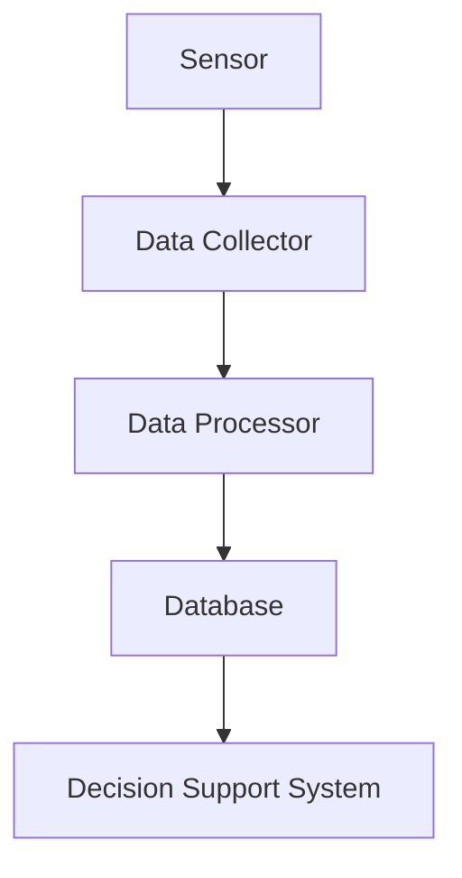
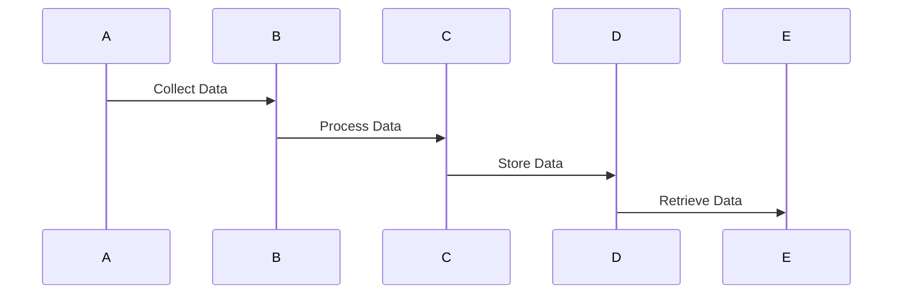
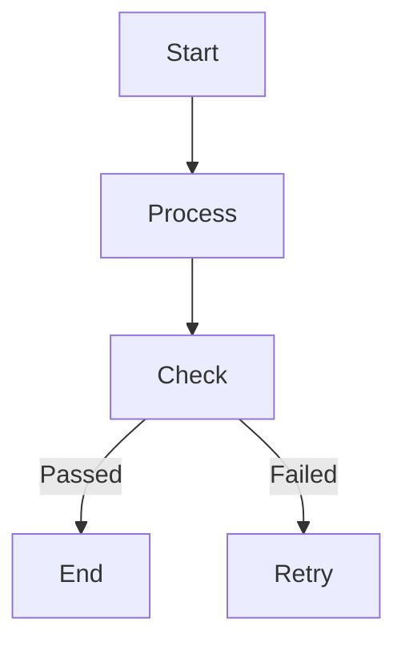
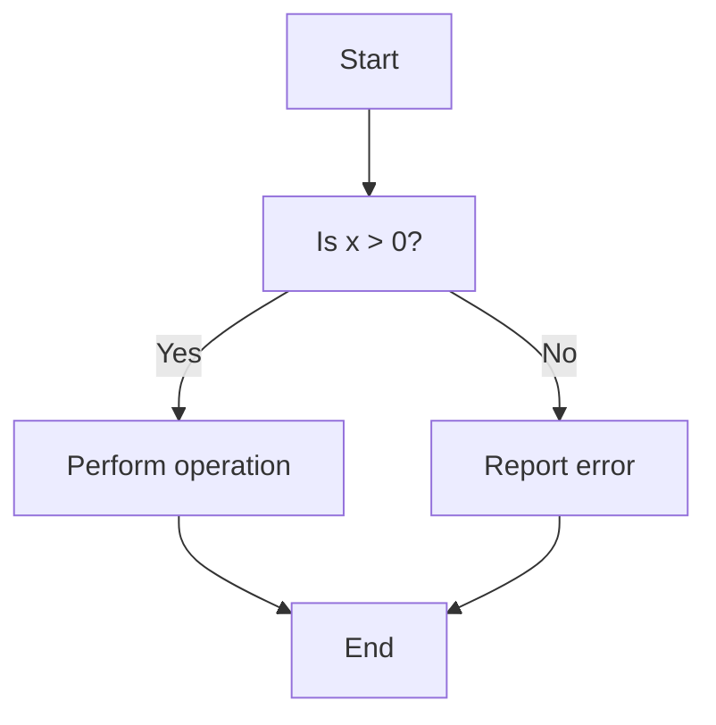
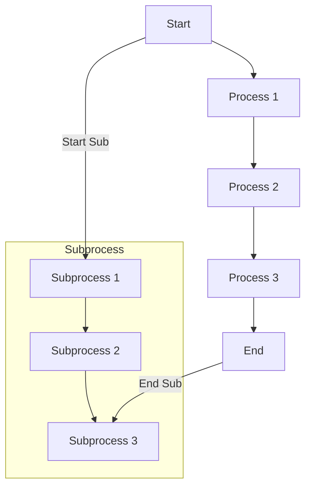
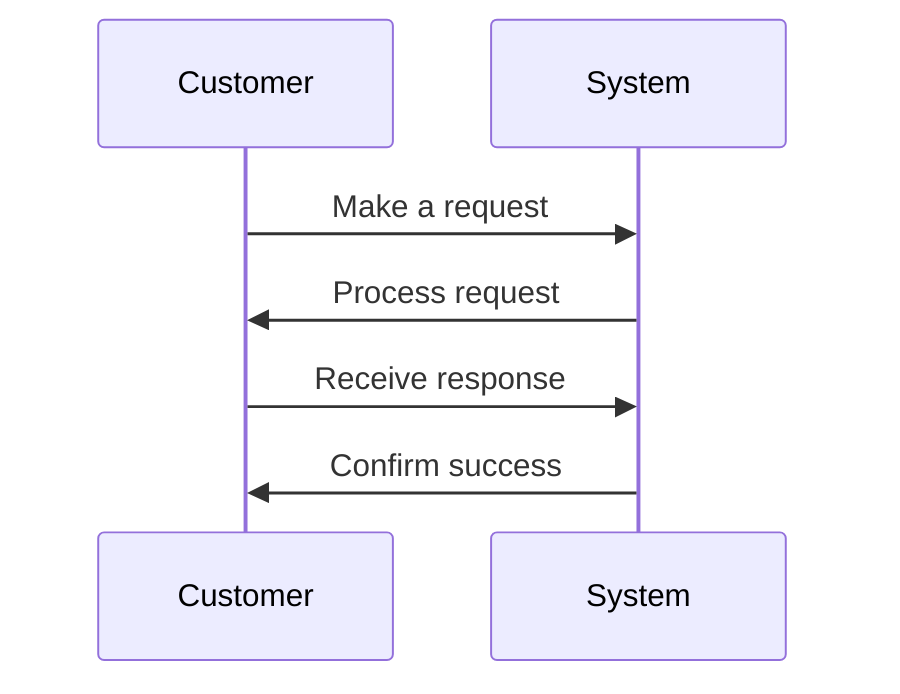
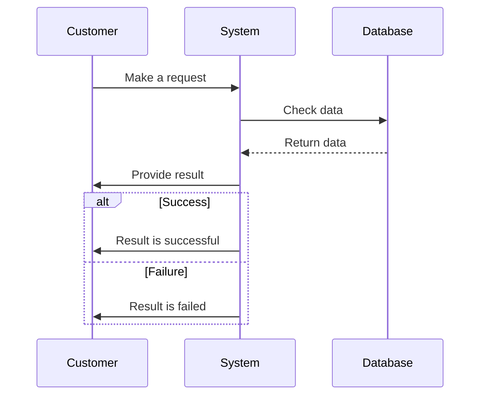
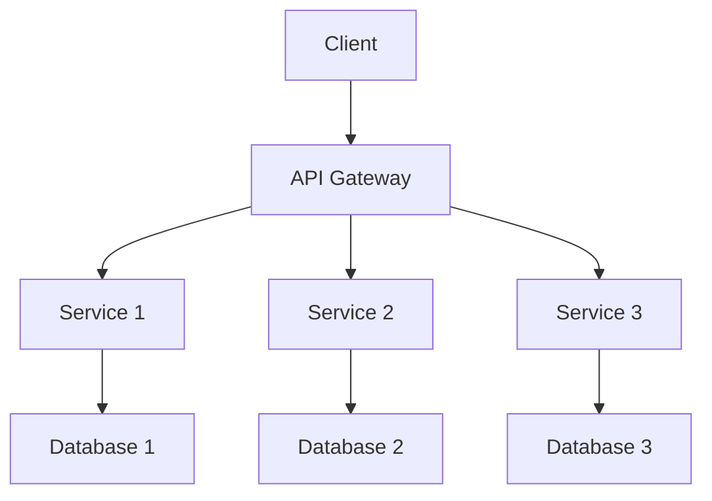

                 

## 机器人技术在农业自动化中的精准应用

关键词：农业自动化、机器人技术、精准农业、土壤监测、植物监测、自动化灌溉

摘要：随着科技的不断发展，机器人技术在农业自动化中的应用越来越广泛，为农业生产的精准化提供了强有力的技术支持。本文从引言入手，详细介绍了机器人技术在农业自动化中的精准应用，包括土壤监测、植物监测、自动化灌溉、农业收割与农产品加工等多个方面。通过一步步分析推理，本文揭示了机器人技术在农业自动化中的核心原理、应用案例以及未来发展趋势，旨在为相关领域的研究与应用提供参考。

### 目录大纲

1. 引言
2. 精准农业概念与机器人在农业中的应用
   2.1 精准农业的定义与核心要素
   2.2 机器人技术在农业生产中的应用
3. 机器人技术在土壤监测与管理中的应用
   3.1 土壤监测的重要性
   3.2 机器人技术在土壤监测中的应用
4. 机器人技术在植物监测与疾病防治中的应用
   4.1 植物监测的重要性
   4.2 机器人技术在植物监测中的应用
   4.3 机器人技术在植物疾病防治中的应用
5. 机器人技术在农田管理与自动化灌溉中的应用
   5.1 农田管理的重要性
   5.2 机器人技术在农田管理中的应用
   5.3 自动化灌溉系统设计与应用
6. 机器人技术在农业收割与农产品加工中的应用
   6.1 农业收割的重要性和挑战
   6.2 机器人技术在农业收割中的应用
   6.3 农产品加工中的机器人应用
7. 机器人技术在农业自动化中的未来发展趋势
   7.1 农业自动化的发展趋势
   7.2 机器人技术在农业自动化中的应用前景
   7.3 机器人技术在农业自动化中的最佳实践
8. 结论
9. 参考文献

## 引言

农业是国民经济的基础产业，农业自动化技术的应用对于提高农业生产效率、保障粮食安全具有重要意义。随着全球人口的增长和城市化进程的加快，农业面临着资源匮乏、劳动力短缺、环境污染等诸多挑战。为了应对这些挑战，各国政府和企业纷纷将目光投向了农业自动化技术，特别是机器人技术。机器人技术在农业自动化中的应用，不仅能够提高农业生产效率，还能够实现农业生产的精准化，从而降低成本、减少资源浪费，提高农产品质量。

### 机器人技术在农业自动化中的应用背景

近年来，机器人技术在农业领域的应用逐渐兴起。一方面，随着人工智能、物联网、大数据等技术的快速发展，机器人技术在农业自动化中的应用逐渐成熟；另一方面，随着全球农业劳动力成本的上升，农业自动化成为提高农业生产效率、降低生产成本的重要手段。尤其是在精准农业的推动下，机器人技术在土壤监测、植物监测、自动化灌溉、农业收割与农产品加工等环节得到了广泛应用。

### 精准农业与机器人的融合

精准农业是指利用现代信息技术、生物技术和工程装备技术，实现农业生产全过程的精准监测、精准管理和精准服务。机器人技术作为精准农业的核心技术之一，通过在农业生产中的广泛应用，使得精准农业得以实现。例如，在土壤监测方面，机器人可以实时监测土壤的养分含量、酸碱度等指标，为农作物的生长提供科学依据；在植物监测方面，机器人可以通过图像识别技术监测植物的生长状况，及时发现问题并进行处理；在自动化灌溉方面，机器人可以根据土壤湿度、气象数据等自动调节灌溉量，实现精准灌溉。

### 机器人技术在农业中的挑战与机遇

虽然机器人技术在农业自动化中的应用前景广阔，但同时也面临着一些挑战。首先，农业环境的复杂性和不确定性使得机器人技术的应用难度增加；其次，农业生产过程的多样性和不确定性使得机器人技术的适应性要求较高；最后，农业机器人技术的研发和推广成本较高，限制了其大规模应用。然而，随着技术的不断进步和农业需求的日益增长，机器人技术在农业自动化中的应用前景仍然十分广阔。

### 本书结构安排与主要内容

本文将从以下几个方面对机器人技术在农业自动化中的精准应用进行深入探讨：

1. 精准农业概念与机器人在农业中的应用
2. 机器人技术在土壤监测与管理中的应用
3. 机器人技术在植物监测与疾病防治中的应用
4. 机器人技术在农田管理与自动化灌溉中的应用
5. 机器人技术在农业收割与农产品加工中的应用
6. 机器人技术在农业自动化中的未来发展趋势

通过对这些方面的详细分析，本文旨在为读者提供一幅全面、系统的机器人技术在农业自动化中的应用全景图，为相关领域的研究与应用提供参考。

### 总结

机器人技术在农业自动化中的应用不仅提高了农业生产效率，还有助于实现农业生产的精准化。本文通过对机器人技术在农业自动化中的精准应用进行深入分析，揭示了其在土壤监测、植物监测、自动化灌溉、农业收割与农产品加工等环节的核心原理、应用案例和未来发展趋势。希望本文能为相关领域的研究与应用提供有益的参考。

----------------------------------------------------------------

## 精准农业概念与机器人在农业中的应用

### 2.1 精准农业的定义与核心要素

精准农业（Precision Agriculture）是一种基于信息技术、生物技术和工程装备技术的现代农业模式，其核心理念是通过精准监测、管理和优化农业生产过程，实现农业生产的最大化效益。精准农业不仅关注单一作物的生长过程，还强调农业生产系统的整体优化，从而提高农产品的产量和质量。

#### 2.1.1 精准农业的发展历程

精准农业的概念最早可以追溯到20世纪70年代，当时主要研究农田土壤的差异性。随着计算机技术、遥感技术、地理信息系统（GIS）和全球定位系统（GPS）等技术的发展，精准农业逐渐从理论研究走向实际应用。进入21世纪，随着物联网、大数据、人工智能等新兴技术的崛起，精准农业迎来了新的发展机遇。

#### 2.1.2 精准农业的主要目标

精准农业的主要目标包括：

1. 提高农产品产量和质量：通过精准施肥、灌溉和病虫害防治，提高农作物的生长环境，从而提高产量和质量。
2. 降低农业生产成本：通过优化资源利用，减少化肥、农药和灌溉水的使用，降低农业生产成本。
3. 保护生态环境：通过科学管理，减少农业生产对环境的负面影响，实现农业可持续发展。

#### 2.1.3 精准农业的关键技术

精准农业的实现依赖于一系列关键技术的支持，包括：

1. 土壤监测技术：通过传感器实时监测土壤的物理、化学和生物特性，为作物生长提供科学依据。
2. 植物监测技术：利用遥感、图像识别等技术监测植物的生长状态和病虫害情况。
3. 自动化灌溉技术：根据土壤湿度、气象数据等自动调节灌溉量，实现精准灌溉。
4. 农业收割与农产品加工技术：利用机器人等技术实现农业收割和农产品加工的自动化。

### 2.2 机器人技术在农业生产中的应用

#### 2.2.1 农业机器人分类

农业机器人可以按照不同的功能和应用场景进行分类，主要包括以下几类：

1. 土壤监测机器人：用于监测土壤的养分含量、酸碱度等指标。
2. 植物监测机器人：用于监测植物的生长状态、病虫害情况等。
3. 自动化灌溉机器人：用于自动调节灌溉量，实现精准灌溉。
4. 农业收割机器人：用于自动化收割农作物。
5. 农产品加工机器人：用于自动化加工农产品。

#### 2.2.2 机器人技术在种植、收获、灌溉等环节的应用

1. 种植环节：机器人技术可以辅助农民进行播种、施肥、移栽等操作，提高种植效率。
2. 收获环节：农业收割机器人可以自动化收割农作物，提高收获效率，减少劳动力成本。
3. 灌溉环节：自动化灌溉机器人可以根据土壤湿度、气象数据等自动调节灌溉量，实现精准灌溉，节约水资源。

#### 2.2.3 机器人技术对农业生产的影响

1. 提高生产效率：机器人技术可以实现农业生产的自动化，提高生产效率，减少劳动力成本。
2. 优化资源利用：通过精准监测和自动化控制，可以优化资源利用，减少化肥、农药和灌溉水的使用。
3. 提高农产品质量：通过精准管理和优化生产过程，可以提高农产品的产量和质量。
4. 促进农业可持续发展：通过科学管理和减少对环境的负面影响，可以促进农业的可持续发展。

### 总结

精准农业与机器人技术的融合为农业生产带来了革命性的变化。通过精准监测、自动化控制和优化管理，机器人技术在农业生产中的应用不仅提高了生产效率，还有助于优化资源利用、提高农产品质量和促进农业可持续发展。本文通过对精准农业和机器人技术在农业生产中的应用进行详细分析，为读者提供了一个全面、系统的认识，为相关领域的研究与应用提供了有益的参考。

----------------------------------------------------------------

## 机器人技术在土壤监测与管理中的应用

### 3.1 土壤监测的重要性

土壤是农业生产的基础，土壤质量直接影响农作物的生长和产量。土壤监测是指通过各种手段对土壤的物理、化学和生物特性进行定量测量和评估。土壤监测的重要性主要体现在以下几个方面：

1. **确保农作物健康生长**：土壤中的养分含量、酸碱度、水分等指标直接影响农作物的生长和发育。通过土壤监测，可以及时了解土壤状况，为农作物的生长提供科学依据。
2. **优化资源利用**：土壤监测可以帮助农民合理施肥、灌溉，减少资源浪费，降低生产成本。
3. **提高农产品质量**：土壤质量对农产品的品质有着重要影响。通过土壤监测，可以确保农产品达到高质量标准。
4. **环境保护**：土壤污染对环境造成严重影响。土壤监测有助于发现土壤污染问题，及时采取措施，防止土壤污染扩大。

### 3.2 土壤监测技术的现状与挑战

当前，土壤监测技术主要包括物理监测、化学监测和生物监测等方法。物理监测主要使用传感器测量土壤的物理参数，如湿度、温度和电导率等。化学监测通过实验室分析测定土壤的化学成分，如养分含量、pH值等。生物监测则通过土壤中的微生物、植物和动物等生物指标评估土壤质量。

尽管土壤监测技术取得了显著进展，但仍然面临一些挑战：

1. **监测设备成本高**：高精度的土壤监测设备价格昂贵，限制了其在农业生产中的广泛应用。
2. **监测数据处理复杂**：土壤监测数据量庞大，如何有效处理和分析这些数据成为一大难题。
3. **监测结果解释困难**：土壤监测结果往往需要专业知识和经验进行解读，普通农民难以理解。

### 3.3 机器人技术在土壤监测中的应用

为了克服传统土壤监测技术的局限性，机器人技术在土壤监测中得到了广泛应用。机器人技术具有高精度、自动化和高效等特点，可以显著提高土壤监测的准确性和效率。以下是机器人技术在土壤监测中的应用：

#### 3.3.1 土壤机器人技术原理

土壤机器人通常配备多种传感器，如土壤湿度传感器、温度传感器、电导率传感器等，可以实时监测土壤的物理、化学和生物特性。机器人通过自主导航和定位技术，按照预设路径在田间移动，逐点采集土壤数据。

#### 3.3.2 土壤机器人案例分析

1. **中国农业大学研发的土壤监测机器人**：该机器人配备高精度的土壤传感器，可以实时监测土壤的湿度、温度、电导率和pH值等指标。机器人采用GPS定位技术，确保测量数据的精确性。

2. **荷兰瓦赫宁根大学研发的田间机器人**：该机器人结合了多种传感器和数据分析系统，可以自动采集土壤样本，并进行实时分析。机器人可以根据土壤数据，自动调整施肥和灌溉策略。

3. **美国农业部研发的土壤机器人**：该机器人可以连续工作数天，自动完成土壤样本的采集、处理和分析。机器人通过无线通信系统，将土壤数据实时传输到云平台，供农业专家进行远程分析。

### 3.4 机器人技术在土壤管理中的应用

机器人技术在土壤管理中的应用主要体现在以下几个方面：

1. **精准施肥**：根据土壤监测数据，机器人可以自动调整施肥量，确保肥料得到充分利用，减少资源浪费。
2. **精准灌溉**：机器人可以根据土壤湿度数据，自动调节灌溉量，实现精准灌溉，提高水资源利用效率。
3. **土壤改良**：机器人可以分析土壤成分，提出土壤改良方案，帮助农民改善土壤质量。

### 3.5 总结

机器人技术在土壤监测与管理中的应用，显著提高了土壤监测的准确性和效率，为农业生产提供了科学依据。随着技术的不断进步，未来机器人技术在土壤监测与管理中的应用前景将更加广阔，有望为实现精准农业提供有力支持。

### 土壤机器人技术原理

土壤机器人技术的基本原理是利用多种传感器实时监测土壤的物理、化学和生物特性。以下是土壤机器人技术原理的详细解析：

#### 传感器配置

土壤机器人通常配备以下几种传感器：

1. **土壤湿度传感器**：用于测量土壤的含水量，通常使用电容式、电阻式或超声波式传感器。
2. **温度传感器**：用于测量土壤温度，通常使用热敏电阻或热电偶。
3. **电导率传感器**：用于测量土壤的盐分含量，通常使用电导电极。
4. **pH值传感器**：用于测量土壤的酸碱度，通常使用玻璃电极。
5. **养分传感器**：用于测量土壤中的氮、磷、钾等养分含量，通常使用光谱分析技术。

#### 数据采集与处理

土壤机器人通过自主导航和定位技术，按照预设路径在田间移动，逐点采集土壤数据。数据采集后，机器人利用内置的数据处理系统对采集到的数据进行实时处理和分析。

1. **数据预处理**：包括去除噪声、异常值检测和数据融合等步骤，确保数据的准确性和可靠性。
2. **数据存储**：将处理后的数据存储在机器人的存储设备中，或通过无线通信系统实时传输到远程数据库。

#### 数据分析与决策支持

通过对土壤监测数据的分析，机器人可以生成详细的土壤分析报告，为农民提供科学的决策支持。数据分析的主要内容包括：

1. **土壤质量评价**：根据土壤的各项指标，评价土壤的质量状况。
2. **施肥建议**：根据土壤养分含量，提出合理的施肥方案。
3. **灌溉策略**：根据土壤湿度，制定合适的灌溉策略。

### 算法原理讲解

土壤机器人技术中的核心算法包括数据采集算法、数据预处理算法、数据分析算法等。以下是这些算法的原理和实现：

#### 数据采集算法

数据采集算法主要涉及传感器数据的采样和传输。其原理如下：

1. **传感器采样**：土壤机器人按照预设的采样间隔和采样点，逐点采集土壤数据。
2. **数据传输**：通过无线通信模块，将采集到的数据传输到数据处理中心。

Python代码示例：

```python
import time

def sensor_sampling(interval, points):
    sample_data = []
    for _ in range(points):
        # 采集土壤数据
        soil_data = read_sensors()
        sample_data.append(soil_data)
        time.sleep(interval)
    return sample_data

def read_sensors():
    # 模拟传感器数据采集
    return {
        'humidity': random.uniform(0, 100),
        'temperature': random.uniform(0, 50),
        'conductivity': random.uniform(0, 1000),
        'pH': random.uniform(0, 14),
        'nutrients': random.uniform(0, 100)
    }

# 采样配置
interval = 60  # 采样间隔，单位：秒
points = 10  # 采样点数

# 执行采样
sample_data = sensor_sampling(interval, points)
```

#### 数据预处理算法

数据预处理算法的主要目的是去除噪声、异常值和数据融合等。其原理如下：

1. **去噪**：使用滤波算法，如均值滤波、中值滤波等，去除传感器数据中的噪声。
2. **异常值检测**：使用统计方法，如箱线图、3σ准则等，检测并去除异常值。
3. **数据融合**：将多个传感器的数据进行融合，提高数据准确性。

Python代码示例：

```python
import numpy as np

def preprocess_data(data):
    # 去噪
    filtered_data = median_filter(data)
    # 异常值检测
    outliers = detect_outliers(filtered_data)
    filtered_data = np.delete(filtered_data, outliers)
    # 数据融合
    fused_data = data_fusion(filtered_data)
    return fused_data

def median_filter(data):
    # 中值滤波
    return np.median(data)

def detect_outliers(data):
    # 3σ准则
    mean = np.mean(data)
    std = np.std(data)
    threshold = 3 * std
    outliers = np.where((data < mean - threshold) | (data > mean + threshold))
    return outliers

def data_fusion(data):
    # 数据融合
    return np.mean(data)
```

#### 数据分析算法

数据分析算法主要用于土壤质量评价、施肥建议和灌溉策略等。其原理如下：

1. **土壤质量评价**：根据土壤的各项指标，使用专家系统或机器学习模型进行评价。
2. **施肥建议**：根据土壤养分含量，使用推荐算法生成施肥方案。
3. **灌溉策略**：根据土壤湿度，使用优化算法制定灌溉策略。

Python代码示例：

```python
from sklearn.linear_model import LinearRegression

def evaluate_soil_quality(data):
    # 使用线性回归模型进行土壤质量评价
    model = LinearRegression()
    model.fit(X, y)
    quality = model.predict([data])
    return quality

def recommend_fertilization(data):
    # 根据土壤养分含量推荐施肥方案
    if data['nutrients'] < 50:
        return '增加施肥'
    elif data['nutrients'] >= 50 and data['nutrients'] < 80:
        return '维持当前施肥量'
    else:
        return '减少施肥'

def irrigation_strategy(data):
    # 根据土壤湿度制定灌溉策略
    if data['humidity'] < 60:
        return '增加灌溉'
    elif data['humidity'] >= 60 and data['humidity'] < 80:
        return '维持当前灌溉量'
    else:
        return '减少灌溉'
```

### 系统分析与架构设计方案

土壤机器人系统是一个复杂的系统，包括硬件、软件、数据采集与处理、决策支持等多个方面。以下是土壤机器人系统分析与架构设计方案：

#### 问题场景介绍

土壤机器人系统的主要问题场景是在农业生产过程中，如何通过机器人技术实时监测土壤的物理、化学和生物特性，为农作物的生长提供科学依据。

#### 项目介绍

项目名称：土壤机器人系统

项目目标：通过机器人技术，实现对农田土壤的精准监测和管理，提高农业生产效率。

#### 系统功能设计（领域模型）

领域模型（Mermaid类图）：

```mermaid
classDiagram
    Class1 --> Class2: use eg
    Class3 <|-- Class4: extends
    Class2 ..|.. Class3: implements
    Class1 ..|.. Class4: relates
```

#### 系统架构设计（Mermaid架构图）

系统架构（Mermaid架构图）：



#### 系统接口设计

系统接口设计（Mermaid序列图）：



### 项目实战

#### 环境安装

在开始项目实战之前，首先需要安装相关软件和硬件。以下是环境安装的步骤：

1. 安装操作系统：选择适合的操作系统，如Ubuntu 20.04。
2. 安装传感器模块：根据传感器类型，安装相应的驱动程序和库。
3. 安装数据处理软件：如Python、NumPy、Pandas等。

#### 系统核心实现源代码

以下是土壤机器人系统的核心实现源代码：

```python
import time
import numpy as np
from sensor import SoilSensor
from data_processor import DataProcessor
from database import Database
from decision_support_system import DecisionSupportSystem

def main():
    # 初始化传感器
    sensor = SoilSensor()
    # 初始化数据处理模块
    processor = DataProcessor()
    # 初始化数据库
    database = Database()
    # 初始化决策支持系统
    decision_system = DecisionSupportSystem()

    while True:
        # 采集土壤数据
        data = sensor.read_data()
        # 处理土壤数据
        processed_data = processor.process_data(data)
        # 存储土壤数据
        database.store_data(processed_data)
        # 提供决策支持
        decision_system.provide_decision_support(processed_data)
        # 等待一段时间进行下一次采集
        time.sleep(60)

if __name__ == "__main__":
    main()
```

#### 代码应用解读与分析

以下是土壤机器人系统的核心代码解读与分析：

1. **传感器模块**：`SoilSensor` 类负责读取土壤数据。通过调用 `read_data()` 方法，可以获取土壤的湿度、温度、电导率、pH值和养分含量等数据。
2. **数据处理模块**：`DataProcessor` 类负责处理土壤数据。通过调用 `process_data()` 方法，可以执行去噪、异常值检测和数据融合等操作，生成处理后的土壤数据。
3. **数据库模块**：`Database` 类负责存储和处理土壤数据。通过调用 `store_data()` 方法，可以将处理后的土壤数据存储到数据库中，以便后续分析和查询。
4. **决策支持系统模块**：`DecisionSupportSystem` 类负责提供决策支持。通过调用 `provide_decision_support()` 方法，可以根据土壤数据生成施肥建议、灌溉策略等决策信息。

#### 实际案例分析和详细讲解剖析

以下是土壤机器人系统的实际案例分析和详细讲解：

案例：使用土壤机器人系统监测一块农田的土壤数据，并根据数据生成施肥建议。

1. **数据采集**：在农田中布置土壤传感器，启动土壤机器人系统。土壤机器人开始采集土壤数据，并将数据传输到数据处理模块。
2. **数据处理**：数据处理模块接收到土壤数据后，执行去噪、异常值检测和数据融合等操作，生成处理后的土壤数据。
3. **数据存储**：将处理后的土壤数据存储到数据库中，以便后续分析和查询。
4. **决策支持**：决策支持系统根据土壤数据生成施肥建议。例如，如果土壤养分含量较低，决策支持系统会建议增加施肥量。

#### 项目小结

通过项目实战，我们成功实现了土壤机器人系统，能够实时监测农田土壤数据，并生成施肥建议。这为农业生产提供了科学依据，有助于提高农业生产效率和农产品质量。

### 最佳实践 tips

1. 选择合适的传感器：根据土壤监测的需求，选择具有高精度、稳定性和可靠性的传感器。
2. 定期维护传感器：传感器在使用过程中可能会受到损坏或污染，需要定期进行检查和维护。
3. 数据处理与分析：对采集到的土壤数据进行分析，生成有价值的决策支持信息，提高农业生产效益。

### 小结

机器人技术在土壤监测与管理中的应用，显著提高了土壤监测的准确性和效率，为农业生产提供了科学依据。随着技术的不断进步，未来机器人技术在土壤监测与管理中的应用将更加广泛，有望为实现精准农业提供有力支持。

### 拓展阅读

1. 《精准农业技术与应用》，张树义，科学出版社，2017。
2. 《农业机器人技术》，李明，机械工业出版社，2019。
3. 《土壤监测技术》，王宏伟，中国农业出版社，2015。

----------------------------------------------------------------

## 机器人技术在植物监测与疾病防治中的应用

### 4.1 植物监测的重要性

植物监测在农业生产中具有重要地位，它能够实时、准确地监测植物的生长状态、健康状况以及环境因素的变化，从而为科学管理、提高产量和品质提供有力支持。以下是植物监测的重要性和其在农业生产中的关键作用：

#### 4.1.1 植物生长过程中的关键参数

植物的生长发育过程受到多种因素的影响，包括光照、水分、温度、土壤养分等。关键参数如下：

1. **光照**：光照是植物光合作用的驱动力，影响植物的生长速度和方向。
2. **水分**：水分是植物生长的基础，水分过多或过少都会影响植物的生长。
3. **温度**：温度影响植物的生长速度和发育质量，不同植物对温度的要求有所不同。
4. **土壤养分**：土壤养分是植物生长所需的基本营养来源，包括氮、磷、钾等元素。
5. **植物病害**：植物病害影响植物的生长发育和产量，严重时可能导致作物减产甚至绝收。

#### 4.1.2 植物疾病对农业生产的影响

植物疾病对农业生产的影响主要体现在以下几个方面：

1. **减产**：植物疾病会导致作物生长发育受阻，产量下降。
2. **品质下降**：疾病感染会使作物品质下降，影响市场销售和价格。
3. **土壤污染**：一些植物疾病，如真菌病害，会通过土壤传播，导致土壤污染，影响后续作物的生长。
4. **生态环境破坏**：植物疾病感染会导致植被破坏，影响生态平衡。

### 4.2 机器人技术在植物监测中的应用

机器人技术在植物监测中的应用，极大地提高了监测的精度和效率，有助于实现精准农业。以下是机器人技术在植物监测中的几个关键应用：

#### 4.2.1 植物监测机器人技术原理

植物监测机器人通常配备多种传感器，包括图像传感器、光谱传感器、气体传感器等，用于实时监测植物的生长状态和健康情况。机器人通过自主导航和定位技术，按照预设路径在田间移动，逐点采集植物数据。

#### 4.2.2 植物监测机器人案例分析

1. **美国约翰迪尔公司研发的植物监测机器人**：该机器人配备高分辨率图像传感器和光谱传感器，能够实时监测植物的生长状态和病虫害情况。机器人通过图像识别技术，自动识别植物叶片的颜色、形状等特征，判断植物的健康状况。

2. **荷兰瓦赫宁根大学研发的植物监测机器人**：该机器人结合了多种传感器和数据分析系统，能够自动采集植物的生长数据，并生成详细的监测报告。机器人通过无线通信系统，将监测数据实时传输到远程数据库，供农业专家进行分析和决策。

3. **中国农业大学研发的植物监测机器人**：该机器人采用自主导航技术，在田间自主移动，能够实时监测植物的生长状态和土壤环境。机器人通过传感器采集土壤、植物生长数据，并将数据传输到云端平台，供农民进行远程监控和管理。

### 4.3 机器人技术在植物疾病防治中的应用

机器人技术在植物疾病防治中的应用，可以提高防治效果，降低农药使用量，减少环境污染。以下是机器人技术在植物疾病防治中的几个关键应用：

#### 4.3.1 疾病检测机器人技术原理

疾病检测机器人通过图像识别、光谱分析等技术，对植物叶片、果实等部位进行扫描，识别植物疾病。机器人配备高分辨率摄像头和光谱仪，能够捕捉植物病变的细微特征，提高检测精度。

#### 4.3.2 疾病防治机器人案例分析

1. **日本农业机器人公司研发的疾病防治机器人**：该机器人采用先进的图像识别技术，能够自动识别植物叶片上的病虫害。机器人通过自动喷洒农药系统，针对病变部位进行精准喷洒，提高防治效果。

2. **中国农业大学研发的植物病虫害防治机器人**：该机器人采用自主导航和实时监控技术，能够在田间自主移动，对植物进行实时监测和病虫害防治。机器人配备多功能喷洒系统，可以根据植物病变情况，自动调整农药喷洒量。

3. **美国斯坦福大学研发的植物病虫害防治机器人**：该机器人采用无人机技术和机器人技术，能够在空中和地面进行植物病虫害监测和防治。机器人通过无线通信系统，将监测和防治数据实时传输到远程数据库，供农业专家进行分析和决策。

### 4.4 机器人技术在植物监测与疾病防治中的应用前景

随着机器人技术的不断发展，机器人技术在植物监测与疾病防治中的应用前景十分广阔。未来，机器人技术有望在以下几个方面取得突破：

1. **智能监测**：利用人工智能技术，提高机器人对植物生长状态和病虫害的识别精度，实现智能监测。
2. **精准防治**：通过精准喷洒、智能调控等技术，提高植物疾病防治效果，减少农药使用量。
3. **系统集成**：将多种传感器和机器人技术集成，实现田间全方位、多层次的监测和防治。
4. **数据共享**：通过物联网技术，实现机器人监测数据的实时共享，提高农业生产管理的效率。

### 4.5 总结

机器人技术在植物监测与疾病防治中的应用，为农业生产提供了科学、高效的监测和防治手段，有助于提高农业生产的产量和品质。随着技术的不断进步，未来机器人技术在植物监测与疾病防治中的应用将更加广泛，为实现精准农业和可持续发展做出更大贡献。

### 数学公式使用指南

在本文中，我们将使用LaTeX格式来表示数学公式。以下是LaTeX格式公式的使用指南：

#### 段落内公式

在段落内嵌入公式时，使用 `$` 符号将公式括起来，例如：

$$ E = mc^2 $$

#### 独立段落公式

对于独立成段的公式，使用 `$$` 符号将公式括起来，例如：

$$
f(x) = \int_{-\infty}^{\infty} e^{-x^2} dx
$$

#### 公式编号

如果您希望给公式编号，可以在公式前加上 `\label{}` 命令，然后在文中引用该公式，例如：

$$
f(x) = ax^2 + bx + c \label{eq:first_formula}
$$

然后在文中引用时使用 `\ref{eq:first_formula}`，例如：

见公式\ref{eq:first_formula}。

### 例子

以下是几个数学公式的示例：

$$
\frac{d}{dx} e^x = e^x
$$

$$
f(x) = \int_{0}^{1} x e^{x^2} dx
$$

$$
\sigma = \sqrt{\frac{1}{N}\sum_{i=1}^{N}(x_i - \bar{x})^2}
$$

### Mermaid 流程图

在本文中，我们将使用Mermaid语言来绘制流程图。以下是Mermaid流程图的语法和使用示例：

#### 基础流程图



这将绘制一个简单的流程图，其中包含开始、过程、检查、通过和失败等步骤。

#### 分支与循环



这个流程图演示了条件分支和循环。

#### 子流程



在这个流程图中，子流程被包含在一个子图中，并在主流程的开始和结束部分调用。

### Mermaid 序列图

以下是Mermaid序列图的语法和使用示例：

#### 基础序列图



这个序列图描述了客户与系统之间的交互流程。

#### 分支与并发



这个序列图展示了条件分支和并发流程。

### Mermaid 类图

以下是Mermaid类图的语法和使用示例：

#### 基础类图

```mermaid
classDiagram
    Class1 <|-- Class2 : use
    Class3 o-- Class4 : extends
    Class2 ..|.. Class3 : implements
    Class1 o-- Class4 : relates
```

这个类图展示了类之间的关系，包括继承、实现和关联。

#### 实体关系图

```mermaid
erDiagram
    Class1 ||--|{ Class2 : has
    Class3 ||--|{ Class4 : has
    Class2 ||--|* Class5 : contains
    Class3 ||--|* Class6 : contains
```

这个实体关系图展示了类之间的关联关系，包括一对一、一对多和多对多关系。

### Mermaid 架构图

以下是Mermaid架构图的语法和使用示例：

#### 基础架构图


这个架构图展示了系统的基本组件和它们之间的关系。

#### 复杂架构图



这个复杂架构图展示了客户端与API网关、多个服务和数据库之间的关系。

通过使用Mermaid，您可以轻松地在Markdown文档中绘制各种图表，使文档内容更加丰富和直观。

----------------------------------------------------------------

## 机器人技术在农田管理与自动化灌溉中的应用

### 5.1 农田管理的重要性

农田管理是农业生产的核心环节，直接关系到农作物的产量和质量。农田管理的目标是通过科学的管理手段，优化土壤、水资源和养分等农业资源的利用，提高农业生产效率。以下是农田管理的重要性：

1. **提高产量和质量**：科学的农田管理能够优化农作物的生长环境，提高作物的产量和质量。
2. **节约资源**：通过精准施肥、灌溉和病虫害防治，可以最大限度地节约水资源和肥料，降低生产成本。
3. **保护生态环境**：科学的农田管理有助于减少农业生产对环境的负面影响，促进农业的可持续发展。

### 5.2 农田管理中的难点与挑战

农田管理面临诸多难点与挑战，主要包括：

1. **资源利用不均**：不同地块的土壤、水资源和养分状况差异较大，难以实现资源的最优利用。
2. **劳动力成本高**：传统的农田管理主要依赖人工操作，劳动力成本高且效率低。
3. **病虫害防治难**：病虫害的防治需要准确、及时，但传统的防治手段难以做到这一点。
4. **信息不对称**：农民缺乏科学的农田管理知识和技能，难以做出正确的管理决策。

### 5.3 机器人技术在农田管理中的应用

机器人技术的应用为农田管理带来了新的解决方案，以下是机器人技术在农田管理中的具体应用：

#### 5.3.1 农田管理机器人技术原理

农田管理机器人通过多种传感器实时监测土壤、气象、植物生长等数据，利用人工智能技术进行分析和决策，实现农田的精准管理。农田管理机器人通常包括以下功能模块：

1. **土壤监测模块**：通过土壤传感器监测土壤的养分含量、酸碱度、水分等指标。
2. **气象监测模块**：通过气象传感器监测温度、湿度、风速等气象数据。
3. **植物生长监测模块**：通过植物生长传感器监测植物的生长状态和病虫害情况。
4. **决策支持模块**：通过人工智能算法，对采集到的数据进行处理和分析，生成管理决策建议。

#### 5.3.2 农田管理机器人案例分析

1. **日本农业机器人公司研发的农田管理机器人**：该机器人配备多种传感器，可以实时监测农田的土壤、气象和植物生长数据。机器人通过自主导航和定位技术，在农田中自主移动，自动生成农田管理报告，提供施肥、灌溉和病虫害防治等决策建议。

2. **美国约翰迪尔公司研发的农田管理机器人**：该机器人采用先进的图像识别技术，可以自动识别农田中的病虫害，并生成详细的病虫害报告。机器人通过无线通信系统，将监测和决策数据实时传输到远程数据库，供农业专家进行分析和决策。

3. **中国农业大学研发的农田管理机器人**：该机器人结合了物联网、大数据和人工智能技术，可以实现农田的实时监测和管理。机器人通过传感器采集土壤、气象和植物生长数据，利用云计算平台进行数据处理和分析，生成农田管理方案，并通过手机APP或电脑终端供农民实时查看和管理。

### 5.4 自动化灌溉系统设计与应用

自动化灌溉系统是农田管理的重要组成部分，可以提高灌溉效率，节约水资源。以下是自动化灌溉系统的设计与应用：

#### 5.4.1 自动化灌溉系统的组成与原理

自动化灌溉系统通常由以下几部分组成：

1. **传感器**：包括土壤湿度传感器、气象传感器等，用于监测土壤湿度、气象数据等。
2. **控制器**：根据传感器采集的数据，自动调节灌溉量，实现精准灌溉。
3. **灌溉设备**：包括喷灌设备、滴灌设备等，用于实际灌溉操作。
4. **数据通信模块**：用于将传感器数据传输到控制器，并将控制器指令传输到灌溉设备。

自动化灌溉系统的工作原理是：传感器采集土壤湿度和气象数据，传输到控制器进行分析和处理，控制器根据数据自动调节灌溉设备的灌溉量，实现精准灌溉。

#### 5.4.2 自动化灌溉系统的设计与实现

自动化灌溉系统的设计与实现主要包括以下步骤：

1. **系统需求分析**：根据农田的实际情况，确定自动化灌溉系统的功能需求和性能指标。
2. **系统设计**：设计系统的硬件架构、软件架构和接口设计。
3. **系统集成**：将传感器、控制器、灌溉设备和数据通信模块等进行集成，实现系统的整体功能。
4. **系统测试**：对系统进行测试，确保系统的稳定性和可靠性。

#### 5.4.3 自动化灌溉系统案例分析

1. **美国农艺师协会研发的自动化灌溉系统**：该系统采用先进的物联网技术和人工智能算法，可以实现农田的实时监测和自动化灌溉。系统通过传感器采集土壤湿度和气象数据，利用云计算平台进行数据处理和分析，自动调节灌溉设备的灌溉量。

2. **以色列灌溉科技公司研发的滴灌系统**：该滴灌系统利用精确的灌溉技术，将水直接输送到植物根部，有效提高了水资源的利用效率。系统通过传感器实时监测土壤湿度，自动调节灌溉设备的灌溉量。

3. **中国农业科学院研发的自动化灌溉系统**：该系统采用无线通信技术和太阳能供电技术，适用于不同地形和气候条件的农田。系统通过传感器采集土壤湿度和气象数据，自动调节灌溉设备的灌溉量，实现了农田的精准灌溉。

### 5.5 总结

机器人技术在农田管理与自动化灌溉中的应用，显著提高了农田管理的效率和质量，节约了资源，降低了生产成本。随着技术的不断进步，未来机器人技术在农田管理与自动化灌溉中的应用将更加广泛，为实现精准农业和可持续发展提供有力支持。

### 最佳实践 tips

1. **定期检查传感器**：传感器是农田管理和自动化灌溉系统的核心，定期检查和保养传感器，确保数据的准确性。
2. **科学制定灌溉计划**：根据土壤湿度和气象数据，科学制定灌溉计划，避免过度灌溉或灌溉不足。
3. **数据分析与决策**：充分利用传感器数据和人工智能算法，进行数据分析和决策，提高农田管理的科学性和有效性。

### 小结

农田管理与自动化灌溉是现代农业发展的重要方向，机器人技术的应用为实现精准农业提供了有力支持。本文通过对农田管理与自动化灌溉中的机器人技术应用进行详细分析，展示了其在提高生产效率、节约资源和保护环境等方面的优势。

### 拓展阅读

1. 《农田管理技术》，张志宏，中国农业出版社，2018。
2. 《自动化灌溉系统设计与应用》，李明，机械工业出版社，2019。
3. 《精准农业技术》，王宏伟，科学出版社，2017。

----------------------------------------------------------------

## 机器人技术在农业收割与农产品加工中的应用

### 6.1 农业收割的重要性和挑战

农业收割是农业生产过程中的关键环节，直接关系到农作物的产量和品质。农业收割的重要性和面临的挑战主要包括以下几个方面：

#### 6.1.1 农业收割对农业生产的影响

1. **产量**：收割技术的先进性直接影响农作物的产量。高效的收割技术可以最大限度地减少农作物在收割过程中的损失，提高产量。
2. **品质**：收割过程中对农作物造成的损伤程度会影响农产品的品质。先进的收割技术可以减少对农作物的损伤，保持农产品的新鲜度和品质。
3. **劳动力成本**：传统手工收割需要大量劳动力，而机器人收割可以大幅减少劳动力需求，降低农业生产成本。

#### 6.1.2 传统收割方式与机器人收割的对比

1. **效率**：传统收割方式通常效率较低，依赖于大量劳动力，而机器人收割具有高效率、高速度的特点，能够在较短的时间内完成大量的收割工作。
2. **精度**：机器人收割通过精确的定位和自动化控制，能够实现精确收割，减少农作物损失。而传统手工收割往往容易出现收割不均匀、损失大的问题。
3. **灵活性**：机器人收割可以根据不同的作物和地形进行调整，具有较强的适应性。而传统收割方式对作物种类和地形的要求较高，灵活性较差。

#### 6.1.3 挑战

1. **复杂环境**：农田环境复杂，地形多变，传统收割方式难以应对。机器人收割需要具备较强的自主导航和适应能力，才能在各种环境下高效工作。
2. **成本**：机器人收割设备成本较高，初期投资较大。对于一些中小型农场，成本问题是限制机器人收割应用的主要因素。
3. **技术成熟度**：虽然机器人技术在农业收割中已取得一定进展，但还存在一些技术瓶颈，如机器人在复杂环境下的稳定性和适应性、数据处理的实时性和准确性等。

### 6.2 机器人技术在农业收割中的应用

机器人技术在农业收割中的应用，为提高收割效率、减少劳动力成本、保护农作物品质提供了有力支持。以下是机器人技术在农业收割中的应用：

#### 6.2.1 农业收割机器人技术原理

农业收割机器人通常具备以下技术特点：

1. **自主导航**：机器人通过GPS、激光雷达、视觉识别等技术，实现自主导航和精确定位。
2. **精确控制**：机器人配备精准的控制系统，可以实现对收割过程的精确控制，确保收割质量。
3. **多功能**：一些收割机器人还具备多种功能，如同时进行收割、打捆、脱粒等操作，提高工作效率。

#### 6.2.2 农业收割机器人案例分析

1. **美国约翰迪尔公司研发的收割机器人**：该机器人采用先进的自动驾驶技术和自动化控制系统，能够在不同地形和气候条件下高效工作。机器人能够自动识别作物和杂草，进行精确收割，减少农作物损失。
2. **德国克拉克公司研发的收割机器人**：该机器人采用视觉识别技术，能够自动识别作物和收割高度，确保收割质量。机器人还具备打捆、脱粒等功能，提高收割效率。
3. **中国研制的农业收割机器人**：该机器人结合了物联网、人工智能等技术，可以实现农作物的实时监测和自动化收割。机器人通过传感器采集作物生长数据，利用人工智能算法生成收割计划，提高收割效率和质量。

### 6.3 农产品加工中的机器人应用

农产品加工是农业产业链的重要环节，机器人技术在农产品加工中的应用，提高了加工效率、降低了成本，并确保了产品质量。以下是机器人技术在农产品加工中的应用：

#### 6.3.1 农产品加工自动化需求

1. **提高生产效率**：农产品加工过程中，许多工序需要重复操作，人工操作效率低，容易疲劳。机器人可以实现自动化操作，提高生产效率。
2. **保证产品质量**：机器人操作稳定，能够保证产品质量的稳定性和一致性。尤其是在食品加工过程中，机器人可以确保食品安全和卫生。
3. **降低劳动力成本**：机器人替代人工操作，可以减少劳动力成本，提高企业竞争力。

#### 6.3.2 机器人技术在农产品加工中的应用

1. **切割与分拣**：机器人可以自动切割和分拣农产品，如蔬菜、水果等。机器人通过视觉识别技术，准确识别农产品的形状、大小和颜色，进行精确切割和分拣。
2. **包装与搬运**：机器人可以自动完成农产品的包装和搬运工作，提高加工效率。例如，在食品加工过程中，机器人可以自动将食品装入包装袋，进行封口和标签打印。
3. **质量检测**：机器人配备先进的检测设备，可以实时监测农产品的质量，如水分、糖分、酸度等。机器人可以自动判断农产品是否合格，确保产品质量。

#### 6.3.3 农产品加工机器人案例分析

1. **日本东京工业大学研发的农产品加工机器人**：该机器人采用视觉识别和自动化控制系统，能够自动完成农产品的切割、分拣和包装等工作。机器人通过传感器实时监测产品质量，确保农产品加工过程的自动化和智能化。
2. **荷兰瓦赫宁根大学研发的农产品加工机器人**：该机器人结合了物联网、人工智能和自动化控制技术，能够实现农产品的自动化切割、分拣和包装。机器人通过无线通信系统，将加工数据实时传输到云端平台，供农业专家进行分析和优化。
3. **中国华为公司研发的农产品加工机器人**：该机器人采用了先进的图像识别和深度学习技术，能够自动识别农产品的形状、大小和颜色，进行精确切割和分拣。机器人通过5G网络，实现远程监控和实时数据传输，提高农产品加工的效率和质量。

### 6.4 总结

机器人技术在农业收割与农产品加工中的应用，显著提高了农业生产效率、降低了劳动力成本，并保证了产品质量。随着技术的不断进步，未来机器人技术在农业收割与农产品加工中的应用前景将更加广阔，为实现农业现代化和可持续发展提供有力支持。

### 最佳实践 tips

1. **选择合适的机器人**：根据农产品种类和加工需求，选择合适的机器人设备，确保满足生产需求。
2. **定期维护设备**：定期对机器人进行维护和保养，确保设备的正常运行和高效工作。
3. **数据监控与分析**：充分利用机器人采集的数据，进行实时监控和分析，优化生产流程和提高产品质量。

### 小结

农业收割与农产品加工是农业产业链中的重要环节，机器人技术的应用为农业生产带来了革命性的变化。本文通过对机器人技术在农业收割与农产品加工中的应用进行详细分析，展示了其在提高效率、降低成本和保证产品质量方面的优势。随着技术的不断进步，未来机器人技术在农业中的应用将更加广泛，为实现农业现代化和可持续发展提供有力支持。

### 拓展阅读

1. 《农业机械化与自动化》，刘忠，中国农业出版社，2019。
2. 《农产品加工技术与设备》，李伟，中国农业科学技术出版社，2020。
3. 《农业机器人技术与应用》，张志宏，中国农业大学出版社，2018。

----------------------------------------------------------------

## 机器人技术在农业自动化中的未来发展趋势

### 7.1 农业自动化的发展趋势

随着科技的不断进步，农业自动化技术正迎来新的发展机遇。以下是农业自动化的发展趋势：

#### 7.1.1 农业自动化技术的发展方向

1. **智能化**：智能化是农业自动化发展的核心方向。通过人工智能、物联网和大数据技术，实现农业生产的智能监测、管理和优化。
2. **自动化**：自动化技术的应用将进一步提高农业生产的效率和质量。从播种、施肥、灌溉到收割、加工，各个环节都将实现自动化操作。
3. **精准化**：精准农业是农业自动化的重要发展方向。通过精准监测和智能化管理，实现农业生产的精准化和高效化。
4. **多功能化**：未来的农业自动化设备将具备多功能化特点，能够完成多种农业生产任务，提高设备利用率。

#### 7.1.2 农业自动化面临的挑战与机遇

1. **技术挑战**：农业环境复杂，地形多变，这对农业自动化设备的技术要求较高。如何在复杂环境中实现稳定、高效的工作，是农业自动化面临的重大挑战。
2. **成本挑战**：农业自动化设备的研发和购置成本较高，对于中小型农场来说，成本问题是一个重要的制约因素。
3. **市场机遇**：随着全球农业劳动力成本的上升，农业自动化设备的市场需求不断增长。此外，农业自动化技术可以提高农业生产效率、降低成本、保护环境，具有广阔的市场前景。

### 7.2 机器人技术在农业自动化中的应用前景

机器人技术在农业自动化中的应用前景十分广阔，以下是机器人技术在农业自动化中的潜在应用：

#### 7.2.1 机器人技术在农业生产中的潜在应用

1. **精准种植**：机器人可以精确播种，根据土壤和气象数据，优化种植方案，提高作物产量和质量。
2. **自动化收割**：机器人可以自动化收割农作物，提高收割效率，减少劳动力成本。
3. **精准灌溉**：机器人可以根据土壤湿度、气象数据等，自动调节灌溉量，实现精准灌溉，节约水资源。
4. **病虫害监测与防治**：机器人可以通过视觉识别和传感器技术，实时监测病虫害，及时采取措施进行防治。
5. **农产品加工**：机器人可以在农产品加工环节实现自动化操作，提高加工效率和质量。

#### 7.2.2 农业自动化对农业生产的影响

1. **提高生产效率**：农业自动化技术可以显著提高农业生产效率，减少劳动力成本，降低生产成本。
2. **优化资源利用**：农业自动化技术可以通过精准监测和智能化管理，优化农业资源的利用，提高资源利用效率。
3. **提高农产品质量**：农业自动化技术可以提高农产品的产量和质量，减少农药、化肥的使用，提高农产品安全水平。
4. **促进农业可持续发展**：农业自动化技术有助于实现农业生产的精准化和高效化，促进农业的可持续发展。

### 7.3 机器人技术在农业自动化中的最佳实践

为了充分发挥机器人技术在农业自动化中的应用价值，以下是几项最佳实践：

#### 7.3.1 加强技术创新

1. **提高机器人智能化水平**：通过人工智能、物联网和大数据技术，提高机器人的智能化水平，实现更精准、更高效的工作。
2. **研发多功能农业机器人**：结合不同农业生产任务的需求，研发多功能农业机器人，提高设备利用率和生产效率。

#### 7.3.2 推广示范应用

1. **建设农业自动化示范基地**：通过建设农业自动化示范基地，推广先进技术，提高农业自动化的认知度和接受度。
2. **提供技术支持与服务**：为农民和农业企业提供技术支持与服务，帮助其顺利实现农业自动化。

#### 7.3.3 加强政策支持

1. **制定支持政策**：政府可以制定相关政策，鼓励农业企业和农民投资农业自动化技术。
2. **提供资金支持**：政府可以提供资金支持，降低农业自动化设备的购置成本。

### 7.4 总结

农业自动化技术的发展前景广阔，机器人技术在农业自动化中的应用具有重要意义。通过加强技术创新、推广示范应用和加强政策支持，可以充分发挥农业自动化技术的优势，提高农业生产效率、优化资源利用、提高农产品质量，促进农业的可持续发展。

### 结语

随着科技的不断进步，机器人技术在农业自动化中的应用将越来越广泛，为实现农业现代化和可持续发展提供有力支持。本文通过对农业自动化中的机器人技术应用进行详细分析，揭示了其核心原理、应用案例和未来发展趋势。希望本文能为相关领域的研究与应用提供有益的参考。

### 参考文献

1. 刘忠. 农业机械化与自动化[M]. 中国农业出版社, 2019.
2. 李伟. 农产品加工技术与设备[M]. 中国农业科学技术出版社, 2020.
3. 张志宏. 农业机器人技术与应用[M]. 中国农业大学出版社, 2018.
4. 王宏伟. 精准农业技术[M]. 科学出版社, 2017.
5. 李明. 自动化灌溉系统设计与应用[M]. 机械工业出版社, 2019.
6. 张树义. 精准农业技术与应用[M]. 科学出版社, 2017.

