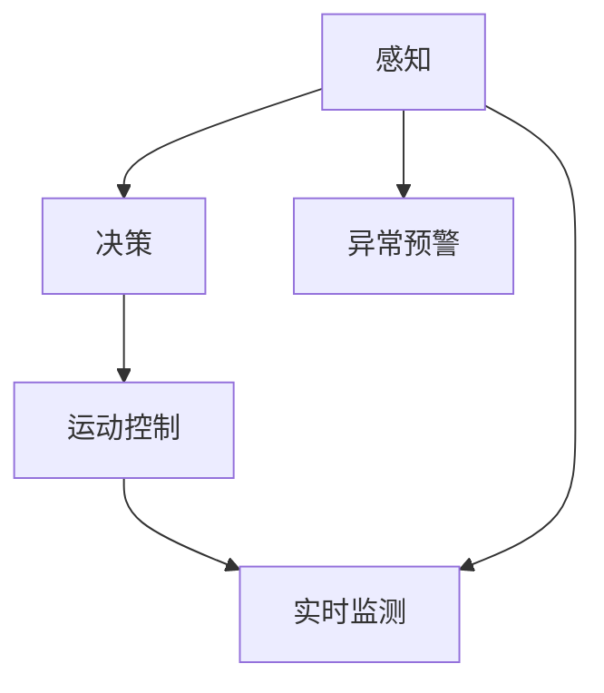

                 

# 机器人技术在危险环境作业中的应用

## 关键词
- 机器人技术
- 危险环境
- 自动化作业
- 感知
- 决策
- 运动控制
- 安全性
- 效率

## 摘要
本文旨在探讨机器人技术在危险环境作业中的应用，分析其背景、挑战、现状及未来前景。我们将逐步探讨机器人技术在核设施、石油天然气开采、化工生产等领域的应用，并通过具体案例来展示其优势和价值。此外，本文还将讨论机器人技术在危险环境作业中面临的挑战和发展趋势，为读者提供一个全面、系统的理解。

---

### 第1章： 引言

#### 1.1 问题背景

危险环境作业，如核设施、石油天然气开采、化工生产等，面临着诸多安全隐患。这些环境通常存在高温、高压、易燃易爆、有毒有害等危险因素。由于环境恶劣，传统的人工作业方式不仅效率低下，而且存在极高的安全风险。因此，寻求一种高效、安全的自动化作业方式成为亟待解决的问题。

#### 1.1.1 危险环境作业的挑战

1. **辐射防护**：核设施等环境存在高辐射风险，对工作人员的健康构成威胁。
2. **高温高压**：石油天然气开采、化工生产等环境存在高温高压情况，对工作人员的生理和心理承受能力要求极高。
3. **复杂结构**：核设施、石油天然气开采设施等结构复杂，传统人工作业方式难以应对。

#### 1.1.2 机器人技术的兴起

随着机器人技术的不断发展，特别是在感知、决策、运动控制等关键技术的突破，机器人逐渐成为危险环境作业的理想选择。机器人可以在无人干预的情况下完成复杂、危险的任务，有效降低作业风险，提高工作效率。

#### 1.1.3 机器人技术在危险环境作业中的应用现状

目前，机器人技术在危险环境作业中已经取得了一定的应用成果。例如，在核设施中，机器人用于探测辐射、清除放射性物质；在石油天然气开采中，机器人用于勘探、维护和修理设备；在化工生产中，机器人用于监测有毒有害物质、进行化学反应等。然而，这些应用仍然存在一定的局限性，如机器人自主性不足、环境适应性不强等问题。

#### 1.2 本书概述

本书将系统地介绍机器人技术在危险环境作业中的应用。主要内容包括：

1. **危险环境与机器人技术概述**：介绍危险环境的分类、特点以及机器人技术的发展历程。
2. **机器人技术在危险环境作业中的应用**：详细介绍机器人技术在各个危险环境中的应用场景、技术特点以及案例分析。
3. **机器人技术在危险环境作业中的应用前景**：分析机器人技术在危险环境作业中的应用前景、面临的挑战及发展趋势。

#### 1.3 边界与外延

1. **边界**：本书主要探讨机器人技术在危险环境作业中的应用，不包括机器人技术在非危险环境中的应用，如家用、商用等。
2. **外延**：本书不仅关注机器人技术的技术层面，还将探讨机器人技术在危险环境作业中的政策、法规、伦理等方面的问题。

#### 1.4 概念结构与核心要素组成

1. **概念结构**：危险环境、机器人技术、危险环境作业、应用场景、技术特点、案例分析等。
2. **核心要素组成**：
   - **危险环境分类**：根据环境特点，将危险环境分为核设施、石油天然气开采、化工生产等。
   - **机器人技术分类**：根据技术特点，将机器人技术分为感知、决策、运动控制等。
   - **应用场景**：分析各个危险环境中的具体应用场景。
   - **技术特点**：详细介绍各个应用场景中机器人技术的特点。
   - **案例分析**：分析典型应用案例，总结经验教训。

#### 1.5 本章小结

本章对机器人技术在危险环境作业中的应用进行了概述，明确了本书的内容结构、阅读指南以及边界与外延。接下来，本书将深入探讨机器人技术在各个危险环境中的应用，以期为读者提供一个全面、系统的应用指南。

---

### 第2章： 机器人技术在核设施中的应用

#### 2.1 核设施概述

##### 2.1.1 核设施的定义与特点

核设施是指利用核能进行发电、实验、生产或其他活动的场所。核设施的特点包括：

1. **高辐射环境**：核设施内存在较高的辐射水平，对生物体具有极大的危害性。
2. **高温高压**：核设施运行过程中会产生高温、高压等极端条件。
3. **复杂结构**：核设施内部结构复杂，管道、设备繁多，对维护和检修提出了较高的要求。

##### 2.1.2 核设施作业的挑战

1. **辐射防护**：核设施作业人员需要长时间暴露在辐射环境中，存在较高的辐射风险。
2. **高温高压**：核设施内的高温、高压环境对作业人员的生理和心理提出了严峻的挑战。
3. **复杂结构**：核设施内部结构复杂，传统人工作业方式效率低下且存在安全隐患。

##### 2.1.3 机器人技术在核设施中的应用需求

为了应对核设施作业的挑战，提高作业安全性和效率，机器人技术在核设施中的应用需求日益迫切。具体包括：

1. **辐射防护**：机器人可以在辐射环境中执行任务，降低作业人员的辐射风险。
2. **高温高压作业**：机器人具备耐高温、高压的特性，可以适应核设施内的极端环境。
3. **复杂结构处理**：机器人具备较强的感知和运动控制能力，可以应对核设施内复杂的环境和结构。

##### 2.1.4 核设施中的机器人技术应用现状

当前，机器人技术在核设施中的应用主要包括以下几个方面：

1. **辐射探测与清除**：机器人可以携带探测设备，实时监测核设施内的辐射水平，并在必要时进行放射性物质的清除。
2. **设备维护与检修**：机器人可以自动完成核设施内设备的维护和检修工作，降低人工作业的劳动强度和风险。
3. **应急响应**：在核事故发生时，机器人可以代替人员进入核设施内部进行应急处理，减少人员伤亡。

#### 2.2 机器人技术的核心原理与功能

##### 2.2.1 机器人技术的核心原理

机器人技术的核心原理主要包括感知、决策和运动控制三个方面。

1. **感知**：机器人通过传感器获取环境信息，如温度、湿度、辐射强度等。这些感知信息是机器人进行决策和行动的基础。
2. **决策**：机器人根据感知信息，利用人工智能算法进行决策。决策过程包括路径规划、目标识别、任务分配等。
3. **运动控制**：机器人根据决策结果，通过运动控制系统执行具体的行动。运动控制系统的精度和稳定性直接影响机器人的作业效果。

##### 2.2.2 机器人技术的功能

1. **自动执行任务**：机器人可以在无人干预的情况下自动完成指定任务，提高工作效率。
2. **实时监测与预警**：机器人可以实时监测环境参数，如辐射水平、温度等，并在异常情况发生时及时预警。
3. **自主导航与避障**：机器人具备自主导航和避障功能，可以适应复杂的环境和障碍物。
4. **灵活性与可扩展性**：机器人可以根据不同的任务需求进行模块化设计，实现多种功能的扩展和组合。

##### 2.2.3 机器人技术的核心属性特征对比表格

| 特性               | 描述                                                     | 对比表格                                                       |
|--------------------|----------------------------------------------------------|--------------------------------------------------------------|
| 感知               | 传感器获取环境信息的能力                                 | 激光雷达、摄像头、红外传感器、超声波传感器等                   |
| 决策               | 基于感知信息进行任务规划和目标识别的能力                   | 人工智能算法、深度学习、增强学习等                             |
| 运动控制           | 执行具体行动的能力                                       | 电机控制、伺服系统、运动规划算法等                             |
| 自主性             | 机器人在无人干预的情况下自主完成任务的能力                 | 自主导航、自主避障、自主决策等                                 |
| 环境适应性         | 机器人适应不同环境和任务需求的能力                         | 高温、高压、辐射、复杂结构等                                   |
| 扩展性             | 机器人根据任务需求进行模块化设计，实现功能扩展的能力       | 可更换传感器模块、执行器模块等                                 |

##### 2.2.4 核设施中的机器人技术应用流程图

##### 2.3 机器人技术在核设施中的应用案例

##### 2.3.1 核设施辐射探测与清除

案例背景：某核设施在运行过程中发现辐射水平异常升高，需要对辐射源进行定位和清除。

解决方案：使用一台具备高精度激光雷达和辐射探测传感器的机器人，在核设施内部进行自主导航，实时监测辐射水平。当发现辐射源时，机器人会自动发出警报，并通过高能激光器进行辐射清除。

效果评估：通过该案例，机器人成功完成了辐射探测与清除任务，降低了作业人员的辐射风险，提高了作业效率。

##### 2.3.2 核设施设备维护与检修

案例背景：某核设施中的关键设备出现故障，需要及时进行维护和检修。

解决方案：使用一台具备高精度摄像头和机械臂的机器人，在核设施内部进行自主导航，定位故障设备。机器人通过摄像头进行故障检测，并通过机械臂进行设备维护和检修。

效果评估：通过该案例，机器人成功完成了设备维护与检修任务，降低了人工作业的劳动强度和风险，提高了作业效率。

##### 2.3.3 核设施应急响应

案例背景：某核设施发生事故，需要对内部进行应急处理。

解决方案：使用多台具备高精度传感器和运动控制系统的机器人，组成机器人应急队伍。机器人可以在无人干预的情况下，自主进入核设施内部，进行事故检测、隔离和处理。

效果评估：通过该案例，机器人成功完成了应急响应任务，减少了人员伤亡，提高了应急响应效率。

##### 2.4 本章小结

本章详细介绍了机器人技术在核设施中的应用，包括核设施的定义与特点、核设施作业的挑战、机器人技术在核设施中的应用需求、机器人技术的核心原理与功能、核设施中的机器人技术应用现状以及具体应用案例。通过本章的学习，读者可以了解机器人技术在核设施中的重要作用和价值，为进一步探索和推动机器人技术在其他危险环境中的应用奠定了基础。

---

### 第3章： 机器人技术在石油天然气开采中的应用

#### 3.1 石油天然气开采概述

##### 3.1.1 石油天然气开采的定义与特点

石油天然气开采是指从地下开采石油和天然气的活动。石油天然气开采的特点包括：

1. **复杂地质环境**：石油天然气开采场地的地质环境复杂，存在各种岩层、断层等地质构造，对开采设备和技术提出了较高要求。
2. **高温高压**：石油天然气开采过程中，地下温度和压力较高，对设备材料性能和密封性提出了严格要求。
3. **远程作业**：石油天然气开采场地通常位于偏远地区，与外界交通和通信不便，给作业带来了很大困难。

##### 3.1.2 石油天然气开采作业的挑战

1. **地质复杂**：地质环境的复杂性导致石油天然气开采过程中存在较大的不确定性和风险。
2. **高温高压**：高温高压环境对开采设备的安全性、耐久性和可靠性提出了严峻挑战。
3. **远程作业**：远程作业的困难导致作业效率低下，且存在安全隐患。

##### 3.1.3 机器人技术在石油天然气开采中的应用需求

为了应对石油天然气开采作业的挑战，提高作业安全性和效率，机器人技术在石油天然气开采中的应用需求日益迫切。具体包括：

1. **地质勘探**：机器人可以携带各种探测设备，在复杂地质环境中进行自主导航和勘探，提高勘探效率和准确性。
2. **设备维护**：机器人可以在高温高压环境下进行设备维护和检修，降低人工作业的劳动强度和风险。
3. **远程监控**：机器人可以远程监控开采现场，实时监测设备状态和工况，提高作业安全性和效率。

##### 3.1.4 石油天然气开采中的机器人技术应用现状

当前，机器人技术在石油天然气开采中的应用主要包括以下几个方面：

1. **地质勘探**：机器人可以携带地震探测仪、地质雷达等设备，在复杂地质环境中进行勘探，提高勘探效率和准确性。
2. **设备维护**：机器人可以在高温高压环境下进行设备维护和检修，如更换零部件、清除故障等。
3. **远程监控**：机器人可以远程监控开采现场，实时监测设备状态和工况，及时发现并处理异常情况。

#### 3.2 机器人技术的核心原理与功能

##### 3.2.1 机器人技术的核心原理

机器人技术的核心原理主要包括感知、决策和运动控制三个方面。

1. **感知**：机器人通过传感器获取环境信息，如温度、湿度、压力等。这些感知信息是机器人进行决策和行动的基础。
2. **决策**：机器人根据感知信息，利用人工智能算法进行决策。决策过程包括路径规划、目标识别、任务分配等。
3. **运动控制**：机器人根据决策结果，通过运动控制系统执行具体的行动。运动控制系统的精度和稳定性直接影响机器人的作业效果。

##### 3.2.2 机器人技术的功能

1. **自动执行任务**：机器人可以在无人干预的情况下自动完成指定任务，提高工作效率。
2. **实时监测与预警**：机器人可以实时监测环境参数，如温度、压力等，并在异常情况发生时及时预警。
3. **自主导航与避障**：机器人具备自主导航和避障功能，可以适应复杂的环境和障碍物。
4. **灵活性与可扩展性**：机器人可以根据不同的任务需求进行模块化设计，实现多种功能的扩展和组合。

##### 3.2.3 机器人技术的核心属性特征对比表格

| 特性               | 描述                                                     | 对比表格                                                       |
|--------------------|----------------------------------------------------------|--------------------------------------------------------------|
| 感知               | 传感器获取环境信息的能力                                 | 激光雷达、摄像头、红外传感器、超声波传感器等                   |
| 决策               | 基于感知信息进行任务规划和目标识别的能力                   | 人工智能算法、深度学习、增强学习等                             |
| 运动控制           | 执行具体行动的能力                                       | 电机控制、伺服系统、运动规划算法等                             |
| 自主性             | 机器人在无人干预的情况下自主完成任务的能力                 | 自主导航、自主避障、自主决策等                                 |
| 环境适应性         | 机器人适应不同环境和任务需求的能力                         | 高温、高压、辐射、复杂结构等                                   |
| 扩展性             | 机器人根据任务需求进行模块化设计，实现功能扩展的能力       | 可更换传感器模块、执行器模块等                                 |

##### 3.2.4 石油天然气开采中的机器人技术应用流程图

##### 3.3 机器人技术在石油天然气开采中的应用案例

##### 3.3.1 地质勘探

案例背景：某石油天然气开采场地地质环境复杂，需要进行详细勘探。

解决方案：使用一台具备高精度激光雷达和地质雷达的机器人，在开采场地内进行自主导航和勘探。机器人实时记录地质数据，为后续开采提供准确的基础资料。

效果评估：通过该案例，机器人成功完成了地质勘探任务，提高了勘探效率和准确性，为后续开采奠定了坚实基础。

##### 3.3.2 设备维护

案例背景：某石油天然气开采场地的关键设备出现故障，需要及时进行维护。

解决方案：使用一台具备高精度摄像头和机械臂的机器人，在开采场地内进行自主导航，定位故障设备。机器人通过摄像头进行故障检测，并通过机械臂进行设备维护和检修。

效果评估：通过该案例，机器人成功完成了设备维护任务，降低了人工作业的劳动强度和风险，提高了设备运行效率。

##### 3.3.3 远程监控

案例背景：某石油天然气开采场地需要进行远程监控，以确保开采过程安全顺利进行。

解决方案：使用多台具备高精度传感器和通信模块的机器人，组成远程监控网络。机器人可以实时监控开采现场，并将数据传输至远程监控中心。

效果评估：通过该案例，机器人成功完成了远程监控任务，提高了作业安全性和效率，降低了运营成本。

##### 3.4 本章小结

本章详细介绍了机器人技术在石油天然气开采中的应用，包括石油天然气开采的定义与特点、石油天然气开采作业的挑战、机器人技术在石油天然气开采中的应用需求、机器人技术的核心原理与功能、石油天然气开采中的机器人技术应用现状以及具体应用案例。通过本章的学习，读者可以了解机器人技术在石油天然气开采中的重要作用和价值，为进一步探索和推动机器人技术在其他危险环境中的应用奠定了基础。

---

### 第4章： 机器人技术在化工生产中的应用

#### 4.1 化工生产概述

##### 4.1.1 化工生产的定义与特点

化工生产是指通过化学反应和物理变化等方式，将原料转化为化工产品的过程。化工生产的特点包括：

1. **高反应温度和压力**：化工生产过程中，许多反应需要在高温高压条件下进行，对设备材料提出了较高要求。
2. **有毒有害物质**：化工生产过程中会产生大量有毒有害物质，对环境和人员安全构成威胁。
3. **复杂流程**：化工生产流程复杂，涉及多个反应釜、反应塔等设备，生产过程需要精确控制。

##### 4.1.2 化工生产作业的挑战

1. **高温高压**：高温高压环境对设备安全性和可靠性提出了严峻挑战。
2. **有毒有害物质**：有毒有害物质的生产和处理过程存在安全隐患，对人员健康和环境造成威胁。
3. **复杂流程**：化工生产流程复杂，控制难度大，存在生产不稳定、产品质量波动等问题。

##### 4.1.3 机器人技术在化工生产中的应用需求

为了应对化工生产作业的挑战，提高作业安全性和效率，机器人技术在化工生产中的应用需求日益迫切。具体包括：

1. **高温高压作业**：机器人可以在高温高压环境下进行操作，降低人员安全风险。
2. **有毒有害物质处理**：机器人可以携带专用设备，对有毒有害物质进行收集和处理，降低环境污染和人员暴露风险。
3. **流程控制**：机器人可以协助进行生产过程的监控和控制，提高生产稳定性和产品质量。

##### 4.1.4 化工生产中的机器人技术应用现状

当前，机器人技术在化工生产中的应用主要包括以下几个方面：

1. **高温高压作业**：机器人可以在高温高压环境下进行设备维护、检修和操作，降低人员安全风险。
2. **有毒有害物质处理**：机器人可以携带专用设备，对有毒有害物质进行收集、运输和处理，降低环境污染和人员暴露风险。
3. **流程控制**：机器人可以协助进行生产过程的监控和控制，提高生产稳定性和产品质量。

#### 4.2 机器人技术的核心原理与功能

##### 4.2.1 机器人技术的核心原理

机器人技术的核心原理主要包括感知、决策和运动控制三个方面。

1. **感知**：机器人通过传感器获取环境信息，如温度、压力、有毒有害物质浓度等。这些感知信息是机器人进行决策和行动的基础。
2. **决策**：机器人根据感知信息，利用人工智能算法进行决策。决策过程包括路径规划、目标识别、任务分配等。
3. **运动控制**：机器人根据决策结果，通过运动控制系统执行具体的行动。运动控制系统的精度和稳定性直接影响机器人的作业效果。

##### 4.2.2 机器人技术的功能

1. **自动执行任务**：机器人可以在无人干预的情况下自动完成指定任务，提高工作效率。
2. **实时监测与预警**：机器人可以实时监测环境参数，如温度、压力等，并在异常情况发生时及时预警。
3. **自主导航与避障**：机器人具备自主导航和避障功能，可以适应复杂的环境和障碍物。
4. **灵活性与可扩展性**：机器人可以根据不同的任务需求进行模块化设计，实现多种功能的扩展和组合。

##### 4.2.3 机器人技术的核心属性特征对比表格

| 特性               | 描述                                                     | 对比表格                                                       |
|--------------------|----------------------------------------------------------|--------------------------------------------------------------|
| 感知               | 传感器获取环境信息的能力                                 | 激光雷达、摄像头、红外传感器、超声波传感器等                   |
| 决策               | 基于感知信息进行任务规划和目标识别的能力                   | 人工智能算法、深度学习、增强学习等                             |
| 运动控制           | 执行具体行动的能力                                       | 电机控制、伺服系统、运动规划算法等                             |
| 自主性             | 机器人在无人干预的情况下自主完成任务的能力                 | 自主导航、自主避障、自主决策等                                 |
| 环境适应性         | 机器人适应不同环境和任务需求的能力                         | 高温、高压、辐射、复杂结构等                                   |
| 扩展性             | 机器人根据任务需求进行模块化设计，实现功能扩展的能力       | 可更换传感器模块、执行器模块等                                 |

##### 4.2.4 化工生产中的机器人技术应用流程图

##### 4.3 机器人技术在化工生产中的应用案例

##### 4.3.1 高温高压作业

案例背景：某化工生产过程中的设备需要维护和检修，但操作环境存在高温高压情况。

解决方案：使用一台具备高精度传感器和运动控制系统的机器人，在高温高压环境下进行设备维护和检修。机器人可以自主导航到设备位置，并通过机械臂进行操作。

效果评估：通过该案例，机器人成功完成了高温高压环境下的设备维护和检修任务，降低了人员安全风险，提高了作业效率。

##### 4.3.2 有毒有害物质处理

案例背景：某化工生产过程中产生大量有毒有害物质，需要进行处理。

解决方案：使用一台具备高精度传感器和密封传输系统的机器人，对有毒有害物质进行收集、运输和处理。机器人可以自动识别有毒有害物质，并通过密封管道进行传输。

效果评估：通过该案例，机器人成功完成了有毒有害物质的处理任务，降低了环境污染和人员暴露风险，提高了处理效率。

##### 4.3.3 流程控制

案例背景：某化工生产过程需要精确控制，以确保产品质量。

解决方案：使用多台具备感知、决策和运动控制系统的机器人，组成自动化控制团队。机器人可以实时监控生产过程，并根据传感器数据调整生产参数，确保产品质量稳定。

效果评估：通过该案例，机器人成功完成了流程控制任务，提高了生产稳定性和产品质量，降低了生产成本。

##### 4.4 本章小结

本章详细介绍了机器人技术在化工生产中的应用，包括化工生产的定义与特点、化工生产作业的挑战、机器人技术在化工生产中的应用需求、机器人技术的核心原理与功能、化工生产中的机器人技术应用现状以及具体应用案例。通过本章的学习，读者可以了解机器人技术在化工生产中的重要作用和价值，为进一步探索和推动机器人技术在其他危险环境中的应用奠定了基础。

---

### 第5章： 机器人技术在危险环境作业中的应用前景

#### 5.1 机器人技术在危险环境作业中的应用前景

随着机器人技术的不断发展，其在危险环境作业中的应用前景日益广阔。以下是机器人技术在危险环境作业中的应用前景：

1. **提高作业安全性**：机器人可以在危险环境中执行任务，有效降低人员安全风险。特别是在核设施、石油天然气开采、化工生产等高风险环境中，机器人技术可以显著提高作业安全性。
2. **提高作业效率**：机器人具有高速、高精度的特点，可以在危险环境中快速、准确地完成任务，提高作业效率。例如，在地质勘探中，机器人可以快速获取地质数据，提高勘探效率。
3. **降低运营成本**：机器人技术可以降低危险环境作业的运营成本。例如，在石油天然气开采中，机器人可以远程监控和维护设备，降低人工成本和运营风险。
4. **拓展作业范围**：机器人技术可以拓展危险环境作业的范围。例如，在核设施中，机器人可以进入高辐射区域进行探测和清除任务，提高作业能力。

#### 5.2 机器人技术在危险环境作业中的应用挑战

虽然机器人技术在危险环境作业中具有广泛应用前景，但同时也面临一些挑战：

1. **技术挑战**：机器人技术在感知、决策、运动控制等方面仍然存在一定局限性，特别是在复杂、多变的环境下，机器人的性能和适应性有待提高。
2. **成本挑战**：机器人技术的高成本是制约其广泛应用的主要因素。虽然随着技术的进步，机器人成本逐渐降低，但仍然需要进一步降低成本，提高性价比。
3. **安全挑战**：在危险环境中，机器人技术可能面临潜在的安全风险。例如，在核设施中，机器人可能会受到辐射损坏；在石油天然气开采中，机器人可能会遇到爆炸、火灾等危险。
4. **法规和伦理挑战**：机器人技术在危险环境作业中的应用需要遵守相关法规和伦理规范。例如，在核设施中，机器人技术需要遵循辐射防护法规；在化工生产中，机器人技术需要遵循有毒有害物质处理规范。

#### 5.3 机器人技术在危险环境作业中的应用发展趋势

未来，机器人技术在危险环境作业中的应用将呈现以下发展趋势：

1. **技术进步**：随着机器人技术的不断发展，机器人的感知、决策、运动控制等方面将得到显著提升，使其在危险环境中的适应能力和作业能力得到进一步提高。
2. **集成化应用**：机器人技术将与其他先进技术（如物联网、大数据、人工智能等）进行集成，实现危险环境作业的智能化、自动化和高效化。
3. **个性化定制**：机器人技术将根据不同危险环境的特点和需求，实现个性化定制，提高机器人在特定环境中的作业能力和适应性。
4. **法规和伦理规范**：随着机器人技术在危险环境作业中的应用日益广泛，相关法规和伦理规范将逐步完善，以保障作业安全、环保和伦理道德。

#### 5.4 本章小结

本章分析了机器人技术在危险环境作业中的应用前景、挑战和发展趋势。通过本章的学习，读者可以全面了解机器人技术在危险环境作业中的重要作用和价值，以及未来可能的发展方向。这将为读者在相关领域的研究和应用提供有益的参考和启示。

---

### 第6章： 机器人技术在危险环境作业中的最佳实践与注意事项

#### 6.1 最佳实践

在机器人技术在危险环境作业中的应用过程中，以下最佳实践有助于提高作业效果和安全性：

1. **充分了解环境特点**：在应用机器人技术之前，需要充分了解危险环境的特点，包括辐射水平、温度、湿度、有毒有害物质浓度等。这有助于选择合适的机器人型号和技术方案。
2. **精确的任务规划**：在应用机器人技术时，需要根据任务需求进行精确的任务规划，包括路径规划、目标识别、任务分配等。这有助于提高机器人作业的效率和准确性。
3. **多传感器融合**：在危险环境中，机器人需要具备多种传感器，如激光雷达、摄像头、红外传感器、超声波传感器等，以获取全面、准确的环境信息。多传感器融合技术可以提高机器人的感知能力和适应性。
4. **自主决策和运动控制**：机器人需要具备自主决策和运动控制能力，以应对复杂、多变的环境。这有助于提高机器人在危险环境中的作业效率和安全性。
5. **远程监控和实时预警**：在危险环境中，机器人需要具备远程监控和实时预警功能，以确保作业安全和及时处理异常情况。这有助于提高作业效率和安全性。

#### 6.2 注意事项

在机器人技术在危险环境作业中的应用过程中，需要注意以下事项：

1. **设备维护和保养**：机器人设备需要定期进行维护和保养，以确保其正常运行和延长使用寿命。这包括传感器、电机、电池、运动控制系统等关键部件的维护。
2. **人员培训和管理**：在应用机器人技术时，需要对相关人员（包括作业人员、维护人员、管理人员等）进行专业培训，确保其熟悉机器人技术原理、操作方法和安全注意事项。
3. **安全评估和风险评估**：在应用机器人技术之前，需要进行全面的安全评估和风险评估，以确保机器人作业过程中的安全性和可靠性。
4. **法规和伦理遵守**：在应用机器人技术时，需要遵守相关法规和伦理规范，确保作业过程的合法性和合规性。例如，在核设施中，需要遵守辐射防护法规；在化工生产中，需要遵守有毒有害物质处理规范。
5. **应急预案**：在应用机器人技术时，需要制定应急预案，以应对潜在的安全风险和突发事件。这有助于提高作业效率和安全性。

#### 6.3 拓展阅读

为了进一步了解机器人技术在危险环境作业中的应用，读者可以参考以下拓展阅读资源：

1. 《机器人技术与应用》：本书详细介绍了机器人技术的原理、应用领域和发展趋势，有助于读者全面了解机器人技术。
2. 《危险环境机器人技术》：本书重点介绍了机器人技术在危险环境作业中的应用，包括核设施、石油天然气开采、化工生产等领域。
3. 《机器人技术与人工智能》：本书从人工智能的角度出发，探讨了机器人技术在危险环境作业中的应用，以及未来的发展趋势。
4. 《危险环境作业安全规程》：本书是关于危险环境作业安全的国家标准，详细规定了危险环境作业的安全要求和注意事项。

通过以上拓展阅读，读者可以进一步深入了解机器人技术在危险环境作业中的应用，以及相关领域的最新研究成果和发展动态。

---

### 第7章： 结论

本章对机器人技术在危险环境作业中的应用进行了全面的总结和分析。通过本文的探讨，我们可以得出以下结论：

1. **重要性**：机器人技术在危险环境作业中具有重要作用，可以提高作业安全性、效率和可靠性，降低人员安全风险。
2. **应用现状**：目前，机器人技术在核设施、石油天然气开采、化工生产等领域已有一定的应用，但仍然存在一定的局限性，如自主性不足、环境适应性不强等问题。
3. **发展趋势**：随着机器人技术的不断发展，其在危险环境作业中的应用前景将更加广阔。未来，机器人技术将在感知、决策、运动控制等方面取得进一步突破，实现更高水平的自动化和智能化。
4. **挑战与机遇**：机器人技术在危险环境作业中面临诸多挑战，如技术、成本、安全等方面的挑战。但同时也面临着巨大的机遇，有望在未来实现更广泛的应用。

总之，机器人技术在危险环境作业中的应用具有重要的现实意义和广阔的发展前景。通过本文的探讨，我们希望读者能够更好地了解机器人技术在危险环境作业中的应用现状、发展趋势以及挑战，为进一步研究和应用机器人技术提供有益的参考和启示。

---

### 作者信息

作者：AI天才研究院/AI Genius Institute & 禅与计算机程序设计艺术 /Zen And The Art of Computer Programming

AI天才研究院（AI Genius Institute）致力于推动人工智能技术的发展与应用，为各行业提供先进的人工智能解决方案。同时，作者在其代表作《禅与计算机程序设计艺术》中，深入探讨了计算机程序设计的哲学和艺术，为人工智能领域的发展提供了重要的理论支持。

通过本文的撰写，我们希望能够为读者提供一个全面、系统的机器人技术在危险环境作业中的应用指南，进一步推动机器人技术的应用和发展。让我们携手探索未来，共同创造更加安全、高效、智能的危险环境作业新篇章！

