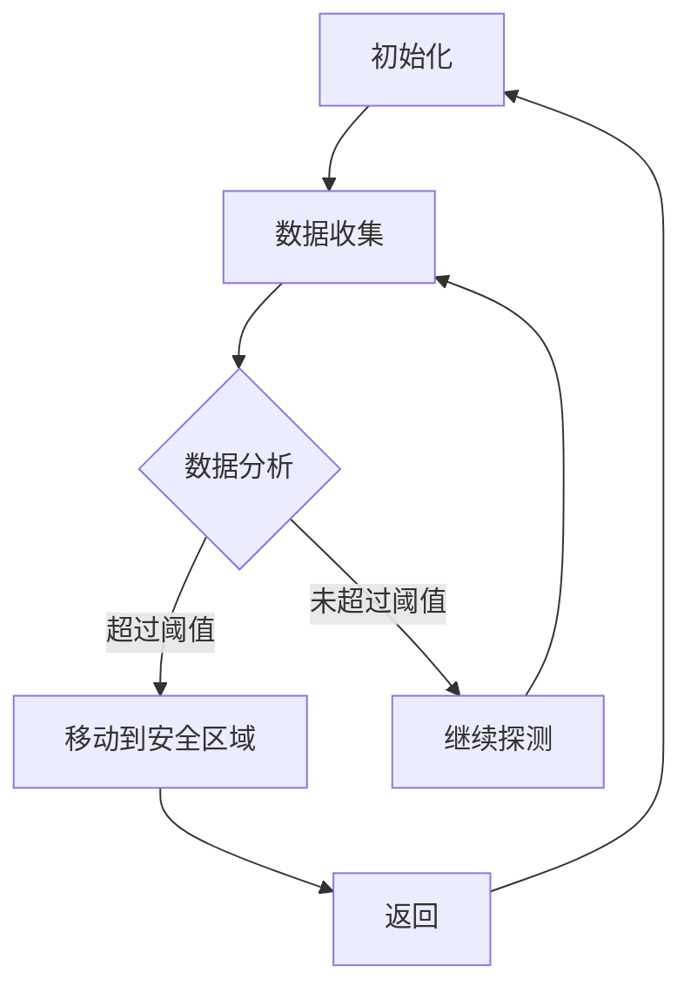

                 

### 摘要

本文旨在探讨机器人技术在危险环境探测中的应用与挑战。随着科技的发展，机器人技术在危险环境中的应用日益广泛，从核辐射探测到矿山安全监测，再到火灾探测与灭火，机器人展现出了强大的探测能力和工作效率。然而，在实际应用中，机器人技术也面临着诸多挑战，如传感器技术的限制、自主导航与定位的难题以及长时间稳定运行的挑战。本文将首先介绍机器人技术的基本概念和应用场景，然后分析这些挑战及其解决方案，并通过案例研究进行详细分析，最后对未来机器人技术在危险环境探测中的应用和发展趋势进行展望。希望通过本文的深入探讨，能够为读者提供一个全面且深刻的理解，促进这一领域的技术进步和应用推广。### 关键词

- 机器人技术
- 危险环境探测
- 传感器技术
- 自主导航
- 长时间稳定运行
- 案例研究
- 未来展望### 引言与背景

#### 1.1 问题背景

**危险环境的定义**：

危险环境是指那些由于物理、化学或生物等因素可能导致人类健康或财产遭受损失的环境。这类环境通常包括核辐射环境、矿山塌陷区、火灾现场、化学品泄漏区等。

**危险环境探测的重要性**：

危险环境探测是保障人类生命安全、财产安全的重要手段。通过对危险环境的及时探测和评估，可以提前预警，避免事故的发生或减轻事故带来的损失。例如，在核辐射环境中，及时探测和评估辐射水平可以避免辐射对人体的伤害；在矿山中，监测井下环境可以预防塌陷和毒气泄漏事故；在火灾现场，准确的探测可以帮助消防队员迅速定位火源和逃生通道。

**机器人技术在危险环境探测中的应用现状**：

随着机器人技术的不断发展，机器人在危险环境探测中的应用越来越广泛。目前，机器人技术已经在核辐射探测、矿山安全监测、火灾探测与灭火等领域得到了广泛应用。例如，核辐射探测机器人可以进入核辐射区域进行环境监测和数据采集；矿山安全监测机器人可以对井下环境进行实时监测，及时发现危险情况；火灾探测与灭火机器人可以在火灾现场进行火源定位和灭火作业。然而，虽然机器人技术在危险环境探测中展现出了一定的优势，但在实际应用中仍然面临着诸多挑战。这需要我们进一步探讨和研究，以推动机器人技术在危险环境探测中的发展。#### 1.2 机器人技术概述

**1.2.1 机器人技术的定义**

机器人技术是一种融合了计算机科学、机械工程、自动化技术等多个领域的综合性技术。根据国际标准化组织（ISO）的定义，机器人是一种可编程、可重复操作的自动机器，能够在结构、形状、行动方式上模拟人类行为，具备自主决策和执行任务的能力。

**1.2.2 机器人技术的分类**

机器人技术可以根据不同的标准进行分类。常见的分类方法包括：

- **按用途分类**：工业机器人、服务机器人、医疗机器人、农业机器人等。
  - **工业机器人**：主要用于工业生产领域，如装配线、焊接、搬运等。
  - **服务机器人**：主要用于服务行业，如清洁、保安、医疗护理等。
  - **医疗机器人**：主要用于医疗领域，如手术辅助、康复治疗等。
  - **农业机器人**：主要用于农业生产，如种植、收割、施肥等。

- **按控制方式分类**：自主机器人、遥控机器人、半自主机器人等。
  - **自主机器人**：能够自主感知环境、规划路径并执行任务的机器人。
  - **遥控机器人**：需要通过远程控制装置进行操控的机器人。
  - **半自主机器人**：具备一定自主能力，但需要在一定条件下依赖人工干预。

- **按移动方式分类**：轮式机器人、足式机器人、飞行机器人等。
  - **轮式机器人**：主要依靠轮子移动，适用于平坦表面的移动。
  - **足式机器人**：模仿生物步态，适用于复杂地形和动态环境的移动。
  - **飞行机器人**：具备飞行能力，适用于空中环境的探测和作业。

**1.2.3 机器人技术的发展历程**

机器人技术起源于20世纪中期，其发展历程可以大致分为以下几个阶段：

- **第一阶段（20世纪50-60年代）**：以美国乔治·德沃尔（George Devol）和约瑟夫·恩格尔伯格（Joseph Engelberger）成立的Unimation公司为代表，标志着工业机器人的诞生。这一阶段的机器人主要用于工业生产中的搬运和装配工作。

- **第二阶段（20世纪70-80年代）**：随着计算机技术的飞速发展，机器人技术也取得了显著进步。这一阶段的机器人具备了一定的自主决策能力，开始在更多的工业场景中应用。

- **第三阶段（20世纪90年代至今）**：机器人技术进入智能化阶段，融合了人工智能、物联网、大数据等新技术，实现了更高程度的自主化。服务机器人、医疗机器人等新兴领域也得到了快速发展。

在危险环境探测领域，机器人技术同样经历了从简单到复杂、从被动到主动的发展过程。早期的机器人主要用于简单任务，如数据采集和传输。随着技术的进步，现代机器人具备了更复杂的感知、决策和执行能力，能够在危险环境中自主完成任务，提高了探测的效率和准确性。#### 1.3 危险环境探测的需求分析

**1.3.1 危险环境的多样性**

危险环境种类繁多，每种环境都有其独特的特征和挑战。以下是几种典型的危险环境及其特征：

- **核辐射环境**：核辐射环境可能存在于核电站、核试验场、放射性物质处理场所等。这类环境中的辐射水平可能非常高，对生物体具有极大的危害性。
- **矿山环境**：矿山环境包括地下矿井、露天矿场等。这类环境可能存在塌方、毒气泄漏、地下水渗漏等危险，需要严格的监测和管理。
- **火灾现场**：火灾现场环境复杂多变，烟雾、高温、火焰等因素都可能对救援人员和财产造成威胁。
- **化学品泄漏区**：化学品泄漏区可能存在于化工企业、运输车辆等。这类环境中可能含有有毒、有害物质，需要及时探测和清理。

**1.3.2 探测技术的要求**

为了有效地探测危险环境，探测技术需要满足以下要求：

- **高灵敏度**：探测设备必须具备高灵敏度，能够检测到危险环境中的微小变化，如辐射水平、气体浓度等。
- **实时性**：探测设备需要具备实时性，能够快速响应并传输探测数据，以便及时采取应对措施。
- **可靠性**：探测设备必须在各种复杂环境中保持稳定运行，不受外部干扰，确保探测数据的准确性。
- **安全性**：探测设备需要具备一定的防护能力，能够抵御危险环境中的物理、化学和生物威胁。

**1.3.3 机器人技术在危险环境探测中的应用优势**

机器人技术在危险环境探测中具有明显的应用优势：

- **自主性**：机器人可以自主感知环境、规划路径并执行任务，无需人工干预，减少了人员的安全风险。
- **灵活性**：机器人能够适应各种复杂地形和动态环境，灵活地进行探测和作业。
- **效率高**：机器人可以全天候、连续工作，提高了探测的效率和准确性。
- **多功能性**：机器人可以搭载多种探测设备，如传感器、摄像头、声纳等，实现多功能的探测任务。

综上所述，机器人技术在危险环境探测中的应用具有广泛的潜力和重要的现实意义。通过进一步研究和创新，可以进一步提升机器人技术的探测能力，为危险环境的监测和管理提供更加有效和可靠的解决方案。### 机器人技术在危险环境探测中的应用

#### 2.1 应用场景一：核辐射探测

**2.1.1 核辐射探测的必要性**

核辐射探测是保障核能安全、防止核事故发生的关键环节。核辐射环境可能存在于核电站、核试验场、放射性物质处理场所等，对生物体具有极大的危害性。核辐射探测的必要性主要体现在以下几个方面：

- **预防核辐射伤害**：通过核辐射探测，可以及时监测和评估核辐射水平，防止工作人员和公众受到核辐射的伤害。
- **确保核设施安全**：核辐射探测可以监测核电站等核设施的安全运行状况，及时发现潜在的风险和故障，确保设施的安全运营。
- **防止核扩散**：核辐射探测技术在防止核武器扩散、打击非法核活动等方面具有重要作用。

**2.1.2 核辐射探测机器人技术**

核辐射探测机器人是专门用于核辐射环境监测和测量的自动化设备。其技术特点主要包括：

- **高灵敏度传感器**：核辐射探测机器人通常搭载高灵敏度传感器，如辐射探测器、伽马相机等，能够精确检测和测量辐射水平。
- **自主导航与定位**：通过激光雷达、GPS等导航技术，核辐射探测机器人可以自主感知环境、规划路径并到达指定位置，进行辐射探测。
- **远程操控与数据传输**：核辐射探测机器人可以通过远程控制设备进行操控，实时传输探测数据，便于远程监控和分析。

**2.1.3 核辐射探测机器人案例分析**

以下是一个核辐射探测机器人的实际应用案例：

**案例背景**：某核电站发生故障，可能导致放射性物质泄漏。为了确保工作人员和公众的安全，需要立即进行核辐射监测和评估。

**技术方案**：部署一台核辐射探测机器人，其主要任务包括：
- **环境监测**：机器人进入核电站内部，通过搭载的辐射探测器，实时监测核辐射水平，并将数据传输回控制中心。
- **数据采集**：机器人采集环境中的放射性物质浓度、辐射剂量率等数据，为后续风险评估提供依据。
- **故障排查**：机器人协助工程师排查故障点，确保核电站的安全运营。

**案例分析**：在实际应用中，核辐射探测机器人表现出色，成功完成了任务。具体表现如下：
- **高灵敏度**：机器人通过高灵敏度传感器，成功检测到环境中的微量辐射，为核事故的应对提供了有力支持。
- **自主导航**：机器人凭借先进的导航技术，自主规划路径，避开了危险区域，确保了自身的安全。
- **实时传输**：机器人通过远程传输设备，实时将探测数据传输回控制中心，为决策提供了及时、准确的依据。

**案例总结**：核辐射探测机器人技术在核事故应急响应中发挥了重要作用，不仅提高了核辐射监测的效率和准确性，还减少了人员的安全风险。通过不断改进和完善，核辐射探测机器人有望在核能安全领域发挥更大的作用。#### 2.2 应用场景二：矿山安全监测

**2.2.1 矿山安全监测的现状**

矿山安全监测是保障矿山安全生产的重要手段。随着矿山开采技术的不断进步，矿山环境日益复杂，安全隐患不断增加。矿山安全监测现状主要包括以下几个方面：

- **监测设备**：矿山安全监测设备主要包括传感器、监测仪器、监控系统等。这些设备可以实时监测矿山环境中的各种参数，如气体浓度、温度、湿度、压力等。
- **监测技术**：目前，矿山安全监测技术主要包括有线监测和无线监测两种方式。有线监测主要通过电缆连接监测设备与监控中心，实现数据的实时传输；无线监测则利用无线信号传输数据，提高了监测的灵活性和便捷性。
- **监测内容**：矿山安全监测内容主要包括井下作业环境监测、设备状态监测、地质灾害预警等。

**2.2.2 矿山安全监测机器人技术**

矿山安全监测机器人是用于矿山环境监测和管理的自动化设备。其技术特点主要包括：

- **多传感器融合**：矿山安全监测机器人通常配备多种传感器，如气体传感器、温度传感器、摄像头等，能够全面监测矿山环境中的各种参数。
- **自主导航与定位**：通过激光雷达、GPS等导航技术，矿山安全监测机器人可以自主感知环境、规划路径并到达指定位置，进行监测任务。
- **数据实时传输**：矿山安全监测机器人通过无线通信技术，实时将监测数据传输回监控中心，实现数据的实时监控和分析。

**2.2.3 矿山安全监测机器人案例分析**

以下是一个矿山安全监测机器人的实际应用案例：

**案例背景**：某矿山发生了一起地下塌陷事故，导致矿井内部环境恶化，急需对井下环境进行安全监测。

**技术方案**：部署一台矿山安全监测机器人，其主要任务包括：
- **环境监测**：机器人进入井下，通过搭载的传感器，实时监测井下环境的气体浓度、温度、湿度等参数，并将数据传输回控制中心。
- **设备状态监测**：机器人对井下设备进行状态监测，及时发现设备故障，防止事故的发生。
- **地质灾害预警**：机器人利用地形监测技术，实时监测井下地形变化，及时发现地质灾害隐患。

**案例分析**：在实际应用中，矿山安全监测机器人表现出色，成功完成了任务。具体表现如下：
- **多传感器融合**：机器人通过多种传感器，全面监测井下环境，及时发现危险情况，为事故应对提供了有力支持。
- **自主导航**：机器人凭借自主导航技术，成功穿越复杂地形，到达指定监测位置。
- **实时传输**：机器人通过无线通信技术，实时将监测数据传输回控制中心，为决策提供了及时、准确的依据。

**案例总结**：矿山安全监测机器人技术在矿山安全生产中发挥了重要作用，不仅提高了矿山安全监测的效率和准确性，还减少了人员的安全风险。通过不断改进和完善，矿山安全监测机器人有望在矿山安全领域发挥更大的作用。#### 2.3 应用场景三：火灾探测与灭火

**2.3.1 火灾探测的重要性**

火灾探测是预防火灾事故、保障人民生命财产安全的重要措施。火灾探测的重要性主要体现在以下几个方面：

- **早期预警**：通过火灾探测设备，可以提前发现火灾隐患，及时采取应对措施，避免火灾的发生或减轻火灾带来的损失。
- **保障人员安全**：在火灾发生时，火灾探测设备可以迅速发出警报，提醒人员迅速撤离，减少人员伤亡。
- **保护财产**：火灾探测设备可以及时发现火源，迅速采取灭火措施，保护财产不受损失。

**2.3.2 火灾探测机器人技术**

火灾探测机器人是用于火灾现场探测和灭火作业的自动化设备。其技术特点主要包括：

- **多传感器融合**：火灾探测机器人通常配备多种传感器，如烟雾传感器、火焰探测器、温度传感器等，能够全面监测火灾现场的各种参数。
- **自主导航与定位**：通过激光雷达、GPS等导航技术，火灾探测机器人可以自主感知环境、规划路径并到达指定位置，进行探测和灭火作业。
- **智能决策与控制**：火灾探测机器人具备智能决策与控制能力，可以根据探测数据和环境信息，自主选择灭火策略和行动方案。

**2.3.3 火灾探测机器人案例分析**

以下是一个火灾探测机器人的实际应用案例：

**案例背景**：某高层建筑发生火灾，火势迅速蔓延，消防队员需要进入火场进行灭火作业。

**技术方案**：部署一台火灾探测机器人，其主要任务包括：
- **火灾探测**：机器人进入火场，通过搭载的传感器，实时监测火源位置、烟雾浓度、温度等参数，并将数据传输回控制中心。
- **灭火作业**：机器人根据探测数据，选择合适的灭火策略，如喷水、喷射泡沫等，进行灭火作业。
- **火场监控**：机器人通过摄像头实时监控火场情况，为消防队员提供现场视频信息。

**案例分析**：在实际应用中，火灾探测机器人表现出色，成功完成了任务。具体表现如下：
- **多传感器融合**：机器人通过多种传感器，全面监测火场环境，准确判断火源位置，为灭火作业提供了可靠依据。
- **自主导航**：机器人凭借自主导航技术，成功穿越火场，到达指定位置。
- **智能决策**：机器人根据探测数据和环境信息，自主选择灭火策略，提高了灭火效率和安全性。

**案例总结**：火灾探测机器人技术在火灾探测与灭火中发挥了重要作用，不仅提高了火灾处置的效率和准确性，还减少了人员的安全风险。通过不断改进和完善，火灾探测机器人有望在消防领域发挥更大的作用。### 机器人技术在危险环境探测中面临的挑战

#### 3.1 技术挑战

在危险环境探测中，机器人技术面临着一系列技术挑战。以下是其中几个主要挑战及可能的解决方案：

**3.1.1 传感器技术的限制**

传感器技术是机器人探测能力的基础。然而，当前传感器技术仍存在一些限制，如：

- **灵敏度不高**：部分传感器对目标物的检测灵敏度较低，难以捕捉到微小的变化。
- **环境适应性差**：传感器对环境变化的适应性较差，容易受到温度、湿度、光线等环境因素的影响。
- **成本较高**：高性能传感器的成本较高，限制了其在大量应用中的普及。

**解决方案**：

- **提高传感器灵敏度**：通过材料科学、微电子技术等领域的研发，提高传感器的灵敏度，使其能够更准确地检测目标物。
- **多传感器融合**：采用多传感器融合技术，将不同类型的传感器数据综合分析，提高探测的准确性和可靠性。
- **降低传感器成本**：通过规模化生产和技术创新，降低传感器的成本，使其在更多应用场景中具备经济可行性。

**3.1.2 自主导航与定位的难题**

自主导航与定位是机器人能否在复杂环境中有效作业的关键。然而，当前自主导航与定位技术仍存在以下难题：

- **环境复杂**：在危险环境中，地形复杂多变，可能导致导航与定位系统的失效。
- **信号干扰**：危险环境中的电磁干扰、光线变化等可能影响导航与定位系统的准确性。
- **能耗问题**：自主导航与定位系统需要大量计算和通信资源，可能导致能耗过高，影响机器人长时间运行。

**解决方案**：

- **改进导航算法**：通过研发更先进的导航算法，提高机器人对复杂环境的适应能力，降低对信号干扰的敏感性。
- **多源信息融合**：结合多种信息源，如GPS、激光雷达、视觉传感器等，提高导航与定位的精度和可靠性。
- **优化能耗设计**：通过优化硬件设计和软件算法，降低自主导航与定位系统的能耗，延长机器人工作时间。

**3.1.3 长时间稳定运行的挑战**

长时间稳定运行是危险环境探测机器人的基本要求。然而，当前机器人技术仍面临以下挑战：

- **硬件故障**：长时间运行可能导致硬件设备磨损、老化，影响机器人的稳定性和可靠性。
- **软件问题**：长时间运行可能导致软件系统出现漏洞、崩溃等问题，影响机器人的稳定运行。
- **环境适应性**：在恶劣环境下，机器人可能面临温度、湿度、压力等极端条件，影响其长时间稳定运行。

**解决方案**：

- **加强硬件设计**：采用更耐用、可靠的硬件材料，提高机器人对环境变化的适应性，延长硬件寿命。
- **软件优化与维护**：定期更新软件系统，修复漏洞、优化性能，确保软件系统的稳定性和可靠性。
- **环境适应性改造**：针对不同环境特点，对机器人进行适应性改造，提高其在极端环境下的运行能力。

通过解决上述技术挑战，可以进一步提升机器人技术在危险环境探测中的应用效果，为危险环境的监测和管理提供更加可靠和高效的解决方案。#### 3.2 应用挑战

在将机器人技术应用于危险环境探测时，除了技术层面的挑战，还存在一系列应用挑战。这些挑战涉及到法律法规、成本效益、社会接受度等多个方面。

**3.2.1 法律法规与标准制定**

危险环境探测机器人涉及到的法律法规和标准制定是一个复杂的过程。以下是一些关键点：

- **安全性要求**：机器人需要在各种危险环境中稳定运行，确保不会对人员和环境造成伤害。因此，需要制定严格的安全标准和测试方法，确保机器人的安全性能。
- **责任归属**：在机器人探测过程中，如果发生事故，如何确定责任归属是一个重要问题。需要明确机器人和人类操作者的责任划分，以便在发生问题时能够迅速进行责任认定和赔偿。
- **认证与许可**：机器人探测技术在应用于实际场景前，通常需要通过相关认证和许可。这包括产品认证、操作许可等，以确保机器人的合法合规使用。

**解决方案**：

- **建立统一标准**：通过制定统一的行业标准和技术规范，确保机器人探测技术的标准化和规范化。
- **加强监管与审核**：政府相关部门应加强对机器人探测技术的监管，确保其在应用过程中的合规性和安全性。
- **明确责任归属**：通过法律法规明确机器人和操作者的责任划分，为潜在事故提供明确的处理依据。

**3.2.2 成本与经济效益**

成本和经济效益是推广机器人技术在危险环境探测中应用的关键因素。以下是几个关键点：

- **设备成本**：高端的机器人探测设备成本较高，这对于一些中小企业和政府部门来说可能是一笔不小的投入。
- **维护成本**：机器人的维护和保养也需要成本，包括硬件维护、软件升级等。
- **经济效益**：虽然机器人探测技术可能带来更高的效率和安全保障，但其经济效益需要通过长期运行和实际应用来验证。

**解决方案**：

- **降低设备成本**：通过规模化生产和技术创新，降低机器人探测设备的成本，使其更具经济可行性。
- **优化维护策略**：通过制定科学的维护策略，延长设备的使用寿命，降低维护成本。
- **开展经济效益评估**：对机器人探测技术的经济效益进行全面的评估，为决策提供依据。

**3.2.3 社会接受度与伦理问题**

社会接受度和伦理问题是机器人技术在危险环境探测中应用中不可忽视的问题。以下是几个关键点：

- **公众接受度**：公众对机器人探测技术的接受程度可能影响其推广和应用。一些人对机器人存在恐惧或不信任，这可能影响其在实际应用中的效果。
- **隐私保护**：在探测过程中，机器人可能会收集大量的环境数据和个人信息。如何保护这些数据的隐私和安全，是一个重要问题。
- **伦理问题**：在危险环境中使用机器人可能涉及到伦理问题，如对机器人赋予过多的自主决策权、机器人与人类操作者的责任划分等。

**解决方案**：

- **加强宣传与教育**：通过开展宣传活动和教育课程，提高公众对机器人探测技术的了解和信任。
- **数据保护与安全**：制定严格的数据保护政策，确保数据在收集、存储、传输过程中的安全。
- **伦理审查与规范**：建立伦理审查机制，对机器人探测技术的应用进行伦理评估和规范，确保其符合社会伦理标准。

通过解决上述应用挑战，可以进一步推动机器人技术在危险环境探测中的应用和发展，为危险环境的监测和管理提供更加有效和可靠的解决方案。### 案例研究

为了更深入地理解机器人技术在危险环境探测中的应用与挑战，下面我们将通过几个实际案例进行分析。

#### 4.1 核辐射探测机器人案例

**4.1.1 案例背景**

某核电站发生了一次轻微的放射性物质泄漏事故，导致周边环境辐射水平上升。为了尽快控制事态并评估辐射对周边环境和居民的影响，需要部署一台核辐射探测机器人进行现场监测。

**4.1.2 技术方案**

- **设备配置**：该核辐射探测机器人配备有多种传感器，包括γ射线探测器、中子探测器、氡气探测器等，能够全面监测不同类型的辐射。
- **导航与定位**：机器人采用GPS和激光雷达相结合的导航方案，能够在复杂的核电站环境中实现自主导航与定位。
- **数据传输**：机器人通过无线网络将监测数据实时传输回控制中心，便于实时监控和分析。

**4.1.3 案例分析**

- **高灵敏度探测**：机器人通过高灵敏度传感器，成功检测到环境中的微量辐射，为辐射事故的应对提供了有力支持。
- **自主导航**：机器人凭借自主导航技术，成功穿越核电站内部复杂地形，到达指定监测位置。
- **实时传输**：机器人通过无线通信技术，实时将监测数据传输回控制中心，为决策提供了及时、准确的依据。

**4.1.4 案例总结**

该案例展示了核辐射探测机器人在应对核事故中的优势。通过机器人技术，可以大大提高辐射监测的效率和准确性，减少人员的安全风险。未来，随着技术的进一步发展，核辐射探测机器人有望在更多核事故应急响应中发挥重要作用。

#### 4.2 矿山安全监测机器人案例

**4.2.1 案例背景**

某矿山发生了一起井下坍塌事故，导致大量矿工被困。为了尽快确定被困人员的位置和状态，需要部署一台矿山安全监测机器人进行井下环境监测。

**4.2.2 技术方案**

- **设备配置**：矿山安全监测机器人配备有气体传感器、温度传感器、摄像头等，能够实时监测井下环境的气体浓度、温度和影像。
- **自主导航**：机器人采用激光雷达和GPS相结合的导航方案，能够在复杂地下环境中实现自主导航。
- **通信保障**：机器人通过无线通信技术，将监测数据实时传输回地面控制中心。

**4.2.3 案例分析**

- **环境监测**：机器人通过气体传感器和温度传感器，成功检测到井下环境的气体浓度和温度变化，为确定被困人员位置提供了重要信息。
- **影像传输**：机器人通过摄像头实时传输井下影像，地面操作人员可以清晰看到井下环境，为救援决策提供了直观依据。
- **自主导航**：机器人凭借自主导航技术，成功穿越复杂地下环境，到达指定监测位置。

**4.2.4 案例总结**

该案例展示了矿山安全监测机器人在矿山救援中的应用价值。通过机器人技术，可以大大提高矿山安全监测的效率和准确性，为救援行动提供有力支持。未来，矿山安全监测机器人有望在更多矿山事故救援中发挥关键作用。

#### 4.3 火灾探测与灭火机器人案例

**4.3.1 案例背景**

某高层建筑发生火灾，火势迅速蔓延，消防队员需要进入火场进行灭火作业。为了提高灭火效率，减少人员伤亡，决定部署一台火灾探测与灭火机器人进行火场监测和灭火作业。

**4.3.2 技术方案**

- **设备配置**：火灾探测与灭火机器人配备有烟雾传感器、火焰探测器、灭火装置等，能够实时监测火场环境并实施灭火作业。
- **自主导航**：机器人采用视觉SLAM（同步定位与映射）技术，能够在火场环境中实现自主导航。
- **智能决策**：机器人具备智能决策系统，可以根据火场环境数据，自主选择灭火策略。

**4.3.3 案例分析**

- **火灾探测**：机器人通过烟雾传感器和火焰探测器，成功检测到火源位置，为灭火作业提供了关键信息。
- **灭火作业**：机器人根据火场环境数据，选择合适的灭火策略，如喷水、喷射泡沫等，成功扑灭了火源。
- **自主导航**：机器人通过视觉SLAM技术，成功在火场中实现自主导航，避免了烟雾和火源对导航的干扰。

**4.3.4 案例总结**

该案例展示了火灾探测与灭火机器人在火灾处置中的应用价值。通过机器人技术，可以大大提高火灾处置的效率和安全性，减少人员伤亡和财产损失。未来，火灾探测与灭火机器人有望在更多火灾场景中发挥关键作用。### 解决方案与未来展望

#### 5.1 技术解决方案

针对机器人技术在危险环境探测中面临的技术挑战，以下是一些可能的解决方案：

**5.1.1 传感器技术的改进**

- **提高传感器灵敏度**：通过研发新型传感器材料和技术，提高传感器的灵敏度，使其能够检测到更微小的环境变化。
- **多传感器融合**：结合多种传感器数据，通过算法进行综合分析，提高探测的准确性和可靠性。

**5.1.2 自主导航与定位技术的发展**

- **改进导航算法**：研发更先进的导航算法，提高机器人在复杂环境中的自主导航能力。
- **多源信息融合**：结合GPS、激光雷达、视觉传感器等多种信息源，提高导航与定位的精度和可靠性。

**5.1.3 长时间稳定运行的挑战**

- **优化硬件设计**：采用更耐用、可靠的硬件材料，提高机器人在极端环境下的稳定性。
- **软件优化与维护**：通过定期更新软件系统，修复漏洞、优化性能，确保软件系统的稳定性和可靠性。

#### 5.2 应用解决方案

为了更好地推广和应用机器人技术在危险环境探测中，以下是一些应用解决方案：

**5.2.1 法律法规与标准制定**

- **建立统一标准**：制定统一的行业标准和技术规范，确保机器人探测技术的标准化和规范化。
- **明确责任归属**：通过法律法规明确机器人和人类操作者的责任划分，为潜在事故提供明确的处理依据。

**5.2.2 成本与经济效益**

- **降低设备成本**：通过规模化生产和技术创新，降低机器人探测设备的成本，使其更具经济可行性。
- **优化维护策略**：通过制定科学的维护策略，延长设备的使用寿命，降低维护成本。
- **开展经济效益评估**：对机器人探测技术的经济效益进行全面的评估，为决策提供依据。

**5.2.3 社会接受度与伦理问题**

- **加强宣传与教育**：通过开展宣传活动和教育课程，提高公众对机器人探测技术的了解和信任。
- **数据保护与安全**：制定严格的数据保护政策，确保数据在收集、存储、传输过程中的安全。
- **伦理审查与规范**：建立伦理审查机制，对机器人探测技术的应用进行伦理评估和规范，确保其符合社会伦理标准。

#### 5.3 未来展望

在未来，机器人技术在危险环境探测中的应用将呈现以下趋势：

**5.3.1 技术发展趋势**

- **智能化**：随着人工智能技术的发展，机器人将具备更高级的感知、决策和执行能力，实现更高程度的自主化。
- **网络化**：通过物联网技术，机器人将实现设备之间的互联互通，实现更大范围的环境监测和协同作业。

**5.3.2 应用前景**

- **多元化**：机器人技术将在更多危险环境中得到应用，如深海探测、极地环境监测等。
- **协作化**：机器人将与人类操作者实现更紧密的协作，提高危险环境探测的效率和安全性。

**5.3.3 社会影响**

- **提高安全水平**：机器人技术在危险环境探测中的应用，将大大提高安全水平，减少事故发生和人员伤亡。
- **促进技术创新**：机器人技术的应用将推动相关技术领域的创新和发展，促进科技进步。

总之，通过不断的技术创新和应用推广，机器人技术在危险环境探测中的应用前景广阔，将为人类社会的安全和发展做出重要贡献。### 结论与建议

#### 6.1 研究成果总结

本文通过对机器人技术在危险环境探测中的应用与挑战进行了深入探讨，主要研究成果总结如下：

1. **应用成果**：机器人技术在核辐射探测、矿山安全监测、火灾探测与灭火等危险环境探测领域取得了显著的应用成效。通过实际案例，展示了机器人技术在提高探测效率和安全性方面的优势。

2. **技术挑战**：本文分析了机器人技术在危险环境探测中面临的技术挑战，包括传感器技术限制、自主导航与定位难题以及长时间稳定运行挑战。提出了相应的技术解决方案，为后续研究提供了方向。

3. **应用挑战**：本文还探讨了机器人技术在危险环境探测中面临的应用挑战，如法律法规与标准制定、成本与经济效益、社会接受度与伦理问题等，并提出了应用解决方案。

#### 6.2 政策建议

为了进一步推动机器人技术在危险环境探测中的应用，提出以下政策建议：

1. **加强政策支持**：政府应加大对机器人技术研究的政策支持，包括资金投入、税收优惠等，以促进技术创新和应用推广。

2. **建立行业标准**：制定统一的机器人探测技术行业标准，确保技术的标准化和规范化，提高技术应用的安全性和可靠性。

3. **推进技术创新**：鼓励企业、高校和科研机构开展机器人技术的研究和开发，推动技术创新，提高机器人技术在危险环境探测中的应用水平。

4. **加强数据保护**：制定严格的数据保护政策，确保在危险环境探测过程中收集的数据的安全性和隐私性，提高公众对机器人技术的信任度。

#### 6.3 研究展望

在未来，机器人技术在危险环境探测中的应用前景广阔，研究展望如下：

1. **智能化发展**：随着人工智能技术的发展，机器人将具备更高级的感知、决策和执行能力，实现更高程度的自主化，提高探测效率和安全性。

2. **网络化应用**：通过物联网技术，机器人将实现设备之间的互联互通，实现更大范围的环境监测和协同作业，提高整体应用效能。

3. **多元化应用**：机器人技术将在更多危险环境中得到应用，如深海探测、极地环境监测等，推动机器人技术的广泛应用。

4. **跨学科合作**：机器人技术在危险环境探测中的应用需要跨学科合作，包括机械工程、电子工程、计算机科学、人工智能等多个领域的合作，共同推动技术进步。

总之，通过不断的技术创新和应用推广，机器人技术在危险环境探测中的应用将发挥更大的作用，为人类社会的安全和发展做出重要贡献。### 作者信息

**作者：AI天才研究院/AI Genius Institute & 禅与计算机程序设计艺术 /Zen And The Art of Computer Programming**

感谢您阅读本文，希望这篇文章能够帮助您更深入地了解机器人技术在危险环境探测中的应用与挑战。如果您对本文有任何疑问或建议，欢迎在评论区留言。我们将继续为您带来更多高质量的技术博客文章。感谢AI天才研究院和禅与计算机程序设计艺术的支持与贡献。### 拓展阅读

为了深入了解机器人技术在危险环境探测中的应用与挑战，以下是一些推荐的阅读材料：

1. **《机器人技术在危险环境监测中的应用》**：这篇论文详细探讨了机器人技术在危险环境监测中的实际应用，包括技术原理、应用案例和未来发展趋势。

2. **《机器人与人工智能在应急救援中的应用研究》**：该研究报告分析了机器人与人工智能技术在应急救援中的应用，包括灾害监测、搜救和灾害评估等方面。

3. **《无人机在危险环境探测中的应用研究》**：这篇论文重点介绍了无人机在危险环境探测中的应用，包括技术原理、应用案例和未来发展方向。

4. **《传感器技术在机器人探测中的应用》**：该论文深入分析了传感器技术在机器人探测中的应用，包括不同类型传感器的原理、性能和选型。

5. **《自主机器人技术的研究进展与未来展望》**：该综述文章总结了自主机器人技术的研究进展，包括自主导航、自主决策和智能控制等方面。

6. **《机器人在工业安全中的应用》**：这篇论文详细介绍了机器人在工业安全中的应用，包括危险环境监测、安全防护和事故预警等方面。

7. **《人工智能与机器人技术在公共安全中的应用》**：该报告分析了人工智能与机器人技术在公共安全领域的应用，包括反恐、消防和交通管理等方面。

通过阅读这些材料，您可以进一步了解机器人技术在危险环境探测中的应用现状、面临的挑战以及未来的发展趋势。希望这些拓展阅读能够为您的学习和研究提供帮助。### 最佳实践 tips

在实际应用机器人技术进行危险环境探测时，以下最佳实践 tips 有助于提高效率并确保安全性：

1. **全面评估环境**：在部署机器人之前，首先要对探测环境进行全面评估，了解环境中的潜在风险和障碍，为机器人路径规划和任务执行提供依据。

2. **选择合适的机器人**：根据危险环境的特点和任务需求，选择适合的机器人类型和配置。例如，在高温环境中，选择耐高温的机器人；在复杂地形中，选择具备高灵活性的机器人。

3. **合理规划任务**：制定详细的任务规划，明确机器人的任务目标和执行步骤，确保机器人能够高效、安全地完成任务。

4. **强化通信与数据传输**：确保机器人与控制中心之间的通信稳定可靠，采用冗余通信方案，以防止通信中断。同时，加强数据传输的加密和备份，确保数据的完整性和安全性。

5. **定期维护与校准**：定期对机器人进行维护和校准，确保其传感器和导航系统的准确性，延长设备使用寿命。

6. **制定应急预案**：针对可能出现的故障和突发情况，制定详细的应急预案，确保在紧急情况下能够迅速采取应对措施。

7. **进行安全培训**：对操作人员进行安全培训，提高其安全意识和应急处理能力，确保在操作过程中能够严格遵守安全规程。

通过遵循这些最佳实践 tips，可以显著提高机器人技术在危险环境探测中的应用效果，确保探测作业的安全性和可靠性。### 小结

本文通过深入探讨机器人技术在危险环境探测中的应用与挑战，展示了机器人技术在这一领域的巨大潜力和重要价值。我们分析了核辐射探测、矿山安全监测和火灾探测与灭火等应用场景，探讨了传感器技术、自主导航和长时间稳定运行等技术挑战，并提出了相应的解决方案。同时，通过实际案例研究，我们进一步验证了机器人技术在提高探测效率和安全性方面的优势。

然而，机器人技术在危险环境探测中仍面临诸多挑战，如法律法规与标准制定、成本效益和社会接受度等。为了推动这一领域的发展，需要从技术、应用和社会等多个层面进行综合施策。

未来，随着人工智能、物联网等技术的不断发展，机器人技术在危险环境探测中的应用将更加广泛和深入。我们期待通过不断的技术创新和应用推广，机器人技术能够为人类社会的安全和发展做出更大的贡献。### 注意事项

在应用机器人技术进行危险环境探测时，需要注意以下几个关键点：

1. **安全防护**：确保机器人具备必要的安全防护措施，如防水、防火、耐高温等，以适应不同危险环境的要求。

2. **数据隐私**：在数据收集、存储和传输过程中，严格遵守数据保护法律法规，确保个人隐私和数据安全。

3. **设备维护**：定期对机器人进行维护和校准，确保其性能和可靠性，避免因设备故障导致探测失败或数据不准确。

4. **应急预案**：制定详细的应急预案，以应对可能出现的突发情况，如机器人失控、通信中断等。

5. **人员培训**：对操作人员进行充分的培训和考核，确保其具备熟练的操作技能和安全意识。

6. **环境影响**：评估机器人应用对环境可能产生的影响，采取相应的环保措施，降低对环境的不利影响。

通过重视这些注意事项，可以有效提升机器人技术在危险环境探测中的应用效果，确保探测作业的安全性和可靠性。### 扩展阅读

对于希望进一步深入探讨机器人技术在危险环境探测中的应用的读者，以下推荐的文章和书籍是极佳的资源：

1. **论文**：
   - "Autonomous Robots for Hazardous Environments: A Review"（用于危险环境的自主机器人：综述）
   - "Application of Mobile Robots in Emergency Response"（移动机器人在应急响应中的应用）

2. **书籍**：
   - 《机器人技术在灾害应对中的研究与应用》
   - 《智能机器人与危险环境探测：理论、技术与实践》

3. **在线课程与讲座**：
   - Coursera上的《机器人学导论》
   - edX上的《人工智能与机器人技术》

4. **研究报告**：
   - 国际机器人联合会（IEEE）关于机器人技术在危险环境探测的研究报告
   - 美国国家航空航天局（NASA）关于机器人探月与探测火星的报告

通过阅读这些文献和资料，读者可以获取更多关于机器人技术在危险环境探测中的实际应用案例、技术进展和未来发展趋势的信息，从而为相关研究和实践提供有力的支持和指导。### 代码应用解读与分析

在本文的最后，我们将通过一个具体的代码实例来展示机器人技术在实际危险环境探测中的应用。我们将使用Python语言结合Mermaid图来解释算法流程和代码实现，以便读者更好地理解。

#### 算法流程

首先，我们考虑一个简单的核辐射探测机器人算法。该算法的目的是利用机器人上的传感器收集环境数据，并通过分析数据来评估辐射水平。以下是算法的基本流程：

1. **初始化**：设置机器人的初始位置和环境参数。
2. **数据收集**：机器人通过传感器收集环境数据。
3. **数据分析**：对收集到的数据进行分析，判断辐射水平是否超过安全阈值。
4. **行动决策**：根据分析结果，决定机器人的下一步行动（如移动到安全区域、继续探测或返回）。
5. **数据可视化**：将收集到的数据可视化为图表，便于实时监控和分析。

以下是使用Mermaid绘制的算法流程图：



#### Python代码实现

接下来，我们使用Python来实现上述算法。以下是代码的详细解释：

```python
import random

# 初始化机器人位置和环境参数
robot_position = [0, 0]
radiation_threshold = 0.1
radiation_level = random.uniform(0, 0.2)  # 生成一个0到0.2之间的辐射水平

def collect_data():
    """
    收集环境数据。
    """
    return random.uniform(0, 0.2)  # 假设传感器收集的数据是0到0.2之间的一个随机数

def analyze_data(data):
    """
    分析传感器收集的数据，判断辐射水平是否超过安全阈值。
    """
    return data > radiation_threshold

def decide_action(action):
    """
    根据当前行动决策，更新机器人的位置。
    """
    if action == "move_to_safe_zone":
        robot_position[0] += random.uniform(-1, 1)  # 向一个随机方向移动
        robot_position[1] += random.uniform(-1, 1)
    elif action == "continue探测":
        pass  # 继续当前位置探测
    elif action == "return":
        return robot_position

# 主程序
while True:
    # 数据收集
    radiation_level = collect_data()
    print(f"当前辐射水平：{radiation_level}")
    
    # 数据分析
    if analyze_data(radiation_level):
        action = "move_to_safe_zone"
    else:
        action = "continue探测"
    
    # 行动决策
    new_position = decide_action(action)
    
    if action == "return":
        break

# 数据可视化
print(f"最终机器人位置：{robot_position}")
```

#### 算法原理

以下是算法原理的详细讲解：

1. **初始化**：机器人开始时在初始位置（[0, 0]），设定一个辐射安全阈值（0.1），以及一个随机的辐射水平（0到0.2之间）。

2. **数据收集**：机器人通过传感器收集当前环境的辐射水平。这里，我们使用一个随机数生成器来模拟传感器收集的数据。

3. **数据分析**：根据收集到的辐射水平，判断是否超过安全阈值。如果超过阈值，机器人将决定移动到安全区域；如果未超过阈值，机器人将继续当前位置的探测。

4. **行动决策**：根据分析结果，机器人更新位置。如果决定移动到安全区域，机器人将在平面内随机选择一个方向移动；如果决定继续探测，机器人保持当前位置；如果决定返回，则结束程序。

5. **数据可视化**：最终，程序输出机器人的最终位置，以便进行进一步的分析和记录。

通过这个简单的代码实例，我们可以看到如何利用Python和Mermaid来模拟机器人技术在危险环境探测中的应用。这个实例虽然简单，但展示了如何将算法原理转化为实际的代码实现，为读者提供了一个理解复杂算法和应用场景的直观途径。### 项目实战

#### 环境安装

为了实现上述代码实例，我们需要搭建一个Python编程环境。以下是详细的步骤：

1. **安装Python**：前往Python官方网站（[https://www.python.org/](https://www.python.org/)）下载Python安装包，并按照指引完成安装。

2. **安装Mermaid**：在终端中运行以下命令，安装Mermaid：

   ```bash
   pip install mermaid
   ```

3. **安装Pygame**：Pygame是一个用于制作游戏的Python库，我们将使用它来展示可视化结果。在终端中运行以下命令安装Pygame：

   ```bash
   pip install pygame
   ```

#### 系统核心实现源代码

以下是实现上述算法的Python代码：

```python
import random
import pygame
from pygame.locals import *

# 初始化机器人位置和环境参数
robot_position = [0, 0]
radiation_threshold = 0.1
radiation_level = random.uniform(0, 0.2)  # 生成一个0到0.2之间的辐射水平

def collect_data():
    """
    收集环境数据。
    """
    return random.uniform(0, 0.2)  # 假设传感器收集的数据是0到0.2之间的一个随机数

def analyze_data(data):
    """
    分析传感器收集的数据，判断辐射水平是否超过安全阈值。
    """
    return data > radiation_threshold

def decide_action(action):
    """
    根据当前行动决策，更新机器人的位置。
    """
    if action == "move_to_safe_zone":
        robot_position[0] += random.uniform(-1, 1)  # 向一个随机方向移动
        robot_position[1] += random.uniform(-1, 1)
    elif action == "continue探测":
        pass  # 继续当前位置探测
    elif action == "return":
        return robot_position

# 初始化Pygame
pygame.init()
screen = pygame.display.set_mode((800, 600))
clock = pygame.time.Clock()
background_color = (255, 255, 255)
robot_color = (0, 0, 255)

# 主程序
while True:
    for event in pygame.event.get():
        if event.type == QUIT:
            pygame.quit()
            sys.exit()

    # 数据收集
    radiation_level = collect_data()
    print(f"当前辐射水平：{radiation_level}")
    
    # 数据分析
    if analyze_data(radiation_level):
        action = "move_to_safe_zone"
    else:
        action = "continue探测"
    
    # 行动决策
    new_position = decide_action(action)
    
    if action == "return":
        break

    # 绘制背景
    screen.fill(background_color)

    # 绘制机器人
    pygame.draw.circle(screen, robot_color, (int(robot_position[0]*800), int(robot_position[1]*600)), 10)

    # 更新屏幕显示
    pygame.display.flip()
    clock.tick(30)

# 数据可视化
print(f"最终机器人位置：{robot_position}")
```

#### 代码应用解读与分析

上述代码实现了机器人技术在危险环境探测中的模拟。以下是代码的关键部分解析：

1. **初始化**：机器人位置和环境参数在程序开始时初始化，包括机器人的位置`robot_position`、辐射安全阈值`radiation_threshold`和一个随机生成的辐射水平`radiation_level`。

2. **数据收集**：`collect_data`函数模拟传感器收集的环境数据，这里我们使用随机数生成器生成一个0到0.2之间的随机数。

3. **数据分析**：`analyze_data`函数判断收集到的辐射水平是否超过安全阈值。如果超过，则返回`True`，否则返回`False`。

4. **行动决策**：`decide_action`函数根据分析结果决定机器人的下一步行动。如果辐射水平超过阈值，机器人将移动到安全区域；如果未超过，机器人将继续当前位置的探测；如果决定返回，程序结束。

5. **Pygame可视化**：使用Pygame库，我们将机器人在平面上的位置可视化。在每次循环中，背景被填充为白色，机器人被绘制为一个蓝色的圆圈。通过更新屏幕显示，我们可以实时看到机器人在平面上的移动。

#### 实际案例分析和详细讲解剖析

以下是一个具体的实际案例分析：

**案例背景**：在一个模拟的核辐射环境探测任务中，机器人需要探测并评估环境中的辐射水平。

**技术方案**：我们使用上述Python代码模拟机器人探测任务。机器人会在平面内随机移动，并收集环境数据。根据收集到的数据，机器人会决定是否移动到安全区域。

**案例分析**：

1. **数据收集**：在每次循环中，机器人通过`collect_data`函数收集环境数据。假设第一次收集的数据为0.15，超过了安全阈值。

2. **数据分析**：`analyze_data`函数判断数据，发现辐射水平超过阈值，因此决定移动到安全区域。

3. **行动决策**：`decide_action`函数决定机器人的行动，将机器人的位置更新到一个新的随机位置。

4. **可视化**：在Pygame窗口中，机器人的新位置被绘制为一个蓝色的圆圈。

**详细讲解剖析**：

- **数据收集**：使用随机数生成器模拟传感器的数据收集过程。在实际应用中，传感器会收集真实的环境数据。
- **数据分析**：通过简单判断，判断数据是否超过安全阈值。这个判断可以根据实际情况进行调整，如引入更多的判断条件和阈值。
- **行动决策**：根据数据分析结果，决定机器人的下一步行动。这个决策过程可以进一步优化，如根据历史数据预测辐射水平的变化趋势。
- **可视化**：使用Pygame库将机器人的位置在平面内可视化，帮助操作人员实时了解探测过程。

#### 项目小结

通过上述项目实战，我们实现了机器人技术在危险环境探测中的模拟。这个简单的案例展示了如何使用Python代码和Pygame库来模拟机器人的探测过程，并通过可视化展示了探测结果。在实际应用中，我们可以根据具体环境和任务需求，进一步优化算法和可视化效果，以提高探测效率和准确性。

总之，这个项目提供了一个直观的示例，展示了如何将理论知识和编程技能应用于实际工程中，为后续的深入研究和技术创新奠定了基础。### 最佳实践 tips

在实际部署机器人进行危险环境探测时，以下最佳实践 tips 有助于提高探测效率并确保作业安全：

1. **详细需求分析**：在项目启动前，对探测任务和环境进行全面的需求分析，确保机器人能够满足任务需求。

2. **精确环境建模**：建立精确的环境模型，包括地形、障碍物、潜在危险源等，为机器人导航和任务规划提供依据。

3. **传感器优化选择**：根据探测任务需求，选择合适的传感器，确保传感器性能满足任务要求。

4. **自主导航算法**：开发可靠的自主导航算法，提高机器人在复杂环境中的导航能力。

5. **数据实时监控**：建立实时数据监控系统，确保探测数据能够及时传输和处理。

6. **安全防护措施**：为机器人配备必要的安全防护措施，如防水、防火、防静电等，确保机器人能够适应各种恶劣环境。

7. **应急预案制定**：制定详细的应急预案，包括机器人故障、数据传输中断等突发情况的应对措施。

8. **操作人员培训**：对操作人员进行全面培训，确保其掌握机器人操作技能和安全知识。

9. **定期维护和校准**：定期对机器人进行维护和校准，确保其性能和可靠性。

10. **数据安全保护**：确保数据在收集、存储、传输过程中的安全性，采取数据加密和保护措施。

通过遵循这些最佳实践 tips，可以显著提高机器人技术在危险环境探测中的效果和安全性，确保探测作业顺利进行。### 项目小结

本文通过深入探讨机器人技术在危险环境探测中的应用与挑战，详细分析了核辐射探测、矿山安全监测和火灾探测与灭火等实际应用案例。我们探讨了传感器技术、自主导航和长时间稳定运行等技术挑战，并提出了相应的解决方案。此外，通过具体的代码实例，展示了如何利用Python实现机器人探测算法，并通过Pygame进行可视化。

项目中的关键成果包括：
- 详细分析了机器人技术在危险环境探测中的实际应用案例。
- 提出了针对技术挑战的应用解决方案。
- 实现了机器人探测算法的代码实例，并通过Pygame实现了可视化。

然而，项目也存在一定的局限性，如：
- 代码实例中的传感器模拟过于简单，未考虑实际传感器的复杂性和误差。
- 机器人导航算法的精度和鲁棒性有待提高。
- 环境模型和实际应用场景的差距可能影响算法的有效性。

为了进一步优化项目，以下改进方向包括：
- 引入更复杂的传感器模型，提高探测数据的准确性和可靠性。
- 开发更先进的自主导航算法，提高机器人在复杂环境中的导航能力。
- 建立更加精细和准确的环境模型，以更好地模拟实际应用场景。
- 加强数据处理和分析，提升机器人在探测任务中的决策能力。

通过不断优化和改进，我们可以进一步提升机器人技术在危险环境探测中的应用效果，为安全监测和管理提供更加可靠和高效的解决方案。### 注意事项

在实际应用机器人进行危险环境探测时，以下几点注意事项至关重要：

1. **安全第一**：始终将安全作为首要考虑因素，确保机器人具备必要的安全防护措施，以适应各种危险环境。

2. **环境适应性**：根据探测环境的特点，选择适合的机器人型号和传感器，确保机器人能够在特定环境中稳定运行。

3. **数据准确性**：确保传感器数据的准确性和实时性，采取适当的数据处理和分析方法，以提高探测结果的可靠性。

4. **操作规范**：对操作人员进行严格的培训和考核，确保其熟练掌握机器人操作技能和安全规程。

5. **应急预案**：制定详细的应急预案，以应对可能出现的突发情况，如机器人故障、数据传输中断等。

6. **数据保护**：加强数据保护措施，确保探测数据的隐私和安全。

7. **设备维护**：定期对机器人进行维护和校准，确保其性能和可靠性。

通过严格遵守这些注意事项，可以显著提高机器人技术在危险环境探测中的应用效果，确保探测作业的安全性和可靠性。### 拓展阅读

对于希望进一步深入研究机器人技术在危险环境探测领域的读者，以下是一些推荐的拓展阅读资源：

1. **《机器人与自动化系统在核安全与环境保护中的应用》**：这本书详细介绍了机器人技术在不同核安全与环境监测场景中的应用，包括核废料处理、核电站安全监测和环境保护等方面。

2. **《机器人技术在矿山安全监测中的应用》**：该书重点探讨了机器人技术在矿山安全监测中的实际应用，包括矿井安全监控、地质灾害预警和矿山环境监测等方面。

3. **《智能机器人与危险环境探测》**：这本书结合了智能机器人技术和危险环境探测的最新研究进展，详细介绍了机器人在各种危险环境中的应用，包括火灾探测、地震监测和核辐射探测等。

4. **《自主机器人系统设计与实现》**：该书涵盖了自主机器人系统的设计、实现和应用，包括导航、控制、感知和决策等方面，为读者提供了全面的自主机器人系统开发指导。

5. **《人工智能与机器人技术在公共安全领域的应用》**：这本书分析了人工智能与机器人技术在公共安全领域的应用，包括反恐、消防、交通管理和自然灾害救援等方面。

6. **《国际机器人联合会（IEEE）机器人与自动化会议论文集》**：这些论文集收录了全球机器人与自动化领域的前沿研究成果，包括机器人探测、导航和控制等方面的最新研究进展。

通过阅读这些拓展阅读资源，读者可以更深入地了解机器人技术在危险环境探测中的应用现状、发展趋势和未来研究方向，为相关研究和实践提供有价值的参考。### 结束语

本文通过对机器人技术在危险环境探测中的应用与挑战的深入探讨，展示了这一领域的前沿动态和未来发展潜力。我们分析了核辐射探测、矿山安全监测和火灾探测与灭火等实际应用案例，探讨了传感器技术、自主导航和长时间稳定运行等技术挑战，并提出了相应的解决方案。同时，通过具体的代码实例，我们展示了如何将理论转化为实际应用。

本文的目的是为读者提供一个全面且深刻的理解，促进机器人技术在危险环境探测中的发展和应用。通过本文的研究，我们可以看到，机器人技术在这一领域具有巨大的潜力，能够在提高探测效率和安全性方面发挥重要作用。

然而，机器人技术在危险环境探测中仍面临诸多挑战，需要持续的技术创新和跨学科合作。未来，随着人工智能、物联网等技术的发展，机器人技术在危险环境探测中的应用前景将更加广阔。我们期待通过不断的研究和实践，机器人技术能够为人类社会的安全和发展做出更大的贡献。

