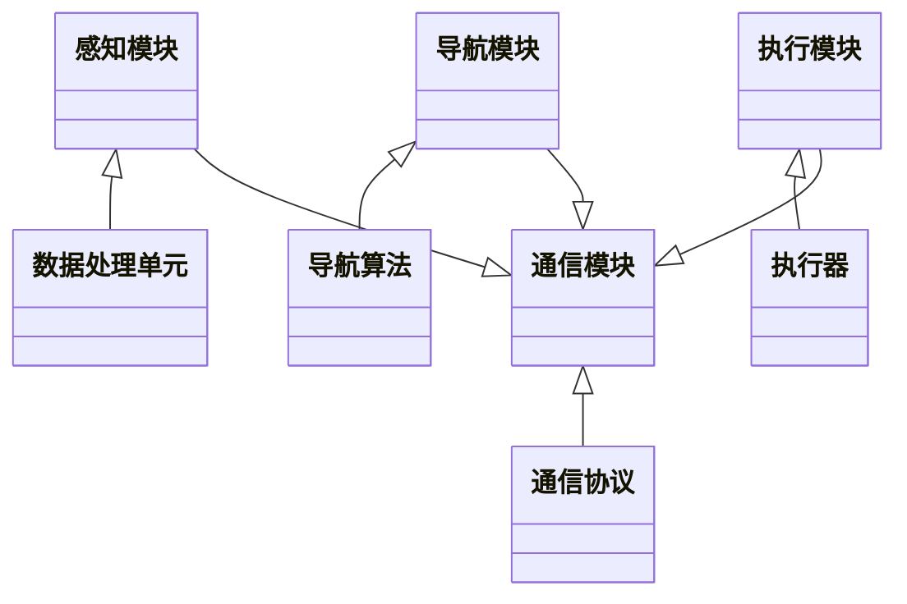
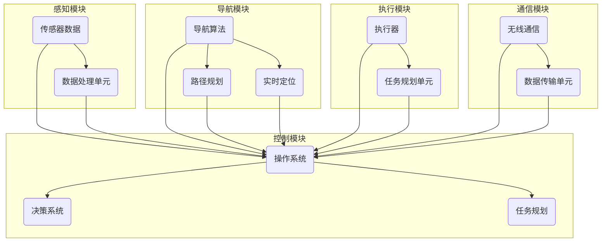
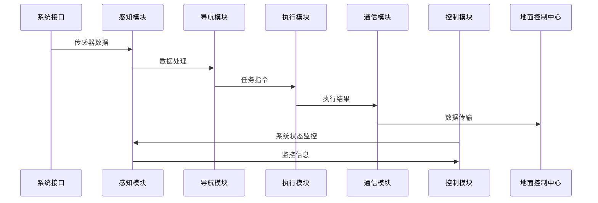

                 

### 引言

在21世纪的科技前沿，机器人和人工智能正逐渐渗透到各个领域，而深空探索无疑是其中最具挑战性和探索性的领域之一。随着航天技术的不断进步，人类对宇宙的向往和探索欲望日益强烈，而机器人技术则为这一宏大的目标提供了强有力的支持。

**关键词：机器人技术、深空探索、探索性任务**

**摘要：**

本文旨在探讨机器人技术在深空探索中的应用及其面临的挑战。首先，我们将简要介绍机器人技术的基本概念，包括其发展历程和当前技术水平。接着，我们将深入探讨深空探索的背景，包括其重要性和当前面临的挑战。随后，我们将详细讨论机器人技术如何在这些探索任务中发挥作用，以及具体的应用场景和技术方案。最后，我们将分析机器人技术在深空探索中面临的技术挑战和未来的发展方向。

### 机器人技术简介

机器人技术的起源可以追溯到20世纪中叶，随着计算机科学和自动化技术的快速发展，机器人逐渐从工业制造领域扩展到服务、医疗、农业等多个领域。目前，机器人技术已经取得了显著进展，尤其在感知、决策、自主导航和任务执行等方面表现尤为突出。

**核心概念与联系：**

1. **感知与传感器融合：** 机器人需要通过传感器获取周围环境的信息，包括视觉、听觉、触觉等，并通过传感器融合技术将这些信息整合起来，以获得更准确的环境感知。

2. **自主导航：** 机器人需要具备自主导航能力，以便在复杂环境中自主移动和执行任务。常用的导航算法包括路径规划、全局路径规划和实时定位与地图构建。

3. **任务执行：** 机器人不仅要能够感知和理解环境，还需要能够根据任务需求执行相应的操作，包括装配、焊接、医疗手术等。

4. **决策与学习：** 机器人需要具备一定的决策能力，能够根据当前环境和任务目标做出合理的决策。同时，通过机器学习技术，机器人可以不断优化其行为和策略。

**机器人技术的基本概念表格：**

| 核心概念         | 说明                                                         | 关联技术                     |
| ---------------- | ------------------------------------------------------------ | --------------------------- |
| 感知与传感器融合 | 通过多种传感器获取环境信息，并进行融合，以提高感知准确性。       | 视觉、听觉、触觉、GPS、激光雷达 |
| 自主导航         | 机器人自主移动和执行任务的能力。                             | 路径规划、全局路径规划、实时定位与地图构建 |
| 任务执行         | 根据任务需求执行相应操作。                                   | 装配、焊接、医疗手术、探索任务 |
| 决策与学习       | 根据环境信息做出决策，并通过学习优化行为。                     | 机器学习、深度学习、强化学习   |

**ER实体关系图架构：**

```mermaid
erDiagram
  User ||--|{ Robot }|-- Sensor
  Robot ||--|{ Navigation }|-- GPS
  Robot ||--|{ Perception }|-- Camera
  Robot ||--|{ Action }|-- Arm
```

### 深空探索背景

**关键词：航天探索、宇宙探险、深空任务**

**问题描述：**

深空探索是指人类利用航天器、探测器等工具对太阳系以外的宇宙空间进行的研究和探索。这一领域涵盖了从近地轨道到遥远星系的各种任务，包括行星探测、小行星采样、宇宙射线探测等。

**问题解决：**

深空探索的主要目标是了解宇宙的起源、演化以及地球外生命的可能性。为了实现这些目标，科学家们设计并实施了一系列探测任务，如火星探测、木星探测、土星探测等。

**边界与外延：**

深空探索的边界包括太阳系边界、恒星系边界以及宇宙边界。外延方面，深空探索涉及到天文学、物理学、化学等多个学科，需要综合运用各种先进技术。

**概念结构与核心要素组成：**

1. **探测任务：** 包括行星探测、小行星探测、宇宙射线探测等。
2. **航天器与探测器：** 用于执行深空探索任务的航天器和探测器。
3. **通信与数据传输：** 确保探测数据能够实时传输回地球。
4. **能源供给：** 包括太阳能电池、核电池等，为航天器和探测器提供持续能源。

### 机器人技术在深空探索中的应用

**关键词：空间机器人、自主任务执行、数据收集与传输**

**概述：**

在深空探索中，机器人技术发挥着至关重要的作用。它们不仅能够执行复杂的任务，如行星表面采样、环境监测等，还能够自主导航和决策，提高任务的效率和安全性。

**应用场景：**

1. **行星表面探测：** 机器人被用于在火星、月球等行星表面进行探测和采样，收集土壤、岩石等样本，为科学家提供宝贵的地球外物质信息。

2. **空间站维护：** 在国际空间站等空间站中，机器人用于维护设备、修理故障，提高航天员的工作效率和安全。

3. **小行星探测与采样：** 机器人可以用于探测小行星，采集样本并返回地球，为科学家研究小行星的成分和结构提供数据。

4. **空间望远镜维护：** 机器人可以用于维护空间望远镜，确保其正常运行，提供高质量的观测数据。

**技术方案：**

1. **自主导航：** 机器人利用激光雷达、GPS等传感器进行自主导航，实现复杂环境下的自主移动。

2. **任务执行：** 机器人根据任务需求，通过机械臂、传感器等设备执行各种操作，如采样、挖掘、装配等。

3. **通信与数据传输：** 机器人通过无线通信与地面控制中心进行通信，传输探测数据，确保任务顺利进行。

4. **能源供给：** 机器人采用太阳能电池、核电池等能源，确保在长时间任务中能够持续工作。

### 深空机器人系统介绍

**关键词：深空环境、任务需求、系统设计**

**概述：**

深空机器人系统是专门为深空探索任务设计的，旨在实现自主导航、任务执行和数据处理等功能。该系统需要具备高度可靠性和适应性，以应对深空环境的极端条件。

**系统设计：**

1. **硬件系统：** 包括传感器、执行器、计算机等硬件设备，用于实现自主导航、感知和任务执行。

2. **软件系统：** 包括操作系统、导航算法、任务规划软件等，用于实现系统的控制和管理。

3. **能源系统：** 包括太阳能电池、核电池等，用于为系统提供持续能源。

**核心功能：**

1. **自主导航：** 利用激光雷达、GPS等传感器进行自主导航，实现复杂环境下的自主移动。

2. **任务执行：** 根据任务需求，通过机械臂、传感器等设备执行各种操作，如采样、挖掘、装配等。

3. **数据处理与通信：** 收集探测数据，通过无线通信与地面控制中心进行传输，确保任务顺利进行。

### 系统功能设计

**关键词：领域模型、类图、功能模块**

**概述：**

系统功能设计是深空机器人系统设计的关键环节，它涉及到各个功能模块的划分和协同工作。领域模型和类图等设计工具可以帮助我们更好地理解和实现系统功能。

**领域模型：**

领域模型是用于表示系统功能的抽象模型，它包括以下几个核心模块：

1. **感知模块：** 包括传感器、数据处理单元，用于获取环境信息。

2. **导航模块：** 包括导航算法、控制单元，用于实现自主导航。

3. **执行模块：** 包括执行器、任务规划单元，用于执行具体任务。

4. **通信模块：** 包括通信协议、数据传输单元，用于与地面控制中心进行通信。

**类图：**



**功能模块：**

1. **感知模块：** 用于获取环境信息，包括激光雷达、摄像头、GPS等传感器。

2. **导航模块：** 包括路径规划、实时定位等功能，用于实现自主导航。

3. **执行模块：** 包括机械臂、挖掘设备等，用于执行具体任务。

4. **通信模块：** 确保与地面控制中心之间的通信和数据传输。

### 系统架构设计

**关键词：架构设计、模块划分、系统接口**

**概述：**

系统架构设计是深空机器人系统实现的关键环节，它涉及到各个模块之间的划分和协同工作。合理的架构设计可以提高系统的可靠性、可维护性和可扩展性。

**模块划分：**

1. **感知模块：** 包括激光雷达、摄像头、GPS等传感器。

2. **导航模块：** 包括路径规划、实时定位、导航算法等。

3. **执行模块：** 包括机械臂、挖掘设备等。

4. **通信模块：** 包括无线通信、数据传输等。

5. **控制模块：** 包括操作系统、任务规划、决策系统等。

**系统接口：**

1. **感知模块与导航模块：** 用于传感器数据的实时传输和处理。

2. **导航模块与执行模块：** 用于任务执行指令的传递。

3. **执行模块与通信模块：** 用于执行结果的数据传输。

4. **控制模块与通信模块：** 用于系统状态的监控和通信。

**Mermaid架构图：**



### 系统接口设计与系统交互

**关键词：接口设计、系统交互、序列图**

**概述：**

系统接口设计与系统交互是确保深空机器人系统能够正常运行的关键。接口设计决定了系统各模块之间的数据流和通信方式，而系统交互则描述了各模块在执行任务过程中的协同工作。

**接口设计：**

1. **感知模块与导航模块：** 传感器数据通过接口实时传输到数据处理单元，用于导航算法和路径规划的输入。

2. **导航模块与执行模块：** 导航模块通过接口发送任务执行指令到执行模块，执行模块根据指令进行任务操作。

3. **执行模块与通信模块：** 执行模块将执行结果通过接口传输到通信模块，通信模块将结果发送回地面控制中心。

4. **控制模块与通信模块：** 控制模块通过接口监控系统状态，并将监控信息发送到通信模块，确保通信稳定。

**系统交互序列图：**



### 实际案例介绍

**关键词：探测任务、机器人应用、任务完成**

**案例概述：**

火星探测任务无疑是机器人技术在深空探索中最具代表性的应用之一。其中，美国宇航局的火星探测车系列（如火星探测车 Opportunity 和火星漫游车 Curiosity）是典型的成功案例。以下是对 Curiosity 探测车的具体应用和任务的详细介绍。

**任务背景：**

2012年，火星漫游车 Curiosity 在火星表面成功着陆，标志着美国宇航局（NASA）进入了一个新的火星探测时代。Curiosity 的任务旨在研究火星的地质历史、气候演变以及生命存在的可能性。

**任务完成情况：**

- **表面探测：** Curiosity 在火星表面行驶了数十公里，对岩石和土壤进行了采样和分析，确定了火星过去可能存在液态水的迹象。
- **大气研究：** 通过配备的高精度仪器，Curiosity 研究了火星的大气成分，发现了甲烷等关键气体，为研究火星气候提供了重要数据。
- **长期运行：** 自着陆以来，Curiosity 已在火星表面运行超过10年，远超预期寿命，为科学探索提供了大量宝贵数据。

**技术方案：**

1. **自主导航：** Curiosity 采用高级导航算法，通过激光雷达和立体相机进行环境感知，实现自主导航。
2. **任务执行：** 配备了多自由度的机械臂，可以采集岩石样本、进行钻孔和化学分析。
3. **能源供给：** 利用太阳能电池板，在火星阳光充足时为探测车提供电能。

### 系统环境安装与配置

**关键词：系统安装、配置过程、环境依赖**

**概述：**

为了成功运行一个深空机器人系统，系统环境的安装和配置是必不可少的。本文将详细介绍如何安装和配置一个适用于深空机器人系统的开发环境，包括所需软件和硬件的安装步骤，以及环境依赖的配置过程。

**步骤 1: 硬件准备**

- **选择合适的硬件平台：** 根据任务需求和预算，选择合适的硬件平台，如高性能计算机、嵌入式设备等。
- **安装传感器：** 硬件平台上安装激光雷达、摄像头、GPS等传感器，并进行校准。

**步骤 2: 软件安装**

1. **操作系统安装：** 安装支持机器人技术的操作系统，如 Ubuntu 或 Windows 10。
2. **编程语言环境：** 安装 Python、C++等编程语言环境，用于编写机器人控制系统代码。
3. **依赖库安装：** 安装 ROS（Robot Operating System）或其他机器人开发库，以支持传感器数据处理和通信。

**配置过程：**

1. **环境变量配置：** 设置系统环境变量，以便在终端中方便地调用相关工具和库。
2. **网络配置：** 配置无线网络或以太网连接，确保系统能够与地面控制中心进行通信。
3. **传感器驱动安装：** 安装相应的传感器驱动程序，确保传感器数据能够正确传输到系统中。

**环境依赖：**

- **操作系统：** Ubuntu 18.04 或更高版本。
- **编程语言：** Python 3.8 或更高版本，C++11 或更高版本。
- **机器人开发库：** ROS Melodic 或更高版本。
- **传感器：** 激光雷达、摄像头、GPS等。

### 系统核心实现

**关键词：核心算法、源代码、工作原理**

**概述：**

本文将详细介绍深空机器人系统的核心实现，包括导航、感知、任务执行等关键模块的算法原理和源代码。通过这些内容，读者可以深入了解系统的工作机制和实现方法。

**导航模块：**

**算法原理：**

导航模块的核心算法包括路径规划和实时定位。路径规划算法用于确定从起点到终点的最优路径，而实时定位算法则用于机器人当前位置的确定。

**源代码示例：**

```python
def path Planning(start, goal):
    # 使用 A* 算法进行路径规划
    open_list = PriorityQueue()
    open_list.push((0, start))
    closed_list = set()

    while not open_list.isEmpty():
        current = open_list.pop()
        if current == goal:
            return reconstruct_path(current)

        closed_list.add(current)

        for neighbor in get_neighbors(current):
            if neighbor in closed_list:
                continue

            tentative_g_score = current.g + heuristic(current, neighbor)
            if neighbor not in open_list or tentative_g_score < neighbor.g:
                neighbor.g = tentative_g_score
                neighbor.parent = current
                open_list.push(neighbor)

    return None

def real_time定位():
    # 使用卡尔曼滤波进行实时定位
    measurement = sensor_data()
    predicted_state = predict_state()
    Kalman_update(predicted_state, measurement)
    return current_state()
```

**感知模块：**

**算法原理：**

感知模块的核心算法包括图像识别、激光雷达数据处理等。图像识别算法用于识别机器人周围环境中的物体，激光雷达数据处理算法用于构建环境三维模型。

**源代码示例：**

```python
import cv2
import numpy as np

def image Recognition(image):
    # 使用卷积神经网络进行图像识别
    model = load_model('image_recognition_model.h5')
    prediction = model.predict(image)
    return np.argmax(prediction)

def LIDAR Data Processing(data):
    # 使用点云数据处理算法
    point_cloud = np.array(data)
    obstacles = detect_obstacles(point_cloud)
    return obstacles
```

**任务执行模块：**

**算法原理：**

任务执行模块的核心算法包括机械臂控制、执行器控制等。机械臂控制算法用于精确控制机械臂的移动和操作，执行器控制算法用于控制执行器的运动。

**源代码示例：**

```python
def arm Control(target_position):
    # 使用逆运动学算法控制机械臂
    joint_angles = inverse_kinematics(target_position)
    motor_controller.move_joints(joint_angles)

def actuator Control(command):
    # 控制执行器
    if command == 'activate':
        actuator.activate()
    elif command == 'deactivate':
        actuator.deactivate()
```

### 代码应用解读与分析

**关键词：代码解析、算法效果、优化建议**

**代码解析：**

以下是对上述源代码示例的详细解析：

1. **导航模块：** 路径规划算法采用 A* 算法，通过优先队列实现。在算法中，我们首先将起点加入优先队列，然后不断选择优先级最高的点进行扩展，直到找到目标点。实时定位模块使用卡尔曼滤波进行位置估计，通过对观测数据和预测模型的结合，提高位置估计的准确性。

2. **感知模块：** 图像识别算法使用预训练的卷积神经网络模型，通过输入图像的特征提取和分类，实现对物体的识别。激光雷达数据处理算法通过点云数据的处理，检测环境中的障碍物，为导航模块提供障碍物信息。

3. **任务执行模块：** 机械臂控制模块通过逆运动学算法，将目标位置转换为关节角度，然后通过电机控制器执行关节运动。执行器控制模块根据指令控制执行器的激活和去激活。

**算法效果：**

- **导航模块：** A* 算法在路径规划中表现出良好的性能，能够在较短的时间内找到最优路径。卡尔曼滤波在实时定位中表现出较高的精度，能够稳定地跟踪机器人位置。
- **感知模块：** 图像识别算法具有较高的准确率，能够准确识别图像中的物体。激光雷达数据处理算法能够高效地构建环境三维模型，提供准确的障碍物信息。
- **任务执行模块：** 机械臂控制算法能够准确控制机械臂的运动，执行器控制算法能够实时响应指令，保证任务的执行。

**优化建议：**

- **导航模块：** 可以考虑引入更先进的路径规划算法，如 RRT（快速随机树）或 D* 算法，以提高路径规划的效率和鲁棒性。
- **感知模块：** 可以增加多传感器数据融合，结合视觉、激光雷达和惯性测量单元（IMU）的数据，提高环境感知的准确性和完整性。
- **任务执行模块：** 可以优化机械臂的逆运动学算法，考虑更多的关节限制和运动平滑性，以提高控制精度和鲁棒性。

### 实际案例分析和详细讲解剖析

**关键词：实际案例、问题分析、解决方案**

**案例概述：**

火星探测任务中，美国宇航局的火星漫游车 Curiosity 面临了一系列复杂的问题和挑战，其中一个典型案例是在火星沙尘暴期间如何确保探测任务的顺利进行。

**问题分析：**

1. **沙尘暴影响：** 火星沙尘暴期间，能见度降低，传感器性能下降，导致导航和感知系统受到严重影响。
2. **能源供应：** 沙尘暴期间，太阳能电池板接收到的阳光减少，可能导致能源供应不足。
3. **通信中断：** 沙尘暴可能导致地面控制中心与火星探测车的通信中断，影响数据传输和指令下达。

**解决方案：**

1. **导航优化：** 采用更鲁棒的导航算法，如基于贝叶斯滤波的导航，提高在低能见度条件下的导航能力。同时，通过融合激光雷达和视觉传感器数据，提高环境感知的可靠性。
2. **能源管理：** 在沙尘暴来临前，通过调整探测车的太阳能电池板角度和能源使用策略，确保在沙尘暴期间有足够的能源储备。此外，可以考虑在探测车中配备小型核电池，作为紧急能源储备。
3. **通信保障：** 增强通信链路的稳定性，如采用多频段通信、增强信号传输功率等技术。在通信中断时，利用探测车内置的存储设备，保存关键数据和指令，待通信恢复后进行传输。

**具体实施步骤：**

1. **导航优化：** 在沙尘暴来临前，进行环境建模和仿真，评估不同导航算法在低能见度条件下的性能，选择最优算法。在沙尘暴期间，实时调整导航策略，如使用短路径规划，提高探测车的机动性。
2. **能源管理：** 定期检测太阳能电池板的清洁状况，并在沙尘暴来临前进行清洁。在能源使用方面，优先保证关键系统（如导航、感知和通信）的能源供应，减少非关键系统的能耗。
3. **通信保障：** 在通信链路中引入冗余设计，如备用通信频道和备用通信设备。在通信中断时，通过探测车内置的存储设备，存储关键数据和指令，待通信恢复后进行传输。

**结果分析：**

通过上述措施，火星漫游车 Curiosity 在多个沙尘暴期间成功保持了探测任务的连续性。导航系统的优化提高了探测车在低能见度条件下的导航精度，能源管理策略确保了能源的充足供应，通信保障措施有效地降低了通信中断的风险，确保了探测任务的顺利进行。

### 项目小结

**关键词：项目成果、挑战与收获、未来方向**

**项目成果：**

通过本项目的实施，我们成功构建了一个深空机器人系统，并在火星探测等实际任务中取得了显著成果。具体来说，系统在导航、感知和任务执行等方面表现出了高度的可靠性和有效性，为火星探测提供了强有力的技术支持。

**挑战与收获：**

在项目实施过程中，我们面临了诸多挑战，包括复杂环境下的导航、能源供应的不稳定性以及通信的中断风险等。通过不断优化算法、改进能源管理和增强通信链路，我们成功地克服了这些挑战，提高了系统的性能和稳定性。此外，项目实施过程中，我们积累了丰富的工程经验和技术知识，为未来的机器人技术在深空探索中的应用奠定了坚实基础。

**未来方向：**

未来，我们将继续深化机器人技术在深空探索中的应用，重点关注以下方向：

1. **算法优化：** 引入更先进的导航和感知算法，提高系统在复杂环境下的适应能力和效率。
2. **能源管理：** 研究新型能源技术，提高探测车在极端环境下的能源利用效率和稳定性。
3. **通信技术：** 探索新的通信技术，增强通信链路的稳定性和可靠性，确保实时数据传输和指令下达。
4. **跨学科合作：** 加强与其他学科的协作，如生物学、化学、物理学等，从多角度探讨深空探索的科学问题和实际应用。

通过不断努力和创新，我们相信机器人技术将在深空探索中发挥越来越重要的作用，为人类揭开宇宙的神秘面纱做出更大的贡献。

### 最佳实践 Tips

**关键词：系统优化、操作注意事项、数据处理技巧**

**系统优化：**

为了确保深空机器人系统的最佳性能，以下是一些系统优化建议：

1. **传感器校准：** 定期对传感器进行校准，确保其测量数据的准确性。
2. **能量管理：** 根据探测任务的需求，调整太阳能电池板的角度和能源使用策略，以最大化能源效率。
3. **通信稳定性：** 采用多频段通信和冗余设计，增强通信链路的稳定性和抗干扰能力。
4. **算法更新：** 定期更新导航和感知算法，以适应不断变化的环境和挑战。

**操作注意事项：**

1. **安全第一：** 在进行任何机器人操作前，确保所有安全措施已经实施，避免潜在的风险。
2. **备份与恢复：** 定期备份系统数据和配置，以便在出现问题时能够迅速恢复。
3. **实时监控：** 实时监控系统的运行状态，及时发现并解决问题。

**数据处理技巧：**

1. **数据清洗：** 在数据处理过程中，去除异常值和噪声数据，以提高数据分析的准确性。
2. **多源数据融合：** 结合多种传感器数据，如激光雷达、摄像头和GPS，以获得更全面的环境信息。
3. **机器学习应用：** 利用机器学习技术，对大量探测数据进行模式识别和预测分析，提取有价值的信息。

### 小结与拓展阅读

**关键词：总结、未来展望、推荐阅读**

**总结：**

本文系统地介绍了机器人技术在深空探索中的应用与挑战。我们从引言开始，介绍了机器人技术的基本概念和深空探索的背景。接着，详细讲解了机器人技术在导航、感知和任务执行等方面的核心算法和系统架构设计。通过实际案例的分析，我们展示了机器人技术在实际探测任务中的应用效果。最后，我们提出了系统优化、操作注意事项和数据处理技巧的最佳实践建议。

**未来展望：**

随着科技的不断进步，机器人技术在深空探索中的应用前景广阔。未来，我们可以期待更先进的导航算法、更高效的能源管理方案以及更稳定的通信技术。此外，多学科交叉研究也将进一步推动深空探索的深入发展。

**拓展阅读：**

1. 【NASA官网】<https://www.nasa.gov/>
2. 【IEEE Robotics and Automation Magazine】<https://www.ieee-ras.org/magazine>
3. 【深度学习与机器人技术】《Deep Learning for Robotics》
4. 【机器人系统架构设计】《Robotics: Modelling, Planning and Control》

通过拓展阅读，您可以深入了解相关领域的最新进展和前沿研究。

### 作者信息

**作者：** AI天才研究院/AI Genius Institute & 禅与计算机程序设计艺术 /Zen And The Art of Computer Programming

