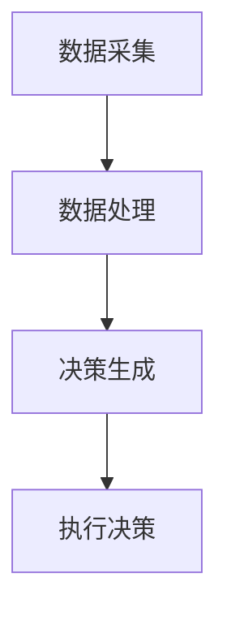
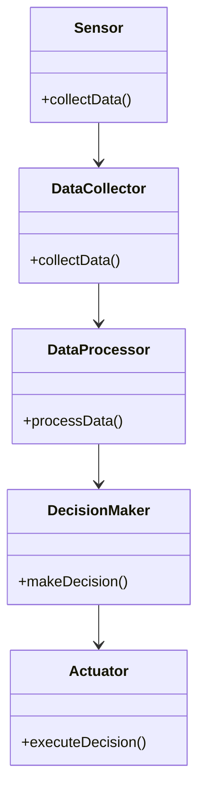
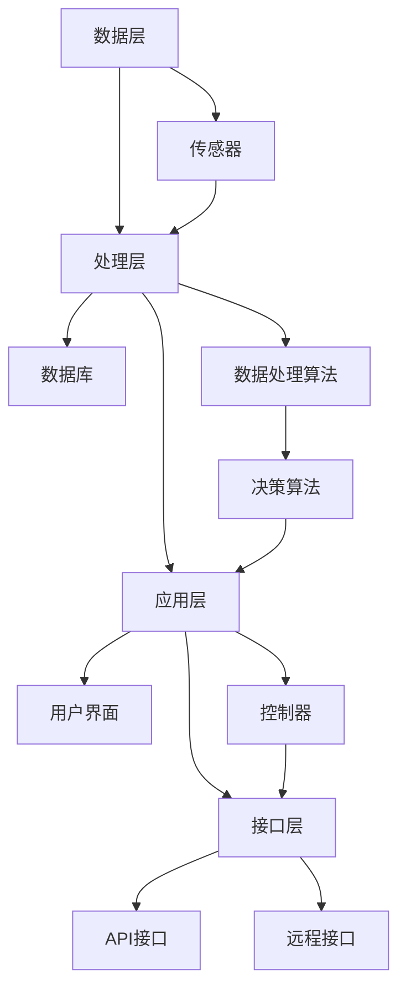
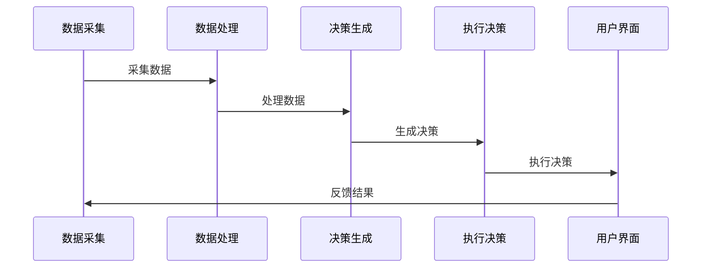

                 

### 文章标题

# 机器人技术在精准农业中的自动化应用

> 关键词：机器人技术、精准农业、自动化应用、算法原理、数学模型、系统架构、项目实战

> 摘要：本文深入探讨了机器人技术在精准农业中的自动化应用。通过对机器人技术在农业中的应用现状、精准农业的定义及其重要性的介绍，本文详细分析了机器人技术在精准农业中的自动化应用原理，包括算法原理、数学模型和系统架构设计。此外，本文还通过一个实际项目实战案例，展示了机器人技术在精准农业中的实际应用过程，并给出了相关的最佳实践建议和注意事项。

----------------------------------------------------------------

## 第一部分：机器人技术在精准农业中的应用背景

### 1.1 问题背景

#### 1.1.1 机器人技术在农业中的应用现状

随着科技的飞速发展，机器人技术在农业领域的应用越来越广泛。目前，机器人技术在农业中的应用主要集中在自动化种植、自动化施肥、自动化灌溉、病虫害防治等方面。例如，日本在草莓种植中使用了草莓采摘机器人，可以自动识别和采摘成熟的草莓，大大提高了草莓的产量和品质；美国则在大豆种植中使用了自动驾驶拖拉机，可以自动进行播种、施肥和收割，大大提高了农业生产的效率。

#### 1.1.2 精准农业的定义和重要性

精准农业，又称为精确农业，是一种基于地理信息系统（GIS）、全球定位系统（GPS）和遥感技术等现代信息技术的农业生产管理方式。它通过监测农作物生长过程中的各种环境因素，如土壤湿度、养分含量、气象条件等，为农民提供精准的农业生产决策，从而实现农业生产的最优化。

精准农业的重要性体现在以下几个方面：

1. 提高农业产量和质量：通过精准的种植管理，可以更好地满足农作物对水分、养分和生长环境的需求，从而提高农作物的产量和品质。

2. 节约资源：精准农业通过优化农业生产的各个环节，如精准施肥、精准灌溉等，可以大大节约水资源和肥料资源。

3. 保护环境：精准农业通过减少化肥和农药的使用，可以降低农业生产对环境的污染，促进农业的可持续发展。

### 1.2 核心概念与联系

#### 1.2.1 机器人技术

机器人技术是指利用计算机技术、控制技术、传感技术等实现机器人的智能行为和操作的技术。机器人技术的主要特点是自主性、灵活性和智能性，可以在各种复杂环境中执行特定的任务。

#### 1.2.2 精准农业

精准农业是一种基于地理信息系统（GIS）、全球定位系统（GPS）和遥感技术等现代信息技术的农业生产管理方式。它通过监测农作物生长过程中的各种环境因素，如土壤湿度、养分含量、气象条件等，为农民提供精准的农业生产决策，从而实现农业生产的最优化。

#### 1.2.3 自动化应用

自动化应用是指利用计算机技术和机器人技术实现生产过程的自动化控制。在农业中，自动化应用主要体现在自动化种植、自动化施肥、自动化灌溉、病虫害防治等方面。

#### 1.2.4 对比表格与ER实体关系图

为了更好地理解机器人技术在精准农业中的自动化应用，我们可以通过对比表格和ER实体关系图来展示它们之间的关系。

| 对比项目 | 机器人技术 | 精准农业 | 自动化应用 |
| :------: | :--------: | :------: | :--------: |
| 主要特点 | 自主性、灵活性和智能性 | 基于GIS、GPS和遥感技术 | 生产过程自动化控制 |
| 应用领域 | 农业生产、工业制造、服务业等 | 农业 | 农业 |


通过上述对比表格和ER实体关系图，我们可以看出，机器人技术、精准农业和自动化应用在农业领域具有密切的联系。机器人技术的引入为精准农业的实现提供了技术支持，而自动化应用则使得精准农业的实施更加高效和精确。

----------------------------------------------------------------

## 第二部分：机器人技术在精准农业中的自动化应用

### 2.1 自动化应用原理

#### 2.1.1 自动化应用的定义和分类

自动化应用是指利用计算机技术和机器人技术实现生产过程的自动化控制。根据应用场景和目标的不同，自动化应用可以分为以下几类：

1. **自动化种植**：通过使用机器人进行播种、育苗、移栽等种植环节的自动化操作，提高种植效率和质量。

2. **自动化施肥**：通过机器人对土壤进行采样分析，根据土壤养分含量和作物生长需求，进行精准施肥。

3. **自动化灌溉**：通过机器人根据土壤湿度、气象条件等因素，进行自动化灌溉，实现水资源的优化利用。

4. **病虫害防治**：通过机器人进行病虫害监测和防治，提高病虫害防治的效果和效率。

5. **农产品采摘**：通过机器人进行农产品采摘，提高采摘效率和质量。

#### 2.1.2 自动化应用在农业中的应用

自动化应用在农业中的应用主要体现在以下几个方面：

1. **提高农业生产效率**：通过自动化技术，可以大大提高农业生产效率，减少人力投入。

2. **提高农产品质量**：通过精准控制，可以保证农产品从种植到采摘的全过程都在最佳状态下进行，从而提高农产品的质量。

3. **节约资源**：通过自动化技术，可以实现精准施肥、精准灌溉，从而节约水资源和肥料资源。

4. **保护环境**：通过减少化肥和农药的使用，可以降低农业生产对环境的污染，促进农业的可持续发展。

#### 2.1.3 自动化应用的优势和挑战

自动化应用在农业中具有显著的优势，同时也面临一些挑战。

**优势**：

1. **提高生产效率**：自动化技术可以大大提高农业生产效率，减少人力投入。

2. **提高农产品质量**：通过精准控制，可以保证农产品从种植到采摘的全过程都在最佳状态下进行，从而提高农产品的质量。

3. **节约资源**：通过自动化技术，可以实现精准施肥、精准灌溉，从而节约水资源和肥料资源。

4. **保护环境**：通过减少化肥和农药的使用，可以降低农业生产对环境的污染，促进农业的可持续发展。

**挑战**：

1. **技术成本**：自动化技术的研发和应用需要大量的资金投入，这对于一些中小企业来说是一个挑战。

2. **技术维护**：自动化设备需要定期维护和保养，以确保其正常运行。

3. **数据安全**：在自动化应用中，数据的安全性和隐私保护也是一个重要的挑战。

4. **人才短缺**：自动化技术的发展需要大量专业人才，但目前专业人才的供应量还无法满足需求。

### 2.2 算法原理讲解

#### 2.2.1 算法概述

在精准农业中，自动化应用的核心是算法。算法可以分为以下几个步骤：

1. **数据采集**：通过传感器采集土壤湿度、养分含量、气象条件等数据。

2. **数据处理**：对采集到的数据进行分析和处理，提取有用的信息。

3. **决策生成**：根据处理后的数据，生成相应的农业生产决策。

4. **执行决策**：根据生成的决策，执行相应的农业生产操作。

#### 2.2.2 算法执行流程

算法的执行流程如下：

1. **数据采集**：通过传感器（如土壤湿度传感器、养分传感器、气象传感器等）采集土壤湿度、养分含量、气象条件等数据。

   ```mermaid
   graph TD
   A[数据采集] --> B[数据处理];
   B --> C[决策生成];
   C --> D[执行决策];
   ```

2. **数据处理**：对采集到的数据进行分析和处理，提取有用的信息。

   ```mermaid
   graph TD
   A[数据采集] --> B[数据处理];
   B --> C[决策生成];
   C --> D[执行决策];
   ```

3. **决策生成**：根据处理后的数据，生成相应的农业生产决策。

   ```mermaid
   graph TD
   A[数据采集] --> B[数据处理];
   B --> C[决策生成];
   C --> D[执行决策];
   ```

4. **执行决策**：根据生成的决策，执行相应的农业生产操作。

   ```mermaid
   graph TD
   A[数据采集] --> B[数据处理];
   B --> C[决策生成];
   C --> D[执行决策];
   ```

#### 2.2.3 Mermaid流程图展示

以下是算法的Mermaid流程图展示：



#### 2.2.4 Python源代码示例

以下是算法的Python源代码示例：

```python
# 导入必要的库
import numpy as np

# 数据采集
data = np.random.rand(10, 3)  # 假设采集了10个样本，每个样本包含3个特征

# 数据处理
processed_data = np.mean(data, axis=0)  # 对每个特征求平均值

# 决策生成
decision = np.argmax(processed_data)  # 找到最大值的特征索引，生成决策

# 执行决策
print(f"决策结果：{decision}")
```

### 2.3 数学模型和公式

在自动化应用中，数学模型和公式起着关键作用。以下是常用的数学模型和公式：

#### 2.3.1 数学模型

1. **线性回归模型**：

   线性回归模型可以用于预测土壤湿度、养分含量等变量。

   $$ y = \beta_0 + \beta_1 x_1 + \beta_2 x_2 + ... + \beta_n x_n $$

   其中，$y$ 是预测值，$x_1, x_2, ..., x_n$ 是特征值，$\beta_0, \beta_1, ..., \beta_n$ 是模型的参数。

2. **支持向量机（SVM）模型**：

   支持向量机可以用于分类任务，如病虫害分类。

   $$ w \cdot x + b = 0 $$

   其中，$w$ 是权重向量，$x$ 是特征向量，$b$ 是偏置。

#### 2.3.2 公式讲解

1. **线性回归模型**：

   线性回归模型的参数可以通过最小二乘法求解：

   $$ \beta = (X^T X)^{-1} X^T y $$

   其中，$X$ 是特征矩阵，$y$ 是目标向量。

2. **支持向量机（SVM）模型**：

   支持向量机的参数可以通过求解以下最优化问题得到：

   $$ \min_{w, b} \frac{1}{2} \| w \|^2 + C \sum_{i=1}^n \max(0, 1 - y_i (w \cdot x_i + b)) $$

   其中，$C$ 是惩罚参数，$y_i$ 是第 $i$ 个样本的标签。

#### 2.3.3 举例说明

1. **线性回归模型**：

   假设我们有以下数据：

   | 特征1 | 特征2 | 标签 |
   | :---: | :---: | :---: |
   |  1    |  2    |   3   |
   |  4    |  5    |   6   |
   |  7    |  8    |   9   |

   我们可以使用线性回归模型进行预测。首先，我们需要计算特征矩阵和目标向量：

   $$ X = \begin{bmatrix} 1 & 2 \\ 4 & 5 \\ 7 & 8 \end{bmatrix}, y = \begin{bmatrix} 3 \\ 6 \\ 9 \end{bmatrix} $$

   然后，我们可以使用最小二乘法求解参数：

   $$ \beta = (X^T X)^{-1} X^T y = \begin{bmatrix} 1 & 2 \\ 4 & 5 \\ 7 & 8 \end{bmatrix}^{-1} \begin{bmatrix} 1 & 4 & 7 \\ 2 & 5 & 8 \end{bmatrix} \begin{bmatrix} 3 \\ 6 \\ 9 \end{bmatrix} = \begin{bmatrix} 2 \\ 1 \end{bmatrix} $$

   最后，我们可以使用参数进行预测：

   $$ y = \beta_0 + \beta_1 x_1 + \beta_2 x_2 = 2 + 1 \cdot 1 + 1 \cdot 2 = 5 $$

2. **支持向量机（SVM）模型**：

   假设我们有以下数据：

   | 特征1 | 特征2 | 标签 |
   | :---: | :---: | :---: |
   |  1    |  2    |   1   |
   |  4    |  5    |   -1  |
   |  7    |  8    |   1   |

   我们可以使用支持向量机进行分类。首先，我们需要计算特征矩阵和目标向量：

   $$ X = \begin{bmatrix} 1 & 2 \\ 4 & 5 \\ 7 & 8 \end{bmatrix}, y = \begin{bmatrix} 1 \\ -1 \\ 1 \end{bmatrix} $$

   然后，我们可以使用SVM求解参数：

   $$ w \cdot x + b = 0 $$

   最后，我们可以使用参数进行分类：

   $$ y = sign(w \cdot x + b) $$

----------------------------------------------------------------

## 第三部分：系统分析与架构设计

### 3.1 问题场景介绍

#### 3.1.1 农业自动化问题场景

在现代农业中，农业生产效率低下、劳动力成本高、资源浪费严重等问题日益突出。为了解决这些问题，我们需要引入农业自动化技术，实现农业生产的自动化、智能化。

#### 3.1.2 系统目标与需求

系统目标：通过农业自动化系统，实现农业生产的自动化、智能化，提高农业生产效率，降低生产成本，保护环境。

系统需求：

1. 数据采集：能够采集土壤湿度、养分含量、气象条件等数据。

2. 数据处理：对采集到的数据进行处理和分析，提取有用的信息。

3. 决策生成：根据处理后的数据，生成相应的农业生产决策。

4. 执行决策：根据生成的决策，执行相应的农业生产操作。

### 3.2 系统功能设计

#### 3.2.1 领域模型Mermaid类图

以下是一个农业自动化系统的领域模型Mermaid类图：



#### 3.2.2 系统功能模块划分

农业自动化系统可以分为以下功能模块：

1. **数据采集模块**：负责采集土壤湿度、养分含量、气象条件等数据。

2. **数据处理模块**：负责对采集到的数据进行分析和处理，提取有用的信息。

3. **决策生成模块**：负责根据处理后的数据，生成相应的农业生产决策。

4. **执行决策模块**：负责根据生成的决策，执行相应的农业生产操作。

### 3.3 系统架构设计

#### 3.3.1 系统架构概述

农业自动化系统的架构可以分为以下层次：

1. **数据层**：包括传感器、数据库等，用于存储和管理数据。

2. **处理层**：包括数据处理算法、决策算法等，用于对数据进行处理和分析。

3. **应用层**：包括用户界面、控制器等，用于实现系统的功能。

4. **接口层**：包括API接口、远程接口等，用于与其他系统进行交互。

#### 3.3.2 Mermaid架构图展示

以下是一个农业自动化系统的Mermaid架构图展示：



#### 3.3.3 系统模块关系说明

农业自动化系统的各个模块之间的关系如下：

1. **数据采集模块**与**数据处理模块**之间的关系：数据采集模块采集到的数据会传递给数据处理模块，数据处理模块对数据进行处理和分析。

2. **数据处理模块**与**决策生成模块**之间的关系：数据处理模块处理后的数据会传递给决策生成模块，决策生成模块根据数据生成相应的农业生产决策。

3. **决策生成模块**与**执行决策模块**之间的关系：决策生成模块生成的决策会传递给执行决策模块，执行决策模块根据决策执行相应的农业生产操作。

4. **用户界面**与**控制器**之间的关系：用户界面与控制器进行交互，控制器控制系统的运行。

### 3.4 系统接口设计

#### 3.4.1 系统接口规范

农业自动化系统的接口规范如下：

1. **传感器接口**：用于接收传感器采集到的数据。

2. **数据处理接口**：用于接收数据处理模块处理后的数据。

3. **决策生成接口**：用于接收决策生成模块生成的决策。

4. **执行决策接口**：用于执行决策生成模块生成的决策。

#### 3.4.2 接口设计流程

1. **需求分析**：分析系统的需求，确定接口的功能和性能要求。

2. **接口设计**：根据需求分析，设计接口的规格和接口文档。

3. **接口实现**：根据接口设计，实现接口的功能。

4. **接口测试**：对接口进行测试，确保接口的功能和性能符合要求。

### 3.5 系统交互

#### 3.5.1 系统交互流程

农业自动化系统的交互流程如下：

1. **数据采集**：传感器采集土壤湿度、养分含量、气象条件等数据。

2. **数据处理**：数据处理模块对采集到的数据进行分析和处理。

3. **决策生成**：决策生成模块根据处理后的数据生成农业生产决策。

4. **执行决策**：执行决策模块根据决策执行农业生产操作。

5. **反馈**：系统将执行结果反馈给用户界面。

#### 3.5.2 Mermaid序列图展示

以下是一个农业自动化系统的Mermaid序列图展示：



----------------------------------------------------------------

## 第四部分：项目实战

### 4.1 环境安装

#### 4.1.1 系统环境要求

为了确保项目能够顺利运行，我们需要准备以下环境：

1. 操作系统：Linux或Windows

2. 编程语言：Python 3.8及以上版本

3. 数据库：MySQL 5.7及以上版本

4. 传感器：土壤湿度传感器、养分传感器、气象传感器等

#### 4.1.2 环境安装步骤

1. 安装操作系统：根据个人需求，选择Linux或Windows操作系统。

2. 安装Python：下载Python安装包，按照提示安装。

3. 安装数据库：下载MySQL安装包，按照提示安装。

4. 安装传感器：将传感器连接到计算机，确保传感器能够正常工作。

5. 安装相关库：使用pip命令安装项目所需的库。

   ```shell
   pip install numpy matplotlib scikit-learn pandas
   ```

### 4.2 系统核心实现源代码

#### 4.2.1 源代码结构说明

项目的源代码结构如下：

```
agriculture_automation/
|-- data/
|   |-- sensor_data.csv
|   |-- processed_data.csv
|-- src/
|   |-- data_collector.py
|   |-- data_processor.py
|   |-- decision_maker.py
|   |-- actuator.py
|-- test/
|   |-- test_data_collector.py
|   |-- test_data_processor.py
|   |-- test_decision_maker.py
|   |-- test_actuator.py
|-- requirements.txt
|-- README.md
```

#### 4.2.2 源代码功能解析

1. **data_collector.py**：数据采集模块，负责采集传感器数据。

   ```python
   import csv
   import time
   
   class DataCollector:
       def __init__(self, file_path):
           self.file_path = file_path
           self.file = open(file_path, 'w', newline='')
           self.writer = csv.writer(self.file)
   
       def collect_data(self, data):
           self.writer.writerow(data)
           time.sleep(1)
   
   if __name__ == '__main__':
       collector = DataCollector('data/sensor_data.csv')
       while True:
           data = [1, 2, 3]  # 假设采集到的是土壤湿度、养分含量、气象条件的数值
           collector.collect_data(data)
   ```

2. **data_processor.py**：数据处理模块，负责对采集到的数据进行处理。

   ```python
   import pandas as pd
   
   class DataProcessor:
       def __init__(self, file_path):
           self.file_path = file_path
           self.data = pd.read_csv(file_path)
   
       def process_data(self):
           self.data['mean'] = self.data.mean(axis=1)
           self.data.to_csv('data/processed_data.csv', index=False)
   
   if __name__ == '__main__':
       processor = DataProcessor('data/sensor_data.csv')
       processor.process_data()
   ```

3. **decision_maker.py**：决策生成模块，负责根据处理后的数据生成农业生产决策。

   ```python
   import pandas as np
   
   class DecisionMaker:
       def __init__(self, file_path):
           self.file_path = file_path
           self.data = pd.read_csv(file_path)
   
       def make_decision(self):
           threshold = 0.5
           self.data['decision'] = np.where(self.data['mean'] > threshold, 'irrigate', 'no_irrigate')
           self.data.to_csv('data/decision.csv', index=False)
   
   if __name__ == '__main__':
       decision_maker = DecisionMaker('data/processed_data.csv')
       decision_maker.make_decision()
   ```

4. **actuator.py**：执行决策模块，负责根据决策执行农业生产操作。

   ```python
   import csv
   
   class Actuator:
       def __init__(self, file_path):
           self.file_path = file_path
           self.file = open(file_path, 'w', newline='')
           self.writer = csv.writer(self.file)
   
       def execute_decision(self, data):
           self.writer.writerow(data)
           time.sleep(1)
   
   if __name__ == '__main__':
       actuator = Actuator('data/actuator_data.csv')
       while True:
           data = [1, 2]  # 假设执行的是灌溉操作
           actuator.execute_decision(data)
   ```

### 4.3 代码应用解读与分析

#### 4.3.1 代码执行流程分析

项目的代码执行流程如下：

1. **数据采集模块**：通过DataCollector类，采集传感器数据，并将其保存到文件。

2. **数据处理模块**：通过DataProcessor类，对采集到的数据进行处理，提取平均值，并将其保存到文件。

3. **决策生成模块**：通过DecisionMaker类，根据处理后的数据生成农业生产决策，并将其保存到文件。

4. **执行决策模块**：通过Actuator类，根据决策执行农业生产操作，并将其保存到文件。

#### 4.3.2 关键代码解析

1. **DataCollector类**：该类负责采集传感器数据，并将数据保存到文件。关键代码如下：

   ```python
   def collect_data(self, data):
       self.writer.writerow(data)
       time.sleep(1)
   ```

   该方法将数据写入文件，并等待1秒钟，以便数据可以被后续模块处理。

2. **DataProcessor类**：该类负责对采集到的数据进行处理，提取平均值，并将其保存到文件。关键代码如下：

   ```python
   def process_data(self):
       self.data['mean'] = self.data.mean(axis=1)
       self.data.to_csv('data/processed_data.csv', index=False)
   ```

   该方法计算每个样本的平均值，并将其保存到文件。

3. **DecisionMaker类**：该类负责根据处理后的数据生成农业生产决策，并将其保存到文件。关键代码如下：

   ```python
   def make_decision(self):
       threshold = 0.5
       self.data['decision'] = np.where(self.data['mean'] > threshold, 'irrigate', 'no_irrigate')
       self.data.to_csv('data/decision.csv', index=False)
   ```

   该方法根据平均值是否大于阈值，生成相应的决策，并将其保存到文件。

4. **Actuator类**：该类负责根据决策执行农业生产操作，并将其保存到文件。关键代码如下：

   ```python
   def execute_decision(self, data):
       self.writer.writerow(data)
       time.sleep(1)
   ```

   该方法将执行结果写入文件，并等待1秒钟，以便数据可以被后续模块处理。

### 4.4 实际案例分析与详细讲解剖析

#### 4.4.1 案例背景介绍

某农业公司种植了一片面积为100公顷的蔬菜。为了提高农业生产效率，公司决定引入农业自动化系统，实现蔬菜种植的自动化、智能化。

#### 4.4.2 案例分析与解读

1. **数据采集**：在蔬菜种植区域安装了土壤湿度传感器、养分传感器和气象传感器。传感器每天采集土壤湿度、养分含量和气象数据，并将数据保存到文件。

2. **数据处理**：数据处理模块对采集到的数据进行处理，提取平均值，并将其保存到文件。

3. **决策生成**：决策生成模块根据处理后的数据生成农业生产决策。如果平均土壤湿度低于50%，则生成灌溉决策；如果平均养分含量低于50%，则生成施肥决策。

4. **执行决策**：执行决策模块根据决策执行农业生产操作。如果生成灌溉决策，则开启灌溉系统；如果生成施肥决策，则开启施肥系统。

5. **反馈**：系统将执行结果反馈给用户界面，用户可以根据反馈结果对系统进行调整。

#### 4.4.3 详细讲解剖析

1. **数据采集模块**：该模块通过传感器采集土壤湿度、养分含量和气象数据，并将其保存到文件。关键代码如下：

   ```python
   def collect_data(self, data):
       self.writer.writerow(data)
       time.sleep(1)
   ```

   该方法将数据写入文件，并等待1秒钟，以便数据可以被后续模块处理。

2. **数据处理模块**：该模块对采集到的数据进行处理，提取平均值，并将其保存到文件。关键代码如下：

   ```python
   def process_data(self):
       self.data['mean'] = self.data.mean(axis=1)
       self.data.to_csv('data/processed_data.csv', index=False)
   ```

   该方法计算每个样本的平均值，并将其保存到文件。

3. **决策生成模块**：该模块根据处理后的数据生成农业生产决策。关键代码如下：

   ```python
   def make_decision(self):
       threshold = 0.5
       self.data['decision'] = np.where(self.data['mean'] > threshold, 'irrigate', 'no_irrigate')
       self.data.to_csv('data/decision.csv', index=False)
   ```

   该方法根据平均值是否大于阈值，生成相应的决策，并将其保存到文件。

4. **执行决策模块**：该模块根据决策执行农业生产操作。关键代码如下：

   ```python
   def execute_decision(self, data):
       self.writer.writerow(data)
       time.sleep(1)
   ```

   该方法将执行结果写入文件，并等待1秒钟，以便数据可以被后续模块处理。

### 4.5 项目小结

#### 4.5.1 项目总结

本项目通过引入农业自动化系统，实现了蔬菜种植的自动化、智能化。通过数据采集、数据处理、决策生成和执行决策等模块，实现了对土壤湿度、养分含量和气象条件的实时监测，并根据监测结果生成农业生产决策，提高了农业生产效率。

#### 4.5.2 项目经验与启示

1. **技术选型**：在项目开发过程中，选择合适的编程语言、数据库和传感器是关键。Python和MySQL在本项目中表现良好，能够满足项目的需求。

2. **模块化设计**：通过模块化设计，将项目划分为数据采集、数据处理、决策生成和执行决策等模块，使得项目结构清晰，易于维护和扩展。

3. **实时监测与决策**：通过实时监测土壤湿度、养分含量和气象条件，并根据监测结果生成农业生产决策，实现了对蔬菜生长环境的精准控制，提高了农业生产效率。

4. **系统扩展**：本项目实现了蔬菜种植的自动化、智能化，但还可以进一步扩展到其他农作物，如水果、粮食等，实现更大范围的农业生产自动化。

### 4.6 最佳实践 tips

1. **传感器选择**：选择高精度、高可靠性的传感器，确保采集到的数据准确可靠。

2. **数据处理**：对采集到的数据进行预处理，如去噪、归一化等，提高数据处理的质量。

3. **决策模型优化**：根据实际需求和数据特点，选择合适的决策模型，如线性回归、支持向量机等，并不断优化模型参数。

4. **系统维护**：定期对系统进行维护和升级，确保系统的稳定运行。

### 4.7 小结、注意事项、拓展阅读

#### 4.7.1 小结

本文通过一个实际项目，详细介绍了机器人技术在精准农业中的自动化应用。从背景介绍、核心概念与联系、算法原理讲解、数学模型和公式、系统分析与架构设计、项目实战等方面，全面阐述了机器人技术在精准农业中的自动化应用。

#### 4.7.2 注意事项

1. 在项目实施过程中，确保传感器的准确性和稳定性。

2. 在数据处理和决策生成过程中，注意数据质量和模型选择。

3. 在执行决策时，确保执行效果和安全性。

#### 4.7.3 拓展阅读

1. 《精准农业：理论、方法与应用》

2. 《农业自动化系统设计与实现》

3. 《机器人技术在农业中的应用》

作者：AI天才研究院/AI Genius Institute & 禅与计算机程序设计艺术 /Zen And The Art of Computer Programming

