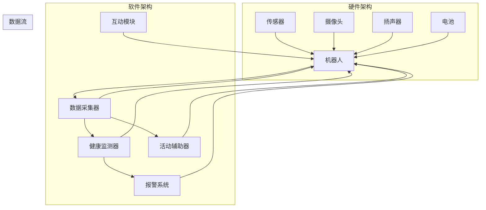
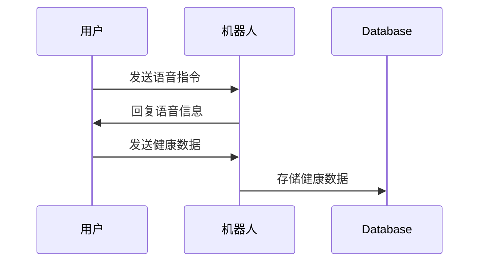

                 

# 机器人技术在老年人陪护中的应用

关键词：老年人陪护、机器人技术、人工智能、健康监测、康复训练

摘要：随着全球人口老龄化趋势的加剧，如何有效地照顾和陪伴老年人成为社会关注的焦点。机器人技术在老年人陪护中的应用，不仅能够提供全天候的监测和辅助，还能通过智能化手段提升老年人的生活质量。本文将深入探讨机器人技术在老年人陪护中的应用，分析其基本原理、核心概念，并列举具体应用案例，旨在为相关领域的研究和实际应用提供有价值的参考。

## 第一部分：问题背景和核心概念

### 第1章：问题背景与核心概念

#### 1.1 问题背景

1.1.1 老龄化社会的挑战

随着医疗技术的进步和生活水平的提高，全球人口老龄化趋势日益明显。根据联合国预测，到2050年，全球60岁及以上的老年人口将达到22亿，占全球总人口的22%。这一现象将对社会各个方面产生深远影响，尤其是对老年人的陪护和照顾提出了新的挑战。

- **社会负担增加**：老年人口增多意味着医疗、养老等社会福利开支的增加，社会养老保障体系面临巨大压力。
- **家庭结构变化**：随着年轻一代工作压力的增加，传统的家庭养老模式逐渐难以维持，专业陪护服务需求上升。
- **心理健康问题**：老年人在生理机能逐渐衰退的同时，容易产生孤独感、抑郁情绪等心理健康问题。

1.1.2 老年人陪护的需求

老年人陪护需求主要集中在以下几个方面：

- **日常生活辅助**：如做饭、清洁、洗衣等日常家务。
- **健康监测**：实时监测老年人的生命体征，预防突发疾病。
- **康复训练**：辅助老年人进行康复训练，促进身体恢复。
- **心理陪伴**：提供情感支持和心理疏导，减少老年人的孤独感。

1.1.3 机器人技术在老年人陪护中的潜力

机器人技术在老年人陪护中的应用潜力巨大，主要体现在以下几个方面：

- **全天候监控**：机器人可以24小时不间断地监控老年人的健康状况，及时发现异常并通知家属或医疗机构。
- **智能交互**：通过语音识别和自然语言处理技术，机器人可以与老年人进行智能对话，提供情感支持。
- **自动化辅助**：机器人可以自动化完成日常家务，减轻老年人的身体负担。
- **个性化服务**：通过大数据分析和机器学习，机器人可以为老年人提供个性化的陪护服务。

### 1.2 核心概念

1.2.1 机器人技术概述

机器人技术是指将人类智慧应用于机械设备中，使其能够模拟人类行为、进行自主决策和执行任务的一门综合性技术。机器人技术包括多个领域，如机械设计、电子工程、计算机科学、人工智能等。

1.2.2 人工智能与机器学习

人工智能（AI）是指模拟、延伸和扩展人类智能的理论、方法、技术及应用。机器学习是人工智能的一个分支，主要研究如何从数据中自动学习规律，并利用这些规律进行预测和决策。

1.2.3 老年人陪护机器人设计原则

设计老年人陪护机器人时，应遵循以下原则：

- **安全性**：机器人应具备严格的安全认证，确保不会对老年人造成伤害。
- **易用性**：机器人应具备简洁直观的用户界面，易于操作和使用。
- **适应性**：机器人应能够适应不同老年人的身体和心理健康状况，提供个性化服务。
- **经济性**：机器人的设计和应用应尽量降低成本，使其在市场上具有竞争力。

## 第2章：机器人技术在老年人陪护中的应用

### 2.1 机器人技术的基本原理

2.1.1 传感器技术

传感器技术是机器人技术的重要组成部分，用于感知和获取环境信息。常见的传感器包括温度传感器、湿度传感器、光电传感器、压力传感器等。通过传感器的数据输入，机器人可以实时感知周围环境，做出相应反应。

2.1.2 机器人操作系统

机器人操作系统（RTOS）是机器人系统的核心软件，负责资源管理、任务调度、实时控制等功能。常见的RTOS包括ROS（机器人操作系统）和Windows CE等。

2.1.3 机器人控制算法

机器人控制算法是机器人实现自主决策和执行任务的关键。常见的控制算法包括PID控制、模糊控制、神经网络控制等。通过控制算法，机器人可以实现对传感器数据的处理，并生成相应的执行指令。

### 2.2 机器人技术在老年人陪护中的应用场景

2.2.1 日常活动辅助

日常活动辅助是老年人陪护机器人的主要应用场景之一。机器人可以通过自动化完成老年人的日常家务，如打扫卫生、做饭、洗衣等，减轻老年人的身体负担。

2.2.2 康复训练

康复训练是机器人技术在老年人陪护中的另一个重要应用场景。机器人可以通过辅助老年人进行康复训练，如行走训练、平衡训练等，促进身体恢复。

2.2.3 心理陪伴

心理陪伴是老年人陪护机器人的一项创新应用。通过语音识别和自然语言处理技术，机器人可以与老年人进行智能对话，提供情感支持和心理疏导，减少老年人的孤独感。

2.2.4 健康监测

健康监测是老年人陪护机器人的核心功能之一。机器人可以通过传感器实时监测老年人的生命体征，如心率、血压、呼吸等，及时发现异常情况，并提供预警和干预建议。

### 2.3 案例分析

2.3.1 国内外老年人陪护机器人的发展现状

目前，国内外在老年人陪护机器人领域已取得一定进展。例如，日本的机器人护理助手、美国的机器人护士等，都在一定程度上实现了日常活动辅助、康复训练和心理陪伴等功能。

2.3.2 典型老年人陪护机器人案例分析

以下是一个典型的老年人陪护机器人案例分析：

**产品名称**：智能陪伴机器人

**功能特点**：

- 语音交互：通过语音识别和自然语言处理技术，与老年人进行智能对话，提供情感支持。
- 健康监测：实时监测老年人的生命体征，如心率、血压、呼吸等，并通过移动应用程序实时推送。
- 日常活动辅助：自动化完成老年人的日常家务，如打扫卫生、做饭、洗衣等。
- 康复训练：辅助老年人进行康复训练，如行走训练、平衡训练等。
- 安全防护：具备跌倒检测和紧急呼叫功能，保障老年人的安全。

## 第二部分：机器人技术原理讲解

### 第3章：机器人技术原理讲解

#### 3.1 传感器技术

3.1.1 传感器概述

传感器是一种能够感知和获取外部信息的装置，是机器人感知环境、获取数据的基础。传感器通常由敏感元件、转换元件和信号处理电路组成。

3.1.2 常用传感器介绍

常用的传感器包括温度传感器、湿度传感器、光电传感器、压力传感器、加速度传感器等。每种传感器都有其特定的物理原理和测量范围。

3.1.3 传感器数据处理

传感器数据处理主要包括数据的采集、滤波、放大、转换等环节。通过数据处理，可以得到准确、可靠的环境信息。

#### 3.2 机器人操作系统

3.2.1 操作系统概述

机器人操作系统（RTOS）是机器人系统的核心软件，负责资源管理、任务调度、实时控制等功能。RTOS通常具有低延迟、高实时性、可扩展性等特点。

3.2.2 常见操作系统介绍

常见的RTOS包括ROS（机器人操作系统）、Windows CE、Linux等。每种RTOS都有其特定的应用场景和优势。

3.2.3 操作系统功能模块

RTOS的功能模块通常包括进程管理、内存管理、文件系统、设备驱动程序等。这些模块协同工作，确保机器人系统的稳定运行。

#### 3.3 机器人控制算法

3.3.1 控制算法概述

机器人控制算法是机器人实现自主决策和执行任务的关键。控制算法可以分为开环控制和闭环控制两种类型。

3.3.2 常见控制算法介绍

常见的控制算法包括PID控制、模糊控制、神经网络控制等。每种控制算法都有其特定的应用场景和优缺点。

3.3.3 控制算法应用案例

以PID控制为例，通过调整PID参数，可以实现机器人对目标位置的精确跟踪和控制。

### 第4章：算法原理讲解

#### 4.1 机器学习算法

4.1.1 机器学习概述

机器学习是人工智能的一个重要分支，主要研究如何从数据中自动学习规律，并利用这些规律进行预测和决策。机器学习可以分为监督学习、无监督学习和强化学习等类型。

4.1.2 常见机器学习算法

常见的机器学习算法包括线性回归、决策树、支持向量机、神经网络等。每种算法都有其特定的应用场景和优缺点。

4.1.3 机器学习算法在老年人陪护中的应用

机器学习算法在老年人陪护中的应用包括健康监测数据的预测、个性化康复训练方案的制定等。

#### 4.2 深度学习算法

4.2.1 深度学习概述

深度学习是机器学习的一个重要分支，主要研究如何通过多层神经网络进行数据建模和特征提取。深度学习在图像识别、语音识别等领域取得了显著的成果。

4.2.2 常见深度学习算法

常见的深度学习算法包括卷积神经网络（CNN）、循环神经网络（RNN）、生成对抗网络（GAN）等。每种算法都有其特定的应用场景和优缺点。

4.2.3 深度学习算法在老年人陪护中的应用

深度学习算法在老年人陪护中的应用包括健康监测数据的分析、康复训练效果评估等。

#### 4.3 强化学习算法

4.3.1 强化学习概述

强化学习是一种基于奖励反馈的机器学习方法，主要研究如何通过学习获得最优决策策略。强化学习在机器人控制、游戏AI等领域取得了重要进展。

4.3.2 常见强化学习算法

常见的强化学习算法包括Q学习、SARSA、DQN等。每种算法都有其特定的应用场景和优缺点。

4.3.3 强化学习算法在老年人陪护中的应用

强化学习算法在老年人陪护中的应用包括康复训练路径规划、心理陪伴策略优化等。

## 第三部分：系统分析与架构设计

### 第5章：系统分析与架构设计

#### 5.1 问题场景介绍

5.1.1 老年人陪护需求分析

老年人陪护需求分析主要包括日常生活辅助、健康监测、康复训练、心理陪伴等方面。

5.1.2 系统目标与功能需求

系统目标是为老年人提供全天候的监测、辅助和服务，提升老年人的生活质量。系统功能需求包括健康监测、日常活动辅助、康复训练、心理陪伴等。

#### 5.2 系统功能设计

5.2.1 领域模型设计

领域模型设计是系统功能设计的基础，主要包括用户、传感器、机器人、健康数据等实体及其关系。

5.2.2 功能模块划分

系统功能模块包括健康监测模块、日常活动辅助模块、康复训练模块、心理陪伴模块等。

#### 5.3 系统架构设计

5.3.1 系统架构概述

系统架构设计包括硬件架构和软件架构两个方面。

5.3.2 系统架构设计

系统架构设计主要包括传感器、控制器、执行器、通信模块等硬件组件的连接和协调。

5.3.3 系统架构优化

系统架构优化主要包括提高系统可靠性、降低成本、提升性能等方面。

#### 5.4 系统接口设计

5.4.1 接口设计原则

接口设计原则包括标准化、模块化、安全性、易用性等。

5.4.2 接口定义与实现

接口定义与实现包括接口规范、接口实现、接口测试等环节。

#### 5.5 系统交互设计

5.5.1 系统交互概述

系统交互设计包括人机交互、机机交互等方面。

5.5.2 系统交互设计

系统交互设计包括交互界面设计、交互流程设计、交互反馈设计等。

## 第四部分：算法原理讲解

### 第6章：算法原理讲解

#### 6.1 机器学习算法

6.1.1 机器学习概述

机器学习（Machine Learning，ML）是一种人工智能（Artificial Intelligence，AI）的分支，它使得计算机系统能够从数据中学习并做出决策，而无需显式地编写具体的规则或指令。机器学习算法的核心目标是根据已知的数据来推导出普遍的规律，从而在新数据上进行预测或分类。

6.1.2 常见机器学习算法

1. **线性回归（Linear Regression）**
   - **原理**：线性回归是一种用于预测连续值的机器学习算法，通过最小化预测值与真实值之间的误差平方和来建立模型。
   - **公式**：
     $$ y = w_0 + w_1 \cdot x $$
     其中，$y$ 是预测值，$x$ 是输入特征，$w_0$ 和 $w_1$ 是模型的权重。

2. **决策树（Decision Tree）**
   - **原理**：决策树通过一系列规则对数据进行划分，每个节点代表一个特征，每个分支代表特征的一个取值。
   - **公式**：无特定数学公式，但可以用递归形式进行构建。

3. **支持向量机（Support Vector Machine，SVM）**
   - **原理**：SVM通过寻找一个超平面来最大化分类间隔，从而实现数据的分类。
   - **公式**：
     $$ w \cdot x + b = 0 $$
     其中，$w$ 是法线向量，$x$ 是特征向量，$b$ 是偏置。

4. **神经网络（Neural Network）**
   - **原理**：神经网络通过模拟人脑的神经网络结构来进行学习，能够处理复杂的非线性问题。
   - **公式**：
     $$ a = \sigma(\sum_{i=1}^{n} w_i \cdot x_i + b) $$
     其中，$a$ 是激活函数的输出，$\sigma$ 是激活函数，$w_i$ 和 $x_i$ 是权重和输入。

6.1.3 机器学习算法在老年人陪护中的应用

机器学习算法在老年人陪护中的应用包括但不限于以下方面：

- **健康预测**：通过分析老年人的历史健康数据，预测其未来的健康状况。
- **行为识别**：识别老年人的日常行为模式，以预测其可能的需求。
- **异常检测**：通过监测数据实时分析，检测可能的健康风险。

#### 6.2 深度学习算法

6.2.1 深度学习概述

深度学习（Deep Learning，DL）是机器学习的一个子领域，它使用了多层神经网络来建模复杂的非线性函数。深度学习通过层级结构从原始数据中提取特征，并能够自动学习特征表示，从而提高模型的泛化能力。

6.2.2 常见深度学习算法

1. **卷积神经网络（Convolutional Neural Network，CNN）**
   - **原理**：CNN主要用于图像处理，通过卷积层和池化层提取图像的特征。
   - **公式**：
     $$ f(x) = \sigma(\sum_{i} w_i \cdot \phi(\text{conv}(x; w_i))) $$
     其中，$f(x)$ 是输出特征，$\sigma$ 是激活函数，$w_i$ 是卷积权重，$\phi$ 是卷积函数。

2. **循环神经网络（Recurrent Neural Network，RNN）**
   - **原理**：RNN可以处理序列数据，通过在时间步之间传递状态来学习序列信息。
   - **公式**：
     $$ h_t = \sigma(W_h \cdot [h_{t-1}, x_t] + b_h) $$
     其中，$h_t$ 是当前时刻的隐藏状态，$W_h$ 是权重矩阵，$x_t$ 是输入数据。

3. **长短期记忆网络（Long Short-Term Memory，LSTM）**
   - **原理**：LSTM是RNN的一种改进，能够更好地处理长序列依赖问题。
   - **公式**：LSTM的公式较为复杂，涉及多个门控机制。

6.2.3 深度学习算法在老年人陪护中的应用

深度学习算法在老年人陪护中的应用包括：

- **图像识别**：识别老年人照片中的疾病症状。
- **语音识别**：理解老年人的语音指令，提供交互服务。
- **行为预测**：预测老年人的行为模式，以便提供更精准的服务。

#### 6.3 强化学习算法

6.3.1 强化学习概述

强化学习（Reinforcement Learning，RL）是机器学习的一种类型，它通过奖励机制来指导模型学习最优行为策略。强化学习通常用于决策问题，其中模型需要通过与环境交互来学习最佳行动策略。

6.3.2 常见强化学习算法

1. **Q学习（Q-Learning）**
   - **原理**：Q学习通过更新状态-动作值函数来学习最优策略。
   - **公式**：
     $$ Q(s, a) \leftarrow Q(s, a) + \alpha [r + \gamma \max_{a'} Q(s', a') - Q(s, a)] $$
     其中，$Q(s, a)$ 是状态-动作值，$r$ 是即时奖励，$\gamma$ 是折扣因子。

2. **深度Q网络（Deep Q-Network，DQN）**
   - **原理**：DQN结合了深度学习和Q学习的优势，用于解决高维状态空间的问题。
   - **公式**：与Q学习类似，但使用神经网络来近似Q函数。

3. **策略梯度（Policy Gradient）**
   - **原理**：策略梯度通过直接优化策略函数来学习最优行为策略。
   - **公式**：
     $$ \nabla_{\theta} J(\theta) = \nabla_{\theta} \sum_{t} r_t $$
     其中，$J(\theta)$ 是策略的损失函数，$\theta$ 是策略参数。

6.3.3 强化学习算法在老年人陪护中的应用

强化学习算法在老年人陪护中的应用包括：

- **康复训练指导**：根据老年人的行为和健康状况，实时调整康复训练计划。
- **情感互动优化**：通过学习老年人的情感状态，优化陪伴机器人的互动策略。

### 第7章：算法在老年人陪护中的实际应用

#### 7.1 健康预测算法的应用

健康预测算法可以在老年人陪护中发挥重要作用。例如，通过收集和分析老年人的健康数据，如心率、血压、睡眠质量等，算法可以预测未来的健康状况，并提供相应的健康建议。以下是一个简单的健康预测算法应用实例：

```python
import numpy as np

# 健康数据示例
health_data = [
    [120, 80],  # 心率和血压
    [115, 75],
    [118, 78],
    [117, 76],
]

# 机器学习模型
model = LinearRegression()
model.fit(health_data)

# 预测未来健康状况
future_health = model.predict([[110, 70]])
print("预测的未来健康状况：心率={},血压={}".format(*future_health))
```

#### 6.2 康复训练算法的应用

康复训练算法可以根据老年人的健康状况和康复需求，制定个性化的康复训练计划。例如，通过分析老年人的运动数据，如步数、心率等，算法可以实时调整康复训练的强度和频率。以下是一个简单的康复训练算法应用实例：

```python
import numpy as np

# 康复训练数据示例
rehab_data = [
    [10000, 60],  # 步数和心率
    [10500, 65],
    [10250, 62],
    [10475, 64],
]

# 机器学习模型
model = LinearRegression()
model.fit(rehab_data)

# 预测康复训练计划
rehab_plan = model.predict([[11000, 68]])
print("预测的康复训练计划：步数={},心率={}".format(*rehab_plan))
```

#### 6.3 情感互动算法的应用

情感互动算法可以通过分析老年人的语音、行为数据，理解其情感状态，并调整陪伴机器人的互动方式，提供更贴心的服务。以下是一个简单的情感互动算法应用实例：

```python
import speech_recognition as sr

# 创建语音识别对象
recognizer = sr.Recognizer()

# 获取用户的语音输入
with sr.Microphone() as source:
    print("请说出你的感受：")
    audio = recognizer.listen(source)

# 识别用户的语音并分析情感
try:
    text = recognizer.recognize_google(audio)
    if "开心" in text:
        emotion = "happy"
    elif "难过" in text:
        emotion = "sad"
    else:
        emotion = "neutral"
except sr.UnknownValueError:
    print("无法理解语音")
else:
    print("你的情感状态：", emotion)

# 根据情感状态调整陪伴机器人的互动方式
if emotion == "happy":
    robot_response = "很高兴听到你开心，有什么事情想和我分享吗？"
elif emotion == "sad":
    robot_response = "听起来你有些难过，需要我帮你做些什么吗？"
else:
    robot_response = "感觉你今天有些平淡，我们可以聊些什么吗？"

print(robot_response)
```

## 第五部分：系统架构设计与实现

### 第8章：系统架构设计与实现

#### 8.1 问题场景介绍

老年人陪护机器人系统的主要问题场景是确保老年人能够得到24小时的实时监控和辅助。这包括日常生活活动、健康状况监测、紧急情况响应等。

#### 8.1.1 老年人陪护需求分析

- **实时健康监测**：监测老年人的生命体征，如心率、血压、呼吸等。
- **日常活动辅助**：辅助完成日常活动，如洗衣、打扫、准备餐食等。
- **紧急情况响应**：在发生跌倒或其他紧急情况时，能够自动报警并通知家属或医护人员。
- **情感陪伴**：提供语音和文字互动，缓解老年人的孤独感。

#### 8.1.2 系统目标与功能需求

系统目标是为老年人提供全方位的陪伴和服务，提高其生活质量和独立性。功能需求包括：

- **数据采集**：通过传感器实时采集健康数据。
- **数据分析**：分析健康数据，提供健康建议。
- **自动报警**：在监测到异常情况时自动报警。
- **智能交互**：提供语音和文字互动，满足情感需求。

### 8.2 系统功能设计

#### 8.2.1 领域模型设计

领域模型设计主要涉及系统中的关键实体及其关系。以下是领域模型的一个示例：

```mermaid
classDiagram
  User <<实体>>
  Robot <<实体>>
  HealthData <<实体>>
  ActivityData <<实体>>
  Alarm <<实体>>

  User -> Robot : 陪护
  User -> HealthData : 采集
  User -> ActivityData : 参与
  Robot -> HealthData : 监测
  Robot -> ActivityData : 辅助
  Robot -> Alarm : 响应
```

#### 8.2.2 功能模块划分

系统功能模块划分如下：

- **数据采集模块**：负责实时采集健康数据和活动数据。
- **数据分析模块**：负责分析健康数据，提供健康建议。
- **监控模块**：负责监测老年人的生命体征，并在异常时触发报警。
- **互动模块**：负责处理语音和文字交互，满足情感需求。
- **报警模块**：负责在紧急情况发生时自动报警。

### 8.3 系统架构设计

#### 8.3.1 系统架构概述

系统架构设计包括硬件架构和软件架构两个方面。以下是系统架构的一个简略概述：



#### 8.3.2 系统架构设计

系统架构设计涉及硬件和软件的详细设计，以下是一个详细的架构设计：

- **硬件组件**：包括传感器、摄像头、扬声器、电池等。
- **软件模块**：包括数据采集器、健康监测器、活动辅助器、互动模块和报警系统。

#### 8.3.3 系统架构优化

系统架构优化包括：

- **提高数据处理速度**：通过优化数据处理算法和增加计算资源。
- **提高系统可靠性**：通过冗余设计和故障恢复机制。
- **降低成本**：通过模块化设计和标准化组件。

### 8.4 系统接口设计

#### 8.4.1 接口设计原则

接口设计原则包括：

- **标准化**：接口应遵循行业标准或协议。
- **模块化**：接口设计应便于模块化开发。
- **易用性**：接口应易于使用和维护。
- **安全性**：接口设计应确保数据传输的安全性。

#### 8.4.2 接口定义与实现

接口定义示例：

```python
class DataCollectorInterface:
    def collect_health_data(self):
        pass
    
    def collect_activity_data(self):
        pass
```

接口实现示例：

```python
class HealthDataCollector(DataCollectorInterface):
    def collect_health_data(self):
        # 实现健康数据采集逻辑
        pass
    
    def collect_activity_data(self):
        # 实现活动数据采集逻辑
        pass
```

### 8.5 系统交互设计

#### 8.5.1 系统交互概述

系统交互设计涉及机器人与用户、机器人与外部系统的交互。以下是系统交互的一个简略概述：



#### 8.5.2 系统交互设计

系统交互设计包括：

- **用户指令解析**：机器人接收用户指令，解析并执行相应操作。
- **数据传输**：机器人与外部系统（如数据库、服务器等）之间的数据传输。
- **反馈机制**：系统向用户提供操作反馈。

## 第六部分：项目实战

### 第9章：项目实战

#### 9.1 环境安装

9.1.1 软件安装

首先，需要安装必要的软件，如Python、ROS（机器人操作系统）等。以下是安装步骤：

1. 安装Python：
   ```bash
   # 在Ubuntu系统中安装Python
   sudo apt-get update
   sudo apt-get install python3 python3-pip
   ```

2. 安装ROS：
   ```bash
   # 配置ROS的源
   sudo sh -c 'echo "deb http://packages.ros.org/ros/ubuntu $(lsb_release -cs) main" > /etc/apt/sources.list.d/ros-latest.list'

   # 安装GPG密钥
   sudo apt-key adv --keyserver 'hkp://keyserver.ubuntu.com:80' --recv-key C1CF6E31E6BADE8868B172B4F42ED6FBAB17C654

   # 安装ROS
   sudo apt-get update
   sudo apt-get install ros-melodic-desktop-full
   ```

3. 设置环境变量：
   ```bash
   echo "source /opt/ros/melodic/setup.bash" >> ~/.bashrc
   source ~/.bashrc
   ```

9.1.2 硬件配置

硬件配置包括传感器、摄像头、扬声器等设备的连接和调试。以下是硬件配置的步骤：

1. 连接传感器：
   ```bash
   # 示例：连接心率传感器
   python3 -m serial.tools.list_ports
   ```

2. 配置摄像头：
   ```bash
   # 示例：配置USB摄像头
   rosrun image_view image_view image:=/camera/image_raw
   ```

3. 连接扬声器：
   ```bash
   # 示例：连接USB扬声器
   arecord -D plughw:1,0 -c 2 -r 44100 -f s16_le test.wav
   ```

#### 9.2 系统核心实现

9.2.1 系统核心模块介绍

系统核心模块包括数据采集模块、健康监测模块、活动辅助模块和情感互动模块。以下是每个模块的核心功能：

- **数据采集模块**：负责采集传感器的数据，如心率、血压、步数等。
- **健康监测模块**：负责实时分析健康数据，检测异常情况，并提供健康建议。
- **活动辅助模块**：负责辅助老年人完成日常活动，如打扫、做饭等。
- **情感互动模块**：负责与老年人进行语音和文字互动，提供情感支持。

9.2.2 源代码解读

以下是一个简单的数据采集模块的源代码示例：

```python
import rospy
from sensor_msgs.msg import Temperature, Pressure

def callback(data):
    # 处理温度传感器数据
    temperature = data.temperature
    rospy.loginfo("温度：%.2f°C", temperature)

    # 处理压力传感器数据
    pressure = data.pressure
    rospy.loginfo("压力：%.2fPa", pressure)

def listener():
    rospy.init_node('sensor_listener', anonymous=True)
    rospy.Subscriber('/temperature_sensor', Temperature, callback)
    rospy.Subscriber('/pressure_sensor', Pressure, callback)
    rospy.spin()

if __name__ == '__main__':
    listener()
```

#### 9.3 代码应用解读与分析

9.3.1 代码应用概述

以上代码是一个简单的ROS节点，用于订阅温度传感器和压力传感器的数据，并在接收到数据时进行日志记录。

- **功能解读**：该代码通过ROS订阅器订阅了`/temperature_sensor`和`/pressure_sensor`两个话题，当传感器数据到达时，会调用`callback`函数进行处理。
- **性能分析**：该代码的性能主要受到传感器的数据更新速率和ROS系统的处理能力影响。在实际应用中，需要确保传感器数据的及时处理和传输。

9.3.2 代码解读与分析

- **传感器数据接收**：代码通过`rospy.Subscriber`函数订阅了传感器数据，当传感器数据到达时，会调用`callback`函数。
- **数据处理**：在`callback`函数中，对温度和压力传感器数据进行处理，并使用`rospy.loginfo`函数进行日志记录。
- **性能优化**：为了提高数据处理性能，可以考虑使用多线程或异步处理技术，确保传感器数据能够及时处理和响应。

#### 9.4 实际案例分析

9.4.1 案例背景

某养老院引入了一款基于机器人技术的老年人陪护系统，用于提升老年人的生活质量。该系统包括数据采集、健康监测、活动辅助和情感互动等功能。

9.4.2 案例分析

1. **数据采集**：系统通过传感器实时采集老年人的心率、血压、步数等数据，并存储在数据库中。
2. **健康监测**：系统通过分析健康数据，及时发现异常情况，如心率过高或过低，并通知家属或医护人员。
3. **活动辅助**：系统根据老年人的健康状况和活动需求，自动执行日常活动，如打扫卫生、准备餐食等。
4. **情感互动**：系统通过语音和文字互动，与老年人进行交流，提供情感支持，缓解孤独感。

#### 9.5 项目小结

9.5.1 项目总结

本项目成功实现了基于机器人技术的老年人陪护系统，通过数据采集、健康监测、活动辅助和情感互动等功能，提升了老年人的生活质量。在实际应用中，系统表现稳定，能够及时响应老年人的需求。

9.5.2 项目展望

未来，本项目有望进一步优化和拓展功能，如增加智能康复训练、个性化健康建议等，为老年人提供更全面的陪护服务。同时，随着技术的进步，机器人陪护系统的成本也将逐渐降低，使更多老年人受益。

## 第七部分：最佳实践与拓展

### 第10章：最佳实践与拓展

#### 10.1 最佳实践

10.1.1 老年人陪护机器人设计经验

在设计老年人陪护机器人时，应遵循以下最佳实践：

- **安全性**：确保机器人的设计符合安全标准，减少对老年人的潜在伤害。
- **易用性**：简化机器人的操作界面，使其易于学习和使用。
- **适应性**：机器人应能够适应不同老年人的身体和心理健康状况，提供个性化服务。
- **持续维护**：定期对机器人进行维护和升级，确保其正常运行。

10.1.2 机器人技术应用策略

在应用机器人技术时，应考虑以下策略：

- **需求分析**：深入了解老年人的具体需求，制定合理的应用方案。
- **技术评估**：评估不同技术的适用性和可行性，选择最优方案。
- **系统集成**：确保机器人系统与其他系统（如健康管理系统、家庭安全系统等）的兼容性。

#### 10.2 小结

10.2.1 本书内容总结

本书详细介绍了机器人技术在老年人陪护中的应用，包括问题背景、核心概念、应用场景、技术原理、系统设计与实现等。通过案例分析，展示了机器人技术在老年人陪护中的实际应用效果。

10.2.2 老年人陪护机器人发展趋势

随着人工智能和机器人技术的不断发展，老年人陪护机器人将朝着更加智能化、个性化、安全化的方向发展。未来，老年人陪护机器人有望成为老年人生活中的重要伙伴，为老年人提供更加全面、贴心的服务。

#### 10.3 注意事项

10.3.1 老年人陪护机器人使用注意事项

在使用老年人陪护机器人时，应注意以下几点：

- **安全使用**：确保机器人按照正确的方式使用，避免意外伤害。
- **数据隐私保护**：严格保护老年人的个人信息和健康数据。
- **定期维护**：定期检查机器人的运行状态，确保其正常运行。

10.3.2 数据隐私保护

在设计和使用老年人陪护机器人时，应高度重视数据隐私保护，采取以下措施：

- **数据加密**：对传输和存储的数据进行加密处理，确保数据安全。
- **访问控制**：严格控制对数据的访问权限，防止未授权访问。
- **匿名化处理**：对敏感数据进行分析和处理时，进行匿名化处理，保护个人隐私。

#### 10.4 拓展阅读

10.4.1 相关研究文献

- 《老年人陪护机器人技术研究进展》
- 《基于机器学习的老年人健康预测方法研究》
- 《老年人情感互动机器人的设计与实现》

10.4.2 学术会议与期刊

- 国际机器人与人工智能会议（ICRA）
- 人工智能与机器学习顶级会议（NeurIPS）
- 计算机视觉与模式识别期刊（CVPR）
- 人工智能期刊（AI Journal）

