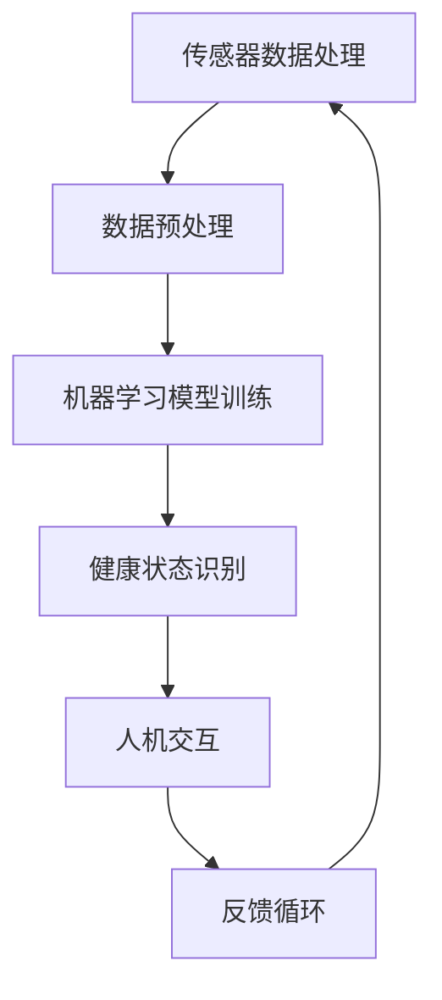

                 

# 机器人技术在老年护理中的创新

## 关键词
- 机器人技术
- 老年护理
- 陪伴机器人
- 健康监测
- 辅助康复

## 摘要
随着全球人口老龄化的加剧，老年护理面临巨大挑战。本文深入探讨了机器人技术在老年护理中的应用，包括陪伴机器人、健康监测机器人和辅助康复机器人等。通过分析其核心概念与联系、算法原理和应用，以及系统架构与实施，本文旨在展示机器人技术在老年护理中的创新潜力，并提出最佳实践建议。

## 背景介绍

### 问题背景
人口老龄化是全球面临的一个重大挑战。根据联合国的数据，全球65岁及以上老年人口将从2019年的9亿增加到2050年的21亿，占全球总人口的16%。随着老龄化进程的加速，传统的老年护理模式已难以满足日益增长的需求。老年护理问题主要包括孤独感、行动不便、健康监测和康复需求等。

### 问题描述
老年护理问题主要集中在以下几个方面：
1. **孤独感**：老年人群往往因为身体或心理原因，导致社交活动减少，感到孤独和被忽视。
2. **行动不便**：随着年龄增长，许多老年人可能因关节炎、心脏病等疾病而行动不便，需要他人的帮助。
3. **健康监测**：老年人容易患有慢性疾病，需要定期监测血压、血糖等生命体征。
4. **康复需求**：老年人因疾病或受伤可能导致功能障碍，需要康复训练以恢复功能。

### 问题解决
机器人技术在老年护理中的应用提供了创新的解决方案：
1. **陪伴机器人**：通过智能交互，减少老年人的孤独感，提供情感支持。
2. **健康监测机器人**：持续监测老年人的健康状态，实时报警，确保安全。
3. **辅助康复机器人**：帮助老年人进行康复训练，提高生活质量。

### 边界与外延
机器人技术在老年护理中的应用主要集中在以下领域：
1. **日常生活辅助**：帮助老年人完成日常活动，如洗澡、穿衣、吃饭等。
2. **健康状态监测**：监测血压、心率、血糖等生命体征，提供健康数据。
3. **康复辅助**：提供物理治疗和功能训练，帮助老年人恢复功能。
4. **情感支持**：通过智能交互，减少老年人的孤独感。

### 核心要素组成
机器人技术在老年护理中的核心要素包括：
1. **机器人技术**：包括智能传感器、人工智能、机器人控制算法等。
2. **老年护理需求**：包括孤独感、行动不便、健康监测和康复需求等。
3. **技术应用场景**：如家庭、养老院、医院等。

## 核心概念与联系

### 机器人技术的定义与特点
机器人技术是指利用计算机科学、控制工程、机械工程和人工智能等多个学科的知识，设计和制造能够模拟人类行为的智能机器。其特点包括：
1. **自动化**：机器人能够执行重复性、危险或复杂的工作，提高效率。
2. **智能化**：机器人具备感知环境、决策和执行任务的能力。
3. **适应性**：机器人能够根据环境和任务需求进行自适应调整。

### 老年护理需求的定义与特点
老年护理需求是指满足65岁及以上老年人的身体、心理和社交需求，确保其生活质量。其特点包括：
1. **多样性**：老年人群的需求多样，包括健康、安全、情感和社交等多个方面。
2. **持续性**：老年护理需求往往需要长期关注和持续服务。
3. **个性化**：每位老年人的需求都不同，需要个性化的护理方案。

### 概念属性特征对比表格

| 特征          | 机器人技术                           | 老年护理需求                           |
| ------------- | ----------------------------------- | ------------------------------------- |
| 自动化程度    | 高，能够执行重复性、危险或复杂任务   | 部分自动化，需要人文关怀和个性化服务   |
| 智能化程度    | 高，具备感知、决策和执行任务的能力   | 中等，需要根据个人情况提供适当的服务   |
| 适应性        | 高，能够根据环境和任务需求自适应调整 | 中等，需要根据老年人个人情况进行调整   |
| 多样性和个性化 | 多样性较高，应用场景广泛             | 多样性较高，每位老年人的需求都不同     |

### ER实体关系图架构
以下是机器人技术与老年护理需求之间的ER实体关系图：

```mermaid
erDiagram
  Person ||--|{ Robot }|-- Robot : "uses"
  Person ||--|{ HealthMonitoring }|-- HealthMonitoring : "monitors"
  Person ||--|{ Rehabilitation }|-- Rehabilitation : "receives"
```

在上图中，Person 代表老年人，Robot 代表机器人，HealthMonitoring 代表健康监测，Rehabilitation 代表康复。每个老年人可以与多个机器人、健康监测设备和康复服务相关联，体现了机器人技术在老年护理中的应用。

## 算法原理讲解

### 算法原理
在老年护理中，机器人技术的应用主要基于以下算法原理：

1. **传感器数据处理**：机器人通过传感器收集老年人的生理和行为数据，如心跳、血压、步态等，并利用数据预处理算法进行清洗和归一化。

2. **机器学习算法**：利用收集到的数据，机器人可以训练机器学习模型，以识别老年人的健康状态和行为模式。常见的算法包括监督学习、无监督学习和强化学习。

3. **人机交互算法**：通过自然语言处理（NLP）和语音识别技术，机器人能够与老年人进行有效沟通，提供情感支持和生活帮助。

4. **安全性与隐私保护算法**：为确保老年人的隐私和安全，机器人需要采用加密和访问控制等技术，确保数据的安全传输和处理。

### Mermaid算法流程图
以下是机器人技术在老年护理中应用的Mermaid算法流程图：



### Python源代码
以下是一个简单的Python源代码示例，用于传感器数据处理和健康状态识别：

```python
import numpy as np
from sklearn.preprocessing import StandardScaler
from sklearn.ensemble import RandomForestClassifier

# 假设传感器数据为一系列生理参数
sensor_data = np.array([[120, 70], [130, 75], [125, 72], [115, 68]])

# 数据预处理
scaler = StandardScaler()
processed_data = scaler.fit_transform(sensor_data)

# 训练机器学习模型
model = RandomForestClassifier()
model.fit(processed_data, np.array([0, 1, 1, 0]))

# 健康状态识别
new_data = scaler.transform(np.array([[121, 71]]))
predicted_state = model.predict(new_data)

print("预测的健康状态：", predicted_state)
```

### 数学模型和公式
以下是健康状态识别的数学模型和公式：

$$
\text{状态} = f(\text{传感器数据}, \text{模型参数})
$$

其中，$f$ 表示机器学习模型的决策函数，$\text{传感器数据}$ 表示输入的生理参数，$\text{模型参数}$ 表示训练好的模型参数。

### 详细讲解与举例说明
假设我们有一组传感

