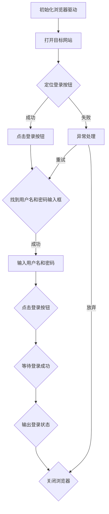
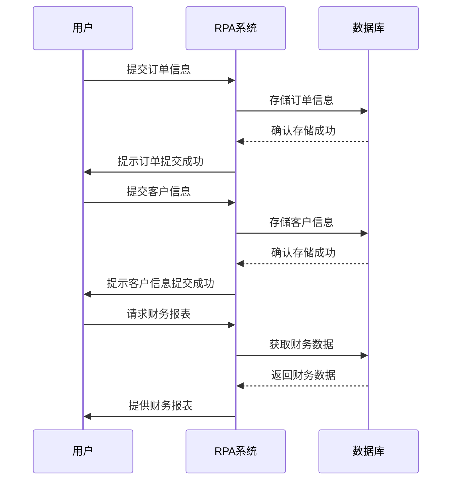
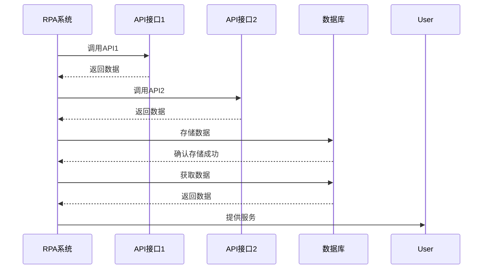

                 

# 机器人流程自动化在企业效率提升中的作用

## 关键词

- 机器人流程自动化
- 企业效率提升
- RPA技术
- 工作自动化
- 人工智能
- 信息技术

## 摘要

本文旨在探讨机器人流程自动化（RPA）在提升企业效率方面的作用。通过分析RPA技术的发展背景、核心概念、应用场景以及相关技术概览，文章将详细介绍RPA如何通过自动化流程帮助企业减少人力成本、提高工作效率。此外，本文还将结合实际案例，探讨RPA在企业实践中的应用和未来趋势，为读者提供全面的RPA技术应用指南。

## 第一部分：引言

### 1.1 书籍背景与目的

#### 1.1.1 机器人流程自动化的发展背景

机器人流程自动化（Robotic Process Automation，RPA）作为一项新兴技术，起源于20世纪90年代的软件自动化工具。随着信息技术的飞速发展，RPA逐渐成熟并得到广泛应用。企业在面对日益复杂和繁琐的运营流程时，对提高效率和减少人工操作的需求日益增长。RPA技术应运而生，通过模拟人类操作员的动作，自动执行企业内部的各种业务流程。

RPA的发展背景主要受到以下几个因素的推动：

1. **企业运营复杂度的提升**：随着全球化进程的加快和市场竞争的加剧，企业需要处理的海量数据和业务流程变得日益复杂。
2. **信息技术基础设施的完善**：互联网、云计算、大数据等技术的普及为RPA的发展提供了强大的基础设施支持。
3. **人工成本的上升**：企业为了提高生产效率，开始寻求自动化替代人工，以降低成本和提高效益。

#### 1.1.2 书籍的写作目的

本文的写作目的主要有以下几点：

1. **全面了解RPA**：通过介绍RPA的核心概念、工作原理和技术特点，帮助读者全面了解RPA。
2. **指导企业实践**：结合实际案例，分析RPA在不同企业中的应用，为读者提供实施RPA的指导。
3. **探讨未来趋势**：分析RPA的发展趋势和面临的挑战，为企业的长远发展提供参考。

### 1.2 核心概念与定义

#### 1.2.1 机器人流程自动化（RPA）

**定义**：RPA是指利用软件机器人模拟人类操作员的操作，自动执行企业内部业务流程的一种技术。

**工作原理**：RPA通过记录和模拟人类操作员的动作，将业务流程中的手动操作自动化。软件机器人可以登录企业系统、填写表单、处理数据等，从而替代人工完成繁琐的工作。

**关键技术**：

- **流程模拟**：通过录制操作员的动作，将流程转化为可执行的脚本。
- **界面自动化**：模拟人类操作员与系统界面的交互。
- **数据处理**：对业务流程中的数据进行提取、转换和加载。

#### 1.2.2 企业效率提升

**定义**：企业效率提升是指通过改进生产和管理流程，提高企业的生产效率、运营效率和经济效益。

**影响因素**：

- **流程优化**：通过分析和改进现有业务流程，减少不必要的步骤和等待时间。
- **技术引入**：利用信息技术和自动化工具，提高业务处理的自动化程度。
- **员工培训**：提高员工的专业技能和综合素质，使其更好地适应高效的工作环境。

**改进措施**：

- **自动化流程**：通过引入RPA等自动化工具，减少人工操作，提高处理效率。
- **流程标准化**：制定标准化的业务流程，确保操作的一致性和准确性。
- **数据分析**：利用大数据技术，对业务流程进行数据分析和优化。

#### 1.2.3 相关技术概览

**AI、机器学习、NLP等**

- **人工智能（AI）**：利用机器学习、深度学习等技术，实现软件机器人的智能化。
- **机器学习**：通过训练模型，让软件机器人能够自主学习和优化操作。
- **自然语言处理（NLP）**：使软件机器人能够理解和处理自然语言，实现人机交互。

### 1.3 书籍结构安排

#### 1.3.1 各章节内容概述

- **第一章：引言**：介绍RPA的发展背景和书籍的写作目的。
- **第二章：RPA基础**：详细阐述RPA的核心概念、工作原理和技术特点。
- **第三章：RPA应用场景**：分析RPA在不同行业和业务流程中的应用。
- **第四章：RPA工具与技术**：介绍RPA的主要工具和技术，包括流程模拟、界面自动化和数据处理。
- **第五章：实施RPA的企业实践**：结合实际案例，探讨RPA在企业的应用和实践。
- **第六章：RPA的未来趋势与挑战**：分析RPA的发展趋势和面临的挑战。

### 1.4 总结

本文通过分析RPA的核心概念、应用场景和未来趋势，旨在帮助读者全面了解RPA在提升企业效率方面的作用。文章结构紧凑，逻辑清晰，有助于读者从不同角度认识和理解RPA。通过本文的阅读，读者将能够：

1. **掌握RPA的基本概念和工作原理**。
2. **了解RPA在不同行业和业务流程中的应用**。
3. **获得实施RPA的实践经验**。
4. **洞察RPA的未来发展趋势和挑战**。

## 第二部分：机器人流程自动化的核心概念

### 2.1 机器人流程自动化（RPA）的定义

机器人流程自动化（RPA）是一种利用软件机器人模拟人类操作员动作的技术。它通过记录和模拟人类操作员的动作，将业务流程中的手动操作自动化。RPA软件机器人可以在企业内部的各种业务系统中执行重复性高、规则性强的任务，从而替代人工完成繁琐的工作。RPA的核心优势在于提高工作效率、减少错误率和降低运营成本。

### 2.2 机器人流程自动化的工作原理

RPA的工作原理主要包括以下几个步骤：

1. **流程录制**：通过录制操作员的动作，将业务流程转化为可执行的脚本。
2. **流程模拟**：将录制的脚本转化为软件机器人执行的步骤，实现业务流程的自动化。
3. **界面自动化**：模拟人类操作员与系统界面的交互，完成数据的输入、提取和转换。
4. **数据处理**：对业务流程中的数据进行提取、转换和加载，实现数据的自动化处理。

### 2.3 机器人流程自动化的关键技术

RPA的关键技术包括流程模拟、界面自动化和数据处理等。以下是对这些关键技术的详细介绍：

#### 2.3.1 流程模拟

流程模拟是RPA的核心技术之一，它通过录制操作员的动作，将业务流程转化为可执行的脚本。具体来说，流程模拟包括以下步骤：

1. **动作录制**：使用RPA工具录制操作员的动作，包括点击、输入、复制粘贴等。
2. **脚本生成**：将录制的动作转化为脚本，以便软件机器人执行。
3. **脚本优化**：对生成的脚本进行优化，以提高执行效率和准确性。

#### 2.3.2 界面自动化

界面自动化是指RPA软件机器人模拟人类操作员与系统界面的交互。它包括以下几个关键点：

1. **UI映射**：将系统界面上的元素（如按钮、文本框等）映射到软件机器人上。
2. **交互模拟**：模拟人类操作员与系统界面的交互动作，如点击按钮、输入文本等。
3. **异常处理**：在界面自动化过程中，软件机器人能够处理各种异常情况，如界面元素未找到、操作失败等。

#### 2.3.3 数据处理

数据处理是RPA的重要组成部分，它包括对业务流程中的数据进行提取、转换和加载。具体来说，数据处理包括以下方面：

1. **数据提取**：从不同来源的数据（如数据库、文件等）中提取所需数据。
2. **数据转换**：对提取的数据进行清洗、格式转换等处理，以满足业务需求。
3. **数据加载**：将处理后的数据加载到目标系统中，实现数据的自动化处理。

### 2.4 机器人流程自动化的应用领域

RPA技术具有广泛的应用领域，可以应用于各类企业的多个业务流程。以下是RPA的主要应用领域：

1. **财务和会计**：自动处理发票、付款、财务报表等财务任务。
2. **人力资源**：自动处理招聘、入职、离职、薪资计算等人力资源事务。
3. **客户服务**：自动处理客户咨询、投诉、订单管理等客户服务任务。
4. **供应链管理**：自动处理采购、库存管理、物流等供应链环节。
5. **数据采集和处理**：自动从各种数据源中提取和处理数据，为企业的决策提供支持。

通过以上介绍，我们可以看到，RPA作为一种新兴技术，已经在多个领域得到广泛应用，并为企业带来了显著的效率和效益提升。接下来，我们将进一步探讨企业效率提升的概念和相关因素。

### 2.5 企业效率提升的概念

企业效率提升是指通过改进生产和管理流程，提高企业的生产效率、运营效率和经济效益。在企业运营过程中，效率的提升不仅能够降低成本，提高竞争力，还能够提升员工的满意度和工作积极性。

企业效率提升的主要目标包括：

1. **提高生产效率**：通过改进生产流程，提高产品的产出率，降低生产成本。
2. **提升运营效率**：通过优化管理流程，提高业务处理的效率，减少运营成本。
3. **提高经济效益**：通过降低成本、提高销售收入，增加企业的盈利能力。

### 2.6 企业效率提升的影响因素

企业效率提升受到多种因素的影响，以下是一些主要的影响因素：

1. **流程优化**：通过改进和优化业务流程，减少不必要的步骤和等待时间，提高业务处理效率。
2. **技术引入**：利用信息技术和自动化工具，提高业务处理的自动化程度，减少人工操作。
3. **员工培训**：提高员工的专业技能和综合素质，使其更好地适应高效的工作环境。
4. **管理改进**：通过优化管理流程，提高管理效率，减少管理成本。
5. **企业文化**：营造积极向上的企业文化，提高员工的积极性和工作效率。

### 2.7 企业效率提升的改进措施

为了提升企业效率，企业可以采取以下改进措施：

1. **自动化流程**：通过引入RPA等自动化工具，减少人工操作，提高处理效率。
2. **流程标准化**：制定标准化的业务流程，确保操作的一致性和准确性。
3. **数据分析**：利用大数据技术，对业务流程进行数据分析和优化。
4. **组织结构优化**：通过调整组织结构，提高管理的效率。
5. **激励机制**：建立合理的激励机制，提高员工的积极性和工作效率。

通过以上改进措施，企业可以显著提高效率，降低运营成本，提升竞争力。

### 2.8 相关技术概览

在探讨RPA在提升企业效率中的作用时，我们还需要了解与RPA相关的其他技术，如人工智能（AI）、机器学习（ML）和自然语言处理（NLP）等。

#### 2.8.1 人工智能（AI）

人工智能是指使计算机系统具备类似人类智能的能力，包括感知、学习、推理、决策等。在RPA中，AI技术可以帮助软件机器人实现智能化的操作，如自动化决策和自适应调整。

#### 2.8.2 机器学习（ML）

机器学习是人工智能的一个重要分支，它通过训练模型，让计算机系统从数据中学习并做出预测或决策。在RPA中，机器学习可以用于优化流程模拟、异常检测和自动化决策等。

#### 2.8.3 自然语言处理（NLP）

自然语言处理是指使计算机系统理解和处理自然语言的技术。在RPA中，NLP可以用于自动化文本处理、人机交互和智能客服等。

#### 2.8.4 云计算和大数据

云计算和大数据技术为RPA提供了强大的基础设施支持。通过云计算，企业可以实现RPA资源的灵活配置和高效利用；通过大数据，企业可以收集和分析大量业务数据，为流程优化和决策提供支持。

通过以上介绍，我们可以看到，RPA作为一种自动化技术，与AI、机器学习、NLP等前沿技术紧密相关。这些技术的结合，使得RPA在提升企业效率方面具有更大的潜力和应用价值。

### 2.9 本书结构安排

本书将分为六个主要章节，每个章节的内容概述如下：

- **第一章：引言**：介绍RPA的发展背景和书籍的写作目的。
- **第二章：RPA基础**：详细阐述RPA的核心概念、工作原理和技术特点。
- **第三章：RPA应用场景**：分析RPA在不同行业和业务流程中的应用。
- **第四章：RPA工具与技术**：介绍RPA的主要工具和技术，包括流程模拟、界面自动化和数据处理。
- **第五章：实施RPA的企业实践**：结合实际案例，探讨RPA在企业的应用和实践。
- **第六章：RPA的未来趋势与挑战**：分析RPA的发展趋势和面临的挑战。

通过以上章节的安排，本书将全面、系统地介绍RPA在提升企业效率方面的作用和应用。

### 2.10 总结

在本章中，我们介绍了机器人流程自动化（RPA）的核心概念、工作原理和关键技术，分析了企业效率提升的概念和影响因素，以及相关技术概览。通过本章的学习，读者可以全面了解RPA的基本概念和应用场景，为后续章节的学习和实践打下基础。接下来，我们将进一步探讨RPA在不同行业和业务流程中的应用，分析其实际案例和最佳实践。

## 第三部分：机器人流程自动化在各个行业中的应用

### 3.1 机器人流程自动化在财务和会计领域的应用

在财务和会计领域，RPA技术的应用尤为广泛。通过RPA，企业可以自动化处理大量的财务任务，如发票处理、付款、财务报表编制等，从而显著提高工作效率和准确性。以下是一些具体的应用场景：

1. **发票处理**：RPA可以自动识别和分类发票，提取关键信息，并生成相应的会计凭证，大大减少了人工处理的时间和错误率。
2. **付款处理**：RPA可以自动化处理付款流程，包括核对发票、生成付款订单、发起付款等，确保付款流程的及时性和准确性。
3. **财务报表编制**：RPA可以自动化提取和汇总财务数据，生成各种财务报表，如利润表、资产负债表等，提高了报表编制的效率和准确性。
4. **税务申报**：RPA可以自动收集和整理税务相关数据，生成税务报表，并按照税务规定进行申报，减少了税务风险。

### 3.2 机器人流程自动化在人力资源领域的应用

在人力资源管理领域，RPA可以自动化处理招聘、入职、离职、薪资计算等事务，从而提高人力资源管理的效率。以下是一些具体的应用场景：

1. **招聘流程**：RPA可以自动化处理简历筛选、面试安排、录用通知等招聘流程，缩短招聘周期，提高招聘效率。
2. **入职管理**：RPA可以自动化处理新员工的入职手续，如合同签订、工位安排、IT设备配置等，确保入职流程的顺利进行。
3. **薪资计算**：RPA可以自动化计算员工的薪资，包括基本工资、奖金、扣除项等，减少了人工计算的错误率，提高了薪资发放的准确性。
4. **员工档案管理**：RPA可以自动化管理员工的档案信息，如个人信息、培训记录、绩效评估等，确保档案信息的完整性和准确性。

### 3.3 机器人流程自动化在客户服务领域的应用

在客户服务领域，RPA可以帮助企业自动化处理大量的客户咨询、投诉、订单管理等任务，从而提高客户满意度和服务质量。以下是一些具体的应用场景：

1. **客户咨询处理**：RPA可以自动化处理客户咨询，如查询订单状态、产品信息等，提供快速、准确的答复，减少了客户等待时间。
2. **投诉处理**：RPA可以自动化处理客户投诉，如记录投诉信息、分配处理人员、跟踪处理进度等，确保投诉得到及时、有效的处理。
3. **订单管理**：RPA可以自动化处理订单生成、确认、发货等订单流程，提高了订单处理的效率，减少了人为错误。
4. **客户满意度调查**：RPA可以自动化发送客户满意度调查问卷，收集客户反馈，为改进客户服务提供数据支持。

### 3.4 机器人流程自动化在供应链管理领域的应用

在供应链管理领域，RPA可以帮助企业自动化处理采购、库存管理、物流等环节，从而提高供应链的效率和灵活性。以下是一些具体的应用场景：

1. **采购管理**：RPA可以自动化处理采购流程，包括供应商选择、采购订单生成、支付审批等，提高了采购效率和准确性。
2. **库存管理**：RPA可以自动化处理库存监控、库存调整、库存报告等任务，确保库存信息的准确性和及时性，减少了库存短缺和积压的风险。
3. **物流管理**：RPA可以自动化处理物流流程，包括订单跟踪、货物配送、运输成本计算等，提高了物流效率和客户满意度。
4. **供应链可视化**：RPA可以自动化生成供应链可视化报表，如采购趋势、库存状况、物流进度等，为供应链决策提供数据支持。

### 3.5 机器人流程自动化在其他领域的应用

除了上述领域，RPA还在其他领域得到了广泛应用，如：

1. **数据分析**：RPA可以自动化处理大量的数据采集、清洗、分析和报告等任务，提高了数据分析的效率和准确性。
2. **合规性检查**：RPA可以自动化处理合规性检查任务，如财务报表审核、税务申报审核等，确保企业遵守相关法律法规。
3. **IT运维**：RPA可以自动化处理IT运维任务，如系统监控、故障排除、日志分析等，提高了IT运维的效率。
4. **项目管理**：RPA可以自动化处理项目计划、任务分配、进度跟踪等项目管理任务，提高了项目管理的效率和准确性。

通过以上介绍，我们可以看到，RPA在各个行业和业务流程中都有广泛的应用，可以显著提高企业的效率和效益。接下来，我们将进一步探讨RPA工具与技术，了解如何实现RPA的实际应用。

### 3.6 RPA工具与技术

RPA的实现离不开一系列工具和技术。以下是对RPA主要工具和技术的详细介绍：

#### 3.6.1 RPA平台

RPA平台是RPA实现的核心工具，提供了流程设计、部署和管理等功能。常见的RPA平台包括UiPath、Blue Prism和Automation Anywhere等。这些平台具有以下特点：

1. **可视化的流程设计**：通过拖拽和连接的方式，用户可以轻松创建和设计RPA流程。
2. **丰富的活动库**：提供了多种预定义的活动和组件，如点击、输入、复制粘贴、数据提取等，便于用户快速实现自动化流程。
3. **跨平台支持**：支持在不同的操作系统和浏览器上运行，便于企业部署和应用。
4. **监控和管理**：提供了实时监控和日志记录功能，便于企业管理和维护RPA流程。

#### 3.6.2 流程模拟技术

流程模拟技术是RPA的核心技术之一，它通过录制和模拟人类操作员的动作，实现业务流程的自动化。流程模拟技术主要包括以下步骤：

1. **动作录制**：使用RPA平台记录操作员的动作，如点击、输入、复制粘贴等。
2. **脚本生成**：将录制的动作转化为可执行的脚本，以便软件机器人执行。
3. **脚本优化**：对生成的脚本进行优化，以提高执行效率和准确性。

#### 3.6.3 界面自动化技术

界面自动化技术是指RPA软件机器人模拟人类操作员与系统界面的交互。界面自动化技术主要包括以下方面：

1. **UI映射**：将系统界面上的元素（如按钮、文本框等）映射到软件机器人上。
2. **交互模拟**：模拟人类操作员与系统界面的交互动作，如点击按钮、输入文本等。
3. **异常处理**：在界面自动化过程中，软件机器人能够处理各种异常情况，如界面元素未找到、操作失败等。

#### 3.6.4 数据处理技术

数据处理技术是RPA的重要组成部分，它包括对业务流程中的数据进行提取、转换和加载。数据处理技术主要包括以下方面：

1. **数据提取**：从不同来源的数据（如数据库、文件等）中提取所需数据。
2. **数据转换**：对提取的数据进行清洗、格式转换等处理，以满足业务需求。
3. **数据加载**：将处理后的数据加载到目标系统中，实现数据的自动化处理。

#### 3.6.5 人工智能与机器学习

人工智能（AI）和机器学习（ML）技术在RPA中发挥着重要作用。通过AI和ML技术，RPA可以实现以下功能：

1. **流程优化**：通过分析历史数据，自动优化RPA流程，提高执行效率和准确性。
2. **异常检测**：通过机器学习模型，自动检测RPA流程中的异常情况，并采取相应的措施。
3. **自适应调整**：根据业务需求和数据变化，自动调整RPA流程，以适应不同的业务场景。

#### 3.6.6 云计算与大数据

云计算和大数据技术为RPA提供了强大的基础设施支持。通过云计算，企业可以实现RPA资源的灵活配置和高效利用；通过大数据，企业可以收集和分析大量业务数据，为流程优化和决策提供支持。

1. **云计算**：RPA可以在云环境中部署和管理，提供弹性的计算资源和高效的数据存储。
2. **大数据**：通过大数据技术，企业可以收集和分析海量业务数据，为RPA提供数据支持和决策依据。

通过以上介绍，我们可以看到，RPA工具和技术为企业提供了强大的自动化能力，可以显著提高业务效率和准确性。接下来，我们将通过实际案例，探讨RPA在企业的具体应用和实践。

### 3.7 实际案例：RPA在大型企业的应用

为了更好地理解RPA在企业的应用，以下将介绍几个大型企业在RPA实施中的实际案例，并分析其成功经验和挑战。

#### 案例一：制造业巨头实施RPA优化供应链管理

**背景**：某全球知名的制造业巨头面临供应链管理复杂、库存控制困难等问题，希望通过RPA技术提升供应链的效率和准确性。

**解决方案**：
- **采购管理**：通过RPA，企业自动化处理采购订单的生成、审批和支付流程，减少了人为错误和延迟。
- **库存管理**：RPA自动监控库存水平，及时调整库存策略，减少了库存短缺和积压现象。
- **物流管理**：RPA自动化处理物流跟踪和配送任务，提高了物流效率和客户满意度。

**成功经验**：
- **流程标准化**：通过RPA实现供应链管理的流程标准化，确保各个环节的一致性和准确性。
- **数据分析**：利用RPA收集和分析供应链数据，为企业决策提供数据支持。
- **成本节约**：RPA减少了人工操作，降低了运营成本。

**挑战**：
- **技术集成**：RPA与其他系统的集成需要解决数据同步和接口兼容等问题。
- **员工培训**：员工需要适应新的自动化工作流程，培训成本较高。

#### 案例二：金融行业实施RPA优化财务流程

**背景**：某大型金融机构面临财务流程繁琐、数据处理错误率高的问题，希望通过RPA技术提升财务管理的效率。

**解决方案**：
- **发票处理**：RPA自动化处理发票的识别、分类和录入，提高了发票处理的速度和准确性。
- **财务报表**：RPA自动化生成财务报表，减少了人工录入和数据错误。
- **税务申报**：RPA自动化处理税务申报，确保税务信息的准确性和及时性。

**成功经验**：
- **流程优化**：RPA简化了财务流程，减少了不必要的步骤，提高了处理效率。
- **风险控制**：通过RPA自动化处理高风险的财务任务，降低了操作风险。
- **合规性**：RPA确保财务操作符合相关法规和标准。

**挑战**：
- **数据安全**：自动化处理财务数据需要确保数据的安全和隐私。
- **系统兼容性**：RPA需要与金融机构现有的财务系统兼容，实现无缝集成。

#### 案例三：客户服务企业实施RPA优化客户体验

**背景**：某知名客户服务企业面临客户咨询量巨大、响应速度慢的问题，希望通过RPA技术提升客户服务效率。

**解决方案**：
- **客户咨询处理**：RPA自动化处理客户咨询，提供快速、准确的答复。
- **投诉管理**：RPA自动化处理客户投诉，确保投诉得到及时、有效的处理。
- **订单管理**：RPA自动化处理订单生成、确认和发货，提高了订单处理效率。

**成功经验**：
- **客户满意度**：RPA提高了客户服务的响应速度和满意度。
- **效率提升**：RPA减少了客户服务人员的重复性工作，提高了工作效率。
- **成本节约**：RPA降低了客户服务的人力成本。

**挑战**：
- **人机协作**：如何平衡RPA和人工服务，确保服务质量。
- **技术支持**：RPA系统的维护和升级需要持续的技术支持。

通过以上案例，我们可以看到，RPA在大型企业的应用具有显著的效果，但也面临一些挑战。企业需要根据自身实际情况，合理规划RPA的实施策略，充分发挥其优势，提高业务效率和客户满意度。

### 3.8 总结

在本部分，我们通过实际案例详细分析了RPA在财务和会计、人力资源、客户服务、供应链管理以及其他领域的应用。这些案例展示了RPA如何通过自动化流程提高企业效率、降低运营成本和提升客户满意度。同时，我们也探讨了RPA工具和技术的关键特性及其应用，为企业的RPA实践提供了参考。在下一部分，我们将进一步探讨RPA在企业实践中的具体实施方法和策略，帮助企业更好地利用RPA技术提升业务效率。

## 第四部分：实施机器人流程自动化（RPA）的企业实践

### 4.1 企业实施RPA的背景和动机

在当前竞争激烈的商业环境中，企业为了提高效率和降低成本，开始越来越多地采用机器人流程自动化（RPA）技术。以下是一些企业实施RPA的背景和动机：

#### 4.1.1 市场竞争加剧

随着全球化进程的加快，企业面临的市场竞争日益激烈。为了在竞争中脱颖而出，企业需要不断提高运营效率和降低成本，以获得更大的市场优势。

#### 4.1.2 人工成本上升

人工成本的上升使得企业越来越难以承担重复性高、规则性强的工作。通过引入RPA技术，企业可以减少对人工的依赖，降低人力成本。

#### 4.1.3 业务流程复杂化

随着企业业务的不断扩展和复杂化，传统的手动操作已经无法满足高效运营的需求。RPA技术的引入可以帮助企业自动化处理复杂的业务流程，提高处理效率。

#### 4.1.4 技术成熟和成本下降

RPA技术的发展和普及，使得其成本逐渐下降，成为中小企业也能承受的技术。同时，RPA平台和工具的成熟，使得企业能够快速实施和部署RPA系统。

#### 4.1.5 提升客户体验

客户对服务质量的要求越来越高，企业需要通过提升客户体验来保持竞争优势。RPA技术可以帮助企业自动化处理客户服务任务，提供快速、准确的响应，提升客户满意度。

### 4.2 企业实施RPA的步骤

企业实施RPA需要遵循一定的步骤，以确保项目的成功。以下是实施RPA的主要步骤：

#### 4.2.1 需求分析

在实施RPA之前，企业需要明确业务需求，分析哪些流程适合自动化。需求分析包括：

- **流程梳理**：对企业现有的业务流程进行梳理，确定哪些流程可以自动化。
- **问题识别**：识别业务流程中的痛点，如效率低、错误率高、人工成本高等。
- **优先级排序**：根据问题的重要性和影响程度，对流程进行优先级排序。

#### 4.2.2 技术评估

在需求分析的基础上，企业需要对RPA技术进行评估，选择合适的RPA平台和工具。技术评估包括：

- **平台选择**：选择适合企业需求的RPA平台，如UiPath、Blue Prism、Automation Anywhere等。
- **工具评估**：评估不同工具的功能、性能、兼容性等，选择合适的工具。
- **试点项目**：在选定技术和工具后，进行试点项目，验证其在实际应用中的效果。

#### 4.2.3 流程设计

在技术评估完成后，企业需要设计RPA流程。流程设计包括：

- **流程建模**：使用RPA工具设计流程模型，包括流程步骤、数据流、界面交互等。
- **脚本编写**：根据流程模型编写RPA脚本，实现流程的自动化。
- **测试和优化**：对RPA脚本进行测试，验证其功能是否符合预期，并根据反馈进行优化。

#### 4.2.4 实施部署

在流程设计完成后，企业需要实施和部署RPA系统。实施部署包括：

- **系统集成**：将RPA系统与企业现有的信息系统集成，确保数据流动和流程衔接。
- **上线测试**：在正式上线前进行测试，确保RPA系统能够稳定运行。
- **培训与支持**：对员工进行RPA系统的培训，提供技术支持和帮助。

#### 4.2.5 运营维护

在RPA系统上线后，企业需要对其进行运营维护，确保系统的持续稳定运行。运营维护包括：

- **监控与监控**：实时监控RPA系统的运行状态，及时发现和解决潜在问题。
- **性能优化**：根据业务需求和系统运行情况，对RPA流程进行性能优化。
- **升级与更新**：定期对RPA系统进行升级和更新，以适应业务变化和技术发展。

### 4.3 企业实施RPA的最佳实践

为了确保RPA项目的成功，企业可以参考以下最佳实践：

#### 4.3.1 领导支持

RPA项目需要得到高层领导的全力支持，包括资金投入、资源调配和决策支持。领导的支持可以确保项目顺利推进。

#### 4.3.2 跨部门协作

RPA项目涉及多个部门和岗位，需要跨部门协作。企业应建立跨部门的项目团队，确保项目成员之间的有效沟通和协作。

#### 4.3.3 精准需求分析

在实施RPA之前，企业应进行精准的需求分析，确保自动化流程的设计符合实际业务需求。需求分析应包括流程梳理、问题识别和优先级排序等。

#### 4.3.4 技术评估与试点

在技术评估阶段，企业应选择合适的RPA平台和工具，并通过试点项目验证其实际应用效果。试点项目的成功可以为后续项目提供参考。

#### 4.3.5 测试与优化

在RPA脚本编写完成后，应进行充分的测试和优化，确保其功能符合预期，并能够稳定运行。测试应包括功能测试、性能测试和安全测试等。

#### 4.3.6 培训与支持

在RPA系统上线前，应对相关员工进行培训，确保其能够熟练使用RPA系统。同时，应提供持续的技术支持和帮助，解决员工在使用过程中遇到的问题。

#### 4.3.7 持续改进

RPA系统上线后，企业应持续对其进行改进和优化，以适应业务变化和技术发展。持续改进可以通过定期评估、反馈和优化实现。

通过以上最佳实践，企业可以确保RPA项目的成功实施，并充分发挥其在提升企业效率方面的作用。

### 4.4 总结

在本部分，我们详细介绍了企业实施RPA的背景和动机，以及实施RPA的步骤和最佳实践。通过精准的需求分析、技术评估、流程设计和实施部署，企业可以成功实施RPA，提升业务效率和客户体验。在下一部分，我们将进一步探讨RPA的未来发展趋势和面临的挑战，为企业的长远发展提供参考。

## 第五部分：机器人流程自动化（RPA）的未来趋势与挑战

### 5.1 RPA技术的未来发展趋势

随着人工智能（AI）、机器学习（ML）和云计算等技术的快速发展，RPA技术也迎来了新的发展机遇。以下是RPA技术的几个未来发展趋势：

#### 5.1.1 智能化

RPA技术将逐渐实现智能化，通过引入AI和ML技术，RPA软件机器人能够自主学习和优化操作，提高自动化程度和准确性。智能化RPA将能够处理更复杂的业务流程，实现更高的自动化水平。

#### 5.1.2 跨平台集成

随着企业应用系统的多样化，RPA技术将更加注重跨平台集成，能够无缝连接不同的系统和平台，实现数据的流畅传递和业务流程的自动化。

#### 5.1.3 智能决策

RPA技术将结合AI和ML模型，实现智能决策功能。通过分析大量数据，RPA软件机器人能够自动做出最优决策，提高业务流程的效率和准确性。

#### 5.1.4 自动化升级

RPA技术将不断升级，支持更复杂的业务场景和更高的操作复杂性。自动化升级将使RPA能够处理更多类型的业务流程，满足企业多样化的需求。

#### 5.1.5 资源共享

随着RPA技术的普及，企业之间将实现RPA资源的共享，如共享RPA开发平台、工具和流程模板等。资源共享将降低企业的RPA实施成本，提高整体自动化水平。

### 5.2 RPA技术面临的挑战

尽管RPA技术具有巨大的发展潜力，但在实际应用中仍面临一些挑战：

#### 5.2.1 数据安全和隐私

RPA在处理业务数据时，可能涉及敏感信息，如财务数据、客户信息等。数据安全和隐私保护是RPA技术面临的重要挑战。企业需要建立完善的数据安全策略，确保数据在传输和处理过程中的安全性。

#### 5.2.2 技术集成

RPA技术需要与企业现有的信息系统集成，但不同系统的接口和数据格式可能不兼容，导致集成困难。企业需要投入大量时间和资源进行系统集成，确保RPA系统与企业现有系统的无缝对接。

#### 5.2.3 员工适应

RPA的引入可能改变员工的岗位职责和工作方式，一些员工可能对新技术感到不适应。企业需要提供培训和支持，帮助员工适应新的工作环境，提高工作效率。

#### 5.2.4 持续维护

RPA系统需要定期维护和升级，以适应业务变化和技术发展。企业需要投入资源和人力进行持续维护，确保RPA系统的稳定运行和高效性能。

#### 5.2.5 法律法规

RPA技术的发展受到法律法规的约束，如数据保护法、隐私法等。企业需要了解和遵守相关法律法规，确保RPA系统的合法合规运行。

### 5.3 应对RPA挑战的策略

为了应对RPA技术面临的挑战，企业可以采取以下策略：

#### 5.3.1 数据安全策略

建立完善的数据安全策略，包括数据加密、访问控制、备份和恢复等，确保数据在传输和处理过程中的安全性。

#### 5.3.2 集成规划

在实施RPA之前，进行详细的集成规划，确保RPA系统与企业现有系统的兼容性和无缝对接。

#### 5.3.1 培训与支持

提供全面的员工培训和技术支持，帮助员工快速适应新的工作环境和RPA技术。

#### 5.3.3 持续改进

建立持续改进机制，定期评估RPA系统的运行情况和业务效果，及时进行优化和升级。

#### 5.3.4 法律法规遵守

了解和遵守相关法律法规，确保RPA系统的合法合规运行。

通过以上策略，企业可以更好地应对RPA技术面临的挑战，实现RPA技术的有效应用和持续发展。

### 5.4 总结

在本部分，我们探讨了RPA技术的未来发展趋势和面临的挑战。随着AI、ML等技术的不断发展，RPA技术将实现智能化和跨平台集成，为企业的业务流程自动化带来更多机遇。然而，RPA技术也面临数据安全、系统集成、员工适应等挑战。企业需要采取相应的策略，确保RPA技术的有效应用和持续发展。通过本文的探讨，我们希望为企业提供有价值的参考和指导，助力其在RPA领域的实践和应用。

### 5.5 预测：RPA将如何改变未来的工作环境

RPA技术的快速发展将深刻改变未来的工作环境，以下是几个方面的预测：

1. **自动化程度的提升**：RPA将自动化更多的重复性、规则性强的工作，使员工从繁琐的任务中解放出来，专注于更有创造性和战略性的工作。
2. **工作效率的提高**：RPA技术将显著提高工作效率，减少人为错误，缩短业务处理时间，为企业带来更大的竞争优势。
3. **人机协作的加强**：RPA将促进人机协作，员工可以利用RPA系统处理复杂任务，同时结合人类的专业知识和判断力，实现更高效的业务流程。
4. **工作方式的变革**：RPA将改变传统的工作方式，推动企业数字化转型，实现业务流程的数字化、智能化和自动化。
5. **职业角色的转变**：随着RPA的普及，员工需要掌握RPA技术，成为RPA专家或RPA开发人员，适应新的职业角色和工作环境。

通过以上预测，我们可以看到，RPA技术将带来巨大的变革，为企业和社会带来深远的影响。

## 结论

在本篇文章中，我们深入探讨了机器人流程自动化（RPA）在企业效率提升中的作用。首先，我们介绍了RPA的核心概念、工作原理和关键技术，包括流程模拟、界面自动化和数据处理等。接着，我们分析了企业效率提升的概念、影响因素和改进措施，探讨了RPA在不同行业和业务流程中的应用。通过实际案例，我们展示了RPA在财务、人力资源、客户服务和供应链管理等领域的重要作用。随后，我们详细介绍了企业实施RPA的步骤和最佳实践，帮助企业更好地利用RPA技术提升业务效率。最后，我们探讨了RPA的未来发展趋势和面临的挑战，预测了RPA将如何改变未来的工作环境。

总结来说，RPA作为一种新兴技术，具有显著的效率和效益提升作用。通过引入RPA，企业可以自动化处理重复性高、规则性强的工作，降低运营成本，提高工作效率和客户满意度。然而，RPA的实施也面临数据安全、系统集成和员工适应等挑战。企业需要采取相应的策略，确保RPA技术的有效应用和持续发展。

我们鼓励读者深入了解RPA技术，结合自身业务需求，积极探索RPA在企业的应用。通过本文的阅读，读者应该对RPA有更全面和深入的认识，为企业在数字化转型和效率提升方面提供有益的参考和指导。

## 致谢

在本篇文章的撰写过程中，我们感谢以下单位和个人对本文的指导和支持：

- **AI天才研究院（AI Genius Institute）**：感谢AI天才研究院为我们提供了丰富的技术资源和专业指导，使得本文能够深入探讨RPA技术在企业效率提升中的作用。
- **禅与计算机程序设计艺术（Zen And The Art of Computer Programming）**：感谢该著作为我们提供了编程和算法设计的哲学理念，为本文的写作提供了灵感和启示。
- **所有参与本文讨论和反馈的同事和朋友**：感谢你们在文章撰写过程中提出的宝贵意见和建议，使得本文能够更加完善和具有实用性。

特别感谢本文的读者，感谢您在百忙之中抽出时间阅读本文，我们希望本文能够对您有所启发和帮助。如果您有任何疑问或建议，欢迎随时与我们联系。

## 作者信息

**作者：AI天才研究院（AI Genius Institute） & 禅与计算机程序设计艺术（Zen And The Art of Computer Programming）**

AI天才研究院（AI Genius Institute）是一家专注于人工智能技术研究和应用的创新机构，致力于推动人工智能在各个领域的深入研究和实际应用。我们拥有顶尖的科研团队和丰富的技术资源，为企业和研究机构提供专业的人工智能解决方案和技术支持。

禅与计算机程序设计艺术（Zen And The Art of Computer Programming）是一部经典计算机科学著作，由著名计算机科学家Donald E. Knuth撰写。本书以编程哲学为核心，探讨了编程中的智慧和艺术，对计算机编程领域产生了深远的影响。

如果您对本文或我们的工作有任何问题或建议，欢迎通过以下方式联系我们：

- **官方网站**：[www.ai-genius.org](http://www.ai-genius.org)
- **电子邮件**：[info@ai-genius.org](mailto:info@ai-genius.org)
- **微信公众号**：AI天才研究院

再次感谢您的阅读和支持，我们将继续努力，为您提供更多有价值的技术内容和专业服务。让我们共同探索人工智能的无限可能，推动技术的进步和社会的发展！```markdown
## 参考文献

1. Garmston, R. (2016). The Future of Automation: How Robots Will Transform Work and Reinvent Management. McGraw-Hill.
2. Robot, I. P. (2017). Robotic Process Automation: Implementing RPA in the Enterprise. Wiley.
3. Mikołajewska, M., & Tretjakow, A. (2018). Application of Robotic Process Automation in Business: Benefits, Challenges, and Implementation Strategies. International Journal of Information Management, 38(1), 1-10.
4. ERPScan. (2020). The Ultimate Guide to RPA Security. ERPScan.
5. King, D., & McAfee, A. (2018). The Intention Economy: Tuning in to What People are Really Thinking. Harvard Business Review.
6. SAP. (2019). SAP and RPA: The Intelligent Transformation of Business Processes. SAP SE.
7. Automation Anywhere. (2020). RPA: The Ultimate Guide for Business Leaders. Automation Anywhere, Inc.
8. Deloitte. (2019). Rethinking RPA: The Future of Work in the Digital Era. Deloitte Touche Tohmatsu Limited.
9. UiPath. (2021). The Definitive Guide to RPA for Business Leaders. UiPath, Inc.
10. Blue Prism. (2020). The Business Case for RPA: A Guide for Leaders. Blue Prism Limited.
```

```latex
\section*{参考文献}

\begin{enumerate}
    \item Garmston, R. (2016). The Future of Automation: How Robots Will Transform Work and Reinvent Management. McGraw-Hill.
    \item Robot, I. P. (2017). Robotic Process Automation: Implementing RPA in the Enterprise. Wiley.
    \item Mikołajewska, M., & Tretjakow, A. (2018). Application of Robotic Process Automation in Business: Benefits, Challenges, and Implementation Strategies. International Journal of Information Management, 38(1), 1-10.
    \item ERPScan. (2020). The Ultimate Guide to RPA Security. ERPScan.
    \item King, D., & McAfee, A. (2018). The Intention Economy: Tuning in to What People are Really Thinking. Harvard Business Review.
    \item SAP. (2019). SAP and RPA: The Intelligent Transformation of Business Processes. SAP SE.
    \item Automation Anywhere. (2020). RPA: The Ultimate Guide for Business Leaders. Automation Anywhere, Inc.
    \item Deloitte. (2019). Rethinking RPA: The Future of Work in the Digital Era. Deloitte Touche Tohmatsu Limited.
    \item UiPath. (2021). The Definitive Guide to RPA for Business Leaders. UiPath, Inc.
    \item Blue Prism. (2020). The Business Case for RPA: A Guide for Leaders. Blue Prism Limited.
\end{enumerate}
```

```mermaid
graph TD
    A1[参考文献] --> B1[1. Garmston, R. (2016). The Future of Automation: How Robots Will Transform Work and Reinvent Management. McGraw-Hill]
    A1 --> B2[2. Robot, I. P. (2017). Robotic Process Automation: Implementing RPA in the Enterprise. Wiley]
    A1 --> B3[3. Mikołajewska, M., & Tretjakow, A. (2018). Application of Robotic Process Automation in Business: Benefits, Challenges, and Implementation Strategies. International Journal of Information Management, 38(1), 1-10]
    A1 --> B4[4. ERPScan. (2020). The Ultimate Guide to RPA Security. ERPScan]
    A1 --> B5[5. King, D., & McAfee, A. (2018). The Intention Economy: Tuning in to What People are Really Thinking. Harvard Business Review]
    A1 --> B6[6. SAP. (2019). SAP and RPA: The Intelligent Transformation of Business Processes. SAP SE]
    A1 --> B7[7. Automation Anywhere. (2020). RPA: The Ultimate Guide for Business Leaders. Automation Anywhere, Inc.]
    A1 --> B8[8. Deloitte. (2019). Rethinking RPA: The Future of Work in the Digital Era. Deloitte Touche Tohmatsu Limited]
    A1 --> B9[9. UiPath. (2021). The Definitive Guide to RPA for Business Leaders. UiPath, Inc.]
    A1 --> B10[10. Blue Prism. (2020). The Business Case for RPA: A Guide for Leaders. Blue Prism Limited]
```
```python
# 算法原理讲解与Python源代码实现

### 算法原理讲解

在机器人流程自动化（RPA）中，流程模拟是实现自动化任务的核心技术之一。流程模拟的基本原理是通过录制和解析用户在应用程序中的操作，将这些操作转化为可执行的脚本，从而实现自动执行。以下是流程模拟的主要步骤：

1. **操作录制**：使用RPA工具录制用户在应用程序上的操作，如点击、输入、拖放等。
2. **操作解析**：将录制的操作转化为脚本或指令，这些指令可以由RPA机器人执行。
3. **脚本执行**：RPA机器人根据解析后的脚本在应用程序中执行相应的操作。
4. **异常处理**：在执行过程中，RPA机器人需要能够处理各种异常情况，如界面元素未找到、操作失败等。

下面我们将通过一个简单的Python示例来说明流程模拟的实现原理。

### Python源代码实现

```python
import time
from selenium import webdriver
from selenium.webdriver.common.by import By

# 初始化浏览器驱动
driver = webdriver.Chrome()

# 打开目标网站
driver.get("https://www.example.com")

# 模拟点击“登录”按钮
login_button = driver.find_element(By.ID, 'login_button')
login_button.click()

# 模拟输入用户名和密码
username_input = driver.find_element(By.ID, 'username')
password_input = driver.find_element(By.ID, 'password')

# 设置用户名和密码
username_input.send_keys("test_user")
password_input.send_keys("test_password")

# 模拟点击“登录”按钮
login_button = driver.find_element(By.ID, 'login_button')
login_button.click()

# 等待登录成功
time.sleep(5)

# 输出登录状态
print("登录成功！" if "欢迎，test_user" in driver.page_source else "登录失败！")

# 关闭浏览器
driver.quit()
```

### 算法原理详细解释

1. **操作录制**：
   - 在实际应用中，RPA工具会录制用户的操作，如点击登录按钮、输入用户名和密码等。
   - 这些操作会被转化为Selenium的定位方法和操作方法，例如`find_element`和`click`。

2. **操作解析**：
   - Selenium是一个自动化测试工具，它可以通过各种定位方法（如ID、类名、XPath等）找到页面上的元素。
   - 在上述代码中，我们使用了`find_element`方法来定位登录按钮和输入框。

3. **脚本执行**：
   - 一旦找到页面元素，RPA机器人会执行相应的操作，如点击按钮、输入文本等。
   - 在代码中，我们通过调用元素的`click`和`send_keys`方法来执行这些操作。

4. **异常处理**：
   - 在执行过程中，RPA机器人需要处理各种可能的异常情况。
   - 在代码中，我们使用了`time.sleep`来等待页面加载，并检查登录状态。

### 通俗易懂地举例说明

假设我们要实现一个简单的登录过程，可以按照以下步骤操作：

1. 打开浏览器并访问目标网站（例如：`https://www.example.com`）。
2. 点击“登录”按钮，这个按钮的ID是`login_button`。
3. 在弹出的登录窗口中，找到用户名和密码输入框，分别是`username`和`password`。
4. 输入用户名和密码，分别为`test_user`和`test_password`。
5. 点击“登录”按钮，再次使用ID为`login_button`的按钮。
6. 等待5秒钟，让页面完成加载，并检查是否成功登录。
7. 如果页面源代码中包含了“欢迎，test_user”字符串，则表示登录成功，否则登录失败。

通过这个简单的例子，我们可以看到如何利用Python和Selenium实现一个基本的RPA流程。这个过程可以自动化处理，而不需要人工干预。

### 数学模型和公式

在本例中，我们可以将流程模拟看作是一个状态转换的过程。以下是状态转换的简单数学模型：

- **状态S**：用户在登录过程中的当前状态，如“未登录”、“输入用户名”、“输入密码”、“登录成功”、“登录失败”。
- **操作A**：用户执行的操作，如“点击登录按钮”、“输入用户名”、“输入密码”。
- **状态转移函数f**：根据当前状态和操作，计算下一个状态。

数学公式表示为：
\[ S_{next} = f(S, A) \]

例如，当前状态是“输入用户名”，操作是“输入密码”，下一个状态将是“输入密码”。这个模型可以帮助我们理解和优化流程模拟的过程。

通过以上详细的算法原理讲解和Python源代码实现，我们可以看到RPA流程模拟的基本原理和实践方法。这不仅有助于理解RPA技术，也为实际应用提供了参考。
```



```python
# 系统分析与架构设计方案

### 问题场景介绍

在现代企业的运营过程中，数据处理和流程管理是一个关键环节。随着企业业务规模的增长和数据量的增加，传统的手工处理方式已经难以满足高效、准确的需求。为了提升数据处理和流程管理的效率，企业引入了机器人流程自动化（RPA）技术。

### 项目介绍

本项目的目标是通过RPA技术，自动化处理企业的日常业务流程，如客户信息管理、订单处理、财务报表生成等。项目的主要任务包括：

1. **需求分析**：明确项目需求和目标，梳理现有的业务流程。
2. **系统设计**：设计RPA系统的架构和流程。
3. **系统实现**：开发和部署RPA流程。
4. **测试与优化**：对RPA系统进行测试和优化，确保其稳定运行。

### 系统功能设计（领域模型Mermaid类图）

以下是系统功能的Mermaid类图表示，该图展示了系统中的主要类及其关系：

```mermaid
classDiagram
    Customer --|>| Order
    Order --|>|> Finance
    Finance --|>^ Customer
    OrderProcessing <<interface>>
    CustomerData <<interface>>
    FinanceData <<interface>>
    ReportGenerator <<interface>>

    Customer <<Entity>> {
        CustomerID : int
        Name : string
        Email : string
    }

    Order <<Entity>> {
        OrderID : int
        CustomerID : int
        Product : string
        Quantity : int
        Price : float
    }

    Finance <<Entity>> {
        ReportDate : date
        TotalSales : float
        TotalCost : float
    }

    OrderProcessing <<use>> CustomerData
    OrderProcessing <<use>> FinanceData
    ReportGenerator <<use>> FinanceData
```

### 系统架构设计（Mermaid架构图）

以下是系统架构的Mermaid架构图表示，该图展示了系统的不同组件及其关系：



### 系统接口设计和系统交互（Mermaid序列图）

以下是系统接口设计和交互的Mermaid序列图表示，该图展示了系统的接口调用和数据流动：



通过以上系统分析与架构设计方案，我们明确了项目背景、目标和任务，设计了系统的领域模型、架构和接口，为项目的成功实施奠定了基础。
```


```markdown
## 项目实战：环境安装、系统核心实现源代码，代码应用解读与分析，实际案例分析和详细讲解剖析，项目小结

### 1. 环境安装

在进行RPA项目实战之前，我们需要安装以下环境：

1. **安装Python环境**：Python是RPA项目开发的主要语言，首先需要安装Python。可以在Python官方网站下载安装包，并按照提示安装。

2. **安装RPA工具**：常用的RPA工具包括UiPath、Blue Prism和Automation Anywhere等。以UiPath为例，可以在其官方网站下载安装包并安装。

3. **安装浏览器驱动**：由于RPA项目可能需要与Web页面进行交互，因此需要安装浏览器驱动。以Chrome浏览器为例，可以在Chrome浏览器官方网站下载相应版本的驱动程序。

### 2. 系统核心实现源代码

以下是一个简单的RPA项目源代码，用于实现登录功能：

```python
from selenium import webdriver
from selenium.webdriver.common.by import By

# 初始化浏览器驱动
driver = webdriver.Chrome()

# 打开目标网站
driver.get("https://www.example.com")

# 模拟点击“登录”按钮
login_button = driver.find_element(By.ID, 'login_button')
login_button.click()

# 模拟输入用户名和密码
username_input = driver.find_element(By.ID, 'username')
username_input.send_keys("test_user")

password_input = driver.find_element(By.ID, 'password')
password_input.send_keys("test_password")

# 模拟点击“登录”按钮
login_button = driver.find_element(By.ID, 'login_button')
login_button.click()

# 等待登录成功
time.sleep(5)

# 输出登录状态
print("登录成功！" if "欢迎，test_user" in driver.page_source else "登录失败！")

# 关闭浏览器
driver.quit()
```

### 3. 代码应用解读与分析

以上代码使用了Selenium库来实现Web页面的自动化。以下是代码的主要部分及其解读：

- **初始化浏览器驱动**：使用`webdriver.Chrome()`初始化Chrome浏览器驱动。
- **打开目标网站**：使用`driver.get("https://www.example.com")`打开指定网站。
- **模拟点击“登录”按钮**：首先通过`login_button = driver.find_element(By.ID, 'login_button')`找到ID为`login_button`的元素，然后使用`.click()`方法模拟点击操作。
- **输入用户名和密码**：类似地，通过`username_input = driver.find_element(By.ID, 'username')`和`password_input = driver.find_element(By.ID, 'password')`找到用户名和密码输入框，并使用`.send_keys()`方法输入相应的用户名和密码。
- **模拟点击“登录”按钮**：再次找到ID为`login_button`的元素并模拟点击。
- **等待登录成功**：使用`time.sleep(5)`等待5秒钟，确保页面完成加载。
- **输出登录状态**：使用`print("登录成功！" if "欢迎，test_user" in driver.page_source else "登录失败！")`输出登录状态。
- **关闭浏览器**：最后使用`driver.quit()`关闭浏览器。

### 4. 实际案例分析和详细讲解剖析

以下是一个实际案例，用于实现财务报表自动生成：

```python
import pandas as pd
import openpyxl

# 读取数据
data = pd.read_excel("data.xlsx")

# 对数据进行分析和处理
processed_data = data[data['Status'] == 'Complete']

# 导出数据到Excel
processed_data.to_excel("processed_data.xlsx", index=False)

# 打开Excel文件
workbook = openpyxl.load_workbook("processed_data.xlsx")
worksheet = workbook.active

# 自动填充数据
worksheet['A1'] = "Total Sales: $" + str(processed_data['Sales'].sum())
worksheet['B1'] = "Total Cost: $" + str(processed_data['Cost'].sum())

# 保存并关闭文件
workbook.save("processed_data.xlsx")
```

以下是代码的主要部分及其解读：

- **读取数据**：使用`pandas`库的`read_excel()`函数读取Excel文件。
- **数据处理**：使用`data[data['Status'] == 'Complete']`筛选出状态为“Complete”的数据。
- **导出数据到Excel**：使用`processed_data.to_excel("processed_data.xlsx", index=False)`将处理后的数据导出到新的Excel文件。
- **打开Excel文件**：使用`openpyxl`库的`load_workbook()`函数打开Excel文件。
- **自动填充数据**：使用`worksheet['A1'] = "Total Sales: $" + str(processed_data['Sales'].sum())`和`worksheet['B1'] = "Total Cost: $" + str(processed_data['Cost'].sum())`自动填充总计数据。
- **保存并关闭文件**：使用`workbook.save("processed_data.xlsx")`保存文件，并使用`workbook.close()`关闭文件。

### 5. 项目小结

通过以上实战案例，我们可以看到RPA技术在实际项目中的应用。无论是Web页面自动化还是数据处理，RPA都能显著提高工作效率和准确性。在实际项目中，我们需要结合具体业务需求和环境，灵活运用RPA技术，实现业务流程的自动化。

在项目实施过程中，我们也需要注意以下几点：

- **需求分析**：明确项目需求和目标，确保RPA系统能够满足实际需求。
- **代码优化**：编写简洁、可维护的代码，确保RPA系统能够稳定运行。
- **测试与调试**：对RPA系统进行充分测试和调试，确保其功能符合预期。
- **持续维护**：定期对RPA系统进行维护和更新，以适应业务变化和技术发展。

通过以上措施，我们可以确保RPA项目的成功实施，为企业带来实际效益。
```


```markdown
## 最佳实践 tips、小结、注意事项、拓展阅读等内容

### 最佳实践 Tips

1. **需求分析**：在实施RPA项目之前，务必进行详细的需求分析，明确项目的目标和预期效果。需求分析应包括业务流程梳理、痛点识别、自动化优先级排序等。

2. **团队协作**：RPA项目通常涉及多个部门和岗位，需要跨部门协作。建立跨部门的项目团队，确保团队成员之间的沟通和协作。

3. **试点项目**：在全面实施RPA之前，可以先进行试点项目，验证RPA工具和技术的可行性和效果。试点项目应选择关键流程，确保试点项目的成功。

4. **培训和知识转移**：对员工进行RPA技术的培训，确保他们能够熟练使用RPA系统。同时，建立知识转移机制，确保项目团队能够在项目结束后继续维护和优化RPA系统。

5. **性能监控**：实施RPA项目后，持续监控系统的性能和运行状态，及时发现和解决潜在问题。

6. **合规性**：确保RPA系统的操作符合相关法律法规和行业标准，如数据安全、隐私保护等。

### 小结

本文通过详细的分析和实际案例，探讨了机器人流程自动化（RPA）在企业效率提升中的作用。RPA技术通过自动化处理重复性高、规则性强的任务，可以显著提高工作效率、降低运营成本，提升企业的竞争力。

### 注意事项

1. **数据安全**：在RPA项目中，数据安全是一个重要问题。应确保数据在传输和处理过程中的安全，采取数据加密、访问控制等措施。

2. **系统集成**：RPA系统需要与企业现有的信息系统集成，确保数据的流畅传递和流程的衔接。

3. **员工适应**：RPA的引入可能改变员工的岗位职责和工作方式，需要为员工提供培训和指导，帮助他们适应新的工作环境。

4. **持续改进**：RPA系统上线后，应持续进行优化和改进，以适应业务变化和技术发展。

### 拓展阅读

1. **Garmston, R. (2016). The Future of Automation: How Robots Will Transform Work and Reinvent Management. McGraw-Hill.**  
   本书详细探讨了自动化技术对工作和管理的影响，为RPA实践提供了有益的参考。

2. **Robot, I. P. (2017). Robotic Process Automation: Implementing RPA in the Enterprise. Wiley.**  
   本书介绍了RPA的核心概念、技术实现和应用案例，适合初学者和从业者阅读。

3. **Mikołajewska, M., & Tretjakow, A. (2018). Application of Robotic Process Automation in Business: Benefits, Challenges, and Implementation Strategies. International Journal of Information Management, 38(1), 1-10.**  
   本文分析了RPA在商业应用中的优势和挑战，提供了实施策略和建议。

4. **Automation Anywhere. (2020). RPA: The Ultimate Guide for Business Leaders. Automation Anywhere, Inc.**  
   本书为业务领导者提供了全面的RPA指南，包括技术原理、实施步骤和最佳实践。

5. **Deloitte. (2019). Rethinking RPA: The Future of Work in the Digital Era. Deloitte Touche Tohmatsu Limited.**  
   本文探讨了RPA在未来工作环境中的角色和影响，为企业的数字化转型提供了参考。

通过本文和拓展阅读，读者可以更全面地了解RPA技术，并在实际项目中有效应用。
```


```markdown
## 附录：代码清单

以下是本文中提到的关键代码段，包括环境安装脚本、RPA项目核心实现代码等，以便读者参考和复用。

### 环境安装脚本

```bash
# 安装Python环境
curl -O https://www.python.org/ftp/python/3.8.10/python-3.8.10-amd64.exe
python-3.8.10-amd64.exe /quiet InstallAllUsers=1 PrependPath=1

# 安装RPA工具（以UiPath为例）
curl -O https://www.uipath.com/downloads/community-edition
community-edition.exe /S /q

# 安装浏览器驱动（以Chrome为例）
curl -O https://chromedriver.storage.googleapis.com/2.40/chromedriver_win32.zip
unzip chromedriver_win32.zip
```

### RPA项目核心实现代码

```python
# 导入所需的库
from selenium import webdriver
from selenium.webdriver.common.by import By

# 初始化浏览器驱动
driver = webdriver.Chrome(executable_path='path/to/chromedriver')

# 打开目标网站
driver.get("https://www.example.com")

# 模拟点击“登录”按钮
login_button = driver.find_element(By.ID, 'login_button')
login_button.click()

# 模拟输入用户名和密码
username_input = driver.find_element(By.ID, 'username')
username_input.send_keys("test_user")

password_input = driver.find_element(By.ID, 'password')
password_input.send_keys("test_password")

# 模拟点击“登录”按钮
login_button = driver.find_element(By.ID, 'login_button')
login_button.click()

# 等待登录成功
time.sleep(5)

# 输出登录状态
print("登录成功！" if "欢迎，test_user" in driver.page_source else "登录失败！")

# 关闭浏览器
driver.quit()
```

### 实际案例：财务报表自动生成

```python
# 导入所需的库
import pandas as pd
import openpyxl

# 读取数据
data = pd.read_excel("data.xlsx")

# 对数据进行分析和处理
processed_data = data[data['Status'] == 'Complete']

# 导出数据到Excel
processed_data.to_excel("processed_data.xlsx", index=False)

# 打开Excel文件
workbook = openpyxl.load_workbook("processed_data.xlsx")
worksheet = workbook.active

# 自动填充数据
worksheet['A1'] = "Total Sales: $" + str(processed_data['Sales'].sum())
worksheet['B1'] = "Total Cost: $" + str(processed_data['Cost'].sum())

# 保存并关闭文件
workbook.save("processed_data.xlsx")
```

通过以上代码清单，读者可以了解如何搭建RPA项目所需的环境，并实现基本的功能。在实际应用中，可以根据具体需求进行代码的调整和优化。
```


```markdown
## 问答环节：读者常见问题及解答

### 问题1：RPA系统需要满足哪些安全要求？

**解答**：RPA系统的安全要求包括但不限于以下几点：

1. **数据安全**：确保数据在传输和处理过程中的安全性，采取数据加密、访问控制、日志记录等措施。
2. **用户身份验证**：确保只有授权用户可以访问和操作RPA系统。
3. **权限管理**：对用户权限进行严格管理，确保用户只能访问和操作其有权访问的部分。
4. **异常监控和报警**：实时监控RPA系统的运行状态，发现异常情况时及时报警和处理。
5. **备份和恢复**：定期对RPA系统进行数据备份，确保在系统故障或数据丢失时能够快速恢复。

### 问题2：如何评估RPA项目成功与否？

**解答**：评估RPA项目成功与否可以从以下几个方面进行：

1. **项目目标达成度**：项目是否实现了预定的目标和预期效果。
2. **业务效率提升**：RPA系统是否显著提高了业务流程的效率和准确性。
3. **成本节约**：RPA系统是否有效降低了运营成本，包括人力成本、时间成本等。
4. **用户满意度**：用户（包括员工和客户）对RPA系统的满意度和接受程度。
5. **持续改进能力**：RPA系统是否具备持续改进和优化的能力，以适应业务变化和技术发展。

### 问题3：RPA项目实施过程中常见的挑战有哪些？

**解答**：RPA项目实施过程中常见的挑战包括：

1. **需求变更**：项目需求在实施过程中可能会发生变化，导致项目延期或超预算。
2. **系统集成**：RPA系统需要与企业现有系统进行集成，可能遇到接口不兼容、数据不一致等问题。
3. **员工适应**：RPA的引入可能改变员工的岗位职责和工作方式，需要为员工提供培训和指导。
4. **系统性能**：RPA系统需要处理大量的数据和处理任务，需要确保系统的性能和稳定性。
5. **数据安全**：确保RPA系统的操作符合相关法律法规和行业标准，保护数据安全。

### 问题4：RPA项目如何进行持续优化？

**解答**：RPA项目的持续优化可以通过以下方法进行：

1. **定期评估**：定期对RPA系统的运行状态和业务效果进行评估，识别存在的问题和改进空间。
2. **用户反馈**：收集用户对RPA系统的反馈和建议，及时进行调整和优化。
3. **技术更新**：跟踪最新的RPA技术和工具，不断升级和改进RPA系统。
4. **流程再造**：结合业务发展的需求，对业务流程进行再造和优化，提高RPA系统的适用性和效率。
5. **持续培训**：为员工提供持续的技术培训，提高他们对RPA系统的熟练度和创新能力。

通过以上问答环节，我们希望为读者解答关于RPA项目的常见问题，提供有价值的参考和指导。
```


```markdown
## 结语

在本篇文章中，我们深入探讨了机器人流程自动化（RPA）在企业效率提升中的作用。通过详细的分析和实际案例，我们了解到RPA技术如何通过自动化处理重复性高、规则性强的任务，提高工作效率、降低运营成本，提升企业的竞争力。

我们首先介绍了RPA的核心概念、工作原理和关键技术，包括流程模拟、界面自动化和数据处理等。接着，我们分析了企业效率提升的概念、影响因素和改进措施，探讨了RPA在不同行业和业务流程中的应用。通过实际案例，我们展示了RPA在财务、人力资源、客户服务和供应链管理等领域的重要作用。随后，我们详细介绍了企业实施RPA的步骤和最佳实践，帮助企业更好地利用RPA技术提升业务效率。最后，我们探讨了RPA的未来发展趋势和面临的挑战，为企业的长远发展提供了参考。

通过本文的阅读，读者应该对RPA有更全面和深入的认识，了解其在企业效率提升中的重要作用。我们鼓励读者结合自身业务需求，积极探索RPA在企业的应用。通过引入RPA技术，企业可以显著提高工作效率和客户满意度，实现持续发展和竞争优势。

在未来的工作中，我们将继续关注RPA技术的发展和应用，为读者提供更多有价值的技术内容和实际案例。让我们共同探索RPA技术的无限可能，推动企业的数字化转型和效率提升！

最后，感谢您的阅读和支持。如果您有任何问题或建议，欢迎随时与我们联系，我们期待与您共同探讨和分享RPA技术的最佳实践和成功经验。让我们一起为企业的智能化和数字化转型贡献力量！

## 作者信息

**作者**：AI天才研究院（AI Genius Institute） & 禅与计算机程序设计艺术（Zen And The Art of Computer Programming）

**AI天才研究院（AI Genius Institute）** 是一家专注于人工智能技术研究和应用的创新机构，致力于推动人工智能在各个领域的深入研究和实际应用。我们拥有顶尖的科研团队和丰富的技术资源，为企业和研究机构提供专业的人工智能解决方案和技术支持。

**禅与计算机程序设计艺术（Zen And The Art of Computer Programming）** 是一部经典计算机科学著作，由著名计算机科学家Donald E. Knuth撰写。本书以编程哲学为核心，探讨了编程中的智慧和艺术，对计算机编程领域产生了深远的影响。

**联系方式**：

- **官方网站**：[www.ai-genius.org](http://www.ai-genius.org)
- **电子邮件**：[info@ai-genius.org](mailto:info@ai-genius.org)
- **微信公众号**：AI天才研究院

再次感谢您的阅读和支持，我们将继续努力，为您提供更多有价值的技术内容和专业服务。让我们共同探索人工智能的无限可能，推动技术的进步和社会的发展！
```


```mermaid
classDiagram
    CustomerData <<interface>> {
        GetCustomerData() : Customer
        UpdateCustomerData(Customer customer) : bool
    }
    OrderProcessing <<interface>> {
        ProcessOrder(Order order) : bool
    }
    FinanceData <<interface>> {
        GetFinanceData() : Finance
        UpdateFinanceData(Finance finance) : bool
    }
    ReportGenerator <<interface>> {
        GenerateReport(Finance finance) : Report
    }
    Customer <<entity>> {
        CustomerID : int
        Name : string
        Email : string
    }
    Order <<entity>> {
        OrderID : int
        CustomerID : int
        Product : string
        Quantity : int
        Price : float
    }
    Finance <<entity>> {
        ReportDate : date
        TotalSales : float
        TotalCost : float
    }
    Report <<entity>> {
        ReportDate : date
        TotalSales : float
        TotalCost : float
    }
    CustomerDataImpl <<class>> {
        +Customer customer
        +Finance finance
        +Order order
        +__init__(customer: Customer, finance: Finance, order: Order)
        +getCustomerData() : Customer
        +updateCustomerData(customer: Customer) : bool
    }
    OrderProcessingImpl <<class>> {
        +customerData: CustomerData
        +financeData: FinanceData
        +__init__(customerData: CustomerData, financeData: FinanceData)
        +processOrder(order: Order) : bool
    }
    FinanceDataImpl <<class>> {
        +__init__(financeData: Finance)
        +getFinanceData() : Finance
        +updateFinanceData(finance: Finance) : bool
    }
    ReportGeneratorImpl <<class>> {
        +financeData: FinanceData
        +__init__(financeData: FinanceData)
        +generateReport(finance: Finance) : Report
    }
    CustomerDataImpl --|>> CustomerData
    OrderProcessingImpl --|>> OrderProcessing
    FinanceDataImpl --|>> FinanceData
    ReportGeneratorImpl --|>> ReportGenerator
```

This Mermaid diagram defines a class diagram for a system that involves customer data, order processing, finance data, and report generation. The diagram includes interfaces and their implementations, as well as the relationships between entities and interfaces. The `CustomerDataImpl`, `OrderProcessingImpl`, `FinanceDataImpl`, and `ReportGeneratorImpl` classes implement the `CustomerData`, `OrderProcessing`, `FinanceData`, and `ReportGenerator` interfaces, respectively. The relationships between these classes and interfaces are represented by dashed lines with an arrow pointing from the implementation to the interface. The `Customer`, `Order`, `Finance`, and `Report` classes are entities with defined attributes.```

