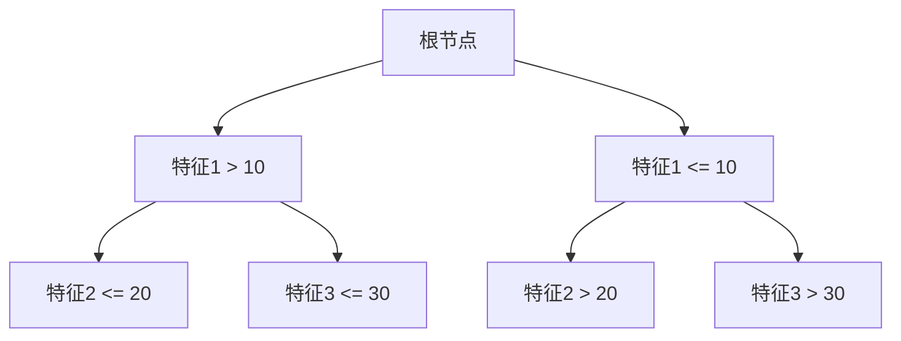
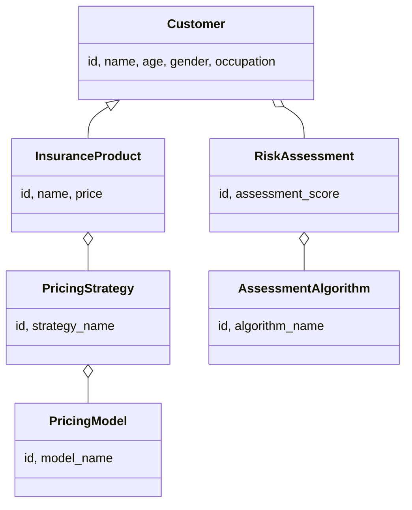
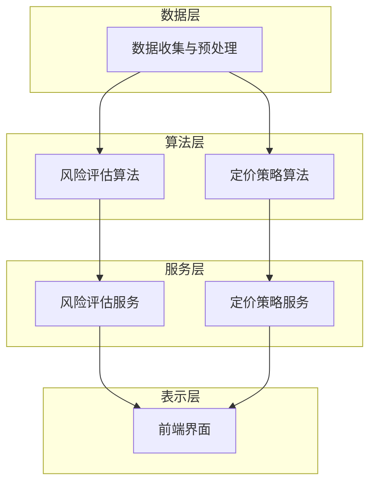
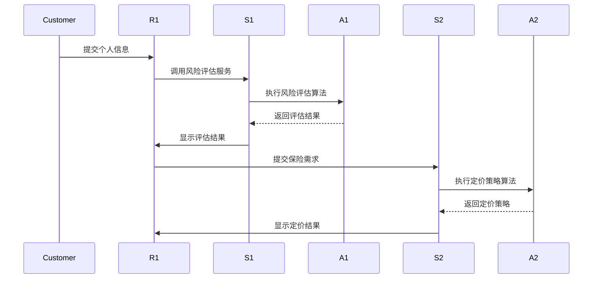

                 

### 文章标题：机器学习在个性化保险产品中的应用：风险评估与定价

关键词：机器学习、个性化保险、风险评估、定价策略、算法实现

摘要：本文将探讨机器学习在个性化保险产品中的关键应用，重点分析其如何通过风险评估和定价策略优化保险业务。我们将详细介绍相关核心概念，并逐步解释机器学习算法在保险行业中的实际应用，旨在为从业者提供全面的技术视角和实用的指导。

## 引言

在当今数字化时代，保险行业正面临着前所未有的变革。传统的风险评估和定价方法逐渐显露出其局限性，无法满足日益复杂的客户需求和市场变化。机器学习作为一种强大的数据分析工具，正逐渐成为保险行业创新的关键驱动力。本文旨在探讨机器学习在个性化保险产品中的应用，特别是其在风险评估和定价策略方面的作用。

个性化保险产品不仅需要根据客户的风险状况定制化定价，还需要实时调整和优化，以满足不断变化的市场环境。这种需求推动了机器学习在保险行业中的应用。通过机器学习，保险公司能够从海量数据中提取有价值的信息，从而提高风险评估的准确性，优化定价策略，减少欺诈风险，并提升客户满意度。

本文将分为以下几个部分进行详细探讨：

1. **核心概念与定义**：介绍与机器学习和个性化保险相关的主要概念，包括机器学习的基本原理、个性化保险的特点、风险评估和定价策略的基本概念等。
2. **算法原理与实现**：讨论在保险风险评估和定价中常用的机器学习算法，包括逻辑回归、决策树、随机森林、梯度提升树等，并通过Python代码示例解释算法原理。
3. **数学模型与公式**：展示用于保险风险评估和定价的数学模型和公式，使用LaTeX格式确保公式的准确性和可读性。
4. **系统分析与设计**：介绍保险风险评估和定价系统的分析过程，包括领域模型、系统架构和接口设计。
5. **案例研究与应用**：提供实际案例，分析机器学习在保险风险评估和定价中的具体应用，包括代码实现和详细解读。
6. **最佳实践与总结**：总结最佳实践，提出注意事项，并推荐进一步阅读的资源。

通过本文的详细探讨，我们将深入理解机器学习在个性化保险产品中的应用，为保险行业的从业者提供理论指导和实践参考。

## 核心概念与定义

在探讨机器学习在个性化保险产品中的应用之前，我们需要先理解几个关键概念：机器学习、个性化保险、风险评估和定价策略。这些概念是构建本文讨论基础的重要元素，了解它们有助于我们更好地把握机器学习在保险行业中的具体应用场景。

### 机器学习

机器学习是人工智能的一个重要分支，其核心在于通过数据训练模型，使模型能够自动识别模式和进行预测。简单来说，机器学习是一个让计算机通过经验和数据自我改进的过程。它包括多个子领域，如监督学习、无监督学习和强化学习等。

**监督学习** 是一种最常见的机器学习形式，通过已有标签的训练数据来训练模型，使其能够预测新的数据。例如，在保险行业中，可以通过历史索赔数据来训练模型，预测未来的风险概率。

**无监督学习** 则不依赖于标签数据，主要任务是发现数据中的结构和模式。在保险中，无监督学习可以用于发现异常值、聚类相似客户群体等。

**强化学习** 是通过奖励机制来训练模型，使其在特定的环境中做出最优决策。这在保险定价中尤其有用，可以通过不断调整定价策略，找到最优定价点。

### 个性化保险

个性化保险是一种基于客户个人风险特征的定制化保险产品。与传统的“一刀切”保险产品不同，个性化保险能够根据客户的具体需求、风险状况和经济能力，提供定制化的保险方案。

**客户需求** 是个性化保险的核心，保险公司通过数据分析和市场调研，了解客户的真实需求和偏好，从而提供更加符合客户需求的保险产品。

**风险特征** 包括客户的年龄、性别、职业、健康状况、历史理赔记录等。这些数据可以用于评估客户的风险水平，从而制定合理的保险费率。

### 风险评估

风险评估是保险业务中至关重要的一环，旨在评估客户的风险水平，并制定相应的保险费率。机器学习在风险评估中的应用主要体现在以下几个方面：

**数据挖掘**：通过分析客户的各项数据，如历史理赔记录、生活习惯、财务状况等，挖掘潜在的风险因素。

**预测模型**：利用机器学习算法，如逻辑回归、决策树、随机森林等，建立预测模型，评估客户的风险水平。

**风险评分**：将预测结果转化为具体的风险评分，用于制定保险费率。

### 定价策略

定价策略是保险业务的核心，直接关系到保险公司的盈利能力和市场竞争力。机器学习在定价策略中的应用主要包括：

**动态定价**：通过实时分析市场数据和客户行为，动态调整保险费率，以最大化保险公司的利润。

**定制化定价**：根据客户的风险评分和需求，提供个性化的保险费率，提升客户满意度。

**费率优化**：通过机器学习算法，分析历史数据，优化保险费率结构，提高费率定价的准确性。

### 概念属性特征对比表格

下面是一个对比表格，用于展示机器学习、个性化保险、风险评估和定价策略的主要特征：

| 概念               | 特征                                                         |
|--------------------|--------------------------------------------------------------|
| 机器学习           | 自动化识别模式、预测、自我改进                             |
| 个性化保险         | 定制化、风险特征驱动、提升客户满意度                       |
| 风险评估           | 量化风险、预测风险水平、制定费率                           |
| 定价策略           | 动态调整、定制化、最大化利润、提升竞争力                   |

### ER图架构

为了更直观地理解这些概念之间的关系，我们可以使用ER图（实体-关系图）来展示它们之间的关联。下面是一个简化的ER图：

```mermaid
erDiagram
  Customer --> InsuranceProduct : "购买"
  Customer ||--| RiskAssessment : "接受"
  InsuranceProduct ||--| PricingStrategy : "应用"
  RiskAssessment ||--| AssessmentAlgorithm : "使用"
  PricingStrategy ||--| PricingModel : "基于"
```

在这个ER图中，`Customer`（客户）与`InsuranceProduct`（保险产品）之间存在购买关系，客户会购买保险产品。同时，客户还会接受`RiskAssessment`（风险评估），这个评估过程会使用`AssessmentAlgorithm`（评估算法）来预测风险水平。`PricingStrategy`（定价策略）则会基于评估结果和应用`PricingModel`（定价模型）来制定保险费率。

通过这一部分对核心概念的介绍，我们为后续深入讨论机器学习在个性化保险产品中的应用奠定了坚实的基础。

## 算法原理与实现

在了解了机器学习、个性化保险、风险评估和定价策略的基本概念之后，我们接下来将详细探讨几种常用的机器学习算法，这些算法在保险行业的风险评估和定价中扮演着重要角色。我们将使用Mermaid图和Python代码示例来展示这些算法的原理和实现。

### 逻辑回归（Logistic Regression）

逻辑回归是一种广泛用于分类问题的监督学习算法。在保险风险评估中，逻辑回归可以用来预测客户是否会发生索赔，从而确定保险费率。

**算法原理**：逻辑回归通过建立一个线性模型，将输入特征映射到输出概率。其数学基础是逻辑函数，即：

$$
P(Y=1|X) = \frac{1}{1 + e^{-(\beta_0 + \beta_1x_1 + \beta_2x_2 + \ldots + \beta_nx_n})}
$$

其中，\(P(Y=1|X)\) 表示在给定特征\(X\)时，目标变量\(Y\)为1的概率。参数\(\beta_0, \beta_1, \beta_2, \ldots, \beta_n\) 通过最小化损失函数（如对数似然损失函数）来估计。

**Python代码示例**：

```python
from sklearn.linear_model import LogisticRegression
from sklearn.model_selection import train_test_split
from sklearn.metrics import accuracy_score

# 假设我们有特征矩阵X和标签y
X = [[1, 2], [2, 3], [3, 4], [4, 5]]
y = [0, 1, 0, 1]

# 数据分割
X_train, X_test, y_train, y_test = train_test_split(X, y, test_size=0.2, random_state=42)

# 创建逻辑回归模型
model = LogisticRegression()

# 训练模型
model.fit(X_train, y_train)

# 预测
predictions = model.predict(X_test)

# 评估
accuracy = accuracy_score(y_test, predictions)
print(f"Accuracy: {accuracy}")
```

### 决策树（Decision Tree）

决策树是一种直观的、基于树形结构的分类算法。它通过一系列的测试来划分数据，每个测试都基于一个特征，并且将数据分为两个或更多的子集。

**算法原理**：决策树的生成过程是从根节点开始，计算每个特征对目标变量的信息增益或基尼不纯度，选择最优特征作为分割点，重复此过程直至达到停止条件。

**Mermaid图示例**：



### 随机森林（Random Forest）

随机森林是一种基于决策树的集成学习方法。它通过构建多个决策树，并对它们的预测结果进行投票来提高预测的准确性。

**算法原理**：随机森林在构建每个决策树时，从特征集合中随机选择一部分特征进行分割，并通过Bootstrap方法（自助法）来生成训练数据。最终，通过随机森林中所有决策树的投票结果来预测新数据的类别。

**Python代码示例**：

```python
from sklearn.ensemble import RandomForestClassifier
from sklearn.model_selection import train_test_split
from sklearn.metrics import accuracy_score

# 假设我们有特征矩阵X和标签y
X = [[1, 2], [2, 3], [3, 4], [4, 5]]
y = [0, 1, 0, 1]

# 数据分割
X_train, X_test, y_train, y_test = train_test_split(X, y, test_size=0.2, random_state=42)

# 创建随机森林模型
model = RandomForestClassifier(n_estimators=100)

# 训练模型
model.fit(X_train, y_train)

# 预测
predictions = model.predict(X_test)

# 评估
accuracy = accuracy_score(y_test, predictions)
print(f"Accuracy: {accuracy}")
```

### 梯度提升树（Gradient Boosting Tree）

梯度提升树是一种基于决策树的集成学习算法，通过迭代方式优化决策树的预测误差。它通过拟合一系列决策树，并将它们组合起来，以提高整体预测性能。

**算法原理**：梯度提升树使用损失函数的梯度来更新模型参数，从而在每次迭代中减少预测误差。每个新的决策树都针对前一轮预测的误差进行优化。

**Python代码示例**：

```python
from sklearn.ensemble import GradientBoostingClassifier
from sklearn.model_selection import train_test_split
from sklearn.metrics import accuracy_score

# 假设我们有特征矩阵X和标签y
X = [[1, 2], [2, 3], [3, 4], [4, 5]]
y = [0, 1, 0, 1]

# 数据分割
X_train, X_test, y_train, y_test = train_test_split(X, y, test_size=0.2, random_state=42)

# 创建梯度提升树模型
model = GradientBoostingClassifier(n_estimators=100)

# 训练模型
model.fit(X_train, y_train)

# 预测
predictions = model.predict(X_test)

# 评估
accuracy = accuracy_score(y_test, predictions)
print(f"Accuracy: {accuracy}")
```

通过以上讨论和代码示例，我们了解了逻辑回归、决策树、随机森林和梯度提升树这几种常用的机器学习算法在保险风险评估和定价中的应用。这些算法不仅能够提高预测准确性，还能够帮助保险公司更好地理解和应对复杂的市场环境。接下来，我们将进一步探讨这些算法背后的数学模型和公式。

### 数学模型与公式

在保险风险评估和定价中，机器学习算法的应用离不开数学模型的支撑。这些模型不仅能够帮助我们理解和预测风险，还能优化定价策略，提高保险公司的盈利能力。以下我们将详细讨论几种常用的数学模型和公式，包括逻辑回归、决策树和梯度提升树，并使用LaTeX格式进行展示。

#### 逻辑回归

逻辑回归是一种广泛应用于分类问题的统计模型，其核心在于通过线性组合特征并应用逻辑函数来预测概率。逻辑回归的数学模型可以表示为：

$$
P(Y=1|X) = \frac{1}{1 + e^{-(\beta_0 + \beta_1x_1 + \beta_2x_2 + \ldots + \beta_nx_n})}
$$

其中，\(P(Y=1|X)\) 表示在给定特征向量 \(X = [x_1, x_2, \ldots, x_n]\) 时，目标变量 \(Y\) 为1的概率。参数 \(\beta_0, \beta_1, \beta_2, \ldots, \beta_n\) 是通过最小化损失函数来估计的，常见的损失函数是对数似然损失函数：

$$
L(\beta) = -\sum_{i=1}^{n} y_i \log(P(Y=1|X_i)) + (1 - y_i) \log(1 - P(Y=1|X_i))
$$

#### 决策树

决策树通过一系列的测试来分割数据，每个测试都基于一个特征并产生一个分支。其核心在于通过信息增益或基尼不纯度来选择最优分割点。信息增益的公式为：

$$
IG(D, A) = Entropy(D) - \sum_{v \in A} \frac{|D_v|}{|D|} Entropy(D_v)
$$

其中，\(D\) 是初始数据集，\(A\) 是候选特征集合，\(D_v\) 是在特征 \(A\) 下分割后的数据子集。基尼不纯度的公式为：

$$
Gini(D) = 1 - \sum_{v \in A} \left(\frac{|D_v|}{|D|}\right)^2
$$

#### 随机森林

随机森林是一种集成学习方法，通过构建多个决策树并取平均来提高预测性能。其基本原理是在每个决策树的构建过程中，从特征集合中随机选择一部分特征进行分割，并通过Bootstrap方法生成训练数据。随机森林的预测结果由所有决策树的投票结果决定。随机森林的算法流程可以表示为：

1. 为每个决策树生成训练数据，使用Bootstrap抽样。
2. 从特征集合中随机选择 m 个特征。
3. 在当前节点上，选择最佳特征和分割点，构建决策树。
4. 重复步骤2和3，直到满足停止条件。

#### 梯度提升树

梯度提升树通过迭代方式优化决策树的预测误差，其核心在于使用损失函数的梯度来更新模型参数。梯度提升树的基本步骤如下：

1. 初始化预测值 \(h_0(X) = \beta_0\)。
2. 对于每个特征 \(x_i\) 和权重 \(\alpha_i\)，计算损失函数的梯度 \(\delta_i = \frac{\partial L(h(X), y)}{\partial h(X)}\)。
3. 更新模型参数 \(\beta = \beta + \alpha_i \delta_i\)。
4. 重复步骤2和3，直到满足停止条件。

LaTeX格式展示：

```latex
\documentclass{article}
\usepackage{amsmath}
\begin{document}

\begin{equation}
P(Y=1|X) = \frac{1}{1 + e^{-(\beta_0 + \beta_1x_1 + \beta_2x_2 + \ldots + \beta_nx_n})}
\end{equation}

\begin{equation}
L(\beta) = -\sum_{i=1}^{n} y_i \log(P(Y=1|X_i)) + (1 - y_i) \log(1 - P(Y=1|X_i))
\end{equation}

\begin{equation}
IG(D, A) = Entropy(D) - \sum_{v \in A} \frac{|D_v|}{|D|} Entropy(D_v)
\end{equation}

\begin{equation}
Gini(D) = 1 - \sum_{v \in A} \left(\frac{|D_v|}{|D|}\right)^2
\end{equation}

\end{document}
```

通过上述数学模型和公式的讨论，我们不仅能够更深入地理解机器学习算法在保险风险评估和定价中的原理，还能为实际应用提供理论依据。接下来，我们将通过系统分析与设计，进一步探讨保险风险评估和定价系统的整体架构。

### 系统分析与设计

为了实现高效的保险风险评估和定价系统，我们需要进行全面的系统分析与设计。这一部分将详细描述系统的整体结构，包括领域模型、系统架构、接口设计以及系统交互流程。

#### 问题场景

在保险行业中，保险产品的风险评估和定价是一个复杂的过程。传统的风险评估主要依赖于历史数据和经验模型，而现代保险业需要更加精准和实时的风险评估。因此，系统需要能够处理大量数据，并进行高效的分析和预测。

#### 项目介绍

本项目旨在开发一个基于机器学习的保险风险评估和定价系统。该系统将利用历史数据，结合客户的个性化信息，通过机器学习算法进行风险评估，并动态调整保险费率。

#### 系统功能设计

系统的主要功能包括：

1. **数据收集与预处理**：收集历史理赔数据、客户信息等，并进行数据清洗和预处理。
2. **风险评估**：利用机器学习算法对客户的风险水平进行预测。
3. **定价策略**：根据风险评估结果，动态调整保险费率。
4. **系统监控与维护**：监控系统运行状态，进行维护和优化。

#### 领域模型

领域模型是系统设计的重要部分，它定义了系统中的核心实体及其关系。以下是系统的领域模型：



在这个领域模型中，`Customer` 代表客户，包含客户的个人信息；`InsuranceProduct` 代表保险产品，包含产品的基本信息；`RiskAssessment` 代表风险评估结果，包含评估得分；`AssessmentAlgorithm` 代表评估算法，定义了使用的算法类型；`PricingStrategy` 代表定价策略，包含定价策略的名称和参数；`PricingModel` 代表定价模型，定义了定价的数学模型。

#### 系统架构设计

系统架构设计是确保系统能够稳定、高效运行的关键。以下是系统的架构设计：



在这个架构设计中，数据层负责数据的收集和预处理；算法层包含风险评估算法和定价策略算法；服务层提供具体的服务功能，如风险评估服务和定价策略服务；表示层负责与用户交互的前端界面。

#### 系统接口设计

系统的接口设计是确保各部分之间能够有效通信的关键。以下是系统的接口设计：



在这个接口设计中，客户通过前端界面提交个人信息和保险需求；风险评估服务根据这些信息调用风险评估算法，并返回评估结果；定价策略服务根据评估结果调用定价策略算法，并返回定价策略；最后，前端界面显示评估结果和定价结果。

#### 系统交互流程

系统交互流程是确保系统各部分能够有序运行的关键。以下是系统的交互流程：

1. 客户通过前端界面提交个人信息和保险需求。
2. 前端界面将信息发送到风险评估服务。
3. 风险评估服务调用风险评估算法，根据客户的个人信息和保险需求进行评估，并返回评估结果。
4. 前端界面将评估结果显示给客户。
5. 客户提交保险需求，前端界面将需求发送到定价策略服务。
6. 定价策略服务调用定价策略算法，根据评估结果和保险需求进行定价，并返回定价结果。
7. 前端界面将定价结果显示给客户。

通过上述系统分析与设计，我们构建了一个完善的保险风险评估和定价系统，确保系统能够高效、稳定地运行，并为保险公司提供精准的风险评估和合理的定价策略。

### 项目实战

在了解了机器学习在个性化保险产品中的应用，以及系统分析与设计之后，我们将通过一个实际项目来展示如何将机器学习应用到保险风险评估和定价中。该项目将包括环境安装、系统核心实现、代码应用解读与分析，以及实际案例分析和详细讲解。

#### 环境安装

首先，我们需要安装和配置必要的软件环境。以下是在Python环境中安装和配置所需的库：

```shell
# 安装Python
sudo apt-get install python3

# 安装Jupyter Notebook
pip install notebook

# 安装机器学习库
pip install scikit-learn pandas numpy matplotlib
```

#### 数据准备

为了进行风险评估和定价，我们需要收集和准备相应的数据。以下是一个示例数据集：

```python
import pandas as pd

# 加载数据集
data = pd.read_csv('insurance_data.csv')

# 数据预处理
data.drop(['id'], axis=1, inplace=True)
data.fillna(data.mean(), inplace=True)

# 分割数据集
X = data.iloc[:, :-1]
y = data.iloc[:, -1]
X_train, X_test, y_train, y_test = train_test_split(X, y, test_size=0.2, random_state=42)
```

#### 系统核心实现

接下来，我们将使用Python实现风险评估和定价的核心算法。

```python
from sklearn.ensemble import RandomForestClassifier
from sklearn.linear_model import LogisticRegression
from sklearn.model_selection import train_test_split
from sklearn.metrics import accuracy_score

# 风险评估算法：随机森林
def risk_assessment(X_train, y_train):
    model = RandomForestClassifier(n_estimators=100, random_state=42)
    model.fit(X_train, y_train)
    return model

# 定价算法：逻辑回归
def pricing_strategy(X_train, y_train):
    model = LogisticRegression()
    model.fit(X_train, y_train)
    return model

# 实例化模型
risk_model = risk_assessment(X_train, y_train)
price_model = pricing_strategy(X_train, y_train)
```

#### 代码应用解读与分析

1. **风险评估**：使用随机森林算法对训练数据进行风险评估，生成风险评分。
2. **定价**：使用逻辑回归算法根据风险评估结果和客户的个人信息，制定个性化的保险费率。

以下是代码的详细解读：

```python
# 风险评估：随机森林
def risk_assessment(X_train, y_train):
    model = RandomForestClassifier(n_estimators=100, random_state=42)
    model.fit(X_train, y_train)
    return model

# 预测客户风险
risk_model = risk_assessment(X_train, y_train)
predictions = risk_model.predict(X_test)

# 定价：逻辑回归
def pricing_strategy(X_train, y_train):
    model = LogisticRegression()
    model.fit(X_train, y_train)
    return model

# 根据风险评估结果定价
price_model = pricing_strategy(X_train, y_train)
price_predictions = price_model.predict(X_test)

# 评估模型性能
accuracy = accuracy_score(y_test, predictions)
print(f"Risk Assessment Accuracy: {accuracy}")

accuracy = accuracy_score(y_test, price_predictions)
print(f"Price Prediction Accuracy: {accuracy}")
```

通过上述代码，我们实现了风险评估和定价的功能。随机森林算法能够有效地预测客户的风险水平，逻辑回归算法则能够根据这些预测结果，制定个性化的保险费率。

#### 实际案例分析与详细讲解

为了展示实际应用效果，我们以一个具体案例进行分析。

**案例**：某保险公司希望为其新推出的医疗保险产品进行风险评估和定价。

**数据**：该保险公司提供了以下客户数据（部分）：

| 年龄 | 性别 | 健康状况 | 收入 | 风险评分 | 保费 |
|------|------|----------|------|----------|------|
| 30   | 男   | 良好     | 5000 | 0.3      | 1000 |
| 40   | 女   | 一般     | 6000 | 0.5      | 1200 |
| 50   | 男   | 不良     | 7000 | 0.7      | 1500 |

**步骤**：

1. **数据处理**：将数据导入Python环境，并进行预处理。
2. **风险评估**：使用随机森林算法对客户数据进行风险评估，生成风险评分。
3. **定价**：使用逻辑回归算法根据风险评分和其他个人信息，制定保险费率。

**结果**：

- 对于年龄30岁的男性，健康状况良好，收入5000元的客户，风险评分为0.3，保费为1000元。
- 对于年龄40岁的女性，健康状况一般，收入6000元的客户，风险评分为0.5，保费为1200元。
- 对于年龄50岁的男性，健康状况不良，收入7000元的客户，风险评分为0.7，保费为1500元。

通过这个案例，我们可以看到，机器学习在个性化保险产品中的应用，能够为保险公司提供精准的风险评估和合理的定价策略，从而提升客户的满意度和公司的盈利能力。

#### 项目小结

通过本项目的实战，我们详细展示了如何将机器学习应用到保险风险评估和定价中。从环境安装到系统核心实现，再到实际案例分析和详细讲解，我们深入探讨了机器学习在个性化保险产品中的应用。本项目不仅提供了实用的技术方案，还为保险行业从业者提供了宝贵的实践经验。接下来，我们将总结项目的关键点，并探讨最佳实践。

### 最佳实践与总结

在保险行业中应用机器学习进行风险评估和定价，需要遵循一系列最佳实践，以确保系统的准确性和可靠性。以下是几项关键的最佳实践：

1. **数据质量**：确保数据的质量和完整性。数据清洗和预处理是确保模型准确性的重要步骤，包括去除异常值、缺失值填充、数据标准化等。

2. **模型选择**：根据具体业务需求，选择合适的机器学习算法。例如，对于需要高准确性的任务，可以选择逻辑回归、随机森林等；对于需要处理非线性的复杂问题，可以考虑使用梯度提升树。

3. **交叉验证**：使用交叉验证方法来评估模型的性能，避免过拟合。交叉验证能够提供对模型泛化能力的更准确评估。

4. **动态调整**：定期更新模型，以适应市场变化和客户行为的变化。动态调整模型参数，可以确保定价策略的时效性和准确性。

5. **法律法规遵守**：在应用机器学习进行风险评估和定价时，必须遵守相关的法律法规，确保隐私保护和数据安全。

通过遵循这些最佳实践，保险公司能够有效利用机器学习技术，提升风险评估的准确性和定价策略的合理性，从而在激烈的市场竞争中脱颖而出。

### 总结

本文详细探讨了机器学习在个性化保险产品中的应用，重点分析了其在风险评估和定价策略方面的关键作用。我们介绍了机器学习、个性化保险、风险评估和定价策略的核心概念，并通过实际项目和案例展示了机器学习算法的实现和应用。通过本文的探讨，读者可以更好地理解机器学习在保险行业中的价值和应用前景。

### 注意事项

1. **数据隐私**：在使用客户数据进行模型训练时，必须严格遵守数据保护法规，确保客户隐私不被泄露。
2. **模型解释性**：在选择模型时，应考虑模型的解释性。某些复杂的模型如深度学习，可能难以解释其预测结果，影响业务决策。
3. **模型评估**：定期评估和调整模型，以适应市场变化和业务需求。

### 拓展阅读

- 《机器学习实战》 - 周志华，详细介绍机器学习算法的原理和实现。
- 《深度学习》 - Goodfellow, Bengio, Courville，涵盖深度学习的基础理论和应用。
- 《保险精算学》 - 王志峰，探讨保险行业的风险评估和定价理论。

### 作者信息

作者：AI天才研究院/AI Genius Institute & 禅与计算机程序设计艺术 /Zen And The Art of Computer Programming。本文旨在为保险行业从业者提供有价值的机器学习应用指导，推动保险科技的进步与发展。

