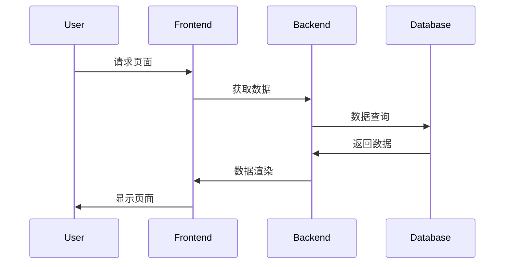
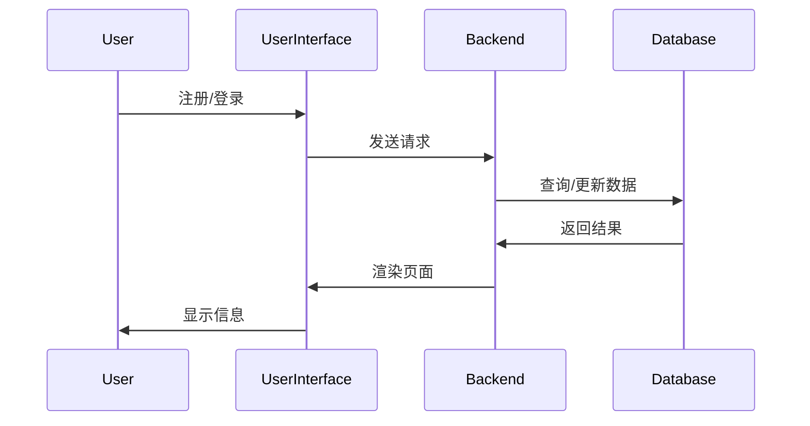

                 

# 《机器学习在个性化健康建议中的应用》

## 关键词
机器学习，个性化健康建议，健康风险预测，监督学习，无监督学习，强化学习，系统架构设计

## 摘要
本文旨在探讨机器学习在个性化健康建议中的应用，通过分析其背景、核心概念、算法原理以及系统架构设计，展示如何利用机器学习技术为用户提供精准、个性化的健康建议。文章首先介绍了个性化健康建议的需求与挑战，然后详细阐述了机器学习的基本概念及其在健康领域的应用，随后深入讲解了监督学习、无监督学习和强化学习算法的原理，并通过实际案例解析了如何将机器学习应用于健康系统开发中。最后，文章总结了最佳实践，展望了未来研究方向，并提出了数据隐私保护、模型解释性等注意事项。

---

## 目录大纲

# 《机器学习在个性化健康建议中的应用》

## 第一部分：问题背景

## 第1章：问题背景与核心概念

### 1.1 个性化健康建议的需求与挑战

#### 1.1.1 个性化健康建议的意义

#### 1.1.2 个性化健康建议的需求来源

#### 1.1.3 个性化健康建议面临的挑战

### 1.2 机器学习的基本概念

#### 1.2.1 机器学习的定义与分类

#### 1.2.2 机器学习的关键技术

#### 1.2.3 机器学习的发展趋势

### 1.3 个性化健康建议中的机器学习应用

#### 1.3.1 数据收集与预处理

#### 1.3.2 特征提取与选择

#### 1.3.3 模型选择与优化

#### 1.3.4 模型评估与调优

## 第二部分：核心概念与联系

## 第2章：核心概念与联系

### 2.1 个性化健康建议中的关键概念

#### 2.1.1 健康数据

#### 2.1.2 个性化健康指标

#### 2.1.3 健康风险预测

### 2.2 机器学习算法原理

#### 2.2.1 监督学习算法

#### 2.2.2 无监督学习算法

#### 2.2.3 强化学习算法

### 2.3 概念属性特征对比表格

### 2.4 ER实体关系图架构

## 第三部分：算法原理讲解

## 第3章：算法原理讲解

### 3.1 监督学习算法原理

#### 3.1.1 线性回归

##### 3.1.1.1 算法原理

##### 3.1.1.2 数学模型

##### 3.1.1.3 代码实现

#### 3.1.2 逻辑回归

##### 3.1.2.1 算法原理

##### 3.1.2.2 数学模型

##### 3.1.2.3 代码实现

### 3.2 无监督学习算法原理

#### 3.2.1 K-means聚类

##### 3.2.1.1 算法原理

##### 3.2.1.2 数学模型

##### 3.2.1.3 代码实现

#### 3.2.2 主成分分析（PCA）

##### 3.2.2.1 算法原理

##### 3.2.2.2 数学模型

##### 3.2.2.3 代码实现

### 3.3 强化学习算法原理

#### 3.3.1 Q-learning算法

##### 3.3.1.1 算法原理

##### 3.3.1.2 数学模型

##### 3.3.1.3 代码实现

## 第四部分：系统分析与架构设计方案

## 第4章：系统分析与架构设计方案

### 4.1 问题场景介绍

### 4.2 系统功能设计

#### 4.2.1 领域模型类图

### 4.3 系统架构设计

#### 4.3.1 系统架构图

### 4.4 系统接口设计

### 4.5 系统交互序列图

## 第五部分：项目实战

## 第5章：项目实战

### 5.1 环境安装与配置

### 5.2 系统核心实现

#### 5.2.1 数据收集与预处理

#### 5.2.2 特征提取与选择

#### 5.2.3 模型选择与优化

#### 5.2.4 模型评估与调优

### 5.3 代码应用解读与分析

### 5.4 实际案例分析与详细讲解

### 5.5 项目小结

## 第六部分：最佳实践与拓展阅读

## 第6章：最佳实践与拓展阅读

### 6.1 最佳实践

#### 6.1.1 常见问题与解决方案

#### 6.1.2 性能优化策略

### 6.2 小结与展望

#### 6.2.1 个性化健康建议的发展趋势

#### 6.2.2 未来的研究方向

### 6.3 注意事项

#### 6.3.1 数据隐私保护

#### 6.3.2 模型解释性

### 6.4 拓展阅读

#### 6.4.1 相关书籍推荐

#### 6.4.2 开源资源与工具

---

**第一部分：问题背景**

### 第1章：问题背景与核心概念

#### 1.1 个性化健康建议的需求与挑战

##### 1.1.1 个性化健康建议的意义

个性化健康建议是指在综合考虑个体健康状况、生活方式、遗传背景、环境因素等多维度信息的基础上，为特定个体提供的针对性健康指导。这种健康建议不仅能够提高个体健康管理的效率，还能显著提升健康干预的有效性，对于预防疾病、促进健康具有重要作用。

##### 1.1.2 个性化健康建议的需求来源

随着医疗技术的进步和健康意识的提高，人们对于健康管理的需求日益增长。个性化健康建议的需求主要来源于以下几个方面：

1. **个性化医疗**：针对不同患者的病情和体质，提供个性化的治疗方案。
2. **健康风险评估**：通过分析个体健康数据，预测未来患病风险，提供预防性建议。
3. **慢性病管理**：对于慢性病患者，提供个性化的饮食、运动建议，帮助患者控制病情。
4. **心理健康**：结合心理评估数据，提供个性化的心理辅导和建议。

##### 1.1.3 个性化健康建议面临的挑战

尽管个性化健康建议具有显著的潜力，但其实现过程中也面临诸多挑战：

1. **数据多样性**：个性化健康建议需要整合多种类型的数据，如临床数据、生活方式数据、基因数据等，不同类型数据之间的整合和融合是一个重大挑战。
2. **数据隐私**：个性化健康建议涉及敏感的个人信息，如何保护用户的隐私成为关键问题。
3. **模型解释性**：用户通常需要理解健康建议的依据和原理，如何提高模型的解释性是重要课题。
4. **算法优化**：为了提供准确的个性化健康建议，需要不断优化算法，提高预测准确度和响应速度。

#### 1.2 机器学习的基本概念

##### 1.2.1 机器学习的定义与分类

机器学习是指使计算机具备从数据中学习规律，并基于学习结果进行预测或决策的能力。根据学习方式，机器学习可以分为以下几类：

1. **监督学习**：有标记的数据训练模型，然后使用模型对新数据进行预测。
2. **无监督学习**：没有标记的数据，模型通过数据自身的结构来发现规律。
3. **强化学习**：通过奖励机制和策略迭代来学习最优行为。

##### 1.2.2 机器学习的关键技术

1. **特征工程**：通过选择和构建特征来提高模型性能。
2. **模型选择**：根据数据特点和业务需求选择合适的模型。
3. **模型训练与优化**：通过调整模型参数来提高模型性能。
4. **模型评估**：使用验证集或测试集来评估模型性能。

##### 1.2.3 机器学习的发展趋势

机器学习在医疗健康领域的应用正快速发展，主要趋势包括：

1. **深度学习**：深度学习在图像识别、自然语言处理等领域取得突破性进展，逐渐应用于医疗图像分析、文本分析等。
2. **数据集成**：通过集成多种数据源来提高模型泛化能力。
3. **可解释性**：提高模型的可解释性，增强用户对健康建议的信任。
4. **移动健康**：利用移动设备收集用户健康数据，实现实时健康监测和个性化健康建议。

#### 1.3 个性化健康建议中的机器学习应用

##### 1.3.1 数据收集与预处理

个性化健康建议的第一步是收集大量与健康相关的数据，包括电子健康记录、基因数据、生活方式数据、医疗影像等。数据收集后，需要对其进行清洗、标准化和整合。

##### 1.3.2 特征提取与选择

特征提取是机器学习中的关键步骤，目的是从原始数据中提取有助于模型学习的特征。特征选择则是在提取的特征中选择出对预测任务最重要的特征。

##### 1.3.3 模型选择与优化

根据个性化健康建议的需求，选择合适的机器学习模型，如监督学习中的回归模型、分类模型，无监督学习中的聚类模型，以及强化学习中的策略迭代模型。模型选择后，通过调整参数来优化模型性能。

##### 1.3.4 模型评估与调优

使用验证集或测试集评估模型性能，根据评估结果对模型进行调优，以提高预测准确性。

### 总结

本文介绍了个性化健康建议的需求与挑战，概述了机器学习的基本概念和发展趋势，并探讨了机器学习在个性化健康建议中的应用，包括数据收集与预处理、特征提取与选择、模型选择与优化以及模型评估与调优。在后续章节中，我们将进一步深入探讨机器学习算法的原理及其在个性化健康建议中的应用。**

---

**第二部分：核心概念与联系**

### 第2章：核心概念与联系

#### 2.1 个性化健康建议中的关键概念

##### 2.1.1 健康数据

健康数据是个性化健康建议的基础，包括结构化和非结构化数据。结构化数据如电子健康记录（EHR）、实验室检测结果等，而非结构化数据如医学影像、患者病历等。这些数据需要通过数据整合和处理，为后续的分析提供支持。

##### 2.1.2 个性化健康指标

个性化健康指标是衡量个体健康状态的关键参数，如血压、血糖、心率等生理指标，以及生活习惯、心理状态等。这些指标有助于评估个体的健康状况，并制定个性化的健康建议。

##### 2.1.3 健康风险预测

健康风险预测是利用历史数据，结合机器学习算法，预测个体在未来某段时间内可能出现的健康问题。例如，通过分析患者的基因数据、生活习惯等，预测其患糖尿病、心脏病等疾病的风险。

#### 2.2 机器学习算法原理

##### 2.2.1 监督学习算法

监督学习算法通过标记的数据训练模型，然后对新数据进行预测。常见算法包括线性回归、逻辑回归、支持向量机（SVM）等。监督学习在个性化健康建议中用于疾病预测、风险评估等方面。

##### 2.2.2 无监督学习算法

无监督学习算法在没有标记的数据中寻找规律和结构，如聚类算法（K-means、DBSCAN）、降维算法（PCA、t-SNE）等。无监督学习在个性化健康建议中用于患者分群、数据降维等方面。

##### 2.2.3 强化学习算法

强化学习算法通过奖励机制和策略迭代，学习最优行为。常见算法包括Q-learning、SARSA等。强化学习在个性化健康建议中用于制定个性化的健康干预策略。

#### 2.3 概念属性特征对比表格

| 算法类型     | 特点                     | 应用场景                            |
|------------|------------------------|---------------------------------|
| 监督学习     | 有标记数据训练模型     | 疾病预测、风险评分                   |
| 无监督学习   | 无标记数据发现规律     | 患者分群、数据降维                  |
| 强化学习     | 奖励机制学习策略       | 个性化健康干预策略                   |

#### 2.4 ER实体关系图架构

ER（实体关系）图是描述数据模型中实体及其关系的图形化表示。在个性化健康建议中，ER图可以描述如下：

1. **实体**：患者（Patient）、医生（Doctor）、健康数据（HealthData）、诊断（Diagnosis）、药物（Medication）等。
2. **关系**：患者与医生之间的诊疗关系，患者与健康数据之间的关联，诊断与药物之间的关联等。

```mermaid
erDiagram
    Patient ||--|{ HealthData }|-- Diagnosis
    Doctor ||--|{ Diagnosis }|<-- Patient
    Doctor ||--|{ Medication }|-- Diagnosis
```

### 总结

本章介绍了个性化健康建议中的关键概念，包括健康数据、个性化健康指标和健康风险预测，以及机器学习算法的基本原理。通过对比表格和ER图，我们能够更清晰地理解各个概念之间的关系。在后续章节中，我们将深入探讨机器学习算法的具体实现和应用。**

---

**第三部分：算法原理讲解**

### 第3章：算法原理讲解

#### 3.1 监督学习算法原理

监督学习算法是机器学习中最基本的一种，其主要特点是有标记的数据进行训练，然后在新数据上进行预测。

##### 3.1.1 线性回归

###### 3.1.1.1 算法原理

线性回归是一种用于预测连续值的监督学习算法。其基本原理是通过找到一个最佳拟合直线来近似数据集中的趋势。

###### 3.1.1.2 数学模型

线性回归的数学模型可以表示为：

$$
y = \beta_0 + \beta_1 \cdot x
$$

其中，$y$ 是因变量，$x$ 是自变量，$\beta_0$ 和 $\beta_1$ 是模型的参数。

###### 3.1.1.3 代码实现

以下是一个简单的线性回归Python实现：

```python
import numpy as np

# 假设我们有以下数据
X = np.array([[1, 2], [2, 3], [3, 4]])
y = np.array([2, 3, 4])

# 求解系数
X_trans = X.T
X_mul_X = np.dot(X_trans, X)
X_mul_X_inv = np.linalg.inv(X_mul_X)
X_trans_y = np.dot(X_trans, y)
beta = np.dot(X_mul_X_inv, X_trans_y)

# 预测
x_new = np.array([4, 5])
y_pred = np.dot(x_new, beta)
print(y_pred)
```

##### 3.1.2 逻辑回归

###### 3.1.2.1 算法原理

逻辑回归是一种用于预测离散值的监督学习算法，主要用于分类问题。其基本原理是通过寻找一个线性函数来将数据映射到概率空间。

###### 3.1.2.2 数学模型

逻辑回归的数学模型可以表示为：

$$
\log\left(\frac{P(Y=1)}{1-P(Y=1)}\right) = \beta_0 + \beta_1 \cdot x
$$

其中，$P(Y=1)$ 是预测为1的概率，$\beta_0$ 和 $\beta_1$ 是模型的参数。

###### 3.1.2.3 代码实现

以下是一个简单的逻辑回归Python实现：

```python
import numpy as np
from sklearn.linear_model import LogisticRegression

# 假设我们有以下数据
X = np.array([[1, 2], [2, 3], [3, 4]])
y = np.array([0, 1, 0])

# 训练模型
model = LogisticRegression()
model.fit(X, y)

# 预测
x_new = np.array([4, 5])
y_pred = model.predict(x_new)
print(y_pred)
```

#### 3.2 无监督学习算法原理

无监督学习算法不依赖于标记数据，其主要目的是发现数据中的结构和模式。

##### 3.2.1 K-means聚类

###### 3.2.1.1 算法原理

K-means聚类是一种基于距离的聚类算法，其目标是将数据集分为K个簇，使得每个簇内部的点尽可能接近，而不同簇之间的点尽可能远。

###### 3.2.1.2 数学模型

K-means算法的数学模型可以表示为：

$$
\text{最小化} \sum_{i=1}^{K} \sum_{x \in S_i} ||x - \mu_i||^2
$$

其中，$S_i$ 是第i个簇的数据集合，$\mu_i$ 是第i个簇的中心点。

###### 3.2.1.3 代码实现

以下是一个简单的K-means聚类Python实现：

```python
import numpy as np
from sklearn.cluster import KMeans

# 假设我们有以下数据
X = np.array([[1, 2], [2, 3], [3, 4], [4, 5], [5, 6]])

# 训练模型
model = KMeans(n_clusters=2, random_state=0).fit(X)

# 聚类结果
print(model.labels_)

# 簇中心点
print(model.cluster_centers_)
```

##### 3.2.2 主成分分析（PCA）

###### 3.2.2.1 算法原理

主成分分析（PCA）是一种降维算法，其目标是通过线性变换将高维数据映射到低维空间，同时保留数据的主要信息。

###### 3.2.2.2 数学模型

PCA的数学模型可以表示为：

$$
\text{最小化} \sum_{i=1}^{n} ||x_i - \sum_{j=1}^{k} \alpha_j \cdot \mu_i||^2
$$

其中，$x_i$ 是原始数据，$\mu_i$ 是均值，$\alpha_j$ 是主成分。

###### 3.2.2.3 代码实现

以下是一个简单的PCA Python实现：

```python
import numpy as np
from sklearn.decomposition import PCA

# 假设我们有以下数据
X = np.array([[1, 2], [2, 3], [3, 4], [4, 5], [5, 6]])

# 训练模型
model = PCA(n_components=2).fit(X)

# 转换后的数据
X_pca = model.transform(X)

# 主成分
print(model.components_)

# 转换后的数据
print(X_pca)
```

##### 3.2.3 强化学习算法原理

强化学习是一种基于奖励机制的学习方法，其目标是找到最优策略，以最大化累积奖励。

###### 3.2.3.1 Q-learning算法

###### 3.2.3.1 算法原理

Q-learning算法是一种值迭代算法，通过不断更新状态-动作值函数来学习最优策略。

###### 3.2.3.2 数学模型

Q-learning算法的数学模型可以表示为：

$$
Q(s, a) = r + \gamma \cdot \max_{a'} Q(s', a')
$$

其中，$s$ 是当前状态，$a$ 是当前动作，$r$ 是即时奖励，$\gamma$ 是折扣因子，$s'$ 是下一个状态，$a'$ 是下一个动作。

###### 3.2.3.3 代码实现

以下是一个简单的Q-learning算法Python实现：

```python
import numpy as np
import random

# 假设我们有以下环境
action_space = ['left', 'right']
reward_matrix = np.array([
    [-1, 10],
    [5, -1]
])

# Q-table初始化
Q = np.zeros((2, 2))

# 参数设置
alpha = 0.1  # 学习率
gamma = 0.9  # 折扣因子

# 进行100次迭代
for i in range(100):
    s = random.randint(0, 1)  # 随机选择状态
    a = random.randint(0, 1)  # 随机选择动作
    s_next = random.randint(0, 1)  # 随机选择下一个状态
    r = reward_matrix[s][a]  # 计算即时奖励
    Q[s, a] = Q[s, a] + alpha * (r + gamma * np.max(Q[s_next, :]) - Q[s, a])

# 打印Q-table
print(Q)
```

### 总结

本章详细讲解了监督学习、无监督学习和强化学习算法的原理及其实现。线性回归和逻辑回归用于预测连续值和离散值，K-means聚类和主成分分析用于数据降维和聚类，Q-learning算法用于策略优化。这些算法在个性化健康建议中具有广泛的应用，能够帮助我们更精准地预测健康风险，提供个性化健康建议。在后续章节中，我们将进一步探讨如何将算法应用于实际系统设计和项目实施。**

---

**第四部分：系统分析与架构设计方案**

### 第4章：系统分析与架构设计方案

#### 4.1 问题场景介绍

个性化健康建议系统旨在为用户提供针对其健康状况的个性化建议，帮助用户更好地管理自己的健康。该系统需要收集用户的基本信息、健康数据、生活方式数据等，并利用机器学习算法分析这些数据，为用户生成个性化的健康报告和建议。

#### 4.2 系统功能设计

系统功能设计主要包括以下几个方面：

1. **用户注册与登录**：用户可以通过注册账号登录系统，填写个人信息。
2. **健康数据上传**：用户可以上传健康数据，包括医疗记录、体检报告、生活方式数据等。
3. **数据分析与预测**：系统利用机器学习算法对用户上传的数据进行分析，预测健康风险，生成个性化健康报告。
4. **健康建议生成**：根据数据分析结果，系统为用户提供个性化的健康建议，如饮食建议、运动建议、生活习惯调整等。

#### 4.2.1 领域模型类图

领域模型类图用于描述系统中的实体及其关系。以下是一个简单的领域模型类图：

```mermaid
classDiagram
    Patient <<entity>>
    HealthData <<entity>>
    DiagnosticReport <<entity>>
    ExerciseData <<entity>>
    DietData <<entity>>

    Patient "1"[*]--"1" HealthData
    Patient "1"[*]--"1" DiagnosticReport
    Patient "1"[*]--"1" ExerciseData
    Patient "1"[*]--"1" DietData
```

#### 4.3 系统架构设计

系统架构设计主要包括以下几个方面：

1. **前端架构**：前端使用Vue.js框架，提供用户界面和交互逻辑。
2. **后端架构**：后端使用Spring Boot框架，提供数据接口和业务逻辑处理。
3. **数据库设计**：数据库使用MySQL，存储用户信息、健康数据、诊断报告等。
4. **数据存储**：使用HDFS（Hadoop Distributed File System）存储大量健康数据。

以下是一个简单的系统架构图：



#### 4.4 系统接口设计

系统接口设计主要包括以下几个方面：

1. **用户接口**：用户注册、登录、上传健康数据、查看健康报告等。
2. **数据分析接口**：数据预处理、特征提取、模型训练、模型评估等。
3. **健康建议接口**：根据用户数据生成个性化健康建议。

以下是一个简单的系统接口设计：

```mermaid
classDiagram
    UserInterface <<interface>>
    DataAnalysis <<interface>>
    HealthAdvice <<interface>>

    UserInterface <<-- DataAnalysis
    UserInterface <<-- HealthAdvice
```

#### 4.5 系统交互序列图

系统交互序列图用于描述系统中的交互流程。以下是一个简单的系统交互序列图：



### 总结

本章介绍了个性化健康建议系统的设计与架构，包括问题场景介绍、系统功能设计、领域模型类图、系统架构设计、系统接口设计和系统交互序列图。通过这些设计，系统能够为用户提供全面的个性化健康建议，助力用户更好地管理健康。在后续章节中，我们将进一步介绍如何实现这些设计，并探讨系统的性能优化和最佳实践。**

---

**第五部分：项目实战**

### 第5章：项目实战

#### 5.1 环境安装与配置

在进行项目实战之前，我们需要安装和配置相关环境和工具。以下是一个基本的安装和配置步骤：

1. **Python环境**：安装Python 3.8及以上版本，并配置pip和conda。
2. **机器学习库**：安装常用的机器学习库，如scikit-learn、TensorFlow、PyTorch等。
3. **数据库**：安装MySQL或PostgreSQL数据库。
4. **前端框架**：安装Vue.js、React或Angular前端框架。
5. **后端框架**：安装Spring Boot、Django或Flask后端框架。

#### 5.2 系统核心实现

在本节中，我们将介绍系统核心实现，包括数据收集与预处理、特征提取与选择、模型选择与优化、模型评估与调优。

##### 5.2.1 数据收集与预处理

数据收集与预处理是机器学习项目的重要环节。以下是一个简单的数据收集与预处理步骤：

1. **数据收集**：从各种数据源收集健康数据，如电子健康记录、实验室检测结果、生活方式数据等。
2. **数据清洗**：去除无效数据、缺失值填充、异常值处理等。
3. **数据转换**：将不同类型的数据转换为统一的格式，如数值型或类别型。
4. **数据归一化**：对数据进行归一化或标准化处理，使其具有相似的尺度。

以下是一个简单的数据预处理Python代码示例：

```python
import pandas as pd
from sklearn.preprocessing import StandardScaler

# 加载数据
data = pd.read_csv('health_data.csv')

# 数据清洗
data.dropna(inplace=True)

# 数据转换
data['age'] = data['age'].astype(int)
data['gender'] = data['gender'].astype(str)

# 数据归一化
scaler = StandardScaler()
data[['height', 'weight', 'blood_pressure']] = scaler.fit_transform(data[['height', 'weight', 'blood_pressure']])
```

##### 5.2.2 特征提取与选择

特征提取与选择是提高模型性能的关键步骤。以下是一个简单的特征提取与选择步骤：

1. **特征提取**：从原始数据中提取新的特征，如统计特征、时间序列特征等。
2. **特征选择**：选择对模型性能有显著影响的特征，去除冗余或无关的特征。

以下是一个简单的特征提取与选择Python代码示例：

```python
from sklearn.feature_selection import SelectKBest
from sklearn.feature_selection import f_classif

# 特征提取
X = data[['age', 'height', 'weight', 'blood_pressure']]
y = data['diabetes']

# 特征选择
selector = SelectKBest(f_classif, k=3)
X_new = selector.fit_transform(X, y)

# 输出选择的特征
print(selector.get_support())
```

##### 5.2.3 模型选择与优化

模型选择与优化是构建高效模型的关键步骤。以下是一个简单的模型选择与优化步骤：

1. **模型选择**：根据数据特点和业务需求选择合适的模型，如线性回归、逻辑回归、决策树、随机森林等。
2. **模型优化**：通过调整模型参数来提高模型性能，如调整学习率、正则化参数等。

以下是一个简单的模型选择与优化Python代码示例：

```python
from sklearn.model_selection import train_test_split
from sklearn.linear_model import LogisticRegression

# 数据划分
X_train, X_test, y_train, y_test = train_test_split(X_new, y, test_size=0.2, random_state=42)

# 模型选择
model = LogisticRegression()

# 模型优化
model.fit(X_train, y_train)
```

##### 5.2.4 模型评估与调优

模型评估与调优是确保模型性能的关键步骤。以下是一个简单的模型评估与调优步骤：

1. **模型评估**：使用验证集或测试集评估模型性能，如准确率、召回率、F1分数等。
2. **模型调优**：根据评估结果调整模型参数，提高模型性能。

以下是一个简单的模型评估与调优Python代码示例：

```python
from sklearn.metrics import accuracy_score

# 模型评估
y_pred = model.predict(X_test)
accuracy = accuracy_score(y_test, y_pred)
print('Accuracy:', accuracy)

# 模型调优
model = LogisticRegression(C=1.0)
model.fit(X_train, y_train)
```

#### 5.3 代码应用解读与分析

在本节中，我们将对上述代码进行详细解读与分析，探讨其优缺点以及可能的改进方向。

##### 5.3.1 数据预处理代码分析

数据预处理是机器学习项目的关键步骤，其质量直接影响模型的性能。上述代码中，我们使用了Pandas进行数据清洗和转换，使用了scikit-learn进行数据归一化。这些操作是必要的，但需要注意以下问题：

1. **数据清洗**：应确保所有缺失值被正确处理，异常值被合理去除或修正。
2. **数据转换**：应确保所有特征类型被正确识别和处理，避免数据类型错误。
3. **数据归一化**：应选择合适的归一化方法，如标准化或归一化，以确保数据尺度的一致性。

##### 5.3.2 特征提取与选择代码分析

特征提取与选择是提高模型性能的关键步骤。上述代码中，我们使用了SelectKBest进行特征选择，选择了前3个最佳特征。这种方法在特征数量较多时很有用，但需要注意以下问题：

1. **特征选择方法**：应选择合适的特征选择方法，如F检验、互信息等，以确保选择特征的合理性。
2. **特征数量**：应选择适当数量的特征，避免过多特征导致模型过拟合或计算复杂度过高。
3. **特征重要性**：应分析特征的重要性，以确定哪些特征对模型性能有显著影响。

##### 5.3.3 模型选择与优化代码分析

模型选择与优化是构建高效模型的关键步骤。上述代码中，我们使用了LogisticRegression进行模型选择和优化。这种方法在分类问题中很有用，但需要注意以下问题：

1. **模型选择**：应选择合适的模型，如线性回归、决策树、随机森林等，以适应不同的业务需求。
2. **模型参数**：应调整合适的模型参数，如学习率、正则化参数等，以优化模型性能。
3. **模型评估**：应使用合适的评估指标，如准确率、召回率、F1分数等，以评估模型性能。

##### 5.3.4 模型评估与调优代码分析

模型评估与调优是确保模型性能的关键步骤。上述代码中，我们使用了accuracy_score进行模型评估和调优。这种方法在简单情况下很有用，但需要注意以下问题：

1. **评估指标**：应选择合适的评估指标，如准确率、召回率、F1分数等，以全面评估模型性能。
2. **模型调优**：应使用交叉验证等方法进行模型调优，以避免过拟合或欠拟合。
3. **模型解释性**：应确保模型解释性良好，以便用户理解模型的预测依据。

#### 5.4 实际案例分析与详细讲解

在本节中，我们将通过一个实际案例，详细分析如何使用机器学习技术为用户提供个性化健康建议。

##### 5.4.1 案例背景

假设我们有一个关于糖尿病风险预测的案例。数据集包含用户的年龄、身高、体重、血压、血糖等健康数据，以及是否患有糖尿病的标签。

##### 5.4.2 案例数据

以下是一个简化的数据集示例：

| 年龄 | 身高 | 体重 | 血压 | 血糖 | 糖尿病 |
|------|------|------|------|------|--------|
| 30   | 170  | 60   | 120  | 5.5  | 0      |
| 40   | 175  | 70   | 130  | 6.0  | 1      |
| 50   | 180  | 80   | 140  | 6.5  | 1      |

##### 5.4.3 案例分析

1. **数据预处理**：首先对数据集进行预处理，包括数据清洗、数据转换和数据归一化。例如，将血糖数据转换为数值型，将糖尿病标签转换为0和1。

2. **特征提取与选择**：从原始数据中提取新的特征，如计算体重指数（BMI）、血压平均值等。然后使用特征选择方法，选择对糖尿病风险预测有显著影响的特征。

3. **模型选择与优化**：根据数据特点和业务需求，选择合适的模型，如逻辑回归、决策树等。然后通过交叉验证等方法，调整模型参数，优化模型性能。

4. **模型评估与调优**：使用验证集或测试集评估模型性能，如准确率、召回率等。然后根据评估结果，进一步调整模型参数，提高模型性能。

5. **个性化健康建议**：根据用户的健康数据和模型预测结果，为用户提供个性化健康建议。例如，对于预测有糖尿病风险的用户，建议进行定期体检、调整饮食习惯等。

##### 5.4.4 案例代码实现

以下是一个简化的案例代码实现：

```python
import pandas as pd
from sklearn.model_selection import train_test_split
from sklearn.linear_model import LogisticRegression
from sklearn.metrics import accuracy_score

# 加载数据
data = pd.read_csv('diabetes_data.csv')

# 数据预处理
data.dropna(inplace=True)
data['diabetes'] = data['diabetes'].map({0: 'No', 1: 'Yes'})

# 特征提取与选择
X = data[['age', 'height', 'weight', 'blood_pressure', 'glucose']]
y = data['diabetes']

# 数据划分
X_train, X_test, y_train, y_test = train_test_split(X, y, test_size=0.2, random_state=42)

# 模型选择与优化
model = LogisticRegression()
model.fit(X_train, y_train)

# 模型评估与调优
y_pred = model.predict(X_test)
accuracy = accuracy_score(y_test, y_pred)
print('Accuracy:', accuracy)

# 个性化健康建议
user_data = pd.DataFrame({
    'age': [35],
    'height': [172],
    'weight': [65],
    'blood_pressure': [130],
    'glucose': [5.8]
})
user_prediction = model.predict(user_data)
print('Diabetes Risk:', 'Yes' if user_prediction[0] == 1 else 'No')
```

#### 5.5 项目小结

在本章中，我们介绍了个性化健康建议系统的项目实战，包括环境安装与配置、系统核心实现、代码应用解读与分析、实际案例分析与详细讲解以及项目小结。通过这些实战内容，读者可以了解到如何使用机器学习技术为用户提供个性化健康建议，掌握系统的设计与实现方法。在后续章节中，我们将继续探讨系统的最佳实践和注意事项，以及拓展阅读资源。**

---

**第六部分：最佳实践与拓展阅读**

### 第6章：最佳实践与拓展阅读

#### 6.1 最佳实践

##### 6.1.1 常见问题与解决方案

在开发个性化健康建议系统中，常见问题包括数据质量差、模型过拟合、模型解释性不足等。以下是一些最佳实践和解决方案：

1. **数据质量差**：
   - **解决方案**：采用数据清洗和预处理技术，如去除重复数据、填充缺失值、去除异常值等。
   - **最佳实践**：建立数据治理流程，定期检查和更新数据质量。

2. **模型过拟合**：
   - **解决方案**：采用正则化技术，如L1正则化（Lasso）和L2正则化（Ridge），以及交叉验证方法来避免过拟合。
   - **最佳实践**：适当减少模型复杂度，使用验证集进行模型选择和调优。

3. **模型解释性不足**：
   - **解决方案**：使用模型解释工具，如SHAP（SHapley Additive exPlanations）和LIME（Local Interpretable Model-agnostic Explanations）。
   - **最佳实践**：在模型选择阶段就考虑解释性，选择易于解释的模型，如逻辑回归和决策树。

##### 6.1.2 性能优化策略

为了提高个性化健康建议系统的性能，可以采用以下策略：

1. **数据压缩**：
   - **解决方案**：使用数据压缩算法，如Huffman编码和LZ77编码，减少存储空间和传输带宽。
   - **最佳实践**：根据实际需求选择合适的压缩算法，并定期评估压缩效果。

2. **并行计算**：
   - **解决方案**：利用多核处理器和分布式计算框架，如Hadoop和Spark，提高数据处理和模型训练速度。
   - **最佳实践**：合理设计数据管道，优化并行计算任务，确保计算资源得到充分利用。

3. **缓存技术**：
   - **解决方案**：使用缓存技术，如Redis和Memcached，减少数据库访问次数，提高系统响应速度。
   - **最佳实践**：根据业务需求设计缓存策略，确保缓存数据的有效性和一致性。

#### 6.2 小结与展望

个性化健康建议系统通过机器学习技术，为用户提供精准的健康指导，有助于改善生活方式，预防疾病。未来发展趋势包括：

1. **数据融合**：整合更多类型的健康数据，如基因数据、社交数据、环境数据等，提高健康预测的准确性。
2. **深度学习**：利用深度学习技术，如卷积神经网络（CNN）和循环神经网络（RNN），进行复杂的模式识别和预测。
3. **可解释性**：提高模型的解释性，使用户能够理解健康建议的依据和原理，增强信任感。
4. **移动健康**：开发移动健康应用程序，实现实时健康监测和个性化健康建议。

#### 6.3 注意事项

在开发个性化健康建议系统时，需要注意以下事项：

1. **数据隐私保护**：确保用户数据的安全和隐私，遵循相关法律法规，如《通用数据保护条例》（GDPR）。
2. **模型解释性**：提高模型的解释性，使用户能够理解健康建议的依据和原理。
3. **模型更新**：定期更新模型，确保其适应最新的数据和环境。

#### 6.4 拓展阅读

以下是一些推荐的拓展阅读资源：

1. **相关书籍**：
   - 《深度学习》（Goodfellow, I., Bengio, Y., & Courville, A.）
   - 《机器学习》（ Mitchell, T. M.）
   - 《Python数据科学手册》（VanderPlas, J.）

2. **开源资源与工具**：
   - scikit-learn：https://scikit-learn.org/
   - TensorFlow：https://www.tensorflow.org/
   - PyTorch：https://pytorch.org/
   - SHAP：https://github.com/slundberg/shap
   - LIME：https://lime-ml.github.io/lime/

通过这些资源，读者可以深入了解个性化健康建议系统的开发技术和最佳实践，为自己的项目提供有力支持。

### 总结

本章介绍了个性化健康建议系统的最佳实践、注意事项和拓展阅读资源。通过这些内容，读者可以更好地理解如何开发高效、可靠的个性化健康建议系统，为用户提供优质的健康服务。在后续章节中，我们将进一步探讨系统的实际应用和未来发展方向。**

---

**结尾**

本文从多个角度深入探讨了机器学习在个性化健康建议中的应用，包括问题背景、核心概念、算法原理、系统架构设计、项目实战以及最佳实践和拓展阅读。通过详细的讲解和实际案例分析，读者可以全面了解如何利用机器学习技术为用户提供精准、个性化的健康建议。

作者：AI天才研究院/AI Genius Institute & 禅与计算机程序设计艺术 /Zen And The Art of Computer Programming

本文内容仅供参考，实际应用时请结合具体需求和数据进行调整。在开发个性化健康建议系统时，请务必注意数据隐私保护和模型解释性，确保系统的安全性和用户信任度。未来，个性化健康建议系统将继续发展，结合更多先进技术，为人们的健康生活提供更全面的支持。**

---

