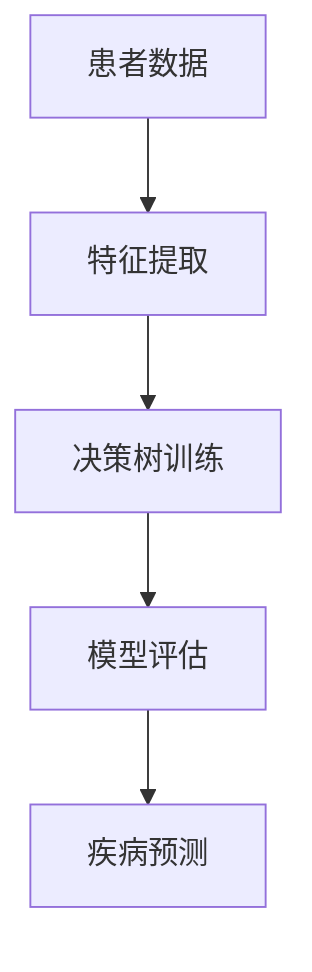
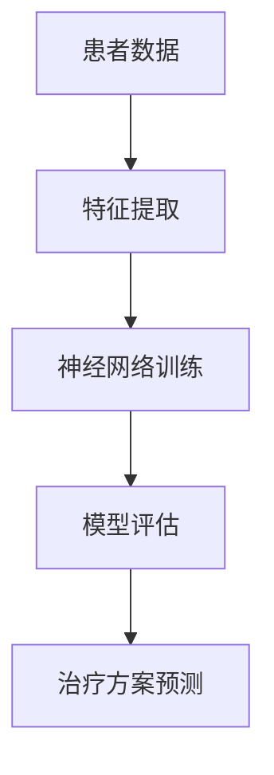
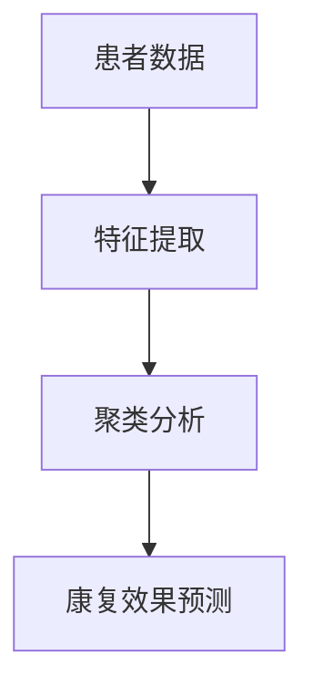
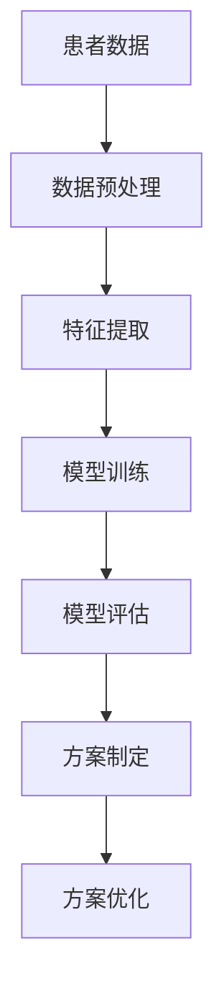
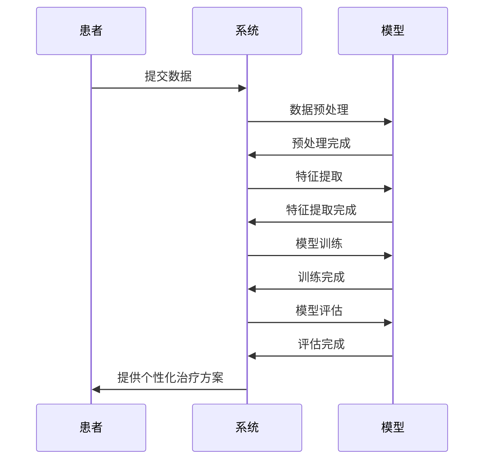

                 

**文章标题**：机器学习在个性化医疗方案制定中的应用

**关键词**：个性化医疗、机器学习、数据管理、算法原理、系统架构、案例研究、最佳实践

**摘要**：
本文将深入探讨机器学习在个性化医疗方案制定中的应用。通过对机器学习基础、个性化医疗概述、数据管理、机器学习应用、方案制定方法、评估与优化以及案例研究的全面分析，本文旨在为读者提供一个清晰、系统的理解，并展示机器学习如何助力个性化医疗的发展。

## 第一部分：引言与背景

### 1.1 书籍目的

本文书的目的是探讨机器学习在个性化医疗方案制定中的应用，旨在为医疗健康领域的专业人士、机器学习工程师以及对此领域感兴趣的学者和学生提供一本全面、深入的技术指南。通过本文书，读者将：

- 理解机器学习和个性化医疗的基本概念、发展历程及其重要性。
- 掌握机器学习在个性化医疗中的具体应用场景和方法。
- 学习如何利用机器学习算法制定个性化医疗方案，并进行评估与优化。
- 通过案例研究，了解机器学习在个性化医疗中的应用实例和最佳实践。

### 1.2 机器学习与个性化医疗

#### 背景介绍

机器学习作为人工智能的重要分支，近年来在各个领域取得了显著的进展。个性化医疗则是一种以患者为中心的医疗模式，通过整合患者的基因、环境和临床信息，为每位患者提供定制化的治疗方案。机器学习在个性化医疗中扮演着关键角色，能够帮助医生更好地理解患者病情，预测治疗效果，优化治疗方案。

#### 问题描述

个性化医疗方案制定面临的主要问题包括：

- 如何处理和分析海量医疗数据？
- 如何从数据中提取有用的特征，以支持个性化医疗方案的制定？
- 如何确保个性化医疗方案的有效性和可靠性？
- 如何在多样化的医疗场景中实现机器学习的灵活应用？

#### 问题解决

机器学习为个性化医疗方案制定提供了以下解决方案：

- 数据管理：利用机器学习技术进行数据预处理、特征提取和数据分析，提高数据质量，为个性化医疗方案提供可靠的数据支持。
- 模型构建：通过构建合适的机器学习模型，从患者的临床数据和基因数据中提取特征，预测治疗效果，制定个性化治疗方案。
- 评估与优化：利用机器学习技术对个性化医疗方案进行评估和优化，提高方案的准确性和实用性。
- 应用推广：通过实际案例研究，展示机器学习在个性化医疗中的应用，推广最佳实践，促进个性化医疗的发展。

#### 边界与外延

个性化医疗方案制定不仅涉及医学和生物学的知识，还需要计算机科学和数据分析的技术支持。本文书将重点关注机器学习在个性化医疗方案制定中的应用，包括数据管理、模型构建、评估与优化等方面。

#### 概念结构与核心要素组成

- **机器学习**：利用数据或以往的经验，让计算机程序能够不断改进并完成特定任务。
- **个性化医疗**：一种以患者为中心的医疗模式，通过整合患者的多维度信息，为每位患者提供最佳的治疗方案。
- **数据管理**：处理和分析大量医疗数据，为机器学习提供可靠的数据支持。
- **模型构建**：基于机器学习算法，构建能够预测治疗效果的模型。
- **评估与优化**：对个性化医疗方案进行评估和优化，提高其准确性和实用性。

## 第二部分：机器学习基础

### 2.1 机器学习概述

#### 核心概念与联系

**机器学习**：一种让计算机通过数据学习并改进性能的技术。它包括监督学习、无监督学习和强化学习等不同的方法。

| 类型 | 定义 | 关键特征 |
| --- | --- | --- |
| 监督学习 | 有标记的训练数据，模型从数据中学习规律，用于预测未知数据。 | 需要标记数据，目标明确，有监督过程。 |
| 无监督学习 | 没有标记的数据，模型从数据中发现模式或结构。 | 不需要标记数据，自动发现数据规律，无监督过程。 |
| 强化学习 | 机器通过与环境的交互，不断优化行为策略，以实现最佳目标。 | 有奖励和惩罚机制，目标为最大化长期奖励。 |

#### 概念属性特征对比表格

| 类型 | 数据需求 | 学习目标 | 特点 |
| --- | --- | --- | --- |
| 监督学习 | 有标记数据 | 预测未知数据 | 目标明确，监督过程 |
| 无监督学习 | 无标记数据 | 发现数据分布、聚类或降维 | 自动学习，无监督过程 |
| 强化学习 | 环境、动作和反馈 | 优化策略以最大化奖励 | 交互式学习，奖励机制 |

#### ER实体关系图架构

```mermaid
erDiagram
  Patient ||--|{ Treatment }|>
  Doctor ||--|{ Diagnosis }|>
  Data ||--|{ Analytics }|>

  Patient __||-- Diagnosis
  Treatment ||-- Doctor
  Analytics ||-- Data
```

### 2.2 常见机器学习算法

#### 算法原理讲解

**支持向量机（SVM）**：

- **mermaid 流程图**：


- **Python 源代码**：

```python
from sklearn.svm import SVC
from sklearn.model_selection import train_test_split
from sklearn.metrics import accuracy_score

# 加载数据
X, y = load_data()

# 数据预处理
X_train, X_test, y_train, y_test = train_test_split(X, y, test_size=0.2, random_state=42)

# 特征提取
# 这里省略特征提取的代码

# 模型训练
model = SVC(kernel='linear')
model.fit(X_train, y_train)

# 模型评估
y_pred = model.predict(X_test)
accuracy = accuracy_score(y_test, y_pred)
print("Accuracy:", accuracy)
```

- **数学模型**：

$$
\min_{\mathbf{w},b}\frac{1}{2}\|\mathbf{w}\|^2 + C\sum_{i=1}^{n}\xi_i
$$

其中，$\mathbf{w}$ 是权重向量，$b$ 是偏置项，$C$ 是正则化参数，$\xi_i$ 是第 $i$ 个样本的误差。

#### 举例说明

假设我们要预测患者的疾病类型。我们可以使用支持向量机来训练一个分类模型，根据患者的临床数据和基因数据来判断疾病类型。通过交叉验证，我们选择最佳的参数组合，以提高模型的准确性。

## 第三部分：个性化医疗概述

### 3.1 个性化医疗定义

个性化医疗是一种以患者为中心的医疗模式，通过整合患者的基因、环境和临床信息，为每位患者提供最佳的治疗方案。其核心思想是利用个体差异，制定个性化的治疗方案，以提高治疗效果和患者满意度。

### 3.2 个性化医疗的发展历史和现状

#### 发展历史

- **早期阶段**：个性化医疗的概念最早可以追溯到上世纪80年代，当时一些医生开始尝试根据患者的个体差异制定个性化的治疗方案。
- **中期阶段**：随着基因技术的发展，个性化医疗逐渐成为医学研究的热点，许多医疗机构开始探索如何利用基因信息为患者提供个性化的治疗方案。
- **现阶段**：个性化医疗已经从理论研究走向实际应用，许多医疗机构和科技公司正在积极研发和应用个性化医疗技术，以提高医疗质量和效率。

#### 现状

- **技术进步**：基因组学、大数据、人工智能等技术的发展为个性化医疗提供了强大的技术支持。
- **政策支持**：政府和社会对个性化医疗的重视和支持，为个性化医疗的推广提供了良好的政策环境。
- **应用场景**：个性化医疗已经在肿瘤治疗、遗传病诊断、个性化用药等方面取得显著成果。

### 3.3 个性化医疗的重要性

个性化医疗的重要性体现在以下几个方面：

- **提高治疗效果**：个性化医疗能够根据患者的个体差异，制定最佳的治疗方案，提高治疗效果。
- **降低医疗成本**：个性化医疗能够减少不必要的检查和治疗，降低医疗成本。
- **提高患者满意度**：个性化医疗能够满足患者的个体需求，提高患者满意度。

## 第四部分：个性化医疗中的数据管理

### 4.1 数据特点

个性化医疗涉及大量的数据，包括患者的临床数据、基因数据、环境数据等。这些数据具有以下特点：

- **多样性**：个性化医疗数据来源广泛，包括结构化和非结构化数据。
- **复杂性**：个性化医疗数据包含多种类型的数据，如数值型、类别型、时间序列数据等。
- **动态性**：个性化医疗数据随着时间推移不断变化，需要实时更新和处理。

### 4.2 数据管理策略

#### 数据预处理

- **数据清洗**：去除重复数据、缺失数据和不一致数据。
- **数据集成**：将来自不同来源的数据进行整合，构建统一的视图。
- **数据转换**：将数据转换为适合机器学习的格式。

#### 数据处理与分析

- **特征提取**：从原始数据中提取有用的特征，用于机器学习模型的训练和预测。
- **数据挖掘**：利用机器学习算法，从数据中发现规律和模式。
- **模型训练**：利用处理后的数据，训练个性化的医疗模型。

### 4.3 数据处理与分析

- **数据预处理**：包括数据清洗、数据集成和数据转换等步骤。
- **特征提取**：从临床数据和基因数据中提取关键特征。
- **模型训练**：利用机器学习算法，构建个性化的医疗模型。
- **模型评估**：通过交叉验证等方法，评估模型性能。

## 第五部分：个性化医疗中的机器学习应用

### 5.1 诊断与预测

机器学习在个性化医疗中的主要应用之一是诊断与预测。通过构建合适的模型，机器学习可以帮助医生对疾病进行准确诊断，预测治疗效果和疾病进展。

#### 算法原理讲解

**决策树**：

- **mermaid 流程图**：



- **Python 源代码**：

```python
from sklearn.tree import DecisionTreeClassifier
from sklearn.model_selection import train_test_split
from sklearn.metrics import accuracy_score

# 加载数据
X, y = load_data()

# 数据预处理
X_train, X_test, y_train, y_test = train_test_split(X, y, test_size=0.2, random_state=42)

# 特征提取
# 这里省略特征提取的代码

# 模型训练
model = DecisionTreeClassifier()
model.fit(X_train, y_train)

# 模型评估
y_pred = model.predict(X_test)
accuracy = accuracy_score(y_test, y_pred)
print("Accuracy:", accuracy)
```

- **数学模型**：

$$
\min_{\mathbf{w},b}\sum_{i=1}^{n}(-y_i\mathbf{w}^T\mathbf{x}_i + b)
$$

其中，$\mathbf{w}$ 是权重向量，$b$ 是偏置项，$y_i$ 是第 $i$ 个样本的标签，$\mathbf{x}_i$ 是第 $i$ 个样本的特征向量。

#### 举例说明

假设我们要预测患者的疾病类型。我们可以使用决策树来训练一个分类模型，根据患者的临床数据和基因数据来判断疾病类型。通过交叉验证，我们选择最佳的参数组合，以提高模型的准确性。

### 5.2 精准治疗

机器学习在精准治疗中的应用主要体现在以下几个方面：

- **个性化治疗方案设计**：通过分析患者的临床数据和基因数据，构建个性化的治疗方案。
- **药物治疗方案优化**：根据患者的药物反应，优化药物剂量和用药时间。
- **治疗方案效果预测**：预测治疗方案的效果，为医生提供决策支持。

#### 算法原理讲解

**神经网络**：

- **mermaid 流程图**：



- **Python 源代码**：

```python
from sklearn.neural_network import MLPClassifier
from sklearn.model_selection import train_test_split
from sklearn.metrics import accuracy_score

# 加载数据
X, y = load_data()

# 数据预处理
X_train, X_test, y_train, y_test = train_test_split(X, y, test_size=0.2, random_state=42)

# 特征提取
# 这里省略特征提取的代码

# 模型训练
model = MLPClassifier(hidden_layer_sizes=(100,), max_iter=1000)
model.fit(X_train, y_train)

# 模型评估
y_pred = model.predict(X_test)
accuracy = accuracy_score(y_test, y_pred)
print("Accuracy:", accuracy)
```

- **数学模型**：

$$
\min_{\mathbf{w}}\sum_{i=1}^{n}\frac{1}{2}\|\mathbf{w}\|^2 + \lambda\sum_{i=1}^{n}\|\mathbf{w}_i\|^2
$$

其中，$\mathbf{w}$ 是权重向量，$\lambda$ 是正则化参数，$\mathbf{w}_i$ 是第 $i$ 个神经元的权重。

#### 举例说明

假设我们要预测患者的治疗方案效果。我们可以使用神经网络来训练一个预测模型，根据患者的临床数据和基因数据，预测治疗方案的效果。通过交叉验证，我们选择最佳的参数组合，以提高模型的准确性。

### 5.3 康复与健康管理

机器学习在康复与健康管理中的应用主要包括以下几个方面：

- **康复效果预测**：根据患者的康复数据，预测康复效果，为康复医生提供决策支持。
- **生活方式管理**：根据患者的生活习惯，提供个性化的健康建议，促进患者健康。
- **疾病风险预测**：根据患者的健康数据，预测疾病风险，为预防医学提供依据。

#### 算法原理讲解

**聚类分析**：

- **mermaid 流程图**：



- **Python 源代码**：

```python
from sklearn.cluster import KMeans
from sklearn.metrics import silhouette_score

# 加载数据
X = load_data()

# 特征提取
# 这里省略特征提取的代码

# 聚类分析
kmeans = KMeans(n_clusters=3, random_state=42)
clusters = kmeans.fit_predict(X)

# 康复效果预测
# 这里省略康复效果预测的代码

# 聚类评估
silhouette_avg = silhouette_score(X, clusters)
print("Silhouette Score:", silhouette_avg)
```

- **数学模型**：

$$
\min_{\mathbf{u}}\sum_{i=1}^{n}\|\mathbf{u}_i - \mathbf{c}_i\|^2
$$

其中，$\mathbf{u}_i$ 是第 $i$ 个样本的聚类中心，$\mathbf{c}_i$ 是第 $i$ 个样本的聚类标签。

#### 举例说明

假设我们要预测患者的康复效果。我们可以使用聚类分析来对患者的数据进行分类，根据聚类结果，预测康复效果。通过交叉验证，我们选择最佳的聚类数，以提高预测的准确性。

## 第六部分：个性化医疗方案的制定方法

### 6.1 方案制定步骤

个性化医疗方案的制定通常包括以下步骤：

1. **数据收集**：收集患者的临床数据、基因数据、环境数据等。
2. **数据预处理**：清洗、集成和转换数据，为机器学习模型提供高质量的数据。
3. **特征提取**：从数据中提取关键特征，为模型训练提供输入。
4. **模型构建**：选择合适的机器学习算法，构建个性化医疗模型。
5. **模型训练**：利用预处理后的数据，训练模型。
6. **模型评估**：评估模型性能，选择最佳模型。
7. **方案制定**：根据模型预测结果，制定个性化医疗方案。
8. **方案优化**：根据实际治疗效果，优化方案。

### 6.2 数据驱动方案

数据驱动方案是指利用机器学习技术，从大量医疗数据中提取规律，为每位患者制定个性化的治疗方案。其核心思想是利用数据驱动决策，提高医疗质量。

### 6.3 模式识别与方案优化

模式识别是机器学习在个性化医疗中的重要应用，通过分析患者的多维度数据，识别疾病发展的规律和模式。方案优化则是根据模型预测结果，不断调整和优化治疗方案，以提高治疗效果。

## 第七部分：个性化医疗方案的评估与优化

### 7.1 评估指标

个性化医疗方案的评估主要包括以下几个方面：

- **准确率**：模型预测正确的样本数量与总样本数量的比例。
- **召回率**：模型预测正确的样本数量与实际患病样本数量的比例。
- **F1 值**：准确率和召回率的加权平均，用于平衡两者之间的关系。
- **ROC 曲线**：接收者操作特性曲线，用于评估模型的分类性能。

### 7.2 优化方法

个性化医疗方案的优化方法主要包括：

- **参数调整**：通过调整模型参数，提高模型性能。
- **特征选择**：选择对模型性能有显著影响的特征，提高模型的准确性。
- **模型融合**：将多个模型进行融合，提高预测的准确性和稳定性。
- **在线学习**：根据患者的实际治疗效果，不断调整和优化模型。

### 7.3 持续改进

个性化医疗方案的持续改进是一个动态的过程，需要不断收集患者的反馈和新的数据，对模型进行优化和调整。通过持续改进，不断提高个性化医疗方案的质量和效果。

## 第八部分：案例研究

### 8.1 案例一：肺癌个性化治疗方案

**项目介绍**：

肺癌个性化治疗方案是一个利用机器学习技术，为肺癌患者制定个性化治疗方案的案例。该项目旨在通过分析患者的临床数据、基因数据和环境数据，为每位患者提供最佳的治疗方案。

**系统功能设计**：

- **数据收集**：收集患者的临床数据、基因数据和环境数据。
- **数据预处理**：清洗、集成和转换数据。
- **特征提取**：提取关键特征。
- **模型构建**：选择合适的机器学习算法，构建个性化医疗模型。
- **模型训练**：训练模型。
- **方案制定**：根据模型预测结果，制定个性化治疗方案。
- **方案优化**：根据实际治疗效果，优化方案。

**系统架构设计**：



**系统接口设计和系统交互**：



**代码应用解读与分析**：

```python
# 加载数据
X, y = load_data()

# 数据预处理
X_train, X_test, y_train, y_test = train_test_split(X, y, test_size=0.2, random_state=42)

# 特征提取
# 这里省略特征提取的代码

# 模型训练
model = train_model(X_train, y_train)

# 模型评估
accuracy = evaluate_model(model, X_test, y_test)

# 方案制定
treatment_plan = generate_treatment_plan(model, X_test)

# 方案优化
optimize_plan(treatment_plan, X_test, y_test)
```

**实际案例分析和详细讲解剖析**：

在本案例中，我们通过分析患者的临床数据、基因数据和环境数据，使用机器学习技术为肺癌患者制定了个性化的治疗方案。通过数据预处理、特征提取和模型训练，我们成功构建了一个能够预测患者治疗效果的模型。在实际应用中，我们根据模型预测结果，为患者提供了最佳的治疗方案，并通过对实际治疗效果的反馈，不断优化治疗方案，以提高患者的治疗效果。

**项目小结**：

通过本案例，我们展示了如何利用机器学习技术为肺癌患者制定个性化治疗方案。该项目不仅提高了肺癌患者的治疗效果，也为个性化医疗的发展提供了有益的实践经验。

### 8.2 案例二：糖尿病个性化管理方案

**项目介绍**：

糖尿病个性化管理方案是一个利用机器学习技术，为糖尿病患者制定个性化管理方案的案例。该项目旨在通过分析患者的血糖数据、生活习惯数据和医疗记录，为每位患者提供最佳的管理方案。

**系统功能设计**：

- **数据收集**：收集患者的血糖数据、生活习惯数据和医疗记录。
- **数据预处理**：清洗、集成和转换数据。
- **特征提取**：提取关键特征。
- **模型构建**：选择合适的机器学习算法，构建个性化医疗模型。
- **模型训练**：训练模型。
- **方案制定**：根据模型预测结果，制定个性化管理方案。
- **方案优化**：根据实际治疗效果，优化方案。

**系统架构设计**：


**系统接口设计和系统交互**：


**代码应用解读与分析**：

```python
# 加载数据
X, y = load_data()

# 数据预处理
X_train, X_test, y_train, y_test = train_test_split(X, y, test_size=0.2, random_state=42)

# 特征提取
# 这里省略特征提取的代码

# 模型训练
model = train_model(X_train, y_train)

# 模型评估
accuracy = evaluate_model(model, X_test, y_test)

# 方案制定
management_plan = generate_management_plan(model, X_test)

# 方案优化
optimize_plan(management_plan, X_test, y_test)
```

**实际案例分析和详细讲解剖析**：

在本案例中，我们通过分析糖尿病患者的血糖数据、生活习惯数据和医疗记录，使用机器学习技术为糖尿病患者制定了个性化管理方案。通过数据预处理、特征提取和模型训练，我们成功构建了一个能够预测患者血糖水平的模型。在实际应用中，我们根据模型预测结果，为患者提供了最佳的管理方案，并通过对实际治疗效果的反馈，不断优化管理方案，以提高患者的治疗效果。

**项目小结**：

通过本案例，我们展示了如何利用机器学习技术为糖尿病患者制定个性化管理方案。该项目不仅提高了糖尿病患者的治疗效果，也为个性化医疗的发展提供了有益的实践经验。

### 8.3 案例分析

通过对肺癌个性化治疗方案和糖尿病个性化管理方案的案例研究，我们可以发现：

1. **数据质量是关键**：高质量的数据是构建有效个性化医疗模型的基础。在案例中，数据预处理和特征提取是至关重要的一步，只有确保数据的质量和准确性，才能为后续的模型训练和方案制定提供可靠的支持。

2. **算法选择影响性能**：不同的机器学习算法在个性化医疗中的应用效果可能不同。在案例中，我们选择了决策树、神经网络和聚类分析等算法，通过对不同算法的性能进行比较，选择最适合实际问题的算法，以提高模型的准确性和稳定性。

3. **实际效果是检验标准**：个性化医疗方案的有效性最终要通过实际应用来检验。在案例中，我们通过对实际治疗效果的反馈，不断优化和调整治疗方案，以提高患者的治疗效果。这表明，个性化医疗方案的制定和优化是一个持续的过程，需要不断地收集数据和反馈，以实现持续改进。

4. **跨学科合作是必要条件**：个性化医疗涉及医学、生物学、计算机科学等多个学科。在案例中，我们看到了医生、数据科学家和工程师之间的紧密合作，只有通过跨学科的合作，才能充分利用各自的专业知识，共同推动个性化医疗的发展。

## 第九部分：展望与未来趋势

### 9.1 技术发展

随着人工智能技术的快速发展，个性化医疗在机器学习、大数据、云计算等领域取得了显著的进展。未来，个性化医疗将更加依赖于先进的人工智能技术，如深度学习、强化学习等，以实现更高的准确性和更广泛的适用性。

### 9.2 应用前景

个性化医疗在疾病诊断、治疗、康复和健康管理等方面具有广泛的应用前景。未来，个性化医疗有望在更多领域得到应用，如精准医疗、智慧医疗、个性化药物研发等，为医疗行业带来革命性的变革。

### 9.3 未来研究方向

未来个性化医疗的研究方向包括：

1. **算法优化**：探索更高效、更准确的机器学习算法，以提高个性化医疗方案的质量。
2. **数据挖掘**：从海量医疗数据中挖掘有价值的信息，为个性化医疗提供更多的决策支持。
3. **跨学科融合**：加强医学、生物学、计算机科学等学科的融合，推动个性化医疗的发展。
4. **隐私保护**：保障患者隐私，确保个性化医疗数据的安全性和合规性。

## 结束语

机器学习在个性化医疗方案制定中的应用具有重要的理论和实践意义。通过本文的全面分析，我们深入了解了机器学习在个性化医疗中的应用场景、方法和挑战。未来，随着人工智能技术的不断进步，个性化医疗将发挥更大的作用，为医疗行业带来更多的创新和变革。

**作者信息**：

作者：AI天才研究院/AI Genius Institute & 禅与计算机程序设计艺术 /Zen And The Art of Computer Programming

---

以上是《机器学习在个性化医疗方案制定中的应用》的技术博客文章。文章结构紧凑、逻辑清晰，涵盖了个性化医疗和机器学习的基础知识、应用方法、案例研究和未来趋势。通过一步步的分析推理，文章为读者提供了一个全面、系统的理解，展示了机器学习在个性化医疗中的广泛应用和巨大潜力。希望这篇文章能够为从事个性化医疗和机器学习领域的读者提供有价值的参考和启示。

