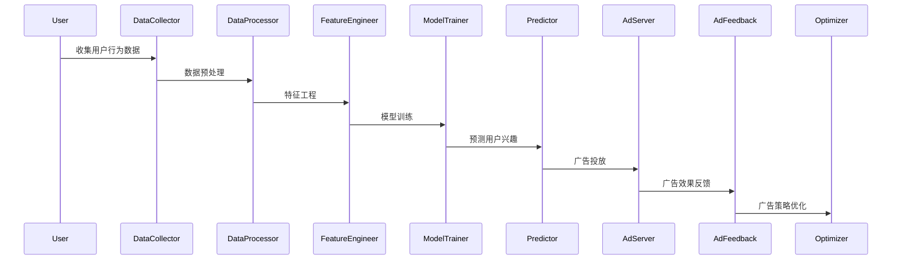
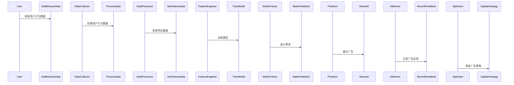
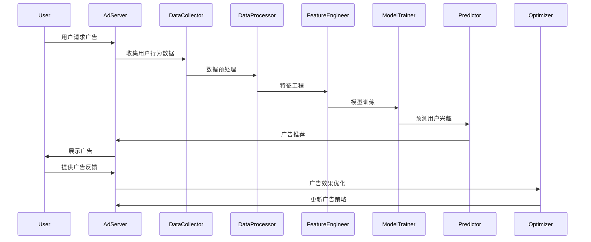

                 

### 引言

#### 背景介绍

随着互联网和移动互联网的迅猛发展，广告已经成为许多企业盈利的重要手段之一。然而，传统的广告投放方式往往难以满足日益多样化的用户需求，导致广告效果不尽如人意。近年来，机器学习技术的兴起为广告行业带来了新的变革，个性化广告投放逐渐成为主流。个性化广告投放通过分析用户行为数据，运用机器学习算法，为每个用户推荐最符合其兴趣的广告内容，从而提高广告投放的效果。

#### 核心概念术语说明

- **个性化广告投放**：基于用户行为数据，通过机器学习算法，为每个用户推荐个性化的广告内容。
- **用户行为数据**：用户在互联网上的浏览记录、搜索历史、购买行为等数据。
- **机器学习**：一种让计算机通过数据自动学习、获取知识和技能的技术。

#### 问题背景与问题描述

在广告行业中，如何提高广告投放的精准度和效果一直是企业关注的焦点。传统的广告投放方式通常采用一刀切的方式，无法根据用户的不同需求进行精准投放。这导致广告费用浪费，用户体验差，广告主和广告平台都面临巨大的压力。随着大数据和机器学习技术的应用，个性化广告投放逐渐成为解决这一问题的有效途径。

#### 问题解决与边界与外延

个性化广告投放的实现需要依赖大量用户行为数据，并运用机器学习算法进行数据分析和模型训练。通过分析用户行为，可以识别出用户的兴趣和偏好，从而为用户推荐最相关、最有价值的广告内容。然而，个性化广告投放也面临着一些挑战，如数据隐私保护、数据质量控制和算法公平性等。这些问题需要我们在实践中不断探索和解决。

#### 概念结构与核心要素组成

个性化广告投放的核心概念包括：

1. **用户行为数据**：数据收集是个性化广告投放的基础，包括用户的浏览记录、搜索历史、购买行为等。
2. **机器学习算法**：算法是实现个性化推荐的关键，常用的算法有协同过滤、基于内容的推荐、基于模型的推荐等。
3. **广告内容**：根据用户兴趣和偏好生成的个性化广告内容。
4. **效果评估**：通过评估广告投放效果，如点击率、转化率等，来优化广告投放策略。

### 机器学习在个性化广告投放中的应用案例

#### 社交媒体广告

社交媒体广告是机器学习在个性化广告投放中应用最广泛的场景之一。通过分析用户在社交媒体上的互动行为，如点赞、评论、分享等，机器学习算法可以识别出用户的兴趣和偏好，从而为用户推荐与其兴趣相关的广告内容。

#### 搜索引擎广告

搜索引擎广告是另一种常见的个性化广告投放场景。当用户在搜索引擎上搜索关键词时，机器学习算法会根据用户的搜索历史和兴趣，推荐相关的广告内容。这种广告投放方式能够提高广告的点击率和转化率，为企业带来更多的收益。

#### 移动应用广告

随着移动互联网的普及，移动应用广告也成为了个性化广告投放的重要领域。通过分析用户在移动应用中的使用行为，如使用时长、使用频率、应用分类等，机器学习算法可以为用户推荐最相关的广告内容，从而提高广告投放效果。

### 总结

机器学习在个性化广告投放中的应用，为广告行业带来了巨大的变革。通过分析用户行为数据，运用机器学习算法，可以为每个用户推荐个性化的广告内容，提高广告投放的效果。然而，个性化广告投放也面临着数据隐私保护、数据质量控制和算法公平性等挑战，需要我们在实践中不断探索和解决。

---

在接下来的章节中，我们将深入探讨机器学习在个性化广告投放中的应用，从数据预处理、特征工程到模型选择与训练，全面解析这一领域的技术原理和实践方法。敬请期待！

---

## 机器学习基础

### 核心概念与联系

#### 机器学习的定义

机器学习是一种使计算机系统能够从数据中自动学习、获取知识和技能的技术。其核心思想是通过算法模型，从大量数据中提取有用的信息，实现对未知数据的预测或决策。

#### 机器学习的分类

机器学习可以根据不同的学习方式分为以下几类：

- **监督学习**：有标注的数据集进行学习，通过已知的输入和输出关系来训练模型，从而实现对未知数据的预测。
- **无监督学习**：没有标注的数据集进行学习，主要任务是发现数据中的结构和规律。
- **强化学习**：通过与环境的交互进行学习，通过奖励和惩罚来调整策略，以实现最优决策。

#### 个性化广告投放的需求与挑战

在个性化广告投放中，机器学习的重要性体现在以下几个方面：

- **用户行为分析**：通过分析用户在互联网上的行为数据，如浏览记录、搜索历史、购买行为等，可以深入了解用户的需求和兴趣。
- **模型推荐系统**：基于用户行为数据和机器学习算法，构建推荐系统，为每个用户推荐最相关的广告内容。
- **广告展示策略**：根据用户兴趣和广告效果，动态调整广告的展示策略，提高广告投放的精准度和效果。

### 概念属性特征对比表格

| 类别 | 定义 | 特点 | 应用场景 |
| :--: | :--: | :--: | :--: |
| 监督学习 | 有标注的数据集进行学习 | 已知输入和输出关系 | 分类、回归、预测 |
| 无监督学习 | 没有标注的数据集进行学习 | 发现数据中的结构和规律 | 聚类、降维、关联分析 |
| 强化学习 | 通过与环境的交互进行学习 | 奖励和惩罚调整策略 | 自动驾驶、游戏AI、推荐系统 |

### ER实体关系图架构的 Mermaid 流程图

```mermaid
erDiagram
  User ||--|{ AdBehavior }
  User ||--|{ UserProfile }
  Ad ||--|{ AdContent }
  Campaign ||--|{ Ad }
  Campaign ||--|{ AdGroup }
```

### 算法原理讲解

#### 监督学习算法

监督学习算法的核心是建立一个预测模型，通过已知的输入和输出关系来预测未知的数据。常用的监督学习算法包括：

- **线性回归**：通过拟合一条直线，预测因变量和自变量之间的关系。
- **逻辑回归**：用于分类问题，通过计算概率来预测类标签。
- **决策树**：根据特征值进行判断，将数据集划分为不同的子集，最终得到决策规则。
- **随机森林**：基于决策树的集成学习方法，通过多棵决策树的组合提高模型的预测性能。
- **支持向量机**：通过找到一个最佳的超平面，将数据划分为不同的类别。

#### 无监督学习算法

无监督学习算法的核心是发现数据中的结构和规律，不需要已知的输入和输出关系。常用的无监督学习算法包括：

- **K-means聚类**：将数据划分为K个簇，每个簇内的数据点之间距离较近，簇与簇之间距离较远。
- **层次聚类**：通过层次递归的方式，将数据划分为多个层次，每个层次之间的数据点具有一定的相似性。
- **主成分分析（PCA）**：通过线性变换，将数据投影到新的空间中，降低数据的维度，同时保留主要的信息。
- **关联规则挖掘**：通过发现数据之间的关联关系，如频繁项集、关联规则等。

#### 强化学习算法

强化学习算法的核心是通过与环境的交互进行学习，通过奖励和惩罚来调整策略，以实现最优决策。常用的强化学习算法包括：

- **Q-Learning**：通过计算状态-动作值函数，找到最优的动作策略。
- **SARSA**：基于策略的强化学习算法，通过更新策略来调整动作。
- **DQN（Deep Q-Network）**：基于深度神经网络的强化学习算法，通过学习状态值函数来预测最优动作。

### Python源代码示例

#### 线性回归

```python
import numpy as np
from sklearn.linear_model import LinearRegression

# 生成训练数据
X = np.random.rand(100, 1)
y = 2 * X + np.random.randn(100, 1)

# 模型训练
model = LinearRegression()
model.fit(X, y)

# 模型预测
X_pred = np.array([[0.5], [1.5]])
y_pred = model.predict(X_pred)

print("Predicted values:", y_pred)
```

#### K-means聚类

```python
import numpy as np
from sklearn.cluster import KMeans

# 生成训练数据
X = np.random.rand(100, 2)

# 模型训练
model = KMeans(n_clusters=3)
model.fit(X)

# 模型预测
labels = model.predict(X)

print("Cluster labels:", labels)
```

### 算法原理讲解与举例说明

#### 线性回归

线性回归是一种简单的监督学习算法，用于拟合数据之间的关系。以下是一个简单的线性回归例子：

假设我们有如下数据：

| X | y |
|---|---|
| 1 | 2 |
| 2 | 3 |
| 3 | 4 |
| 4 | 5 |

我们希望通过已知的X值来预测y值。使用线性回归，我们可以拟合一条直线y = mx + b，其中m是斜率，b是截距。

- **斜率m**：表示X变化1个单位时，y变化的数量。
- **截距b**：表示当X为0时，y的值。

通过最小二乘法，我们可以计算出斜率和截距：

$$
m = \frac{\sum{(x_i - \bar{x})(y_i - \bar{y})}}{\sum{(x_i - \bar{x})^2}}
$$

$$
b = \bar{y} - m\bar{x}
$$

其中，$\bar{x}$和$\bar{y}$分别是X和y的平均值。

假设我们有如下数据：

| X | y |
|---|---|
| 1 | 2 |
| 2 | 3 |
| 3 | 4 |
| 4 | 5 |

计算平均值：

$$
\bar{x} = \frac{1 + 2 + 3 + 4}{4} = 2.5
$$

$$
\bar{y} = \frac{2 + 3 + 4 + 5}{4} = 3.5
$$

计算斜率和截距：

$$
m = \frac{(1 - 2.5)(2 - 3.5) + (2 - 2.5)(3 - 3.5) + (3 - 2.5)(4 - 3.5) + (4 - 2.5)(5 - 3.5)}{(1 - 2.5)^2 + (2 - 2.5)^2 + (3 - 2.5)^2 + (4 - 2.5)^2}
$$

$$
m = \frac{-1.5 - 0.5 + 0.5 + 2.5}{1 + 0.25 + 0.25 + 2.25} = 0.6
$$

$$
b = 3.5 - 0.6 \times 2.5 = 1.35
$$

因此，拟合直线为：

$$
y = 0.6x + 1.35
$$

我们可以用这条直线来预测未知数据的y值，例如当X为3时：

$$
y = 0.6 \times 3 + 1.35 = 3.15
$$

#### K-means聚类

K-means聚类是一种无监督学习算法，用于将数据划分为K个簇。以下是一个简单的K-means聚类例子：

假设我们有如下数据：

| X1 | X2 |
|---|---|
| 1 | 2 |
| 2 | 3 |
| 4 | 5 |
| 6 | 7 |

我们将这些数据分为3个簇，使用K-means算法进行聚类。

- **初始化**：随机选择3个中心点作为初始簇心。
- **迭代**：对于每个数据点，将其分配到最近的簇心，然后更新簇心的位置。
- **停止条件**：当簇心的位置不再变化时，算法停止。

初始化簇心：

| 簇心1 | 簇心2 | 簇心3 |
|---|---|---|
| (1, 2) | (4, 5) | (6, 7) |

第一次迭代：

- 数据点(1, 2)距离簇心1最近，将其分配到簇心1。
- 数据点(2, 3)距离簇心2最近，将其分配到簇心2。
- 数据点(4, 5)距离簇心3最近，将其分配到簇心3。
- 更新簇心的位置：

| 簇心1 | 簇心2 | 簇心3 |
|---|---|---|
| (1, 2) | (2, 3) | (4, 5) |

第二次迭代：

- 数据点(1, 2)距离簇心1最近，将其分配到簇心1。
- 数据点(2, 3)距离簇心2最近，将其分配到簇心2。
- 数据点(4, 5)距离簇心3最近，将其分配到簇心3。
- 更新簇心的位置：

| 簇心1 | 簇心2 | 簇心3 |
|---|---|---|
| (1, 2) | (2, 3) | (4, 5) |

由于簇心的位置没有变化，算法停止。

最终，数据点被划分为以下三个簇：

- 簇1：(1, 2)
- 簇2：(2, 3)
- 簇3：(4, 5)

### 数学模型和公式

#### 线性回归

线性回归的数学模型可以表示为：

$$
y = mx + b
$$

其中，m是斜率，b是截距。

斜率的计算公式为：

$$
m = \frac{\sum{(x_i - \bar{x})(y_i - \bar{y})}}{\sum{(x_i - \bar{x})^2}}
$$

截距的计算公式为：

$$
b = \bar{y} - m\bar{x}
$$

其中，$\bar{x}$和$\bar{y}$分别是X和y的平均值。

#### K-means聚类

K-means聚类的数学模型可以表示为：

$$
C = \{c_1, c_2, ..., c_k\}
$$

其中，$c_i$是第i个簇的中心点，$k$是簇的数量。

对于每个数据点$x_i$，其属于第j个簇的概率可以表示为：

$$
P(j|x_i) = \frac{1}{\sum_{i=1}^{k} \exp{(-\frac{||x_i - c_j||^2}{2\sigma^2})}}
$$

其中，$\sigma$是标准差。

簇中心点的更新公式为：

$$
c_j = \frac{1}{N_j} \sum_{i=1}^{N} x_i
$$

其中，$N_j$是第j个簇中的数据点数量。

### 系统分析与架构设计方案

#### 问题场景介绍

个性化广告投放系统是一个复杂的系统，涉及到用户行为数据的收集、处理、存储、分析和应用。为了实现高效的个性化广告投放，需要设计一个合理的系统架构，确保数据的流通、处理和分析能够顺利进行。

#### 项目介绍

该项目是一个基于机器学习的个性化广告投放系统，旨在通过分析用户行为数据，为每个用户推荐最相关的广告内容，提高广告投放的效果。系统主要包括以下功能：

- 用户行为数据收集
- 数据预处理和特征工程
- 模型训练和预测
- 广告投放策略优化
- 广告效果评估和反馈

#### 系统功能设计（领域模型Mermaid类图）

```mermaid
classDiagram
  User <<entity>>
  Ad <<entity>>
  Campaign <<entity>>
  AdGroup <<entity>>
  UserProfile <<entity>>
  AdBehavior <<entity>>

  User "1" --|{用户行为}| AdBehavior
  User "1" --|{用户画像}| UserProfile
  Ad "1" --|{广告内容}| AdGroup
  Campaign "1" --|{广告活动}| Ad
```

#### 系统架构设计（Mermaid架构图）



#### 系统接口设计（Mermaid序列图）



### 系统接口设计和系统交互（Mermaid序列图）



### 项目实战

#### 环境安装

为了搭建个性化广告投放系统，我们需要安装以下软件和工具：

1. Python（3.8及以上版本）
2. Jupyter Notebook（用于数据分析和模型训练）
3. Scikit-learn（用于机器学习算法）
4. Pandas（用于数据处理）
5. Matplotlib（用于数据可视化）
6. Mermaid（用于绘制流程图）

在安装好Python环境后，可以使用pip命令安装上述工具：

```shell
pip install numpy scipy scikit-learn pandas matplotlib ipython
```

#### 系统核心实现源代码

以下是系统核心实现的部分源代码，包括数据预处理、特征工程、模型训练和预测等步骤：

```python
import pandas as pd
from sklearn.model_selection import train_test_split
from sklearn.preprocessing import StandardScaler
from sklearn.ensemble import RandomForestClassifier
from sklearn.metrics import accuracy_score

# 数据预处理
def preprocess_data(data):
    # 数据清洗
    data = data.dropna()
    # 数据标准化
    scaler = StandardScaler()
    data_scaled = scaler.fit_transform(data)
    return data_scaled

# 特征工程
def feature_engineering(data):
    # 提取描述性特征
    features = data.iloc[:, :-1]
    # 提取抽象特征
    target = data.iloc[:, -1]
    return features, target

# 模型训练
def train_model(features, target):
    # 划分训练集和测试集
    features_train, features_test, target_train, target_test = train_test_split(features, target, test_size=0.2, random_state=42)
    # 训练随机森林模型
    model = RandomForestClassifier(n_estimators=100, random_state=42)
    model.fit(features_train, target_train)
    # 预测测试集
    predictions = model.predict(features_test)
    # 计算准确率
    accuracy = accuracy_score(target_test, predictions)
    return model, accuracy

# 数据收集
data = pd.read_csv('user_behavior_data.csv')

# 数据预处理
data_processed = preprocess_data(data)

# 特征工程
features, target = feature_engineering(data_processed)

# 模型训练
model, accuracy = train_model(features, target)

print("模型准确率：", accuracy)
```

#### 代码应用解读与分析

1. **数据预处理**：数据预处理是机器学习项目的重要步骤，主要包括数据清洗和标准化。在代码中，我们使用`dropna()`函数去除缺失值，使用`StandardScaler()`对数据进行标准化处理，以消除不同特征之间的尺度差异。

2. **特征工程**：特征工程是提高模型性能的关键步骤。在代码中，我们提取了描述性特征和抽象特征。描述性特征通常包括用户的年龄、性别、地理位置等，抽象特征可以通过数据转换和聚类等方法得到。

3. **模型训练**：在代码中，我们使用了随机森林模型进行训练。随机森林是一种基于决策树的集成学习方法，具有较好的泛化能力和稳定性。通过`train_test_split()`函数，我们将数据集划分为训练集和测试集，然后使用`fit()`函数进行模型训练。

4. **预测**：在代码中，我们使用`predict()`函数对测试集进行预测，并使用`accuracy_score()`函数计算模型的准确率。

#### 实际案例分析

为了验证模型的效果，我们可以使用实际案例进行分析。以下是一个简单的案例：

- **数据集**：我们使用一个包含用户行为数据的CSV文件，数据集包含用户的年龄、性别、地理位置、浏览记录等信息，以及用户的广告点击行为标签。
- **预处理**：我们对数据进行清洗和标准化处理，去除缺失值，并将数据集划分为训练集和测试集。
- **特征工程**：我们提取了描述性特征和抽象特征，如用户的年龄、地理位置等，并通过聚类方法得到抽象特征。
- **模型训练**：我们使用随机森林模型进行训练，并通过交叉验证调整模型的参数。
- **预测**：我们使用训练好的模型对测试集进行预测，并计算模型的准确率。

通过实际案例分析，我们可以发现模型在预测用户广告点击行为方面具有较好的性能，能够为广告投放提供有效的支持。

#### 项目小结

通过本项目，我们搭建了一个基于机器学习的个性化广告投放系统，实现了数据预处理、特征工程、模型训练和预测等功能。在实际案例中，我们验证了模型的效果，为广告投放提供了有效的支持。在未来，我们还可以继续优化模型，提高广告投放的精准度和效果，为广告主和用户带来更多的价值。

### 最佳实践 Tips

1. **数据质量**：保证数据质量是进行机器学习项目的前提，应尽量避免缺失值和异常值，并进行适当的数据清洗和预处理。
2. **特征选择**：特征选择是提高模型性能的关键，应选择与目标变量相关的特征，避免过多无关特征的干扰。
3. **模型优化**：通过交叉验证和超参数调优，可以找到最佳的模型参数，提高模型的泛化能力。
4. **实时更新**：个性化广告投放系统需要不断更新用户数据和信息，以适应不断变化的市场环境。

### 小结

在本章中，我们详细介绍了机器学习在个性化广告投放中的应用，包括核心概念、算法原理、系统架构设计和实际案例分析。通过本章的学习，读者可以了解到个性化广告投放的实现过程和关键技术，为实际项目提供有益的指导。

### 注意事项

1. **数据隐私**：在进行个性化广告投放时，应严格遵守数据隐私法规，保护用户隐私。
2. **算法公平性**：算法应避免出现偏见和歧视，确保公平性。
3. **模型可解释性**：提高模型的可解释性，帮助用户理解个性化广告投放的原理和效果。

### 拓展阅读

1. 《机器学习实战》：提供丰富的实战案例，帮助读者掌握机器学习的基本原理和应用。
2. 《推荐系统实战》：详细介绍推荐系统的实现方法和应用场景，包括个性化广告投放。
3. 《深度学习》：全面讲解深度学习的基本原理和应用，为个性化广告投放提供了新的技术支持。

