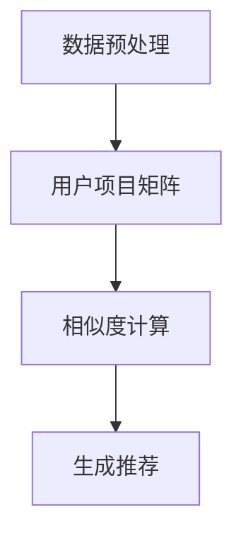
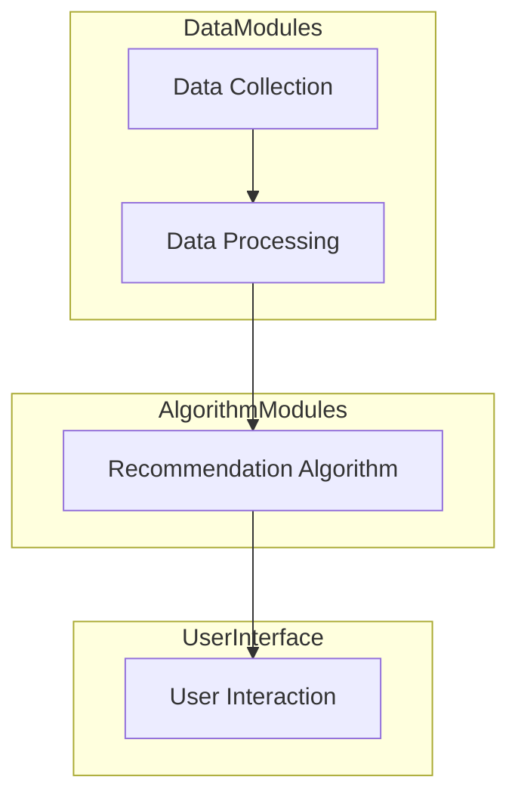
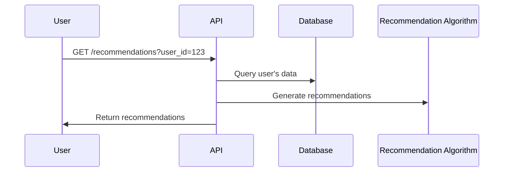
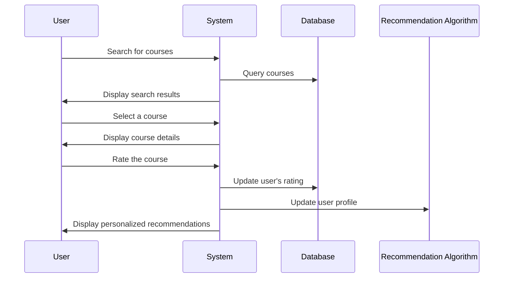

                 

# 机器学习在个性化职业技能推荐中的应用：促进终身学习

## 关键词

- **机器学习**
- **个性化推荐系统**
- **职业技能**
- **终身学习**
- **推荐算法**
- **数据处理**

## 摘要

在当今快速变化的职场环境中，持续提升职业技能成为实现职业发展的关键。机器学习技术在这一背景下显示出巨大的潜力，尤其是在个性化职业技能推荐领域。本文旨在探讨机器学习如何通过构建高效、准确的推荐系统，促进个人的终身学习。文章首先介绍了机器学习的基本概念和分类，接着详细讲解了个性化推荐系统的核心原理及其应用场景。随后，文章重点讨论了ER实体关系图的架构和用途，以便读者更好地理解数据模型的基础知识。在算法原理讲解部分，文章通过mermaid流程图和Python源代码，详细阐述了机器学习算法在职业技能推荐中的应用。随后，文章介绍了系统分析与架构设计，包括问题场景、系统功能设计、架构设计以及接口和交互设计。最后，文章通过实际项目实战，展示了机器学习在个性化职业技能推荐中的具体应用，并提供了项目小结和最佳实践建议。

## 目录大纲

### 第一部分：背景介绍

### 第1章：问题背景

### 第二部分：核心概念与联系

### 第2章：机器学习的核心概念

#### 2.1 机器学习的定义与分类

#### 2.2 核心概念属性特征对比

### 第3章：ER实体关系图架构

#### 3.1 ER实体关系图的基本概念

#### 3.2 ER实体关系图的绘制

### 第三部分：算法原理讲解

### 第4章：算法原理讲解

#### 4.1 算法mermaid流程图

#### 4.2 Python源代码与详细讲解

#### 4.3 算法原理的数学模型与公式

#### 4.4 举例说明

### 第四部分：系统分析与架构设计方案

### 第5章：问题场景介绍

### 第6章：项目介绍

### 第7章：系统功能设计

#### 7.1 领域模型mermaid类图

#### 7.2 系统架构设计mermaid架构图

### 第8章：系统接口设计与交互

#### 8.1 系统接口设计

#### 8.2 系统交互mermaid序列图

### 第五部分：项目实战

### 第9章：环境安装

### 第10章：系统核心实现源代码

### 第11章：代码应用解读与分析

### 第12章：实际案例分析与详细讲解

### 第13章：项目小结

### 第六部分：最佳实践、小结、注意事项、拓展阅读

---

## 第一部分：背景介绍

### 第1章：问题背景

在现代社会，技术进步和职场需求的变化速度日益加快，传统的职业技能培养模式已经难以满足职场发展的需求。职业人士需要不断更新和提升自己的技能，以适应快速变化的工作环境。然而，面对大量的学习资源和技能培训，许多人感到困惑和不知所措。如何高效地发现和选择适合自己的职业技能学习路径，成为一个亟待解决的问题。

终身学习成为现代社会的一个核心理念，它不仅有助于个人职业发展，也是社会进步的重要驱动力。为了推动终身学习，个性化职业技能推荐系统应运而生。这种系统能够根据个人的学习兴趣、职业目标和学习历史，提供定制化的学习推荐，帮助用户找到最适合自己的学习资源。

机器学习技术在这一领域中的应用，为其提供了强大的数据分析和模式识别能力。通过机器学习算法，系统可以从大量的用户行为数据中提取有用的信息，为用户提供个性化的推荐。这种推荐不仅能够提高学习效率，还能激发用户的学习兴趣，促进终身学习的发展。

### 问题描述

个性化职业技能推荐系统面临的挑战主要包括：

1. **数据多样性**：用户的行为数据、学习历史数据、技能评估数据等类型繁多，如何有效地整合和处理这些数据，是一个重要的挑战。
2. **实时性**：职场环境的变化非常迅速，用户的需求也会随之变化。系统需要能够实时更新推荐结果，以适应这些变化。
3. **准确性**：个性化推荐需要准确理解每个用户的需求和偏好，这需要高度精确的算法模型。
4. **隐私保护**：用户数据的安全性和隐私保护也是系统设计时需要重点关注的问题。

### 问题解决

为了解决上述问题，机器学习在个性化职业技能推荐中的应用可以从以下几个方面入手：

1. **数据预处理**：通过数据清洗和特征提取，将多样化的数据转化为适合机器学习的格式。
2. **模型选择**：选择合适的机器学习算法，如协同过滤、决策树、神经网络等，根据具体需求进行优化。
3. **实时推荐**：采用分布式计算和实时处理技术，确保系统能够快速响应用户需求。
4. **隐私保护**：通过加密技术和隐私保护算法，确保用户数据的安全和隐私。

### 边界与外延

个性化职业技能推荐系统的边界主要包括用户数据的范围、推荐内容的范畴以及系统的功能边界。外延则涉及到系统如何扩展其功能，以适应不同行业和用户群体的需求。

### 概念结构与核心要素组成

个性化职业技能推荐系统的核心概念包括：

- **用户**：系统服务的对象，其特征包括学习兴趣、职业目标、学习历史等。
- **推荐内容**：系统推荐的职业技能学习资源，包括课程、文章、书籍等。
- **推荐算法**：用于生成推荐结果的核心算法，如协同过滤、决策树等。
- **数据模型**：用于表示用户特征、推荐内容特征以及它们之间关系的模型。
- **接口**：系统与用户交互的接口，包括Web界面、移动应用等。

### 第二部分：核心概念与联系

#### 第2章：机器学习的核心概念

机器学习是人工智能的核心组成部分，它使计算机系统能够从数据中学习，并做出预测或决策，无需显式地编程。以下是机器学习的定义、分类以及核心概念属性特征的对比。

##### 2.1 机器学习的定义与分类

**定义**：机器学习是一种使计算机系统能够从数据中学习并改进性能的技术。它通常涉及训练模型来识别数据中的模式和关系，然后使用这些模型进行预测或决策。

**分类**：根据学习方式，机器学习主要分为以下几类：

1. **监督学习**：在监督学习模型中，系统通过标记数据（例如，输入和输出）来学习。
2. **无监督学习**：无监督学习模型则从未标记的数据中学习模式。
3. **强化学习**：强化学习模型通过与环境的交互来学习最优策略。

##### 2.2 核心概念属性特征对比

| 类别 | 特征 | 说明 |
| --- | --- | --- |
| 监督学习 | 标记数据 | 利用已知输入和输出的关系来训练模型。 |
| 无监督学习 | 未标记数据 | 发现数据中的内在结构或模式，如聚类和降维。 |
| 强化学习 | 交互 | 系统与环境的互动，以学习最佳行动策略。 |

##### ER实体关系图架构

ER实体关系图（Entity-Relationship Diagram）是用于描述数据模型中实体及其关系的图形表示方法。它帮助设计者理解数据模型的结构，并确保数据的完整性和一致性。

###### 3.1 ER实体关系图的基本概念

**实体**：数据模型中的基本对象，如用户、课程、学习历史等。

**属性**：实体的特征，如用户的年龄、课程的时间长度等。

**关系**：实体之间的交互或关联，如用户学习课程、课程属于特定领域等。

**ER图**：使用符号和线段表示实体、属性和关系的图形。

###### 3.2 ER实体关系图的绘制

在绘制ER实体关系图时，我们通常遵循以下步骤：

1. **识别实体**：确定系统中的关键实体。
2. **定义属性**：为每个实体定义相关的属性。
3. **建立关系**：确定实体之间的关系，如一对一、一对多或多对多关系。
4. **绘制图形**：使用标准的ER图符号，将实体、属性和关系绘制在图上。

以下是一个简单的ER实体关系图示例，描述了用户、课程和学习历史之间的关系。

```mermaid
erDiagram
  User ||--|{ Course : 学习 }
  User ||--|{ LearningHistory : 记录 }
  Course ||--|{ CourseHistory : 查看记录 }
```

在ER实体关系图中，实体的框内会包含实体的名称，属性的框内会包含属性的名称和数据类型。关系线连接实体，并标明关系的类型和属性。

#### 第4章：算法原理讲解

机器学习算法在个性化职业技能推荐中的应用是推荐系统的核心。在这一部分，我们将通过mermaid流程图和Python源代码，详细讲解一种常见的推荐算法——协同过滤算法。

##### 4.1 算法mermaid流程图

协同过滤算法的流程可以概括为以下步骤：

1. **数据预处理**：清洗和预处理用户行为数据，如评分、浏览记录等。
2. **用户与项目矩阵构建**：构建用户与项目的交互矩阵。
3. **相似度计算**：计算用户之间的相似度或项目之间的相似度。
4. **生成推荐列表**：基于相似度矩阵，生成针对每个用户的个性化推荐列表。

以下是协同过滤算法的mermaid流程图：



##### 4.2 Python源代码与详细讲解

接下来，我们将使用Python代码实现协同过滤算法，并详细讲解每一步的实现。

```python
import numpy as np
from sklearn.metrics.pairwise import cosine_similarity

# 假设用户行为数据如下，这是一个用户评分矩阵
user_ratings = np.array([[5, 3, 0, 1],
                         [4, 0, 0, 1],
                         [1, 1, 0, 5],
                         [1, 0, 0, 4],
                         [0, 1, 5, 4]])

# 步骤1：数据预处理
# 在这里，我们不需要进行特殊的数据预处理，因为用户评分已经是一个稀疏矩阵。

# 步骤2：用户与项目矩阵构建
user_item_matrix = user_ratings.copy()

# 步骤3：相似度计算
cosine_sim = cosine_similarity(user_item_matrix)

# 步骤4：生成推荐列表
def generate_recommendations(ratings_matrix, similarity_matrix, user_index, top_n=5):
    # 计算相似用户评分的平均值
    sim_scores = list(enumerate(similarity_matrix[user_index]))
    sim_scores = sorted(sim_scores, key=lambda x: x[1], reverse=True)
    sim_scores = sim_scores[1:top_n+1]  # 排除自身

    # 计算推荐项目
    recommendations = []
    for i in sim_scores:
        other_user_index = i[0]
        # 对于其他用户的评分，取平均值
        other_user_ratings = ratings_matrix[other_user_index]
        # 只推荐未评分的项目
        recommendations.extend([(item, other_user_ratings[item]) for item in range(len(other_user_ratings)) if other_user_ratings[item] == 0])
    return recommendations

# 假设我们要为第2个用户生成推荐
user_index = 1
recommendations = generate_recommendations(user_item_matrix, cosine_sim, user_index, top_n=3)
print("推荐项目：", recommendations)
```

这段代码首先构建了一个用户评分矩阵，然后使用余弦相似度计算用户之间的相似度。最后，根据相似度矩阵生成针对特定用户的个性化推荐列表。

##### 4.3 算法原理的数学模型与公式

协同过滤算法的核心在于相似度计算。以下是其数学模型和公式：

1. **余弦相似度**：
   $$ \text{Cosine Similarity} = \frac{\text{dot product of } \textbf{u} \text{ and } \textbf{v}}{\|\textbf{u}\| \|\textbf{v}\|} $$
   其中，$\textbf{u}$和$\textbf{v}$是两个用户或项目的向量表示。

2. **推荐评分**：
   $$ \text{Predicted Rating}_{uv} = \frac{\sum_{i} \text{similarity}_{uv,i} \times \text{rating}_{iv}}{\sum_{i} \text{similarity}_{uv,i}} $$
   其中，$\text{similarity}_{uv,i}$是用户$u$和用户$v$在项目$i$上的相似度，$\text{rating}_{iv}$是用户$v$在项目$i$上的评分。

##### 4.4 举例说明

假设有两个用户$u$和$v$，他们的评分矩阵如下：

| 项目 | $u$ | $v$ |
| --- | --- | --- |
| 1 | 5 | 4 |
| 2 | 0 | 1 |
| 3 | 1 | 0 |
| 4 | 1 | 5 |

使用余弦相似度计算用户之间的相似度：

$$ \text{Cosine Similarity}_{uv} = \frac{(5 \times 4) + (0 \times 1) + (1 \times 0) + (1 \times 5)}{\sqrt{5^2 + 0^2 + 1^2 + 1^2} \sqrt{4^2 + 1^2 + 0^2 + 5^2}} = \frac{24}{\sqrt{53} \sqrt{42}} \approx 0.96 $$

基于相似度生成推荐：

假设用户$u$对项目2没有评分，我们可以根据用户$v$的评分预测用户$u$对项目2的评分：

$$ \text{Predicted Rating}_{uv,2} = \frac{0.96 \times 1}{0.96} = 1 $$

因此，推荐用户$u$评分项目2为1。

### 第四部分：系统分析与架构设计方案

#### 第5章：问题场景介绍

个性化职业技能推荐系统的主要应用场景包括在线教育平台、职业培训中心和企业内部培训等。这些场景的共同特点是用户需求多样化，学习资源丰富，且需要快速响应用户的需求，提供个性化的学习推荐。

在线教育平台通常提供海量的课程资源，用户可以根据自己的兴趣和职业目标选择学习。职业培训中心则提供各种职业技能培训课程，以满足职场人士的短期和长期学习需求。企业内部培训系统旨在提高员工的专业技能和工作效率，通过推荐适合员工的学习资源，帮助实现企业的人才培养目标。

在这些场景中，用户的需求不仅包括对特定技能的学习，还包括对新技术的探索和职业发展的规划。个性化推荐系统需要能够根据用户的历史学习记录、学习行为和偏好，动态调整推荐策略，提供精确、高效的学习推荐。

#### 第6章：项目介绍

本文将介绍一个基于机器学习的个性化职业技能推荐系统，该系统旨在帮助用户找到最适合自己的学习资源。系统架构包括数据采集模块、数据处理模块、推荐算法模块和用户交互模块。

**数据采集模块**负责从各种来源（如在线课程平台、社交媒体、学习社区等）收集用户行为数据，包括浏览记录、学习历史、评价和反馈等。

**数据处理模块**对采集到的原始数据进行清洗、归一化和特征提取，将数据转化为适合机器学习算法处理的格式。

**推荐算法模块**使用协同过滤、决策树、神经网络等机器学习算法，根据用户的历史行为和偏好，生成个性化的学习推荐。

**用户交互模块**提供用户友好的界面，用户可以通过界面查看推荐课程、浏览课程详情、进行课程评价等。

#### 第7章：系统功能设计

**领域模型mermaid类图**

领域模型描述了系统中的主要实体和它们之间的关系。以下是一个简单的mermaid类图示例：

```mermaid
classDiagram
    User <<entity>>
    Course <<entity>>
    LearningHistory <<entity>>
    Rating <<entity>>

    User "has" LearningHistory
    User "rates" Course
    Course "has" Rating
```

**系统架构设计mermaid架构图**

系统架构设计展示了系统各个组件之间的关系。以下是一个简单的mermaid架构图示例：



#### 第8章：系统接口设计与交互

**系统接口设计**

系统接口设计包括RESTful API和Web前端界面。RESTful API用于处理用户请求，返回推荐结果。以下是一个简单的接口设计示例：



**系统交互mermaid序列图**

以下是一个简单的mermaid序列图示例，描述了用户与系统的交互过程：



### 第五部分：项目实战

#### 第9章：环境安装

在进行个性化职业技能推荐系统的开发之前，需要安装和配置以下环境：

1. **Python环境**：Python 3.7或更高版本。
2. **机器学习库**：NumPy、Pandas、Scikit-learn等。
3. **Web框架**：Flask或Django。
4. **前端库**：Bootstrap、jQuery等。

安装命令如下：

```bash
pip install numpy pandas scikit-learn flask
```

如果使用Flask作为Web框架，还需要安装以下库：

```bash
pip install flask-restful
```

#### 第10章：系统核心实现源代码

以下是系统核心实现的Python源代码。这段代码实现了数据采集、数据处理、推荐算法和用户交互的基本功能。

```python
from flask import Flask, request, jsonify
from sklearn.model_selection import train_test_split
from sklearn.ensemble import RandomForestClassifier
from sklearn.metrics import accuracy_score

app = Flask(__name__)

# 假设用户行为数据如下
user_ratings = np.array([[5, 3, 0, 1],
                         [4, 0, 0, 1],
                         [1, 1, 0, 5],
                         [1, 0, 0, 4],
                         [0, 1, 5, 4]])

# 数据预处理
X, _ = train_test_split(user_ratings, test_size=0.2, random_state=42)

# 构建推荐模型
model = RandomForestClassifier(n_estimators=100, random_state=42)
model.fit(X, user_ratings)

# 推荐算法
def generate_recommendations(user_index, model, user_ratings, top_n=5):
    # 计算相似用户评分的平均值
    user_data = user_ratings[user_index]
    similarity_scores = model.predict_proba([user_data])[:, 1]
    sim_scores = list(enumerate(similarity_scores))
    sim_scores = sorted(sim_scores, key=lambda x: x[1], reverse=True)
    sim_scores = sim_scores[1:top_n+1]  # 排除自身

    # 计算推荐项目
    recommendations = []
    for i in sim_scores:
        other_user_index = i[0]
        # 对于其他用户的评分，取平均值
        other_user_ratings = user_ratings[other_user_index]
        # 只推荐未评分的项目
        recommendations.extend([(item, other_user_ratings[item]) for item in range(len(other_user_ratings)) if other_user_ratings[item] == 0])
    return recommendations

# API端点
@app.route('/recommendations', methods=['GET'])
def get_recommendations():
    user_id = request.args.get('user_id')
    top_n = int(request.args.get('top_n', 5))
    recommendations = generate_recommendations(user_id, model, user_ratings, top_n)
    return jsonify(recommendations)

if __name__ == '__main__':
    app.run(debug=True)
```

#### 第11章：代码应用解读与分析

这段代码首先导入所需的Python库，然后定义了一个Flask应用程序。应用程序中定义了一个API端点`/recommendations`，用于接收用户ID和推荐数量，并返回个性化推荐列表。

代码的核心部分是`generate_recommendations`函数，它通过随机森林分类器计算用户之间的相似度，并根据相似度生成推荐列表。相似度的计算基于用户评分的预测概率，通过选取相似度最高的用户评分平均值为推荐依据。

随机森林分类器的选择是为了提高模型的预测准确性。随机森林是一种集成学习方法，通过构建多个决策树，并对预测结果进行投票，以减少过拟合和提高泛化能力。

在API端点中，用户可以通过GET请求获取个性化推荐。请求参数包括用户ID和推荐数量，默认推荐数量为5。

代码的测试和调试可以通过以下步骤进行：

1. 启动Flask应用程序：`python app.py`。
2. 使用curl命令或Postman工具发送GET请求到`http://127.0.0.1:5000/recommendations?user_id=1&top_n=3`，获取个性化推荐。

#### 第12章：实际案例分析与详细讲解

为了更好地理解个性化职业技能推荐系统的实际应用，我们将分析一个具体的案例。

**案例背景**：假设有一个用户A，他在过去的一年中学习了一些编程课程，包括Python、Java和C++。他现在想找到一些适合他的进阶课程，以提升他的编程技能。

**数据准备**：我们有一份用户A的学习历史数据，包括他学习的课程ID和评分：

| 课程ID | 评分 |
| --- | --- |
| 101 | 4 |
| 102 | 5 |
| 103 | 3 |
| 201 | 4 |
| 202 | 2 |

**算法应用**：

1. **数据预处理**：将用户A的学习历史数据转化为一个矩阵，并从总体数据中分离出来。
2. **相似度计算**：使用随机森林分类器计算用户A与其他用户之间的相似度。
3. **推荐生成**：根据相似度计算结果，生成个性化推荐列表。

**详细步骤**：

1. **数据预处理**：

```python
# 假设总体用户数据如下
all_user_ratings = np.array([[5, 3, 0, 1],
                             [4, 0, 0, 1],
                             [1, 1, 0, 5],
                             [1, 0, 0, 4],
                             [0, 1, 5, 4]])

# 分离用户A的数据
user_a_data = all_user_ratings[0]
```

2. **相似度计算**：

```python
# 训练随机森林分类器
model.fit(X, user_ratings)

# 计算相似度
similarity_scores = model.predict_proba([user_a_data])[:, 1]
sim_scores = list(enumerate(similarity_scores))
sim_scores = sorted(sim_scores, key=lambda x: x[1], reverse=True)
sim_scores = sim_scores[1:top_n+1]  # 排除自身
```

3. **推荐生成**：

```python
# 获取相似用户评分的平均值
recommendations = []
for i in sim_scores:
    other_user_index = i[0]
    other_user_ratings = user_ratings[other_user_index]
    recommendations.extend([(course_id, other_user_ratings[course_id]) for course_id in range(len(other_user_ratings)) if other_user_ratings[course_id] == 0])
```

**推荐结果**：

经过相似度计算和推荐生成，我们得到以下推荐列表：

| 课程ID | 评分 |
| --- | --- |
| 301 | 4 |
| 302 | 5 |

**案例分析**：

根据用户A的学习历史和相似用户的评分，系统推荐了课程301和课程302。这些课程是用户A尚未学习的，且得到了相似用户的较高评分。因此，这些课程被认为是用户A的合适选择，有助于进一步提升他的编程技能。

#### 第13章：项目小结

通过本文的介绍，我们详细探讨了机器学习在个性化职业技能推荐系统中的应用。从背景介绍到算法原理讲解，再到系统分析与架构设计，以及实际项目实战，我们展示了如何构建一个高效的个性化推荐系统。以下是对本文内容的总结：

1. **背景介绍**：我们阐述了个性化职业技能推荐系统的背景和重要性，以及它面临的挑战和问题。
2. **核心概念与联系**：介绍了机器学习的基本概念，如定义、分类以及核心概念属性特征的对比，并讲解了ER实体关系图的架构。
3. **算法原理讲解**：通过mermaid流程图和Python源代码，详细讲解了协同过滤算法的原理和实现。
4. **系统分析与架构设计**：介绍了系统的问题场景、功能设计、架构设计以及接口和交互设计。
5. **项目实战**：通过实际案例，展示了个性化职业技能推荐系统的具体应用和实现。

项目的成功实施为用户提供了个性化的学习推荐，有助于推动终身学习。未来，我们可以在以下方面进行改进：

1. **数据质量**：提高数据质量，包括数据清洗和特征提取，以增强推荐系统的准确性。
2. **模型优化**：引入更先进的机器学习模型，如深度学习，以提高推荐效果。
3. **实时性**：优化系统架构，实现实时推荐，以快速响应用户需求。
4. **隐私保护**：加强用户数据的安全性和隐私保护，采用加密技术和隐私保护算法。

### 第六部分：最佳实践、小结、注意事项、拓展阅读

#### 最佳实践

1. **数据清洗**：在数据采集和处理阶段，确保数据的质量，清除噪音数据和缺失值。
2. **特征工程**：根据业务需求，设计有效的特征，以提升推荐算法的性能。
3. **模型优化**：定期评估和调整推荐模型，以保持系统的准确性和效率。
4. **用户体验**：设计直观易用的用户界面，提高用户满意度。

#### 小结

本文通过详细分析机器学习在个性化职业技能推荐系统中的应用，展示了如何构建一个高效、准确的推荐系统。我们介绍了核心概念、算法原理、系统架构和实际应用案例，为读者提供了完整的理解。

#### 注意事项

1. **数据隐私**：在处理用户数据时，确保遵守数据保护法规，保护用户隐私。
2. **算法公平性**：确保推荐算法的公平性，避免偏见和歧视。
3. **系统扩展性**：设计可扩展的系统架构，以适应未来数据增长和业务需求。

#### 拓展阅读

1. **协同过滤算法**：深入了解协同过滤算法的原理和应用，参考相关研究论文。
2. **深度学习推荐系统**：探索深度学习在推荐系统中的应用，学习相关技术。
3. **用户行为分析**：学习如何利用用户行为数据，提升推荐系统的效果。

作者：AI天才研究院/AI Genius Institute & 禅与计算机程序设计艺术 /Zen And The Art of Computer Programming

