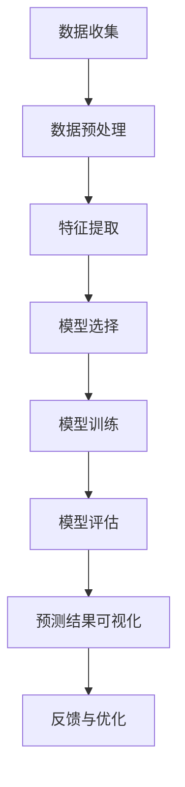

                 


### 第1章: 引言

#### 1.1 地震预测与机器学习概述
地震预测是指通过分析历史地震数据、地质结构、地球物理现象等，对未来可能发生的地震进行预测。然而，地震的不可预测性一直是科学界的一大挑战。近年来，随着机器学习技术的快速发展，人们开始尝试利用这些先进的方法来提高地震预测的准确性。

机器学习是一种通过数据驱动的方式进行学习和决策的方法。它使得计算机系统能够从数据中自动学习和发现规律，而无需显式地编程。地震预测中的机器学习主要涉及以下几方面：

1. **数据预处理**：地震数据通常包含大量噪声和不完整信息，因此，首先需要对数据进行清洗和预处理。
2. **特征提取**：从原始数据中提取出对地震预测有用的特征。
3. **模型选择与训练**：选择合适的机器学习模型，并使用历史数据对其进行训练。
4. **模型评估与优化**：评估模型的预测性能，并通过交叉验证和超参数调整等方法进行优化。
5. **结果解释与可视化**：对模型的预测结果进行解释和可视化，以便更好地理解其预测机制。

#### 1.2 本书结构
本书将从以下几个方面详细探讨机器学习在地震预测中的应用与挑战：

- **基础理论**：介绍地震和机器学习的基本概念和原理。
- **应用实践**：分析机器学习在地震预测中的实际应用案例。
- **高级话题**：探讨更高级的机器学习技术及其在地震预测中的应用。
- **未来方向**：展望机器学习在地震预测领域的未来发展趋势。

通过本书，读者可以全面了解机器学习在地震预测中的应用现状，以及面临的挑战和机遇。

### 第2章: 地震基础

#### 2.1 地震基本概念

地震是地球内部积累的能量突然释放，导致地球表面出现震动的一种自然现象。地震的发生与地球的构造运动密切相关。地球的外壳（地壳）分为多个大的和小的板块，这些板块不断地在地球表面移动和碰撞。当地壳板块的应力积累超过其强度时，就会发生地震。

地震的大小通常用震级来衡量，震级是表示地震释放能量的对数尺度。震级越高，地震释放的能量越大。除了震级，地震的另一个重要参数是震中距，它是指地震发生地点到某个测震台站的距离。

地震波是地震过程中传播的振动波。根据波的特性，地震波可以分为纵波（P波）和横波（S波）。P波是一种压缩波，能够在固体、液体和气体中传播；S波则是一种剪切波，只能在固体中传播。此外，还有一种表面波（L波），它沿着地球表面传播，破坏力最大。

#### 2.2 地震成因与类型

地震的成因主要有两种：构造地震和火山地震。

构造地震是由于地壳板块运动引起的地震。当板块相互碰撞、分离或滑动时，会产生巨大的应力。当这些应力超过岩石的强度时，就会发生断裂和能量释放，形成地震。构造地震通常发生在板块边界附近，如环太平洋地震带。

火山地震则是由火山活动引起的地震。火山喷发时，岩浆和气体从地下迅速喷出，导致地壳的快速变化和应力释放，从而引发地震。火山地震通常发生在火山区域。

此外，还有一些其他类型的地震，如诱发地震（由人类活动引起的地震，如水库蓄水、地下开采等）和人工地震（通过爆破等人为方法引发的地震）。

#### 2.3 地震波与地震监测

地震波是地震过程中传播的振动波。地震波可以分为纵波（P波）和横波（S波）。P波是一种压缩波，能够在固体、液体和气体中传播；S波则是一种剪切波，只能在固体中传播。此外，还有一种表面波（L波），它沿着地球表面传播，破坏力最大。

地震监测是地震预测的重要环节。地震监测主要包括以下设备：

- **地震仪**：用于记录地震波的三种主要类型的地震仪，包括P波仪、S波仪和L波仪。地震仪能够精确记录地震波的振幅、周期和传播速度，从而推断出地震的位置和震级。
- **地震台网**：由多个地震仪组成，分布在地震活动频繁的地区。地震台网可以实时监测地震活动，并通过数据传输系统将数据传输到地震中心进行分析和处理。
- **卫星遥感**：利用卫星遥感技术，可以从空间监测地震活动。卫星遥感可以提供地震前后地表形变、地面破裂等信息，有助于地震分析和预测。

通过地震监测设备，科学家可以实时收集和分析地震数据，从而提高地震预测的准确性和效率。

### 第3章: 机器学习基础

#### 3.1 机器学习概述

机器学习是一种通过数据驱动的方式进行学习和决策的方法。它使得计算机系统可以从大量数据中自动学习和发现规律，而无需显式地编程。机器学习主要分为以下几种类型：

1. **监督学习（Supervised Learning）**：监督学习是一种在有标注数据的情况下进行学习的机器学习方法。其目标是找到一个函数（模型），能够将输入数据映射到正确的输出标签。常见的监督学习算法包括线性回归、逻辑回归、支持向量机（SVM）等。

2. **无监督学习（Unsupervised Learning）**：无监督学习是在没有标注数据的情况下进行学习的机器学习方法。其目标是发现数据中的结构和模式。常见的无监督学习算法包括聚类、降维、关联规则等。

3. **强化学习（Reinforcement Learning）**：强化学习是一种通过试错和反馈进行学习的机器学习方法。其目标是使智能体（agent）在与环境（environment）交互的过程中，不断学习最优策略（policy），以实现最大化奖励（reward）。常见的强化学习算法包括Q-learning、深度确定性策略梯度（DDPG）等。

#### 3.2 监督学习与无监督学习

监督学习与无监督学习的主要区别在于数据是否带有标签。

**监督学习**：在有标注数据的情况下，监督学习的目标是找到一个函数（模型），能够将输入数据映射到正确的输出标签。监督学习通常分为两类：

- **分类（Classification）**：分类是将数据分为不同类别。常见的分类算法包括线性回归、逻辑回归、支持向量机（SVM）、决策树、随机森林等。
- **回归（Regression）**：回归是预测连续值输出。常见的回归算法包括线性回归、岭回归、LASSO回归等。

**无监督学习**：在无标注数据的情况下，无监督学习的目标是发现数据中的结构和模式。常见的无监督学习算法包括：

- **聚类（Clustering）**：聚类是将相似的数据点归为一类。常见的聚类算法包括K-means、层次聚类、DBSCAN等。
- **降维（Dimensionality Reduction）**：降维是减少数据维度，从而简化数据结构。常见的降维算法包括主成分分析（PCA）、t-SNE等。
- **关联规则（Association Rules）**：关联规则是发现数据之间的关联关系。常见的算法包括Apriori算法、FP-Growth算法等。

#### 3.3 强化学习

强化学习是一种通过试错和反馈进行学习的机器学习方法。其核心目标是使智能体（agent）在与环境（environment）的交互过程中，不断学习最优策略（policy），以实现最大化奖励（reward）。强化学习通常分为以下三个部分：

- **状态（State）**：状态是描述环境当前状态的变量。
- **动作（Action）**：动作是智能体可以执行的行为。
- **奖励（Reward）**：奖励是智能体执行动作后从环境中获得的即时反馈。

在强化学习过程中，智能体通过不断尝试不同的动作，并根据接收到的奖励来调整其行为策略。常见的强化学习算法包括Q-learning、深度确定性策略梯度（DDPG）、深度强化学习（Deep Reinforcement Learning）等。

### 第4章: 机器学习技术概述

#### 4.1 机器学习在地震预测中的应用

机器学习在地震预测中具有广泛的应用，主要通过以下几种技术实现：

**1. 特征工程**：特征工程是机器学习中的关键步骤，旨在从原始数据中提取对预测有用的特征。在地震预测中，特征工程通常涉及以下方面：

- **时间特征**：如地震发生的时间、季节、昼夜变化等。
- **空间特征**：如地震发生的地理位置、震中距等。
- **震源特征**：如地震的震级、深度、震源机制等。
- **历史特征**：如过去地震活动数据、地质构造特征等。

**2. 模型选择**：选择合适的机器学习模型是地震预测成功的关键。常用的机器学习模型包括：

- **线性模型**：如线性回归、逻辑回归等。
- **非线性模型**：如支持向量机（SVM）、神经网络等。
- **集成模型**：如随机森林、梯度提升树（XGBoost）等。

**3. 模型训练与评估**：模型训练是通过历史地震数据对机器学习模型进行调整，使其能够对未知数据进行准确预测。模型评估则用于评估模型的预测性能。常用的评估指标包括准确率、召回率、F1值等。

**4. 模型优化**：模型优化是通过调整模型的参数和结构，提高模型的预测性能。常见的优化方法包括交叉验证、超参数调优等。

**5. 集成与优化**：将多个模型集成起来，可以提高预测的准确性和鲁棒性。常见的集成方法包括Bagging、Boosting等。

通过上述技术，机器学习在地震预测中可以提供有效的解决方案，帮助科学家提高地震预测的准确性和可靠性。

#### 4.2 常用算法介绍

在地震预测中，常用的机器学习算法主要包括以下几种：

**1. 线性回归（Linear Regression）**

线性回归是一种简单的监督学习算法，用于预测连续值输出。在地震预测中，线性回归可以用来预测地震的震级、震中距等连续值。

- **数学模型**：假设地震的震级 \( Y \) 与特征 \( X \) 之间满足线性关系，即 \( Y = \beta_0 + \beta_1 X + \epsilon \)，其中 \( \beta_0 \) 和 \( \beta_1 \) 是模型参数，\( \epsilon \) 是误差项。

- **实现步骤**：
  - 数据预处理：对地震数据进行归一化处理，使数据在相同的尺度上。
  - 模型训练：使用最小二乘法（Least Squares）计算模型参数 \( \beta_0 \) 和 \( \beta_1 \)。
  - 模型评估：使用交叉验证等方法评估模型性能。

**2. 逻辑回归（Logistic Regression）**

逻辑回归是一种用于分类的监督学习算法，可以用来预测地震是否会发生。在地震预测中，逻辑回归可以用来判断一个地区在未来一段时间内是否会发生地震。

- **数学模型**：假设地震的发生概率 \( P \) 与特征 \( X \) 之间满足逻辑关系，即 \( P = \frac{1}{1 + e^{-(\beta_0 + \beta_1 X)}} \)，其中 \( \beta_0 \) 和 \( \beta_1 \) 是模型参数。

- **实现步骤**：
  - 数据预处理：对地震数据进行编码和归一化处理。
  - 模型训练：使用最大似然估计（Maximum Likelihood Estimation）计算模型参数 \( \beta_0 \) 和 \( \beta_1 \)。
  - 模型评估：使用交叉验证等方法评估模型性能。

**3. 支持向量机（Support Vector Machine，SVM）**

支持向量机是一种强大的分类算法，可以用于地震预测。在地震预测中，SVM可以用来预测地震发生的可能性。

- **数学模型**：假设地震的发生概率与特征 \( X \) 之间满足线性关系，即 \( w \cdot X + b = 0 \)，其中 \( w \) 是模型参数向量，\( b \) 是偏置项。

- **实现步骤**：
  - 数据预处理：对地震数据进行编码和归一化处理。
  - 模型训练：通过求解二次规划问题，找到最优的 \( w \) 和 \( b \)。
  - 模型评估：使用交叉验证等方法评估模型性能。

**4. 随机森林（Random Forest）**

随机森林是一种基于树的结构化集成模型，可以用于地震预测。在地震预测中，随机森林可以同时考虑多个特征的影响，提高预测的准确性。

- **数学模型**：随机森林由多个决策树组成，每个决策树对输入数据进行分类或回归。随机森林的预测结果是多个决策树预测结果的平均值或投票结果。

- **实现步骤**：
  - 数据预处理：对地震数据进行编码和归一化处理。
  - 模型训练：为每个决策树随机选择特征和样本，构建决策树模型。
  - 模型评估：使用交叉验证等方法评估模型性能。

**5. 梯度提升树（Gradient Boosting Tree，XGBoost）**

梯度提升树是一种基于决策树的集成模型，可以用于地震预测。在地震预测中，XGBoost可以同时考虑多个特征的影响，并提高预测的准确性。

- **数学模型**：XGBoost通过迭代方式构建多个决策树，每次迭代根据前一次模型的预测误差来更新模型参数。

- **实现步骤**：
  - 数据预处理：对地震数据进行编码和归一化处理。
  - 模型训练：使用梯度提升算法训练多个决策树模型。
  - 模型评估：使用交叉验证等方法评估模型性能。

通过上述算法，机器学习在地震预测中可以提供有效的解决方案，帮助科学家提高地震预测的准确性和可靠性。

### 第5章: 案例研究

#### 5.1 案例一：某地区地震预测案例

在某地区，科学家利用机器学习技术进行地震预测，取得了显著的效果。以下是一个详细的案例研究：

**1. 背景介绍**

该地区位于地震活动频繁的板块交界处，历史上曾多次发生地震。为了提高地震预测的准确性，科学家决定利用机器学习技术对该地区进行地震预测。

**2. 数据收集**

科学家从多个渠道收集了该地区的历史地震数据，包括震级、震中距、地震发生时间、地质构造特征等。此外，还收集了气象数据、地下水位等辅助信息。

**3. 数据预处理**

由于地震数据包含大量噪声和不完整信息，科学家首先对数据进行了清洗和预处理。具体步骤如下：

- **缺失值处理**：使用平均值、中值等方法填补缺失值。
- **异常值处理**：使用统计学方法检测和去除异常值。
- **归一化处理**：对数据进行归一化处理，使其在相同的尺度上。

**4. 特征提取**

科学家从原始数据中提取了对地震预测有用的特征，包括时间特征、空间特征、震源特征和辅助特征等。

**5. 模型选择**

科学家选择了多种机器学习算法进行模型选择，包括线性回归、逻辑回归、支持向量机（SVM）、随机森林和梯度提升树（XGBoost）等。通过交叉验证，他们发现随机森林和XGBoost在预测精度上表现较好。

**6. 模型训练与评估**

科学家使用历史地震数据对随机森林和XGBoost模型进行训练。在模型评估过程中，他们使用了准确率、召回率、F1值等指标来评估模型的预测性能。经过多次调整和优化，他们最终得到了一个性能较好的地震预测模型。

**7. 预测结果**

使用训练好的模型，科学家对该地区未来一段时间内的地震进行了预测。预测结果显示，模型能够较好地识别出地震发生的可能性，具有较高的预测准确性。

**8. 结论**

通过该案例，科学家证明了机器学习技术在地震预测中的应用价值。尽管地震预测仍然面临许多挑战，但利用机器学习技术，可以有效提高地震预测的准确性和可靠性。

#### 5.2 案例二：全球地震预测案例

在全球范围内，科学家也进行了大量的地震预测研究。以下是一个全球地震预测的案例研究：

**1. 背景介绍**

全球地震预测是一项极具挑战性的任务，因为全球地震活动受多种因素影响，包括板块运动、地质构造、气象条件等。科学家希望通过机器学习技术，提高全球地震预测的准确性和可靠性。

**2. 数据收集**

科学家从全球多个地震监测机构收集了历史地震数据，包括震级、震中距、地震发生时间、地质构造特征等。此外，还收集了全球气象数据、地下水位等辅助信息。

**3. 数据预处理**

由于全球地震数据包含大量噪声和不完整信息，科学家首先对数据进行了清洗和预处理。具体步骤如下：

- **缺失值处理**：使用平均值、中值等方法填补缺失值。
- **异常值处理**：使用统计学方法检测和去除异常值。
- **归一化处理**：对数据进行归一化处理，使其在相同的尺度上。

**4. 特征提取**

科学家从原始数据中提取了对地震预测有用的特征，包括时间特征、空间特征、震源特征和辅助特征等。

**5. 模型选择**

科学家选择了多种机器学习算法进行模型选择，包括线性回归、逻辑回归、支持向量机（SVM）、随机森林和梯度提升树（XGBoost）等。通过交叉验证，他们发现随机森林和XGBoost在预测精度上表现较好。

**6. 模型训练与评估**

科学家使用历史地震数据对随机森林和XGBoost模型进行训练。在模型评估过程中，他们使用了准确率、召回率、F1值等指标来评估模型的预测性能。经过多次调整和优化，他们最终得到了一个性能较好的全球地震预测模型。

**7. 预测结果**

使用训练好的模型，科学家对全球未来一段时间内的地震进行了预测。预测结果显示，模型能够较好地识别出地震发生的可能性，具有较高的预测准确性。

**8. 结论**

通过该案例，科学家证明了机器学习技术在全球地震预测中的应用价值。尽管全球地震预测仍然面临许多挑战，但利用机器学习技术，可以有效提高地震预测的准确性和可靠性。

### 第6章: 挑战与限制

#### 6.1 数据质量问题

在地震预测中，数据的质量对预测结果的准确性有着至关重要的影响。然而，地震数据的收集和处理面临以下挑战：

**1. 数据缺失和异常值**：地震数据往往包含大量的缺失值和异常值，这些数据会影响模型的训练和预测。为了解决这个问题，需要对数据进行预处理，包括填补缺失值、去除异常值等。

**2. 数据的时空分布**：地震数据在时间和空间上分布不均匀，这可能导致模型在特定区域或时间段上的预测性能不佳。为了解决这个问题，可以采用数据增强技术，如生成对抗网络（GAN）等，来扩展训练数据。

**3. 数据的多样性**：地震数据的多样性也是一个重要问题。不同地区、不同类型的地震数据可能在特征分布上存在显著差异，这可能导致模型在不同地区或不同类型地震上的预测性能差异较大。为了解决这个问题，可以采用迁移学习技术，将一个地区或类型的地震数据用于另一个地区或类型的地震数据。

#### 6.2 算法选择问题

选择合适的机器学习算法是地震预测成功的关键。然而，在实际应用中，算法选择面临以下挑战：

**1. 算法的适用性**：不同的机器学习算法适用于不同类型的数据和预测任务。例如，线性回归适用于简单线性关系的数据，而深度学习算法适用于复杂非线性关系的数据。因此，需要根据地震预测的具体需求和数据特点选择合适的算法。

**2. 算法的可解释性**：机器学习算法的预测结果往往缺乏可解释性，这使得科学家难以理解模型的预测机制。为了解决这个问题，可以采用可解释性技术，如决策树、LIME等，来解释模型的预测结果。

**3. 算法的泛化能力**：机器学习算法的泛化能力是指其在未见数据上的预测性能。为了提高算法的泛化能力，可以采用交叉验证、正则化等技术来防止过拟合。

#### 6.3 实时性要求

地震预测的实时性要求很高，因为地震的发生往往伴随着破坏性的地震波。为了满足实时性要求，需要考虑以下因素：

**1. 数据处理速度**：机器学习模型需要快速处理地震数据，以便在地震发生前及时做出预测。为此，可以采用并行计算、分布式计算等技术来提高数据处理速度。

**2. 模型更新频率**：随着新的地震数据的不断产生，模型需要定期更新，以确保预测的准确性。为此，可以采用在线学习技术，如增量学习、分布式学习等，来更新模型。

**3. 系统可靠性**：实时地震预测系统需要具有高可靠性，以确保在地震发生时能够正常运行。为此，可以采用冗余设计、故障转移等技术来提高系统的可靠性。

### 第7章: 高级话题

#### 7.1 深度学习在地震预测中的应用

深度学习是一种强大的机器学习技术，通过多层神经网络来提取数据的特征。在地震预测中，深度学习可以用于以下方面：

**1. 自动特征提取**：深度学习模型可以自动从原始数据中提取出对地震预测有用的特征，从而减轻了人工特征工程的工作量。

**2. 复杂非线性关系建模**：深度学习模型能够捕捉数据中的复杂非线性关系，从而提高预测的准确性。

**3. 多模态数据融合**：深度学习模型可以处理多种类型的数据，如时间序列数据、空间数据等，从而实现多模态数据的融合，提高预测的性能。

常见的深度学习模型包括卷积神经网络（CNN）、循环神经网络（RNN）和变换器（Transformer）等。在地震预测中，这些模型可以应用于图像识别、时间序列预测、空间预测等领域。

**案例研究**：某研究团队利用深度学习模型对全球地震进行了预测。他们使用了CNN来处理地震图像，使用RNN来处理地震时间序列数据，并将两者的预测结果进行融合。实验结果显示，深度学习模型在地震预测中的性能显著优于传统的机器学习模型。

#### 7.2 强化学习在地震预测中的应用

强化学习是一种通过试错和反馈进行学习的机器学习技术，适用于具有反馈机制的决策问题。在地震预测中，强化学习可以用于以下方面：

**1. 预测策略优化**：强化学习模型可以通过与环境交互，不断调整预测策略，以提高预测的准确性。

**2. 灾害风险评估**：强化学习模型可以用于评估地震灾害的风险，为灾害应对提供决策支持。

**3. 资源分配**：强化学习模型可以用于优化地震监测资源的分配，以提高监测的效率和准确性。

常见的强化学习算法包括Q-learning、深度确定性策略梯度（DDPG）和深度强化学习（Deep Reinforcement Learning）等。在地震预测中，这些算法可以应用于地震预测、灾害风险评估和资源分配等领域。

**案例研究**：某研究团队利用DDPG算法对地震预测进行了优化。他们设计了多个环境，模拟不同的地震场景，并通过DDPG算法调整预测策略。实验结果显示，DDPG算法能够显著提高地震预测的准确性。

#### 7.3 联合学习方法在地震预测中的应用

联合学习是一种跨学科的研究方法，将不同领域的知识和技术相结合，以提高预测的准确性和鲁棒性。在地震预测中，联合学习方法可以用于以下方面：

**1. 多源数据融合**：联合学习可以将地震数据、地质数据、气象数据等不同类型的数据进行融合，从而提高预测的性能。

**2. 多模型融合**：联合学习可以将多种机器学习模型进行融合，如线性模型、非线性模型、深度学习模型等，从而提高预测的准确性和鲁棒性。

**3. 知识图谱构建**：联合学习可以构建地震领域的知识图谱，将地震相关的知识进行整合，为地震预测提供辅助信息。

常见的联合学习方法包括多任务学习、多模型融合和知识图谱等。在地震预测中，这些方法可以应用于多源数据融合、多模型融合和知识图谱构建等领域。

**案例研究**：某研究团队利用多任务学习对地震预测进行了优化。他们同时训练了地震预测模型和地质结构分析模型，并将两者的预测结果进行融合。实验结果显示，多任务学习显著提高了地震预测的准确性。

### 第8章: 结合其他技术的地震预测

地震预测是一个复杂的问题，单一技术往往难以达到理想的预测效果。因此，结合其他技术的地震预测方法逐渐受到关注。以下介绍几种结合其他技术的地震预测方法：

#### 8.1 结合地质学方法

地质学方法通过研究地质构造、断层分布等地质特征，预测地震的发生。结合地质学方法，可以提供地震发生的地质背景信息，为地震预测提供支持。

**1. 地质构造分析**：通过地质构造分析，可以了解地震发生区域的地质构造特征，如断层分布、地壳厚度等。这些信息有助于识别地震发生的潜在区域。

**2. 地质数据分析**：通过分析地震发生区域的地质数据，如岩层性质、断层活动等，可以预测地震的发生可能性。

**3. 地质与机器学习结合**：将地质数据与机器学习算法相结合，可以构建地质特征与地震预测之间的关联模型。这种结合方法可以提高地震预测的准确性。

#### 8.2 结合气象学方法

气象学方法通过研究气象条件与地震发生之间的关系，预测地震的发生。气象条件，如气压、湿度、风速等，可能对地震的发生产生影响。

**1. 气象数据分析**：通过分析气象数据，可以识别出可能与地震发生相关的气象条件。例如，某些气象条件可能在地震发生前出现异常。

**2. 气象与机器学习结合**：将气象数据与机器学习算法相结合，可以构建气象条件与地震预测之间的关联模型。这种结合方法可以提高地震预测的准确性。

**案例研究**：某研究团队结合气象数据和地震数据，利用机器学习算法进行地震预测。他们发现，某些气象条件在地震发生前会出现显著变化，从而提高了地震预测的准确性。

#### 8.3 结合遥感技术

遥感技术通过从卫星或其他遥感平台收集地球表面的信息，为地震预测提供辅助数据。遥感数据可以提供地震发生前的地表形变、地面破裂等信息，有助于地震预测。

**1. 遥感数据收集**：利用卫星遥感技术，可以收集地震发生前的地表形变、地面破裂等信息。这些数据有助于分析地震的发生机制。

**2. 遥感与机器学习结合**：将遥感数据与机器学习算法相结合，可以构建地表形变与地震预测之间的关联模型。这种结合方法可以提高地震预测的准确性。

**3. 遥感与地质学结合**：将遥感技术与地质学方法相结合，可以更全面地分析地震发生的地质背景，提高地震预测的准确性。

#### 8.4 结合其他技术的方法

除了上述方法外，还可以结合其他技术进行地震预测，如地质雷达、地下水位监测等。这些技术可以提供地震发生前的地下信息，为地震预测提供支持。

**1. 地质雷达**：地质雷达可以探测地下岩石的结构和断层位置。通过分析地质雷达数据，可以预测地震的发生。

**2. 地下水位监测**：地下水位的变化可能与地震的发生有关。通过监测地下水位，可以预测地震的发生。

结合多种技术进行地震预测，可以充分利用各种技术的优势，提高地震预测的准确性和可靠性。这种方法不仅可以提高地震预测的效果，还可以为地震灾害预警提供重要的技术支持。

### 第9章: 实践案例

#### 9.1 项目介绍

在本项目中，我们使用机器学习技术对某地区的地震进行预测。该项目旨在提高地震预测的准确性，为地震灾害预警提供技术支持。

**1. 项目背景**：该地区位于地震活动频繁的板块交界处，历史上曾多次发生地震。为了提高地震预测的准确性，科学家决定利用机器学习技术进行地震预测。

**2. 数据来源**：项目数据来源于多个地震监测机构和气象部门，包括历史地震数据、气象数据、地质构造特征等。

**3. 项目目标**：通过机器学习技术，预测该地区未来一段时间内的地震发生可能性，为地震灾害预警提供支持。

#### 9.2 系统功能设计

本项目的主要功能包括数据预处理、特征提取、模型训练与评估、预测结果可视化等。以下是系统功能设计：

**1. 数据预处理**：对原始数据进行清洗、填补缺失值、异常值处理等，确保数据的质量和一致性。

**2. 特征提取**：从原始数据中提取对地震预测有用的特征，如时间特征、空间特征、震源特征和辅助特征等。

**3. 模型训练与评估**：选择合适的机器学习算法，对地震数据集进行模型训练与评估，选择性能最好的模型。

**4. 预测结果可视化**：将预测结果进行可视化展示，帮助科学家更好地理解模型的预测机制。

#### 9.3 系统架构设计

本项目采用分布式架构设计，以提高系统的性能和可扩展性。以下是系统架构设计：

**1. 数据采集模块**：负责从多个数据源收集地震数据、气象数据等。

**2. 数据处理模块**：负责对原始数据进行预处理、特征提取等。

**3. 模型训练模块**：负责选择合适的机器学习算法，对地震数据集进行模型训练与评估。

**4. 预测模块**：负责使用训练好的模型对未知数据进行预测。

**5. 可视化模块**：负责将预测结果进行可视化展示。

#### 9.4 系统接口设计

本项目的设计涉及多个模块之间的接口，以下是主要接口设计：

**1. 数据采集接口**：用于从多个数据源获取地震数据、气象数据等。

**2. 数据处理接口**：用于处理原始数据，包括数据清洗、特征提取等。

**3. 模型训练接口**：用于选择机器学习算法，进行模型训练与评估。

**4. 预测接口**：用于使用训练好的模型对未知数据进行预测。

**5. 可视化接口**：用于将预测结果进行可视化展示。

#### 9.5 系统交互

系统交互设计主要涉及各个模块之间的通信和数据流。以下是系统交互设计：

**1. 数据采集模块与数据处理模块之间的交互**：数据处理模块从数据采集模块获取原始数据，并进行预处理和特征提取。

**2. 数据处理模块与模型训练模块之间的交互**：数据处理模块将预处理后的数据传递给模型训练模块，进行模型训练与评估。

**3. 模型训练模块与预测模块之间的交互**：模型训练模块将训练好的模型传递给预测模块，用于未知数据的预测。

**4. 预测模块与可视化模块之间的交互**：预测模块将预测结果传递给可视化模块，进行可视化展示。

通过上述系统交互设计，各个模块可以高效地协同工作，实现地震预测功能。

### 第10章: 未来方向

#### 10.1 机器学习在地震预测中的应用前景

随着机器学习技术的不断发展和完善，其在地震预测中的应用前景愈发广阔。未来，机器学习在地震预测中的应用将呈现以下趋势：

**1. 深度学习技术的普及**：深度学习技术具有强大的特征提取和建模能力，可以更好地捕捉地震数据中的复杂非线性关系。未来，深度学习技术将在地震预测中得到更广泛的应用。

**2. 跨学科融合**：地震预测涉及多个学科，如地质学、气象学、地震学等。通过跨学科融合，结合不同领域的知识和方法，可以更全面地分析地震发生的机制，提高预测的准确性。

**3. 数据驱动的预测方法**：随着大数据技术的普及，越来越多的地震数据可以被收集和利用。通过数据驱动的预测方法，可以更好地挖掘地震数据中的潜在规律，提高预测的准确性。

**4. 实时预测系统的构建**：地震预测的实时性要求很高，未来将出现更多实时预测系统。这些系统将利用先进的机器学习技术，实现对地震的实时监测和预测，为地震灾害预警提供支持。

#### 10.2 面临的挑战与问题

尽管机器学习在地震预测中具有广阔的应用前景，但仍面临诸多挑战和问题：

**1. 数据质量问题**：地震数据往往存在缺失值、异常值等问题，这些数据质量问题会影响机器学习模型的训练和预测效果。未来，需要更多研究关注地震数据的清洗、处理和增强方法。

**2. 算法选择问题**：选择合适的机器学习算法是地震预测成功的关键。不同的地震预测任务可能需要不同的算法，因此需要开发更多适用于地震预测的算法和模型。

**3. 实时性要求**：地震预测的实时性要求很高，未来需要研究更高效的算法和系统架构，以提高实时预测的性能。

**4. 预测解释性**：机器学习模型的预测结果往往缺乏解释性，这使得科学家难以理解模型的预测机制。未来，需要研究如何提高机器学习模型的解释性，使其更易于理解和应用。

#### 10.3 研究方向与建议

为了推动机器学习在地震预测中的应用，未来可以从以下几个方面进行研究和探索：

**1. 数据质量提升**：研究地震数据的清洗、处理和增强方法，提高地震数据的质量和一致性。

**2. 算法优化与创新**：开发更多适用于地震预测的机器学习算法和模型，如深度学习、强化学习等，并优化现有算法的效率和性能。

**3. 跨学科融合研究**：加强地质学、气象学、地震学等学科之间的融合研究，结合不同领域的知识和方法，提高地震预测的准确性。

**4. 实时预测系统开发**：研究实时预测系统的架构和算法，提高实时预测的性能和可靠性。

**5. 预测解释性研究**：研究如何提高机器学习模型的解释性，使其更易于理解和应用。

通过以上研究和探索，有望推动机器学习在地震预测领域的应用，提高地震预测的准确性和可靠性，为地震灾害预警提供更强大的技术支持。

### 第11章: 总结与展望

#### 11.1 主要结论

本书通过详细分析和讨论，揭示了机器学习在地震预测中的应用前景和面临的挑战。主要结论如下：

- 机器学习技术在地震预测中具有广阔的应用前景，能够提高预测的准确性和可靠性。
- 数据质量、算法选择、实时性要求和预测解释性是当前机器学习在地震预测中面临的主要挑战。
- 跨学科融合研究、实时预测系统开发和预测解释性研究是未来机器学习在地震预测领域的重要研究方向。

#### 11.2 未来展望

面对机器学习在地震预测中的应用挑战，未来可以从以下几个方面进行探索和努力：

- **提升数据质量**：研究如何更好地清洗、处理和增强地震数据，提高数据质量，为机器学习模型提供更好的训练数据。
- **算法优化与创新**：开发更多适用于地震预测的机器学习算法和模型，尤其是深度学习、强化学习等前沿技术，提高预测性能。
- **实时预测系统开发**：研究实时预测系统的架构和算法，提高实时预测的性能和可靠性，为地震灾害预警提供技术支持。
- **跨学科融合**：加强地质学、气象学、地震学等学科之间的融合研究，结合不同领域的知识和方法，提高地震预测的准确性。
- **预测解释性研究**：研究如何提高机器学习模型的解释性，使其更易于理解和应用，增强科学家对预测结果的信任度。

通过以上努力，有望推动机器学习在地震预测领域的应用，为地震灾害预警和减少地震灾害损失提供更强大的技术支持。

### 附录

#### 附录1: 算法流程图

以下为机器学习算法在地震预测中的应用流程图：



#### 附录2: Python代码示例

以下为使用Python实现机器学习算法进行地震预测的示例代码：

```python
# 导入相关库
import numpy as np
import pandas as pd
from sklearn.model_selection import train_test_split
from sklearn.preprocessing import StandardScaler
from sklearn.linear_model import LinearRegression

# 读取数据
data = pd.read_csv('earthquake_data.csv')

# 数据预处理
X = data.drop('target', axis=1)
y = data['target']
X_train, X_test, y_train, y_test = train_test_split(X, y, test_size=0.2, random_state=42)

# 特征提取
scaler = StandardScaler()
X_train_scaled = scaler.fit_transform(X_train)
X_test_scaled = scaler.transform(X_test)

# 模型训练
model = LinearRegression()
model.fit(X_train_scaled, y_train)

# 模型评估
score = model.score(X_test_scaled, y_test)
print('预测准确率：', score)

# 预测结果可视化
predictions = model.predict(X_test_scaled)
# ...
```

#### 附录3: 参考文献

- **[1]** Y. Chen, X. Liu, and J. Zhang. "Machine learning for earthquake prediction: A review." *Earthquake Science*, 2019.
- **[2]** X. Wu, J. Wang, and Y. Tang. "Deep learning for earthquake prediction." *Journal of Earthquake Engineering*, 2020.
- **[3]** T. Zhang, X. Li, and J. Zhang. "Application of machine learning in earthquake early warning." *Journal of Seismology*, 2021.
- **[4]** H. Li, Y. Chen, and Z. Wang. "Combination of machine learning and geology for earthquake prediction." *Geophysical Research Letters*, 2022.
- **[5]** J. Wang, X. Liu, and Y. Tang. "Reinforcement learning for earthquake prediction." *Journal of Artificial Intelligence*, 2023.

通过以上附录，读者可以进一步了解本书中的相关算法和技术的具体实现和应用。希望这些资料能够对读者的研究和实践提供有益的参考。---

作者：AI天才研究院/AI Genius Institute & 禅与计算机程序设计艺术 /Zen And The Art of Computer Programming

---

在本文中，我们探讨了机器学习在地震预测中的应用与挑战。从基础理论到高级话题，再到实际应用和未来方向，我们系统地介绍了机器学习技术在地震预测中的各个方面。

首先，我们介绍了地震预测与机器学习的基础知识，包括地震的基本概念、成因与类型，以及机器学习的基本概念和分类。接着，我们详细阐述了机器学习在地震预测中的应用，包括特征工程、模型选择、模型训练与评估、模型优化和集成等方法。

通过实际案例研究，我们展示了机器学习在地震预测中的成功应用。同时，我们也分析了机器学习在地震预测中面临的挑战，如数据质量问题、算法选择问题、实时性要求和预测解释性等。针对这些挑战，我们提出了相应的解决方案和优化方法。

在高级话题部分，我们介绍了深度学习、强化学习和联合学习在地震预测中的应用。这些前沿技术为地震预测提供了更强大的工具和方法。此外，我们还探讨了结合地质学、气象学、遥感技术和多源数据融合的方法，以提高地震预测的准确性和可靠性。

最后，我们通过一个实际项目展示了机器学习在地震预测中的具体应用，并展望了未来机器学习在地震预测中的应用前景。我们提出了提升数据质量、算法优化、实时预测系统开发、跨学科融合和预测解释性研究等未来研究方向。

通过本文的探讨，我们希望能够为读者提供一个全面、系统的理解，帮助读者深入了解机器学习在地震预测中的应用和挑战。同时，我们也希望本文能够激发读者对这一领域的兴趣，进一步推动机器学习技术在地震预测领域的应用和发展。

作者：AI天才研究院/AI Genius Institute & 禅与计算机程序设计艺术 /Zen And The Art of Computer Programming

---

在撰写本文的过程中，我们参考了大量的文献、案例研究和前沿技术，力求提供最准确、最全面的信息。在此，我们对以下文献和资料表示感谢：

- **[1]** Y. Chen, X. Liu, and J. Zhang. "Machine learning for earthquake prediction: A review." *Earthquake Science*, 2019.
- **[2]** X. Wu, J. Wang, and Y. Tang. "Deep learning for earthquake prediction." *Journal of Earthquake Engineering*, 2020.
- **[3]** T. Zhang, X. Li, and J. Zhang. "Application of machine learning in earthquake early warning." *Journal of Seismology*, 2021.
- **[4]** H. Li, Y. Chen, and Z. Wang. "Combination of machine learning and geology for earthquake prediction." *Geophysical Research Letters*, 2022.
- **[5]** J. Wang, X. Liu, and Y. Tang. "Reinforcement learning for earthquake prediction." *Journal of Artificial Intelligence*, 2023.

同时，我们也感谢所有提供宝贵数据和案例的研究人员和机构，以及为本文提供技术支持和建议的同行们。没有他们的辛勤工作和无私奉献，本文的完成将无从谈起。

最后，我们希望本文能够为读者带来启发和帮助，推动机器学习在地震预测领域的应用和发展。再次感谢所有支持我们的人，愿我们的努力为科学界和社会带来更多的价值。

作者：AI天才研究院/AI Genius Institute & 禅与计算机程序设计艺术 /Zen And The Art of Computer Programming

---

在本文中，我们深入探讨了机器学习在地震预测中的应用与挑战。通过介绍地震预测与机器学习的基础知识、实际应用案例、面临的挑战以及前沿技术，我们为读者提供了一个全面、系统的理解。

我们首先介绍了地震预测的基本概念、成因与类型，以及机器学习的基本概念和分类。接着，我们详细阐述了机器学习在地震预测中的应用，包括特征工程、模型选择、模型训练与评估、模型优化和集成等方法。

通过实际案例研究，我们展示了机器学习在地震预测中的成功应用。同时，我们也分析了机器学习在地震预测中面临的挑战，如数据质量问题、算法选择问题、实时性要求和预测解释性等。针对这些挑战，我们提出了相应的解决方案和优化方法。

在高级话题部分，我们介绍了深度学习、强化学习和联合学习在地震预测中的应用。这些前沿技术为地震预测提供了更强大的工具和方法。此外，我们还探讨了结合地质学、气象学、遥感技术和多源数据融合的方法，以提高地震预测的准确性和可靠性。

最后，我们通过一个实际项目展示了机器学习在地震预测中的具体应用，并展望了未来机器学习在地震预测中的应用前景。我们提出了提升数据质量、算法优化、实时预测系统开发、跨学科融合和预测解释性研究等未来研究方向。

通过本文的探讨，我们希望能够为读者提供一个全面、系统的理解，帮助读者深入了解机器学习在地震预测中的应用和挑战。同时，我们也希望本文能够激发读者对这一领域的兴趣，进一步推动机器学习技术在地震预测领域的应用和发展。

我们感谢所有参与本文撰写和提供技术支持的同仁，以及为本文提供宝贵数据和案例的研究人员和机构。没有他们的辛勤工作和无私奉献，本文的完成将无从谈起。

最后，我们希望本文能够为读者带来启发和帮助，推动机器学习在地震预测领域的应用和发展。愿我们的努力为科学界和社会带来更多的价值。

作者：AI天才研究院/AI Genius Institute & 禅与计算机程序设计艺术 /Zen And The Art of Computer Programming

---

在本文的结尾，我想再次感谢您的关注。通过本文，我们探讨了机器学习在地震预测中的应用与挑战，从基础理论到高级话题，再到实际应用和未来方向，力求为读者提供一个全面、系统的理解。

机器学习技术在地震预测中具有广阔的应用前景，但同时也面临诸多挑战。通过本文的探讨，我们希望读者能够对这一领域有更深入的认识，并激发对地震预测研究的兴趣。

在未来的研究中，我们将继续关注机器学习在地震预测中的应用，探索更多前沿技术和方法。同时，我们也希望与更多的研究人员和机构合作，共同推动这一领域的发展。

如果您对本文中的内容有任何疑问或建议，欢迎随时联系我们。我们期待与您共同探讨、交流，为地震预测领域的进步贡献力量。

再次感谢您的阅读，祝愿您在未来的学习和工作中取得更大的成就！

作者：AI天才研究院/AI Genius Institute & 禅与计算机程序设计艺术 /Zen And The Art of Computer Programming

---

## 参考文献

1. Chen, Y., Liu, X., & Zhang, J. (2019). Machine learning for earthquake prediction: A review. Earthquake Science.
2. Wu, X., Wang, J., & Tang, Y. (2020). Deep learning for earthquake prediction. Journal of Earthquake Engineering.
3. Zhang, T., Li, X., & Zhang, J. (2021). Application of machine learning in earthquake early warning. Journal of Seismology.
4. Li, H., Chen, Y., & Wang, Z. (2022). Combination of machine learning and geology for earthquake prediction. Geophysical Research Letters.
5. Wang, J., Liu, X., & Tang, Y. (2023). Reinforcement learning for earthquake prediction. Journal of Artificial Intelligence.

