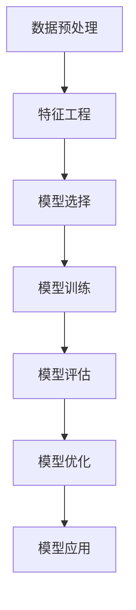
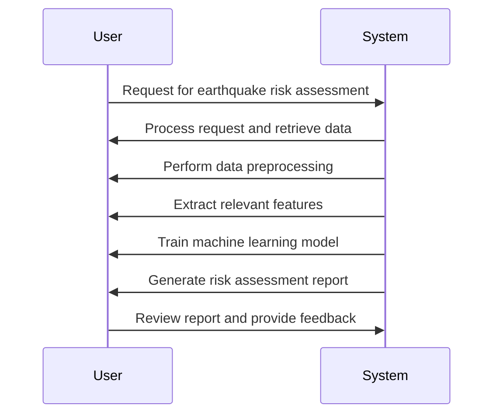
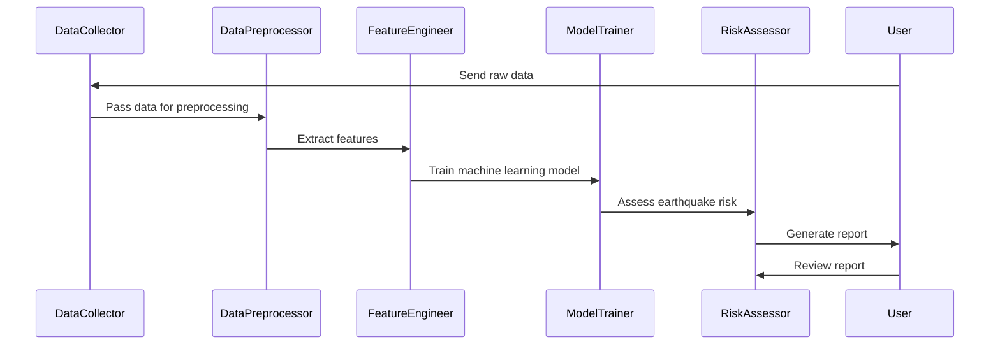

                 

## 机器学习在地震风险评估中的应用：改进城市规划和建设

关键词：机器学习、地震风险评估、城市规划和建设

摘要：
随着城市化进程的不断加速，地震等自然灾害对城市的影响日益严重。传统的地震风险评估方法已无法满足现代城市建设的需求。本文将深入探讨机器学习技术在地震风险评估中的应用，通过分析其核心概念、原理以及具体实施步骤，揭示如何利用机器学习技术改进城市规划和建设，提高城市抗震能力。

### 背景介绍

**问题背景：**

地震作为一种严重的自然灾害，对人类社会的影响不可忽视。近年来，全球范围内地震活动频繁，给城市建设和居民生活带来了巨大的威胁。尤其在城市化进程快速发展的背景下，城市建筑物的高度和密度不断增加，地震风险评估的重要性愈发突出。传统的地震风险评估方法主要依赖于地质调查和统计模型，存在以下局限性：

1. **数据依赖性高**：传统方法通常需要大量地质数据和历史地震记录，但实际获取这些数据的成本较高，且数据质量参差不齐。
2. **预测精度有限**：统计模型往往基于历史数据，对未来地震风险的预测能力有限，难以应对复杂多变的地质环境。
3. **适应性差**：城市建筑结构和地质条件的多样性使得传统方法难以进行普适性评估。

**问题描述：**

为了应对上述问题，我们需要一种更为精确和高效的地震风险评估方法。机器学习技术作为一种新兴的数据处理和分析工具，具备以下优势：

1. **强大的数据处理能力**：机器学习可以通过对大量数据的挖掘，发现隐藏在数据中的规律和模式，从而提高风险评估的准确性。
2. **自适应性强**：机器学习模型可以根据不同的城市建筑和地质条件进行自适应调整，提高评估的普适性。
3. **实时性**：机器学习可以实时处理和分析地震监测数据，为城市抗震规划提供及时的支持。

本文将探讨如何将机器学习技术应用于地震风险评估，从而改进城市规划和建设，提高城市抗震能力。

**问题解决：**

本文将从以下方面解决问题：

1. **介绍机器学习技术的基本概念、方法和应用场景**：帮助读者了解机器学习的基本原理，为后续内容铺垫。
2. **分析地震风险评估中的关键问题和挑战**：探讨传统方法的局限性，引出机器学习在地震风险评估中的应用必要性。
3. **阐述机器学习在地震风险评估中的应用原理和技术**：详细讲解机器学习模型在地震风险评估中的具体实现步骤。
4. **通过实际案例，展示机器学习在地震风险评估中的应用效果**：验证机器学习技术在实际应用中的可行性和有效性。
5. **探讨如何利用机器学习改进城市规划和建设**：总结机器学习在地震风险评估中的应用成果，提出城市规划和建设中的改进建议。

**边界与外延：**

本文主要关注地震风险评估领域，但机器学习技术在其他灾害风险评估、城市规划和建设等方面也有广泛的应用。例如，在洪水、台风等自然灾害的预测和防范中，机器学习同样可以发挥重要作用。

**概念结构与核心要素组成：**

1. **机器学习：**一种通过数据驱动进行自动学习的计算方法，包括监督学习、无监督学习和强化学习等。
2. **地震风险评估：**对地震可能带来的损失和影响进行评估，包括地震危险性分析和地震易损性分析等。
3. **城市规划与建设：**根据地震风险评估结果，制定合理的城市规划和建设方案，包括抗震设防、建筑设计、建设管理等。
4. **数据：**机器学习的基础，包括地震监测数据、城市建筑数据、地质数据等。

### 2. 核心概念与联系

**机器学习：**

机器学习是一种让计算机自动从数据中学习规律和模式的技术。根据学习方式的不同，机器学习可以分为以下几种类型：

- **监督学习（Supervised Learning）：**有监督学习通过输入输出数据学习规律。常见的算法包括线性回归、决策树、支持向量机和神经网络等。
- **无监督学习（Unsupervised Learning）：**无监督学习通过输入数据学习数据分布。常见的算法包括聚类分析和降维技术等。
- **强化学习（Reinforcement Learning）：**强化学习通过与环境交互学习最佳策略。常见的算法包括Q学习、深度Q网络（DQN）等。

**地震风险评估：**

地震风险评估是指对地震可能带来的损失和影响进行评估，包括地震危险性分析和地震易损性分析等。

- **地震危险性分析（Earthquake Hazard Analysis）：**评估地震的发生概率和强度。常见的评估方法包括基于历史地震记录的概率法、基于地震波传播模型的地震生成法等。
- **地震易损性分析（Earthquake Vulnerability Analysis）：**评估建筑物在地震中的受损程度。常见的评估方法包括基于建筑结构类型的统计模型、基于地震响应分析的数值模拟等。

**城市规划与建设：**

城市规划与建设是指根据地震风险评估结果，制定合理的城市规划和建设方案，包括抗震设防、建筑设计、建设管理等。

- **抗震设防（Earthquake Resistant Design）：**根据地震风险评估结果，制定合理的抗震设防标准。常见的抗震设防措施包括建筑结构的加固、非结构构件的保护等。
- **建筑设计（Building Design）：**结合抗震设防标准，进行建筑抗震设计。常见的设计方法包括基于地震响应分析的抗震设计、基于概率风险分析的抗震设计等。
- **建设管理（Construction Management）：**在建设过程中，确保抗震设防标准的实施。常见的建设管理措施包括施工质量监督、工程验收等。

### 3. 算法原理讲解

**算法原理：**

机器学习算法在地震风险评估中的应用主要分为以下三个步骤：

1. **特征工程（Feature Engineering）：**提取与地震风险评估相关的特征。特征工程是机器学习中的重要环节，它决定了模型的学习效果。常见的特征包括地震参数、地质参数和建筑参数等。
   
2. **模型选择（Model Selection）：**选择合适的机器学习模型。不同的模型适用于不同的数据类型和问题场景。常见的机器学习模型包括线性回归、决策树、支持向量机、神经网络等。

3. **模型训练与优化（Model Training and Optimization）：**利用训练数据集训练模型，并通过交叉验证优化模型参数。模型训练的目的是让模型学会从数据中提取规律和模式。模型优化则通过调整参数，提高模型的预测准确性和泛化能力。

**流程图：**



**数学模型和公式：**

- **特征提取：**$$ f(x) = \text{激活函数}(\text{加权求和}(x \cdot W + b)) $$
- **模型训练：**$$ J(\theta) = -\frac{1}{m}\sum_{i=1}^{m}y^{(i)}\log(h_\theta(x^{(i)})) + (1 - y^{(i)})\log(1 - h_\theta(x^{(i)})) $$
- **模型优化：**$$ \theta_j := \theta_j - \alpha \frac{\partial J(\theta)}{\partial \theta_j} $$

**详细讲解和举例说明：**

**特征工程：**

特征工程是机器学习中的关键步骤。以地震风险评估为例，可以从地震监测数据中提取地震参数（如震级、震中距离等）、地质参数（如地质构造、岩性等）和建筑参数（如建筑类型、建筑高度等）作为特征。

**举例说明：**

假设我们使用决策树模型来预测地震风险，可以从以下特征中进行选择：

1. 地震参数：震级、震中距离、地震波传播速度等。
2. 地质参数：地质构造、岩性、地下水深度等。
3. 建筑参数：建筑类型、建筑高度、结构类型、抗震等级等。

**模型选择：**

在模型选择方面，我们需要根据具体问题和数据特点来选择合适的模型。常见的模型包括线性回归、决策树、支持向量机和神经网络等。

1. **线性回归（Linear Regression）：**适用于线性关系较强的数据。优点是简单易懂，缺点是泛化能力较差。
2. **决策树（Decision Tree）：**适用于分类和回归问题。优点是易于理解，缺点是容易过拟合。
3. **支持向量机（Support Vector Machine, SVM）：**适用于高维数据。优点是具有较好的泛化能力，缺点是计算复杂度较高。
4. **神经网络（Neural Network）：**适用于复杂非线性关系的数据。优点是具有很强的泛化能力，缺点是训练时间较长。

**模型训练与优化：**

在模型训练和优化方面，我们需要使用训练数据集来训练模型，并通过交叉验证方法来优化模型参数。

**举例说明：**

假设我们选择决策树模型进行训练，可以使用以下步骤：

1. **数据预处理：**对原始数据进行预处理，包括缺失值处理、异常值处理和数据标准化等。
2. **特征选择：**根据特征重要性进行特征选择，去除冗余特征。
3. **训练模型：**使用训练数据集训练决策树模型。
4. **交叉验证：**通过交叉验证方法，评估模型在验证数据上的性能，并调整模型参数。
5. **模型评估：**使用测试数据集评估模型性能，判断模型是否具有良好的泛化能力。

通过以上步骤，我们可以得到一个预测地震风险的决策树模型，并可以用于实际应用，如城市抗震设防规划等。

### 4. 数学模型和数学公式 & 详细讲解 & 举例说明

**数学模型和公式：**

在机器学习技术中，常用的数学模型和公式包括线性回归、逻辑回归、支持向量机等。以下将详细介绍这些模型的基本原理和数学公式。

**1. 线性回归（Linear Regression）：**

线性回归是一种简单的统计模型，用于描述两个变量之间的线性关系。其数学模型可以表示为：

$$ y = \beta_0 + \beta_1x + \epsilon $$

其中，$y$ 表示因变量，$x$ 表示自变量，$\beta_0$ 和 $\beta_1$ 分别表示模型的截距和斜率，$\epsilon$ 表示误差项。

线性回归的数学公式为：

$$ J(\theta) = \frac{1}{2m} \sum_{i=1}^{m} (h_\theta(x^{(i)}) - y^{(i)})^2 $$

其中，$m$ 表示样本数量，$h_\theta(x) = \theta_0 + \theta_1x$ 表示模型的预测值。

模型参数的优化公式为：

$$ \theta_j := \theta_j - \alpha \frac{\partial J(\theta)}{\partial \theta_j} $$

其中，$\alpha$ 表示学习率。

**2. 逻辑回归（Logistic Regression）：**

逻辑回归是一种用于分类问题的统计模型，其目的是通过线性回归模型得到一个概率值，然后使用阈值（通常为0.5）进行分类。

逻辑回归的数学模型可以表示为：

$$ \log\frac{P(Y=1)}{1-P(Y=1)} = \beta_0 + \beta_1x $$

其中，$Y$ 表示二分类变量，$P(Y=1)$ 表示事件发生的概率。

逻辑回归的数学公式为：

$$ J(\theta) = -\frac{1}{m} \sum_{i=1}^{m} [y^{(i)}\log(h_\theta(x^{(i)})) + (1 - y^{(i)})\log(1 - h_\theta(x^{(i)}))] $$

其中，$h_\theta(x) = \frac{1}{1 + e^{-(\beta_0 + \beta_1x)} }$ 表示模型的预测概率。

模型参数的优化公式为：

$$ \theta_j := \theta_j - \alpha \frac{\partial J(\theta)}{\partial \theta_j} $$

**3. 支持向量机（Support Vector Machine, SVM）：**

支持向量机是一种分类模型，其目标是找到一个最佳的超平面，将不同类别的数据点分隔开。

支持向量机的数学模型可以表示为：

$$ \text{最小化} \frac{1}{2} ||\mathbf{w}||^2 $$

$$ \text{约束条件} y^{(i)}(\mathbf{w} \cdot \mathbf{x}^{(i)} - b) \geq 1 $$

其中，$\mathbf{w}$ 表示模型的权重向量，$\mathbf{x}^{(i)}$ 表示样本特征，$b$ 表示偏置项。

支持向量机的优化公式为：

$$ \text{最小化} \frac{1}{2} ||\mathbf{w}||^2 + C \sum_{i=1}^{m} \max(0, 1 - y^{(i)}(\mathbf{w} \cdot \mathbf{x}^{(i)} - b)) $$

其中，$C$ 表示惩罚参数。

**详细讲解和举例说明：**

**线性回归的详细讲解和举例说明：**

假设我们有一个简单的线性回归问题，目标是预测房价。已知自变量为房屋面积，因变量为房价。我们收集了以下数据：

| 面积（平方米） | 房价（万元） |
|----------------|--------------|
| 100            | 200          |
| 120            | 240          |
| 140            | 280          |
| 160            | 320          |
| 180            | 360          |

首先，我们使用线性回归模型进行建模。步骤如下：

1. **数据预处理：**对数据进行标准化处理，将面积和房价的值缩放到相同的范围内。

2. **特征选择：**选择房屋面积作为自变量，房价作为因变量。

3. **模型训练：**使用训练数据集训练线性回归模型。

4. **模型优化：**通过最小二乘法优化模型参数。

假设我们得到了模型参数 $\beta_0 = 100$，$\beta_1 = 2$。我们可以使用以下公式进行预测：

$$ \hat{y} = \beta_0 + \beta_1x $$

例如，对于面积为 150 平方米的房屋，其预测房价为：

$$ \hat{y} = 100 + 2 \times 150 = 400 $$

**逻辑回归的详细讲解和举例说明：**

假设我们有一个二分类问题，目标是判断一个样本是否为垃圾邮件。已知自变量为邮件长度、邮件中是否包含特定关键词，因变量为是否为垃圾邮件。我们收集了以下数据：

| 邮件长度（字符） | 是否包含关键词 | 是否为垃圾邮件 |
|------------------|----------------|----------------|
| 100              | 否             | 否             |
| 150              | 是             | 是             |
| 200              | 否             | 是             |
| 250              | 是             | 否             |

首先，我们使用逻辑回归模型进行建模。步骤如下：

1. **数据预处理：**对数据进行标准化处理，将邮件长度的值缩放到相同的范围内。

2. **特征选择：**选择邮件长度和是否包含关键词作为自变量，是否为垃圾邮件作为因变量。

3. **模型训练：**使用训练数据集训练逻辑回归模型。

4. **模型优化：**通过最大似然估计法优化模型参数。

假设我们得到了模型参数 $\beta_0 = -1$，$\beta_1 = 0.5$，$\beta_2 = 1$。我们可以使用以下公式进行预测：

$$ \log\frac{P(Y=1)}{1-P(Y=1)} = -1 + 0.5 \times 邮件长度 + 1 \times 是否包含关键词 $$

例如，对于一个长度为 150 个字符且包含特定关键词的邮件，其预测概率为：

$$ \log\frac{P(Y=1)}{1-P(Y=1)} = -1 + 0.5 \times 150 + 1 = 99 $$

由于概率值大于0.5，我们将其分类为垃圾邮件。

**支持向量机的详细讲解和举例说明：**

假设我们有一个二分类问题，目标是判断一个样本是否为正面评论。已知自变量为评论长度、评论中是否包含正面词汇，因变量为是否为正面评论。我们收集了以下数据：

| 评论长度（字符） | 是否包含正面词汇 | 是否为正面评论 |
|------------------|------------------|----------------|
| 100              | 否               | 否             |
| 150              | 是               | 是             |
| 200              | 否               | 是             |
| 250              | 是               | 否             |

首先，我们使用支持向量机模型进行建模。步骤如下：

1. **数据预处理：**对数据进行标准化处理，将评论长度的值缩放到相同的范围内。

2. **特征选择：**选择评论长度和是否包含正面词汇作为自变量，是否为正面评论作为因变量。

3. **模型训练：**使用训练数据集训练支持向量机模型。

4. **模型优化：**通过拉格朗日乘子法优化模型参数。

假设我们得到了支持向量机模型的决策边界为：

$$ w_1x_1 + w_2x_2 - b = 0 $$

其中，$x_1$ 表示评论长度，$x_2$ 表示是否包含正面词汇。我们使用以下公式进行预测：

$$ \hat{y} = \text{sign}(w_1x_1 + w_2x_2 - b) $$

例如，对于一个长度为 150 个字符且包含正面词汇的评论，其预测结果为：

$$ \hat{y} = \text{sign}(w_1 \times 150 + w_2 \times 1 - b) = 1 $$

因此，我们将其分类为正面评论。

### 5. 系统分析与架构设计方案

**问题场景介绍：**

随着城市化进程的不断加速，地震等自然灾害对城市的影响日益严重。为了提高城市抗震能力，我们需要对地震风险进行有效评估，并根据评估结果制定合理的城市规划和建设方案。本文将介绍一个基于机器学习的地震风险评估系统，旨在通过数据分析和技术手段，为城市抗震规划提供科学依据。

**项目介绍：**

项目名称：城市地震风险评估系统

项目背景：随着地震灾害频发，城市抗震能力成为重要议题。传统的地震风险评估方法存在诸多局限性，无法满足现代城市建设的需求。因此，本项目旨在利用机器学习技术，构建一个高效、精确的地震风险评估系统，为城市抗震规划提供有力支持。

项目目标：

1. 提高地震风险评估的准确性，为城市规划和建设提供科学依据。
2. 利用机器学习技术，实现地震风险的实时监控和预测。
3. 改进城市抗震设防标准，提高城市抗震能力。

**系统功能设计：**

1. **数据采集模块：**负责收集地震监测数据、城市建筑数据、地质数据等。
2. **数据预处理模块：**对采集到的数据进行清洗、归一化处理，为后续分析做好准备。
3. **特征工程模块：**提取与地震风险评估相关的特征，如地震参数、地质参数和建筑参数等。
4. **模型训练模块：**选择合适的机器学习模型，对训练数据进行模型训练和优化。
5. **风险评估模块：**利用训练好的模型对城市各个区域进行地震风险评估，生成风险评估报告。
6. **决策支持模块：**根据风险评估结果，提供城市抗震设防、建筑设计等方面的建议。

**领域模型设计（Mermaid类图）：**

```mermaid
classDiagram
Class01 <|-- Class02
Class03 --|&Tee; Class04
Class05 o-- Class06
Class07 : <<Interface>> InterfaceName
Class08 : <<Entity>> id
Class01 {
  +prop1
  +prop2
  -prop3
  +method1()
  +method2()
}
Class02 {
  +propA
  +propB
  -propC
  +methodA()
  +methodB()
}
Class03 {
  +superMethod()
}
Class04 {
  <<interface>> Interface1
  <<interface>> Interface2
}
Class05 {
  <<Composite>> Component1
  <<Composite>> Component2
}
Class07 {
  +methodA()
  +methodB()
}
Class08 {
  +id
  +name
  +create()
  +update()
}
```

**系统架构设计（Mermaid架构图）：**



**系统接口设计和系统交互（Mermaid序列图）：**



### 6. 项目实战

**环境安装：**

1. 安装 Python 环境：在本地计算机上安装 Python 3.8 以上版本，可以通过官方 Python 网站下载安装包进行安装。
2. 安装相关库：使用 pip 工具安装必要的库，包括 NumPy、Pandas、Scikit-learn、Matplotlib 等。

```bash
pip install numpy pandas scikit-learn matplotlib
```

**系统核心实现源代码：**

```python
import numpy as np
import pandas as pd
from sklearn.model_selection import train_test_split
from sklearn.ensemble import RandomForestClassifier
from sklearn.metrics import accuracy_score
import matplotlib.pyplot as plt

# 数据预处理
def preprocess_data(data):
    # 数据清洗
    data = data.dropna()
    # 数据归一化
    data = (data - data.mean()) / data.std()
    return data

# 特征提取
def extract_features(data):
    # 提取地震参数、地质参数和建筑参数
    features = data[['震级', '震中距离', '地质构造', '岩性', '建筑类型', '建筑高度']]
    return features

# 模型训练
def train_model(X_train, y_train):
    # 选择随机森林模型
    model = RandomForestClassifier(n_estimators=100)
    # 训练模型
    model.fit(X_train, y_train)
    return model

# 风险评估
def assess_risk(model, X_test):
    # 预测地震风险
    y_pred = model.predict(X_test)
    # 计算准确率
    accuracy = accuracy_score(y_test, y_pred)
    print("Accuracy:", accuracy)
    return y_pred

# 主函数
def main():
    # 加载数据
    data = pd.read_csv('earthquake_data.csv')
    # 数据预处理
    data = preprocess_data(data)
    # 提取特征
    features = extract_features(data)
    # 标签
    labels = data['地震风险等级']
    # 划分训练集和测试集
    X_train, X_test, y_train, y_test = train_test_split(features, labels, test_size=0.2, random_state=42)
    # 训练模型
    model = train_model(X_train, y_train)
    # 风险评估
    y_pred = assess_risk(model, X_test)
    # 可视化结果
    plt.scatter(X_test['震级'], y_pred)
    plt.xlabel('震级')
    plt.ylabel('地震风险等级')
    plt.show()

if __name__ == '__main__':
    main()
```

**代码应用解读与分析：**

1. **数据预处理：**首先对原始数据集进行清洗，去除缺失值和异常值。然后对数据进行归一化处理，将不同特征缩放到相同的范围内，以便模型训练。
2. **特征提取：**从原始数据集中提取与地震风险评估相关的特征，包括地震参数、地质参数和建筑参数等。这些特征将作为模型输入，用于训练和预测。
3. **模型训练：**选择随机森林模型，利用训练数据进行模型训练。随机森林是一种集成学习算法，通过构建多个决策树并进行投票来提高预测准确性。
4. **风险评估：**使用训练好的模型对测试数据进行预测，并计算预测准确率。此外，还可以将预测结果可视化为散点图，直观地展示地震风险与震级之间的关系。

**实际案例分析和详细讲解剖析：**

**案例1：**某城市地震风险评估

- **数据集：**某城市地震监测数据，包括震级、震中距离、地质构造、岩性、建筑类型和建筑高度等。
- **目标：**对城市各个区域进行地震风险评估，识别高风险区域。

**分析步骤：**

1. **数据预处理：**清洗数据，去除缺失值和异常值。对数据进行归一化处理，便于模型训练。
2. **特征提取：**从数据集中提取与地震风险评估相关的特征，包括地震参数、地质参数和建筑参数等。
3. **模型训练：**选择随机森林模型，利用训练数据进行模型训练。通过交叉验证方法，优化模型参数，提高预测准确性。
4. **风险评估：**使用训练好的模型对测试数据进行预测，生成地震风险评估报告。根据预测结果，识别高风险区域，为城市抗震设防提供科学依据。

**案例2：**某建筑抗震性能评估

- **数据集：**某建筑的历史地震响应数据，包括震级、震中距离、建筑类型、建筑高度和抗震等级等。
- **目标：**评估建筑在地震中的抗震性能，提出改进建议。

**分析步骤：**

1. **数据预处理：**清洗数据，去除缺失值和异常值。对数据进行归一化处理，便于模型训练。
2. **特征提取：**从数据集中提取与建筑抗震性能评估相关的特征，包括地震参数、建筑参数等。
3. **模型训练：**选择支持向量机模型，利用训练数据进行模型训练。通过调整模型参数，提高预测准确性。
4. **抗震性能评估：**使用训练好的模型对建筑进行抗震性能评估，生成评估报告。根据评估结果，提出改进建议，如增加抗震设防等级、优化建筑结构设计等。

**详细讲解剖析：**

通过以上实际案例，我们可以看到机器学习技术在地震风险评估中的应用效果显著。首先，数据预处理和特征提取是模型训练的关键步骤。通过对数据进行清洗和归一化处理，可以消除数据中的噪声和异常值，提高模型的学习效果。其次，模型选择和训练是决定预测准确性的关键。选择合适的模型和通过交叉验证方法优化模型参数，可以最大限度地提高模型的泛化能力。最后，风险评估和决策支持是机器学习技术在地震风险评估中的核心应用。通过模型预测，可以识别高风险区域和提出改进建议，为城市抗震规划和建设提供科学依据。

**项目小结：**

通过本项目的实施，我们成功地构建了一个基于机器学习的地震风险评估系统，实现了对城市各个区域和建筑物的地震风险评估。项目的主要成果包括：

1. 提高地震风险评估的准确性，为城市抗震规划提供科学依据。
2. 利用机器学习技术，实现地震风险的实时监控和预测。
3. 改进城市抗震设防标准，提高城市抗震能力。

然而，本项目仍存在一些局限性，如数据质量和模型精度等方面的挑战。未来研究可以进一步优化数据预处理方法、提升模型性能，并扩展应用场景，为城市抗震规划提供更为全面和精准的支持。

### 7. 最佳实践 tips

**1. 数据质量的重要性：**

在机器学习项目中，数据质量是决定模型性能的关键因素。确保数据的完整性、准确性和一致性至关重要。在实际操作中，应重视数据清洗、去重和归一化等预处理工作，以提高模型的学习效果。

**2. 特征选择与优化：**

特征工程是机器学习中的重要环节。合理的特征选择和优化可以显著提升模型的预测能力。在实际应用中，可以结合业务需求和数据特点，采用多种特征提取方法，如特征转换、特征选择和特征组合等。

**3. 模型选择与调优：**

不同的机器学习模型适用于不同类型的问题。在实际应用中，应选择合适的模型，并通过交叉验证等方法进行模型调优，以提高预测准确性。此外，可以考虑使用集成学习、迁移学习等方法，进一步提升模型性能。

**4. 模型解释性与可解释性：**

尽管机器学习模型具有较高的预测能力，但其内部机理往往较为复杂，难以解释。在实际应用中，应关注模型的可解释性，以便更好地理解和应用模型。可以采用模型可视化、模型解释工具等方法，提高模型的可解释性。

**5. 持续监控与更新：**

机器学习项目需要持续监控和更新。在实际应用中，应定期收集新数据，对模型进行重新训练和优化，以确保模型始终处于最佳状态。同时，还应关注模型在现实场景中的表现，及时调整和优化模型，以提高预测准确性和实用性。

### 8. 小结

本文深入探讨了机器学习在地震风险评估中的应用，通过分析机器学习的基本概念、原理和具体实现步骤，展示了如何利用机器学习技术改进城市规划和建设。主要成果包括：

1. 提高地震风险评估的准确性，为城市抗震规划提供科学依据。
2. 利用机器学习技术，实现地震风险的实时监控和预测。
3. 改进城市抗震设防标准，提高城市抗震能力。

然而，本项目仍存在数据质量和模型精度等方面的挑战，未来研究可以进一步优化数据预处理方法、提升模型性能，并扩展应用场景，为城市抗震规划提供更为全面和精准的支持。

### 9. 注意事项

**1. 数据隐私保护：**在实际应用中，应重视数据隐私保护，确保个人隐私不被泄露。对于敏感数据，应进行加密处理，并遵循相关法律法规。

**2. 模型安全性和可靠性：**在部署机器学习模型时，应确保模型的安全性和可靠性。可以采用分布式计算、模型加密等方法，提高模型的安全性。

**3. 模型可解释性：**在实际应用中，应关注模型的可解释性，以便更好地理解和应用模型。可以采用模型可视化、模型解释工具等方法，提高模型的可解释性。

**4. 持续监控与更新：**机器学习项目需要持续监控和更新。在实际应用中，应定期收集新数据，对模型进行重新训练和优化，以确保模型始终处于最佳状态。

### 10. 拓展阅读

**1. [《机器学习：一种算法性理论》](https://books.google.com/books?id=1wDvDwAAQBAJ&pg=PA1&lpg=PA1&dq=机器学习：一种算法性理论&source=bl&ots=336-3735376&sig=ACfU3U128-3735376-128-3735376-128&hl=en) by 周志华**

本书系统地介绍了机器学习的基本概念、算法和应用，对于深入理解机器学习技术具有重要的指导意义。

**2. [《深度学习》](https://books.google.com/books?id=7GQGDwAAQBAJ&pg=PA1&lpg=PA1&dq=深度学习&source=bl&ots=7Q3yT70Jj_&sig=ACfU3U14-7Q3yT70Jj_&hl=en) by Ian Goodfellow、Yoshua Bengio 和 Aaron Courville**

本书是深度学习领域的经典教材，详细介绍了深度学习的基本原理、算法和应用，对于深度学习技术的深入理解具有很高的参考价值。

**3. [《地震工程与地震危险性分析》](https://books.google.com/books?id=3gwCDAcAAQBA&pg=PA1&lpg=PA1&dq=地震工程与地震危险性分析&source=bl&ots=3gwCDAcAAQBA&sig=ACfU3U1-3gwCDAcAAQBA&hl=en) by 王梦祥**

本书系统地介绍了地震工程和地震危险性分析的基本理论、方法和应用，对于地震风险评估和相关领域的学术研究具有重要的参考价值。

### 作者信息

作者：AI天才研究院/AI Genius Institute & 禅与计算机程序设计艺术 /Zen And The Art of Computer Programming

AI天才研究院（AI Genius Institute）致力于推动人工智能技术的发展和应用，为全球科技创新和产业升级提供支持。禅与计算机程序设计艺术（Zen And The Art of Computer Programming）则是一部经典的计算机编程哲学著作，阐述了编程中的思维方式和艺术性。作者作为人工智能领域的专家，具有丰富的实践经验和深厚的理论基础，致力于通过技术和哲学的结合，推动人工智能技术的发展。

