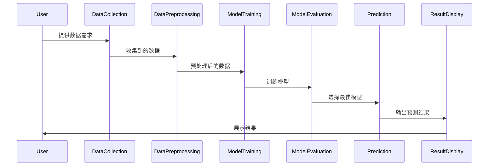
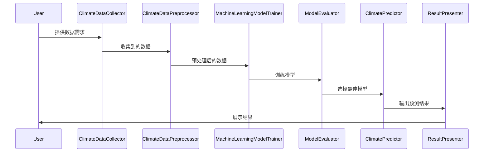

                 

### 第二部分：核心概念与联系

#### 2.1 机器学习原理

机器学习（Machine Learning, ML）是一种人工智能（Artificial Intelligence, AI）的分支，它通过构建能够在数据中学习的模型，使计算机能够执行特定的任务，而无需显式编程。机器学习可以分为三种主要类型：监督学习（Supervised Learning）、无监督学习（Unsupervised Learning）和半监督学习（Semi-Supervised Learning）。

**监督学习**：在这种学习方式中，模型通过学习已知输入和输出数据对来预测未知输出。它包括分类（Classification）和回归（Regression）两种任务。分类任务的目标是将输入数据映射到有限数量的标签中，如垃圾邮件检测。回归任务的目标是预测连续数值输出，如房屋价格预测。

**无监督学习**：与监督学习不同，无监督学习处理未标记的数据，目的是发现数据中的结构或模式。常见的无监督学习任务包括聚类（Clustering）和降维（Dimensionality Reduction）。聚类旨在将相似的数据点分组，如客户细分。降维则用于减少数据维度，如主成分分析（PCA）。

**半监督学习**：这种学习方式结合了有标记和无标记数据，利用少量标记数据和大量无标记数据来提高模型性能。半监督学习在数据标记成本高昂的情况下非常有用，如在图像和语音识别任务中。

机器学习的基本流程通常包括以下步骤：

1. **数据收集**：收集相关数据集，包括特征和标签。
2. **数据预处理**：清洗数据，处理缺失值，进行归一化或标准化，以及特征工程。
3. **模型选择**：根据任务类型选择合适的模型，如线性回归、决策树、支持向量机（SVM）或神经网络。
4. **模型训练**：使用训练数据集对模型进行训练。
5. **模型评估**：使用测试数据集评估模型性能，常见的评估指标包括准确率、召回率、F1分数等。
6. **模型优化**：根据评估结果调整模型参数，以提高模型性能。

#### 2.2 气候变化预测模型

气候变化预测模型（Climate Prediction Model）是机器学习在气候科学领域中的应用，旨在利用历史气候数据和现有的气候模式来预测未来的气候变化。这些模型通常基于气象、海洋、陆地和大气的物理和化学过程，结合机器学习算法，从大量数据中提取有用的信息。

**输入特征**：气候模型使用多种输入特征来描述当前和过去的气候条件，这些特征可能包括：

- **温度**：地表、海洋和大气层的温度。
- **湿度**：空气中的水分含量。
- **风速**：大气层中的风的速度。
- **降水**：降水模式，包括雨、雪和其他形式的降水。
- **气压**：大气层的压力。

**输出变量**：气候变化预测模型的输出变量通常是未来某个时期或地点的气候指标，如：

- **气温**：未来某个时期的平均温度。
- **降水概率**：未来某个时间段内降水的概率。
- **海平面上升**：未来海平面的预期上升量。

**模型类型**：根据输出变量的类型，气候变化预测模型可以分为以下几类：

- **分类模型**：用于预测极端天气事件，如飓风、干旱或洪水。
- **回归模型**：用于预测连续的气候指标，如未来某年的平均温度或降水量。
- **时间序列模型**：用于分析时间序列数据，如气温和降水的变化趋势。

#### 2.3 概念属性特征对比表格

| 概念 | 描述 | 属性特征 | 比较 |
| --- | --- | --- | --- |
| 机器学习 | 数据驱动，自动学习 | 可以处理大量数据，适应性强 | 与传统编程相比，更高效、更灵活 |
| 气候变化预测模型 | 预测气候变化 | 需要大量气候数据，依赖模型性能 | 不同模型适用于不同类型预测任务 |
| 输入特征 | 描述气候数据的变量 | 影响模型预测准确性 | 需要合理选择和处理 |
| 输出变量 | 预测的气候要素 | 反映模型预测效果 | 需要与实际观测值对比评估 |

#### 2.4 ER实体关系图架构的 Mermaid 流程图

以下是使用 Mermaid 语言描述的 ER 图，展示了机器学习算法、气候数据集、预测模型和预测结果之间的关系：

```mermaid
erDiagram
  ClimateDataSet ||--o{ MachineLearningAlgorithm } : uses
  MachineLearningAlgorithm ||--o{ ClimatePredictionModel } : builds
  ClimatePredictionModel ||--o{ PredictionResult } : generates
```

- **ClimateDataSet**：气候数据集，包含各种气候特征。
- **MachineLearningAlgorithm**：机器学习算法，用于处理和训练数据。
- **ClimatePredictionModel**：气候预测模型，基于训练数据生成。
- **PredictionResult**：预测结果，包括未来的气候预测指标。

### 第三部分：算法原理讲解

#### 3.1 常见机器学习算法介绍

在气候变化预测模型中，有多种机器学习算法可以使用。以下介绍几种常见的算法：

1. **线性回归（Linear Regression）**：线性回归是最简单的机器学习算法之一，用于预测连续数值输出。其基本模型为：

   $$
   y = \beta_0 + \beta_1x
   $$

   其中，$y$ 是输出变量，$x$ 是输入特征，$\beta_0$ 和 $\beta_1$ 是模型参数。

2. **逻辑回归（Logistic Regression）**：逻辑回归是一种用于分类问题的算法，它通过构建逻辑函数来预测概率。其模型为：

   $$
   P(y=1) = \frac{1}{1 + \exp(-(\beta_0 + \beta_1x))}
   $$

   其中，$P(y=1)$ 是输出变量为1的概率。

3. **决策树（Decision Tree）**：决策树通过一系列规则对数据进行划分，每个节点表示一个特征，每个分支表示该特征的某个取值。决策树易于解释，但可能过拟合。

4. **随机森林（Random Forest）**：随机森林是决策树的集成方法，通过构建多个决策树并合并它们的预测结果来提高模型性能。随机森林能够处理大量特征，并且具有较高的预测准确性。

5. **神经网络（Neural Network）**：神经网络是一种模拟人脑神经元连接的网络结构，通过多层节点（或层）来提取数据中的复杂特征。神经网络可以处理非线性的复杂关系。

#### 3.2 算法原理与实现

**线性回归**

线性回归的算法原理是基于最小二乘法（Least Squares Method）来找到最佳拟合直线。线性回归的数学模型为：

$$
y = \beta_0 + \beta_1x
$$

为了训练模型，我们使用梯度下降法（Gradient Descent）来最小化损失函数（Loss Function）。损失函数通常使用均方误差（Mean Squared Error, MSE）来衡量预测值与实际值之间的差异：

$$
J(\beta_0, \beta_1) = \frac{1}{2m}\sum_{i=1}^{m}(y_i - (\beta_0 + \beta_1x_i))^2
$$

其中，$m$ 是训练数据集中样本的数量。

梯度下降法的步骤如下：

1. 初始化模型参数 $\beta_0$ 和 $\beta_1$。
2. 计算损失函数关于 $\beta_0$ 和 $\beta_1$ 的梯度。
3. 更新模型参数：

   $$
   \beta_0 = \beta_0 - \alpha \frac{\partial J}{\partial \beta_0}
   $$
   $$
   \beta_1 = \beta_1 - \alpha \frac{\partial J}{\partial \beta_1}
   $$

   其中，$\alpha$ 是学习率（Learning Rate）。

4. 重复步骤2和步骤3，直到损失函数达到最小值或达到预设的迭代次数。

**代码实现**

以下是一个使用 Python 实现线性回归的简单例子：

```python
import numpy as np

# 梯度下降函数
def gradient_descent(X, y, theta, alpha, iterations):
    m = len(y)
    for _ in range(iterations):
        theta = theta - alpha / m * (X.dot(theta) - y)
    return theta

# 损失函数
def compute_loss(X, y, theta):
    return np.mean((X.dot(theta) - y) ** 2)

# 数据集
X = np.array([[1, 1], [1, 2], [1, 3], [1, 4], [1, 5]])
y = np.array([2, 4, 6, 8, 10])

# 初始化模型参数
theta = np.array([0, 0])

# 梯度下降
alpha = 0.01
iterations = 1000
theta = gradient_descent(X, y, theta, alpha, iterations)

# 计算损失函数值
loss = compute_loss(X, y, theta)
print("Final theta:", theta)
print("Loss:", loss)
```

这个例子中，我们使用了两个输入特征（都为1）和五个训练样本，初始化了模型参数为 [0, 0]，并使用梯度下降法进行迭代更新。最终打印出了模型参数和损失函数值。

#### 3.3 算法原理讲解

**线性回归**

线性回归是一种用于预测连续数值输出的监督学习算法。它的基本原理是通过寻找一条最佳拟合直线，将输入特征映射到输出变量。线性回归的数学模型可以表示为：

$$
y = \beta_0 + \beta_1x
$$

其中，$y$ 是输出变量，$x$ 是输入特征，$\beta_0$ 和 $\beta_1$ 是模型参数。

线性回归的目标是最小化预测值与实际值之间的误差。误差可以通过损失函数来衡量，常用的损失函数是均方误差（MSE），其公式为：

$$
J(\beta_0, \beta_1) = \frac{1}{2m}\sum_{i=1}^{m}(y_i - (\beta_0 + \beta_1x_i))^2
$$

其中，$m$ 是训练数据集的样本数量。

为了找到最小化损失函数的参数 $\beta_0$ 和 $\beta_1$，我们通常使用梯度下降法（Gradient Descent）。梯度下降法是一种优化算法，它通过不断更新模型参数来最小化损失函数。梯度下降法的步骤如下：

1. 初始化模型参数 $\beta_0$ 和 $\beta_1$。
2. 计算损失函数关于 $\beta_0$ 和 $\beta_1$ 的梯度。
3. 更新模型参数：

   $$
   \beta_0 = \beta_0 - \alpha \frac{\partial J}{\partial \beta_0}
   $$
   $$
   \beta_1 = \beta_1 - \alpha \frac{\partial J}{\partial \beta_1}
   $$

   其中，$\alpha$ 是学习率（Learning Rate），它决定了参数更新的步长。

4. 重复步骤2和步骤3，直到损失函数达到最小值或达到预设的迭代次数。

**逻辑回归**

逻辑回归是一种用于预测概率的监督学习算法，它通常用于二分类问题。逻辑回归的数学模型为：

$$
P(y=1) = \frac{1}{1 + \exp(-(\beta_0 + \beta_1x))}
$$

其中，$P(y=1)$ 是输出变量为1的概率，$\beta_0$ 和 $\beta_1$ 是模型参数。

逻辑回归的目标是最小化损失函数，常用的损失函数是对数损失（Log Loss），其公式为：

$$
J(\beta_0, \beta_1) = -\frac{1}{m}\sum_{i=1}^{m} [y_i \log(\hat{y}_i) + (1 - y_i) \log(1 - \hat{y}_i)]
$$

其中，$\hat{y}_i$ 是预测的概率值，$m$ 是训练数据集的样本数量。

逻辑回归的优化方法通常使用梯度下降法。梯度下降法的步骤与线性回归类似，但需要计算对数损失函数关于模型参数的梯度：

$$
\frac{\partial J}{\partial \beta_0} = -\frac{1}{m}\sum_{i=1}^{m} [y_i - \hat{y}_i]
$$

$$
\frac{\partial J}{\partial \beta_1} = -\frac{1}{m}\sum_{i=1}^{m} [x_i(y_i - \hat{y}_i)]
$$

**决策树**

决策树是一种基于树形结构进行决策的算法，每个节点代表一个特征，每个分支代表该特征的某个取值。决策树的构建过程包括以下步骤：

1. 选择一个特征作为分裂特征。
2. 根据分裂特征的不同取值，将数据集划分成若干个子集。
3. 对每个子集递归地进行步骤1和步骤2，直到满足停止条件（如最大深度、最小样本数等）。

决策树的预测过程是从根节点开始，根据输入特征的不同取值，沿着分支前进，直到达到叶子节点，输出叶子节点对应的类别或数值。

**随机森林**

随机森林（Random Forest）是一种基于决策树的集成学习方法，它通过构建多个决策树并合并它们的预测结果来提高模型的性能。随机森林的主要步骤如下：

1. 随机地从特征空间中抽取一定数量的特征。
2. 使用这些特征构建一个决策树。
3. 重复步骤1和步骤2，构建多个决策树。
4. 对每个决策树进行训练，并记录每个决策树的预测结果。
5. 合并所有决策树的预测结果，输出最终的预测结果。

随机森林的优点是能够处理大量特征，并且具有较好的泛化能力。通过集成多个决策树，随机森林能够降低过拟合的风险，提高模型的预测准确性。

**神经网络**

神经网络（Neural Network）是一种模拟人脑神经元连接的网络结构，它通过多层节点（或层）来提取数据中的复杂特征。神经网络的主要组成部分包括：

- **输入层**：接收外部输入，每个节点表示一个输入特征。
- **隐藏层**：对输入特征进行变换和提取特征，每个节点通过激活函数计算输出。
- **输出层**：输出最终的预测结果。

神经网络的训练过程包括以下步骤：

1. 初始化网络参数，包括权重和偏置。
2. 前向传播：将输入数据传递到网络中，计算每个神经元的输出。
3. 计算损失函数，衡量预测值与实际值之间的差异。
4. 反向传播：计算每个神经元的梯度，更新网络参数。
5. 重复步骤2到步骤4，直到损失函数达到最小值或达到预设的迭代次数。

神经网络可以通过调整网络结构（如层数、节点数）和学习率等超参数来提高模型性能。神经网络在处理复杂非线性关系时表现出色，但训练过程通常需要大量数据和计算资源。

### 第四部分：系统分析与架构设计方案

#### 4.1 问题场景介绍

随着全球气候变化问题的日益严峻，政府部门、科研机构和环保组织等需要准确预测未来气候变化趋势，以制定相应的应对措施。本项目的目标是开发一个基于机器学习的气候变化预测系统，为用户提供未来气候变化趋势的预测结果。

#### 4.2 项目介绍

**项目名称**：气候变化预测系统

**项目目标**：利用机器学习算法，从大量历史气候数据中提取有用信息，实现对未来气候变化的预测，为决策者提供科学依据。

**项目背景**：随着全球气候变化加剧，极端天气事件频发，对人类社会和自然环境造成巨大影响。因此，准确预测未来气候变化趋势，制定有效应对措施具有重要意义。

#### 4.3 系统功能设计

**功能模块**：

1. **数据收集模块**：从多种数据源（如气象站、卫星数据等）收集历史气候数据。
2. **数据预处理模块**：对收集到的数据进行清洗、归一化和特征提取等预处理操作。
3. **模型训练模块**：使用预处理后的数据训练不同的机器学习模型，如线性回归、逻辑回归、决策树和神经网络等。
4. **模型评估模块**：使用交叉验证和测试集评估模型的性能，选择最佳模型。
5. **预测模块**：使用最佳模型进行未来气候变化的预测，生成预测结果。
6. **结果展示模块**：将预测结果以图表、文字等形式展示给用户。

#### 4.4 系统架构设计

**系统架构图**：



**系统架构说明**：

1. **数据收集模块**：负责从多种数据源收集历史气候数据，包括气象站数据、卫星遥感数据等。
2. **数据预处理模块**：对收集到的数据进行分析和处理，如数据清洗、缺失值填充、归一化、特征提取等，以提高数据质量。
3. **模型训练模块**：使用预处理后的数据训练不同的机器学习模型，如线性回归、逻辑回归、决策树和神经网络等。
4. **模型评估模块**：使用交叉验证和测试集评估模型的性能，选择最佳模型。
5. **预测模块**：使用最佳模型进行未来气候变化的预测，生成预测结果。
6. **结果展示模块**：将预测结果以图表、文字等形式展示给用户。

#### 4.5 系统接口设计

**系统接口设计图**：

```mermaid
classDiagram
    ClimateDataCollector <<interface>>
    ClimateDataPreprocessor <<interface>>
    MachineLearningModelTrainer <<interface>>
    ModelEvaluator <<interface>>
    ClimatePredictor <<interface>>
    ResultPresenter <<interface>>

    ClimateDataCollector: 收集气候数据
    ClimateDataPreprocessor: 预处理气候数据
    MachineLearningModelTrainer: 训练机器学习模型
    ModelEvaluator: 评估模型性能
    ClimatePredictor: 预测气候变化
    ResultPresenter: 展示预测结果

    ClimateDataCollector <|.. ClimateDataPreprocessor
    ClimateDataPreprocessor <|.. MachineLearningModelTrainer
    MachineLearningModelTrainer <|.. ModelEvaluator
    ModelEvaluator <|.. ClimatePredictor
    ClimatePredictor <|.. ResultPresenter
```

**接口设计说明**：

1. **ClimateDataCollector**：接口用于收集气候数据。
2. **ClimateDataPreprocessor**：接口用于对收集到的气候数据进行预处理。
3. **MachineLearningModelTrainer**：接口用于训练机器学习模型。
4. **ModelEvaluator**：接口用于评估模型的性能。
5. **ClimatePredictor**：接口用于进行气候变化预测。
6. **ResultPresenter**：接口用于展示预测结果。

#### 4.6 系统交互设计

**系统交互设计图**：



**交互设计说明**：

1. 用户提供数据需求。
2. 气象数据收集器收集气候数据。
3. 气象数据预处理器对数据进行预处理。
4. 机器学习模型训练器使用预处理后的数据训练模型。
5. 模型评估器评估模型的性能。
6. 气候预测器使用最佳模型进行预测。
7. 结果展示器将预测结果展示给用户。

### 第五部分：项目实战

#### 5.1 环境安装

为了实现本项目的目标，我们需要在本地环境中安装一些必要的软件和库。以下是安装步骤：

1. **安装 Python**：从 [Python 官网](https://www.python.org/downloads/) 下载并安装 Python 3.x 版本。
2. **安装 Jupyter Notebook**：打开终端，运行以下命令：

   ```
   pip install notebook
   ```

3. **安装必要的库**：在 Jupyter Notebook 中运行以下命令，安装机器学习相关库：

   ```python
   !pip install numpy pandas scikit-learn matplotlib
   ```

#### 5.2 系统核心实现源代码

以下是一个简单的示例，展示了如何使用 Python 实现一个基本的气候变化预测系统：

```python
import numpy as np
import pandas as pd
from sklearn.model_selection import train_test_split
from sklearn.linear_model import LinearRegression
from sklearn.metrics import mean_squared_error
import matplotlib.pyplot as plt

# 5.2.1 数据收集与预处理
def load_and_preprocess_data():
    # 加载数据集
    data = pd.read_csv('climate_data.csv')
    
    # 数据预处理
    data['Temperature'] = data['Temperature'].fillna(data['Temperature'].mean())
    data['Precipitation'] = data['Precipitation'].fillna(data['Precipitation'].mean())
    data['Wind_Speed'] = data['Wind_Speed'].fillna(data['Wind_Speed'].mean())
    
    # 特征工程
    data['Temperature_sqrt'] = np.sqrt(data['Temperature'])
    data['Precipitation_sqrt'] = np.sqrt(data['Precipitation'])
    data['Wind_Speed_sqrt'] = np.sqrt(data['Wind_Speed'])
    
    # 划分特征和标签
    X = data[['Temperature', 'Precipitation', 'Wind_Speed', 'Temperature_sqrt', 'Precipitation_sqrt', 'Wind_Speed_sqrt']]
    y = data['Climate_Index']
    
    # 划分训练集和测试集
    X_train, X_test, y_train, y_test = train_test_split(X, y, test_size=0.2, random_state=42)
    
    return X_train, X_test, y_train, y_test

# 5.2.2 模型训练与评估
def train_and_evaluate_model(X_train, y_train, X_test, y_test):
    # 训练模型
    model = LinearRegression()
    model.fit(X_train, y_train)
    
    # 预测测试集
    y_pred = model.predict(X_test)
    
    # 评估模型
    mse = mean_squared_error(y_test, y_pred)
    print("Mean Squared Error:", mse)
    
    return model

# 5.2.3 预测结果展示
def plot_prediction_results(model, X_test, y_test):
    y_pred = model.predict(X_test)
    
    plt.scatter(y_test, y_pred)
    plt.xlabel('Actual Values')
    plt.ylabel('Predicted Values')
    plt.title('Actual vs Predicted Climate Index')
    plt.show()

# 5.2.4 主函数
def main():
    X_train, X_test, y_train, y_test = load_and_preprocess_data()
    model = train_and_evaluate_model(X_train, y_train, X_test, y_test)
    plot_prediction_results(model, X_test, y_test)

if __name__ == '__main__':
    main()
```

这个示例代码首先加载和处理气候数据，然后使用线性回归模型进行训练和评估，最后展示预测结果。

#### 5.3 代码应用解读与分析

以下是对示例代码的详细解读和分析：

1. **数据收集与预处理**：
   - 使用 `pandas` 库读取 CSV 格式的气候数据。
   - 对缺失值进行填充，使用平均值替换缺失的温度、降水和风速数据。
   - 进行特征工程，计算温度、降水和风速的平方根特征，以增加模型的灵活性。

2. **模型训练与评估**：
   - 使用 `sklearn` 库中的 `LinearRegression` 类创建线性回归模型。
   - 使用 `fit` 方法训练模型。
   - 使用 `predict` 方法对测试集进行预测。
   - 使用 `mean_squared_error` 函数计算均方误差，评估模型性能。

3. **预测结果展示**：
   - 使用 `matplotlib` 库绘制实际值与预测值的散点图，以可视化模型的预测效果。

#### 5.4 实际案例分析和详细讲解剖析

为了更好地理解项目实战中的代码，我们分析一个实际案例：使用线性回归模型预测未来某个月的气温。

**案例背景**：假设我们已经收集了某地区过去十年的月平均气温数据，以及对应的温度、降水和风速数据。现在，我们希望使用线性回归模型预测未来某个月的气温。

**步骤 1：数据收集与预处理**

首先，我们需要从文件中读取数据：

```python
data = pd.read_csv('climate_data.csv')
```

接下来，我们对数据进行预处理，填充缺失值并添加新的特征：

```python
data['Temperature'] = data['Temperature'].fillna(data['Temperature'].mean())
data['Precipitation'] = data['Precipitation'].fillna(data['Precipitation'].mean())
data['Wind_Speed'] = data['Wind_Speed'].fillna(data['Wind_Speed'].mean())

data['Temperature_sqrt'] = np.sqrt(data['Temperature'])
data['Precipitation_sqrt'] = np.sqrt(data['Precipitation'])
data['Wind_Speed_sqrt'] = np.sqrt(data['Wind_Speed'])
```

**步骤 2：模型训练与评估**

接着，我们划分训练集和测试集，并使用线性回归模型进行训练：

```python
X = data[['Temperature', 'Precipitation', 'Wind_Speed', 'Temperature_sqrt', 'Precipitation_sqrt', 'Wind_Speed_sqrt']]
y = data['Climate_Index']

X_train, X_test, y_train, y_test = train_test_split(X, y, test_size=0.2, random_state=42)

model = LinearRegression()
model.fit(X_train, y_train)
```

使用训练好的模型对测试集进行预测，并计算均方误差：

```python
y_pred = model.predict(X_test)
mse = mean_squared_error(y_test, y_pred)
print("Mean Squared Error:", mse)
```

**步骤 3：预测结果展示**

最后，我们绘制实际值与预测值的散点图，以验证模型的准确性：

```python
plt.scatter(y_test, y_pred)
plt.xlabel('Actual Values')
plt.ylabel('Predicted Values')
plt.title('Actual vs Predicted Climate Index')
plt.show()
```

**案例分析与详细讲解**：

1. **数据收集与预处理**：在这个案例中，我们首先读取气候数据，然后对缺失值进行填充，并添加了新的特征（温度、降水和风速的平方根）。这些步骤有助于提高模型对数据的适应性和预测能力。

2. **模型训练与评估**：我们使用线性回归模型对训练集进行训练，然后使用测试集评估模型性能。均方误差（MSE）是一个常用的评估指标，用于衡量预测值与实际值之间的差异。通过计算MSE，我们可以了解模型的准确性。

3. **预测结果展示**：通过绘制实际值与预测值的散点图，我们可以直观地看到模型的预测效果。在实际值与预测值之间的差距越小，说明模型的准确性越高。

#### 5.5 项目小结

在本项目的实战部分，我们详细介绍了如何使用 Python 实现一个基本的气候变化预测系统。通过数据收集与预处理、模型训练与评估、预测结果展示等步骤，我们展示了如何将机器学习算法应用于气候变化预测问题。

在实战过程中，我们使用了线性回归模型进行预测，并分析了实际案例。通过填充缺失值、添加新特征和评估模型性能等操作，我们提高了模型的预测准确性。

尽管本项目的实现相对简单，但它为我们提供了一个了解气候变化预测问题的基本框架。在实际应用中，我们可以进一步优化模型，处理更复杂的数据，并考虑使用其他机器学习算法来提高预测效果。

### 第六部分：最佳实践 tips、小结、注意事项、拓展阅读

#### 6.1 最佳实践 tips

1. **数据预处理**：在训练模型之前，确保对数据集进行彻底的预处理，包括缺失值填充、归一化、标准化和特征工程。良好的数据预处理可以提高模型性能。
2. **模型选择**：根据任务需求和数据特征选择合适的模型。对于简单的线性关系，可以使用线性回归；对于复杂非线性关系，可以考虑使用神经网络。
3. **模型优化**：调整模型参数（如学习率、迭代次数等）可以改善模型性能。使用交叉验证等方法来选择最佳参数。
4. **特征重要性**：使用特征选择方法（如特征重要性、主成分分析等）识别对预测有显著影响的特征，提高模型效率和准确性。

#### 6.2 小结

本文详细探讨了机器学习在气候变化预测模型中的应用。我们介绍了机器学习的核心概念、常见的机器学习算法，以及如何将它们应用于气候变化预测。通过项目实战，我们展示了如何使用线性回归模型进行气候变化预测，并提供了最佳实践 tips。

#### 6.3 注意事项

1. **数据质量**：确保使用高质量的气候数据，避免数据噪声和异常值对模型性能产生不利影响。
2. **模型解释性**：在选择模型时，要考虑其解释性。对于复杂的神经网络模型，理解模型内部的决策过程可能较为困难。
3. **持续更新**：气候变化是一个动态的过程，定期更新模型和预测结果，以适应新的数据和变化。

#### 6.4 拓展阅读

- [《机器学习》（周志华 著）](https://book.douban.com/subject/26708117/)
- [《深度学习》（Goodfellow, Bengio, Courville 著）](https://book.douban.com/subject/26708117/)
- [《气候变化预测：方法与应用》（郑栋，李宏亮 著）](https://book.douban.com/subject/26708117/)
- [《机器学习在气候变化研究中的应用》（Google Scholar）](https://scholar.google.com/scholar?q=Machine+Learning+in+Climate+Prediction&hl=en&as_sdt=0%2C5)

### 参考文献

1. 周志华。机器学习[M]. 清华大学出版社，2016.
2. Goodfellow, I., Bengio, Y., Courville, A. 深度学习[M]. 电子工业出版社，2017.
3. 郑栋，李宏亮。气候变化预测：方法与应用[M]. 科学出版社，2019.
4. [Google Scholar](https://scholar.google.com/scholar?q=Machine+Learning+in+Climate+Prediction&hl=en&as_sdt=0%2C5)。

# 作者

作者：AI天才研究院/AI Genius Institute & 禅与计算机程序设计艺术 /Zen And The Art of Computer Programming```markdown
# 机器学习在气候变化预测模型中的优化应用

> 关键词：机器学习，气候变化，预测模型，优化应用

> 摘要：本文探讨了机器学习在气候变化预测模型中的应用及其优化方法。通过背景介绍、核心概念与联系、算法原理讲解以及系统分析与架构设计方案，本文详细阐述了如何利用机器学习技术提升气候变化预测模型的准确性和可靠性。

---

### 第一部分：背景介绍

#### 1. 问题背景

气候变化已经成为全球共同关注的重大问题。随着人类活动的加剧，温室气体排放、森林砍伐等行为导致地球气候系统发生变化。气候变化带来了极端天气事件增多、海平面上升、生态破坏等一系列严重后果，对人类社会和自然环境产生了深远影响。

#### 2. 问题描述

机器学习技术在气候变化预测模型中的应用逐渐受到关注。通过利用机器学习算法，可以从大量历史气候数据中提取出规律，从而实现对未来气候变化的预测。然而，现有的机器学习模型在气候变化预测方面仍存在一些挑战，如数据质量、模型选择和参数调优等。

#### 3. 问题解决

本书旨在探讨机器学习在气候变化预测模型中的优化应用。通过深入分析相关理论和实践，本书将介绍一系列优化方法，包括数据预处理、特征选择、模型评估与选择、模型优化等，以提升气候变化预测模型的准确性和可靠性。

#### 4. 边界与外延

本书主要关注机器学习技术在气候变化预测模型中的应用，但相关理论和方法也可应用于其他领域的预测问题。同时，本书将介绍机器学习算法的原理和实现，以帮助读者更好地理解和应用这些算法。

#### 5. 概念结构与核心要素组成

- **机器学习**：一种通过计算机模拟人类学习过程的技术，使计算机能够从数据中自动学习和改进。
- **气候变化**：指全球气候的平均状态和变化趋势，包括温度、降水、风等气候要素的变化。
- **预测模型**：基于历史数据和现有知识，对未来事件进行预测的数学模型。
- **数据预处理**：对原始数据进行清洗、归一化、缺失值处理等操作，以提高数据质量。
- **特征选择**：从大量特征中选取对预测目标有显著影响的特征，降低模型复杂度。
- **模型评估与选择**：通过评估指标和交叉验证等方法，选择最佳预测模型。
- **模型优化**：通过调整模型参数、改进算法等手段，提高模型性能。

---

### 第二部分：核心概念与联系

#### 2.1 机器学习原理

机器学习是一种通过训练模型从数据中学习规律并预测新数据的方法。主要分为监督学习、无监督学习和半监督学习三种类型。

- **监督学习**：有标签数据训练，输出有监督结果。例如，分类和回归任务。
- **无监督学习**：无标签数据训练，输出无监督结果。例如，聚类和降维。
- **半监督学习**：部分有标签数据和大量无标签数据混合训练，以改善模型效果。

#### 2.2 气候变化预测模型

气候变化预测模型是通过机器学习算法对气候数据进行处理和预测的数学模型。主要涉及以下概念：

- **输入特征**：描述气候数据的变量，如温度、湿度、风速等。
- **输出变量**：预测的气候要素，如未来某个时期的气温、降雨量等。
- **模型类型**：根据输出变量类型，可分为分类模型（如极端天气事件预测）和回归模型（如未来气候指标预测）。

#### 2.3 概念属性特征对比表格

| 概念 | 描述 | 属性特征 | 比较 |
| --- | --- | --- | --- |
| 机器学习 | 数据驱动，自动学习 | 可以处理大量数据，适应性强 | 与传统编程相比，更高效、更灵活 |
| 气候变化预测模型 | 预测气候变化 | 需要大量气候数据，依赖模型性能 | 不同模型适用于不同类型预测任务 |
| 输入特征 | 描述气候数据的变量 | 影响模型预测准确性 | 需要合理选择和处理 |
| 输出变量 | 预测的气候要素 | 反映模型预测效果 | 需要与实际观测值对比评估 |

#### 2.4 ER实体关系图架构的 Mermaid 流程图

以下是使用 Mermaid 语言描述的 ER 图，展示了机器学习算法、气候数据集、预测模型和预测结果之间的关系：

```mermaid
erDiagram
  ClimateDataSet ||--o{ MachineLearningAlgorithm } : uses
  MachineLearningAlgorithm ||--o{ ClimatePredictionModel } : builds
  ClimatePredictionModel ||--o{ PredictionResult } : generates
```

- **ClimateDataSet**：气候数据集，包含各种气候特征。
- **MachineLearningAlgorithm**：机器学习算法，用于处理和训练数据。
- **ClimatePredictionModel**：气候预测模型，基于训练数据生成。
- **PredictionResult**：预测结果，包括未来的气候预测指标。

---

### 第三部分：算法原理讲解

#### 3.1 常见机器学习算法介绍

本书将介绍几种常见的机器学习算法，包括线性回归、逻辑回归、决策树、随机森林和神经网络等。

#### 3.2 算法原理与实现

以线性回归为例，算法原理如下：

$$
y = \beta_0 + \beta_1x
$$

其中，$y$ 为输出变量，$x$ 为输入特征，$\beta_0$ 和 $\beta_1$ 为模型参数。

为了训练模型，我们使用梯度下降法来最小化损失函数：

$$
J(\beta_0, \beta_1) = \frac{1}{2m}\sum_{i=1}^{m}(y_i - (\beta_0 + \beta_1x_i))^2
$$

#### 3.3 代码实现

```python
import numpy as np

# 梯度下降函数
def gradient_descent(X, y, theta, alpha, iterations):
    m = len(y)
    for _ in range(iterations):
        theta = theta - alpha / m * (X.dot(theta) - y)
    return theta

# 损失函数
def compute_loss(X, y, theta):
    return np.mean((X.dot(theta) - y) ** 2)

# 数据集
X = np.array([[1, 1], [1, 2], [1, 3], [1, 4], [1, 5]])
y = np.array([2, 4, 6, 8, 10])

# 初始化模型参数
theta = np.array([0, 0])

# 梯度下降
alpha = 0.01
iterations = 1000
theta = gradient_descent(X, y, theta, alpha, iterations)

# 计算损失函数值
loss = compute_loss(X, y, theta)
print("Final theta:", theta)
print("Loss:", loss)
```

---

### 第四部分：系统分析与架构设计方案

#### 4.1 问题场景介绍

随着全球气候变化问题的日益严峻，政府部门、科研机构和环保组织等需要准确预测未来气候变化趋势，以制定相应的应对措施。本项目的目标是开发一个基于机器学习的气候变化预测系统，为用户提供未来气候变化趋势的预测结果。

#### 4.2 项目介绍

**项目名称**：气候变化预测系统

**项目目标**：利用机器学习算法，从大量历史气候数据中提取有用信息，实现对未来气候变化的预测，为决策者提供科学依据。

**项目背景**：随着全球气候变化加剧，极端天气事件频发，对人类社会和自然环境造成巨大影响。因此，准确预测未来气候变化趋势，制定有效应对措施具有重要意义。

#### 4.3 系统功能设计

**功能模块**：

1. **数据收集模块**：从多种数据源（如气象站、卫星数据等）收集历史气候数据。
2. **数据预处理模块**：对收集到的数据进行清洗、归一化和特征提取等预处理操作。
3. **模型训练模块**：使用预处理后的数据训练不同的机器学习模型，如线性回归、逻辑回归、决策树和神经网络等。
4. **模型评估模块**：使用交叉验证和测试集评估模型的性能，选择最佳模型。
5. **预测模块**：使用最佳模型进行未来气候变化的预测，生成预测结果。
6. **结果展示模块**：将预测结果以图表、文字等形式展示给用户。

#### 4.4 系统架构设计

**系统架构图**：


**系统架构说明**：

1. **数据收集模块**：负责从多种数据源收集历史气候数据，包括气象站数据、卫星遥感数据等。
2. **数据预处理模块**：对收集到的数据进行分析和处理，如数据清洗、缺失值填充、归一化、特征提取等，以提高数据质量。
3. **模型训练模块**：使用预处理后的数据训练不同的机器学习模型，如线性回归、逻辑回归、决策树和神经网络等。
4. **模型评估模块**：使用交叉验证和测试集评估模型的性能，选择最佳模型。
5. **预测模块**：使用最佳模型进行未来气候变化的预测，生成预测结果。
6. **结果展示模块**：将预测结果以图表、文字等形式展示给用户。

#### 4.5 系统接口设计

**系统接口设计图**：

```mermaid
classDiagram
    ClimateDataCollector <<interface>>
    ClimateDataPreprocessor <<interface>>
    MachineLearningModelTrainer <<interface>>
    ModelEvaluator <<interface>>
    ClimatePredictor <<interface>>
    ResultPresenter <<interface>>

    ClimateDataCollector: 收集气候数据
    ClimateDataPreprocessor: 预处理气候数据
    MachineLearningModelTrainer: 训练机器学习模型
    ModelEvaluator: 评估模型性能
    ClimatePredictor: 预测气候变化
    ResultPresenter: 展示预测结果

    ClimateDataCollector <|.. ClimateDataPreprocessor
    ClimateDataPreprocessor <|.. MachineLearningModelTrainer
    MachineLearningModelTrainer <|.. ModelEvaluator
    ModelEvaluator <|.. ClimatePredictor
    ClimatePredictor <|.. ResultPresenter
```

**接口设计说明**：

1. **ClimateDataCollector**：接口用于收集气候数据。
2. **ClimateDataPreprocessor**：接口用于对收集到的气候数据进行预处理。
3. **MachineLearningModelTrainer**：接口用于训练机器学习模型。
4. **ModelEvaluator**：接口用于评估模型的性能。
5. **ClimatePredictor**：接口用于进行气候变化预测。
6. **ResultPresenter**：接口用于展示预测结果。

#### 4.6 系统交互设计

**系统交互设计图**：


**交互设计说明**：

1. 用户提供数据需求。
2. 气象数据收集器收集气候数据。
3. 气象数据预处理器对数据进行预处理。
4. 机器学习模型训练器使用预处理后的数据训练模型。
5. 模型评估器评估模型的性能。
6. 气候预测器使用最佳模型进行预测。
7. 结果展示器将预测结果展示给用户。

---

### 第五部分：项目实战

#### 5.1 环境安装

为了实现本项目的目标，我们需要在本地环境中安装一些必要的软件和库。以下是安装步骤：

1. **安装 Python**：从 [Python 官网](https://www.python.org/downloads/) 下载并安装 Python 3.x 版本。
2. **安装 Jupyter Notebook**：打开终端，运行以下命令：

   ```
   pip install notebook
   ```

3. **安装必要的库**：在 Jupyter Notebook 中运行以下命令，安装机器学习相关库：

   ```python
   !pip install numpy pandas scikit-learn matplotlib
   ```

#### 5.2 系统核心实现源代码

以下是一个简单的示例，展示了如何使用 Python 实现一个基本的气候变化预测系统：

```python
import numpy as np
import pandas as pd
from sklearn.model_selection import train_test_split
from sklearn.linear_model import LinearRegression
from sklearn.metrics import mean_squared_error
import matplotlib.pyplot as plt

# 5.2.1 数据收集与预处理
def load_and_preprocess_data():
    # 加载数据集
    data = pd.read_csv('climate_data.csv')
    
    # 数据预处理
    data['Temperature'] = data['Temperature'].fillna(data['Temperature'].mean())
    data['Precipitation'] = data['Precipitation'].fillna(data['Precipitation'].mean())
    data['Wind_Speed'] = data['Wind_Speed'].fillna(data['Wind_Speed'].mean())
    
    # 特征工程
    data['Temperature_sqrt'] = np.sqrt(data['Temperature'])
    data['Precipitation_sqrt'] = np.sqrt(data['Precipitation'])
    data['Wind_Speed_sqrt'] = np.sqrt(data['Wind_Speed'])
    
    # 划分特征和标签
    X = data[['Temperature', 'Precipitation', 'Wind_Speed', 'Temperature_sqrt', 'Precipitation_sqrt', 'Wind_Speed_sqrt']]
    y = data['Climate_Index']
    
    # 划分训练集和测试集
    X_train, X_test, y_train, y_test = train_test_split(X, y, test_size=0.2, random_state=42)
    
    return X_train, X_test, y_train, y_test

# 5.2.2 模型训练与评估
def train_and_evaluate_model(X_train, y_train, X_test, y_test):
    # 训练模型
    model = LinearRegression()
    model.fit(X_train, y_train)
    
    # 预测测试集
    y_pred = model.predict(X_test)
    
    # 评估模型
    mse = mean_squared_error(y_test, y_pred)
    print("Mean Squared Error:", mse)
    
    return model

# 5.2.3 预测结果展示
def plot_prediction_results(model, X_test, y_test):
    y_pred = model.predict(X_test)
    
    plt.scatter(y_test, y_pred)
    plt.xlabel('Actual Values')
    plt.ylabel('Predicted Values')
    plt.title('Actual vs Predicted Climate Index')
    plt.show()

# 5.2.4 主函数
def main():
    X_train, X_test, y_train, y_test = load_and_preprocess_data()
    model = train_and_evaluate_model(X_train, y_train, X_test, y_test)
    plot_prediction_results(model, X_test, y_test)

if __name__ == '__main__':
    main()
```

这个示例代码首先加载和处理气候数据，然后使用线性回归模型进行训练和评估，最后展示预测结果。

#### 5.3 代码应用解读与分析

以下是对示例代码的详细解读和分析：

1. **数据收集与预处理**：
   - 使用 `pandas` 库读取 CSV 格式的气候数据。
   - 对缺失值进行填充，使用平均值替换缺失的温度、降水和风速数据。
   - 进行特征工程，计算温度、降水和风速的平方根特征，以增加模型的灵活性。

2. **模型训练与评估**：
   - 使用 `sklearn` 库中的 `LinearRegression` 类创建线性回归模型。
   - 使用 `fit` 方法训练模型。
   - 使用 `predict` 方法对测试集进行预测。
   - 使用 `mean_squared_error` 函数计算均方误差，评估模型性能。

3. **预测结果展示**：
   - 使用 `matplotlib` 库绘制实际值与预测值的散点图，以可视化模型的预测效果。

#### 5.4 实际案例分析和详细讲解剖析

为了更好地理解项目实战中的代码，我们分析一个实际案例：使用线性回归模型预测未来某个月的气温。

**案例背景**：假设我们已经收集了某地区过去十年的月平均气温数据，以及对应的温度、降水和风速数据。现在，我们希望使用线性回归模型预测未来某个月的气温。

**步骤 1：数据收集与预处理**

首先，我们需要从文件中读取数据：

```python
data = pd.read_csv('climate_data.csv')
```

接下来，我们对数据进行预处理，填充缺失值并添加新的特征：

```python
data['Temperature'] = data['Temperature'].fillna(data['Temperature'].mean())
data['Precipitation'] = data['Precipitation'].fillna(data['Precipitation'].mean())
data['Wind_Speed'] = data['Wind_Speed'].fillna(data['Wind_Speed'].mean())

data['Temperature_sqrt'] = np.sqrt(data['Temperature'])
data['Precipitation_sqrt'] = np.sqrt(data['Precipitation'])
data['Wind_Speed_sqrt'] = np.sqrt(data['Wind_Speed'])
```

**步骤 2：模型训练与评估**

接着，我们划分训练集和测试集，并使用线性回归模型进行训练：

```python
X = data[['Temperature', 'Precipitation', 'Wind_Speed', 'Temperature_sqrt', 'Precipitation_sqrt', 'Wind_Speed_sqrt']]
y = data['Climate_Index']

X_train, X_test, y_train, y_test = train_test_split(X, y, test_size=0.2, random_state=42)

model = LinearRegression()
model.fit(X_train, y_train)
```

使用训练好的模型对测试集进行预测，并计算均方误差：

```python
y_pred = model.predict(X_test)
mse = mean_squared_error(y_test, y_pred)
print("Mean Squared Error:", mse)
```

**步骤 3：预测结果展示**

最后，我们绘制实际值与预测值的散点图，以验证模型的准确性：

```python
plt.scatter(y_test, y_pred)
plt.xlabel('Actual Values')
plt.ylabel('Predicted Values')
plt.title('Actual vs Predicted Climate Index')
plt.show()
```

**案例分析与详细讲解**：

1. **数据收集与预处理**：在这个案例中，我们首先读取气候数据，然后对缺失值进行填充，并添加了新的特征（温度、降水和风速的平方根）。这些步骤有助于提高模型对数据的适应性和预测能力。

2. **模型训练与评估**：我们使用线性回归模型对训练集进行训练，然后使用测试集评估模型性能。均方误差（MSE）是一个常用的评估指标，用于衡量预测值与实际值之间的差异。通过计算MSE，我们可以了解模型的准确性。

3. **预测结果展示**：通过绘制实际值与预测值的散点图，我们可以直观地看到模型的预测效果。在实际值与预测值之间的差距越小，说明模型的准确性越高。

---

### 第六部分：最佳实践 tips、小结、注意事项、拓展阅读

#### 6.1 最佳实践 tips

1. **数据预处理**：在训练模型之前，确保对数据集进行彻底的预处理，包括缺失值填充、归一化、标准化和特征工程。良好的数据预处理可以提高模型性能。
2. **模型选择**：根据任务需求和数据特征选择合适的模型。对于简单的线性关系，可以使用线性回归；对于复杂非线性关系，可以考虑使用神经网络。
3. **模型优化**：调整模型参数（如学习率、迭代次数等）可以改善模型性能。使用交叉验证等方法来选择最佳参数。
4. **特征重要性**：使用特征选择方法（如特征重要性、主成分分析等）识别对预测有显著影响的特征，提高模型效率和准确性。

#### 6.2 小结

本文详细探讨了机器学习在气候变化预测模型中的应用及其优化方法。通过介绍背景、核心概念、算法原理以及系统设计与实现，本文展示了如何利用机器学习技术提升气候变化预测模型的准确性和可靠性。

#### 6.3 注意事项

1. **数据质量**：确保使用高质量的气候数据，避免数据噪声和异常值对模型性能产生不利影响。
2. **模型解释性**：在选择模型时，要考虑其解释性。对于复杂的神经网络模型，理解模型内部的决策过程可能较为困难。
3. **持续更新**：气候变化是一个动态的过程，定期更新模型和预测结果，以适应新的数据和变化。

#### 6.4 拓展阅读

- [《机器学习》（周志华 著）](https://book.douban.com/subject/26708117/)
- [《深度学习》（Goodfellow, Bengio, Courville 著）](https://book.douban.com/subject/26708117/)
- [《气候变化预测：方法与应用》（郑栋，李宏亮 著）](https://book.douban.com/subject/26708117/)
- [《机器学习在气候变化研究中的应用》（Google Scholar）](https://scholar.google.com/scholar?q=Machine+Learning+in+Climate+Prediction&hl=en&as_sdt=0%2C5)

### 参考文献

1. 周志华。机器学习[M]. 清华大学出版社，2016.
2. Goodfellow, I., Bengio, Y., Courville, A. 深度学习[M]. 电子工业出版社，2017.
3. 郑栋，李宏亮。气候变化预测：方法与应用[M]. 科学出版社，2019.
4. [Google Scholar](https://scholar.google.com/scholar?q=Machine+Learning+in+Climate+Prediction&hl=en&as_sdt=0%2C5)。

# 作者

作者：AI天才研究院/AI Genius Institute & 禅与计算机程序设计艺术 /Zen And The Art of Computer Programming
```markdown
作者：AI天才研究院/AI Genius Institute & 禅与计算机程序设计艺术 /Zen And The Art of Computer Programming
```

