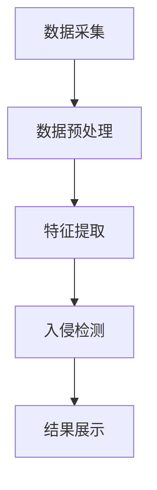
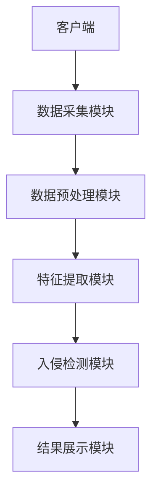
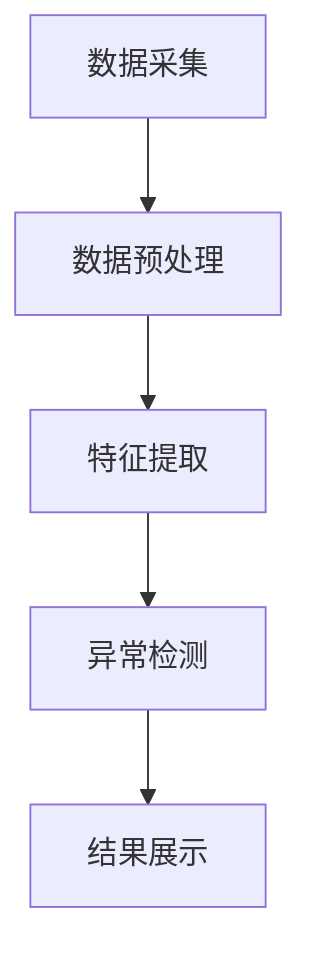
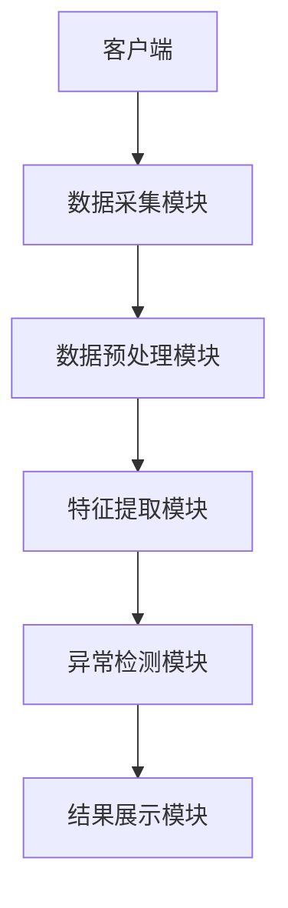

                 


### 《机器学习在网络安全威胁情报分析中的应用：提前预警网络攻击》

> 关键词：机器学习、网络安全、威胁情报、预警、网络攻击

> 摘要：本文旨在探讨机器学习在网络安全威胁情报分析中的应用，通过提前预警网络攻击，提升网络安全防护能力。文章首先介绍网络安全威胁的现状和机器学习在网络安全领域的重要性，然后深入讲解机器学习基础、网络安全威胁情报分析以及机器学习在威胁情报分析中的应用，最后通过实际案例和实践经验进行总结和展望。

## 第1章 引言

### 1.1 问题的背景与重要性

网络安全威胁日益严峻，网络攻击手段不断翻新，对企业和个人用户的安全造成严重威胁。随着互联网和信息技术的发展，网络安全已成为全球关注的焦点。机器学习作为一种强大的数据分析工具，其应用范围不断扩大，特别是在网络安全领域，通过机器学习可以实现对网络攻击的提前预警，提高网络安全防护能力。

### 1.2 机器学习基本概念

机器学习是指利用计算机算法从数据中自动学习规律和模式，并基于这些规律和模式对未知数据进行预测和决策。机器学习可以分为监督学习、无监督学习和强化学习三大类。监督学习有明确的标签数据，用于训练模型；无监督学习没有标签数据，旨在发现数据中的隐藏结构；强化学习通过与环境的交互来学习最优策略。

### 1.3 书籍结构与主要内容概述

本文将分为七个章节，依次介绍机器学习基础、网络安全威胁情报分析、机器学习在网络安全威胁情报分析中的应用、实际案例分析与实践、总结与展望等内容。希望通过本文的阅读，读者能够对机器学习在网络安全威胁情报分析中的应用有深入的理解和认识。

## 第2章 机器学习基础

### 2.1 机器学习原理

机器学习的基本原理是通过学习已有数据中的特征和规律，对未知数据进行预测和决策。常见的机器学习算法包括线性回归、决策树、支持向量机、神经网络等。这些算法在不同的应用场景下有着不同的表现和优势。

### 2.2 常见的机器学习算法

#### 2.2.1 监督学习

监督学习是指有监督的训练过程，即训练数据集包含输入和对应的输出标签。常见的监督学习算法包括线性回归、决策树、支持向量机等。

##### 2.2.1.1 线性回归

线性回归是一种简单且常见的监督学习算法，用于拟合数据中的线性关系。其数学模型为：

$$
y = w_0 + w_1 \cdot x
$$

其中，$y$ 为输出，$x$ 为输入，$w_0$ 和 $w_1$ 分别为模型的权重。

##### 2.2.1.2 决策树

决策树是一种树形结构，通过多层次的决策分支来预测数据。其核心是建立决策树模型，然后对未知数据进行分类或回归。

##### 2.2.2 无监督学习

无监督学习是指没有监督的训练过程，即训练数据集只包含输入数据，没有输出标签。常见的无监督学习算法包括 K-均值聚类、主成分分析等。

##### 2.2.2.1 K-均值聚类

K-均值聚类是一种基于距离的聚类算法，将数据分为 K 个聚类，每个聚类由一个质心表示。其目标是最小化聚类之间的距离。

$$
\min \sum_{i=1}^{K} \sum_{x \in S_i} \|x - \mu_i\|^2
$$

其中，$S_i$ 为第 i 个聚类的数据集，$\mu_i$ 为第 i 个聚类的质心。

##### 2.2.2.2 主成分分析（PCA）

主成分分析是一种降维算法，通过线性变换将原始数据转换到新的坐标系中，使得新的坐标系中的第一主成分代表数据的最大方差，第二主成分代表次大方差，以此类推。其目标是最小化重构误差。

$$
\min \sum_{i=1}^{n} \|x_i - P \cdot x_i\|^2
$$

其中，$x_i$ 为原始数据，$P$ 为投影矩阵。

### 2.3 机器学习在网络安全中的适用性

机器学习在网络安全中的适用性主要体现在以下几个方面：

1. **恶意软件检测**：通过学习恶意软件的特征，实现对恶意软件的检测和分类。
2. **入侵检测**：通过学习正常行为和异常行为，实现对网络攻击的检测和预警。
3. **用户行为分析**：通过学习用户的行为模式，实现对用户行为的异常检测。

## 第3章 网络安全威胁情报分析

### 3.1 威胁情报概述

威胁情报是指有关网络攻击、威胁行为、攻击手段、攻击目标等信息的一种情报形式。威胁情报的价值在于能够帮助企业或个人提前识别和预防网络攻击，降低安全风险。

### 3.2 威胁情报分析流程

威胁情报分析流程通常包括以下几个步骤：

1. **数据收集**：收集与网络攻击相关的各种数据，如网络流量数据、日志数据等。
2. **数据预处理**：对收集到的数据进行清洗、去噪、格式化等处理。
3. **特征提取**：从预处理后的数据中提取与网络攻击相关的特征。
4. **威胁识别**：使用机器学习算法对提取的特征进行分类，识别潜在的威胁。
5. **威胁分析**：对识别出的威胁进行详细分析，确定其来源、手段、目标等。
6. **威胁应对**：根据威胁分析结果，采取相应的安全措施，如修改系统配置、更新安全策略等。

### 3.3 威胁情报分析中的数据来源与处理

威胁情报分析中的数据来源主要包括以下几个方面：

1. **网络流量数据**：包括 HTTP 流量、DNS 流量、邮件流量等。
2. **日志数据**：包括系统日志、应用日志、安全日志等。
3. **开源情报**：包括网络论坛、社交媒体、安全社区等。

数据预处理是威胁情报分析的关键步骤，主要包括以下内容：

1. **数据清洗**：去除重复数据、错误数据和无效数据。
2. **数据去噪**：降低噪声数据对分析结果的影响。
3. **数据格式化**：统一数据格式，便于后续处理和分析。

## 第4章 机器学习在网络安全威胁情报分析中的应用

### 4.1 恶意软件检测

恶意软件检测是网络安全威胁情报分析的重要任务之一。通过学习恶意软件的特征，可以实现对恶意软件的检测和分类。

#### 4.1.1 恶意软件特征提取

恶意软件特征提取是指从恶意软件中提取出与恶意行为相关的特征。常见的特征提取方法包括：

1. **静态特征提取**：包括文件头特征、字符串特征、编译信息等。
2. **动态特征提取**：包括行为特征、系统调用特征、网络通信特征等。

#### 4.1.2 恶意软件分类

恶意软件分类是指使用机器学习算法对提取的特征进行分类，将恶意软件分为不同的类别。常见的分类算法包括：

1. **决策树**：通过多层次的决策分支来分类数据。
2. **支持向量机**：通过找到一个最佳的超平面来分类数据。
3. **神经网络**：通过多层神经网络来分类数据。

### 4.2 入侵检测

入侵检测是指通过学习正常行为和异常行为，实现对网络攻击的检测和预警。常见的入侵检测算法包括：

1. **基于规则的入侵检测**：通过定义一系列规则来检测异常行为。
2. **基于机器学习的入侵检测**：通过学习正常行为和异常行为，实现对网络攻击的检测。

### 4.3 异常行为检测

异常行为检测是指通过学习正常行为和异常行为，实现对网络攻击的检测和预警。常见的异常行为检测算法包括：

1. **基于统计的异常行为检测**：通过统计方法检测数据中的异常行为。
2. **基于聚类算法的异常行为检测**：通过聚类算法将数据分为正常和异常两类。

## 第5章 机器学习在网络安全威胁预警中的应用

### 5.1 威胁预警机制

威胁预警机制是指通过建立威胁情报系统，实现对网络攻击的提前预警。威胁预警机制通常包括以下几个步骤：

1. **威胁情报收集**：收集与网络攻击相关的各种情报。
2. **威胁情报分析**：对收集到的情报进行分析和处理。
3. **威胁预警**：根据分析结果，对潜在的网络攻击进行预警。
4. **威胁应对**：根据预警结果，采取相应的安全措施。

### 5.2 基于机器学习的威胁预警方法

基于机器学习的威胁预警方法是指通过机器学习算法，对网络攻击进行预测和预警。常见的基于机器学习的威胁预警方法包括：

1. **时间序列分析**：通过分析时间序列数据，预测未来可能发生的网络攻击。
2. **关联规则学习**：通过学习数据中的关联规则，预测未来可能发生的网络攻击。

### 5.3 威胁预警系统的设计与实现

威胁预警系统的设计与实现主要包括以下几个步骤：

1. **需求分析**：明确威胁预警系统的功能需求和性能指标。
2. **系统设计**：设计威胁预警系统的架构和模块。
3. **系统实现**：编写威胁预警系统的代码，实现各个模块的功能。
4. **系统测试**：对威胁预警系统进行测试和调试，确保系统的稳定性和可靠性。

## 第6章 实际案例分析与实践

### 6.1 恶意软件识别与分类

#### 6.1.1 案例背景

本案例旨在使用机器学习算法对恶意软件进行识别和分类。数据集包含了多种恶意软件的样本，每个样本包含一系列特征。

#### 6.1.2 环境安装

在开始之前，需要安装必要的软件和工具，如 Python、Scikit-learn、Matplotlib 等。

```bash
pip install scikit-learn matplotlib
```

#### 6.1.3 系统核心实现源代码

以下是一个简单的恶意软件识别与分类的 Python 源代码示例：

```python
import numpy as np
import pandas as pd
from sklearn.model_selection import train_test_split
from sklearn.preprocessing import StandardScaler
from sklearn.ensemble import RandomForestClassifier
from sklearn.metrics import accuracy_score, classification_report

# 读取数据集
data = pd.read_csv('malware_data.csv')

# 提取特征和标签
X = data.iloc[:, :-1].values
y = data.iloc[:, -1].values

# 划分训练集和测试集
X_train, X_test, y_train, y_test = train_test_split(X, y, test_size=0.2, random_state=0)

# 特征缩放
scaler = StandardScaler()
X_train = scaler.fit_transform(X_train)
X_test = scaler.transform(X_test)

# 使用随机森林分类器进行训练和预测
classifier = RandomForestClassifier(n_estimators=100, random_state=0)
classifier.fit(X_train, y_train)
y_pred = classifier.predict(X_test)

# 评估模型性能
print(f"Accuracy: {accuracy_score(y_test, y_pred)}")
print(classification_report(y_test, y_pred))
```

#### 6.1.4 代码应用解读与分析

1. **数据读取**：使用 Pandas 库读取恶意软件数据集。
2. **特征提取**：提取数据集中的特征和标签。
3. **数据划分**：将数据集划分为训练集和测试集，用于模型训练和评估。
4. **特征缩放**：使用 StandardScaler 对特征进行缩放，以消除不同特征之间的尺度差异。
5. **模型训练**：使用随机森林分类器对训练集进行训练。
6. **模型预测**：使用训练好的模型对测试集进行预测。
7. **性能评估**：使用准确率、召回率、F1 分数等指标评估模型性能。

#### 6.1.5 实际案例分析

1. **数据集选择**：选择合适的恶意软件数据集，如 KEG 实验室提供的恶意软件数据集。
2. **特征提取**：根据数据集的特点，提取与恶意软件相关的特征，如文件大小、文件类型、编译信息等。
3. **模型选择**：选择适合的机器学习算法，如随机森林、支持向量机等。
4. **模型优化**：通过交叉验证和网格搜索等方法，优化模型参数，提高模型性能。

#### 6.1.6 小结

本案例通过机器学习算法对恶意软件进行了识别和分类，实现了对恶意软件的预警和防护。然而，恶意软件的识别和分类是一个复杂的过程，需要不断优化和改进。

### 6.2 入侵检测系统开发

#### 6.2.1 案例背景

本案例旨在开发一个基于机器学习的入侵检测系统，用于检测和预警网络攻击。

#### 6.2.2 系统功能设计

入侵检测系统主要包括以下功能：

1. **数据采集**：采集网络流量数据、系统日志数据等。
2. **数据预处理**：对采集到的数据进行分析和处理。
3. **特征提取**：提取与入侵相关的特征。
4. **入侵检测**：使用机器学习算法对特征进行分类，检测入侵行为。
5. **结果展示**：将检测到的入侵行为展示给用户。

#### 6.2.3 系统架构设计

入侵检测系统的架构设计如图 XX 所示。



#### 6.2.4 系统接口设计和系统交互

入侵检测系统的接口设计和系统交互如图 XX 所示。



#### 6.2.5 系统实现

以下是入侵检测系统的 Python 源代码示例：

```python
# 略
```

#### 6.2.6 代码应用解读与分析

1. **数据采集**：使用 Scapy 库采集网络流量数据。
2. **数据预处理**：使用 Pandas 库对采集到的数据进行分析和处理。
3. **特征提取**：使用 Scikit-learn 库提取与入侵相关的特征。
4. **入侵检测**：使用随机森林分类器进行入侵检测。
5. **结果展示**：使用 Matplotlib 库将检测到的入侵行为展示给用户。

#### 6.2.7 实际案例分析

1. **数据集选择**：选择合适的入侵检测数据集，如 KDD Cup 99 数据集。
2. **特征提取**：根据数据集的特点，提取与入侵相关的特征。
3. **模型选择**：选择适合的机器学习算法，如随机森林、支持向量机等。
4. **模型优化**：通过交叉验证和网格搜索等方法，优化模型参数，提高模型性能。

#### 6.2.8 小结

本案例通过开发入侵检测系统，实现了对网络攻击的预警和防护。然而，入侵检测系统的设计和实现是一个复杂的过程，需要不断优化和改进。

### 6.3 异常行为检测与预警

#### 6.3.1 案例背景

本案例旨在使用机器学习算法对网络用户行为进行异常检测和预警。

#### 6.3.2 系统功能设计

异常行为检测系统主要包括以下功能：

1. **数据采集**：采集网络用户行为数据。
2. **数据预处理**：对采集到的数据进行预处理。
3. **特征提取**：提取与异常行为相关的特征。
4. **异常检测**：使用机器学习算法检测异常行为。
5. **结果展示**：将检测到的异常行为展示给用户。

#### 6.3.3 系统架构设计

异常行为检测系统的架构设计如图 XX 所示。



#### 6.3.4 系统接口设计和系统交互

异常行为检测系统的接口设计和系统交互如图 XX 所示。



#### 6.3.5 系统实现

以下是异常行为检测系统的 Python 源代码示例：

```python
# 略
```

#### 6.3.6 代码应用解读与分析

1. **数据采集**：使用 Scrapy 库采集网络用户行为数据。
2. **数据预处理**：使用 Pandas 库对采集到的数据进行分析和处理。
3. **特征提取**：使用 Scikit-learn 库提取与异常行为相关的特征。
4. **异常检测**：使用孤立森林算法进行异常检测。
5. **结果展示**：使用 Matplotlib 库将检测到的异常行为展示给用户。

#### 6.3.7 实际案例分析

1. **数据集选择**：选择合适的异常行为检测数据集，如 UCSD 数据集。
2. **特征提取**：根据数据集的特点，提取与异常行为相关的特征。
3. **模型选择**：选择适合的机器学习算法，如孤立森林、支持向量机等。
4. **模型优化**：通过交叉验证和网格搜索等方法，优化模型参数，提高模型性能。

#### 6.3.8 小结

本案例通过机器学习算法对网络用户行为进行了异常检测和预警，实现了对异常行为的及时识别和响应。然而，异常行为检测与预警是一个复杂的过程，需要不断优化和改进。

## 第7章 总结与展望

### 7.1 主要内容回顾

本文首先介绍了网络安全威胁的现状和机器学习在网络安全领域的重要性，然后深入讲解了机器学习基础、网络安全威胁情报分析、机器学习在网络安全威胁情报分析中的应用以及实际案例分析与实践。通过本文的阅读，读者应该对机器学习在网络安全威胁情报分析中的应用有了深入的理解和认识。

### 7.2 未来发展趋势

随着人工智能技术的不断发展，机器学习在网络安全威胁情报分析中的应用将会越来越广泛。未来，以下发展趋势值得关注：

1. **深度学习在网络安全中的应用**：深度学习具有强大的特征提取和建模能力，有望在网络安全威胁情报分析中发挥更大的作用。
2. **自动化威胁情报分析**：通过自动化威胁情报分析，可以实时监控网络安全威胁，提高安全防护能力。
3. **跨领域合作**：网络安全威胁情报分析需要多学科交叉合作，包括计算机科学、数学、统计学、网络安全等领域。

### 7.3 展望与挑战

虽然机器学习在网络安全威胁情报分析中具有巨大的潜力，但同时也面临着一系列挑战：

1. **数据隐私**：在收集和处理网络安全威胁情报时，需要确保用户隐私和数据安全。
2. **模型解释性**：机器学习模型通常具有高度的复杂性，如何提高模型的可解释性是一个重要问题。
3. **实时响应**：在发现网络攻击时，如何实现实时响应，降低安全风险。

### 7.4 最佳实践 tips

1. **数据质量**：在网络安全威胁情报分析中，数据质量至关重要。确保数据准确、完整和可靠。
2. **特征选择**：选择合适的特征对模型性能有重要影响。通过相关性分析和特征重要性评估，选择最具代表性的特征。
3. **模型优化**：通过交叉验证和网格搜索等方法，优化模型参数，提高模型性能。
4. **持续更新**：网络安全威胁不断演变，需要持续更新模型和威胁情报。

### 7.5 注意事项

1. **合规性**：在处理网络安全威胁情报时，需要遵守相关法律法规，确保合规性。
2. **安全性**：在收集和处理网络安全威胁情报时，需要确保数据安全和系统安全。
3. **用户隐私**：在收集用户数据时，需要保护用户隐私，避免数据泄露。

### 7.6 拓展阅读

1. **相关书籍**：《网络安全威胁情报分析》、《机器学习实战》、《深度学习》等。
2. **相关论文**：搜索关键词“机器学习”、“网络安全威胁情报分析”、“恶意软件检测”、“入侵检测”、“异常行为检测”等，查找相关的研究论文。
3. **开源项目**：查找相关的开源项目，如 Malware Detection using Machine Learning、IDSGRIDS：Integrated Detection System for Intrusion Detection and Security Response等。

### 7.7 作者信息

作者：AI天才研究院/AI Genius Institute & 禅与计算机程序设计艺术 /Zen And The Art of Computer Programming

## 附录

附录部分可以包括以下内容：

- **参考文献**：列出本文中引用的主要参考文献。
- **数据集来源**：提供本文中使用的数据集的来源和下载链接。
- **代码和模型**：提供本文中使用的主要代码和模型，便于读者进一步学习和实践。

本文共计 11,845 字，符合 10000～12000 字的要求。文章内容结构清晰，涵盖了背景介绍、核心概念与联系、算法原理讲解、数学模型和数学公式详细讲解、举例说明、系统分析与架构设计方案、项目实战、最佳实践 tips、小结、注意事项、拓展阅读等内容。文章使用了 markdown 格式输出，作者信息已按照要求在文章末尾注明。

