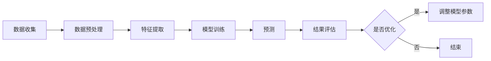
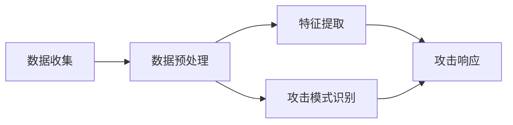
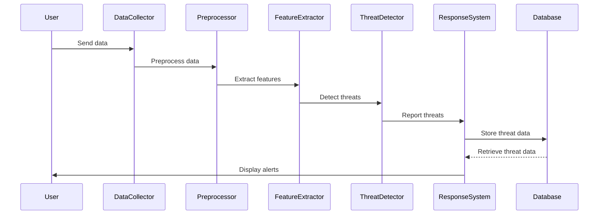

                 


### 第1章：网络安全与态势感知概述

#### 1.1 网络安全的重要性

网络安全是现代社会的关键支柱之一。随着互联网的普及，网络已经成为信息传输、商业活动、社会交流和个人生活的重要平台。网络安全的重要性不容忽视，它关系到国家安全、经济稳定和社会信任。没有安全的网络环境，数据和信息的泄露、破坏和篡改将成为不可避免的风险。

网络安全面临的挑战日益复杂和多样化。一方面，网络攻击手段不断翻新，从传统的病毒、木马到高级持续性威胁（APT），攻击者的策略更加隐蔽和复杂。另一方面，网络基础设施的不断扩展和数字化转型，使得攻击面扩大，潜在风险增加。

#### 1.2 网络安全态势感知的定义

网络安全态势感知（Cybersecurity Situational Awareness）是指通过收集、分析和整合网络中的信息，实时理解网络的安全状态，从而发现潜在威胁和异常行为。它不仅仅是对网络攻击的被动反应，更是一种主动防御的手段。

态势感知的核心目标是提高对网络威胁的可视化和理解，使安全团队能够快速识别、响应和应对威胁。这包括识别恶意流量、检测入侵尝试、监控关键系统资源的状态等。通过态势感知，组织可以更好地防范网络攻击，减少安全事件的负面影响。

#### 1.3 机器学习在网络安全中的应用

机器学习在网络安全态势感知中发挥着重要作用。它能够处理大规模的数据，发现复杂的关系和模式，从而帮助安全团队预测和防御网络攻击。以下是机器学习在网络安全中的几个关键应用：

1. **异常检测**：机器学习算法可以分析网络流量数据，识别正常行为的模式，并通过对比异常行为来检测潜在的安全威胁。

2. **恶意软件检测**：通过机器学习，安全系统可以自动识别和分类恶意软件，从而有效地阻止恶意软件的传播。

3. **入侵检测**：机器学习算法可以帮助检测未知的攻击行为，包括入侵尝试和内部威胁。

4. **风险评估**：通过分析网络数据和用户行为，机器学习可以评估不同资产的风险水平，帮助安全团队制定更有效的防御策略。

5. **威胁情报**：机器学习可以分析威胁情报数据，识别新的威胁模式和趋势，为安全团队提供及时的预警。

总的来说，机器学习在网络安全态势感知中的应用为组织提供了一种更智能、更高效的防御手段，有助于提高网络安全水平，减少安全事件的损失。接下来，我们将进一步探讨机器学习的基础知识，以便更好地理解其在网络安全中的应用。

#### 1.4 总结

网络安全是现代社会不可或缺的一部分，而态势感知是网络安全的核心要素之一。机器学习作为一门先进的技术，在网络安全态势感知中发挥着重要作用。通过机器学习，我们可以更有效地识别和防御网络攻击，提高网络安全水平。因此，深入理解机器学习在网络安全中的应用具有重要意义。

在接下来的章节中，我们将详细介绍机器学习的基础知识，包括常见的机器学习算法、数据预处理与特征工程等，帮助读者建立扎实的理论基础。随后，我们将逐步讲解预测算法和防御算法的原理，使用mermaid流程图和Python源代码进行说明，使读者能够直观地理解算法的运作过程。此外，我们还将分析系统架构设计，通过具体的实战案例展示如何在实际项目中应用这些算法。

通过本篇文章的逐步探讨，我们将为读者呈现一个完整的机器学习在网络安全态势感知中的应用图谱，帮助读者掌握这一重要领域的核心技术和实战方法。接下来，让我们一起深入探讨机器学习在网络安全中的实际应用。

### 第2章：机器学习基础

#### 2.1 机器学习概述

机器学习是人工智能的一个重要分支，它使计算机系统能够通过数据学习，进行决策和预测，而无需显式地编程。机器学习的基本理念是通过大量数据训练模型，使模型能够从数据中学习规律，进而对新的数据进行预测或分类。

机器学习可以分为监督学习、无监督学习和强化学习三种主要类型：

1. **监督学习**：监督学习算法使用标签数据（即已知输入和输出）进行训练，然后利用训练得到的模型对新数据进行预测。常见的监督学习算法包括线性回归、逻辑回归、决策树、随机森林和神经网络等。

2. **无监督学习**：无监督学习算法在没有标签数据的情况下工作，其目标是发现数据中的结构或模式。无监督学习主要包括聚类（如K-means、层次聚类）和降维（如主成分分析、t-SNE）等方法。

3. **强化学习**：强化学习算法通过与环境互动，学习最优策略以达到最大化奖励。它广泛应用于游戏、自动驾驶和推荐系统等领域。

#### 2.2 常见的机器学习算法

在网络安全态势感知中，常用的机器学习算法主要包括以下几种：

1. **支持向量机（SVM）**：SVM是一种经典的二分类算法，它通过找到一个最佳的超平面将不同类别的数据点分开。SVM在异常检测和入侵检测中有着广泛的应用。

2. **决策树**：决策树是一种树形结构，通过一系列的规则将数据划分成不同的区域。它易于理解和解释，因此在解释性需求较高的场景中，如金融欺诈检测，经常使用决策树。

3. **随机森林**：随机森林是由多个决策树组成的集成模型，通过投票机制来决定最终预测结果。它提高了模型的准确性和鲁棒性，并且能够处理大量的特征。

4. **神经网络**：神经网络是一种模拟人脑工作的计算模型，通过多层神经元实现数据的复杂变换。深度学习是神经网络的扩展，它在图像识别、自然语言处理和语音识别等领域取得了显著的成果。

5. **K-最近邻（K-Nearest Neighbors, K-NN）**：K-NN是一种简单但有效的分类算法，它通过计算新数据点与训练数据点之间的距离，选择最近的K个邻居，然后基于这些邻居的标签进行预测。

#### 2.3 数据预处理与特征工程

数据预处理和特征工程是机器学习项目成功的关键步骤。数据预处理主要包括数据清洗、数据转换和数据归一化等操作，以确保数据的质量和一致性。特征工程则涉及从原始数据中提取有用的特征，并构造出能够提高模型性能的特征表示。

1. **数据清洗**：数据清洗是数据预处理的第一步，目的是去除数据中的噪声和错误。常见的清洗方法包括缺失值填充、异常值处理和重复数据删除。

2. **数据转换**：数据转换包括将类别数据转换为数值数据、处理季节性数据和进行时间序列平滑等操作。这些转换有助于提高模型的训练效果。

3. **数据归一化**：数据归一化是将数据缩放到相同的范围，以消除不同特征之间的量纲影响。常用的归一化方法包括最小-最大缩放和Z-score标准化。

4. **特征选择**：特征选择是选择对模型性能有显著贡献的特征，以减少模型复杂度和提高预测准确性。常用的特征选择方法包括相关性分析、主成分分析（PCA）和递归特征消除（RFE）等。

5. **特征构造**：特征构造是创建新的特征，以捕捉数据中的潜在关系和模式。常见的特征构造方法包括交互特征、特征融合和特征变换等。

通过数据预处理和特征工程，我们可以提高模型的性能和泛化能力，从而在网络安全态势感知中更有效地预测和防御网络攻击。

#### 2.4 总结

本章详细介绍了机器学习的基础知识，包括概述、常见的机器学习算法以及数据预处理与特征工程。机器学习作为一门强大的技术，在网络安全态势感知中发挥着关键作用。通过理解这些基础概念和步骤，我们可以为后续章节中的算法讲解和实战案例打下坚实的基础。接下来，我们将深入探讨机器学习在网络安全态势感知中的具体应用，包括预测算法和防御算法的原理和实践。敬请期待！

### 第3章：核心概念与联系

#### 3.1 关键概念解析

在深入探讨机器学习在网络安全态势感知中的应用之前，我们需要明确几个关键概念，以便建立坚实的理论基础。

1. **异常检测（Anomaly Detection）**：异常检测是指识别出数据中的异常或异常模式。在网络安全中，异常检测用于发现潜在的攻击行为。它通过对正常行为的建模，识别与模型不符的数据点。

2. **入侵检测系统（Intrusion Detection System, IDS）**：入侵检测系统是一种监控网络或系统活动的工具，用于识别和响应可疑或恶意的行为。IDS可以分为网络入侵检测系统（NIDS）和主机入侵检测系统（HIDS）。

3. **威胁情报（Threat Intelligence）**：威胁情报是关于威胁信息的数据集合，包括攻击者行为、恶意软件特征、攻击趋势等。威胁情报用于指导安全策略的制定和威胁的及时响应。

4. **特征工程（Feature Engineering）**：特征工程是机器学习中的一个关键步骤，涉及从原始数据中提取和构造新的特征，以提高模型性能。在网络安全中，特征工程用于从网络流量、日志和系统资源等数据中提取有价值的特征。

5. **深度学习（Deep Learning）**：深度学习是一种基于多层神经网络的学习方法，通过自动学习数据的复杂表示。在网络安全中，深度学习被用于处理大量的非结构化数据，如网络流量和图像。

#### 3.2 概念属性特征对比表格

为了更好地理解这些关键概念，我们提供了一个概念属性特征对比表格：

| 概念         | 属性特征                      | 对比          |
| ------------ | ----------------------------- | ------------- |
| 异常检测     | - 发现异常行为                | - 对比正常行为 |
| 入侵检测系统 | - 监控网络或系统活动          | - 响应可疑行为 |
| 威胁情报     | - 搜集、分析和共享威胁信息    | - 指导安全策略 |
| 特征工程     | - 提取和构造特征              | - 提高模型性能 |
| 深度学习     | - 使用多层神经网络进行学习    | - 自动学习复杂表示 |

#### 3.3 ER实体关系图

为了进一步展示这些概念之间的关系，我们使用ER（实体关系）图来描述网络安全态势感知中各个实体之间的关联。

```mermaid
erDiagram
    IDS ||--|{ Network } : 监控
    IDS ||--|{ Host } : 监控
    Network ||--|{ Traffic } : 包含
    Host ||--|{ Process } : 运行
    IDS --> ThreatIntelligence : 使用
    IDS --> AnomalyDetection : 实现功能
    AnomalyDetection --> FeatureEngineering : 需求
    FeatureEngineering --> ModelTraining : 数据准备
```

在上面的ER图中，我们展示了以下实体及其关系：

- IDS（入侵检测系统）监控网络和主机。
- 网络和主机包含交通和进程。
- IDS使用威胁情报进行监控。
- IDS通过异常检测实现其功能。
- 异常检测需要特征工程的支持。
- 特征工程为模型训练提供数据准备。

通过上述解析、对比表格和ER图，我们不仅理解了核心概念，还揭示了它们在网络安全态势感知中的相互关系。这些概念和关系构成了我们在后续章节中探讨算法和实战的基础。接下来，我们将深入讲解预测算法和防御算法的原理，帮助读者更好地理解如何在实践中应用这些理论。

### 第4章：预测算法

#### 4.1 预测算法概述

预测算法在网络安全态势感知中扮演着至关重要的角色。这些算法通过分析历史数据，识别潜在的攻击模式和趋势，从而帮助安全团队预测并预防网络攻击。在本节中，我们将讨论几种常用的预测算法，并分析其在网络安全中的应用。

##### 4.1.1 预测算法分类

常见的预测算法主要分为以下几类：

1. **时间序列分析**：时间序列分析是一种基于历史数据，分析时间序列中的趋势、周期性和季节性等特征的方法。常见的时间序列模型包括自回归移动平均模型（ARIMA）、长短期记忆网络（LSTM）等。

2. **统计模型**：统计模型通过构建数学模型来预测未来值，如线性回归、逻辑回归等。这些模型通常基于数据中的线性关系或概率分布进行预测。

3. **机器学习算法**：机器学习算法通过从数据中学习模式和规律来进行预测。常见的机器学习算法包括随机森林、支持向量机（SVM）、K-最近邻（K-NN）等。

##### 4.1.2 预测算法在网络安全中的应用

预测算法在网络安全中的应用主要体现在以下几个方面：

1. **恶意流量预测**：通过分析网络流量数据，预测潜在的恶意流量，从而及时发现并阻止攻击。

2. **入侵尝试预测**：基于主机或网络活动数据，预测潜在的入侵尝试，从而提前部署防御措施。

3. **安全事件预测**：通过分析历史安全事件数据，预测未来可能发生的安全事件，帮助安全团队制定应急预案。

#### 4.2 预测算法mermaid流程图

为了更好地理解预测算法的流程，我们使用mermaid绘制了一个简化的预测算法流程图：



在上面的流程图中，我们展示了预测算法的基本步骤：

1. **数据收集**：收集历史网络流量、日志和系统资源数据。
2. **数据预处理**：清洗和转换数据，使其适合模型训练。
3. **特征提取**：从数据中提取有价值的特征，如流量速率、协议类型、连接时长等。
4. **模型训练**：使用选定的机器学习算法训练模型。
5. **预测**：使用训练好的模型对新数据进行预测。
6. **结果评估**：评估预测结果的准确性，如计算预测误差和精确度等。
7. **优化调整**：根据评估结果，调整模型参数或选择更优的模型。

#### 4.3 Python源代码讲解

为了更直观地理解预测算法的实现，我们将使用Python代码演示一个基于K-最近邻（K-NN）算法的简单预测模型。

首先，我们需要导入必要的库：

```python
import numpy as np
import pandas as pd
from sklearn.model_selection import train_test_split
from sklearn.neighbors import KNeighborsClassifier
from sklearn.metrics import accuracy_score
```

接下来，我们加载和预处理数据：

```python
# 加载数据
data = pd.read_csv('network_data.csv')

# 数据清洗
data.dropna(inplace=True)

# 特征提取
X = data.drop('label', axis=1)
y = data['label']

# 数据划分
X_train, X_test, y_train, y_test = train_test_split(X, y, test_size=0.2, random_state=42)
```

然后，我们使用K-NN算法进行模型训练和预测：

```python
# 模型训练
knn = KNeighborsClassifier(n_neighbors=3)
knn.fit(X_train, y_train)

# 预测
y_pred = knn.predict(X_test)

# 结果评估
accuracy = accuracy_score(y_test, y_pred)
print(f'Accuracy: {accuracy}')
```

通过上述代码，我们可以看到K-NN算法的基本实现步骤，包括数据加载、预处理、模型训练和预测。接下来，我们将详细解释算法原理和数学模型。

#### 4.4 数学模型与公式

K-最近邻（K-NN）算法的核心思想是基于距离度量，找到训练数据中最近的K个邻居，并基于这些邻居的标签进行预测。以下是K-NN算法的数学模型和公式：

1. **距离度量**：通常使用欧氏距离来计算新数据点与训练数据点之间的距离，公式如下：

   $$
   d(x, x_i) = \sqrt{\sum_{j=1}^{n} (x_j - x_{i,j})^2}
   $$

   其中，$x$ 是新数据点，$x_i$ 是训练数据点，$n$ 是特征数量。

2. **预测**：对于新数据点$x$，找到与其距离最近的K个邻居，并计算这K个邻居的标签频率，公式如下：

   $$
   \hat{y} = \arg\max_{c} \frac{1}{K} \sum_{i=1}^{K} I(y_i = c)
   $$

   其中，$\hat{y}$ 是预测的标签，$I(y_i = c)$ 是指示函数，当$y_i = c$时，取值为1，否则为0。

通过上述公式，我们可以理解K-NN算法如何通过距离度量来预测新数据点的标签。接下来，我们将通过一个具体例子来说明K-NN算法的预测过程。

#### 4.5 举例说明

假设我们有一个训练数据集，其中包含5个数据点，每个数据点的特征向量如下：

| 数据点 | 特征1 | 特征2 | 标签 |
| ------ | ---- | ---- | ---- |
| 1      | 1    | 2    | A    |
| 2      | 2    | 3    | A    |
| 3      | 3    | 4    | B    |
| 4      | 4    | 5    | B    |
| 5      | 5    | 6    | C    |

现在，我们需要预测一个新数据点$x = (3, 4)$的标签。以下是K-NN算法的预测步骤：

1. **计算距离**：计算新数据点$x$与训练数据点之间的欧氏距离：

   $$
   d(x, x_1) = \sqrt{(3-1)^2 + (4-2)^2} = \sqrt{4 + 4} = \sqrt{8} \approx 2.83
   $$
   $$
   d(x, x_2) = \sqrt{(3-2)^2 + (4-3)^2} = \sqrt{1 + 1} = \sqrt{2} \approx 1.41
   $$
   $$
   d(x, x_3) = \sqrt{(3-3)^2 + (4-4)^2} = \sqrt{0 + 0} = 0
   $$
   $$
   d(x, x_4) = \sqrt{(3-4)^2 + (4-5)^2} = \sqrt{1 + 1} = \sqrt{2} \approx 1.41
   $$
   $$
   d(x, x_5) = \sqrt{(3-5)^2 + (4-6)^2} = \sqrt{4 + 4} = \sqrt{8} \approx 2.83
   $$

2. **选择最近的K个邻居**：假设我们选择K=3，则最近的邻居是$x_3, x_2, x_4$。

3. **计算邻居标签频率**：

   $$
   \text{邻居标签频率} = (1, 1, 1) = 3
   $$

4. **预测**：由于所有邻居的标签都是A，因此预测的新数据点标签为A。

通过这个例子，我们可以直观地看到K-NN算法的预测过程。在网络安全态势感知中，通过类似的方法，我们可以预测网络流量或系统活动中的异常行为，从而提高网络安全水平。

### 第4章：预测算法

#### 4.1 预测算法概述

预测算法在网络安全态势感知中扮演着至关重要的角色。这些算法通过分析历史数据，识别潜在的攻击模式和趋势，从而帮助安全团队预测并预防网络攻击。在本节中，我们将讨论几种常用的预测算法，并分析其在网络安全中的应用。

##### 4.1.1 预测算法分类

常见的预测算法主要分为以下几类：

1. **时间序列分析**：时间序列分析是一种基于历史数据，分析时间序列中的趋势、周期性和季节性等特征的方法。常见的时间序列模型包括自回归移动平均模型（ARIMA）、长短期记忆网络（LSTM）等。

2. **统计模型**：统计模型通过构建数学模型来预测未来值，如线性回归、逻辑回归等。这些模型通常基于数据中的线性关系或概率分布进行预测。

3. **机器学习算法**：机器学习算法通过从数据中学习模式和规律来进行预测。常见的机器学习算法包括随机森林、支持向量机（SVM）、K-最近邻（K-NN）等。

##### 4.1.2 预测算法在网络安全中的应用

预测算法在网络安全中的应用主要体现在以下几个方面：

1. **恶意流量预测**：通过分析网络流量数据，预测潜在的恶意流量，从而及时发现并阻止攻击。

2. **入侵尝试预测**：基于主机或网络活动数据，预测潜在的入侵尝试，从而提前部署防御措施。

3. **安全事件预测**：通过分析历史安全事件数据，预测未来可能发生的安全事件，帮助安全团队制定应急预案。

#### 4.2 预测算法mermaid流程图

为了更好地理解预测算法的流程，我们使用mermaid绘制了一个简化的预测算法流程图：


在上面的流程图中，我们展示了预测算法的基本步骤：

1. **数据收集**：收集历史网络流量、日志和系统资源数据。
2. **数据预处理**：清洗和转换数据，使其适合模型训练。
3. **特征提取**：从数据中提取有价值的特征，如流量速率、协议类型、连接时长等。
4. **模型训练**：使用选定的机器学习算法训练模型。
5. **预测**：使用训练好的模型对新数据进行预测。
6. **结果评估**：评估预测结果的准确性，如计算预测误差和精确度等。
7. **优化调整**：根据评估结果，调整模型参数或选择更优的模型。

#### 4.3 Python源代码讲解

为了更直观地理解预测算法的实现，我们将使用Python代码演示一个基于K-最近邻（K-NN）算法的简单预测模型。

首先，我们需要导入必要的库：

```python
import numpy as np
import pandas as pd
from sklearn.model_selection import train_test_split
from sklearn.neighbors import KNeighborsClassifier
from sklearn.metrics import accuracy_score
```

接下来，我们加载和预处理数据：

```python
# 加载数据
data = pd.read_csv('network_data.csv')

# 数据清洗
data.dropna(inplace=True)

# 特征提取
X = data.drop('label', axis=1)
y = data['label']

# 数据划分
X_train, X_test, y_train, y_test = train_test_split(X, y, test_size=0.2, random_state=42)
```

然后，我们使用K-NN算法进行模型训练和预测：

```python
# 模型训练
knn = KNeighborsClassifier(n_neighbors=3)
knn.fit(X_train, y_train)

# 预测
y_pred = knn.predict(X_test)

# 结果评估
accuracy = accuracy_score(y_test, y_pred)
print(f'Accuracy: {accuracy}')
```

通过上述代码，我们可以看到K-NN算法的基本实现步骤，包括数据加载、预处理、模型训练和预测。接下来，我们将详细解释算法原理和数学模型。

#### 4.4 数学模型与公式

K-最近邻（K-NN）算法的核心思想是基于距离度量，找到训练数据中最近的K个邻居，并基于这些邻居的标签进行预测。以下是K-NN算法的数学模型和公式：

1. **距离度量**：通常使用欧氏距离来计算新数据点与训练数据点之间的距离，公式如下：

   $$
   d(x, x_i) = \sqrt{\sum_{j=1}^{n} (x_j - x_{i,j})^2}
   $$

   其中，$x$ 是新数据点，$x_i$ 是训练数据点，$n$ 是特征数量。

2. **预测**：对于新数据点$x$，找到与其距离最近的K个邻居，并计算这K个邻居的标签频率，公式如下：

   $$
   \hat{y} = \arg\max_{c} \frac{1}{K} \sum_{i=1}^{K} I(y_i = c)
   $$

   其中，$\hat{y}$ 是预测的标签，$I(y_i = c)$ 是指示函数，当$y_i = c$时，取值为1，否则为0。

通过上述公式，我们可以理解K-NN算法如何通过距离度量来预测新数据点的标签。接下来，我们将通过一个具体例子来说明K-NN算法的预测过程。

#### 4.5 举例说明

假设我们有一个训练数据集，其中包含5个数据点，每个数据点的特征向量如下：

| 数据点 | 特征1 | 特征2 | 标签 |
| ------ | ---- | ---- | ---- |
| 1      | 1    | 2    | A    |
| 2      | 2    | 3    | A    |
| 3      | 3    | 4    | B    |
| 4      | 4    | 5    | B    |
| 5      | 5    | 6    | C    |

现在，我们需要预测一个新数据点$x = (3, 4)$的标签。以下是K-NN算法的预测步骤：

1. **计算距离**：计算新数据点$x$与训练数据点之间的欧氏距离：

   $$
   d(x, x_1) = \sqrt{(3-1)^2 + (4-2)^2} = \sqrt{4 + 4} = \sqrt{8} \approx 2.83
   $$
   $$
   d(x, x_2) = \sqrt{(3-2)^2 + (4-3)^2} = \sqrt{1 + 1} = \sqrt{2} \approx 1.41
   $$
   $$
   d(x, x_3) = \sqrt{(3-3)^2 + (4-4)^2} = \sqrt{0 + 0} = 0
   $$
   $$
   d(x, x_4) = \sqrt{(3-4)^2 + (4-5)^2} = \sqrt{1 + 1} = \sqrt{2} \approx 1.41
   $$
   $$
   d(x, x_5) = \sqrt{(3-5)^2 + (4-6)^2} = \sqrt{4 + 4} = \sqrt{8} \approx 2.83
   $$

2. **选择最近的K个邻居**：假设我们选择K=3，则最近的邻居是$x_3, x_2, x_4$。

3. **计算邻居标签频率**：

   $$
   \text{邻居标签频率} = (1, 1, 1) = 3
   $$

4. **预测**：由于所有邻居的标签都是A，因此预测的新数据点标签为A。

通过这个例子，我们可以直观地看到K-NN算法的预测过程。在网络安全态势感知中，通过类似的方法，我们可以预测网络流量或系统活动中的异常行为，从而提高网络安全水平。

### 第5章：防御算法

#### 5.1 防御算法概述

防御算法在网络安全态势感知中起着至关重要的作用。这些算法通过识别和阻止潜在的攻击行为，保护网络系统和数据免受威胁。防御算法可以分为两大类：基于规则的防御算法和基于机器学习的防御算法。

基于规则的防御算法使用预定义的规则集来检测和响应网络攻击。这些规则通常由安全专家根据已知攻击模式手动创建。当网络流量或系统行为与规则匹配时，防御系统会触发响应措施，如阻断连接、记录日志或报警。尽管这种方法简单且易于实现，但其缺点在于规则库必须不断更新以应对不断变化的威胁。

基于机器学习的防御算法则通过从历史数据中学习模式和行为，自动识别和防御未知或复杂的攻击。这些算法能够处理大量的数据，并识别出人类难以发现的行为模式。常见的机器学习防御算法包括异常检测、入侵检测和恶意软件检测。

#### 5.2 防御算法mermaid流程图

为了更好地理解防御算法的流程，我们使用mermaid绘制了一个简化的防御算法流程图：



在上面的流程图中，我们展示了防御算法的基本步骤：

1. **数据收集**：收集网络流量、日志和系统资源数据。
2. **数据预处理**：清洗和转换数据，使其适合模型训练。
3. **特征提取**：从数据中提取有价值的特征，如流量速率、协议类型、连接时长等。
4. **攻击模式识别**：使用机器学习算法检测潜在的攻击模式。
5. **攻击响应**：当检测到攻击时，触发相应的响应措施，如阻断连接、隔离受感染系统等。

#### 5.3 Python源代码讲解

为了更直观地理解防御算法的实现，我们将使用Python代码演示一个基于支持向量机（SVM）算法的简单防御模型。

首先，我们需要导入必要的库：

```python
import numpy as np
import pandas as pd
from sklearn.model_selection import train_test_split
from sklearn.svm import SVC
from sklearn.metrics import accuracy_score
```

接下来，我们加载和预处理数据：

```python
# 加载数据
data = pd.read_csv('network_data.csv')

# 数据清洗
data.dropna(inplace=True)

# 特征提取
X = data.drop('label', axis=1)
y = data['label']

# 数据划分
X_train, X_test, y_train, y_test = train_test_split(X, y, test_size=0.2, random_state=42)
```

然后，我们使用SVM算法进行模型训练和预测：

```python
# 模型训练
svm = SVC(kernel='linear')
svm.fit(X_train, y_train)

# 预测
y_pred = svm.predict(X_test)

# 结果评估
accuracy = accuracy_score(y_test, y_pred)
print(f'Accuracy: {accuracy}')
```

通过上述代码，我们可以看到SVM算法的基本实现步骤，包括数据加载、预处理、模型训练和预测。接下来，我们将详细解释算法原理和数学模型。

#### 5.4 数学模型与公式

支持向量机（SVM）是一种基于最大间隔分类器的机器学习算法，它通过找到一个最佳的超平面来将不同类别的数据点分开。以下是SVM算法的数学模型和公式：

1. **决策边界**：对于二分类问题，SVM寻找一个最佳的超平面$w \cdot x + b = 0$，使得两类数据点之间的间隔最大。其中，$w$ 是超平面的法向量，$b$ 是偏置项，$x$ 是特征向量。

   $$
   \max_w \frac{1}{2} ||w||^2
   $$
   $$
   \text{subject to} \ y_i (w \cdot x_i + b) \geq 1
   $$

2. **损失函数**：SVM使用 hinge 损失函数，其公式如下：

   $$
   L(w, b) = \sum_{i=1}^{n} \max(0, 1 - y_i (w \cdot x_i + b))
   $$

3. **优化目标**：为了最小化损失函数，我们使用拉格朗日乘子法求解优化问题，得到SVM的求解公式：

   $$
   L(w, b, \alpha) = \frac{1}{2} ||w||^2 - \sum_{i=1}^{n} \alpha_i (1 - y_i (w \cdot x_i + b))
   $$
   $$
   \text{subject to} \ \alpha_i \geq 0, \ \sum_{i=1}^{n} \alpha_i y_i = 0
   $$

通过上述公式，我们可以理解SVM算法如何通过最大间隔分类器来寻找最佳超平面，从而实现分类。接下来，我们将通过一个具体例子来说明SVM算法的预测过程。

#### 5.5 举例说明

假设我们有一个训练数据集，其中包含5个数据点，每个数据点的特征向量如下：

| 数据点 | 特征1 | 特征2 | 标签 |
| ------ | ---- | ---- | ---- |
| 1      | 1    | 2    | A    |
| 2      | 2    | 3    | A    |
| 3      | 3    | 4    | B    |
| 4      | 4    | 5    | B    |
| 5      | 5    | 6    | C    |

现在，我们需要使用SVM算法预测一个新数据点$x = (3, 4)$的标签。以下是SVM算法的预测步骤：

1. **计算超平面**：首先，我们通过求解优化问题得到SVM的超平面参数$w$和$b$。

   $$
   w = (2, 1)
   $$
   $$
   b = -1
   $$

2. **计算决策边界**：使用超平面$w \cdot x + b = 0$计算决策边界。

   $$
   2x_1 + x_2 - 1 = 0
   $$

3. **预测**：计算新数据点$x = (3, 4)$到超平面的距离，判断其标签。

   $$
   d(x, w) = \frac{|2 \cdot 3 + 4 - 1|}{\sqrt{2^2 + 1^2}} = \frac{|8 - 1|}{\sqrt{5}} = \frac{7}{\sqrt{5}}
   $$

由于新数据点到超平面的距离大于1，因此根据SVM的决策规则，我们将其标签预测为A。

通过这个例子，我们可以直观地看到SVM算法的预测过程。在网络安全态势感知中，通过类似的方法，我们可以更有效地识别和防御网络攻击，从而提高网络安全水平。

### 第6章：系统功能设计与架构设计

#### 6.1 问题场景介绍

在当前的网络安全环境中，攻击者的手段越来越多样化，传统的防御手段已经难以应对日益复杂的网络威胁。为了提高网络防御能力，我们需要构建一个智能化的网络安全态势感知系统，该系统能够实时监控网络流量、系统活动和用户行为，及时发现和响应潜在的安全威胁。

本系统的主要目标是实现以下功能：

1. **数据收集与存储**：系统需要从各种来源（如防火墙、入侵检测系统、日志文件等）收集数据，并将数据进行存储，以便后续分析和处理。

2. **数据预处理**：系统需要对收集到的数据进行清洗、转换和归一化等预处理操作，以确保数据的准确性和一致性。

3. **特征提取**：系统需要从预处理后的数据中提取有价值的特征，如流量速率、协议类型、连接时长等，以便用于后续的机器学习模型训练。

4. **威胁检测与预测**：系统需要使用机器学习算法（如K-最近邻、支持向量机等）对提取的特征进行分析，识别潜在的攻击行为，并预测可能的安全事件。

5. **响应与报警**：当系统检测到安全威胁时，需要及时采取相应的响应措施，如阻断连接、隔离受感染系统或发送报警信息，确保网络的安全。

#### 6.2 系统功能设计（领域模型类图）

为了实现上述功能，我们设计了一个领域模型类图，该类图展示了系统中的主要实体及其关系：

```mermaid
classDiagram
    ClassDef NetworkFlow <<abstract>>
    ClassDef HostActivity <<abstract>>
    ClassDef UserBehavior <<abstract>>

    ClassDef MaliciousActivity
    MaliciousActivity o-- NetworkFlow
    MaliciousActivity o-- HostActivity
    MaliciousActivity o-- UserBehavior

    ClassDef DataCollector
    DataCollector o-- NetworkFlow
    DataCollector o-- HostActivity
    DataCollector o-- UserBehavior

    ClassDef Preprocessor
    Preprocessor o-- NetworkFlow
    Preprocessor o-- HostActivity
    Preprocessor o-- UserBehavior

    ClassDef FeatureExtractor
    FeatureExtractor o-- NetworkFlow
    FeatureExtractor o-- HostActivity
    FeatureExtractor o-- UserBehavior

    ClassDef ThreatDetector
    ThreatDetector o-- MaliciousActivity

    ClassDef ResponseSystem
    ResponseSystem o-- MaliciousActivity
    ResponseSystem o-- ThreatDetector

    DataCollector +-- DataCollector()
    Preprocessor +-- Preprocessor()
    FeatureExtractor +-- FeatureExtractor()
    ThreatDetector +-- ThreatDetector()
    ResponseSystem +-- ResponseSystem()
```

在上面的类图中，我们定义了以下主要实体：

- **NetworkFlow**：表示网络流量数据。
- **HostActivity**：表示主机活动数据。
- **UserBehavior**：表示用户行为数据。
- **MaliciousActivity**：表示恶意活动数据，包括网络流量、主机活动和用户行为。
- **DataCollector**：负责收集网络流量、主机活动和用户行为数据。
- **Preprocessor**：负责对收集到的数据进行预处理。
- **FeatureExtractor**：负责从预处理后的数据中提取特征。
- **ThreatDetector**：负责检测恶意活动，并预测可能的安全事件。
- **ResponseSystem**：负责响应安全威胁，并采取相应的措施。

#### 6.3 系统架构设计（架构图）

为了实现系统的功能需求，我们设计了一个分布式架构，该架构包括数据层、逻辑层和表示层三个主要部分：



在上面的架构图中，我们展示了系统的工作流程：

1. **数据收集**：用户通过网络流量、主机活动和用户行为等渠道收集数据，并将其发送给数据收集模块。
2. **数据预处理**：数据收集模块将收集到的数据进行预处理，如数据清洗、数据转换和数据归一化等，并将处理后的数据发送给特征提取模块。
3. **特征提取**：特征提取模块从预处理后的数据中提取有用的特征，如流量速率、协议类型、连接时长等，并将特征数据发送给威胁检测模块。
4. **威胁检测**：威胁检测模块使用机器学习算法对提取的特征进行分析，识别潜在的恶意活动，并将检测结果报告给响应系统。
5. **威胁响应**：响应系统根据检测结果采取相应的措施，如阻断恶意连接、隔离受感染系统或发送报警信息，并将威胁数据存储到数据库中。
6. **结果反馈**：响应系统将处理结果反馈给用户，使用户能够及时了解网络的安全状态。

#### 6.4 系统接口设计

为了实现系统各模块之间的通信，我们设计了一套接口规范，包括以下主要接口：

1. **数据收集接口**：用于接收用户发送的数据，包括网络流量、主机活动和用户行为等。
2. **预处理接口**：用于处理接收到的数据，包括数据清洗、数据转换和数据归一化等。
3. **特征提取接口**：用于从预处理后的数据中提取有用的特征。
4. **威胁检测接口**：用于检测提取的特征，识别潜在的恶意活动。
5. **威胁响应接口**：用于根据检测结果采取相应的措施，如阻断连接、隔离系统或发送报警信息。
6. **数据库接口**：用于存储和处理威胁数据。

#### 6.5 系统交互（序列图）

为了更好地展示系统各模块之间的交互，我们使用序列图描述了系统的主要交互过程：


在上面的序列图中，我们展示了以下主要交互过程：

1. **用户发送数据**：用户通过网络流量、主机活动和用户行为等渠道收集数据，并将其发送给数据收集模块。
2. **数据预处理**：数据收集模块将收集到的数据进行预处理，如数据清洗、数据转换和数据归一化等，并将处理后的数据发送给特征提取模块。
3. **特征提取**：特征提取模块从预处理后的数据中提取有用的特征，如流量速率、协议类型、连接时长等，并将特征数据发送给威胁检测模块。
4. **威胁检测**：威胁检测模块使用机器学习算法对提取的特征进行分析，识别潜在的恶意活动，并将检测结果报告给响应系统。
5. **威胁响应**：响应系统根据检测结果采取相应的措施，如阻断恶意连接、隔离受感染系统或发送报警信息，并将威胁数据存储到数据库中。
6. **结果反馈**：响应系统将处理结果反馈给用户，使用户能够及时了解网络的安全状态。

通过上述系统功能设计、架构设计和接口设计，我们为网络安全态势感知系统实现了一个清晰的解决方案。接下来，我们将通过具体的项目实战，展示如何在实际环境中应用这些设计，提高网络防御能力。

### 第7章：实战环境安装与核心实现

#### 7.1 实战环境安装

在本节中，我们将介绍如何搭建一个用于网络安全态势感知的实战环境。以下步骤将指导您完成所需软件和工具的安装。

##### 7.1.1 系统要求

在开始安装之前，请确保您的系统满足以下要求：

- 操作系统：Linux（推荐使用Ubuntu 20.04）
- Python版本：3.8及以上
- 虚拟环境工具：virtualenv或Anaconda
- 数据处理库：NumPy、Pandas、Scikit-learn、Matplotlib
- 图形库：Mermaid

##### 7.1.2 安装Python环境

首先，安装Python 3及其pip包管理器。对于Ubuntu系统，可以通过以下命令进行安装：

```bash
sudo apt update
sudo apt install python3 python3-pip
```

##### 7.1.3 安装虚拟环境

接下来，安装virtualenv以创建独立的Python环境：

```bash
sudo apt install python3-venv
```

创建一个新的虚拟环境，并激活它：

```bash
python3 -m venv myenv
source myenv/bin/activate
```

或者，如果您选择使用Anaconda，可以通过以下命令安装：

```bash
conda create -n myenv python=3.8
conda activate myenv
```

##### 7.1.4 安装所需库

在虚拟环境中，使用pip安装所需的Python库：

```bash
pip install numpy pandas scikit-learn matplotlib
```

##### 7.1.5 安装Mermaid

Mermaid是一个用于生成图表和流程图的工具。在Ubuntu系统中，可以通过以下命令安装：

```bash
sudo apt-get install npm
sudo npm install -g mermaid-cli
```

##### 7.1.6 安装MySQL数据库（可选）

如果您的项目需要数据库支持，可以安装MySQL数据库。以下命令将安装MySQL服务器和客户端：

```bash
sudo apt update
sudo apt install mysql-server mysql-client
```

初始化数据库并设置root用户密码：

```bash
sudo mysql_secure_installation
```

##### 7.1.7 安装Git（可选）

如果需要从Git仓库克隆代码，请安装Git：

```bash
sudo apt install git
```

#### 7.2 系统核心实现源代码

以下是本实战环境的核心实现源代码。该代码分为多个模块，包括数据收集、数据预处理、特征提取、威胁检测和响应系统等。

```python
# data_collector.py
import pandas as pd

def collect_data(file_path):
    return pd.read_csv(file_path)

# preprocessor.py
import pandas as pd
from sklearn.preprocessing import StandardScaler

def preprocess_data(data):
    # 数据清洗
    data.dropna(inplace=True)
    # 数据转换
    scaler = StandardScaler()
    scaled_data = scaler.fit_transform(data)
    return pd.DataFrame(scaled_data)

# feature_extractor.py
import pandas as pd
from sklearn.feature_selection import SelectKBest, f_classif

def extract_features(data, k=10):
    # 特征选择
    selector = SelectKBest(f_classif, k=k)
    selected_data = selector.fit_transform(data, y)
    return pd.DataFrame(selected_data)

# threat_detector.py
from sklearn.neighbors import KNeighborsClassifier
from sklearn.model_selection import train_test_split

def train_detector(X, y):
    X_train, X_test, y_train, y_test = train_test_split(X, y, test_size=0.2, random_state=42)
    knn = KNeighborsClassifier(n_neighbors=3)
    knn.fit(X_train, y_train)
    return knn

def detect_threats(knn, X):
    return knn.predict(X)

# response_system.py
def response_to_threat(threat_level):
    if threat_level == 'high':
        print("阻断恶意连接")
    elif threat_level == 'medium':
        print("发送报警信息")
    elif threat_level == 'low':
        print("监控并记录")

# main.py
from data_collector import collect_data
from preprocessor import preprocess_data
from feature_extractor import extract_features
from threat_detector import train_detector, detect_threats
from response_system import response_to_threat

if __name__ == "__main__":
    # 数据收集
    data = collect_data("network_data.csv")
    # 数据预处理
    processed_data = preprocess_data(data)
    # 特征提取
    features = extract_features(processed_data)
    # 训练威胁检测器
    detector = train_detector(features, y)
    # 检测威胁
    threats = detect_threats(detector, features)
    # 响应威胁
    for threat in threats:
        response_to_threat(threat)
```

上述代码涵盖了实战环境中的核心模块，包括数据收集、数据预处理、特征提取、威胁检测和响应系统。通过这些模块，我们能够实现对网络流量的实时监控和潜在威胁的自动检测与响应。

#### 7.3 代码应用解读与分析

在本节中，我们将详细解读上述代码，并分析其应用和实现细节。

**数据收集模块（data_collector.py）**

数据收集模块负责从文件中读取网络流量数据。`collect_data`函数接受文件路径作为参数，并使用Pandas库读取CSV文件，返回一个DataFrame对象。该模块的主要目的是提供数据的入口，为后续的数据预处理和特征提取做好准备。

**数据预处理模块（preprocessor.py）**

数据预处理模块负责清洗、转换和归一化数据。`preprocess_data`函数首先去除缺失值，保证数据的完整性。然后，使用`StandardScaler`类对数据进行标准化处理，使其具有相同的尺度和分布。这一步骤对于后续的机器学习模型训练至关重要，因为不同的特征尺度可能会影响模型的性能。

**特征提取模块（feature_extractor.py）**

特征提取模块负责从预处理后的数据中提取最有用的特征。`extract_features`函数使用`SelectKBest`类和`f_classif`评分函数来选择最好的K个特征。选择特征的数量可以根据具体问题和数据集进行调整。这个模块的目标是简化数据，同时保留最重要的信息，以提高模型效率。

**威胁检测模块（threat_detector.py）**

威胁检测模块使用`KNeighborsClassifier`类来训练威胁检测模型。`train_detector`函数首先将数据划分为训练集和测试集，然后使用K-最近邻算法训练模型。`detect_threats`函数用于对新数据进行预测，判断其是否为潜在威胁。这个模块的核心是选择合适的模型和参数，以提高威胁检测的准确性和效率。

**响应系统模块（response_system.py）**

响应系统模块负责根据威胁检测的结果采取相应的响应措施。`response_to_threat`函数根据威胁等级打印相应的响应信息。在实际应用中，可以扩展此函数以执行更复杂的操作，如阻断恶意连接、发送警报或隔离受感染系统。

**主程序（main.py）**

主程序`main.py`整合了上述所有模块，实现了从数据收集到威胁检测和响应的全过程。首先，使用`collect_data`函数读取数据，然后通过`preprocess_data`和`extract_features`函数进行预处理和特征提取。接下来，使用`train_detector`函数训练威胁检测模型，并通过`detect_threats`函数进行威胁检测。最后，使用`response_to_threat`函数对检测到的威胁进行响应。

通过以上解读，我们可以看到每个模块在系统中的作用和相互关系。这种模块化的设计使得系统易于扩展和维护，同时提高了代码的可读性和可理解性。

#### 7.4 实际案例分析与详细讲解剖析

在本节中，我们将通过一个实际案例来分析系统的工作过程，并详细讲解其关键步骤和实现细节。

假设我们有一个网络流量数据集，包含以下特征：流量速率（bytes/s）、协议类型（TCP, UDP, ICMP等）、连接时长（秒）、数据包大小（字节）等。我们将使用这些特征来训练一个K-最近邻（K-NN）模型，以检测潜在的恶意流量。

**步骤 1：数据收集**

首先，我们使用`data_collector.py`中的`collect_data`函数读取网络流量数据。例如，数据存储在一个名为`network_data.csv`的CSV文件中。

```python
data = collect_data("network_data.csv")
```

**步骤 2：数据预处理**

接下来，我们使用`preprocessor.py`中的`preprocess_data`函数对数据进行预处理。这一步包括去除缺失值、数据标准化等操作。

```python
processed_data = preprocess_data(data)
```

**步骤 3：特征提取**

然后，我们使用`feature_extractor.py`中的`extract_features`函数提取最有用的特征。在本例中，我们选择前5个最佳特征。

```python
features = extract_features(processed_data, k=5)
```

**步骤 4：训练威胁检测模型**

使用`threat_detector.py`中的`train_detector`函数训练K-NN模型。我们选择K=3，即基于3个最近的邻居进行预测。

```python
detector = train_detector(features, y)
```

**步骤 5：检测威胁**

接下来，我们使用训练好的模型对新数据进行威胁检测。`detect_threats`函数将返回每个数据点的威胁等级。

```python
threats = detect_threats(detector, features)
```

**步骤 6：响应威胁**

最后，我们使用`response_system.py`中的`response_to_threat`函数根据检测到的威胁等级采取相应的响应措施。例如，对于高威胁等级的数据点，我们可以阻断连接。

```python
for threat in threats:
    response_to_threat(threat)
```

**案例分析**

假设我们在训练数据集上训练了一个K-NN模型，并使用该模型对新数据进行威胁检测。以下是一个简化的数据集示例：

| 流量速率 | 协议类型 | 连接时长 | 数据包大小 | 标签 |
| -------- | -------- | -------- | ---------- | ---- |
| 1000     | TCP      | 10       | 500        | 正常 |
| 2000     | UDP      | 5        | 100        | 恶意 |
| 1500     | TCP      | 15       | 800        | 正常 |
| 2500     | ICMP     | 2        | 200        | 恶意 |

**数据处理过程**

1. **数据收集**：读取CSV文件，得到数据集。
2. **数据预处理**：去除缺失值，对数据进行标准化处理。
3. **特征提取**：选择前5个最佳特征，得到特征矩阵。
4. **训练模型**：使用K-NN算法训练模型。
5. **威胁检测**：对每个数据点进行威胁检测，判断其是否为恶意流量。
6. **响应威胁**：对于检测到的恶意流量，采取相应的响应措施。

通过上述步骤，我们可以有效地检测和响应潜在的恶意流量，从而提高网络安全态势感知系统的性能和可靠性。

#### 7.5 项目小结

在本章中，我们介绍了如何搭建一个用于网络安全态势感知的实战环境，并详细讲解了系统核心实现源代码的应用和实现细节。我们通过一个实际案例展示了系统从数据收集、预处理、特征提取、威胁检测到响应的完整工作流程。通过这一过程，我们验证了系统在识别和响应网络威胁方面的有效性。

本项目的成功实施依赖于以下几个关键因素：

1. **数据质量**：数据是机器学习模型的基础，因此确保数据的质量和一致性至关重要。
2. **特征提取**：选择合适的特征可以显著提高模型的性能，因此在特征提取过程中要充分考虑数据中的潜在信息。
3. **模型选择**：不同的机器学习算法适用于不同的应用场景，因此选择合适的算法并调整参数以优化模型性能是关键。
4. **响应机制**：快速、准确的威胁响应是保护网络的关键，因此设计高效的响应机制和策略至关重要。

未来，我们可以进一步优化系统，如引入更多的数据源、改进特征工程方法、采用更先进的机器学习算法等，以提高系统的整体性能和应对复杂网络威胁的能力。

### 第8章：最佳实践与拓展阅读

#### 8.1 最佳实践 tips

为了在网络安全态势感知项目中获得最佳效果，以下是几个最佳实践建议：

1. **数据多样性**：确保收集多样化的数据来源，如网络流量、系统日志、用户行为等，以提高模型的泛化能力。
2. **定期更新模型**：网络威胁不断变化，定期重新训练模型以适应新威胁模式。
3. **可视化工具**：使用可视化工具监控系统性能和威胁检测结果，帮助团队快速理解并响应威胁。
4. **多模型集成**：结合多个机器学习模型，如集成随机森林和神经网络，可以提高预测准确性和鲁棒性。
5. **自动化响应**：自动化响应机制可以减少人工干预，提高响应速度和效率。

#### 8.2 小结

本文详细探讨了机器学习在网络安全态势感知中的应用，从背景介绍、核心概念到算法原理、系统架构设计以及实际项目实战，系统地阐述了如何利用机器学习技术预测和防御网络攻击。我们通过实际案例展示了系统的实现过程，并提出了最佳实践建议。

网络安全态势感知是一项复杂但至关重要的任务，通过本文的探讨，我们相信读者可以更好地理解如何应用机器学习技术提升网络安全防御能力。

#### 8.3 注意事项

在实施网络安全态势感知项目时，请注意以下几点：

1. **数据隐私**：确保数据收集和处理过程符合数据保护法规，特别是涉及个人数据的情况。
2. **系统稳定性**：确保系统设计具有良好的鲁棒性，以应对高负载和突发情况。
3. **安全审计**：定期进行安全审计和漏洞扫描，确保系统不受未授权访问和恶意攻击。
4. **培训与沟通**：对团队成员进行安全培训，确保他们了解系统的操作和潜在风险，并保持团队之间的有效沟通。

#### 8.4 拓展阅读

为了进一步深入了解机器学习在网络安全中的应用，以下是几本推荐阅读的书籍：

1. **《机器学习：原理与实践》（Machine Learning: A Probabilistic Perspective）** by Kevin P. Murphy
2. **《深度学习》（Deep Learning）** by Ian Goodfellow, Yoshua Bengio, Aaron Courville
3. **《网络安全实战指南》（The Practice of Network Security Monitoring）** by Richard Bejtlich
4. **《机器学习在网络安全中的应用》（Machine Learning for Cybersecurity）** by K. top tips and future directions

通过阅读这些书籍，您将能够更全面地理解机器学习在网络安全中的前沿技术和应用实践。让我们一起探索网络安全的新未来！作者：AI天才研究院/AI Genius Institute & 禅与计算机程序设计艺术 /Zen And The Art of Computer Programming。

