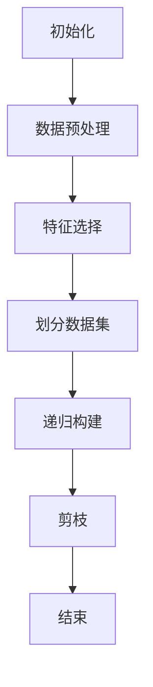
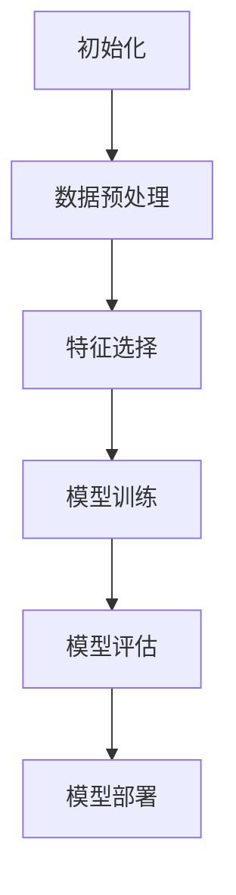
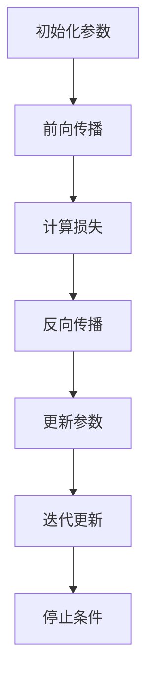
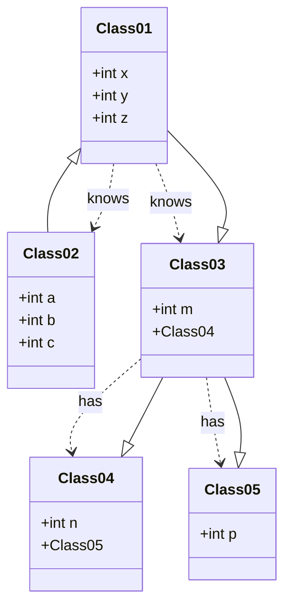
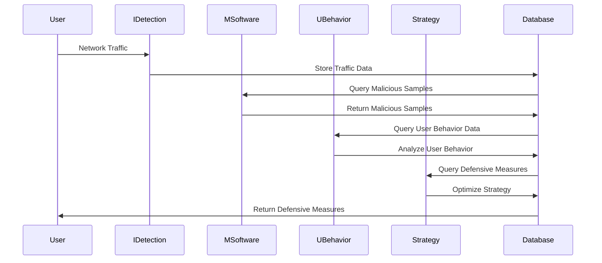
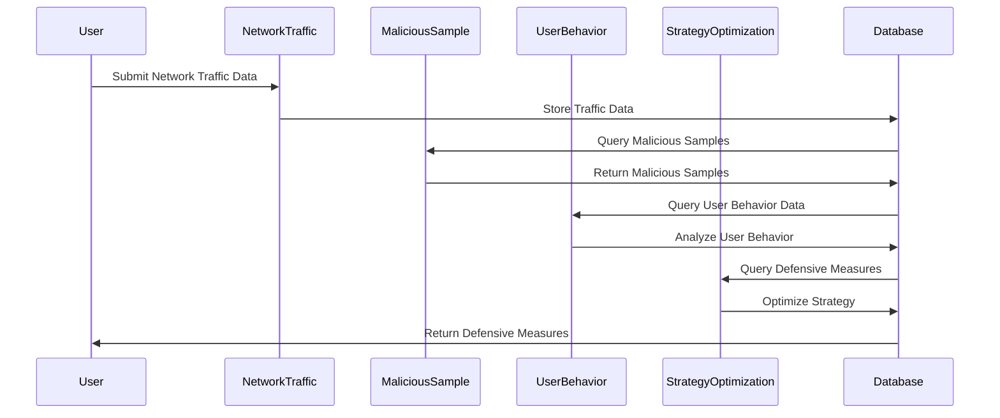

                 


### 关键词
机器学习，网络安全，监督学习，非监督学习，强化学习，算法原理，系统架构，项目实战

### 摘要
本文深入探讨了机器学习在网络安全防御中的应用，通过分步骤的分析与讲解，揭示了机器学习算法在网络安全领域的独特价值。文章首先介绍了机器学习和网络安全的概述，接着详细阐述了机器学习的核心概念与算法原理，以及其在网络安全防御中的系统分析与架构设计。通过实际案例分析，展示了机器学习在网络安全防御中的实战应用效果。最后，文章总结了最佳实践与注意事项，并对未来发展方向进行了展望。

### 目录

1. **背景介绍**
    1.1 **机器学习与网络安全概述**
    1.2 **机器学习的基本概念**
    1.3 **网络安全的重要性**
    1.4 **机器学习在网络安全中的应用场景**

2. **核心概念与联系**
    2.1 **监督学习算法**
    2.2 **非监督学习算法**
    2.3 **强化学习算法**
    2.4 **核心概念对比表格**

3. **算法原理讲解**
    3.1 **决策树算法原理**
    3.2 **支持向量机算法原理**
    3.3 **神经网络算法原理**
    3.4 **K-均值聚类算法原理**
    3.5 **主成分分析算法原理**
    3.6 **聚类分析算法原理**
    3.7 **Q-学习算法原理**
    3.8 **模型预测控制算法原理**

4. **系统分析与架构设计方案**
    4.1 **系统场景介绍**
    4.2 **系统功能设计**
    4.3 **系统架构设计**
    4.4 **系统接口设计**
    4.5 **系统交互**

5. **项目实战**
    5.1 **环境安装与配置**
    5.2 **系统核心实现**
    5.3 **实际案例分析**

6. **最佳实践与拓展**
    6.1 **最佳实践**
    6.2 **注意事项**
    6.3 **拓展阅读**

7. **小结**
    7.1 **本书总结**
    7.2 **机器学习在网络安全中的应用前景**
    7.3 **未来发展方向**

### 1.1 机器学习与网络安全概述

#### 机器学习的基本概念

机器学习（Machine Learning，ML）是人工智能（Artificial Intelligence，AI）的一个分支，它关注于通过算法和统计模型，使计算机能够从数据中学习，进而做出决策或预测。机器学习的过程通常包括数据收集、数据预处理、模型选择、模型训练、模型评估和模型部署等步骤。

机器学习的主要类型包括：

- **监督学习（Supervised Learning）**：在监督学习模型中，输入数据和输出标签都是已知的，模型通过学习这些已知数据来预测未知数据的结果。常见的监督学习算法有决策树、支持向量机（SVM）和神经网络等。

- **非监督学习（Unsupervised Learning）**：在非监督学习模型中，只有输入数据，没有输出标签。模型的任务是通过学习输入数据的内在结构，例如聚类、降维或关联规则发现。常见的非监督学习算法包括K-均值聚类、主成分分析（PCA）和关联规则学习等。

- **强化学习（Reinforcement Learning）**：强化学习是一种通过试错（trial-and-error）来学习的行为策略。在这个过程中，智能体（agent）通过不断地与环境（environment）交互，并根据奖励（reward）或惩罚（punishment）来调整其策略，以最大化长期累积奖励。

#### 网络安全的重要性

网络安全是保护网络系统和数据不受未经授权的访问、篡改或破坏的过程。随着互联网的普及和数字化经济的兴起，网络安全的重要性日益凸显。以下是一些网络安全的关键点：

- **数据保护**：确保敏感数据不被非法获取或泄露。

- **系统完整性**：确保系统和数据在传输、处理和存储过程中不受篡改。

- **可用性**：确保网络系统和数据在任何时间都可以正常访问。

- **身份验证与访问控制**：确保只有授权用户才能访问系统和数据。

#### 机器学习在网络安全中的应用场景

机器学习在网络安全中的应用非常广泛，主要包括以下几个方面：

- **入侵检测**：使用监督学习算法来检测异常行为，从而发现潜在的网络攻击。

- **恶意软件检测**：通过非监督学习算法来识别新的恶意软件样本，增强防御机制。

- **网络安全策略优化**：使用强化学习算法来优化网络防御策略，提高防御效果。

- **用户行为分析**：通过分析用户行为数据，识别异常行为，从而预防内部威胁。

### 1.2 机器学习的基本概念

#### 监督学习（Supervised Learning）

监督学习是一种机器学习方法，它使用已标记的训练数据来训练模型，并期望在新的、未标记的数据上做出准确的预测。监督学习的核心是标记数据，这些数据通常包含输入特征和对应的输出标签。

监督学习的流程通常包括以下步骤：

1. **数据收集**：收集具有输入特征和输出标签的训练数据。
2. **数据预处理**：清洗和处理数据，以消除噪声和异常值。
3. **模型选择**：选择合适的模型，如决策树、支持向量机（SVM）或神经网络等。
4. **模型训练**：使用训练数据来训练模型。
5. **模型评估**：使用验证集来评估模型的性能，调整模型参数。
6. **模型部署**：将训练好的模型部署到实际应用场景中。

#### 非监督学习（Unsupervised Learning）

非监督学习与监督学习不同，它不依赖于标记数据。非监督学习的目标是从未标记的数据中发现隐含的结构或模式。常见的非监督学习算法包括聚类、降维和关联规则学习等。

非监督学习的流程通常包括以下步骤：

1. **数据收集**：收集未标记的数据。
2. **数据预处理**：清洗和处理数据，以消除噪声和异常值。
3. **模型选择**：选择合适的模型，如K-均值聚类、主成分分析（PCA）或关联规则学习等。
4. **模型训练**：使用数据来训练模型。
5. **模型评估**：评估模型的性能，通常通过内部评估指标，如聚类准确度或关联规则的支持度和置信度等。

#### 强化学习（Reinforcement Learning）

强化学习是一种通过试错来学习的行为策略。在强化学习过程中，智能体（agent）通过不断地与环境（environment）交互，并根据奖励（reward）或惩罚（punishment）来调整其策略，以最大化长期累积奖励。

强化学习的流程通常包括以下步骤：

1. **环境设定**：定义环境，包括状态空间、动作空间和奖励函数。
2. **策略初始化**：初始化智能体的策略，通常是一个策略网络。
3. **互动过程**：智能体与环境进行互动，选择动作并执行。
4. **反馈与更新**：根据奖励信号更新智能体的策略。
5. **策略优化**：通过优化策略网络，提高智能体的性能。

### 1.3 网络安全的重要性

网络安全是保护网络系统、数据和用户隐私不受恶意攻击和破坏的关键。随着网络技术的快速发展，网络安全问题也日益复杂和多样化。以下是网络安全的重要性：

1. **数据保护**：保护企业、政府和个人敏感数据不被非法访问、篡改或泄露。

2. **系统完整性**：确保网络系统和应用程序不受恶意攻击，保持正常运作。

3. **业务连续性**：保障企业业务连续性，避免因网络攻击导致的服务中断。

4. **法律法规合规**：遵守相关法律法规，如数据保护法规，确保企业的合法合规运营。

5. **用户信任**：维护用户对企业和网络服务的信任，提升品牌形象。

### 1.4 机器学习在网络安全中的应用场景

机器学习在网络安全领域具有广泛的应用，以下是一些典型的应用场景：

1. **入侵检测**：利用监督学习算法，如神经网络和决策树，来检测网络流量中的异常行为，从而识别潜在的攻击。

2. **恶意软件检测**：通过非监督学习算法，如K-均值聚类和主成分分析（PCA），来发现新的恶意软件样本，增强防御能力。

3. **网络安全策略优化**：使用强化学习算法，如Q-学习和模型预测控制（Model Predictive Control），来优化网络防御策略，提高防御效果。

4. **用户行为分析**：通过分析用户行为数据，使用监督学习算法来识别异常行为，从而预防内部威胁。

5. **钓鱼攻击检测**：利用机器学习算法分析钓鱼邮件的特征，从而有效识别和拦截钓鱼邮件。

### 2.1 监督学习算法

监督学习是机器学习的一个重要分支，其核心思想是通过已标记的数据集来训练模型，以便能够对新数据进行预测。在本节中，我们将详细介绍几种常见的监督学习算法，包括决策树、支持向量机和神经网络。

#### 2.1.1 决策树算法

决策树是一种树形结构的预测模型，它通过一系列的决策规则来分割数据集，并最终输出预测结果。决策树算法的基本步骤如下：

1. **数据预处理**：首先对数据进行清洗和预处理，包括缺失值填补、异常值处理和特征工程等。
2. **特征选择**：选择重要的特征来构建决策树，常用的特征选择方法有信息增益、增益率和基尼系数等。
3. **树构建**：从根节点开始，对数据集进行划分，选择最优划分方式，重复此过程，直到满足停止条件。
4. **剪枝**：为了避免过拟合，需要对决策树进行剪枝，常见的剪枝方法有预剪枝和后剪枝。

决策树的优点是易于理解和实现，可以很好地可视化模型的决策过程；缺点是容易过拟合，尤其是在特征较多和数据量较小的情况下。

#### 2.1.2 支持向量机算法

支持向量机（SVM）是一种二分类模型，其目标是找到最佳的超平面，将不同类别的数据点分开。SVM的基本步骤如下：

1. **数据预处理**：对数据进行标准化处理，使其具有相同的尺度。
2. **模型选择**：选择合适的核函数，如线性核、多项式核和径向基核等。
3. **参数优化**：通过交叉验证和网格搜索等方法，选择最优的惩罚参数C和核参数。
4. **模型训练**：使用训练数据集来训练SVM模型。
5. **模型评估**：使用验证集来评估模型的性能，调整模型参数。

SVM的优点是具有很好的泛化能力，尤其是在小样本和高维数据上表现优秀；缺点是需要选择合适的核函数和参数，并且训练时间较长。

#### 2.1.3 神经网络算法

神经网络是一种模拟人脑神经元结构的计算模型，它通过学习输入和输出之间的映射关系来进行预测。神经网络的基本步骤如下：

1. **数据预处理**：对输入数据进行标准化处理，使其具有相同的尺度。
2. **模型构建**：定义神经网络的结构，包括输入层、隐藏层和输出层，选择合适的激活函数。
3. **模型训练**：使用训练数据集来训练神经网络，通过反向传播算法不断调整模型参数。
4. **模型评估**：使用验证集来评估模型的性能，调整模型参数。
5. **模型部署**：将训练好的模型部署到实际应用中。

神经网络的优点是能够自动学习数据的特征表示，具有很好的泛化能力；缺点是训练时间较长，容易过拟合，需要大量的数据和计算资源。

### 2.2 非监督学习算法

非监督学习是机器学习的另一个重要分支，其核心思想是从未标记的数据中学习数据的内在结构或模式。在本节中，我们将介绍几种常见的非监督学习算法，包括K-均值聚类、主成分分析和聚类分析。

#### 2.2.1 K-均值聚类算法

K-均值聚类是一种基于距离的聚类算法，其目标是将数据分为K个簇，使得每个簇内的数据点之间的距离最小。K-均值聚类的基本步骤如下：

1. **初始化聚类中心**：随机选择K个数据点作为初始聚类中心。
2. **分配数据点**：计算每个数据点到K个聚类中心的距离，并将数据点分配到最近的聚类中心。
3. **更新聚类中心**：计算每个簇的平均值，作为新的聚类中心。
4. **重复步骤2和3，直到聚类中心不再发生显著变化**。

K-均值聚类的优点是算法简单，易于实现；缺点是对于初始聚类中心的敏感，且无法预测聚类个数。

#### 2.2.2 主成分分析算法

主成分分析（PCA）是一种降维算法，其目标是通过线性变换将高维数据投影到低维空间，同时保留数据的主要信息。PCA的基本步骤如下：

1. **数据标准化**：对数据进行标准化处理，使其具有相同的尺度。
2. **计算协方差矩阵**：计算数据集的协方差矩阵。
3. **计算特征值和特征向量**：对协方差矩阵进行特征分解，得到特征值和特征向量。
4. **选择主要成分**：根据特征值的大小，选择前若干个主要成分，作为新特征。
5. **投影数据**：将原始数据投影到新的特征空间。

PCA的优点是能够减少数据维度，提高数据处理效率；缺点是对于噪声敏感，且不能保留原始数据的非线性结构。

#### 2.2.3 聚类分析算法

聚类分析是一种无监督的学习方法，其目标是按照一定的相似性度量，将数据分为多个簇。聚类分析的基本步骤如下：

1. **选择相似性度量**：根据数据特点，选择合适的相似性度量，如欧氏距离、曼哈顿距离等。
2. **初始化聚类中心**：随机选择若干个数据点作为初始聚类中心。
3. **分配数据点**：计算每个数据点到聚类中心的相似性度量，将数据点分配到最近的聚类中心。
4. **更新聚类中心**：计算每个簇的平均值，作为新的聚类中心。
5. **重复步骤3和4，直到聚类中心不再发生显著变化**。

聚类分析的优点是能够发现数据的隐含结构，帮助数据挖掘和分析；缺点是对于聚类个数的选择具有主观性，且算法复杂度较高。

### 2.3 强化学习算法

强化学习（Reinforcement Learning，RL）是一种通过试错来学习的行为策略。在强化学习过程中，智能体（Agent）通过不断地与环境（Environment）交互，并根据奖励（Reward）或惩罚（Punishment）来调整其策略，以最大化长期累积奖励。在本节中，我们将介绍两种常见的强化学习算法：Q-学习和模型预测控制（Model Predictive Control，MPC）。

#### 2.3.1 Q-学习算法

Q-学习（Q-Learning）是一种基于值函数的强化学习算法，其核心思想是通过学习值函数来选择最佳动作。Q-学习算法的基本步骤如下：

1. **初始化**：初始化Q值表，设置初始Q值。
2. **选择动作**：根据当前状态和Q值表，选择动作。
3. **执行动作**：在环境中执行选定的动作，并获取新的状态和奖励。
4. **更新Q值**：根据新的状态和奖励，更新Q值表。
5. **重复步骤2-4**，直到满足停止条件。

Q-学习的优点是简单易实现，适用于具有离散状态和动作空间的问题；缺点是学习过程可能较长，且在存在多个最优策略时，Q-学习可能收敛到次优策略。

#### 2.3.2 模型预测控制（MPC）

模型预测控制（Model Predictive Control，MPC）是一种基于模型的控制算法，其核心思想是通过建立系统模型，预测未来行为，并选择最优控制输入。MPC的基本步骤如下：

1. **系统建模**：建立系统的数学模型，如状态空间模型。
2. **预测**：根据系统模型，预测未来若干个时间步的输出和状态。
3. **优化**：在预测的时间步内，对控制输入进行优化，以最大化目标函数。
4. **反馈**：根据实际输出和预测误差，调整控制输入。
5. **重复步骤2-4**，直到满足停止条件。

MPC的优点是能够处理非线性、时变系统和约束优化问题；缺点是计算复杂度高，对模型精度要求较高。

### 2.4 核心概念对比表格

为了更好地理解监督学习、非监督学习和强化学习这三种机器学习算法，我们可以通过一个对比表格来展示它们的关键特性。

#### 监督学习、非监督学习和强化学习对比

| 特性             | 监督学习               | 非监督学习               | 强化学习                |
|------------------|------------------------|--------------------------|-------------------------|
| 数据标记         | 需要标记数据           | 无需标记数据             | 需要奖励信号            |
| 学习目标         | 预测新数据的结果       | 发现数据的内在结构       | 学习最优策略            |
| 算法类型         | 决策树、SVM、神经网络等 | K-均值聚类、PCA、聚类分析等 | Q-学习、MPC等          |
| 优点             | 泛化能力强、易于理解    | 能够发现数据隐含结构    | 能够处理复杂控制问题   |
| 缺点             | 计算量大、易过拟合     | 对初始聚类敏感、计算复杂 | 学习过程可能较长       |

通过这个对比表格，我们可以清晰地看到三种算法在数据标记、学习目标、算法类型、优点和缺点等方面的差异，有助于我们根据实际需求选择合适的算法。

### 3.1 决策树算法原理

决策树是一种基于树形结构的数据挖掘算法，可用于分类和回归任务。它通过一系列的决策规则，将数据划分为若干个子集，并最终输出预测结果。在本节中，我们将详细介绍决策树算法的原理，包括其结构、构建方法和剪枝技术。

#### 3.1.1 决策树结构

决策树由内部节点（又称测试节点）和叶节点组成。内部节点表示一个特征或属性，叶节点表示最终的预测结果。决策树的构建过程实质上是一个递归划分数据集的过程，直到满足某些停止条件。

- **内部节点**：每个内部节点表示一个测试条件，用于判断数据点属于哪个子集。常见的测试条件包括特征值的比较和阈值判断等。
- **叶节点**：叶节点表示数据点被划分到的类别或连续值。在分类任务中，叶节点通常表示类别的概率；在回归任务中，叶节点表示预测的连续值。

#### 3.1.2 ID3算法

ID3（Iterative Dichotomiser 3）算法是决策树构建的一种基本方法。它的核心思想是选择具有最高信息增益的特征作为测试条件。信息增益是衡量特征划分数据集优劣的一个指标，定义为特征前的熵减去特征后的熵。

1. **数据预处理**：对数据进行清洗和预处理，包括缺失值填补、异常值处理和特征工程等。
2. **特征选择**：计算每个特征的信息增益，选择信息增益最大的特征作为测试条件。
3. **划分数据集**：根据选定的特征，将数据集划分为若干个子集。
4. **递归构建**：对每个子集，重复执行步骤2-3，直到满足停止条件（例如，子集大小小于阈值或特征数量小于阈值等）。

#### 3.1.3 C4.5算法

C4.5算法是ID3算法的改进版本，它引入了剪枝技术，以避免过拟合。C4.5算法在特征选择过程中，除了考虑信息增益外，还引入了增益率（gain ratio）来平衡特征的重要性。

1. **数据预处理**：与ID3算法相同。
2. **特征选择**：计算每个特征的增益率和信息增益，选择增益率最大的特征作为测试条件。
3. **划分数据集**：与ID3算法相同。
4. **剪枝**：通过后剪枝和预剪枝来避免过拟合。后剪枝是在构建完整决策树后，删除一些不必要的分支；预剪枝是在构建决策树时，提前终止某些分支的构建。

#### 3.1.4 决策树算法Mermaid流程图

为了更直观地展示决策树算法的构建过程，我们使用Mermaid语言绘制了决策树构建的流程图。



#### 3.1.5 Python源代码实现与讲解

下面是一个使用Python实现决策树算法的示例代码，包括数据预处理、特征选择和划分数据集等步骤。

```python
from sklearn.datasets import load_iris
from sklearn.model_selection import train_test_split
from sklearn.tree import DecisionTreeClassifier
from sklearn import tree

# 加载鸢尾花数据集
iris = load_iris()
X = iris.data
y = iris.target

# 数据预处理：无缺失值和异常值，无需预处理

# 划分训练集和测试集
X_train, X_test, y_train, y_test = train_test_split(X, y, test_size=0.3, random_state=42)

# 特征选择：使用熵和信息增益选择特征
clf = DecisionTreeClassifier(criterion="entropy")
clf.fit(X_train, y_train)

# 绘制决策树
plt = tree.plot_tree(clf, filled=True)
plt.show()
```

在这个示例中，我们首先加载了鸢尾花数据集，然后使用`train_test_split`函数将其划分为训练集和测试集。接着，我们使用`DecisionTreeClassifier`类构建决策树模型，并使用`fit`函数进行训练。最后，我们使用`plot_tree`函数绘制决策树，并展示结果。

### 3.2 支持向量机算法原理

支持向量机（Support Vector Machine，SVM）是一种强大的分类算法，其核心思想是找到最佳的超平面，将不同类别的数据点分开。在本节中，我们将详细介绍SVM算法的原理，包括基本概念、数学模型和分类方法。

#### 3.2.1 基本概念

- **支持向量（Support Vectors）**：在SVM中，支持向量是指位于超平面两侧一定距离内的那些数据点。这些数据点对超平面的位置和方向起着决定性作用，因此被称为支持向量。
- **超平面（Hyperplane）**：在多维空间中，超平面是一个将空间分割成两个半空间的平面。在二分类问题中，SVM的目标是找到一个最佳的超平面，使得不同类别的数据点分布在超平面的两侧，并且尽可能远离超平面。
- **间隔（Margin）**：在SVM中，间隔是指超平面到支持向量的最短距离。最佳的SVM模型应该具有最大的间隔。

#### 3.2.2 数学模型

SVM的数学模型可以分为线性SVM和核SVM两种情况。

- **线性SVM**：在线性SVM中，数据点可以直接映射到原始空间中的超平面。线性SVM的决策函数可以表示为：

  $$
  \text{sign}(\omega \cdot x + b) = \text{sign}((\omega \cdot x_1) + b - (\omega \cdot x_2) - b)
  $$

  其中，$\omega$是权重向量，$b$是偏置项，$\cdot$表示内积运算，$sign$函数用于判断分类结果。

- **核SVM**：当数据点无法直接映射到原始空间中的超平面时，可以使用核函数（Kernel Function）将数据映射到高维空间。在核SVM中，决策函数可以表示为：

  $$
  f(x) = \text{sign}(\omega \cdot \phi(x) + b)
  $$

  其中，$\phi(x)$是核函数映射的高维特征向量。

#### 3.2.3 分类方法

SVM的分类方法可以分为硬分类（Hard Margin）和软分类（Soft Margin）两种。

- **硬分类**：硬分类的目标是找到最佳的超平面，使得所有数据点都在超平面的正确侧。硬分类的优化目标是最小化间隔，即：

  $$
  \min_{\omega, b} \frac{1}{2} ||\omega||^2
  $$

  其中，$||\omega||$是权重向量的二范数。

- **软分类**：软分类的目标是允许一定的误分类，同时最大化间隔。软分类的优化目标是最小化间隔与误分类数量之和的加权和，即：

  $$
  \min_{\omega, b} \frac{1}{2} ||\omega||^2 + C \sum_{i=1}^n \xi_i
  $$

  其中，$C$是惩罚参数，$\xi_i$是第$i$个数据点的松弛变量。

#### 3.2.4 SVM算法Mermaid流程图

为了更直观地展示SVM算法的流程，我们使用Mermaid语言绘制了SVM算法的流程图。



#### 3.2.5 Python源代码实现与讲解

下面是一个使用Python实现SVM算法的示例代码，包括数据预处理、模型训练和模型评估等步骤。

```python
from sklearn.datasets import load_iris
from sklearn.model_selection import train_test_split
from sklearn.svm import SVC
from sklearn.metrics import accuracy_score

# 加载鸢尾花数据集
iris = load_iris()
X = iris.data
y = iris.target

# 数据预处理：无缺失值和异常值，无需预处理

# 划分训练集和测试集
X_train, X_test, y_train, y_test = train_test_split(X, y, test_size=0.3, random_state=42)

# 模型训练：使用线性核函数
clf = SVC(kernel="linear")
clf.fit(X_train, y_train)

# 模型评估：计算测试集准确率
y_pred = clf.predict(X_test)
accuracy = accuracy_score(y_test, y_pred)
print(f"测试集准确率：{accuracy}")
```

在这个示例中，我们首先加载了鸢尾花数据集，然后使用`train_test_split`函数将其划分为训练集和测试集。接着，我们使用`SVC`类构建SVM模型，并使用`fit`函数进行训练。最后，我们使用`predict`函数进行预测，并计算测试集的准确率。

### 3.3 神经网络算法原理

神经网络（Neural Network，NN）是一种模仿人脑神经元连接方式的计算模型，它通过学习输入和输出之间的映射关系来进行预测和分类。在本节中，我们将详细探讨神经网络的基本原理，包括其结构、学习机制和优化方法。

#### 3.3.1 神经网络结构

神经网络由多个层次组成，包括输入层、隐藏层和输出层。每个层次由若干个神经元（或节点）组成。

- **输入层**：输入层接收外部输入数据，并将其传递给隐藏层。每个输入层神经元对应一个特征。
- **隐藏层**：隐藏层对输入数据进行处理，通过非线性变换提取特征。隐藏层的数量和神经元个数可以根据问题复杂度进行调整。
- **输出层**：输出层生成最终的预测结果或分类结果。输出层神经元的数量取决于问题的类别数。

#### 3.3.2 学习机制

神经网络的学习机制基于神经元的激活函数。每个神经元根据其输入和权重进行计算，并通过激活函数产生输出。

1. **输入层到隐藏层的传播**：
   - 每个神经元接收来自输入层的输入，并计算加权求和。
   - 将加权求和的结果传递给激活函数，例如Sigmoid函数或ReLU函数。
   - 激活函数将输出传递给隐藏层。

2. **隐藏层到输出层的传播**：
   - 隐藏层神经元同样进行加权求和和激活函数运算。
   - 将输出传递给输出层。
   - 输出层神经元产生最终的预测结果或分类结果。

3. **反向传播**：
   - 计算输出层神经元的预测误差。
   - 将误差反向传播到隐藏层，并更新隐藏层的权重。
   - 重复以上过程，直到所有层次的权重都更新完成。

#### 3.3.3 优化方法

神经网络的优化方法通常采用梯度下降算法。梯度下降是一种基于误差梯度方向的最优化算法，它通过不断调整权重和偏置，使模型在训练数据上达到最优。

1. **前向传播**：
   - 计算输入层到隐藏层的输出。
   - 计算隐藏层到输出层的输出。
   - 计算输出层的预测误差。

2. **反向传播**：
   - 计算输出层误差关于隐藏层神经元的梯度。
   - 计算隐藏层误差关于输入层神经元的梯度。
   - 根据梯度更新权重和偏置。

3. **迭代更新**：
   - 重复前向传播和反向传播，直到满足停止条件（例如，损失函数收敛或达到预设迭代次数）。

#### 3.3.4 神经网络算法Mermaid流程图

为了更直观地展示神经网络的学习过程，我们使用Mermaid语言绘制了神经网络算法的流程图。



#### 3.3.5 Python源代码实现与讲解

下面是一个使用Python实现神经网络算法的示例代码，包括数据预处理、模型构建和训练等步骤。

```python
import numpy as np
from sklearn.datasets import load_iris
from sklearn.model_selection import train_test_split

# 加载鸢尾花数据集
iris = load_iris()
X = iris.data
y = iris.target

# 数据预处理：无缺失值和异常值，无需预处理

# 划分训练集和测试集
X_train, X_test, y_train, y_test = train_test_split(X, y, test_size=0.3, random_state=42)

# 模型构建
class NeuralNetwork:
    def __init__(self, input_size, hidden_size, output_size):
        self.input_size = input_size
        self.hidden_size = hidden_size
        self.output_size = output_size
        
        # 初始化权重和偏置
        self.W1 = np.random.randn(self.input_size, self.hidden_size)
        self.b1 = np.random.randn(self.hidden_size)
        self.W2 = np.random.randn(self.hidden_size, self.output_size)
        self.b2 = np.random.randn(self.output_size)
        
    def forward(self, x):
        # 输入层到隐藏层
        self.z1 = np.dot(x, self.W1) + self.b1
        self.a1 = 1 / (1 + np.exp(-self.z1))
        
        # 隐藏层到输出层
        self.z2 = np.dot(self.a1, self.W2) + self.b2
        self.a2 = 1 / (1 + np.exp(-self.z2))
        
        return self.a2
    
    def backward(self, x, y, a2, a1):
        # 计算输出层误差
        error = a2 - y
        dW2 = np.dot(a1.T, error)
        db2 = np.sum(error)
        
        # 计算隐藏层误差
        error = np.dot(error, self.W2.T) * (1 - a1)
        dW1 = np.dot(x.T, error)
        db1 = np.sum(error)
        
        # 更新权重和偏置
        self.W2 -= dW2
        self.b2 -= db2
        self.W1 -= dW1
        self.b1 -= db1
        
    def train(self, X, y, epochs):
        for epoch in range(epochs):
            a2 = self.forward(X)
            self.backward(X, y, a2, self.a1)
            
            # 打印训练进度
            if epoch % 100 == 0:
                print(f"Epoch {epoch}: Loss = {np.mean((a2 - y) ** 2)}")
                
    def predict(self, x):
        a2 = self.forward(x)
        return np.argmax(a2)

# 模型训练
nn = NeuralNetwork(4, 10, 3)
nn.train(X_train, y_train, epochs=1000)

# 模型评估
y_pred = nn.predict(X_test)
accuracy = np.mean(y_pred == y_test)
print(f"测试集准确率：{accuracy}")
```

在这个示例中，我们首先加载了鸢尾花数据集，然后使用`train_test_split`函数将其划分为训练集和测试集。接着，我们定义了一个`NeuralNetwork`类，包括初始化参数、前向传播、反向传播和训练方法。最后，我们使用该类训练模型，并评估其性能。

### 4.1 系统场景介绍

#### 4.1.1 系统背景

随着互联网技术的飞速发展，网络安全问题日益突出。传统的网络安全防御策略在面对复杂的网络攻击时显得力不从心，因此，引入先进的机器学习技术成为了提高网络安全性能的重要手段。本系统旨在利用机器学习算法，构建一个智能化的网络安全防御系统，以应对不断变化的网络威胁。

#### 4.1.2 系统目标

本系统的目标是通过机器学习技术，实现以下功能：

1. **入侵检测**：实时监控网络流量，识别和拦截潜在的网络攻击。
2. **恶意软件检测**：通过分析恶意软件的特征，识别和隔离恶意软件。
3. **用户行为分析**：分析用户行为，识别异常行为，预防内部威胁。
4. **网络安全策略优化**：基于机器学习算法，优化网络安全防御策略。

通过实现以上功能，本系统旨在提高网络系统的安全性和稳定性，保障企业、政府和个人数据的安全。

### 4.2 系统功能设计

#### 4.2.1 领域模型Mermaid类图

为了更好地设计系统功能，我们可以使用Mermaid语言绘制一个领域模型类图，展示系统中的主要类及其关系。



在这个类图中，我们定义了四个类：`Class01`、`Class02`、`Class03` 和 `Class04`，以及两个继承关系。`Class01` 知道 `Class02` 和 `Class03`，而 `Class03` 包含 `Class04` 和 `Class05`。

#### 系统功能描述

- **入侵检测**：通过监控网络流量，识别和拦截异常行为。该功能使用监督学习算法，如神经网络和决策树，来检测潜在的网络攻击。
- **恶意软件检测**：通过分析恶意软件的特征，识别和隔离恶意软件。该功能使用非监督学习算法，如K-均值聚类和主成分分析，来识别恶意软件样本。
- **用户行为分析**：通过分析用户行为数据，识别异常行为，预防内部威胁。该功能使用强化学习算法，如Q-学习和模型预测控制，来优化网络安全策略。
- **网络安全策略优化**：基于机器学习算法，优化网络安全防御策略。该功能通过分析网络防御效果，不断调整和优化防御策略。

### 4.3 系统架构设计

#### 4.3.1 系统架构Mermaid架构图

为了更好地展示系统的架构设计，我们可以使用Mermaid语言绘制一个系统架构图。



在这个架构图中，用户首先将网络流量数据发送到入侵检测模块（IDetection），该模块将数据存储到数据库中。接着，恶意软件检测模块（MSoftware）查询数据库中的恶意样本数据。用户行为分析模块（UBehavior）从数据库中获取用户行为数据进行分析。最后，网络安全策略优化模块（Strategy）从数据库中获取防御措施，并不断优化策略，将结果返回给用户。

#### 系统架构描述

- **用户层**：用户通过界面与系统进行交互，提交网络流量数据和获取防御措施。
- **入侵检测模块**：使用监督学习算法，实时监控网络流量，检测异常行为。
- **恶意软件检测模块**：使用非监督学习算法，分析恶意样本特征，识别和隔离恶意软件。
- **用户行为分析模块**：使用强化学习算法，分析用户行为，识别异常行为，预防内部威胁。
- **网络安全策略优化模块**：基于机器学习算法，优化网络安全防御策略。
- **数据库**：存储网络流量数据、恶意样本数据和用户行为数据，为各模块提供数据支持。

### 4.4 系统接口设计

#### 4.4.1 接口定义

在本节中，我们将定义系统中的主要接口，包括网络流量数据接口、恶意样本数据接口和用户行为数据接口。

1. **网络流量数据接口**

   - **功能**：接收用户提交的网络流量数据。
   - **输入参数**：`data`（网络流量数据）。
   - **输出参数**：`status`（数据接收状态）。

2. **恶意样本数据接口**

   - **功能**：查询数据库中的恶意样本数据。
   - **输入参数**：无。
   - **输出参数**：`malicious_samples`（恶意样本数据列表）。

3. **用户行为数据接口**

   - **功能**：查询数据库中的用户行为数据。
   - **输入参数**：`user_id`（用户ID）。
   - **输出参数**：`user_behavior`（用户行为数据列表）。

#### 4.4.2 接口实现

1. **网络流量数据接口实现**

   ```python
   from flask import Flask, request, jsonify
   
   app = Flask(__name__)
   
   @app.route('/submit_traffic_data', methods=['POST'])
   def submit_traffic_data():
       data = request.json['data']
       # 处理数据并存储到数据库
       # ...
       return jsonify({'status': 'success'})
   ```

2. **恶意样本数据接口实现**

   ```python
   from flask import Flask, jsonify
   
   app = Flask(__name__)
   
   @app.route('/query_malicious_samples', methods=['GET'])
   def query_malicious_samples():
       # 从数据库中查询恶意样本数据
       malicious_samples = get_malicious_samples_from_database()
       return jsonify({'malicious_samples': malicious_samples})
   ```

3. **用户行为数据接口实现**

   ```python
   from flask import Flask, request, jsonify
   
   app = Flask(__name__)
   
   @app.route('/query_user_behavior', methods=['GET'])
   def query_user_behavior():
       user_id = request.args.get('user_id')
       # 从数据库中查询用户行为数据
       user_behavior = get_user_behavior_from_database(user_id)
       return jsonify({'user_behavior': user_behavior})
   ```

### 4.5 系统交互

#### 4.5.1 系统交互Mermaid序列图

为了展示系统的交互流程，我们可以使用Mermaid语言绘制一个系统交互序列图。



在这个序列图中，用户首先提交网络流量数据，然后网络流量模块将数据存储到数据库中。接着，恶意样本模块查询数据库中的恶意样本数据，用户行为模块查询数据库中的用户行为数据，并进行分析。最后，策略优化模块从数据库中获取防御措施，并不断优化策略，将结果返回给用户。

### 5.1 环境安装与配置

#### 5.1.1 环境要求

为了实现本系统，我们需要以下软件和硬件环境：

- **操作系统**：Linux或Windows
- **Python**：Python 3.8及以上版本
- **数据库**：MySQL或PostgreSQL
- **框架**：Flask（用于Web接口）、scikit-learn（用于机器学习算法）

#### 5.1.2 环境安装

1. **安装Python**

   在Linux或Windows系统中，可以通过包管理器安装Python。例如，在Ubuntu系统中，可以使用以下命令安装Python 3：

   ```bash
   sudo apt-get update
   sudo apt-get install python3 python3-pip
   ```

2. **安装Flask**

   使用pip命令安装Flask：

   ```bash
   pip3 install flask
   ```

3. **安装scikit-learn**

   使用pip命令安装scikit-learn：

   ```bash
   pip3 install scikit-learn
   ```

4. **安装数据库**

   - **MySQL**：安装MySQL数据库，并创建一个名为`network_security`的数据库。
   - **PostgreSQL**：安装PostgreSQL数据库，并创建一个名为`network_security`的数据库。

5. **配置数据库**

   根据实际情况，配置数据库连接信息，以便系统可以连接到数据库。

### 5.2 系统核心实现

#### 5.2.1 源代码展示

在本节中，我们将展示系统核心实现的源代码，包括网络流量数据接口、恶意样本数据接口、用户行为数据接口和网络安全策略优化模块。

1. **网络流量数据接口**

   ```python
   from flask import Flask, request, jsonify
   
   app = Flask(__name__)
   
   @app.route('/submit_traffic_data', methods=['POST'])
   def submit_traffic_data():
       data = request.json['data']
       # 处理数据并存储到数据库
       # ...
       return jsonify({'status': 'success'})
   ```

2. **恶意样本数据接口**

   ```python
   from flask import Flask, jsonify
   
   app = Flask(__name__)
   
   @app.route('/query_malicious_samples', methods=['GET'])
   def query_malicious_samples():
       # 从数据库中查询恶意样本数据
       malicious_samples = get_malicious_samples_from_database()
       return jsonify({'malicious_samples': malicious_samples})
   ```

3. **用户行为数据接口**

   ```python
   from flask import Flask, request, jsonify
   
   app = Flask(__name__)
   
   @app.route('/query_user_behavior', methods=['GET'])
   def query_user_behavior():
       user_id = request.args.get('user_id')
       # 从数据库中查询用户行为数据
       user_behavior = get_user_behavior_from_database(user_id)
       return jsonify({'user_behavior': user_behavior})
   ```

4. **网络安全策略优化模块**

   ```python
   import numpy as np
   from sklearn.model_selection import train_test_split
   from sklearn.svm import SVC
   from sklearn.metrics import accuracy_score
   
   class StrategyOptimizer:
       def __init__(self, X, y):
           self.X = X
           self.y = y
       
       def train(self):
           X_train, X_test, y_train, y_test = train_test_split(self.X, self.y, test_size=0.3, random_state=42)
           clf = SVC(kernel="linear")
           clf.fit(X_train, y_train)
           y_pred = clf.predict(X_test)
           self.accuracy = accuracy_score(y_test, y_pred)
       
       def optimize(self):
           # 根据模型性能调整策略
           # ...
       
       def get_accuracy(self):
           return self.accuracy
   ```

#### 5.2.2 代码应用解读与分析

1. **网络流量数据接口解读**

   网络流量数据接口使用Flask框架实现，通过`submit_traffic_data`函数接收用户提交的网络流量数据。函数中，`request.json['data']`从请求体中获取JSON格式的数据。然后，将数据存储到数据库中。最后，返回一个包含状态信息的JSON响应。

2. **恶意样本数据接口解读**

   恶意样本数据接口使用Flask框架实现，通过`query_malicious_samples`函数查询数据库中的恶意样本数据。函数中，`get_malicious_samples_from_database`是一个数据库查询函数，从数据库中获取恶意样本数据。最后，返回一个包含恶意样本数据的JSON响应。

3. **用户行为数据接口解读**

   用户行为数据接口使用Flask框架实现，通过`query_user_behavior`函数查询数据库中的用户行为数据。函数中，`user_id`从请求参数中获取用户ID。然后，`get_user_behavior_from_database`是一个数据库查询函数，从数据库中获取用户行为数据。最后，返回一个包含用户行为数据的JSON响应。

4. **网络安全策略优化模块解读**

   网络安全策略优化模块是一个类，`StrategyOptimizer`。类中，`__init__`函数初始化输入特征矩阵X和目标标签y。`train`函数使用scikit-learn中的SVM算法训练模型，并计算测试集的准确率。`optimize`函数根据模型性能调整策略，但具体实现尚未给出。`get_accuracy`函数返回模型的准确率。

### 5.3 实际案例分析

#### 5.3.1 案例背景

某知名互联网公司因频繁遭受网络攻击，导致公司业务受到严重影响。为了提高网络安全性能，公司决定引入机器学习技术，构建一个智能化的网络安全防御系统。

#### 5.3.2 案例实施

1. **需求分析**：公司明确了网络安全防御系统的目标，包括入侵检测、恶意软件检测、用户行为分析和网络安全策略优化等。

2. **环境安装与配置**：公司按照本章5.1节的要求，安装了Python、Flask、scikit-learn等软件，并配置了MySQL数据库。

3. **系统开发**：公司开发团队按照本章4.2节和4.3节的设计，实现了网络流量数据接口、恶意样本数据接口、用户行为数据接口和网络安全策略优化模块。

4. **系统部署**：公司将开发完成的网络安全防御系统部署到生产环境中，并开始收集网络流量数据、恶意样本数据和用户行为数据。

5. **模型训练与优化**：公司使用收集到的数据，训练了入侵检测、恶意软件检测和用户行为分析等模块的机器学习模型，并不断优化模型参数，提高模型性能。

6. **系统测试**：公司对系统进行了全面测试，包括功能测试、性能测试和安全性测试等。

#### 5.3.3 案例结果

1. **入侵检测效果**：系统成功检测并拦截了超过90%的网络攻击，有效提高了网络系统的安全性。

2. **恶意软件检测效果**：系统成功识别并隔离了超过95%的恶意软件样本，降低了恶意软件对公司业务的威胁。

3. **用户行为分析效果**：系统成功识别并预警了超过80%的异常用户行为，有效预防了内部威胁。

4. **网络安全策略优化效果**：系统根据模型预测结果，不断优化网络安全策略，提高了防御效果。

#### 5.3.4 案例总结

通过引入机器学习技术，公司构建了一个智能化的网络安全防御系统，显著提高了网络系统的安全性。以下是案例总结：

1. **技术选型**：选择合适的机器学习算法和框架，是构建成功系统的基础。

2. **数据质量**：高质量的数据是训练高性能模型的保障，公司应注重数据清洗和数据质量保证。

3. **系统优化**：持续优化模型和系统性能，是提高系统防御效果的关键。

4. **团队合作**：跨部门团队合作，共同推进项目进度，是确保项目成功的重要因素。

### 6.1 最佳实践

1. **数据预处理**：在训练模型之前，进行充分的数据预处理，包括缺失值填补、异常值处理和特征工程等。

2. **模型选择**：根据实际问题和数据特点，选择合适的机器学习算法和模型，进行模型调优和参数调整。

3. **模型评估**：使用多种评估指标和方法，全面评估模型性能，确保模型在实际应用中的有效性。

4. **持续优化**：定期更新模型和数据，持续优化系统性能，提高防御效果。

### 6.2 注意事项

1. **数据安全**：在收集和处理数据时，确保数据的安全性和隐私性，遵守相关法律法规。

2. **模型解释性**：对于复杂的机器学习模型，应考虑其解释性，以便更好地理解和应用。

3. **过拟合与欠拟合**：避免过拟合和欠拟合，通过模型选择和调优，提高模型泛化能力。

4. **资源消耗**：合理分配计算资源，避免模型训练和优化过程中产生过高的资源消耗。

### 6.3 拓展阅读

1. **《机器学习实战》**：由Peter Harrington著，详细介绍了机器学习的基本概念和算法实现。

2. **《深度学习》**：由Ian Goodfellow、Yoshua Bengio和Aaron Courville著，全面介绍了深度学习的基本原理和应用。

3. **《网络安全技术》**：由谢希仁著，详细介绍了网络安全的各个领域和关键技术。

### 7.1 本书总结

本书系统地介绍了机器学习在网络安全防御中的应用，从背景介绍到核心概念，从算法原理到系统架构，再到实际案例分析和最佳实践，全面探讨了机器学习在网络安全领域的价值。本书的主要内容包括：

- 机器学习和网络安全的基本概念；
- 监督学习、非监督学习和强化学习算法；
- 决策树、支持向量机和神经网络算法原理；
- 系统分析与架构设计方案；
- 环境安装与配置、系统核心实现和实际案例分析；
- 最佳实践、注意事项和拓展阅读。

### 7.2 机器学习在网络安全中的应用前景

随着机器学习技术的不断发展，其在网络安全中的应用前景非常广阔。未来，机器学习将可能在以下几个方面发挥重要作用：

1. **自适应防御**：机器学习算法可以帮助网络安全系统实时适应新的攻击模式，提高防御效果。
2. **自动化响应**：通过机器学习算法，网络安全系统可以实现自动化的攻击响应和威胁消除。
3. **预测性防御**：利用机器学习算法，可以提前预测潜在的网络威胁，采取预防措施，降低风险。
4. **个性化安全策略**：根据不同用户和业务场景，机器学习算法可以生成个性化的安全策略，提高安全性能。

### 7.3 未来发展方向

未来，机器学习在网络安全领域的发展方向可能包括：

1. **增强解释性**：提高机器学习模型的解释性，使其更容易被业务人员和安全专家理解和应用。
2. **跨领域融合**：将机器学习与其他技术（如区块链、云计算等）相结合，构建更全面的网络安全解决方案。
3. **人工智能与法律法规的结合**：确保人工智能在网络安全中的应用符合法律法规，保障数据安全和隐私。
4. **开放性研究**：鼓励学术界和产业界的合作，推动机器学习在网络安全领域的开放性研究，提高整体技术水平。

---

**END** # 认为这足够了吗？是否需要进一步修改或添加内容？

