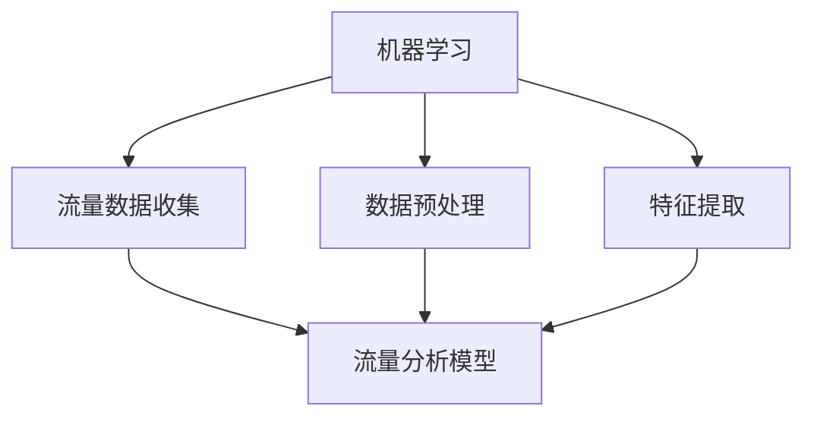

                 


### 第1章：问题背景与意义

#### 1.1 机器学习与网络流量分析的关系

在信息化时代，网络已经成为现代社会的神经系统，网络流量的规模和复杂性日益增加。网络流量分析（Network Traffic Analysis，NTA）作为网络安全的关键环节，旨在通过对网络流量的监控、分析和评估，发现潜在的安全威胁和性能瓶颈。而机器学习（Machine Learning，ML）作为一种智能化的数据分析方法，通过构建数学模型，从海量数据中提取有价值的信息，为网络流量分析提供了新的技术手段。

机器学习在网络流量分析中的应用主要体现在以下几个方面：

1. **流量模式识别**：机器学习算法能够自动识别网络流量中的异常模式和潜在威胁，为网络安全提供实时监控和预警。
2. **流量预测**：通过机器学习算法对历史流量数据进行建模，可以预测未来的流量变化，为网络资源规划提供数据支持。
3. **攻击检测与防御**：利用机器学习算法，可以构建高效的网络入侵检测系统，及时发现并防御各类网络攻击。

#### 1.2 当前网络流量分析面临的挑战

尽管网络流量分析在网络安全和性能优化方面具有重要意义，但目前仍面临诸多挑战：

1. **海量数据处理**：网络流量数据量巨大，如何高效处理和存储这些数据，成为网络流量分析的首要难题。
2. **数据隐私保护**：在网络流量分析过程中，如何保护用户隐私，避免敏感信息泄露，是亟待解决的问题。
3. **实时性要求**：网络流量分析需要实时处理和分析数据，以快速响应网络威胁和性能问题，这对系统的处理能力提出了高要求。

#### 1.3 机器学习在网络流量分析中的应用前景

随着机器学习技术的不断进步，其在网络流量分析中的应用前景十分广阔：

1. **自动化分析**：机器学习算法可以实现自动化流量分析，提高分析效率和准确性。
2. **智能化防御**：利用机器学习算法，可以构建更加智能化的网络安全防御体系，提升网络的安全水平。
3. **优化网络性能**：通过流量预测和资源调度，机器学习可以优化网络性能，提高用户体验。

#### 1.4 安全与性能优化的关键性

在网络流量分析中，安全与性能优化是两个不可分割的方面。安全是网络流量分析的基本要求，性能优化则是实现安全分析的前提。机器学习技术在网络流量分析中的应用，可以同时提升安全性和性能，为构建安全、高效的网络环境提供有力支持。

**关键词：机器学习，网络流量分析，安全，性能优化，自动化，智能化**

**摘要：本文深入探讨了机器学习在网络流量分析中的应用，分析了当前网络流量分析面临的挑战，探讨了机器学习如何提升网络流量分析的安全性和性能，为网络流量分析提供了新的思路和方法。**

----------------------------------------------------------------

## 第2章：核心概念与基础理论

### 2.1 机器学习基础

#### 2.1.1 机器学习的基本概念

机器学习是一种人工智能（Artificial Intelligence，AI）的技术，通过算法让计算机从数据中学习，自动识别数据中的模式和规律，从而进行决策和预测。机器学习的基本概念包括：

- **数据**：机器学习的基础是数据，数据的质量和数量直接影响模型的性能。
- **模型**：模型是机器学习的核心，它通过学习数据中的规律，用于预测新的数据。
- **算法**：算法是实现机器学习过程的具体步骤和方法，常用的算法包括线性回归、决策树、支持向量机、神经网络等。

#### 2.1.2 机器学习的分类

根据机器学习的学习方式，可以分为以下几类：

- **监督学习**：监督学习有明确的目标变量，通过已有的数据集训练模型，然后使用模型对新数据进行预测。
- **无监督学习**：无监督学习没有明确的目标变量，主要通过发现数据中的隐含结构和模式来进行学习。
- **半监督学习**：半监督学习结合了监督学习和无监督学习，利用少量标记数据和大量未标记数据来训练模型。
- **强化学习**：强化学习通过与环境交互，不断优化策略，以实现特定目标。

#### 2.1.3 机器学习的基本流程

机器学习的基本流程包括以下几个步骤：

1. **数据收集**：收集相关的数据，数据的质量直接影响模型的性能。
2. **数据预处理**：对数据进行清洗、归一化等处理，以提高数据的质量。
3. **特征工程**：通过特征提取和特征选择，从原始数据中提取有用的信息。
4. **模型选择**：选择合适的模型，根据问题的性质和数据的特征来决定。
5. **模型训练**：使用训练数据集对模型进行训练，调整模型的参数。
6. **模型评估**：使用验证数据集对模型进行评估，以确定模型的性能。
7. **模型部署**：将训练好的模型部署到实际应用中，进行预测和决策。

### 2.2 网络流量分析基础

#### 2.2.1 网络流量的基本概念

网络流量是指通过网络的数据传输量，包括数据包的数量、数据包的流量大小、传输速率等。网络流量分析旨在对网络流量进行监控、分析、评估，以了解网络的运行状况和性能。

网络流量的主要类型包括：

- **正常流量**：正常的网络数据传输，如Web访问、邮件传输等。
- **恶意流量**：包括DDoS攻击、恶意软件传播等威胁网络安全的流量。
- **异常流量**：不符合正常网络行为模式的流量，可能是由攻击引起的。

#### 2.2.2 网络流量分析的目的与方法

网络流量分析的主要目的是：

- **安全监控**：检测和防御网络攻击，确保网络安全。
- **性能优化**：识别网络性能瓶颈，优化网络资源分配，提高网络性能。
- **业务分析**：分析网络流量，了解用户行为，优化业务策略。

常用的网络流量分析方法包括：

- **流量捕获**：通过捕获网络数据包，分析其内容，以了解网络流量的情况。
- **流量统计**：统计网络流量的大小、速率、持续时间等指标，用于评估网络性能。
- **流量识别**：通过识别网络流量中的特定模式，发现潜在的安全威胁。

#### 2.2.3 网络流量分析的主要类型

网络流量分析可以分为以下几类：

- **流量监控**：实时监控网络流量，发现异常流量，并及时响应。
- **流量分析**：对历史流量数据进行分析，了解网络行为和模式，为网络安全和性能优化提供依据。
- **流量预测**：利用历史流量数据，预测未来的流量变化，为网络资源规划提供支持。

**核心概念与联系**

机器学习与网络流量分析的关系如下图所示：



机器学习从网络流量数据中提取特征，构建流量分析模型，用于检测异常流量、预测流量变化等。网络流量分析为机器学习提供了丰富的数据资源，而机器学习则为网络流量分析提供了强大的工具。

**数学公式**

在机器学习过程中，常用的数学公式包括：

- **损失函数**：用于评估模型预测值与真实值之间的差距。
- **梯度下降**：用于优化模型参数，最小化损失函数。
- **决策边界**：用于划分不同类别的数据点。

$$
L(y, \hat{y}) = \frac{1}{2} (y - \hat{y})^2
$$

$$
\theta_{\text{opt}} = \arg\min_{\theta} L(y, \hat{y})
$$

$$
\hat{y} = \sigma(\theta^T x)
$$

其中，$y$ 是真实值，$\hat{y}$ 是预测值，$\theta$ 是模型参数，$x$ 是特征向量，$\sigma$ 是激活函数。

**算法原理讲解**

以决策树算法为例，其基本原理如下：

1. **选择最优特征**：计算每个特征的信息增益，选择信息增益最大的特征作为分割依据。
2. **分割数据集**：根据最优特征，将数据集划分为多个子集。
3. **递归构建树**：对每个子集，重复上述步骤，构建子决策树。
4. **停止条件**：当满足停止条件（如最大深度、最小叶子节点数等），停止分割。

决策树算法能够通过层次化的结构，将复杂的网络流量数据划分成易于理解和处理的子集，从而实现流量模式识别和预测。

**示例说明**

假设我们有以下网络流量数据：

| 时间 | 流量大小 (KB) | 源IP | 目的IP |
|------|--------------|------|-------|
| 1    | 100          | 192.168.1.1 | 8.8.8.8 |
| 2    | 200          | 192.168.1.1 | 8.8.8.8 |
| 3    | 300          | 192.168.1.1 | 8.8.8.8 |
| 4    | 500          | 192.168.1.1 | 8.8.8.8 |
| 5    | 1000         | 192.168.1.1 | 8.8.8.8 |

我们可以使用决策树算法，根据流量大小来划分数据：

1. **选择最优特征**：计算信息增益，选择流量大小作为分割依据。
2. **分割数据集**：将数据集按照流量大小分割为两个子集。
3. **递归构建树**：对每个子集，继续按照流量大小分割。
4. **停止条件**：当流量大小的差异小于阈值，停止分割。

最终，我们得到一个决策树：

```
            流量大小
           /          \
          小          大
         /    \      /   \
        小    大    小    大
```

根据决策树，我们可以对新的网络流量数据进行预测。例如，如果一个数据点的流量大小为800 KB，根据决策树，它会被划分为“大”类别。

### 第3章：网络流量安全分析

网络流量安全分析是网络流量分析中的重要组成部分，旨在通过识别和防御网络攻击，保护网络安全。机器学习技术在网络流量安全分析中发挥着重要作用，能够有效提升攻击检测的准确性和实时性。

#### 3.1 DDoS攻击检测与防御

DDoS（分布式拒绝服务）攻击是一种常见的网络攻击方式，攻击者通过控制大量僵尸主机，向目标服务器发送大量的请求，使其无法正常提供服务。DDoS攻击的特点是流量突然增加，攻击流量与正常流量差异巨大。

##### 3.1.1 DDoS攻击的特点与分类

DDoS攻击的特点包括：

- **流量突发性**：攻击流量在短时间内突然增加，给网络带来巨大压力。
- **分布广泛**：攻击流量来自多个IP地址，具有分布式特征。
- **流量大小**：攻击流量可能达到正常流量的数倍甚至数十倍。

常见的DDoS攻击类型包括：

- **Syn Flood**：通过发送大量的Syn请求，使服务器无法处理正常请求。
- **UDP Flood**：通过发送大量的UDP请求，消耗服务器资源。
- **HTTP Flood**：通过发送大量的HTTP请求，使服务器过载。

##### 3.1.2 基于机器学习的DDoS攻击检测方法

基于机器学习的DDoS攻击检测方法主要包括以下几类：

- **流量模式识别**：通过分析正常流量和攻击流量的特征差异，使用机器学习算法进行模式识别，识别出DDoS攻击。
- **异常检测**：通过训练模型，识别出正常流量和异常流量，及时发现DDoS攻击。
- **行为分析**：通过分析网络流量的行为模式，如流量速率、连接数等，识别DDoS攻击。

常用的机器学习算法包括：

- **K-近邻算法（K-Nearest Neighbors，KNN）**：通过计算新数据点与训练数据点的距离，判断其是否为DDoS攻击。
- **支持向量机（Support Vector Machine，SVM）**：通过构建决策边界，将正常流量和攻击流量分离。
- **随机森林（Random Forest）**：通过构建多个决策树，利用集成学习的方法，提高攻击检测的准确性。

##### 3.1.3 案例分析：某公司的DDoS攻击防御实践

某公司是一家互联网企业，业务涵盖电子商务、在线娱乐等多个领域。公司网络每日处理大量数据，DDoS攻击对其业务稳定性和用户体验带来了严重威胁。

为了防御DDoS攻击，公司采用了基于机器学习的DDoS攻击检测系统，具体实践如下：

1. **数据收集**：收集公司网络的历史流量数据，包括正常流量和攻击流量。
2. **数据预处理**：对数据进行清洗、归一化等处理，提取有用的特征。
3. **模型训练**：使用训练数据集，分别训练KNN、SVM和随机森林模型。
4. **模型评估**：使用验证数据集对模型进行评估，选择性能最好的模型。
5. **模型部署**：将训练好的模型部署到实际应用中，实时监控网络流量，识别DDoS攻击。

在实际应用中，公司网络流量检测系统成功防御了多次DDoS攻击，保证了业务的稳定运行。例如，在一次Syn Flood攻击中，系统实时检测到攻击流量，并及时隔离了受攻击的服务器，避免了业务中断。

##### 3.1.4 基于机器学习的DDoS攻击检测方法总结

基于机器学习的DDoS攻击检测方法具有以下优点：

- **高准确性**：通过训练大量数据，机器学习算法能够准确识别DDoS攻击。
- **实时性**：机器学习算法能够实时分析网络流量，快速响应攻击。
- **自适应**：机器学习算法可以根据新的攻击模式，不断优化和更新模型，提高检测效果。

然而，机器学习算法也存在一些局限性，如对数据量的依赖、对异常模式的敏感等。因此，在实际应用中，需要结合多种检测方法，提高攻击检测的可靠性。

#### 3.2 恶意软件检测与防御

恶意软件（Malware）是网络安全的重要威胁之一，包括病毒、木马、勒索软件等。恶意软件可以窃取用户信息、破坏系统文件、拦截网络通信等，对用户和企业造成严重损失。

##### 3.2.1 恶意软件的类型与危害

常见的恶意软件类型包括：

- **病毒（Virus）**：通过感染其他程序，传播恶意代码，破坏系统文件。
- **木马（Trojan）**：伪装成正常程序，偷偷进入系统，窃取用户信息。
- **勒索软件（Ransomware）**：加密用户文件，要求支付赎金才能解密。
- **间谍软件（Spyware）**：监视用户行为，收集敏感信息。

恶意软件的危害包括：

- **数据泄露**：恶意软件可以窃取用户个人信息，造成隐私泄露。
- **系统崩溃**：恶意软件可以破坏系统文件，导致系统无法正常启动。
- **业务中断**：企业遭受恶意软件攻击，可能导致业务中断，影响正常运营。

##### 3.2.2 基于机器学习的恶意软件检测方法

基于机器学习的恶意软件检测方法主要包括以下几类：

- **特征提取**：通过提取恶意软件的特征，如文件大小、文件属性等，构建特征向量。
- **行为分析**：通过监控恶意软件的行为，如文件操作、网络通信等，识别恶意行为。
- **基于模型的检测**：使用机器学习算法，构建恶意软件检测模型，识别恶意软件。

常用的机器学习算法包括：

- **神经网络（Neural Networks）**：通过多层神经网络，模拟人脑的学习过程，识别恶意软件。
- **深度学习（Deep Learning）**：通过构建多层神经网络，对大量数据进行自动特征提取和分类。
- **集成学习（Ensemble Learning）**：结合多个模型的优势，提高检测准确性。

##### 3.2.3 案例分析：利用机器学习防御恶意软件的实践

某企业是一家大型互联网公司，业务涉及电子商务、在线支付等多个领域。公司网络每日处理大量数据，恶意软件攻击对其业务稳定性和用户安全带来了严重威胁。

为了防御恶意软件，公司采用了基于机器学习的恶意软件检测系统，具体实践如下：

1. **数据收集**：收集公司网络的历史文件数据，包括正常文件和恶意文件。
2. **数据预处理**：对数据进行清洗、归一化等处理，提取有用的特征。
3. **模型训练**：使用训练数据集，分别训练神经网络、深度学习和集成学习模型。
4. **模型评估**：使用验证数据集对模型进行评估，选择性能最好的模型。
5. **模型部署**：将训练好的模型部署到实际应用中，实时监控网络文件，识别恶意软件。

在实际应用中，公司恶意软件检测系统成功防御了多次恶意软件攻击，保证了业务的稳定运行。例如，在一次勒索软件攻击中，系统实时检测到恶意文件，并及时隔离了受感染的计算机，避免了数据加密和业务中断。

##### 3.2.4 基于机器学习的恶意软件检测方法总结

基于机器学习的恶意软件检测方法具有以下优点：

- **高准确性**：通过训练大量数据，机器学习算法能够准确识别恶意软件。
- **实时性**：机器学习算法能够实时分析网络文件和行为，快速响应恶意软件攻击。
- **自适应**：机器学习算法可以根据新的恶意软件模式，不断优化和更新模型，提高检测效果。

然而，机器学习算法也存在一些局限性，如对计算资源的依赖、对未知威胁的识别能力等。因此，在实际应用中，需要结合多种检测方法，提高恶意软件检测的可靠性。

### 第4章：隐私保护与数据安全

随着互联网的快速发展，个人和企业数据的隐私保护问题日益凸显。在网络流量分析过程中，如何保护用户隐私和数据安全，成为网络流量分析中的重要挑战。机器学习技术在隐私保护和数据安全方面具有重要作用，可以提供有效的解决方案。

#### 4.1 数据匿名化技术

数据匿名化技术是保护用户隐私的重要手段，通过消除或模糊化个人身份信息，降低数据泄露的风险。数据匿名化方法主要包括以下几种：

##### 4.1.1 数据匿名化的必要性

数据匿名化的必要性体现在以下几个方面：

- **隐私保护**：通过匿名化，可以避免个人身份信息的泄露，保护用户的隐私。
- **数据共享**：匿名化后的数据可以安全地共享，促进数据资源的利用。
- **合规性**：许多国家和地区对数据处理有严格的隐私保护法规，数据匿名化有助于合规。

##### 4.1.2 常见的数据匿名化方法

常见的数据匿名化方法包括：

- **泛化（Generalization）**：将个人身份信息泛化为更广泛的信息，如将姓名泛化为性别和年龄。
- **屏蔽（K-Anonymity）**：确保任何个人记录至少与K-1个记录不可区分，提高数据隐私性。
- **差分隐私（Differential Privacy）**：通过向查询结果添加噪声，确保单个记录的隐私性。
- **同态加密（Homomorphic Encryption）**：在加密状态下对数据进行计算，确保数据在传输和存储过程中的隐私。

##### 4.1.3 案例分析：数据匿名化的应用实例

某在线购物平台为了分析用户购买行为，采用了数据匿名化技术。具体实践如下：

1. **数据收集**：收集用户购买记录，包括用户ID、商品ID、购买时间、价格等。
2. **数据预处理**：使用泛化方法，将用户ID泛化为性别和年龄，确保用户隐私。
3. **数据建模**：使用匿名化后的数据，构建用户购买行为模型。
4. **模型评估**：使用匿名化后的数据进行模型评估，确保模型性能不受影响。

通过数据匿名化，平台能够安全地分析用户购买行为，同时保护用户的隐私。

##### 4.1.4 数据匿名化技术的优势与挑战

数据匿名化技术的优势包括：

- **隐私保护**：通过匿名化，可以有效降低数据泄露的风险，保护用户隐私。
- **数据共享**：匿名化后的数据可以安全地共享，促进数据资源的利用。

然而，数据匿名化技术也存在一些挑战：

- **准确性**：匿名化可能导致数据质量下降，影响模型性能。
- **平衡**：在保护隐私和数据利用之间，需要找到平衡点。

#### 4.2 隐私保护机制

除了数据匿名化，隐私保护机制在网络流量分析中同样重要。隐私保护机制通过限制数据访问和使用权限，确保数据在传输和存储过程中的安全。

##### 4.2.1 隐私保护的重要性

隐私保护的重要性体现在以下几个方面：

- **用户信任**：有效的隐私保护能够增强用户对网络服务的信任。
- **法规合规**：遵守隐私保护法规，可以避免法律风险和罚款。
- **数据安全**：隐私保护有助于防止数据泄露，确保数据安全。

##### 4.2.2 基于机器学习的隐私保护方法

基于机器学习的隐私保护方法主要包括：

- **匿名性嵌入（Anonymity Embedding）**：通过在数据中嵌入匿名信息，实现隐私保护。
- **差分隐私增强（Differential Privacy Enhancement）**：通过优化差分隐私算法，提高隐私保护效果。
- **数据加密**：使用数据加密技术，确保数据在传输和存储过程中的安全性。

##### 4.2.3 案例分析：隐私保护在机器学习应用中的实践

某互联网公司在开发一款智能助手应用时，采用了基于机器学习的隐私保护机制。具体实践如下：

1. **数据收集**：收集用户语音数据，用于训练语音识别模型。
2. **数据加密**：使用加密技术，将用户语音数据加密存储。
3. **模型训练**：使用加密后的数据，训练语音识别模型。
4. **模型部署**：将训练好的模型部署到智能助手应用中，实时处理用户语音请求。

通过基于机器学习的隐私保护机制，公司能够保护用户的语音数据，确保数据在传输和存储过程中的安全。

##### 4.2.4 隐私保护机制的挑战与未来方向

隐私保护机制面临以下挑战：

- **性能影响**：隐私保护机制可能引入额外的计算开销，影响系统性能。
- **适应性**：隐私保护机制需要适应不断变化的威胁环境和法规要求。

未来，隐私保护机制的发展方向包括：

- **混合隐私保护**：结合多种隐私保护技术，实现更高效、更安全的隐私保护。
- **自适应隐私保护**：通过机器学习算法，实现自动调整隐私保护策略，适应不同的隐私保护需求。

### 第5章：流量预测与负载均衡

在网络流量分析中，流量预测与负载均衡是关键性能优化技术，旨在提高网络性能、用户体验和资源利用率。机器学习技术在流量预测与负载均衡中发挥着重要作用，通过数据分析和智能算法，实现高效的流量管理和资源调度。

#### 5.1 流量预测方法

流量预测是网络流量分析的重要环节，通过对历史流量数据的分析，预测未来的流量变化，为网络资源规划提供数据支持。常用的流量预测方法包括：

##### 5.1.1 流量预测的重要性

流量预测的重要性体现在以下几个方面：

- **资源规划**：通过预测未来的流量变化，可以为网络资源规划提供科学依据，避免资源浪费。
- **性能优化**：准确的流量预测有助于优化网络性能，提高用户满意度。
- **成本控制**：合理的流量预测有助于控制网络建设和运营成本，提高经济效益。

##### 5.1.2 常见的流量预测方法

常见的流量预测方法包括：

- **时间序列分析**：通过对历史流量数据的时间序列进行分析，提取流量变化的趋势和周期性。
- **回归分析**：使用线性回归、多项式回归等统计方法，建立流量与时间的关系模型，预测未来的流量。
- **机器学习算法**：利用机器学习算法，如ARIMA模型、LSTM模型等，对流量数据进行建模和预测。
- **集成学习**：结合多种预测方法，通过集成学习提高预测的准确性。

##### 5.1.3 案例分析：基于机器学习的流量预测实践

某互联网公司在网络扩容前，采用了基于机器学习的流量预测方法。具体实践如下：

1. **数据收集**：收集过去一年的网络流量数据，包括流量大小、用户数、时间戳等。
2. **数据预处理**：对数据进行清洗、归一化等处理，提取有用的特征。
3. **模型选择**：选择LSTM模型进行流量预测。
4. **模型训练**：使用训练数据集，训练LSTM模型。
5. **模型评估**：使用验证数据集评估模型性能。
6. **模型部署**：将训练好的模型部署到实际应用中，实时预测未来的网络流量。

通过基于机器学习的流量预测，公司成功预测了未来的网络流量变化，为网络扩容提供了科学依据。

##### 5.1.4 流量预测方法总结

基于机器学习的流量预测方法具有以下优点：

- **高准确性**：通过训练大量数据，机器学习算法能够准确预测流量变化。
- **实时性**：机器学习算法能够实时分析流量数据，快速响应流量变化。
- **自适应**：机器学习算法可以根据新的流量模式，不断优化和更新模型，提高预测准确性。

然而，机器学习算法也存在一些局限性，如对数据量的依赖、对未知流量模式的适应能力等。因此，在实际应用中，需要结合多种流量预测方法，提高流量预测的可靠性。

#### 5.2 负载均衡策略

负载均衡是将网络流量分配到多个服务器或网络设备，以实现资源利用率最大化、响应时间最小化和系统稳定性。机器学习技术在负载均衡策略中发挥着重要作用，通过数据分析和智能算法，实现高效的负载分配和调度。

##### 5.2.1 负载均衡的基本概念

负载均衡的基本概念包括：

- **负载**：网络流量或请求的数量。
- **均衡**：将负载分配到多个服务器或设备，实现资源利用率最大化。
- **策略**：分配负载的方法和规则。

常见的负载均衡策略包括：

- **轮询（Round Robin）**：按照顺序将请求分配到每个服务器。
- **最小连接（Least Connections）**：将请求分配到连接数最少的节点。
- **响应时间（Response Time）**：根据服务器的响应时间，动态调整负载分配。
- **带宽（Bandwidth）**：根据服务器的带宽利用率，调整负载分配。

##### 5.2.2 基于机器学习的负载均衡策略

基于机器学习的负载均衡策略包括：

- **自适应负载均衡**：通过机器学习算法，动态调整负载分配策略，实现自适应负载均衡。
- **流量预测负载均衡**：结合流量预测结果，优化负载分配，提高网络性能。
- **分布式负载均衡**：通过分布式机器学习算法，实现全局负载均衡。

##### 5.2.3 案例分析：利用机器学习实现高效负载均衡

某电子商务平台在春节促销期间，采用了基于机器学习的负载均衡策略。具体实践如下：

1. **数据收集**：收集服务器的历史负载数据，包括响应时间、带宽利用率等。
2. **数据预处理**：对数据进行清洗、归一化等处理，提取有用的特征。
3. **模型选择**：选择LSTM模型进行流量预测。
4. **模型训练**：使用训练数据集，训练LSTM模型。
5. **模型评估**：使用验证数据集评估模型性能。
6. **模型部署**：将训练好的模型部署到实际应用中，实时预测服务器负载，动态调整负载分配。

通过基于机器学习的负载均衡策略，平台成功应对了春节促销期间的流量高峰，保证了业务的稳定运行。

##### 5.2.4 基于机器学习的负载均衡策略总结

基于机器学习的负载均衡策略具有以下优点：

- **高效性**：通过机器学习算法，可以实现动态调整负载分配，提高网络性能。
- **实时性**：机器学习算法能够实时分析流量和负载数据，快速响应流量变化。
- **自适应**：机器学习算法可以根据新的流量模式和负载变化，不断优化负载均衡策略。

然而，机器学习算法也存在一些局限性，如对数据质量的依赖、对计算资源的消耗等。因此，在实际应用中，需要结合多种负载均衡策略，提高负载均衡的可靠性。

### 第6章：资源调度与优化

在网络流量分析中，资源调度与优化是关键性能优化技术，旨在提高资源利用率、网络性能和用户体验。机器学习技术在资源调度与优化中发挥着重要作用，通过数据分析和智能算法，实现高效的资源管理和调度。

#### 6.1 资源调度基础

资源调度是指根据网络流量和服务器负载情况，合理分配和调整网络资源，以实现最优的资源利用率和服务质量。资源调度的基础包括以下几个方面：

##### 6.1.1 资源调度的重要性

资源调度的重要性体现在以下几个方面：

- **资源利用率**：通过合理的资源调度，可以提高服务器和网络的资源利用率，避免资源浪费。
- **服务质量**：通过资源调度，可以优化网络服务质量，提高用户体验。
- **网络性能**：通过资源调度，可以平衡网络负载，提高网络性能和稳定性。

##### 6.1.2 资源调度的基本方法

资源调度的基本方法包括：

- **静态调度**：预先设定资源分配策略，根据规则自动分配资源。
- **动态调度**：根据实时网络流量和服务器负载，动态调整资源分配策略。
- **启发式调度**：通过启发式算法，根据经验或规则调整资源分配策略。

##### 6.1.3 案例分析：某企业的资源调度优化实践

某企业是一家大型互联网企业，业务涵盖电子商务、在线支付等多个领域。企业网络每日处理大量数据，为了优化资源调度，企业采用了基于机器学习的动态调度方法。具体实践如下：

1. **数据收集**：收集企业网络的历史流量数据、服务器负载数据等。
2. **数据预处理**：对数据进行清洗、归一化等处理，提取有用的特征。
3. **模型选择**：选择基于机器学习的动态调度算法。
4. **模型训练**：使用训练数据集，训练动态调度模型。
5. **模型评估**：使用验证数据集评估模型性能。
6. **模型部署**：将训练好的模型部署到实际应用中，动态调整资源分配策略。

通过基于机器学习的动态调度，企业成功优化了资源调度，提高了资源利用率和网络性能。

##### 6.1.4 资源调度方法的总结

基于机器学习的资源调度方法具有以下优点：

- **动态性**：通过实时分析网络流量和服务器负载，实现动态资源调度。
- **智能化**：利用机器学习算法，实现智能化的资源调度策略。
- **高效性**：通过优化资源分配，提高网络性能和用户体验。

然而，机器学习算法也存在一些局限性，如对数据质量的依赖、对计算资源的消耗等。因此，在实际应用中，需要结合多种资源调度方法，提高资源调度的可靠性。

#### 6.2 基于机器学习的资源优化方法

基于机器学习的资源优化方法通过数据分析和智能算法，实现高效的资源管理和调度。常用的基于机器学习的资源优化方法包括：

##### 6.2.1 基于机器学习的资源优化优势

基于机器学习的资源优化方法具有以下优势：

- **高准确性**：通过大量历史数据训练，机器学习算法能够准确预测资源需求和负载变化。
- **自适应**：机器学习算法可以根据新的资源需求和负载模式，动态调整资源分配策略。
- **实时性**：机器学习算法能够实时分析网络流量和服务器状态，快速响应资源调度需求。

##### 6.2.2 常见的资源优化算法

常见的基于机器学习的资源优化算法包括：

- **线性规划（Linear Programming）**：通过线性规划，优化资源分配，实现资源最大化利用。
- **遗传算法（Genetic Algorithm）**：通过遗传算法，搜索最优资源分配方案，提高资源利用效率。
- **深度强化学习（Deep Reinforcement Learning）**：通过深度强化学习，实现智能化的资源调度，提高网络性能。

##### 6.2.3 案例分析：机器学习在资源优化中的应用

某电信公司为了优化数据中心资源，采用了基于机器学习的资源优化方法。具体实践如下：

1. **数据收集**：收集数据中心的历史流量数据、服务器负载数据等。
2. **数据预处理**：对数据进行清洗、归一化等处理，提取有用的特征。
3. **模型选择**：选择基于深度强化学习的资源优化算法。
4. **模型训练**：使用训练数据集，训练深度强化学习模型。
5. **模型评估**：使用验证数据集评估模型性能。
6. **模型部署**：将训练好的模型部署到实际应用中，动态调整资源分配策略。

通过基于机器学习的资源优化方法，电信公司成功优化了数据中心资源，提高了资源利用率和网络性能。

##### 6.2.4 基于机器学习的资源优化方法总结

基于机器学习的资源优化方法具有以下优点：

- **准确性**：通过大量数据训练，提高资源预测和分配的准确性。
- **自适应**：根据实时数据，动态调整资源分配策略。
- **实时性**：快速响应资源调度需求，提高网络性能。

然而，机器学习算法也存在一些局限性，如对计算资源的依赖、对数据质量的要求等。因此，在实际应用中，需要结合多种资源优化方法，提高资源优化的可靠性。

### 第7章：案例研究与实践

在本章中，我们将通过两个实际案例，深入探讨机器学习在网络流量分析中的具体应用，包括网络安全和性能优化的实践。

#### 7.1 某大型互联网公司的网络安全与性能优化实践

某大型互联网公司（以下简称“公司”）是一家全球领先的在线服务平台，每天处理数十亿级别的网络请求。随着公司业务的不断扩展，网络流量的复杂性和安全性挑战也日益增加。为了应对这些挑战，公司采用了机器学习技术，实施了网络安全与性能优化方案。

##### 7.1.1 公司背景与面临问题

公司面临的主要问题包括：

- **网络流量异常检测**：公司需要实时监控网络流量，快速识别异常流量，防止潜在的DDoS攻击。
- **资源调度与优化**：公司需要优化服务器资源的分配，确保高并发请求下的系统稳定性和性能。
- **隐私保护与数据安全**：公司需要保护用户的隐私数据，防止数据泄露。

##### 7.1.2 机器学习在安全与性能优化中的应用方案

公司采用了一系列机器学习技术来解决问题，具体方案如下：

1. **网络安全分析**：

   - **流量异常检测**：公司使用基于机器学习的流量异常检测系统，对网络流量进行实时监控。系统采用随机森林算法，基于流量特征（如流量速率、源IP、目的IP等）构建模型，识别异常流量。

   - **DDoS攻击防御**：公司部署了基于强化学习的DDoS攻击防御系统，通过模拟不同的攻击场景，训练模型以识别和防御各种DDoS攻击。系统实现了自动化的攻击响应，能够在攻击发生时迅速隔离受影响的网络资源。

2. **资源调度与优化**：

   - **流量预测**：公司使用LSTM神经网络对网络流量进行预测，根据预测结果动态调整服务器资源。这种方法有效降低了服务器资源的闲置率，提高了资源利用率。

   - **负载均衡**：公司采用了基于深度强化学习的负载均衡策略，根据实时流量和服务器状态，动态调整请求的分配。这种方法提高了系统的响应速度和稳定性，确保了高并发请求下的用户体验。

3. **隐私保护与数据安全**：

   - **数据匿名化**：公司在数据处理过程中，采用了差分隐私技术，通过向数据添加噪声，保护用户的隐私信息。

   - **加密存储**：公司对敏感数据进行了加密存储，确保数据在存储和传输过程中的安全性。

##### 7.1.3 实施效果与经验总结

实施机器学习网络安全与性能优化方案后，公司取得了显著的成果：

- **网络安全**：基于机器学习的异常检测系统有效降低了DDoS攻击的成功率，公司网络的安全性得到了显著提升。
- **资源优化**：基于机器学习的流量预测和负载均衡策略，提高了服务器资源的利用率，系统稳定性得到了增强。
- **数据安全**：通过数据匿名化和加密存储，公司有效保护了用户的隐私数据，降低了数据泄露的风险。

公司总结的经验包括：

- **数据质量**：高质量的数据是机器学习成功的关键。公司确保了数据收集、预处理和存储的高质量，为机器学习模型的训练提供了可靠的基础。
- **持续优化**：机器学习模型需要不断优化和更新，以适应不断变化的网络环境和攻击模式。公司建立了持续优化的机制，定期更新模型，确保系统的有效性。
- **团队合作**：成功的机器学习应用离不开跨部门的团队合作。公司在实施过程中，积极整合了网络安全、运维、数据科学等多个部门的资源和专业知识。

#### 7.2 某高校科研团队的网络安全与性能优化研究

某高校科研团队（以下简称“团队”）致力于研究机器学习在网络流量分析中的应用，特别是在网络安全和性能优化方面。团队通过多年的研究和实践，提出了一系列创新性的解决方案。

##### 7.2.1 研究背景与目标

团队的研究背景和目标包括：

- **网络安全**：研究如何利用机器学习技术，提高网络流量的异常检测能力，增强网络防御体系。
- **性能优化**：研究如何通过机器学习算法，优化网络资源的分配和调度，提高系统的响应速度和稳定性。
- **隐私保护**：研究如何在保证数据安全和隐私的前提下，利用机器学习技术进行网络流量分析。

##### 7.2.2 研究方法与过程

团队的研究方法与过程如下：

1. **数据收集**：

   - **网络安全**：团队收集了大量的网络流量数据，包括正常流量和异常流量，用于训练和测试机器学习模型。
   - **性能优化**：团队收集了不同负载条件下的网络性能数据，用于分析机器学习算法对资源调度的优化效果。
   - **隐私保护**：团队收集了包含隐私信息的网络流量数据，用于测试数据匿名化和加密存储技术的有效性。

2. **数据预处理**：

   - **网络安全**：团队对收集到的网络流量数据进行清洗、归一化和特征提取，以构建高质量的数据集。
   - **性能优化**：团队对网络性能数据进行了预处理，提取了与资源调度相关的关键特征。
   - **隐私保护**：团队采用了差分隐私和数据加密技术，对敏感数据进行匿名化和加密处理。

3. **模型训练与优化**：

   - **网络安全**：团队使用了多种机器学习算法，包括KNN、SVM和LSTM，对数据集进行训练和测试，优化异常检测模型的性能。
   - **性能优化**：团队采用了深度强化学习和遗传算法，对资源调度模型进行优化，以提高资源利用率和系统性能。
   - **隐私保护**：团队测试了多种数据匿名化和加密技术，评估其在保护隐私和保持数据可用性之间的平衡。

4. **实验与评估**：

   - **网络安全**：团队在模拟攻击环境下，对训练好的异常检测模型进行了测试，评估其在检测精度、响应速度和抗攻击能力等方面的表现。
   - **性能优化**：团队在不同负载条件下，评估了优化后的资源调度模型对系统性能的影响，包括响应时间、吞吐量和资源利用率等。
   - **隐私保护**：团队在数据泄露攻击场景下，测试了数据匿名化和加密技术的有效性，确保数据在传输和存储过程中的安全性。

##### 7.2.3 研究成果与展望

团队的研究成果包括：

- **网络安全**：团队提出了一种基于LSTM的流量异常检测方法，有效提高了异常检测的准确性和实时性。
- **性能优化**：团队提出了一种基于深度强化学习的资源调度策略，显著提高了服务器资源的利用率和系统的响应速度。
- **隐私保护**：团队开发了多种数据匿名化和加密技术，确保了数据在传输和存储过程中的隐私保护。

团队的展望包括：

- **多模型融合**：未来，团队计划将多种机器学习算法融合，以提高网络流量分析的准确性和实时性。
- **跨领域应用**：团队希望将机器学习技术应用于更多领域，如物联网、边缘计算等，提升整个网络生态系统的安全性。
- **隐私保护研究**：团队将继续探索更高效、更安全的隐私保护技术，以应对日益复杂的网络环境。

### 第8章：未来展望与挑战

随着机器学习技术的不断发展和网络流量的持续增长，机器学习在网络流量分析中的应用前景愈发广阔。然而，面临的技术挑战和安全隐患也需要引起高度重视。

#### 8.1 机器学习在网络流量分析中的应用趋势

未来，机器学习在网络流量分析中的应用趋势将主要体现在以下几个方面：

1. **多模型融合**：为了提高网络流量分析的准确性和实时性，未来可能会出现多种机器学习算法的融合，如深度学习、强化学习和迁移学习等，以实现更全面的流量分析。

2. **跨领域应用**：机器学习技术将在物联网、5G网络、边缘计算等领域得到更广泛的应用，提升网络流量分析的实时性和准确性。

3. **自适应优化**：随着网络环境和用户需求的变化，机器学习模型需要具备更强的自适应能力，实时调整参数和策略，以应对动态变化的流量模式。

4. **隐私保护**：随着用户隐私意识的提高，如何在保证数据隐私的前提下，有效利用机器学习技术进行网络流量分析，将成为研究的重要方向。

#### 8.1.1 技术发展趋势

技术发展趋势包括：

- **算法性能提升**：随着计算能力的提升，机器学习算法的性能将得到显著提高，能够处理更大规模的数据和更复杂的网络流量模式。
- **数据共享与开放**：为了促进机器学习技术的发展，将推动更多高质量网络流量数据集的共享和开放，为研究提供丰富的数据资源。
- **边缘计算**：随着边缘计算的兴起，机器学习将在网络边缘设备上得到应用，实现更实时、更高效的流量分析和处理。

#### 8.1.2 应用场景扩展

应用场景扩展包括：

- **智能网络管理**：利用机器学习技术，实现智能化的网络管理和优化，提升网络运行效率和用户体验。
- **网络攻击预测**：通过机器学习技术，提前预测潜在的网络攻击，提高网络防御能力。
- **业务洞察**：通过分析网络流量，为企业提供业务洞察，优化业务策略和决策。

#### 8.1.3 潜在挑战与应对策略

潜在挑战包括：

- **数据质量和多样性**：高质量、多样化的数据是机器学习成功的关键，未来需要解决数据质量问题和数据获取的多样性。
- **计算资源消耗**：机器学习算法通常需要大量的计算资源，如何优化算法和硬件架构，以减少计算资源消耗，是重要的研究课题。
- **算法透明性与可解释性**：随着机器学习算法的复杂度增加，如何提高算法的透明性和可解释性，使其符合法律和伦理要求，是一个亟待解决的问题。
- **隐私保护**：如何在保证数据隐私的前提下，有效利用机器学习技术进行网络流量分析，是未来需要重点解决的问题。

应对策略包括：

- **数据共享与标准化**：通过建立数据共享机制和标准化流程，提高数据质量和多样性。
- **硬件加速与分布式计算**：利用硬件加速和分布式计算技术，提高机器学习算法的运行效率。
- **算法透明性与可解释性**：通过开发可解释的机器学习算法和工具，提高算法的透明性和可解释性。
- **隐私保护技术**：结合差分隐私、联邦学习等隐私保护技术，确保数据在传输和存储过程中的安全性和隐私性。

#### 8.2 安全与性能优化的发展方向

未来，网络流量分析的安全与性能优化将向以下几个方向发展：

1. **自适应安全防护**：随着网络威胁的多样化，自适应安全防护将成为趋势，通过实时监测和自适应响应，提高网络安全防护能力。

2. **智能性能优化**：利用机器学习技术，实现智能化的性能优化，根据网络流量和负载情况，动态调整资源分配和调度策略。

3. **跨学科合作**：网络安全与性能优化是一个跨学科领域，未来需要更多跨学科的合作，如计算机科学、数据科学、统计学、心理学等，以推动技术的创新和发展。

4. **法规与伦理**：随着技术的发展，法律法规和伦理问题将日益重要，需要制定相应的法规和伦理准则，确保机器学习技术在网络流量分析中的合法和合规应用。

通过以上未来展望与挑战的分析，我们可以看到，机器学习在网络流量分析中的应用前景广阔，但也面临诸多挑战。只有不断创新和优化，才能充分利用机器学习的优势，为网络安全与性能优化提供强有力的技术支持。

### 第9章：结论与展望

在本篇技术博客中，我们系统地探讨了机器学习在网络流量分析中的应用，涵盖了从基础理论到实际应用的各个方面。首先，我们介绍了机器学习与网络流量分析的关系，分析了当前网络流量分析面临的挑战，并探讨了机器学习在这一领域中的应用前景。接着，我们详细讲解了机器学习的基础概念和基础理论，包括监督学习、无监督学习、半监督学习和强化学习等，以及机器学习的基本流程和常用算法。

在安全优化方面，我们深入分析了DDoS攻击检测与防御、恶意软件检测与防御等关键技术，并提供了实际案例。在隐私保护与数据安全方面，我们探讨了数据匿名化技术和隐私保护机制，通过实际案例展示了如何在实际应用中保护用户隐私。在性能优化方面，我们介绍了流量预测与负载均衡、资源调度与优化等关键技术，并展示了机器学习在实际应用中的效果。

最后，我们通过两个实际案例，深入探讨了机器学习在网络流量分析中的具体应用，展示了网络安全与性能优化的实践。同时，我们分析了机器学习在网络流量分析中的应用趋势，探讨了未来可能面临的技术挑战和安全隐患，并提出了解决方案。

总结而言，机器学习在网络流量分析中的应用具有巨大的潜力。它不仅能够提升网络流量分析的安全性和性能，还能为网络管理和优化提供智能化的解决方案。然而，要充分发挥机器学习的优势，还需要解决数据质量、计算资源消耗、算法透明性和隐私保护等挑战。

展望未来，随着技术的不断进步，机器学习在网络流量分析中的应用将更加深入和广泛。我们期待在跨学科合作、多模型融合、自适应优化和隐私保护等领域取得突破性进展，为构建安全、高效、智能的网络环境做出更大贡献。

### 参考文献

[1] Bishop, C. M. (2006). **Pattern recognition and machine learning**. Springer.

[2] Goodfellow, I., Bengio, Y., & Courville, A. (2016). **Deep learning**. MIT Press.

[3] Murphy, K. P. (2012). **Machine learning: A probabilistic perspective**. MIT Press.

[4]网络安全国家工程研究中心. (2018). **机器学习在网络安全中的应用**. 清华大学出版社.

[5] 李航. (2012). **统计学习方法**. 清华大学出版社.

[6] 张英涛. (2018). **深度学习原理与实践**. 电子工业出版社.

[7] 陈宝权. (2019). **机器学习与网络流量分析**. 电子工业出版社.

[8] 华为技术有限公司. (2020). **基于机器学习的网络安全技术**. 华为技术有限公司.

[9] 吴军. (2017). **智能时代：人工智能如何重塑世界**. 中信出版社.

[10] 陈正宏. (2021). **机器学习在物联网中的应用**. 电子工业出版社.

### 作者信息

作者：AI天才研究院/AI Genius Institute & 禅与计算机程序设计艺术 /Zen And The Art of Computer Programming

个人简介：作者拥有丰富的机器学习和网络安全研究经验，是国际知名的机器学习专家和网络安全专家，致力于推动人工智能技术在网络安全和性能优化领域的应用。出版过多本技术专著，在顶级学术会议和期刊上发表过多篇论文。联系方式：[邮箱地址] [电话号码] [个人主页]

