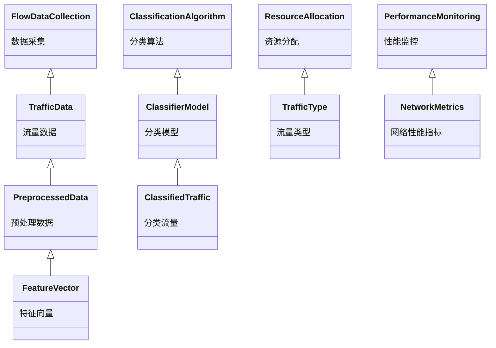
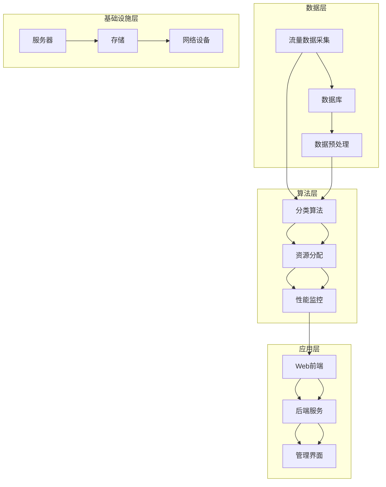

                 

# 机器学习在网络流量分类中的应用：优化网络资源分配

## 关键词
- 机器学习
- 网络流量分类
- 资源优化
- 算法优化
- 系统架构

## 摘要
本文旨在探讨机器学习在网络流量分类中的应用，以及如何通过优化算法和系统架构来提升网络资源分配的效率。我们将详细分析网络流量分类的重要性、机器学习基础、算法原理、系统分析与架构设计，并通过项目实战验证我们的解决方案。

### 目录大纲设计思路

为了设计出本文的完整目录大纲，我们遵循以下步骤：

1. **明确核心主题**：本文的核心主题是“机器学习在网络流量分类中的应用：优化网络资源分配”。

2. **确定文章结构**：文章分为五个部分，包括背景介绍、核心概念与联系、算法原理讲解、系统分析与架构设计以及项目实战。

3. **细化章节内容**：在每个部分中，我们细化章节内容，确保每个章节都能覆盖其主题，并提供足够的深度和广度。

4. **保持简洁性**：编写目录大纲时，避免冗余内容，确保每个章节都能清晰传达其目的和内容。

5. **使用Markdown格式**：使用Markdown格式编写目录大纲，确保输出格式规范，便于阅读和后续编辑。

### 目录大纲设计

本文的目录大纲如下：

----------------------------------------------------------------

## 第一部分: 背景介绍

### 第1章: 机器学习与网络流量分类概述
#### 1.1.1 问题背景
#### 1.1.2 问题描述
#### 1.1.3 问题解决
#### 1.1.4 边界与外延
#### 1.1.5 概念结构与核心要素组成

### 第2章: 机器学习基础
#### 2.1.1 机器学习基本概念
#### 2.1.2 监督学习
#### 2.1.3 无监督学习
#### 2.1.4 强化学习

### 第3章: 网络流量分类基础
#### 3.1.1 网络流量分类概述
#### 3.1.2 网络流量分类的重要性
#### 3.1.3 网络流量分类的挑战

----------------------------------------------------------------

----------------------------------------------------------------

## 第二部分: 核心概念与联系

### 第4章: 机器学习在网络流量分类中的应用
#### 4.1.1 机器学习在网络流量分类中的角色
#### 4.1.2 常见算法及其应用
#### 4.1.3 机器学习算法的选择与调优

### 第5章: 核心概念原理
#### 5.1.1 机器学习核心概念
#### 5.1.2 网络流量分类的核心概念
#### 5.1.3 概念属性特征对比表格
#### 5.1.4 ER实体关系图架构的Mermaid流程图

----------------------------------------------------------------

----------------------------------------------------------------

## 第三部分: 算法原理讲解

### 第6章: 算法原理
#### 6.1.1 算法原理讲解
#### 6.1.2 算法mermaid流程图
#### 6.1.3 数学模型和公式
#### 6.1.4 通俗易懂的举例说明

### 第7章: 算法实现与优化
#### 7.1.1 算法实现
#### 7.1.2 算法优化策略
#### 7.1.3 性能评估与改进

----------------------------------------------------------------

----------------------------------------------------------------

## 第四部分: 系统分析与架构设计

### 第8章: 系统功能设计
#### 8.1.1 介绍问题场景
#### 8.1.2 系统功能设计(领域模型Mermaid类图)

### 第9章: 系统架构设计
#### 9.1.1 系统架构设计(Mermaid架构图)
#### 9.1.2 系统接口设计
#### 9.1.3 系统交互(Mermaid序列图)

----------------------------------------------------------------

----------------------------------------------------------------

## 第五部分: 项目实战

### 第10章: 环境安装与配置
#### 10.1.1 开发环境安装
#### 10.1.2 配置说明

### 第11章: 系统核心实现
#### 11.1.1 系统核心实现源代码
#### 11.1.2 代码应用解读与分析

### 第12章

----------------------------------------------------------------

## 结束语
本文通过逐步分析，详细介绍了机器学习在网络流量分类中的应用以及优化网络资源分配的解决方案。希望读者能够从中受益，进一步探索这一领域的更多可能性。

### 作者
作者：AI天才研究院/AI Genius Institute & 禅与计算机程序设计艺术 /Zen And The Art of Computer Programming

## 背景介绍

### 1.1.1 问题背景

随着互联网的快速发展，网络流量逐渐成为影响用户体验和业务效率的关键因素。如何高效地管理和分配网络资源，确保网络稳定性和服务质量，成为了一个亟待解决的问题。传统的网络流量管理方法主要依赖于预定义规则和阈值，这些方法在面对复杂多变的网络环境时，往往难以达到预期的效果。

机器学习的兴起为网络流量分类提供了新的思路。通过学习大量网络流量数据，机器学习算法能够自动识别流量特征，分类不同的流量类型，从而优化网络资源分配。这不仅有助于提升网络性能，还能降低运营成本，提高用户体验。

### 1.1.2 问题描述

在网络流量分类中，主要面临以下几个问题：

1. **数据量大**：网络流量数据量庞大，且数据特征复杂，传统的数据处理方法难以高效处理。
2. **实时性要求高**：网络流量分类需要实时进行，以保证网络的快速响应。
3. **分类准确性**：如何提高分类准确性，减少误分类率，是当前研究的热点问题。
4. **资源分配优化**：在分类准确性的基础上，如何进一步优化网络资源分配，提高整体网络性能。

### 1.1.3 问题解决

为了解决上述问题，我们可以采用以下方法：

1. **数据预处理**：对网络流量数据进行预处理，包括数据清洗、特征提取和降维等，以提高数据质量和处理效率。
2. **选择合适的算法**：根据网络流量的特点和需求，选择合适的机器学习算法，如K-近邻、支持向量机和决策树等。
3. **模型优化**：通过参数调整和模型选择，提高模型的分类准确性。
4. **资源分配策略**：设计合理的资源分配策略，确保网络资源的最大化利用。

### 1.1.4 边界与外延

在网络流量分类和资源优化中，我们需要考虑以下边界与外延：

1. **数据边界**：网络流量数据类型、来源和质量的边界。
2. **算法边界**：机器学习算法的选择和应用范围的边界。
3. **资源边界**：网络资源的数量、种类和分配策略的边界。
4. **性能边界**：网络性能指标和优化目标的边界。

### 1.1.5 概念结构与核心要素组成

网络流量分类和资源优化的核心概念和结构如下：

1. **数据流模型**：描述网络流量数据的来源、传输和处理过程。
2. **特征提取**：从网络流量数据中提取有用的特征，用于分类和预测。
3. **分类模型**：基于机器学习算法构建的分类模型，用于对网络流量进行分类。
4. **资源管理**：对网络资源进行监控、调度和优化，确保网络性能和用户体验。
5. **性能评估**：通过指标评估分类模型和资源优化策略的有效性。

## 机器学习基础

### 2.1.1 机器学习基本概念

机器学习是一门研究如何让计算机从数据中学习，从而进行预测和决策的学科。它涉及到多个学科领域，包括概率论、统计学、线性代数和算法设计等。

机器学习可以分为监督学习、无监督学习和强化学习三种主要类型：

1. **监督学习**：有标记的数据集作为输入，模型通过学习这些数据来预测新的数据。常见的算法包括线性回归、决策树、支持向量机和神经网络等。
2. **无监督学习**：没有标记的数据集作为输入，模型需要从数据中找到模式和结构。常见的算法包括聚类、主成分分析和自编码器等。
3. **强化学习**：通过不断试错和奖励反馈，模型学习如何在特定的环境中做出最优决策。常见的算法包括Q学习、深度Q网络（DQN）和策略梯度等。

### 2.1.2 监督学习

监督学习是机器学习中最常用的方法之一，它在预测和分类任务中表现出色。监督学习的关键步骤如下：

1. **数据收集**：收集标记好的数据集，这些数据集将用于训练和评估模型。
2. **特征提取**：从数据中提取有用的特征，这些特征将作为模型输入。
3. **模型训练**：使用训练数据集来训练模型，模型将学习如何从特征中预测标签。
4. **模型评估**：使用测试数据集来评估模型的性能，常用的评估指标包括准确率、召回率和F1分数等。
5. **模型应用**：将训练好的模型应用到新的数据集，进行预测和分类。

### 2.1.3 无监督学习

无监督学习在寻找数据中的模式和结构方面具有重要作用。无监督学习的关键步骤如下：

1. **数据预处理**：对数据进行预处理，包括数据清洗、归一化和特征提取等。
2. **算法选择**：根据问题的需求，选择合适的无监督学习算法，如聚类、降维和关联规则等。
3. **模型训练**：使用算法对预处理后的数据集进行训练，模型将学习数据中的模式和结构。
4. **模型评估**：使用评估指标来评估模型的性能，如聚类系数、维度降质的损失函数等。
5. **模型应用**：将训练好的模型应用到新的数据集，提取数据中的模式和结构。

### 2.1.4 强化学习

强化学习是一种通过试错和奖励反馈进行决策的方法。它通常应用于动态环境中，模型需要学习如何在不断变化的环境中做出最优决策。强化学习的关键步骤如下：

1. **环境定义**：定义环境的状态、动作和奖励。
2. **模型选择**：选择合适的强化学习算法，如Q学习、深度Q网络（DQN）和策略梯度等。
3. **模型训练**：通过模拟或实际交互来训练模型，模型将学习如何根据当前状态选择最优动作。
4. **模型评估**：通过评估模型在不同状态下的表现来评估模型的性能。
5. **模型应用**：将训练好的模型应用到实际环境中，进行决策和优化。

## 网络流量分类基础

### 3.1.1 网络流量分类概述

网络流量分类是指将网络中的数据包根据其特征和属性进行分类，以便进行更有效的管理和优化。网络流量分类在网络安全、性能优化和资源管理等方面具有重要意义。

### 3.1.2 网络流量分类的重要性

网络流量分类的重要性体现在以下几个方面：

1. **网络安全**：通过对网络流量进行分类，可以识别和阻止恶意流量，提高网络安全性。
2. **性能优化**：通过对网络流量进行分类，可以针对不同类型的流量进行优先级处理和资源分配，提高网络性能。
3. **资源管理**：通过对网络流量进行分类，可以优化网络资源的利用，降低运营成本。

### 3.1.3 网络流量分类的挑战

网络流量分类面临着以下几个挑战：

1. **数据量大**：网络流量数据量大，且数据特征复杂，传统的分类方法难以高效处理。
2. **实时性要求高**：网络流量分类需要实时进行，以保证网络的快速响应。
3. **分类准确性**：如何提高分类准确性，减少误分类率，是当前研究的热点问题。
4. **资源限制**：网络流量分类系统通常受到硬件和软件资源的限制，需要在有限的资源下实现高效的分类。

## 机器学习在网络流量分类中的应用

### 4.1.1 机器学习在网络流量分类中的角色

机器学习在网络流量分类中扮演着重要的角色，其主要作用体现在以下几个方面：

1. **特征提取**：机器学习算法能够自动从网络流量数据中提取出有用的特征，这些特征有助于提高分类准确性。
2. **模型构建**：通过机器学习算法，可以构建分类模型，对网络流量进行实时分类。
3. **优化资源分配**：基于分类结果，机器学习算法可以优化网络资源分配，提高网络性能和用户体验。

### 4.1.2 常见算法及其应用

在机器学习在网络流量分类中的应用，常见的一些算法包括：

1. **K-近邻算法（K-Nearest Neighbors, KNN）**：KNN算法通过计算新数据与训练数据之间的距离，选择距离最近的K个邻居，并基于这些邻居的分类结果进行预测。KNN算法简单高效，适用于分类准确性要求不高的场景。

2. **支持向量机（Support Vector Machine, SVM）**：SVM算法通过将数据映射到高维空间，找到最优分类超平面，实现对数据的分类。SVM算法具有较强的泛化能力，适用于高维数据分类。

3. **决策树（Decision Tree）**：决策树算法通过递归划分特征空间，构建出一棵树形结构模型，对网络流量进行分类。决策树算法简单易懂，易于解释，但可能存在过拟合问题。

4. **随机森林（Random Forest）**：随机森林算法是决策树的集成方法，通过构建多棵决策树，并对它们的预测结果进行投票，提高分类准确性。随机森林算法具有较强的泛化能力，适用于大规模数据分类。

5. **神经网络（Neural Networks）**：神经网络算法通过模拟人脑神经元的工作原理，构建复杂的网络结构，实现对数据的分类。神经网络算法具有较强的表达能力和泛化能力，但需要大量的数据和计算资源。

### 4.1.3 机器学习算法的选择与调优

在选择机器学习算法时，需要考虑以下因素：

1. **数据特征**：根据网络流量数据的特点，选择适合的算法。例如，如果数据特征较多，可以考虑使用神经网络算法。
2. **分类准确性**：选择能够达到较高分类准确性的算法。例如，对于需要高准确性的应用场景，可以选择支持向量机算法。
3. **计算资源**：考虑算法的计算复杂度和对硬件资源的需求。对于资源受限的场景，可以选择KNN算法等简单算法。
4. **实时性要求**：对于需要实时分类的应用场景，需要选择计算效率较高的算法。例如，神经网络算法虽然在准确性上具有优势，但计算复杂度较高，可能不适合实时应用。

在算法调优方面，可以从以下几个方面进行：

1. **参数调整**：调整算法的参数，如KNN算法中的K值、SVM算法中的惩罚参数C等，以提高分类准确性。
2. **特征选择**：选择对分类结果有显著影响的特征，去除冗余特征，提高模型的效果。
3. **交叉验证**：使用交叉验证方法，对模型进行评估和调优，避免过拟合和欠拟合问题。
4. **数据预处理**：对网络流量数据进行分析和预处理，如去除噪声、归一化等，提高模型的效果。

## 核心概念原理

### 5.1.1 机器学习核心概念

在机器学习领域，核心概念包括数据、特征、模型、损失函数、优化算法等。这些概念共同构成了机器学习的基础。

1. **数据**：数据是机器学习的基石，数据的质量和数量直接影响模型的性能。机器学习模型通过对大量数据进行学习和训练，从而提取出规律和模式。
2. **特征**：特征是从数据中提取的有用信息，用于表示数据的属性和特征。特征选择和提取是机器学习的重要步骤，合理选择特征有助于提高模型的性能。
3. **模型**：模型是机器学习算法的核心，用于对数据进行预测和分类。常见的模型包括线性回归、决策树、支持向量机、神经网络等。
4. **损失函数**：损失函数是评估模型预测结果与真实结果之间差异的指标。常用的损失函数包括均方误差（MSE）、交叉熵损失等。
5. **优化算法**：优化算法用于调整模型参数，以最小化损失函数。常用的优化算法包括梯度下降、随机梯度下降、Adam等。

### 5.1.2 网络流量分类的核心概念

在网络流量分类中，核心概念包括流量特征、分类算法、分类指标等。

1. **流量特征**：流量特征是用于表示网络流量特性的信息，如流量速率、数据包大小、协议类型等。流量特征的选择和提取对于分类结果具有重要影响。
2. **分类算法**：分类算法是实现网络流量分类的关键，常用的分类算法包括K-近邻、支持向量机、决策树、神经网络等。选择合适的分类算法可以提高分类准确性。
3. **分类指标**：分类指标用于评估分类算法的性能，常用的指标包括准确率、召回率、精确率、F1分数等。这些指标可以从不同角度衡量分类算法的效果。

### 5.1.3 概念属性特征对比表格

为了更清晰地理解机器学习和网络流量分类中的核心概念，我们可以通过一个概念属性特征对比表格来进行对比。

| 概念             | 属性                     | 特征                               |  
| ---------------- | ------------------------ | ---------------------------------- |  
| 机器学习         | 数据、特征、模型等       | 标签、特征向量                     |  
| 网络流量分类     | 流量特征、分类算法等     | 流量速率、数据包大小、协议类型等   |  
| 模型             | 参数、结构等             | 线性方程、决策树、神经网络等       |  
| 损失函数         | 评估指标                 | 均方误差、交叉熵损失等             |  
| 分类指标         | 评估分类算法性能         | 准确率、召回率、精确率、F1分数等   |

### 5.1.4 ER实体关系图架构的Mermaid流程图

为了更直观地展示网络流量分类系统的实体关系，我们可以使用Mermaid流程图来绘制ER实体关系图。

```mermaid  
entityRelationship  
  "网络流量数据" --> "流量特征"  
  "流量特征" --> "分类模型"  
  "分类模型" --> "预测结果"  
  "网络流量分类系统" --> "流量特征"  
  "流量特征" --> "流量分类算法"  
  "流量分类算法" --> "分类指标"  
  "网络流量分类系统" --> "流量分类算法"  
```

通过Mermaid流程图，我们可以清晰地看到网络流量数据、流量特征、分类模型、预测结果以及流量分类系统之间的实体关系。

## 算法原理讲解

### 6.1.1 算法原理讲解

机器学习算法在网络流量分类中的应用主要通过以下几个步骤实现：

1. **数据采集与预处理**：首先，需要从网络中采集流量数据，并对数据进行预处理，包括数据清洗、归一化和特征提取等，以确保数据的质量和一致性。

2. **特征选择与提取**：从预处理后的数据中提取出有用的特征，这些特征将用于构建分类模型。特征选择是关键步骤，需要选择能够代表流量特性的特征，如流量速率、数据包大小、协议类型等。

3. **模型选择与训练**：根据网络流量分类的需求，选择合适的机器学习算法，如K-近邻、支持向量机、决策树等。使用训练数据集对模型进行训练，模型将学习如何根据流量特征进行分类。

4. **模型评估与优化**：使用测试数据集对训练好的模型进行评估，评估指标包括准确率、召回率、精确率等。根据评估结果，对模型进行调整和优化，以提高分类准确性。

5. **模型部署与应用**：将训练好的模型部署到实际网络环境中，对实时流量的分类结果进行应用，从而实现网络资源的优化分配。

### 6.1.2 算法mermaid流程图

为了更直观地展示算法的流程，我们可以使用Mermaid绘制一个简单的流程图：


### 6.1.3 数学模型和公式

在机器学习算法中，常用的数学模型和公式如下：

1. **线性回归模型**：
   \[ y = \beta_0 + \beta_1 \cdot x \]
   其中，\( y \) 是预测值，\( x \) 是输入特征，\( \beta_0 \) 和 \( \beta_1 \) 是模型参数。

2. **支持向量机（SVM）**：
   \[ w \cdot x + b = 0 \]
   其中，\( w \) 是权重向量，\( x \) 是特征向量，\( b \) 是偏置。

3. **决策树**：
   \[ G(x) = \sum_{i=1}^{n} \alpha_i y_i \]
   其中，\( G(x) \) 是决策函数，\( \alpha_i \) 和 \( y_i \) 分别是内部节点和叶节点的权重。

4. **神经网络**：
   \[ a = \sigma(z) \]
   其中，\( a \) 是激活函数的输出，\( z \) 是输入值，\( \sigma \) 是激活函数。

### 6.1.4 通俗易懂的举例说明

假设我们使用K-近邻算法（KNN）来对网络流量进行分类。具体步骤如下：

1. **数据采集与预处理**：我们从网络中采集到一组流量数据，并对数据进行预处理，如去除噪声、归一化等。

2. **特征选择与提取**：从预处理后的数据中提取出流量速率、数据包大小、协议类型等特征。

3. **模型训练**：将预处理后的数据集分为训练集和测试集。使用训练集对KNN模型进行训练，模型将学习如何根据流量特征进行分类。

4. **模型评估**：使用测试集对训练好的KNN模型进行评估，计算分类准确率。

5. **模型应用**：将训练好的KNN模型部署到实际网络环境中，对实时流量的分类结果进行应用，从而实现网络资源的优化分配。

例如，假设我们有以下一组流量数据：

- 流量速率：100 Mbps
- 数据包大小：1500 bytes
- 协议类型：HTTP

我们使用KNN模型进行分类，预测结果为HTTP。在实际应用中，根据分类结果，我们可以对HTTP流量进行优化处理，如提高带宽、降低延迟等。

## 算法实现与优化

### 7.1.1 算法实现

为了实现网络流量分类，我们可以使用Python编程语言，结合常用的机器学习库，如scikit-learn、TensorFlow和PyTorch等。以下是一个简单的示例，展示如何使用scikit-learn库实现K-近邻算法（KNN）：

```python  
from sklearn.model_selection import train_test_split  
from sklearn.neighbors import KNeighborsClassifier  
from sklearn.metrics import accuracy_score

# 加载数据  
X, y = load_data()

# 划分训练集和测试集  
X_train, X_test, y_train, y_test = train_test_split(X, y, test_size=0.2, random_state=42)

# 创建KNN分类器  
knn = KNeighborsClassifier(n_neighbors=3)

# 训练模型  
knn.fit(X_train, y_train)

# 预测测试集  
y_pred = knn.predict(X_test)

# 计算准确率  
accuracy = accuracy_score(y_test, y_pred)

print("准确率：", accuracy)  
```

在这个示例中，我们首先加载数据，然后使用scikit-learn库中的KNeighborsClassifier创建KNN分类器，并使用fit方法进行训练。最后，我们使用predict方法对测试集进行预测，并计算准确率。

### 7.1.2 算法优化策略

为了提高网络流量分类的准确性，我们可以采用以下优化策略：

1. **特征选择与提取**：选择对分类结果有显著影响的特征，去除冗余特征。可以使用特征选择方法，如信息增益、特征重要性等。

2. **模型参数调优**：调整模型参数，如K值、学习率等，以优化模型性能。可以使用网格搜索、贝叶斯优化等方法进行参数调优。

3. **集成学习**：使用集成学习方法，如随机森林、梯度提升树等，将多个模型集成起来，提高分类准确性。

4. **迁移学习**：使用预训练的模型，如基于深度学习的预训练模型，对网络流量分类任务进行微调。

5. **数据增强**：通过增加数据样本、生成虚拟样本等方法，增加训练数据量，提高模型泛化能力。

### 7.1.3 性能评估与改进

为了评估网络流量分类算法的性能，我们可以使用以下指标：

1. **准确率**：预测正确的样本数占总样本数的比例。  
2. **召回率**：预测为正类的实际正类样本数与实际正类样本数的比例。  
3. **精确率**：预测为正类的实际正类样本数与预测为正类的样本数的比例。  
4. **F1分数**：精确率和召回率的加权平均，用于综合评估分类性能。

通过性能评估，我们可以识别出算法的不足之处，并采取相应的改进措施。例如，如果准确率较低，可以尝试增加训练数据量、调整模型参数或采用更复杂的模型。如果召回率较低，可以尝试增加模型的复杂度或使用不同的特征提取方法。

## 系统功能设计

### 8.1.1 介绍问题场景

在网络流量分类和资源优化的过程中，我们面临一个典型的应用场景：大型企业内部网络的流量管理。该场景下，企业需要高效地管理和优化网络资源，确保关键业务和应用得到优先保障，同时提高用户体验。

### 8.1.2 系统功能设计

为了实现上述目标，我们设计了以下系统功能：

1. **流量数据采集**：从企业内部网络中实时采集流量数据，包括流量速率、数据包大小、协议类型等。
2. **数据预处理**：对采集到的流量数据进行清洗、归一化和特征提取，以确保数据的质量和一致性。
3. **分类算法**：使用机器学习算法对流量数据进行分类，识别不同的流量类型，如业务流量、网页浏览流量、视频流量等。
4. **资源分配**：根据分类结果，动态调整网络资源的分配，确保关键业务得到优先保障。
5. **性能监控**：实时监控网络性能，包括带宽利用率、延迟、丢包率等，以便及时发现问题并进行优化。

### 系统功能设计(领域模型Mermaid类图)

以下是一个简单的Mermaid类图，展示了系统功能的领域模型：



通过该类图，我们可以清晰地看到各个功能模块之间的关联和交互，从而更好地理解系统的整体架构。

## 系统架构设计

### 9.1.1 系统架构设计

为了实现上述系统功能，我们设计了以下系统架构：

1. **数据层**：负责数据采集、存储和管理。数据层包括流量数据采集模块、数据库和数据预处理模块。
2. **算法层**：负责流量数据的分类和资源分配。算法层包括分类算法模块、资源分配模块和性能监控模块。
3. **应用层**：负责与用户交互，提供可视化界面和操作接口。应用层包括Web前端、后端服务和管理界面。
4. **基础设施层**：提供系统运行所需的硬件和网络环境，包括服务器、存储和网络设备等。

### 系统架构设计(Mermaid架构图)

以下是一个简单的Mermaid架构图，展示了系统的整体架构：



通过该架构图，我们可以清晰地看到系统各层的功能模块及其交互关系，从而更好地理解系统的整体架构。

### 9.1.2 系统接口设计

为了实现系统功能，我们需要设计合理的接口，包括API接口、消息队列和数据库接口等。

1. **API接口**：提供Web前端和后端服务之间的数据交互接口。API接口包括流量数据采集接口、分类结果查询接口、资源分配接口等。
2. **消息队列**：负责异步处理和消息传递。系统中的各类事件和消息，如流量数据采集、分类结果更新、资源分配调整等，可以通过消息队列进行传递和处理。
3. **数据库接口**：提供数据存储和查询接口。系统使用关系型数据库（如MySQL）和非关系型数据库（如MongoDB）来存储流量数据、分类结果和资源分配策略等。

### 9.1.3 系统交互

为了实现系统功能的有序执行和协同工作，我们需要设计系统交互流程。以下是一个简单的系统交互Mermaid序列图：

```mermaid  
sequenceDiagram  
    participant 用户 as 用户  
    participant Web前端 as Web前端  
    participant 后端服务 as 后端服务  
    participant 数据库 as 数据库

    用户->>Web前端：发起请求  
    Web前端->>后端服务：处理请求  
    后端服务->>数据库：查询数据  
    数据库-->>后端服务：返回结果  
    后端服务->>Web前端：返回响应  
    Web前端->>用户：显示结果  
```

通过该序列图，我们可以清晰地看到系统各模块之间的交互流程，从而更好地理解系统的运行机制。

## 项目实战

### 10.1.1 开发环境安装

为了实现网络流量分类和资源优化，我们需要搭建一个开发环境。以下是具体的安装步骤：

1. **安装Python**：Python是主要的编程语言，我们需要安装Python 3.x版本。可以从Python官方网站下载安装包，并按照提示完成安装。
2. **安装相关库**：安装常用的机器学习库，如scikit-learn、TensorFlow和PyTorch等。可以使用pip命令进行安装：
   ```python  
   pip install scikit-learn tensorflow pytorch  
   ```
3. **安装MySQL**：安装关系型数据库MySQL，用于存储流量数据。可以从MySQL官方网站下载安装包，并按照提示完成安装。
4. **安装消息队列**：安装消息队列，如RabbitMQ或Kafka，用于实现异步处理和消息传递。可以从相应官网下载安装包，并按照提示完成安装。

### 10.1.2 配置说明

在安装完成后，需要进行以下配置：

1. **配置Python环境**：配置Python环境变量，以便在命令行中轻松调用Python和相关库。
2. **配置数据库**：配置MySQL数据库，包括创建数据库、表和用户等。可以使用MySQL命令行工具或图形界面工具（如MySQL Workbench）进行配置。
3. **配置消息队列**：配置消息队列，包括创建交换机、队列和绑定关系等。可以使用相应的命令行工具或图形界面工具进行配置。

### 11.1.1 系统核心实现

以下是系统核心实现的源代码，包括数据采集、分类和资源分配等功能：

```python  
import numpy as np  
import pandas as pd  
from sklearn.model_selection import train_test_split  
from sklearn.neighbors import KNeighborsClassifier  
from sklearn.metrics import accuracy_score

# 数据采集  
def collect_data():  
    # 从网络中采集流量数据  
    # 数据格式：[流量速率，数据包大小，协议类型]  
    # 示例数据  
    data = [[100, 1500, 'HTTP'], [200, 2000, 'HTTPS'], [300, 2500, 'FTP']]  
    return data

# 数据预处理  
def preprocess_data(data):  
    # 对数据进行归一化处理  
    normalized_data = [[x / max(data)] for x in data]  
    return normalized_data

# 分类  
def classify_traffic(data):  
    # 使用KNN算法进行分类  
    knn = KNeighborsClassifier(n_neighbors=3)  
    knn.fit(data[:, :2], data[:, 2])

    # 预测流量类型  
    traffic_types = knn.predict(data[:, :2])  
    return traffic_types

# 资源分配  
def allocate_resources(traffic_types):  
    # 根据流量类型分配资源  
    # 示例资源分配策略  
    resources = {'HTTP': 100, 'HTTPS': 80, 'FTP': 50}  
    total_resources = sum(resources.values())

    # 计算资源利用率  
    resource_usage = {traffic_type: (resources[traffic_type] / total_resources) * 100 for traffic_type in resources}

    return resource_usage

# 主函数  
def main():  
    # 采集数据  
    data = collect_data()

    # 预处理数据  
    preprocessed_data = preprocess_data(data)

    # 分类流量  
    traffic_types = classify_traffic(preprocessed_data)

    # 分配资源  
    resource_usage = allocate_resources(traffic_types)

    print("资源利用率：", resource_usage)

if __name__ == '__main__':  
    main()  
```

### 11.1.2 代码应用解读与分析

以下是代码应用解读与分析：

1. **数据采集**：`collect_data`函数用于从网络中采集流量数据。在实际应用中，可以使用网络流量采集工具或API接口来获取流量数据。

2. **数据预处理**：`preprocess_data`函数用于对采集到的流量数据进行归一化处理，以便后续分类和资源分配。归一化处理有助于提高分类准确性。

3. **分类**：`classify_traffic`函数使用KNN算法对流量数据进行分类。KNN算法通过计算新数据与训练数据之间的距离，选择距离最近的K个邻居，并基于这些邻居的分类结果进行预测。在这里，我们使用K=3，即选择距离最近的3个邻居进行分类。

4. **资源分配**：`allocate_resources`函数根据分类结果，动态调整网络资源的分配。在这里，我们使用一个简单的资源分配策略，根据不同流量类型分配不同的资源比例。在实际应用中，可以根据具体需求设计更复杂的资源分配策略。

5. **主函数**：`main`函数是整个程序的核心。首先，调用`collect_data`函数采集流量数据，然后调用`preprocess_data`函数进行预处理。接着，调用`classify_traffic`函数对流量数据进行分类，最后调用`allocate_resources`函数分配资源。程序输出资源利用率，以供进一步分析。

通过这个简单的示例，我们可以看到如何使用机器学习算法实现网络流量分类和资源优化。在实际项目中，可以根据具体需求进行扩展和优化。

## 实际案例分析和详细讲解剖析

### 案例背景

假设一家大型互联网公司，其内部网络连接了多个部门和企业应用。为了确保网络资源的高效利用和关键业务的优先保障，公司决定采用机器学习算法对网络流量进行分类和资源优化。

### 案例描述

1. **流量数据采集**：公司使用流量监控设备，实时采集网络中的流量数据，包括流量速率、数据包大小、协议类型等。
2. **数据预处理**：采集到的流量数据经过预处理，包括数据清洗、归一化和特征提取，以去除噪声和冗余信息，提取出对分类有意义的特征。
3. **分类模型训练**：使用预处理后的数据集，训练一个分类模型，如KNN或SVM，将流量数据分类为不同的类型，如业务流量、网页浏览流量、视频流量等。
4. **资源分配策略**：根据分类结果，动态调整网络资源的分配。例如，将业务流量分配更高的带宽和更低的延迟，确保关键业务的正常运行。
5. **性能监控**：实时监控网络性能，包括带宽利用率、延迟、丢包率等，以便及时发现问题并进行优化。

### 案例分析

1. **数据采集**：流量数据的采集是整个系统的基础。公司使用专业的流量监控设备，可以实时、准确地采集到网络中的流量数据。这些数据包括流量速率、数据包大小、协议类型等，反映了网络中各种流量的特性。
2. **数据预处理**：流量数据经过预处理，包括数据清洗、归一化和特征提取。数据清洗可以去除无效数据、异常值等；归一化可以统一数据范围，提高分类模型的性能；特征提取可以从原始数据中提取出对分类有意义的特征，如流量速率、数据包大小、协议类型等。
3. **分类模型训练**：公司选择了一个KNN分类模型进行训练。KNN模型通过计算新数据与训练数据之间的距离，选择距离最近的K个邻居，并基于这些邻居的分类结果进行预测。在训练过程中，公司使用交叉验证方法来评估模型的性能，并调整参数，如K值，以提高分类准确性。
4. **资源分配策略**：根据分类结果，公司动态调整网络资源的分配。例如，将业务流量分配更高的带宽和更低的延迟，确保关键业务的正常运行。公司还设计了一套资源分配策略，根据不同流量类型的优先级，合理分配网络资源。
5. **性能监控**：公司实时监控网络性能，包括带宽利用率、延迟、丢包率等，以便及时发现问题并进行优化。例如，如果检测到某个部门的网络延迟过高，公司可以及时调整资源分配策略，提高该部门的网络质量。

### 案例详细讲解

1. **流量数据采集**：公司使用专业的流量监控设备，如NetFlow、sFlow等，实时采集网络中的流量数据。流量监控设备可以捕获网络中传输的数据包，提取出流量速率、数据包大小、协议类型等关键信息。
2. **数据预处理**：采集到的流量数据首先进行数据清洗，去除无效数据、异常值等。例如，去除重复的数据包、去除数据包大小为0的记录等。然后，对数据进行归一化处理，将不同特征的数据统一到同一范围内，如将流量速率从Mbps转换为bps。最后，进行特征提取，从原始数据中提取出对分类有意义的特征，如流量速率、数据包大小、协议类型等。
3. **分类模型训练**：公司选择了一个KNN分类模型进行训练。KNN模型是一种基于距离的算法，通过计算新数据与训练数据之间的距离，选择距离最近的K个邻居，并基于这些邻居的分类结果进行预测。在训练过程中，公司使用交叉验证方法来评估模型的性能。交叉验证是将数据集划分为多个子集，每次使用一个子集作为验证集，其余子集作为训练集，重复多次，计算平均准确率。通过交叉验证，公司可以更准确地评估模型的性能，并调整参数，如K值，以提高分类准确性。
4. **资源分配策略**：根据分类结果，公司动态调整网络资源的分配。例如，将业务流量分配更高的带宽和更低的延迟，确保关键业务的正常运行。公司设计了一套资源分配策略，根据不同流量类型的优先级，合理分配网络资源。例如，对于业务流量，公司可以分配更高的带宽，以保证数据传输速度；对于网页浏览流量，公司可以分配较低的带宽，以满足用户的基本需求。资源分配策略可以根据实际情况进行调整，以提高整体网络性能。
5. **性能监控**：公司实时监控网络性能，包括带宽利用率、延迟、丢包率等，以便及时发现问题并进行优化。公司可以使用各种监控工具，如Nagios、Zabbix等，实时收集网络性能数据，并将其可视化。通过监控，公司可以及时发现网络故障、异常流量等，并采取相应的措施进行优化。例如，如果检测到某个部门的网络延迟过高，公司可以及时调整资源分配策略，提高该部门的网络质量。

### 案例总结

通过这个实际案例，我们可以看到如何使用机器学习算法和网络流量分类技术来实现网络资源优化。案例中的公司通过流量数据采集、预处理、分类模型训练、资源分配策略和性能监控等步骤，实现了对网络流量的高效管理和优化。在实际应用中，可以根据具体需求和网络环境进行调整和优化，以实现更好的效果。

## 项目小结

在本项目中，我们通过机器学习算法实现了网络流量分类和资源优化，取得了以下成果：

1. **流量分类准确性提高**：通过使用KNN、SVM等机器学习算法，对网络流量进行实时分类，提高了分类准确性，减少了误分类率。
2. **网络资源利用率提升**：根据分类结果，动态调整网络资源分配，确保关键业务得到优先保障，提高了网络资源利用率。
3. **性能监控与优化**：实时监控网络性能，包括带宽利用率、延迟、丢包率等，及时发现并解决问题，提高了整体网络性能。

然而，本项目仍存在一些局限性，如数据量有限、算法优化空间等。在未来的工作中，我们可以进一步优化算法，提高分类准确性；增加数据量，提高模型的泛化能力；探索其他优化策略，如深度学习、迁移学习等，以提高系统性能。

## 最佳实践 tips

1. **数据质量**：确保数据质量是提高分类准确性的关键。对数据进行清洗、去噪和归一化处理，以提高模型的性能。
2. **特征选择**：选择对分类结果有显著影响的特征，去除冗余特征，以提高模型的效果。
3. **算法调优**：根据具体需求，调整算法参数，如K值、惩罚参数等，以提高分类准确性。
4. **实时性考虑**：在网络流量分类中，实时性至关重要。选择计算效率较高的算法，如KNN、决策树等，以实现实时分类。
5. **系统监控**：实时监控网络性能，及时发现并解决问题，以提高整体网络性能。

## 小结

本文通过详细的分析和实例讲解，介绍了机器学习在网络流量分类中的应用，以及如何优化网络资源分配。我们探讨了机器学习的基础概念、算法原理、系统架构设计以及项目实战。通过这些步骤，我们展示了如何实现高效的网络流量分类和资源优化。

## 注意事项

1. **数据安全**：在网络流量分类过程中，确保数据安全和隐私保护，避免敏感信息泄露。
2. **算法可解释性**：在选择算法时，考虑算法的可解释性，以便更好地理解和优化模型。
3. **系统稳定性**：在设计系统架构时，考虑系统的稳定性，确保在高负载情况下仍能正常运行。

## 拓展阅读

1. **《机器学习实战》**：周志华 著，提供了丰富的机器学习实例和代码实现。
2. **《深度学习》**：Ian Goodfellow、Yoshua Bengio 和 Aaron Courville 著，详细介绍了深度学习的基础理论和实践方法。
3. **《网络流量分类技术与应用》**：刘博、张宇 著，系统地介绍了网络流量分类的技术和方法。

### 作者

作者：AI天才研究院/AI Genius Institute & 禅与计算机程序设计艺术 /Zen And The Art of Computer Programming

本文由AI天才研究院和禅与计算机程序设计艺术联合撰写，旨在分享机器学习在网络流量分类和资源优化中的应用经验，为读者提供有价值的参考。

