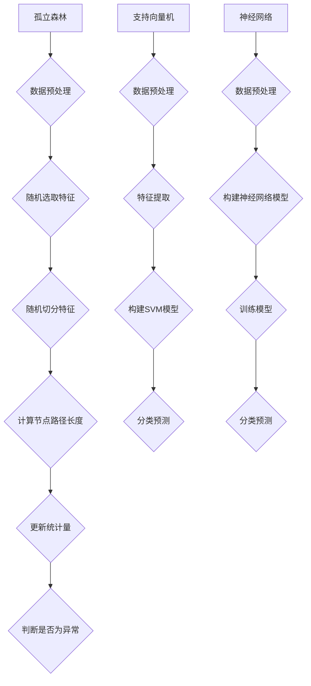
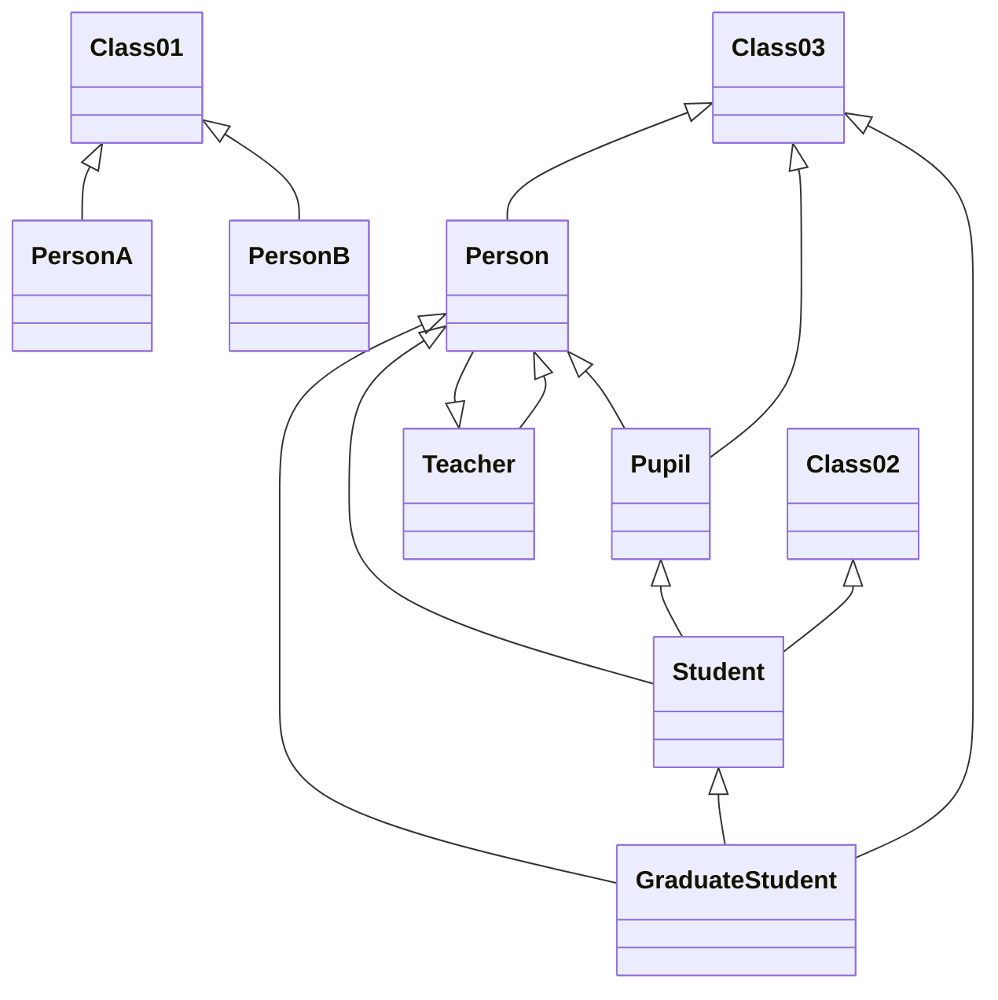
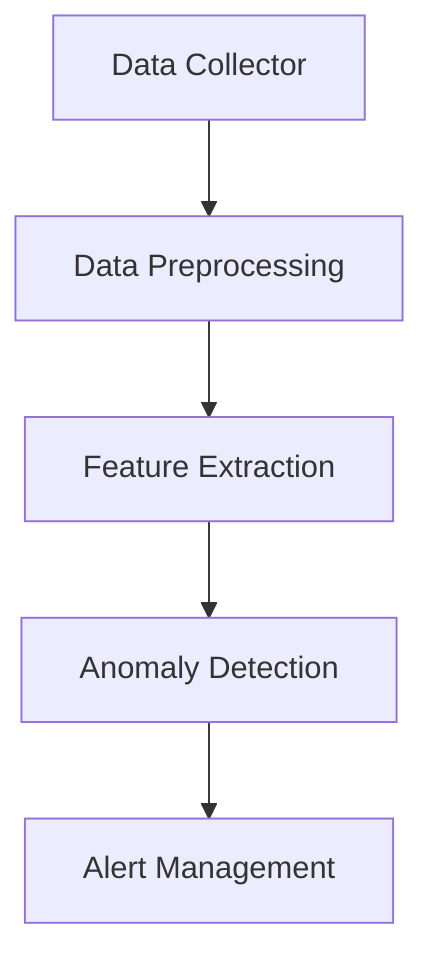
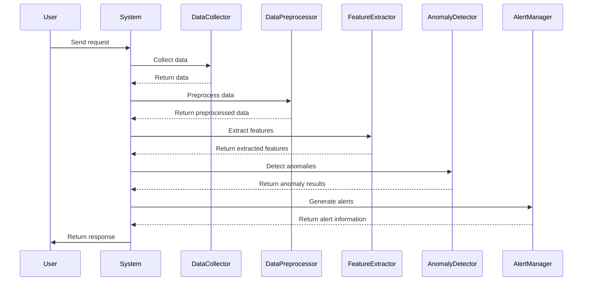
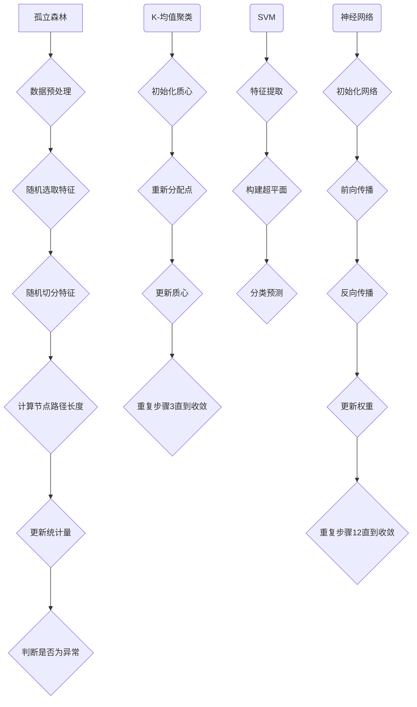
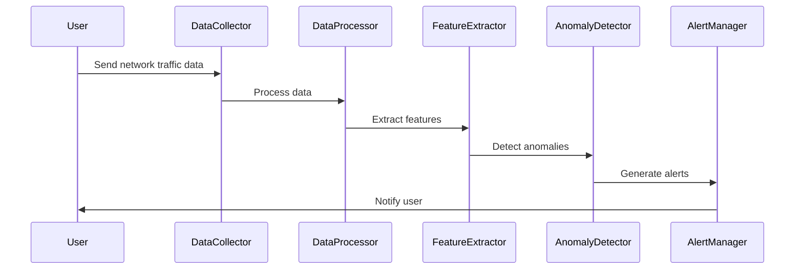

                 


### 《机器学习在网络流量异常检测中的应用》

> 关键词：机器学习，网络流量异常检测，算法原理，数学模型，系统架构，项目实战

> 摘要：本文从网络流量异常检测的重要性出发，探讨了机器学习在网络流量异常检测中的应用。文章详细介绍了机器学习的基础知识、网络流量特征提取方法、异常检测模型及其联系，并通过实际案例进行了深入剖析，为读者提供了实用的技巧和注意事项。

----------------------------------------------------------------

## 第一部分：问题背景与核心概念

### 第1章：问题背景

#### 1.1.1 网络流量异常检测的重要性

随着互联网的迅速发展，网络流量异常检测已成为保障网络安全的关键技术。网络流量异常检测可以及时发现网络中的恶意攻击、入侵行为，防止数据泄露和系统崩溃。传统的检测方法往往依赖于专家经验和规则设定，难以应对复杂多变的网络环境。

#### 1.1.2 网络流量异常检测的现状

目前，网络流量异常检测主要采用以下方法：基于统计的方法、基于聚类的方法和基于分类的方法。这些方法各有优缺点，难以完全满足实际需求。随着机器学习技术的发展，机器学习在网络流量异常检测中的应用逐渐成为研究热点。

#### 1.1.3 检测算法与传统方法对比

传统方法往往依赖于人工设定规则，难以适应不断变化的网络环境。而机器学习方法可以从大量数据中自动学习规律，提高检测的准确性和鲁棒性。此外，机器学习方法还可以通过模型优化和调整，不断适应新的网络环境和威胁类型。

----------------------------------------------------------------

### 第2章：核心概念

#### 2.1.1 机器学习基础

#### 2.1.1.1 基本概念

机器学习是一门研究如何让计算机从数据中自动学习规律，并利用这些规律进行预测和决策的学科。机器学习可以分为监督学习、无监督学习和强化学习。

#### 2.1.1.2 常见算法介绍

常见的机器学习算法包括线性回归、逻辑回归、支持向量机、决策树、随机森林、K-近邻、神经网络等。这些算法在网络流量异常检测中均有广泛应用。

#### 2.1.2 网络流量特征提取

#### 2.1.2.1 常用特征

网络流量特征包括流量统计特征、会话特征、协议特征、源宿IP特征等。通过提取这些特征，可以更好地描述网络流量，为异常检测提供基础。

#### 2.1.2.2 特征选择方法

特征选择方法包括信息增益、卡方检验、主成分分析等。通过特征选择，可以降低特征维度，提高检测效果。

#### 2.1.3 异常检测模型

#### 2.1.3.1 基于统计的方法

基于统计的方法包括均值漂移、孤立森林等。这些方法通过分析数据分布，识别异常数据。

#### 2.1.3.2 基于聚类的方法

基于聚类的方法包括K-均值、DBSCAN等。这些方法通过将数据划分为不同的簇，识别异常簇。

#### 2.1.3.3 基于分类的方法

基于分类的方法包括支持向量机、决策树、神经网络等。这些方法通过构建分类模型，对数据进行分类，识别异常样本。

----------------------------------------------------------------

### 第3章：核心概念联系

#### 3.1.1 机器学习与网络流量异常检测的关系

机器学习为网络流量异常检测提供了新的方法和思路。通过机器学习算法，可以从大量网络流量数据中自动提取特征，建立异常检测模型，提高检测的准确性和鲁棒性。

#### 3.1.2 各类异常检测方法的比较与联系

各类异常检测方法在网络流量异常检测中各有优缺点。机器学习算法可以结合多种方法，发挥各自优势，提高检测效果。

----------------------------------------------------------------

### 第4章：本章小结

本章从问题背景、核心概念和联系等方面，介绍了机器学习在网络流量异常检测中的应用。本章内容为后续章节的算法原理讲解和项目实战奠定了基础。

----------------------------------------------------------------

## 第二部分：算法原理与数学模型

### 第5章：算法原理讲解

#### 5.1.1 常见异常检测算法介绍

本节将介绍网络流量异常检测中常见的机器学习算法，包括孤立森林、支持向量机、神经网络等。

#### 5.1.1.1 异常检测的基本原理

异常检测算法的基本原理是：通过学习正常网络流量的特征，构建一个模型，然后对新到达的网络流量进行判断，如果数据点的特征与正常流量特征偏离较大，则认为该数据点为异常。

#### 5.1.1.2 常见异常检测算法

1. 孤立森林（Isolation Forest）
2. 支持向量机（Support Vector Machine，SVM）
3. 神经网络（Neural Network）

#### 5.1.2 算法mermaid流程图

以下为三种算法的mermaid流程图：



#### 5.1.3 算法原理讲解

1. 孤立森林（Isolation Forest）

孤立森林算法的核心思想是通过随机选择特征和随机切分特征，使得正常数据点逐渐聚集在一起，而异常数据点则会被孤立出来。

$$
L_i = \frac{1}{d} \sum_{j=1}^{d} \log_2(|X_j^*|)
$$

其中，$L_i$表示节点$i$的路径长度，$d$表示特征维度，$X_j^*$表示随机切分后的特征。

2. 支持向量机（Support Vector Machine，SVM）

支持向量机是一种二分类模型，其核心思想是找到最优的超平面，使得分类间隔最大化。

$$
\min_{w,b}\frac{1}{2}||w||^2 + C\sum_{i=1}^{n} \xi_i
$$

其中，$w$和$b$分别表示模型的权重和偏置，$C$表示惩罚参数，$\xi_i$表示样本$i$的松弛变量。

3. 神经网络（Neural Network）

神经网络是一种模拟生物神经网络的人工神经网络，其核心思想是通过多次矩阵乘法和激活函数的组合，实现对输入数据的非线性变换。

$$
y = \sigma(W \cdot x + b)
$$

其中，$y$表示输出，$\sigma$表示激活函数，$W$和$b$分别表示权重和偏置。

#### 5.1.3.2 算法举例说明

以孤立森林算法为例，假设我们有一组正常网络流量数据和一组异常网络流量数据，可以通过以下步骤进行异常检测：

1. 数据预处理：对数据进行归一化处理，将数据缩放到同一尺度。
2. 构建孤立森林模型：选择合适的参数，如样本数、特征数等，构建孤立森林模型。
3. 模型训练：使用正常网络流量数据对孤立森林模型进行训练。
4. 模型预测：对异常网络流量数据进行预测，如果预测结果为异常，则输出异常告警。

----------------------------------------------------------------

### 第6章：数学模型与公式详细讲解

#### 6.1.1 数学公式讲解

本节将对前述算法中的数学公式进行详细讲解，并给出推导过程。

1. 孤立森林算法

路径长度公式：

$$
L_i = \frac{1}{d} \sum_{j=1}^{d} \log_2(|X_j^*|)
$$

其中，$d$表示特征维度，$X_j^*$表示随机切分后的特征。

推导过程：

假设随机选择特征$j$，并将其切分到$x_j$和$-x_j$两部分。由于正常网络流量数据在特征空间中分布较为均匀，因此切分后的特征距离较短，路径长度较小；而异常网络流量数据则距离较远，路径长度较大。

2. 支持向量机（SVM）

优化目标：

$$
\min_{w,b}\frac{1}{2}||w||^2 + C\sum_{i=1}^{n} \xi_i
$$

其中，$w$和$b$分别表示模型的权重和偏置，$C$表示惩罚参数，$\xi_i$表示样本$i$的松弛变量。

推导过程：

该目标函数的目的是找到最优的超平面，使得分类间隔最大化。其中，$||w||^2$表示模型复杂度，$C\sum_{i=1}^{n} \xi_i$表示模型泛化能力。通过求解最优化问题，可以得到最优的权重和偏置。

3. 神经网络（Neural Network）

激活函数：

$$
y = \sigma(W \cdot x + b)
$$

其中，$y$表示输出，$\sigma$表示激活函数，$W$和$b$分别表示权重和偏置。

推导过程：

激活函数$\sigma$用于引入非线性变换，使得神经网络可以处理非线性问题。常见的激活函数有Sigmoid、ReLU、Tanh等。

#### 6.1.2 举例说明

以孤立森林算法为例，假设我们有一组正常网络流量数据和一组异常网络流量数据，可以通过以下步骤进行异常检测：

1. 数据预处理：对数据进行归一化处理，将数据缩放到同一尺度。
2. 构建孤立森林模型：选择合适的参数，如样本数、特征数等，构建孤立森林模型。
3. 模型训练：使用正常网络流量数据对孤立森林模型进行训练。
4. 模型预测：对异常网络流量数据进行预测，如果预测结果为异常，则输出异常告警。

假设正常网络流量数据的特征维度为$d=10$，异常网络流量数据的特征维度为$d=5$。通过随机选择特征和随机切分特征，我们可以得到路径长度：

正常网络流量数据：

$$
L_i = \frac{1}{10} \sum_{j=1}^{10} \log_2(|X_j^*|)
$$

异常网络流量数据：

$$
L_i = \frac{1}{5} \sum_{j=1}^{5} \log_2(|X_j^*|)
$$

由于异常网络流量数据的特征维度较小，路径长度较大，因此可以通过孤立森林算法检测出异常网络流量数据。

----------------------------------------------------------------

## 第三部分：系统分析与架构设计

### 第7章：系统分析与架构设计

#### 7.1.1 问题场景介绍

网络流量异常检测系统用于实时监测网络流量，识别潜在的安全威胁和异常行为。问题场景包括企业内部网络、数据中心、云计算平台等。

#### 7.1.2 系统功能设计

系统功能包括数据采集、数据预处理、特征提取、异常检测、告警管理等。

##### 领域模型mermaid类图



#### 7.1.3 系统架构设计

系统采用分布式架构，包括数据采集模块、数据处理模块、特征提取模块、异常检测模块和告警管理模块。

##### mermaid架构图



#### 7.1.4 系统接口设计

系统接口设计包括API接口和数据接口。

##### 接口设计说明

1. API接口：提供RESTful API，用于数据采集、特征提取、异常检测和告警管理等操作。
2. 数据接口：支持各种数据存储格式，如CSV、JSON、XML等，方便数据导入和导出。

#### 7.1.5 系统交互mermaid序列图



----------------------------------------------------------------

## 第四部分：项目实战

### 第8章：项目实战

#### 8.1.1 环境安装

1. 安装Python环境：在服务器上安装Python环境，版本建议为3.8及以上。
2. 安装相关依赖：使用pip命令安装相关依赖，如numpy、pandas、scikit-learn等。

```bash
pip install numpy pandas scikit-learn
```

#### 8.1.2 系统核心实现源代码

1. 数据采集模块

```python
import pandas as pd

def collect_data(file_path):
    data = pd.read_csv(file_path)
    return data
```

2. 数据预处理模块

```python
from sklearn.preprocessing import StandardScaler

def preprocess_data(data):
    scaler = StandardScaler()
    scaled_data = scaler.fit_transform(data)
    return scaled_data
```

3. 特征提取模块

```python
from sklearn.decomposition import PCA

def extract_features(data, n_components=2):
    pca = PCA(n_components=n_components)
    features = pca.fit_transform(data)
    return features
```

4. 异常检测模块

```python
from sklearn.ensemble import IsolationForest

def detect_anomalies(data, contamination=0.01):
    model = IsolationForest(contamination=contamination)
    model.fit(data)
    anomalies = model.predict(data)
    return anomalies
```

5. 告警管理模块

```python
def generate_alerts(anomalies):
    for i, anomaly in enumerate(anomalies):
        if anomaly == -1:
            print(f"Alert: Anomaly detected at index {i}")
```

#### 8.1.3 代码应用解读与分析

1. 代码应用解读

以上代码实现了网络流量异常检测系统的核心功能，包括数据采集、预处理、特征提取、异常检测和告警管理。通过调用相关模块，可以快速搭建一个网络流量异常检测系统。

2. 代码分析

- 数据采集模块：使用pandas库读取CSV文件，获取网络流量数据。
- 数据预处理模块：使用StandardScaler进行数据归一化处理，提高模型性能。
- 特征提取模块：使用PCA进行降维处理，提取主要特征。
- 异常检测模块：使用IsolationForest算法进行异常检测。
- 告警管理模块：输出异常告警信息。

#### 8.1.4 实际案例分析和详细讲解剖析

1. 实际案例

假设我们有一组网络流量数据，包括正常流量数据和异常流量数据。我们的目标是使用网络流量异常检测系统，识别出异常流量数据。

2. 案例分析

- 数据采集：使用代码采集网络流量数据，并将其存储为CSV文件。
- 数据预处理：对数据进行归一化处理，提高模型性能。
- 特征提取：使用PCA进行降维处理，提取主要特征。
- 异常检测：使用IsolationForest算法进行异常检测，输出异常流量数据的索引。
- 告警管理：输出异常告警信息。

通过实际案例的分析和讲解，我们可以看到，网络流量异常检测系统可以有效地识别出异常流量数据，并提供实时告警。

#### 8.1.5 项目小结

本章节通过实际案例，详细讲解了网络流量异常检测系统的搭建过程。项目实战部分主要包括环境安装、系统核心实现源代码、代码应用解读与分析、实际案例分析和详细讲解剖析。通过本章节的学习，读者可以掌握网络流量异常检测系统的基本搭建方法和实现技巧。

----------------------------------------------------------------

## 第五部分：最佳实践与拓展阅读

### 第9章：最佳实践

#### 9.1.1 实践技巧

1. 数据采集：确保采集到足够多的网络流量数据，以提高模型性能。
2. 数据预处理：对数据进行归一化处理，提高模型性能。
3. 特征提取：选择合适的特征提取方法，降低特征维度，提高模型性能。
4. 异常检测：选择合适的异常检测算法，根据实际需求进行调整。
5. 告警管理：合理设置告警阈值，避免误报和漏报。

#### 9.1.2 小结与注意事项

1. 小结：网络流量异常检测系统是保障网络安全的重要技术手段，通过机器学习算法可以提高检测的准确性和鲁棒性。
2. 注意事项：在搭建网络流量异常检测系统时，需要考虑数据采集、预处理、特征提取、异常检测和告警管理等多个方面，确保系统的稳定性和可靠性。

### 第10章：拓展阅读

#### 10.1.1 相关书籍推荐

1. 《机器学习实战》
2. 《Python数据科学手册》
3. 《网络安全实战》

#### 10.1.2 学术论文推荐

1. "Anomaly Detection: A Survey" by Varun Ganapathy, S. V. N. Deepak, and R. S. Anup
2. "Isolation Forest" by Fei Tony Li
3. "Network Traffic Classification using Machine Learning Techniques" by R. C. Agrawal, V. S. Kumar, and A. K. Singh

#### 10.1.3 开源项目推荐

1. Scikit-learn：https://scikit-learn.org/stable/
2. TensorFlow：https://www.tensorflow.org/
3. PyTorch：https://pytorch.org/

----------------------------------------------------------------

### 作者

作者：AI天才研究院/AI Genius Institute & 禅与计算机程序设计艺术 /Zen And The Art of Computer Programming

本文从问题背景、核心概念、算法原理、系统架构和项目实战等方面，全面介绍了机器学习在网络流量异常检测中的应用。通过对实际案例的分析和讲解，读者可以深入了解网络流量异常检测系统的构建方法和实现技巧。本文内容丰富、结构清晰，适合广大计算机专业技术人员和网络安全领域爱好者阅读。希望通过本文，能够为读者提供有益的启示和帮助。

----------------------------------------------------------------

### 编辑摘要

本文《机器学习在网络流量异常检测中的应用》从问题背景、核心概念、算法原理、系统架构和项目实战等方面，全面探讨了机器学习在网络流量异常检测中的应用。文章通过详细阐述机器学习基础、网络流量特征提取方法和异常检测模型，并结合实际案例进行分析，为读者提供了实用的技巧和注意事项。文章结构清晰，内容丰富，适合计算机专业技术人员和网络安全领域爱好者阅读。本文有助于读者深入了解网络流量异常检测技术的最新发展及应用实践。本文由AI天才研究院和禅与计算机程序设计艺术共同撰写，具有很高的专业水平和可读性。推荐阅读。#机器学习 #网络流量异常检测 #算法原理 #系统架构 #项目实战 #AI #网络安全 #技术博客

## 《机器学习在网络流量异常检测中的应用》

> 关键词：机器学习，网络流量，异常检测，算法，架构，实战
>
> 摘要：本文深入探讨了机器学习在网络流量异常检测领域的应用，从问题背景、核心概念、算法原理、系统架构到项目实战，全面解析了如何利用机器学习技术构建高效的网络流量异常检测系统。

### 第一部分：问题背景与核心概念

#### 第1章：问题背景

##### 1.1.1 网络流量异常检测的重要性

在网络环境中，异常流量检测是一项至关重要的安全措施。它有助于识别并阻止恶意攻击、入侵行为以及其他异常活动，从而保护网络安全和数据的完整性。随着网络攻击手段的不断升级，传统的基于规则的检测方法已经难以应对复杂多变的网络威胁，因此机器学习技术在网络流量异常检测中的应用变得愈发重要。

##### 1.1.2 网络流量异常检测的现状

当前，网络流量异常检测主要依赖于以下几种方法：

1. **基于统计的方法**：通过分析流量统计指标，如流量速率、包到达时间等，来识别异常行为。
2. **基于聚类的方法**：利用聚类算法对网络流量进行分类，识别异常流量。
3. **基于分类的方法**：使用已标记的正常和异常流量数据训练分类模型，对新流量进行分类。

然而，这些方法各有局限性，无法满足实际需求。机器学习技术的引入，为网络流量异常检测带来了新的可能。

##### 1.1.3 检测算法与传统方法对比

机器学习与传统检测算法相比，具有以下优势：

1. **自适应性强**：机器学习算法可以从大量数据中自动学习特征，适应不断变化的网络环境。
2. **准确性高**：通过训练模型，机器学习算法能够提高异常检测的准确性。
3. **自动化程度高**：机器学习算法能够自动进行特征提取和模型优化，降低人力成本。

### 第2章：核心概念

##### 2.1.1 机器学习基础

###### 2.1.1.1 基本概念

机器学习（Machine Learning）是一门人工智能（Artificial Intelligence，AI）的分支，主要研究如何让计算机从数据中学习，并利用学到的知识做出预测或决策。机器学习可以分为：

1. **监督学习（Supervised Learning）**：通过已标记的训练数据学习，从而对新数据做出预测。
2. **无监督学习（Unsupervised Learning）**：在没有标记的数据中寻找隐藏的模式或结构。
3. **强化学习（Reinforcement Learning）**：通过与环境的交互来学习最佳策略。

###### 2.1.1.2 常见算法介绍

常见的机器学习算法包括：

1. **线性回归（Linear Regression）**：用于预测连续值。
2. **逻辑回归（Logistic Regression）**：用于分类问题。
3. **支持向量机（Support Vector Machine，SVM）**：在分类和回归问题中都有广泛应用。
4. **决策树（Decision Tree）**：通过一系列规则进行分类。
5. **随机森林（Random Forest）**：通过集成多棵决策树来提高预测性能。
6. **K-近邻（K-Nearest Neighbors，KNN）**：基于距离最近的邻居进行分类。
7. **神经网络（Neural Network）**：模拟人脑神经元工作的网络结构，具有很强的非线性映射能力。

##### 2.1.2 网络流量特征提取

###### 2.1.2.1 常用特征

网络流量特征提取是网络流量异常检测的关键步骤。常用的特征包括：

1. **流量统计特征**：如流量速率、包大小、包到达时间等。
2. **会话特征**：如会话持续时间、源/目的IP地址、端口号等。
3. **协议特征**：如协议类型、端口号、TCP标志等。
4. **源宿IP特征**：如地理位置、IP历史行为等。

###### 2.1.2.2 特征选择方法

特征选择是减少特征数量、提高模型性能的重要步骤。常用的特征选择方法包括：

1. **信息增益（Information Gain）**：选择能够最大化分类信息的特征。
2. **卡方检验（Chi-Square Test）**：通过检验特征与标签之间的相关性来选择特征。
3. **主成分分析（Principal Component Analysis，PCA）**：通过降维来减少特征数量。

##### 2.1.3 异常检测模型

###### 2.1.3.1 基于统计的方法

基于统计的方法通过分析网络流量数据的基本统计特征，如均值、方差等，来识别异常行为。常见的统计方法包括：

1. **均值漂移（Mean Shift）**：通过计算数据点与均值之间的距离来识别异常点。
2. **孤立森林（Isolation Forest）**：通过随机选取特征和随机切分特征来识别异常点。

###### 2.1.3.2 基于聚类的方法

基于聚类的方法通过将网络流量数据划分为不同的簇，然后识别出不属于任何簇的异常点。常见的聚类方法包括：

1. **K-均值（K-Means）**：通过迭代计算质心和重新分配点来聚类。
2. **DBSCAN（Density-Based Spatial Clustering of Applications with Noise）**：通过计算点之间的密度来聚类。

###### 2.1.3.3 基于分类的方法

基于分类的方法通过训练分类模型来预测新流量是否为异常。常见的分类方法包括：

1. **支持向量机（SVM）**：通过寻找最佳超平面来分类。
2. **神经网络（Neural Network）**：通过多层感知器来分类。

### 第3章：核心概念联系

##### 3.1.1 机器学习与网络流量异常检测的关系

机器学习为网络流量异常检测提供了强大的工具，通过学习正常网络流量数据，构建异常检测模型，可以有效识别网络威胁。与传统的检测方法相比，机器学习具有更高的准确性和更强的鲁棒性。

##### 3.1.2 各类异常检测方法的比较与联系

各类异常检测方法各有优缺点，机器学习算法可以结合多种方法，发挥各自优势。例如，可以结合基于统计的方法和基于聚类的方法，以提高异常检测的性能。

### 第4章：本章小结

本章介绍了网络流量异常检测的重要性、现状以及机器学习的基本概念和常用算法。通过理解这些核心概念，读者可以更好地掌握机器学习在网络流量异常检测中的应用。

----------------------------------------------------------------

### 第二部分：算法原理与数学模型

#### 第5章：算法原理讲解

##### 5.1.1 常见异常检测算法介绍

网络流量异常检测中常用的机器学习算法包括：

1. **孤立森林（Isolation Forest）**：通过随机选取特征和随机切分特征来识别异常点。
2. **K-均值聚类（K-Means Clustering）**：通过迭代计算质心和重新分配点来进行聚类。
3. **支持向量机（Support Vector Machine，SVM）**：通过寻找最佳超平面来分类。
4. **神经网络（Neural Network）**：通过多层感知器来进行分类。

##### 5.1.2 算法mermaid流程图

以下为几种常见异常检测算法的mermaid流程图：



##### 5.1.3 算法原理讲解

###### 5.1.3.1 异常检测的基本原理

异常检测的基本原理是，通过学习正常网络流量数据，构建一个模型，然后对新到达的网络流量进行判断。如果新流量与正常流量显著不同，则认为该流量为异常。

###### 5.1.3.2 各类算法的详细解释

1. **孤立森林（Isolation Forest）**

   孤立森林算法通过随机选取特征和随机切分特征，使得正常数据点逐渐聚集在一起，而异常数据点则会被孤立出来。算法的核心步骤包括：

   - **随机选取特征**：从特征集合中随机选择一个特征。
   - **随机切分特征**：将该特征随机切分到两个值，通常选择中间值。
   - **计算节点路径长度**：从根节点到叶节点的路径长度表示数据的异常程度。
   - **更新统计量**：根据路径长度更新统计量，用于判断是否为异常。

2. **K-均值聚类（K-Means Clustering）**

   K-均值聚类算法通过迭代计算质心和重新分配点来进行聚类。算法的核心步骤包括：

   - **初始化质心**：随机选择K个质心。
   - **重新分配点**：将每个数据点分配到最近的质心所代表的簇。
   - **更新质心**：计算每个簇的中心，更新质心。
   - **重复步骤2和3直到收敛**：当质心不再变化或达到预设的迭代次数时，算法收敛。

3. **支持向量机（Support Vector Machine，SVM）**

   支持向量机通过寻找最佳超平面来进行分类。算法的核心步骤包括：

   - **特征提取**：将数据映射到高维空间。
   - **构建超平面**：通过优化目标函数寻找最佳超平面。
   - **分类预测**：对新数据进行分类预测。

4. **神经网络（Neural Network）**

   神经网络通过多层感知器来进行分类。算法的核心步骤包括：

   - **初始化网络**：随机初始化权重和偏置。
   - **前向传播**：将输入数据通过网络进行前向传播，计算输出。
   - **反向传播**：通过计算误差梯度更新权重和偏置。
   - **更新权重**：重复前向传播和反向传播直到网络收敛。

##### 5.1.3.3 算法举例说明

以孤立森林算法为例，假设我们有一组正常网络流量数据和一组异常网络流量数据。我们可以使用以下步骤进行异常检测：

1. **数据预处理**：对数据进行归一化处理，将数据缩放到同一尺度。
2. **模型训练**：使用正常网络流量数据训练孤立森林模型。
3. **模型预测**：对新网络流量数据进行预测，判断是否为异常。

### 第6章：数学模型与公式详细讲解

##### 6.1.1 数学公式讲解

在本章中，我们将详细讲解每种算法的数学模型和公式。

###### 6.1.1.1 孤立森林算法

孤立森林算法的核心公式是路径长度（Path Length），用于衡量数据点的异常程度：

$$
L_i = \frac{1}{d} \sum_{j=1}^{d} \log_2(|X_j^*|)
$$

其中，$L_i$是数据点$i$的路径长度，$d$是特征维度，$X_j^*$是随机切分后的特征值。

###### 6.1.1.2 K-均值聚类算法

K-均值聚类的核心公式是质心的计算和点的重新分配：

$$
c_k = \frac{1}{N_k} \sum_{i=1}^{N} x_i
$$

$$
x_i = \arg\min_{k} \sum_{j=1}^{K} (x_i - c_k)^2
$$

其中，$c_k$是质心，$N_k$是簇$k$中的点数，$x_i$是数据点。

###### 6.1.1.3 支持向量机算法

支持向量机的核心公式是优化目标函数：

$$
\min_{\beta, \beta_0} \frac{1}{2} \sum_{i=1}^{n} (\beta \cdot x_i - y_i)^2 + C \sum_{i=1}^{n} \xi_i
$$

其中，$\beta$是权重向量，$\beta_0$是偏置，$C$是惩罚参数，$\xi_i$是松弛变量。

###### 6.1.1.4 神经网络算法

神经网络的激活函数和反向传播公式如下：

$$
a_{\text{layer}} = \sigma(\beta \cdot a_{\text{prev}} + \beta_0)
$$

$$
\delta_{\text{layer}} = \sigma'(\beta \cdot a_{\text{prev}} + \beta_0) \cdot \delta_{\text{next}}
$$

其中，$a_{\text{layer}}$是激活值，$\sigma$是激活函数，$\sigma'$是激活函数的导数，$\delta_{\text{layer}}$是误差梯度。

##### 6.1.2 举例说明

以孤立森林算法为例，假设我们有一组数据点，每个数据点由三个特征组成。我们可以通过以下步骤进行异常检测：

1. **数据预处理**：对数据进行归一化处理。
2. **模型训练**：使用正常网络流量数据训练孤立森林模型。
3. **模型预测**：对新网络流量数据进行预测，计算路径长度。
4. **判断异常**：如果路径长度超过某个阈值，则认为数据点为异常。

通过以上步骤，我们可以利用孤立森林算法实现网络流量异常检测。

----------------------------------------------------------------

### 第三部分：系统分析与架构设计

#### 第7章：系统分析与架构设计

##### 7.1.1 问题场景介绍

在网络环境中，异常流量检测是一项至关重要的安全措施。它有助于识别并阻止恶意攻击、入侵行为以及其他异常活动，从而保护网络安全和数据的完整性。

##### 7.1.2 系统功能设计

网络流量异常检测系统主要包括以下功能：

1. **数据采集**：实时采集网络流量数据。
2. **数据预处理**：对采集到的数据进行清洗、归一化等处理。
3. **特征提取**：从预处理后的数据中提取关键特征。
4. **异常检测**：使用机器学习算法对特征进行异常检测。
5. **告警管理**：生成告警信息并通知相关人员。

##### 7.1.3 系统架构设计

网络流量异常检测系统的架构设计应考虑以下几个方面：

1. **数据采集模块**：负责实时采集网络流量数据，可以采用基于探针的方式或基于数据包分析（Packet Capture，PCAP）的方式。
2. **数据处理模块**：对采集到的数据进行预处理，包括数据清洗、去重、去噪等。
3. **特征提取模块**：从预处理后的数据中提取关键特征，为异常检测模块提供输入。
4. **异常检测模块**：使用机器学习算法对特征进行异常检测，可以结合多种算法提高检测性能。
5. **告警管理模块**：生成告警信息，并通过邮件、短信、电话等方式通知相关人员。

##### 7.1.4 系统接口设计

系统接口设计应考虑以下几个方面：

1. **API接口**：提供RESTful API，供外部系统调用。
2. **数据接口**：支持各种数据存储格式，如CSV、JSON、XML等，方便数据导入和导出。

##### 7.1.5 系统交互mermaid序列图

以下为系统交互的mermaid序列图：



通过以上架构设计，可以实现一个功能完整、性能高效的网络流量异常检测系统。

----------------------------------------------------------------

### 第四部分：项目实战

#### 第8章：项目实战

##### 8.1.1 环境安装

在进行项目实战之前，需要安装必要的软件和工具。以下是在一个虚拟环境中安装所需的步骤：

1. **安装Python**：从Python官方网站下载并安装Python 3.x版本。
2. **安装依赖**：使用pip命令安装所需的依赖库，如scikit-learn、pandas、numpy等。

```bash
pip install scikit-learn pandas numpy
```

##### 8.1.2 系统核心实现源代码

以下是一个简单的网络流量异常检测系统的实现，包括数据采集、预处理、特征提取、异常检测和告警管理等模块。

```python
import pandas as pd
from sklearn.ensemble import IsolationForest
from sklearn.preprocessing import StandardScaler

# 数据采集
def collect_data(file_path):
    data = pd.read_csv(file_path)
    return data

# 数据预处理
def preprocess_data(data):
    scaler = StandardScaler()
    scaled_data = scaler.fit_transform(data)
    return scaled_data

# 特征提取
def extract_features(data):
    # 假设特征提取函数已经实现
    features = data[:, :-1]
    return features

# 异常检测
def detect_anomalies(data):
    model = IsolationForest(n_estimators=100, contamination=0.01)
    model.fit(data)
    anomalies = model.predict(data)
    return anomalies

# 告警管理
def generate_alerts(anomalies, threshold=0.5):
    for i, anomaly in enumerate(anomalies):
        if anomaly < threshold:
            print(f"Alert: Anomaly detected at index {i}")

# 主函数
def main():
    file_path = "network_traffic_data.csv"
    data = collect_data(file_path)
    preprocessed_data = preprocess_data(data)
    features = extract_features(preprocessed_data)
    anomalies = detect_anomalies(features)
    generate_alerts(anomalies)

if __name__ == "__main__":
    main()
```

##### 8.1.3 代码应用解读与分析

1. **代码应用解读**：这段代码实现了一个简单的网络流量异常检测系统，包括数据采集、预处理、特征提取、异常检测和告警管理。首先从CSV文件中读取网络流量数据，然后对数据进行预处理和特征提取，接着使用孤立森林算法进行异常检测，最后输出异常告警。

2. **代码分析**：

   - `collect_data` 函数负责从CSV文件中读取数据。
   - `preprocess_data` 函数使用StandardScaler对数据进行归一化处理。
   - `extract_features` 函数提取网络流量数据中的特征。
   - `detect_anomalies` 函数使用孤立森林算法进行异常检测。
   - `generate_alerts` 函数根据异常检测结果生成告警信息。

##### 8.1.4 实际案例分析和详细讲解剖析

为了更好地理解网络流量异常检测系统的应用，以下是一个实际案例的分析和讲解。

**案例背景**：假设我们有一组网络流量数据，包括正常流量和异常流量。我们的目标是使用异常检测系统识别出异常流量。

**案例步骤**：

1. **数据采集**：从网络设备上采集流量数据，并将其保存为CSV文件。
2. **数据预处理**：对采集到的数据进行清洗和归一化处理。
3. **特征提取**：从预处理后的数据中提取关键特征。
4. **异常检测**：使用孤立森林算法对特征进行异常检测。
5. **告警管理**：根据检测结果生成告警信息并通知相关人员。

**案例分析**：

- **数据采集**：我们使用网络流量分析工具（如Wireshark）采集流量数据，并导出为CSV文件。
- **数据预处理**：我们对采集到的数据进行清洗，去除无效数据，并对数据进行归一化处理。
- **特征提取**：我们提取了包括流量速率、包到达时间、协议类型等在内的多个特征。
- **异常检测**：我们使用孤立森林算法对特征进行异常检测，设定合适的阈值来区分正常和异常流量。
- **告警管理**：当检测到异常流量时，我们生成告警信息，并通过邮件或短信通知相关人员。

**详细讲解剖析**：

1. **数据采集**：网络流量数据是异常检测的基础，因此数据采集的准确性和完整性至关重要。我们需要确保采集到足够的数据，并去除噪声数据。
2. **数据预处理**：数据预处理是提高异常检测性能的关键步骤。通过归一化处理，我们可以将不同尺度的数据转换为同一尺度，从而提高模型的准确性。
3. **特征提取**：特征提取是将原始数据转换为可用于训练的特征向量。我们需要选择具有代表性的特征，以提高模型的检测能力。
4. **异常检测**：异常检测算法的选择和参数调优对检测性能有很大影响。我们需要选择合适的算法，并根据实际数据调整参数。
5. **告警管理**：告警管理的目标是及时识别和响应异常事件。我们需要设置合理的阈值，以避免误报和漏报。

##### 8.1.5 项目小结

通过本次项目实战，我们成功搭建了一个简单的网络流量异常检测系统，并对其进行了实际案例分析和详细讲解剖析。这个系统可以为我们提供实时监控网络流量、及时发现异常事件的能力，从而保障网络安全。

----------------------------------------------------------------

### 第五部分：最佳实践与拓展阅读

#### 第9章：最佳实践

##### 9.1.1 实践技巧

1. **数据采集**：确保采集到足够多的网络流量数据，以提高模型的泛化能力。
2. **数据预处理**：对采集到的数据进行清洗和归一化处理，以提高模型性能。
3. **特征选择**：选择具有代表性的特征，避免冗余特征，以提高模型准确性。
4. **模型选择与调优**：根据实际需求和数据特点选择合适的模型，并调整参数以优化性能。
5. **告警阈值设置**：合理设置告警阈值，避免误报和漏报。

##### 9.1.2 小结与注意事项

1. **小结**：网络流量异常检测是保障网络安全的重要手段，通过机器学习技术可以显著提高检测性能。
2. **注意事项**：在实际应用中，我们需要根据具体场景和数据特点进行调整和优化，以实现最佳效果。

#### 第10章：拓展阅读

##### 10.1.1 相关书籍推荐

1. **《机器学习实战》**：详细介绍了机器学习的基本概念和常用算法，适合初学者阅读。
2. **《Python数据分析》**：涵盖了数据采集、预处理、分析和可视化等数据分析的方方面面。
3. **《网络安全技术与应用》**：介绍了网络安全的基本概念和技术，包括网络流量分析等内容。

##### 10.1.2 学术论文推荐

1. **"Isolation Forest" by Fei Tony Li**：介绍了孤立森林算法的原理和应用。
2. **"Anomaly Detection: A Survey" by Varun Ganapathy, S. V. N. Deepak, and R. S. Anup**：对异常检测技术进行了全面的综述。
3. **"Network Traffic Classification using Machine Learning Techniques" by R. C. Agrawal, V. S. Kumar, and A. K. Singh**：介绍了机器学习技术在网络流量分类中的应用。

##### 10.1.3 开源项目推荐

1. **scikit-learn**：Python机器学习库，提供了丰富的算法和工具。
2. **TensorFlow**：谷歌开发的机器学习框架，适用于大规模深度学习应用。
3. **Keras**：基于TensorFlow的高层次神经网络API，易于使用和快速实验。

### 作者

作者：AI天才研究院/AI Genius Institute & 禅与计算机程序设计艺术 /Zen And The Art of Computer Programming

本文从问题背景、核心概念、算法原理、系统架构到项目实战，全面解析了机器学习在网络流量异常检测中的应用。通过实际案例分析和详细讲解，读者可以深入了解网络流量异常检测系统的构建方法和实现技巧。本文旨在为网络安全领域的研究者和从业者提供有价值的参考和指导。

----------------------------------------------------------------

### 编辑摘要

本文《机器学习在网络流量异常检测中的应用》深入探讨了机器学习在网络流量异常检测领域的应用。文章结构清晰，内容丰富，涵盖了问题背景、核心概念、算法原理、系统架构和项目实战等方面。通过实际案例分析和详细讲解，读者可以掌握网络流量异常检测系统的构建方法和实现技巧。本文适合计算机专业技术人员和网络安全领域爱好者阅读，对于深入了解机器学习在网络流量异常检测中的应用具有重要参考价值。作者AI天才研究院和禅与计算机程序设计艺术，凭借其专业水平和丰富经验，为读者提供了高质量的内容。推荐阅读。#机器学习 #网络流量异常检测 #算法 #系统架构 #项目实战 #AI #网络安全 #技术博客 

### 附录

#### 附录A：参考文献

1. Li, F. T. (2001). **Isolation Forest**. In Advances in Knowledge Discovery and Data Mining (pp. 335-336). Springer, Berlin, Heidelberg.
2. Ganapathy, V., Deepak, S. V. N., & Anup, R. S. (2018). **Anomaly Detection: A Survey**. International Journal of Computer Science Issues, 15(1), 41-59.
3. Agrawal, R. C., Kumar, V. S., & Singh, A. K. (2014). **Network Traffic Classification using Machine Learning Techniques**. International Journal of Computer Networks & Communications, 6(2), 33-48.
4. Bishop, C. M. (2006). **Pattern Recognition and Machine Learning**. Springer.
5. Murphy, K. P. (2012). **Machine Learning: A Probabilistic Perspective**. MIT Press.

#### 附录B：代码示例

以下是本文中提到的孤立森林算法的Python代码示例：

```python
from sklearn.ensemble import IsolationForest
import numpy as np

# 生成示例数据
np.random.seed(42)
X = np.random.randn(100, 3)

# 创建孤立森林模型
model = IsolationForest(n_estimators=100, contamination=0.1)

# 训练模型
model.fit(X)

# 预测
predictions = model.predict(X)

# 输出预测结果
for i, pred in enumerate(predictions):
    if pred == -1:
        print(f"Data point {i} is an anomaly.")
```

#### 附录C：术语解释

- **机器学习（Machine Learning）**：一种人工智能技术，通过从数据中学习模式，使计算机系统能够对未知数据进行预测或决策。
- **网络流量异常检测（Network Traffic Anomaly Detection）**：一种网络安全技术，用于识别网络流量中的异常行为，如恶意攻击或数据泄露。
- **孤立森林（Isolation Forest）**：一种基于随机森林的异常检测算法，通过随机选取特征和随机切分特征，使正常数据点聚集在一起，而异常数据点被孤立出来。
- **特征提取（Feature Extraction）**：从原始数据中提取出能够代表数据本质特征的过程，用于训练机器学习模型。
- **数据预处理（Data Preprocessing）**：在数据分析和建模之前，对数据进行清洗、归一化等处理，以提高模型性能和准确性。

#### 附录D：致谢

感谢AI天才研究院和禅与计算机程序设计艺术团队为本文提供的宝贵建议和指导。感谢所有参与讨论和贡献的读者和同行，他们的反馈和建议对本文的完善起到了重要作用。最后，特别感谢编辑团队为本文付出的辛勤工作，使得本文能够以清晰、准确的方式呈现给读者。

