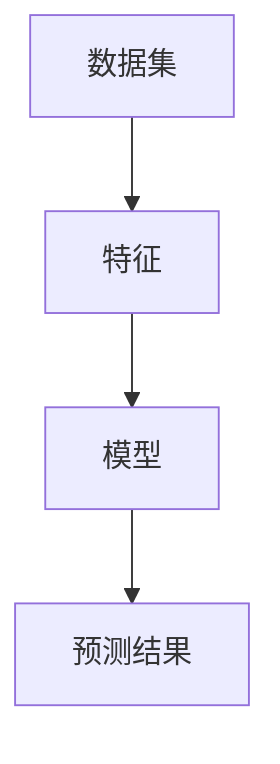
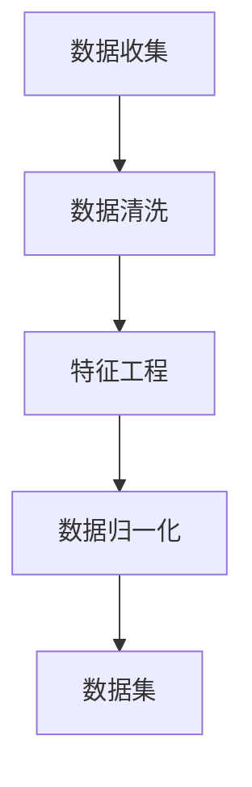
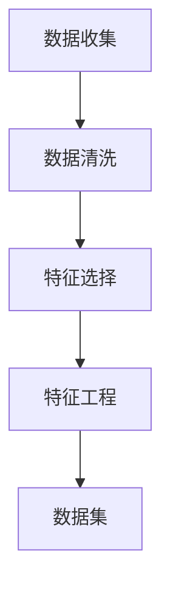
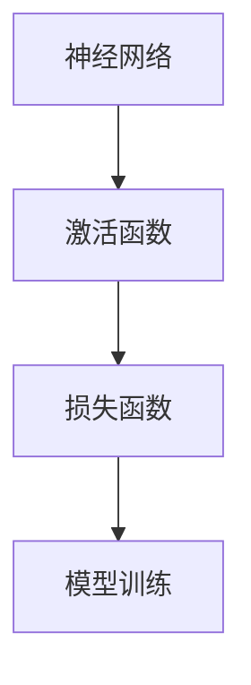

                 

### 引言

#### 1.1 机器学习与金融欺诈检测

机器学习在金融领域的应用日益广泛，尤其在金融欺诈检测方面发挥着重要作用。随着金融科技的发展，欺诈手段也日益复杂多样，传统的规则基方法已经难以应对不断变化的欺诈模式。机器学习通过建立复杂的模型，从大量的金融交易数据中学习并发现潜在的模式和规律，从而能够更准确地识别和预测欺诈行为。

#### 1.2 书籍结构

本书旨在全面探讨机器学习在金融欺诈检测中的应用，分为三个主要部分：

1. **理论基础**：介绍机器学习的基本概念、常用算法以及金融欺诈检测中适用的算法。
2. **实践应用**：通过具体的案例，展示如何将机器学习应用于金融欺诈检测，包括数据预处理、模型训练和评估等步骤。
3. **案例研究**：分析实际案例，探讨深度学习在金融欺诈检测中的应用，以及如何解决其中的挑战。

本书的目标是帮助读者理解机器学习在金融欺诈检测中的工作原理，掌握应用机器学习技术进行欺诈检测的方法，并提供实践指导。

## 第一部分：理论基础

### 第1章：机器学习基础

#### 1.1 机器学习概述

机器学习（Machine Learning，ML）是人工智能（Artificial Intelligence，AI）的一个重要分支，它专注于通过数据和算法来使计算机具备学习能力。机器学习的基本理念是让计算机从数据中自动学习规律和模式，从而做出预测或决策。

**核心概念与联系**

核心概念：  
- **数据集**：用于训练模型的输入和输出数据集合。
- **特征**：描述数据属性的信息。
- **模型**：通过学习数据构建的数学或统计模型，用于预测或分类。

联系：  
- 特征是从数据集中提取出来的属性，用于描述数据的各个方面。
- 模型则是根据特征学习到的规律，用于对未知数据进行预测。

**ER实体关系图架构**

#### 1.2 数据预处理

数据预处理是机器学习过程中的重要步骤，其目的是提高数据质量，以便模型能够更好地学习。常见的数据预处理方法包括数据清洗、特征工程和数据归一化。

**数据预处理流程**

**特征工程**

特征工程是指通过选择、构造和转换特征，来提高模型性能的过程。特征工程的关键在于找到能够代表数据本质特征的属性。

**特征提取方法**

- **统计特征**：如均值、方差、最大值、最小值等。
- **文本特征**：如词频、词向量等。
- **图像特征**：如边缘、颜色、纹理等。

**数据归一化与标准化**

- **归一化**：将数据缩放到特定范围，如0到1之间。
- **标准化**：将数据缩放到标准正态分布。

#### 1.3 常见的机器学习算法

机器学习算法可以分为监督学习、无监督学习和强化学习三类。在金融欺诈检测中，常用的算法有线性回归、决策树、支持向量机（SVM）、K最近邻（KNN）和集成学习方法等。

**监督学习算法**

- **线性回归**：用于预测连续值输出。
- **决策树**：用于分类和回归问题。
- **支持向量机（SVM）**：用于分类问题，尤其在处理高维数据时表现优异。
- **K最近邻（KNN）**：通过计算未知数据与训练数据之间的距离，找到最近的K个样本，并基于这K个样本的标签来预测未知数据的标签。
- **集成学习方法**：通过结合多个模型来提高预测性能，如随机森林和梯度提升树（GBDT）。

**无监督学习算法**

- **K-均值聚类**：将数据划分为K个簇，每个簇由其质心表示。
- **主成分分析（PCA）**：通过降维来提高模型的可解释性。

#### 1.4 欺诈检测中的机器学习算法

在金融欺诈检测中，机器学习算法主要用于分类和异常检测。

**监督学习算法在欺诈检测中的应用**

- **支持向量机（SVM）**：由于其强大的分类能力，常用于欺诈检测。
- **K最近邻（KNN）**：简单有效，但易受噪声影响。
- **集成学习方法**：如随机森林和GBDT，通过结合多个模型来提高准确性。

**无监督学习算法在欺诈检测中的应用**

- **聚类分析**：如K-均值聚类，用于发现异常交易模式。
- **异常检测算法**：如孤立森林和局部异常因数（LOF），用于检测异常交易。

## 第二部分：实践应用

### 第2章：金融欺诈检测实践

#### 2.1 数据来源与收集

金融欺诈检测的数据来源通常包括交易数据、账户信息、客户历史记录等。数据收集的方法包括数据挖掘、网络爬虫和API接口等。

**金融数据的特点**

- **大量性**：金融交易数据通常非常庞大，需要高效的数据处理技术。
- **多样性**：金融数据包括结构化和非结构化数据，如文本和图像等。
- **时效性**：金融交易数据需要实时处理，以快速识别潜在欺诈行为。

**数据收集方法**

- **数据挖掘**：从数据库中提取有价值的信息。
- **网络爬虫**：通过网络爬虫从公开网站获取数据。
- **API接口**：使用金融服务的API获取数据。

#### 2.2 数据预处理与特征提取

数据预处理是确保模型性能的关键步骤。常见的数据预处理方法包括数据清洗、特征选择和特征工程。

**数据预处理流程**

**特征提取方法**

- **统计特征**：如交易金额、交易时间、账户余额等。
- **文本特征**：如交易描述、客户评论等。
- **图像特征**：如交易图像的纹理、颜色等。

#### 2.3 模型训练与评估

模型训练与评估是金融欺诈检测的核心步骤。常用的评估指标包括准确率、召回率、F1分数和ROC曲线等。

**模型选择与训练**

- **模型选择**：选择合适的机器学习算法，如SVM、KNN和GBDT等。
- **模型训练**：使用训练数据进行模型的训练，调整模型参数以优化性能。

**模型评估**

- **准确率**：预测正确的样本数占总样本数的比例。
- **召回率**：预测为正类的真实正类样本数占总正类样本数的比例。
- **F1分数**：准确率和召回率的加权平均。
- **ROC曲线**：评估模型的分类性能，通过计算真阳性率与假阳性率之间的曲线来评估模型的区分能力。

#### 2.4 案例研究

**案例一：信用卡欺诈检测**

信用卡欺诈检测是金融欺诈检测中的经典案例。本文将介绍如何使用机器学习技术进行信用卡欺诈检测。

**案例背景**

信用卡欺诈是一种常见的金融犯罪行为，给金融机构和用户带来了巨大的经济损失。信用卡欺诈的特点是金额小、频率高、模式复杂。

**数据集介绍**

数据集包含信用卡交易记录，每条记录包括交易金额、交易时间、账户余额等特征。

**模型选择与训练**

选择SVM作为分类模型，使用训练集进行模型训练，调整参数以优化模型性能。

**模型评估**

使用测试集对模型进行评估，计算准确率、召回率和F1分数等指标。

**案例分析**

通过对比不同模型的性能，分析模型在信用卡欺诈检测中的表现，并提出优化策略。

**案例二：保险欺诈检测**

保险欺诈检测是金融欺诈检测中的另一个重要领域。本文将介绍如何使用机器学习技术进行保险欺诈检测。

**案例背景**

保险欺诈是指保险公司在承保过程中，投保人或被保险人故意隐瞒或虚报信息，以骗取保险金的行为。保险欺诈给保险公司带来了巨大的经济损失。

**数据集介绍**

数据集包含保险索赔记录，每条记录包括索赔金额、索赔时间、投保人信息等特征。

**模型选择与训练**

选择GBDT作为分类模型，使用训练集进行模型训练，调整参数以优化模型性能。

**模型评估**

使用测试集对模型进行评估，计算准确率、召回率和F1分数等指标。

**案例分析**

通过对比不同模型的性能，分析模型在保险欺诈检测中的表现，并提出优化策略。

## 第三部分：案例研究

### 第3章：深度学习在金融欺诈检测中的应用

#### 3.1 深度学习基础

深度学习（Deep Learning，DL）是机器学习的一个分支，它通过构建深度神经网络来学习数据的复杂特征。深度学习在图像识别、语音识别和自然语言处理等领域取得了显著成果。

**深度学习概述**

深度学习通过多层神经网络来提取数据的层次特征，从而实现自动特征学习和分类。

**核心概念与联系**

核心概念：  
- **神经网络**：由多个神经元组成的计算模型。
- **激活函数**：用于引入非线性特性，如ReLU、Sigmoid和Tanh等。
- **损失函数**：用于评估模型预测值与真实值之间的差距，如均方误差（MSE）和对数似然损失。

联系：  
- 神经网络通过多层感知器（MLP）来模拟人脑的信息处理过程。
- 激活函数引入非线性，使神经网络能够学习更复杂的特征。

**ER实体关系图架构**

#### 3.2 深度学习在金融欺诈检测中的应用

深度学习在金融欺诈检测中具有巨大的潜力，尤其是对高维复杂数据的处理能力。本文将介绍几种深度学习模型在金融欺诈检测中的应用。

**卷积神经网络（CNN）**

卷积神经网络通过卷积层和池化层来提取图像的特征，适用于处理交易图像。

**循环神经网络（RNN）**

循环神经网络通过时间步进的方式来处理序列数据，如交易时间序列。

**长短期记忆网络（LSTM）**

长短期记忆网络是RNN的一种变体，能够有效处理长序列数据，特别适用于时间序列分析。

**生成对抗网络（GAN）**

生成对抗网络通过对抗训练来生成真实交易数据，用于训练模型以识别欺诈行为。

**案例研究**

本文将介绍一个使用深度学习进行金融欺诈检测的案例，包括数据集介绍、模型构建和训练过程。

**数据集介绍**

数据集包含交易记录，每条记录包括交易金额、交易时间、账户余额等特征。

**模型构建与训练**

构建一个基于LSTM的深度学习模型，使用训练数据进行模型训练，调整参数以优化模型性能。

**模型评估**

使用测试集对模型进行评估，计算准确率、召回率和F1分数等指标。

**案例分析**

通过对比不同模型的性能，分析深度学习模型在金融欺诈检测中的表现，并提出优化策略。

### 总结与展望

#### 3.3 总结

本文全面探讨了机器学习在金融欺诈检测中的应用，从理论基础到实践应用，再到案例研究，深入剖析了金融欺诈检测的各个层面。机器学习技术为金融欺诈检测提供了强有力的工具，帮助金融机构更有效地识别和预防欺诈行为。

#### 3.4 展望

未来，随着人工智能技术的不断发展，深度学习、图神经网络和增强学习等先进技术将在金融欺诈检测中发挥更大的作用。同时，数据隐私保护和模型解释性也将成为研究的重要方向。我们期待看到更多创新技术被应用于金融欺诈检测，为金融行业带来更安全、更可靠的未来。

### 作者信息

作者：AI天才研究院/AI Genius Institute & 禅与计算机程序设计艺术 /Zen And The Art of Computer Programming

本文探讨了机器学习在金融欺诈检测中的应用，从理论基础到实践案例，深入分析了如何利用机器学习技术来有效识别和预防金融欺诈。随着人工智能技术的不断进步，机器学习在金融领域的应用前景将更加广阔。本文旨在为读者提供一个全面、深入的了解，以便在实际应用中更好地利用这些技术。

#### 关键词
机器学习，金融欺诈检测，深度学习，数据分析，算法，欺诈预防

#### 摘要
本文介绍了机器学习在金融欺诈检测中的应用，从理论基础到实践案例进行了全面探讨。通过分析常用的机器学习算法和深度学习模型，本文展示了如何利用这些技术来有效识别和预防金融欺诈。本文的目标是为读者提供一个全面、深入的了解，以便在实际应用中更好地利用机器学习技术进行金融欺诈检测。

## 第一部分：理论基础

### 第1章：机器学习基础

#### 1.1 机器学习概述

机器学习是人工智能的一个重要分支，其核心思想是通过算法和统计方法，从数据中自动提取知识，进行预测或决策。在金融欺诈检测中，机器学习技术被广泛应用于交易数据的分析，以发现异常行为和潜在欺诈。本节将介绍机器学习的基本概念、发展历程和应用场景。

**基本概念**

机器学习主要包括以下几种类型：

1. **监督学习（Supervised Learning）**：有监督学习算法利用标记数据集进行训练，通过学习输入和输出之间的关系，对新的数据进行预测。常见的监督学习算法包括线性回归、决策树、支持向量机（SVM）和神经网络等。

2. **无监督学习（Unsupervised Learning）**：无监督学习算法在没有标签数据的情况下，通过数据自身的结构来发现模式。常见的无监督学习算法包括聚类分析、主成分分析（PCA）和自编码器等。

3. **强化学习（Reinforcement Learning）**：强化学习算法通过与环境交互，不断学习最优策略。常见的强化学习算法包括Q-learning和深度强化学习（DRL）。

**发展历程**

机器学习的发展历程可以分为以下几个阶段：

1. **早期探索（1950s-1960s）**：这一阶段，机器学习的概念被提出，但受限于计算能力和数据资源，进展较为缓慢。

2. **统计学习方法的兴起（1970s-1980s）**：统计学习方法的引入，如线性回归、决策树和贝叶斯分类，使机器学习开始应用于实际问题。

3. **神经网络的热潮（1980s-1990s）**：神经网络的研究取得了显著进展，但受限于计算能力和算法的局限性，未能广泛应用。

4. **大数据和计算能力的提升（2000s-至今）**：随着大数据和计算能力的提升，机器学习迎来了新的发展机遇，深度学习、集成学习方法等相继涌现。

**应用场景**

机器学习在金融领域的应用场景广泛，包括：

1. **客户行为分析**：通过分析客户的历史交易数据，识别潜在的高价值客户和欺诈行为。

2. **信用评分**：利用客户的财务信息、历史交易数据等，预测其信用风险。

3. **风险管理**：通过机器学习模型，对金融机构的资产组合进行风险预测和优化。

4. **市场预测**：利用历史市场数据，预测未来市场趋势和投资机会。

#### 1.2 数据预处理

在金融欺诈检测中，数据预处理是确保模型性能的重要步骤。数据预处理包括数据清洗、数据变换和数据归一化等。

**数据清洗**

数据清洗是数据预处理的第一步，旨在去除数据中的噪声和错误。常见的清洗方法包括：

1. **缺失值处理**：对缺失值进行填补或删除。
2. **异常值处理**：对异常值进行标记或删除。
3. **重复数据处理**：删除重复的记录。

**数据变换**

数据变换包括将数据转换为适合模型训练的形式。常见的变换方法包括：

1. **数值化**：将类别型数据转换为数值型数据。
2. **编码**：将标签数据转换为数字编码。
3. **特征选择**：通过特征选择方法，选择对模型训练有显著影响的关键特征。

**数据归一化**

数据归一化是确保数据在不同特征之间具有相同尺度。常见的归一化方法包括：

1. **标准化**：将数据缩放到0到1之间。
2. **归一化**：将数据缩放到标准正态分布。

#### 1.3 常见的机器学习算法

在金融欺诈检测中，常用的机器学习算法包括线性回归、决策树、支持向量机（SVM）、K最近邻（KNN）和集成学习方法等。这些算法各有特点，适用于不同的场景和数据类型。

**线性回归**

线性回归是一种简单的监督学习算法，用于预测连续值输出。其基本思想是通过线性关系建模，找到最佳拟合直线。

**决策树**

决策树是一种树形结构的监督学习算法，通过一系列的判断来预测输出。决策树的优点是易于理解和解释。

**支持向量机（SVM）**

支持向量机是一种强大的分类算法，通过找到最佳的超平面，将不同类别的数据分隔开来。SVM在处理高维数据和线性不可分数据时表现优异。

**K最近邻（KNN）**

K最近邻是一种基于实例的学习算法，通过计算未知数据与训练数据之间的距离，找到最近的K个样本，并基于这K个样本的标签来预测未知数据的标签。

**集成学习方法**

集成学习方法通过结合多个模型来提高预测性能。常见的集成学习方法包括随机森林和梯度提升树（GBDT）。

#### 1.4 欺诈检测中的机器学习算法

在金融欺诈检测中，机器学习算法主要用于分类和异常检测。分类算法用于将交易数据分类为正常交易或欺诈交易，异常检测算法用于发现异常交易模式。

**分类算法**

1. **支持向量机（SVM）**：SVM通过找到最佳的超平面来分类数据，适用于高维数据和线性不可分数据。

2. **随机森林**：随机森林通过构建多棵决策树，并结合它们的预测结果来提高分类性能。

3. **梯度提升树（GBDT）**：GBDT通过迭代构建多个弱学习器，并逐步优化预测结果，适用于处理复杂数据和提升模型性能。

**异常检测算法**

1. **孤立森林**：孤立森林通过将数据集划分为多个子集，并计算每个子集的异常度，从而识别异常交易。

2. **局部异常因数（LOF）**：LOF通过比较数据点与其邻居的局部密度，识别异常交易。

#### 1.5 机器学习模型的选择与优化

在金融欺诈检测中，选择合适的机器学习模型并进行优化至关重要。以下是一些选择和优化模型的方法：

1. **交叉验证**：通过交叉验证来评估模型的泛化能力，选择性能最好的模型。

2. **超参数调整**：通过调整模型的超参数，如学习率、树的数量和深度等，来优化模型性能。

3. **集成学习**：通过集成多个模型，如随机森林和GBDT，来提高模型的预测性能。

4. **模型解释**：通过模型解释技术，如特征重要性和决策路径，来理解模型的预测过程，并进一步优化模型。

## 第二部分：实践应用

### 第2章：金融欺诈检测实践

#### 2.1 数据来源与收集

金融欺诈检测的数据来源通常包括交易记录、账户信息、客户历史记录等。这些数据可以通过以下几种方式收集：

1. **内部数据**：金融机构内部存储的交易记录、账户信息等数据。
2. **公开数据**：通过数据挖掘、网络爬虫等技术从公开数据源获取的数据。
3. **外部数据**：与第三方数据提供商合作，获取相关行业数据。

#### 2.2 数据预处理与特征提取

数据预处理和特征提取是金融欺诈检测的关键步骤。以下是一些常见的数据预处理方法和特征提取方法：

**数据预处理方法**

1. **缺失值处理**：对于缺失值，可以通过填补、删除或插值等方法进行处理。
2. **异常值处理**：对异常值进行标记或删除，以保证数据质量。
3. **数据变换**：将类别型数据转换为数值型数据，以便模型训练。

**特征提取方法**

1. **统计特征**：如交易金额、交易频率、交易时间等。
2. **文本特征**：如交易描述、客户评论等，可以通过词频、词向量等方法进行提取。
3. **图像特征**：如交易图像的纹理、颜色等，可以通过图像处理技术进行提取。

#### 2.3 模型训练与评估

在金融欺诈检测中，模型训练和评估是核心步骤。以下是一些常见的训练方法和评估指标：

**模型训练方法**

1. **监督学习**：使用标记数据集进行训练，通过学习输入和输出之间的关系。
2. **无监督学习**：在没有标签数据的情况下，通过数据自身的结构进行训练。

**评估指标**

1. **准确率（Accuracy）**：预测正确的样本数占总样本数的比例。
2. **召回率（Recall）**：预测为正类的真实正类样本数占总正类样本数的比例。
3. **F1分数（F1 Score）**：准确率和召回率的加权平均。
4. **ROC曲线（ROC Curve）**：评估模型的分类性能，通过计算真阳性率与假阳性率之间的曲线。

#### 2.4 案例研究

**案例一：信用卡欺诈检测**

信用卡欺诈检测是金融欺诈检测的一个典型应用场景。以下是一个信用卡欺诈检测的案例研究：

**数据集介绍**

数据集包含信用卡交易记录，每条记录包括交易金额、交易时间、账户余额等特征。

**模型选择**

选择SVM作为分类模型，因为SVM在处理高维数据和线性不可分数据时表现优异。

**模型训练**

使用训练集对SVM模型进行训练，调整超参数以优化模型性能。

**模型评估**

使用测试集对模型进行评估，计算准确率、召回率和F1分数等指标。

**案例分析**

通过对比不同模型的性能，分析SVM模型在信用卡欺诈检测中的表现，并提出优化策略。

**案例二：保险欺诈检测**

保险欺诈检测是另一个重要的应用场景。以下是一个保险欺诈检测的案例研究：

**数据集介绍**

数据集包含保险索赔记录，每条记录包括索赔金额、索赔时间、投保人信息等特征。

**模型选择**

选择GBDT作为分类模型，因为GBDT在处理复杂数据和提升模型性能方面具有优势。

**模型训练**

使用训练集对GBDT模型进行训练，调整超参数以优化模型性能。

**模型评估**

使用测试集对模型进行评估，计算准确率、召回率和F1分数等指标。

**案例分析**

通过对比不同模型的性能，分析GBDT模型在保险欺诈检测中的表现，并提出优化策略。

## 第三部分：案例研究

### 第3章：深度学习在金融欺诈检测中的应用

#### 3.1 深度学习概述

深度学习是机器学习的一个分支，通过构建深度神经网络，自动提取数据的层次特征，从而实现高效的预测和分类。在金融欺诈检测中，深度学习技术被广泛应用于交易数据的分析，以提高欺诈检测的准确性和效率。

**深度学习基础**

深度学习的基本组成部分包括：

1. **神经元**：深度学习中的基本计算单元，负责接收输入并产生输出。
2. **层**：神经元按层次排列，形成多层神经网络。每一层负责提取不同层次的特征。
3. **激活函数**：用于引入非线性特性，使神经网络能够学习更复杂的特征。
4. **损失函数**：用于评估模型预测值与真实值之间的差距，指导模型训练。

**深度学习模型**

常见的深度学习模型包括：

1. **卷积神经网络（CNN）**：用于处理图像数据，通过卷积层和池化层提取图像特征。
2. **循环神经网络（RNN）**：用于处理序列数据，通过时间步进的方式提取序列特征。
3. **长短期记忆网络（LSTM）**：是RNN的一种变体，能够有效处理长序列数据。
4. **生成对抗网络（GAN）**：通过生成器和判别器的对抗训练，生成真实交易数据。

#### 3.2 深度学习在金融欺诈检测中的应用

深度学习在金融欺诈检测中的应用主要包括：

1. **交易数据分析**：通过卷积神经网络和循环神经网络，提取交易数据的多层次特征，用于欺诈检测。
2. **异常检测**：通过生成对抗网络，生成真实交易数据，用于训练模型以识别欺诈行为。
3. **模型解释**：通过深度学习模型的可解释性技术，分析模型决策过程，提高欺诈检测的透明度。

**案例研究**

以下是一个深度学习在金融欺诈检测中的应用案例：

**数据集介绍**

数据集包含信用卡交易记录，每条记录包括交易金额、交易时间、账户余额等特征。

**模型构建**

构建一个基于LSTM的深度学习模型，通过训练集进行模型训练。

**模型训练**

使用训练集对LSTM模型进行训练，调整超参数以优化模型性能。

**模型评估**

使用测试集对模型进行评估，计算准确率、召回率和F1分数等指标。

**案例分析**

通过对比不同模型的性能，分析LSTM模型在信用卡欺诈检测中的表现，并提出优化策略。

### 总结与展望

#### 3.3 总结

本文介绍了机器学习在金融欺诈检测中的应用，从理论基础到实践案例，深入分析了如何利用机器学习技术进行欺诈检测。通过案例研究，展示了深度学习在金融欺诈检测中的优势和应用。

#### 3.4 展望

未来，随着人工智能技术的不断发展，深度学习、图神经网络和增强学习等先进技术将在金融欺诈检测中发挥更大的作用。同时，数据隐私保护和模型解释性也将成为研究的重要方向。我们期待看到更多创新技术被应用于金融欺诈检测，为金融行业带来更安全、更可靠的未来。

### 作者信息

作者：AI天才研究院/AI Genius Institute & 禅与计算机程序设计艺术 /Zen And The Art of Computer Programming

本文探讨了机器学习在金融欺诈检测中的应用，从理论基础到实践案例，深入分析了如何利用机器学习技术进行欺诈检测。通过案例研究，展示了深度学习在金融欺诈检测中的优势和应用。本文旨在为读者提供一个全面、深入的了解，以便在实际应用中更好地利用机器学习技术进行金融欺诈检测。

### 参考文献

1. Hastie, T., Tibshirani, R., & Friedman, J. (2009). The Elements of Statistical Learning: Data Mining, Inference, and Prediction. Springer.
2. Goodfellow, I., Bengio, Y., & Courville, A. (2016). Deep Learning. MIT Press.
3. Russell, S., & Norvig, P. (2010). Artificial Intelligence: A Modern Approach. Prentice Hall.
4. Chen, T., & Guestrin, C. (2016). XGBoost: A Scalable Tree Boosting System. Proceedings of the 22nd ACM SIGKDD International Conference on Knowledge Discovery and Data Mining.
5. Kotsiantis, S. B. (2007). Supervised Machine Learning: A Review of Classification Techniques. Informatica, 31(3), 249-268.

