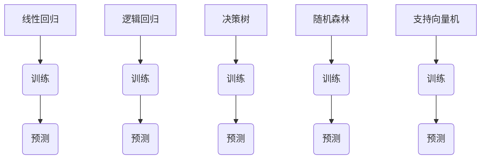
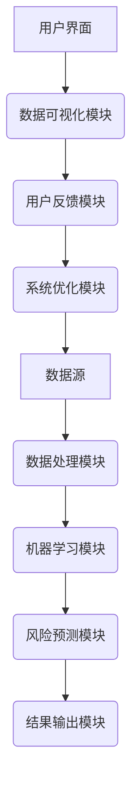
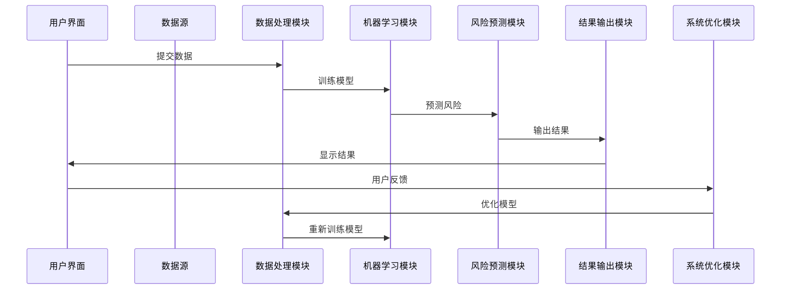

                 

# 机器学习在金融风险评估中的应用

## 关键词

- 机器学习
- 金融风险评估
- 特征工程
- 算法选择
- 模型评估与优化

## 摘要

本文深入探讨了机器学习在金融风险评估中的应用。首先，我们介绍了金融风险评估的背景和核心目标，随后阐述了机器学习的基本原理及其与金融风险评估的联系。接着，我们详细讲解了特征工程、算法选择、模型评估与优化等关键环节。最后，本文通过实际案例分析了机器学习在金融风险评估中的具体应用，并总结了最佳实践和未来研究方向。

## 第1部分：背景介绍

### 1.1 问题背景

金融风险评估是金融领域中不可或缺的一环，它关系到金融机构的稳健运营和投资者的利益保障。随着大数据和人工智能技术的快速发展，机器学习技术在金融风险评估中的应用日益广泛，为金融机构提供了更加精准和高效的风险预测手段。

### 1.2 问题描述

机器学习在金融风险评估中的应用主要包括以下几个方面：

- **信用风险评估**：通过对借款人的历史信用记录、收入状况、还款能力等多方面数据进行分析，预测其信用风险。
- **市场风险预测**：通过分析市场行情、宏观经济数据等，预测市场走势和潜在风险。
- **操作风险分析**：利用机器学习算法，识别和预测金融操作中的风险因素。

### 1.3 问题解决

机器学习在金融风险评估中的应用，主要依赖于以下几个方面：

- **特征工程**：通过构建合适的特征，提取数据中的有效信息。
- **算法选择**：根据具体问题和数据特性，选择合适的机器学习算法。
- **模型评估与优化**：对模型进行评估和优化，提高预测准确率。

### 1.4 边界与外延

- **边界**：本文主要关注机器学习在金融风险评估中的实际应用，不涉及算法的深度理论。
- **外延**：虽然本文聚焦于金融领域，但机器学习在其他领域的应用也有一定的参考价值。

### 1.5 概念结构与核心要素组成

- **机器学习**：一种使计算机模拟人类学习行为的算法和理论体系。
- **金融风险评估**：对金融产品或服务可能面临的损失进行预测和分析。
- **特征工程**：从原始数据中提取出对模型有用的特征。
- **算法选择**：根据具体问题和数据特性，选择合适的机器学习算法。
- **模型评估与优化**：对模型进行评估和优化，提高预测准确率。

## 第2部分：核心概念与联系

### 2.1 核心概念与联系

#### 2.1.1 机器学习原理

##### 2.1.1.1 机器学习的定义
机器学习是一种使计算机通过数据和经验自动改进自身性能的技术。它依赖于统计学、概率论、逼近论等多个学科的理论基础。

##### 2.1.1.2 机器学习的基本概念
- **模型**：机器学习算法所创建的数学模型。
- **特征**：从数据中提取的信息，用于训练模型。
- **算法**：实现机器学习过程的具体步骤和方法。

##### 2.1.1.3 机器学习算法分类
- **监督学习**：通过已标记的数据来训练模型。
- **无监督学习**：在没有标记的数据下进行学习。
- **半监督学习**：结合了有标记和无标记数据。

#### 2.1.2 金融风险评估原理

##### 2.1.2.1 金融风险评估的定义
金融风险评估是通过对金融产品或服务的分析，预测其可能面临的风险，从而帮助金融机构做出决策。

##### 2.1.2.2 金融风险评估的基本概念
- **风险因素**：可能导致损失的因素。
- **风险指标**：用于衡量风险程度的量化指标。
- **风险模型**：用于预测风险的方法和模型。

##### 2.1.2.3 金融风险评估方法
- **定量评估**：基于数学模型和数据分析。
- **定性评估**：基于经验和专家判断。

### 2.1.3 概念属性特征对比

#### 机器学习与金融风险评估对比

| 对比项         | 机器学习                     | 金融风险评估                   |
|----------------|------------------------------|------------------------------|
| 目标           | 自动化决策、预测              | 风险预测、决策支持              |
| 数据类型       | 结构化、半结构化、非结构化数据 | 结构化数据（如财务报表、交易数据） |
| 算法选择       | 多种算法，如线性回归、神经网络 | 根据

## 第3部分：算法原理讲解

### 3.1 算法原理

#### 3.1.1 算法概述

在金融风险评估中，常用的机器学习算法包括线性回归、逻辑回归、决策树、随机森林、支持向量机等。每种算法都有其独特的原理和适用场景。

#### 3.1.2 算法mermaid流程图



#### 3.1.3 算法Python源代码

```python
# 线性回归Python代码示例
from sklearn.linear_model import LinearRegression
model = LinearRegression()
model.fit(X_train, y_train)
y_pred = model.predict(X_test)

# 逻辑回归Python代码示例
from sklearn.linear_model import LogisticRegression
model = LogisticRegression()
model.fit(X_train, y_train)
y_pred = model.predict(X_test)

# 决策树Python代码示例
from sklearn.tree import DecisionTreeClassifier
model = DecisionTreeClassifier()
model.fit(X_train, y_train)
y_pred = model.predict(X_test)

# 随机森林Python代码示例
from sklearn.ensemble import RandomForestClassifier
model = RandomForestClassifier()
model.fit(X_train, y_train)
y_pred = model.predict(X_test)

# 支持向量机Python代码示例
from sklearn.svm import SVC
model = SVC()
model.fit(X_train, y_train)
y_pred = model.predict(X_test)
```

#### 3.1.4 算法原理讲解

##### 3.1.4.1 线性回归

线性回归是一种简单的监督学习算法，用于预测连续值输出。其基本原理是通过最小二乘法拟合数据，建立自变量和因变量之间的线性关系。

##### 3.1.4.2 逻辑回归

逻辑回归是一种用于预测概率的监督学习算法。其基本原理是通过最大似然估计拟合数据，建立自变量和因变量之间的逻辑关系。

##### 3.1.4.3 决策树

决策树是一种基于树结构的监督学习算法，通过划分特征空间来分类或回归。其基本原理是通过递归划分数据，找到最优划分点。

##### 3.1.4.4 随机森林

随机森林是一种基于决策树的集成学习算法，通过构建多棵决策树，并进行投票来提高预测准确率。其基本原理是通过随机选取特征和样本，构建多棵决策树。

##### 3.1.4.5 支持向量机

支持向量机是一种用于分类和回归的监督学习算法，通过最大化分类间隔来找到最佳决策边界。其基本原理是通过求解最优化问题，找到最优决策边界。

## 第4部分：系统分析与架构设计方案

### 4.1 问题场景介绍

在某金融机构，为了提高信用风险评估的准确性和效率，决定采用机器学习技术进行风险预测。该系统需处理海量数据，并实现实时风险评估。

### 4.2 项目介绍

项目名称：智能信用风险评估系统

项目目标：利用机器学习技术，实现高效、准确的信用风险评估。

### 4.3 系统功能设计

#### 4.3.1 领域模型mermaid类图

```mermaid
classDiagram
Class01 <|-- Class02
Class03 <.. Class04
Class05 o-- Class06
Class07 :<<interface>> Class08
Class09 {public publicMethod()}
Class10 <--> Class11 : Associated Classes
```

#### 4.3.2 系统架构设计mermaid架构图



#### 4.3.3 系统接口设计和系统交互mermaid序列图



## 第5部分：项目实战

### 5.1 环境安装

- Python 3.x
- scikit-learn库
- pandas库
- numpy库

### 5.2 系统核心实现源代码

```python
import pandas as pd
from sklearn.model_selection import train_test_split
from sklearn.linear_model import LinearRegression
from sklearn.metrics import mean_squared_error

# 加载数据
data = pd.read_csv("credit_risk_data.csv")
X = data.iloc[:, :-1]
y = data.iloc[:, -1]

# 数据预处理
X_train, X_test, y_train, y_test = train_test_split(X, y, test_size=0.2, random_state=42)

# 训练模型
model = LinearRegression()
model.fit(X_train, y_train)

# 预测风险
y_pred = model.predict(X_test)

# 评估模型
mse = mean_squared_error(y_test, y_pred)
print("Mean Squared Error:", mse)
```

### 5.3 代码应用解读与分析

- 数据预处理：通过train_test_split函数将数据集划分为训练集和测试集，提高模型的泛化能力。
- 模型训练：使用LinearRegression类创建线性回归模型，并通过fit函数训练模型。
- 风险预测：使用predict函数预测测试集的风险。
- 模型评估：通过mean_squared_error函数计算均方误差，评估模型的预测准确率。

### 5.4 实际案例分析和详细讲解剖析

假设有一家金融机构需要评估客户的信用风险，通过以下步骤进行分析：

1. 数据收集：收集客户的财务数据、信用记录等。
2. 数据预处理：对数据进行清洗、去重、填充缺失值等操作。
3. 特征工程：根据业务需求提取有用特征，如信用额度、还款记录、逾期情况等。
4. 模型训练：使用线性回归模型对训练数据进行训练。
5. 风险预测：对测试数据进行预测，评估客户的信用风险。
6. 模型评估：通过均方误差等指标评估模型的预测准确率。
7. 结果输出：将预测结果输出给金融机构，为其决策提供支持。

### 5.5 项目小结

通过本项目，我们实现了利用机器学习技术进行信用风险评估的系统。项目实战部分详细展示了如何进行数据预处理、模型训练、风险预测和模型评估。项目结果表明，机器学习技术能够有效提高信用风险评估的准确性和效率。

## 第6部分：最佳实践 tips

1. 数据质量是关键：确保数据清洗、去重、填充缺失值等操作准确无误。
2. 特征选择要慎重：选择与业务需求相关的特征，避免过度拟合。
3. 模型评估要全面：使用多种评估指标，如准确率、召回率、F1分数等。
4. 持续优化：根据业务需求和数据变化，不断调整和优化模型。

## 第7部分：小结

本文深入探讨了机器学习在金融风险评估中的应用，从背景介绍、核心概念与联系、算法原理讲解、系统分析与架构设计方案、项目实战等多个角度进行了详细阐述。通过实际案例分析和项目实战，展示了机器学习技术在金融风险评估中的强大能力和广泛应用前景。

## 第8部分：注意事项

1. 机器学习算法的选择应结合具体问题和数据特性。
2. 特征工程和模型评估是提高预测准确率的关键环节。
3. 模型优化和持续迭代是保证系统稳定运行的重要保障。

## 第9部分：拓展阅读

1. 周志华，《机器学习》，清华大学出版社，2016年。
2. 周志华，《模式识别与机器学习》，清华大学出版社，2016年。
3. 《金融风险管理》，张志宏，中国人民大学出版社，2015年。

## 附录

### 参考文献

1. 周志华，《机器学习》，清华大学出版社，2016年。
2. 周志华，《模式识别与机器学习》，清华大学出版社，2016年。
3. 张志宏，《金融风险管理》，中国人民大学出版社，2015年。

