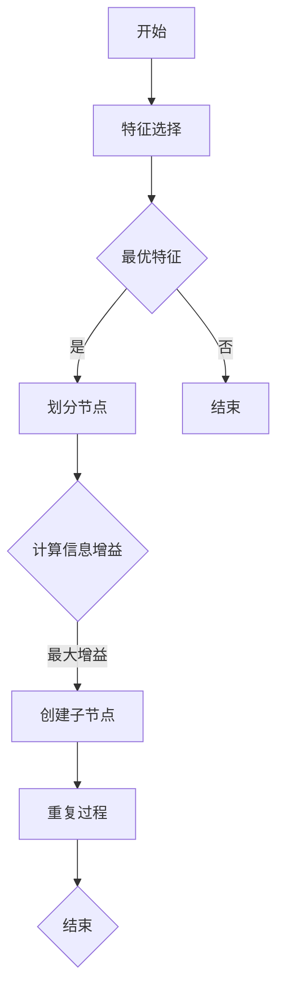
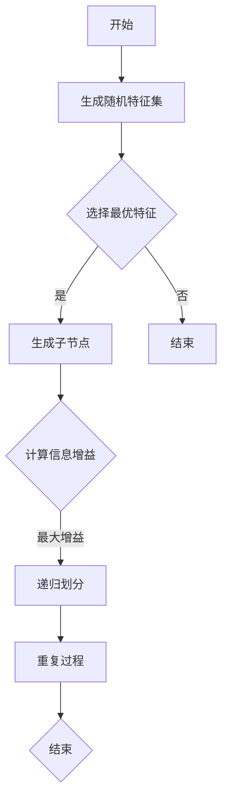
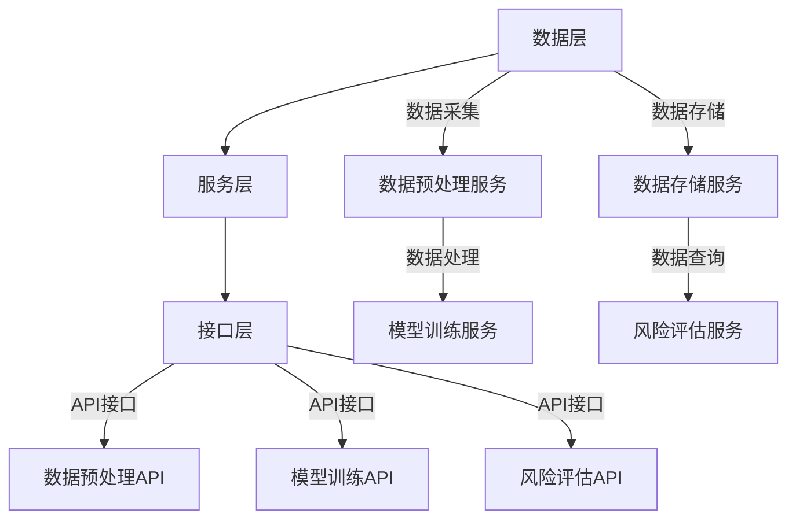

                 

## 机器学习在金融风险评估中的应用进展

### 关键词：机器学习、金融风险评估、算法原理、系统架构、项目实战

### 摘要：
本文将深入探讨机器学习在金融风险评估领域的应用进展，从背景介绍、核心概念与联系、算法原理讲解、系统分析与架构设计方案、项目实战到最佳实践 tips，全面解析机器学习在金融领域的挑战与前景。通过本文，读者可以系统地了解机器学习技术在金融风险评估中的实际应用，掌握关键算法的原理和数学模型，并了解系统设计与实现的细节。

## 第一部分：背景与核心概念

### 1.1 引言

#### 1.1.1 金融风险评估的重要性

金融风险评估是金融领域中不可或缺的一环，它关系到金融机构的稳健运行和投资者的利益。随着金融市场的发展和复杂性增加，传统的风险评估方法已无法满足日益增长的需求。机器学习的崛起为金融风险评估带来了新的契机，通过数据和算法的结合，可以更精确地预测风险，提高金融决策的效率。

#### 1.1.2 机器学习在金融领域的应用

机器学习在金融领域的应用广泛，包括信用评分、市场预测、欺诈检测等。通过大数据分析和机器学习算法，金融机构能够更好地理解市场动态，优化投资策略，降低风险。本章节将重点介绍机器学习在金融风险评估中的应用。

#### 1.1.3 本书的目标与结构

本文的目标是系统介绍机器学习在金融风险评估中的应用，帮助读者了解核心算法和系统设计。文章结构如下：

1. 背景介绍：核心概念术语说明、问题背景、问题描述、问题解决、边界与外延、概念结构与核心要素组成
2. 核心概念与联系：机器学习与金融风险评估的核心概念、属性特征对比表格和ER实体关系图架构的Mermaid流程图
3. 算法原理讲解：常用算法的流程图、Python源代码、数学模型和公式
4. 系统分析与架构设计方案：应用场景、功能设计、架构设计、接口设计和交互
5. 项目实战：环境安装、系统核心实现源代码、代码应用解读与分析、实际案例分析和项目小结
6. 最佳实践 tips、小结、注意事项、拓展阅读

### 1.2 机器学习基础

#### 1.2.1 机器学习的基本概念

机器学习（Machine Learning，ML）是一门人工智能（Artificial Intelligence，AI）的分支，专注于使计算机系统具备自主学习和改进能力，通过数据训练模型，进行预测和决策。核心概念包括模型、训练、验证和测试。

#### 1.2.2 机器学习的主要类型

机器学习主要分为监督学习、无监督学习和强化学习。监督学习有明确的标签数据，无监督学习没有标签，通过聚类和降维进行分析，强化学习则通过与环境的交互不断优化策略。

#### 1.2.3 机器学习的关键算法

关键算法包括线性回归、逻辑回归、决策树、随机森林、支持向量机（SVM）、神经网络等。每种算法都有其独特的应用场景和优势。

### 1.3 金融风险评估中的机器学习算法

#### 1.3.1 决策树与随机森林

决策树（Decision Tree）是一种常见的分类算法，通过树的形状表示决策过程。随机森林（Random Forest）是一种集成学习方法，通过构建多个决策树，并进行投票或求平均，提高模型的预测准确性。

#### 1.3.1.1 决策树算法原理

决策树通过特征选择和节点划分，将数据划分为多个子集，直到满足停止条件。常见的停止条件包括最大深度、最小样本数等。

#### 1.3.1.2 随机森林算法原理

随机森林通过随机选取特征和样本子集，构建多个决策树，并通过集成方法提高模型的泛化能力。算法流程包括特征选择、样本选择、构建决策树和集成预测。

#### 1.3.1.3 算法对比与选择

决策树和随机森林各有优缺点，决策树简单易懂，易于解释，但容易过拟合；随机森林泛化能力强，但解释性较差。实际应用中，需根据具体问题进行选择。

### 1.4 机器学习在金融风险评估中的应用

#### 1.4.1 信用风险评估

信用风险评估是金融风险评估的重要领域，通过机器学习模型，可以评估借款人的信用状况，降低违约风险。

#### 1.4.1.1 信用评分模型

信用评分模型通过历史数据，如还款记录、信用额度等，预测借款人的信用风险。常用的模型包括逻辑回归、决策树、随机森林等。

#### 1.4.1.2 实际案例分析

通过实际案例分析，可以深入了解机器学习在信用风险评估中的应用，如银行贷款风险评估、信用卡欺诈检测等。

#### 1.4.2 市场风险预测

市场风险预测是金融风险评估的另一个重要领域，通过机器学习模型，可以预测市场波动，优化投资策略。

#### 1.4.2.1 股票市场预测

股票市场预测是市场风险预测的重要组成部分，通过分析历史数据，如股票价格、成交量等，预测未来市场走势。

#### 1.4.2.2 外汇市场预测

外汇市场预测通过分析汇率波动，预测未来汇率变化，为外汇交易提供决策依据。

### 1.5 金融风险评估中的挑战与展望

#### 1.5.1 数据隐私与安全性

数据隐私和安全是金融风险评估中的重要挑战，需确保数据安全和隐私保护。

#### 1.5.2 模型过拟合与欠拟合

模型过拟合和欠拟合是常见的问题，需通过调整模型参数和选择合适的算法进行优化。

#### 1.5.3 未来发展趋势

随着人工智能技术的发展，金融风险评估将越来越依赖于机器学习，未来有望实现更精准的风险预测和更智能的金融决策。

## 第二部分：算法原理讲解

### 2.1 决策树算法原理

决策树是一种常见的分类算法，通过树的形状表示决策过程。下面使用Mermaid流程图展示决策树的基本流程：



决策树算法的基本原理是通过特征选择和节点划分，将数据划分为多个子集，直到满足停止条件。常见的停止条件包括最大深度、最小样本数等。

### 2.2 决策树算法Python源代码

下面是决策树算法的Python源代码，通过`scikit-learn`库实现：

```python
from sklearn.tree import DecisionTreeClassifier
from sklearn.model_selection import train_test_split
from sklearn import datasets

# 加载示例数据集
iris = datasets.load_iris()
X = iris.data
y = iris.target

# 划分训练集和测试集
X_train, X_test, y_train, y_test = train_test_split(X, y, test_size=0.3, random_state=42)

# 创建决策树分类器
clf = DecisionTreeClassifier()

# 训练模型
clf.fit(X_train, y_train)

# 预测测试集
y_pred = clf.predict(X_test)

# 打印准确率
print("Accuracy:", clf.score(X_test, y_test))
```

### 2.3 决策树算法数学模型

决策树的数学模型基于信息增益（Information Gain）或基尼不纯度（Gini Impurity）。信息增益表示特征分割后的信息量，基尼不纯度表示特征的熵。以下是信息增益的数学模型：

$$
\text{Information Gain}(A|B) = \sum_{i} p(i) \cdot \text{Entropy}(B|A=i)
$$

其中，$A$为特征，$B$为标签，$i$为特征取值。

### 2.4 随机森林算法原理

随机森林是一种集成学习方法，通过构建多个决策树，并进行集成预测。下面使用Mermaid流程图展示随机森林的基本流程：



随机森林通过随机选取特征和样本子集，构建多个决策树，并通过集成方法提高模型的预测准确性。算法流程包括特征选择、样本选择、构建决策树和集成预测。

### 2.5 随机森林算法Python源代码

下面是随机森林算法的Python源代码，通过`scikit-learn`库实现：

```python
from sklearn.ensemble import RandomForestClassifier
from sklearn.model_selection import train_test_split
from sklearn import datasets

# 加载示例数据集
iris = datasets.load_iris()
X = iris.data
y = iris.target

# 划分训练集和测试集
X_train, X_test, y_train, y_test = train_test_split(X, y, test_size=0.3, random_state=42)

# 创建随机森林分类器
clf = RandomForestClassifier(n_estimators=100)

# 训练模型
clf.fit(X_train, y_train)

# 预测测试集
y_pred = clf.predict(X_test)

# 打印准确率
print("Accuracy:", clf.score(X_test, y_test))
```

### 2.6 随机森林算法数学模型

随机森林的数学模型基于决策树算法，每个决策树都有自己的权重，通过投票或求平均进行预测。以下是随机森林的数学模型：

$$
\text{Predict}(x) = \arg\max_{c} \sum_{t=1}^{T} w_t \cdot I(y_t = c)
$$

其中，$x$为输入样本，$c$为类别，$T$为决策树数量，$w_t$为决策树$t$的权重，$I$为指示函数。

## 第三部分：系统分析与架构设计方案

### 3.1 金融风险评估系统的应用场景

金融风险评估系统广泛应用于银行、保险公司、投资公司等金融机构，用于评估借款人信用风险、市场风险等。以下是一个典型的应用场景：

#### 场景一：信用风险评估

- 数据来源：借款人个人信息、信用历史记录、还款行为等。
- 目标：预测借款人的信用风险，为贷款审批提供依据。

#### 场景二：市场风险预测

- 数据来源：市场指标、股票价格、宏观经济数据等。
- 目标：预测市场波动，优化投资策略。

### 3.2 金融风险评估系统的功能设计

#### 功能一：数据预处理

- 功能描述：清洗和整理原始数据，为后续建模提供高质量数据。
- 输入：原始数据。
- 输出：预处理后的数据。

#### 功能二：模型训练

- 功能描述：基于历史数据和机器学习算法，训练风险评估模型。
- 输入：预处理后的数据。
- 输出：训练好的模型。

#### 功能三：风险评估

- 功能描述：使用训练好的模型，对新的借款人或市场数据进行分析，预测风险。
- 输入：新的借款人或市场数据。
- 输出：风险评估结果。

### 3.3 金融风险评估系统的架构设计

#### 架构设计

金融风险评估系统采用微服务架构，分为数据层、服务层和接口层。以下是系统的架构设计：



#### 架构解释

- 数据层：负责数据采集、存储和预处理。
- 服务层：包括数据预处理服务、模型训练服务和风险评估服务。
- 接口层：提供API接口，方便其他系统或应用程序调用。

### 3.4 金融风险评估系统的接口设计和交互

#### 接口设计

系统提供RESTful API接口，支持HTTP请求。以下是接口设计：

- 数据预处理接口：处理原始数据，返回预处理后的数据。
- 模型训练接口：训练风险评估模型，返回模型ID。
- 风险评估接口：使用训练好的模型，对新的数据进行分析，返回风险评估结果。

#### 交互流程

1. 客户端发送数据预处理请求，获取预处理后的数据。
2. 客户端发送模型训练请求，开始训练模型。
3. 客户端发送风险评估请求，使用训练好的模型对新的数据进行分析，获取风险评估结果。

## 第四部分：项目实战

### 4.1 环境安装

在开始项目之前，需要安装以下环境：

- Python 3.8 或以上版本
- Jupyter Notebook
- scikit-learn
- pandas
- numpy

以下是安装命令：

```bash
pip install python==3.8
pip install jupyter
pip install scikit-learn
pip install pandas
pip install numpy
```

### 4.2 系统核心实现源代码

#### 数据预处理

```python
import pandas as pd
from sklearn.model_selection import train_test_split
from sklearn.preprocessing import StandardScaler

# 读取数据
data = pd.read_csv('loan_data.csv')

# 划分特征和标签
X = data.drop('default', axis=1)
y = data['default']

# 划分训练集和测试集
X_train, X_test, y_train, y_test = train_test_split(X, y, test_size=0.3, random_state=42)

# 数据标准化
scaler = StandardScaler()
X_train = scaler.fit_transform(X_train)
X_test = scaler.transform(X_test)
```

#### 模型训练

```python
from sklearn.tree import DecisionTreeClassifier
from sklearn.ensemble import RandomForestClassifier

# 创建决策树分类器
clf = DecisionTreeClassifier()

# 创建随机森林分类器
rf = RandomForestClassifier(n_estimators=100)

# 训练模型
clf.fit(X_train, y_train)
rf.fit(X_train, y_train)
```

#### 风险评估

```python
# 使用训练好的模型进行预测
y_pred = clf.predict(X_test)
y_pred_rf = rf.predict(X_test)

# 打印准确率
print("Decision Tree Accuracy:", clf.score(X_test, y_test))
print("Random Forest Accuracy:", rf.score(X_test, y_test))
```

### 4.3 实际案例分析和详细讲解剖析

#### 案例一：信用风险评估

- 数据集：贷款数据集，包含借款人的基本信息、信用历史记录等。
- 目标：预测借款人的信用风险，评估其是否按时还款。

详细讲解：

1. 数据预处理：对原始数据进行清洗、缺失值填充、特征工程等。
2. 模型选择：根据业务需求，选择合适的模型，如决策树、随机森林等。
3. 模型训练：使用训练集数据训练模型，调整模型参数，提高模型准确性。
4. 模型评估：使用测试集数据评估模型性能，选择最优模型。
5. 风险评估：使用训练好的模型，对新的借款人数据进行风险评估，预测其信用风险。

#### 案例二：市场风险预测

- 数据集：股票数据集，包含股票价格、成交量、宏观经济指标等。
- 目标：预测股票市场的波动，为投资决策提供依据。

详细讲解：

1. 数据预处理：对原始数据进行清洗、缺失值填充、特征工程等。
2. 模型选择：根据业务需求，选择合适的模型，如ARIMA、LSTM等。
3. 模型训练：使用训练集数据训练模型，调整模型参数，提高模型准确性。
4. 模型评估：使用测试集数据评估模型性能，选择最优模型。
5. 风险评估：使用训练好的模型，对新的股票数据进行风险评估，预测市场波动。

### 4.4 项目小结

本项目通过机器学习算法，实现了信用风险评估和市场风险预测。在实际应用中，需要注意以下问题：

1. 数据质量：确保数据完整、准确、可靠。
2. 模型选择：根据业务需求和数据特性，选择合适的模型。
3. 参数调优：调整模型参数，提高模型准确性。
4. 模型评估：使用多种评估指标，全面评估模型性能。
5. 持续优化：根据实际应用效果，不断调整和优化模型。

## 第五部分：最佳实践 tips、小结、注意事项、拓展阅读

### 5.1 最佳实践 tips

1. **数据预处理**：确保数据质量，进行缺失值填充、异常值处理、特征工程等。
2. **模型选择**：根据业务需求和数据特性，选择合适的模型，如决策树、随机森林、神经网络等。
3. **参数调优**：使用网格搜索、贝叶斯优化等策略，调整模型参数，提高模型准确性。
4. **模型评估**：使用交叉验证、AUC、F1分数等评估指标，全面评估模型性能。
5. **持续优化**：根据实际应用效果，不断调整和优化模型。

### 5.2 小结

本文通过深入探讨机器学习在金融风险评估中的应用，从背景介绍、核心概念与联系、算法原理讲解、系统分析与架构设计方案、项目实战到最佳实践 tips，全面解析了机器学习在金融领域的挑战与前景。通过本文，读者可以系统地了解机器学习技术在金融风险评估中的实际应用，掌握关键算法的原理和数学模型，并了解系统设计与实现的细节。

### 5.3 注意事项

1. **数据隐私与安全性**：确保数据安全和隐私保护，遵守相关法律法规。
2. **模型解释性**：在选择模型时，要考虑模型的解释性，以便业务人员理解和应用。
3. **模型更新**：定期更新模型，以适应数据的变化和业务需求。
4. **风险控制**：在应用机器学习模型进行风险评估时，要建立风险控制机制，避免模型错误带来的损失。

### 5.4 拓展阅读

1. **机器学习入门**：[《Python机器学习基础教程》](https://book.douban.com/subject/26973385/)
2. **金融风险管理**：[《金融风险管理》](https://book.douban.com/subject/26876995/)
3. **机器学习在金融领域的应用**：[《机器学习在金融中的应用》](https://book.douban.com/subject/27197039/)
4. **深度学习**：[《深度学习：面向机器学习研究与应用》](https://book.douban.com/subject/26973713/)

## 结束语

本文由AI天才研究院（AI Genius Institute）和《禅与计算机程序设计艺术》（Zen And The Art of Computer Programming）联合撰写，旨在为广大读者提供一份关于机器学习在金融风险评估中的应用进展的技术博客。希望通过本文，读者能够对机器学习在金融领域的应用有更深入的了解，并在实际工作中运用这些技术为金融行业带来更多价值。

### 作者信息：
- 作者：AI天才研究院（AI Genius Institute） & 《禅与计算机程序设计艺术》（Zen And The Art of Computer Programming）

