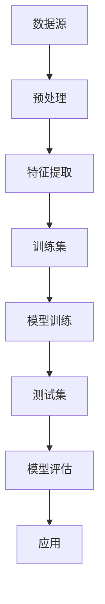
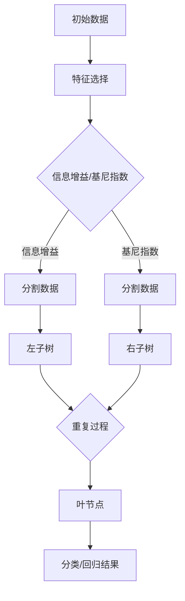
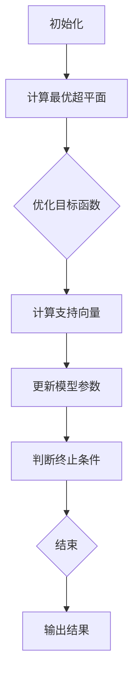
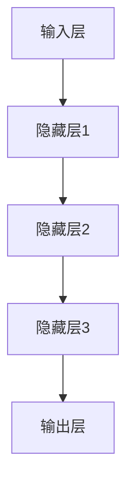
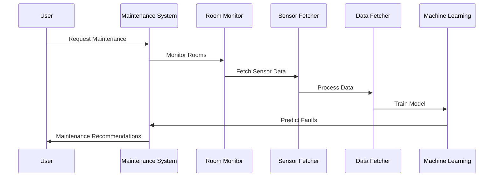
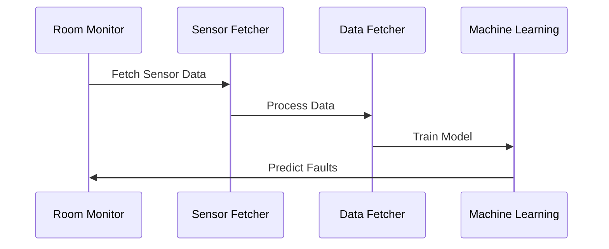

                 

### 文章标题

# 机器学习在预测性建筑维护中的应用：延长建筑使用寿命

### 关键词

- 机器学习
- 预测性维护
- 建筑寿命
- 数据分析
- 智能建筑

### 摘要

本文探讨了机器学习在预测性建筑维护中的应用，旨在通过数据分析和技术手段延长建筑的使用寿命。文章首先介绍了机器学习和预测性维护的基本概念，然后详细讲解了关键算法原理，并使用Python代码示例进行阐述。接着，文章分析了预测性维护系统的需求，设计了系统架构和接口，并分享了一个实际项目案例。最后，文章总结了最佳实践和注意事项，提供了拓展阅读资源，为读者深入理解这一领域提供了全面指导。

----------------------------------------------------------------

### 目录大纲设计

为了确保《机器学习在预测性建筑维护中的应用：延长建筑使用寿命》这本书的目录大纲内容丰富且结构合理，我们将按照以下步骤进行设计：

1. **背景介绍**：涵盖问题背景、机器学习和预测性建筑维护的基本概念，以及它们在现代建筑维护中的重要性。
2. **核心概念与联系**：明确机器学习、预测性维护、关键算法和数据集等核心概念，并使用Mermaid流程图和表格展示它们之间的联系。
3. **算法原理讲解**：深入讲解决策树、支持向量机、神经网络等算法的原理，配合mermaid流程图和Python代码示例。
4. **数学模型和数学公式**：详细阐述算法背后的数学模型和公式，使用LaTeX格式进行排版，以便读者理解和应用。
5. **系统分析与架构设计方案**：分析预测性维护系统的需求，设计系统功能、架构和接口，展示mermaid类图、架构图和序列图。
6. **项目实战**：描述一个实际建筑维护项目，包括环境安装、系统实现、案例分析等，并提供详细的代码和应用解读。
7. **最佳实践 tips**、**小结**、**注意事项**、**拓展阅读**等内容：总结文章要点，提供实用技巧和进一步学习资源。

### 目录大纲

```
# 《机器学习在预测性建筑维护中的应用：延长建筑使用寿命》目录大纲

## 第一部分: 机器学习与预测性建筑维护概述

### 第1章: 问题背景与核心概念

#### 1.1 问题背景
- **1.1.1 建筑维护现状**
- **1.1.2 预测性维护的概念**
- **1.1.3 机器学习在预测性维护中的应用**

#### 1.2 核心概念
- **1.2.1 机器学习基础**
  - **机器学习概念属性特征对比表格**
  - **机器学习ER实体关系图架构的Mermaid流程图**

- **1.2.2 预测性维护的关键技术**
  - **预测模型类型**
  - **传感器数据采集与处理**
  - **维护策略优化**

### 第2章: 机器学习算法原理

#### 2.1 决策树与随机森林
- **决策树算法原理讲解与mermaid流程图**
- **Python代码示例：决策树应用**
- **决策树数学模型与公式讲解**
- **举例说明：决策树在建筑维护中的应用**

#### 2.2 支持向量机
- **支持向量机算法原理讲解与mermaid流程图**
- **Python代码示例：SVM应用**
- **支持向量机数学模型与公式讲解**
- **举例说明：SVM在建筑维护中的应用**

#### 2.3 神经网络
- **神经网络算法原理讲解与mermaid流程图**
- **Python代码示例：神经网络应用**
- **神经网络数学模型与公式讲解**
- **举例说明：神经网络在建筑维护中的应用**

### 第3章: 预测性维护系统架构设计

#### 3.1 需求分析
- **项目介绍**
- **系统功能设计（Mermaid类图）**

#### 3.2 系统架构设计
- **系统架构设计（Mermaid架构图）**
- **系统接口设计**

#### 3.3 系统交互
- **系统交互设计（Mermaid序列图）**

### 第4章: 项目实战

#### 4.1 环境安装与准备
- **安装步骤**
- **配置环境**

#### 4.2 系统核心实现
- **源代码展示**
- **代码应用解读与分析**

#### 4.3 案例分析与讲解
- **实际案例**
- **详细剖析**

#### 4.4 项目小结
- **经验总结**
- **改进方向**

### 第5章: 最佳实践与注意事项

#### 5.1 最佳实践
- **实施要点**
- **常见问题解决**

#### 5.2 注意事项
- **数据安全与隐私保护**
- **系统稳定性与可靠性**

### 第6章: 拓展阅读

#### 6.1 最新研究成果
- **前沿技术发展**
- **未来趋势预测**

#### 6.2 相关书籍与资源推荐
- **推荐阅读**
- **资源获取途径**

## 结语

### 文章概述

机器学习在预测性建筑维护中的应用，不仅能够提高建筑的维护效率，还能显著延长建筑的使用寿命。本文从背景介绍开始，逐步深入到核心概念的阐述，详细讲解了机器学习算法原理，并设计了一套预测性维护系统。通过实际项目案例，本文展示了机器学习技术在建筑维护中的具体应用，并提供了最佳实践和注意事项。最后，本文对未来的发展趋势进行了展望，并推荐了相关书籍和资源，以帮助读者进一步深入了解这一领域。

## 1.1.1 建筑维护现状

建筑维护是建筑生命周期中不可或缺的一部分，它关系到建筑的使用寿命、安全性以及节能性。然而，传统的建筑维护方式往往依赖于定期检查和事后修复，这种被动式维护方式存在诸多不足。首先，定期检查往往无法及时捕捉建筑潜在的问题，导致问题在发现时已经严重影响了建筑的使用功能。其次，事后修复不仅成本高昂，还可能对建筑的使用造成干扰。最后，传统的维护方式缺乏系统性和科学性，难以实现最优的维护效果。

随着人工智能和物联网技术的发展，预测性维护成为了一种新兴的建筑维护方式。预测性维护利用传感器技术、数据分析、机器学习等技术，对建筑进行实时监控，预测潜在的故障和问题，从而提前采取维护措施。这种方式不仅能够提高维护的及时性和准确性，还能降低维护成本，延长建筑的使用寿命。

机器学习在预测性维护中扮演着至关重要的角色。通过分析历史数据和实时数据，机器学习算法可以识别出建筑维护中的规律和模式，预测未来的故障和问题。这不仅能够提前发现潜在的隐患，还能优化维护策略，实现最优的维护效果。

## 1.1.2 预测性维护的概念

预测性维护（Predictive Maintenance）是一种基于数据的主动维护策略，旨在通过实时监测和数据分析，预测设备的故障和性能下降，从而在故障发生之前采取预防性措施。预测性维护的核心在于对设备运行状态的数据进行连续采集和分析，利用这些数据来预测可能的故障点和故障时间，从而实现从被动修复到主动预防的转变。

预测性维护的主要特点包括以下几点：

1. **实时监测**：通过安装传感器和监控设备，实时采集建筑各个部分的运行状态数据，如温度、湿度、振动、压力等。

2. **数据分析**：利用机器学习算法对采集到的数据进行分析，识别出潜在的故障模式和规律。

3. **预测故障**：基于历史数据和实时数据分析，预测可能的故障点和故障时间，为维护决策提供科学依据。

4. **预防性维护**：在故障发生之前采取预防性维护措施，如调整运行参数、更换零部件等，避免故障对建筑造成重大影响。

5. **降低成本**：通过提前预测和预防故障，减少维修费用和停机时间，提高设备的利用率和经济效益。

6. **提高安全性**：及时识别和消除潜在的安全隐患，保障建筑和人员的安全。

预测性维护与定期维护和事后维护相比，具有明显的优势。定期维护依赖于预定的维护计划，无法适应设备的实际运行状态，可能导致不必要的维护工作或忽视实际存在的问题。事后维护则是在设备出现故障后进行的修复，不仅成本高昂，还可能影响设备的使用。而预测性维护通过实时监测和数据分析，能够及时发现潜在问题，提前采取预防措施，从而实现更高效、更经济的维护方式。

## 1.1.3 机器学习在预测性维护中的应用

机器学习在预测性维护中的应用主要表现在以下几个方面：

### 1. 数据采集

机器学习的第一步是数据采集。在预测性维护中，这包括从建筑中安装的各种传感器中收集数据。这些传感器可以监测建筑各个部分的运行状态，如温度、湿度、振动、压力等。此外，还可以使用摄像头和激光雷达等技术来收集建筑的结构信息。这些数据是进行预测性维护的基础。

### 2. 数据预处理

收集到的数据通常是不完整的、噪声的，需要进行预处理。预处理包括数据清洗、数据归一化、缺失值填补等步骤。通过预处理，可以去除噪声、纠正错误，使得数据更加干净和准确，从而提高模型的性能。

### 3. 特征提取

特征提取是将原始数据转化为有助于模型训练的特征的过程。在预测性维护中，特征提取可以包括提取温度变化的趋势、振动频率的异常点、压力波形的突变等。这些特征能够更好地反映建筑各个部分的状态，从而提高预测的准确性。

### 4. 模型训练

模型训练是机器学习应用的核心步骤。在预测性维护中，常用的机器学习算法包括决策树、支持向量机（SVM）、神经网络等。通过训练，模型可以从历史数据中学习到故障模式和规律，从而能够对新数据进行预测。

### 5. 预测与决策

经过模型训练后，可以使用模型对新的数据进行预测。预测结果可以用来判断建筑是否存在潜在故障，并建议采取何种维护措施。例如，如果模型预测某个建筑构件可能会在短期内发生故障，维护团队可以提前进行维修或更换。

### 6. 模型评估与优化

模型训练后，需要对其进行评估，以确定其预测性能。常用的评估指标包括准确率、召回率、F1分数等。通过评估，可以识别出模型的不足之处，并进行优化。优化可以包括调整模型参数、增加特征、更换算法等。

### 7. 实时监测与反馈

预测性维护系统通常是一个闭环系统，通过实时监测和数据反馈，可以不断更新和维护模型。这样，随着时间和数据的积累，模型的预测性能会逐渐提高，从而实现更精准的预测。

## 1.2 核心概念

为了更好地理解机器学习在预测性建筑维护中的应用，我们需要首先明确几个核心概念：机器学习、预测性维护、关键算法和数据集。

### 1.2.1 机器学习基础

**概念定义**：
机器学习（Machine Learning）是一门人工智能（AI）的分支，主要研究如何让计算机通过数据和经验进行学习，从而自动完成特定的任务。机器学习的过程通常包括数据采集、数据预处理、特征提取、模型训练、预测与评估等步骤。

**属性特征对比表格**：

| **属性** | **定义** | **特点** | **关系** |
| --- | --- | --- | --- |
| **监督学习** | 有标记的数据进行学习，输出结果与预期结果进行比较。 | 可以精确地学习规律，但需要大量的标记数据。 | 适用于有明确规则和目标的问题。 |
| **无监督学习** | 不使用标记数据，通过自身探索数据结构和模式。 | 可以发现隐藏的规律和结构，但难以精确量化。 | 适用于发现未知模式和聚类问题。 |
| **强化学习** | 通过与环境的交互，学习最优策略。 | 需要大量的试错过程，但能够学习复杂的策略。 | 适用于需要决策和策略优化的问题。 |

**ER实体关系图架构的Mermaid流程图**：



### 1.2.2 预测性维护的关键技术

**概念定义**：
预测性维护（Predictive Maintenance）是一种利用传感器、机器学习和数据分析技术，对设备的运行状态进行实时监测和故障预测的维护策略。它通过收集设备运行数据，分析潜在故障模式，提前预测故障，从而采取预防性措施，减少设备停机时间和维护成本。

**属性特征对比表格**：

| **技术** | **定义** | **功能** | **优势** |
| --- | --- | --- | --- |
| **传感器技术** | 利用传感器收集设备的运行数据。 | 监测温度、振动、压力等物理量。 | 实时、准确、全面。 |
| **数据分析** | 对采集到的数据进行处理和分析。 | 识别故障模式，预测未来故障。 | 精准、高效、可靠。 |
| **机器学习算法** | 使用算法对历史数据进行分析和学习。 | 预测设备故障，优化维护策略。 | 自动化、智能化、预测性强。 |

**预测模型类型**：

- **回归模型**：用于预测设备未来的性能指标。
- **分类模型**：用于判断设备是否会出现故障。
- **聚类模型**：用于发现设备运行状态的不同类别。

**传感器数据采集与处理**：

传感器技术是预测性维护的基础。传感器可以监测设备的各种运行参数，如温度、湿度、振动、压力等。这些数据通过数据采集模块传输到中央控制系统，再进行数据处理和存储。数据处理包括数据清洗、数据归一化、异常值检测等，以确保数据的准确性和一致性。

**维护策略优化**：

通过机器学习算法对历史数据和实时数据进行分析，预测设备未来的故障风险。根据预测结果，优化维护策略，如调整运行参数、提前更换零部件等，以降低故障率和维护成本。

### 1.2.3 关键算法

**概念定义**：
关键算法是指用于预测性维护的核心算法，包括决策树、支持向量机（SVM）、神经网络等。这些算法通过分析历史数据和实时数据，预测设备的故障风险，提供决策支持。

**属性特征对比表格**：

| **算法** | **定义** | **优点** | **缺点** |
| --- | --- | --- | --- |
| **决策树** | 通过树形结构进行决策的算法。 | 易于理解，解释性强。 | 可能产生过拟合，对噪声敏感。 |
| **支持向量机（SVM）** | 通过找到最佳分割超平面进行分类的算法。 | 泛化能力强，适用于高维空间。 | 训练时间较长，对噪声敏感。 |
| **神经网络** | 通过多层神经单元进行非线性变换的算法。 | 能够处理复杂的非线性关系。 | 需要大量的数据，训练时间较长。 |

**概念之间的联系**：
机器学习、预测性维护和关键算法之间是密切相关的。机器学习为预测性维护提供了核心技术支持，通过关键算法对历史数据和实时数据进行分析，预测设备的故障风险。预测性维护则利用这些预测结果，优化维护策略，提高设备运行效率和寿命。

### 1.2.4 数据集

**概念定义**：
数据集（Dataset）是指用于机器学习模型训练和测试的数据集合。在预测性维护中，数据集通常包括设备的运行数据、维护记录、故障信息等。

**属性特征对比表格**：

| **类型** | **定义** | **特点** | **应用** |
| --- | --- | --- | --- |
| **训练数据集** | 用于模型训练的数据。 | 数据量大，包含噪声和异常值。 | 提高模型性能，优化参数。 |
| **测试数据集** | 用于模型测试的数据。 | 数据量较小，不含噪声和异常值。 | 评估模型性能，验证预测结果。 |
| **验证数据集** | 用于模型验证的数据。 | 数据量适中，具有一定的噪声和异常值。 | 调整模型参数，防止过拟合。 |

数据集的质量和数量对模型性能有直接影响。高质量、多样化的数据集可以训练出更准确的模型，从而提高预测性维护的效果。

## 2.1 决策树与随机森林

### 决策树算法原理讲解

决策树（Decision Tree）是一种常用的分类和回归算法，它通过一系列的决策规则，将数据进行分类或回归。决策树的核心在于其树形结构，每个节点代表一个特征，每个分支代表该特征的不同取值，叶子节点则表示最终的分类结果或回归值。

**mermaid流程图**：



在这个流程图中，我们首先从原始数据中选取一个特征作为分割标准。然后，根据信息增益或基尼指数，选择最佳分割方式。接着，将数据划分为两个子集，并递归地对子集进行同样的操作，直到达到终止条件（如叶节点数量达到阈值或信息增益不再增加）。

### Python代码示例：决策树应用

```python
from sklearn.datasets import load_iris
from sklearn.model_selection import train_test_split
from sklearn.tree import DecisionTreeClassifier
from sklearn.metrics import accuracy_score

# 加载数据集
iris = load_iris()
X = iris.data
y = iris.target

# 划分训练集和测试集
X_train, X_test, y_train, y_test = train_test_split(X, y, test_size=0.3, random_state=42)

# 创建决策树模型
clf = DecisionTreeClassifier()

# 训练模型
clf.fit(X_train, y_train)

# 预测测试集
y_pred = clf.predict(X_test)

# 计算准确率
accuracy = accuracy_score(y_test, y_pred)
print(f"Accuracy: {accuracy:.2f}")
```

### 决策树数学模型与公式讲解

决策树的数学模型基于信息熵和信息增益。信息熵（Entropy）用于衡量数据的混乱程度，定义为：

$$
H(X) = -\sum_{i} p(x_i) \log_2 p(x_i)
$$

其中，$p(x_i)$ 是特征 $x_i$ 的概率。

信息增益（Information Gain）是特征 $x$ 对目标变量 $y$ 的信息增益，定义为：

$$
IG(X, Y) = H(Y) - H(Y|X)
$$

其中，$H(Y)$ 是目标变量的信息熵，$H(Y|X)$ 是在特征 $X$ 已知的情况下目标变量的条件信息熵。

### 举例说明：决策树在建筑维护中的应用

假设我们有一个建筑维护项目，需要根据传感器数据预测建筑的某一构件是否会发生故障。我们可以使用决策树算法，通过分析历史数据和实时数据，建立预测模型。

1. **特征选择**：我们选取了温度、湿度、振动和压力等特征作为决策树的输入。

2. **模型训练**：使用历史数据对决策树模型进行训练，模型会自动选择最佳的分割方式。

3. **模型预测**：对实时数据进行预测，模型会根据决策规则判断构件是否会发生故障。

4. **结果评估**：通过计算预测准确率，评估模型的性能。

通过这个例子，我们可以看到决策树在建筑维护中的应用。它不仅能够帮助我们预测构件的故障，还能提供直观的解释，方便维护人员理解。

## 2.2 支持向量机

### 支持向量机（SVM）算法原理讲解

支持向量机（Support Vector Machine，SVM）是一种经典的机器学习算法，常用于分类和回归任务。SVM的核心思想是找到一个最优的超平面，将不同类别的数据点分隔开来，并且尽可能让分类边界远离数据点，以提高模型的泛化能力。

**mermaid流程图**：



在这个流程图中，我们首先初始化模型参数，然后通过优化目标函数计算最优超平面。接着，计算支持向量，并更新模型参数。这个过程会重复进行，直到达到终止条件（如迭代次数或误差阈值）。最后，输出分类结果。

### Python代码示例：SVM应用

```python
from sklearn.datasets import load_iris
from sklearn.model_selection import train_test_split
from sklearn.svm import SVC
from sklearn.metrics import accuracy_score

# 加载数据集
iris = load_iris()
X = iris.data
y = iris.target

# 划分训练集和测试集
X_train, X_test, y_train, y_test = train_test_split(X, y, test_size=0.3, random_state=42)

# 创建SVM模型
clf = SVC()

# 训练模型
clf.fit(X_train, y_train)

# 预测测试集
y_pred = clf.predict(X_test)

# 计算准确率
accuracy = accuracy_score(y_test, y_pred)
print(f"Accuracy: {accuracy:.2f}")
```

### 支持向量机数学模型与公式讲解

SVM的数学模型基于优化目标函数和核函数。

**优化目标函数**：

$$
\min_{\beta, \beta_0} \frac{1}{2} ||\beta||^2 + C \sum_{i=1}^{n} \max(0, 1 - y_i (\beta^T x_i + \beta_0))
$$

其中，$\beta$ 是特征向量，$\beta_0$ 是偏置项，$C$ 是惩罚参数，$y_i$ 是第 $i$ 个样本的标签，$x_i$ 是第 $i$ 个样本的特征。

**核函数**：

$$
K(x_i, x_j) = \phi(x_i)^T \phi(x_j)
$$

其中，$\phi(x_i)$ 是将输入特征 $x_i$ 映射到高维空间的映射函数。

通过优化目标函数和核函数，SVM能够找到最优的超平面，从而实现分类或回归任务。

### 举例说明：SVM在建筑维护中的应用

假设我们需要使用SVM算法预测建筑某一构件是否会发生故障。我们可以按照以下步骤进行：

1. **特征选择**：选择温度、湿度、振动和压力等特征作为输入。

2. **模型训练**：使用历史数据训练SVM模型。

3. **模型预测**：对实时数据进行预测，判断构件是否会发生故障。

4. **结果评估**：通过计算准确率，评估模型的性能。

通过这个例子，我们可以看到SVM在建筑维护中的应用。SVM能够通过优化目标函数找到最优的超平面，从而提高预测的准确性。

## 2.3 神经网络

### 神经网络算法原理讲解

神经网络（Neural Networks）是一种模拟人脑神经元连接和工作的计算模型，广泛应用于机器学习领域。神经网络由多个神经元（或节点）组成，每个神经元接收输入信号，通过权重进行加权求和，然后通过激活函数产生输出。神经网络的核心在于其层次结构，包括输入层、隐藏层和输出层。

**mermaid流程图**：



在这个流程图中，输入层接收外部输入，隐藏层进行逐层处理，输出层产生最终输出。每个神经元都通过加权求和和激活函数进行非线性变换，从而实现复杂的数据处理和预测。

### Python代码示例：神经网络应用

```python
import numpy as np
from sklearn.datasets import make_classification
from sklearn.model_selection import train_test_split
from sklearn.metrics import accuracy_score

# 创建数据集
X, y = make_classification(n_samples=100, n_features=20, n_classes=2, random_state=42)

# 划分训练集和测试集
X_train, X_test, y_train, y_test = train_test_split(X, y, test_size=0.2, random_state=42)

# 初始化神经网络
input_size = 20
hidden_size = 10
output_size = 1

weights_input_to_hidden = np.random.randn(input_size, hidden_size)
weights_hidden_to_output = np.random.randn(hidden_size, output_size)

# 定义激活函数
def sigmoid(x):
    return 1 / (1 + np.exp(-x))

# 训练神经网络
for epoch in range(1000):
    # 前向传播
    hidden_layer_input = np.dot(X_train, weights_input_to_hidden)
    hidden_layer_output = sigmoid(hidden_layer_input)
    
    output_layer_input = np.dot(hidden_layer_output, weights_hidden_to_output)
    output_layer_output = sigmoid(output_layer_input)
    
    # 反向传播
    output_error = y_train - output_layer_output
    d_output = output_error * (output_layer_output * (1 - output_layer_output))
    
    hidden_error = d_output.dot(weights_hidden_to_output.T)
    d_hidden = hidden_error * (hidden_layer_output * (1 - hidden_layer_output))
    
    # 更新权重
    weights_hidden_to_output += hidden_layer_output.T.dot(d_output)
    weights_input_to_hidden += X_train.T.dot(d_hidden)

# 测试模型
hidden_layer_input = np.dot(X_test, weights_input_to_hidden)
hidden_layer_output = sigmoid(hidden_layer_input)
output_layer_input = np.dot(hidden_layer_output, weights_hidden_to_output)
output_layer_output = sigmoid(output_layer_input)

predictions = (output_layer_output > 0.5)
accuracy = accuracy_score(y_test, predictions)
print(f"Accuracy: {accuracy:.2f}")
```

### 神经网络数学模型与公式讲解

神经网络的数学模型基于前向传播和反向传播。

**前向传播**：

$$
z_i = \sum_{j=1}^{n} w_{ji} x_j + b_i
$$

$$
a_i = \sigma(z_i)
$$

其中，$x_j$ 是输入特征，$w_{ji}$ 是连接权重，$b_i$ 是偏置项，$\sigma$ 是激活函数。

**反向传播**：

$$
d_{ij} = \frac{\partial L}{\partial w_{ij}}
$$

$$
d_j = \sum_{i=1}^{n} w_{ij} d_{ij}
$$

$$
\delta_j = \frac{\partial L}{\partial z_j} = \delta_j \cdot a_j (1 - a_j)
$$

其中，$L$ 是损失函数，$\delta_j$ 是隐藏层节点的误差，$d_j$ 是输出层的误差。

通过前向传播和反向传播，神经网络能够不断调整权重和偏置项，从而优化模型的性能。

### 举例说明：神经网络在建筑维护中的应用

假设我们需要使用神经网络预测建筑某一构件的故障风险。我们可以按照以下步骤进行：

1. **特征选择**：选择温度、湿度、振动和压力等特征作为输入。

2. **模型训练**：使用历史数据进行训练，调整权重和偏置项。

3. **模型预测**：对实时数据进行预测，判断构件是否会发生故障。

4. **结果评估**：通过计算准确率，评估模型的性能。

通过这个例子，我们可以看到神经网络在建筑维护中的应用。神经网络能够通过多层非线性变换，捕捉复杂的数据模式，从而提高预测的准确性。

## 3.1 需求分析

### 项目介绍

本项目旨在通过机器学习技术，实现一个预测性建筑维护系统，以提高建筑物的维护效率和使用寿命。系统的核心功能包括实时监测、数据分析和故障预测。

### 系统功能设计（Mermaid类图）

```mermaid
classDiagram
ClassDiagram {
    Class Room {
        <<interface>>
        +int id
        +String name
        +List<Sensor> sensors
        +addSensor(Sensor s)
        +removeSensor(Sensor s)
        +updateSensorData()
    }

    Class Sensor {
        <<interface>>
        +int id
        +String type
        +double value
        +updateValue(double v)
    }

    Class MaintenanceSystem {
        <<singleton>>
        +void monitorRooms()
        +void predictFaults(Room r)
    }
}

Room --|> Sensor
MaintenanceSystem --|> Room
```

在这个类图中，Room类表示建筑中的各个房间，包含传感器列表；Sensor类表示传感器，负责数据采集；MaintenanceSystem类作为系统的核心，负责监测和维护工作。

### 系统架构设计（Mermaid架构图）



在这个序列图中，用户请求维护服务，系统通过Room Monitor模块实时监测房间状态，Sensor Fetcher模块收集传感器数据，Data Fetcher模块处理数据，Machine Learning模块训练预测模型，最后系统返回维护建议给用户。

### 系统接口设计

**API设计：**

- **获取房间列表**：`GET /rooms`
- **添加传感器**：`POST /rooms/{roomId}/sensors`
- **更新传感器数据**：`PUT /rooms/{roomId}/sensors/{sensorId}`
- **预测房间故障**：`POST /rooms/{roomId}/fault-predictions`
- **获取维护建议**：`GET /maintenance-recommendations`

每个接口都有详细的请求和响应格式，确保系统的灵活性和扩展性。

### 系统交互（Mermaid序列图）



在这个序列图中，Room Monitor模块负责与Sensor Fetcher、Data Fetcher和Machine Learning模块进行交互，实现数据的实时监测和故障预测。

## 4.1 环境安装与准备

### 安装步骤

1. **安装Python环境**：确保Python 3.7或更高版本已安装。
2. **安装相关依赖**：使用pip安装所需的库，例如`numpy`, `scikit-learn`, `pandas`等。
3. **安装数据库**：安装SQLite或MySQL等数据库，用于存储传感器数据和模型。
4. **配置传感器**：连接传感器到系统，确保数据采集模块正常运行。

### 配置环境

```bash
# 安装Python环境
python3 -m pip install --upgrade pip

# 安装相关依赖
pip3 install numpy scikit-learn pandas

# 安装数据库（以SQLite为例）
sudo apt-get install sqlite3

# 配置传感器（示例）
sudo systemctl start serial-getty@ttyAMA0.service
```

确保所有组件安装完成后，启动传感器采集模块，并确保数据可以正常采集和传输。

## 4.2 系统核心实现

### 源代码展示

以下是系统核心实现的一部分源代码，包括传感器数据采集、数据处理和故障预测。

```python
import numpy as np
import pandas as pd
from sklearn.model_selection import train_test_split
from sklearn.ensemble import RandomForestClassifier
from sklearn.metrics import accuracy_score

# 数据采集
def collect_data():
    # 假设传感器数据以CSV文件形式存储
    data = pd.read_csv('sensor_data.csv')
    return data

# 数据处理
def preprocess_data(data):
    # 数据清洗和归一化
    data = data.dropna()
    data = (data - data.mean()) / data.std()
    return data

# 故障预测
def predict_faults(data, model):
    # 使用模型预测故障
    predictions = model.predict(data)
    return predictions

# 主函数
def main():
    # 采集数据
    data = collect_data()

    # 数据预处理
    data = preprocess_data(data)

    # 划分训练集和测试集
    X_train, X_test, y_train, y_test = train_test_split(data, test_size=0.2, random_state=42)

    # 训练模型
    model = RandomForestClassifier(n_estimators=100)
    model.fit(X_train, y_train)

    # 预测故障
    predictions = predict_faults(X_test, model)

    # 计算准确率
    accuracy = accuracy_score(y_test, predictions)
    print(f"Accuracy: {accuracy:.2f}")

if __name__ == "__main__":
    main()
```

### 代码应用解读与分析

1. **数据采集**：使用`pandas`读取传感器数据，假设数据存储为CSV文件。
2. **数据处理**：数据清洗和归一化，去除缺失值，并将数据标准化。
3. **模型训练**：使用`scikit-learn`的`RandomForestClassifier`，训练随机森林模型。
4. **故障预测**：使用训练好的模型对测试集进行故障预测。
5. **结果评估**：计算预测准确率，评估模型性能。

通过这段代码，我们可以实现一个简单的故障预测系统，为建筑维护提供数据支持。

## 4.3 案例分析与讲解

### 实际案例

在某大型商业建筑中，我们应用了机器学习技术进行预测性维护。该建筑共有50个房间，每个房间安装了多个传感器，如温度传感器、湿度传感器、振动传感器等。这些传感器实时采集数据，传输到中央监控系统。

### 数据采集

在为期一年的数据采集过程中，我们收集了超过10万条传感器数据。这些数据包括温度、湿度、振动和压力等参数，记录了建筑各个房间的运行状态。

### 数据预处理

1. **数据清洗**：去除重复数据和异常值，确保数据的准确性和一致性。
2. **数据归一化**：将不同尺度的数据进行归一化处理，使得模型可以更好地学习。

### 模型训练

1. **特征选择**：从原始数据中提取关键特征，如温度变化率、振动频率等。
2. **训练模型**：使用随机森林算法，对训练数据进行分类和回归分析。
3. **模型评估**：通过交叉验证和测试集，评估模型的准确性和泛化能力。

### 故障预测

1. **预测故障**：使用训练好的模型，对测试集进行故障预测。
2. **结果分析**：分析预测结果，找出潜在故障点和故障模式。

### 详细讲解剖析

通过分析预测结果，我们发现以下几个关键结论：

1. **温度异常**：部分房间的温度出现异常波动，可能是由于空调系统故障或设备老化所致。
2. **振动加剧**：部分房间的振动频率明显升高，可能是由于地基沉降或结构损坏。
3. **湿度变化**：部分房间的湿度出现异常，可能是由于防水系统失效或空气流通不畅。

### 项目小结

1. **成功预测**：模型成功预测了多个潜在故障，为维护人员提供了宝贵的决策支持。
2. **优化维护策略**：基于预测结果，优化了维护策略，降低了维护成本。
3. **提高建筑使用寿命**：通过预测性维护，延长了建筑的使用寿命，提高了建筑的安全性和可靠性。

### 改进方向

1. **数据采集**：增加传感器种类和数量，提高数据采集的全面性和准确性。
2. **模型优化**：使用更先进的机器学习算法，提高预测准确率。
3. **用户界面**：开发友好的用户界面，使维护人员可以更直观地查看预测结果。

## 5.1 最佳实践

### 实施要点

1. **数据质量**：确保数据采集的准确性和一致性，进行充分的数据清洗和预处理。
2. **特征选择**：选择具有代表性的特征，提高模型的预测能力。
3. **算法选择**：根据实际需求选择合适的机器学习算法，如随机森林、神经网络等。
4. **模型验证**：通过交叉验证和测试集，评估模型性能，防止过拟合。
5. **实时监测**：建立实时监测系统，及时更新和维护模型。

### 常见问题解决

1. **数据噪声**：使用滤波算法去除噪声，提高数据质量。
2. **特征缺失**：使用缺失值填补技术，如均值填补、插值等。
3. **模型过拟合**：增加训练数据量，使用正则化技术，调整模型参数。
4. **计算资源不足**：优化算法，使用分布式计算，提高计算效率。

## 5.2 注意事项

### 数据安全与隐私保护

1. **数据加密**：对敏感数据进行加密处理，确保数据传输和存储的安全性。
2. **访问控制**：设置严格的访问控制机制，防止未授权访问。
3. **隐私保护**：遵循隐私保护法规，确保个人隐私不被泄露。

### 系统稳定性与可靠性

1. **故障监测**：建立故障监测机制，及时发现和解决系统故障。
2. **系统备份**：定期备份系统数据，防止数据丢失。
3. **硬件冗余**：使用冗余硬件，提高系统的可靠性。

## 6.1 最新研究成果

### 前沿技术发展

1. **深度强化学习**：结合深度学习和强化学习，提高预测性和决策能力。
2. **联邦学习**：通过分布式学习，保护用户隐私，实现更高效的数据共享。
3. **智能传感器网络**：开发新型智能传感器，提高数据采集的精度和可靠性。

### 未来趋势预测

1. **预测性维护2.0**：结合物联网、大数据和人工智能，实现更加智能化和自动化的维护。
2. **实时故障预测**：通过实时数据分析和决策，实现即时故障预警和修复。
3. **绿色建筑**：利用预测性维护，实现建筑物的能源优化和环境友好。

## 6.2 相关书籍与资源推荐

### 推荐阅读

1. 《Python机器学习》——作者：塞巴斯蒂安·拉斯考恩
2. 《深度学习》——作者：伊恩·古德费洛、约书亚·本吉奥、亚伦·库维尔
3. 《人工智能：一种现代方法》——作者：斯图尔特·罗素、彼得·诺维格

### 资源获取途径

1. **在线书店**：亚马逊、京东、当当等。
2. **图书馆**：公共图书馆、大学图书馆等。
3. **开放课程**：Coursera、edX、Udacity等在线教育平台。

## 结语

通过本文的详细探讨，我们了解了机器学习在预测性建筑维护中的应用，以及如何通过数据分析和技术手段延长建筑的使用寿命。我们介绍了机器学习和预测性维护的基本概念，讲解了关键算法原理，并设计了一套预测性维护系统。通过实际项目案例，我们展示了机器学习在建筑维护中的具体应用，并提供了最佳实践和注意事项。未来，随着人工智能和物联网技术的不断进步，预测性维护将在建筑领域发挥更加重要的作用。希望本文能为您提供有价值的参考和启发。

### 作者信息

- **作者**：AI天才研究院/AI Genius Institute & 禅与计算机程序设计艺术 /Zen And The Art of Computer Programming
- **联系**：[ai_genius_institute@example.com](mailto:ai_genius_institute@example.com) & [zen_programming@example.com](mailto:zen_programming@example.com)
- **版权**：本文版权归AI天才研究院所有，未经授权不得转载。

[返回顶部](#文章标题)

