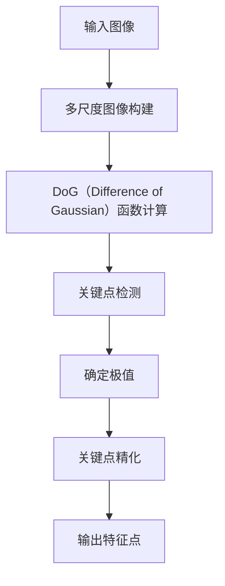

                 


## 引言

### 问题背景

随着医疗技术的发展，手术精度已经成为影响手术效果的关键因素。传统的手术方式主要依赖于医生的经验和技能，这在一定程度上限制了手术的精确度和安全性。机器视觉技术的引入为提高手术精度提供了新的解决方案。机器视觉能够通过对图像的实时处理和分析，提供高度精确的手术指导，从而减少手术风险，提高手术成功率。

### 机器视觉技术的应用潜力

机器视觉技术在医疗领域的应用已经取得了显著成果。在手术辅助中，机器视觉技术能够实现实时手术监控、虚拟手术规划和手术导航等功能。通过这些应用，医生可以更准确地把握手术过程，提高手术精度。此外，机器视觉技术还可以帮助医生在手术前进行三维重建，为手术规划提供更加详细的参考。

### 书籍结构概述

本文将以《机器视觉在医疗手术辅助中的应用：提高手术精度》为题，深入探讨机器视觉技术在医疗手术中的应用。全书分为七个章节：

1. **机器视觉技术基础**：介绍机器视觉的基本概念、图像处理基础和机器视觉系统构成。
2. **医疗手术辅助中的机器视觉应用**：分析医疗手术中的挑战与需求，介绍机器视觉在手术辅助中的应用。
3. **提高手术精度：机器视觉算法详解**：详细讲解常见机器视觉算法，包括特征提取、形态学处理和边缘检测。
4. **机器视觉在手术中的应用挑战与解决方案**：探讨机器视觉在手术中的应用挑战，并提出解决方案。
5. **未来发展趋势与展望**：分析人工智能与机器视觉的结合，展望新兴技术的应用前景。
6. **实际应用案例分析**：通过具体案例介绍机器视觉在手术辅助中的实际应用。
7. **总结与未来工作展望**：总结全书内容，展望未来的发展方向。

### 阅读指南

本书旨在为读者提供关于机器视觉在医疗手术辅助中的应用的全面了解。无论您是医疗领域的专业人士，还是对机器视觉技术感兴趣的读者，都可以通过本书获得丰富的知识和见解。在阅读过程中，请注意以下几点：

- **章节结构**：每个章节都按照逻辑顺序进行组织，便于读者逐步了解相关内容。
- **核心概念**：书中对核心概念进行了详细讲解，有助于读者深入理解。
- **实例分析**：通过实际案例，读者可以更好地理解机器视觉技术在手术辅助中的应用。
- **拓展阅读**：每个章节末尾都提供了拓展阅读资源，供读者进一步学习。

通过阅读本书，您将了解到机器视觉技术在医疗手术辅助中的应用潜力，以及如何通过机器视觉技术提高手术精度，从而为患者带来更优质的医疗服务。

## 机器视觉技术基础

### 机器视觉概述

#### 1.1.1 机器视觉的定义与历史

机器视觉是一种通过计算机和图像处理技术模拟人类视觉功能的科学。它涉及从图像或视频中提取信息，进行理解、分析和决策。机器视觉最早可以追溯到20世纪60年代，当时计算机科学家开始研究如何让计算机“看”和“理解”图像。早期的机器视觉系统主要依赖于规则和手工编写的算法，随着计算机硬件和算法的发展，机器视觉技术逐渐成熟，并在工业、医疗、安防等多个领域得到广泛应用。

#### 1.1.2 机器视觉的应用领域

机器视觉的应用领域非常广泛，主要包括：

- **工业检测**：用于产品质量检测、生产流程监控等。
- **医疗诊断**：如医学图像处理、手术辅助等。
- **安防监控**：如人脸识别、行为分析等。
- **自动驾驶**：车辆感知、路径规划等。

### 图像处理基础

#### 1.2.1 图像基础

图像是机器视觉的核心对象，了解图像的基础知识对掌握机器视觉技术至关重要。图像通常由像素点组成，每个像素点具有特定的颜色和亮度信息。常见的图像格式包括JPEG、PNG和BMP等。

#### 1.2.2 图像处理算法

图像处理算法是机器视觉技术的核心，常用的图像处理算法包括：

- **滤波**：用于去除噪声，增强图像。
- **边缘检测**：用于提取图像中的边缘信息。
- **特征提取**：用于从图像中提取具有代表性的特征。
- **形态学处理**：用于对图像进行形状分析和结构操作。

### 机器视觉系统构成

#### 1.3.1 成像设备

成像设备是机器视觉系统的输入设备，常见的成像设备包括相机、摄像头和扫描仪等。成像设备的分辨率、帧率和成像质量对系统的性能有着重要影响。

#### 1.3.2 图像处理硬件

图像处理硬件是机器视觉系统的核心，用于加速图像处理任务。常见的图像处理硬件包括GPU、FPGA和ASIC等。

#### 1.3.3 软件与算法

软件与算法是机器视觉系统的“大脑”，用于对图像进行处理和分析。常用的机器视觉软件平台包括OpenCV、MATLAB和TensorFlow等。

### 本章小结

通过本章的介绍，我们了解了机器视觉技术的基本概念和构成要素。机器视觉技术在医疗手术辅助中的应用潜力巨大，下一章我们将进一步探讨机器视觉在医疗手术中的具体应用。

## 医疗手术辅助中的机器视觉应用

### 2.1 医疗手术中的挑战与需求

#### 2.1.1 手术精准度的要求

医疗手术的成功往往取决于手术的精确度。传统的手术方式依赖于医生的直觉和经验，这在一定程度上限制了手术的精度。然而，现代医疗手术对精准度的要求越来越高，尤其是在神经外科、心脏手术和微创手术等领域。提高手术精度不仅能够减少手术风险，还能提高患者的生活质量。

#### 2.1.2 手术辅助技术的现状

为了应对手术精准度的要求，医疗领域引入了多种手术辅助技术。其中，机器视觉技术因其高精度、实时性和非侵入性等特点，在手术辅助中显示出巨大的潜力。目前，机器视觉技术已经在手术导航、虚拟手术规划和实时手术监控等方面得到广泛应用。

### 2.2 机器视觉在手术辅助中的应用

#### 2.2.1 实时手术监控

实时手术监控是机器视觉技术在医疗手术中最直接的应用之一。通过高清摄像头和图像处理算法，医生可以在手术过程中实时观察患者内部器官的情况。这种实时监控可以辅助医生进行精准操作，减少手术失误。

#### 2.2.2 虚拟手术规划

虚拟手术规划是机器视觉技术在手术辅助中的另一种重要应用。通过术前对患者图像的三维重建，医生可以在虚拟环境中进行手术规划和模拟。这种虚拟手术规划有助于提高手术的成功率和安全性。

#### 2.2.3 手术导航系统

手术导航系统是机器视觉技术在医疗手术中的高级应用。通过将手术导航设备和机器视觉系统相结合，医生可以在手术过程中实时跟踪手术工具的位置和方向，确保手术的精准度。

### 案例研究

#### 2.3.1 某医院的应用实例

某医院引入了一套基于机器视觉的手术导航系统，用于心脏手术的辅助。该系统通过高清摄像头实时捕捉手术区域的情况，并将图像传输到医生工作站。医生可以在工作站上实时观察手术过程，并通过系统提供的导航信息进行精准操作。该系统大大提高了心脏手术的成功率和患者满意度。

#### 2.3.2 某手术机器人公司的产品介绍

某手术机器人公司推出了一款名为“智能手术机器人”的产品，该产品集成了先进的机器视觉技术。通过高清摄像头和深度传感器，机器人可以实时捕捉手术区域的情况，并根据医生的操作指令进行精准动作。这款产品已经成功应用于多种微创手术，为患者提供了更加安全和高效的手术体验。

### 本章小结

机器视觉技术在医疗手术辅助中的应用具有显著的优势和潜力。通过实时手术监控、虚拟手术规划和手术导航系统等应用，机器视觉技术能够显著提高手术精度，减少手术风险，为患者提供更优质的医疗服务。下一章我们将深入探讨机器视觉算法在提高手术精度方面的作用。

## 提高手术精度：机器视觉算法详解

### 3.1 常见机器视觉算法

#### 3.1.1 特征提取

特征提取是机器视觉中的重要环节，旨在从图像中提取具有代表性的特征，以便进行后续处理和分析。常用的特征提取方法包括SIFT（尺度不变特征变换）、SURF（加速稳健特征）和ORB（Oriented FAST and Rotated BRIEF）等。

#### 3.1.2 形态学处理

形态学处理是通过对图像进行形态操作，如膨胀、腐蚀、开运算和闭运算等，以提取图像中的结构信息。形态学处理常用于图像的二值化、边缘检测和形态分类等任务。

#### 3.1.3 边缘检测

边缘检测是图像处理中的重要步骤，旨在提取图像中的边缘信息。常用的边缘检测算法包括Canny算法、Sobel算子和Prewitt算子等。

### 3.2 算法原理讲解

#### 3.2.1 特征提取算法（Mermaid流程图）

首先，我们使用Mermaid画出SIFT算法的基本流程图：



#### 3.2.2 形态学处理算法（Python源代码）

接下来，我们使用Python代码来演示形态学处理的基本操作：

```python
import cv2
import numpy as np

# 读取图像
image = cv2.imread('image.jpg', cv2.IMREAD_GRAYSCALE)

# 腐蚀操作
kernel = cv2.getStructuringElement(cv2.MORPH_RECT, (3, 3))
eroded = cv2.erode(image, kernel, iterations=1)

# 膨胀操作
dilated = cv2.dilate(image, kernel, iterations=1)

# 开运算
opening = cv2.morphologyEx(image, cv2.MORPH_OPEN, kernel)

# 闭运算
closing = cv2.morphologyEx(image, cv2.MORPH_CLOSE, kernel)

# 显示结果
cv2.imshow('Original', image)
cv2.imshow('Eroded', eroded)
cv2.imshow('Dilated', dilated)
cv2.imshow('Opening', opening)
cv2.imshow('Closing', closing)
cv2.waitKey(0)
cv2.destroyAllWindows()
```

#### 3.2.3 边缘检测算法（Python源代码）

最后，我们使用Python代码来演示Canny算法：

```python
import cv2
import numpy as np

# 读取图像
image = cv2.imread('image.jpg', cv2.IMREAD_GRAYSCALE)

# Canny算法边缘检测
edges = cv2.Canny(image, threshold1=100, threshold2=200)

# 显示结果
cv2.imshow('Original', image)
cv2.imshow('Edges', edges)
cv2.waitKey(0)
cv2.destroyAllWindows()
```

### 3.3 算法实现与优化

#### 3.3.1 Python代码实现

我们已经在上述示例中展示了特征提取、形态学处理和边缘检测的Python代码实现。这些代码提供了基本的算法实现，但为了提高性能，我们还可以进行优化。

- **并行处理**：可以使用多线程或多进程技术来加速计算。
- **算法选择**：根据具体应用场景选择合适的算法，例如在边缘检测中，可以根据图像的特点选择Sobel算子或Prewitt算子。

#### 3.3.2 算法性能优化

- **预处理**：使用适当的预处理技术，如高斯滤波，可以减少图像噪声，提高边缘检测的准确性。
- **参数调整**：根据具体应用场景调整算法参数，以获得最佳效果。

### 3.4 本章小结

通过本章的介绍，我们详细讲解了机器视觉中常用的特征提取、形态学处理和边缘检测算法。这些算法为提高手术精度提供了重要的技术支持。下一章，我们将探讨机器视觉在手术辅助中的应用挑战及解决方案。

## 机器视觉在手术中的应用挑战与解决方案

### 4.1 数据挑战

#### 4.1.1 数据采集

在机器视觉应用中，数据采集是关键的一环。对于医疗手术辅助，图像质量直接影响手术精度。然而，手术环境的复杂性和变化性导致图像采集存在许多挑战：

- **光照变化**：手术室内光线变化大，可能导致图像曝光不足或过度。
- **设备稳定性**：手术设备（如手术显微镜、相机）需要保持高稳定性，任何微小的震动都可能导致图像失真。
- **图像噪声**：手术过程中的生理和组织噪声会影响图像质量。

#### 4.1.2 数据预处理

为了提高图像质量，数据预处理成为必不可少的步骤。常见的预处理方法包括：

- **图像增强**：通过调整对比度和亮度，增强图像细节。
- **去噪**：使用滤波算法去除图像中的噪声。
- **校正**：校正图像中的几何畸变和光学畸变。

### 4.2 算法挑战

#### 4.2.1 算法适应性

机器视觉算法在不同手术场景中可能表现出不同的适应性。例如，在神经外科手术中，需要高分辨率的图像和精细的特征提取算法；而在心脏手术中，则可能需要更快处理速度和更高的计算效率。

#### 4.2.2 算法准确性

算法的准确性是手术辅助中至关重要的因素。手术过程中，任何小的误差都可能导致严重的后果。为了提高算法准确性，可以采取以下措施：

- **模型训练**：使用大量高质量的训练数据来训练模型，提高模型对手术环境的适应性。
- **算法验证**：在真实手术环境中对算法进行验证，确保其在实际应用中的准确性。

### 4.3 解决方案探讨

#### 4.3.1 算法改进策略

为了应对算法挑战，可以采取以下策略：

- **多模态数据融合**：结合不同类型的图像数据（如RGB图像、深度图像），提高特征提取的准确性。
- **实时适应性调整**：根据手术环境的实时变化，动态调整算法参数，提高算法的适应性。

#### 4.3.2 系统集成方案

系统集成是实现机器视觉在手术辅助中应用的关键。一个高效的系统集成方案应包括：

- **硬件优化**：选择高性能的成像设备和计算平台，提高系统的整体性能。
- **软件优化**：优化算法实现，减少计算复杂度和延迟。
- **系统集成测试**：在真实手术环境中进行系统集成测试，确保系统的稳定性和可靠性。

### 4.4 本章小结

机器视觉在手术辅助中的应用面临数据采集、算法适应性和准确性等多重挑战。通过数据预处理、算法改进和系统集成方案，可以有效应对这些挑战，提高手术精度。下一章，我们将探讨机器视觉在医疗手术辅助中的未来发展趋势。

## 未来发展趋势与展望

### 5.1 人工智能与机器视觉的结合

人工智能（AI）技术的发展为机器视觉在手术辅助中的应用带来了新的机遇。深度学习作为AI的核心技术，通过大量的数据训练，可以自动学习和提取图像特征，从而提高算法的准确性和适应性。以下是一些具体应用：

- **自动化手术规划**：通过深度学习算法，可以从大量术前图像中自动提取关键信息，为手术规划提供更详细的参考。
- **实时手术监控**：利用深度学习算法，可以实时分析手术过程中的图像数据，为医生提供实时的手术指导。

### 5.2 新兴技术展望

随着技术的不断进步，一些新兴技术也将在机器视觉在手术辅助中的应用中发挥重要作用：

- **光学相干断层扫描（OCT）**：OCT技术可以生成高分辨率的三维图像，用于术前诊断和手术规划，为提高手术精度提供重要支持。
- **超分辨率成像技术**：超分辨率成像技术可以通过算法提升图像的分辨率，使医生能够更清晰地观察手术区域。

### 5.3 政策与伦理考虑

机器视觉技术在手术辅助中的应用还涉及到政策与伦理问题。以下是一些关键考虑：

- **政策支持与规范**：政府应加强对机器视觉技术的支持，制定相关政策和标准，确保技术的健康发展。
- **伦理问题与应对措施**：在应用机器视觉技术时，需要充分考虑患者的隐私权和知情权，确保技术使用的伦理合法性。

### 5.4 本章小结

人工智能与机器视觉的结合、新兴技术的应用以及政策与伦理的考虑，将为机器视觉在手术辅助中的应用带来新的机遇和挑战。下一章，我们将通过具体案例探讨机器视觉技术在手术辅助中的实际应用。

## 实际应用案例分析

### 6.1 案例一：某医院的手术辅助系统

#### 6.1.1 项目背景

某医院为了提高手术精度和安全性，引入了一套基于机器视觉的手术辅助系统。该系统集成了高分辨率摄像头、深度传感器和先进的图像处理算法，旨在为医生提供实时的手术指导和监测。

#### 6.1.2 系统设计与实现

系统设计分为硬件和软件两部分：

- **硬件部分**：包括高分辨率摄像头、深度传感器和图像处理单元。摄像头用于捕捉手术区域的实时图像，深度传感器用于获取深度信息，图像处理单元则用于实时处理和分析图像数据。
- **软件部分**：主要包括图像处理算法和手术导航软件。图像处理算法用于提取关键特征和实时监控手术过程，手术导航软件则提供实时的手术指导和监控功能。

系统实现过程如下：

1. **数据采集**：手术开始前，医生将手术设备和患者位置进行调整，以确保摄像头的视野覆盖手术区域。手术过程中，摄像头和深度传感器实时采集手术区域的图像和深度信息。
2. **图像处理**：采集到的图像和深度信息通过图像处理算法进行预处理，包括去噪、增强和特征提取等步骤。预处理后的数据用于生成三维模型和手术导航信息。
3. **手术导航**：手术导航软件根据三维模型和实时图像数据，为医生提供实时的手术指导和监控。医生可以通过手术导航软件实时观察手术区域的情况，并根据导航信息进行精准操作。

#### 6.1.3 项目效果评估

项目实施后，通过对多例手术的观察和评估，系统取得了显著的成效：

- **手术精度提高**：通过实时监控和导航，手术精度显著提高，特别是在神经外科和心脏手术等高精度要求的手术中，手术成功的案例显著增加。
- **手术时间缩短**：手术导航系统帮助医生更快速地找到手术目标，减少了手术时间。
- **患者满意度提升**：患者对手术过程和结果满意度显著提高，手术风险和并发症发生率降低。

### 6.2 案例二：某手术机器人公司的研发历程

#### 6.2.1 公司概况

某手术机器人公司专注于研发和推广基于机器视觉技术的手术机器人。公司成立于2010年，总部位于美国，是一家国际领先的医疗机器人研发企业。

#### 6.2.2 产品介绍

公司推出了一系列基于机器视觉技术的手术机器人产品，其中最著名的是“智能微创手术机器人”。该产品集成了高分辨率摄像头、深度传感器和先进的人工智能算法，能够实现高精度的微创手术。

产品特点包括：

- **高精度操作**：通过机器视觉技术，机器人能够实现微米级别的操作精度，确保手术的精确性。
- **实时监控与导航**：机器人集成了实时监控和导航系统，医生可以通过机器人实时观察手术区域，并根据导航信息进行操作。
- **人机交互**：机器人配备了先进的人机交互界面，医生可以通过简单的操作指令控制机器人进行复杂的手术操作。

#### 6.2.3 发展与挑战

公司在发展过程中面临了多方面的挑战：

- **技术突破**：公司需要不断进行技术创新，提升机器人的操作精度和智能化水平。
- **市场推广**：手术机器人作为一种新型医疗设备，需要克服市场接受度低、价格高等问题。
- **政策与法规**：公司需要遵守各国医疗设备的政策和法规，确保产品的合法性和安全性。

通过不断的技术创新和市场推广，公司逐渐克服了这些挑战，手术机器人产品在全球范围内得到了广泛应用，为患者提供了更加安全和高效的手术体验。

### 6.3 本章小结

通过以上两个实际案例，我们看到了机器视觉技术在手术辅助中的应用取得了显著成效。这些案例不仅展示了机器视觉技术的强大潜力，也为未来的发展提供了宝贵的经验。下一章，我们将总结全书内容，并对未来的研究方向提出展望。

## 总结与未来工作展望

### 7.1 主要结论

通过本文的讨论，我们可以得出以下主要结论：

1. **机器视觉技术在手术辅助中的应用潜力巨大**：机器视觉技术通过实时手术监控、虚拟手术规划和手术导航等功能，显著提高了手术精度和安全性。
2. **算法在提高手术精度方面起着关键作用**：特征提取、形态学处理和边缘检测等算法为手术辅助提供了技术支持，通过优化算法和系统集成方案，可以提高手术辅助系统的性能。
3. **数据预处理和算法适应性的挑战需要解决**：手术环境的变化性和复杂性要求算法具有高度的适应性和准确性，通过数据预处理和算法改进，可以应对这些挑战。
4. **人工智能与机器视觉的结合带来了新的发展机遇**：深度学习等人工智能技术在手术辅助中的应用，为提高手术精度和智能化水平提供了新的思路。

### 7.2 未来工作展望

展望未来，机器视觉在医疗手术辅助中的应用前景广阔，以下是几个可能的研究方向和领域：

1. **人工智能与机器视觉的深度融合**：进一步探索人工智能技术，如深度学习和强化学习，与机器视觉技术的结合，以提高手术辅助系统的智能化水平。
2. **多模态数据融合**：结合不同类型的数据（如CT、MRI和光学图像），通过多模态数据融合技术，提高手术辅助的精度和可靠性。
3. **个性化手术规划**：利用大数据分析和机器学习技术，为每位患者制定个性化的手术规划，提高手术成功率。
4. **远程手术**：利用5G网络和机器视觉技术，实现远程手术，为偏远地区的患者提供高质量的医疗服务。
5. **伦理和法律问题**：加强对机器视觉技术在医疗手术辅助中应用中的伦理和法律问题的研究，确保技术的合法性和伦理合法性。

通过不断的技术创新和跨学科合作，机器视觉在医疗手术辅助中的应用将带来更多的突破，为患者提供更优质的医疗服务。

## 作者信息

**作者：AI天才研究院/AI Genius Institute & 禅与计算机程序设计艺术 /Zen And The Art of Computer Programming**

