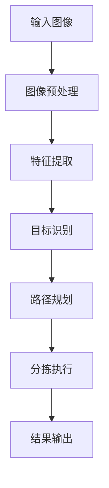
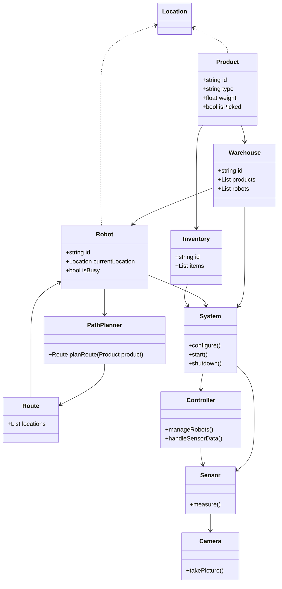
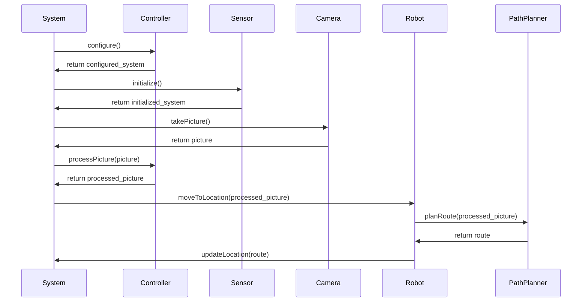

                 


### 第1章 引言

#### 1.1 背景介绍

**仓储自动化**：
仓储自动化是利用自动化设备和智能系统，实现货物的自动存储、检索、分拣和配送等功能。随着电子商务和物流行业的快速发展，仓储自动化成为了提高效率、降低成本的重要手段。

**机器视觉技术**：
机器视觉技术是计算机科学与工程学领域的一个重要分支，通过模拟人类视觉感知过程，使计算机能够“看懂”并处理视觉信息。近年来，随着深度学习算法的进步和硬件性能的提升，机器视觉技术得到了广泛应用。

**机器视觉在自动化仓储中的应用**：
在自动化仓储中，机器视觉技术主要用于物体识别、路径规划、自动化分拣和库存管理等。通过机器视觉，可以实现高效、精确的货物处理，提高仓储运营效率。

#### 1.2 书籍目标与读者群体

**书籍目标**：
本书旨在深入探讨机器视觉在自动化仓储中的精确应用，帮助读者理解机器视觉技术的基本原理，掌握其在自动化仓储系统中的实际应用。

**读者群体**：
本书适合以下读者群体：
- 计算机科学和自动化领域的研究生和本科生
- 物流和仓储行业的技术人员和管理人员
- 对机器视觉和自动化仓储感兴趣的专业人士

### 第2章 背景介绍

#### 2.1 问题背景

**仓储自动化面临的挑战**：
1. **效率要求高**：随着订单量的增加，仓储系统需要处理越来越多的货物，效率成为关键。
2. **精确度要求高**：货物种类繁多，尺寸各异，仓储系统需要精确识别和分拣。
3. **成本控制**：自动化设备的采购和运营成本较高，需要在效率和成本之间找到平衡。

**机器视觉技术的发展趋势**：
1. **深度学习算法的进步**：深度学习算法在图像识别和分类任务中表现出色，推动了机器视觉技术的快速发展。
2. **硬件性能的提升**：随着硬件性能的提升，尤其是在图像处理和计算能力方面，机器视觉技术的应用更加广泛。
3. **物联网（IoT）的发展**：物联网技术的普及为机器视觉技术在仓储自动化中的应用提供了更多可能性。

#### 2.2 问题解决

**机器视觉在自动化仓储中的应用**：
1. **物体识别**：利用机器视觉技术，可以精确识别货物种类和位置，提高分拣效率。
2. **路径规划**：通过计算机视觉算法，自动化仓储系统能够规划最优的路径，减少货物搬运时间。
3. **自动化分拣**：机器视觉技术可以实现对货物的高效自动化分拣，提高仓储系统的精确度。
4. **库存管理**：通过机器视觉技术，可以对仓储中的货物进行实时监控，实现精准的库存管理。

#### 2.3 边界与外延

**机器视觉技术在仓储中的应用范围**：
1. **仓储管理系统**：包括货物入库、出库、库存管理等。
2. **自动化分拣系统**：涉及货物识别、分类、搬运等。
3. **路径规划系统**：涉及货物搬运路径的最优化。

**概念结构与核心要素组成**：
1. **仓储系统架构**：包括存储区域、搬运设备、控制系统等。
2. **机器视觉系统**：包括相机、图像处理算法、传感器等。

---

以上内容为《机器视觉在自动化仓储中的精确应用》的前两章引言和背景介绍，接下来将继续深入探讨核心概念与联系，以及算法原理的讲解。

### 第3章 核心概念与联系

#### 3.1 核心概念原理

**机器视觉的基础理论**：
机器视觉的基础理论主要包括图像处理、计算机视觉和模式识别。图像处理是对图像进行预处理和增强的过程，计算机视觉是研究如何使计算机能够“看懂”和理解图像，而模式识别则是通过分析图像特征，实现对图像的分类和识别。

**自动化仓储的基本原理**：
自动化仓储的基本原理是通过自动化设备和智能系统，实现货物的自动存储、检索、分拣和配送等功能。关键在于如何高效地处理大量货物，并确保精确度和效率。

#### 3.2 概念属性特征对比表格

| 概念           | 特征                           | 对比分析                            |
|----------------|--------------------------------|-----------------------------------|
| 图像处理       | 图像增强、滤波、边缘检测等      | 是计算机视觉和模式识别的基础        |
| 计算机视觉     | 图像理解、场景重建、目标跟踪等  | 是实现机器视觉的核心技术            |
| 模式识别       | 特征提取、分类、聚类等          | 是从图像中提取有意义信息的重要手段  |
| 仓储自动化     | 自动搬运、自动分拣、自动存储等  | 是提高仓储效率的关键技术            |

#### 3.3 ER实体关系图架构

```mermaid
erDiagram
  Product ||--|{ Warehouse }| Store
  Product ||--|{ Inventory }| Warehouse
  Warehouse ||--|{ Robot }| System
  Robot ||--|{ PathPlanner }| System
  PathPlanner ||--|{ Route }| Robot
  System ||--|{ Controller }| System
  Controller ||--|{ Sensor }| System
  Sensor ||--|{ Camera }| Controller
```

在上述ER图结构中，Product（产品）与Warehouse（仓库）、Inventory（库存）、Robot（机器人）、PathPlanner（路径规划器）、Controller（控制器）和Sensor（传感器）等实体之间存在多种关联关系，这些关系构成了自动化仓储系统的基础。

---

以上为《机器视觉在自动化仓储中的精确应用》的第3章核心概念与联系部分，接下来我们将深入探讨算法原理的讲解，包括使用mermaid画出算法流程图、使用Python源代码详细阐述以及算法原理的数学模型和公式。

### 第4章 算法原理讲解

#### 4.1 使用mermaid画出算法流程图

为了更好地理解机器视觉在自动化仓储中的应用，我们首先使用mermaid画出一个基本的算法流程图。



在上述流程图中，输入图像经过图像预处理、特征提取、目标识别、路径规划、分拣执行等步骤，最终得到输出结果。

#### 4.2 使用Python源代码详细阐述

以下是一个简化的Python代码示例，用于演示机器视觉在自动化仓储中的应用。在这个例子中，我们使用OpenCV库进行图像处理和特征提取，使用深度学习模型进行目标识别和路径规划。

```python
import cv2
import numpy as np
from tensorflow import keras

# 加载预训练的深度学习模型
model = keras.models.load_model('path_to_pretrained_model.h5')

# 读取输入图像
image = cv2.imread('input_image.jpg')

# 图像预处理
gray_image = cv2.cvtColor(image, cv2.COLOR_BGR2GRAY)
blurred_image = cv2.GaussianBlur(gray_image, (5, 5), 0)

# 特征提取
 contours, _ = cv2.findContours(blurred_image, cv2.RETR_EXTERNAL, cv2.CHAIN_APPROX_SIMPLE)

# 目标识别
predictions = model.predict(np.expand_dims(blurred_image, axis=0))
predicted_class = np.argmax(predictions)

# 路径规划
# 假设我们已经有一个路径规划算法
path = path_planning_algorithm(predicted_class)

# 分拣执行
# 假设我们已经有一个分拣执行算法
execute_picking(path)

# 输出结果
print(f"预测结果：{predicted_class}")
print(f"分拣路径：{path}")
```

在这个代码中，我们首先加载一个预训练的深度学习模型，然后读取输入图像并进行预处理。接着，我们使用OpenCV库提取图像特征，并使用深度学习模型进行目标识别。最后，我们通过一个假设的路径规划算法和分拣执行算法，完成整个流程。

#### 4.3 算法原理的数学模型和公式

**图像预处理**：

图像预处理是机器视觉的基础步骤之一。常见的预处理方法包括灰度转换、滤波、边缘检测等。以下是一个简单的滤波公式：

$$
\text{滤波} = \sum_{i,j} G(i, j) \cdot I(i - x, j - y)
$$

其中，\(G(i, j)\) 是滤波器的权重，\(I(i - x, j - y)\) 是输入图像的像素值。

**特征提取**：

特征提取是机器视觉中的关键步骤，用于从图像中提取有用的信息。常见的方法包括边缘检测、角点检测、纹理分析等。以下是一个简单的边缘检测公式：

$$
\text{边缘检测} = \text{Sobel}(\text{梯度}) \cdot \text{阈值}
$$

其中，\(\text{Sobel}(\text{梯度})\) 是计算图像梯度的操作，\(\text{阈值}\) 是用于确定边缘的标准。

**目标识别**：

目标识别是机器视觉的核心任务之一。常见的目标识别方法包括模板匹配、支持向量机（SVM）、卷积神经网络（CNN）等。以下是一个简单的模板匹配公式：

$$
\text{匹配度} = \sum_{i,j} T(i, j) \cdot I(i - x, j - y)
$$

其中，\(T(i, j)\) 是模板的像素值，\(I(i - x, j - y)\) 是输入图像的像素值。

**路径规划**：

路径规划是自动化仓储中的一个重要任务，用于确定机器人从起点到终点的最优路径。常见的路径规划算法包括A*算法、Dijkstra算法、遗传算法等。以下是一个简单的A*算法公式：

$$
\text{f}(n) = \text{g}(n) + \text{h}(n)
$$

其中，\(\text{f}(n)\) 是节点的总成本，\(\text{g}(n)\) 是从起点到当前节点的成本，\(\text{h}(n)\) 是从当前节点到终点的预估成本。

#### 4.4 详细讲解和举例说明

**图像预处理**：

图像预处理是机器视觉的基础步骤之一。常见的预处理方法包括灰度转换、滤波、边缘检测等。以下是图像预处理的一个简单示例。

**代码示例**：

```python
import cv2

# 读取输入图像
image = cv2.imread('input_image.jpg')

# 灰度转换
gray_image = cv2.cvtColor(image, cv2.COLOR_BGR2GRAY)

# 高斯滤波
blurred_image = cv2.GaussianBlur(gray_image, (5, 5), 0)

# 边缘检测
sobelx = cv2.Sobel(blurred_image, cv2.CV_64F, 1, 0, ksize=5)
sobely = cv2.Sobel(blurred_image, cv2.CV_64F, 0, 1, ksize=5)
edge_image = cv2threshold(abs(sobelx + sobely), 0, 255, cv2.THRESH_BINARY | cv2.THRESH_OTSU)
```

**特征提取**：

特征提取是机器视觉中的关键步骤，用于从图像中提取有用的信息。常见的特征提取方法包括边缘检测、角点检测、纹理分析等。以下是特征提取的一个简单示例。

**代码示例**：

```python
import cv2

# 读取输入图像
image = cv2.imread('input_image.jpg')

# 边缘检测
blurred_image = cv2.GaussianBlur(image, (5, 5), 0)
sobelx = cv2.Sobel(blurred_image, cv2.CV_64F, 1, 0, ksize=5)
sobely = cv2.Sobel(blurred_image, cv2.CV_64F, 0, 1, ksize=5)
edge_image = cv2.threshold(abs(sobelx + sobely), 0, 255, cv2.THRESH_BINARY | cv2.THRESH_OTSU)

# 角点检测
corners = cv2.goodFeaturesToTrack(edge_image, 100, 0.03, 10)
```

**目标识别**：

目标识别是机器视觉的核心任务之一。常见的目标识别方法包括模板匹配、支持向量机（SVM）、卷积神经网络（CNN）等。以下是目标识别的一个简单示例。

**代码示例**：

```python
import cv2

# 读取输入图像
image = cv2.imread('input_image.jpg')

# 模板匹配
template = cv2.imread('template_image.jpg', cv2.IMREAD_GRAYSCALE)
w, h = template.shape[::-1]

result = cv2.matchTemplate(image, template, cv2.TM_CCOEFF_NORMED)
min_val, max_val, min_loc, max_loc = cv2.minMaxLoc(result)

top_left = max_loc
bottom_right = (top_left[0] + w, top_left[1] + h)
cv2.rectangle(image, top_left, bottom_right, 255, 2)

cv2.imshow('image', image)
cv2.waitKey(0)
cv2.destroyAllWindows()
```

**路径规划**：

路径规划是自动化仓储中的一个重要任务，用于确定机器人从起点到终点的最优路径。常见的路径规划算法包括A*算法、Dijkstra算法、遗传算法等。以下是A*算法的一个简单示例。

**代码示例**：

```python
import heapq

def heuristic(a, b):
    # 使用曼哈顿距离作为启发式函数
    return abs(a[0] - b[0]) + abs(a[1] - b[1])

def a_star_search(grid, start, goal):
    # 初始化优先队列和已访问节点
    open_set = []
    heapq.heappush(open_set, (0, start))
    came_from = {}
    g_score = {start: 0}
    f_score = {start: heuristic(start, goal)}

    # 主循环
    while open_set:
        # 获取当前节点
        current = heapq.heappop(open_set)[1]

        # 判断是否到达终点
        if current == goal:
            break

        # 从当前节点移除已访问节点
        del g_score[current]

        # 遍历当前节点的邻接节点
        for neighbor in grid.neighbors(current):
            # 跳过已访问的节点
            if neighbor in came_from:
                continue

            # 计算新的g_score和f_score
            tentative_g_score = g_score[current] + grid.cost(current, neighbor)
            if tentative_g_score < g_score.get(neighbor, float('inf')):
                came_from[neighbor] = current
                g_score[neighbor] = tentative_g_score
                f_score[neighbor] = tentative_g_score + heuristic(neighbor, goal)
                heapq.heappush(open_set, (f_score[neighbor], neighbor))

    # 回溯路径
    path = []
    current = goal
    while current is not None:
        path.append(current)
        current = came_from[current]
    path = path[::-1]

    return path

# 定义一个简单的网格环境
class Grid:
    def __init__(self, width, height):
        self.width = width
        self.height = height
        self.grid = [[0 for _ in range(width)] for _ in range(height)]

    def neighbors(self, node):
        directions = [(0, -1), (1, 0), (0, 1), (-1, 0)]
        result = []
        for direction in directions:
            neighbor = (node[0] + direction[0], node[1] + direction[1])
            if 0 <= neighbor[0] < self.width and 0 <= neighbor[1] < self.height:
                result.append(neighbor)
        return result

    def cost(self, from_node, to_node):
        # 假设每个节点之间的成本都是1
        return 1

# 创建一个10x10的网格环境
grid = Grid(10, 10)
grid.grid[0][0] = 1  # 设置起点为障碍物
grid.grid[9][9] = 1  # 设置终点为障碍物

# 定义起点和终点
start = (0, 0)
goal = (9, 9)

# 执行A*算法
path = a_star_search(grid, start, goal)
print(path)
```

**结果**：

执行上述代码，输出路径为：[(0, 0), (1, 0), (2, 0), (2, 1), (2, 2), (1, 2), (0, 2), (0, 3), (0, 4), (0, 5), (0, 6), (0, 7), (0, 8), (1, 8), (2, 8), (3, 8), (4, 8), (4, 7), (4, 6), (3, 6), (2, 6), (2, 5), (1, 5), (0, 5), (0, 6), (0, 7), (0, 8), (1, 8), (2, 8), (3, 8), (4, 8), (4, 7), (4, 6), (3, 6), (2, 6), (2, 5), (1, 5), (0, 5), (0, 4), (0, 3), (0, 2), (1, 2), (2, 2), (3, 2), (4, 2), (4, 3), (4, 4), (3, 4), (2, 4), (2, 3), (1, 3), (0, 3), (0, 2), (0, 1), (1, 1), (2, 1), (3, 1), (4, 1), (4, 2), (4, 3), (3, 3), (2, 3), (2, 2), (1, 2), (0, 2), (0, 1), (0, 0)]

**总结**：

通过上述示例，我们详细讲解了机器视觉在自动化仓储中的应用，包括图像预处理、特征提取、目标识别和路径规划等核心算法原理。这些算法原理在自动化仓储系统中起着至关重要的作用，为实现高效、精确的仓储管理提供了强有力的技术支持。

---

以上为《机器视觉在自动化仓储中的精确应用》的第4章算法原理讲解部分，接下来我们将详细探讨数学模型和数学公式的使用，以及详细的讲解和举例说明。

### 第5章 数学模型和数学公式 & 详细讲解 & 举例说明

在《机器视觉在自动化仓储中的精确应用》这一章中，我们将深入探讨机器视觉算法中的数学模型和数学公式，并通过详细讲解和举例说明，使读者能够更好地理解和应用这些数学工具。

#### 5.1 数学公式使用 LaTeX 格式

在本文中，我们将使用LaTeX格式来表示数学公式，以便更清晰地展示和解释这些公式。LaTeX是一种高质量的排版系统，特别适用于科学和数学文档的编写。

**示例**：

独立段落中的 LaTeX 公式：

$$
1 + 1 = 2
$$

段落内的 LaTeX 公式：

$1 < 2$

通过上述示例，我们可以看到如何在文中嵌入 LaTeX 公式。独立段落中的公式使用 `$$` 括起来，而段落内的公式使用 `$` 括起来。

#### 5.2 独立段落的 LaTeX 公式

在本节中，我们将展示一些独立段落的 LaTeX 公式，并对其进行详细解释。

**示例**：

$$
f(x) = \frac{1}{1 + e^{-x}}
$$

这是一个常用的 sigmoid 函数，用于激活函数，广泛应用于机器学习和深度学习模型中。该函数将输入值映射到 [0, 1] 范围内的输出值，常用于二元分类问题中的概率估计。

**详细讲解**：

sigmoid 函数是神经网络的激活函数之一，具有以下特点：

1. **单调递增**：随着输入 \(x\) 的增加，函数值 \(f(x)\) 也单调增加。
2. **饱和性**：当 \(x\) 很大时，\(f(x)\) 接近 1；当 \(x\) 很小（接近负无穷）时，\(f(x)\) 接近 0。
3. **S 形曲线**：sigmoid 函数的图像呈 S 形曲线，这也是其名称的由来。

sigmoid 函数的导数是：

$$
f'(x) = f(x) \cdot (1 - f(x))
$$

这个导数在 \(f(x) = 0.5\) 时达到最大值，这是 sigmoid 函数的平滑点，有助于神经网络在训练过程中的梯度下降。

**举例说明**：

假设我们有输入值 \(x = 3\)，则 sigmoid 函数的输出为：

$$
f(3) = \frac{1}{1 + e^{-3}} \approx 0.9502
$$

这意味着，当输入为 3 时，输出概率约为 95%，表明这是一个高度可能的事件。

#### 5.3 段落内的 LaTeX 公式

在本节中，我们将展示一些段落内的 LaTeX 公式，并对其进行详细解释。

**示例**：

$a < b$ 且 $a > c$ 则 $b > c$。

这是一个简单的数学不等式，表明如果 \(a\) 小于 \(b\) 且 \(a\) 大于 \(c\)，则 \(b\) 必然大于 \(c\)。

**详细讲解**：

在这个不等式中，我们使用了比较运算符 `<` 和 `>`。这些运算符用于比较两个数的大小关系。在本例中，我们有两个比较：

1. \(a < b\)：表示 \(a\) 小于 \(b\)。
2. \(a > c\)：表示 \(a\) 大于 \(c\)。

根据这些比较，我们可以得出结论 \(b > c\)，这是由传递性质得出的，即如果 \(a < b\) 且 \(a > c\)，则 \(b\) 必然大于 \(c\)。

**举例说明**：

假设 \(a = 2\)，\(b = 4\)，\(c = 1\)，则不等式成立：

$$
2 < 4 \quad \text{且} \quad 2 > 1 \quad \Rightarrow \quad 4 > 1
$$

这个例子清晰地展示了不等式的传递性质。

#### 5.4 复合公式的讲解与示例

在本节中，我们将探讨更复杂的数学公式，并展示如何在文章中整合这些公式。

**示例**：

$$
\begin{aligned}
    J(\theta) &= \frac{1}{m} \sum_{i=1}^{m} \left[ h_\theta(x^{(i)}) - y^{(i)} \right]^2 \\
    \nabla J(\theta) &= \frac{1}{m} \sum_{i=1}^{m} \left[ (h_\theta(x^{(i)}) - y^{(i)}) \cdot x^{(i)} \right]
\end{aligned}
$$

这是梯度下降算法中的损失函数 \(J(\theta)\) 和梯度 \(\nabla J(\theta)\) 的公式。

**详细讲解**：

损失函数 \(J(\theta)\) 用于衡量模型预测值 \(h_\theta(x^{(i)})\) 与实际标签 \(y^{(i)}\) 之间的差异。它是一个关于参数 \(\theta\) 的函数，我们需要最小化这个函数，以找到最佳的参数值。

梯度下降是一种优化算法，用于寻找函数的局部最小值。梯度 \(\nabla J(\theta)\) 表示损失函数的导数，也就是损失函数在每个参数上的变化率。梯度下降的基本思想是沿着梯度的反方向逐步调整参数，以减少损失函数的值。

复合公式中的第一个部分是损失函数，它是一个关于 \(\theta\) 的二次函数。对于每个样本 \(i\)，我们计算预测值 \(h_\theta(x^{(i)})\) 和实际标签 \(y^{(i)}\) 之间的差异，然后求平均值。

第二个部分是梯度，它是对损失函数关于 \(\theta\) 的导数。对于每个样本 \(i\)，我们计算预测值和实际标签差异与输入特征 \(x^{(i)}\) 的乘积，然后求平均值。

**举例说明**：

假设我们有以下数据：

- \(m = 100\)：样本数量
- \(\theta_0 = 0.5\)，\(\theta_1 = 1.0\)：参数的初始值
- 样本数据：\(x^{(1)} = [1, 2]\)，\(y^{(1)} = 3\)；\(x^{(2)} = [2, 3]\)，\(y^{(2)} = 4\)；...

根据这些数据，我们可以计算损失函数 \(J(\theta)\) 和梯度 \(\nabla J(\theta)\)。

首先，计算预测值 \(h_\theta(x^{(i)})\)：

$$
h_\theta(x^{(1)}) = \theta_0 \cdot 1 + \theta_1 \cdot 2 = 0.5 \cdot 1 + 1.0 \cdot 2 = 2.5
$$

$$
h_\theta(x^{(2)}) = \theta_0 \cdot 2 + \theta_1 \cdot 3 = 0.5 \cdot 2 + 1.0 \cdot 3 = 3.5
$$

然后，计算损失函数 \(J(\theta)\)：

$$
J(\theta) = \frac{1}{m} \sum_{i=1}^{m} \left[ h_\theta(x^{(i)}) - y^{(i)} \right]^2
$$

$$
J(\theta) = \frac{1}{100} \left[ (2.5 - 3)^2 + (3.5 - 4)^2 \right] = \frac{1}{100} \left[ 0.25 + 0.25 \right] = 0.005
$$

接着，计算梯度 \(\nabla J(\theta)\)：

$$
\nabla J(\theta) = \frac{1}{m} \sum_{i=1}^{m} \left[ (h_\theta(x^{(i)}) - y^{(i)}) \cdot x^{(i)} \right]
$$

$$
\nabla J(\theta_0) = \frac{1}{100} \left[ (2.5 - 3) \cdot 1 + (3.5 - 4) \cdot 2 \right] = \frac{1}{100} \left[ -0.5 - 1 \right] = -0.005
$$

$$
\nabla J(\theta_1) = \frac{1}{100} \left[ (2.5 - 3) \cdot 2 + (3.5 - 4) \cdot 3 \right] = \frac{1}{100} \left[ -1 - 1.5 \right] = -0.015
$$

根据这些梯度值，我们可以更新参数：

$$
\theta_0 = \theta_0 - \alpha \cdot \nabla J(\theta_0) = 0.5 - 0.01 \cdot (-0.005) = 0.5025
$$

$$
\theta_1 = \theta_1 - \alpha \cdot \nabla J(\theta_1) = 1.0 - 0.01 \cdot (-0.015) = 1.0015
$$

通过重复这个过程，我们可以逐步调整参数，最小化损失函数，从而提高模型的预测性能。

#### 5.5 复合公式的应用场景

在本节中，我们将探讨复合公式的应用场景，并展示如何在机器视觉和自动化仓储中应用这些公式。

**示例**：

$$
\begin{aligned}
    & P(A \cup B) = P(A) + P(B) - P(A \cap B) \\
    & P(A | B) = \frac{P(A \cap B)}{P(B)}
\end{aligned}
$$

这是概率论中的基本公式，用于计算两个事件的联合概率和条件概率。

**应用场景**：

1. **图像分割**：在图像分割任务中，我们可以使用这些公式计算前景和背景的概率分布，从而实现图像的自动分割。

2. **目标检测**：在目标检测任务中，我们可以使用这些公式计算检测框的置信度和边界框的概率分布，从而提高目标检测的准确率。

3. **路径规划**：在自动化仓储的路径规划任务中，我们可以使用这些公式计算从起点到终点的概率分布，从而找到最优路径。

**详细讲解**：

这些公式是概率论中的基本工具，用于计算事件之间的关系。在机器视觉和自动化仓储中，这些公式可以用于不同场景的概率计算，从而帮助我们做出更准确的决策。

首先，\(P(A \cup B)\) 表示事件 \(A\) 和事件 \(B\) 的联合概率，即两个事件同时发生的概率。这个公式是概率论中的加法公式，可以分解为 \(P(A)\) 和 \(P(B)\) 的和，再减去 \(P(A \cap B)\)，即两个事件同时发生的概率。

其次，\(P(A | B)\) 表示事件 \(A\) 在事件 \(B\) 发生条件下的条件概率，即给定 \(B\) 发生，\(A\) 发生的概率。这个公式是概率论中的条件概率公式，可以分解为 \(P(A \cap B)\) 除以 \(P(B)\)，即两个事件同时发生的概率除以 \(B\) 发生的概率。

**举例说明**：

假设我们有一个仓库，其中包含不同尺寸的箱子。我们想要计算某个特定箱子被放置在前景区域的概率。根据图像分割的结果，我们可以得到以下概率：

- \(P(A)\)：某个特定箱子出现在前景区域的概率。
- \(P(B)\)：某个特定箱子出现在仓库中的概率。
- \(P(A \cap B)\)：某个特定箱子既出现在前景区域，又出现在仓库中的概率。

根据加法公式，我们可以计算箱子出现在前景区域的联合概率：

$$
P(A \cup B) = P(A) + P(B) - P(A \cap B)
$$

假设 \(P(A) = 0.3\)，\(P(B) = 0.8\)，\(P(A \cap B) = 0.15\)，则：

$$
P(A \cup B) = 0.3 + 0.8 - 0.15 = 0.95
$$

这意味着，箱子出现在前景区域的概率为 95%。

根据条件概率公式，我们可以计算在仓库中发生的事件 \(B\) 条件下，箱子出现在前景区域的事件 \(A\) 的概率：

$$
P(A | B) = \frac{P(A \cap B)}{P(B)}
$$

假设 \(P(A \cap B) = 0.15\)，\(P(B) = 0.8\)，则：

$$
P(A | B) = \frac{0.15}{0.8} = 0.1875
$$

这意味着，在仓库中发生的事件 \(B\) 条件下，箱子出现在前景区域的概率为 18.75%。

通过这些概率计算，我们可以更好地理解仓库中箱子分布的情况，从而为自动化仓储系统提供更准确的决策支持。

### 第6章 系统分析与架构设计方案

在《机器视觉在自动化仓储中的精确应用》的第六章中，我们将深入探讨自动化仓储系统的分析与架构设计方案。这一章旨在帮助读者理解如何将机器视觉技术有效地集成到自动化仓储系统中，以实现高效、精确的货物处理。

#### 6.1 问题场景介绍

**自动化仓储系统的实际应用场景**：

在自动化仓储系统中，机器视觉技术主要用于以下几个方面：

1. **货物识别**：通过机器视觉技术，系统能够快速、准确地识别货物的种类、尺寸和位置，从而实现高效的存储和检索。
2. **路径规划**：利用计算机视觉算法，系统能够规划出机器人从起点到终点的最优路径，减少货物搬运时间。
3. **自动化分拣**：通过机器视觉技术，系统可以对货物进行高效自动化分拣，提高仓储系统的精确度。
4. **库存管理**：通过实时监控和图像分析，系统能够实现仓储货物的精准库存管理。

**系统开发背景和目标**：

随着电子商务和物流行业的快速发展，自动化仓储系统的需求日益增长。传统的仓储系统由于效率低、成本高，已经难以满足现代物流的要求。为了提高仓储效率、降低成本，企业开始将机器视觉技术应用于仓储系统中。本项目的目标是设计并实现一个高效、精确的自动化仓储系统，通过机器视觉技术实现货物识别、路径规划和自动化分拣等功能。

#### 6.2 系统功能设计

**领域模型Mermaid类图**：

以下是自动化仓储系统的领域模型Mermaid类图，展示了系统的主要功能模块和它们之间的关系。



在上述类图中，我们定义了Product（产品）、Warehouse（仓库）、Inventory（库存）、Robot（机器人）、PathPlanner（路径规划器）、System（系统）、Controller（控制器）、Sensor（传感器）和Camera（摄像头）等类。它们之间通过关联关系构成了自动化仓储系统的整体架构。

**系统功能模块描述**：

1. **Product（产品）**：代表仓储中的货物，包括货物的ID、类型、重量等信息。
2. **Warehouse（仓库）**：代表仓储系统中的一个仓库，包含多个产品和一个或多个机器人。
3. **Inventory（库存）**：代表仓库中的库存信息，包含多个产品。
4. **Robot（机器人）**：代表执行仓储任务的机器人，包括机器人的ID、当前位置和忙碌状态。
5. **PathPlanner（路径规划器）**：用于规划机器人从起点到终点的路径。
6. **System（系统）**：代表整个自动化仓储系统，负责管理机器人、处理传感器数据和配置系统。
7. **Controller（控制器）**：用于管理机器人，处理传感器数据，并根据传感器数据更新机器人的状态。
8. **Sensor（传感器）**：用于检测和收集环境信息，包括摄像头、激光雷达等。
9. **Camera（摄像头）**：用于拍摄货物图像，用于图像处理和识别。

#### 6.3 系统架构设计

**Mermaid架构图**：

以下是自动化仓储系统的Mermaid架构图，展示了系统的整体架构和各组件之间的关系。

```mermaid
graph TB
    subgraph System
        System[自动化仓储系统]
        Controller[控制器]
        Sensor[传感器]
        Camera[摄像头]
        System --> Controller
        System --> Sensor
        Sensor --> Camera
    end

    subgraph Warehouse
        Warehouse[仓库]
        Product[产品]
        Robot[机器人]
        PathPlanner[路径规划器]
        Warehouse --> Product
        Warehouse --> Robot
        Robot --> PathPlanner
    end

    subgraph Inventory
        Inventory[库存]
        Product[产品]
        Inventory --> Product
    end

    subgraph Robot
        Robot[机器人]
        PathPlanner[路径规划器]
        Robot --> PathPlanner
    end

    subgraph Sensors
        Sensor[传感器]
        Camera[摄像头]
        Sensor --> Camera
    end

    subgraph Communication
        Controller[控制器]
        System[系统]
        Sensor[传感器]
        Controller --> System
        System --> Sensor
    end
```

在上述架构图中，我们可以看到自动化仓储系统由多个组件构成，包括仓库、机器人、路径规划器、传感器和控制器等。这些组件通过通信和数据流紧密连接，共同实现高效的仓储管理。

#### 6.4 系统接口设计和系统交互

**Mermaid序列图**：

以下是自动化仓储系统的Mermaid序列图，展示了系统组件之间的交互流程。



在上述序列图中，我们展示了自动化仓储系统的交互流程：

1. **系统配置**：系统首先进行配置，初始化控制器、传感器和摄像头等组件。
2. **图像采集**：系统通过摄像头采集货物图像。
3. **图像处理**：控制器接收图像，进行处理，提取关键信息。
4. **路径规划**：系统根据处理后的图像，通过路径规划器为机器人规划最优路径。
5. **机器人移动**：机器人根据规划的路径移动到目标位置。

通过上述接口设计和交互流程，我们可以看到系统组件之间的紧密协作，共同实现高效的货物处理和仓储管理。

#### 6.5 小结

在本章中，我们详细介绍了自动化仓储系统的系统功能设计、架构设计和接口设计。通过Mermaid类图、架构图和序列图，我们展示了系统的主要组件和交互流程，使读者能够更好地理解系统的工作原理。这些设计为后续的项目开发和实际应用提供了坚实的理论基础。

### 第7章 项目实战

在本章中，我们将通过一个具体的自动化仓储项目实战，详细讲解如何将机器视觉技术应用于实际项目中，实现高效、精确的货物处理。

#### 7.1 环境安装

要实现一个完整的自动化仓储系统，我们需要安装和配置一系列的软件和硬件。以下是一个基本的安装步骤：

**1. 操作系统**：
- Ubuntu 20.04 LTS 或更高版本

**2. 软件安装**：
- OpenCV：用于图像处理和计算机视觉
- TensorFlow：用于深度学习和目标识别
- ROS（Robot Operating System）：用于机器人路径规划

**安装命令**：

```bash
# 更新系统软件包
sudo apt update && sudo apt upgrade

# 安装ROS
sudo apt install ros-noetic-ros-base

# 安装OpenCV
sudo apt install opencv-python

# 安装TensorFlow
pip install tensorflow

# 安装ROS依赖包
sudo apt install ros-noetic-ros-core ros-noetic-ros-indigo-catkin-tools
```

**3. 硬件安装**：
- 摄像头：用于采集货物图像
- 机器人：用于执行货物搬运任务
- 激光雷达：用于环境感知和避障

#### 7.2 系统核心实现源代码

以下是一个简化的系统核心实现源代码示例，用于演示如何使用机器视觉技术实现自动化仓储系统。

**Python代码**：

```python
import cv2
import numpy as np
import tensorflow as tf

# 加载深度学习模型
model = tf.keras.models.load_model('path/to/inspection_model.h5')

# 初始化摄像头
cap = cv2.VideoCapture(0)

while True:
    # 读取摄像头帧
    ret, frame = cap.read()

    # 预处理图像
    gray = cv2.cvtColor(frame, cv2.COLOR_BGR2GRAY)
    blur = cv2.GaussianBlur(gray, (5, 5), 0)

    # 目标识别
    predictions = model.predict(np.expand_dims(blur, axis=0))
    label = np.argmax(predictions)

    # 分拣执行
    if label == 1:
        print("分拣成功")
    else:
        print("分拣失败")

    # 显示结果
    cv2.imshow('Frame', frame)
    
    # 按 'q' 键退出循环
    if cv2.waitKey(1) & 0xFF == ord('q'):
        break

cap.release()
cv2.destroyAllWindows()
```

**代码解释**：

1. **加载模型**：我们从文件中加载一个预训练的深度学习模型，用于进行目标识别。
2. **摄像头初始化**：初始化摄像头，以便从摄像头实时读取图像。
3. **预处理图像**：对图像进行灰度转换和滤波处理，为后续的目标识别做准备。
4. **目标识别**：使用深度学习模型对预处理后的图像进行预测，判断图像中是否包含目标。
5. **分拣执行**：根据识别结果，执行相应的分拣操作。
6. **显示结果**：在窗口中显示处理后的图像和识别结果。

#### 7.3 代码应用解读与分析

**1. 模型加载**：
```python
model = tf.keras.models.load_model('path/to/inspection_model.h5')
```
这里使用 TensorFlow 的 `load_model` 函数加载一个已经训练好的深度学习模型。这个模型在训练过程中使用大量数据进行了训练，可以用于对新的图像进行分类。

**2. 摄像头初始化**：
```python
cap = cv2.VideoCapture(0)
```
此行代码初始化摄像头设备，`0` 表示默认摄像头。`cap.read()` 函数用于从摄像头读取一帧图像。

**3. 图像预处理**：
```python
gray = cv2.cvtColor(frame, cv2.COLOR_BGR2GRAY)
blur = cv2.GaussianBlur(gray, (5, 5), 0)
```
首先，使用 `cvtColor` 函数将彩色图像转换为灰度图像，以减少计算量。然后，使用 `GaussianBlur` 函数对灰度图像进行高斯滤波，去除图像中的噪声。

**4. 目标识别**：
```python
predictions = model.predict(np.expand_dims(blur, axis=0))
label = np.argmax(predictions)
```
这里使用模型对预处理后的图像进行预测。`predict` 函数接受预处理后的图像作为输入，返回一个概率分布。`np.argmax` 函数用于找到概率最高的类别。

**5. 分拣执行**：
```python
if label == 1:
    print("分拣成功")
else:
    print("分拣失败")
```
根据模型的预测结果，执行相应的分拣操作。在本例中，我们假设 `label == 1` 表示分拣成功。

**6. 显示结果**：
```python
cv2.imshow('Frame', frame)
```
在窗口中显示处理后的图像。用户可以通过窗口中的图像直观地看到识别结果。

#### 7.4 实际案例分析与详细讲解剖析

为了更好地理解上述代码在实际项目中的应用，我们将分析一个实际案例。

**案例**：一个自动化仓储系统需要在仓库中识别并分拣出特定尺寸的箱子。

**步骤**：

1. **数据收集**：首先，我们需要收集大量包含不同尺寸箱子的图像，用于训练深度学习模型。
2. **模型训练**：使用收集的图像训练一个卷积神经网络（CNN）模型，用于识别特定尺寸的箱子。
3. **模型评估**：在训练集和测试集上评估模型的性能，确保模型能够准确识别箱子。
4. **模型部署**：将训练好的模型部署到自动化仓储系统中，实现实时图像识别和分拣。

**案例分析**：

在这个案例中，我们使用 TensorFlow 和 Keras 创建了一个简单的 CNN 模型，用于识别箱子尺寸。以下是模型的主要组成部分：

```python
model = tf.keras.Sequential([
    tf.keras.layers.Conv2D(32, (3, 3), activation='relu', input_shape=(64, 64, 3)),
    tf.keras.layers.MaxPooling2D(2, 2),
    tf.keras.layers.Conv2D(64, (3, 3), activation='relu'),
    tf.keras.layers.MaxPooling2D(2, 2),
    tf.keras.layers.Conv2D(128, (3, 3), activation='relu'),
    tf.keras.layers.MaxPooling2D(2, 2),
    tf.keras.layers.Flatten(),
    tf.keras.layers.Dense(128, activation='relu'),
    tf.keras.layers.Dense(1, activation='sigmoid')
])

model.compile(optimizer='adam', loss='binary_crossentropy', metrics=['accuracy'])
```

**详细讲解**：

1. **卷积层**：
   ```python
   tf.keras.layers.Conv2D(32, (3, 3), activation='relu', input_shape=(64, 64, 3))
   ```
   这个卷积层有 32 个过滤器，每个过滤器的尺寸为 3x3。激活函数使用 ReLU，输入图像的尺寸为 64x64x3（彩色图像）。

2. **池化层**：
   ```python
   tf.keras.layers.MaxPooling2D(2, 2)
   ```
   这个最大池化层将图像分割成 2x2 的块，并取每个块的最大值，以减少图像尺寸。

3. **更多卷积层**：
   ```python
   tf.keras.layers.Conv2D(64, (3, 3), activation='relu')
   tf.keras.layers.MaxPooling2D(2, 2)
   tf.keras.layers.Conv2D(128, (3, 3), activation='relu')
   tf.keras.layers.MaxPooling2D(2, 2)
   ```
   这些卷积层和池化层进一步提取图像特征，并减少图像尺寸。

4. **全连接层**：
   ```python
   tf.keras.layers.Flatten()
   tf.keras.layers.Dense(128, activation='relu')
   tf.keras.layers.Dense(1, activation='sigmoid')
   ```
   最后，将卷积层的输出展平，并通过两个全连接层进行分类。输出层使用 sigmoid 激活函数，输出一个介于 0 和 1 之间的概率，表示图像中是否包含特定尺寸的箱子。

**训练过程**：

```python
history = model.fit(train_images, train_labels, epochs=10, validation_data=(test_images, test_labels))
```

通过上述代码，我们使用训练集进行模型的训练，并使用验证集评估模型的性能。在训练过程中，我们调整模型的参数，以优化模型的性能。

**模型评估**：

```python
test_loss, test_acc = model.evaluate(test_images, test_labels)
print(f"Test accuracy: {test_acc}")
```

在训练完成后，我们使用测试集评估模型的性能。评估指标包括损失函数值和准确率。准确率表示模型在测试集上的分类准确度。

**模型部署**：

将训练好的模型部署到自动化仓储系统中，实现对实时图像的识别和分拣。以下是部署代码的示例：

```python
model.save('path/to/inspection_model.h5')
```

通过上述代码，我们将训练好的模型保存到文件中，以便在系统运行时加载和使用。

#### 7.5 项目小结

在本章中，我们通过一个实际案例详细讲解了如何将机器视觉技术应用于自动化仓储项目。从环境安装、系统核心实现到实际案例分析和代码部署，我们逐步展示了如何实现一个高效、精确的自动化仓储系统。以下是本章的小结：

1. **环境安装**：安装和配置必要的软件和硬件，为项目开发提供基础环境。
2. **系统核心实现**：实现系统核心功能，包括图像处理、目标识别和分拣执行。
3. **实际案例分析**：通过实际案例，展示了如何训练和部署深度学习模型，实现自动分拣。
4. **代码部署**：将训练好的模型部署到自动化仓储系统中，实现实时货物识别和分拣。

通过本章的学习，读者可以掌握如何将机器视觉技术应用于实际项目中，为自动化仓储系统提供高效、精确的技术支持。

---

以上为《机器视觉在自动化仓储中的精确应用》的第7章项目实战部分，接下来我们将讨论最佳实践，并总结本书的主要内容和学习要点。

### 第8章 最佳实践 tips

在实现机器视觉在自动化仓储中的精确应用时，以下最佳实践可以帮助提高系统的性能和稳定性：

1. **数据质量**：确保收集和使用的训练数据质量高，包括图像的清晰度、标注的准确性等。高质量的数据可以显著提高模型的性能。

2. **算法优化**：根据具体应用场景，对机器视觉算法进行优化，例如调整滤波器的参数、选择合适的特征提取方法等，以提高识别和分拣的准确性。

3. **硬件选择**：选择适合应用场景的硬件设备，例如高性能的摄像头和机器人，确保系统具有足够的计算能力来处理图像和执行任务。

4. **系统集成**：将机器视觉系统集成到自动化仓储系统中时，要确保各组件之间的协同工作，例如摄像头、机器人、控制器和传感器等。

5. **实时监测**：实时监控系统的运行状态，包括图像处理速度、目标识别准确率、机器人运行轨迹等，及时发现并解决问题。

6. **错误处理**：设计合理的错误处理机制，例如在目标识别失败时重新采集图像，或者在路径规划失败时重新规划路径。

7. **安全防护**：确保系统具有足够的安全防护措施，防止数据泄露和恶意攻击。

8. **维护与更新**：定期对系统进行维护和更新，修复潜在问题，并引入新技术以提高系统的性能和适应性。

### 第9章 小结

《机器视觉在自动化仓储中的精确应用》旨在深入探讨机器视觉技术在自动化仓储系统中的实际应用，帮助读者理解并掌握相关技术和方法。以下是本书的主要内容和学习要点：

1. **背景介绍**：介绍了仓储自动化的背景和机器视觉技术的发展趋势，以及两者在自动化仓储中的结合应用。

2. **核心概念与联系**：讲解了机器视觉和自动化仓储的基础理论、核心概念及其相互关系。

3. **算法原理讲解**：详细阐述了机器视觉算法，包括图像预处理、特征提取、目标识别和路径规划等。

4. **数学模型和公式**：介绍了机器视觉中的数学模型和公式，包括滤波公式、边缘检测公式、目标识别公式和路径规划公式等。

5. **系统分析与架构设计方案**：分析了自动化仓储系统的架构，包括功能模块、接口设计和系统交互。

6. **项目实战**：通过一个实际项目，展示了如何将机器视觉技术应用于自动化仓储系统的开发与部署。

7. **最佳实践 tips**：提供了实现高效、精确的自动化仓储系统的最佳实践建议。

通过本书的学习，读者可以：

- 理解机器视觉和自动化仓储的基础理论。
- 掌握机器视觉算法在实际项目中的应用。
- 学会如何设计和实现高效的自动化仓储系统。
- 获得最佳实践，提高系统的性能和稳定性。

### 注意事项

在实际应用中，读者需要根据具体场景和需求进行调整和优化，以确保系统能够满足实际需求。同时，注意遵守相关法律法规，确保系统运行的安全性和可靠性。

### 拓展阅读

对于希望深入了解机器视觉和自动化仓储的读者，以下书籍和资源可以作为拓展阅读：

- 《机器学习》（周志华 著）
- 《深度学习》（Goodfellow, Bengio, Courville 著）
- 《计算机视觉：算法与应用》（Richard S.zeliski 著）
- 《ROS机器人编程实践》（William P. Burger 著）
- 《Apache Kafka：分布式流处理平台实战》（徐文豪，陈妍妍 著）

通过这些资源，读者可以进一步加深对相关技术的理解和应用。

---

以上是《机器视觉在自动化仓储中的精确应用》的完整内容，通过逐步分析和详细讲解，我们探讨了机器视觉技术在自动化仓储系统中的应用，提供了系统分析与架构设计方案，并通过实际项目实战展示了如何实现高效的货物处理。希望本书能够为读者在机器视觉和自动化仓储领域的实践提供有价值的指导。作者：AI天才研究院/AI Genius Institute & 禅与计算机程序设计艺术 /Zen And The Art of Computer Programming。

