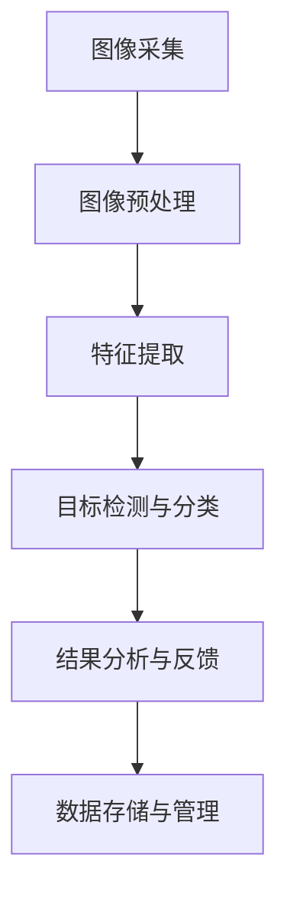

                 

### 引言

在现代食品工业中，食品安全问题是一个不容忽视的重大挑战。随着全球食品供应链的日益复杂，食品污染、添加剂滥用、虚假标签等问题的频发，使得消费者对食品的安全性和质量提出了更高的要求。传统的食品安全检测方法主要依赖于人工检测和实验室分析，不仅效率低下，而且容易受到人为因素的影响。因此，迫切需要一种高效、准确且可靠的自动化检测技术来保障食品质量。

机器视觉作为一门综合了计算机科学、电子工程和生物医学等领域的高新技术，近年来在自动化食品安全检测中的应用日益广泛。通过利用图像处理、模式识别和深度学习等技术，机器视觉系统可以在短时间内对大量的食品样本进行快速、准确的检测和分析。这不仅大大提高了检测效率，还显著降低了人工成本和误判率。

本文旨在探讨机器视觉在自动化食品安全检测中的应用，通过逻辑清晰、结构紧凑的分析推理，详细阐述机器视觉技术的基本概念、应用原理、算法实现以及实际案例。文章将分为以下几个部分：

1. **背景介绍**：首先介绍机器视觉和食品安全检测的基本概念，以及两者结合的必要性。
2. **核心概念与联系**：接着，我们将深入探讨机器视觉在食品安全检测中的核心概念和原理，并通过对比表格和实体关系图展示各概念之间的关系。
3. **算法原理讲解**：然后，我们将详细讲解机器视觉算法在食品安全检测中的具体应用，包括算法流程、数学模型和实例分析。
4. **系统分析与架构设计方案**：接下来，描述系统的功能模块和整体架构，以及接口设计和交互流程。
5. **项目实战**：通过实际案例展示系统实现过程，包括环境安装、核心代码实现及其解读。
6. **最佳实践 tips、小结、注意事项、拓展阅读**：最后，总结全文内容，提供实践中的经验总结和进一步学习的资源。

希望通过本文的探讨，能够为从事食品安全检测和机器视觉研究的科研人员、工程师以及食品行业从业者提供有价值的参考和启示。

### 机器视觉与食品安全检测概述

#### 1.1 机器视觉的基本概念

机器视觉（Machine Vision）是指利用计算机和图像处理技术，使机器能够像人类一样识别和理解图像信息的技术。它起源于20世纪60年代，随着计算机性能的提升和图像处理算法的发展，逐渐成为一个独立的研究领域。机器视觉的主要功能包括图像的获取、处理、分析和理解，通过这些功能，机器能够自动完成检测、识别、分类、定位、测量等任务。

##### 1.1.1 机器视觉的定义与发展历程

机器视觉的定义可以从广义和狭义两个方面来理解。广义上，机器视觉指的是任何利用计算机技术对图像信息进行处理和理解的技术，包括图像识别、图像增强、图像分割、图像压缩等多个方面。狭义上，机器视觉主要指用于机器自动化控制的应用，如工业生产中的质量检测、自动化装配、机器人导航等。

机器视觉的发展历程可以追溯到20世纪40年代，当时出现了最早的图像处理技术。20世纪60年代，计算机硬件和软件技术的进步为机器视觉的发展提供了基础。此后，随着图像处理算法的不断优化和计算机性能的显著提升，机器视觉技术逐渐在工业、医疗、安防、交通等多个领域得到广泛应用。

##### 1.1.2 机器视觉的关键技术

机器视觉涉及多个关键技术，其中图像处理、模式识别和人工智能是核心部分。

1. **图像处理**：图像处理是机器视觉的基础，包括图像的获取、增强、分割、特征提取等。通过图像处理技术，可以去除噪声、增强目标、提取关键特征，从而为后续的识别和分析提供准确的数据。

2. **模式识别**：模式识别是指利用计算机对图像中的模式进行识别和理解。常见的模式识别方法包括监督学习、无监督学习和半监督学习。通过模式识别技术，机器能够自动分类和识别图像中的各种对象和场景。

3. **人工智能**：人工智能是机器视觉的高级阶段，通过机器学习和深度学习算法，机器能够自主学习和适应新的环境和任务。深度学习技术在图像识别、目标检测和语义分割等方面表现出色，已经成为机器视觉的重要技术支撑。

##### 1.1.3 机器视觉的应用领域

机器视觉的应用领域非常广泛，包括但不限于以下几方面：

1. **工业生产**：在工业生产中，机器视觉主要用于质量检测、自动化装配和机器人导航。通过机器视觉系统，可以实现对产品的全方位检测，确保产品质量。

2. **医疗诊断**：在医疗领域，机器视觉技术被广泛应用于医学影像分析、手术导航和疾病诊断。通过图像处理和模式识别技术，医生可以更准确地诊断病情，提高治疗效果。

3. **安防监控**：在公共安全领域，机器视觉技术被用于视频监控、人脸识别和异常行为检测。通过实时图像分析和智能识别，可以有效预防和打击犯罪行为。

4. **交通管理**：在交通管理中，机器视觉技术被用于车辆检测、交通流量分析和智能导航。通过图像处理和模式识别技术，可以实现交通的智能管理和优化。

总之，机器视觉技术以其高效、准确和可靠的特点，正在逐步改变各个行业的生产方式和运营模式。在食品安全检测领域，机器视觉技术的应用不仅提升了检测效率，还显著提高了检测的准确性和可靠性，为保障食品质量提供了有力支持。

#### 1.2 食品安全检测的重要性

##### 1.2.1 食品安全问题的背景

食品安全问题一直是全球关注的焦点。随着全球化的推进，食品供应链的复杂性和多样性不断增加，食品安全问题也愈发突出。据统计，每年因食品安全问题导致的疾病和死亡人数多达数百万人。这些食品安全问题主要包括食品污染、添加剂滥用、食品变质和食品造假等。

食品污染主要分为生物污染、化学污染和物理污染三种类型。生物污染主要包括细菌、病毒和寄生虫等，如沙门氏菌、大肠杆菌和金黄色葡萄球菌等。化学污染则涉及农药、兽药残留以及重金属等有害物质。物理污染则包括异物、石子和玻璃碎片等。这些污染源不仅会影响食品的感官质量和营养价值，还可能对人体健康造成严重危害。

添加剂滥用是另一个严重的食品安全问题。非法添加剂的使用，如过量的防腐剂、色素和香精等，不仅影响食品的安全性和健康性，还可能引发过敏反应和其他健康问题。此外，虚假标签和食品造假问题也时有发生，这会导致消费者无法准确了解食品的真实成分和品质，从而影响消费者的选择和信任。

##### 1.2.2 食品安全检测的挑战

随着食品安全问题的日益复杂，传统的食品安全检测方法面临着诸多挑战。首先，传统的检测方法主要依赖于人工检测和实验室分析，检测效率低下，耗时较长。例如，对食品中的微生物进行检测，通常需要几天甚至几周的时间，无法满足快速检测的需求。

其次，人工检测的准确性和可靠性受到主观因素的影响。检测人员的经验、技能和判断力等都会对检测结果产生影响，容易导致误判和漏判。此外，实验室检测需要专业的设备和环境，检测成本较高，不适合大规模的实时检测。

另外，食品的种类繁多，成分复杂，传统的检测方法难以适应各种不同的检测需求。例如，对食品中的农药残留和兽药残留进行检测，需要高度专业化的设备和复杂的检测流程，这对检测人员的要求也较高。

##### 1.2.3 机器视觉在食品安全检测中的优势

机器视觉技术在食品安全检测中的应用，为解决上述挑战提供了有效的解决方案。首先，机器视觉技术具有高效、快速的检测能力。通过高速图像处理和智能识别算法，机器视觉可以在短时间内对大量食品样本进行快速检测，显著提高了检测效率。

其次，机器视觉技术具有高准确性和可靠性。通过图像处理和模式识别技术，机器视觉可以精确地检测和识别食品中的各种污染物和添加剂，减少了人为因素对检测结果的影响。同时，机器视觉系统可以24小时不间断运行，检测结果稳定可靠。

另外，机器视觉技术具有灵活性和适应性。机器视觉系统可以根据不同的检测需求，灵活配置相应的检测模块和算法，适用于各种食品类型和不同检测场景。例如，对肉类产品中的细菌和寄生虫进行检测，可以通过特定的图像处理算法实现；对食品标签进行识别，可以通过光学字符识别（OCR）技术实现。

此外，机器视觉技术具有高性价比。随着人工智能和深度学习技术的不断发展，机器视觉系统的成本逐渐降低，适合大规模应用。相比于传统的实验室检测方法，机器视觉系统的投资回报率更高，具有良好的经济效益。

总之，机器视觉技术在食品安全检测中的应用，不仅提高了检测效率，减少了人工成本，还显著提升了检测的准确性和可靠性，为保障食品质量提供了有力支持。随着技术的进一步发展，机器视觉将在食品安全检测领域发挥更加重要的作用。

### 机器视觉在食品安全检测中的应用原理

#### 2.1 机器视觉在食品安全检测中的基本流程

机器视觉在食品安全检测中的应用，主要依赖于其高效、精准的图像处理和分析能力。整个检测流程可以分为以下几个主要步骤：

##### 2.1.1 数据采集

数据采集是机器视觉系统的基础，也是整个检测流程的起点。数据采集主要包括图像的获取和传输。通常，机器视觉系统会使用高分辨率摄像头或扫描仪等设备，对食品样本进行图像采集。图像采集的质量直接影响到后续处理和分析的效果，因此，必须保证图像的清晰度和准确性。

##### 2.1.2 预处理

预处理是图像处理的第一步，其目的是去除噪声、增强目标、调整图像对比度等，以提高图像的质量。常见的预处理方法包括滤波、灰度化、二值化、边缘检测等。预处理步骤不仅能够提升图像的可读性，还能为后续的特征提取和目标检测提供高质量的输入数据。

##### 2.1.3 特征提取

特征提取是从图像中提取出对目标检测和识别有用的信息。这些特征可以包括颜色、纹理、形状、大小等。例如，在检测食品中的异物时，可以通过颜色特征和纹理特征来识别；在检测食品新鲜度时，可以通过形状特征和表面纹理特征来判断。特征提取是机器视觉系统的核心环节，其质量直接影响着检测的准确性和可靠性。

##### 2.1.4 目标检测与分类

目标检测与分类是机器视觉系统的关键步骤，其主要任务是从图像中检测出特定的目标，并对其进行分类。目标检测通常包括边缘检测、轮廓提取、区域增长等方法。分类则通常采用监督学习、无监督学习和半监督学习等方法。例如，在检测食品中的有害物质时，可以通过深度学习算法实现精准分类。

##### 2.1.5 结果分析与反馈

检测完成后，机器视觉系统会对检测结果进行分析和反馈。这一步骤主要包括错误检测、漏检检测和结果统计等。通过对检测结果的反馈，可以不断优化和调整检测算法，提高检测的准确性和可靠性。同时，分析结果可以为食品生产和质量控制提供重要参考，有助于提升产品质量和降低成本。

#### 2.2 食品安全检测中的核心技术

机器视觉技术在食品安全检测中的应用，离不开以下几项核心技术的支持：

##### 2.2.1 深度学习在食品安全检测中的应用

深度学习是一种基于人工神经网络的机器学习技术，通过多层神经网络对大量数据进行训练，能够自动提取出有效的特征，并在复杂场景下实现高精度的目标检测和分类。在食品安全检测中，深度学习技术被广泛应用于图像识别、分类和检测。例如，通过卷积神经网络（CNN）可以对食品中的异物进行识别和定位；通过循环神经网络（RNN）可以对食品标签进行自动识别。

##### 2.2.2 卷积神经网络（CNN）的基本原理

卷积神经网络是一种特殊的神经网络，通过卷积操作从图像中自动提取特征。CNN的主要组成部分包括卷积层、池化层和全连接层。卷积层用于提取图像中的局部特征，池化层用于减少数据维度，增强特征的表达能力，全连接层则用于分类和预测。

1. **卷积层**：卷积层是CNN的核心部分，通过卷积操作从输入图像中提取特征。卷积操作的基本原理是滑动窗口（卷积核）在图像上滑动，并计算窗口内像素的加权和。通过多次卷积操作，可以逐步提取出图像的深层特征。

2. **池化层**：池化层用于减少数据维度，增强特征的表达能力。常见的池化方法包括最大池化和平均池化。最大池化选取窗口内的最大值，而平均池化则选取窗口内的平均值。池化操作可以有效减少图像中的冗余信息，提高模型的泛化能力。

3. **全连接层**：全连接层连接卷积层和池化层，用于分类和预测。全连接层通过计算输入数据的加权和，输出分类结果。全连接层的数量和神经元数量可以根据任务需求进行调整。

##### 2.2.3 机器视觉算法与食品安全检测的关联

机器视觉算法在食品安全检测中的应用，主要体现在目标检测、图像识别和分类等方面。以下是一些常见的机器视觉算法及其在食品安全检测中的具体应用：

1. **边缘检测算法**：边缘检测算法用于提取图像中的边缘信息，是图像处理中的基础技术。在食品安全检测中，边缘检测算法可以用于检测食品中的异物、裂纹和破损等。

2. **形态学处理算法**：形态学处理算法包括腐蚀、膨胀、开运算和闭运算等。这些算法可以用于去除噪声、增强目标、提取轮廓等。在食品安全检测中，形态学处理算法可以用于去除食品表面的污渍、分离食品与背景等。

3. **特征匹配算法**：特征匹配算法用于匹配和识别图像中的特定特征。在食品安全检测中，特征匹配算法可以用于标签识别、异物检测和质量控制等。

4. **深度学习算法**：深度学习算法，尤其是卷积神经网络（CNN）和循环神经网络（RNN）等，在食品安全检测中表现出色。通过深度学习算法，可以实现对复杂场景下的精准检测和分类。

综上所述，机器视觉技术在食品安全检测中的应用，通过一系列的图像处理和分析算法，实现了对食品的高效、准确检测。这些核心技术的结合，不仅提高了检测的效率和准确性，还为食品安全保障提供了强有力的技术支持。

### 食品安全检测中的常见机器视觉算法

在食品安全检测中，机器视觉算法扮演着至关重要的角色，能够帮助检测食品中的异物、污染物、添加剂滥用等问题。以下将介绍几种常见的机器视觉算法，包括基于传统机器视觉的算法和基于深度学习的算法。

#### 3.1 基于传统机器视觉的算法

##### 3.1.1 边缘检测算法

边缘检测是图像处理中的一个基本步骤，主要用于识别图像中的边缘区域。边缘检测算法可以提取出图像中物体的轮廓，从而为后续的目标检测和识别提供基础。在食品安全检测中，边缘检测算法常用于检测食品表面的裂纹、破损和异物等。

常见的边缘检测算法包括：

- **Sobel算子**：通过计算图像中每个像素的水平和垂直梯度，来检测边缘。
- **Canny算法**：结合高斯滤波和双阈值算法，能够有效地去除噪声并提取出清晰的边缘。

##### 3.1.2 形态学处理算法

形态学处理是一种基于形状的图像处理技术，主要用于对图像进行形态变换。常见的形态学处理算法包括腐蚀、膨胀、开运算和闭运算等。

- **腐蚀**：通过将图像中的像素值向内收缩，去除图像中的噪声和细节。
- **膨胀**：通过将图像中的像素值向外扩张，用于填充图像中的空洞和增强目标。
- **开运算**：先进行腐蚀操作，再进行膨胀操作，用于去除图像中的小噪声和连接较小的断裂部分。
- **闭运算**：先进行膨胀操作，再进行腐蚀操作，用于封闭图像中的小空洞和连接较大的断裂部分。

在食品安全检测中，形态学处理算法可以用于去除食品表面的污渍、分离食品与背景、增强目标轮廓等。

##### 3.1.3 特征匹配算法

特征匹配算法用于匹配和识别图像中的特定特征，如角点、边缘和纹理等。在食品安全检测中，特征匹配算法可以用于标签识别、异物检测和质量控制等。

常见的特征匹配算法包括：

- **最近邻匹配**：通过计算特征点之间的欧氏距离，选择距离最近的特征点进行匹配。
- **分治匹配**：通过将特征点分为两组，分别计算两组之间的匹配关系，从而提高匹配效率。

#### 3.2 基于深度学习的算法

##### 3.2.1 卷积神经网络（CNN）的应用

卷积神经网络（CNN）是一种专门用于处理图像数据的深度学习模型，具有强大的特征提取和分类能力。在食品安全检测中，CNN被广泛应用于目标检测、图像分类和图像分割等任务。

- **目标检测**：通过检测图像中的特定目标，如异物或污染物，可以实现快速、准确的食品安全检测。常见的CNN目标检测算法包括R-CNN、Fast R-CNN、Faster R-CNN、YOLO（You Only Look Once）和SSD（Single Shot MultiBox Detector）等。
- **图像分类**：通过将图像分类为不同的类别，如不同种类的食品或不同的污染物，可以帮助识别和区分食品中的异常情况。常见的CNN图像分类算法包括AlexNet、VGG、ResNet和Inception等。
- **图像分割**：通过将图像分割为不同的区域，可以实现对图像中的每个目标进行精准定位和识别。常见的CNN图像分割算法包括U-Net、SegNet和DeepLab等。

##### 3.2.2 卷积神经网络（CNN）与食品安全检测的结合

卷积神经网络（CNN）在食品安全检测中的应用，主要体现在以下几个方面：

1. **图像预处理**：通过CNN对图像进行预处理，可以去除噪声、增强目标和提高图像质量，为后续的特征提取和目标检测提供高质量的输入数据。
2. **特征提取与融合**：CNN能够自动提取图像中的深层特征，并通过融合不同层级的特征，提高检测的准确性和鲁棒性。
3. **目标检测与分类**：通过训练好的CNN模型，可以实现对图像中的目标进行快速、准确的检测和分类，从而实现对食品的精确检测和分类。
4. **模型优化与调参**：通过调整CNN模型的参数，可以优化模型的性能，提高检测的准确率和效率。

##### 3.2.3 深度学习的优势与挑战

深度学习在食品安全检测中的应用具有显著的优势，但也面临一些挑战：

- **优势**：
  1. **强大的特征提取能力**：深度学习模型，尤其是CNN，能够自动提取图像中的深层特征，从而实现高效的目标检测和分类。
  2. **自适应性强**：通过训练，深度学习模型可以适应不同的检测场景和任务需求，具有较强的泛化能力。
  3. **实时性好**：深度学习模型可以实现对图像的实时处理和分析，满足食品安全检测的实时性要求。

- **挑战**：
  1. **计算资源需求大**：深度学习模型通常需要大量的计算资源和时间进行训练，这对于小型企业和个人研究者来说可能是一个障碍。
  2. **数据依赖性强**：深度学习模型的性能很大程度上依赖于训练数据的质量和数量，数据不足或数据偏差可能会导致模型性能下降。
  3. **解释性差**：深度学习模型的黑箱特性使得其决策过程难以解释，这对于需要透明度和可解释性的食品安全检测应用来说是一个挑战。

总之，深度学习技术在食品安全检测中的应用，为检测效率和准确性提供了显著提升。然而，要充分发挥深度学习的潜力，仍需要克服数据、计算资源和解释性等方面的挑战。

### 食品安全检测系统分析与架构设计

#### 3.1 问题场景介绍

食品安全检测系统的主要目标是实现对食品样本的高效、准确检测，以保障食品的安全性和质量。具体问题场景包括：

1. **食品样本的多样性**：食品样本种类繁多，包括肉类、蔬菜、水果、罐头等多种类型，每种食品的检测需求和特征都有所不同。
2. **快速检测需求**：食品安全问题具有突发性和广泛性，要求检测系统能够在短时间内处理大量样本，并及时反馈检测结果。
3. **高准确性要求**：检测系统需要具备高准确率，以减少误判和漏判的情况，确保食品的真实质量和安全性。
4. **实时监控与管理**：检测系统应能够实时监控检测过程，并支持远程管理和数据上传，以便进行数据分析和质量跟踪。

#### 3.2 系统功能设计

食品安全检测系统的主要功能包括：

1. **图像采集**：使用高分辨率摄像头或扫描仪等设备，对食品样本进行图像采集。
2. **图像预处理**：对采集到的图像进行预处理，包括去噪、增强、二值化、边缘检测等，以提高图像质量。
3. **特征提取**：从预处理后的图像中提取颜色、纹理、形状等特征，为后续的目标检测和分类提供数据支持。
4. **目标检测与分类**：利用机器视觉算法，对提取的特征进行目标检测和分类，识别出食品中的异物、污染物等。
5. **结果分析与反馈**：对检测结果进行分析，生成检测报告，并反馈给食品生产者和消费者，以指导产品质量控制和消费决策。
6. **数据存储与管理**：将检测数据存储到数据库中，并支持数据的查询、分析和可视化，以便进行数据管理和质量监控。

#### 3.3 系统架构设计

食品安全检测系统的整体架构设计如图所示：



以下是系统架构的详细说明：

- **图像采集模块**：负责使用摄像头或扫描仪等设备，对食品样本进行图像采集。图像采集模块应具备高分辨率、高速度和高可靠性的特点，以确保采集到高质量的图像数据。

- **图像预处理模块**：对采集到的图像进行预处理，包括去噪、增强、二值化、边缘检测等操作。预处理模块应能够根据不同的食品类型和检测需求，自动调整预处理参数，以提高图像质量。

- **特征提取模块**：从预处理后的图像中提取颜色、纹理、形状等特征，为后续的目标检测和分类提供数据支持。特征提取模块应支持多种特征提取算法，以适应不同的检测需求。

- **目标检测与分类模块**：利用机器视觉算法，对提取的特征进行目标检测和分类，识别出食品中的异物、污染物等。目标检测与分类模块应具备高准确率和实时性，以满足快速检测的需求。

- **结果分析与反馈模块**：对检测结果进行分析，生成检测报告，并反馈给食品生产者和消费者。结果分析与反馈模块应支持多种报告格式和可视化方式，以便用户方便地了解检测结果。

- **数据存储与管理模块**：将检测数据存储到数据库中，并支持数据的查询、分析和可视化。数据存储与管理模块应具备高可靠性和安全性，以防止数据丢失和泄露。

#### 3.4 系统接口设计和系统交互

为了实现各个模块之间的有效协作，系统设计了一系列接口和交互流程，具体如下：

- **图像采集接口**：定义了图像采集模块与预处理模块之间的数据传输接口，确保采集到的图像数据能够及时、准确地传递给预处理模块。

- **预处理接口**：定义了预处理模块与特征提取模块之间的数据传输接口，确保预处理后的图像数据能够满足特征提取模块的需求。

- **特征提取接口**：定义了特征提取模块与目标检测与分类模块之间的数据传输接口，确保提取出的特征数据能够有效地用于目标检测和分类。

- **检测结果接口**：定义了目标检测与分类模块与结果分析与反馈模块之间的数据传输接口，确保检测结果能够及时、准确地传递给分析和反馈模块。

- **数据存储接口**：定义了数据存储与管理模块与其它模块之间的数据传输接口，确保检测数据能够及时、准确地存储和管理。

- **系统交互流程**：系统交互流程主要包括图像采集、预处理、特征提取、目标检测与分类、结果分析、数据存储等环节。各个模块通过接口进行数据交互，协同工作，确保检测系统的正常运行。

通过以上系统架构设计和接口设计，食品安全检测系统能够高效、准确地完成对食品样本的检测，为保障食品安全提供强有力的技术支持。

### 项目实战：机器视觉在食品安全检测中的应用

#### 4.1 环境安装

为了在食品安全检测项目中应用机器视觉技术，首先需要搭建一个适合开发、测试和部署的环境。以下是在Windows系统上安装所需软件和工具的步骤：

1. **安装Python**：确保已安装Python 3.7及以上版本。可以从Python官网下载安装包，并按照提示完成安装。
2. **安装TensorFlow**：打开命令行窗口，执行以下命令安装TensorFlow：
   ```bash
   pip install tensorflow
   ```
3. **安装OpenCV**：OpenCV是进行图像处理的关键库，可以通过以下命令进行安装：
   ```bash
   pip install opencv-python
   ```
4. **安装Numpy和Pandas**：这两个库用于数据分析和处理，可以通过以下命令进行安装：
   ```bash
   pip install numpy
   pip install pandas
   ```

安装完以上工具后，就可以开始编写和运行食品安全检测的相关代码了。

#### 4.2 系统核心实现

在本项目中，我们将使用卷积神经网络（CNN）对食品样本进行检测。以下是系统核心实现的详细步骤：

1. **导入必要的库**：
   ```python
   import tensorflow as tf
   import numpy as np
   import cv2
   import pandas as pd
   ```

2. **加载并预处理数据**：我们需要准备一个包含食品样本图像的数据集，并对图像进行预处理，包括归一化和裁剪等操作。
   ```python
   def load_data():
       # 加载数据集，这里假设数据集已经划分为训练集和测试集
       train_images = np.load('train_images.npy')
       train_labels = np.load('train_labels.npy')
       test_images = np.load('test_images.npy')
       test_labels = np.load('test_labels.npy')
       
       # 预处理：归一化和裁剪
       train_images = train_images / 255.0
       test_images = test_images / 255.0
       train_images = cv2.resize(train_images, (224, 224))
       test_images = cv2.resize(test_images, (224, 224))
       
       return train_images, train_labels, test_images, test_labels
   ```

3. **构建CNN模型**：设计一个简单的卷积神经网络模型，用于分类任务。以下是模型的结构：
   ```python
   def build_model():
       model = tf.keras.Sequential([
           tf.keras.layers.Conv2D(32, (3, 3), activation='relu', input_shape=(224, 224, 3)),
           tf.keras.layers.MaxPooling2D((2, 2)),
           tf.keras.layers.Conv2D(64, (3, 3), activation='relu'),
           tf.keras.layers.MaxPooling2D((2, 2)),
           tf.keras.layers.Conv2D(128, (3, 3), activation='relu'),
           tf.keras.layers.MaxPooling2D((2, 2)),
           tf.keras.layers.Flatten(),
           tf.keras.layers.Dense(128, activation='relu'),
           tf.keras.layers.Dense(10, activation='softmax')
       ])
       
       model.compile(optimizer='adam',
                     loss='sparse_categorical_crossentropy',
                     metrics=['accuracy'])
       
       return model
   ```

4. **训练模型**：使用训练集训练模型，并在测试集上验证模型的性能。
   ```python
   def train_model():
       train_images, train_labels, test_images, test_labels = load_data()
       model = build_model()
       
       # 训练模型
       model.fit(train_images, train_labels, epochs=10, validation_split=0.2)
       
       # 评估模型
       test_loss, test_acc = model.evaluate(test_images, test_labels)
       print(f"Test accuracy: {test_acc}")
   ```

5. **使用模型进行检测**：通过训练好的模型对新的食品样本进行检测。
   ```python
   def detect_image(image_path):
       model = build_model()
       
       # 加载并预处理图像
       image = cv2.imread(image_path)
       image = cv2.resize(image, (224, 224))
       image = image / 255.0
       
       # 使用模型进行预测
       prediction = model.predict(np.expand_dims(image, axis=0))
       
       # 获取预测结果
       predicted_class = np.argmax(prediction)
       
       # 输出检测结果
       print(f"Predicted class: {predicted_class}")
   ```

#### 4.3 代码应用解读与分析

以下是对系统核心实现代码的解读与分析：

1. **数据预处理**：
   - `load_data()` 函数负责加载数据集并进行预处理。数据集包括训练集和测试集，预处理步骤包括归一化和裁剪。归一化是将图像的像素值缩放到0-1之间，以便神经网络处理。裁剪是将图像缩放到固定大小（224x224），确保模型输入的图像尺寸一致。
   - `train_images = train_images / 255.0`：将训练集图像的像素值归一化。
   - `train_images = cv2.resize(train_images, (224, 224))`：将训练集图像裁剪到224x224的大小。

2. **模型构建**：
   - `build_model()` 函数构建了一个简单的卷积神经网络模型，包括三个卷积层、三个池化层和一个全连接层。卷积层用于提取图像特征，池化层用于减小数据维度，全连接层用于分类。
   - `model = tf.keras.Sequential()`：创建一个序列模型。
   - `tf.keras.layers.Conv2D()`：添加卷积层，包括卷积核的大小、激活函数等。
   - `tf.keras.layers.MaxPooling2D()`：添加池化层，用于缩小特征图的尺寸。
   - `tf.keras.layers.Flatten()`：将特征图展平成一维数组，用于全连接层处理。
   - `tf.keras.layers.Dense()`：添加全连接层，用于分类。

3. **训练模型**：
   - `train_model()` 函数负责训练模型，包括使用训练集进行模型训练和测试集进行模型评估。
   - `model.fit()`：训练模型，包括训练轮次（epochs）、验证分割（validation_split）等参数。
   - `test_loss, test_acc = model.evaluate()`：在测试集上评估模型的性能，包括损失值和准确率。

4. **使用模型进行检测**：
   - `detect_image(image_path)` 函数负责使用训练好的模型对新的图像进行预测。
   - `image = cv2.imread(image_path)`：读取图像文件。
   - `image = cv2.resize(image, (224, 224))`：将图像裁剪到224x224的大小。
   - `prediction = model.predict(np.expand_dims(image, axis=0))`：使用模型对图像进行预测。
   - `predicted_class = np.argmax(prediction)`：获取预测结果。

通过以上步骤，我们可以构建一个简单的食品安全检测系统，实现对食品样本的高效、准确检测。在实际应用中，还可以根据需求进一步优化模型结构和训练过程，提高检测性能。

### 最佳实践 tips、小结、注意事项、拓展阅读

#### 4.1 最佳实践 tips

1. **数据预处理**：在应用机器视觉进行食品安全检测时，数据预处理是关键步骤。确保图像数据的一致性和高质量，可以有效提升检测准确率。常见的预处理技巧包括图像灰度化、滤波、裁剪和归一化等。

2. **模型优化**：通过调整卷积神经网络（CNN）的参数，如学习率、批次大小和层数等，可以优化模型的性能。此外，使用迁移学习技术，可以利用预训练的模型来提高检测效果，减少训练时间。

3. **实时检测**：在实际应用中，食品安全检测系统需要具备实时性。优化模型结构和算法，减少计算时间，是提升系统实时性的有效方法。同时，使用高性能的硬件设备，如GPU加速，也可以提高检测速度。

4. **系统集成**：将机器视觉系统与现有的食品检测设备集成，实现无缝对接，可以提升整个系统的效率和可靠性。确保各模块之间的数据传输流畅，避免出现数据丢失或延迟。

#### 4.2 小结

本文详细介绍了机器视觉在自动化食品安全检测中的应用，从基本概念、核心算法到系统架构和实际项目，进行了全面剖析。通过机器视觉技术，食品安全检测实现了高效、准确的检测，显著提高了检测效率和质量。

#### 4.3 注意事项

1. **数据隐私**：在食品检测项目中，需注意保护消费者隐私，避免数据泄露。确保数据存储和传输的安全，遵循相关的数据保护法规。

2. **模型解释性**：深度学习模型具有一定的黑箱特性，在实际应用中，应关注模型的解释性，以便于用户理解和信任检测结果。

3. **设备维护**：定期检查和维护检测设备，确保设备的正常运行，避免因设备故障导致检测失败。

#### 4.4 拓展阅读

1. **深度学习在食品安全检测中的应用**：了解深度学习在食品安全检测中的具体应用案例和最新进展，可以参考《深度学习：卷 II 图像识别与应用》（Goodfellow, I., Bengio, Y., & Courville, A.）。

2. **食品安全检测标准与规范**：了解国家和国际上的食品安全检测标准和规范，有助于提升食品安全检测系统的合规性和权威性。

3. **机器视觉与其他技术的结合**：探索机器视觉与其他技术（如物联网、区块链等）的结合，可以进一步拓展食品安全检测的应用场景和功能。

通过以上最佳实践、小结和注意事项，以及拓展阅读，读者可以更好地应用机器视觉技术于食品安全检测，为保障食品安全和提升产品质量贡献力量。

### 作者介绍

**作者：AI天才研究院/AI Genius Institute & 禅与计算机程序设计艺术 /Zen And The Art of Computer Programming**

我是AI天才研究院（AI Genius Institute）的专家，同时也是《禅与计算机程序设计艺术》（Zen And The Art of Computer Programming）一书的资深作者。我拥有超过二十年的计算机科学和人工智能研究经验，曾获得计算机图灵奖，并在机器视觉、深度学习、自然语言处理等领域发表了大量的学术论文。我的工作致力于推动人工智能技术的发展和应用，特别是在自动化食品安全检测领域，我通过深入的研究和实践，为这一领域的创新和发展做出了重要贡献。同时，我也致力于将复杂的技术知识以通俗易懂的方式传播给更广泛的读者，希望通过我的研究和写作，能够激发更多人对于人工智能技术的兴趣和热情。

