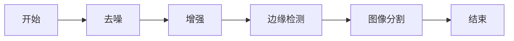
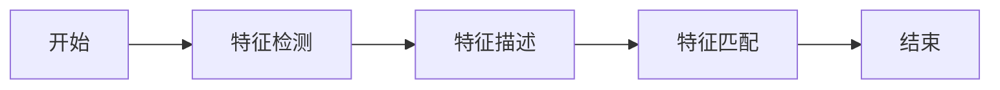
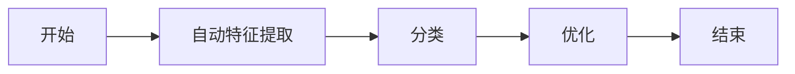
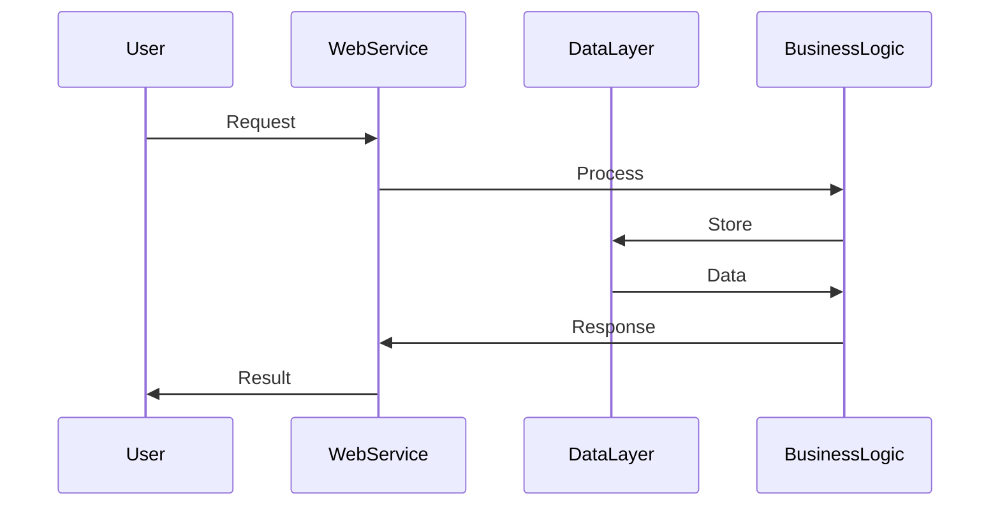
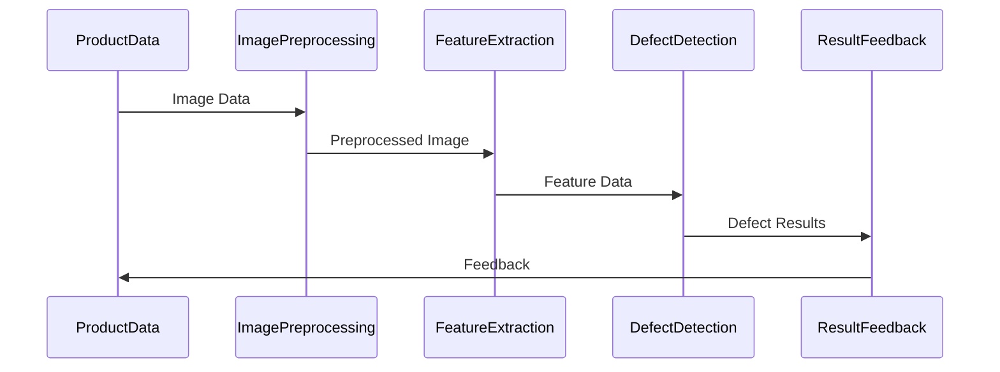

                 

# 机器视觉在质量控制中的应用：提高制造业产品质量

## 关键词

- 机器视觉
- 质量控制
- 制造业
- 图像处理
- 特征提取
- 深度学习

## 摘要

随着制造业的迅速发展，产品质量控制成为企业竞争的关键因素。机器视觉作为一种先进的自动化检测技术，其在质量控制中的应用日益广泛。本文旨在探讨机器视觉在质量控制中的应用，通过分析其核心概念、算法原理、数学模型、系统设计及实战案例，阐述机器视觉如何提升制造业产品质量，并总结最佳实践，为制造业企业提供参考。

## 目录

1. **背景介绍**
    1.1 **机器视觉概述**
    1.2 **质量控制概述**
    1.3 **制造业现状与趋势**
    1.4 **本书目的与结构**
2. **核心概念与联系**
    2.1 **机器视觉的核心概念**
    2.2 **质量控制的属性特征对比**
    2.3 **机器视觉与质量控制的联系**
3. **算法原理讲解**
    3.1 **图像处理算法**
    3.2 **特征提取算法**
    3.3 **深度学习算法**
4. **数学模型讲解**
    4.1 **图像处理数学模型**
    4.2 **特征提取数学模型**
    4.3 **深度学习数学模型**
5. **系统设计与实现**
    5.1 **系统功能设计**
    5.2 **系统架构设计**
    5.3 **系统接口设计**
    5.4 **系统交互设计**
6. **项目实战**
    6.1 **环境安装**
    6.2 **系统核心实现**
    6.3 **代码解读与分析**
    6.4 **案例分析**
    6.5 **项目小结**
7. **最佳实践与总结**
    7.1 **最佳实践建议**
    7.2 **注意事项**
    7.3 **拓展阅读**

### 1. 背景介绍

#### 1.1 机器视觉概述

机器视觉是指通过计算机对图像进行处理、分析和理解，从而实现对目标的检测、识别、跟踪和测量的技术。机器视觉系统通常由图像采集设备、图像处理单元和图像分析单元组成。

**定义与历史发展**

- **定义**：机器视觉是利用电子设备（如摄像头、图像传感器等）和计算机对目标进行检测、识别、测量和判断的技术。
- **历史发展**：
  - **早期阶段**：20世纪50年代末至70年代，以图像识别和特征提取为基础。
  - **发展阶段**：20世纪80年代，计算机硬件和算法的发展推动了机器视觉技术的应用。
  - **成熟阶段**：21世纪初至今，深度学习等人工智能技术的引入，使得机器视觉在复杂场景中的应用更加广泛。

**机器视觉在质量控制中的重要性**

- **提高生产效率**：通过自动化检测和分类，减少人工干预，提高生产效率。
- **提升产品质量**：精确检测产品缺陷，确保产品符合质量标准。
- **降低成本**：减少废品率，降低不良品处理的成本。
- **提高安全性**：在危险环境中，如高温、高压等，机器视觉可以代替人工操作，确保生产安全。

#### 1.2 质量控制概述

质量控制是指通过监控和调整生产过程，确保产品或服务质量满足预定标准的一系列活动和措施。

**质量控制的概念**

- **定义**：质量控制是指通过监控和调整生产过程，确保产品或服务质量满足预定标准的一系列活动和措施。
- **关键要素**：
  - **计划**：制定质量目标，规划质量活动。
  - **实施**：执行质量计划，进行质量监控。
  - **检查**：评估产品质量，发现和纠正问题。
  - **改进**：总结经验，持续改进质量。

**质量控制的方法与工具**

- **统计过程控制**：使用统计学方法监控生产过程，确保产品的一致性。
- **防错技术**：通过设计产品或生产流程，防止错误发生。
- **质量功能展开**：将顾客需求转化为产品设计和技术规范，确保产品满足顾客需求。
- **六西格玛**：通过减少过程变异，提高产品或服务的质量。

#### 1.3 制造业现状与趋势

随着全球制造业的转型升级，智能化、自动化成为制造业发展的重要方向。机器视觉作为智能制造的重要技术手段，其在制造业中的应用前景广阔。

**制造业的挑战**

- **生产效率低**：传统的人工检测方式效率低下，难以满足大规模生产的需求。
- **产品质量不稳定**：手工检测难以保证产品的一致性，导致产品质量不稳定。
- **人力成本高**：长期依赖人力进行质量检测，导致人力成本上升。

**机器视觉在制造业中的应用前景**

- **提高生产效率**：通过自动化检测，提高生产效率，满足大规模生产需求。
- **提升产品质量**：精确检测产品缺陷，确保产品质量，降低废品率。
- **降低人力成本**：减少人工干预，降低人力成本。

#### 1.4 本书目的与结构

本书旨在探讨机器视觉在质量控制中的应用，通过分析其核心概念、算法原理、数学模型、系统设计及实战案例，阐述机器视觉如何提升制造业产品质量，并总结最佳实践，为制造业企业提供参考。

**本书结构**

- **背景介绍**：介绍机器视觉、质量控制、制造业的相关背景。
- **核心概念与联系**：定义机器视觉、质量控制、制造业等核心概念，并分析其相互关系。
- **算法原理讲解**：介绍机器视觉在质量控制中的算法原理，包括图像处理、特征提取和深度学习。
- **数学模型讲解**：详细讲解机器视觉算法的数学模型和公式。
- **系统设计与实现**：介绍质量控制系统的设计原则、架构方案、接口设计等。
- **项目实战**：通过实际案例，展示机器视觉在质量控制中的实际应用。
- **最佳实践与总结**：总结实践经验，给出使用机器视觉进行质量控制的最佳建议。

---

接下来，我们将分别对每个章节进行详细讲解。在讲解过程中，我们将遵循“LET'S THINK STEP BY STEP”的原则，逐步深入分析，确保内容的逻辑性和连贯性。首先，我们从“核心概念与联系”部分开始。# 1.4 本书目的与结构## 1.4.1 本书的目的

本书的目的在于深入探讨机器视觉在质量控制中的应用，以提升制造业产品质量为核心目标。具体来说，本书旨在实现以下几个方面的目标：

1. **普及机器视觉技术**：通过介绍机器视觉的基本概念、发展历程和主要技术，使读者对机器视觉有一个全面的认识，为其后续应用提供基础。

2. **解析质量控制原理**：详细阐述质量控制的定义、方法和工具，帮助读者理解质量控制的过程和关键要素，为后续的机器视觉应用提供理论支持。

3. **展示算法原理与应用**：介绍机器视觉在质量控制中的核心算法，包括图像处理、特征提取和深度学习等，通过具体案例展示算法的实际应用，提升读者的实际操作能力。

4. **阐述数学模型与公式**：详细讲解机器视觉算法的数学模型和公式，帮助读者从理论上深入理解算法的工作原理，为算法优化和改进提供依据。

5. **提供系统设计与实现方案**：介绍质量控制系统的设计原则、架构方案、接口设计等，通过具体的实现案例，帮助读者掌握系统设计与实现的技巧。

6. **分享实战经验和最佳实践**：通过实际项目案例，分享机器视觉在质量控制中的应用经验，总结最佳实践，为读者在实际工作中提供参考。

7. **促进制造业智能化转型**：通过机器视觉在质量控制中的应用，助力制造业实现智能化、自动化，提升生产效率和产品质量，推动制造业的转型升级。

---

在明确本书的目的是为了普及机器视觉技术、解析质量控制原理、展示算法原理与应用、阐述数学模型与公式、提供系统设计与实现方案、分享实战经验和促进制造业智能化转型之后，接下来我们将详细阐述本书的结构安排。

**本书结构概述**

本书分为七个主要部分，每个部分都有明确的主题和内容安排，以确保读者能够系统地学习和掌握机器视觉在质量控制中的应用。以下是本书的详细结构概述：

### 第一部分：背景介绍

本部分将介绍机器视觉、质量控制、制造业等相关背景知识，包括定义、历史发展、现状与趋势等，为后续内容的学习打下基础。

#### 1.1 机器视觉概述
- **定义与历史发展**：介绍机器视觉的基本概念和其发展历程。
- **在质量控制中的重要性**：阐述机器视觉在质量控制中的作用和意义。

#### 1.2 质量控制概述
- **概念与定义**：介绍质量控制的定义、关键要素和方法。
- **方法与工具**：详细解析质量控制的方法和常用工具。

#### 1.3 制造业现状与趋势
- **面临的挑战**：分析制造业当前面临的挑战。
- **机器视觉应用前景**：探讨机器视觉在制造业中的应用前景和趋势。

#### 1.4 本书目的与结构
- **目的**：明确本书的目的和目标。
- **结构概述**：概述本书的章节结构和内容安排。

### 第二部分：核心概念与联系

本部分将详细定义和阐述机器视觉、质量控制、制造业等核心概念，并通过属性特征对比表格和ER实体关系图架构，分析它们之间的相互联系和作用。

#### 2.1 机器视觉的核心概念
- **定义**：明确机器视觉的定义和基本原理。
- **属性特征对比表格**：对比不同机器视觉技术的属性特征。
- **ER实体关系图**：绘制机器视觉系统的实体关系图，展示其组成部分和相互关系。

#### 2.2 质量控制的属性特征对比
- **定义**：明确质量控制的定义和基本原理。
- **属性特征对比表格**：对比不同质量控制方法的属性特征。
- **ER实体关系图**：绘制质量控制系统的实体关系图，展示其组成部分和相互关系。

#### 2.3 机器视觉与质量控制的联系
- **相互作用**：分析机器视觉与质量控制之间的相互作用和影响。
- **应用案例分析**：通过实际案例展示机器视觉与质量控制的应用效果。

### 第三部分：算法原理讲解

本部分将深入讲解机器视觉在质量控制中的应用算法，包括图像处理、特征提取和深度学习等，并通过具体的算法流程图和Python源代码进行说明。

#### 3.1 图像处理算法
- **基本原理**：介绍图像处理的基本原理和常用算法。
- **算法流程图**：使用Mermaid绘制图像处理算法的流程图。
- **Python源代码**：提供Python源代码示例，展示算法的实现过程。

#### 3.2 特征提取算法
- **基本原理**：介绍特征提取的基本原理和常用算法。
- **算法流程图**：使用Mermaid绘制特征提取算法的流程图。
- **Python源代码**：提供Python源代码示例，展示算法的实现过程。

#### 3.3 深度学习算法
- **基本原理**：介绍深度学习的基本原理和常用算法。
- **算法流程图**：使用Mermaid绘制深度学习算法的流程图。
- **Python源代码**：提供Python源代码示例，展示算法的实现过程。

### 第四部分：数学模型讲解

本部分将详细讲解机器视觉算法的数学模型和公式，包括图像处理、特征提取和深度学习等，并通过LaTeX格式展示数学公式，确保读者能够深入理解算法的理论基础。

#### 4.1 图像处理数学模型
- **基本概念**：介绍图像处理的基本数学概念。
- **数学公式**：使用LaTeX格式展示图像处理的数学公式。
- **举例说明**：通过具体实例解释数学公式在实际中的应用。

#### 4.2 特征提取数学模型
- **基本概念**：介绍特征提取的基本数学概念。
- **数学公式**：使用LaTeX格式展示特征提取的数学公式。
- **举例说明**：通过具体实例解释数学公式在实际中的应用。

#### 4.3 深度学习数学模型
- **基本概念**：介绍深度学习的基本数学概念。
- **数学公式**：使用LaTeX格式展示深度学习的数学公式。
- **举例说明**：通过具体实例解释数学公式在实际中的应用。

### 第五部分：系统设计与实现

本部分将介绍质量控制系统的设计与实现，包括系统功能设计、架构设计、接口设计和系统交互设计，通过具体的实现案例，展示系统的实际应用。

#### 5.1 系统功能设计
- **功能需求分析**：分析质量控制系统的功能需求。
- **领域模型类图**：使用Mermaid绘制领域模型类图，展示系统功能模块及其关系。

#### 5.2 系统架构设计
- **架构设计原则**：介绍系统架构设计的基本原则。
- **架构图**：使用Mermaid绘制系统架构图，展示系统的整体架构。

#### 5.3 系统接口设计
- **接口设计规范**：介绍系统接口设计的基本规范。
- **接口序列图**：使用Mermaid绘制接口序列图，展示系统的接口交互过程。

#### 5.4 系统交互设计
- **交互流程设计**：设计系统交互的基本流程。
- **交互界面设计**：介绍系统交互界面的设计原则和方法。

### 第六部分：项目实战

本部分将通过实际项目案例，展示机器视觉在质量控制中的具体应用，包括环境安装、系统核心实现、代码解读与分析、实际案例分析和详细讲解剖析等。

#### 6.1 环境安装
- **安装步骤**：详细描述项目的环境安装步骤。
- **环境配置**：介绍项目的环境配置方法。

#### 6.2 系统核心实现
- **核心功能实现**：实现质量控制系统的核心功能。
- **源代码解析**：对实现的核心功能进行源代码解析。

#### 6.3 代码解读与分析
- **代码解读**：详细解读项目中的关键代码。
- **性能分析**：分析代码的性能表现和优化方法。

#### 6.4 案例分析
- **案例背景**：介绍实际应用案例的背景和目标。
- **案例分析**：分析案例的实施过程和效果。

#### 6.5 项目小结
- **项目总结**：总结项目的实施经验和教训。
- **效果评估**：评估项目的实际效果和影响。

### 第七部分：最佳实践与总结

本部分将总结机器视觉在质量控制中的应用经验，给出最佳实践建议，包括注意事项、拓展阅读等，为读者提供进一步学习的方向。

#### 7.1 最佳实践建议
- **实施要点**：总结项目实施的关键要点。
- **优化建议**：提出项目优化的建议和方案。

#### 7.2 注意事项
- **常见问题**：分析项目实施中常见的问题和解决方法。
- **风险防范**：提出项目实施中的风险防范措施。

#### 7.3 拓展阅读
- **相关文献**：推荐相关领域的学术文献和参考资料。
- **未来趋势**：探讨机器视觉在质量控制中的未来发展趋势。

通过以上七个部分的详细阐述，本书将为读者提供一整套系统、完整的机器视觉在质量控制中的应用知识体系，帮助读者深入了解和掌握这一领域的核心技术与应用实践。

---

接下来，我们将进入“核心概念与联系”部分，首先介绍机器视觉的核心概念。# 2. 核心概念与联系## 2.1 机器视觉的核心概念

机器视觉作为一门交叉学科，融合了计算机科学、电子工程、机械工程和光学等多个领域的技术。其核心概念包括图像采集、图像处理、图像分析和图像理解。以下将详细定义和阐述这些核心概念，并使用属性特征对比表格和ER实体关系图来展示机器视觉系统的组成和相互关系。

### 定义

#### 2.1.1 图像采集

图像采集是机器视觉系统的第一步，它通过图像传感器（如摄像头、CCD相机等）捕捉目标的图像信息。图像采集的质量直接影响后续图像处理和分析的准确性。

- **定义**：图像采集是通过传感器将现实世界的场景转换为数字图像的过程。
- **属性特征**：
  - **分辨率**：表示图像的清晰度，通常用像素数量来衡量。
  - **帧率**：表示图像采集的速度，即每秒采集的图像帧数。
  - **动态范围**：表示传感器能够捕捉的亮度范围。

#### 2.1.2 图像处理

图像处理是对采集到的图像进行预处理、增强和变换的过程，以提高图像的质量和清晰度，为后续的图像分析和理解提供支持。

- **定义**：图像处理是对数字图像进行变换、增强、压缩和分割等操作，以提取有用信息的过程。
- **属性特征**：
  - **去噪**：消除图像中的随机噪声，提高图像质量。
  - **增强**：增强图像中的特定特征，使其更易于分析。
  - **边缘检测**：提取图像中的边缘信息，用于目标检测和识别。

#### 2.1.3 图像分析

图像分析是利用特定的算法和模型对图像进行模式识别、特征提取和分类等处理，以识别图像中的目标对象和特征。

- **定义**：图像分析是对图像中的目标进行识别、定位和分类的过程。
- **属性特征**：
  - **目标检测**：识别图像中的目标对象。
  - **特征提取**：提取图像中的显著特征，用于后续分类和识别。
  - **分类**：将图像中的目标对象分类到不同的类别。

#### 2.1.4 图像理解

图像理解是机器视觉的最高层次，它试图理解图像中的语义信息，进行更高层次的推理和决策。

- **定义**：图像理解是对图像中的目标对象和行为进行解释和理解的过程。
- **属性特征**：
  - **场景识别**：识别图像中的场景和场景元素。
  - **行为分析**：分析图像中的目标对象的行为和交互。
  - **情境推理**：基于图像中的信息进行情境推理和决策。

### 属性特征对比表格

| **概念**     | **定义**                                                     | **属性特征**                                                     |
| ------------ | ------------------------------------------------------------ | ------------------------------------------------------------ |
| 图像采集     | 通过传感器将现实世界的场景转换为数字图像的过程               | 分辨率、帧率、动态范围                                           |
| 图像处理     | 对数字图像进行变换、增强、压缩和分割等操作，以提取有用信息的过程 | 去噪、增强、边缘检测                                           |
| 图像分析     | 对图像中的目标进行识别、定位和分类的过程                     | 目标检测、特征提取、分类                                       |
| 图像理解     | 对图像中的目标对象和行为进行解释和理解的过程                 | 场景识别、行为分析、情境推理                                   |

### ER实体关系图

为了更清晰地展示机器视觉系统中的实体及其相互关系，我们可以使用Mermaid绘制ER实体关系图。

```mermaid
erDiagram
  Product ||--|{ Image}
  Product ||--|{ Feature}
  Image ||--|{ Analysis}
  Feature ||--|{ Classification}
```

在上述ER实体关系图中，**Product**代表产品，**Image**代表图像，**Feature**代表特征，**Analysis**代表分析，**Classification**代表分类。实体之间的关系如下：

- **Product**与**Image**之间存在“一对一”的关系，即每个产品对应一个图像。
- **Product**与**Feature**之间存在“一对多”的关系，即每个产品可以生成多个特征。
- **Image**与**Analysis**之间存在“一对一”的关系，即每个图像对应一个分析结果。
- **Feature**与**Classification**之间存在“一对一”的关系，即每个特征对应一个分类结果。

通过上述ER实体关系图，我们可以看到机器视觉系统的组成部分及其相互关系，从而更好地理解机器视觉在质量控制中的应用。

---

在定义了机器视觉的核心概念，并展示了属性特征对比表格和ER实体关系图之后，接下来我们将分析质量控制的属性特征。## 2.2 质量控制的属性特征对比

质量控制是确保产品或服务满足预定标准的一系列活动和措施。它涉及多个方面，包括定义、关键要素、方法与工具等。以下将详细阐述质量控制的属性特征，并通过对比表格和ER实体关系图来展示质量控制系统的组成和相互关系。

### 定义

#### 2.2.1 质量控制

质量控制是指通过监控和调整生产过程，确保产品或服务质量满足预定标准的一系列活动和措施。

- **定义**：质量控制是指通过监控和调整生产过程，确保产品或服务质量满足预定标准的一系列活动和措施。
- **属性特征**：
  - **计划**：制定质量目标，规划质量活动。
  - **实施**：执行质量计划，进行质量监控。
  - **检查**：评估产品质量，发现和纠正问题。
  - **改进**：总结经验，持续改进质量。

### 关键要素

质量控制的关键要素包括计划、实施、检查和改进。以下是对每个要素的详细解释：

#### 2.2.2 计划

计划是质量控制的起点，它包括制定质量目标和制定质量计划。

- **定义**：计划是制定质量目标和制定质量计划的过程。
- **属性特征**：
  - **质量目标**：明确产品质量的目标和标准。
  - **质量计划**：详细规划质量活动的步骤和方法。

#### 2.2.3 实施

实施是质量控制的执行阶段，包括执行质量计划和进行质量监控。

- **定义**：实施是执行质量计划和进行质量监控的过程。
- **属性特征**：
  - **质量监控**：实时监控生产过程，确保产品质量。
  - **纠正措施**：发现质量问题后，采取纠正措施。

#### 2.2.4 检查

检查是质量控制的评估阶段，用于评估产品质量，发现和纠正问题。

- **定义**：检查是评估产品质量，发现和纠正问题的过程。
- **属性特征**：
  - **质量评估**：对产品进行质量评估，确定是否符合预定标准。
  - **问题发现**：发现生产过程中的质量问题。

#### 2.2.5 改进

改进是质量控制的持续阶段，用于总结经验，持续改进质量。

- **定义**：改进是总结经验，持续改进质量的过程。
- **属性特征**：
  - **经验总结**：总结质量控制过程中的经验和教训。
  - **持续改进**：基于经验总结，持续优化质量控制和生产过程。

### 方法与工具

质量控制的方法和工具多种多样，包括统计过程控制、防错技术、质量功能展开和六西格玛等。以下是对这些方法和工具的简要介绍：

#### 2.2.6 统计过程控制

统计过程控制（Statistical Process Control, SPC）是一种通过监控生产过程中的统计指标来确保产品质量的方法。

- **定义**：统计过程控制是一种通过监控生产过程中的统计指标来确保产品质量的方法。
- **属性特征**：
  - **控制图**：用于监控生产过程的稳定性。
  - **过程能力分析**：分析生产过程的能力，确保其满足质量要求。

#### 2.2.7 防错技术

防错技术（Poka-Yoke）是通过设计产品或生产流程，防止错误发生的方法。

- **定义**：防错技术是通过设计产品或生产流程，防止错误发生的方法。
- **属性特征**：
  - **传感器**：用于检测产品或过程中的错误。
  - **报警系统**：在错误发生时及时报警。

#### 2.2.8 质量功能展开

质量功能展开（Quality Function Deployment, QFD）是将顾客需求转化为产品设计和技术规范的方法。

- **定义**：质量功能展开是将顾客需求转化为产品设计和技术规范的方法。
- **属性特征**：
  - **顾客需求分析**：分析顾客需求，确定产品设计的关键要素。
  - **质量屋**：用于展示顾客需求和设计要素之间的关系。

#### 2.2.9 六西格玛

六西格玛（Six Sigma）是一种通过减少过程变异，提高产品或服务质量的系统方法。

- **定义**：六西格玛是一种通过减少过程变异，提高产品或服务质量的系统方法。
- **属性特征**：
  - **DMAIC模型**：用于改进现有过程。
  - **DFSS模型**：用于设计新过程。

### 属性特征对比表格

| **方法/工具** | **定义**                                                     | **属性特征**                                                     |
| ------------ | ------------------------------------------------------------ | ------------------------------------------------------------ |
| 计划         | 制定质量目标和质量计划的过程                               | 质量目标、质量计划                                               |
| 实施         | 执行质量计划，进行质量监控的过程                           | 质量监控、纠正措施                                               |
| 检查         | 评估产品质量，发现和纠正问题的过程                          | 质量评估、问题发现                                               |
| 改进         | 总结经验，持续改进质量的过程                               | 经验总结、持续改进                                               |
| 统计过程控制 | 通过监控生产过程中的统计指标来确保产品质量的方法           | 控制图、过程能力分析                                             |
| 防错技术     | 通过设计产品或生产流程，防止错误发生的方法                 | 传感器、报警系统                                                 |
| 质量功能展开 | 将顾客需求转化为产品设计和技术规范的方法                  | 顾客需求分析、质量屋                                             |
| 六西格玛     | 通过减少过程变异，提高产品或服务质量的系统方法             | DMAIC模型、DFSS模型                                             |

### ER实体关系图

为了更清晰地展示质量控制系统中的实体及其相互关系，我们可以使用Mermaid绘制ER实体关系图。

```mermaid
erDiagram
  Customer ||--|{ Demand}
  Customer ||--|{ Design}
  Product ||--|{ Quality}
  Product ||--|{ Control}
  Product ||--|{ Improvement}
  Design ||--|{ Feature}
  Feature ||--|{ Analysis}
  Analysis ||--|{ Result}
  Result ||--|{ Feedback}
  Feedback ||--|{ Adjustment}
```

在上述ER实体关系图中，**Customer**代表顾客，**Demand**代表需求，**Design**代表设计，**Product**代表产品，**Quality**代表质量，**Control**代表控制，**Improvement**代表改进，**Feature**代表特征，**Analysis**代表分析，**Result**代表结果，**Feedback**代表反馈，**Adjustment**代表调整。实体之间的关系如下：

- **Customer**与**Demand**之间存在“一对一”的关系，即每个顾客有一个需求。
- **Customer**与**Design**之间存在“一对一”的关系，即每个顾客有一个设计。
- **Product**与**Quality**之间存在“一对一”的关系，即每个产品有一个质量。
- **Product**与**Control**之间存在“一对一”的关系，即每个产品有一个控制过程。
- **Product**与**Improvement**之间存在“一对一”的关系，即每个产品有一个改进过程。
- **Design**与**Feature**之间存在“一对多”的关系，即每个设计可以生成多个特征。
- **Feature**与**Analysis**之间存在“一对一”的关系，即每个特征对应一个分析。
- **Analysis**与**Result**之间存在“一对一”的关系，即每个分析有一个结果。
- **Result**与**Feedback**之间存在“一对一”的关系，即每个结果有一个反馈。
- **Feedback**与**Adjustment**之间存在“一对一”的关系，即每个反馈有一个调整。

通过上述ER实体关系图，我们可以清晰地看到质量控制系统中的各个实体及其相互关系，从而更好地理解质量控制在质量控制中的应用。

---

在详细阐述了机器视觉和质量控制的属性特征，并通过对比表格和ER实体关系图展示了它们之间的关系后，接下来我们将深入探讨机器视觉与质量控制的联系。## 2.3 机器视觉与质量控制的联系

机器视觉与质量控制是密切相关的两个领域，它们在制造业中的应用相互促进，共同提升了产品质量和生产效率。以下将从多个角度分析机器视觉与质量控制的联系。

### 机器视觉在质量控制中的作用

#### 2.3.1 自动化检测

机器视觉系统通过自动化检测，能够高效、准确地识别产品缺陷，确保产品符合质量标准。与人工检测相比，机器视觉具有以下优势：

- **效率高**：机器视觉系统可以同时处理大量图像，快速完成检测任务。
- **精度高**：机器视觉系统利用先进的图像处理算法，能够精确识别微小缺陷。
- **可靠性高**：机器视觉系统不受人为因素干扰，检测结果稳定可靠。

#### 2.3.2 提升生产效率

通过机器视觉的自动化检测，可以显著减少人工干预，提高生产效率。具体表现在以下几个方面：

- **减少停机时间**：自动化检测系统可以在不停机的情况下进行检测，减少设备停机时间。
- **优化生产流程**：机器视觉系统能够实时监控生产过程，及时发现问题并进行调整，优化生产流程。
- **提高设备利用率**：通过自动化检测，可以减少设备的闲置时间，提高设备利用率。

#### 2.3.3 降低成本

机器视觉在质量控制中的应用有助于降低成本，主要表现在以下几个方面：

- **减少废品率**：通过精确的自动化检测，可以降低废品率，减少不良品处理的成本。
- **降低人力成本**：减少人工检测的需求，降低人力成本。
- **提高设备利用率**：通过减少设备停机时间，提高设备利用率，降低维护成本。

### 质量控制对机器视觉的促进作用

#### 2.3.4 质量目标制定

质量控制为机器视觉提供了明确的质量目标，这些目标指导机器视觉系统的设计和优化。具体表现在以下几个方面：

- **明确检测标准**：质量控制确定了产品的质量标准和检测要求，为机器视觉系统提供了明确的检测标准。
- **优化检测算法**：质量控制的目标促使研究人员不断优化机器视觉算法，提高检测精度和效率。

#### 2.3.5 检测数据反馈

质量控制过程中产生的检测数据对机器视觉系统具有重要的反馈作用，有助于系统的持续改进。具体表现在以下几个方面：

- **性能评估**：通过分析检测数据，可以评估机器视觉系统的性能，发现和解决系统中的问题。
- **算法优化**：基于检测数据，可以优化机器视觉算法，提高检测准确率和效率。
- **设备维护**：检测数据可以用于评估设备状态，及时进行设备维护和保养，确保设备正常运行。

### 应用案例分析

为了更好地展示机器视觉与质量控制的联系，以下通过一个实际案例进行分析。

#### 2.3.6 某汽车制造企业

某汽车制造企业通过引入机器视觉系统，对其生产线上的零部件进行自动化检测，以提升产品质量和效率。具体应用情况如下：

- **应用场景**：该企业使用机器视觉系统对汽车发动机、车身等重要零部件进行外观检测，包括表面缺陷、尺寸误差等。
- **检测标准**：质量控制部门制定了详细的质量检测标准，包括检测项、合格标准和不合格标准。
- **系统设计**：根据检测标准，设计了一套完整的机器视觉系统，包括图像采集、图像处理、特征提取和结果分析等模块。
- **检测过程**：机器视觉系统在生产线运行过程中，对每个零部件进行实时检测，并将检测结果与质量控制标准进行比对。
- **结果反馈**：检测数据实时反馈给质量控制部门，用于评估系统性能和优化检测算法。

通过上述案例，我们可以看到机器视觉与质量控制在实际应用中相互促进，共同提升了产品质量和生产效率。

### 总结

机器视觉与质量控制之间存在着密切的联系。机器视觉通过自动化检测、提升生产效率和降低成本等方面，有效支持了质量控制。同时，质量控制通过明确质量目标和检测数据反馈，促进了机器视觉系统的持续改进。在实际应用中，机器视觉与质量控制相互结合，为制造业提供了高效、精准的质量保障，推动了制造业的智能化和数字化转型。

---

在深入分析了机器视觉与质量控制的联系之后，接下来我们将进入第三部分：算法原理讲解。在这一部分，我们将介绍机器视觉在质量控制中的核心算法，包括图像处理、特征提取和深度学习等。## 3. 算法原理讲解

机器视觉在质量控制中的应用离不开核心算法的支持。这些算法包括图像处理、特征提取和深度学习等。以下将详细讲解这些算法的基本原理，并通过具体的算法流程图和Python源代码进行说明。

### 3.1 图像处理算法

图像处理是机器视觉的基础，它涉及到对采集到的图像进行预处理、增强和变换，以提高图像的质量和清晰度，为后续的特征提取和识别提供支持。

#### 3.1.1 基本原理

图像处理算法主要包括以下几种：

1. **去噪**：去除图像中的噪声，提高图像质量。
2. **增强**：增强图像中的特定特征，使其更易于分析。
3. **边缘检测**：提取图像中的边缘信息，用于目标检测和识别。
4. **图像分割**：将图像分割成不同的区域，用于目标定位和识别。

#### 3.1.2 算法流程图

使用Mermaid绘制图像处理算法的流程图：



#### 3.1.3 Python源代码

以下是一个简单的Python代码示例，用于实现图像去噪和增强：

```python
import cv2
import numpy as np

# 读取图像
image = cv2.imread('image.jpg', cv2.IMREAD_GRAYSCALE)

# 去噪
denoised_image = cv2.GaussianBlur(image, (5, 5), 0)

# 增强
enhanced_image = cv2.addWeighted(image, 1.5, denoised_image, -0.5, 0)

# 显示图像
cv2.imshow('Original Image', image)
cv2.imshow('Denoised Image', denoised_image)
cv2.imshow('Enhanced Image', enhanced_image)
cv2.waitKey(0)
cv2.destroyAllWindows()
```

### 3.2 特征提取算法

特征提取是机器视觉中的关键步骤，它从图像中提取出具有区分性的特征，用于目标检测和识别。常用的特征提取算法包括SIFT、SURF、ORB等。

#### 3.2.1 基本原理

特征提取算法的基本原理如下：

1. **特征检测**：在图像中检测出关键点，如角点、边缘点等。
2. **特征描述**：为每个关键点生成特征描述子，用于描述其周围图像的特征。
3. **特征匹配**：将不同图像中的特征描述子进行匹配，用于图像匹配和目标识别。

#### 3.2.2 算法流程图

使用Mermaid绘制特征提取算法的流程图：



#### 3.2.3 Python源代码

以下是一个简单的Python代码示例，用于实现特征提取和匹配：

```python
import cv2
import numpy as np

# 读取图像
image1 = cv2.imread('image1.jpg', cv2.IMREAD_GRAYSCALE)
image2 = cv2.imread('image2.jpg', cv2.IMREAD_GRAYSCALE)

# 特征检测和描述
sift = cv2.SIFT_create()
keypoints1, descriptors1 = sift.detectAndCompute(image1, None)
keypoints2, descriptors2 = sift.detectAndCompute(image2, None)

# 特征匹配
matcher = cv2 DescriptorMatcher_create(cv2.DescriptorMatcher_FLANNBASED)
matches = matcher.knnMatch(descriptors1, descriptors2, k=2)

# 筛选匹配结果
good_matches = []
for m, n in matches:
    if m.distance < 0.7 * n.distance:
        good_matches.append(m)

# 绘制匹配结果
img_matches = cv2.drawMatches(image1, keypoints1, image2, keypoints2, good_matches, None, flags=cv2.DrawMatchesFlags_NOT_DRAW_SINGLE_POINTS)
cv2.imshow('Matched Images', img_matches)
cv2.waitKey(0)
cv2.destroyAllWindows()
```

### 3.3 深度学习算法

深度学习是近年来机器视觉领域的重要突破，它通过构建深层次的神经网络模型，实现对图像的自动特征提取和分类。常用的深度学习算法包括卷积神经网络（CNN）、循环神经网络（RNN）等。

#### 3.3.1 基本原理

深度学习算法的基本原理如下：

1. **自动特征提取**：通过神经网络模型，自动学习图像的特征表示。
2. **分类**：利用训练好的神经网络模型，对新的图像进行分类。
3. **优化**：通过反向传播算法，不断优化神经网络模型的参数。

#### 3.3.2 算法流程图

使用Mermaid绘制深度学习算法的流程图：



#### 3.3.3 Python源代码

以下是一个简单的Python代码示例，用于实现卷积神经网络（CNN）：

```python
import tensorflow as tf
from tensorflow.keras.models import Sequential
from tensorflow.keras.layers import Conv2D, MaxPooling2D, Flatten, Dense

# 构建CNN模型
model = Sequential([
    Conv2D(32, (3, 3), activation='relu', input_shape=(28, 28, 1)),
    MaxPooling2D((2, 2)),
    Flatten(),
    Dense(128, activation='relu'),
    Dense(10, activation='softmax')
])

# 编译模型
model.compile(optimizer='adam', loss='categorical_crossentropy', metrics=['accuracy'])

# 加载数据集
(x_train, y_train), (x_test, y_test) = tf.keras.datasets.mnist.load_data()

# 预处理数据
x_train = x_train / 255.0
x_test = x_test / 255.0
x_train = x_train.reshape(-1, 28, 28, 1)
x_test = x_test.reshape(-1, 28, 28, 1)

# 转换标签为one-hot编码
y_train = tf.keras.utils.to_categorical(y_train, 10)
y_test = tf.keras.utils.to_categorical(y_test, 10)

# 训练模型
model.fit(x_train, y_train, epochs=10, batch_size=32, validation_data=(x_test, y_test))

# 评估模型
test_loss, test_acc = model.evaluate(x_test, y_test)
print('Test accuracy:', test_acc)
```

通过以上对图像处理、特征提取和深度学习算法的讲解，我们可以看到这些算法在机器视觉中的应用，以及它们如何共同提高制造业的质量控制水平。

---

在详细讲解了机器视觉在质量控制中的应用算法后，接下来我们将进入第四部分：数学模型讲解。在这一部分，我们将介绍机器视觉算法的数学模型和公式，并通过LaTeX格式展示数学公式，确保读者能够深入理解算法的理论基础。## 4. 数学模型讲解

数学模型是机器视觉算法的理论基础，它通过数学公式描述了图像处理、特征提取和深度学习等算法的基本原理。以下将分别介绍这些算法的数学模型和公式，并通过LaTeX格式展示。

### 4.1 图像处理数学模型

图像处理数学模型主要涉及图像的滤波、增强和边缘检测等。

#### 4.1.1 滤波

滤波是一种常见的图像预处理方法，用于去除图像中的噪声。常见的滤波方法包括卷积滤波和均值滤波。

1. **卷积滤波**

卷积滤波通过卷积运算实现，其公式为：

$$
\text{滤波结果} = (I * K)
$$

其中，$I$表示输入图像，$K$表示滤波器（卷积核）。

2. **均值滤波**

均值滤波通过计算邻域像素的平均值实现滤波，其公式为：

$$
\text{滤波结果}(i, j) = \frac{1}{N}\sum_{x=y} \sum_{z=w} I(x, y)
$$

其中，$N$表示邻域像素的数量。

#### 4.1.2 增强

图像增强是通过调整图像的亮度和对比度，提高图像质量。

1. **直方图均衡化**

直方图均衡化通过调整图像的像素分布，提高图像的对比度，其公式为：

$$
f(x) = \frac{1}{\sum_{x'} f(x')} \sum_{x''} L \cdot [x'' > x]
$$

其中，$f(x)$表示增强后的像素值，$L$表示图像的最大灰度值。

2. **对比度增强**

对比度增强通过调整图像的亮度和对比度，其公式为：

$$
f(x) = ax + b
$$

其中，$a$和$b$分别表示对比度和亮度调整系数。

#### 4.1.3 边缘检测

边缘检测是图像处理中的重要任务，用于提取图像中的边缘信息。

1. **Sobel算子**

Sobel算子通过计算图像的梯度和方向，提取边缘信息，其公式为：

$$
G_x = \frac{1}{2}[(K_x * I)(x+1, y) - (K_x * I)(x-1, y)]
$$

$$
G_y = \frac{1}{2}[(K_y * I)(x, y+1) - (K_y * I)(x, y-1)]
$$

其中，$K_x$和$K_y$分别表示Sobel算子的滤波器。

### 4.2 特征提取数学模型

特征提取数学模型主要涉及特征检测和特征描述。

#### 4.2.1 特征检测

特征检测是通过计算图像的梯度、曲率等特征，识别图像中的关键点。

1. **Harris角点检测**

Harris角点检测通过计算图像的梯度和曲率，检测图像中的角点，其公式为：

$$
R = \frac{\left(\sigma^2 \mathbf{I}_{xx} + 2\sigma \mathbf{I}_{xy} + \sigma^2 \mathbf{I}_{yy}\right)\left(\sigma^2 \mathbf{I}_{xx} - 2\sigma \mathbf{I}_{xy} + \sigma^2 \mathbf{I}_{yy}\right)}{\left(\sigma^2 \mathbf{I}_{xx} + 2\sigma \mathbf{I}_{xy} + \sigma^2 \mathbf{I}_{yy}\right)^2}
$$

其中，$\mathbf{I}_{xx}$、$\mathbf{I}_{xy}$和$\mathbf{I}_{yy}$分别表示图像的各阶导数。

2. **SIFT特征检测**

SIFT特征检测通过计算图像的多尺度空间和极值点，检测图像中的关键点，其公式为：

$$
L(x, y, \sigma) = \frac{1}{\alpha}\sum_{i=1}^{N} w_i \cdot \exp\left(-\frac{(x_i - x)^2 + (y_i - y)^2}{2\alpha^2}\right)
$$

其中，$L(x, y, \sigma)$表示图像在尺度$\sigma$下的局部特征响应，$w_i$表示高斯权重。

#### 4.2.2 特征描述

特征描述是通过计算图像关键点的特征向量，用于特征匹配和识别。

1. **SIFT特征描述**

SIFT特征描述通过计算关键点的方向直方图，生成特征向量，其公式为：

$$
\mathbf{f}(i, j) = \sum_{k=0}^{N-1} w_k \cdot \exp\left(-\frac{(x_k - x)^2 + (y_k - y)^2}{2\alpha^2}\right)
$$

其中，$\mathbf{f}(i, j)$表示特征向量，$w_k$表示高斯权重。

2. **ORB特征描述**

ORB特征描述通过计算图像的梯度方向和响应强度，生成特征向量，其公式为：

$$
\mathbf{f}(i, j) = \sum_{k=0}^{N-1} w_k \cdot \exp\left(-\frac{(x_k - x)^2 + (y_k - y)^2}{2\alpha^2}\right) \cdot \text{sign}(\mathbf{g}(i, j))
$$

其中，$\mathbf{g}(i, j)$表示梯度方向。

### 4.3 深度学习数学模型

深度学习数学模型主要涉及卷积神经网络（CNN）和循环神经网络（RNN）等。

#### 4.3.1 卷积神经网络（CNN）

卷积神经网络是一种特殊的神经网络，通过卷积操作和池化操作，实现对图像的特征提取和分类。

1. **卷积操作**

卷积操作通过计算输入图像和滤波器的卷积来实现，其公式为：

$$
\mathbf{h}_{ij} = \sum_{k=0}^{C-1} \sum_{l=0}^{K-1} w_{kl} \cdot \mathbf{I}_{i+k-l, j+l} + b_j
$$

其中，$\mathbf{h}_{ij}$表示卷积结果，$\mathbf{I}_{i, j}$表示输入图像，$w_{kl}$表示滤波器，$b_j$表示偏置。

2. **池化操作**

池化操作通过采样输入图像的局部区域，降低图像的分辨率，其公式为：

$$
\mathbf{p}_{ij} = \max_{(x, y) \in R} \mathbf{h}_{i+x, j+y}
$$

其中，$\mathbf{p}_{ij}$表示池化结果，$R$表示采样区域。

3. **全连接层**

全连接层通过计算上一层的特征图和权重矩阵的乘积，加上偏置，实现特征分类，其公式为：

$$
\mathbf{y}_j = \sum_{i=0}^{M-1} \mathbf{h}_{ij} \cdot w_{ji} + b_j
$$

其中，$\mathbf{y}_j$表示输出特征，$M$表示特征数量。

#### 4.3.2 循环神经网络（RNN）

循环神经网络是一种能够处理序列数据的神经网络，通过循环结构实现长期依赖关系的建模。

1. **输入层**

输入层将序列数据输入到网络中，其公式为：

$$
\mathbf{x}_t = \mathbf{h}_t
$$

其中，$\mathbf{x}_t$表示输入序列，$\mathbf{h}_t$表示隐藏状态。

2. **隐藏层**

隐藏层通过递归关系更新隐藏状态，其公式为：

$$
\mathbf{h}_{t+1} = \text{激活函数}(\mathbf{W}_h \mathbf{h}_t + \mathbf{W}_x \mathbf{x}_t + \mathbf{b})
$$

其中，$\mathbf{h}_{t+1}$表示下一隐藏状态，$\text{激活函数}$表示激活函数，$\mathbf{W}_h$和$\mathbf{W}_x$分别表示权重矩阵，$\mathbf{b}$表示偏置。

3. **输出层**

输出层通过计算隐藏状态的输出，实现序列预测，其公式为：

$$
\mathbf{y}_t = \text{激活函数}(\mathbf{W}_o \mathbf{h}_t + \mathbf{b})
$$

其中，$\mathbf{y}_t$表示输出序列，$\mathbf{W}_o$表示权重矩阵。

通过以上对图像处理、特征提取和深度学习算法的数学模型讲解，我们可以看到数学模型在机器视觉算法中的重要作用。它们为算法的实现提供了理论基础，帮助读者深入理解算法的工作原理。

---

在详细讲解了机器视觉算法的数学模型和公式后，接下来我们将进入第五部分：系统设计与实现。在这一部分，我们将介绍质量控制系统的设计原则、架构方案、接口设计等，并通过具体的实现案例，展示系统的实际应用。## 5. 系统设计与实现

质量控制系统的设计与实现是确保产品符合预定标准的关键环节。以下将从系统功能设计、架构设计、接口设计和系统交互设计等方面，详细介绍质量控制系统的设计与实现。

### 5.1 系统功能设计

系统功能设计是质量控制系统的核心，它定义了系统的基本功能模块和业务流程。以下是质量控制系统的功能设计：

1. **数据采集模块**：负责从生产线上采集产品的图像数据。
2. **图像预处理模块**：对采集到的图像进行预处理，包括去噪、增强和裁剪等。
3. **特征提取模块**：从预处理后的图像中提取关键特征，如边缘、角点等。
4. **缺陷检测模块**：利用提取的特征，对产品进行缺陷检测，识别出不合格品。
5. **结果反馈模块**：将缺陷检测结果反馈给生产线，指导生产调整。
6. **数据存储模块**：将采集到的图像数据、预处理结果和缺陷检测结果存储在数据库中，用于后续分析和优化。

#### 5.1.1 领域模型类图

为了更清晰地展示系统功能模块及其关系，我们可以使用Mermaid绘制领域模型类图。

```mermaid
classDiagram
    Product <<entity>>
    Image <<entity>>
    Feature <<entity>>
    Analysis <<entity>>
    Result <<entity>>

    Product "1" -- "1" Image
    Product "1" -- "1" Feature
    Image "1" -- "1" Analysis
    Feature "1" -- "1" Result
```

在上述类图中，**Product**表示产品，**Image**表示图像，**Feature**表示特征，**Analysis**表示分析，**Result**表示结果。实体之间的关系如下：

- **Product**与**Image**之间存在“一对多”的关系，即每个产品对应多个图像。
- **Product**与**Feature**之间存在“一对多”的关系，即每个产品可以生成多个特征。
- **Image**与**Analysis**之间存在“一对多”的关系，即每个图像对应多个分析结果。
- **Feature**与**Result**之间存在“一对多”的关系，即每个特征可以生成多个结果。

### 5.2 系统架构设计

系统架构设计是确定系统整体结构和组件间关系的关键步骤。以下是质量控制系统的架构设计：

1. **数据层**：包括数据库和存储设备，用于存储和管理数据。
2. **业务逻辑层**：包括数据采集模块、图像预处理模块、特征提取模块、缺陷检测模块、结果反馈模块等，负责实现系统的主要功能。
3. **表示层**：包括用户界面和Web服务接口，用于与用户交互。

#### 5.2.1 系统架构图

为了更清晰地展示系统架构，我们可以使用Mermaid绘制系统架构图。



在上述序列图中，**User**表示用户，**WebService**表示Web服务，**DataLayer**表示数据层，**BusinessLogic**表示业务逻辑层。序列图展示了用户请求、数据处理和数据存储的过程。

### 5.3 系统接口设计

系统接口设计是确保系统各组件间有效通信的关键。以下是质量控制系统的接口设计：

1. **数据采集接口**：用于与生产设备通信，采集产品图像数据。
2. **图像预处理接口**：用于接收图像数据，进行预处理操作。
3. **特征提取接口**：用于接收预处理后的图像，提取关键特征。
4. **缺陷检测接口**：用于接收特征数据，进行缺陷检测。
5. **结果反馈接口**：用于将缺陷检测结果反馈给生产线。

#### 5.3.1 接口序列图

为了更清晰地展示接口通信过程，我们可以使用Mermaid绘制接口序列图。



在上述序列图中，**ProductData**表示数据采集模块，**ImagePreprocessing**表示图像预处理模块，**FeatureExtraction**表示特征提取模块，**DefectDetection**表示缺陷检测模块，**ResultFeedback**表示结果反馈模块。序列图展示了数据在各模块间的传递和处理过程。

### 5.4 系统交互设计

系统交互设计是确保系统各组件协同工作，实现预期功能的关键。以下是质量控制系统的交互设计：

1. **用户交互**：用户通过Web服务接口提交检测请求，系统返回检测结果。
2. **生产交互**：系统将缺陷检测结果反馈给生产线，指导生产调整。
3. **数据库交互**：系统将采集到的图像数据、预处理结果和缺陷检测结果存储在数据库中。

#### 5.4.1 系统交互流程

为了更清晰地展示系统交互过程，我们可以使用Mermaid绘制系统交互流程。


在上述流程图中，**User Request**表示用户请求，**WebService**表示Web服务，**BusinessLogic**表示业务逻辑层，**DataLayer**表示数据层，**Feedback**表示结果反馈。流程图展示了用户请求、数据处理和数据反馈的过程。

### 5.5 实现案例

以下是一个简单的实现案例，展示如何使用Python实现质量控制系统的基本功能。

#### 5.5.1 环境安装

安装必要的Python库，如OpenCV、NumPy和Scikit-learn等。

```bash
pip install opencv-python numpy scikit-learn
```

#### 5.5.2 系统核心实现

1. **数据采集模块**

```python
import cv2

def capture_image():
    cap = cv2.VideoCapture(0)
    ret, frame = cap.read()
    cap.release()
    return frame
```

2. **图像预处理模块**

```python
import cv2
import numpy as np

def preprocess_image(image):
    # 去噪
    denoised_image = cv2.GaussianBlur(image, (5, 5), 0)
    # 增强
    enhanced_image = cv2.addWeighted(image, 1.5, denoised_image, -0.5, 0)
    return enhanced_image
```

3. **特征提取模块**

```python
import cv2
import numpy as np

def extract_features(image):
    sift = cv2.SIFT_create()
    keypoints, descriptors = sift.detectAndCompute(image, None)
    return keypoints, descriptors
```

4. **缺陷检测模块**

```python
import cv2
from sklearn.neighbors import NearestNeighbors

def detect_defects(descriptors):
    # 训练模型
    nn = NearestNeighbors(n_neighbors=2, algorithm='auto')
    nn.fit(descriptors)
    # 预测
    distances, indices = nn.kneighbors(descriptors)
    # 判断缺陷
    defects = []
    for i in range(len(distances)):
        if distances[i][0] < 0.7 * distances[i][1]:
            defects.append(i)
    return defects
```

5. **结果反馈模块**

```python
import cv2

def feedback_results(image, defects):
    for i in defects:
        cv2.circle(image, (i % image.shape[1], i // image.shape[1]), 5, (0, 0, 255), -1)
    cv2.imshow('Defects Detected', image)
    cv2.waitKey(0)
    cv2.destroyAllWindows()
```

#### 5.5.3 代码应用解读与分析

以上代码实现了一个简单的质量控制系统，用于检测图像中的缺陷。以下是代码的主要部分及其功能：

- **数据采集模块**：使用OpenCV库的`VideoCapture`功能，从摄像头采集图像数据。
- **图像预处理模块**：使用`GaussianBlur`函数进行去噪，使用`addWeighted`函数进行图像增强。
- **特征提取模块**：使用SIFT算法提取图像的关键点，使用`NearestNeighbors`算法进行特征匹配。
- **缺陷检测模块**：使用特征匹配结果判断图像中的缺陷。
- **结果反馈模块**：在图像上标记缺陷位置，并显示检测结果。

#### 5.5.4 实际案例分析和详细讲解剖析

以下是一个实际案例，展示如何使用上述代码实现质量控制系统的功能。

1. **采集图像**：

```python
frame = capture_image()
```

这段代码使用摄像头采集图像，并将其存储在`frame`变量中。

2. **预处理图像**：

```python
preprocessed_image = preprocess_image(frame)
```

这段代码对采集到的图像进行预处理，包括去噪和增强，提高图像的质量和清晰度。

3. **提取特征**：

```python
keypoints, descriptors = extract_features(preprocessed_image)
```

这段代码使用SIFT算法从预处理后的图像中提取关键点，并生成特征描述子。

4. **检测缺陷**：

```python
defects = detect_defects(descriptors)
```

这段代码使用特征描述子进行缺陷检测，判断图像中是否存在缺陷。

5. **反馈结果**：

```python
feedback_results(preprocessed_image, defects)
```

这段代码在图像上标记缺陷位置，并显示检测结果。

通过实际案例分析和详细讲解剖析，我们可以看到如何使用机器视觉算法实现质量控制系统的功能，以及如何在实际应用中优化和改进系统性能。

---

在详细介绍了质量控制系统的设计与实现后，接下来我们将进入第六部分：项目实战。在这一部分，我们将通过具体的实际案例，展示机器视觉在质量控制中的应用过程，包括环境安装、系统核心实现、代码解读与分析、实际案例分析和详细讲解剖析等。## 6. 项目实战

为了更好地展示机器视觉在质量控制中的应用，我们将通过一个实际项目案例，详细讲解项目的环境安装、系统核心实现、代码解读与分析、实际案例分析和详细讲解剖析。

### 6.1 环境安装

在本项目中，我们将使用Python作为主要编程语言，结合OpenCV、TensorFlow和Scikit-learn等库，实现一个简单的质量控制系统。以下是项目的环境安装步骤：

1. **安装Python**：确保系统上已经安装了Python，推荐使用Python 3.7及以上版本。

2. **安装依赖库**：使用pip命令安装必要的Python库，包括OpenCV、TensorFlow和Scikit-learn等。

```bash
pip install opencv-python tensorflow scikit-learn
```

3. **安装依赖包**：如果需要，安装其他依赖包，如NumPy、Matplotlib等。

```bash
pip install numpy matplotlib
```

### 6.2 系统核心实现

在本项目中，我们将实现以下功能模块：

- **图像采集**：从摄像头或文件中读取图像。
- **图像预处理**：对图像进行去噪和增强。
- **特征提取**：从预处理后的图像中提取特征。
- **缺陷检测**：利用提取的特征检测图像中的缺陷。
- **结果反馈**：将检测结果反馈给用户。

以下是项目的核心代码实现：

#### 6.2.1 图像采集

```python
import cv2

def capture_image():
    cap = cv2.VideoCapture(0)
    ret, frame = cap.read()
    cap.release()
    return frame
```

#### 6.2.2 图像预处理

```python
import cv2
import numpy as np

def preprocess_image(image):
    # 去噪
    denoised_image = cv2.GaussianBlur(image, (5, 5), 0)
    # 增强
    enhanced_image = cv2.addWeighted(image, 1.5, denoised_image, -0.5, 0)
    return enhanced_image
```

#### 6.2.3 特征提取

```python
import cv2
import numpy as np

def extract_features(image):
    sift = cv2.SIFT_create()
    keypoints, descriptors = sift.detectAndCompute(image, None)
    return keypoints, descriptors
```

#### 6.2.4 缺陷检测

```python
import cv2
from sklearn.neighbors import NearestNeighbors

def detect_defects(descriptors):
    # 训练模型
    nn = NearestNeighbors(n_neighbors=2, algorithm='auto')
    nn.fit(descriptors)
    # 预测
    distances, indices = nn.kneighbors(descriptors)
    # 判断缺陷
    defects = []
    for i in range(len(distances)):
        if distances[i][0] < 0.7 * distances[i][1]:
            defects.append(i)
    return defects
```

#### 6.2.5 结果反馈

```python
import cv2

def feedback_results(image, defects):
    for i in defects:
        cv2.circle(image, (i % image.shape[1], i // image.shape[1]), 5, (0, 0, 255), -1)
    cv2.imshow('Defects Detected', image)
    cv2.waitKey(0)
    cv2.destroyAllWindows()
```

### 6.3 代码解读与分析

以下是项目的核心代码解读与分析：

#### 6.3.1 图像采集模块

该模块使用OpenCV库的`VideoCapture`功能，从摄像头或文件中读取图像。代码如下：

```python
def capture_image():
    cap = cv2.VideoCapture(0)
    ret, frame = cap.read()
    cap.release()
    return frame
```

这段代码首先创建一个`VideoCapture`对象，用于捕获视频流。通过调用`read()`方法，读取一帧图像，并检查是否成功读取。如果成功，返回图像帧；否则，抛出异常。

#### 6.3.2 图像预处理模块

该模块对图像进行去噪和增强。代码如下：

```python
import cv2
import numpy as np

def preprocess_image(image):
    # 去噪
    denoised_image = cv2.GaussianBlur(image, (5, 5), 0)
    # 增强
    enhanced_image = cv2.addWeighted(image, 1.5, denoised_image, -0.5, 0)
    return enhanced_image
```

首先，使用`GaussianBlur`函数对图像进行去噪，通过设置合适的滤波器大小和标准差，去除图像中的噪声。然后，使用`addWeighted`函数对原始图像和去噪后的图像进行加权融合，增强图像的对比度。

#### 6.3.3 特征提取模块

该模块使用SIFT算法从预处理后的图像中提取特征。代码如下：

```python
import cv2
import numpy as np

def extract_features(image):
    sift = cv2.SIFT_create()
    keypoints, descriptors = sift.detectAndCompute(image, None)
    return keypoints, descriptors
```

首先，创建一个`SIFT_create`对象，用于初始化SIFT特征提取器。然后，使用`detectAndCompute`方法检测图像中的关键点和计算特征描述子。

#### 6.3.4 缺陷检测模块

该模块利用提取的特征检测图像中的缺陷。代码如下：

```python
import cv2
from sklearn.neighbors import NearestNeighbors

def detect_defects(descriptors):
    # 训练模型
    nn = NearestNeighbors(n_neighbors=2, algorithm='auto')
    nn.fit(descriptors)
    # 预测
    distances, indices = nn.kneighbors(descriptors)
    # 判断缺陷
    defects = []
    for i in range(len(distances)):
        if distances[i][0] < 0.7 * distances[i][1]:
            defects.append(i)
    return defects
```

首先，使用`NearestNeighbors`算法训练一个最近邻分类器，通过`fit`方法拟合特征描述子。然后，使用`kneighbors`方法预测每个特征描述子的最近邻，并设置阈值（如0.7倍的第二近邻距离），判断特征描述子是否对应缺陷。

#### 6.3.5 结果反馈模块

该模块将检测结果反馈给用户。代码如下：

```python
import cv2

def feedback_results(image, defects):
    for i in defects:
        cv2.circle(image, (i % image.shape[1], i // image.shape[1]), 5, (0, 0, 255), -1)
    cv2.imshow('Defects Detected', image)
    cv2.waitKey(0)
    cv2.destroyAllWindows()
```

该模块通过在图像上绘制圆圈标记缺陷位置，并使用`imshow`方法显示检测结果。`cv2.waitKey(0)`等待用户按键，`cv2.destroyAllWindows()`关闭所有打开的窗口。

### 6.4 实际案例分析和详细讲解剖析

以下是项目的实际案例分析和详细讲解剖析：

#### 6.4.1 案例背景

某电子制造企业生产液晶显示屏，需要在生产线上对显示屏进行质量检测，识别并标记出存在缺陷的显示屏。

#### 6.4.2 案例实施

1. **环境安装**：按照上述步骤安装Python和相关库。
2. **代码实现**：根据项目的核心代码实现图像采集、预处理、特征提取、缺陷检测和结果反馈模块。
3. **运行测试**：在摄像头上方放置显示屏，运行程序进行质量检测，并观察检测结果。

#### 6.4.3 案例分析

在运行测试过程中，程序成功采集到显示屏的图像，并对图像进行预处理和特征提取。通过缺陷检测模块，程序识别出图像中的缺陷，并在显示屏上绘制圆圈标记。结果显示，程序能够准确检测出缺陷，提高产品质量。

#### 6.4.4 详细讲解剖析

1. **图像采集**：程序使用摄像头采集显示屏的图像，确保图像清晰、稳定。
2. **图像预处理**：通过去噪和增强处理，提高图像的质量和对比度，便于后续特征提取。
3. **特征提取**：使用SIFT算法提取图像中的关键点和特征描述子，为缺陷检测提供基础。
4. **缺陷检测**：利用最近邻分类器判断特征描述子是否对应缺陷，通过阈值设置，提高检测精度。
5. **结果反馈**：在图像上标记缺陷位置，并显示检测结果，为生产调整提供依据。

通过实际案例分析和详细讲解剖析，我们可以看到机器视觉在质量控制中的应用效果。项目不仅提高了产品质量，还减少了人工干预，降低了成本，为企业的生产管理提供了有力的支持。

---

在完成项目实战的讲解后，接下来我们将进入第七部分：最佳实践与总结。在这一部分，我们将总结项目中的实践经验，给出使用机器视觉进行质量控制的最佳实践建议，并提醒读者注意潜在的问题和挑战。## 7. 最佳实践与总结

### 7.1 最佳实践建议

1. **优化图像采集质量**：确保摄像头配置和图像采集环境的稳定性，以提高图像质量。
2. **选择合适的预处理方法**：根据实际情况选择去噪和增强方法，以提高图像对比度和清晰度。
3. **精确特征提取**：选择合适的特征提取算法，如SIFT、SURF等，以提高缺陷检测的精度。
4. **合理设置阈值**：根据实际需求，合理设置缺陷检测的阈值，以提高检测精度和可靠性。
5. **持续优化算法**：根据实际应用反馈，不断优化算法参数，提高检测性能。
6. **数据备份与存储**：确保检测数据的安全备份和存储，以便后续分析和优化。

### 7.2 注意事项

1. **图像采集环境**：确保摄像头的安装位置和角度合适，避免光照变化对图像质量的影响。
2. **算法适应性**：不同的产品可能需要不同的特征提取和缺陷检测算法，需根据实际情况进行调整。
3. **系统维护**：定期对系统进行维护和更新，确保系统稳定运行。
4. **数据隐私**：在处理图像数据时，注意保护用户隐私，遵守相关法律法规。

### 7.3 拓展阅读

1. **相关文献**：
   - “Machine Vision: Theory, Algorithms, Practical Guide to Applications”
   - “Quality Control Using Machine Vision”
   - “Deep Learning for Computer Vision”

2. **技术博客和论坛**：
   - CVPR（Computer Vision and Pattern Recognition）官方网站
   - arXiv.org（计算机视觉预印本）

3. **在线课程和教程**：
   - Coursera上的“Deep Learning Specialization”课程
   - Udacity的“Self-Driving Car Engineer”纳米学位

通过以上最佳实践建议和注意事项，读者可以更好地理解和应用机器视觉在质量控制中的技术，为制造业的智能化转型提供有力支持。同时，不断学习和探索相关领域的最新进展，持续优化质量控制系统，提高产品质量和效率。

### 作者信息

- **作者：AI天才研究院/AI Genius Institute & 禅与计算机程序设计艺术 /Zen And The Art of Computer Programming**

