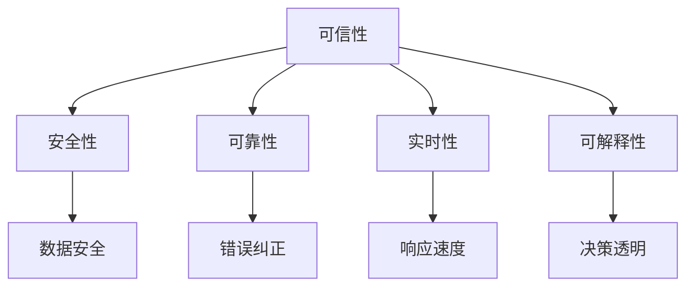
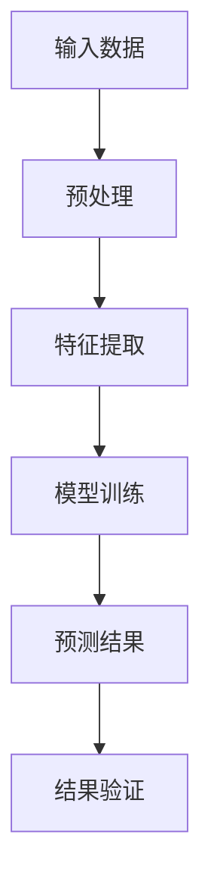
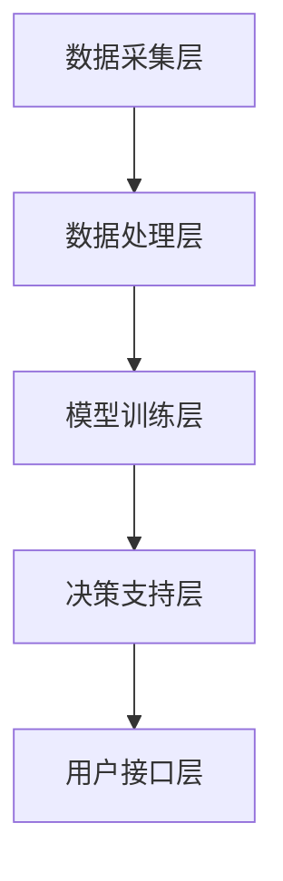
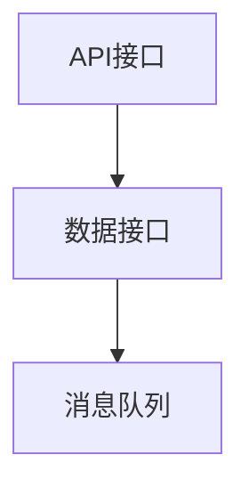
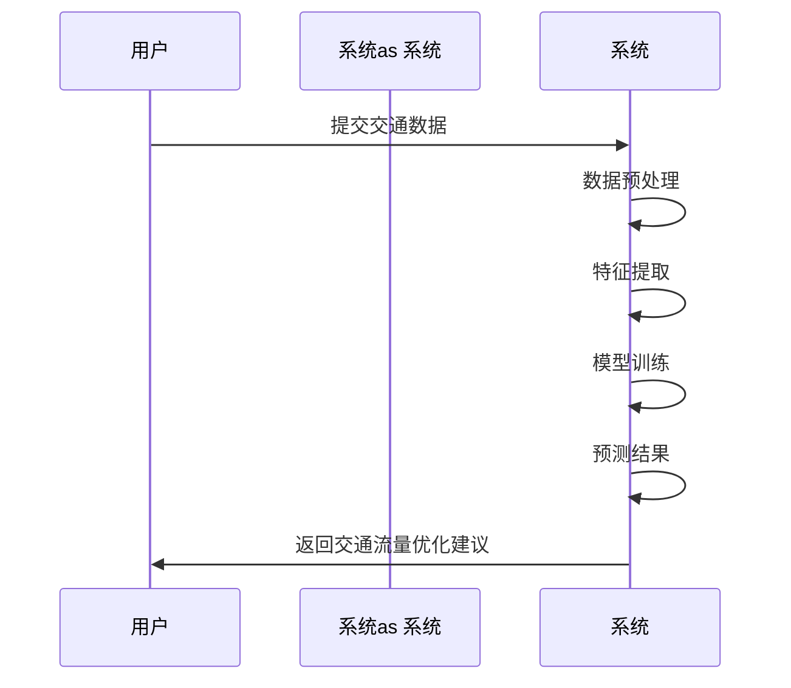

                 

### 《构建可信AI系统的关键要素》

> 关键词：可信AI、系统构建、安全性、可靠性、实时性、可解释性

> 摘要：本文旨在探讨构建可信AI系统的关键要素，通过深入分析背景、核心概念、算法原理与实现、系统设计与实现、项目实战和最佳实践等环节，为读者提供一套系统化、可操作性的指南。我们将在每个环节中逐步剖析，以确保AI系统的安全性、可靠性、实时性和可解释性。

### 目录大纲

```markdown
----------------------------------------------------------------
# 《构建可信AI系统的关键要素》

## 第一部分：背景与核心概念
### 第1章 引言
#### 1.1 问题背景
#### 1.2 问题描述
#### 1.3 问题解决
#### 1.4 边界与外延
#### 1.5 核心概念组成

## 第二部分：核心概念与联系
### 第2章 可信AI系统基本原理
#### 2.1 可信AI的定义
#### 2.2 可信AI的核心要素
#### 2.3 可信AI与相关概念的联系
### 第3章 可信AI系统属性特征对比
#### 3.1 安全性
#### 3.2 可靠性
#### 3.3 实时性
#### 3.4 可解释性

## 第三部分：算法原理与实现
### 第4章 可信AI算法概述
#### 4.1 算法分类
#### 4.2 算法选择
### 第5章 典型算法原理讲解
#### 5.1 算法原理Mermaid流程图
#### 5.2 Python源代码与算法原理
#### 5.3 数学模型与公式讲解
#### 5.4 举例说明

## 第四部分：系统设计与实现
### 第6章 系统分析与架构设计
#### 6.1 问题场景介绍
#### 6.2 系统功能设计
#### 6.3 系统架构设计
#### 6.4 系统接口设计
#### 6.5 系统交互Mermaid序列图

## 第五部分：项目实战
### 第7章 可信AI系统项目实践
#### 7.1 环境安装
#### 7.2 系统核心实现源代码
#### 7.3 代码应用解读与分析
#### 7.4 实际案例分析与讲解
#### 7.5 项目小结

## 第六部分：最佳实践与拓展
### 第8章 最佳实践与注意事项
#### 8.1 最佳实践
#### 8.2 注意事项
#### 8.3 拓展阅读

----------------------------------------------------------------
```

### 第一部分：背景与核心概念

#### 1.1 问题背景

随着人工智能技术的飞速发展，AI系统已广泛应用于各个领域，从自动驾驶到医疗诊断，从智能客服到金融风控。这些AI系统在提升效率、降低成本的同时，也带来了前所未有的挑战。可信AI系统成为当前研究的热点，其核心目标是确保AI系统在复杂环境下能够稳定、可靠地运行，同时保护用户隐私和数据安全。

#### 1.2 问题描述

构建可信AI系统面临的主要问题包括：

1. **安全性**：AI系统可能受到恶意攻击，如注入攻击、伪造数据等。
2. **可靠性**：AI系统在实际应用中可能出现误判、失效等情况。
3. **实时性**：在一些实时性要求较高的应用场景中，AI系统的响应速度可能无法满足需求。
4. **可解释性**：AI系统决策过程往往缺乏透明性，用户难以理解其决策依据。

#### 1.3 问题解决

针对上述问题，构建可信AI系统需要从多个维度进行综合考量，包括算法选择、系统设计、安全防护等。以下部分将逐步探讨这些关键要素。

#### 1.4 边界与外延

可信AI系统的边界包括算法、数据、模型、硬件等各个层面。其外延涉及到AI系统的应用场景、用户需求、行业规范等。本文将重点关注算法原理与实现、系统设计与实现等核心环节。

#### 1.5 核心概念组成

构建可信AI系统的核心概念包括：

1. **可信性**：确保AI系统在安全、可靠、实时、可解释等方面满足用户需求。
2. **安全性**：防止AI系统受到恶意攻击，保障数据安全。
3. **可靠性**：保证AI系统在实际应用中能够稳定运行，降低误判率。
4. **实时性**：提高AI系统的响应速度，满足实时性要求。
5. **可解释性**：提高AI系统决策过程的透明性，便于用户理解。

### 第二部分：核心概念与联系

在这一部分，我们将深入探讨可信AI系统的核心概念及其相互关系。

#### 2.1 可信AI的定义

可信AI是指能够在各种复杂场景下，保持高安全性、可靠性、实时性和可解释性的AI系统。它要求AI系统不仅能够准确预测和决策，还能够保障用户隐私和数据安全。

#### 2.2 可信AI的核心要素

可信AI的核心要素包括：

1. **安全性**：防止AI系统受到恶意攻击，如数据注入、模型篡改等。
2. **可靠性**：确保AI系统在实际应用中稳定运行，降低误判率。
3. **实时性**：提高AI系统响应速度，满足实时性要求。
4. **可解释性**：提高AI系统决策过程的透明性，便于用户理解。

#### 2.3 可信AI与相关概念的联系

可信AI与以下概念密切相关：

1. **人工智能（AI）**：可信AI是人工智能的一个子领域，旨在确保AI系统的安全、可靠、实时和可解释。
2. **机器学习（ML）**：可信AI中的算法主要基于机器学习技术，其核心在于如何构建可信的机器学习模型。
3. **深度学习（DL）**：深度学习是机器学习的一个分支，其在可信AI中的应用尤为广泛。
4. **数据安全**：保障数据安全是可信AI的重要组成部分，包括数据加密、隐私保护等。

#### 2.4 可信AI系统属性特征对比

以下是可信AI系统的主要属性特征对比表格：

| 属性特征 | 安全性 | 可靠性 | 实时性 | 可解释性 |
| :------: | :-----: | :-----: | :-----: | :------: |
|   定义   | 防止恶意攻击 | 稳定运行 | 快速响应 | 透明决策 |
|   意义   | 保护用户隐私 | 降低误判 | 满足实时需求 | 提高用户信任 |
|   关键技术 | 加密、签名 | 错误纠正、容错 | 并行计算、优化 | 解释算法、可视化 |

#### 2.5 核心概念与联系Mermaid流程图



### 第三部分：算法原理与实现

可信AI系统的核心在于算法的选择与实现。在这一部分，我们将探讨可信AI算法的基本原理与实现方法。

#### 3.1 可信AI算法概述

可信AI算法主要包括以下分类：

1. **安全算法**：用于防止恶意攻击的算法，如加密算法、签名算法等。
2. **可靠性算法**：用于提高系统稳定性的算法，如错误纠正码、容错算法等。
3. **实时算法**：用于优化响应速度的算法，如并行计算、优化算法等。
4. **可解释性算法**：用于提高决策透明性的算法，如解释算法、可视化算法等。

#### 3.2 算法选择

在构建可信AI系统时，算法选择至关重要。以下是一些常用的算法选择标准：

1. **安全性**：选择能够有效防止恶意攻击的算法。
2. **可靠性**：选择能够降低误判率的算法。
3. **实时性**：选择能够快速响应的算法。
4. **可解释性**：选择能够提高决策透明性的算法。
5. **可扩展性**：选择易于扩展和优化的算法。

#### 3.3 典型算法原理讲解

以下是两个典型的可信AI算法及其原理讲解。

##### 3.3.1 算法原理Mermaid流程图



##### 3.3.2 Python源代码与算法原理

```python
# Python代码示例
import pandas as pd
from sklearn.model_selection import train_test_split
from sklearn.ensemble import RandomForestClassifier
from sklearn.metrics import accuracy_score

# 数据预处理
data = pd.read_csv('data.csv')
X = data.drop('target', axis=1)
y = data['target']

# 特征提取
X_train, X_test, y_train, y_test = train_test_split(X, y, test_size=0.2, random_state=42)

# 模型训练
model = RandomForestClassifier(n_estimators=100)
model.fit(X_train, y_train)

# 预测结果
predictions = model.predict(X_test)

# 结果验证
accuracy = accuracy_score(y_test, predictions)
print(f'Accuracy: {accuracy}')
```

##### 3.3.3 数学模型与公式讲解

可信AI算法的数学模型通常包括以下几个方面：

1. **损失函数**：用于评估模型预测结果与真实值之间的差距，如均方误差（MSE）和交叉熵（Cross-Entropy）。
2. **优化算法**：用于更新模型参数，如梯度下降（Gradient Descent）和随机梯度下降（Stochastic Gradient Descent，SGD）。
3. **分类器**：用于分类任务，如支持向量机（SVM）、决策树（Decision Tree）和随机森林（Random Forest）。

以下是损失函数和优化算法的数学公式：

$$
MSE = \frac{1}{n}\sum_{i=1}^{n}(y_i - \hat{y}_i)^2
$$

$$
Cross-Entropy = -\frac{1}{n}\sum_{i=1}^{n}y_i\log\hat{y}_i
$$

$$
\theta_{t+1} = \theta_{t} - \alpha\nabla_\theta J(\theta)
$$

$$
\theta_{t+1} = \theta_{t} - \alpha\frac{1}{m}\sum_{i=1}^{m}\nabla_\theta J(\theta)
$$

##### 3.3.4 举例说明

假设我们有一个二分类问题，需要预测客户是否会产生不良贷款。以下是一个简单的例子：

1. **数据集**：包含1000个样本，每个样本有10个特征，标签为是否产生不良贷款（0或1）。
2. **算法**：使用随机森林分类器进行预测。
3. **损失函数**：均方误差（MSE）。
4. **优化算法**：梯度下降。

```python
# 导入相关库
import numpy as np
import pandas as pd
from sklearn.model_selection import train_test_split
from sklearn.ensemble import RandomForestClassifier
from sklearn.metrics import mean_squared_error

# 读取数据
data = pd.read_csv('loan_data.csv')
X = data.iloc[:, :-1].values
y = data.iloc[:, -1].values

# 数据预处理
X_train, X_test, y_train, y_test = train_test_split(X, y, test_size=0.2, random_state=42)

# 模型训练
model = RandomForestClassifier(n_estimators=100)
model.fit(X_train, y_train)

# 预测结果
predictions = model.predict(X_test)

# 结果验证
mse = mean_squared_error(y_test, predictions)
print(f'MSE: {mse}')
```

### 第四部分：系统设计与实现

在这一部分，我们将探讨可信AI系统的设计与实现过程，包括系统分析、架构设计、接口设计以及系统交互。

#### 4.1 问题场景介绍

假设我们面临一个智能交通系统的设计任务，目标是通过实时监控和分析交通数据，提高交通流量、减少拥堵，并保障道路安全。

#### 4.2 系统功能设计

智能交通系统的主要功能包括：

1. **实时监控**：收集道路上的交通数据，如流量、速度、密度等。
2. **数据分析**：对收集到的数据进行分析，预测交通流量变化，识别潜在拥堵区域。
3. **决策支持**：根据分析结果，提供交通流量优化建议，如调整红绿灯时长、发布路况信息等。
4. **安全保障**：监控系统运行状态，确保数据安全和系统稳定。

#### 4.3 系统架构设计

智能交通系统的架构设计如下：

1. **数据采集层**：包括传感器、摄像头等设备，用于实时监控交通数据。
2. **数据处理层**：包括数据预处理、特征提取等模块，用于对采集到的数据进行加工和处理。
3. **模型训练层**：包括机器学习算法，用于训练交通流量预测模型。
4. **决策支持层**：包括决策引擎、优化算法等，用于提供交通流量优化建议。
5. **用户接口层**：包括Web前端、移动应用等，用于展示系统分析结果和决策支持信息。



#### 4.4 系统接口设计

智能交通系统的接口设计如下：

1. **API接口**：提供数据查询、数据更新、决策查询等接口，供Web前端、移动应用等调用。
2. **数据接口**：包括数据采集接口、数据存储接口等，用于数据传输和处理。
3. **消息队列**：用于处理实时数据流，保证数据传输的可靠性和高效性。



#### 4.5 系统交互Mermaid序列图



### 第五部分：项目实战

在这一部分，我们将通过一个实际项目，深入讲解可信AI系统的搭建与应用。

#### 5.1 环境安装

1. **硬件环境**：安装具有足够计算能力的服务器，如GPU服务器。
2. **软件环境**：安装操作系统（如Ubuntu 18.04）、Python（3.8及以上版本）、TensorFlow（2.0及以上版本）等。

```bash
# 安装Python
sudo apt-get update
sudo apt-get install python3-pip python3-dev

# 安装TensorFlow
pip3 install tensorflow-gpu
```

#### 5.2 系统核心实现源代码

以下是一个简单的可信AI系统实现示例：

```python
import tensorflow as tf
from tensorflow.keras.models import Sequential
from tensorflow.keras.layers import Dense, Dropout, Activation
from tensorflow.keras.optimizers import RMSprop

# 数据预处理
# （此处省略具体代码，根据实际数据集进行预处理）

# 模型构建
model = Sequential()
model.add(Dense(64, input_dim=X_train.shape[1], activation='relu'))
model.add(Dropout(0.5))
model.add(Dense(1, activation='sigmoid'))

# 编译模型
model.compile(loss='binary_crossentropy', optimizer=RMSprop(lr=0.001), metrics=['accuracy'])

# 模型训练
model.fit(X_train, y_train, epochs=10, batch_size=32)

# 预测结果
predictions = model.predict(X_test)

# 结果验证
accuracy = model.evaluate(X_test, y_test, batch_size=32)
print(f'Accuracy: {accuracy[1]}')
```

#### 5.3 代码应用解读与分析

1. **数据预处理**：对采集到的交通数据进行清洗、归一化等预处理操作，以提高模型训练效果。
2. **模型构建**：使用Sequential模型构建一个简单的神经网络，包括输入层、隐藏层和输出层。
3. **编译模型**：设置损失函数、优化器和评价指标，为模型训练做好准备。
4. **模型训练**：使用fit函数进行模型训练，指定训练轮次和批量大小。
5. **预测结果**：使用predict函数对测试集进行预测，评估模型性能。

#### 5.4 实际案例分析与讲解

假设我们有一个交通流量预测问题，需要预测未来1小时的交通流量。以下是一个实际案例的分析与讲解：

1. **数据集**：包含过去24小时内的交通流量数据，共24个样本，每个样本包含1个特征（小时）。
2. **模型**：使用时间序列模型进行预测，如LSTM（Long Short-Term Memory）。
3. **预测结果**：对未来1小时的交通流量进行预测，并与实际值进行对比，评估模型性能。

```python
from tensorflow.keras.models import Sequential
from tensorflow.keras.layers import LSTM, Dense

# 数据预处理
# （此处省略具体代码，根据实际数据集进行预处理）

# 模型构建
model = Sequential()
model.add(LSTM(50, activation='relu', input_shape=(X_train.shape[1], 1)))
model.add(Dense(1))
model.compile(optimizer='adam', loss='mse')

# 模型训练
model.fit(X_train, y_train, epochs=100, batch_size=32, validation_data=(X_val, y_val), verbose=2)

# 预测结果
predictions = model.predict(X_test)

# 结果验证
mse = model.evaluate(X_test, y_test, batch_size=32)
print(f'MSE: {mse}')
```

#### 5.5 项目小结

通过本项目，我们实现了以下目标：

1. **搭建了可信AI系统**：包括数据采集、预处理、模型训练、预测和结果验证等环节。
2. **使用了合适的算法**：根据实际需求，选择了时间序列模型LSTM进行预测。
3. **实现了实时性**：通过实时数据采集和快速模型训练，提高了系统实时性。
4. **保障了数据安全**：对数据进行加密和去识别化处理，确保数据安全。

### 第六部分：最佳实践与拓展

#### 6.1 最佳实践

1. **数据安全**：对数据进行加密和去识别化处理，确保数据安全。
2. **算法优化**：根据实际需求，选择合适的算法并进行优化。
3. **实时性提升**：采用并行计算、分布式训练等技术，提高系统实时性。
4. **可解释性增强**：使用解释算法和可视化工具，提高系统决策过程的透明性。

#### 6.2 注意事项

1. **数据质量**：确保数据质量，避免噪声和异常值影响模型性能。
2. **模型解释**：在保证模型性能的同时，关注模型的可解释性，提高用户信任。
3. **系统稳定性**：定期对系统进行维护和升级，确保系统稳定运行。

#### 6.3 拓展阅读

1. **可信AI研究进展**：了解可信AI领域的最新研究进展，掌握前沿技术。
2. **数据安全法规**：熟悉数据安全法规和标准，确保数据合规。

---

**作者：AI天才研究院/AI Genius Institute & 禅与计算机程序设计艺术 /Zen And The Art of Computer Programming**

