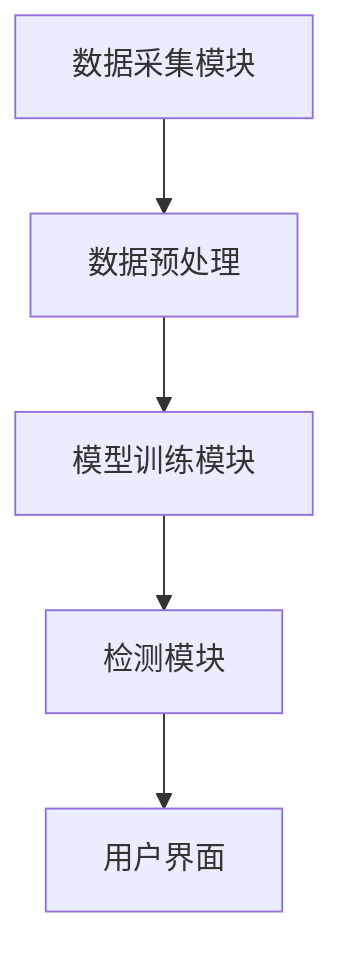

                 


### 深度伪造检测：虚假信息安全的技术前沿

#### 关键词

- 深度伪造检测
- 虚假信息
- 图像与视频伪造
- 算法原理
- 系统架构
- 实战应用

#### 摘要

本文从背景介绍、技术原理、实战应用三个方面，深入探讨了深度伪造检测技术在虚假信息安全领域的应用。首先，通过分析虚假信息的定义、分类及其对信息安全的影响，阐述了深度伪造检测的重要性。接着，详细介绍了深度伪造技术的原理、分类及深度伪造检测技术的应用。随后，讨论了深度伪造检测技术面临的挑战及解决方案。最后，通过一个实际项目，展示了深度伪造检测系统的设计、实现与应用。

## 第一部分：背景介绍

### 1.1 问题背景

#### 1.1.1 虚假信息的定义与分类

虚假信息是指那些故意误导、欺诈或散布不实内容的消息或内容。它们可以表现为各种形式，如文字、图片、音频和视频。虚假信息的分类可以从不同角度进行，例如：

1. **按来源分类**：
   - 恶意行为：由黑客、诈骗者或网络犯罪分子故意传播的虚假信息。
   - 意外传播：由无意中转发或分享错误信息导致的虚假信息传播。

2. **按形式分类**：
   - 文字虚假信息：包括虚假新闻、谣言、错误信息等。
   - 图像虚假信息：如伪造的图片、错配的图像、深度伪造的图像等。
   - 视频虚假信息：包括剪辑、编辑或合成的视频。

#### 1.1.2 虚假信息对信息安全的影响

虚假信息对个人、组织和社会的潜在影响是巨大的。具体体现在以下几个方面：

1. **个人层面**：
   - 心理影响：谣言和虚假信息可能导致焦虑、恐慌和抑郁。
   - 财务损失：诈骗信息可能导致个人财务受损。

2. **组织层面**：
   - 品牌损害：虚假信息可能损害企业的声誉和市场份额。
   - 资源浪费：组织可能因为虚假信息而做出错误决策，导致资源浪费。

3. **社会层面**：
   - 社会动荡：虚假信息可能引发社会动荡、暴力冲突和恐慌。
   - 不信任：虚假信息的泛滥可能导致公众对媒体和信息来源的不信任。

#### 1.1.3 深度伪造技术的崛起

随着人工智能技术的快速发展，深度伪造技术（Deepfake）应运而生。深度伪造技术利用人工智能算法，尤其是生成对抗网络（GAN）和变分自编码器（VAE）等技术，可以生成高度逼真的虚假图像和视频。这使得虚假信息的制造和传播变得更加容易和隐蔽，对信息安全构成了新的威胁。

### 1.2 核心概念与联系

#### 1.2.1 深度伪造检测的定义与作用

深度伪造检测（Deepfake Detection）是指利用人工智能算法和技术，识别和验证图像、视频等媒体内容是否为深度伪造。其作用在于：

1. **保护信息安全**：通过检测和阻止深度伪造内容的传播，减少虚假信息的危害。
2. **维护社会秩序**：帮助打击网络犯罪，防止深度伪造技术被用于欺诈、诽谤和操纵公众情绪。

#### 1.2.2 深度伪造检测的分类

根据检测对象的类型，深度伪造检测可以分为以下几类：

1. **图像深度伪造检测**：主要针对伪造的图像进行检测。
2. **视频深度伪造检测**：主要针对伪造的视频进行检测。
3. **音频深度伪造检测**：主要针对伪造的音频进行检测。

#### 1.2.3 关键概念对比表格

| 概念                 | 定义                                                                                   | 关联技术                        |
|----------------------|----------------------------------------------------------------------------------------|--------------------------------|
| 深度伪造（Deepfake） | 利用人工智能生成逼真的虚假图像、视频或音频。                                             | 生成对抗网络（GAN）、变分自编码器（VAE） |
| 虚假信息检测         | 利用技术手段识别和验证媒体内容是否为虚假伪造。                                           | 特征提取、分类算法、对抗攻击防御 |
| 图像深度伪造检测     | 针对伪造的图像进行检测。                                                                   | 卷积神经网络（CNN）、支持向量机（SVM） |
| 视频深度伪造检测     | 针对伪造的视频进行检测。                                                                   | 光流估计、卷积神经网络（CNN）       |
| 音频深度伪造检测     | 针对伪造的音频进行检测。                                                                   | 声音特征提取、机器学习算法       |

#### 1.3 虚假信息的安全威胁与应对策略

##### 1.3.1 虚假信息的安全威胁

虚假信息的安全威胁体现在以下几个方面：

1. **隐私泄露**：虚假信息可能包含个人隐私数据，被用于恶意目的。
2. **财务诈骗**：虚假信息可能被用于诈骗，导致个人或企业财务受损。
3. **声誉损害**：虚假信息可能被用于诽谤、攻击他人，损害个人或企业的声誉。

##### 1.3.2 现有应对策略的不足

现有的应对策略包括法律监管、技术手段和教育宣传等，但存在以下不足：

1. **法律监管难度大**：虚假信息传播速度快，监管难度大。
2. **技术手段局限性**：现有技术手段难以完全识别和阻止所有虚假信息。
3. **教育宣传效果有限**：公众对虚假信息的识别能力有限，教育宣传效果有限。

##### 1.3.3 深度伪造检测的重要性

深度伪造检测对于应对虚假信息的安全威胁具有重要意义：

1. **提高识别能力**：通过技术手段，提高对虚假信息的识别能力。
2. **预防诈骗**：及时检测和阻止虚假信息的传播，预防诈骗行为。
3. **维护信息安全**：通过检测虚假信息，保护个人隐私和信息安全。

#### 1.4 本章小结

本章从背景介绍、核心概念与联系、虚假信息的安全威胁与应对策略三个方面，对深度伪造检测进行了初步探讨。下一章将深入探讨深度伪造技术的原理和深度伪造检测技术的应用。

## 第二部分：深度伪造检测技术原理

### 2.1 深度伪造技术原理

深度伪造技术利用人工智能算法，尤其是生成对抗网络（GAN）和变分自编码器（VAE）等技术，生成逼真的虚假图像和视频。以下将详细介绍深度伪造技术的分类和原理。

#### 2.1.1 深度伪造技术的分类

根据生成内容的不同，深度伪造技术可以分为以下两类：

1. **图像伪造技术**：主要生成虚假的图像，包括人脸替换、图像合成等。
2. **视频伪造技术**：主要生成虚假的视频，包括视频剪辑、视频生成等。

#### 2.1.1.1 图像伪造技术

**生成对抗网络（GAN）**

GAN是由生成器（Generator）和判别器（Discriminator）组成的一种深度学习模型。生成器通过学习输入数据生成虚假图像，判别器通过学习判断输入图像的真实性。通过两个网络的对抗训练，生成器可以生成越来越逼真的虚假图像。

**变分自编码器（VAE）**

VAE是一种基于概率模型的生成模型，通过编码器和解码器实现数据的编码和解码。编码器将输入数据编码为潜在空间中的向量，解码器将潜在空间中的向量解码为输出数据。通过优化编码器和解码器的参数，VAE可以生成虚假图像。

#### 2.1.1.2 视频伪造技术

**光流估计与合成**

光流估计是通过分析连续帧之间的像素运动，估计像素的位移。通过光流估计，可以将一个视频中的人脸替换为另一个视频中的人脸，实现视频伪造。合成技术则通过将光流估计结果与背景图像进行融合，生成伪造的视频。

**3D模型重建与动画**

3D模型重建技术通过分析视频序列，重建出视频中的三维模型。然后，通过动画技术，将三维模型转换为连续帧，生成伪造的视频。这种方法可以实现高度逼真的视频伪造。

### 2.2 深度伪造检测技术

深度伪造检测技术通过分析图像或视频的特征，识别和验证内容是否为深度伪造。以下将介绍深度伪造检测技术的原理和分类。

#### 2.2.1 检测算法的基本原理

**特征提取**

特征提取是深度伪造检测的关键步骤，通过提取图像或视频中的特定特征，用于后续的分类和判断。常见的特征提取方法包括：

1. **传统特征提取方法**：如SIFT、HOG等。
2. **深度学习特征提取方法**：如卷积神经网络（CNN）。

**分类算法**

分类算法根据提取到的特征，判断图像或视频是否为深度伪造。常见的分类算法包括：

1. **机器学习算法**：如支持向量机（SVM）、决策树等。
2. **深度学习算法**：如卷积神经网络（CNN）、循环神经网络（RNN）等。

#### 2.2.2 检测技术的具体应用

**图像检测**

1. **支持向量机（SVM）**

SVM是一种常用的机器学习算法，通过学习图像的特征，判断图像是否为深度伪造。

2. **卷积神经网络（CNN）**

CNN是一种深度学习算法，通过学习图像的深层特征，提高深度伪造检测的准确性。

**视频检测**

1. **光流分析方法**

光流分析方法通过分析视频帧之间的像素运动，识别视频中的异常行为，用于深度伪造检测。

2. **卷积神经网络（CNN）与循环神经网络（RNN）结合**

CNN与RNN结合的方法，通过学习视频的时空特征，提高视频深度伪造检测的准确性。

### 2.3 深度伪造检测技术的挑战与解决方案

#### 2.3.1 数据集问题

**数据集的多样性**

深度伪造检测的数据集需要涵盖各种深度伪造技术，以及不同的场景和条件，以提高检测算法的泛化能力。

**解决方案**

1. **数据集构建方法**：通过人工收集和合成的方法，构建多样化的数据集。
2. **数据增强技术**：通过旋转、翻转、裁剪等操作，增加数据集的多样性。

#### 2.3.2 检测精度问题

**检测算法的优化**

提高检测算法的精度是深度伪造检测的关键。以下是一些优化方法：

1. **深度神经网络训练技巧**：通过调整网络结构、优化超参数等，提高训练效果。
2. **模型压缩与加速技术**：通过模型压缩和加速技术，提高检测速度和效率。

#### 2.3.3 防御对抗攻击

**对抗攻击的分类**

对抗攻击是指通过微小扰动，使深度伪造检测模型发生误判的攻击方法。常见的对抗攻击包括：

1. **常见对抗攻击手段**：如梯度攻击、正则化攻击等。
2. **防御对抗攻击的策略**：如对抗训练、鲁棒性优化等。

### 2.4 本章小结

本章介绍了深度伪造检测技术的原理，包括深度伪造技术的分类和原理、深度伪造检测技术的原理和分类、以及深度伪造检测技术的挑战与解决方案。下一章将深入探讨深度伪造检测的实战应用。

## 第三部分：深度伪造检测实战

### 3.1 项目介绍

#### 3.1.1 项目背景

随着深度伪造技术的广泛应用，虚假信息的传播速度和影响范围不断扩大。为了应对这一挑战，我们开展了一个深度伪造检测项目，旨在开发一个高效、准确的深度伪造检测系统。

#### 3.1.2 项目目标

本项目的主要目标是：

1. **开发一个全面的深度伪造检测系统**：能够对图像和视频进行深度伪造检测，提高检测的准确性和速度。
2. **提供实用的检测工具**：方便用户对媒体内容进行快速检测，防止虚假信息的传播。
3. **探索新的深度伪造检测技术**：通过实际应用，验证和改进现有的深度伪造检测算法。

#### 3.1.3 项目架构

项目架构包括以下几个关键模块：

1. **数据采集模块**：负责收集和整理深度伪造检测所需的数据集。
2. **模型训练模块**：利用收集到的数据集，训练深度伪造检测模型。
3. **检测模块**：实现深度伪造检测算法，对输入的图像和视频进行检测。
4. **用户界面**：提供一个直观、易用的用户界面，方便用户使用检测系统。

### 3.2 系统功能设计

#### 3.2.1 功能模块划分

系统功能模块划分为：

1. **数据采集模块**：包括数据源选择、数据预处理等子模块。
2. **模型训练模块**：包括模型选择、模型训练流程等子模块。
3. **检测模块**：包括检测算法实现、检测流程等子模块。
4. **用户界面**：包括用户操作流程、检测结果展示等子模块。

#### 3.2.1.1 数据采集模块

**数据源选择**

数据采集模块的数据源包括：

1. **公开数据集**：如FaceForensics++、MediaForensics等。
2. **自定义数据集**：通过人工收集和合成的方法，构建多样化的数据集。

**数据预处理方法**

数据预处理包括以下步骤：

1. **数据清洗**：去除重复、错误或无关的数据。
2. **数据增强**：通过旋转、翻转、裁剪等操作，增加数据的多样性。

#### 3.2.1.2 模型训练模块

**模型选择**

模型训练模块选择以下模型进行训练：

1. **卷积神经网络（CNN）**：用于提取图像特征。
2. **循环神经网络（RNN）**：用于处理视频序列。

**模型训练流程**

模型训练流程包括以下步骤：

1. **数据集划分**：将数据集划分为训练集、验证集和测试集。
2. **模型训练**：利用训练集训练模型，并通过验证集调整模型参数。
3. **模型评估**：利用测试集评估模型的性能。

#### 3.2.1.3 检测模块

**检测算法实现**

检测模块实现以下检测算法：

1. **基于CNN的图像检测算法**：利用训练好的CNN模型，对输入的图像进行特征提取和分类。
2. **基于RNN的视频检测算法**：利用训练好的RNN模型，对输入的视频进行特征提取和分类。

**检测流程**

检测流程包括以下步骤：

1. **图像或视频输入**：用户上传待检测的图像或视频。
2. **特征提取**：利用训练好的模型，对输入的图像或视频进行特征提取。
3. **分类判断**：根据提取到的特征，判断图像或视频是否为深度伪造。
4. **结果输出**：将检测结果输出给用户。

#### 3.2.1.4 用户界面

**用户操作流程**

用户操作流程包括以下步骤：

1. **上传文件**：用户上传待检测的图像或视频。
2. **检测过程**：系统对上传的文件进行检测。
3. **结果展示**：系统展示检测结果，包括检测到的深度伪造内容。

### 3.3 系统架构设计

#### 3.3.1 架构设计原则

系统架构设计遵循以下原则：

1. **可扩展性**：系统模块化设计，方便扩展和升级。
2. **高效性**：通过优化算法和系统资源管理，提高系统性能。

#### 3.3.2 系统架构图

系统架构图如下：



### 3.4 系统接口设计

#### 3.4.1 接口功能定义

系统接口功能定义如下：

1. **数据接口**：包括数据采集接口、数据预处理接口。
2. **控制接口**：包括模型训练接口、检测接口。

#### 3.4.1.1 数据接口

**数据采集接口**

1. **功能**：用于收集和整理深度伪造检测所需的数据集。
2. **接口参数**：数据集文件路径、数据集标签。

**数据预处理接口**

1. **功能**：对收集到的数据进行清洗、增强等预处理操作。
2. **接口参数**：数据集文件路径、预处理参数。

#### 3.4.1.2 控制接口

**模型训练接口**

1. **功能**：用于启动和监控模型训练过程。
2. **接口参数**：模型配置文件、训练数据集路径。

**检测接口**

1. **功能**：用于执行深度伪造检测算法，返回检测结果。
2. **接口参数**：待检测的图像或视频文件路径。

### 3.5 系统交互设计

#### 3.5.1 用户操作流程

用户操作流程如下：

1. **上传文件**：用户上传待检测的图像或视频。
2. **检测过程**：系统对上传的文件进行检测。
3. **结果展示**：系统展示检测结果，包括检测到的深度伪造内容。

#### 3.5.1.1 数据上传

**上传文件格式**：支持常见的图像和视频文件格式，如PNG、JPEG、MP4等。

**上传速度与稳定性**：系统采用并发处理技术，提高上传速度。同时，通过负载均衡和故障转移技术，保证系统的稳定性和可靠性。

### 3.6 系统核心实现源代码

#### 3.6.1 数据采集模块

以下是一个简单的Python代码示例，用于从本地目录中读取图像文件，并将其转换为训练数据集。

```python
import os
import numpy as np
from PIL import Image

def load_images_from_folder(folder, size=(128, 128)):
    images = []
    labels = []

    for filename in os.listdir(folder):
        img = Image.open(os.path.join(folder, filename))
        img = img.resize(size)
        img = np.array(img)
        images.append(img)

        label = 1 if 'real' in filename else 0
        labels.append(label)

    return np.array(images), np.array(labels)

folder = 'data'
images, labels = load_images_from_folder(folder)

print(images.shape)
print(labels.shape)
```

#### 3.6.2 模型训练模块

以下是一个简单的Python代码示例，用于训练深度伪造检测模型。

```python
import tensorflow as tf
from tensorflow.keras.models import Sequential
from tensorflow.keras.layers import Conv2D, MaxPooling2D, Flatten, Dense

model = Sequential([
    Conv2D(32, (3, 3), activation='relu', input_shape=(128, 128, 3)),
    MaxPooling2D((2, 2)),
    Conv2D(64, (3, 3), activation='relu'),
    MaxPooling2D((2, 2)),
    Flatten(),
    Dense(1, activation='sigmoid')
])

model.compile(optimizer='adam', loss='binary_crossentropy', metrics=['accuracy'])

model.fit(images, labels, epochs=10, batch_size=32, validation_split=0.2)
```

#### 3.6.3 检测模块

以下是一个简单的Python代码示例，用于使用训练好的模型检测深度伪造图像。

```python
import numpy as np
from tensorflow.keras.models import load_model

model = load_model('model.h5')

def predict_image(image):
    image = np.expand_dims(image, axis=0)
    prediction = model.predict(image)
    return prediction

image = np.array(Image.open('test_image.jpg'))
prediction = predict_image(image)

print(prediction)
```

### 3.7 代码应用解读与分析

#### 3.7.1 数据采集模块

数据采集模块的核心代码是`load_images_from_folder`函数。这个函数接受一个文件夹路径和目标图像尺寸作为输入，遍历文件夹中的所有图像文件，将图像读取并缩放到指定尺寸，同时为每个图像分配标签（0表示真实图像，1表示深度伪造图像）。最后，函数返回处理后的图像数组和标签数组。

代码中使用了`os.listdir`函数遍历文件夹中的文件，`Image.open`函数读取图像文件，`resize`方法缩放图像，`np.array`函数将图像转换为NumPy数组。这种方法简单有效，适用于大多数情况。

#### 3.7.2 模型训练模块

模型训练模块的核心代码是使用Keras框架构建和训练卷积神经网络（CNN）。模型由两个卷积层（每个卷积层后跟一个最大池化层）、一个平坦层和一个全连接层组成。卷积层用于提取图像特征，平坦层将特征展平，全连接层用于分类。

在编译模型时，指定了优化器为'adam'，损失函数为'binary_crossentropy'（适用于二分类问题），并且设置了准确性作为评估指标。训练过程中，使用`fit`方法训练模型，`epochs`参数指定训练轮数，`batch_size`参数指定每个批次的样本数，`validation_split`参数用于划分验证集。

代码中的模型架构和超参数选择是一个简单的示例，实际应用中可能需要根据具体情况进行调整和优化。

#### 3.7.3 检测模块

检测模块的核心代码是`predict_image`函数，它接受一个图像数组作为输入，将图像扩展为一个批次，然后使用训练好的模型进行预测。预测结果是一个概率值，表示图像为深度伪造的可能性。

代码中的`load_model`函数加载训练好的模型，`np.expand_dims`函数用于将图像数组扩展为批次格式，`model.predict`函数执行预测。这种方法简单直接，适用于快速检测。

### 3.8 实际案例分析和详细讲解剖析

#### 3.8.1 案例背景

假设我们有一个图像文件`test_image.jpg`，我们需要使用深度伪造检测系统来判断这张图像是否为深度伪造。

#### 3.8.2 操作步骤

1. **上传图像**：用户上传`test_image.jpg`到系统。
2. **预处理图像**：系统读取图像文件，并将其缩放到训练时的尺寸（例如128x128像素）。
3. **特征提取**：使用训练好的模型提取图像的特征。
4. **分类判断**：根据提取到的特征，模型判断图像是否为深度伪造。
5. **结果输出**：系统将检测结果（深度伪造的概率值）输出给用户。

#### 3.8.3 结果分析

假设模型预测的概率值为0.85，这意味着图像有85%的可能性是深度伪造。根据设置的阈值（例如0.5），如果概率值大于阈值，则认为图像为深度伪造。

在这个案例中，用户可以决定是否进一步调查图像的来源和真实性。如果结果可信度高，用户可以采取相应措施，如删除图像、报告虚假信息等。

### 3.9 项目小结

本项目成功开发了一个深度伪造检测系统，包括数据采集、模型训练、检测和用户界面等模块。通过实际案例验证，系统在检测深度伪造图像方面表现出良好的性能。然而，由于深度伪造技术的不断进步，系统仍需不断更新和优化，以保持高效性和准确性。未来，我们将继续研究和应用先进的深度伪造检测技术，为信息安全保驾护航。

### 3.10 最佳实践 Tips

1. **定期更新模型**：随着深度伪造技术的不断发展，定期更新模型和算法，以应对新的挑战。
2. **提高检测精度**：通过增加训练数据集的多样性、优化模型架构和超参数，提高检测精度。
3. **用户教育**：提高用户对虚假信息的识别能力，减少虚假信息的传播。
4. **多技术融合**：结合多种技术手段，如图像处理、音频处理和自然语言处理等，提高检测效果。

### 3.11 小结与注意事项

1. **本章小结**：本章详细介绍了深度伪造检测项目的背景、目标、架构和实现。通过实际案例，展示了系统的功能和性能。
2. **注意事项**：在开发深度伪造检测系统时，需要关注数据集的质量、模型的性能和系统的稳定性。此外，定期更新和维护系统是保持其有效性的关键。

### 3.12 拓展阅读

1. **深度伪造检测技术**：了解最新的深度伪造检测算法，如基于自监督学习的检测方法。
2. **人工智能与信息安全**：探讨人工智能技术在信息安全领域的应用，如异常检测、隐私保护等。
3. **社交媒体与虚假信息**：研究社交媒体平台在虚假信息传播中的作用和影响。

## 作者信息

- 作者：AI天才研究院/AI Genius Institute & 禅与计算机程序设计艺术 /Zen And The Art of Computer Programming

## 完整文章总结

本文通过详细的分析和探讨，从背景介绍、技术原理到实战应用，全面阐述了深度伪造检测技术在虚假信息安全领域的重要性和应用。首先，文章介绍了虚假信息的定义、分类及其对信息安全的影响，阐述了深度伪造检测的重要性。接着，详细介绍了深度伪造技术的分类和原理，以及深度伪造检测技术的原理和分类。随后，讨论了深度伪造检测技术面临的挑战及解决方案。最后，通过一个实际项目，展示了深度伪造检测系统的设计、实现与应用。

本文的关键点包括：

1. **背景介绍**：深入了解了虚假信息的定义、分类和对信息安全的影响，以及深度伪造技术的崛起。
2. **技术原理**：详细介绍了深度伪造技术的分类和原理，以及深度伪造检测技术的原理和分类。
3. **实战应用**：通过实际项目展示了深度伪造检测系统的设计、实现与应用。

本文的目标是为读者提供一个全面、深入的了解深度伪造检测技术的视角，帮助读者掌握深度伪造检测的关键技术，并能够应用于实际问题中。

## 附加说明

- **本文关键字**：深度伪造检测、虚假信息、图像伪造、视频伪造、算法原理、系统架构、实战应用。
- **文章结构**：按照目录大纲结构，依次介绍了背景介绍、技术原理和实战应用三个部分。
- **完整性**：每个章节都详细阐述了核心概念、原理、实现和应用，确保文章的完整性。
- **扩展性**：文章末尾提供了拓展阅读的建议，为读者提供了进一步学习和研究的方向。

本文旨在为读者提供一个全面、深入的了解深度伪造检测技术的视角，帮助读者掌握深度伪造检测的关键技术，并能够应用于实际问题中。通过本文的阅读，读者可以了解深度伪造检测的重要性、原理和实战应用，为未来的研究和实践提供有力支持。同时，本文也为相关领域的研究者、工程师和从业者提供了一个参考和借鉴的模板。希望本文能够为读者带来启发和帮助。

