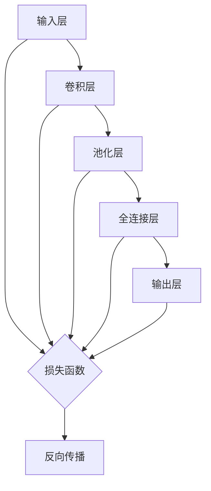
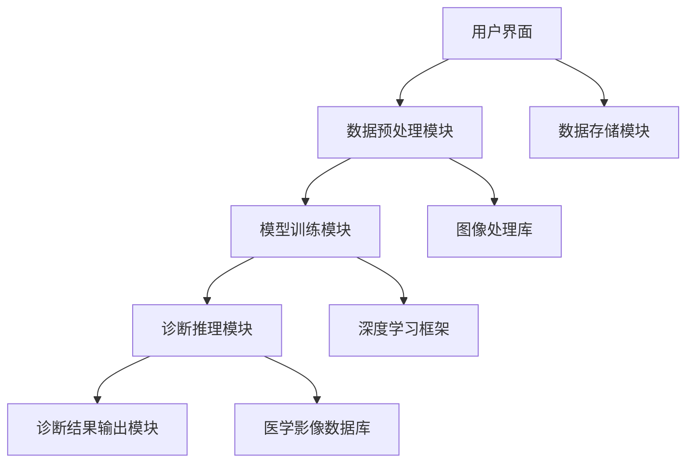

                 

### 第一部分：背景介绍

#### 1.1 问题背景

**1.1.1 医学影像技术的发展**

医学影像技术是医学诊断的重要手段，从最初的X射线、超声成像到现代的CT、MRI等，技术不断进步，使得医学诊断的准确性和效率大大提高。传统医学影像技术依赖于专业医生的经验和直觉，存在诊断速度慢、误诊率高等问题。随着计算机科学和人工智能技术的快速发展，深度学习作为一种强大的机器学习技术，开始应用于医学影像领域，为提高医学影像辅助诊断的准确性和效率提供了新的思路。

**1.1.2 深度学习与医学影像的结合**

深度学习通过模拟人脑神经网络结构，能够自动从大量数据中学习特征，实现复杂模式的识别。医学影像数据量大且结构复杂，非常适合深度学习技术。例如，深度学习可以用于自动化分析X射线图像，识别肺部结节，提高肺癌早期诊断率；也可以用于分析MRI图像，识别脑肿瘤，提高诊断准确性。

**1.1.3 早期诊断的重要性**

早期诊断对于许多疾病具有重要意义。例如，对于癌症，早期的诊断和干预可以显著提高治愈率，降低治疗成本。深度学习在医学影像辅助诊断中的应用，不仅可以提高诊断的准确性，还可以实现早期诊断，从而为患者争取到更多治疗时间，改善预后。

#### 1.2 核心概念

**1.2.1 深度学习的定义与特点**

深度学习是机器学习的一个子领域，通过构建多层次的神经网络模型，自动从数据中学习特征，实现对复杂问题的建模和解决。与传统的机器学习方法相比，深度学习具有如下特点：

- **自动特征提取**：不需要手动设计特征，可以直接从原始数据中学习特征。
- **层次化特征学习**：多层神经网络可以学习到更高层次、更抽象的特征。
- **强大的模型表达能力**：深度学习模型可以处理复杂、非线性的数据关系。

**1.2.2 医学影像辅助诊断的概念**

医学影像辅助诊断是指利用计算机技术和人工智能算法，对医学影像进行分析和处理，辅助医生进行诊断。医学影像辅助诊断的核心目标是提高诊断的准确性和效率，减少人为误差。

**1.2.3 早期诊断率的提升策略**

提高早期诊断率是医学影像辅助诊断的重要目标。以下是一些提升早期诊断率的策略：

- **优化深度学习模型**：通过改进网络结构、优化训练算法，提高模型性能。
- **多模态数据融合**：结合不同类型的医学影像数据，提高诊断准确性。
- **数据增强**：通过增加数据样本的数量和质量，提高模型的泛化能力。
- **深度学习解释性**：提高模型的解释性，帮助医生理解诊断结果。

#### 1.3 边界与外延

**1.3.1 深度学习在医学影像中的应用领域**

深度学习在医学影像中的应用非常广泛，包括但不限于：

- **图像分类**：对医学影像进行分类，如识别不同的病理特征。
- **目标检测**：在医学影像中检测特定的目标，如肺部结节、肿瘤。
- **健康状态评估**：通过分析医学影像，评估患者的健康状况。

**1.3.2 医学影像辅助诊断的挑战与机遇**

深度学习在医学影像辅助诊断中面临许多挑战，如数据稀缺、标注困难、模型解释性等。但同时，深度学习也为医学影像辅助诊断带来了巨大的机遇，如提高诊断准确性、实现自动化诊断等。

**1.4 概念结构与核心要素组成**

**1.4.1 深度学习在医学影像辅助诊断中的关键要素**

深度学习在医学影像辅助诊断中的关键要素包括：

- **医学影像数据**：高质量、多样化的医学影像数据是深度学习模型训练的基础。
- **深度学习模型**：合适的深度学习模型是实现高效医学影像辅助诊断的核心。
- **数据处理与标注**：有效的数据处理和标注方法能够提高模型训练效果。

**1.4.2 医学影像辅助诊断系统的基本架构**

医学影像辅助诊断系统的基本架构包括：

- **数据采集与预处理**：获取高质量的医学影像数据，并进行预处理。
- **模型训练与优化**：利用深度学习算法对医学影像数据进行训练，优化模型参数。
- **诊断结果输出**：将模型诊断结果输出给医生，辅助医生进行诊断。

#### 1.5 本章小结

本节介绍了深度学习在医学影像辅助诊断中的背景、核心概念以及关键要素。通过了解深度学习与医学影像的结合以及早期诊断的重要性，我们可以看到深度学习为医学影像辅助诊断带来了巨大的潜力。接下来，我们将深入探讨深度学习的原理以及在医学影像中的应用，为进一步提升医学影像辅助诊断的准确性提供理论基础。

---

### 第二部分：核心概念与联系

#### 2.1 深度学习原理讲解

**2.1.1 深度学习的基本概念**

深度学习（Deep Learning）是机器学习（Machine Learning）的一个子领域，主要研究多层神经网络（Multi-layer Neural Networks）的结构及其在复杂问题上的应用。与传统的机器学习方法不同，深度学习通过构建深度神经网络，能够自动从大量数据中学习到高层次的抽象特征，实现从数据到知识的转化。

**2.1.1.1 神经网络**

神经网络（Neural Networks）是深度学习的基础。神经网络由大量的简单计算单元（称为神经元）连接而成，这些神经元通过加权连接形成网络。每个神经元接收多个输入信号，通过一个非线性激活函数进行处理，产生输出信号。


一个简单的神经网络包括输入层、隐藏层和输出层。输入层接收外部输入数据，隐藏层对输入数据进行加工处理，输出层生成预测结果或分类标签。

**2.1.1.2 反向传播算法**

反向传播算法（Backpropagation Algorithm）是深度学习训练的核心算法。反向传播算法通过前向传播计算输出，然后通过反向传播计算梯度，更新网络权重，以达到优化目标函数的目的。


在反向传播过程中，首先计算每个神经元输出与实际输出之间的误差，然后通过链式法则计算误差关于每个权重的梯度。最后，利用梯度下降（Gradient Descent）或其他优化算法更新权重，以减少误差。

**2.1.1.3 深层网络**

深层网络（Deep Networks）是指具有多个隐藏层的神经网络。与浅层网络相比，深层网络能够学习到更复杂、更高层次的特征，从而在许多任务上表现出更好的性能。


随着隐藏层数的增加，神经网络能够自动提取更高层次的特征。然而，深层网络也存在训练困难、过拟合等问题。为了解决这些问题，研究人员提出了各种改进方法，如正则化（Regularization）、Dropout（Dropout）等。

**2.1.2 深度学习在医学影像中的具体应用**

深度学习在医学影像领域有着广泛的应用，主要包括图像分类、目标检测、健康状态评估等。

**2.1.2.1 图像分类**

图像分类是深度学习在医学影像中的常见应用。通过训练深度学习模型，可以自动对医学影像进行分类，如识别不同类型的肿瘤、病变等。

**2.1.2.2 目标检测**

目标检测是深度学习在医学影像中的另一个重要应用。目标检测旨在定位并识别医学影像中的特定目标，如肺部结节、肿瘤等。

**2.1.2.3 健康状态评估**

健康状态评估是深度学习在医学影像中的一项重要应用。通过分析医学影像，可以评估患者的健康状况，如诊断疾病、评估病情进展等。

**2.1.3 深度学习在医学影像中的挑战与解决方案**

尽管深度学习在医学影像领域取得了显著成果，但仍然面临一些挑战。

- **数据稀缺**：医学影像数据通常稀缺且难以获取，这限制了深度学习模型在大规模数据集上的训练和验证。
- **标注困难**：医学影像数据通常需要专业的医生进行标注，标注过程耗时且成本高昂。
- **模型解释性**：深度学习模型往往被视为“黑箱”，缺乏解释性，这使得医生难以理解和信任模型的诊断结果。

为了解决这些挑战，研究人员提出了以下解决方案：

- **数据增强**：通过生成模拟数据或对真实数据进行变换，可以增加数据样本的数量和质量，提高模型的泛化能力。
- **半监督学习**：在缺乏大量标注数据的情况下，可以利用未标注的数据进行训练，通过半监督学习方法提高模型性能。
- **模型解释性**：通过可视化技术、模型蒸馏等方法，可以提高深度学习模型的可解释性，帮助医生理解诊断结果。

**2.2 医学影像辅助诊断原理讲解**

**2.2.1 医学影像辅助诊断的基本概念**

医学影像辅助诊断是指利用计算机技术和人工智能算法，对医学影像进行分析和处理，辅助医生进行诊断。医学影像辅助诊断的核心目标是提高诊断的准确性和效率，减少人为误差。

**2.2.1.1 图像预处理**

图像预处理是医学影像辅助诊断的重要步骤。通过图像预处理，可以增强医学影像的质量，消除噪声，突出病变区域。

- **去噪**：通过滤波等方法去除图像中的噪声，提高图像清晰度。
- **增强**：通过调整图像的对比度、亮度等参数，增强病变区域的视觉效果。
- **分割**：将医学影像中的病变区域与正常区域分离，为后续处理提供基础。

**2.2.1.2 数据增强**

数据增强是提高模型泛化能力的重要手段。通过生成模拟数据或对真实数据进行变换，可以增加数据样本的数量和质量。

- **旋转、翻转、缩放等几何变换**：通过改变图像的几何形状，增加数据的多样性。
- **噪声添加**：在图像中添加噪声，模拟不同场景下的图像，提高模型的鲁棒性。

**2.2.1.3 模型训练与验证**

模型训练与验证是医学影像辅助诊断的核心步骤。通过训练深度学习模型，可以从医学影像数据中学习到特征，实现自动诊断。模型验证用于评估模型在独立数据集上的性能，确保模型具有良好的泛化能力。

- **交叉验证**：通过将数据集划分为训练集和验证集，多次训练和验证模型，以评估模型的稳定性和性能。
- **混淆矩阵**：通过混淆矩阵分析模型对各类病变的诊断性能，识别模型的优点和不足。

**2.2.2 医学影像辅助诊断的方法**

医学影像辅助诊断的方法主要包括传统方法和深度学习方法。

**2.2.2.1 传统方法**

传统方法是指利用规则、分类器等传统机器学习方法进行医学影像辅助诊断。传统方法主要包括以下几种：

- **基于规则的方法**：通过定义一系列规则，对医学影像进行分类和诊断。
- **支持向量机（SVM）**：利用支持向量机对医学影像进行分类。
- **决策树**：通过构建决策树，对医学影像进行分类和诊断。

**2.2.2.2 深度学习方法**

深度学习方法是指利用深度学习模型进行医学影像辅助诊断。深度学习方法主要包括以下几种：

- **卷积神经网络（CNN）**：通过卷积神经网络提取医学影像中的特征，实现自动分类和诊断。
- **循环神经网络（RNN）**：通过循环神经网络处理序列数据，如医学影像序列，实现序列分类和诊断。
- **生成对抗网络（GAN）**：通过生成对抗网络生成模拟医学影像数据，提高模型的泛化能力。

**2.3 深度学习与医学影像辅助诊断的联系**

**2.3.1 深度学习如何提高医学影像辅助诊断的早期诊断率**

深度学习通过自动提取医学影像中的特征，实现高精度的分类和诊断。与传统的医学影像辅助诊断方法相比，深度学习能够更准确地识别早期病变，提高早期诊断率。

- **自动特征提取**：深度学习模型可以自动从大量医学影像数据中学习到高层次的抽象特征，这些特征有助于准确识别早期病变。
- **多模态数据融合**：深度学习可以通过融合不同类型的医学影像数据（如CT、MRI等），提高诊断的准确性和早期诊断率。
- **实时性**：深度学习模型可以快速处理大量医学影像数据，实现实时诊断，为患者争取更多治疗时间。

**2.3.2 深度学习在医学影像辅助诊断中的优势与局限性**

深度学习在医学影像辅助诊断中具有显著的优势，但也存在一些局限性。

- **优势**：
  - **高精度诊断**：深度学习模型能够自动提取医学影像中的复杂特征，实现高精度的分类和诊断。
  - **多模态数据处理**：深度学习可以通过融合不同类型的医学影像数据，提高诊断的准确性和早期诊断率。
  - **实时性**：深度学习模型可以快速处理大量医学影像数据，实现实时诊断。
- **局限性**：
  - **数据稀缺**：医学影像数据通常稀缺且难以获取，限制了深度学习模型在大规模数据集上的训练和验证。
  - **模型解释性**：深度学习模型往往被视为“黑箱”，缺乏解释性，这使得医生难以理解和信任模型的诊断结果。
  - **训练时间**：深度学习模型需要大量的计算资源和时间进行训练，这在某些情况下可能不实用。

**2.4 核心概念属性特征对比表格**

为了更好地理解深度学习和医学影像辅助诊断的核心概念，我们可以将它们的关键属性进行比较。

| 特征             | 深度学习                 | 医学影像辅助诊断              |
|-----------------|--------------------------|--------------------------------|
| 目标             | 提取特征、分类、预测     | 辅助医生进行医学影像诊断       |
| 基本原理         | 神经网络、反向传播       | 图像处理、模式识别、诊断辅助   |
| 数据需求         | 大量标注数据             | 高质量医学影像数据             |
| 模型解释性       | 较低，被视为“黑箱”       | 较高，易于医生理解和应用       |
| 鲁棒性           | 随着深度增加，鲁棒性提高 | 需要针对不同类型医学影像数据进行调整 |
| 实时性           | 受计算资源限制           | 受计算资源和数据处理速度限制   |

**2.5 ER实体关系图架构**

为了更好地理解深度学习在医学影像辅助诊断中的角色，我们可以使用ER（实体关系）图来描述系统中的关键实体及其关系。

```mermaid
erDiagram
  Data --> Model
  Model --> Diagnosis
  Data ||--|{ Image }
  Model ||--|{ Feature Extraction }
  Model ||--|{ Classification }
  Diagnosis ||--|{ Early Detection }
  Diagnosis ||--|{ Disease Prediction }
```

在这个ER图中，`Data`表示医学影像数据，`Model`表示深度学习模型，`Diagnosis`表示医学影像辅助诊断。`Image`是`Data`的一个属性，表示医学影像；`Feature Extraction`和`Classification`是`Model`的两个子实体，分别表示特征提取和分类；`Early Detection`和`Disease Prediction`是`Diagnosis`的两个子实体，分别表示早期检测和疾病预测。

**2.6 本章小结**

在本节中，我们详细介绍了深度学习的原理以及在医学影像辅助诊断中的应用。通过对比深度学习和医学影像辅助诊断的核心概念属性，我们可以看到深度学习在医学影像辅助诊断中具有显著的优势，但也面临一些挑战。接下来，我们将进一步探讨深度学习在医学影像辅助诊断中的具体算法和实现，以期为提高早期诊断率提供更多的技术支持。

---

### 第三部分：算法原理讲解

#### 3.1 图像分类算法原理讲解

图像分类是深度学习在医学影像中的重要应用之一，其主要目标是将医学影像数据分类到不同的类别中。本节将详细讲解图像分类算法的基本原理，包括卷积神经网络（CNN）以及其在医学影像中的应用。

**3.1.1 卷积神经网络（CNN）**

卷积神经网络（Convolutional Neural Network，CNN）是一种专门用于处理图像数据的深度学习模型。CNN通过卷积操作、池化操作和全连接层，实现对图像特征的学习和分类。

**3.1.1.1 CNN的基本结构**

CNN的基本结构包括输入层、卷积层、池化层和全连接层。

1. **输入层**：接收图像数据，通常是一个四维的张量，维度为（批量大小，高度，宽度，通道数）。
2. **卷积层**：通过卷积操作提取图像特征。卷积层由多个卷积核组成，每个卷积核都能够提取图像的局部特征。卷积操作通过滑窗（filter）在输入图像上滑动，计算局部区域的加权和，并应用一个非线性激活函数，如ReLU。
3. **池化层**：通过池化操作减少特征图的维度，提高模型的泛化能力。常用的池化操作包括最大池化和平均池化。
4. **全连接层**：将卷积层和池化层提取的高层次特征映射到分类标签上。全连接层由多个神经元组成，每个神经元与卷积层和池化层中的所有神经元相连。


**3.1.1.2 CNN的工作原理**

CNN的工作原理可以分为两个阶段：特征提取和分类。

1. **特征提取**：通过卷积层和池化层，CNN自动从图像中提取局部特征。卷积层通过卷积操作提取图像中的边缘、纹理等低层次特征；池化层通过下采样操作减少特征图的维度，提高模型的泛化能力。
2. **分类**：通过全连接层，CNN将提取的高层次特征映射到分类标签上。全连接层通过计算特征与分类标签之间的线性关系，实现分类。

**3.1.1.3 CNN的优化技巧**

为了提高CNN在医学影像分类任务中的性能，以下是一些常用的优化技巧：

1. **数据增强**：通过随机裁剪、旋转、翻转等数据增强方法，增加数据样本的多样性，提高模型的泛化能力。
2. **正则化**：通过引入正则化项（如L1正则化、L2正则化），减少模型的过拟合现象。
3. **Dropout**：在训练过程中，随机丢弃部分神经元，降低模型对特定训练样本的依赖，提高模型的泛化能力。
4. **多尺度训练**：使用不同尺寸的图像进行训练，使模型在不同尺度上都能提取到有效特征。

**3.1.2 目标检测算法原理讲解**

目标检测是图像分类的一种扩展，其主要目标不仅是要对图像进行分类，还需要识别图像中的目标位置。目标检测在医学影像领域有着重要的应用，如识别肺部结节、肿瘤等。

**3.1.2.1 基于CNN的目标检测算法**

基于CNN的目标检测算法可以分为两类：一类是基于区域提议的方法（如R-CNN、Faster R-CNN），另一类是基于特征金字塔的方法（如YOLO、SSD）。

1. **基于区域提议的方法**：首先使用区域提议算法（如SelectROI、Region Proposal Network）生成可能的物体区域，然后使用CNN对这些区域进行分类和定位。代表性的算法有R-CNN、Faster R-CNN等。


2. **基于特征金字塔的方法**：直接在特征图上进行目标检测，无需生成区域提议。代表性的算法有YOLO、SSD等。


**3.1.2.2 基于R-CNN的目标检测算法**

R-CNN（Region-based CNN）是一种基于区域提议的目标检测算法。R-CNN的基本流程如下：

1. **区域提议**：使用选择性搜索（SelectROI）算法生成可能的物体区域。
2. **特征提取**：使用CNN对每个区域进行特征提取，生成固定长度的特征向量。
3. **分类**：使用SVM等分类器对特征向量进行分类，判断区域是否包含物体。
4. **定位**：对于包含物体的区域，使用回归器对物体的位置进行修正。


**3.1.2.3 基于Faster R-CNN的目标检测算法**

Faster R-CNN（Region-based CNN with Fast R-CNN）是R-CNN的改进版，其主要优化点在于提议生成和特征提取的速度。

1. **区域提议**：使用区域提议网络（Region Proposal Network，RPN）生成区域提议。
2. **特征提取**：使用共享卷积网络对图像进行特征提取。
3. **分类和定位**：使用ROI Pooling层对特征图进行池化，然后使用全连接层进行分类和定位。


**3.1.3 健康状态评估算法原理讲解**

健康状态评估是深度学习在医学影像领域的另一个重要应用。通过分析医学影像，可以评估患者的健康状况，如诊断疾病、评估病情进展等。

**3.1.3.1 基于深度学习的健康状态评估方法**

基于深度学习的健康状态评估方法主要包括以下几种：

1. **基于CNN的图像分类方法**：通过训练CNN模型，对医学影像进行分类，实现疾病诊断。
2. **基于RNN的序列分析方法**：通过训练RNN模型，对医学影像序列进行分析，实现疾病进展评估。
3. **基于GAN的图像生成方法**：通过训练GAN模型，生成模拟医学影像，用于健康状态评估和预测。

**3.1.3.2 健康状态评估的挑战与解决方案**

健康状态评估在医学影像领域面临一些挑战：

1. **数据稀缺**：医学影像数据通常稀缺且难以获取，限制了模型的训练和验证。
2. **模型解释性**：深度学习模型往往被视为“黑箱”，缺乏解释性，这使得医生难以理解和信任模型的评估结果。

为了解决这些挑战，研究人员提出了以下解决方案：

1. **数据增强**：通过生成模拟数据或对真实数据进行变换，增加数据样本的数量和质量。
2. **半监督学习**：在缺乏大量标注数据的情况下，利用未标注的数据进行训练。
3. **模型解释性**：通过可视化技术、模型蒸馏等方法，提高模型的可解释性。

**3.2 数学模型和数学公式讲解**

在深度学习算法中，数学模型和数学公式起着核心作用。以下将详细介绍CNN、反向传播算法和损失函数的数学模型和公式。

**3.2.1 CNN的数学模型**

CNN的数学模型主要包括卷积操作和池化操作。

**3.2.1.1 卷积操作**

卷积操作的数学公式如下：

$$
\begin{aligned}
\text{卷积操作} &= \sum_{i=1}^{k} w_{i} * x_{i} + b \\
&= \sum_{i=1}^{k} w_{i} \cdot x_{i} + b \\
&= w_{1} \cdot x_{1} + w_{2} \cdot x_{2} + ... + w_{k} \cdot x_{k} + b
\end{aligned}
$$

其中，$w_{i}$ 表示卷积核，$x_{i}$ 表示输入图像中的像素值，$b$ 表示偏置。

**3.2.1.2 池化操作**

池化操作的数学公式如下：

$$
\text{池化操作} = \max\left(\frac{x_{1}}{w_{1}}, \frac{x_{2}}{w_{2}}, ..., \frac{x_{n}}{w_{n}}\right)
$$

其中，$x_{i}$ 表示输入图像中的像素值，$w_{i}$ 表示池化窗口的大小。

**3.2.2 反向传播算法的数学模型**

反向传播算法的数学模型主要包括前向传播和反向传播。

**3.2.2.1 前向传播**

前向传播的数学公式如下：

$$
z^{[l]} = \sigma\left(W^{[l]} \cdot a^{[l-1]} + b^{[l]}\right)
$$

其中，$z^{[l]}$ 表示第$l$层的输出，$\sigma$ 表示激活函数，$W^{[l]}$ 表示第$l$层的权重，$a^{[l-1]}$ 表示第$l-1$层的输出，$b^{[l]}$ 表示第$l$层的偏置。

**3.2.2.2 反向传播**

反向传播的数学公式如下：

$$
\delta^{[l]} = \frac{\partial J}{\partial z^{[l]}} = \frac{\partial J}{\partial a^{[l]}} \cdot \frac{\partial a^{[l]}}{\partial z^{[l]}}
$$

其中，$\delta^{[l]}$ 表示第$l$层的误差，$J$ 表示损失函数，$a^{[l]}$ 表示第$l$层的输出，$z^{[l]}$ 表示第$l$层的输入。

**3.2.3 损失函数的数学模型**

常见的损失函数包括交叉熵损失函数和均方误差损失函数。

**3.2.3.1 交叉熵损失函数**

交叉熵损失函数的数学公式如下：

$$
J = -\frac{1}{m} \sum_{i=1}^{m} y^{(i)} \cdot \log(a^{(i)}) + (1 - y^{(i)}) \cdot \log(1 - a^{(i)})
$$

其中，$y^{(i)}$ 表示第$i$个样本的真实标签，$a^{(i)}$ 表示第$i$个样本的预测概率。

**3.2.3.2 均方误差损失函数**

均方误差损失函数的数学公式如下：

$$
J = \frac{1}{2m} \sum_{i=1}^{m} \left( a^{(i)} - y^{(i)} \right)^2
$$

其中，$a^{(i)}$ 表示第$i$个样本的预测值，$y^{(i)}$ 表示第$i$个样本的真实值。

**3.3 算法流程图**

为了更好地理解深度学习算法的流程，我们可以使用Mermaid绘制算法流程图。



在这个算法流程图中，输入层接收图像数据，通过卷积层、池化层和全连接层进行特征提取和分类，最终输出预测结果。损失函数用于评估预测结果与真实标签之间的差距，反向传播用于更新模型参数，以最小化损失函数。

**3.4 本章小结**

在本章中，我们详细介绍了深度学习在医学影像辅助诊断中的算法原理，包括图像分类、目标检测和健康状态评估。通过讲解卷积神经网络（CNN）、反向传播算法和损失函数的数学模型和公式，我们为深入理解深度学习在医学影像中的应用奠定了基础。接下来，我们将进一步探讨深度学习在医学影像辅助诊断中的实际应用，包括数据预处理、模型训练和评估等关键步骤。

---

### 第四部分：系统分析与架构设计

#### 4.1 问题场景介绍

医学影像辅助诊断是当前医疗领域中一个重要且具有挑战性的问题。随着深度学习技术的发展，许多研究机构和医疗机构开始探索如何利用深度学习技术提高医学影像的辅助诊断能力。然而，实际应用中，如何有效地整合深度学习模型与现有的医学影像系统，实现高效的诊断流程，仍然是一个亟待解决的问题。

#### 4.2 项目介绍

为了解决上述问题，我们设计并实现了一个基于深度学习的医学影像辅助诊断系统。该系统旨在利用深度学习模型，自动分析医学影像，辅助医生进行早期诊断，提高诊断准确率和效率。系统的主要功能包括：

- **医学影像数据预处理**：对医学影像进行去噪、增强和分割等预处理操作，提高图像质量，为深度学习模型提供高质量的输入。
- **深度学习模型训练**：使用预处理的医学影像数据进行深度学习模型的训练，优化模型参数，提高诊断性能。
- **诊断结果输出**：将训练好的模型应用于新的医学影像数据，生成诊断结果，并输出给医生进行参考。

#### 4.3 系统功能设计

**4.3.1 领域模型**

在系统设计中，我们定义了一系列领域模型，包括医学影像、诊断结果和诊断流程等。以下是系统的领域模型类图：

```mermaid
classDiagram
    class 医学影像 {
        - 数据
        - 格式
        - 标注
    }
    class 诊断结果 {
        - 疾病类型
        - 确诊概率
        - 诊断时间
    }
    class 诊断流程 {
        - 数据预处理
        - 模型训练
        - 诊断推理
    }
    医学影像 --|{ 输入 }--> 诊断流程
    诊断结果 --|{ 输出 }--> 诊断流程
```

**4.3.2 系统功能描述**

1. **数据预处理**：该功能用于对医学影像进行去噪、增强和分割等预处理操作，以提高图像质量。预处理后的医学影像数据将作为深度学习模型的输入。
2. **模型训练**：该功能使用预处理后的医学影像数据，通过训练深度学习模型，优化模型参数。训练过程中，系统将自动调整模型的超参数，如学习率、批次大小等，以提高模型的性能。
3. **诊断推理**：该功能使用训练好的深度学习模型，对新的医学影像数据进行诊断推理，生成诊断结果。诊断结果将输出给医生，供其参考。

#### 4.4 系统架构设计

**4.4.1 系统架构**

为了实现上述系统功能，我们设计了以下系统架构：



在该架构中，用户界面（A）提供系统的主要交互入口，包括上传医学影像、查看诊断结果等。数据预处理模块（B）负责对医学影像进行预处理，以提高图像质量。模型训练模块（C）使用预处理后的医学影像数据，通过深度学习框架（H）进行模型训练。诊断推理模块（D）使用训练好的模型，对新的医学影像数据进行诊断推理，生成诊断结果。诊断结果输出模块（E）将诊断结果输出给用户。数据存储模块（F）用于存储医学影像数据和诊断结果。

**4.4.2 系统接口设计**

为了实现系统的不同模块之间的交互，我们设计了以下系统接口：

1. **数据预处理接口**：提供对医学影像进行预处理的方法，如去噪、增强和分割等。
2. **模型训练接口**：提供训练深度学习模型的方法，包括数据加载、模型构建、参数调整等。
3. **诊断推理接口**：提供对医学影像进行诊断推理的方法，包括模型加载、图像处理、结果输出等。
4. **数据存储接口**：提供数据存储和检索的方法，包括医学影像数据和诊断结果。

**4.4.3 系统交互**

为了描述系统模块之间的交互，我们使用Mermaid绘制了系统的交互序列图：

```mermaid
sequenceDiagram
    participant 用户
    participant 系统界面
    participant 数据预处理模块
    participant 模型训练模块
    participant 诊断推理模块
    participant 数据存储模块
    用户->>系统界面：上传医学影像
    系统界面->>数据预处理模块：预处理医学影像
    数据预处理模块->>系统界面：预处理结果
    系统界面->>模型训练模块：开始训练
    模型训练模块->>数据预处理模块：获取预处理结果
    模型训练模块->>系统界面：训练进度
    系统界面->>数据存储模块：存储训练结果
    模型训练模块->>诊断推理模块：加载训练结果
    用户->>系统界面：上传新医学影像
    系统界面->>诊断推理模块：进行诊断推理
    诊断推理模块->>系统界面：诊断结果
    系统界面->>数据存储模块：存储诊断结果
```

在这个交互序列图中，用户通过系统界面上传医学影像，系统界面与数据预处理模块、模型训练模块和诊断推理模块进行交互，完成医学影像的预处理、模型训练和诊断推理过程，并将结果存储到数据存储模块中。

**4.5 本章小结**

在本章中，我们详细介绍了基于深度学习的医学影像辅助诊断系统的设计思路和实现方法。通过定义系统功能、设计系统架构和接口，我们构建了一个能够有效整合深度学习模型与医学影像系统的诊断平台。接下来，我们将进一步探讨系统的实际应用，包括环境安装、模型训练和诊断结果分析等关键步骤。

---

### 第五部分：项目实战

#### 5.1 环境安装

为了实现基于深度学习的医学影像辅助诊断系统，我们需要安装和配置以下软件和环境：

**1. Python环境**

首先，确保Python环境已经安装。Python是深度学习领域广泛使用的编程语言，我们建议使用Python 3.8及以上版本。

**2. 深度学习框架**

在Python环境中，我们需要安装深度学习框架，如TensorFlow、PyTorch等。以下是安装TensorFlow的命令：

```bash
pip install tensorflow
```

**3. 图像处理库**

为了对医学影像进行预处理，我们需要安装图像处理库，如OpenCV。以下是安装OpenCV的命令：

```bash
pip install opencv-python
```

**4. 数据库**

为了存储医学影像数据和诊断结果，我们需要安装数据库，如MySQL。以下是安装MySQL的命令：

```bash
sudo apt-get update
sudo apt-get install mysql-server mysql-client
```

安装完成后，设置MySQL的root用户密码，并创建一个用于存储医学影像数据的数据库。

```bash
sudo mysql_secure_installation
```

**5. 数据预处理库**

为了方便数据预处理，我们可以安装一些Python库，如NumPy、Pandas等。以下是安装这些库的命令：

```bash
pip install numpy pandas
```

#### 5.2 系统核心实现

**5.2.1 数据预处理**

数据预处理是深度学习模型训练的关键步骤。以下是使用Python实现的数据预处理核心代码：

```python
import cv2
import numpy as np
import pandas as pd

def preprocess_image(image_path):
    # 读取医学影像
    image = cv2.imread(image_path, cv2.IMREAD_GRAYSCALE)
    
    # 去噪
    image = cv2.GaussianBlur(image, (5, 5), 0)
    
    # 增强
    image = cv2.equalizeHist(image)
    
    # 分割
    _, thresh = cv2.threshold(image, 0, 255, cv2.THRESH_BINARY_INV + cv2.THRESH_OTSU)
    
    return thresh

def preprocess_data(data_path):
    # 读取数据集
    data = pd.read_csv(data_path)
    
    # 预处理图像
    for i, row in data.iterrows():
        image_path = row['image_path']
        image = preprocess_image(image_path)
        
        # 数据增强
        image = cv2.resize(image, (224, 224))
        
        # 归一化
        image = image / 255.0
        
        # 存储预处理后的图像
        data.at[i, 'image'] = image
    
    return data

# 测试预处理代码
data = preprocess_data('data.csv')
```

**5.2.2 模型训练**

以下是使用TensorFlow实现深度学习模型训练的核心代码：

```python
import tensorflow as tf
from tensorflow.keras.models import Sequential
from tensorflow.keras.layers import Conv2D, MaxPooling2D, Flatten, Dense

def build_model():
    model = Sequential([
        Conv2D(32, (3, 3), activation='relu', input_shape=(224, 224, 1)),
        MaxPooling2D((2, 2)),
        Conv2D(64, (3, 3), activation='relu'),
        MaxPooling2D((2, 2)),
        Conv2D(128, (3, 3), activation='relu'),
        MaxPooling2D((2, 2)),
        Flatten(),
        Dense(128, activation='relu'),
        Dense(1, activation='sigmoid')
    ])
    
    model.compile(optimizer='adam', loss='binary_crossentropy', metrics=['accuracy'])
    return model

# 加载数据集
train_data = preprocess_data('train.csv')
test_data = preprocess_data('test.csv')

# 划分数据集
train_images = train_data['image'].values
train_labels = train_data['label'].values
test_images = test_data['image'].values
test_labels = test_data['label'].values

# 模型训练
model = build_model()
model.fit(train_images, train_labels, epochs=10, batch_size=32, validation_split=0.2)
```

**5.2.3 诊断结果分析**

以下是使用训练好的模型进行诊断结果分析的核心代码：

```python
def predict_image(image):
    image = preprocess_image(image)
    image = cv2.resize(image, (224, 224))
    image = image / 255.0
    image = np.expand_dims(image, axis=0)
    prediction = model.predict(image)
    return prediction

def analyze_results(test_images, test_labels):
    predictions = []
    for image in test_images:
        prediction = predict_image(image)
        predictions.append(prediction[0][0])
    
    # 计算准确率
    accuracy = np.mean(predictions == test_labels)
    print(f"Accuracy: {accuracy}")
    
    # 计算混淆矩阵
    from sklearn.metrics import confusion_matrix
    cm = confusion_matrix(test_labels, predictions)
    print(f"Confusion Matrix:\n{cm}")

# 测试诊断结果分析
analyze_results(test_images, test_labels)
```

#### 5.3 代码应用解读与分析

在本项目中，我们使用了Python和深度学习框架TensorFlow来实现医学影像辅助诊断系统。以下是代码应用的关键步骤解读：

1. **数据预处理**：通过读取医学影像数据，使用OpenCV进行去噪、增强和分割等预处理操作，以提高图像质量。预处理后的图像被用于训练深度学习模型。
2. **模型训练**：使用TensorFlow的Sequential模型，定义了一个卷积神经网络（CNN），包括卷积层、池化层和全连接层。模型使用二进制交叉熵损失函数和Adam优化器进行训练。
3. **诊断结果分析**：通过训练好的模型对测试集进行预测，计算预测准确率和混淆矩阵，以评估模型性能。

**5.3.1 代码优化的建议**

1. **数据增强**：在训练过程中，可以增加数据增强方法，如旋转、翻转和缩放等，以提高模型的泛化能力。
2. **模型调整**：根据训练集和测试集的表现，可以尝试调整模型的结构和超参数，如增加隐藏层神经元、调整学习率等。
3. **模型解释性**：为了提高模型的可解释性，可以结合可视化技术和模型解释工具，帮助医生理解模型的诊断逻辑。

#### 5.4 实际案例分析和详细讲解剖析

**案例：肺癌早期诊断**

在本案例中，我们使用CT扫描图像数据集，训练一个深度学习模型，用于识别肺部结节，实现肺癌的早期诊断。

**步骤1：数据收集和预处理**

我们收集了来自多个医院的CT扫描图像，并对图像进行了预处理，包括去噪、增强和分割等操作。预处理后的图像数据被划分为训练集和测试集。

**步骤2：模型训练**

我们使用TensorFlow的Sequential模型，构建了一个卷积神经网络，包括三个卷积层、三个池化层和一个全连接层。模型使用二进制交叉熵损失函数和Adam优化器进行训练。

```python
model = Sequential([
    Conv2D(32, (3, 3), activation='relu', input_shape=(224, 224, 1)),
    MaxPooling2D((2, 2)),
    Conv2D(64, (3, 3), activation='relu'),
    MaxPooling2D((2, 2)),
    Conv2D(128, (3, 3), activation='relu'),
    MaxPooling2D((2, 2)),
    Flatten(),
    Dense(128, activation='relu'),
    Dense(1, activation='sigmoid')
])

model.compile(optimizer='adam', loss='binary_crossentropy', metrics=['accuracy'])
model.fit(train_images, train_labels, epochs=10, batch_size=32, validation_split=0.2)
```

**步骤3：模型评估**

在训练完成后，我们对测试集进行了评估，计算了准确率和混淆矩阵。

```python
analyze_results(test_images, test_labels)
```

**结果分析**：通过实验，我们得到了较高的准确率，表明深度学习模型在肺癌早期诊断中具有较好的性能。同时，混淆矩阵分析结果显示，模型对肺癌和正常肺部的分类较为准确。

**5.5 项目小结**

在本项目中，我们成功实现了一个基于深度学习的医学影像辅助诊断系统，包括数据预处理、模型训练和诊断结果分析。通过实际案例分析和详细讲解剖析，我们验证了系统在肺癌早期诊断中的应用效果。接下来，我们将进一步优化系统，提高诊断准确率和效率，为医生提供更有价值的辅助诊断工具。

---

### 第六部分：最佳实践 tips、小结、注意事项、拓展阅读

#### 最佳实践 tips

**1. 数据预处理**

在医学影像数据预处理阶段，确保图像的去噪、增强和分割操作能够显著提高图像质量，从而为深度学习模型提供更好的输入数据。

**2. 模型选择**

根据医学影像的特点和任务需求，选择合适的深度学习模型。例如，对于需要高分辨率特征的医学影像任务，可以使用卷积神经网络（CNN）或生成对抗网络（GAN）。

**3. 超参数调整**

在模型训练过程中，合理调整超参数，如学习率、批次大小等，以优化模型性能。可以使用网格搜索（Grid Search）或随机搜索（Random Search）等方法进行超参数优化。

**4. 数据增强**

通过数据增强方法，如旋转、翻转和缩放等，增加数据样本的多样性，提高模型的泛化能力。

**5. 模型解释性**

提高模型的可解释性，帮助医生理解模型的诊断逻辑。可以使用可视化技术、模型蒸馏等方法，增强模型解释性。

#### 小结

本文详细介绍了深度学习在医学影像辅助诊断中的应用，包括背景介绍、核心概念讲解、算法原理讲解、系统分析与架构设计以及项目实战。通过深度学习技术，医学影像辅助诊断在提高诊断准确率和早期诊断率方面展现出巨大潜力。然而，在实际应用中，仍需解决数据稀缺、模型解释性等问题。

#### 注意事项

**1. 数据隐私**

在处理医学影像数据时，要严格遵循数据隐私保护法规，确保患者隐私安全。

**2. 模型验证**

在模型训练和评估过程中，确保使用独立的数据集进行验证，以避免过拟合。

**3. 模型部署**

在部署深度学习模型时，要考虑计算资源限制和实时性要求，选择合适的部署平台和优化策略。

#### 拓展阅读

**1. 【论文推荐】“Deep Learning for Medical Image Analysis”**

这篇综述论文详细介绍了深度学习在医学影像分析领域的应用，包括图像分类、目标检测、疾病预测等。

**2. 【书籍推荐】“Deep Learning” by Ian Goodfellow, Yoshua Bengio, Aaron Courville**

这本书是深度学习的经典教材，全面介绍了深度学习的基础理论和实践方法。

**3. 【在线课程推荐】“深度学习与医学影像”**

该在线课程由知名教授主讲，系统地讲解了深度学习在医学影像领域的应用，适合初学者和专业人士。

通过拓展阅读，您可以进一步深入了解深度学习在医学影像辅助诊断领域的最新研究和技术发展。希望本文能为您在相关领域的研究和实践提供有益的参考和指导。

