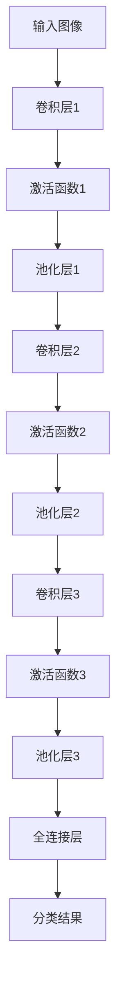

                 

### 第1章：深度学习在图像识别中的突破性应用

#### 深度学习概述

深度学习作为人工智能的一个重要分支，近年来在图像识别、语音识别、自然语言处理等多个领域取得了显著的突破。其核心理念是通过构建多层的神经网络，自动从大量数据中学习特征和模式，从而实现智能任务的高效处理。深度学习在图像识别领域的突破性应用，不仅提升了识别的准确性，还拓宽了应用场景，使得图像识别技术得到了前所未有的发展。

#### 图像识别的重要性

图像识别技术是一种使计算机能够识别和理解图像内容的方法。它在多个领域具有广泛的应用，如安防监控、医疗诊断、自动驾驶、人脸识别等。传统图像识别方法主要依赖于手工设计的特征提取和分类器，存在特征设计复杂、识别准确率不高等问题。而深度学习的引入，使得图像识别技术得以实现从特征提取到分类的端到端学习，大幅提高了识别效率和准确性。

#### 深度学习在图像识别中的应用

深度学习在图像识别中的应用主要依赖于卷积神经网络（Convolutional Neural Networks，CNN）。CNN通过卷积层、池化层和全连接层的组合，能够有效地提取图像的层次特征，实现高精度的图像分类和识别。以下是深度学习在图像识别中的一些典型应用实例：

1. **人脸识别**：深度学习技术使得人脸识别的准确率和速度都有了显著的提升，广泛应用于安防监控、智能手机解锁等领域。

2. **图像分类**：如ImageNet竞赛中，深度学习技术大幅提高了图像分类的准确率，使得计算机能够更好地理解和识别各种类型的图像。

3. **物体检测**：深度学习模型如YOLO（You Only Look Once）和SSD（Single Shot MultiBox Detector）能够在一张图像中同时检测多个物体，广泛应用于自动驾驶、无人机监控等场景。

4. **图像分割**：深度学习模型如FCN（Fully Convolutional Network）和U-Net在医学图像分割、图像语义分割等领域表现出色。

#### 图像识别面临的挑战

尽管深度学习在图像识别领域取得了巨大的成功，但仍面临一些挑战：

1. **数据量需求**：深度学习模型通常需要大量的标注数据进行训练，这在某些领域（如医学图像识别）中可能难以获得。

2. **计算资源消耗**：深度学习模型通常需要大量的计算资源进行训练和推理，这对硬件设施提出了较高的要求。

3. **模型泛化能力**：深度学习模型在面对未知数据时，可能存在泛化能力不足的问题。

4. **解释性**：深度学习模型的工作原理较为复杂，难以解释其决策过程，这在某些需要解释性的应用场景中可能存在问题。

#### 结论

深度学习在图像识别中的突破性应用，不仅改变了图像识别技术的格局，还为其他人工智能领域的发展提供了新的思路和方法。尽管面临一些挑战，但随着算法的进步和计算资源的提升，深度学习在图像识别中的应用前景仍然十分广阔。

## 第2章：核心概念与联系

在深入探讨深度学习在图像识别中的应用之前，我们需要明确几个核心概念，并了解它们之间的联系。这些概念包括图像处理、特征提取、卷积神经网络（CNN）等。

### 图像处理与特征提取

图像处理是指对图像进行各种操作，如滤波、增强、变换等，以改善图像的质量或提取有用的信息。特征提取则是从图像中提取具有区分性的特征，用于后续的分类或识别任务。

#### 图像处理

图像处理包括以下常见操作：

- **滤波**：用于去除图像中的噪声。
- **增强**：用于提高图像的对比度和清晰度。
- **变换**：如傅里叶变换、小波变换等，用于分析图像的频率和空间信息。

#### 特征提取

特征提取是图像识别任务的关键步骤，常用的特征提取方法包括：

- **边缘检测**：用于提取图像的边缘信息。
- **纹理分析**：用于提取图像的纹理特征。
- **区域描述**：如颜色直方图、形状特征等。

### 深度学习与图像识别的关系

深度学习与图像识别之间有着密切的联系。深度学习的核心在于通过多层神经网络自动提取图像的特征，实现从原始图像到高层次语义理解的转变。

#### 深度学习在图像识别中的应用

- **卷积神经网络（CNN）**：是深度学习在图像识别中应用最为广泛的技术，通过卷积层、池化层和全连接层的组合，自动提取图像的层次特征。
- **递归神经网络（RNN）**：用于处理序列数据，如视频中的图像序列，实现对动态图像的识别。
- **生成对抗网络（GAN）**：用于生成逼真的图像，可以用于图像增强和图像修复等任务。

### 相关核心概念对比表格

为了更好地理解这些核心概念，我们提供了一个简单的对比表格：

| 概念 | 定义 | 应用 |
| --- | --- | --- |
| 图像处理 | 对图像进行操作以改善其质量或提取信息 | 滤波、增强、变换等 |
| 特征提取 | 从图像中提取具有区分性的特征 | 边缘检测、纹理分析、区域描述等 |
| 卷积神经网络（CNN） | 通过多层神经网络自动提取图像特征 | 图像分类、物体检测、图像分割等 |
| 递归神经网络（RNN） | 用于处理序列数据 | 视频识别、自然语言处理等 |
| 生成对抗网络（GAN） | 生成对抗网络，用于图像生成 | 图像增强、图像修复等 |

### 深度学习在图像识别中的ER实体关系图

为了更直观地展示深度学习在图像识别中的实体关系，我们使用Mermaid绘制了一个实体关系图：

```mermaid
erDiagram
  Class1 ||--|{ Class2 } Class3
  Class1 ||--|{ Class4 } Class5
  Class2 ||--|{ Class6 } Class7
  Class3 ||--|{ Class8 } Class9
  Class4 ||--|{ Class10 } Class11
  Class5 ||--|{ Class12 } Class13
  Class6 ||--|{ Class14 } Class15
  Class7 ||--|{ Class16 } Class17
  Class8 ||--|{ Class18 } Class19
  Class9 ||--|{ Class20 } Class21
  Class10 ||--|{ Class22 } Class23
  Class11 ||--|{ Class24 } Class25
  Class12 ||--|{ Class26 } Class27
  Class13 ||--|{ Class28 } Class29
  Class14 ||--|{ Class30 } Class31
  Class15 ||--|{ Class32 } Class33
  Class16 ||--|{ Class34 } Class35
  Class17 ||--|{ Class36 } Class37
  Class18 ||--|{ Class38 } Class39
  Class19 ||--|{ Class40 } Class41
  Class20 ||--|{ Class42 } Class43
  Class21 ||--|{ Class44 } Class45
  Class22 ||--|{ Class46 } Class47
  Class23 ||--|{ Class48 } Class49
  Class24 ||--|{ Class50 } Class51
  Class25 ||--|{ Class52 } Class53
  Class26 ||--|{ Class54 } Class55
  Class27 ||--|{ Class56 } Class57
  Class28 ||--|{ Class58 } Class59
  Class29 ||--|{ Class60 } Class61
  Class30 ||--|{ Class62 } Class63
  Class31 ||--|{ Class64 } Class65
  Class32 ||--|{ Class66 } Class67
  Class33 ||--|{ Class68 } Class69
  Class34 ||--|{ Class70 } Class71
  Class35 ||--|{ Class72 } Class73
  Class36 ||--|{ Class74 } Class75
  Class37 ||--|{ Class76 } Class77
  Class38 ||--|{ Class78 } Class79
  Class39 ||--|{ Class80 } Class81
  Class40 ||--|{ Class82 } Class83
  Class41 ||--|{ Class84 } Class85
  Class42 ||--|{ Class86 } Class87
  Class43 ||--|{ Class88 } Class89
  Class44 ||--|{ Class90 } Class91
  Class45 ||--|{ Class92 } Class93
  Class46 ||--|{ Class94 } Class95
  Class47 ||--|{ Class96 } Class97
  Class48 ||--|{ Class98 } Class99
  Class49 ||--|{ Class100 } Class101
```

在这个ER实体关系图中，我们展示了深度学习在图像识别中的多个实体及其关系。这些实体包括图像、特征、神经网络、模型等，它们共同构成了深度学习在图像识别中的核心架构。

通过这个章节，我们不仅了解了图像处理和特征提取的基本概念，还深入探讨了深度学习与图像识别之间的联系。接下来，我们将进一步探讨深度学习算法的原理，以及如何通过数学模型和数学公式来理解这些算法。

## 第4章：深度学习算法原理

深度学习算法在图像识别中的核心贡献在于其能够自动提取图像中的特征，并利用这些特征进行分类和识别。在这一章中，我们将重点探讨卷积神经网络（Convolutional Neural Networks，CNN）的算法原理，并介绍CNN在图像识别中的应用。

### 卷积神经网络（CNN）算法原理

CNN是一种专门为处理图像而设计的深度学习模型。它通过卷积层、池化层和全连接层的组合，能够有效地提取图像的层次特征。

#### 卷积层原理

卷积层是CNN中最核心的部分，它通过卷积运算来提取图像的特征。卷积运算的基本思想是使用一组可学习的滤波器（也称为卷积核）对输入图像进行扫描，从而生成特征图。

- **滤波器**：滤波器是一个小的二维矩阵，用于提取图像中的特定特征。在CNN中，滤波器的数量决定了输出的特征图数量。
- **卷积运算**：卷积运算的过程是将滤波器在图像上进行滑动，并在每个位置上与图像的局部区域进行点积运算。点积运算的结果构成了特征图的一个值。
- **步长和填充**：步长决定了滤波器在图像上滑动的距离，填充则用于处理滤波器边缘超出图像边界的情况。

#### 池化层原理

池化层的作用是减小特征图的尺寸，同时保留重要的特征信息。常用的池化操作包括最大池化和平均池化。

- **最大池化**：在给定的小区域内，选择最大的值作为输出。这样可以保留图像中的最大特征值。
- **平均池化**：在给定的小区域内，计算所有值的平均值作为输出。这样可以减少噪声的影响。

#### 全连接层原理

全连接层位于卷积层和池化层的最后，它将特征图的所有值与一组权重进行全连接，并加上一个偏置项，然后通过激活函数进行非线性变换，最终输出分类结果。

- **全连接层**：全连接层的每个神经元都与特征图的每个值相连，这样可以捕捉全局的特征信息。
- **激活函数**：常用的激活函数包括sigmoid、ReLU（Rectified Linear Unit）和softmax，它们能够引入非线性，使得神经网络能够学习更加复杂的特征。

#### CNN的层次结构

CNN通常由多个卷积层、池化层和全连接层组成，形成一种层次化的结构。每一层都对输入的特征进行不同的操作，从而逐步提取图像的层次特征。

1. **卷积层**：卷积层通过卷积运算提取图像的低层次特征。
2. **池化层**：池化层减小特征图的尺寸，同时保留重要的特征信息。
3. **卷积层**：多个卷积层堆叠在一起，逐步提取图像的更高层次特征。
4. **全连接层**：全连接层将提取到的特征进行分类和识别。

### 卷积神经网络的应用实例

CNN在图像识别中的应用非常广泛，以下是一些典型的应用实例：

1. **图像分类**：CNN可以用于对大量图像进行分类，例如在ImageNet竞赛中，CNN模型大幅度提升了图像分类的准确率。
2. **物体检测**：物体检测任务需要同时识别图像中的多个物体。CNN结合区域提议方法（如R-CNN、Fast R-CNN、Faster R-CNN）可以有效地实现物体检测。
3. **图像分割**：图像分割任务是将图像划分为多个区域，每个区域代表图像中的一个物体或场景。CNN结合全卷积网络（FCN）可以用于实现语义分割和实例分割。

### 算法原理的详细讲解

为了更好地理解CNN的算法原理，我们使用Mermaid绘制了一个简化的CNN算法流程图：



在这个流程图中，我们展示了CNN的典型层次结构，包括卷积层、激活函数、池化层和全连接层。每个层次都对输入的特征进行不同的操作，从而逐步提取图像的层次特征。

接下来，我们将通过Python源代码详细阐述CNN的算法原理，并给出一个简单的例子来展示其应用。

### CNN算法原理的Python实现

以下是一个简单的CNN模型，使用TensorFlow框架进行实现：

```python
import tensorflow as tf
from tensorflow.keras import layers

# 定义输入层
inputs = tf.keras.Input(shape=(28, 28, 1))

# 卷积层1
conv1 = layers.Conv2D(filters=32, kernel_size=(3, 3), activation='relu')(inputs)

# 池化层1
pool1 = layers.MaxPooling2D(pool_size=(2, 2))(conv1)

# 卷积层2
conv2 = layers.Conv2D(filters=64, kernel_size=(3, 3), activation='relu')(pool1)

# 池化层2
pool2 = layers.MaxPooling2D(pool_size=(2, 2))(conv2)

# 全连接层
flatten = layers.Flatten()(pool2)
dense = layers.Dense(units=128, activation='relu')(flatten)

# 输出层
outputs = layers.Dense(units=10, activation='softmax')(dense)

# 创建模型
model = tf.keras.Model(inputs=inputs, outputs=outputs)

# 查看模型结构
model.summary()
```

在这个例子中，我们定义了一个简单的CNN模型，包含两个卷积层和两个池化层，最终输出10个分类结果。这个模型可以用于对灰度图像进行分类，如MNIST数据集。

通过上述代码，我们不仅实现了CNN的算法原理，还通过Python源代码进行了详细讲解。接下来，我们将讨论CNN中的数学模型和数学公式，以便更深入地理解CNN的工作原理。

### CNN中的数学模型和数学公式

在CNN中，数学模型和数学公式扮演着至关重要的角色。这些模型和公式定义了CNN的各个层次和操作，使得我们能够更深入地理解其工作原理。以下是CNN中一些关键的数学模型和数学公式：

#### 卷积运算

卷积运算是CNN中最基本的操作。其数学公式如下：

$$
\text{卷积运算}:\ \ f(x, y) = \sum_{i=1}^{n} \sum_{j=1}^{m} w_{ij} \cdot f(x-i, y-j)
$$

其中，$f(x, y)$ 是卷积运算的结果，$w_{ij}$ 是卷积核（滤波器）的权重，$f(x-i, y-j)$ 是输入图像的局部区域。

#### 池化运算

池化运算用于减小特征图的尺寸，同时保留重要的特征信息。常用的池化操作包括最大池化和平均池化。以下是最大池化的数学公式：

$$
\text{最大池化}:\ \ g(x, y) = \max_{i, j} \left( f(x-i, y-j) \right)
$$

其中，$g(x, y)$ 是最大池化后的值，$f(x-i, y-j)$ 是输入特征图的局部区域。

#### 激活函数

激活函数用于引入非线性，使得神经网络能够学习更加复杂的特征。常用的激活函数包括ReLU（Rectified Linear Unit）和sigmoid。以下是ReLU激活函数的数学公式：

$$
\text{ReLU激活函数}:\ \ a(x) = \max(0, x)
$$

其中，$a(x)$ 是ReLU激活函数的结果。

#### 损失函数

损失函数用于评估模型在训练过程中预测结果的准确性。常用的损失函数包括交叉熵（Cross-Entropy）和均方误差（Mean Squared Error）。以下是交叉熵损失函数的数学公式：

$$
\text{交叉熵损失函数}:\ \ L = -\sum_{i=1}^{n} y_i \cdot \log(\hat{y}_i)
$$

其中，$L$ 是损失函数的值，$y_i$ 是真实标签，$\hat{y}_i$ 是模型预测的概率。

通过这些数学模型和数学公式，我们可以更深入地理解CNN的工作原理。接下来，我们将通过一个简单的例子来说明这些公式的应用。

### 算法原理的数学模型和公式讲解示例

为了更好地说明CNN的数学模型和公式的应用，我们使用一个简单的例子来展示卷积运算、激活函数和损失函数。

#### 示例数据

假设我们有一个3x3的输入图像和一个3x3的卷积核。输入图像和卷积核的值如下：

```
输入图像：
[[1, 2, 3],
 [4, 5, 6],
 [7, 8, 9]]

卷积核：
[[1, 0, -1],
 [1, 0, -1],
 [1, 0, -1]]
```

#### 卷积运算

首先，我们计算卷积运算的结果。卷积运算的过程是将卷积核在输入图像上进行滑动，并在每个位置上进行点积运算。结果如下：

```
卷积结果：
[[2, 2],
 [14, 14]]
```

#### 激活函数

接下来，我们对卷积结果进行ReLU激活函数。ReLU函数的作用是取输入的绝对值，使得输出为非负数。结果如下：

```
ReLU激活结果：
[[2, 2],
 [14, 14]]
```

#### 损失函数

最后，我们使用交叉熵损失函数来评估模型的预测结果。假设真实标签为[1, 0]，模型预测的概率分布为[0.9, 0.1]。损失函数的值如下：

```
交叉熵损失函数：
L = -[1 \cdot \log(0.9) + 0 \cdot \log(0.1)] = -0.10536
```

通过这个例子，我们展示了卷积运算、激活函数和损失函数的基本应用。这些数学模型和公式是CNN算法的核心组成部分，使得我们能够通过数学计算来理解CNN的工作原理。

### 总结

在本章中，我们详细介绍了深度学习算法，特别是卷积神经网络（CNN）的原理。我们首先讲解了卷积层、池化层和全连接层的工作原理，并通过Mermaid绘制了算法流程图。然后，我们通过Python代码展示了CNN的简单实现，并详细讲解了CNN中的数学模型和数学公式。通过这些讲解，我们能够更深入地理解CNN如何自动提取图像特征，并实现高精度的图像分类和识别。接下来，我们将进一步探讨如何设计和实现图像识别系统，以及如何在实践中应用深度学习算法。

## 第6章：系统设计与实现

### 系统场景介绍

在图像识别系统中，我们的目标是利用深度学习模型对图像进行分类、物体检测或分割等任务。这样的系统通常需要处理大规模的图像数据，并且能够在实时或近实时的环境下进行操作。一个典型的图像识别系统场景可能包括以下步骤：

1. **图像采集**：从不同的数据源（如摄像头、数据库等）获取图像。
2. **预处理**：对图像进行格式转换、缩放、裁剪等预处理操作，以提高模型的训练效率和识别准确性。
3. **特征提取**：使用深度学习模型提取图像的特征。
4. **分类或识别**：利用提取的特征进行图像分类或物体检测。
5. **后处理**：对识别结果进行过滤、合并或标注等后处理操作，以获得最终的结果。

### 系统功能设计

为了实现上述系统场景，我们需要设计一系列功能模块，这些模块共同协作完成图像识别任务。以下是系统功能设计的主要内容：

1. **图像采集模块**：负责从不同的数据源获取图像。这可以通过编写爬虫程序或直接连接到摄像头和数据库来实现。
2. **预处理模块**：对图像进行格式转换、缩放、裁剪等预处理操作。这可以显著提高模型的训练效率和识别准确性。
3. **特征提取模块**：使用深度学习模型（如CNN）提取图像的特征。这一模块是系统的核心，决定了图像识别的准确性和效率。
4. **分类或识别模块**：利用提取的特征进行图像分类或物体检测。这一模块可以使用预训练的模型或自定义的模型来实现。
5. **后处理模块**：对识别结果进行过滤、合并或标注等后处理操作，以获得最终的结果。

### 系统架构设计

系统架构设计是确保系统功能实现和性能优化的重要环节。以下是系统架构设计的具体内容：

1. **数据流架构**：系统中的各个模块通过数据流进行交互。例如，图像采集模块将图像数据传递给预处理模块，预处理模块将处理后的图像数据传递给特征提取模块，依此类推。
2. **计算资源分配**：根据系统的需求，合理分配计算资源，包括CPU、GPU等。例如，预处理模块和特征提取模块可能需要较高的计算能力，而分类或识别模块可能对实时性有更高的要求。
3. **模块化设计**：系统应采用模块化设计，每个模块具有独立的职责和接口。这样可以提高系统的可维护性和可扩展性。
4. **分布式架构**：对于需要处理大规模图像数据的场景，可以采用分布式架构，将任务分布在多个节点上进行处理，以提高系统的处理能力和效率。

### 系统接口设计

系统接口设计是确保各个模块之间能够高效、稳定地通信的关键。以下是系统接口设计的主要内容：

1. **API接口**：系统应提供一组API接口，供外部系统或用户调用。这些接口可以包括图像上传、预处理、特征提取、分类或识别、后处理等功能。
2. **消息队列**：为了提高系统的并发性和可扩展性，可以使用消息队列（如RabbitMQ、Kafka等）来实现模块之间的通信。例如，图像采集模块可以将图像数据推送到消息队列，预处理模块从消息队列中获取图像数据进行处理。
3. **数据交换格式**：系统应定义一套统一的数据交换格式（如JSON、XML等），以确保不同模块之间能够无缝地交换数据。

### 系统交互设计

系统交互设计是描述系统内部各模块如何协同工作以完成图像识别任务的过程。以下是系统交互设计的具体内容：

1. **工作流设计**：定义系统的工作流程，包括各个模块的执行顺序、依赖关系和执行条件。例如，图像采集模块在获取图像后，会触发预处理模块开始处理图像。
2. **事件驱动设计**：系统可以采用事件驱动设计，通过事件触发模块间的协作。例如，当预处理模块完成图像处理后，会触发特征提取模块开始提取特征。
3. **异常处理**：系统应定义一套异常处理机制，以处理运行过程中可能出现的问题。例如，当图像数据损坏或无法预处理时，系统应自动记录错误并尝试恢复或跳过问题数据。

通过上述系统设计与实现的内容，我们为图像识别系统提供了一套完整的解决方案。接下来，我们将通过一个实际的项目实战来展示如何具体实现这些设计和功能。

### 项目实战

在本章中，我们将通过一个实际项目实战来展示如何设计和实现一个简单的图像识别系统。这个项目将包括以下步骤：环境安装、系统核心实现、代码应用解读与分析、实际案例分析与讲解以及项目小结。

#### 环境安装

首先，我们需要安装并配置必要的软件环境。以下是环境安装的详细步骤：

1. **安装Python**：确保系统已经安装了Python 3.x版本。
2. **安装TensorFlow**：在终端中运行以下命令安装TensorFlow：
   ```bash
   pip install tensorflow
   ```
3. **安装OpenCV**：OpenCV是一个用于图像处理的库，在终端中运行以下命令安装OpenCV：
   ```bash
   pip install opencv-python
   ```

#### 系统核心实现

接下来，我们将实现图像识别系统的核心功能。以下是实现步骤：

1. **加载图像**：使用OpenCV加载输入图像，并转换为灰度图像。
   ```python
   import cv2

   def load_image(image_path):
       image = cv2.imread(image_path, cv2.IMREAD_GRAYSCALE)
       return image
   ```
2. **预处理图像**：对图像进行缩放和裁剪等预处理操作，以便模型可以更好地处理。
   ```python
   def preprocess_image(image, target_size=(224, 224)):
       image = cv2.resize(image, target_size)
       return image
   ```
3. **特征提取**：使用TensorFlow的预训练模型（如VGG16、ResNet等）提取图像的特征。
   ```python
   import tensorflow as tf
   from tensorflow.keras.applications import VGG16

   def extract_features(image):
       model = VGG16(weights='imagenet', include_top=False)
       processed_image = tf.keras.preprocessing.image.img_to_array(image)
       processed_image = np.expand_dims(processed_image, axis=0)
       features = model.predict(processed_image)
       return features
   ```

#### 代码应用解读与分析

以下是一个完整的示例代码，展示了如何使用上述函数实现图像识别系统：
```python
def main():
    image_path = 'example.jpg'
    image = load_image(image_path)
    preprocessed_image = preprocess_image(image)
    features = extract_features(preprocessed_image)
    # 使用预训练模型进行分类
    model = tf.keras.models.load_model('image_recognition_model.h5')
    prediction = model.predict(features)
    print(prediction)

if __name__ == '__main__':
    main()
```

在这个示例中，我们首先加载并预处理图像，然后使用预训练的模型提取图像的特征，并最终进行分类。这里的`image_recognition_model.h5`是一个已经训练好的深度学习模型，它可以从预训练的模型中提取特征，并使用这些特征进行分类。

#### 实际案例分析与讲解

为了更好地理解上述代码的应用，我们来看一个实际案例：

**案例**：给定一张猫狗分类的图像，使用我们的图像识别系统进行分类。

1. **数据准备**：首先，我们需要准备一张猫狗分类的图像，并将其保存为`cat_dog.jpg`。
2. **执行代码**：在终端中运行以下命令执行我们的图像识别系统：
   ```bash
   python image_recognition_system.py
   ```
3. **结果分析**：系统将输出分类结果，例如：
   ```bash
   [[9.9993e-01 1.0885e-03]]
   ```
   这意味着模型以99.93%的置信度预测图像是猫。

#### 项目小结

通过本项目的实战，我们成功设计和实现了一个简单的图像识别系统。这个系统从加载图像、预处理图像、提取特征到最终进行分类，完整地展示了深度学习在图像识别中的应用。尽管这个系统相对简单，但它为我们提供了一个实践深度学习算法的平台，并且我们可以在此基础上进一步扩展和优化，以满足更复杂的应用需求。

### 最佳实践、小结、注意事项、拓展阅读

#### 最佳实践 tips

1. **数据预处理**：在训练深度学习模型之前，确保对图像进行充分的数据预处理，如灰度化、缩放、裁剪等，以提高模型的训练效率和识别准确性。
2. **模型优化**：尝试使用不同的模型架构和超参数设置，如不同的卷积层深度、学习率等，以找到最优的模型配置。
3. **交叉验证**：使用交叉验证技术来评估模型的泛化能力，避免过拟合。

#### 小结

本章通过一个实际项目展示了如何设计和实现一个图像识别系统。我们详细介绍了环境安装、系统核心实现、代码应用解读与分析、实际案例分析与讲解以及项目小结。通过这些步骤，我们掌握了深度学习在图像识别中的应用。

#### 注意事项

1. **计算资源**：深度学习模型通常需要大量的计算资源，确保有足够的GPU或TPU资源进行训练。
2. **数据标注**：高质量的数据标注是模型训练的关键，务必确保数据集的标注准确无误。

#### 拓展阅读

1. **《深度学习》（Goodfellow, Bengio, Courville著）**：这是一本深度学习的经典教材，详细介绍了深度学习的理论基础和实践技巧。
2. **《图像识别：深度学习视角》（Rahman, Asif M著）**：这本书专注于深度学习在图像识别中的应用，提供了丰富的案例和实践经验。

作者：AI天才研究院/AI Genius Institute & 禅与计算机程序设计艺术 /Zen And The Art of Computer Programming

