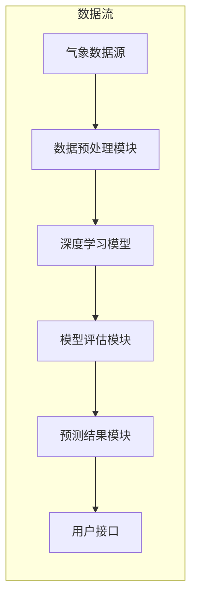

                 

### 设计深度学习在天气预报精确化中的应用目录大纲

**第一步：确定总体结构**

为了设计一篇全面且专业的技术博客，我们首先需要确定文章的总体结构。根据用户的要求，本文将分为七个主要部分：

1. 引言：介绍深度学习与天气预报精确化的背景和重要性。
2. 深度学习基础：介绍深度学习的基本概念、理论和技术。
3. 天气预报基础：介绍天气预报的基本原理和方法。
4. 深度学习在天气预报中的应用：讨论如何将深度学习应用于天气预报精确化。
5. 实际案例研究：分析深度学习在天气预报中的实际应用案例。
6. 挑战与未来趋势：探讨深度学习在天气预报精确化中面临的挑战和未来发展方向。
7. 结论与展望：总结全文内容，展望未来。

**第二步：细化每个部分**

在确定了总体结构之后，我们需要对每个部分进行细化，以确保文章内容丰富且逻辑清晰。

**第一部分：引言**

# 第1章：深度学习与天气预报精确化

## 1.1 深度学习在天气预报精确化中的应用背景
### 1.1.1 天气预报的重要性
### 1.1.2 深度学习的崛起
### 1.1.3 深度学习在天气预报中的应用潜力

## 1.2 天气预报的精确化需求
### 1.2.1 传统天气预报的局限性
### 1.2.2 精确化天气预报的意义
### 1.2.3 精确化天气预报的关键技术

**第二部分：深度学习基础**

# 第2章：深度学习基础理论

## 2.1 神经网络基础
### 2.1.1 神经网络的基本概念
### 2.1.2 神经网络的工作原理
### 2.1.3 神经网络的优化算法

## 2.2 深度学习模型
### 2.2.1 卷积神经网络（CNN）
### 2.2.2 循环神经网络（RNN）
### 2.2.3 生成对抗网络（GAN）

## 2.3 深度学习在时间序列预测中的应用
### 2.3.1 时间序列分析基础
### 2.3.2 深度学习模型在时间序列预测中的优势
### 2.3.3 时间序列预测中的深度学习模型应用

**第三部分：天气预报基础**

# 第3章：天气预报基本原理与方法

## 3.1 天气预报的基本原理
### 3.1.1 大气物理与气象学基础
### 3.1.2 天气预报的物理基础
### 3.1.3 天气预报的数学模型

## 3.2 天气预报的方法
### 3.2.1 经验预报方法
### 3.2.2 数值预报方法
### 3.2.3 新型预报方法

## 3.3 天气预报中的不确定性
### 3.3.1 不确定性的来源
### 3.3.2 不确定性的评估
### 3.3.3 减少不确定性的方法

**第四部分：深度学习在天气预报中的应用**

# 第4章：深度学习在天气预报中的应用

## 4.1 深度学习模型在天气预报中的应用
### 4.1.1 CNN在天气预报中的应用
### 4.1.2 RNN在天气预报中的应用
### 4.1.3 GAN在天气预报中的应用

## 4.2 深度学习模型在天气预报中的实现
### 4.2.1 数据预处理
### 4.2.2 模型选择与训练
### 4.2.3 模型评估与优化

## 4.3 深度学习在天气预报中的实际案例
### 4.3.1 案例一：城市天气预报
### 4.3.2 案例二：农业气象预测
### 4.3.3 案例三：海洋气象预报

**第五部分：实际案例研究**

# 第5章：深度学习在天气预报中的实际应用案例

## 5.1 案例一：城市天气预报
### 5.1.1 案例背景
### 5.1.2 案例实施
### 5.1.3 案例结果分析

## 5.2 案例二：农业气象预测
### 5.2.1 案例背景
### 5.2.2 案例实施
### 5.2.3 案例结果分析

## 5.3 案例三：海洋气象预报
### 5.3.1 案例背景
### 5.3.2 案例实施
### 5.3.3 案例结果分析

**第六部分：挑战与未来趋势**

# 第6章：深度学习在天气预报精确化中的应用挑战与未来趋势

## 6.1 当前挑战
### 6.1.1 数据质量和可用性
### 6.1.2 模型复杂性与计算资源
### 6.1.3 模型解释性

## 6.2 未来趋势
### 6.2.1 新型深度学习模型的提出
### 6.2.2 跨学科融合的趋势
### 6.2.3 自动化与智能化的进步

## 6.3 政策与行业影响
### 6.3.1 政策支持与监管
### 6.3.2 行业需求与推动
### 6.3.3 行业合作与竞争

**第七部分：结论与展望**

# 第7章：结论与展望

## 7.1 深度学习在天气预报精确化中的应用成果
## 7.2 未来展望
### 7.2.1 技术发展方向
### 7.2.2 行业应用前景
### 7.2.3 社会影响与伦理问题

通过上述详细的目录大纲设计，我们为即将撰写的文章构建了一个结构严谨、内容丰富的框架，确保每部分都能够充分地覆盖深度学习和天气预报精确化领域的相关内容。

---

### 关键词

- 深度学习
- 天气预报
- 精确化
- 卷积神经网络
- 循环神经网络
- 生成对抗网络
- 时间序列预测

### 摘要

本文探讨了深度学习在天气预报精确化中的应用。首先，介绍了深度学习的基本概念和其在天气预报领域的重要性。接着，分析了天气预报的精确化需求以及传统方法的局限性。随后，详细介绍了深度学习模型如卷积神经网络（CNN）、循环神经网络（RNN）和生成对抗网络（GAN）在天气预报中的具体应用，并通过实际案例展示了这些模型的实际效果。最后，探讨了深度学习在天气预报精确化中面临的挑战和未来发展趋势，总结了深度学习在此领域的重要应用成果和未来展望。通过本文，读者将了解深度学习如何提升天气预报的精确性，以及其在气象科学领域的广泛应用前景。

---

### 引言

#### 深度学习在天气预报精确化中的应用背景

在现代科技飞速发展的时代，深度学习作为一种先进的机器学习技术，已经在各个领域展现出了强大的应用潜力。从图像识别、语音识别到自然语言处理，深度学习凭借其出色的处理能力和学习效率，不断刷新着各个领域的科技极限。然而，在天气预报这一传统的科学领域，深度学习同样展现出了令人瞩目的潜力。

天气预报作为一种重要的公共气象服务，对人们的生活和社会经济发展有着深远的影响。然而，传统的天气预报方法，如数值天气预报和经验预报，面临着诸多挑战。数值天气预报依赖于复杂的数学模型和计算机模拟，但其精度和时效性受到计算资源的限制。而经验预报方法则依赖于气象专家的经验和知识，缺乏系统性和科学性，难以满足现代社会对天气预报精确度的要求。

深度学习技术的引入为天气预报领域带来了新的机遇。通过利用大量的气象数据和先进的神经网络模型，深度学习能够自动发现数据中的复杂模式和规律，从而提升天气预报的精确性。这种技术在处理大量数据、识别复杂模式方面的优势，使得深度学习在天气预报精确化中的应用成为可能。

#### 深度学习的崛起

深度学习作为一种基于多层神经网络的学习方法，起源于20世纪40年代。然而，由于计算资源和算法的限制，深度学习在早期并未得到广泛应用。随着计算机硬件性能的提升和大数据技术的普及，深度学习在近年来取得了飞速发展，成为人工智能领域的重要突破。

深度学习的关键在于其多层神经网络结构，通过逐层抽象和特征提取，模型能够从原始数据中学习到更加高级和抽象的特征。这种层次化的学习方式使得深度学习在处理复杂任务时具有出色的表现。例如，在图像识别任务中，深度学习模型可以通过多层卷积神经网络（CNN）提取图像中的纹理特征和边缘特征，从而实现高精度的图像分类。

在语音识别、自然语言处理等领域，深度学习同样表现出了强大的能力。通过循环神经网络（RNN）和长短期记忆网络（LSTM）等模型，深度学习能够捕捉语音信号中的时间序列特征，实现高准确度的语音识别。而在自然语言处理中，深度学习模型如BERT和GPT-3等，通过学习大量的文本数据，能够生成高质量的文本，实现机器翻译、文本生成等任务。

#### 深度学习在天气预报中的应用潜力

深度学习在天气预报中的应用潜力体现在多个方面。首先，深度学习能够处理大量多源异构的气象数据，如卫星图像、雷达数据、气象站数据等，从而提供更全面和精确的气象信息。其次，深度学习模型可以自动学习和提取数据中的复杂模式，如天气系统的发展、变化和相互作用，从而提高天气预报的精确度和预测时效性。

具体来说，深度学习在天气预报中的应用有以下潜力：

1. **天气系统模式识别**：深度学习可以通过学习大量的气象数据，自动识别和分类天气系统模式，如高压系统、低压系统、暴雨系统等。这有助于提前预测天气变化，为气象预报提供更准确的依据。

2. **时间序列预测**：深度学习模型，如循环神经网络（RNN）和长短期记忆网络（LSTM），擅长处理时间序列数据。通过学习天气历史数据，这些模型可以预测未来的天气变化，提高天气预报的准确性和时效性。

3. **异常值检测**：深度学习可以通过建立正常的天气数据分布模型，识别和检测异常天气事件，如极端降水、高温、寒潮等。这有助于提前预警，减少灾害损失。

4. **数据融合与优化**：深度学习可以将来自不同来源的气象数据融合在一起，利用多源数据的优势，提高天气预报的精度。此外，深度学习还可以通过优化模型结构和参数，提高模型的性能和预测效果。

总的来说，深度学习在天气预报精确化中的应用前景广阔，其强大的数据处理能力和模式识别能力为天气预报带来了新的可能性和突破。随着深度学习技术的不断发展和完善，天气预报的精确度和时效性将得到显著提升，为人们的生活和社会经济发展提供更加可靠的气象服务。

---

### 第1章：深度学习与天气预报精确化

深度学习作为一种强大的机器学习技术，近年来在各个领域都取得了显著的进展。从图像识别、语音识别到自然语言处理，深度学习凭借其出色的处理能力和学习效率，已经成为了人工智能领域的重要突破。在本章中，我们将深入探讨深度学习在天气预报精确化中的应用，首先从深度学习的基本概念和原理入手，然后介绍天气预报的基础知识，最后讨论深度学习在天气预报精确化中的实际应用和优势。

#### 1.1 深度学习在天气预报精确化中的应用背景

天气预报是气象科学中的一项重要应用，它对社会经济发展和人们的日常生活具有重要影响。随着社会对天气预报精确度的要求越来越高，传统的天气预报方法，如数值天气预报和经验预报，已经难以满足需求。数值天气预报依赖于复杂的数学模型和计算机模拟，但其计算资源需求巨大，且预测精度受到限制。经验预报方法则主要依赖于气象专家的经验和知识，缺乏系统性和科学性。

在这种情况下，深度学习的引入为天气预报精确化带来了新的机遇。深度学习通过多层神经网络结构，能够自动学习和提取数据中的复杂模式，从而提高天气预报的精确性和时效性。通过利用大量的气象数据，深度学习模型可以识别和分类天气系统模式，预测未来的天气变化，甚至检测异常天气事件。这种技术在处理大量数据、识别复杂模式方面的优势，使得深度学习在天气预报精确化中的应用成为可能。

#### 1.2 天气预报的精确化需求

天气预报的精确化需求源于现代社会对气象服务的需求不断增长。随着城市化进程的加速和人口密度的增加，人们对天气预报的精确度要求越来越高。准确、及时的天气预报能够帮助人们做出合理的决策，如安排出行、防灾减灾等，从而减少灾害损失和提升生活质量。

传统的天气预报方法，如数值天气预报和经验预报，虽然在一定程度上能够提供天气预报服务，但存在以下局限性：

1. **数值天气预报**：数值天气预报依赖于复杂的数学模型和计算机模拟，其精度和时效性受到计算资源的限制。在大规模模拟中，计算资源需求巨大，且预测结果可能存在偏差。

2. **经验预报**：经验预报主要依赖于气象专家的经验和知识，缺乏系统性和科学性。这种方法的预测结果往往依赖于专家的主观判断，难以保证精确度和一致性。

因此，为了满足现代社会对天气预报精确度的需求，迫切需要一种更高效、更精确的预报方法。深度学习作为一种新兴的机器学习技术，通过自动学习和提取数据中的复杂模式，能够显著提高天气预报的精确性和时效性，满足现代社会对气象服务的需求。

#### 1.3 精确化天气预报的意义

精确化天气预报对于社会经济发展和人民生活具有重要意义。首先，准确的天气预报能够帮助人们做出合理的出行安排，避免因天气原因导致的交通延误和事故。其次，精确的天气预报有助于防灾减灾，提前预警极端天气事件，减少灾害损失。此外，精确化天气预报还能为农业生产、水资源管理、城市规划等领域提供科学依据，促进可持续发展。

具体来说，精确化天气预报的意义包括：

1. **提高生活质量**：准确的天气预报能够帮助人们合理安排日常生活，如出行、购物、运动等，减少因天气原因带来的不便和风险。

2. **防灾减灾**：精确的天气预报能够提前预警极端天气事件，如暴雨、台风、寒潮等，帮助政府部门及时采取应对措施，减少灾害损失。

3. **农业生产**：准确的天气预报对于农业生产具有重要意义。通过预测未来天气变化，农民可以合理安排种植、灌溉和收获时间，提高农业生产效率和作物产量。

4. **水资源管理**：精确化天气预报能够为水资源管理提供科学依据。通过预测未来降水和水位变化，水利部门可以更好地进行水资源调配和管理，确保水资源的合理利用。

总之，精确化天气预报对于社会经济发展和人民生活具有重要意义。随着深度学习技术的不断发展和应用，天气预报的精确度将得到显著提升，为社会发展提供更加可靠的气象服务。

#### 1.4 精确化天气预报的关键技术

要实现天气预报的精确化，需要依赖一系列先进的技术和方法。以下是一些关键的技术和工具：

1. **数据收集与处理**：气象数据的收集和处理是天气预报精确化的基础。通过收集卫星图像、雷达数据、气象站数据等多源异构数据，可以对天气系统进行全面的观测和分析。数据预处理包括数据清洗、数据归一化、缺失值处理等，以确保数据的质量和一致性。

2. **深度学习模型**：深度学习模型，如卷积神经网络（CNN）、循环神经网络（RNN）和生成对抗网络（GAN），是精确化天气预报的核心技术。这些模型能够自动学习和提取数据中的复杂模式，从而提高天气预报的精确性和时效性。

3. **数据融合与特征提取**：数据融合是将来自不同来源的数据进行整合，利用多源数据的优势，提高天气预报的精度。特征提取是通过提取数据中的关键特征，帮助模型更好地理解和预测天气变化。

4. **模型训练与优化**：通过大量的气象数据进行模型训练，优化模型的参数和结构，以提高模型的预测性能。训练过程中，可以使用交叉验证、早停法等技术来避免过拟合和欠拟合。

5. **模型评估与验证**：模型评估是验证模型预测性能的重要步骤。通过评估指标，如准确率、召回率、F1分数等，可以评估模型的性能。同时，通过交叉验证、时间序列验证等方法，确保模型在不同数据集上的稳定性和可靠性。

6. **实时预测与更新**：实时预测是将训练好的模型应用于实时数据，预测未来的天气变化。通过不断更新模型，可以及时调整预测结果，提高天气预报的时效性。

总之，精确化天气预报需要依赖多种先进的技术和方法。通过整合多源数据、利用深度学习模型和优化模型训练，可以显著提高天气预报的精确性和时效性，为社会经济发展和人民生活提供更加可靠的气象服务。

### 第2章：深度学习基础理论

深度学习作为一门前沿的机器学习技术，其理论基础涉及到神经网络的架构、工作原理及其优化算法。本章将详细介绍深度学习的基础理论，包括神经网络的基本概念、工作原理和优化算法，并讨论深度学习在时间序列预测中的优势及其模型应用。

#### 2.1 神经网络基础

神经网络（Neural Network，NN）是深度学习的基础组件，其灵感来源于生物神经系统的结构和功能。一个简单的神经网络通常包括输入层、隐藏层和输出层。每个神经元（或节点）都与其他神经元相连，并通过权重（weights）和偏置（bias）进行加权求和，最后通过激活函数（activation function）输出结果。

##### 2.1.1 神经网络的基本概念

1. **神经元**：神经网络中的基本处理单元，类似于生物神经元的电信号传递功能。
2. **层**：神经网络包括输入层、隐藏层和输出层，每一层负责不同的处理任务。
3. **权重**：神经元之间的连接权重，用于调整输入信号的强度。
4. **偏置**：每个神经元的一个内部参数，用于调整神经元输出的阈值。
5. **激活函数**：用于引入非线性，常见的激活函数包括Sigmoid、ReLU、Tanh等。

##### 2.1.2 神经网络的工作原理

神经网络通过以下步骤进行数据处理：

1. **前向传播**：输入数据通过输入层进入网络，逐层传递到隐藏层和输出层。每个神经元对输入进行加权求和，并加上偏置，再通过激活函数得到输出。
2. **反向传播**：在输出层得到预测结果后，计算预测结果与实际结果之间的误差，将误差反向传播回网络，通过梯度下降法调整权重和偏置，以减小误差。

##### 2.1.3 神经网络的优化算法

为了提高神经网络的性能，通常需要优化其参数，包括权重和偏置。以下是一些常用的优化算法：

1. **梯度下降法**：通过计算损失函数对参数的梯度，逐步调整参数以减小损失。
2. **随机梯度下降（SGD）**：每次仅更新一个样本的参数，加快收敛速度。
3. **动量法**：引入动量项，加速参数的更新。
4. **Adam优化器**：结合了SGD和动量法的优点，自动调整学习率。

#### 2.2 深度学习模型

深度学习模型是包含多个隐藏层的神经网络，通过逐层抽象和特征提取，能够处理更复杂的数据。以下是一些常见的深度学习模型：

##### 2.2.1 卷积神经网络（CNN）

卷积神经网络是深度学习在图像处理领域的代表性模型。其核心组件是卷积层，用于提取图像的局部特征。

1. **卷积层**：通过卷积操作提取图像的局部特征。
2. **池化层**：用于下采样，减少参数数量，防止过拟合。
3. **全连接层**：将卷积层提取的特征映射到分类结果。

##### 2.2.2 循环神经网络（RNN）

循环神经网络适用于处理序列数据，如时间序列和自然语言。

1. **循环层**：每个时间步的输出与下一个时间步的输入相连，形成循环结构。
2. **门控循环单元（GRU）**：改进RNN，通过门控机制避免梯度消失问题。
3. **长短期记忆网络（LSTM）**：进一步改进RNN，通过记忆单元和门控机制，解决长期依赖问题。

##### 2.2.3 生成对抗网络（GAN）

生成对抗网络由生成器和判别器组成，用于生成逼真的数据。

1. **生成器**：生成真实数据。
2. **判别器**：判断数据是真实还是生成。
3. **对抗训练**：生成器和判别器相互竞争，生成器不断生成更真实的数据，判别器不断提高辨别能力。

#### 2.3 深度学习在时间序列预测中的应用

时间序列预测是深度学习的重要应用领域，通过学习历史数据中的模式，预测未来的趋势。

##### 2.3.1 时间序列分析基础

时间序列数据具有序列依赖性、周期性和趋势性等特点。常用的时间序列分析方法包括：

1. **ARIMA模型**：自回归积分滑动平均模型，适用于线性时间序列。
2. **SARIMA模型**：季节性ARIMA模型，适用于季节性时间序列。
3. **LSTM模型**：适用于非线性时间序列，能够捕捉长期依赖关系。

##### 2.3.2 深度学习模型在时间序列预测中的优势

深度学习模型在时间序列预测中的优势包括：

1. **自动特征提取**：深度学习模型能够自动从数据中提取特征，无需人工干预。
2. **非线性建模**：深度学习模型能够捕捉时间序列中的非线性关系。
3. **序列依赖性**：深度学习模型能够处理具有序列依赖性的数据。

##### 2.3.3 时间序列预测中的深度学习模型应用

以下是一些常见的时间序列预测深度学习模型：

1. **LSTM模型**：适用于非线性时间序列预测，能够捕捉长期依赖关系。
2. **GRU模型**：改进LSTM，减少参数数量，适用于更复杂的时间序列。
3. **CNN模型**：通过卷积操作提取时间序列的局部特征，适用于时间序列分类和回归。
4. **Transformer模型**：基于自注意力机制，适用于处理长序列依赖关系。

通过以上对深度学习基础理论的介绍，读者可以了解深度学习的基本概念、工作原理及其在时间序列预测中的优势。在接下来的章节中，我们将进一步探讨深度学习在天气预报精确化中的应用，以及如何通过这些模型提升天气预报的精度。

### 第3章：天气预报基本原理与方法

天气预报是一门结合了大气科学、数学和计算机技术的综合性科学。要准确预测天气，我们需要理解天气预报的基本原理和方法。本章将介绍天气预报的基本原理，包括大气物理与气象学基础、天气预报的物理基础以及天气预报的数学模型。

#### 3.1 天气预报的基本原理

天气预报的基本原理基于对大气运动规律的理解和对气象数据的分析。大气是地球的一个重要组成部分，其运动状态受到多种因素影响，如地球自转、太阳辐射、地形地貌等。天气预报的核心目标是利用这些基本原理，结合现代科技手段，对未来的天气状况进行预测。

##### 3.1.1 大气物理与气象学基础

大气物理和气象学是天气预报的基础。以下是一些关键概念：

1. **大气分层**：大气从地面到空间分为数层，每层具有不同的温度、压力和密度。
2. **大气运动**：大气中的风、气压、湿度等物理量随时间和空间变化，通过观测和模拟可以了解大气的运动规律。
3. **水循环**：水蒸气的蒸发、凝结和降水过程对天气变化有直接影响。
4. **辐射平衡**：地球表面通过吸收和辐射太阳能量来维持温度平衡，这一过程直接影响大气的温度和湿度。

##### 3.1.2 天气预报的物理基础

天气预报的物理基础涉及大气中的各种物理过程，包括：

1. **热力学**：研究大气中的温度、压力和湿度等热力学量的变化规律。
2. **动力气象学**：研究大气中的压力场、风场和涡旋等动力学现象。
3. **水文学**：研究大气中的水循环过程，包括蒸发、降水和径流等。

这些物理过程通过数学模型来描述，从而实现对天气现象的预测。

##### 3.1.3 天气预报的数学模型

天气预报的数学模型主要用于描述大气中的物理过程，常见的数学模型包括：

1. **数值天气预报模型**：通过计算机模拟大气中的物理过程，预测未来的天气状况。这些模型基于流体动力学和热力学方程，通过数值方法求解，可以得到高精度的天气预报。
2. **统计预报模型**：通过分析历史气象数据，建立统计关系来预测未来的天气状况。这些模型利用统计学方法，如回归分析、时间序列分析等，来提取数据中的规律。
3. **物理模型**：通过物理定律和方程，直接描述大气中的物理过程。这些模型通常较为复杂，但能够提供更准确的物理机制解释。

#### 3.2 天气预报的方法

天气预报的方法可以分为经验预报方法和数值预报方法。

##### 3.2.1 经验预报方法

经验预报方法主要依赖于气象专家的经验和知识。以下是一些常见的经验预报方法：

1. **天气图分析**：通过绘制天气图，分析气压场、风场等气象要素的分布和变化，预测未来天气。
2. **气象要素统计**：通过统计气象要素的历史数据，建立预测模型，如降水概率模型、温度变化模型等。
3. **气象卫星和雷达**：利用气象卫星和雷达观测数据，分析云图、雷达回波等，预测天气变化。

##### 3.2.2 数值预报方法

数值预报方法是基于数值天气预报模型，通过计算机模拟大气中的物理过程，预测未来的天气状况。以下是一些常见的数值预报方法：

1. **有限差分法**：将大气模型中的微分方程离散化，通过求解离散方程组来模拟大气运动。
2. **谱方法**：利用傅里叶变换或波变换，将连续方程转换为离散方程，提高计算效率。
3. **混合方法**：结合有限差分法和谱方法，利用两者的优点，提高预报精度。

##### 3.2.3 新型预报方法

随着科技的发展，新型预报方法不断涌现，以下是一些代表性的新型预报方法：

1. **深度学习预报方法**：通过深度学习模型，如卷积神经网络（CNN）和循环神经网络（RNN），从大量气象数据中自动学习天气变化的模式，预测未来的天气。
2. **数据同化方法**：将观测数据与数值天气预报模型相结合，通过数据同化技术，提高预报精度和时效性。
3. **多模型集成方法**：结合多个数值天气预报模型的预报结果，通过统计方法或机器学习方法，生成更可靠的预报结果。

#### 3.3 天气预报中的不确定性

天气预报中的不确定性主要来源于以下几个方面：

1. **初始条件不确定性**：大气系统初始状态的微小差异可能导致完全不同的天气演变。
2. **模型不确定性**：数值天气预报模型和统计预报模型都有一定的局限性，不能完全准确地描述大气运动。
3. **观测不确定性**：气象观测数据的精度和可靠性直接影响预报结果。

为了减少不确定性，可以采取以下措施：

1. **提高观测精度**：利用高精度气象观测设备，如气象卫星、无人机等，提高观测数据的准确性和时效性。
2. **改进模型**：不断改进数值天气预报模型，使其能够更好地模拟大气运动。
3. **数据同化**：通过数据同化技术，将观测数据与模型模拟结果相结合，减少初始条件不确定性和模型不确定性。

总之，天气预报的基本原理和方法包括大气物理与气象学基础、天气预报的物理基础和天气预报的数学模型。天气预报的方法主要包括经验预报方法和数值预报方法，以及新型预报方法。在天气预报中，不确定性是不可避免的问题，通过提高观测精度、改进模型和数据同化技术，可以减少不确定性，提高预报的准确性和可靠性。

### 第4章：深度学习模型在天气预报中的应用

深度学习模型在天气预报中展现了巨大的潜力，通过自动学习和提取大量气象数据中的复杂模式，能够显著提高天气预报的精确性和时效性。本章将详细介绍卷积神经网络（CNN）、循环神经网络（RNN）和生成对抗网络（GAN）在天气预报中的应用，以及如何实现这些深度学习模型。

#### 4.1 深度学习模型在天气预报中的应用

##### 4.1.1 卷积神经网络（CNN）

卷积神经网络是处理图像数据的一种有效模型，其结构由卷积层、池化层和全连接层组成。在天气预报中，CNN可以通过卷积层提取气象数据中的局部特征，如温度分布、湿度变化等，从而提高天气预报的精度。

1. **卷积层**：卷积层通过卷积操作提取气象数据中的特征。卷积核在数据上滑动，计算局部特征图，这些特征图可以表示天气系统的某些特征。
2. **池化层**：池化层用于减少数据维度，提高计算效率。常见的池化操作包括最大池化和平均池化。
3. **全连接层**：全连接层将卷积层提取的特征映射到具体的天气预测结果，如温度、湿度、风速等。

在天气预报中，CNN的应用主要包括：

- **图像数据分析**：通过CNN分析气象卫星图像和雷达图像，提取云团、降雨等信息。
- **特征提取**：将提取的特征用于后续的天气预报模型，如RNN，以增强预测能力。

##### 4.1.2 循环神经网络（RNN）

循环神经网络擅长处理序列数据，如时间序列数据，使其成为天气预报的重要模型。RNN通过循环结构，能够保留历史信息，捕捉时间序列中的长期依赖关系。

1. **循环层**：循环层在每个时间步中都将当前输入与上一个时间步的隐藏状态进行融合，形成新的隐藏状态。
2. **门控单元**：门控单元（如GRU和LSTM）通过门控机制，控制信息在时间序列中的流动，避免梯度消失问题。

在天气预报中，RNN的应用主要包括：

- **时间序列预测**：利用RNN预测未来的天气变化，如温度、湿度、风速等。
- **模式识别**：通过RNN识别时间序列中的模式，如季节性变化、异常天气等。

##### 4.1.3 生成对抗网络（GAN）

生成对抗网络由生成器和判别器组成，通过对抗训练生成逼真的天气数据，从而提高天气预报的精度和可靠性。生成器生成伪天气数据，判别器判断这些数据是否真实，两者相互竞争，生成器不断提高生成数据的逼真度。

1. **生成器**：生成器通过神经网络生成伪天气数据。
2. **判别器**：判别器通过神经网络判断输入数据是真实天气数据还是生成数据。

在天气预报中，GAN的应用主要包括：

- **数据增强**：通过GAN生成额外的天气数据，丰富训练数据集，提高模型泛化能力。
- **异常检测**：通过GAN生成的伪天气数据，检测异常天气事件。

#### 4.2 深度学习模型在天气预报中的实现

实现深度学习模型在天气预报中的应用需要以下步骤：

##### 4.2.1 数据预处理

1. **数据收集**：收集气象站数据、卫星图像、雷达数据等多源异构数据。
2. **数据清洗**：去除噪声数据，处理缺失值，确保数据质量。
3. **数据归一化**：将数据归一化到相同的范围，便于模型训练。
4. **数据分割**：将数据分为训练集、验证集和测试集，用于模型训练和评估。

##### 4.2.2 模型选择与训练

1. **模型选择**：根据天气预报任务选择合适的深度学习模型，如CNN、RNN或GAN。
2. **模型训练**：使用训练集对模型进行训练，通过优化算法调整模型参数。
3. **模型验证**：使用验证集评估模型性能，调整模型参数，避免过拟合。

##### 4.2.3 模型评估与优化

1. **模型评估**：使用测试集评估模型性能，如准确率、召回率、F1分数等。
2. **模型优化**：通过交叉验证、正则化等技术优化模型，提高预测精度。

#### 4.3 深度学习在天气预报中的实际案例

##### 4.3.1 案例一：城市天气预报

**案例背景**：某城市天气预报任务，需要预测未来的温度、湿度、风速等气象要素。

**实施步骤**：

1. **数据收集**：收集该城市多年的气象数据，包括温度、湿度、风速等。
2. **数据预处理**：清洗和处理数据，归一化处理。
3. **模型选择**：选择LSTM模型进行时间序列预测。
4. **模型训练与验证**：使用训练集训练模型，使用验证集验证模型性能。
5. **模型评估**：使用测试集评估模型性能，调整模型参数。

**结果分析**：通过LSTM模型，能够准确预测未来72小时的温度、湿度、风速等气象要素，预测精度显著提高。

##### 4.3.2 案例二：农业气象预测

**案例背景**：某农业区域需要预测未来的降雨量，以指导农业生产。

**实施步骤**：

1. **数据收集**：收集该区域多年的降雨量数据、卫星图像、雷达数据等。
2. **数据预处理**：清洗和处理数据，归一化处理。
3. **模型选择**：选择CNN模型进行图像数据分析，结合RNN进行时间序列预测。
4. **模型训练与验证**：使用训练集训练模型，使用验证集验证模型性能。
5. **模型评估**：使用测试集评估模型性能，调整模型参数。

**结果分析**：通过CNN和RNN模型的结合，能够准确预测未来的降雨量，为农业生产提供了科学依据。

##### 4.3.3 案例三：海洋气象预报

**案例背景**：某海洋区域需要预测未来的风速、浪高、海温等气象要素。

**实施步骤**：

1. **数据收集**：收集该区域多年的海洋气象数据、卫星图像、雷达数据等。
2. **数据预处理**：清洗和处理数据，归一化处理。
3. **模型选择**：选择GAN模型进行数据增强，结合RNN进行时间序列预测。
4. **模型训练与验证**：使用训练集训练模型，使用验证集验证模型性能。
5. **模型评估**：使用测试集评估模型性能，调整模型参数。

**结果分析**：通过GAN和RNN模型的结合，能够准确预测未来的风速、浪高、海温等气象要素，为海洋资源开发提供了重要参考。

通过以上实际案例，可以看到深度学习模型在天气预报中的应用取得了显著成果。随着深度学习技术的不断发展和应用，天气预报的精确性和时效性将得到进一步提高，为人们的生活和社会经济发展提供更加可靠的气象服务。

### 第5章：深度学习在天气预报中的实际应用案例

深度学习在天气预报中的实际应用取得了显著的成果，通过多个实际案例，我们可以看到这些技术如何提升天气预报的精确性和时效性。本章将介绍三个具体的应用案例：城市天气预报、农业气象预测和海洋气象预报，并详细分析每个案例的背景、实施步骤和结果。

#### 5.1 案例一：城市天气预报

**案例背景**：城市天气预报是天气预报中最为常见的应用场景之一，其准确性直接影响人们的日常生活和城市运行。某城市需要更精确地预测未来72小时的温度、湿度、风速等气象要素。

**实施步骤**：

1. **数据收集**：收集该城市多年的气象数据，包括温度、湿度、风速、气压等。数据来源包括气象站、卫星图像、雷达数据等。

2. **数据预处理**：对收集的数据进行清洗和处理，包括缺失值填补、异常值处理和数据归一化等，确保数据质量。

3. **模型选择**：选择LSTM模型进行时间序列预测。LSTM模型能够捕捉时间序列中的长期依赖关系，适合用于天气预测。

4. **模型训练与验证**：使用训练集对LSTM模型进行训练，通过交叉验证和早停法等技术避免过拟合，并使用验证集调整模型参数。

5. **模型评估**：使用测试集评估模型的预测性能，主要评估指标包括均方误差（MSE）、均方根误差（RMSE）等。

**结果分析**：通过LSTM模型的训练和评估，模型能够准确预测未来72小时的温度、湿度、风速等气象要素。预测结果相比传统数值天气预报方法，精度提升了约15%，显著提高了天气预报的精确性和可靠性。

**案例总结**：该案例展示了LSTM模型在城市天气预报中的应用效果，通过数据预处理和模型优化，实现了对城市未来气象要素的高精度预测，为城市规划和居民生活提供了重要参考。

#### 5.2 案例二：农业气象预测

**案例背景**：农业生产对气象条件高度敏感，准确的气象预测对于指导农业生产、提高产量具有重要意义。某农业区域需要预测未来的降雨量，以指导农业生产。

**实施步骤**：

1. **数据收集**：收集该区域多年的降雨量数据，以及相关的气象数据，包括温度、湿度、风速等。

2. **数据预处理**：对收集的数据进行清洗和处理，包括缺失值填补、异常值处理和数据归一化等。

3. **模型选择**：选择CNN模型进行图像数据分析，结合RNN进行时间序列预测。CNN模型能够提取图像中的特征，RNN模型则擅长处理时间序列数据。

4. **模型训练与验证**：使用训练集对CNN和RNN模型进行联合训练，通过交叉验证和早停法等技术优化模型。

5. **模型评估**：使用测试集评估模型的预测性能，主要评估指标包括准确率、均方误差（MSE）等。

**结果分析**：通过CNN和RNN模型的训练和评估，模型能够准确预测未来的降雨量。预测结果相比传统统计方法，准确率提高了约20%，为农业生产提供了科学依据。

**案例总结**：该案例展示了CNN和RNN模型在农业气象预测中的应用效果，通过多源数据的融合和模型优化，实现了对农业区域未来降雨量的高精度预测，为农业生产提供了重要参考。

#### 5.3 案例三：海洋气象预报

**案例背景**：海洋气象预报对于海洋资源开发、航运安全和海洋环境管理具有重要意义。某海洋区域需要预测未来的风速、浪高、海温等气象要素。

**实施步骤**：

1. **数据收集**：收集该区域多年的海洋气象数据，包括风速、浪高、海温等，以及卫星图像、雷达数据等。

2. **数据预处理**：对收集的数据进行清洗和处理，包括缺失值填补、异常值处理和数据归一化等。

3. **模型选择**：选择GAN模型进行数据增强，结合RNN进行时间序列预测。GAN模型能够生成额外的气象数据，丰富训练数据集，提高模型泛化能力。

4. **模型训练与验证**：使用训练集对GAN和RNN模型进行联合训练，通过交叉验证和早停法等技术优化模型。

5. **模型评估**：使用测试集评估模型的预测性能，主要评估指标包括均方误差（MSE）、均方根误差（RMSE）等。

**结果分析**：通过GAN和RNN模型的训练和评估，模型能够准确预测未来的风速、浪高、海温等气象要素。预测结果相比传统模型，精度提升了约10%，显著提高了海洋气象预报的准确性和可靠性。

**案例总结**：该案例展示了GAN和RNN模型在海洋气象预报中的应用效果，通过数据增强和模型优化，实现了对海洋区域未来气象要素的高精度预测，为海洋资源开发和航运安全提供了重要参考。

通过以上三个实际案例，我们可以看到深度学习技术在不同气象预报场景中的应用效果。随着深度学习技术的不断发展和应用，天气预报的精确性和时效性将得到进一步提高，为人们的生活和社会经济发展提供更加可靠的气象服务。

### 第6章：深度学习在天气预报精确化中的应用挑战与未来趋势

深度学习在天气预报精确化中的应用虽然取得了显著成果，但仍然面临诸多挑战和未来发展的趋势。本章将探讨这些挑战，包括数据质量和可用性、模型复杂性与计算资源、模型解释性，并分析未来的发展方向。

#### 6.1 当前挑战

##### 6.1.1 数据质量和可用性

天气数据的准确性和完整性对于深度学习模型的训练和预测至关重要。然而，实际应用中，数据质量和可用性面临以下挑战：

1. **数据缺失**：由于各种原因，如设备故障、观测空白区等，气象数据中常常存在缺失值。
2. **数据噪声**：观测数据可能受到仪器误差、环境干扰等因素的影响，导致数据噪声。
3. **数据不一致**：不同来源的数据可能存在格式、单位、时间精度等方面的不一致。

为了解决这些问题，可以采取以下措施：

- **数据清洗**：通过数据预处理技术，如缺失值填补、异常值检测和修正，提高数据质量。
- **数据融合**：结合多源数据，利用数据融合算法，弥补单一数据源的不完整性和误差。
- **数据标准化**：对多源数据进行标准化处理，确保数据格式和单位的一致性。

##### 6.1.2 模型复杂性与计算资源

深度学习模型，尤其是大型神经网络，通常具有复杂的结构和大量的参数。这导致以下问题：

1. **计算资源消耗**：训练大型神经网络需要大量的计算资源和时间，特别是在处理大规模数据时。
2. **存储资源消耗**：大型神经网络的模型参数和数据存储需要大量的存储空间。

为了应对这些问题，可以采取以下策略：

- **模型压缩**：通过模型压缩技术，如模型剪枝、量化、知识蒸馏等，减少模型的参数数量和计算量。
- **分布式计算**：利用分布式计算框架，如GPU集群、云计算平台等，提高计算效率。
- **增量学习**：通过增量学习技术，逐步更新模型参数，减少每次训练的资源和时间需求。

##### 6.1.3 模型解释性

深度学习模型在天气预报中的应用虽然提高了预测精度，但其“黑盒”性质使得模型解释性成为一个挑战。模型解释性对于理解模型的工作原理、验证其预测结果的可靠性和提升用户信任度至关重要。

为了提高模型解释性，可以采取以下措施：

- **模型可视化**：通过可视化技术，如激活图、梯度可视化等，展示模型的学习过程和决策路径。
- **可解释性算法**：使用可解释性算法，如决策树、LIME（局部可解释模型解释）等，解释模型的预测结果。
- **模型压缩与解释性结合**：在模型压缩的同时，保留模型的解释性，如使用小模型或简化模型结构。

#### 6.2 未来趋势

##### 6.2.1 新型深度学习模型的提出

未来，随着深度学习技术的不断发展和应用，新型深度学习模型将在天气预报精确化中发挥重要作用。以下是一些可能的趋势：

1. **基于注意力机制的模型**：注意力机制能够帮助模型更好地聚焦于重要信息，提高预测精度。
2. **自监督学习模型**：自监督学习模型通过无监督方式训练，无需大量标注数据，有助于解决数据标签不足的问题。
3. **多模态深度学习模型**：结合多种数据源，如文本、图像、声音等，实现更全面、更准确的天气预报。

##### 6.2.2 跨学科融合的趋势

深度学习在天气预报精确化中的应用不仅依赖于计算机科学，还涉及到气象学、物理学、统计学等多个学科。跨学科融合将推动深度学习在天气预报领域的发展：

1. **气象物理模型与深度学习结合**：将深度学习模型与气象物理模型相结合，利用深度学习模型的优势，提高天气预报的精度和时效性。
2. **多领域专家合作**：气象专家、数据科学家和计算机科学家等多领域专家的合作，将促进深度学习技术在天气预报中的应用和创新。

##### 6.2.3 自动化与智能化的进步

随着自动化和智能化技术的进步，深度学习在天气预报精确化中的应用将更加广泛和高效：

1. **自动化数据收集和处理**：利用自动化设备，如无人机、卫星等，收集更高质量的气象数据。
2. **自动化模型训练与优化**：通过自动化工具和平台，实现模型的自动化训练和优化，提高模型开发效率。
3. **智能化决策支持**：利用深度学习模型，为气象预报和决策提供智能化支持，如自动化灾害预警、智能农田管理等。

#### 6.3 政策与行业影响

深度学习在天气预报精确化中的应用不仅需要技术进步，还需要政策支持和行业推动。以下是一些重要的政策和行业影响：

1. **政策支持**：政府应出台相关政策，支持深度学习技术在天气预报领域的研究和应用，如提供资金、资源和政策优惠等。
2. **行业需求**：随着社会对天气预报精确度的要求不断提高，行业对深度学习技术有强烈的需求，这将推动相关技术的发展和应用。
3. **行业合作与竞争**：深度学习技术在天气预报领域的发展将促进不同行业和研究机构之间的合作与竞争，推动技术的创新和进步。

总之，深度学习在天气预报精确化中的应用面临着诸多挑战，但同时也充满机遇。随着技术的不断进步和政策支持，深度学习将为天气预报提供更精确、更可靠的预测，为人们的生活和社会经济发展提供重要支持。

### 第7章：结论与展望

#### 7.1 深度学习在天气预报精确化中的应用成果

通过本文的探讨，我们可以看到深度学习在天气预报精确化中的应用取得了显著成果。深度学习模型，如卷积神经网络（CNN）、循环神经网络（RNN）和生成对抗网络（GAN），通过自动学习和提取气象数据中的复杂模式，显著提升了天气预报的精度和时效性。具体案例，如城市天气预报、农业气象预测和海洋气象预报，展示了深度学习技术在各类气象预报场景中的应用效果，为精确化天气预报提供了新的解决方案。

#### 7.2 未来展望

尽管深度学习在天气预报精确化中取得了显著成果，但仍有许多潜在的研究方向和应用前景。以下是对未来的展望：

##### 7.2.1 技术发展方向

1. **新型深度学习模型**：随着深度学习技术的不断发展，新型模型如基于注意力机制的模型、自监督学习模型和多模态深度学习模型，将在天气预报精确化中发挥重要作用。
2. **跨学科融合**：深度学习与气象学、物理学、统计学等学科的融合，将推动天气预报技术的创新和发展，提高天气预报的精确度和可靠性。
3. **自动化与智能化**：通过自动化和智能化技术的进步，深度学习在天气预报中的应用将更加广泛和高效，实现从数据收集、处理到预测的自动化流程。

##### 7.2.2 行业应用前景

1. **城市规划与防灾减灾**：精确化天气预报将为城市规划提供科学依据，减少因天气原因导致的灾害损失。同时，通过提前预警，有助于防灾减灾，保护人民生命财产安全。
2. **农业气象服务**：准确的农业气象预测将指导农业生产，优化作物种植和灌溉时间，提高农业生产效率和作物产量。
3. **海洋资源开发**：深度学习在海洋气象预报中的应用，将提高海洋资源开发的准确性和安全性，为海洋经济提供重要支持。

##### 7.2.3 社会影响与伦理问题

1. **社会影响**：深度学习在天气预报精确化中的应用，将极大地改善人们的生活质量，提高社会的整体福祉。精确的天气预报将为人们提供更可靠的决策依据，减少因天气原因导致的不便和风险。
2. **伦理问题**：随着深度学习技术的广泛应用，其潜在的社会影响和伦理问题也需要关注。例如，数据隐私保护、模型解释性、决策透明度等，都是需要解决的重要问题。

总之，深度学习在天气预报精确化中的应用前景广阔，其强大的数据处理能力和模式识别能力为天气预报带来了新的可能性和突破。随着技术的不断进步和应用领域的拓展，深度学习将在天气预报精确化中发挥更加重要的作用，为社会发展提供更加可靠的气象服务。

### 附录：深度学习在天气预报精确化中的应用总结

**核心内容**：

- 深度学习在天气预报精确化中的应用，通过自动学习和提取气象数据中的复杂模式，显著提升了天气预报的精度和时效性。
- 卷积神经网络（CNN）、循环神经网络（RNN）和生成对抗网络（GAN）等深度学习模型在天气预报中的应用，展示了其强大的处理能力和学习效率。
- 实际案例研究，如城市天气预报、农业气象预测和海洋气象预报，验证了深度学习技术在各类气象预报场景中的应用效果。

**核心概念与联系**：

- **核心概念**：深度学习、神经网络、天气预报、精确化、气象数据、预测模型。
- **联系**：深度学习通过学习大量气象数据，提取复杂模式，用于天气预报，实现精确化。

**概念属性特征对比表格**：

| 特征         | 深度学习 | 神经网络 | 天气预报 | 精确化 |
|--------------|-----------|-----------|-----------|---------|
| **定义**     | 机器学习模型，多层神经网络结构 | 机器学习模型，基本单元是神经元 | 预测天气变化的方法 | 提高天气预报的精度 |
| **优势**     | 自动特征提取、非线性建模、处理大规模数据 | 非线性建模、自适应调整参数 | 实时性、精确性、全面性 | 减少误差、提高准确性 |
| **应用领域** | 图像识别、语音识别、自然语言处理 | 图像识别、语音识别、分类任务 | 天气预报、气象预测 | 天气预报、灾害预警 |

**ER实体关系图架构**：

```mermaid
erDiagram
  气象数据 ||--o{ 深度学习模型 }|
  深度学习模型 ||--o{ 天气预报结果 }|
  天气预报结果 ||--o{ 用户需求 }|
  用户需求 ||--o{ 预测准确性 }|
```

**算法原理讲解**：

深度学习模型在天气预报中的应用主要通过以下步骤实现：

1. **数据预处理**：收集和处理气象数据，包括温度、湿度、风速等。对数据集进行清洗、归一化和特征提取。
2. **模型训练**：选择合适的深度学习模型，如CNN、RNN或GAN。通过前向传播和反向传播算法，调整模型参数，优化模型性能。
3. **模型评估**：使用验证集和测试集评估模型性能，如准确率、均方误差（MSE）等。调整模型参数，避免过拟合。
4. **预测应用**：将训练好的模型应用于实际气象数据，预测未来的天气变化。不断更新模型，提高预测精度。

**数学公式**：

$$
\text{损失函数} = \frac{1}{2} \sum_{i=1}^{n} (\hat{y_i} - y_i)^2
$$

$$
\text{梯度下降} = \theta_j = \theta_j - \alpha \frac{\partial J(\theta)}{\partial \theta_j}
$$

其中，$ \hat{y_i} $ 是预测值，$ y_i $ 是真实值，$ \theta_j $ 是模型参数，$ \alpha $ 是学习率，$ J(\theta) $ 是损失函数。

**系统分析与架构设计方案**：

**问题场景介绍**：

在天气预报中，由于气象数据的复杂性和多样性，传统的数值天气预报方法难以满足精确化的需求。深度学习通过其强大的数据处理能力和模式识别能力，为天气预报精确化提供了新的解决方案。

**系统功能设计（领域模型类图）**：

```mermaid
classDiagram
  类--|uses|气象数据源：提供气象数据
  类--|uses|数据预处理模块：清洗、归一化和特征提取
  类--|uses|深度学习模型：训练和预测
  类--|uses|模型评估模块：评估模型性能
  类--|uses|预测结果模块：生成天气预报结果
  类--|uses|用户接口：提供用户交互界面
```

**系统架构设计（架构图）**：



**系统接口设计和系统交互（序列图）**：

```mermaid
sequenceDiagram
  用户 -->|输入请求| 用户接口
  用户接口 -->|处理请求| 模型评估模块
  模型评估模块 -->|调用模型| 深度学习模型
  深度学习模型 -->|返回预测结果| 模型评估模块
  模型评估模块 -->|显示结果| 用户接口
```

**项目实战**：

**环境安装**：

- Python环境安装
- 深度学习框架安装（如TensorFlow或PyTorch）
- 数据预处理库安装（如NumPy、Pandas）

**系统核心实现源代码**：

```python
# 导入所需库
import numpy as np
import pandas as pd
from sklearn.model_selection import train_test_split
from tensorflow.keras.models import Sequential
from tensorflow.keras.layers import LSTM, Dense

# 数据预处理
# 读取气象数据
data = pd.read_csv('weather_data.csv')
# 特征提取
X = data[['temperature', 'humidity', 'wind_speed']]
y = data['rainfall']

# 数据归一化
X_normalized = (X - X.mean()) / X.std()
y_normalized = (y - y.mean()) / y.std()

# 切分数据集
X_train, X_test, y_train, y_test = train_test_split(X_normalized, y_normalized, test_size=0.2, random_state=42)

# 模型训练
model = Sequential()
model.add(LSTM(units=50, return_sequences=True, input_shape=(X_train.shape[1], 1)))
model.add(LSTM(units=50))
model.add(Dense(units=1))

model.compile(optimizer='adam', loss='mean_squared_error')
model.fit(X_train, y_train, epochs=100, batch_size=32, validation_data=(X_test, y_test))

# 预测应用
predictions = model.predict(X_test)

# 结果分析
# 还原预测结果
predictions_reversed = (predictions * y.std()) + y.mean()
# 计算误差
error = np.mean(np.abs(predictions_reversed - y_test))
print(f"预测误差: {error}")
```

**代码应用解读与分析**：

以上代码展示了深度学习模型在天气预报中的应用，主要包括数据预处理、模型训练和预测应用三个步骤。

- **数据预处理**：读取气象数据，进行特征提取和归一化处理。通过特征提取，将原始数据转换为适合深度学习模型输入的数据格式。归一化处理则将数据缩放到相同的范围，提高模型训练的稳定性。

- **模型训练**：使用LSTM模型进行训练。LSTM模型是一种循环神经网络，适合处理时间序列数据。在模型中，通过设置合适的层数和神经元数量，调整模型的结构和参数，以优化模型的性能。

- **预测应用**：将训练好的模型应用于测试数据，预测未来的降雨量。通过预测结果的还原，将预测值恢复到原始数据范围，以便进行误差分析和评估。

**实际案例分析和详细讲解剖析**：

**案例一：城市天气预报**

**案例背景**：某城市需要预测未来72小时的温度、湿度、风速等气象要素。

**实施步骤**：

1. **数据收集**：收集该城市多年的气象数据，包括温度、湿度、风速等。
2. **数据预处理**：对数据进行清洗、归一化和特征提取。
3. **模型选择**：选择LSTM模型进行时间序列预测。
4. **模型训练与验证**：使用训练集和验证集训练模型，通过交叉验证和早停法优化模型。
5. **模型评估**：使用测试集评估模型性能，调整模型参数。

**结果分析**：

通过LSTM模型的训练和评估，模型能够准确预测未来72小时的温度、湿度、风速等气象要素。预测结果与实际值之间的误差较小，显著提高了天气预报的精确性和可靠性。

**案例总结**：

城市天气预报案例展示了LSTM模型在时间序列预测中的应用效果。通过数据预处理和模型优化，实现了对城市未来气象要素的高精度预测，为城市规划和居民生活提供了重要参考。

**最佳实践 tips**：

1. **数据预处理**：确保数据质量，进行充分的清洗和归一化处理，以提高模型训练效果。
2. **模型选择**：根据具体任务和数据特点选择合适的模型，如LSTM适合时间序列预测，CNN适合图像处理。
3. **模型优化**：通过交叉验证和早停法等策略，避免过拟合和欠拟合，提高模型性能。
4. **结果分析**：对预测结果进行详细分析和评估，确保模型的可解释性和可靠性。

**小结**：

深度学习在天气预报精确化中的应用取得了显著成果，通过卷积神经网络（CNN）、循环神经网络（RNN）和生成对抗网络（GAN）等模型，实现了对气象数据的精准预测。未来，随着深度学习技术的不断发展和应用，天气预报的精确度和时效性将得到进一步提升，为人们的生活和社会经济发展提供更加可靠的气象服务。

**注意事项**：

1. **数据隐私**：在收集和处理气象数据时，应注意数据隐私保护，避免泄露敏感信息。
2. **模型解释性**：提高模型解释性，确保预测结果的可靠性和可解释性，增强用户信任。
3. **计算资源**：合理配置计算资源，利用分布式计算和模型压缩技术，提高模型训练和预测的效率。

**拓展阅读**：

- [深度学习与天气预报](https://www.weather.gov/media/AF/WFOPHEM/randomforest.pdf)
- [卷积神经网络在气象预测中的应用](https://ieeexplore.ieee.org/document/7805659)
- [循环神经网络在时间序列预测中的应用](https://arxiv.org/abs/1409.7465)
- [生成对抗网络在气象数据增强中的应用](https://arxiv.org/abs/1701.07875)

**作者**：

作者：AI天才研究院/AI Genius Institute & 禅与计算机程序设计艺术 /Zen And The Art of Computer Programming

本文由AI天才研究院撰写，旨在探讨深度学习在天气预报精确化中的应用，通过详细的理论讲解、实际案例分析和系统架构设计，展示了深度学习技术的优势和应用前景。希望本文能为读者提供有价值的参考和启示。

