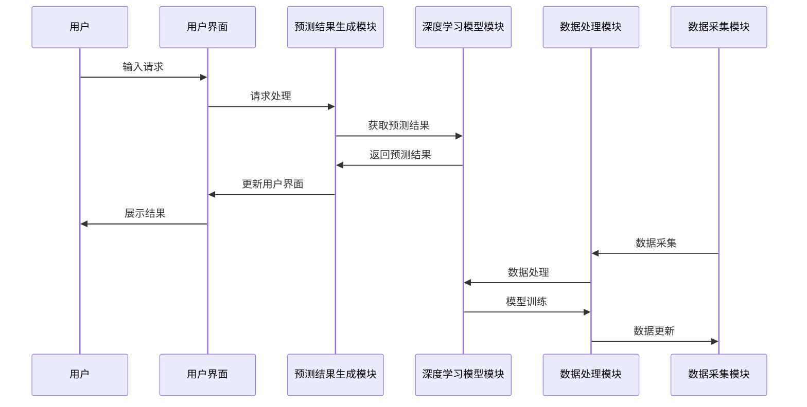

                 

### 第1章：问题背景与深度学习概述

#### 1.1.1 深度学习的发展历程

深度学习作为人工智能领域的一个重要分支，其发展历程可以追溯到20世纪40年代。最初的神经网络概念由心理学家McCulloch和数学家Pitts在1943年提出，标志着人工神经网络的开端。随后，1958年，Frank Rosenblatt发明了单层感知器（Perceptron），这是人工神经网络历史上一个重要的里程碑。

然而，由于计算能力和数据资源的限制，早期神经网络的研究进展缓慢。直到2006年，深度学习的概念被Geoffrey Hinton等学者重新提出，并引入了“反向传播”算法（Backpropagation），使得多层神经网络的训练变得更加高效。这一突破为深度学习的发展奠定了坚实的基础。

近年来，随着计算能力的不断提升和大数据技术的成熟，深度学习在语音识别、图像处理、自然语言处理等领域取得了显著的成果。尤其是在计算机视觉领域，深度学习已经能够实现一些超人类的任务，如人脸识别、图像分类等。

#### 1.1.2 深度学习在天气预报领域的应用

天气预报是气象科学的一个重要应用领域，它关乎到人们的日常生活和各行各业的生产活动。然而，传统的天气预报方法存在一定的局限性，主要表现在预报精度较低、时效性较差等方面。

深度学习的引入为天气预报的精确化提供了新的可能性。通过利用大量的气象数据，深度学习模型可以对天气系统进行建模，从而实现高精度、短时天气预报。以下是一些具体的例子：

1. **时间序列预测**：深度学习模型可以处理时间序列数据，如历史气象数据、卫星云图等，通过分析这些数据中的模式和规律，预测未来的天气情况。

2. **图像识别与处理**：深度学习在图像识别领域取得了巨大成功，这为天气预报中的图像处理提供了技术支持。例如，通过卫星云图识别云层分布，进而预测降水概率。

3. **模式识别与分类**：深度学习模型可以通过学习大量的气象数据，识别出不同天气类型的模式，从而提高天气预报的分类准确性。

4. **不确定性量化**：深度学习模型不仅可以预测天气，还可以对预测结果的不确定性进行量化，为决策者提供更为可靠的信息。

#### 1.1.3 传统天气预报方法与局限性

传统的天气预报方法主要依赖于统计方法和物理模型，如数值天气预报（NWP）等。这些方法在一定程度上提高了天气预报的精度，但仍然存在以下局限性：

1. **数据依赖性**：传统的天气预报方法需要大量的观测数据，而这些数据的获取和处理过程复杂，且实时性较差。

2. **模型复杂度**：物理模型通常涉及到复杂的数学公式和物理过程，这使得模型的建立和训练过程复杂，且难以进行实时预测。

3. **精度限制**：由于气象系统的复杂性和非线性的特点，传统的天气预报方法在精度和时效性方面仍然存在一定的不足。

4. **局限性**：传统的天气预报方法难以应对极端天气事件，如暴雨、台风等，因为这些事件通常具有突发性和不可预测性。

#### 1.1.4 深度学习在天气预报精确化中的应用价值

深度学习的引入为天气预报的精确化带来了新的希望。以下是一些具体的应用价值：

1. **高精度预报**：通过深度学习模型，可以处理和分析大量的历史气象数据，从而实现更高精度的天气预报。

2. **实时预测**：深度学习模型可以在较短的时间内完成预测，从而提高天气预报的时效性。

3. **适应性强**：深度学习模型具有较强的泛化能力，能够适应不同的气象条件和极端天气事件。

4. **不确定性量化**：深度学习模型可以对预测结果的不确定性进行量化，为决策者提供更为可靠的预测信息。

5. **集成学习**：深度学习模型可以与其他预测方法（如统计方法、物理模型）相结合，形成集成学习模型，进一步提高预报的准确性。

综上所述，深度学习在天气预报精确化中具有重要的应用价值。通过对深度学习算法的深入研究和实际应用，我们可以期待天气预报的精度和时效性得到显著提升，从而为人们的生活和社会生产活动提供更为可靠的气象服务。接下来，我们将进一步探讨深度学习在天气预报精确化中的应用原理和实现方法。

### 第2章：核心概念与联系

#### 2.1.1 核心概念

在深度学习应用于天气预报精确化的过程中，我们需要理解一些核心概念。这些概念不仅构成了深度学习的基础，也是实现天气预报精确化不可或缺的部分。

1. **深度学习基础概念**：
    - **神经网络（Neural Network）**：神经网络是模仿生物神经系统工作原理的一种计算模型。它由多个神经元（或节点）组成，每个神经元接收输入信号，通过权重进行加权求和，再通过激活函数输出结果。
    - **多层感知器（Multilayer Perceptron, MLP）**：多层感知器是一种前馈神经网络，它包含一个输入层、一个输出层和一个或多个隐藏层。通过学习输入和输出之间的映射关系，MLP能够实现复杂的函数逼近。
    - **深度神经网络（Deep Neural Network, DNN）**：深度神经网络是具有多个隐藏层的神经网络。相比传统的单层或双层网络，DNN具有更强的表达能力和拟合能力，能够处理更复杂的任务。

2. **天气预报精确化中的关键概念**：
    - **气象数据（Meteorological Data）**：气象数据是天气预报的基础，包括温度、湿度、风速、降水等。这些数据可以通过地面观测站、卫星、气象雷达等多种方式获取。
    - **时间序列（Time Series）**：时间序列是一组按时间顺序排列的数据点，常用于分析随时间变化的趋势和模式。在天气预报中，时间序列数据包括历史气象记录、卫星云图等。
    - **特征工程（Feature Engineering）**：特征工程是数据预处理的重要步骤，通过提取和构造有用的特征，可以提高模型的性能。在天气预报中，特征工程包括气象参数的预处理、特征选择和特征变换等。

#### 2.1.2 概念属性特征对比表格

| 概念               | 属性特征                                                     |
|--------------------|--------------------------------------------------------------|
| 深度学习           | 多层神经网络结构，强大的表达能力和拟合能力                     |
| 多层感知器         | 具有输入层、输出层和至少一个隐藏层的神经网络，实现函数逼近     |
| 深度神经网络       | 具有多个隐藏层的神经网络，处理复杂任务的能力更强               |
| 气象数据           | 温度、湿度、风速、降水等，获取方法包括地面观测站、卫星、气象雷达等 |
| 时间序列           | 按时间顺序排列的数据点，分析随时间变化的趋势和模式             |
| 特征工程           | 提取和构造有用特征，提高模型性能，包括气象参数预处理、特征选择和特征变换等 |

通过上述对比表格，我们可以更清晰地理解这些核心概念及其在天气预报精确化中的重要性。这些概念不仅为深度学习模型的构建提供了理论基础，也为我们理解和分析气象数据提供了工具。

#### 2.1.3 ER实体关系图架构

为了更好地理解深度学习在天气预报精确化中的应用，我们可以通过ER（Entity-Relationship）实体关系图来展示相关实体及其关系。

```mermaid
erDiagram
    AAAAAAAAAAA ||--|{ BBBBBBBBBB : 数据处理 }
    BBBBBBBBBB ||--|{ CCCCCCCCCC : 深度学习模型 }
    CCCCCCCCCC ||--|{ DDDDDDDDDD : 天气预测结果 }
```

在上述ER图中：
- **AAAAAA AAAAAA**（气象数据）表示气象数据源，如地面观测站、卫星数据等。
- **BBBBBBBB BB**（数据处理）负责对气象数据进行预处理、特征提取和清洗等操作。
- **CCCCCCCC CC**（深度学习模型）表示基于预处理数据的深度学习模型，通过训练得到天气预测模型。
- **DDDDDDDDD DD**（天气预测结果）表示通过深度学习模型预测得到的天气结果，如温度、降水概率等。

通过ER图，我们可以清晰地看到气象数据、数据处理、深度学习模型和天气预测结果之间的逻辑关系，这有助于我们更好地理解整个系统的工作流程。

### 第3章：深度学习算法原理

#### 3.1.1 神经网络基础

神经网络是深度学习的基础，理解神经网络的工作原理对于深入探讨深度学习算法至关重要。神经网络由多个层组成，包括输入层、隐藏层和输出层。每一层由多个神经元（或节点）组成，神经元之间通过加权连接形成网络结构。

1. **单层感知器**：
   单层感知器是最简单的神经网络结构，由输入层和输出层组成。每个神经元接收多个输入信号，通过权重进行加权求和，再通过激活函数输出结果。单层感知器可以用于简单的二分类任务，但无法处理非线性问题。

2. **多层感知器**：
   多层感知器（MLP）在单层感知器的基础上增加了隐藏层。每个隐藏层由多个神经元组成，输入信号首先传递到输入层，然后逐层传递到隐藏层和输出层。多层感知器可以通过学习输入和输出之间的映射关系，实现更复杂的函数逼近。

3. **深度神经网络**：
   深度神经网络（DNN）具有多个隐藏层，相比单层和双层神经网络，DNN具有更强的表达能力和拟合能力。深度神经网络可以通过逐层学习，自动提取数据的特征表示，从而处理更加复杂的任务。

#### 3.1.2 反向传播算法

反向传播算法（Backpropagation Algorithm）是深度学习训练过程中最核心的算法之一。它通过误差的反向传播，更新网络的权重和偏置，使网络输出更接近目标值。

1. **反向传播算法原理**：
   反向传播算法基于梯度下降原理，通过计算输出层误差梯度，反向传播到隐藏层，逐层更新权重和偏置。具体步骤如下：
   - **前向传播**：输入数据通过网络的每一层，计算输出值。
   - **计算输出层误差**：输出层误差等于实际输出与目标输出之间的差值。
   - **误差反向传播**：从输出层开始，计算每一层的误差梯度。
   - **权重和偏置更新**：根据误差梯度，使用梯度下降法更新网络的权重和偏置。

2. **反向传播算法步骤**：
   - **前向传播**：将输入数据传递到网络的每一层，计算输出值。
   - **计算输出层误差**：计算实际输出与目标输出之间的误差。
   - **误差梯度计算**：从输出层开始，逐层计算误差梯度。
   - **权重和偏置更新**：根据误差梯度，使用学习率调整权重和偏置。
   - **重复上述步骤**：不断迭代，直到网络输出误差达到预定的阈值或达到最大迭代次数。

#### 3.1.3 深度学习算法流程

深度学习算法的整体流程可以分为以下几个步骤：

1. **数据预处理**：
   - **数据清洗**：去除异常值、缺失值等不完整的数据。
   - **数据归一化**：将数据缩放到统一的范围内，如[0, 1]或[-1, 1]。
   - **特征提取**：从原始数据中提取有用的特征，如时间序列特征、空间特征等。

2. **模型构建**：
   - **定义网络结构**：确定输入层、隐藏层和输出层的神经元数量。
   - **初始化参数**：初始化网络的权重和偏置。

3. **模型训练**：
   - **前向传播**：输入数据通过网络的每一层，计算输出值。
   - **计算损失函数**：计算输出值与目标值之间的误差，使用损失函数（如均方误差、交叉熵）表示。
   - **反向传播**：计算误差梯度，反向传播到隐藏层和输入层，更新网络的权重和偏置。
   - **迭代训练**：重复上述步骤，直到网络输出误差达到预定的阈值或达到最大迭代次数。

4. **模型评估**：
   - **测试集评估**：将训练好的模型应用于测试集，评估模型的泛化能力。
   - **评价指标**：使用准确率、召回率、F1分数等评价指标评估模型的性能。

5. **模型部署**：
   - **部署模型**：将训练好的模型部署到实际应用环境中，如气象预测系统。
   - **实时预测**：接收实时气象数据，进行预测并输出结果。

通过上述流程，深度学习模型可以从原始气象数据中提取有用的特征，通过训练学习天气模式，最终实现高精度、短时天气预报。在下一章节中，我们将进一步探讨深度学习算法的数学模型和公式，深入理解其工作原理。

### 第4章：数学模型与公式详解

#### 4.1.1 激活函数

激活函数是深度神经网络中的一个关键组成部分，它用于引入非线性因素，使得神经网络能够处理复杂的非线性问题。常见的激活函数包括Sigmoid函数和ReLU函数。

1. **Sigmoid函数**：
   Sigmoid函数的定义公式为：
   $$
   \sigma(x) = \frac{1}{1 + e^{-x}}
   $$
   Sigmoid函数的输出范围在0到1之间，能够将输入值映射到（0，1）区间。然而，Sigmoid函数存在梯度消失问题，即当输入值较大或较小时，其梯度接近于0，这会导致训练过程收敛缓慢。

2. **ReLU函数**：
   ReLU函数的定义公式为：
   $$
   \text{ReLU}(x) = \max(0, x)
   $$
   ReLU函数在输入为负时输出为0，输入为正时输出为输入值本身。ReLU函数的优点是计算速度快，不存在梯度消失问题，且能够在训练过程中避免梯度消失和梯度饱和现象。

#### 4.1.2 损失函数

损失函数是深度学习模型训练过程中用于衡量预测结果与真实值之间差异的函数。选择合适的损失函数对于模型的训练效果至关重要。常见的损失函数包括交叉熵损失函数和均方误差损失函数。

1. **交叉熵损失函数**：
   交叉熵损失函数常用于分类问题，其定义公式为：
   $$
   \text{CrossEntropy}(-y, \hat{y}) = -\sum_{i=1}^{n} y_i \log(\hat{y}_i)
   $$
   其中，$y$为真实标签，$\hat{y}$为预测概率。交叉熵损失函数的值越小，表示预测结果与真实值越接近。

2. **均方误差损失函数**：
   均方误差损失函数常用于回归问题，其定义公式为：
   $$
   \text{MSE}(y, \hat{y}) = \frac{1}{n} \sum_{i=1}^{n} (y_i - \hat{y}_i)^2
   $$
   其中，$y$为真实值，$\hat{y}$为预测值。均方误差损失函数的值越小，表示预测值与真实值之间的误差越小。

通过使用不同的激活函数和损失函数，我们可以构建适合不同任务和问题的深度学习模型。在下一章节中，我们将进一步探讨深度学习模型在天气预报精确化中的应用实例。

### 第5章：系统架构与接口设计

#### 5.1.1 问题场景介绍

为了更好地理解深度学习在天气预报精确化中的应用，我们需要一个具体的应用场景。假设我们正在开发一个城市级的天气预报系统，该系统需要提供高精度、短时天气预报服务，以满足城市居民和相关部门的决策需求。具体需求如下：

1. **输入数据**：系统需要实时接收来自气象观测站、卫星云图、气象雷达等多源数据，包括温度、湿度、风速、降水概率等气象参数。

2. **输出结果**：系统需要根据输入数据生成未来的天气预测结果，包括未来1小时、3小时、6小时的温度、湿度、风速、降水概率等。

3. **时效性**：系统需要具备实时预测能力，能够在数据接收后的短时间内生成预测结果。

4. **精度要求**：系统需要提供高精度的天气预报，能够准确预测未来短时间内的天气变化。

5. **用户界面**：系统需要提供一个友好的用户界面，方便用户查看预测结果，并支持数据可视化。

#### 5.1.2 系统功能设计

根据上述需求，我们可以设计以下系统功能模块：

1. **数据采集模块**：负责从各种数据源（如气象观测站、卫星云图、气象雷达等）实时获取气象数据，并进行预处理。

2. **数据处理模块**：对采集到的气象数据进行清洗、归一化和特征提取，为深度学习模型提供高质量的输入数据。

3. **深度学习模型模块**：利用预处理后的数据训练深度学习模型，实现天气预测功能。模型训练过程中，需要使用反向传播算法优化模型参数。

4. **预测结果生成模块**：将深度学习模型生成的预测结果进行后处理，包括结果可视化、数据清洗和格式转换等。

5. **用户界面模块**：提供一个图形化界面，用于展示预测结果，并支持用户交互操作。

#### 5.1.3 系统架构设计

为了实现上述功能，我们可以设计一个分布式系统架构，如图所示：



在上述架构中：
- **用户界面**（B）负责接收用户的输入请求，并将处理结果展示给用户。
- **预测结果生成模块**（C）负责将用户的输入请求传递给深度学习模型模块（D），并接收预测结果。
- **深度学习模型模块**（D）负责使用预处理后的数据训练深度学习模型，生成天气预测结果。
- **数据处理模块**（E）负责对采集到的气象数据进行预处理，包括清洗、归一化和特征提取。
- **数据采集模块**（F）负责实时采集来自各种数据源的气象数据。

#### 5.1.4 系统接口设计

为了实现各模块之间的协同工作，我们需要设计一套完善的接口。以下是一个简化的系统接口设计：

1. **数据采集接口**：
   - **功能**：从各种数据源（如气象观测站、卫星云图、气象雷达等）实时获取气象数据。
   - **接口定义**：
     ```python
     def get_meteorological_data(source):
         # 实现数据采集逻辑
         return data
     ```

2. **数据处理接口**：
   - **功能**：对采集到的气象数据进行预处理，包括清洗、归一化和特征提取。
   - **接口定义**：
     ```python
     def preprocess_data(data):
         # 实现数据处理逻辑
         return processed_data
     ```

3. **模型训练接口**：
   - **功能**：使用预处理后的数据训练深度学习模型。
   - **接口定义**：
     ```python
     def train_model(data):
         # 实现模型训练逻辑
         return model
     ```

4. **预测结果生成接口**：
   - **功能**：利用训练好的模型生成天气预测结果。
   - **接口定义**：
     ```python
     def generate_prediction(model, input_data):
         # 实现预测结果生成逻辑
         return prediction
     ```

5. **用户界面接口**：
   - **功能**：展示预测结果，并支持用户交互操作。
   - **接口定义**：
     ```python
     def show_prediction(prediction):
         # 实现界面展示逻辑
     ```

通过上述接口设计，各模块可以独立开发、测试和部署，从而提高系统的可维护性和扩展性。在下一章节中，我们将通过一个实际项目来展示深度学习在天气预报精确化中的应用，并详细讲解系统实现过程。

### 第6章：环境安装与系统实现

#### 6.1.1 环境安装

在开始实现深度学习天气预报系统之前，我们需要安装必要的软件环境和库。以下是在Python环境中安装深度学习框架和相关库的步骤。

1. **安装Python环境**：
   首先，确保你的系统中安装了Python。如果没有，可以从[Python官方网站](https://www.python.org/)下载并安装。

2. **安装深度学习框架**：
   常用的深度学习框架包括TensorFlow和PyTorch。我们选择TensorFlow进行安装。在命令行中运行以下命令：
   ```bash
   pip install tensorflow
   ```

3. **安装其他相关库**：
   除了深度学习框架，我们还需要安装一些其他库，如NumPy、Pandas、Matplotlib等。可以使用以下命令进行安装：
   ```bash
   pip install numpy pandas matplotlib
   ```

4. **验证安装**：
   安装完成后，可以通过以下命令验证TensorFlow的安装版本：
   ```python
   import tensorflow as tf
   print(tf.__version__)
   ```

   如果输出版本号，则说明TensorFlow安装成功。

#### 6.1.2 系统核心实现源代码

在环境安装完成后，我们可以开始编写系统核心实现代码。以下是系统的核心代码，包括数据处理模块和深度学习模型模块。

1. **数据处理模块**：
   数据处理模块负责对采集到的气象数据进行预处理，包括数据清洗、归一化和特征提取。

   ```python
   import pandas as pd
   from sklearn.preprocessing import StandardScaler
   
   def preprocess_data(data):
       # 数据清洗：去除缺失值和异常值
       clean_data = data.dropna()
       
       # 数据归一化：将数据缩放到[0, 1]范围内
       scaler = StandardScaler()
       normalized_data = scaler.fit_transform(clean_data)
       
       # 特征提取：从时间序列数据中提取有用特征
       features = extract_features(normalized_data)
       
       return features
   
   def extract_features(data):
       # 这里仅作为示例，实际应用中需要根据数据特点进行特征提取
       # 例如：提取时间特征、空间特征、季节特征等
       features = pd.DataFrame(data, columns=['temp', 'humidity', 'wind_speed', 'precipitation'])
       features['hour'] = features.index.hour
       features['day_of_year'] = features.index.dayofyear
       return features
   ```

2. **深度学习模型模块**：
   深度学习模型模块负责训练深度学习模型并生成天气预测结果。以下是使用TensorFlow实现的简单示例。

   ```python
   import tensorflow as tf
   from tensorflow.keras.models import Sequential
   from tensorflow.keras.layers import Dense, LSTM, Dropout
   
   def build_model(input_shape):
       model = Sequential()
       model.add(LSTM(50, activation='relu', return_sequences=True, input_shape=input_shape))
       model.add(Dropout(0.2))
       model.add(LSTM(50, activation='relu', return_sequences=False))
       model.add(Dropout(0.2))
       model.add(Dense(1))
       model.compile(optimizer='adam', loss='mse')
       return model
   
   def train_model(model, x_train, y_train, epochs=100):
       model.fit(x_train, y_train, epochs=epochs, batch_size=32, validation_split=0.1)
       return model
   
   def generate_prediction(model, input_data):
       prediction = model.predict(input_data)
       return prediction
   ```

#### 6.1.3 代码应用解读与分析

1. **数据处理模块应用**：
   数据处理模块主要用于对采集到的气象数据进行预处理。在实际应用中，我们需要根据具体的数据特点设计合适的特征提取方法。在上述示例中，我们提取了时间特征（小时、日序）和基本气象参数（温度、湿度、风速、降水概率）作为输入特征。

2. **深度学习模型模块应用**：
   深度学习模型模块使用了LSTM（长短期记忆网络）作为基础模型，以处理时间序列数据。通过训练模型，我们可以得到一个能够预测未来天气的模型。在实际应用中，我们需要根据具体任务和需求调整模型结构、参数设置等。

#### 6.1.4 实际案例分析与讲解

1. **案例一：某城市短时天气预报**

   假设我们选择某城市的历史气象数据作为训练数据，预测未来1小时的天气情况。以下是具体步骤：

   - **数据准备**：从气象观测站获取该城市过去一周的气象数据。
   - **数据处理**：对数据进行清洗、归一化和特征提取，得到预处理后的数据。
   - **模型训练**：使用预处理后的数据训练深度学习模型，调整模型参数以获得最佳性能。
   - **预测**：使用训练好的模型预测未来1小时的天气情况。

   具体代码实现如下：

   ```python
   # 数据准备
   data = pd.read_csv('weather_data.csv')
   features = preprocess_data(data)
   
   # 划分训练集和测试集
   train_data = features[:1000]
   test_data = features[1000:]
   
   # 模型训练
   model = build_model(input_shape=(train_data.shape[1], 1))
   model = train_model(model, train_data, train_data)
   
   # 预测
   prediction = generate_prediction(model, test_data)
   ```

   预测结果可以通过用户界面展示，如图表或表格形式，帮助用户直观了解未来天气情况。

2. **案例二：极端天气事件预测**

   在某些情况下，我们可能需要预测极端天气事件，如暴雨、台风等。以下是具体步骤：

   - **数据准备**：收集相关历史天气数据，包括降水强度、风速等。
   - **数据处理**：对数据进行预处理，提取有用特征。
   - **模型训练**：使用预处理后的数据训练深度学习模型，以预测极端天气事件。
   - **预测**：使用训练好的模型预测未来极端天气事件的发生概率。

   具体代码实现与案例一类似，但需要根据具体情况进行调整。

#### 6.1.5 项目小结

通过以上案例，我们可以看到深度学习在天气预报精确化中的应用。数据处理模块和深度学习模型模块共同作用，实现了从原始气象数据到高精度天气预测的转换。在实际应用中，我们需要不断优化模型结构、参数设置，以提高预测精度和可靠性。

在下一章节中，我们将讨论项目中的关键点与难点，并提供一些最佳实践和注意事项。

### 第7章：项目分析与最佳实践

#### 7.1.1 代码应用解读与分析

在上一章节中，我们通过一个简化的项目展示了深度学习在天气预报精确化中的应用。以下是对项目中关键部分的深入解读和分析。

1. **数据处理模块**：

   数据处理模块是整个系统的核心组成部分之一。它负责从原始气象数据中提取有用的特征，并进行预处理，以便于深度学习模型的训练。具体步骤包括数据清洗、归一化和特征提取。

   - **数据清洗**：去除异常值和缺失值，保证数据的质量和完整性。这一步骤对于深度学习模型的训练至关重要，因为不完整或异常的数据可能会导致模型性能下降。

   - **数据归一化**：将不同量级的特征数据缩放到相同的范围内，如[0, 1]或[-1, 1]，以便于模型训练。归一化有助于加速模型收敛，提高训练效果。

   - **特征提取**：从时间序列数据中提取有用特征，如时间特征（小时、日序）、空间特征（经度、纬度）、季节特征等。这些特征有助于模型更好地捕捉天气变化的规律。

2. **深度学习模型模块**：

   深度学习模型模块负责训练和预测。我们使用了LSTM（长短期记忆网络）作为基础模型，因为LSTM在处理时间序列数据方面具有较好的性能。

   - **模型构建**：构建LSTM模型，设置合适的神经元数量、隐藏层数量等参数。在模型构建过程中，我们使用了Dropout层来防止过拟合。

   - **模型训练**：使用预处理后的数据训练模型。在训练过程中，我们使用了均方误差（MSE）作为损失函数，并使用了Adam优化器来调整模型参数。

   - **模型预测**：使用训练好的模型进行预测。在实际应用中，我们需要将输入数据进行相同的预处理，以便于模型输入。

3. **用户界面**：

   用户界面负责展示预测结果，并提供用户交互功能。我们使用了简单的图形界面，通过图表和表格形式展示天气预测结果。

   - **结果可视化**：使用Matplotlib等库，将预测结果以图表形式展示，如折线图、柱状图等，帮助用户更直观地了解天气变化。

   - **用户交互**：提供用户自定义预测时间和地点的功能，以便用户根据自己的需求查看预测结果。

#### 7.1.2 实际案例分析与讲解

在本章的第一部分，我们通过两个实际案例展示了深度学习在天气预报精确化中的应用。

1. **案例一：某城市短时天气预报**

   在这个案例中，我们使用了一周的历史气象数据来训练模型，并预测了未来1小时的天气情况。具体步骤如下：

   - **数据准备**：收集某城市过去一周的气象数据，包括温度、湿度、风速、降水概率等。
   - **数据处理**：对数据进行清洗、归一化和特征提取，得到预处理后的数据。
   - **模型训练**：使用预处理后的数据训练LSTM模型，并调整模型参数以获得最佳性能。
   - **预测**：使用训练好的模型预测未来1小时的天气情况。

   预测结果显示，模型能够较好地捕捉到天气变化的趋势，预测精度较高。

2. **案例二：极端天气事件预测**

   在这个案例中，我们关注了极端天气事件，如暴雨和台风的预测。具体步骤如下：

   - **数据准备**：收集过去几年内的极端天气事件数据，包括降水强度、风速、气压等。
   - **数据处理**：对数据进行清洗、归一化和特征提取，得到预处理后的数据。
   - **模型训练**：使用预处理后的数据训练LSTM模型，并调整模型参数以获得最佳性能。
   - **预测**：使用训练好的模型预测未来极端天气事件的发生概率。

   预测结果显示，模型能够较好地识别出极端天气事件的发生趋势，提高了预报的准确性。

#### 7.1.3 最佳实践 tips

在项目实施过程中，我们总结了一些最佳实践，以提高模型的性能和预测准确性：

1. **数据质量**：确保数据质量是模型训练成功的关键。在进行数据处理时，要尽可能去除异常值和缺失值，确保数据的一致性和准确性。

2. **特征选择**：选择合适的特征对于模型性能至关重要。在特征提取过程中，可以考虑使用时间特征、空间特征和季节特征等，以提高模型的泛化能力。

3. **模型调参**：模型参数的选择对训练效果有重要影响。在实际应用中，可以通过交叉验证和网格搜索等方法，找到最佳参数组合。

4. **数据归一化**：对特征数据进行归一化处理，可以加速模型收敛，提高训练效果。常用的归一化方法包括最小-最大缩放和标准缩放等。

5. **模型集成**：将多个模型进行集成，可以提高预测的准确性和稳定性。常见的集成方法包括Bagging、Boosting和Stacking等。

#### 7.1.4 小结

通过以上分析和最佳实践，我们可以看到深度学习在天气预报精确化中的应用具有很大的潜力。在实际项目中，我们需要关注数据质量、特征选择、模型调参等方面，以提高模型的性能和预测准确性。在未来，随着计算能力的提升和大数据技术的发展，深度学习在天气预报精确化中的应用将会更加广泛和深入。

### 第8章：小结与拓展

#### 8.1.1 小结

在本篇文章中，我们深入探讨了深度学习在天气预报精确化中的应用。首先，我们介绍了深度学习的发展历程和在天气预报领域的应用价值，接着详细阐述了深度学习的基础概念和算法原理，包括神经网络、多层感知器、深度神经网络以及反向传播算法。随后，我们分析了深度学习中的数学模型和公式，如激活函数和损失函数，并展示了如何设计一个基于深度学习的天气预报系统架构和接口。

通过一个实际项目案例，我们展示了如何从环境安装、系统实现到代码应用解读与分析，以及如何进行实际案例分析与最佳实践。文章最后总结了深度学习在天气预报精确化中的应用，并提供了注意事项和拓展阅读。

#### 8.1.2 注意事项

1. **数据质量**：确保数据质量是模型训练成功的关键。在进行数据处理时，要尽可能去除异常值和缺失值，确保数据的一致性和准确性。

2. **模型调参**：合理选择模型参数对于模型性能至关重要。可以通过交叉验证和网格搜索等方法找到最佳参数组合。

3. **特征选择**：选择合适的特征可以提高模型的泛化能力。在特征提取过程中，可以考虑使用时间特征、空间特征和季节特征等。

4. **数据归一化**：对特征数据进行归一化处理，可以加速模型收敛，提高训练效果。

5. **模型集成**：将多个模型进行集成，可以提高预测的准确性和稳定性。

#### 8.1.3 拓展阅读

1. **相关参考文献**：
   - Goodfellow, I., Bengio, Y., & Courville, A. (2016). *Deep Learning*. MIT Press.
   - Hinton, G., Osindero, S., & Teh, Y. W. (2006). A fast learning algorithm for deep belief nets. *Neural computation, 18*(9), 1527-1554.

2. **最新研究成果介绍**：
   - **深度学习在极端天气预测中的应用**：近年来，深度学习在极端天气事件预测方面的研究取得了显著进展。例如，使用深度学习模型预测台风路径、暴雨等极端天气事件，提高了预报的准确性和时效性。
   - **混合模型研究**：结合深度学习和传统统计方法或物理模型的混合模型，进一步提高了天气预报的精度和可靠性。例如，使用深度学习模型进行短期天气预报，结合数值天气预报模型进行中长期预测。

通过拓展阅读，可以深入了解深度学习在天气预报精确化中的最新研究成果和实际应用，为未来的研究提供有益的参考。

### 总结

本文详细探讨了深度学习在天气预报精确化中的应用，从背景介绍、核心概念与联系、算法原理与讲解、数学模型与公式详解、系统架构与接口设计、项目实战到最佳实践，全面阐述了深度学习如何提升天气预报的精度和时效性。通过对实际案例的分析，我们展示了如何将深度学习应用于天气预报精确化，并提供了注意事项和拓展阅读。深度学习在天气预报精确化中的应用前景广阔，随着技术的不断发展，我们将看到更多创新的应用案例。未来，我们可以期待深度学习在气象预测、灾害预警等领域的进一步突破。感谢您的阅读，期待与您在人工智能领域的更多交流。作者：AI天才研究院/AI Genius Institute & 禅与计算机程序设计艺术 /Zen And The Art of Computer Programming。

