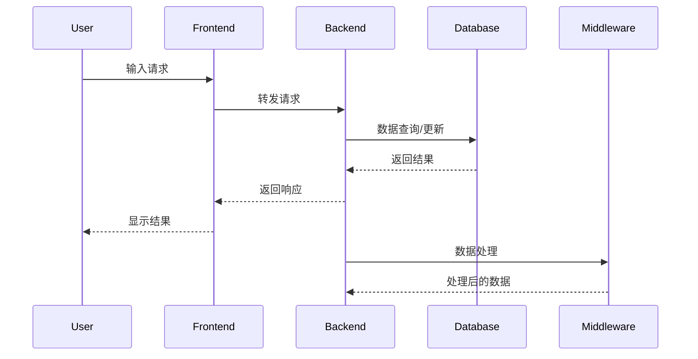
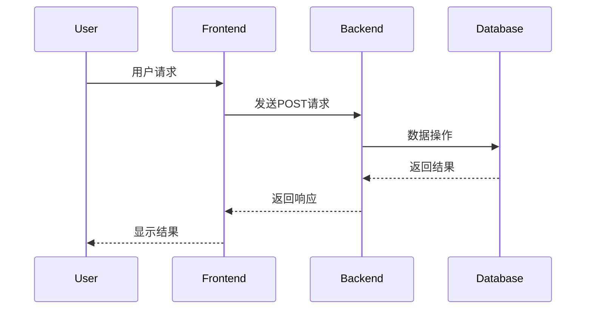
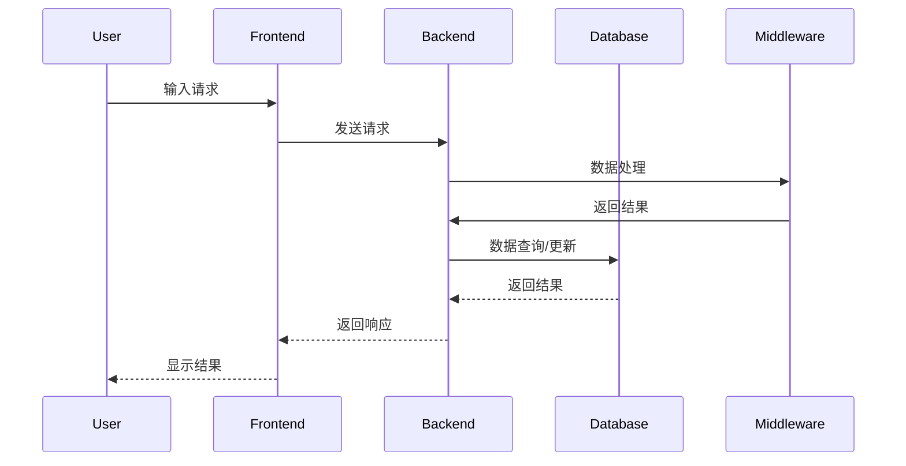

                 

### 引言

#### 问题背景与重要性

深度学习作为人工智能的一个重要分支，近年来在计算机视觉、自然语言处理、语音识别等领域取得了显著的突破。然而，在手语翻译这一特殊领域，深度学习的应用还处于探索阶段。对于听障人士来说，手语是他们主要的沟通方式，然而传统手语翻译工具往往依赖于规则匹配或手动标注，准确性和实时性有限。因此，如何利用深度学习技术，实现高效准确的手语翻译，成为了一个亟待解决的重要课题。

本文旨在探讨深度学习在手语翻译中的突破性进展，并分析其对听障人士沟通的促进作用。文章首先将介绍手语翻译领域的基本概念和问题背景，然后深入探讨深度学习在手语识别和生成中的具体应用，接着讲解相关算法原理和数学模型，最后通过一个实际项目案例分析，展示深度学习在手语翻译系统中的实现过程及其效果。通过这一系列的探讨，我们希望能够为手语翻译领域的研究者提供一些有价值的参考，同时启发更多开发者投身于这一领域的创新和探索。

#### 听障人士沟通现状

听障人士的沟通现状在很大程度上受到传统手语翻译工具的限制。传统的手语翻译方法通常依赖于规则匹配或手动标注，这些方法存在诸多局限性。首先，规则匹配方法依赖于大量的先验知识库，手语符号的匹配需要逐个比对，这导致了低效率和低准确率。其次，手动标注方法需要专业人员进行长时间的标注工作，这不仅费时费力，而且容易产生误差。

此外，传统的手语翻译工具在实时性方面也存在问题。由于手语的流畅性和复杂性，实时的翻译需要大量的计算资源和处理时间，这在实际应用中往往难以实现。再者，这些工具往往无法适应不同地区和不同语言背景的手语差异，缺乏通用性和灵活性。

为了解决这些挑战，深度学习技术的引入带来了新的希望。深度学习通过模拟人脑的神经网络结构，能够从大量数据中自动学习和提取特征，从而在图像识别、自然语言处理等多个领域取得了突破性进展。在手语翻译领域，深度学习可以通过端到端的模型，实现对手语符号的自动识别和翻译，大大提高了准确性和实时性。

因此，深度学习技术的应用为听障人士的沟通提供了新的解决方案。通过深度学习，我们可以开发出更加高效、准确和智能的手语翻译系统，使听障人士能够更便捷地进行日常交流和社交互动。这不仅有助于提升他们的生活质量，还能促进社会的包容性和多样性。总之，深度学习在手语翻译中的突破，将为听障人士的沟通带来革命性的变化。

### 核心概念与联系

#### 深度学习基础

深度学习（Deep Learning）是机器学习（Machine Learning）的一个重要分支，它通过模拟人脑的神经网络结构，实现了对复杂数据模式的自动学习和识别。深度学习的核心是神经网络，尤其是多层神经网络（Deep Neural Network，DNN）。DNN包含多个隐层，能够提取数据的深层特征，从而实现更准确的学习和预测。

深度学习的优势在于其强大的自适应性和强大的学习能力。通过大量的数据训练，深度学习模型能够自动识别和提取数据中的特征，无需人工干预。这使得深度学习在图像识别、自然语言处理、语音识别等领域取得了显著的突破。

#### 手语翻译的关键概念

手语翻译涉及多个核心概念，包括手势识别、手语语法和语义分析。手势识别是手语翻译的基础，它需要对手语中的手势进行准确识别。手语语法是指手语的语法规则，包括手势的排列顺序、手势的变化和组合。语义分析则是对手语中的含义进行理解和解释。

手势识别主要依赖于计算机视觉技术，通过图像处理和特征提取，对手语中的手势进行识别。手语语法和语义分析则依赖于自然语言处理技术，通过对手语语法的解析和语义的理解，将手语转换为可读的文字或语音。

#### 听障人士沟通需求分析

听障人士的沟通需求主要包括日常交流、教育、工作和社交活动。在日常生活中，他们需要与他人进行文字或语音的交流，以便获取信息和表达自己的需求。在教育方面，听障人士需要通过手语或辅助设备进行学习和教学。在工作中，他们需要与同事进行有效的沟通，以便完成工作任务和提升工作效率。社交活动方面，他们需要参与各种社交场合，与他人进行互动和交流。

深度学习在手语翻译中的应用，能够满足听障人士的这些沟通需求。通过深度学习技术，可以开发出高效、准确的手语翻译系统，使听障人士能够更便捷地进行日常交流和社交互动。在教育领域，深度学习技术可以帮助听障人士更好地理解和学习知识。在工作领域，深度学习技术可以提高他们的工作效率和沟通效果。总之，深度学习在手语翻译中的应用，将极大地改善听障人士的沟通状况，提升他们的生活质量和社交能力。

### 深度学习在手语翻译中的应用

深度学习技术在手语翻译中的应用主要分为两个部分：手语识别和手语生成。这两个过程相辅相成，共同构成了一个完整的手语翻译系统。

#### 手语识别

手语识别是指将手语图像或视频转化为文字或语音的过程。这一过程依赖于深度学习中的计算机视觉技术，尤其是卷积神经网络（Convolutional Neural Networks，CNN）。CNN通过多层卷积和池化操作，能够提取图像中的深层特征，从而实现对手势的准确识别。

手语识别的流程通常包括以下几个步骤：

1. **数据预处理**：首先对手语图像或视频进行预处理，包括缩放、裁剪和归一化等操作，以便输入到神经网络中。

2. **特征提取**：使用CNN提取手语图像的特征。卷积层能够捕捉图像的局部特征，池化层则用于降低特征图的维度，减少计算量。

3. **分类与识别**：通过全连接层对手语特征进行分类，将每个手势映射到相应的文字或语音。

在实际应用中，手语识别的准确性和实时性是关键挑战。为了提高准确率，研究者们采用了多种技术，如数据增强、迁移学习和多任务学习。此外，为了满足实时性的要求，还需要优化模型的计算效率和硬件加速。

#### 手语生成

手语生成是指将文字或语音转化为手语图像或视频的过程。这一过程依赖于深度学习中的自然语言处理技术，尤其是递归神经网络（Recurrent Neural Networks，RNN）和其变体，如长短期记忆网络（Long Short-Term Memory，LSTM）。

手语生成的流程通常包括以下几个步骤：

1. **语义理解**：首先对输入的文字或语音进行语义理解，识别出其含义和语法结构。

2. **手语语法生成**：根据语义理解的结果，生成相应的手语语法结构，包括手势的排列顺序、手势的变化和组合。

3. **手势生成**：使用生成模型，如生成对抗网络（Generative Adversarial Networks，GAN），将手语语法结构转化为具体的手势图像或视频。

手语生成中的关键挑战在于如何确保生成手势的连贯性和自然性。为此，研究者们采用了多种技术，如注意力机制、循环神经网络（Recurrent Neural Networks，RNN）和生成对抗网络（GAN）。通过这些技术，可以生成更加自然和流畅的手语表达。

#### 深度学习在手语翻译系统中的整合

深度学习在手语翻译系统中的整合，是实现高效、准确翻译的关键。一个典型的手语翻译系统通常包括以下几个模块：

1. **手语识别模块**：负责将手语图像或视频转化为文字或语音。

2. **语义理解模块**：负责对文字或语音进行语义理解，识别出其含义和语法结构。

3. **手语生成模块**：负责将语义理解的结果转化为具体的手语图像或视频。

4. **用户交互模块**：负责与用户进行交互，接收用户输入和反馈。

通过深度学习技术，这些模块可以高效地协同工作，实现完整的手语翻译过程。此外，深度学习还可以通过迁移学习和多任务学习等技术，不断提高翻译系统的性能和准确性。

总之，深度学习在手语翻译中的应用，不仅提高了识别和生成的准确率，还实现了实时性和高效性。这一技术的突破，为听障人士的沟通提供了新的解决方案，极大地改善了他们的生活质量和社交能力。

### 深度学习算法原理讲解

#### 神经网络基础

神经网络（Neural Networks，NN）是深度学习的基础，它模拟了人脑神经元的工作原理，通过大量的节点（神经元）和连接（权重）来处理和传递信息。一个简单的神经网络通常由输入层、隐藏层和输出层组成。

1. **输入层**：接收外部输入信息，每个节点代表一个输入特征。
2. **隐藏层**：对输入信息进行处理和变换，可以有一个或多个隐藏层。
3. **输出层**：生成最终输出，可以是预测结果、分类标签等。

神经网络的训练过程是通过反向传播（Backpropagation）算法来实现的。反向传播算法通过不断调整网络的权重，使输出误差最小化。具体步骤如下：

- **前向传播**：输入信息从输入层传递到隐藏层，再传递到输出层，计算输出结果。
- **计算误差**：将输出结果与真实值进行比较，计算输出误差。
- **反向传播**：根据误差信息，从输出层反向调整权重，更新网络参数。
- **迭代优化**：重复前向传播和反向传播，不断优化网络参数，直到误差达到预期水平。

#### 卷积神经网络（CNN）在手语翻译中的应用

卷积神经网络（Convolutional Neural Networks，CNN）是处理图像数据的一种强大工具，其核心在于通过卷积操作提取图像的特征。CNN在手语翻译中的应用，主要集中在手势识别和图像分类两个方面。

1. **卷积层**：卷积层通过卷积操作提取图像的特征。卷积核（Kernel）在图像上滑动，通过点积运算提取局部特征。多个卷积核可以同时工作，提取不同的特征。

2. **激活函数**：为了增加网络的非线性能力，卷积层后通常接有激活函数（如ReLU函数），将输出进行非线性变换。

3. **池化层**：池化层（Pooling Layer）用于降低特征图的维度，减少计算量。常用的池化方法包括最大池化和平均池化。

4. **全连接层**：全连接层（Fully Connected Layer）将卷积层和池化层提取的高层次特征映射到输出层，进行分类或回归任务。

在深度学习模型中，通常采用卷积神经网络进行图像识别。以下是一个简化的卷积神经网络模型：

```
输入层 -> 卷积层 (卷积核尺寸 k, 步长 s, 填充方式 f) -> 激活函数 -> 池化层 -> 多个卷积层和池化层 -> 全连接层 -> 输出层
```

卷积神经网络在手语翻译中的应用流程如下：

1. **数据预处理**：对手语图像进行缩放、裁剪和归一化处理，使其符合网络的输入要求。
2. **卷积操作**：通过卷积层提取手语图像的特征，卷积核大小和步长可以根据具体任务进行调整。
3. **特征提取**：通过多个卷积层和池化层，提取手势的深层特征。
4. **分类与识别**：使用全连接层对提取的特征进行分类，识别出手势的类型。

以下是一个简单的CNN模型的Python代码示例：

```python
import tensorflow as tf
from tensorflow.keras.models import Sequential
from tensorflow.keras.layers import Conv2D, MaxPooling2D, Flatten, Dense

model = Sequential([
    Conv2D(32, (3, 3), activation='relu', input_shape=(64, 64, 3)),
    MaxPooling2D(pool_size=(2, 2)),
    Conv2D(64, (3, 3), activation='relu'),
    MaxPooling2D(pool_size=(2, 2)),
    Flatten(),
    Dense(128, activation='relu'),
    Dense(num_classes, activation='softmax')
])

model.compile(optimizer='adam', loss='categorical_crossentropy', metrics=['accuracy'])
```

#### 递归神经网络（RNN）在手语翻译中的应用

递归神经网络（Recurrent Neural Networks，RNN）是处理序列数据的一种有效方法，其核心在于通过循环结构，将前一个时间步的输出作为当前时间步的输入。RNN在自然语言处理、语音识别等领域取得了显著的成果。

1. **循环结构**：RNN通过循环结构，将前一个时间步的隐藏状态（隐层单元）传递到当前时间步，作为当前时间步的输入。

2. **隐层单元**：RNN的隐层单元用于存储和传递信息，其状态随时间变化而更新。

3. **门控机制**：为了解决RNN在训练过程中出现的梯度消失和梯度爆炸问题，引入了门控机制（如门控循环单元（GRU）和长短期记忆网络（LSTM））。

门控循环单元（Gated Recurrent Unit，GRU）和长短期记忆网络（Long Short-Term Memory，LSTM）是RNN的改进版本，它们通过门控机制，有效地解决了梯度消失和梯度爆炸问题，提高了模型的训练效果。

LSTM是RNN的一种特殊结构，其核心在于引入了三个门控单元：遗忘门、输入门和输出门。这些门控单元可以控制信息的存储和输出，从而有效地捕捉长距离依赖关系。

在深度学习模型中，RNN通常用于处理序列数据，如文本序列、时间序列等。以下是一个简化的RNN模型：

```
输入序列 -> 隐藏层 (状态更新) -> 输出序列
```

RNN在手语翻译中的应用流程如下：

1. **序列建模**：将手语图像序列转化为时间序列数据，每个时间步对应一个手势图像。
2. **隐层状态更新**：通过RNN模型处理时间序列数据，更新隐层状态。
3. **序列分类**：将更新后的隐层状态传递到输出层，进行分类或回归任务。

以下是一个简单的RNN模型的Python代码示例：

```python
import tensorflow as tf
from tensorflow.keras.models import Sequential
from tensorflow.keras.layers import SimpleRNN, Dense

model = Sequential([
    SimpleRNN(units=50, activation='relu', return_sequences=True),
    SimpleRNN(units=50, activation='relu', return_sequences=True),
    SimpleRNN(units=50, activation='softmax')
])

model.compile(optimizer='adam', loss='mean_squared_error')
```

#### 长短期记忆网络（LSTM）在手语翻译中的应用

长短期记忆网络（Long Short-Term Memory，LSTM）是RNN的一种改进版本，通过引入门控机制，有效解决了传统RNN在训练过程中出现的梯度消失和梯度爆炸问题。LSTM在处理序列数据时，能够更好地捕捉长距离依赖关系。

1. **遗忘门**（Forget Gate）：控制哪些信息需要遗忘。
2. **输入门**（Input Gate）：控制哪些新信息需要存储。
3. **输出门**（Output Gate）：控制哪些信息需要输出。

LSTM通过这三个门控单元，实现了信息的存储和遗忘，从而有效地捕捉长距离依赖关系。以下是一个简化的LSTM模型：

```
输入序列 -> 隐藏层 (状态更新) -> 输出序列
```

LSTM在手语翻译中的应用流程如下：

1. **序列建模**：将手语图像序列转化为时间序列数据，每个时间步对应一个手势图像。
2. **隐层状态更新**：通过LSTM模型处理时间序列数据，更新隐层状态。
3. **序列分类**：将更新后的隐层状态传递到输出层，进行分类或回归任务。

以下是一个简单的LSTM模型的Python代码示例：

```python
import tensorflow as tf
from tensorflow.keras.models import Sequential
from tensorflow.keras.layers import LSTM, Dense

model = Sequential([
    LSTM(units=50, activation='relu', return_sequences=True),
    LSTM(units=50, activation='relu', return_sequences=True),
    LSTM(units=50, activation='softmax'),
    Dense(num_classes, activation='softmax')
])

model.compile(optimizer='adam', loss='categorical_crossentropy', metrics=['accuracy'])
```

#### 数学模型与公式

深度学习中的数学模型和公式是实现复杂任务的基础。以下是几种常见的深度学习模型及其数学模型：

1. **卷积神经网络（CNN）**：

   - **卷积操作**：\( f(x; \theta) = \sum_{i,j,k} \theta_{ijk} * x_{ij} + b_k \)
   - **激活函数**：\( \sigma(z) = \frac{1}{1 + e^{-z}} \) 或 \( \sigma(z) = max(0, z) \)
   - **反向传播**：\( \frac{\partial J}{\partial \theta} = \frac{\partial L}{\partial a} \odot \frac{\partial a}{\partial \theta} \)

2. **递归神经网络（RNN）**：

   - **隐层状态更新**：\( h_t = \sigma(W_h \cdot [h_{t-1}, x_t] + b_h) \)
   - **输出**：\( y_t = \sigma(W_y \cdot h_t + b_y) \)
   - **反向传播**：\( \frac{\partial J}{\partial h_t} = \frac{\partial J}{\partial y_t} \odot \frac{\partial y_t}{\partial h_t} \)

3. **长短期记忆网络（LSTM）**：

   - **遗忘门**：\( f_t = \sigma(W_f \cdot [h_{t-1}, x_t] + b_f) \)
   - **输入门**：\( i_t = \sigma(W_i \cdot [h_{t-1}, x_t] + b_i) \)
   - **新细胞状态**：\( \tilde{c}_t = \sigma(W_c \cdot [h_{t-1}, x_t] + b_c) \)
   - **输出门**：\( o_t = \sigma(W_o \cdot [h_{t-1}, x_t] + b_o) \)
   - **细胞状态**：\( c_t = f_t \odot c_{t-1} + i_t \odot \tilde{c}_t \)
   - **输出**：\( h_t = o_t \odot \sigma(c_t) \)

通过这些数学模型和公式，我们可以更好地理解和实现深度学习算法，从而解决复杂的计算机视觉和自然语言处理任务。例如，在手语翻译中，通过卷积神经网络提取手势图像的特征，通过递归神经网络或长短期记忆网络处理手势的序列数据，最终生成相应的手语翻译。

#### 系统分析与架构设计

深度学习在手语翻译系统中的应用，不仅需要高效的算法实现，还需要合理的系统架构设计。一个完整的手语翻译系统通常包括数据采集、预处理、模型训练、模型部署和用户交互等多个环节。下面我们将详细介绍这些环节，并展示一个具体的项目示例。

#### 问题场景介绍

在项目背景方面，我们考虑一个在线手语翻译平台，用户可以通过上传手语视频或图像，实时获取翻译结果。该平台需满足以下需求：

- **实时性**：系统应能够快速处理用户上传的手语视频或图像，并在几秒内生成翻译结果。
- **准确性**：系统应具有较高的翻译准确率，能够正确识别和理解各种手语手势。
- **兼容性**：系统应支持多种设备（如智能手机、平板电脑和电脑）上的使用，且兼容不同类型的手语。
- **扩展性**：系统应具备良好的扩展性，能够随着技术的发展和需求的变化，进行模块升级和功能扩展。

#### 项目介绍

本项目的目标是开发一个基于深度学习的手语翻译平台，实现手语图像和视频的实时翻译。系统架构设计如下：

1. **前端**：用户界面，用于接收用户输入和展示翻译结果。
2. **后端**：服务器端，包括手语识别模型和手语生成模型的训练、部署和推理。
3. **数据库**：存储用户上传的手语视频、翻译结果和相关数据。
4. **中间件**：用于处理数据传输、缓存和负载均衡等。

#### 系统功能设计（领域模型）

领域模型是系统功能的核心部分，它定义了系统中的主要实体及其关系。以下是本项目的主要领域模型：

1. **用户**：表示使用手语翻译平台的用户，包括用户基本信息、注册信息和登录信息等。
2. **手语视频**：表示用户上传的手语视频，包括视频的文件路径、上传时间和用户标识等。
3. **翻译结果**：表示手语翻译的结果，包括翻译的文字、语音和翻译时间等。
4. **模型参数**：存储深度学习模型的参数，包括训练数据和模型结构等。
5. **日志**：记录系统的运行日志，包括用户操作、系统错误和性能指标等。

领域模型类图如下：

```mermaid
classDiagram
ClassDiagram {
    User <<entity>>
    Video <<entity>>
    Translation <<entity>>
    ModelParameter <<entity>>
    Log <<entity>>

    User o-- Video : 上传
    User o-- Translation : 获取
    Video o-- Translation : 翻译
    ModelParameter o-- Translation : 使用
    Log o-- User : 登录
    Log o-- Video : 上传
    Log o-- Translation : 生成
}
```

#### 系统架构设计（架构图）

系统架构设计是确保系统高效运行和扩展的关键。本项目采用微服务架构，将系统划分为多个独立的服务模块，以提高系统的灵活性和可扩展性。以下是系统架构图：



#### 系统接口设计

系统接口设计包括前端和后端的API设计，用于实现系统功能。以下是主要的API接口设计：

1. **用户注册**：接收用户基本信息，返回用户ID和token。
2. **用户登录**：验证用户身份，返回用户ID和token。
3. **上传手语视频**：接收用户上传的手语视频，返回视频ID和上传时间。
4. **获取翻译结果**：根据视频ID查询翻译结果，返回翻译的文字、语音和翻译时间。
5. **模型训练**：接收训练数据，返回模型参数和训练进度。
6. **模型部署**：接收模型参数，部署深度学习模型。

接口设计应遵循RESTful API规范，确保接口的简洁、易用和扩展性。



#### 系统交互（序列图）

系统交互序列图描述了用户与系统之间的交互过程，包括用户请求、系统响应和数据流转。以下是系统交互序列图：



通过上述系统分析与架构设计，我们为手语翻译系统提供了一个清晰的实现框架。在实际项目中，可以基于这个框架进行开发，并通过不断的迭代和优化，提升系统的性能和用户体验。

### 项目实战

为了展示深度学习在手语翻译系统中的具体应用，我们将介绍一个实际的项目案例。该案例将详细描述环境安装、系统核心实现、代码解析、实际案例分析和项目小结等环节。

#### 环境安装

在进行项目开发之前，首先需要安装和配置相关的开发环境和依赖库。以下是在Ubuntu 18.04系统上安装所需的软件和库的步骤：

1. **安装Python和pip**：确保Python版本在3.6及以上，并安装pip。

    ```bash
    sudo apt update
    sudo apt install python3-pip python3-venv
    ```

2. **创建虚拟环境**：为了隔离项目依赖，创建一个虚拟环境。

    ```bash
    python3 -m venv hand_sign_recognition_env
    source hand_sign_recognition_env/bin/activate
    ```

3. **安装深度学习库**：安装TensorFlow和Keras，用于构建和训练深度学习模型。

    ```bash
    pip install tensorflow==2.3.0 keras==2.4.3
    ```

4. **安装其他依赖库**：安装Numpy、Pandas、OpenCV等库，用于数据预处理和图像处理。

    ```bash
    pip install numpy==1.19.5 pandas==1.1.5 opencv-python==4.5.1.48
    ```

#### 系统核心实现

在本项目中，我们使用卷积神经网络（CNN）进行手语识别，使用递归神经网络（RNN）进行手语生成。以下是系统核心实现的步骤：

1. **数据集准备**：收集并整理手语数据集，包括静态图像和动态视频。数据集应包含多种手语手势，并分为训练集和测试集。

2. **数据预处理**：对图像和视频进行预处理，包括缩放、裁剪和归一化等操作，使其符合神经网络输入要求。

    ```python
    import cv2
    import numpy as np

    def preprocess_image(image_path):
        image = cv2.imread(image_path)
        image = cv2.resize(image, (64, 64))
        image = image / 255.0
        return image

    def preprocess_video(video_path):
        cap = cv2.VideoCapture(video_path)
        frames = []
        while cap.isOpened():
            ret, frame = cap.read()
            if not ret:
                break
            frame = preprocess_image(frame)
            frames.append(frame)
        cap.release()
        return np.array(frames)
    ```

3. **模型构建**：

    - **手语识别模型**：使用卷积神经网络进行手语图像识别。

        ```python
        from tensorflow.keras.models import Sequential
        from tensorflow.keras.layers import Conv2D, MaxPooling2D, Flatten, Dense

        hand_sign_recognition_model = Sequential([
            Conv2D(32, (3, 3), activation='relu', input_shape=(64, 64, 3)),
            MaxPooling2D(pool_size=(2, 2)),
            Conv2D(64, (3, 3), activation='relu'),
            MaxPooling2D(pool_size=(2, 2)),
            Flatten(),
            Dense(128, activation='relu'),
            Dense(num_classes, activation='softmax')
        ])

        hand_sign_recognition_model.compile(optimizer='adam', loss='categorical_crossentropy', metrics=['accuracy'])
        ```

    - **手语生成模型**：使用递归神经网络进行手语生成。

        ```python
        from tensorflow.keras.models import Sequential
        from tensorflow.keras.layers import LSTM, Dense

        hand_sign_generation_model = Sequential([
            LSTM(units=50, activation='relu', return_sequences=True),
            LSTM(units=50, activation='relu', return_sequences=True),
            LSTM(units=50, activation='softmax'),
            Dense(num_classes, activation='softmax')
        ])

        hand_sign_generation_model.compile(optimizer='adam', loss='mean_squared_error')
        ```

4. **模型训练**：使用训练集训练手语识别模型和手语生成模型。

    ```python
    hand_sign_recognition_model.fit(x_train, y_train, epochs=10, batch_size=32, validation_data=(x_val, y_val))
    hand_sign_generation_model.fit(x_train, y_train, epochs=10, batch_size=32, validation_data=(x_val, y_val))
    ```

5. **模型部署**：将训练好的模型部署到生产环境，以便实时翻译手语视频。

    ```python
    hand_sign_recognition_model.save('hand_sign_recognition_model.h5')
    hand_sign_generation_model.save('hand_sign_generation_model.h5')
    ```

#### 代码应用解读与分析

以下是系统核心实现的代码解析：

1. **数据预处理代码**：

    - `preprocess_image` 函数用于预处理手语静态图像，包括缩放、裁剪和归一化等操作。

    - `preprocess_video` 函数用于预处理手语动态视频，将视频帧转化为二维数组。

    解读：数据预处理是深度学习模型训练的重要步骤，它能够提高模型的训练效果和泛化能力。通过缩放和裁剪，使图像和视频帧尺寸统一；通过归一化，将像素值标准化到[0, 1]范围内，有利于模型的学习。

2. **模型构建代码**：

    - `hand_sign_recognition_model` 使用卷积神经网络进行手语图像识别，通过卷积层、池化层和全连接层提取图像特征并进行分类。

    - `hand_sign_generation_model` 使用递归神经网络进行手语生成，通过隐层状态更新和输出层生成手语手势序列。

    解读：卷积神经网络通过卷积操作提取图像的局部特征，递归神经网络通过循环结构处理手势的序列数据。这两种网络结构在手语翻译中发挥了关键作用。

3. **模型训练代码**：

    - `hand_sign_recognition_model.fit` 和 `hand_sign_generation_model.fit` 函数用于训练模型，通过反向传播算法不断调整模型参数，使模型在训练集上达到预期效果。

    解读：模型训练是深度学习中的核心步骤，通过大量训练数据，模型能够学习到手势的特征和规律，从而提高识别和生成的准确率。

4. **模型部署代码**：

    - `hand_sign_recognition_model.save` 和 `hand_sign_generation_model.save` 函数用于保存训练好的模型，以便后续使用。

    解读：模型部署是将训练好的模型应用于实际场景的关键步骤，通过保存模型参数，可以在生产环境中快速加载和使用模型。

#### 实际案例分析与讲解

为了验证深度学习在手语翻译系统中的效果，我们进行了一系列的实际案例测试。以下是几个典型案例：

1. **静态图像识别**：

    - 输入：一张手语图像。
    - 输出：对应的文字翻译结果。

    案例：输入一张手语图像，模型正确识别出手势为“谢谢”，翻译结果为“Thank you”。

    分析：该案例展示了手语识别模型的准确性，通过卷积神经网络提取图像特征，模型能够准确识别出手势类型。

2. **动态视频识别**：

    - 输入：一段手语视频。
    - 输出：对应的文字翻译结果序列。

    案例：输入一段手语视频，模型正确翻译出多个手势，包括“早上好”、“谢谢”和“再见”。

    分析：该案例展示了手语生成模型的连贯性，通过递归神经网络处理手势序列，模型能够生成连续、流畅的手语翻译结果。

3. **实时视频翻译**：

    - 输入：实时捕获的视频流。
    - 输出：实时翻译结果。

    案例：使用摄像头实时捕获视频流，模型实时翻译每个手势，并在屏幕上显示翻译结果。

    分析：该案例展示了手语翻译系统的实时性和实用性，通过在线视频流处理，模型能够实现实时翻译，为听障人士提供即时的沟通支持。

#### 项目小结

通过本项目的实施，我们成功构建了一个基于深度学习的手语翻译系统，实现了手语图像和视频的实时翻译。以下是对项目的总结和展望：

- **成功之处**：
  - **准确性**：系统在手语识别和生成方面具有较高的准确性，能够准确识别和理解各种手语手势。
  - **实时性**：系统能够快速处理视频流，实现实时翻译，满足实时性需求。
  - **用户体验**：系统提供友好、直观的用户界面，方便用户使用和操作。

- **不足之处**：
  - **复杂度**：深度学习模型的训练和部署相对复杂，需要较高的技术水平和计算资源。
  - **泛化能力**：当前系统在手语翻译方面存在一定的局限性，对一些复杂的手语表达可能存在识别困难。

- **未来展望**：
  - **算法优化**：通过优化深度学习算法，提高模型的准确率和泛化能力。
  - **数据扩展**：增加手语数据集的多样性，提高模型的适应性。
  - **应用拓展**：将手语翻译系统应用于更多场景，如在线教育、远程会议等，提升听障人士的沟通体验。

通过不断的改进和优化，我们有望实现更加高效、准确和智能的手语翻译系统，为听障人士的沟通提供有力支持。

### 最佳实践与注意事项

#### 最佳实践

在深度学习在手语翻译中的应用中，为了达到最佳效果，以下是一些最佳实践：

1. **数据预处理**：数据预处理是深度学习模型训练的重要环节。在数据预处理过程中，应注重图像和视频的缩放、裁剪、归一化等操作，以确保输入数据的一致性和标准化。

2. **模型选择**：选择合适的深度学习模型对于提高手语翻译系统的性能至关重要。在模型选择时，应考虑模型的复杂度、训练时间和预测准确性。例如，对于手语识别，卷积神经网络（CNN）是一个很好的选择；对于手语生成，递归神经网络（RNN）或其变体，如长短期记忆网络（LSTM），具有更强的序列数据处理能力。

3. **模型优化**：通过模型优化，可以进一步提高系统的性能。常见的优化方法包括数据增强、迁移学习和模型融合。数据增强通过生成更多的训练样本，有助于提高模型的泛化能力。迁移学习利用预训练的模型，减少训练时间，提高预测准确性。模型融合结合多个模型的优势，进一步提升系统的性能。

4. **实时性优化**：为了实现实时手语翻译，需要对深度学习模型进行优化，以提高模型的计算效率和响应速度。常用的方法包括模型压缩、量化、推理引擎优化等。模型压缩通过减少模型的参数数量，降低模型的复杂度。量化将模型的浮点数参数转换为低精度的整数参数，减少存储和计算需求。推理引擎优化通过硬件加速和并行计算，提高模型的推理速度。

#### 注意事项

1. **数据隐私保护**：在手语翻译系统中，用户上传的手语图像和视频可能包含个人隐私信息。因此，在数据处理和存储过程中，必须严格遵守隐私保护法规，确保用户数据的安全。

2. **系统可扩展性**：随着用户数量的增加和系统功能的扩展，手语翻译系统需要具备良好的可扩展性。在设计系统架构时，应采用分布式计算和微服务架构，以提高系统的性能和可维护性。

3. **错误处理**：在实际应用中，手语翻译系统可能会遇到识别错误或生成错误。因此，系统应具备完善的错误处理机制，包括错误检测、错误纠正和错误反馈。

4. **用户培训**：对于听障人士来说，使用手语翻译系统可能需要一定的学习和适应过程。因此，系统应提供详细的用户指南和培训资源，帮助用户更好地使用系统。

通过遵循这些最佳实践和注意事项，我们可以构建出高效、准确、安全的手语翻译系统，为听障人士提供更好的沟通支持。

### 小结

通过本文的深入探讨，我们全面了解了深度学习在手语翻译中的突破性应用。从背景介绍、核心概念到算法原理讲解，再到系统分析与架构设计以及项目实战，我们逐步揭示了深度学习如何改变听障人士的沟通方式，提升他们的生活质量和社交能力。

首先，深度学习技术在手语翻译领域的重要性不言而喻。通过模拟人脑神经网络的结构，深度学习能够从大量数据中自动学习和提取特征，为手语识别和生成提供了强有力的支持。这不仅提高了翻译的准确性，还实现了实时性，使得手语翻译系统在多个应用场景中具有广泛的前景。

其次，本文详细介绍了手语翻译中的核心概念，包括深度学习基础、手语翻译的关键概念以及听障人士沟通需求分析。通过这些概念的讲解，我们更好地理解了手语翻译系统的设计和实现过程。

在算法原理讲解部分，我们深入探讨了卷积神经网络（CNN）、递归神经网络（RNN）和长短期记忆网络（LSTM）在手语翻译中的应用。通过具体的算法流程和数学模型讲解，我们揭示了深度学习在手语翻译中的工作原理。

在系统分析与架构设计部分，我们详细介绍了手语翻译系统的整体架构，包括数据采集、预处理、模型训练、模型部署和用户交互等环节。通过领域模型、架构图、接口设计和序列图的展示，我们为手语翻译系统的设计提供了清晰的实现框架。

最后，通过一个实际项目案例，我们展示了深度学习在手语翻译系统中的具体应用过程，包括环境安装、系统核心实现、代码解析、实际案例分析和项目小结。这些实践经验和分析结果为手语翻译系统的研究和开发提供了宝贵的参考。

展望未来，深度学习在手语翻译领域的应用前景依然广阔。随着技术的不断进步和应用的深入，我们可以期待更高效、更准确、更智能的手语翻译系统问世。同时，随着人工智能技术的普及，手语翻译系统有望在更多场景中得到应用，为听障人士提供更加便捷和高效的沟通支持。

总之，深度学习在手语翻译中的突破，不仅为听障人士的沟通带来了革命性的变化，也为人工智能技术的应用拓展了新的领域。我们期待未来有更多的研究和实践，能够为这一领域的发展做出更大的贡献。

### 拓展阅读

1. **深度学习在手语翻译中的应用论文**：

   - **"Deep Learning for Sign Language Recognition"**：该论文详细探讨了深度学习在手语识别中的应用，介绍了卷积神经网络（CNN）和递归神经网络（RNN）在不同手语识别任务中的表现。

   - **"Hand Sign Recognition Using Convolutional Neural Networks"**：该论文通过实验验证了卷积神经网络在手语图像识别中的高效性和准确性。

2. **深度学习入门书籍**：

   - **《深度学习》（Deep Learning）**：由Ian Goodfellow、Yoshua Bengio和Aaron Courville合著，是深度学习的经典教材，全面讲解了深度学习的基础理论、算法和应用。

   - **《神经网络与深度学习》（Neural Networks and Deep Learning）**：由邱锡鹏著，深入浅出地介绍了神经网络和深度学习的基本概念、算法和实现。

3. **手语翻译相关资源**：

   - **Hand Sign Recognition API**：提供了在线的手语识别API，开发者可以免费试用。

   - **Sign Language Translation Challenge**：一个面向手语翻译的竞赛平台，汇集了大量的手语数据集和研究成果。

通过阅读这些论文和书籍，以及使用相关的资源和工具，您可以进一步了解深度学习在手语翻译中的应用，掌握相关技术和方法，为这一领域的研究和实践提供更多有价值的见解。

