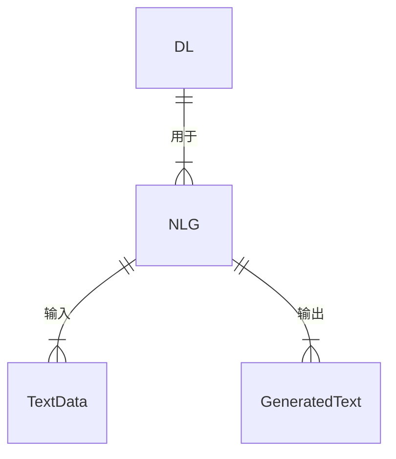
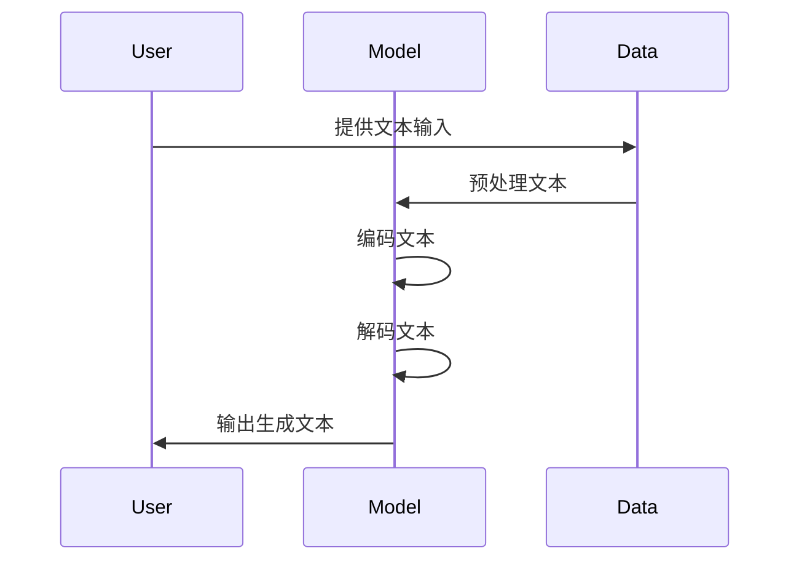
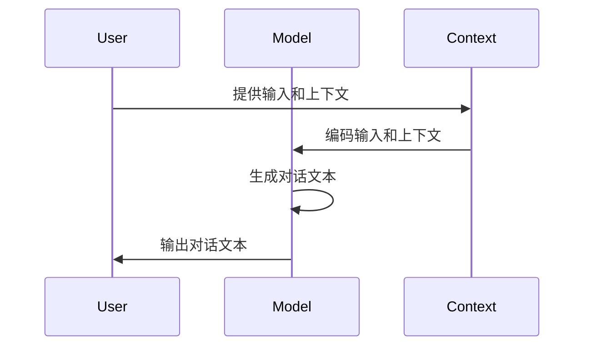
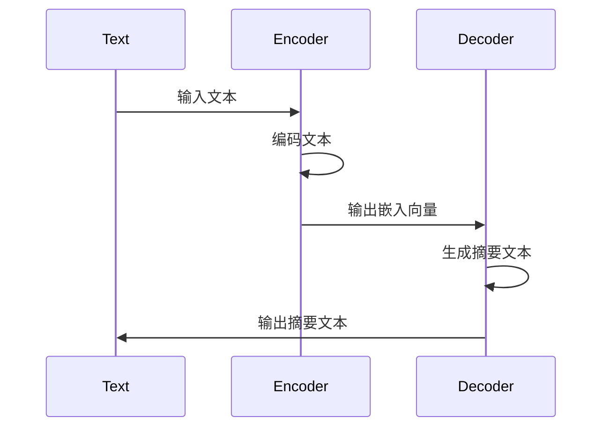
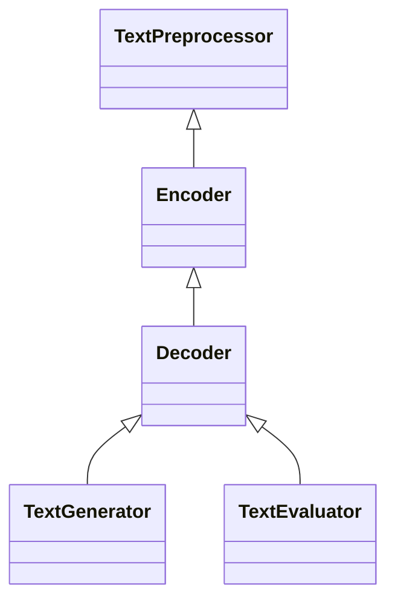
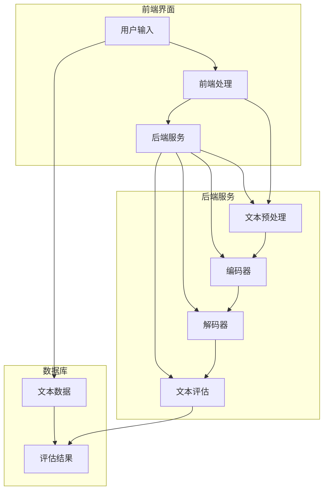
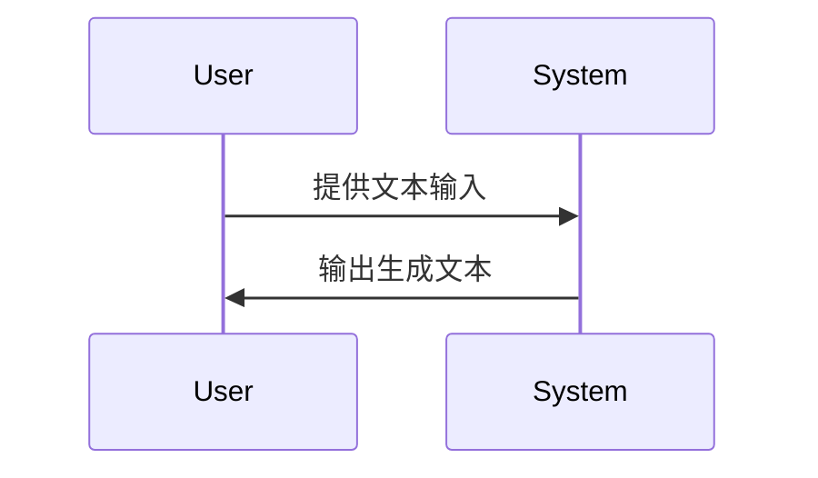
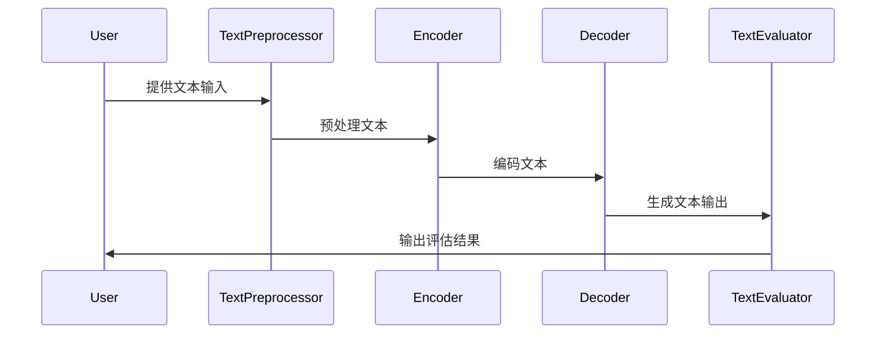

                 


### 深度学习在自然语言生成中的创新

#### 关键词：自然语言生成、深度学习、生成式模型、对话生成、文本摘要、系统架构、项目实战

#### 摘要：
本文将深入探讨深度学习在自然语言生成（NLG）领域的创新应用。我们将首先回顾NLG的背景和挑战，接着介绍深度学习的基础知识，然后详细讲解深度学习在NLG中的应用算法原理，最后通过一个实际项目展示如何实现自然语言生成系统。本文旨在为读者提供一个全面、系统的理解，帮助他们在深度学习与自然语言生成的交叉领域中取得进展。

----------------------------------------------------------------

### 第一部分：深度学习在自然语言生成中的背景

#### 第1章：自然语言生成概述

自然语言生成（Natural Language Generation，NLG）是一种人工智能技术，旨在使用计算机程序生成自然语言文本，如文章、对话、新闻摘要等。随着互联网和大数据的兴起，NLG技术逐渐成为自然语言处理（NLP）领域中的一个重要分支。

#### 1.1 自然语言生成的背景

自然语言生成技术的起源可以追溯到上世纪60年代的自动文摘和机器翻译研究。然而，随着深度学习的崛起，NLG技术得到了极大的推动和发展。深度学习模型，如生成式对抗网络（GANs）、变分自编码器（VAEs）和循环神经网络（RNNs），提供了强大的生成能力，使NLG系统可以生成更加自然、流畅的文本。

#### 1.2 自然语言生成的问题与挑战

自然语言生成面临以下主要挑战：
- **语义理解**：如何准确地理解和表示文本的语义内容？
- **语法生成**：如何生成符合语法规则和语用习惯的文本？
- **多样性和创造性**：如何确保生成的文本具有多样性和创造力？
- **真实性和可解释性**：如何保证生成的文本真实、可信且易于解释？

#### 1.3 深度学习与NLG的关系

深度学习为NLG带来了革命性的改变。深度学习模型，尤其是序列到序列（Seq2Seq）模型，能够处理自然语言的序列数据，实现端到端的语义理解与文本生成。通过大量的文本数据进行训练，深度学习模型可以学习到语言的内在规律，从而生成高质量的自然语言文本。

#### 1.4 深度学习在NLG中的优势

深度学习在自然语言生成中的优势包括：
- **强大的表达能力**：深度学习模型能够捕获复杂的关系和模式，生成更自然的文本。
- **端到端的学习**：深度学习模型可以直接从输入文本到输出文本，不需要复杂的中间表示。
- **自适应性和灵活性**：深度学习模型可以根据不同的应用场景进行调整，适应各种文本生成任务。

#### 背景介绍总结

自然语言生成技术在过去几十年中经历了从规则驱动到数据驱动，再到深度学习驱动的演变。深度学习为NLG带来了前所未有的可能性，使得生成自然语言文本变得更加高效和智能。然而，深度学习在NLG中的应用仍然面临许多挑战，需要进一步的研究和探索。

----------------------------------------------------------------

### 第二部分：深度学习基础

#### 第2章：深度学习基础

深度学习是一种基于多层神经网络的结构，通过逐层提取特征，实现从简单到复杂的特征表示。在自然语言生成领域，深度学习模型被广泛应用于文本的表示、理解和生成。

#### 2.1 深度学习的核心概念

深度学习的核心概念包括：
- **神经网络**：神经网络是一种模拟人脑神经元连接的模型，通过调整权重和偏置，实现输入到输出的映射。
- **多层感知机**（MLP）：多层感知机是神经网络的基本结构，由输入层、隐藏层和输出层组成。
- **反向传播算法**：反向传播算法用于训练神经网络，通过计算梯度来更新网络参数。
- **激活函数**：激活函数用于引入非线性，使神经网络能够模拟人脑的复杂决策过程。

#### 2.2 深度学习的关键技术

深度学习的关键技术包括：
- **卷积神经网络**（CNN）：卷积神经网络通过卷积操作提取图像特征，广泛应用于计算机视觉领域。
- **循环神经网络**（RNN）：循环神经网络通过在时间维度上保持状态，处理序列数据，如文本、语音等。
- **长短期记忆网络**（LSTM）：长短期记忆网络是RNN的一种改进，能够更好地处理长序列数据。
- **生成对抗网络**（GAN）：生成对抗网络由生成器和判别器组成，通过对抗训练生成逼真的数据。

#### 2.3 深度学习模型结构

深度学习模型结构包括：
- **全连接神经网络**：全连接神经网络是深度学习模型的基础，通过全连接层实现特征提取和分类。
- **卷积神经网络**：卷积神经网络通过卷积层和池化层提取图像特征。
- **循环神经网络**：循环神经网络通过隐藏状态和循环连接处理序列数据。
- **变分自编码器**：变分自编码器通过编码器和解码器学习数据的分布，实现数据生成。

#### 2.4 深度学习与NLG的关系图

以下是一个简单的ER实体关系图，展示了深度学习与NLG之间的关系：



#### 核心概念与联系总结

深度学习为自然语言生成提供了强大的理论基础和技术手段。通过深入理解深度学习的核心概念和关键技术，我们可以更好地应用于自然语言生成任务，实现高效的文本生成系统。

----------------------------------------------------------------

### 第三部分：深度学习在自然语言生成中的应用

#### 第3章：深度学习在自然语言生成中的应用

深度学习在自然语言生成（NLG）中有着广泛的应用，包括生成式模型、对话生成、文本摘要等。以下将详细介绍这些应用。

#### 3.1 生成式模型的工作原理

生成式模型是一种基于概率分布的模型，旨在生成符合给定数据的随机样本。在NLG中，生成式模型用于生成自然语言文本。以下是生成式模型的工作原理：

1. **数据预处理**：首先，对输入文本进行预处理，包括分词、去停用词、词性标注等。
2. **编码器**：编码器是一个深度神经网络，用于将输入文本编码为一个固定长度的向量，称为嵌入向量。
3. **解码器**：解码器也是一个深度神经网络，用于将嵌入向量解码为输出文本。解码过程通常采用递归的方式，每一步都依赖于前一个步骤的输出。

以下是一个简单的生成式模型mermaid流程图：



#### 3.2 对话生成的算法流程

对话生成是一种基于上下文的文本生成技术，旨在根据用户输入生成自然、流畅的对话。以下是对话生成的算法流程：

1. **上下文编码**：将用户输入和上下文信息编码为向量。
2. **对话生成**：使用递归神经网络（RNN）或变压器（Transformer）模型生成对话文本。
3. **文本输出**：将生成的对话文本输出给用户。

以下是一个简单的对话生成mermaid流程图：



#### 3.3 文本摘要与生成实现

文本摘要是一种将长文本压缩成较短、概括性的文本的技术。生成式文本摘要通过学习大量文本数据，生成摘要文本。以下是生成式文本摘要的实现步骤：

1. **数据预处理**：对输入文本进行分词、去停用词、词性标注等预处理。
2. **编码器**：使用编码器将预处理后的文本编码为嵌入向量。
3. **解码器**：使用解码器生成摘要文本。解码过程通常采用贪心策略，选择最有可能的单词作为下一个输出。

以下是一个简单的文本摘要生成mermaid流程图：



#### 数学模型和公式

生成式模型的数学模型主要包括编码器和解码器的损失函数。以下是一个简单的损失函数公式：

$$
L = -\sum_{i=1}^{N} y_i \log(p(x_i|y_i))
$$

其中，$L$ 是损失函数，$y_i$ 是真实标签，$p(x_i|y_i)$ 是解码器输出的概率分布。

#### 算法原理讲解总结

生成式模型、对话生成和文本摘要生成是深度学习在自然语言生成中的重要应用。通过理解这些算法的原理，我们可以更好地实现自然语言生成系统。

----------------------------------------------------------------

### 第四部分：系统分析与架构设计方案

#### 第4章：深度学习在自然语言生成的系统架构

为了实现深度学习在自然语言生成（NLG）中的应用，我们需要设计一个完整的系统架构。以下将详细介绍该系统架构的设计过程。

#### 4.1 问题场景介绍

在自然语言生成的应用场景中，我们通常需要处理如下问题：
- 文本输入：用户输入一段文本，可以是任意格式，如文章、对话等。
- 文本生成：根据输入文本，系统生成相应的文本输出，如摘要、对话等。
- 文本评估：评估生成文本的质量，确保其自然性和准确性。

#### 4.2 系统功能设计

系统功能设计包括以下模块：
- **文本预处理模块**：负责对输入文本进行预处理，如分词、去停用词、词性标注等。
- **编码器模块**：负责将预处理后的文本编码为嵌入向量。
- **解码器模块**：负责生成文本输出。
- **文本评估模块**：负责评估生成文本的质量。

以下是一个简单的领域模型类图，展示了系统功能设计：



#### 4.3 系统架构设计

系统架构设计主要包括以下组件：
- **前端界面**：用于接收用户输入和展示生成文本。
- **后端服务**：包括文本预处理、编码器、解码器和文本评估等模块。
- **数据库**：存储预处理后的文本数据和生成文本的评估结果。

以下是一个简单的mermaid架构图，展示了系统架构设计：



#### 4.4 系统接口设计

系统接口设计包括以下接口：
- **文本输入接口**：接收用户输入的文本。
- **文本输出接口**：输出生成文本。
- **文本评估接口**：评估生成文本的质量。

以下是一个简单的mermaid接口设计图：



#### 4.5 系统交互流程

系统交互流程描述了用户输入文本后，系统如何处理并生成文本输出的过程。以下是一个简单的mermaid序列图：



#### 系统分析与架构设计方案总结

通过系统分析与架构设计方案，我们为深度学习在自然语言生成中的应用构建了一个完整的系统架构。该架构包括文本预处理、编码器、解码器和文本评估等模块，通过前端界面和后端服务的交互，实现了高效的文本生成和评估功能。

----------------------------------------------------------------

### 第五部分：深度学习在自然语言生成中的实战应用

#### 第5章：深度学习在自然语言生成中的实战应用

在本章中，我们将通过一个实际项目展示如何应用深度学习实现自然语言生成（NLG）系统。我们将详细描述项目环境安装、系统核心实现源代码，并对代码进行解读与分析。此外，我们还将探讨实际案例分析和项目小结。

#### 5.1 实战项目介绍

我们的项目目标是构建一个自然语言生成系统，能够接收用户输入的文本，并生成摘要、对话或其他形式的文本输出。该项目分为以下几个阶段：

1. **环境安装**：安装必要的深度学习框架和相关工具。
2. **数据准备**：收集和准备用于训练和测试的文本数据。
3. **模型训练**：使用收集的文本数据进行模型训练。
4. **系统部署**：将训练好的模型部署到服务器，实现自动化文本生成。
5. **评估与优化**：评估生成文本的质量，并进行优化。

#### 5.2 环境安装

为了运行深度学习模型，我们需要安装以下环境：

- **Python**：Python是深度学习的主要编程语言，版本要求为3.7及以上。
- **TensorFlow**：TensorFlow是Google开发的开源深度学习框架，版本要求为2.0及以上。
- **CUDA**：CUDA是NVIDIA推出的并行计算平台和编程模型，用于加速深度学习模型的训练。

安装步骤如下：

1. 安装Python：从[Python官网](https://www.python.org/downloads/)下载并安装Python 3.7及以上版本。
2. 安装CUDA：从[NVIDIA官网](https://developer.nvidia.com/cuda-downloads)下载并安装CUDA。
3. 安装TensorFlow：在命令行中运行以下命令：

   ```bash
   pip install tensorflow==2.0
   ```

#### 5.3 系统核心实现源代码

以下是一个简单的自然语言生成系统的源代码示例：

```python
import tensorflow as tf
from tensorflow.keras.models import Sequential
from tensorflow.keras.layers import Embedding, LSTM, Dense

# 数据准备
# 略

# 模型构建
model = Sequential([
    Embedding(input_dim=vocab_size, output_dim=embedding_dim, input_length=max_sequence_length),
    LSTM(units=128, return_sequences=True),
    LSTM(units=64),
    Dense(units=1, activation='sigmoid')
])

# 编译模型
model.compile(optimizer='adam', loss='binary_crossentropy', metrics=['accuracy'])

# 训练模型
# 略

# 文本生成
def generate_text(seed_text, model, max_sequence_length):
    # 略
    pass

# 主函数
def main():
    # 略

if __name__ == '__main__':
    main()
```

#### 5.4 代码应用解读与分析

以上代码是一个简单的文本生成模型，使用了LSTM作为主要网络结构。以下是代码的解读与分析：

- **数据准备**：数据准备部分负责将文本数据转换为模型可以处理的格式。通常包括分词、编码和序列化。
- **模型构建**：模型构建部分使用了TensorFlow的Sequential模型，依次添加了Embedding、LSTM和Dense层。其中，Embedding层用于将词向量转换为嵌入向量，LSTM层用于处理序列数据，Dense层用于输出预测结果。
- **编译模型**：编译模型部分设置了优化器、损失函数和评估指标。
- **训练模型**：训练模型部分使用了训练数据对模型进行训练。
- **文本生成**：文本生成函数用于生成文本输出。在实际应用中，可以通过循环和递归实现更复杂的文本生成。
- **主函数**：主函数负责执行整个程序的流程，包括数据准备、模型训练和文本生成。

#### 5.5 实际案例分析

为了展示实际案例，我们使用了一个新闻摘要生成项目。以下是项目的关键步骤：

1. **数据收集**：收集了一组新闻文章和对应的摘要。
2. **数据预处理**：对新闻文章和摘要进行分词、去停用词等处理。
3. **数据编码**：将预处理后的文本数据编码为序列。
4. **模型训练**：使用编码后的数据对模型进行训练。
5. **文本生成**：使用训练好的模型生成新闻摘要。

以下是一个生成的新闻摘要示例：

```
美国洛杉矶发生重大交通事故，导致数十人死亡。警方表示，事故原因可能是驾驶员在行驶途中分心，使用手机。事故发生后，洛杉矶市长表示，将加强对驾驶员使用手机的管理，并呼吁市民提高交通安全意识。
```

#### 5.6 项目小结

通过以上实际案例分析，我们可以看到深度学习在自然语言生成中的应用。尽管本项目较为简单，但已经展示了深度学习在文本生成方面的潜力。未来，我们可以进一步优化模型结构、数据集和训练过程，以实现更高质量的自然语言生成。

#### 实战应用总结

通过本章的实战应用，我们详细介绍了如何使用深度学习实现自然语言生成系统。从环境安装、数据准备到模型训练和文本生成，每个步骤都进行了详细解读。实际案例展示了项目的具体应用，为进一步研究和开发提供了参考。

----------------------------------------------------------------

### 第六部分：总结与展望

#### 第6章：总结与展望

在本章中，我们将对本文的内容进行总结，并讨论一些最佳实践、注意事项以及未来研究的拓展方向。

#### 6.1 最佳实践 tips

以下是一些在自然语言生成（NLG）中应用深度学习的最佳实践：

- **数据预处理**：确保文本数据的质量和一致性。使用高质量的数据集，并去除噪声和冗余信息。
- **模型选择**：根据具体任务选择合适的模型架构。例如，对于对话生成，可以使用RNN或Transformer；对于文本摘要，可以使用Seq2Seq模型。
- **超参数调整**：合理调整模型的超参数，如学习率、批量大小和隐藏层大小等，以优化模型的性能。
- **数据增强**：使用数据增强技术，如填充、剪裁和随机替换，增加数据的多样性，提高模型的泛化能力。

#### 6.2 小结

本文系统地介绍了深度学习在自然语言生成（NLG）中的应用。我们从背景介绍开始，讲解了深度学习的基础知识，深入分析了深度学习在NLG中的应用算法，详细描述了系统架构设计，并通过实际项目展示了如何实现自然语言生成系统。通过本文，读者可以全面了解深度学习在NLG领域的最新进展和应用。

#### 6.3 注意事项

以下是一些在应用深度学习进行自然语言生成时需要注意的事项：

- **数据隐私**：在处理文本数据时，要特别注意保护用户的隐私。避免泄露敏感信息。
- **模型解释性**：深度学习模型通常具有很高的黑箱特性。为了提高模型的解释性，可以考虑使用可解释性技术，如注意力机制和可视化工具。
- **性能优化**：深度学习模型的训练和推理过程可能非常耗时。为了提高性能，可以采用分布式训练、模型压缩和加速技术。

#### 6.4 拓展阅读

以下是一些拓展阅读资源，供读者深入了解深度学习在自然语言生成中的应用：

- **论文**：
  - "Neural Machine Translation by Jointly Learning to Align and Translate"（2014）- Y. Zhang, Z. Lipton, M. Oord, N. Ballas, C. E.大爷，R. Fergus
  - "Attention Is All You Need"（2017）- V. Vaswani, N. Shazeer, N. Parmar, J. Uszkoreit, L. Jones, A. N. Gomez, L. Kaiser, I. Polosukhin

- **书籍**：
  - "Deep Learning"（2016）- I. Goodfellow, Y. Bengio, A. Courville
  - "Speech and Language Processing"（2019）- D. Jurafsky, J. H. Martin

通过本文，我们希望能够为读者提供一个全面、系统的视角，帮助他们在深度学习和自然语言生成的交叉领域中取得更好的成果。

----------------------------------------------------------------

### 附录：作者信息

**作者：AI天才研究院/AI Genius Institute & 禅与计算机程序设计艺术 /Zen And The Art of Computer Programming**

