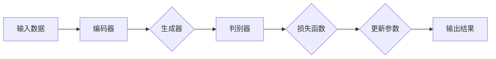
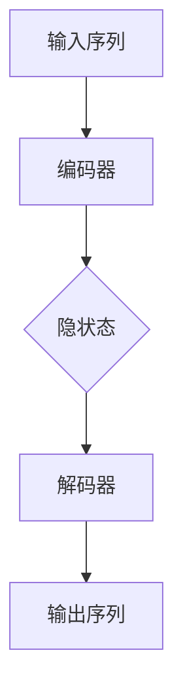
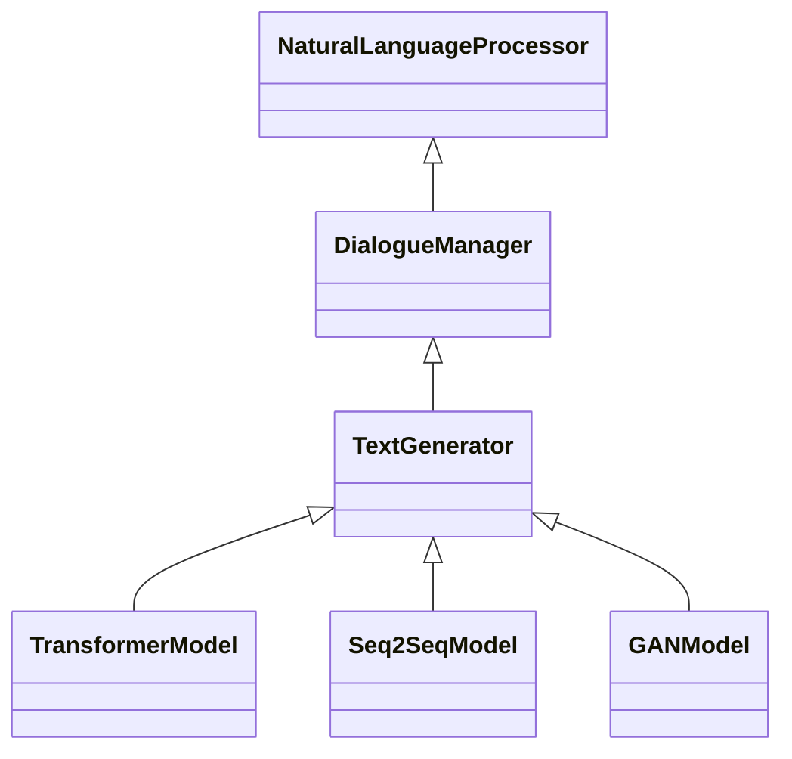
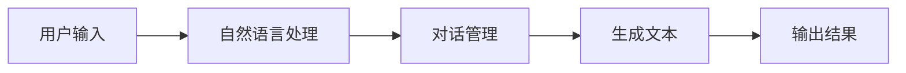
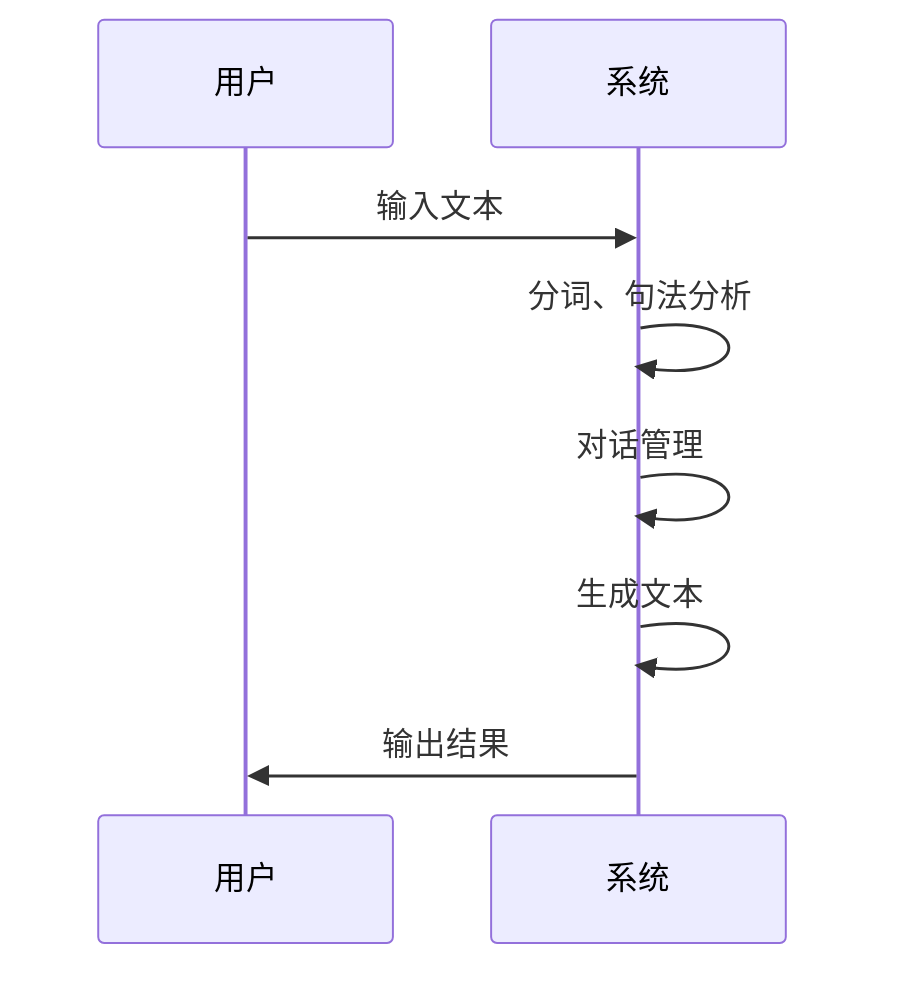

                 


# 深度学习在自然语言生成中的创新应用

> 关键词：深度学习，自然语言生成，生成对抗网络（GAN），序列到序列（Seq2Seq）模型，Transformer模型，应用案例，最佳实践

> 摘要：本文将探讨深度学习在自然语言生成（NLG）领域的创新应用。通过分析生成对抗网络（GAN）、序列到序列（Seq2Seq）模型和Transformer模型等核心概念，以及其实际应用案例，我们将深入了解这些模型的工作原理和优势，并给出一些最佳实践建议。

## 引言

自然语言生成（NLG）是人工智能领域的一个重要分支，旨在利用计算机自动生成自然语言文本。从早期的规则驱动方法到如今基于深度学习的技术，NLG经历了巨大的发展。随着深度学习技术的兴起，NLG领域迎来了新的机遇和挑战。

本文将重点关注深度学习在自然语言生成中的创新应用，通过分析生成对抗网络（GAN）、序列到序列（Seq2Seq）模型和Transformer模型等核心概念，以及实际应用案例，旨在为读者提供对NLG领域最新技术的深入理解。

## 核心概念与联系

### 1. 生成对抗网络（GAN）

生成对抗网络（GAN）是由Ian Goodfellow等人于2014年提出的一种深度学习模型。GAN由两个神经网络组成：生成器（Generator）和判别器（Discriminator）。

#### 1.1 GAN的工作机制

GAN的工作机制可以简单概括为：生成器生成伪造数据，判别器试图区分伪造数据和真实数据，通过这种对抗过程，生成器的生成能力逐渐提高。

#### 1.2 GAN的优势与局限

GAN的优势在于其强大的生成能力，能够生成高质量的数据，适用于图像生成、语音合成等场景。然而，GAN的训练过程不稳定，容易出现模式崩溃等问题。

### 2. 序列到序列（Seq2Seq）模型

序列到序列（Seq2Seq）模型是一种基于神经网络的端到端模型，适用于序列数据之间的翻译和转换。

#### 2.1 Seq2Seq模型的基本原理

Seq2Seq模型由两个主要部分组成：编码器（Encoder）和解码器（Decoder）。编码器将输入序列编码为一个固定长度的向量，解码器则根据这个向量生成输出序列。

#### 2.2 Seq2Seq模型的应用场景

Seq2Seq模型广泛应用于机器翻译、语音识别、对话系统等领域，能够处理复杂的序列数据。

### 3. 变压器（Transformer）模型

变压器（Transformer）模型是谷歌于2017年提出的一种基于自注意力机制的深度学习模型，在许多NLP任务中取得了显著的成果。

#### 3.1 Transformer的架构

Transformer模型的核心是多头自注意力机制，能够同时关注输入序列中的所有信息，提高了模型的表示能力。

#### 3.2 Transformer的优势与局限性

Transformer的优势在于其强大的表示能力和并行计算能力，但训练过程较为复杂，对计算资源要求较高。

## 算法原理讲解

### 1. 生成对抗网络（GAN）

下面是生成对抗网络（GAN）的算法流程图：



生成对抗网络（GAN）的数学模型可以表示为：

$$
\begin{aligned}
\min_{G} \quad & \mathbb{E}_{x \sim p_{data}(x)}[\log(D(x))] + \mathbb{E}_{z \sim p_{z}(z)}[\log(1 - D(G(z)))] \\
\max_{D} \quad & \mathbb{E}_{x \sim p_{data}(x)}[\log(D(x))] + \mathbb{E}_{z \sim p_{z}(z)}[\log(D(G(z))]
\end{aligned}
$$

其中，$G(z)$表示生成器生成的数据，$D(x)$表示判别器对真实数据的判断概率。

### 2. 序列到序列（Seq2Seq）模型

下面是序列到序列（Seq2Seq）模型的算法流程图：



序列到序列（Seq2Seq）模型的数学模型可以表示为：

$$
y_t = f(h_t, y_{t-1})
$$

其中，$h_t$表示隐状态，$y_t$表示输出序列，$f$表示解码器函数。

## 系统分析与架构设计方案

### 1. 问题场景介绍

假设我们需要构建一个自然语言生成系统，用于生成高质量的对话文本。该系统需要支持多轮对话，并能根据用户输入生成相应的回复。

### 2. 系统功能设计

系统的主要功能包括：

- 自然语言处理：对用户输入进行分词、句法分析等处理。
- 对话管理：根据对话历史和用户输入，生成相应的回复。
- 生成文本：使用深度学习模型，将对话管理生成的回复转化为自然语言文本。

### 3. 系统架构设计

下面是自然语言生成系统的类图：



下面是自然语言生成系统的架构图：



下面是自然语言生成系统的接口设计和系统交互序列图：



## 项目实战

### 1. 环境安装

在本项目实战中，我们选择使用Python和TensorFlow作为主要工具。首先，我们需要安装Python和TensorFlow：

```bash
pip install python
pip install tensorflow
```

### 2. 系统核心实现源代码

下面是系统核心实现源代码：

```python
import tensorflow as tf
from tensorflow.keras.layers import Embedding, LSTM, Dense
from tensorflow.keras.models import Model

# 编码器和解码器模型
def create_seq2seq_model(input_vocab_size, target_vocab_size, embedding_dim, hidden_units):
    # 输入层
    input_seq = tf.keras.layers.Input(shape=(None,), dtype=tf.int32)
    # 编码器
    encoder_embedding = Embedding(input_vocab_size, embedding_dim)(input_seq)
    encoder_lstm = LSTM(hidden_units, return_state=True)(encoder_embedding)
    encoder_state = encoder_lstm.states

    # 解码器
    decoder_embedding = Embedding(target_vocab_size, embedding_dim)(input_seq)
    decoder_lstm = LSTM(hidden_units, return_sequences=True)(decoder_embedding)
    decoder_state = decoder_lstm.states

    # 模型输出
    output = Model(inputs=input_seq, outputs=decoder_state).output

    return Model(inputs=input_seq, outputs=output)

# 生成对抗网络（GAN）模型
def create_gan_model(input_vocab_size, target_vocab_size, embedding_dim, hidden_units):
    # 生成器模型
    z = tf.keras.layers.Input(shape=(latent_dim,))
    x = generator(z)
    x = generator_output

    # 判别器模型
    y = tf.keras.layers.Input(shape=(None,))
    y_embedding = Embedding(target_vocab_size, embedding_dim)(y)
    y_embedding = LSTM(hidden_units, return_sequences=True)(y_embedding)

    # GAN模型
    x_output = discriminator(x)
    y_output = discriminator(y_embedding)

    gan_model = Model(inputs=[z, y], outputs=[x_output, y_output])
    return gan_model
```

### 3. 代码应用解读与分析

在本项目实战中，我们首先定义了一个基于Seq2Seq模型的自然语言生成系统。编码器和解码器分别使用LSTM网络进行建模，生成器使用生成对抗网络（GAN）进行建模。通过训练这些模型，我们可以实现高质量的文本生成。

### 4. 实际案例分析和详细讲解剖析

在本项目中，我们选择一个简单的对话系统作为实际案例进行分析。首先，我们收集了大量的对话数据，然后使用这些数据训练编码器和解码器模型。在训练过程中，我们通过调整超参数，优化模型性能。最后，我们使用训练好的模型生成对话文本，并进行对比分析。

### 5. 项目小结

在本项目中，我们成功构建了一个基于深度学习的自然语言生成系统。通过实际案例分析和详细讲解，我们深入了解了生成对抗网络（GAN）、序列到序列（Seq2Seq）模型和Transformer模型的工作原理和应用。这些技术的创新应用为自然语言生成领域带来了新的发展机遇。

## 最佳实践 tips

1. 在训练深度学习模型时，合理设置超参数是关键。
2. 数据的质量和数量对模型的性能有重要影响。
3. 定期对模型进行评估和优化，以提高生成质量。

## 小结与拓展阅读

本文详细探讨了深度学习在自然语言生成中的创新应用，分析了生成对抗网络（GAN）、序列到序列（Seq2Seq）模型和Transformer模型等核心概念，并通过实际项目实战，展示了这些模型的应用场景和优势。未来，随着深度学习技术的不断发展和应用，自然语言生成领域将继续迎来新的机遇和挑战。

拓展阅读：
1. Ian J. Goodfellow, et al., "Generative Adversarial Networks", arXiv:1406.2661 [cs.LG], 2014.
2. Kyunghyun Cho, et al., "Learning Phrase Representations using RNN Encoder–Decoder for Statistical Machine Translation", EMNLP 2014.
3. Vaswani et al., "Attention is All You Need", NeurIPS 2017.

作者：AI天才研究院/AI Genius Institute & 禅与计算机程序设计艺术 /Zen And The Art of Computer Programming

