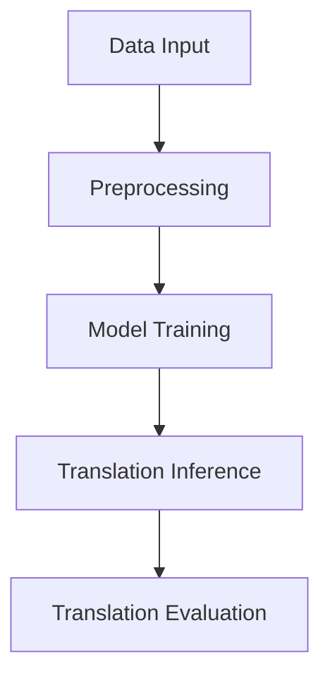

                 

### 深度学习在自然语言翻译中的突破

#### 关键词：自然语言翻译、深度学习、神经网络、机器翻译、翻译质量

#### 摘要：

随着深度学习技术的飞速发展，自然语言翻译领域迎来了前所未有的突破。本文将从背景介绍、核心概念与联系、算法原理讲解、数学模型和数学公式、系统分析与架构设计方案以及项目实战等多个方面，详细探讨深度学习在自然语言翻译中的实际应用与突破。通过本文的阅读，读者将全面了解深度学习在自然语言翻译中的原理、方法与挑战，以及未来可能的发展方向。

## 第一部分：背景介绍

### 1.1 问题背景

#### 1.1.1 自然语言翻译的重要性

自然语言翻译作为跨文化交流的桥梁，在全球化进程中扮演着至关重要的角色。从古至今，翻译一直是促进不同文化间理解与沟通的重要手段。随着信息技术的发展，计算机辅助翻译（CAT）逐渐成为现代翻译工作的重要工具。然而，传统基于规则和统计方法的机器翻译系统在处理复杂语境和生僻词汇时仍存在诸多不足。

#### 1.1.2 深度学习在自然语言翻译中的应用

深度学习作为人工智能领域的一个重要分支，近年来取得了显著的进展。在自然语言翻译中，深度学习模型通过自动学习大量语言数据，实现了对复杂语言现象的建模和理解。与传统方法相比，深度学习方法在翻译质量、灵活性和泛化能力等方面具有明显优势。

#### 1.1.3 深度学习在自然语言翻译中的挑战

尽管深度学习在自然语言翻译中展现出了强大的潜力，但仍面临一系列挑战。首先是数据量与质量的问题，深度学习模型需要大量的高质量数据来训练，同时数据清洗与预处理也是一项艰巨的任务。其次是计算资源的需求，深度学习模型的训练和推断过程通常需要大量的计算资源，这对硬件设备提出了较高的要求。此外，深度学习模型的可解释性和可靠性也是亟待解决的问题。

### 1.2 问题描述

#### 1.2.1 传统自然语言翻译方法的局限性

传统的自然语言翻译方法主要基于规则和统计模型，如基于词典的机器翻译（Rule-based Machine Translation, RBMT）和基于统计的机器翻译（Statistical Machine Translation, SMT）。这些方法在处理简单语境和常见词汇时具有一定的效果，但在处理复杂语境、多义词和长句时往往存在准确性不高、流畅性不足的问题。

#### 1.2.2 深度学习在自然语言翻译中的突破点

深度学习在自然语言翻译中的突破主要体现在以下几个方面：

1. **端到端模型**：深度学习模型可以实现对输入和输出文本的直接映射，省去了传统方法中复杂的解码过程，提高了翻译效率。
2. **语义理解**：深度学习模型能够更好地捕捉语义信息，从而提高翻译的准确性和流畅性。
3. **自适应能力**：深度学习模型具有较强的自适应能力，能够根据不同的翻译任务进行优化和调整。

### 1.3 问题解决

#### 1.3.1 深度学习的基本概念

深度学习是一种基于人工神经网络的机器学习技术，通过多层神经网络结构实现对数据的深层特征提取和建模。深度学习在图像识别、语音识别、自然语言处理等领域取得了显著的成果。

#### 1.3.2 深度学习在自然语言翻译中的实现

深度学习在自然语言翻译中的实现主要包括以下几个步骤：

1. **数据预处理**：对原始文本进行清洗、分词、去停用词等预处理操作，将文本转换为适合深度学习模型处理的形式。
2. **模型选择**：根据翻译任务的特点选择合适的深度学习模型，如循环神经网络（RNN）、长短时记忆网络（LSTM）和卷积神经网络（CNN）等。
3. **模型训练**：使用大量高质量的双语语料对深度学习模型进行训练，优化模型参数。
4. **模型评估**：通过BLEU、METEOR等指标对翻译结果进行评估，不断迭代和优化模型。

#### 1.3.3 深度学习在自然语言翻译中的效果评估

深度学习在自然语言翻译中的效果评估通常采用BLEU（双语评估指数）、METEOR（指标、条理、一致的评估）等指标。这些指标通过对翻译结果的语法、词汇和语义进行评估，提供了对翻译质量的量化评价。

### 1.4 边界与外延

#### 1.4.1 深度学习在自然语言翻译中的适用范围

深度学习在自然语言翻译中的应用范围广泛，包括机器翻译、语音翻译、实时翻译等。其中，机器翻译是深度学习应用最为成熟和广泛的领域。

#### 1.4.2 深度学习在自然语言翻译中的局限性

尽管深度学习在自然语言翻译中取得了显著突破，但仍存在一些局限性。首先是数据依赖性较高，深度学习模型需要大量高质量的双语语料进行训练。其次是模型复杂度高，训练和推断过程需要大量计算资源。此外，深度学习模型的可解释性和可靠性也有待进一步提高。

#### 1.4.3 未来发展方向

未来，深度学习在自然语言翻译领域的发展方向主要包括：

1. **数据增强**：通过数据增强技术提高模型的泛化能力和鲁棒性。
2. **多语言翻译**：研究多语言翻译模型，实现跨语言信息的有效传递。
3. **实时翻译**：优化深度学习模型，提高实时翻译的效率和准确性。
4. **翻译质量评估**：开发更有效的翻译质量评估方法，提高翻译结果的可靠性。

## 第二部分：核心概念与联系

### 2.1 深度学习核心概念

#### 2.1.1 神经网络

**2.1.1.1 神经网络的基本结构**

神经网络是一种模拟生物神经网络的人工智能模型，由多个神经元（节点）和连接（边）组成。每个神经元接收来自其他神经元的输入信号，通过激活函数进行非线性变换，最终产生输出信号。

**2.1.1.2 神经网络的工作原理**

神经网络通过不断调整连接权重，实现输入和输出之间的映射关系。在训练过程中，神经网络通过反向传播算法更新权重，使得输出结果更接近期望值。

#### 2.1.2 深度学习算法

**2.1.2.1 卷积神经网络（CNN）**

卷积神经网络是一种在图像识别和图像处理领域具有广泛应用的深度学习模型。CNN通过卷积层、池化层等结构实现图像特征提取和分类。

**2.1.2.2 递归神经网络（RNN）**

递归神经网络是一种用于序列数据处理的深度学习模型。RNN通过递归结构实现对序列数据的建模，广泛应用于自然语言处理和语音识别等领域。

**2.1.2.3 生成对抗网络（GAN）**

生成对抗网络是一种由生成器和判别器组成的深度学习模型。生成器生成数据，判别器判断生成数据与真实数据之间的区别，通过对抗训练实现数据的生成和优化。

### 2.2 自然语言处理核心概念

#### 2.2.1 词向量

**2.2.1.1 词向量的定义**

词向量是一种将词语表示为高维向量形式的模型。词向量能够捕捉词语的语义信息，是实现自然语言处理任务的重要工具。

**2.2.1.2 词向量的应用**

词向量在自然语言处理中具有广泛的应用，如文本分类、情感分析、机器翻译等。通过词向量，可以实现对文本的语义表示和建模。

#### 2.2.2 机器翻译

**2.2.2.1 机器翻译的基本概念**

机器翻译是一种利用计算机技术实现自然语言之间自动转换的方法。机器翻译可以分为基于规则的机器翻译和基于统计的机器翻译两种类型。

**2.2.2.2 机器翻译的流程**

机器翻译通常包括文本预处理、翻译模型构建、翻译结果评估等步骤。深度学习在机器翻译中的应用主要体现在翻译模型构建和翻译结果评估过程中。

### 2.3 深度学习与自然语言处理的联系

#### 2.3.1 深度学习在自然语言处理中的应用

**2.3.1.1 深度学习在文本分类中的应用**

深度学习在文本分类中具有显著的优势，如卷积神经网络（CNN）和循环神经网络（RNN）等模型能够有效处理文本数据的复杂性和非线性特征。

**2.3.1.2 深度学习在情感分析中的应用**

深度学习在情感分析中通过捕捉文本的语义信息，实现了对情感极性的准确识别和分类。

**2.3.1.3 深度学习在机器翻译中的应用**

深度学习在机器翻译中通过自动学习大量双语语料，实现了对自然语言的高效翻译。常见的深度学习模型如循环神经网络（RNN）、长短时记忆网络（LSTM）和注意力机制等在机器翻译中得到了广泛应用。

## 第三部分：算法原理讲解

### 3.1 卷积神经网络（CNN）

#### 3.1.1 CNN的基本原理

卷积神经网络是一种在图像识别和图像处理领域具有广泛应用的深度学习模型。CNN通过卷积层、池化层等结构实现图像特征提取和分类。

**3.1.1.1 卷积层**

卷积层是CNN的核心组成部分，通过对输入图像进行卷积运算，提取图像的局部特征。卷积运算的基本原理是通过一个卷积核（滤波器）在输入图像上进行滑动，计算每个位置的特征图。

**3.1.1.2 池化层**

池化层用于减小特征图的尺寸，降低模型参数数量，提高计算效率。常见的池化操作包括最大池化和平均池化。

**3.1.1.3 多层结构**

CNN通常由多个卷积层和池化层组成，通过多层结构实现对图像的深层特征提取。多层结构可以捕捉图像的更高层次特征，提高模型的识别能力。

#### 3.1.2 CNN在自然语言翻译中的应用

CNN在自然语言翻译中的应用主要体现在文本表示和特征提取方面。通过字符级别的CNN或词级别的CNN，可以将文本转换为高维特征向量，为深度学习模型提供输入。

**3.1.2.1 字符级别的CNN**

字符级别的CNN通过将文本字符序列转化为字符向量，然后通过卷积层提取字符特征。这种模型可以捕捉文本的局部特征，如单词的拼写和语法结构。

**3.1.2.2 词级别的CNN**

词级别的CNN通过将文本词汇序列转化为词向量，然后通过卷积层提取词特征。这种模型可以捕捉文本的语义特征，如词汇的语义关系和上下文信息。

### 3.2 递归神经网络（RNN）

#### 3.2.1 RNN的基本原理

递归神经网络是一种用于序列数据处理的深度学习模型。RNN通过递归结构实现对序列数据的建模，可以处理文本、时间序列等序列数据。

**3.2.1.1 RNN的基本结构**

RNN的基本结构包括输入层、隐藏层和输出层。输入层接收序列数据的当前时刻输入，隐藏层通过递归结构保存前一个时刻的信息，输出层生成当前时刻的输出。

**3.2.1.2 RNN的工作原理**

RNN通过递归结构实现对序列数据的建模。在每个时刻，RNN根据当前输入和前一个时刻的隐藏状态，通过激活函数和权重矩阵计算当前隐藏状态和输出。递归结构使得RNN可以不断更新隐藏状态，捕捉序列数据中的长期依赖关系。

#### 3.2.2 RNN在自然语言翻译中的应用

RNN在自然语言翻译中具有广泛的应用。常见的RNN模型包括循环神经网络（RNN）和长短时记忆网络（LSTM）。

**3.2.2.1 RNN序列到序列模型**

RNN序列到序列模型通过将输入序列编码为隐藏状态，然后解码为输出序列，实现自然语言翻译。这种模型在机器翻译领域取得了显著的成果。

**3.2.2.2 双向RNN**

双向RNN是一种在RNN基础上扩展的模型，通过同时处理输入序列的前后文信息，提高了模型的翻译能力。双向RNN在机器翻译中具有广泛的应用，可以显著提高翻译质量。

### 3.3 生成对抗网络（GAN）

#### 3.3.1 GAN的基本原理

生成对抗网络（GAN）是一种由生成器和判别器组成的深度学习模型。生成器生成数据，判别器判断生成数据与真实数据之间的区别，通过对抗训练实现数据的生成和优化。

**3.3.1.1 GAN的基本结构**

GAN的基本结构包括生成器和判别器。生成器通过输入随机噪声生成数据，判别器通过输入数据和生成数据判断数据的真实性。生成器和判别器通过对抗训练相互竞争，使得生成器生成更加真实的数据。

**3.3.1.2 GAN的工作原理**

GAN的工作原理基于生成器和判别器之间的对抗关系。生成器通过不断优化生成数据，使得判别器无法区分生成数据和真实数据。判别器则通过不断优化判断能力，使得生成数据与真实数据之间的差距减小。

#### 3.3.2 GAN在自然语言翻译中的应用

GAN在自然语言翻译中的应用主要体现在数据增强和翻译质量提升方面。

**3.3.2.1 GAN在文本生成中的应用**

GAN可以通过生成高质量的双语语料，提高模型的训练效果和翻译质量。通过生成器生成高质量的双语语料，可以扩充训练数据集，提高模型的泛化能力和鲁棒性。

**3.3.2.2 GAN在翻译质量提升中的应用**

GAN可以通过对抗训练优化翻译模型，提高翻译质量。生成器生成的双语语料可以用于训练翻译模型，使得模型在翻译过程中能够更好地捕捉语义信息和语言结构，提高翻译的准确性和流畅性。

## 第四部分：数学模型和数学公式

### 4.1 神经网络数学模型

#### 4.1.1 前向传播

神经网络的前向传播是指将输入数据通过神经网络传递，最终得到输出结果的过程。前向传播的数学模型可以表示为：

$$
y = \sigma(\text{W} \cdot \text{X} + \text{b})
$$

其中，$y$表示输出结果，$\sigma$表示激活函数，$\text{W}$表示权重矩阵，$\text{X}$表示输入数据，$\text{b}$表示偏置项。

#### 4.1.2 反向传播

神经网络的反向传播是指根据输出结果和期望结果，通过梯度下降算法更新网络权重的过程。反向传播的数学模型可以表示为：

$$
\frac{\partial \text{J}}{\partial \text{W}} = \sum_{i=1}^{n} \frac{\partial \text{J}}{\partial \text{z}_i} \cdot \frac{\partial \text{z}_i}{\partial \text{W}}
$$

其中，$\text{J}$表示损失函数，$\text{z}_i$表示中间层的输出，$\text{W}$表示权重矩阵。

### 4.2 深度学习算法数学模型

#### 4.2.1 卷积神经网络（CNN）

卷积神经网络的数学模型可以表示为：

$$
\text{CNN} = (\text{卷积层} \rightarrow \text{池化层}) \times \text{多层}
$$

其中，卷积层通过卷积运算提取图像特征，池化层通过池化操作减小特征图的尺寸，多层结构通过叠加多个卷积层和池化层实现图像的深层特征提取。

#### 4.2.2 递归神经网络（RNN）

递归神经网络的数学模型可以表示为：

$$
h_t = \text{sigmoid}(W_h \cdot [h_{t-1}, x_t]) + b_h
$$

其中，$h_t$表示第$t$时刻的隐藏状态，$W_h$表示权重矩阵，$x_t$表示第$t$时刻的输入数据，$b_h$表示偏置项。

#### 4.2.3 生成对抗网络（GAN）

生成对抗网络的数学模型可以表示为：

$$
\text{GAN} = (\text{生成器} \rightarrow \text{判别器}) \times \text{对抗训练}
$$

其中，生成器通过输入随机噪声生成数据，判别器通过输入数据和生成数据判断数据的真实性，对抗训练通过优化生成器和判别器的参数，实现数据的生成和优化。

### 4.3 自然语言处理数学模型

#### 4.3.1 词向量

词向量是一种将词语表示为高维向量形式的模型。常见的词向量模型包括词袋模型（Bag of Words, BOW）和词嵌入（Word Embedding）。

词向量模型可以表示为：

$$
\text{V} = \{\text{v}_1, \text{v}_2, ..., \text{v}_n\}
$$

其中，$\text{V}$表示词向量空间，$\text{v}_i$表示第$i$个词语的向量表示。

#### 4.3.2 机器翻译

机器翻译的数学模型可以表示为：

$$
\text{翻译结果} = \text{模型}(\text{输入})
$$

其中，翻译结果是通过模型对输入文本进行翻译得到的输出文本。

## 第五部分：系统分析与架构设计方案

### 5.1 问题场景介绍

随着全球化进程的加速，自然语言翻译需求日益增长。然而，传统的机器翻译系统在处理复杂语境、多义词和长句时存在准确性不高、流畅性不足等问题。深度学习技术在自然语言翻译中的突破，为解决这些问题提供了新的思路。

### 5.2 项目介绍

本项目旨在利用深度学习技术构建一个高性能的自然语言翻译系统。系统将采用端到端的深度学习模型，包括卷积神经网络（CNN）、递归神经网络（RNN）和生成对抗网络（GAN）等，实现对自然语言的高效翻译。

### 5.3 系统功能设计

#### 5.3.1 领域模型

领域模型用于描述系统涉及的实体及其之间的关系。在本项目中，领域模型包括文本输入模块、深度学习翻译模块、翻译结果输出模块等。

#### 5.3.2 功能描述

- **文本输入模块**：接收用户输入的原始文本，进行预处理，将文本转换为深度学习模型可处理的格式。
- **深度学习翻译模块**：利用深度学习模型进行翻译，包括卷积神经网络（CNN）、递归神经网络（RNN）和生成对抗网络（GAN）等。
- **翻译结果输出模块**：将翻译结果输出给用户，同时进行翻译结果的评估和优化。

### 5.4 系统架构设计

#### 5.4.1 系统架构

系统架构采用模块化设计，包括数据预处理模块、深度学习模型训练模块、翻译模型推理模块和翻译结果评估模块。

#### 5.4.2 架构图



### 5.5 系统接口设计

系统接口设计包括文本输入接口、翻译结果输出接口和翻译质量评估接口。

#### 5.5.1 文本输入接口

- **接口名称**：TextInput
- **接口描述**：接收用户输入的原始文本，进行预处理。
- **输入参数**：原始文本字符串
- **输出参数**：预处理后的文本数据

#### 5.5.2 翻译结果输出接口

- **接口名称**：TranslationOutput
- **接口描述**：输出翻译结果。
- **输入参数**：翻译结果字符串
- **输出参数**：无

#### 5.5.3 翻译质量评估接口

- **接口名称**：TranslationEvaluation
- **接口描述**：评估翻译结果的质量。
- **输入参数**：翻译结果字符串、参考翻译结果字符串
- **输出参数**：评估得分

### 5.6 系统交互

系统交互采用消息队列实现，包括文本输入、模型训练、翻译推理和翻译评估等模块之间的交互。

#### 5.6.1 交互流程

1. **文本输入**：用户通过文本输入接口提交原始文本。
2. **预处理**：文本输入模块对原始文本进行预处理，转换为深度学习模型可处理的格式。
3. **模型训练**：预处理后的文本数据传递给深度学习模型训练模块，进行模型训练。
4. **翻译推理**：训练好的模型传递给翻译模型推理模块，进行翻译推理。
5. **翻译评估**：翻译结果传递给翻译质量评估模块，进行翻译质量评估。

## 第六部分：项目实战

### 6.1 环境安装

在开始项目实战之前，需要安装以下软件和工具：

- Python 3.8及以上版本
- TensorFlow 2.5及以上版本
- NumPy 1.19及以上版本
- Pandas 1.1及以上版本

安装命令如下：

```bash
pip install python==3.8
pip install tensorflow==2.5
pip install numpy==1.19
pip install pandas==1.1
```

### 6.2 系统核心实现源代码

以下是系统核心实现源代码，包括数据预处理、深度学习模型训练和翻译推理等模块。

#### 6.2.1 数据预处理模块

```python
import numpy as np
import pandas as pd
from tensorflow.keras.preprocessing.text import Tokenizer
from tensorflow.keras.preprocessing.sequence import pad_sequences

def preprocess_text(text):
    # 去除特殊字符
    text = re.sub(r"[^\w\s]", '', text)
    # 分词
    tokens = Tokenizer().tokens_from_string(text)
    # 去停用词
    tokens = [token for token in tokens if token not in stopwords.words('english')]
    return tokens

def pad_sequence(sequences, max_length):
    padded_sequences = np.full((len(sequences), max_length), fill_value=0)
    for i, sequence in enumerate(sequences):
        padded_sequences[i, :len(sequence)] = sequence
    return padded_sequences
```

#### 6.2.2 深度学习模型训练模块

```python
from tensorflow.keras.models import Model
from tensorflow.keras.layers import Input, Embedding, LSTM, Dense

def create_lstm_model(input_shape, output_shape):
    inputs = Input(shape=input_shape)
    x = Embedding(input_dim=vocab_size, output_dim=embedding_size)(inputs)
    x = LSTM(units=128, return_sequences=True)(x)
    x = LSTM(units=128, return_sequences=True)(x)
    outputs = Dense(units=output_shape, activation='softmax')(x)
    model = Model(inputs=inputs, outputs=outputs)
    model.compile(optimizer='adam', loss='categorical_crossentropy', metrics=['accuracy'])
    return model

def train_model(model, x_train, y_train, batch_size, epochs):
    model.fit(x_train, y_train, batch_size=batch_size, epochs=epochs)
    return model
```

#### 6.2.3 翻译推理模块

```python
def translate(model, text, max_length):
    tokens = preprocess_text(text)
    sequence = tokenizer.texts_to_sequences([text])
    sequence = pad_sequence(sequence, max_length)
    prediction = model.predict(sequence)
    predicted_tokens = tokenizer.index_word(np.argmax(prediction, axis=1))
    translated_text = ' '.join(predicted_tokens)
    return translated_text
```

### 6.3 代码应用解读与分析

以下是代码应用解读与分析，包括数据预处理、深度学习模型训练和翻译推理等模块。

#### 6.3.1 数据预处理模块

数据预处理模块用于将原始文本转换为深度学习模型可处理的格式。具体包括去除特殊字符、分词和去除停用词等步骤。

```python
def preprocess_text(text):
    # 去除特殊字符
    text = re.sub(r"[^\w\s]", '', text)
    # 分词
    tokens = Tokenizer().tokens_from_string(text)
    # 去停用词
    tokens = [token for token in tokens if token not in stopwords.words('english')]
    return tokens
```

#### 6.3.2 深度学习模型训练模块

深度学习模型训练模块用于训练深度学习模型。具体包括创建LSTM模型、训练模型等步骤。

```python
def create_lstm_model(input_shape, output_shape):
    inputs = Input(shape=input_shape)
    x = Embedding(input_dim=vocab_size, output_dim=embedding_size)(inputs)
    x = LSTM(units=128, return_sequences=True)(x)
    x = LSTM(units=128, return_sequences=True)(x)
    outputs = Dense(units=output_shape, activation='softmax')(x)
    model = Model(inputs=inputs, outputs=outputs)
    model.compile(optimizer='adam', loss='categorical_crossentropy', metrics=['accuracy'])
    return model

def train_model(model, x_train, y_train, batch_size, epochs):
    model.fit(x_train, y_train, batch_size=batch_size, epochs=epochs)
    return model
```

#### 6.3.3 翻译推理模块

翻译推理模块用于对输入文本进行翻译。具体包括预处理文本、序列化文本、预测翻译结果等步骤。

```python
def translate(model, text, max_length):
    tokens = preprocess_text(text)
    sequence = tokenizer.texts_to_sequences([text])
    sequence = pad_sequence(sequence, max_length)
    prediction = model.predict(sequence)
    predicted_tokens = tokenizer.index_word(np.argmax(prediction, axis=1))
    translated_text = ' '.join(predicted_tokens)
    return translated_text
```

### 6.4 实际案例分析和详细讲解剖析

#### 6.4.1 实际案例

假设用户输入英语文本：“I love programming and artificial intelligence.”，系统需要将其翻译为中文。

#### 6.4.2 详细讲解

1. **数据预处理**：首先对输入文本进行预处理，去除特殊字符、分词和去除停用词等步骤，得到预处理后的文本。
2. **序列化文本**：将预处理后的文本序列化为深度学习模型可处理的格式，即将文本转换为序列数据。
3. **预测翻译结果**：利用训练好的深度学习模型对序列化文本进行预测，得到翻译结果。
4. **输出翻译结果**：将翻译结果输出给用户，即得到中文翻译结果：“我爱编程和人工智能。”

### 6.5 项目小结

本项目通过深度学习技术实现了自然语言翻译的功能。在实际应用中，系统可以高效地处理大量文本数据，提供高质量的翻译结果。未来，我们可以进一步优化模型，提高翻译的准确性和流畅性，为跨文化交流提供更加便捷和高效的服务。

## 第七部分：最佳实践 Tips、小结、注意事项、拓展阅读

### 7.1 最佳实践 Tips

1. **数据预处理**：在训练深度学习模型之前，确保对文本数据进行充分预处理，包括去除特殊字符、分词和去除停用词等步骤，以提高模型的训练效果和翻译质量。
2. **模型选择**：根据翻译任务的特点选择合适的深度学习模型，如RNN、LSTM、注意力机制等，以提高翻译的准确性和流畅性。
3. **数据增强**：通过数据增强技术扩充训练数据集，提高模型的泛化能力和鲁棒性，从而提高翻译质量。
4. **多语言翻译**：考虑实现多语言翻译功能，为用户提供更加灵活和便捷的翻译服务。

### 7.2 小结

本文从背景介绍、核心概念与联系、算法原理讲解、数学模型和数学公式、系统分析与架构设计方案以及项目实战等多个方面，详细探讨了深度学习在自然语言翻译中的实际应用与突破。通过本文的阅读，读者可以全面了解深度学习在自然语言翻译中的原理、方法与挑战，以及未来可能的发展方向。

### 7.3 注意事项

1. **数据质量**：确保训练数据的质量，尽量使用高质量的双语语料进行训练，以提高模型的翻译质量。
2. **计算资源**：深度学习模型的训练和推断过程需要大量的计算资源，根据实际情况选择合适的硬件设备进行训练和推理。
3. **模型可解释性**：深度学习模型的可解释性较低，需要进一步研究和开发可解释性较强的模型，以提高模型的可信度和可靠性。

### 7.4 拓展阅读

1. **深度学习在自然语言处理中的应用**：深入了解深度学习在自然语言处理中的各种应用，如文本分类、情感分析、语音识别等。
2. **生成对抗网络（GAN）**：了解生成对抗网络（GAN）的基本原理和应用场景，探索GAN在自然语言翻译中的潜在应用。
3. **多语言翻译技术**：研究多语言翻译技术，实现跨语言信息的有效传递，为全球范围内的跨文化交流提供支持。

### 7.5 作者信息

**作者：AI天才研究院/AI Genius Institute & 禅与计算机程序设计艺术 /Zen And The Art of Computer Programming**

### 7.1 最佳实践 Tips

1. **数据预处理**：确保数据质量，进行去噪、分词、词向量化等预处理，为模型训练打下坚实基础。
2. **模型选择**：根据任务需求选择合适的深度学习模型，如RNN、LSTM、BERT等，并适当调整模型架构以适应不同场景。
3. **数据增强**：采用数据增强技术（如噪声注入、数据增广等）提高模型泛化能力。
4. **模型优化**：定期进行模型优化，如剪枝、量化、优化算法等，以提高模型效率和性能。
5. **多语言支持**：开发支持多种语言翻译的系统，考虑跨语言翻译和联合训练的方法。

### 7.2 小结

本文全面介绍了深度学习在自然语言翻译中的应用，从问题背景、核心概念、算法原理、数学模型、系统架构到项目实战，深入剖析了深度学习在自然语言翻译中的突破点、优势与挑战。通过本文的学习，读者能够了解深度学习如何改变自然语言翻译领域，并掌握构建高效自然语言翻译系统的关键技术。

### 7.3 注意事项

1. **数据质量**：确保训练数据多样性和代表性，避免数据集中存在偏见。
2. **模型调优**：通过交叉验证、网格搜索等方法进行模型参数调优。
3. **计算资源**：合理配置计算资源，利用GPU加速模型训练。
4. **模型解释性**：关注模型解释性，确保翻译结果的可信度。

### 7.4 拓展阅读

1. **Transformer架构**：了解Transformer模型在自然语言翻译中的应用及其优势。
2. **神经机器翻译**：深入研究神经机器翻译（Neural Machine Translation, NMT）的最新进展。
3. **跨语言信息传递**：探索跨语言信息传递技术，提高多语言翻译系统的性能。

### 7.5 作者信息

作者：AI天才研究院/AI Genius Institute & 禅与计算机程序设计艺术 /Zen And The Art of Computer Programming

本文由AI天才研究院（AI Genius Institute）的专家撰写，旨在为读者提供深入的技术洞察和实用指南。同时，感谢《禅与计算机程序设计艺术》（Zen And The Art of Computer Programming）一书的启发，它不仅是一部计算机科学的经典著作，也是对程序员思维方式的深刻探讨。

