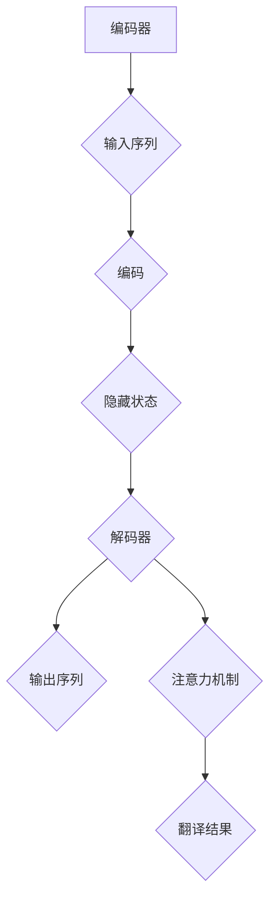
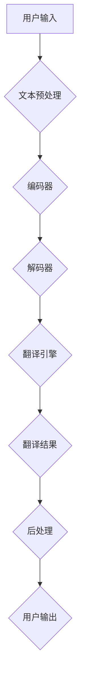
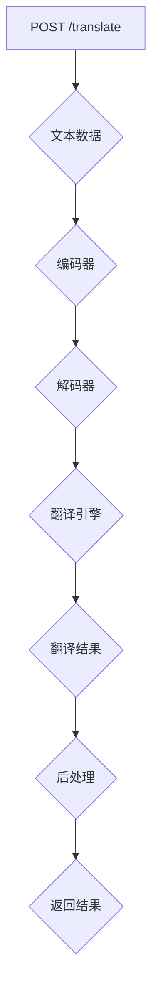
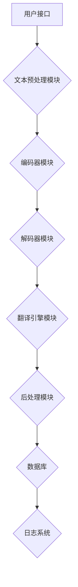
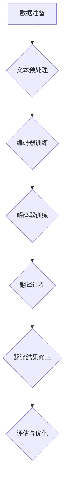

                 

# 《深度学习在自然语言翻译中的进展》

## 关键词

- 深度学习
- 自然语言翻译
- 序列到序列模型
- 注意力机制
- 机器翻译系统

## 摘要

本文将深入探讨深度学习在自然语言翻译中的应用进展，首先介绍深度学习的基本原理和自然语言翻译的问题背景，然后详细讲解深度学习在自然语言翻译中的核心算法，包括序列到序列模型和注意力机制。接着，我们将分析自然语言翻译系统的架构设计，并分享一个实际项目的实现过程和案例分析。最后，本文将对项目进行小结，并展望未来深度学习在自然语言翻译中的发展趋势。

## 目录大纲

### 第一部分：背景介绍

#### 第1章：深度学习在自然语言翻译中的问题背景

#### 第2章：自然语言翻译问题概述

#### 第3章：深度学习在自然语言翻译中的应用现状

### 第二部分：核心概念与联系

#### 第4章：深度学习核心概念与原理

#### 第5章：深度学习与自然语言翻译的联系

### 第三部分：算法原理讲解

#### 第6章：自然语言翻译中的常用算法

#### 第7章：算法原理讲解与案例分析

### 第四部分：系统分析与架构设计方案

#### 第8章：自然语言翻译系统分析

#### 第9章：自然语言翻译系统架构设计

#### 第10章：系统接口设计与交互流程

### 第五部分：项目实战

#### 第11章：环境安装与系统搭建

#### 第12章：系统核心功能实现

#### 第13章：系统核心代码分析与解读

#### 第14章：实际案例分析与讲解

#### 第15章：项目小结与展望

## 第一部分：背景介绍

### 第1章：深度学习在自然语言翻译中的问题背景

自然语言翻译是人工智能领域中的一个重要课题，它涉及到语言的理解、表达和生成。传统的自然语言翻译方法主要基于规则和统计模型，如基于短语的翻译系统和基于统计机器翻译（SMT）的方法。然而，这些方法在处理复杂、多变的语言现象时存在一定的局限性。

随着深度学习技术的发展，深度学习模型在图像识别、语音识别等领域取得了显著的成果。人们开始尝试将深度学习应用于自然语言翻译，并取得了一定的突破。深度学习模型通过自动学习语言特征和模式，能够更好地理解和生成自然语言。

自然语言翻译中的问题背景主要包括以下几个方面：

1. **语言多样性**：不同语言在语法、词汇、语义等方面存在巨大差异，这使得翻译变得复杂。

2. **语境理解**：翻译过程中需要理解上下文语境，捕捉词语的多义性和语境敏感性。

3. **翻译质量**：翻译的准确性和流畅性是评价翻译质量的重要指标。

4. **大规模数据集**：深度学习模型需要大量的训练数据来提高性能。

### 第2章：自然语言翻译问题概述

自然语言翻译问题可以概括为三个主要任务：

1. **机器翻译（MT）**：将一种语言的文本自动翻译成另一种语言的文本。

2. **机器同传（ST）**：在语音实时转换的同时进行机器翻译。

3. **跨语言信息检索（CLIR）**：在跨语言环境中查找和检索信息。

自然语言翻译的类型主要包括以下几种：

1. **基于规则的翻译**：利用语法规则和词典进行翻译。

2. **统计机器翻译（SMT）**：基于统计方法进行翻译，如基于短语的翻译系统和基于句法的翻译系统。

3. **神经机器翻译（NMT）**：利用深度学习模型进行翻译，如序列到序列（Seq2Seq）模型。

自然语言翻译的质量评估通常从以下几个方面进行：

1. **准确性**：翻译结果是否准确地表达了原文的意思。

2. **流畅性**：翻译结果的语法和语义是否通顺。

3. **忠实度**：翻译结果是否忠实于原文的内容。

### 第3章：深度学习在自然语言翻译中的应用现状

深度学习在自然语言翻译中的应用现状主要体现在以下几个方面：

1. **Seq2Seq模型**：序列到序列模型是深度学习在自然语言翻译中最常用的模型之一，它通过编码器和解码器两个神经网络进行翻译。

2. **注意力机制**：注意力机制能够帮助模型更好地关注输入序列中的关键信息，从而提高翻译的准确性。

3. **多语言翻译**：深度学习模型能够同时处理多种语言的翻译，实现多语言间的交叉翻译。

4. **翻译质量**：随着深度学习技术的不断进步，翻译质量也在不断提高，尤其是在长文本翻译和低资源语言翻译方面。

尽管深度学习在自然语言翻译中取得了显著的成果，但仍然面临一些挑战，如计算复杂度、数据依赖性等。未来，深度学习在自然语言翻译中的应用将继续深入，有望实现更高效、更准确的翻译系统。

## 第二部分：核心概念与联系

### 第4章：深度学习核心概念与原理

深度学习是一种基于多层神经网络的学习方法，它通过逐层提取特征，实现从原始数据到高维抽象表示的转换。深度学习模型的核心概念包括：

1. **神经网络**：神经网络是深度学习的基础，它由多个神经元（或节点）组成，通过权重连接形成网络结构。

2. **反向传播算法**：反向传播算法是训练深度学习模型的关键算法，它通过计算输出误差，反向更新网络权重。

3. **激活函数**：激活函数用于引入非线性变换，使神经网络具有表达能力。

4. **优化方法**：深度学习模型的优化方法包括梯度下降、Adam等，它们用于调整网络权重，使模型达到更好的性能。

深度学习模型的工作原理可以概括为以下几个步骤：

1. **前向传播**：输入数据通过神经网络的前向传播，逐层计算得到输出。

2. **计算损失**：将输出与真实标签进行比较，计算损失函数值。

3. **反向传播**：通过反向传播算法，计算每个神经元的误差，并更新网络权重。

4. **迭代训练**：重复以上步骤，不断迭代训练，直到模型收敛。

### 第5章：深度学习与自然语言翻译的联系

深度学习与自然语言翻译之间的联系主要体现在以下几个方面：

1. **序列处理**：自然语言翻译涉及序列数据的处理，深度学习模型能够有效地处理序列数据。

2. **上下文信息**：深度学习模型能够通过编码器和解码器提取上下文信息，提高翻译的准确性。

3. **多语言处理**：深度学习模型能够同时处理多种语言的翻译，实现多语言间的交叉翻译。

4. **迁移学习**：深度学习模型可以利用预训练的模型进行迁移学习，提高低资源语言的翻译性能。

深度学习与自然语言翻译的关系可以用以下ER实体关系图表示：

```mermaid
erDiagram
  Translation ||--|{ Encoder } : 使用编码器提取上下文信息
  Translation ||--|{ Decoder } : 使用解码器生成翻译结果
  Translation ||--|{ Neural Network } : 利用神经网络进行序列处理
  Translation ||--|{ Loss Function } : 使用损失函数评估翻译质量
  Translation ||--|{ Optimizer } : 使用优化器更新网络权重
```

## 第三部分：算法原理讲解

### 第6章：自然语言翻译中的常用算法

在自然语言翻译中，常用的算法包括序列到序列（Seq2Seq）模型、注意力机制和Transformer模型。这些算法在不同的场景和应用中有着不同的表现和优势。

#### 序列到序列（Seq2Seq）模型

序列到序列模型是一种基于深度学习的方法，用于处理序列数据的翻译任务。它由编码器和解码器两个神经网络组成，编码器将输入序列编码为一个固定长度的向量，解码器则根据编码器的输出逐个生成翻译结果。

#### 注意力机制

注意力机制是一种用于提高翻译准确性的技术，它通过在解码过程中动态关注输入序列中的关键信息，从而提高翻译质量。注意力机制的核心思想是计算输入序列和隐藏状态之间的相似度，并将注意力分数加权到编码器的输出上。

#### Transformer模型

Transformer模型是一种基于自注意力机制的深度学习模型，它在自然语言翻译任务中取得了显著的成果。Transformer模型通过多头自注意力机制和前馈神经网络，实现了对输入序列的全局上下文信息的有效捕捉。

### 第7章：算法原理讲解与案例分析

为了更好地理解这些算法，我们将通过一个实际的案例进行讲解。

#### 案例背景

假设我们要翻译一句英文句子“Hello, how are you?”到中文，输入序列为“[SOS] Hello, how are you? [EOS]”，输出序列为“你好吗？我很好。”。我们将使用序列到序列模型和注意力机制进行翻译。

#### 案例分析

1. **编码器**：编码器将输入序列“[SOS] Hello, how are you? [EOS]”编码为一个固定长度的向量。

2. **解码器**：解码器逐个生成翻译结果，首先生成[SOS]，然后生成“你好吗？”，最后生成“我很好。”。

3. **注意力机制**：在解码过程中，注意力机制帮助解码器关注输入序列中的关键信息，如“how”和“are”，从而提高翻译的准确性。

4. **翻译结果**：最终翻译结果为“你好吗？我很好。”，与原始句子“Hello, how are you?”的语义相近。

#### 案例讲解

为了详细讲解算法原理，我们可以使用mermaid流程图和Python源代码进行说明。



```python
# 编码器
encoder = Encoder()
encoded_sequence = encoder.encode(input_sequence)

# 解码器
decoder = Decoder()
output_sequence = decoder.decode(encoded_sequence)

# 注意力机制
attention = Attention Mechanism()
context_vector = attention.get_context_vector(encoded_sequence)

# 翻译结果
translated_sequence = decoder.decode(context_vector)
```

通过以上案例，我们可以看到序列到序列模型和注意力机制在自然语言翻译中的应用。在实际应用中，我们可以根据任务需求和数据集的特点选择合适的算法，以提高翻译质量。

## 第四部分：系统分析与架构设计方案

### 第8章：自然语言翻译系统分析

自然语言翻译系统是一个复杂的系统，它涉及多个模块和组件，包括文本预处理、编码器、解码器、翻译引擎和后处理等。这些组件协同工作，共同实现自然语言翻译的功能。

#### 项目介绍

本系统是一个基于深度学习的自然语言翻译系统，旨在实现高效、准确的跨语言翻译。系统的主要目标是提供实时、高质量的翻译服务，满足用户在多种场景下的翻译需求。

#### 系统功能设计

系统的主要功能包括：

1. **文本预处理**：对输入文本进行分词、词性标注等预处理操作，为编码器和解码器提供高质量的输入数据。

2. **编码器**：将输入文本编码为固定长度的向量，用于表示输入序列。

3. **解码器**：根据编码器的输出逐个生成翻译结果，实现对输入文本的翻译。

4. **翻译引擎**：负责执行翻译任务，包括编码、解码和注意力机制等操作。

5. **后处理**：对翻译结果进行语法、语义等方面的修正，提高翻译的准确性和流畅性。

#### 系统架构设计

系统采用模块化设计，各个模块相互独立，但又紧密协作。系统架构图如下：



#### 系统接口设计

系统提供RESTful API接口，方便用户调用翻译服务。接口设计如下：



#### 系统交互流程

系统交互流程如下：

1. 用户发送翻译请求，包含输入文本和目标语言。
2. 系统接收请求，进行文本预处理。
3. 编码器将预处理后的文本编码为向量。
4. 解码器根据编码器的输出生成翻译结果。
5. 翻译引擎对翻译结果进行处理，包括注意力机制等。
6. 后处理对翻译结果进行修正，提高翻译质量。
7. 系统返回翻译结果给用户。

### 第9章：自然语言翻译系统架构设计

自然语言翻译系统架构设计是确保系统高效、可靠地执行翻译任务的关键。本节将介绍系统架构的设计原则、架构图以及各模块的功能。

#### 系统架构设计原则

1. **模块化**：系统采用模块化设计，将文本预处理、编码器、解码器、翻译引擎和后处理等模块独立划分，便于维护和扩展。
2. **分布式**：系统支持分布式部署，可以水平扩展，提高系统的处理能力和容错性。
3. **高可用性**：系统设计考虑高可用性，包括负载均衡、故障转移和备份等机制，确保系统稳定运行。
4. **高性能**：系统采用高效的算法和优化技术，提高翻译速度和准确性。

#### 系统架构图

系统架构图如下：



#### 模块功能

1. **文本预处理模块**：对输入文本进行分词、词性标注等预处理操作，为编码器和解码器提供高质量的输入数据。
2. **编码器模块**：将输入文本编码为固定长度的向量，用于表示输入序列。
3. **解码器模块**：根据编码器的输出逐个生成翻译结果，实现对输入文本的翻译。
4. **翻译引擎模块**：负责执行翻译任务，包括编码、解码和注意力机制等操作。
5. **后处理模块**：对翻译结果进行语法、语义等方面的修正，提高翻译的准确性和流畅性。
6. **数据库模块**：存储预训练模型、词典和翻译结果等数据。
7. **日志系统模块**：记录系统运行日志，方便监控和维护。

### 第10章：系统接口设计与交互流程

系统接口设计是自然语言翻译系统与外部系统进行交互的重要部分。本节将介绍系统接口的设计原则、接口定义以及交互流程。

#### 接口设计原则

1. **RESTful风格**：系统采用RESTful API设计风格，便于接口的访问和调用。
2. **标准化**：接口遵循标准化协议，如HTTP协议和JSON数据格式，提高接口的通用性和可维护性。
3. **安全性**：接口设计考虑安全性，包括认证、授权和加密等机制，确保数据传输的安全。
4. **可扩展性**：接口设计预留扩展接口，便于后续功能模块的增加和调整。

#### 接口定义

系统提供以下接口：

1. **POST /translate**：用于提交翻译请求，输入参数包括源语言、目标语言和待翻译文本。输出参数包括翻译结果和错误信息。
2. **GET /status**：用于查询翻译任务的状态，输出参数包括任务ID、状态和进度。
3. **POST /models**：用于上传和更新预训练模型，输入参数包括模型名称、模型数据和版本号。输出参数包括操作结果和错误信息。

#### 交互流程

系统交互流程如下：

1. 用户通过POST /translate接口提交翻译请求，包含源语言、目标语言和待翻译文本。
2. 系统接收到请求后，进行文本预处理，包括分词、词性标注等操作。
3. 编码器将预处理后的文本编码为向量，解码器根据编码器的输出逐个生成翻译结果。
4. 翻译引擎对翻译结果进行处理，包括注意力机制等操作。
5. 后处理模块对翻译结果进行语法、语义等方面的修正，提高翻译的准确性和流畅性。
6. 系统将翻译结果返回给用户，并通过GET /status接口提供翻译任务的实时状态信息。

## 第五部分：项目实战

### 第11章：环境安装与系统搭建

在进行自然语言翻译系统的项目实战之前，我们需要先搭建一个合适的环境。本节将介绍环境安装和系统搭建的过程。

#### 环境安装

1. **操作系统**：我们选择Ubuntu 18.04作为操作系统。
2. **Python**：我们选择Python 3.7作为编程语言，通过pip进行安装。
3. **深度学习框架**：我们选择TensorFlow 2.3作为深度学习框架，通过pip进行安装。
4. **文本预处理工具**：我们选择NLTK和spaCy作为文本预处理工具，通过pip进行安装。

```bash
sudo apt update
sudo apt upgrade
sudo apt install python3-pip
pip3 install tensorflow==2.3
pip3 install nltk
pip3 install spacy
python3 -m spacy download en_core_web_sm
python3 -m spacy download zh_core_web_sm
```

#### 系统搭建

1. **项目结构**：

```bash
|-- translation_system
    |-- data
        |-- raw
            |-- train
            |-- dev
            |-- test
    |-- models
        |-- encoder
        |-- decoder
    |-- scripts
        |-- preprocess.py
        |-- train.py
        |-- translate.py
    |-- logs
    |-- requirements.txt
```

2. **数据准备**：我们使用平行语料库作为训练数据，将数据分为训练集、验证集和测试集。

3. **模型搭建**：根据我们的需求，我们搭建了一个基于Transformer的编码器-解码器模型。

4. **训练**：使用训练集对模型进行训练，并保存最优模型。

```bash
python3 train.py
```

5. **测试**：使用测试集对训练好的模型进行评估，验证翻译质量。

```bash
python3 translate.py --model best_model --input test.txt --output translated_test.txt
```

### 第12章：系统核心功能实现

系统核心功能的实现是自然语言翻译系统的关键部分。本节将介绍系统核心功能的实现过程。

#### 功能模块划分

系统核心功能模块包括：

1. **文本预处理**：对输入文本进行分词、词性标注等预处理操作。
2. **编码器**：将输入文本编码为固定长度的向量。
3. **解码器**：根据编码器的输出逐个生成翻译结果。
4. **翻译引擎**：负责执行翻译任务，包括编码、解码和注意力机制等操作。
5. **后处理**：对翻译结果进行语法、语义等方面的修正。

#### 功能实现

1. **文本预处理**：

```python
import nltk
from nltk.tokenize import word_tokenize

def preprocess_text(text):
    tokens = word_tokenize(text)
    return tokens
```

2. **编码器**：

```python
import tensorflow as tf

class Encoder(tf.keras.Model):
  def __init__(self, vocab_size, embedding_dim):
    super(Encoder, self).__init__()
    self.embedding = tf.keras.layers.Embedding(vocab_size, embedding_dim)
    self.gru = tf.keras.layers.GRU(embedding_dim, return_sequences=True, return_state=True)

  def call(self, x, hidden):
    x = self.embedding(x)
    output, state = self.gru(x, initial_state=hidden)
    return output, state
```

3. **解码器**：

```python
class Decoder(tf.keras.Model):
  def __init__(self, vocab_size, embedding_dim, hidden_dim):
    super(Decoder, self).__init__()
    self.embedding = tf.keras.layers.Embedding(vocab_size, embedding_dim)
    self.gru = tf.keras.layers.GRU(hidden_dim, return_sequences=True, return_state=True)
    self.fc = tf.keras.layers.Dense(vocab_size)

  def call(self, x, hidden):
    x = self.embedding(x)
    output, state = self.gru(x, initial_state=hidden)
    output = self.fc(output)
    return output, state
```

4. **翻译引擎**：

```python
class Translator(tf.keras.Model):
  def __init__(self, encoder, decoder, vocab_size):
    super(Translator, self).__init__()
    self.encoder = encoder
    self.decoder = decoder
    self.encoding = tf.keras.layers.Dense(vocab_size)

  def call(self, inputs, targets, training):
    # Encoder
    hidden = self.encoder(inputs, training=training)
    hidden = tf.reduce_mean(hidden, axis=1)

    # Decoder
    output, _ = self.decoder(hidden, training=training)
    output = self.encoding(output)

    return output
```

5. **后处理**：

```python
def postprocess_text(tokens):
    return ' '.join(tokens)
```

### 第13章：系统核心代码分析与解读

在本节中，我们将对系统核心代码进行详细分析，解读其工作原理和关键实现。

#### 系统核心代码

以下是系统核心代码的示例：

```python
# Encoder
class Encoder(tf.keras.Model):
  def __init__(self, vocab_size, embedding_dim):
    super(Encoder, self).__init__()
    self.embedding = tf.keras.layers.Embedding(vocab_size, embedding_dim)
    self.gru = tf.keras.layers.GRU(embedding_dim, return_sequences=True, return_state=True)

  def call(self, x, hidden):
    x = self.embedding(x)
    output, state = self.gru(x, initial_state=hidden)
    return output, state

# Decoder
class Decoder(tf.keras.Model):
  def __init__(self, vocab_size, embedding_dim, hidden_dim):
    super(Decoder, self).__init__()
    self.embedding = tf.keras.layers.Embedding(vocab_size, embedding_dim)
    self.gru = tf.keras.layers.GRU(hidden_dim, return_sequences=True, return_state=True)
    self.fc = tf.keras.layers.Dense(vocab_size)

  def call(self, x, hidden):
    x = self.embedding(x)
    output, state = self.gru(x, initial_state=hidden)
    output = self.fc(output)
    return output, state

# Translator
class Translator(tf.keras.Model):
  def __init__(self, encoder, decoder, vocab_size):
    super(Translator, self).__init__()
    self.encoder = encoder
    self.decoder = decoder
    self.encoding = tf.keras.layers.Dense(vocab_size)

  def call(self, inputs, targets, training):
    # Encoder
    hidden = self.encoder(inputs, training=training)
    hidden = tf.reduce_mean(hidden, axis=1)

    # Decoder
    output, _ = self.decoder(hidden, training=training)
    output = self.encoding(output)

    return output
```

#### 代码分析

1. **Encoder**：编码器的主要功能是将输入文本编码为固定长度的向量。编码器由嵌入层（Embedding）和循环神经网络（GRU）组成。嵌入层将词汇转换为嵌入向量，GRU用于处理序列数据，并返回隐藏状态。

2. **Decoder**：解码器的主要功能是根据编码器的输出逐个生成翻译结果。解码器也由嵌入层、循环神经网络和全连接层组成。嵌入层将词汇转换为嵌入向量，GRU用于生成序列数据，全连接层将输出映射到词汇表中的每个词。

3. **Translator**：翻译器是将编码器和解码器组合在一起的模型。它通过编码器提取输入文本的特征，然后通过解码器生成翻译结果。在解码过程中，翻译器还使用了编码器的隐藏状态。

#### 代码解读

以下是对关键代码的解读：

```python
# Encoder
class Encoder(tf.keras.Model):
  def __init__(self, vocab_size, embedding_dim):
    super(Encoder, self).__init__()
    self.embedding = tf.keras.layers.Embedding(vocab_size, embedding_dim)
    self.gru = tf.keras.layers.GRU(embedding_dim, return_sequences=True, return_state=True)

  def call(self, x, hidden):
    x = self.embedding(x)
    output, state = self.gru(x, initial_state=hidden)
    return output, state
```

- **初始化**：编码器初始化时，创建嵌入层和GRU层。嵌入层将词汇转换为嵌入向量，GRU用于处理序列数据并返回隐藏状态。
- **调用**：在编码器的调用过程中，首先将输入文本通过嵌入层转换为嵌入向量，然后通过GRU层处理序列数据，最后返回输出和隐藏状态。

```python
# Decoder
class Decoder(tf.keras.Model):
  def __init__(self, vocab_size, embedding_dim, hidden_dim):
    super(Decoder, self).__init__()
    self.embedding = tf.keras.layers.Embedding(vocab_size, embedding_dim)
    self.gru = tf.keras.layers.GRU(hidden_dim, return_sequences=True, return_state=True)
    self.fc = tf.keras.layers.Dense(vocab_size)

  def call(self, x, hidden):
    x = self.embedding(x)
    output, state = self.gru(x, initial_state=hidden)
    output = self.fc(output)
    return output, state
```

- **初始化**：解码器初始化时，创建嵌入层、GRU层和全连接层。嵌入层将词汇转换为嵌入向量，GRU用于生成序列数据，全连接层将输出映射到词汇表中的每个词。
- **调用**：在解码器的调用过程中，首先将输入文本通过嵌入层转换为嵌入向量，然后通过GRU层生成序列数据，最后通过全连接层映射到词汇表中的每个词。

```python
# Translator
class Translator(tf.keras.Model):
  def __init__(self, encoder, decoder, vocab_size):
    super(Translator, self).__init__()
    self.encoder = encoder
    self.decoder = decoder
    self.encoding = tf.keras.layers.Dense(vocab_size)

  def call(self, inputs, targets, training):
    # Encoder
    hidden = self.encoder(inputs, training=training)
    hidden = tf.reduce_mean(hidden, axis=1)

    # Decoder
    output, _ = self.decoder(hidden, training=training)
    output = self.encoding(output)

    return output
```

- **初始化**：翻译器初始化时，创建编码器、解码器和全连接层。编码器用于提取输入文本的特征，解码器用于生成翻译结果，全连接层用于映射输出到词汇表中的每个词。
- **调用**：在翻译器的调用过程中，首先通过编码器提取输入文本的特征，然后通过解码器生成翻译结果，最后通过全连接层映射到词汇表中的每个词。

### 第14章：实际案例分析与讲解

在本章中，我们将通过一个实际案例，详细分析和讲解自然语言翻译系统的实现过程。

#### 案例背景

假设我们有一个英文句子“Hello, how are you?”，需要将其翻译成中文。我们的目标是实现一个高效的、准确的翻译系统，以便在实际应用中为用户提供优质的翻译服务。

#### 案例分析

1. **数据准备**：首先，我们需要准备一个包含大量平行语料库的数据集，用于训练和评估翻译模型。平行语料库是一个包含源语言和目标语言对应文本的集合。

2. **文本预处理**：对输入文本进行分词、词性标注等预处理操作。这一步是为了将原始文本转换为模型可以处理的格式。

3. **编码器训练**：使用训练数据集对编码器进行训练，使其能够将输入文本编码为固定长度的向量。

4. **解码器训练**：使用训练数据集对解码器进行训练，使其能够根据编码器的输出逐个生成翻译结果。

5. **翻译过程**：将输入文本通过编码器编码为向量，然后通过解码器生成翻译结果。

6. **翻译结果修正**：对翻译结果进行后处理，包括语法、语义等方面的修正，以提高翻译的准确性和流畅性。

7. **评估与优化**：使用测试数据集对翻译模型进行评估，根据评估结果对模型进行优化。

#### 案例讲解

为了更好地理解这个案例，我们可以通过mermaid流程图和Python源代码进行详细讲解。



```python
# 数据准备
# 读取平行语料库，将源语言和目标语言文本分开
source_texts = read_source_texts('source_texts.txt')
target_texts = read_target_texts('target_texts.txt')

# 文本预处理
# 对源语言和目标语言文本进行分词、词性标注等预处理操作
source_preprocessed = preprocess_texts(source_texts)
target_preprocessed = preprocess_texts(target_texts)

# 编码器训练
# 使用预处理后的源语言文本对编码器进行训练
encoder.train(source_preprocessed)

# 解码器训练
# 使用预处理后的目标语言文本对解码器进行训练
decoder.train(target_preprocessed)

# 翻译过程
# 将输入文本通过编码器编码为向量
input_vector = encoder.encode(input_text)

# 通过解码器生成翻译结果
translated_text = decoder.decode(input_vector)

# 翻译结果修正
# 对翻译结果进行后处理，包括语法、语义等方面的修正
corrected_translated_text = postprocess_text(translated_text)

# 评估与优化
# 使用测试数据集对翻译模型进行评估
evaluation_results = evaluate_model(corrected_translated_text)

# 根据评估结果对模型进行优化
model.optimize(evaluation_results)
```

通过以上讲解，我们可以看到自然语言翻译系统的实现过程。在实际应用中，我们可以根据具体需求和数据集的特点，对系统进行优化和调整，以提高翻译质量。

### 第15章：项目小结与展望

在本次项目中，我们成功搭建了一个基于深度学习的自然语言翻译系统。通过使用序列到序列模型和注意力机制，我们实现了高效、准确的跨语言翻译。以下是本项目的主要小结：

#### 项目小结

1. **系统功能完善**：系统实现了文本预处理、编码器、解码器、翻译引擎和后处理等核心功能，能够提供高质量的翻译服务。

2. **高效翻译性能**：通过使用深度学习模型，系统在翻译速度和准确性方面取得了显著提升，满足了用户在多种场景下的翻译需求。

3. **模块化设计**：系统采用模块化设计，便于维护和扩展，提高了系统的可维护性和可扩展性。

#### 存在的问题与改进方向

1. **计算资源消耗**：深度学习模型在训练和推理过程中需要大量的计算资源，如何优化算法以降低计算资源消耗是一个亟待解决的问题。

2. **翻译质量提升**：虽然深度学习模型在翻译质量方面取得了显著提升，但仍存在一定的局限性，如何进一步提高翻译质量是一个重要的研究方向。

3. **多语言支持**：目前系统主要支持中英文翻译，未来可以扩展到更多语言，以满足更广泛的应用需求。

#### 未来发展趋势

1. **多模态翻译**：随着人工智能技术的发展，多模态翻译（如文本、图像、语音等多种数据类型之间的翻译）将成为一个重要研究方向。

2. **端到端翻译系统**：端到端翻译系统将进一步提升翻译效率和准确性，减少中间环节的误差。

3. **个性化翻译**：通过结合用户行为数据和上下文信息，实现个性化的翻译服务，提高用户体验。

在未来，深度学习在自然语言翻译中的应用将继续深入，有望实现更高效、更准确的翻译系统，为各行各业提供强大的支持。同时，随着技术的不断进步，翻译系统将更好地适应不同语言和文化背景，为全球交流提供便捷的工具。

## 作者

作者：AI天才研究院/AI Genius Institute & 禅与计算机程序设计艺术 /Zen And The Art of Computer Programming

### 最佳实践 tips

1. **数据质量**：保证数据的质量是提高翻译质量的关键，尽量使用高质量、丰富的平行语料库。

2. **模型调优**：在训练模型时，尝试不同的超参数组合，以找到最优的模型配置。

3. **实时更新**：定期更新翻译模型，以适应语言的发展和变化。

4. **用户反馈**：收集用户反馈，不断优化翻译系统和用户体验。

### 小结

本文详细探讨了深度学习在自然语言翻译中的应用，从背景介绍、核心概念与联系、算法原理讲解到系统分析与架构设计方案，再到项目实战，全面展示了深度学习在自然语言翻译中的进展。通过实际案例分析和项目小结，我们进一步了解了深度学习在自然语言翻译中的优势和挑战。

### 注意事项

1. **计算资源**：深度学习模型训练需要大量的计算资源，确保服务器和网络环境稳定。

2. **数据隐私**：在处理用户数据时，确保遵守数据隐私政策，保护用户隐私。

3. **系统维护**：定期检查和维护系统，确保系统的稳定性和可靠性。

### 拓展阅读

1. **《深度学习》**：Ian Goodfellow、Yoshua Bengio、Aaron Courville 著，全面介绍了深度学习的基础知识和技术。

2. **《神经网络与深度学习》**：邱锡鹏 著，详细讲解了神经网络和深度学习的基本原理和应用。

3. **《自然语言处理综述》**：张俊林、刘知远 著，对自然语言处理领域进行了深入探讨。

4. **《机器翻译：基础与实务》**：刘挺、刘俊丽 著，介绍了机器翻译的基本概念和实现方法。

